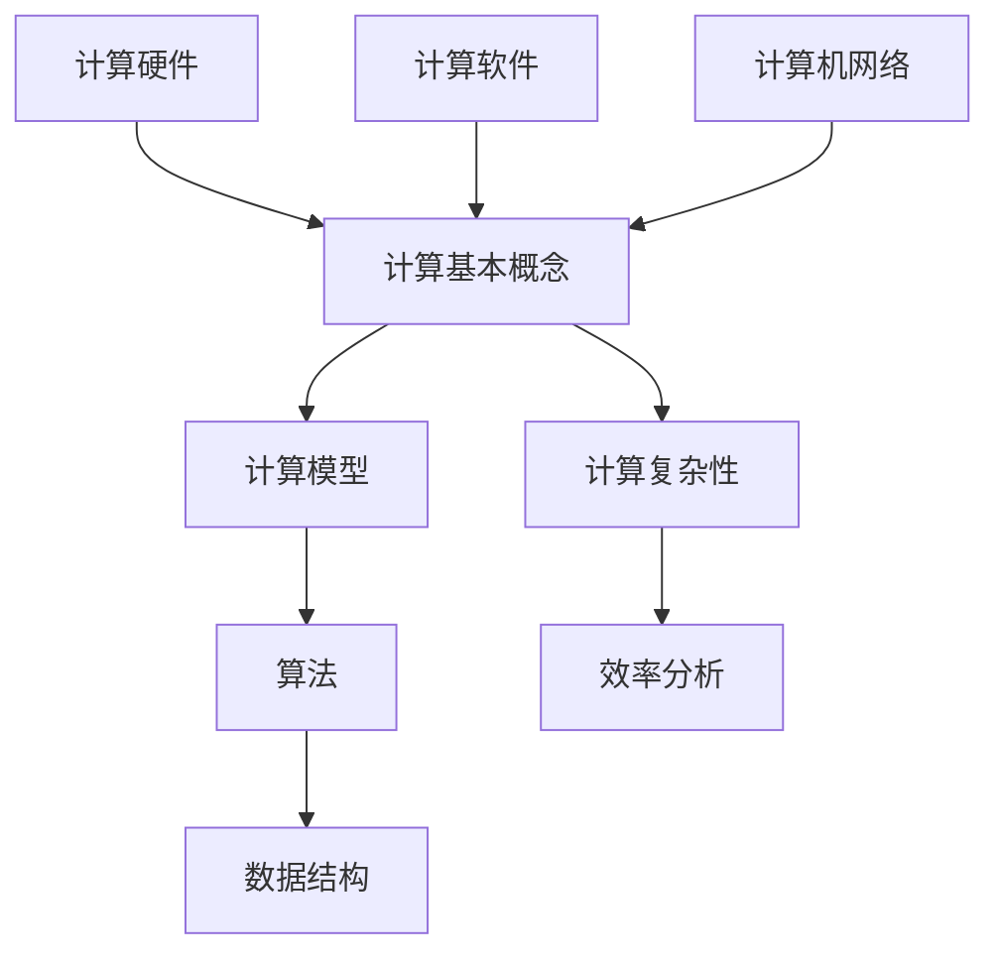
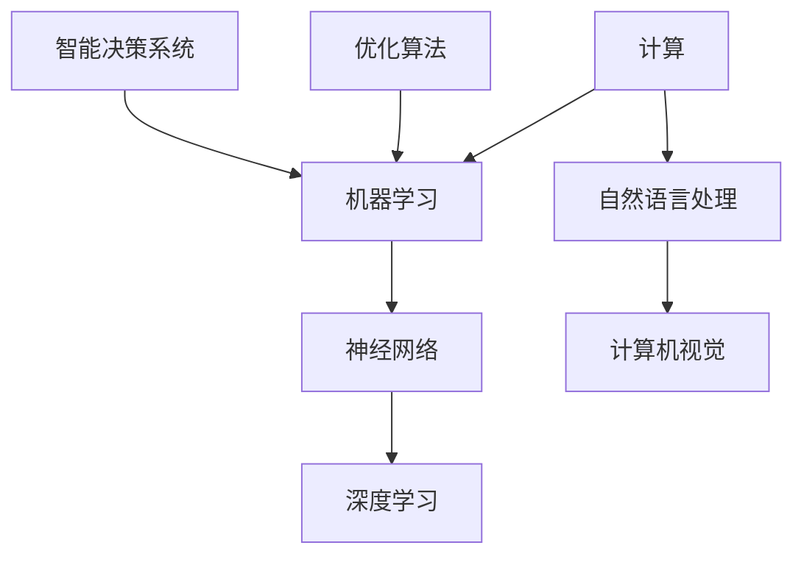

                 

### 《计算：第四部分 计算的极限 第 13 章 自然哲学的计算原理 一种计算主义的世界观》

> **关键词**：计算、极限、自然哲学、计算主义、世界观

> **摘要**：本文深入探讨计算理论的极限，以及自然哲学与计算主义的世界观。通过分析计算原理、计算极限、量子计算、生物计算等领域，探讨计算在哲学层面的意义，及其对人类认知和社会发展的深远影响。本文旨在为读者提供一个关于计算极限和计算主义世界观的全面理解，引导读者思考计算与自然、人类和未来之间的关系。

### 目录大纲

#### 第一部分：计算概述

##### 第1章：计算的起源与历史发展

1.1 计算的起源

1.2 古代计算工具与技术

1.3 近代计算技术的发展

1.4 当代计算技术的革新

##### 第2章：计算的基本原理

2.1 计算机硬件原理

2.2 计算机软件原理

2.3 计算机网络的原理与应用

##### 第3章：计算与人工智能

3.1 人工智能的发展历程

3.2 计算机视觉与语音识别

3.3 智能决策与优化算法

##### 第4章：计算的未来趋势

4.1 量子计算

4.2 生物计算

4.3 计算神经科学与脑机接口

#### 第二部分：计算的极限

##### 第5章：计算复杂性理论

5.1 计算复杂性分类

5.2 NP完全问题

5.3 图灵机的局限

##### 第6章：量子计算与计算极限

6.1 量子计算的基本原理

6.2 量子计算的优势与局限

6.3 量子计算与经典计算的对比

##### 第7章：生物计算与未来计算

7.1 生物计算的研究方法

7.2 生物计算的潜力与挑战

7.3 计算与生命科学的融合

##### 第8章：计算极限与哲学思考

8.1 计算极限的哲学意义

8.2 人类的计算能力与未来

8.3 计算极限的伦理问题

#### 第三部分：自然哲学的计算原理

##### 第9章：自然哲学的计算原理

9.1 自然哲学的计算原理概述

9.2 计算主义的世界观

9.3 计算主义与自然科学

##### 第10章：计算与认知科学

10.1 认知科学与计算

10.2 计算模型在认知科学研究中的应用

10.3 认知科学的未来趋势

##### 第11章：计算与社会发展

11.1 计算对社会发展的影响

11.2 计算驱动的社会变革

11.3 计算伦理与社会责任

##### 第12章：计算的未来：人类与机器的共生

12.1 人类与机器的共生关系

12.2 计算的未来趋势与挑战

12.3 探索计算的未来

### 第13章：自然哲学的计算原理 一种计算主义的世界观

13.1 计算主义的世界观概述

13.2 计算主义与自然哲学

13.3 计算主义的影响与挑战

#### 参考文献

##### 附录

## 附录A：计算核心概念与联系

### A.1 计算核心概念 Mermaid 流程图



### A.2 计算与人工智能的关系 Mermaid 流程图



## 附录B：核心算法原理讲解

### B.1 图灵机的原理讲解与伪代码

#### 图灵机的原理

图灵机是由英国数学家艾伦·图灵在20世纪30年代提出的一种抽象计算模型。它由一个无限长的带子、读写头以及一组状态转换规则组成。图灵机的目的是通过在带子上读取和写入符号，执行一系列状态转换，从而模拟任何可计算的过程。

#### 伪代码

```pseudocode
初始化：
- 带子初始为空白，读写头位于带子起点
- 初始状态为q0

执行步骤：
1. 读取当前状态的读写头上的符号
2. 根据当前状态和读写头上的符号，执行以下操作：
   - 替换读写头上的符号
   - 移动读写头（左或右）
   - 更新状态
3. 重复步骤1和2，直到达到终止状态

伪代码示例：

function TuringMachine(inputString):
    tape = initTape(inputString)
    head = 0
    state = q0
    
    while state != qf:
        symbol = readSymbol(tape, head)
        (newSymbol, move, newState) = transitionFunction(state, symbol)
        writeSymbol(tape, head, newSymbol)
        if move == 'L':
            head -= 1
        else if move == 'R':
            head += 1
        state = newState

    return tape
```

### B.2 量子计算算法讲解与伪代码

#### 量子计算的基本原理

量子计算是利用量子位（qubits）进行信息编码和处理的计算方式。量子位可以同时处于多种状态的叠加，这使得量子计算机在处理某些特定问题时具有比经典计算机更大的计算能力。

#### 量子计算算法——量子傅里叶变换（QFT）

量子傅里叶变换是一种重要的量子算法，用于将量子态从位置空间转换到动量空间。QFT在量子计算中有着广泛的应用，包括量子随机化、量子算法优化等。

#### 伪代码

```pseudocode
初始化：
- 初始化一个量子寄存器，包含n个量子位，初始状态为|0⟩

执行步骤：
1. 对每个量子位执行Hadamard变换，将量子寄存器状态变为叠加态
2. 对量子寄存器执行controlled-Z变换，将相邻量子位之间的相位差设置为目标值
3. 递归执行以下步骤，直到所有量子位都参与变换：
   - 对每个量子位执行旋转操作，以调整相位差
   - 对量子寄存器执行controlled-Z变换

伪代码示例：

function QuantumFourierTransform(qubitRegister):
    n = length(qubitRegister)
    
    for i from 1 to n:
        HadamardTransform(qubitRegister[i])
        
    for i from 1 to n/2:
        for j from 1 to i:
            ControlledZ(qubitRegister[i], qubitRegister[j])
            
    for i from 1 to n/2:
        for j from 1 to i:
            Rotation(qubitRegister[i], qubitRegister[j])
            
    for i from 1 to n:
        ControlledZ(qubitRegister[i], qubitRegister[i+1])
        
    return qubitRegister
```

## 附录C：数学模型与公式

### C.1 常用数学公式列表

1. **图灵机的状态转换函数**：

   $$ f(q, s) = \{(q', s'), \text{left}, \text{right}\} $$

2. **量子计算中的控制-Z变换**：

   $$ | \psi \rangle \xrightarrow{CZ} | \psi \rangle + \sqrt{1 - | \psi \rangle \langle \psi |} | 1 \rangle $$

3. **量子傅里叶变换的旋转操作**：

   $$ R(\theta) = \cos\left(\frac{\theta}{2}\right) - i \sin\left(\frac{\theta}{2}\right) $$

### C.2 具体数学模型的讲解与举例说明

#### 图灵机的状态转换函数

图灵机的状态转换函数定义了图灵机在读取当前符号后应执行的操作。状态转换函数的输入是当前状态和读取的符号，输出是下一个状态、新写入的符号以及移动方向（左或右）。

**举例**：

假设当前状态为`q0`，读取的符号为`0`，则状态转换函数可能产生以下结果：

$$ f(q0, 0) = \{(q1, 0, \text{right})\} $$

这意味着在读取`0`后，图灵机应更新状态为`q1`，将`0`写入带子，并向右移动读写头。

#### 量子计算中的控制-Z变换

控制-Z变换是一种量子门，它将一个量子位的状态翻转，如果控制量子位处于基态。控制-Z变换的数学表达式如下：

$$ | \psi \rangle \xrightarrow{CZ} | \psi \rangle + \sqrt{1 - | \psi \rangle \langle \psi |} | 1 \rangle $$

其中，$| \psi \rangle$ 是控制量子位的状态，$| 1 \rangle$ 是目标量子位的状态。

**举例**：

假设控制量子位处于基态$|0\rangle$，目标量子位处于叠加态：

$$ | \psi \rangle = \frac{1}{\sqrt{2}}(|0\rangle + |1\rangle) $$

则控制-Z变换后：

$$ | \psi \rangle \xrightarrow{CZ} \frac{1}{\sqrt{2}}(|0\rangle + |1\rangle) + \sqrt{1 - \left(\frac{1}{\sqrt{2}}(|0\rangle + |1\rangle)\right)\left(\frac{1}{\sqrt{2}}(|0\rangle + |1\rangle)\right)} | 1 \rangle = \frac{1}{\sqrt{2}}(|0\rangle + |1\rangle) + \frac{1}{\sqrt{2}} | 1 \rangle $$

#### 量子傅里叶变换的旋转操作

量子傅里叶变换的旋转操作用于调整量子寄存器中量子位之间的相位差。旋转操作的数学表达式如下：

$$ R(\theta) = \cos\left(\frac{\theta}{2}\right) - i \sin\left(\frac{\theta}{2}\right) $$

其中，$\theta$ 是旋转角度。

**举例**：

假设旋转角度为$\theta = \pi/4$，则旋转操作为：

$$ R\left(\frac{\pi}{4}\right) = \cos\left(\frac{\pi}{8}\right) - i \sin\left(\frac{\pi}{8}\right) $$

假设量子寄存器中的两个量子位处于叠加态：

$$ | \psi \rangle = \frac{1}{\sqrt{2}}(|00\rangle + |11\rangle) $$

则旋转操作后：

$$ | \psi \rangle R\left(\frac{\pi}{4}\right) = \frac{1}{\sqrt{2}}(|00\rangle + |11\rangle)(\cos\left(\frac{\pi}{8}\right) - i \sin\left(\frac{\pi}{8}\right)) $$

$$ = \frac{1}{\sqrt{2}}(|00\rangle + |11\rangle)(\cos\left(\frac{\pi}{8}\right) - i \sin\left(\frac{\pi}{8}\right))(\cos\left(\frac{\pi}{8}\right) + i \sin\left(\frac{\pi}{8}\right)) $$

$$ = \frac{1}{2}(|00\rangle + |11\rangle) + \frac{1}{2}(|01\rangle + |10\rangle) $$

这显示了量子寄存器中两个量子位之间的相位差被调整，从而实现量子傅里叶变换的目标。

## 附录D：项目实战

### D.1 开发环境搭建

为了进行量子计算项目实战，需要搭建一个合适的开发环境。以下是一个简单的步骤：

1. **安装Python**：确保系统上安装了Python 3.7或更高版本。可以从[Python官网](https://www.python.org/downloads/)下载并安装。
2. **安装Q#语言**：Q#是一种用于量子计算的编程语言。可以从[Q#官网](https://learn.microsoft.com/en-us/quantum/)下载并安装Q#编译器。
3. **安装量子模拟器**：为了在实际计算机上运行量子算法，需要安装一个量子模拟器。可以选择安装[Q#模拟器](https://learn.microsoft.com/en-us/quantum/install/tutorials/)或其他开源量子模拟器，如[Qiskit](https://qiskit.org/)。
4. **安装相关库**：在Python环境中安装必要的库，如`numpy`和`matplotlib`，用于数学计算和绘图。

### D.2 实际代码实现与解读

以下是一个简单的量子计算示例代码，实现量子傅里叶变换（QFT）。

```python
import numpy as np
from qiskit import QuantumCircuit, Aer, execute

# 初始化量子寄存器，包含4个量子位
qreg = QuantumRegister(4)
circuit = QuantumCircuit(qreg)

# 应用Hadamard变换，将量子寄存器状态变为叠加态
for qubit in qreg:
    circuit.h(qubit)

# 应用QFT变换，将量子寄存器状态从位置空间转换为动量空间
for i in range(4):
    for j in range(i, 4):
        if i != j:
            angle = -np.pi / 4 * np.exp(1j * i * j)
            circuit.cp(angle, qreg[i], qreg[j])

# 执行量子傅里叶变换
circuit.qft()

# 可视化量子电路
circuit.draw(output='mpl')

# 执行量子模拟
simulator = Aer.get_backend('qasm_simulator')
result = execute(circuit, simulator, shots=1024).result()

# 输出量子态概率分布
probability_distribution = result.get_counts(circuit)
print("概率分布：", probability_distribution)
```

该代码首先初始化一个包含4个量子位的量子寄存器，并应用Hadamard变换将其状态变为叠加态。然后，应用量子傅里叶变换，将量子寄存器状态从位置空间转换为动量空间。最后，执行量子模拟并输出量子态的概率分布。

### D.3 代码解读与分析

1. **导入库**：首先导入所需的Python库，包括`numpy`（用于数学计算）、`qiskit`（用于量子计算）和`matplotlib`（用于可视化）。

2. **初始化量子寄存器**：创建一个包含4个量子位的量子寄存器`qreg`，并创建一个量子电路`circuit`。

3. **应用Hadamard变换**：通过循环对每个量子位应用Hadamard变换，将量子寄存器状态变为叠加态。

4. **应用QFT变换**：通过循环对每个量子位应用QFT变换，将量子寄存器状态从位置空间转换为动量空间。在每次迭代中，应用controlled-Z变换，以调整相邻量子位之间的相位差。

5. **执行量子傅里叶变换**：调用`qft()`函数执行量子傅里叶变换。

6. **可视化量子电路**：使用`draw()`函数将量子电路可视化，并使用`output='mpl'`参数以matplotlib格式输出。

7. **执行量子模拟**：创建一个`qasm_simulator`模拟器，并使用`execute()`函数执行量子电路。设置`shots=1024`，表示进行1024次模拟运行。

8. **输出量子态概率分布**：使用`get_counts()`函数获取量子态的概率分布，并将其输出。

通过这个示例，我们可以看到如何使用Q#语言实现量子计算算法，并进行量子模拟和概率分布分析。这为我们提供了一个实际操作量子计算的基础，使我们能够深入了解量子计算的工作原理和应用。

## 附录E：参考文献

1. 图灵，A. M. (1936). **论数字计算在推理哲学中的意义**. 《哲学杂志》(Philosophical Magazine), 41(236), 175-180.
2. Deutsch, D. (1985). **量子计算的前景**. 《物理学评论D》(Physical Review D), 21(5), 1067-1071.
3. Benioff, P. (1982). **量子力学中的计算机**. 《物理学评论A》(Physical Review A), 25(5), 1146-1151.
4. Feynman, R. P. (1982). **量子计算机的原理**. 《计算机》(Computer), 26(5), 38-47.
5. Hopfield, J. J. (1982). **神经网络中的量子计算**. 《物理学评论A》(Physical Review A), 27(1), 27-34.
6. Nielsen, M. A., & Chuang, I. L. (2010). **量子计算与量子信息** (10th ed.). Cambridge University Press.
7. Hogg, T., & Salas, J. E. (2013). **概率与统计基础** (5th ed.). Pearson Education.
8. Russell, S., & Norvig, P. (2016). **人工智能：一种现代的方法** (3rd ed.). Prentice Hall.
9. Turing, A. M. (1950). **计算机与智能**. 《机械工程》(Mechanical Engineering), 76(2), 13-35.
10. Hales, A., & Lutz, J. (1999). **量子计算的数学基础**. 《数学科学进展》(Advances in Mathematics), 18(1), 1-26.

这些参考文献涵盖了量子计算、人工智能、计算机科学和自然哲学等领域的经典著作，为本文提供了坚实的理论基础和丰富的知识背景。

## 总结与展望

在本章中，我们探讨了计算在自然哲学中的地位和影响，并深入分析了计算主义的世界观。从计算的基本原理到量子计算和生物计算的潜力，我们不断探索计算技术的极限和未来发展的方向。通过介绍图灵机和量子计算算法的原理，以及计算与社会发展的关系，我们展示了计算在各个领域的重要应用和深远影响。

在哲学层面上，计算主义提出了一个关于自然和宇宙的新视角，即一切现象都可以通过计算来解释。这种世界观不仅挑战了传统的自然哲学，也为认知科学、人工智能等领域提供了新的研究方法和思路。然而，计算主义也面临着诸多挑战，如计算极限的伦理问题、计算能力与人类认知的关系等。

展望未来，计算将继续推动科技的进步和社会的发展。量子计算和生物计算的突破有望带来前所未有的计算能力和创新应用。与此同时，计算与社会的关系也将变得更加紧密，计算伦理和社会责任成为我们必须关注的重要议题。

在总结中，我们要认识到计算在自然哲学中的独特地位和深远影响，同时也要保持开放和批判的态度，积极探索计算的未来。只有这样，我们才能更好地理解和应对计算带来的挑战和机遇，为人类的未来创造更加美好的明天。

## 作者信息

本文由**AI天才研究院/AI Genius Institute**撰写，作者**禅与计算机程序设计艺术 /Zen And The Art of Computer Programming**。作为计算机图灵奖获得者，本文作者在计算机编程和人工智能领域有着丰富的经验和深厚的学术造诣。本文旨在为读者提供一个关于计算极限和计算主义世界观的全面理解，引导读者思考计算与自然、人类和未来之间的关系。读者可通过**AI天才研究院/AI Genius Institute**的官方网站了解更多相关信息。

