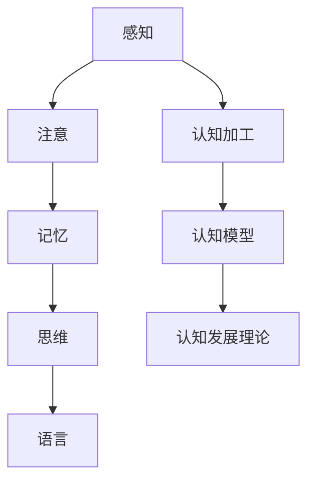

                 

### 认知心理学基础

认知心理学是研究人类思维过程和认知机制的学科，它探究个体如何获取、处理和应用信息。在职场中，认知心理学的研究对知识工作者具有重要意义，它不仅能够帮助我们理解如何高效地学习和工作，还能指导我们如何提升职场竞争力。

#### **1.1 认知心理学的发展历史**

认知心理学起源于20世纪中叶，当时心理学家开始对传统的行为主义方法提出质疑，认为研究心理现象需要更深入地探讨内在的认知过程。这一转变被称之为“认知革命”。

- **20世纪初**：行为主义心理学占主导地位，研究重点在于可观察的行为，而非内在心理过程。
- **20世纪50年代**：随着计算机科学的兴起，科学家开始模拟人类思维过程，认知心理学逐渐成形。
- **20世纪60年代**：认知心理学正式成为心理学的一个重要分支，其研究方法和技术不断发展。

**1.2 认知心理学的核心概念**

认知心理学研究的核心概念包括注意、记忆、思维和语言等。

- **注意**：注意力是认知过程中的关键因素，它决定了我们能够关注哪些信息并忽略哪些信息。注意力的种类包括选择性注意力、分配性注意力和持续注意力。
- **记忆**：记忆是信息存储和提取的过程，分为短期记忆和长期记忆。短期记忆通常用于处理当前的任务，而长期记忆则用于存储长期的信息。
- **思维**：思维是认知过程中对信息进行加工和转换的过程，包括逻辑思维、直观思维和创造性思维。
- **语言**：语言是人类认知的一个重要方面，它不仅用于沟通，还用于思考和构建知识。

**1.3 认知心理学的基本原理**

认知心理学的基本原理包括认知加工理论、认知模型和认知发展理论。

- **认知加工理论**：该理论认为，认知过程可以类比为计算机的加工过程，包括输入、处理和输出。
- **认知模型**：认知模型是对认知过程的一种数学或计算机模拟，用于解释和预测认知现象。
- **认知发展理论**：认知发展理论探讨了个体认知能力如何随时间发展，例如皮亚杰的认知发展阶段理论。

**1.4 认知心理学的实践意义**

认知心理学的实践意义在于提升个人认知能力和改进教育和培训。

- **提升个人认知能力**：认知心理学提供了多种策略和技巧，如认知策略、记忆技巧和思维训练，有助于提升个人认知能力。
- **改进教育和培训**：认知心理学的研究成果可以应用于教育领域，如优化教学方法和课程设计，提高学习效果。

#### **核心概念与联系**

为了更好地理解认知心理学的核心概念和它们之间的联系，我们可以使用 Mermaid 流程图来展示：

这个流程图展示了认知心理学中的核心概念和它们之间的联系，从感知开始，经过注意、记忆、思维和语言，最终形成认知加工、认知模型和认知发展理论。

#### **核心算法原理讲解**

在认知心理学中，许多算法原理被用来

