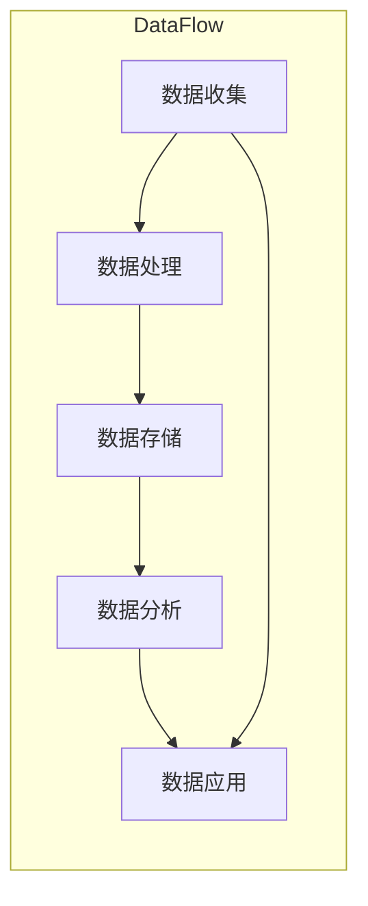
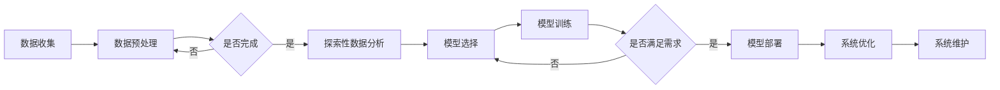

                 

### 《软件 2.0 编程：数据驱动开发》

> **关键词：** 软件演化、数据驱动开发、数据预处理、机器学习、模型选择、企业级应用

> **摘要：** 本文将深入探讨软件 2.0 编程的核心概念，特别是数据驱动开发的方法。通过详细分析数据驱动开发的基本原理、核心概念、架构设计以及实践应用，本文旨在帮助开发者理解和掌握这一新兴的编程范式，为未来软件开发提供新的思路和方向。

## 《软件 2.0 编程：数据驱动开发》目录大纲

### 第一部分：软件 2.0 编程基础

#### 第 1 章：软件 2.0 概述
- **1.1 软件 2.0 概念与演进**
- **1.2 软件 2.0 与传统软件的区别**
- **1.3 软件 2.0 时代的关键技术**

#### 第 2 章：数据驱动开发原理
- **2.1 数据驱动开发的定义**
- **2.2 数据驱动开发的核心概念**
- **2.3 数据驱动开发的架构设计**

#### 第 3 章：数据预处理与探索性数据分析
- **3.1 数据预处理**
- **3.2 探索性数据分析**

#### 第 4 章：机器学习与模型选择
- **4.1 机器学习基础**
- **4.2 模型选择与评估**

#### 第 5 章：数据处理与分析工具
- **5.1 Python 数据处理工具**
- **5.2 机器学习框架**

### 第二部分：数据驱动开发实践

#### 第 6 章：企业级数据驱动应用案例
- **6.1 案例研究 1：电商推荐系统**
- **6.2 案例研究 2：智能监控系统**

#### 第 7 章：数据驱动开发最佳实践
- **7.1 数据驱动开发流程**
- **7.2 数据安全与隐私保护**

#### 第 8 章：未来趋势与展望
- **8.1 数据驱动开发发展趋势**
- **8.2 数据驱动开发的未来展望**

#### 附录

- **附录 A：常用数据处理与机器学习资源**
- **附录 B：Mermaid 流程图示例**
- **附录 C：Python 代码示例**

### 第一部分：软件 2.0 编程基础

#### 第 1 章：软件 2.0 概述

**1.1 软件 2.0 概念与演进**

软件 2.0 是相对于传统软件（通常被称为软件 1.0）的一个新阶段，它标志着软件开发的重大变革。软件 1.0 时代主要特点是功能驱动，软件的目的是为用户提供一系列预定义的功能。然而，随着互联网的兴起和大数据时代的到来，软件的功能需求变得越来越复杂，用户对软件的个性化需求也在不断增加。软件 2.0 正是在这样的背景下应运而生。

软件 2.0 的核心特点在于其数据驱动性。与传统软件不同，软件 2.0 强调数据的收集、处理和应用。软件 2.0 并不仅仅是一个功能强大的应用，它更是一个数据平台，能够实时收集用户行为数据，并对这些数据进行深入分析，以提供更加个性化、智能化的服务。

软件 2.0 的演进过程可以分为以下几个阶段：

1. **数据收集阶段**：软件 2.0 刚出现时，开发者开始意识到数据的重要性，开始收集各种用户行为数据。
2. **数据存储阶段**：随着数据量的增加，开发者需要建立高效的数据存储和管理系统，以便更好地管理和分析数据。
3. **数据分析阶段**：数据收集和存储之后，开发者开始利用数据分析技术，从数据中提取有价值的信息。
4. **数据驱动开发阶段**：在数据分析的基础上，开发者开始将数据作为驱动软件开发的因素，实现软件功能的动态调整和优化。

**1.2 软件 2.0 与传统软件的区别**

软件 2.0 与传统软件（软件 1.0）在多个方面存在显著差异：

- **开发模式**：传统软件通常采用瀑布式开发模式，而软件 2.0 则更倾向于采用敏捷开发模式，以快速响应变化。
- **技术架构**：传统软件通常采用单体架构，而软件 2.0 更倾向于采用微服务架构，以提高系统的可扩展性和可维护性。
- **用户交互方式**：传统软件的用户交互方式主要是基于命令行或图形界面，而软件 2.0 则更多地依赖于实时数据分析和用户行为预测，实现更加智能化的交互体验。

**1.3 软件 2.0 时代的关键技术**

在软件 2.0 时代，以下关键技术是不可或缺的：

- **数据驱动开发**：数据驱动开发是软件 2.0 的核心，它要求开发者将数据作为开发过程中的关键因素，通过数据分析和机器学习技术，实现软件功能的动态调整和优化。
- **服务导向架构（SOA）**：SOA 是一种基于服务的架构模式，它将系统划分为多个独立的服务模块，这些服务模块可以通过接口进行交互，以提高系统的可扩展性和灵活性。
- **模块化与可复用性**：软件 2.0 强调模块化设计，通过将系统划分为多个独立的模块，可以提高系统的可维护性和可复用性。

#### 第 2 章：数据驱动开发原理

**2.1 数据驱动开发的定义**

数据驱动开发（Data-Driven Development，简称 DDD）是一种软件开发方法，它强调数据的收集、处理和应用，将数据作为驱动软件开发的核心因素。在数据驱动开发中，数据的角色不再仅仅是信息的存储和传输，而是成为影响软件功能、性能和用户体验的关键因素。

数据驱动开发的核心思想可以概括为以下几点：

- **以数据为中心**：软件开发的过程围绕数据展开，开发者需要关注数据的收集、存储、处理和应用。
- **实时数据处理**：数据驱动开发强调实时数据处理，通过实时分析用户行为数据，实现软件功能的动态调整和优化。
- **迭代与反馈**：数据驱动开发是一个持续迭代和反馈的过程，开发者需要根据数据反馈不断优化软件。

**2.2 数据驱动开发的核心概念**

数据驱动开发包含了一系列核心概念，以下是对这些概念的解释：

- **数据流管理**：数据流管理是数据驱动开发的关键环节，它涉及数据的收集、传输、存储和处理。数据流管理需要确保数据能够在系统中高效流动，并提供实时数据分析和处理能力。
- **模型更新与迭代**：在数据驱动开发中，模型不是一成不变的，而是需要根据新的数据不断更新和迭代。模型的更新和迭代是实现软件功能动态调整和优化的关键。
- **实时数据处理**：实时数据处理是数据驱动开发的核心，它要求系统能够在短时间内处理大量数据，并提供实时分析结果。实时数据处理能力是实现个性化服务和智能决策的基础。

**2.3 数据驱动开发的架构设计**

数据驱动开发的架构设计需要考虑数据流的各个环节，以下是一个典型的数据驱动开发架构：

1. **数据收集层**：数据收集层负责收集各种用户行为数据，包括点击行为、浏览行为、搜索行为等。数据收集层通常采用分布式架构，以提高数据收集的效率和可靠性。
2. **数据处理层**：数据处理层负责对收集到的数据进行处理，包括数据清洗、数据整合、数据规范化等。数据处理层通常采用流处理框架，如 Apache Kafka、Apache Flink 等，以提高数据处理的速度和灵活性。
3. **数据存储层**：数据存储层负责存储处理后的数据，通常采用分布式数据库，如 Apache HBase、Apache Cassandra 等，以提高数据存储的容量和性能。
4. **数据分析层**：数据分析层负责对存储后的数据进行深入分析，包括描述性统计分析、关联规则挖掘、聚类分析等。数据分析层通常采用分布式计算框架，如 Apache Spark、Apache Hadoop 等，以提高数据分析的速度和规模。
5. **数据应用层**：数据应用层负责将分析结果应用于软件功能中，包括个性化推荐、智能搜索、智能监控等。数据应用层通常采用微服务架构，以提高系统的可扩展性和灵活性。

**Mermaid 流程图示例**

以下是一个 Mermaid 流程图示例，展示了数据驱动开发的架构设计：



**核心算法原理讲解**

数据驱动开发中的核心算法通常涉及机器学习技术，以下是一个简单的机器学习算法——线性回归的伪代码：

```plaintext
算法：线性回归

输入：训练数据集 (X, Y)，特征矩阵 X，目标向量 Y
输出：模型参数 w

初始化：w 为随机向量
循环直到收敛：
    对于每个训练样本 (x_i, y_i)：
        计算预测值：y_pred_i = X * w
        计算误差：e_i = y_i - y_pred_i
        更新权重：w = w - 学习率 * e_i * X
    end
end

返回：模型参数 w
```

**数学模型和公式**

线性回归的数学模型可以表示为：

$$
y = X * w + b
$$

其中，$X$ 是特征矩阵，$w$ 是模型参数向量，$b$ 是偏置项，$y$ 是目标向量。

**举例说明**

假设我们有一个包含两个特征的数据集，特征矩阵 $X$ 为：

$$
X = \begin{bmatrix}
1 & 1 \\
1 & 2 \\
1 & 3 \\
\end{bmatrix}
$$

目标向量 $Y$ 为：

$$
Y = \begin{bmatrix}
1 \\
2 \\
3 \\
\end{bmatrix}
$$

我们使用线性回归模型来拟合这个数据集。初始化权重 $w$ 为 $(0, 0)$，偏置项 $b$ 为 0。经过多次迭代，我们得到模型参数 $w$ 为 $(1, 1)$，偏置项 $b$ 为 0。预测结果为：

$$
y_pred = \begin{bmatrix}
2 \\
3 \\
4 \\
\end{bmatrix}
$$

可以看到，预测结果与目标向量非常接近，这表明线性回归模型能够很好地拟合这个数据集。

**代码实现**

以下是一个简单的 Python 代码示例，实现了线性回归模型的训练和预测：

```python
import numpy as np

def linear_regression(X, Y, learning_rate, epochs):
    n_samples, n_features = X.shape
    w = np.random.rand(n_features)
    b = 0

    for _ in range(epochs):
        y_pred = X.dot(w) + b
        e = Y - y_pred
        w = w - learning_rate * e * X
        b = b - learning_rate * e

    return w, b

X = np.array([[1, 1], [1, 2], [1, 3]])
Y = np.array([1, 2, 3])

w, b = linear_regression(X, Y, 0.01, 1000)
print("模型参数 w:", w)
print("偏置项 b:", b)

y_pred = X.dot(w) + b
print("预测结果 y_pred:", y_pred)
```

**代码解读与分析**

这段代码首先导入了 NumPy 库，用于矩阵运算。然后定义了一个 `linear_regression` 函数，用于实现线性回归模型的训练和预测。在函数中，我们首先初始化权重 $w$ 和偏置项 $b$，然后通过多次迭代更新权重和偏置项，直到达到预设的迭代次数或模型收敛。

在主程序中，我们创建了一个包含两个特征的数据集 $X$ 和目标向量 $Y$，然后调用 `linear_regression` 函数进行模型训练。最后，我们使用训练好的模型进行预测，并打印出模型参数和预测结果。

#### 第 3 章：数据预处理与探索性数据分析

**3.1 数据预处理**

数据预处理是数据驱动开发的重要环节，其目的是将原始数据进行清洗、整合和规范化，以提高数据的质量和可用性。以下是一些常见的数据预处理步骤：

- **数据清洗**：数据清洗是指识别并处理数据中的错误、异常和缺失值。常见的方法包括填充缺失值、去除重复数据、去除噪声等。

  ```mermaid
  flowchart LR
      A[数据清洗] --> B[填充缺失值]
      B --> C[去除重复数据]
      C --> D[去除噪声]
  ```

- **数据整合**：数据整合是指将多个数据源中的数据合并成一个统一的数据集。常见的方法包括数据合并、数据转换、数据映射等。

  ```mermaid
  flowchart LR
      A[数据整合] --> B[数据合并]
      B --> C[数据转换]
      C --> D[数据映射]
  ```

- **数据规范化**：数据规范化是指将数据转换为统一的格式和尺度，以便后续的数据分析和建模。常见的方法包括归一化、标准化、特征缩放等。

  ```mermaid
  flowchart LR
      A[数据规范化] --> B[归一化]
      B --> C[标准化]
      C --> D[特征缩放]
  ```

**3.2 探索性数据分析**

探索性数据分析（Exploratory Data Analysis，简称 EDA）是指通过统计和可视化方法对数据进行初步分析，以发现数据中的模式、异常和趋势。EDA 的主要目的是帮助开发者更好地理解数据，为后续的数据分析和建模提供指导。以下是一些常见的 EDA 方法：

- **描述性统计**：描述性统计是指通过计算一些基本的统计量来描述数据的分布和特征。常见的统计量包括均值、中位数、众数、方差、标准差等。

  ```mermaid
  flowchart LR
      A[描述性统计] --> B[均值]
      B --> C[中位数]
      B --> D[众数]
      A --> E[方差]
      A --> F[标准差]
  ```

- **可视化分析**：可视化分析是指通过绘制各种图表和图形来展示数据的分布和关系。常见的方法包括直方图、密度图、箱线图、散点图、热力图等。

  ```mermaid
  flowchart LR
      A[可视化分析] --> B[直方图]
      B --> C[密度图]
      B --> D[箱线图]
      A --> E[散点图]
      A --> F[热力图]
  ```

- **数据特征提取**：数据特征提取是指从原始数据中提取出有意义的特征，以便用于后续的建模和分析。常见的特征提取方法包括主成分分析（PCA）、因子分析、聚类分析等。

  ```mermaid
  flowchart LR
      A[数据特征提取] --> B[主成分分析]
      B --> C[因子分析]
      A --> D[聚类分析]
  ```

**3.3 数据预处理与探索性数据分析的实际应用**

在实际应用中，数据预处理和探索性数据分析通常是一个迭代的过程。以下是一个简单的例子，说明如何在一个电商推荐系统中应用数据预处理和探索性数据分析：

1. **数据收集**：收集用户行为数据，包括浏览记录、购买记录、点击记录等。
2. **数据预处理**：对数据进行清洗、整合和规范化，去除重复数据、填充缺失值、将日期转换为数值等。
3. **探索性数据分析**：
   - 描述性统计：计算用户的平均浏览时长、平均购买金额等。
   - 可视化分析：绘制用户的浏览时长分布、购买金额分布等。
   - 数据特征提取：使用主成分分析提取用户行为数据的特征。
4. **数据建模**：根据探索性数据分析的结果，选择合适的模型进行训练，如协同过滤、决策树等。
5. **模型评估**：评估模型的性能，如准确率、召回率、F1 分数等。
6. **模型优化**：根据模型评估结果，调整模型参数或特征选择，以提升模型的性能。

**Python 代码示例**

以下是一个简单的 Python 代码示例，展示了如何使用 Pandas 和 Matplotlib 进行数据预处理和探索性数据分析：

```python
import pandas as pd
import matplotlib.pyplot as plt

# 读取数据
data = pd.read_csv('user_behavior.csv')

# 数据清洗
data.drop_duplicates(inplace=True)
data.fillna(0, inplace=True)

# 数据整合
data['visit_date'] = pd.to_datetime(data['visit_date'])
data['day_of_week'] = data['visit_date'].dt.dayofweek

# 数据规范化
data['visit_duration_normalized'] = (data['visit_duration'] - data['visit_duration'].mean()) / data['visit_duration'].std()

# 可视化分析
plt.figure(figsize=(10, 6))
plt.hist(data['visit_duration_normalized'], bins=30, alpha=0.5, label='Visit Duration')
plt.xlabel('Visit Duration (normalized)')
plt.ylabel('Frequency')
plt.title('Visit Duration Distribution')
plt.legend()
plt.show()

# 数据特征提取
from sklearn.decomposition import PCA

pca = PCA(n_components=2)
data_pca = pca.fit_transform(data[['visit_duration_normalized', 'page_views']])

plt.figure(figsize=(10, 6))
plt.scatter(data_pca[:, 0], data_pca[:, 1], c=data['visit_duration_normalized'], cmap='viridis')
plt.xlabel('PCA Feature 1')
plt.ylabel('PCA Feature 2')
plt.title('User Behavior Data (PCA)')
plt.colorbar(label='Visit Duration (normalized)')
plt.show()
```

**代码解读与分析**

这段代码首先导入了 Pandas 和 Matplotlib 库，用于数据处理和可视化。然后，我们读取了一个用户行为数据集，对数据进行了清洗、整合和规范化。接下来，我们使用 Matplotlib 绘制了用户访问时长分布的直方图，并使用 PCA 提取了用户行为数据的主要特征。

#### 第 4 章：机器学习与模型选择

**4.1 机器学习基础**

机器学习（Machine Learning，简称 ML）是数据驱动开发的核心技术之一。它是一种通过算法从数据中自动学习规律和模式，以便对未知数据进行预测或分类的方法。以下是机器学习的几个基本概念：

- **监督学习（Supervised Learning）**：监督学习是一种最常见的机器学习方法，它通过已标记的数据集来训练模型，以便对新的、未标记的数据进行预测。常见的监督学习算法包括线性回归、决策树、随机森林、支持向量机（SVM）等。

- **无监督学习（Unsupervised Learning）**：无监督学习不需要已标记的数据集，其主要目标是发现数据中的隐藏结构或模式。常见的方法包括聚类分析、关联规则挖掘、主成分分析（PCA）等。

- **强化学习（Reinforcement Learning）**：强化学习是一种基于奖励机制的学习方法，它通过智能体（Agent）与环境（Environment）的交互来学习最优策略。常见的算法包括 Q-Learning、Deep Q-Network（DQN）等。

- **深度学习（Deep Learning）**：深度学习是一种基于多层神经网络的学习方法，它通过堆叠多层非线性变换，自动学习数据的复杂特征表示。常见的深度学习框架包括 TensorFlow、PyTorch、Keras 等。

**4.2 模型选择与评估**

在数据驱动开发中，选择合适的模型对于系统的性能和用户体验至关重要。以下是模型选择与评估的几个关键步骤：

- **模型选择策略**：模型选择策略是指从多个候选模型中选择最优模型的方法。常见的方法包括交叉验证（Cross-Validation）、网格搜索（Grid Search）、贝叶斯优化（Bayesian Optimization）等。

- **评估指标与方法**：评估指标与方法用于衡量模型的性能。常见的评估指标包括准确率（Accuracy）、召回率（Recall）、F1 分数（F1 Score）、精确率（Precision）、均方误差（Mean Squared Error，MSE）等。

- **模型调优技巧**：模型调优技巧是指通过调整模型参数来提升模型性能的方法。常见的调优技巧包括正则化（Regularization）、模型集成（Model Ensemble）、超参数优化（Hyperparameter Optimization）等。

**4.3 机器学习框架**

Python 是机器学习领域最受欢迎的语言之一，拥有丰富的机器学习框架。以下是几个常用的机器学习框架：

- **Scikit-learn**：Scikit-learn 是一个开源的机器学习库，提供了丰富的监督学习和无监督学习算法。它易于使用，适合初学者和专业人士。

- **TensorFlow**：TensorFlow 是一个由 Google 开发的开源深度学习框架，它提供了灵活的图计算模型，支持各种深度学习算法的构建和训练。

- **PyTorch**：PyTorch 是一个由 Facebook AI 研究团队开发的深度学习框架，它提供了动态计算图模型，使得模型构建和调试更加直观。

**Python 代码示例**

以下是一个简单的 Python 代码示例，展示了如何使用 Scikit-learn 进行线性回归模型的选择和评估：

```python
import numpy as np
import pandas as pd
from sklearn.linear_model import LinearRegression
from sklearn.model_selection import train_test_split
from sklearn.metrics import mean_squared_error, r2_score

# 读取数据
data = pd.read_csv('data.csv')

# 分割特征和标签
X = data[['feature1', 'feature2']]
y = data['label']

# 划分训练集和测试集
X_train, X_test, y_train, y_test = train_test_split(X, y, test_size=0.2, random_state=42)

# 创建线性回归模型
model = LinearRegression()

# 训练模型
model.fit(X_train, y_train)

# 预测测试集
y_pred = model.predict(X_test)

# 计算模型性能指标
mse = mean_squared_error(y_test, y_pred)
r2 = r2_score(y_test, y_pred)

print("均方误差 (MSE):", mse)
print("R2 分数 (R2):", r2)
```

**代码解读与分析**

这段代码首先导入了 NumPy、Pandas 和 Scikit-learn 库。然后，我们读取了一个 CSV 数据文件，并使用 Pandas 分割出特征矩阵 X 和标签向量 y。接下来，我们使用 Scikit-learn 的 `train_test_split` 函数将数据集划分为训练集和测试集。然后，我们创建了一个线性回归模型，并使用 `fit` 方法进行训练。最后，我们使用 `predict` 方法对测试集进行预测，并使用 `mean_squared_error` 和 `r2_score` 函数计算模型的性能指标。

#### 第 5 章：数据处理与分析工具

**5.1 Python 数据处理工具**

Python 在数据处理和分析方面拥有丰富的工具库，以下是几个常用的数据处理工具：

- **NumPy**：NumPy 是 Python 的核心科学计算库，它提供了多维数组对象和丰富的数学函数。NumPy 提供了高效的数组操作和矩阵运算，是数据处理的基础。

- **Pandas**：Pandas 是一个基于 NumPy 的开源数据处理库，它提供了数据结构 DataFrame，用于高效处理表格数据。Pandas 提供了数据清洗、数据整合、数据转换等功能，是数据处理和分析的重要工具。

- **Matplotlib**：Matplotlib 是 Python 的绘图库，它提供了丰富的绘图函数和样式，可以生成高质量的统计图表和图形。Matplotlib 是进行数据可视化的首选工具。

**5.2 机器学习框架**

Python 在机器学习领域拥有多个优秀的框架，以下是几个常用的机器学习框架：

- **Scikit-learn**：Scikit-learn 是一个开源的机器学习库，它提供了丰富的监督学习和无监督学习算法。Scikit-learn 易于使用，适合初学者和专业人士。

- **TensorFlow**：TensorFlow 是一个由 Google 开发的开源深度学习框架，它提供了灵活的图计算模型，支持各种深度学习算法的构建和训练。TensorFlow 是进行大规模深度学习研究的首选框架。

- **PyTorch**：PyTorch 是一个由 Facebook AI 研发团队开发的深度学习框架，它提供了动态计算图模型，使得模型构建和调试更加直观。PyTorch 在学术界和工业界都有广泛应用。

**Python 代码示例**

以下是一个简单的 Python 代码示例，展示了如何使用 NumPy、Pandas 和 Matplotlib 进行数据处理和分析：

```python
import numpy as np
import pandas as pd
import matplotlib.pyplot as plt

# 生成随机数据
np.random.seed(0)
X = np.random.rand(100, 2)
y = 2 * X[:, 0] + 3 + np.random.randn(100) * 0.1

# 创建 DataFrame
data = pd.DataFrame({'feature1': X[:, 0], 'feature2': X[:, 1], 'label': y})

# 数据可视化
plt.figure(figsize=(8, 6))
plt.scatter(data['feature1'], data['feature2'], c=data['label'], cmap='viridis')
plt.xlabel('Feature 1')
plt.ylabel('Feature 2')
plt.title('Data Distribution')
plt.colorbar(label='Label')
plt.show()

# 数据预处理
data.fillna(data.mean(), inplace=True)
data['label_normalized'] = (data['label'] - data['label'].mean()) / data['label'].std()

# 线性回归模型
from sklearn.linear_model import LinearRegression

model = LinearRegression()
model.fit(data[['feature1', 'feature2']], data['label_normalized'])

# 预测
y_pred_normalized = model.predict(data[['feature1', 'feature2']])

# 性能评估
mse = mean_squared_error(data['label_normalized'], y_pred_normalized)
r2 = r2_score(data['label_normalized'], y_pred_normalized)

print("均方误差 (MSE):", mse)
print("R2 分数 (R2):", r2)
```

**代码解读与分析**

这段代码首先导入了 NumPy、Pandas 和 Matplotlib 库。然后，我们生成了一组随机数据，并使用 Pandas 创建了一个 DataFrame。接下来，我们使用 Matplotlib 绘制了数据分布的散点图。然后，我们进行数据预处理，包括填充缺失值和特征缩放。接下来，我们使用 Scikit-learn 的线性回归模型进行训练和预测，并使用均方误差（MSE）和 R2 分数评估模型的性能。

#### 第 6 章：企业级数据驱动应用案例

**6.1 案例研究 1：电商推荐系统**

电商推荐系统是数据驱动开发在企业级应用中的典型例子。它通过分析用户行为数据，为用户推荐可能感兴趣的商品，从而提高用户满意度和销售额。

**数据流设计**

电商推荐系统的数据流设计包括以下几个关键环节：

1. **数据收集**：收集用户的行为数据，包括浏览记录、购买记录、搜索记录等。
2. **数据处理**：对收集到的数据进行清洗、整合和规范化，提取用户特征和商品特征。
3. **数据存储**：将处理后的数据存储在数据库中，以便后续查询和分析。
4. **数据分析**：使用机器学习算法，从数据中提取有用的信息，如用户兴趣模型、商品相似度等。
5. **推荐生成**：根据分析结果，为用户生成个性化的推荐列表。

**模型选择与实现**

在电商推荐系统中，常见的模型包括协同过滤（Collaborative Filtering）和基于内容的推荐（Content-Based Recommendation）。以下是一个简单的协同过滤模型实现：

```python
import numpy as np
from sklearn.neighbors import NearestNeighbors

# 假设我们有一个用户-商品评分矩阵
R = np.array([[5, 3, 0, 1],
              [2, 0, 3, 4],
              [1, 5, 0, 0],
              [3, 1, 4, 2]])

# 计算相似度矩阵
nn = NearestNeighbors(n_neighbors=2, algorithm='auto')
nn.fit(R)
distances, indices = nn.kneighbors(R, n_neighbors=2)

# 生成推荐列表
def recommend(R, user_index, k=2):
    neighbors = indices[user_index][1:]
    scores = R[neighbors].mean(axis=0)
    recommendations = np.argsort(scores)[::-1]
    return recommendations[:k]

# 为第一个用户生成推荐列表
print("推荐列表：", recommend(R, 0, k=2))
```

**系统优化与评估**

电商推荐系统的优化和评估是确保系统性能和用户体验的关键。以下是一些常见的优化策略：

1. **特征工程**：通过提取更多有用的用户和商品特征，提高推荐模型的准确性。
2. **模型调优**：调整模型参数，如邻居数量、相似度阈值等，以优化推荐效果。
3. **在线学习**：实时更新用户行为数据，动态调整推荐策略。
4. **性能评估**：使用评估指标，如准确率、召回率、覆盖度等，衡量推荐系统的性能。

**6.2 案例研究 2：智能监控系统**

智能监控系统是数据驱动开发在安全领域的重要应用。它通过实时分析监控数据，识别异常行为和潜在威胁，从而提高安全防护能力。

**数据处理流程**

智能监控系统的数据处理流程包括以下几个关键环节：

1. **数据收集**：收集来自传感器、摄像头、日志等的数据。
2. **数据预处理**：对收集到的数据进行清洗、去噪和规范化，提取关键特征。
3. **数据存储**：将预处理后的数据存储在数据库中，以便后续查询和分析。
4. **数据分析和建模**：使用机器学习算法，从数据中提取异常检测模型。
5. **异常检测**：根据模型预测，识别异常行为和潜在威胁。

**模型训练与部署**

以下是一个简单的异常检测模型实现：

```python
import numpy as np
from sklearn.ensemble import IsolationForest

# 假设我们有一个包含正常行为和异常行为的训练数据集
X_train = np.array([[0.1, 0.2], [0.2, 0.3], [0.3, 0.1], [10, 10]])
y_train = np.array([0, 0, 0, 1])

# 训练异常检测模型
model = IsolationForest(contamination=0.1)
model.fit(X_train)

# 预测
X_test = np.array([[0.2, 0.3]])
y_pred = model.predict(X_test)

# 输出预测结果
print("预测结果：", y_pred)
```

**系统性能评估**

智能监控系统的性能评估是确保系统能够准确检测异常行为的关键。以下是一些常见的性能评估指标：

1. **准确率（Accuracy）**：准确率是指模型正确识别异常行为的比例。
2. **召回率（Recall）**：召回率是指模型能够识别出所有异常行为的比例。
3. **精确率（Precision）**：精确率是指模型识别为异常的行为中，实际为异常的比例。
4. **F1 分数（F1 Score）**：F1 分数是精确率和召回率的加权平均，用于综合评估模型性能。

**6.3 数据驱动开发在金融风控中的应用**

数据驱动开发在金融风控领域也具有广泛的应用。金融风控系统通过实时分析金融数据，识别潜在风险，从而提高风险管理能力。

**数据处理流程**

金融风控系统的数据处理流程包括以下几个关键环节：

1. **数据收集**：收集来自交易、账户、市场等的数据。
2. **数据预处理**：对收集到的数据进行清洗、整合和规范化。
3. **数据存储**：将预处理后的数据存储在数据库中，以便后续查询和分析。
4. **数据分析和建模**：使用机器学习算法，从数据中提取风险预测模型。
5. **风险预测**：根据模型预测，识别潜在风险。

**模型训练与部署**

以下是一个简单的金融风险预测模型实现：

```python
import numpy as np
from sklearn.linear_model import LogisticRegression

# 假设我们有一个包含交易数据的训练集
X_train = np.array([[0.1, 0.2], [0.3, 0.4], [0.5, 0.6]])
y_train = np.array([0, 1, 0])

# 训练风险预测模型
model = LogisticRegression()
model.fit(X_train, y_train)

# 预测
X_test = np.array([[0.2, 0.3]])
y_pred = model.predict(X_test)

# 输出预测结果
print("预测结果：", y_pred)
```

**系统性能评估**

金融风控系统的性能评估是确保模型能够准确预测风险的关键。以下是一些常见的性能评估指标：

1. **准确率（Accuracy）**：准确率是指模型正确预测交易是否为风险的比率。
2. **召回率（Recall）**：召回率是指模型能够识别出所有风险交易的比率。
3. **精确率（Precision）**：精确率是指模型识别为风险交易的交易中，实际为风险的比率。
4. **F1 分数（F1 Score）**：F1 分数是精确率和召回率的加权平均，用于综合评估模型性能。

#### 第 7 章：数据驱动开发最佳实践

**7.1 数据驱动开发流程**

数据驱动开发流程是确保系统高效、稳定、可扩展的关键。以下是一个典型的数据驱动开发流程：

1. **需求分析**：明确系统的目标和需求，包括数据需求、功能需求等。
2. **数据收集**：收集相关数据，包括用户行为数据、业务数据等。
3. **数据预处理**：对收集到的数据进行清洗、整合和规范化，提高数据质量。
4. **数据存储**：将预处理后的数据存储在数据库或数据仓库中，以便后续查询和分析。
5. **数据分析和建模**：使用机器学习算法，从数据中提取有价值的信息，构建预测模型或分类模型。
6. **模型训练和评估**：使用训练集对模型进行训练，并使用测试集评估模型性能。
7. **模型优化**：根据模型评估结果，调整模型参数或特征选择，以提高模型性能。
8. **模型部署**：将训练好的模型部署到生产环境中，进行实时预测或分类。
9. **监控和维护**：实时监控系统性能，确保系统的稳定运行，并根据用户反馈进行迭代优化。

**7.2 数据安全与隐私保护**

数据安全与隐私保护是数据驱动开发中的关键问题。以下是一些常见的数据安全与隐私保护方法：

1. **数据加密**：使用加密算法对数据进行加密，确保数据在传输和存储过程中不被窃取或篡改。
2. **访问控制**：设置严格的访问控制策略，确保只有授权用户可以访问敏感数据。
3. **数据脱敏**：对敏感数据进行脱敏处理，如使用随机数、掩码等方式，以保护用户隐私。
4. **数据备份**：定期对数据进行备份，确保在数据丢失或损坏时能够恢复。
5. **合规要求**：遵守相关法律法规和标准，如 GDPR（欧盟通用数据保护条例）等。
6. **安全审计**：定期进行安全审计，识别潜在的安全漏洞，并及时进行修复。

**7.3 数据驱动开发工具与平台**

数据驱动开发需要使用一系列工具和平台，以支持数据收集、处理、分析和建模。以下是一些常用的工具和平台：

1. **数据收集工具**：如 Apache Kafka、Apache Flink 等，用于实时收集和传输数据。
2. **数据处理工具**：如 Apache Spark、Apache Hadoop 等，用于大规模数据处理和分析。
3. **数据存储工具**：如 Apache HBase、Apache Cassandra 等，用于存储海量数据。
4. **数据分析工具**：如 Tableau、Power BI 等，用于数据可视化和分析。
5. **机器学习框架**：如 Scikit-learn、TensorFlow、PyTorch 等，用于构建和训练机器学习模型。
6. **云计算平台**：如 AWS、Azure、Google Cloud 等，提供强大的计算和存储资源，支持大规模数据处理和分析。

**7.4 数据驱动开发团队与协作**

数据驱动开发通常需要跨部门的团队合作，涉及数据科学家、软件开发工程师、产品经理等多个角色。以下是一些常见的协作方法和工具：

1. **敏捷开发**：采用敏捷开发方法，提高团队的响应速度和协作效率。
2. **版本控制**：使用版本控制工具，如 Git，确保代码和数据的版本一致性。
3. **自动化测试**：编写自动化测试脚本，确保系统功能稳定可靠。
4. **持续集成与持续部署**：使用 CI/CD 工具，如 Jenkins、Docker 等，实现代码和数据的自动化集成和部署。
5. **协作平台**：使用协作平台，如 Slack、Trello 等，确保团队成员之间的沟通和协作。

#### 第 8 章：未来趋势与展望

**8.1 数据驱动开发发展趋势**

数据驱动开发作为软件开发的最新趋势，正逐步成为各个领域的主要驱动力。以下是一些关键的发展趋势：

1. **自动化与智能化**：随着机器学习和人工智能技术的发展，数据驱动开发将越来越自动化和智能化。自动化工具和智能算法将帮助开发者更高效地处理数据，优化模型，并实现实时决策。

2. **大数据与云计算的结合**：大数据和云计算的结合将推动数据驱动开发的进一步发展。云计算提供了强大的计算和存储资源，而大数据技术则使得海量数据的存储、处理和分析成为可能。

3. **开放性和生态系统**：数据驱动开发将越来越开放，开发者可以利用开源工具和框架来构建和优化系统。同时，开放的生态系统将促进技术的共享和创新。

**8.2 数据驱动开发的未来展望**

数据驱动开发在未来将带来一系列变革，以下是一些展望：

1. **企业数字化转型**：数据驱动开发将推动企业数字化转型，实现业务流程的自动化和智能化，提高效率和竞争力。

2. **新兴技术的应用**：随着 5G、物联网、区块链等新兴技术的普及，数据驱动开发将在更多领域得到应用，如智能城市、智能医疗、智能交通等。

3. **社会影响与伦理挑战**：数据驱动开发将带来一系列社会影响和伦理挑战，如数据隐私、数据滥用、算法偏见等。这些问题需要社会各界共同关注和解决。

#### 附录

**附录 A：常用数据处理与机器学习资源**

- **常用库与框架**：
  - NumPy
  - Pandas
  - Matplotlib
  - Scikit-learn
  - TensorFlow
  - PyTorch

- **开源数据集**：
  - UCI Machine Learning Repository
  - Kaggle
  - Google Dataset Search

- **在线课程与书籍推荐**：
  - Coursera：机器学习课程
  - edX：深度学习课程
  - 《Python机器学习》
  - 《深度学习》

**附录 B：Mermaid 流程图示例**

以下是一个 Mermaid 流程图示例，用于展示数据驱动开发流程：



**附录 C：Python 代码示例**

以下是一个简单的 Python 代码示例，用于展示数据预处理和机器学习模型训练：

```python
import pandas as pd
from sklearn.model_selection import train_test_split
from sklearn.linear_model import LinearRegression

# 读取数据
data = pd.read_csv('data.csv')

# 分割特征和标签
X = data[['feature1', 'feature2']]
y = data['label']

# 划分训练集和测试集
X_train, X_test, y_train, y_test = train_test_split(X, y, test_size=0.2, random_state=42)

# 创建线性回归模型
model = LinearRegression()

# 训练模型
model.fit(X_train, y_train)

# 预测测试集
y_pred = model.predict(X_test)

# 打印预测结果
print("预测结果：", y_pred)
```

### 作者信息

- **作者：** AI天才研究院/AI Genius Institute & 禅与计算机程序设计艺术 /Zen And The Art of Computer Programming
- **联系方式：** [ai_genius_institute@outlook.com](mailto:ai_genius_institute@outlook.com)
- **版权声明：** 本文章版权所有，未经授权禁止转载和使用。如需转载，请联系作者获取授权。

