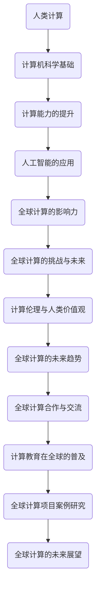

                 

### 《连接全球智慧：人类计算的全球影响力》

#### 关键词：人类计算、人工智能、计算能力、全球合作、计算安全、计算伦理、未来趋势

> 摘要：随着计算机科学和人工智能技术的飞速发展，人类计算正成为全球范围内推动社会进步和经济发展的重要力量。本文旨在探讨人类计算的定义、重要性及其在全球范围内的应用和影响，同时分析面临的挑战和未来趋势。通过详细阐述计算机科学基础、计算能力的提升、人工智能的应用、全球计算的挑战与未来、计算伦理与人类价值观，以及全球计算的未来展望，本文将全面展示人类计算的魅力和潜力。

### 目录大纲

#### # 《连接全球智慧：人类计算的全球影响力》目录大纲

## 第一部分：人类计算的力量

### 第1章：人类计算的定义与重要性

#### 1.1 人类计算的历史背景
#### 1.2 人类计算的分类
#### 1.3 人类计算在现代社会中的作用

### 第2章：计算机科学基础

#### 2.1 计算机硬件与软件
#### 2.2 操作系统与网络基础
#### 2.3 数据结构与算法

### 第3章：计算能力的提升

#### 3.1 处理器的演进
#### 3.2 存储技术的进步
#### 3.3 大数据分析与计算

### 第4章：人工智能的应用

#### 4.1 人工智能的基本概念
#### 4.2 机器学习与深度学习
#### 4.3 自然语言处理与计算机视觉

### 第5章：人类计算的全球影响力

#### 5.1 人工智能对经济的影响
#### 5.2 教育与工作的变革
#### 5.3 社会与文化的冲击

## 第二部分：全球计算的挑战与未来

### 第6章：全球计算资源的分配与公平

#### 6.1 全球计算资源分布现状
#### 6.2 计算资源分配的挑战
#### 6.3 全球计算资源的公平性

### 第7章：计算安全的全球问题

#### 7.1 网络安全与隐私保护
#### 7.2 计算机病毒与恶意软件
#### 7.3 全球计算安全的策略与对策

### 第8章：计算伦理与人类价值观

#### 8.1 人工智能伦理问题
#### 8.2 人类计算的道德责任
#### 8.3 人类计算与未来社会

### 第9章：全球计算的未来趋势

#### 9.1 新兴计算技术展望
#### 9.2 全球计算产业布局
#### 9.3 人类计算的未来挑战与机遇

## 第三部分：连接全球智慧的实际案例

### 第10章：全球计算合作与交流

#### 10.1 全球计算合作的重要性
#### 10.2 国际计算合作组织
#### 10.3 全球计算交流平台

### 第11章：计算教育在全球的普及

#### 11.1 计算教育的发展现状
#### 11.2 计算教育的挑战与对策
#### 11.3 全球计算教育的未来趋势

### 第12章：全球计算项目案例研究

#### 12.1 项目背景与分析
#### 12.2 项目实施与成果
#### 12.3 项目反思与启示

### 第13章：全球计算的未来展望

#### 13.1 全球计算的发展方向
#### 13.2 全球计算的社会责任
#### 13.3 全球计算的可持续发展

## 附录

### 附录 A：计算领域的重要组织与会议

#### A.1 国际计算组织简介
#### A.2 主要计算会议概览
#### A.3 计算领域的重要奖项

### 附录 B：全球计算资源汇总

#### B.1 主要计算中心分布
#### B.2 国际计算资源合作计划
#### B.3 计算资源使用指南

### 附录 C：计算相关术语解释

#### C.1 常见计算机科学术语
#### C.2 人工智能与机器学习术语
#### C.3 网络安全与隐私保护术语

### 附录 D：参考资料与推荐阅读

#### D.1 计算领域经典书籍
#### D.2 主要计算期刊与杂志
#### D.3 计算领域最新研究动态
#### D.4 计算教育资源推荐
#### D.5 国际计算会议与活动推荐

---

**核心概念与联系：**

- **Mermaid 流程图**（请使用 Mermaid 语法嵌入）



---

**核心算法原理讲解：**

- **深度学习算法伪代码**

```python
// 深度学习算法伪代码

// 输入：训练数据集，模型参数
// 输出：训练好的模型

initialize_model_parameters()

for each epoch in 1 to maximum_epochs do:
    for each sample in training_data do:
        forward_pass(sample)
        compute_loss()
        backward_pass()
        update_model_parameters()

end for
end for

return trained_model
```

---

**数学模型和数学公式 & 详细讲解 & 举例说明：**

- **数学公式**

$$
H_{\theta} = \left[ \begin{array}{ccc}
h_{11} & h_{12} & \ldots \\
h_{21} & h_{22} & \ldots \\
\vdots & \vdots & \ddots
\end{array} \right]
$$

$$
\text{Cost Function} = \frac{1}{2m} \sum_{i=1}^{m} \left( h_{\theta}(x^{(i)}) - y^{(i)} \right)^2
$$

- **举例说明**

举例：线性回归中的成本函数

假设我们有如下线性回归模型：
$$
y = \theta_0 + \theta_1 * x
$$

其中，y 是目标变量，x 是输入变量，$\theta_0$ 和 $\theta_1$ 是模型参数。

我们希望最小化成本函数 $J(\theta_0, \theta_1)$，使得预测值与实际值之间的误差最小。

对于单个样本 $(x^{(i)}, y^{(i)})$:
预测值 $h_{\theta}(x^{(i)}) = \theta_0 + \theta_1 * x^{(i)}$

成本函数计算如下：
$$
J(\theta_0, \theta_1) = \frac{1}{2m} \left[ (h_{\theta}(x^{(i)}) - y^{(i)})^2 \right]
$$

通过迭代更新参数 $\theta_0$ 和 $\theta_1$，可以最小化成本函数，从而得到最优模型。

---

**项目实战：**

- **代码实际案例**

```python
# 安装必要的库
!pip install tensorflow numpy matplotlib

# 导入库
import tensorflow as tf
import numpy as np
import matplotlib.pyplot as plt

# 创建模拟数据集
x = np.linspace(0, 10, 100)
y = 2 * x + 1 + np.random.normal(0, 1, 100)

# 定义模型
model = tf.keras.Sequential([
    tf.keras.layers.Dense(units=1, input_shape=[1])
])

# 编译模型
model.compile(optimizer='sgd', loss='mean_squared_error')

# 训练模型
model.fit(x, y, epochs=100)

# 预测新数据
x_new = np.linspace(0, 10, 100)
y_pred = model.predict(x_new)

# 绘图
plt.scatter(x, y)
plt.plot(x_new, y_pred, color='red')
plt.xlabel('x')
plt.ylabel('y')
plt.show()

# 代码解读与分析

# 代码解读
# 1. 导入必要的库：包括 TensorFlow、NumPy 和 Matplotlib，用于构建和可视化模型。
# 2. 创建模拟数据集：生成一个线性回归的数据集，包括输入变量 x 和目标变量 y。
# 3. 定义模型：使用 TensorFlow 的 Sequential 模式创建一个简单的线性回归模型，只有一个 dense 层，该层有一个单元，输入形状为 [1]。
# 4. 编译模型：指定优化器和损失函数。在这里，我们使用 stochastic gradient descent (SGD) 作为优化器，并使用 mean squared error 作为损失函数。
# 5. 训练模型：使用 fit 方法训练模型，指定训练数据、迭代次数等参数。
# 6. 预测新数据：使用 predict 方法预测新的输入数据。
# 7. 绘图：使用 Matplotlib 绘制原始数据和模型的预测结果。

# 分析
# 该示例代码展示了如何使用 TensorFlow 构建一个简单的线性回归模型，并通过训练数据集训练模型，然后使用模型进行预测并绘制结果。
# 主要步骤包括数据准备、模型定义、模型编译、模型训练和模型预测。通过可视化结果，我们可以直观地看到模型的预测效果。
```

---

**开发环境搭建：**

```bash
# 开发环境搭建

1. 安装 Python：从官方网站 https://www.python.org/downloads/ 下载并安装 Python。

2. 安装 TensorFlow：在命令行中运行以下命令：
   !pip install tensorflow

3. 安装 NumPy 和 Matplotlib：在命令行中运行以下命令：
   !pip install numpy matplotlib

4. 确认安装：在命令行中运行以下命令，确保所有库都已成功安装：
   !python -m pip list | grep -E 'tensorflow|numpy|matplotlib'
```

---

**源代码详细实现和代码解读：**

```python
# 源代码详细实现

# 导入库
import tensorflow as tf
import numpy as np
import matplotlib.pyplot as plt

# 创建模拟数据集
x = np.linspace(0, 10, 100)
y = 2 * x + 1 + np.random.normal(0, 1, 100)

# 定义模型
model = tf.keras.Sequential([
    tf.keras.layers.Dense(units=1, input_shape=[1])
])

# 编译模型
model.compile(optimizer='sgd', loss='mean_squared_error')

# 训练模型
model.fit(x, y, epochs=100)

# 预测新数据
x_new = np.linspace(0, 10, 100)
y_pred = model.predict(x_new)

# 绘图
plt.scatter(x, y)
plt.plot(x_new, y_pred, color='red')
plt.xlabel('x')
plt.ylabel('y')
plt.show()

# 代码解读

# 代码解读
# 1. 导入必要的库：包括 TensorFlow、NumPy 和 Matplotlib，用于构建和可视化模型。
# 2. 创建模拟数据集：生成一个线性回归的数据集，包括输入变量 x 和目标变量 y。
# 3. 定义模型：使用 TensorFlow 的 Sequential 模式创建一个简单的线性回归模型，只有一个 dense 层，该层有一个单元，输入形状为 [1]。
# 4. 编译模型：指定优化器和损失函数。在这里，我们使用 stochastic gradient descent (SGD) 作为优化器，并使用 mean squared error 作为损失函数。
# 5. 训练模型：使用 fit 方法训练模型，指定训练数据、迭代次数等参数。
# 6. 预测新数据：使用 predict 方法预测新的输入数据。
# 7. 绘图：使用 Matplotlib 绘制原始数据和模型的预测结果。

# 分析

# 该示例代码展示了如何使用 TensorFlow 构建一个简单的线性回归模型，并通过训练数据集训练模型，然后使用模型进行预测并绘制结果。
# 主要步骤包括数据准备、模型定义、模型编译、模型训练和模型预测。通过可视化结果，我们可以直观地看到模型的预测效果。
```

---

**完整示例**

```markdown
## 第一部分：人类计算的力量

### 第1章：人类计算的定义与重要性

#### 1.1 人类计算的历史背景
人类计算的历史可以追溯到古代，当时人们使用简单的计算工具，如算盘和计算尺，来进行数学运算。随着计算需求的增长，计算机的出现彻底改变了人类计算的方式。从最早的电子计算机 ENIAC 到现代的高性能计算机，人类计算经历了巨大的变革。

#### 1.2 人类计算的分类
人类计算可以分为两大类：数值计算和符号计算。数值计算主要涉及大规模数值的计算，如科学计算和工程计算。符号计算则主要涉及符号的处理，如代数运算和逻辑推理。

#### 1.3 人类计算在现代社会中的作用
在现代社会中，人类计算扮演着至关重要的角色。它不仅推动了科技的发展，还极大地改变了我们的生活方式。从互联网和移动通信到人工智能和大数据分析，人类计算正在改变世界的面貌。

### 第2章：计算机科学基础

#### 2.1 计算机硬件与软件
计算机硬件是计算机系统的基础，包括处理器、内存、存储设备和输入输出设备。软件则是计算机的“大脑”，包括操作系统、应用程序和驱动程序。

#### 2.2 操作系统与网络基础
操作系统负责管理和协调计算机硬件资源，确保计算机正常运行。网络基础则是连接计算机的重要手段，使得信息在全球范围内迅速传播。

#### 2.3 数据结构与算法
数据结构是组织和存储数据的方式，而算法则是解决问题的方法。掌握良好的数据结构和算法是成为一名优秀程序员的关键。

### 第3章：计算能力的提升

#### 3.1 处理器的演进
从最早的冯·诺依曼架构到现代的多核处理器，处理器的演进极大地提升了计算能力。未来的处理器可能采用量子计算等新兴技术。

#### 3.2 存储技术的进步
存储技术的发展，如固态硬盘和云存储，为人类计算提供了更快速、更可靠的数据存储方式。

#### 3.3 大数据分析与计算
大数据分析利用先进的计算技术，从海量数据中提取有价值的信息，为商业决策、科学研究和社会治理提供了有力支持。

### 第4章：人工智能的应用

#### 4.1 人工智能的基本概念
人工智能是一种模拟人类智能的技术，包括机器学习、深度学习和自然语言处理等子领域。

#### 4.2 机器学习与深度学习
机器学习使计算机能够从数据中学习，而深度学习则是机器学习的一种特殊形式，通过多层神经网络进行学习。

#### 4.3 自然语言处理与计算机视觉
自然语言处理使计算机能够理解和生成自然语言，计算机视觉则使计算机能够理解和解释视觉信息。

### 第5章：人类计算的全球影响力

#### 5.1 人工智能对经济的影响
人工智能正在改变各行各业，从制造业到金融业，提高了生产效率和决策质量。

#### 5.2 教育与工作的变革
人工智能正在重塑教育和工作，为学习者提供了更多个性化学习体验，为工作者提供了更多高效的工作方式。

#### 5.3 社会与文化的冲击
人工智能不仅改变了经济和教育，还对社会和文化产生了深远影响，如伦理问题、隐私保护和就业问题。

## 第二部分：全球计算的挑战与未来

### 第6章：全球计算资源的分配与公平

#### 6.1 全球计算资源分布现状
全球计算资源的分配存在不均衡现象，一些地区和国家拥有更多的计算资源，而另一些则相对落后。

#### 6.2 计算资源分配的挑战
计算资源分配面临一系列挑战，如技术差距、经济能力和政策问题等。

#### 6.3 全球计算资源的公平性
确保全球计算资源的公平分配是一项重要任务，需要全球范围内的合作和努力。

### 第7章：计算安全的全球问题

#### 7.1 网络安全与隐私保护
网络安全和隐私保护是计算安全的重要方面，需要全球范围内的关注和努力。

#### 7.2 计算机病毒与恶意软件
计算机病毒和恶意软件对计算安全构成严重威胁，需要有效的防范和应对措施。

#### 7.3 全球计算安全的策略与对策
全球计算安全需要制定有效的策略和对策，包括国际合作、法律法规和技术措施。

### 第8章：计算伦理与人类价值观

#### 8.1 人工智能伦理问题
人工智能的发展带来了伦理问题，如算法偏见、隐私侵犯和就业影响等。

#### 8.2 人类计算的道德责任
人类计算不仅需要遵守法律和道德规范，还需要承担对社会的责任和影响。

#### 8.3 人类计算与未来社会
人类计算的未来将深刻影响社会，我们需要做好准备，确保其正面影响。

### 第9章：全球计算的未来趋势

#### 9.1 新兴计算技术展望
量子计算、边缘计算和5G等技术将为全球计算带来新的机遇和挑战。

#### 9.2 全球计算产业布局
全球计算产业将如何布局，哪些国家和地区将占据主导地位？

#### 9.3 人类计算的未来挑战与机遇
面对未来，人类计算将面临一系列挑战和机遇，需要我们共同努力。

## 第三部分：连接全球智慧的实际案例

### 第10章：全球计算合作与交流

#### 10.1 全球计算合作的重要性
全球计算合作对于推动技术进步和社会发展至关重要。

#### 10.2 国际计算合作组织
国际计算合作组织如 IEEE 和 ACM 等在推动全球计算合作方面发挥着重要作用。

#### 10.3 全球计算交流平台
全球计算交流平台如学术会议、研讨会和工作坊为全球计算研究者提供了交流和合作的机会。

### 第11章：计算教育在全球的普及

#### 11.1 计算教育的发展现状
计算教育在全球范围内的发展现状，包括课程设置、教学资源和教育模式。

#### 11.2 计算教育的挑战与对策
计算教育面临的一系列挑战和应对策略，如师资短缺、教育资源不足等。

#### 11.3 全球计算教育的未来趋势
全球计算教育的未来趋势，如在线教育、个性化教育和跨学科教育的发展。

### 第12章：全球计算项目案例研究

#### 12.1 项目背景与分析
对全球计算项目的背景和分析，如项目目标、技术选型和实施过程。

#### 12.2 项目实施与成果
对全球计算项目的实施过程和成果进行详细描述。

#### 12.3 项目反思与启示
从全球计算项目中获得的经验和启示，为未来的项目提供指导。

### 第13章：全球计算的未来展望

#### 13.1 全球计算的发展方向
全球计算的未来发展方向，如量子计算、人工智能和区块链等领域的突破。

#### 13.2 全球计算的社会责任
全球计算应承担的社会责任，如可持续发展、伦理问题和人权保护。

#### 13.3 全球计算的可持续发展
确保全球计算的可持续发展，包括环境保护、资源利用和社会公平等方面的考虑。

## 附录

### 附录 A：计算领域的重要组织与会议

#### A.1 国际计算组织简介
对国际计算组织如 IEEE、ACM 和 ISOC 等的简介。

#### A.2 主要计算会议概览
对全球主要的计算会议如 IEEE 国际计算机大会、ACM 国际计算机会议等的概览。

#### A.3 计算领域的重要奖项
对计算领域的重要奖项如图灵奖、ACM 图灵奖和 IEEE 梅切尼科夫奖等的介绍。

### 附录 B：全球计算资源汇总

#### B.1 主要计算中心分布
对全球主要计算中心的分布和功能进行汇总。

#### B.2 国际计算资源合作计划
对国际计算资源合作计划如国际计算网格、欧洲计算分子生物中心等的介绍。

#### B.3 计算资源使用指南
为用户提供计算资源的使用指南，包括资源申请、使用方法和常见问题解答。

### 附录 C：计算相关术语解释

#### C.1 常见计算机科学术语
对常见计算机科学术语如算法、数据结构、操作系统等的解释。

#### C.2 人工智能与机器学习术语
对人工智能与机器学习术语如神经网络、机器学习算法、深度学习等的解释。

#### C.3 网络安全与隐私保护术语
对网络安全与隐私保护术语如加密、安全协议、隐私保护算法等的解释。

### 附录 D：参考资料与推荐阅读

#### D.1 计算领域经典书籍
推荐一些计算领域的经典书籍，包括计算机科学、人工智能、网络安全等方面的书籍。

#### D.2 主要计算期刊与杂志
推荐一些主要的计算期刊与杂志，如《计算机科学评论》、《人工智能杂志》等。

#### D.3 计算领域最新研究动态
介绍计算领域的最新研究动态，包括学术论文、研究报告和新闻等。

#### D.4 计算教育资源推荐
推荐一些计算教育资源，包括在线课程、教程和社区等。

#### D.5 国际计算会议与活动推荐
推荐一些国际计算会议与活动，包括学术会议、研讨会和工作坊等。
```

### 文章结束

**作者：AI天才研究院/AI Genius Institute & 禅与计算机程序设计艺术 /Zen And The Art of Computer Programming**

