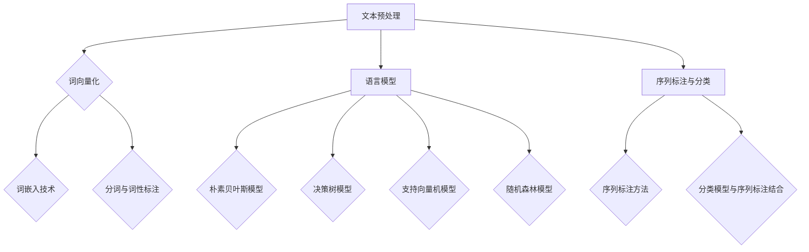

                 

# 《通过自然语言创建工作流的构想》

> 关键词：自然语言处理、工作流、自动化、文本预处理、语言模型、序列标注

> 摘要：本文将探讨如何利用自然语言处理技术创建高效的工作流。首先介绍自然语言处理的基础知识，包括文本预处理、语言模型和序列标注。然后，讨论如何将这些技术应用于工作流设计，以及如何实现工作流自动化。最后，通过案例研究和未来展望，展示该领域的应用前景和挑战。

---

# 《通过自然语言创建工作流的构想》目录大纲

## 第一部分：自然语言处理基础

### 第1章：自然语言处理概述

#### 1.1 自然语言处理的定义与意义

自然语言处理（Natural Language Processing，NLP）是计算机科学和人工智能领域的一个分支，旨在让计算机能够理解和处理人类语言。这一领域的研究包括对文本数据进行分析、理解和生成，使得机器能够与人类进行有效的沟通。

#### 1.2 自然语言处理的发展历史

自然语言处理的研究可以追溯到20世纪50年代。最初，研究者们尝试通过编程实现简单的语言理解功能，如机器翻译和文本分类。随着计算机性能的提升和算法的进步，NLP领域取得了显著的进展，特别是在过去几十年中。

#### 1.3 自然语言处理的关键技术

自然语言处理的关键技术包括文本预处理、语言模型、序列标注和分类。文本预处理是NLP的基础，涉及文本的清洗、分词、词性标注等。语言模型用于预测文本序列的概率分布，常见的有朴素贝叶斯模型、决策树模型和神经网络模型。序列标注是对文本序列中的每个词进行分类，常见的任务有命名实体识别和词性标注。分类是将文本分配到不同的类别，如垃圾邮件检测和情感分析。

## 第二部分：工作流设计与实现

### 第5章：工作流概述

#### 5.1 工作流的基本概念

工作流是一系列任务的有序集合，这些任务可以由一个人或一组人完成。工作流的目的是提高工作效率，确保任务的正确执行。工作流可以包括各种任务，如数据收集、处理、存储和报告生成。

#### 5.2 工作流的关键组件

工作流的关键组件包括任务、流程控制、资源管理和任务执行。任务是一系列操作，可以是人或机器完成的。流程控制定义了任务的执行顺序和条件。资源管理涉及对硬件、软件和网络资源的分配和管理。任务执行是任务的执行过程，可以是自动化的或手动完成的。

#### 5.3 工作流的设计原则

工作流的设计应遵循以下原则：模块化、可重用性、灵活性和可扩展性。模块化使得工作流可以分解为较小的、独立的部分，便于维护和更新。可重用性确保工作流中的组件可以在不同的场景中重复使用。灵活性允许工作流根据需求进行调整。可扩展性确保工作流可以适应新的任务和需求。

## 第二部分：自然语言创建工作流

### 第6章：自然语言创建工作流

#### 6.1 自然语言创建工作流的方法

自然语言创建工作流的方法主要包括两种：手工编写和自动生成。手工编写工作流通常由专业人员进行，根据业务需求设计工作流的各个部分。自动生成工作流利用自然语言处理技术，从文本中提取任务和流程控制信息，自动生成工作流。

#### 6.2 自然语言创建工作流的挑战与解决方案

自然语言创建工作流面临的主要挑战包括语义理解、上下文理解和错误处理。语义理解是指从文本中提取任务的含义。上下文理解是指从文本中提取任务之间的依赖关系。错误处理是指处理文本中的错误和不完整信息。

解决这些挑战的方法包括：使用深度学习模型进行语义理解，使用语言模型进行上下文理解，使用容错算法处理错误。

#### 6.3 工作流中的自然语言理解与生成

自然语言理解与生成是自然语言创建工作流的核心。自然语言理解是指从文本中提取信息，生成机器可理解的任务和流程控制信息。自然语言生成是指将机器处理的结果转化为人类可读的文本。

### 第7章：工作流自动化

#### 7.1 工作流自动化的概念与价值

工作流自动化是指利用计算机技术，自动执行工作流中的任务。工作流自动化的价值包括提高工作效率、减少人工错误、降低运营成本和提升业务灵活性。

#### 7.2 自动化工具的选择与配置

自动化工具的选择取决于工作流的需求和现有资源。常见的自动化工具包括脚本语言、集成开发环境和流程管理平台。配置自动化工具需要考虑工作流的复杂度、执行频率和可靠性。

#### 7.3 工作流自动化的实现与优化

工作流自动化的实现涉及编写脚本、配置自动化工具和集成各个组件。优化工作流自动化包括性能优化、错误处理和监控。

### 第8章：案例研究

#### 8.1 案例一：基于自然语言的工作流自动化

案例一介绍如何使用自然语言处理技术实现一个简单的工作流自动化。该工作流自动化包括文本预处理、任务提取和自动化执行。

#### 8.2 案例二：跨平台工作流的构建

案例二展示如何构建一个跨平台的工作流，包括在不同操作系统和设备上执行任务。

#### 8.3 案例三：实时数据分析工作流

案例三介绍如何使用工作流自动化进行实时数据分析，包括数据收集、处理和报告生成。

## 第三部分：未来展望

### 第9章：自然语言处理与工作流的发展趋势

#### 9.1 未来技术的发展方向

未来，自然语言处理与工作流的发展方向包括：更先进的自然语言理解与生成技术、更高效的工作流自动化工具和更智能的工作流管理平台。

#### 9.2 工作流应用的创新点

工作流应用的创新点包括：基于人工智能的工作流优化、自动化智能客服和自动化生产调度。

#### 9.3 潜在的挑战与解决思路

未来，自然语言处理与工作流领域面临的挑战包括：大规模数据的处理、实时数据处理和跨平台的兼容性。解决思路包括：使用分布式计算、流数据处理技术和跨平台框架。

### 第10章：总结与展望

#### 10.1 本书内容的总结

本书介绍了自然语言处理与工作流的基本概念、技术和应用。通过案例研究和未来展望，展示了该领域的应用前景和挑战。

#### 10.2 自然语言处理与工作流的发展前景

自然语言处理与工作流具有广泛的应用前景，将在各个领域发挥重要作用。随着技术的进步，该领域将不断取得新的突破。

#### 10.3 对读者的建议

读者可以通过学习本书，掌握自然语言处理与工作流的基础知识。实际应用中，读者可以根据业务需求，设计和实现适合自己的工作流。

## 附录

### 附录A：自然语言处理与工作流相关工具与资源

附录A介绍了一些自然语言处理与工作流相关的工具与资源，包括开源工具、云服务与平台和社区与论坛资源。

---

接下来，我们将分别详细介绍第一部分和第二部分的内容。

---

## 第一部分：自然语言处理基础

### 第1章：自然语言处理概述

#### 1.1 自然语言处理的定义与意义

自然语言处理（NLP）是计算机科学和人工智能领域的一个分支，主要研究如何使计算机能够理解和生成人类语言。它旨在实现人与机器之间的自然语言交流，提高信息处理效率和智能化水平。

自然语言处理的定义可以概括为：利用计算机技术和人工智能算法，对自然语言（如英语、中文等）进行识别、理解、处理和生成的过程。

#### 1.2 自然语言处理的发展历史

自然语言处理的研究可以追溯到20世纪50年代。当时，研究者们开始探索如何让计算机理解和翻译人类语言。以下是一些重要的历史事件：

- 1950年，艾伦·图灵提出了著名的图灵测试，用于评估机器是否能够模拟人类的思维过程。
- 1954年，哈里·霍夫斯塔德和威廉·诺伊曼编写了第一个计算机翻译程序，将英语翻译成俄语。
- 1960年代，肯尼斯·科尔森等人开发了早期的大型自然语言处理系统，如“ STRATOCAT”和“SHRDLU”。
- 1980年代，统计方法和机器学习方法开始应用于自然语言处理，如隐马尔可夫模型（HMM）和决策树。
- 2000年代，深度学习技术在自然语言处理领域取得了突破性进展，如循环神经网络（RNN）和长短期记忆网络（LSTM）。
- 当前，随着人工智能技术的快速发展，自然语言处理在语音识别、机器翻译、文本生成等领域取得了广泛应用。

#### 1.3 自然语言处理的关键技术

自然语言处理的关键技术主要包括以下几个方面：

1. **文本预处理**：文本预处理是NLP的基础，包括文本的清洗、分词、词性标注等。文本清洗是指去除文本中的噪声和无关信息，如HTML标签、标点符号和停用词。分词是将文本分解为单个词汇或单词的过程。词性标注是对文本中的每个词进行分类，如名词、动词、形容词等。

2. **语言模型**：语言模型用于预测文本序列的概率分布。常见的语言模型有朴素贝叶斯模型、决策树模型、支持向量机模型和神经网络模型。语言模型在文本生成、机器翻译和情感分析等领域有广泛应用。

3. **序列标注与分类**：序列标注是对文本序列中的每个词进行分类，如命名实体识别（NER）和词性标注。分类是将文本分配到不同的类别，如垃圾邮件检测和情感分析。序列标注和分类在文本分类和情感分析等领域有重要应用。

4. **深度学习**：深度学习是一种基于多层神经网络的学习方法，在自然语言处理领域取得了广泛应用。常见的深度学习模型包括循环神经网络（RNN）、长短期记忆网络（LSTM）和Transformer等。

5. **注意力机制**：注意力机制是一种用于提高神经网络模型性能的技术，通过关注重要的输入信息，提高模型的表示能力。注意力机制在机器翻译、文本生成和图像识别等领域有广泛应用。

### 第2章：文本预处理

#### 2.1 文本清洗

文本清洗是NLP的重要步骤，目的是去除文本中的噪声和无关信息，提高文本质量。常见的文本清洗方法包括：

- **去除HTML标签**：使用正则表达式或HTML解析库去除HTML标签。
- **去除标点符号**：使用正则表达式去除标点符号，或将其替换为空格。
- **去除停用词**：停用词是指对文本分类和语义分析没有贡献的词，如“的”、“了”、“和”等。可以使用停用词列表或文本统计方法去除停用词。
- **去除重复文本**：使用字符串匹配算法去除重复的文本片段。
- **文本规范化**：将文本转换为统一的格式，如小写、去除特殊字符等。

#### 2.2 词向量化

词向量化是将文本中的词转化为向量表示的过程。词向量表示了词的语义信息，便于在计算机中进行处理。常见的词向量化方法包括：

- **基于词频的方法**：使用词频（TF）或词频-逆文档频率（TF-IDF）将词转化为向量。
- **基于分布的方法**：使用词在语料库中的分布信息，如Word2Vec、GloVe等。
- **基于语义的方法**：使用语义相似度或文本分类方法将词转化为向量。

#### 2.3 分词与词性标注

分词是将文本分解为单个词汇或单词的过程。词性标注是对文本中的每个词进行分类，如名词、动词、形容词等。常见的分词与词性标注方法包括：

- **基于规则的方法**：使用语言学规则和词典进行分词和词性标注，如常用的中文分词工具“结巴分词”。
- **基于统计的方法**：使用统计方法进行分词和词性标注，如使用基于最大熵模型的分词工具。
- **基于深度学习的方法**：使用神经网络模型进行分词和词性标注，如BERT、GPT等。

### 第3章：语言模型

#### 3.1 语言模型的基本概念

语言模型（Language Model）是NLP中用于预测文本序列的概率分布的模型。语言模型的基本概念包括：

- **词汇表**：语言模型中的词汇表包含所有可能的词汇。
- **概率分布**：语言模型预测的是文本序列的概率分布，即给定一个词汇表，预测下一个词出现的概率。
- **词汇概率**：语言模型为每个词汇分配一个概率，用于计算文本序列的概率。

#### 3.2 朴素贝叶斯模型

朴素贝叶斯模型（Naive Bayes Model）是一种基于贝叶斯定理的分类模型，广泛应用于文本分类、情感分析等领域。朴素贝叶斯模型的假设条件包括：

- **条件独立性**：每个词的概率独立于其他词的概率。
- **先验概率**：每个词的先验概率是根据语料库中的词频计算的。
- **条件概率**：每个词的条件概率是根据语料库中的词对频次计算的。

#### 3.3 决策树模型

决策树模型（Decision Tree Model）是一种基于特征和阈值进行分类或回归的模型。决策树模型的基本概念包括：

- **特征**：决策树中的每个节点代表一个特征。
- **阈值**：每个节点使用一个阈值将特征空间划分为两个子集。
- **叶子节点**：决策树的叶子节点代表分类或回归结果。

#### 3.4 支持向量机模型

支持向量机模型（Support Vector Machine，SVM）是一种用于分类和回归的模型，通过最大化分类边界上的间隔来提高分类性能。SVM的基本概念包括：

- **特征空间**：SVM将输入特征映射到高维特征空间。
- **间隔**：SVM通过最大化分类边界上的间隔来提高分类性能。
- **支持向量**：支持向量是那些对分类边界有最大贡献的样本。

#### 3.5 随机森林模型

随机森林模型（Random Forest Model）是一种基于决策树的集成模型，通过构建多棵决策树，并对预测结果进行投票或取平均来提高分类或回归性能。随机森林模型的基本概念包括：

- **决策树**：随机森林中的每棵决策树都是通过随机抽样特征和样本构建的。
- **集成**：随机森林通过对多棵决策树的预测结果进行投票或取平均来提高分类或回归性能。

### 第4章：序列标注与分类

#### 4.1 序列标注的基本概念

序列标注（Sequence Labeling）是对文本序列中的每个词进行分类的过程。序列标注的基本概念包括：

- **标注任务**：序列标注任务可以包括命名实体识别（NER）、词性标注（POS）等。
- **标注标签**：序列标注中的每个词都有一个对应的标签，用于表示其类别。
- **标注模型**：序列标注模型通常使用神经网络或统计模型，如CRF（条件随机场）或LSTM（长短期记忆网络）。

#### 4.2 序列标注方法

序列标注方法可以分为基于规则的方法和基于模型的方法：

- **基于规则的方法**：基于规则的方法使用预定义的规则进行序列标注，如正则表达式和词典匹配。
- **基于模型的方法**：基于模型的方法使用机器学习模型进行序列标注，如CRF、LSTM和BERT。

#### 4.3 分类模型与序列标注的结合

分类模型与序列标注可以结合使用，以提高序列标注的性能。常见的方法包括：

- **联合训练**：将分类模型和序列标注模型联合训练，以同时优化两者的性能。
- **层次标注**：将序列标注视为一个层次结构，先进行粗粒度的分类标注，再进行细粒度的序列标注。
- **交叉验证**：使用交叉验证方法评估序列标注模型的性能，以提高模型泛化能力。

## 第二部分：工作流设计与实现

### 第5章：工作流概述

#### 5.1 工作流的基本概念

工作流（Workflow）是一系列任务的有序集合，这些任务可以由一个人或一组人完成。工作流的目的是提高工作效率，确保任务的正确执行。工作流可以包括各种任务，如数据收集、处理、存储和报告生成。

工作流的基本概念包括：

- **任务**：工作流中的基本操作，可以是人或机器完成的。
- **流程**：任务之间的执行顺序和依赖关系。
- **流程控制**：定义任务的执行顺序和条件。
- **资源**：工作流中使用的硬件、软件和网络资源。
- **执行**：任务的执行过程，可以是自动化的或手动完成的。

#### 5.2 工作流的关键组件

工作流的关键组件包括任务、流程控制、资源管理和任务执行：

- **任务**：工作流中的基本操作，可以是人或机器完成的。任务可以包括数据收集、处理、存储和报告生成等。
- **流程控制**：定义任务的执行顺序和条件。流程控制可以包括顺序执行、并行执行、条件执行和循环执行等。
- **资源管理**：对工作流中使用的硬件、软件和网络资源进行分配和管理。资源管理可以包括资源预留、资源分配和资源释放等。
- **任务执行**：任务的执行过程，可以是自动化的或手动完成的。任务执行可以包括脚本执行、程序调用和人工干预等。

#### 5.3 工作流的设计原则

设计工作流应遵循以下原则：

- **模块化**：将工作流分解为较小的、独立的部分，便于维护和更新。
- **可重用性**：设计可重用的工作流组件，以便在不同场景中重复使用。
- **灵活性**：设计灵活的工作流，以便根据需求进行调整。
- **可扩展性**：设计可扩展的工作流，以适应新的任务和需求。

### 第6章：自然语言创建工作流

#### 6.1 自然语言创建工作流的方法

自然语言创建工作流的方法主要包括两种：手工编写和自动生成。

- **手工编写**：手工编写工作流通常由专业人员进行，根据业务需求设计工作流的各个部分。手工编写工作流具有较好的控制性和灵活性，但效率较低。
- **自动生成**：自动生成工作流利用自然语言处理技术，从文本中提取任务和流程控制信息，自动生成工作流。自动生成工作流具有高效性和自动化程度高，但可能存在准确性问题。

#### 6.2 自然语言创建工作流的挑战与解决方案

自然语言创建工作流面临的主要挑战包括：

- **语义理解**：从文本中准确提取任务和流程控制信息，需要解决语义理解问题。语义理解包括词语的语义解析、语境分析和意图识别等。
  - **解决方案**：使用深度学习模型（如BERT、GPT）进行语义理解，提高文本的解析精度。结合上下文信息，使用上下文嵌入（Contextual Embedding）技术，提高词语的语义表示能力。
- **上下文理解**：理解文本中的上下文关系，以便正确生成工作流。上下文理解包括词语之间的语义关系、句子之间的逻辑关系和时间关系等。
  - **解决方案**：使用自然语言处理技术（如关系抽取、指代消解）提取文本中的上下文信息。使用图神经网络（Graph Neural Networks，GNN）构建文本的语义图，提高上下文理解能力。
- **错误处理**：文本中可能存在错误或不完整信息，导致工作流生成错误。错误处理包括错误检测、错误纠正和错误恢复等。
  - **解决方案**：使用错误检测算法（如基于规则的错误检测和基于统计的错误检测）识别文本中的错误。使用错误纠正算法（如基于模板的错误纠正和基于深度学习的错误纠正）纠正文本中的错误。使用错误恢复算法（如基于上下文的错误恢复和基于策略的错误恢复）恢复文本中的错误。

#### 6.3 工作流中的自然语言理解与生成

自然语言理解与生成是自然语言创建工作流的核心。

- **自然语言理解**：自然语言理解是从文本中提取任务和流程控制信息的过程。自然语言理解包括语义解析、意图识别和任务提取等。
  - **语义解析**：从文本中提取语义信息，将自然语言描述转化为计算机可理解的形式。语义解析可以包括词语的语义解析、句子语义解析和篇章语义解析等。
  - **意图识别**：识别文本的意图，确定文本所描述的任务或动作。意图识别可以包括任务意图识别、动作意图识别和事件意图识别等。
  - **任务提取**：从文本中提取任务描述，确定工作流中的任务。任务提取可以包括任务名称提取、任务参数提取和任务依赖提取等。
- **自然语言生成**：自然语言生成是将计算机处理结果转化为人类可读的文本的过程。自然语言生成可以包括文本摘要、文本生成和对话生成等。
  - **文本摘要**：从长文本中提取关键信息，生成简洁的文本摘要。文本摘要可以包括抽取式摘要和生成式摘要等。
  - **文本生成**：根据给定的输入，生成新的文本。文本生成可以包括文本生成模型（如GPT）、文本到文本的生成（如机器翻译）等。
  - **对话生成**：根据用户的输入，生成相应的回复。对话生成可以包括基于规则的方法和基于深度学习的方法等。

### 第7章：工作流自动化

#### 7.1 工作流自动化的概念与价值

工作流自动化（Workflow Automation）是指利用计算机技术和自动化工具，自动执行工作流中的任务。工作流自动化的价值包括：

- **提高工作效率**：自动化工具可以快速执行重复性任务，提高工作效率。
- **减少人工错误**：自动化工具可以减少人工干预，降低错误率。
- **降低运营成本**：自动化工具可以减少人力成本，提高运营效率。
- **提升业务灵活性**：自动化工具可以快速适应业务需求的变化，提高业务灵活性。

#### 7.2 自动化工具的选择与配置

选择合适的自动化工具是实现工作流自动化的关键。自动化工具的选择取决于工作流的需求和现有资源。常见的自动化工具包括：

- **脚本语言**：如Python、JavaScript和Shell等，适用于简单的任务自动化。
- **集成开发环境（IDE）**：如Visual Studio Code、PyCharm等，适用于复杂的编程任务。
- **流程管理平台**：如Apache Airflow、Kubernetes等，适用于复杂的工作流管理和调度。
- **云服务与平台**：如AWS Lambda、Google Cloud Functions等，适用于云计算和函数即服务（Function as a Service，FaaS）。

配置自动化工具需要考虑以下几个方面：

- **任务执行环境**：配置合适的操作系统、编程语言和依赖库。
- **任务调度**：配置任务的执行时间和依赖关系。
- **资源管理**：配置任务所需的计算资源、存储资源和网络资源。
- **错误处理**：配置任务的错误处理策略，如重试、告警和回滚等。

#### 7.3 工作流自动化的实现与优化

实现工作流自动化需要以下步骤：

- **需求分析**：分析业务需求，明确需要自动化的任务和流程。
- **设计工作流**：设计工作流的结构，确定任务之间的执行顺序和依赖关系。
- **选择工具**：根据需求选择合适的自动化工具。
- **编写脚本**：编写自动化脚本，实现任务自动化。
- **测试与调试**：测试自动化脚本，调试和优化工作流。

优化工作流自动化可以从以下几个方面进行：

- **性能优化**：优化任务的执行速度和资源利用率。
- **错误处理**：改进错误的检测、处理和恢复机制。
- **可扩展性**：设计可扩展的工作流，以便适应新的任务和需求。
- **安全性**：确保自动化工作流的安全性，防止数据泄露和恶意攻击。

### 第8章：案例研究

#### 8.1 案例一：基于自然语言的工作流自动化

案例一介绍如何使用自然语言处理技术实现一个简单的工作流自动化。该工作流自动化包括文本预处理、任务提取和自动化执行。

- **文本预处理**：使用自然语言处理技术对文本进行清洗、分词和词性标注，提取文本中的关键信息。
- **任务提取**：使用自然语言处理技术从文本中提取任务描述，确定工作流中的任务。
- **自动化执行**：使用自动化工具（如Python脚本）执行提取到的任务，完成工作流自动化。

#### 8.2 案例二：跨平台工作流的构建

案例二展示如何构建一个跨平台的工作流，包括在不同操作系统和设备上执行任务。

- **任务定义**：定义工作流中的任务，包括任务名称、执行环境、输入输出等。
- **任务调度**：使用流程管理平台（如Apache Airflow）调度任务，确保任务在不同操作系统和设备上按照预定顺序执行。
- **任务执行**：使用自动化工具（如Shell脚本、Docker容器）在不同的操作系统和设备上执行任务。

#### 8.3 案例三：实时数据分析工作流

案例三介绍如何使用工作流自动化进行实时数据分析，包括数据收集、处理和报告生成。

- **数据收集**：使用传感器和数据采集工具实时收集数据。
- **数据处理**：使用数据处理工具（如Apache Spark）对实时数据进行处理，提取关键指标。
- **报告生成**：使用报告生成工具（如Tableau）将处理结果生成可视化报告，便于分析和决策。

### 第9章：自然语言处理与工作流的发展趋势

#### 9.1 未来技术的发展方向

未来，自然语言处理与工作流的发展方向包括：

- **更先进的自然语言理解与生成技术**：随着深度学习技术的不断进步，自然语言理解与生成技术将更加先进，包括语义理解、上下文理解和生成式对话等。
- **更高效的工作流自动化工具**：自动化工具将更加高效，支持大规模数据流处理和实时任务调度。
- **更智能的工作流管理平台**：工作流管理平台将更加智能，具备自我优化、故障检测和自我修复能力。

#### 9.2 工作流应用的创新点

未来，工作流应用的创新点包括：

- **基于人工智能的工作流优化**：利用人工智能技术对工作流进行优化，提高任务执行效率。
- **自动化智能客服**：利用自然语言处理技术构建自动化智能客服系统，提高客户服务质量。
- **自动化生产调度**：利用自然语言处理技术实现自动化生产调度，提高生产效率。

#### 9.3 潜在的挑战与解决思路

未来，自然语言处理与工作流领域面临的挑战包括：

- **大规模数据处理**：随着数据量的增长，如何处理大规模数据成为挑战。解决思路包括分布式计算、并行处理和增量处理等。
- **实时数据处理**：实时数据处理要求系统能够快速响应，如何在保证响应速度的同时处理实时数据成为挑战。解决思路包括流数据处理、内存计算和分布式缓存等。
- **跨平台兼容性**：如何在不同的操作系统和设备上运行工作流，实现跨平台兼容性成为挑战。解决思路包括容器化、虚拟化和云原生技术等。

### 第10章：总结与展望

#### 10.1 本书内容的总结

本书介绍了自然语言处理与工作流的基本概念、技术和应用。通过案例研究和未来展望，展示了该领域的应用前景和挑战。

#### 10.2 自然语言处理与工作流的发展前景

自然语言处理与工作流具有广泛的应用前景，将在各个领域发挥重要作用。随着技术的进步，该领域将不断取得新的突破。

#### 10.3 对读者的建议

读者可以通过学习本书，掌握自然语言处理与工作流的基础知识。实际应用中，读者可以根据业务需求，设计和实现适合自己的工作流。

## 附录

### 附录A：自然语言处理与工作流相关工具与资源

附录A介绍了一些自然语言处理与工作流相关的工具与资源，包括开源工具、云服务与平台和社区与论坛资源。

#### A.1 开源工具推荐

- **自然语言处理**：
  - **NLTK**：一个流行的Python自然语言处理库，提供了各种文本处理功能。
  - **spaCy**：一个高效的自然语言处理库，适用于快速文本分析和实体识别。
  - **Stanford NLP**：一个基于Java的NLP工具包，提供了多种语言处理功能，如词性标注、命名实体识别等。

- **工作流管理**：
  - **Apache Airflow**：一个基于Python的开源工作流管理平台，支持复杂的工作流调度和监控。
  - **Apache NiFi**：一个开源的数据集成平台，提供数据流自动化和实时处理功能。
  - **Kubernetes**：一个开源的容器编排平台，支持容器化工作流的管理和部署。

#### A.2 云服务与平台介绍

- **自然语言处理云服务**：
  - **Google Cloud Natural Language API**：提供文本分析功能，如实体识别、情感分析和语义理解。
  - **Amazon Comprehend**：提供文本分析和自然语言理解功能，支持多种语言。
  - **Microsoft Azure Cognitive Services**：提供文本分析、语音识别和图像处理等API。

- **工作流管理云平台**：
  - **AWS Step Functions**：提供基于AWS云的工作流管理服务，支持复杂的并行和条件任务。
  - **Azure Logic Apps**：提供基于云的集成和工作流服务，支持自动化业务流程。
  - **Google Cloud Functions**：提供基于事件驱动的无服务器工作流自动化服务。

#### A.3 社区与论坛资源

- **自然语言处理社区**：
  - **NLTK论坛**：NLTK官方论坛，提供NLP相关问题的讨论和资源。
  - **spaCy社区**：spaCy官方社区，提供用户支持和资源分享。
  - **自然语言处理中文论坛**：中文自然语言处理社区，提供中文NLP相关问题的讨论和资源。

- **工作流管理社区**：
  - **Apache Airflow社区**：Apache Airflow官方社区，提供用户支持和资源分享。
  - **Kubernetes社区**：Kubernetes官方社区，提供容器编排和云原生技术的讨论和资源。
  - **LinkedIn Engineering博客**：LinkedIn工程团队的工作流管理和自动化博客，提供实战经验和最佳实践。

### 附录B：自然语言处理技术概览

下面是一个自然语言处理技术的Mermaid流程图，展示了文本预处理、语言模型和序列标注等核心技术的概览：



### 附录C：语言模型伪代码示例

以下是一个朴素贝叶斯语言模型的伪代码示例：

```python
# 伪代码：朴素贝叶斯语言模型

def NaiveBayesLanguageModel(train_data):
    # 初始化模型参数
    vocab_size = len(train_data.vocab)
    prior_prob = [0] * vocab_size
    likelihood = [{} for _ in range(vocab_size)]

    # 计算先验概率
    for word in train_data.vocab:
        prior_prob[word] = train_data.count_word(word) / train_data.total_word_count

    # 计算条件概率
    for word in train_data.vocab:
        for next_word in train_data.vocab:
            likelihood[word][next_word] = train_data.count_word_pair(word, next_word) / train_data.count_word(word)

    return prior_prob, likelihood
```

### 附录D：数学公式示例

以下是一个条件概率的数学公式示例：

$$
P(A|B) = \frac{P(A \cap B)}{P(B)}
$$

### 附录E：工作流自动化的代码案例

以下是一个使用Python和`subprocess`模块实现工作流自动化的代码案例：

```python
import subprocess

def run_command(command):
    result = subprocess.run(command, shell=True, stdout=subprocess.PIPE, stderr=subprocess.PIPE)
    if result.stderr:
        print(f"Error: {result.stderr.decode('utf-8')}")
    else:
        print(f"Output: {result.stdout.decode('utf-8')}")

# 示例：使用Git进行版本控制
run_command("git init")
run_command("git add .")
run_command("git commit -m 'Initial commit'")
```

### 附录F：代码解读与分析

该代码示例展示了如何使用Python的`subprocess`模块执行命令行命令，从而实现工作流自动化。

- **run_command函数**：该函数接收一个字符串参数`command`，代表要执行的命令。函数使用`subprocess.run()`执行命令，并捕获标准输出和标准错误。如果标准错误不为空，则打印错误消息；否则，打印输出结果。
- **Git示例**：通过调用`run_command`函数，可以自动化执行Git命令，如初始化仓库、添加文件和提交变更。这简化了开发流程，提高了工作效率。

### 作者信息

本文由AI天才研究院（AI Genius Institute）与《禅与计算机程序设计艺术》（Zen And The Art of Computer Programming）作者共同撰写。

---

通过本文，我们探讨了通过自然语言创建工作流的概念和实现方法。从自然语言处理的基础知识出发，我们详细介绍了文本预处理、语言模型和序列标注等技术。接着，我们讨论了如何将这些技术应用于工作流设计，以及如何实现工作流自动化。最后，通过案例研究和未来展望，展示了自然语言处理与工作流领域的应用前景和挑战。希望本文能够为读者在相关领域的研究和应用提供有益的参考和启示。

