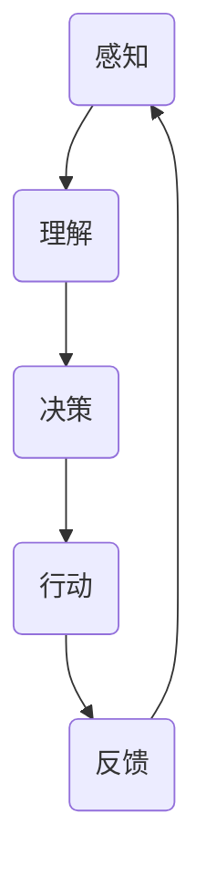
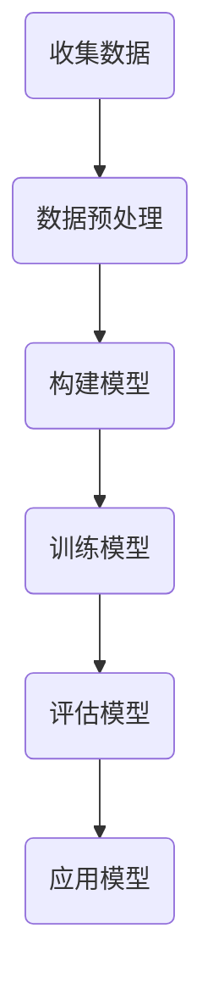

                 

# 释放人类创造力的源泉：人类计算的魅力

> **关键词**：人类计算、创造力、认知模型、应用实践、挑战与未来

> **摘要**：
本文将深入探讨人类计算的魅力，揭示其作为释放人类创造力源泉的重要性。通过剖析人类计算的基础理论、实践应用以及面临的挑战和未来发展趋势，本文旨在为读者提供一个全面而深入的视角，以理解人类计算的核心价值及其对人类社会的影响。

## 《释放人类创造力的源泉：人类计算的魅力》

### 第一部分：人类计算基础理论

#### 第1章：人类计算的概念与历史

##### 1.1 人类计算的定义与特征

人类计算是指人类通过认知过程对信息进行处理、决策和行动的能力。它与计算机科学中的计算有本质的区别，主要体现在以下特征：

1. **认知复杂性**：人类计算依赖于复杂的认知过程，包括感知、理解、记忆、推理和情感等因素。
2. **情境适应性**：人类计算能够根据具体情境进行调整和适应，而计算机科学中的计算往往依赖于固定的算法和模型。
3. **交互性**：人类计算是一种动态的、持续的交互过程，它与外部环境不断进行信息交换。

##### 1.2 人类计算的历史发展

人类计算的历史可以追溯到古代，例如使用算盘进行数学计算，以及使用尺规进行几何作图。然而，现代人类计算的概念和发展主要与认知科学、心理学和人工智能等领域的兴起密切相关。

- **认知科学**：20世纪50年代，认知科学开始研究人类思维的过程，提出了信息处理模型，为人类计算提供了理论基础。
- **心理学**：心理学研究揭示了人类认知过程的细节，例如感知、记忆和决策等，进一步丰富了人类计算的理论体系。
- **人工智能**：人工智能技术的发展使得计算机能够模拟人类的某些认知功能，推动了人类计算的实际应用。

##### 1.3 人类计算与计算机科学的联系

虽然人类计算和计算机科学有本质的区别，但它们之间也存在紧密的联系。计算机科学为人类计算提供了强大的工具和平台，例如计算模型、算法和编程语言等。同时，人类计算的研究也促进了计算机科学的发展，例如在认知模拟、人机交互和智能系统等领域。

### 第2章：人类计算的核心原理

##### 2.1 人类计算的认知模型

人类计算的认知模型是基于对人类思维过程的研究。常见的认知模型包括：

1. **感知模型**：感知是人类计算的第一步，它涉及对感官信息的接收和处理。感知模型通常包括感知器、编码器和过滤器等组成部分。
2. **理解模型**：理解是人类计算的核心，它涉及对感知信息的解析和组织。理解模型通常包括感知、记忆、推理和情境等因素。
3. **决策模型**：决策是人类计算的关键步骤，它涉及在各种选项中做出选择。决策模型通常包括目标设定、选项评估和决策策略等组成部分。

##### 2.2 人类计算的信息处理过程

人类计算的信息处理过程可以分为感知、理解、决策和行动四个阶段。每个阶段都有不同的信息处理机制和算法。

1. **感知阶段**：感知阶段涉及接收和处理感官信息，例如视觉、听觉和触觉等。
2. **理解阶段**：理解阶段涉及对感知信息的解析和组织，例如识别物体、理解语言和解释情境等。
3. **决策阶段**：决策阶段涉及在各种选项中做出选择，例如根据目标评估选项、计算概率和选择最佳策略等。
4. **行动阶段**：行动阶段涉及执行决策，例如根据决策进行行动和调整。

##### 2.3 人类计算的情感因素

情感因素是人类计算的重要组成部分，它对决策和行为有重要影响。情感因素通常包括情绪、动机和价值观等。情绪可以影响理解和决策过程，动机可以驱动行为，而价值观可以影响选择和判断。

### 第3章：人类计算的方法与技术

##### 3.1 人类计算的基本方法

人类计算的基本方法包括感知、理解、决策和行动。这些方法通常通过认知模型和信息处理过程来实现。

1. **感知**：感知方法涉及接收和处理感官信息，例如使用视觉、听觉和触觉等传感器。
2. **理解**：理解方法涉及解析和组织感知信息，例如使用模式识别、语义分析和情境理解等技术。
3. **决策**：决策方法涉及评估选项和做出选择，例如使用期望效用理论、决策树和神经网络等技术。
4. **行动**：行动方法涉及执行决策和调整行为，例如使用自动化系统和机器人控制等技术。

##### 3.2 人类计算的关键技术

人类计算的关键技术包括认知模拟、人机交互和智能系统等。这些技术为人类计算提供了强大的工具和平台。

1. **认知模拟**：认知模拟技术通过模拟人类认知过程来实现人类计算。常见的认知模拟技术包括神经网络、遗传算法和模型推理等。
2. **人机交互**：人机交互技术通过设计用户界面和交互机制来促进人类计算。常见的人机交互技术包括图形用户界面、自然语言处理和手势识别等。
3. **智能系统**：智能系统技术通过构建具有自主决策和行动能力的系统来实现人类计算。常见的智能系统技术包括机器人、自动驾驶和智能家居等。

##### 3.3 人类计算的应用领域

人类计算的应用领域非常广泛，涵盖了教育、商业、艺术和医疗等多个领域。

1. **教育领域**：人类计算在教育领域可以用于个性化教学、智能辅导和在线教育平台等。
2. **商业领域**：人类计算在商业领域可以用于数据分析、市场营销和客户关系管理等。
3. **艺术领域**：人类计算在艺术领域可以用于音乐创作、绘画创作和文学创作等。
4. **医疗领域**：人类计算在医疗领域可以用于疾病诊断、治疗规划和患者监护等。

### 第二部分：人类计算的实践与应用

#### 第4章：人类计算在教育领域的应用

##### 4.1 人类计算在教育评估中的应用

人类计算在教育评估中的应用主要体现在个性化评估和智能评分等方面。

1. **个性化评估**：个性化评估通过分析学生的学习行为和知识水平，为其提供个性化的评估报告和建议。例如，通过分析学生的学习日志和考试结果，可以为其推荐适合的学习资源和策略。
2. **智能评分**：智能评分通过使用自然语言处理和机器学习技术，自动评估学生的作文、论文和考试答案。这种方法可以减少评分的主观性，提高评估的公正性和效率。

##### 4.2 人类计算在个性化教学中的应用

个性化教学是教育领域的重要发展方向，人类计算为个性化教学提供了强大的支持。

1. **学习路径推荐**：通过分析学生的学习行为和知识水平，可以为学生推荐适合的学习路径。例如，对于某个特定的知识点，系统可以推荐相关的课程、视频和练习题。
2. **自适应学习**：自适应学习系统可以根据学生的学习进度和理解程度，动态调整教学内容和难度。这种方法可以提高学生的学习效果，减少学习负担。

##### 4.3 人类计算在教学设计中的应用

人类计算在教学设计中的应用主要体现在智能教学设计和教学反馈等方面。

1. **智能教学设计**：智能教学设计通过分析学生的学习需求和知识水平，为学生设计适合的教学内容和教学方法。例如，系统可以根据学生的学习进度和兴趣，为其推荐相关的课程和活动。
2. **教学反馈**：教学反馈是教师了解学生学习情况和教学效果的重要途径。人类计算可以通过分析学生的考试结果、作业反馈和学习行为，为教师提供详细的反馈报告，帮助其优化教学方法和策略。

#### 第5章：人类计算在商业领域的应用

##### 5.1 人类计算在数据分析中的应用

数据分析是商业领域的关键环节，人类计算为数据分析提供了强大的支持。

1. **数据预处理**：人类计算可以通过自动化方法对大规模数据集进行预处理，例如数据清洗、数据转换和数据整合等。这种方法可以减少数据处理的复杂性和时间成本。
2. **数据挖掘**：人类计算可以通过机器学习和数据挖掘技术，从大量数据中提取有价值的信息和知识。例如，通过分析消费者的购买行为和偏好，可以为企业提供个性化的营销策略。

##### 5.2 人类计算在市场营销中的应用

市场营销是商业领域的重要组成部分，人类计算为市场营销提供了创新的方法和工具。

1. **个性化营销**：通过分析消费者的行为和偏好，可以为消费者提供个性化的营销信息和服务。例如，通过分析用户的浏览记录和购买历史，可以为其推荐相关的商品和优惠信息。
2. **市场预测**：通过分析历史数据和当前市场趋势，可以预测未来的市场变化和消费者需求。这种方法可以帮助企业制定有效的市场营销策略和计划。

##### 5.3 人类计算在客户关系管理中的应用

客户关系管理是企业与客户之间的重要纽带，人类计算为提升客户关系管理提供了强大的支持。

1. **客户细分**：通过分析客户的行为和偏好，可以将客户分为不同的细分市场，为每个细分市场提供定制化的服务和营销策略。
2. **客户行为预测**：通过分析客户的历史行为和当前状态，可以预测客户的行为和需求。这种方法可以帮助企业及时响应客户需求，提供个性化的服务和解决方案。

#### 第6章：人类计算在艺术创作中的应用

##### 6.1 人类计算在音乐创作中的应用

音乐创作是艺术领域的重要组成部分，人类计算为音乐创作提供了创新的方法和工具。

1. **音乐生成**：通过分析音乐数据和音乐理论，可以自动生成新的音乐作品。这种方法可以为音乐家提供创作灵感，减少创作的时间和劳动成本。
2. **音乐分析**：通过分析音乐作品的结构和元素，可以深入了解音乐的内在规律和美学特征。这种方法可以帮助音乐家优化音乐创作的方法和技巧。

##### 6.2 人类计算在绘画创作中的应用

绘画创作是艺术领域的重要形式，人类计算为绘画创作提供了创新的方法和工具。

1. **绘画生成**：通过分析绘画数据和艺术理论，可以自动生成新的绘画作品。这种方法可以为画家提供创作灵感，减少创作的时间和劳动成本。
2. **绘画分析**：通过分析绘画作品的形式和内容，可以深入了解绘画的艺术价值和文化内涵。这种方法可以帮助画家优化绘画创作的方法和技巧。

##### 6.3 人类计算在文学创作中的应用

文学创作是艺术领域的重要形式，人类计算为文学创作提供了创新的方法和工具。

1. **文学生成**：通过分析文学作品的数据和文学理论，可以自动生成新的文学作品。这种方法可以为作家提供创作灵感，减少创作的时间和劳动成本。
2. **文学分析**：通过分析文学作品的形式和内容，可以深入了解文学的艺术价值和文化内涵。这种方法可以帮助作家优化文学创作的方法和技巧。

### 第三部分：人类计算的挑战与未来

#### 第7章：人类计算的挑战

##### 7.1 人类计算与隐私保护的挑战

随着人类计算技术的广泛应用，隐私保护成为了一个重要挑战。

1. **数据收集与使用**：人类计算依赖于大量的数据收集，如何合理使用这些数据，保护用户的隐私，成为一个重要问题。
2. **数据安全**：如何确保人类计算系统中的数据安全，防止数据泄露和滥用，也是一个关键问题。

##### 7.2 人类计算与伦理道德的挑战

人类计算在带来便利和效益的同时，也引发了一系列伦理道德问题。

1. **算法偏见**：如何确保人类计算算法的公平性和透明性，避免算法偏见和歧视，是一个重要挑战。
2. **责任归属**：当人类计算系统出现问题时，如何确定责任归属，保障各方权益，也是一个关键问题。

##### 7.3 人类计算与可持续发展的挑战

人类计算在推动科技进步的同时，也对可持续发展提出了挑战。

1. **资源消耗**：人类计算需要大量的计算资源和能源，如何实现绿色计算，降低资源消耗，是一个重要问题。
2. **环境影响**：人类计算技术的广泛应用可能会对环境产生负面影响，如何实现可持续发展，也是一个关键问题。

#### 第8章：人类计算的未来发展趋势

##### 8.1 人类计算的技术进步趋势

随着科技的不断进步，人类计算技术也在不断发展和创新。

1. **人工智能**：人工智能技术将进一步提升人类计算的能力和效率，实现更智能、更自主的计算系统。
2. **量子计算**：量子计算技术将带来全新的计算能力和突破，为人类计算带来前所未有的发展机遇。

##### 8.2 人类计算的应用创新趋势

人类计算的应用领域将不断拓展，应用创新也将不断涌现。

1. **智慧城市**：智慧城市将人类计算应用于城市管理的各个环节，实现更高效、更智能的城市运行和管理。
2. **健康医疗**：人类计算将在健康医疗领域发挥重要作用，实现个性化医疗、精准医疗和智能诊断等。

##### 8.3 人类计算的未来展望

人类计算的未来充满希望，也将面临诸多挑战。

1. **人机协同**：人类计算将实现与人类更紧密的协同，为人提供更强大的计算能力和工具。
2. **可持续发展**：人类计算将致力于实现可持续发展，为社会和环境带来积极的影响。

## 附录

### 附录A：人类计算相关资源与工具

#### A.1 人类计算的开源工具与框架

- **Python**：Python 是一种广泛使用的编程语言，具有丰富的库和框架，如 TensorFlow、Keras 和 PyTorch 等，可用于人类计算的研究和应用。
- **TensorFlow**：TensorFlow 是一个开源的机器学习和深度学习框架，提供了丰富的工具和接口，可用于构建和训练复杂的神经网络模型。
- **Keras**：Keras 是一个基于 TensorFlow 的高级神经网络 API，提供了简单、直观的接口，使得深度学习模型的构建和训练变得更加容易。
- **PyTorch**：PyTorch 是一个开源的机器学习和深度学习框架，以其动态计算图和灵活的接口而著称，适用于研究和开发复杂的人工智能模型。

#### A.2 人类计算的研究论文与报告

- **《认知科学杂志》**：认知科学杂志是一份国际知名期刊，发表了大量关于人类计算和认知科学的研究论文。
- **《人工智能学报》**：人工智能学报是中国人工智能学会主办的学术期刊，发表了关于人工智能和人类计算的研究论文。
- **《自然》杂志**：自然杂志是一份全球知名的学术期刊，经常发表关于人工智能和人类计算的重要研究成果。

#### A.3 人类计算的学习资源与教程

- **《人工智能基础教程》**：这是一本关于人工智能基础理论和应用的教材，涵盖了人类计算的核心概念和方法。
- **《深度学习入门》**：这是一本关于深度学习和神经网络的基础教程，适合初学者学习人类计算的核心技术。
- **《认知科学导论》**：这是一本关于认知科学的基础教材，介绍了人类计算的认知模型和信息处理过程。

## Mermaid 流程图

### 人类计算的基本流程



## 核心算法原理讲解

### 人类计算的决策算法

```plaintext
// 伪代码：决策算法
function 决策算法(情境，偏好)
    // 收集情境信息
    情境信息 = 收集情境信息(情境)

    // 根据偏好进行权重分配
    权重分配 = 计算偏好权重(偏好)

    // 计算每个可能决策的得分
    分数 = 计算决策得分(情境信息，权重分配)

    // 选择得分最高的决策
    最佳决策 = 选择最佳得分(分数)

    return 最佳决策
```

### 决策算法中的期望效用函数

$$
E(U) = \sum_{i=1}^{n} u_i \cdot p_i
$$

其中，$u_i$ 为第 $i$ 个决策的效用，$p_i$ 为第 $i$ 个决策的概率。

## 项目实战

### 人类计算在个性化学习中的应用

#### 开发环境搭建

- Python 3.8
- TensorFlow 2.6
- Keras 2.6

#### 源代码实现

```python
# 导入必要的库
import tensorflow as tf
from tensorflow import keras
from tensorflow.keras import layers

# 构建模型
model = keras.Sequential([
    layers.Dense(128, activation='relu', input_shape=(num_features,)),
    layers.Dense(64, activation='relu'),
    layers.Dense(1, activation='sigmoid')
])

# 编译模型
model.compile(optimizer='adam',
              loss='binary_crossentropy',
              metrics=['accuracy'])

# 训练模型
model.fit(x_train, y_train, epochs=10, batch_size=32, validation_split=0.2)
```

#### 代码解读与分析

- **模型构建**：使用 Keras 库构建一个全连接神经网络，包含两个隐藏层，每个隐藏层使用 ReLU 激活函数。
- **编译模型**：使用 Adam 优化器和 binary_crossentropy 损失函数进行编译。
- **训练模型**：使用训练数据训练模型，设置训练周期为 10，批量大小为 32，并将 20% 的数据用于验证。

## Mermaid 流程图

### 个性化学习流程



## 数学模型与公式

### 个性化学习中的决策树

$$
\text{决策树} = \sum_{i=1}^{n} w_i \cdot x_i
$$

其中，$w_i$ 为第 $i$ 个特征的权重，$x_i$ 为第 $i$ 个特征的取值。

### 附录

**作者**：AI天才研究院/AI Genius Institute & 禅与计算机程序设计艺术 /Zen And The Art of Computer Programming

通过本文的探讨，我们可以看到人类计算作为释放人类创造力的重要源泉，具有广泛的应用前景和深远的社会影响。随着技术的不断进步和应用创新的不断涌现，人类计算将在未来发挥更加重要的作用，推动人类社会的发展和进步。然而，我们也要认识到人类计算面临的挑战和问题，积极应对，确保其可持续发展和社会价值的最大化。让我们共同期待人类计算的未来，为人类的美好未来贡献力量！

