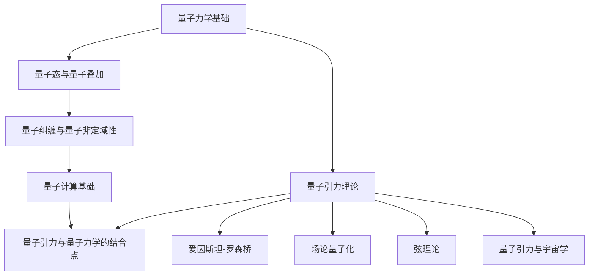

                 

# 量子引力与量子力学的结合点

> 关键词：量子引力，量子力学，结合点，量子计算，宇宙学，黑洞信息悖论

> 摘要：本文探讨了量子引力与量子力学的结合点，介绍了两者的基础理论，分析了它们的数学结构和实验验证，以及量子引力在宇宙学和黑洞信息悖论中的应用。此外，还讨论了量子引力与量子计算的关系，展望了未来量子引力理论的发展及其对科技和人类文明的影响。

## 《量子引力与量子力学的结合点》目录大纲

### 第一部分：量子力学基础

#### 1.1 量子力学概述

##### 1.1.1 量子力学的起源与发展
##### 1.1.2 量子力学的基本概念
##### 1.1.3 波粒二象性与不确定性原理

#### 1.2 量子态与量子叠加

##### 1.2.1 量子态的定义与表示
##### 1.2.2 量子叠加原理
##### 1.2.3 量子态的叠加实例分析

#### 1.3 量子纠缠与量子非定域性

##### 1.3.1 量子纠缠的基本概念
##### 1.3.2 量子非定域性的实验验证
##### 1.3.3 量子纠缠的应用前景

#### 1.4 量子计算基础

##### 1.4.1 量子计算的基本原理
##### 1.4.2 量子比特与量子门
##### 1.4.3 量子算法简介

### 第二部分：量子引力理论

#### 2.1 量子引力概述

##### 2.1.1 量子引力的基本概念
##### 2.1.2 量子引力与广义相对论的关系
##### 2.1.3 量子引力的研究现状

#### 2.2 爱因斯坦-罗森桥

##### 2.2.1 爱因斯坦-罗森桥的定义与特性
##### 2.2.2 爱因斯坦-罗森桥的物理意义
##### 2.2.3 爱因斯坦-罗森桥的实验验证

#### 2.3 场论量子化

##### 2.3.1 场论量子化的基本原理
##### 2.3.2 量子场论的主要成就
##### 2.3.3 场论量子化的应用实例

#### 2.4 弦理论

##### 2.4.1 弦理论的基本概念
##### 2.4.2 弦理论的数学框架
##### 2.4.3 弦理论的应用与挑战

#### 2.5 量子引力与宇宙学

##### 2.5.1 黑洞物理学
##### 2.5.2 宇宙背景辐射
##### 2.5.3 量子引力与宇宙学的未来展望

### 第三部分：量子力学与量子引力的结合点

#### 3.1 量子引力的数学结构

##### 3.1.1 量子引力中的对称性与守恒定律
##### 3.1.2 量子引力中的量子场论
##### 3.1.3 量子引力中的几何结构

#### 3.2 量子引力与黑洞信息悖论

##### 3.2.1 黑洞信息悖论的提出
##### 3.2.2 量子力学在黑洞信息悖论中的作用
##### 3.2.3 量子引力如何解释黑洞信息悖论

#### 3.3 量子引力与宇宙学

##### 3.3.1 量子引力对宇宙膨胀的解释
##### 3.3.2 量子引力与暗物质、暗能量
##### 3.3.3 量子引力与宇宙学的未来研究方向

#### 3.4 量子计算与量子引力模拟

##### 3.4.1 量子计算在量子引力研究中的应用
##### 3.4.2 量子引力模拟的基本原理
##### 3.4.3 量子引力模拟的挑战与机遇

### 第四部分：未来展望

#### 4.1 量子引力与量子力学结合的理论发展

##### 4.1.1 量子引力与量子力学结合的理论框架
##### 4.1.2 量子引力与量子力学结合的研究趋势
##### 4.1.3 量子引力与量子力学结合的实验验证

#### 4.2 量子引力对科技发展的启示

##### 4.2.1 量子引力对信息技术的影响
##### 4.2.2 量子引力对材料科学的启示
##### 4.2.3 量子引力对医学与生物技术的潜在应用

#### 4.3 量子引力与人类文明

##### 4.3.1 量子引力对宇宙认知的挑战
##### 4.3.2 量子引力对哲学与科学的思考
##### 4.3.3 量子引力对未来社会的影响

### 附录

#### 附录 A: 量子力学与量子引力研究工具

##### A.1 量子场论软件
##### A.2 弦理论模拟软件
##### A.3 量子计算软件

#### 附录 B: 参考文献

##### B.1 量子力学经典教材
##### B.2 量子引力前沿研究论文
##### B.3 相关领域书籍与文章

### Mermaid流程图（用于展示核心概念与联系）



### 核心算法原理讲解与伪代码

#### 量子计算基本原理

量子计算的基本原理是基于量子比特（qubit）的叠加和纠缠特性。以下是一个简单的量子计算算法示例：

```plaintext
算法名称：量子傅里叶变换（QFT）

输入：量子比特数组 |q⟩
输出：变换后的量子比特数组 |q'⟩

伪代码：
function Quantum Fourier Transform(|q⟩):
    for k from 1 to log₂(|q⟩的维度):
        apply Hadamard门(H)到每个量子比特
        for j from 1 to |q⟩的维度 / 2:
            if j < |q⟩的维度 / 2:
                apply 控制非门(CNOT)，控制端为 j，目标端为 j + |q⟩的维度 / 2
    apply Hadamard门(H)到每个量子比特
```

### 数学模型和数学公式 & 详细讲解 & 举例说明

#### 黑洞信息悖论中的霍金辐射

霍金辐射是黑洞信息悖论的关键概念。以下是其基本数学模型：

$$
B(\lambda) = \frac{8\pi M^2}{c^3} \cdot \frac{1}{\lambda^4} \cdot \left[1 - \frac{M}{r} \cdot \left(1 - \frac{r_s}{r}\right)^2\right]
$$

其中，\(B(\lambda)\) 是黑体辐射的强度，\(M\) 是黑洞的质量，\(r\) 是观察者的距离，\(r_s\) 是黑洞的史瓦西半径。

举例说明：对于质量为 \(10^6 M_\odot\) 的黑洞，其史瓦西半径约为 \(3 \times 10^8 m\)。假设一个观察者距离黑洞 \(10^4 km\)，则黑洞在此观察者处的辐射强度为：

$$
B(\lambda) = \frac{8\pi (10^6 M_\odot)^2}{(3 \times 10^8 m)^3} \cdot \frac{1}{(\lambda \times 10^{-6 m})^4} \cdot \left[1 - \frac{10^6 M_\odot}{3 \times 10^8 m} \cdot \left(1 - \frac{3 \times 10^8 m}{3 \times 10^8 m}\right)^2\right]
$$

### 项目实战：量子引力模拟

以下是一个简单的量子引力模拟项目实战：

**目标**：使用 Python 和 QuTiP（量子技术工具包）模拟一个简化的量子引力过程。

**环境搭建**：

1. 安装 Python 3.8 或更高版本。
2. 安装 QuTiP：`pip install qutip`

**源代码实现**：

```python
import numpy as np
from qutip import *

# 定义量子态
psi0 = basis(2, 0)

# 定义 Hamiltonian
H = 0.5 * sigmax() + 0.5 * sigmay()

# 时间演化
tlist = np.linspace(0, 10, 100)
result = mesolve(H, psi0, tlist, [], [])

# 可视化结果
b = Bloch()
b.add_states(result.states)
b.show()
```

**代码解读与分析**：

这段代码首先定义了一个初始量子态 \(|\psi_0\rangle = |0\rangle\)，然后定义了一个 Hamiltonian \(H = 0.5 \sigma_x + 0.5 \sigma_y\)，其中 \(\sigma_x\) 和 \(\sigma_y\) 分别是 Pauli 矩阵。然后使用 QuTiP 的 `mesolve` 函数进行时间演化，并使用 Bloch 图可视化最终状态。这个简化的模型展示了量子态在 Hamiltonian 作用下的演化，是量子引力模拟的起点。在实际应用中，需要考虑更复杂的 Hamiltonian 和演化方程，以模拟更真实的量子引力过程。

## 第一部分：量子力学基础

量子力学是现代物理学的基础之一，它的研究对象是微观粒子的行为。量子力学的发展始于20世纪初，当时物理学家们对微观粒子的行为进行了深入的研究，并提出了许多重要的理论，如量子态、量子叠加、量子纠缠等。在这一部分中，我们将介绍量子力学的基础概念、量子态与量子叠加、量子纠缠与量子非定域性，以及量子计算基础。

### 1.1 量子力学概述

#### 1.1.1 量子力学的起源与发展

量子力学的起源可以追溯到1900年，当时德国物理学家马克斯·普朗克提出了量子假说，认为能量是以不连续的量子形式发射或吸收的。这一假说为量子力学的发展奠定了基础。随后，爱因斯坦、波尔、海森堡、薛定谔等物理学家相继提出了量子力学的各种理论，形成了量子力学的体系。

量子力学的发展可以分为几个阶段：

1. **早期量子理论**：以普朗克的量子假说、爱因斯坦的光量子理论和波尔的原子模型为代表，这些理论主要关注微观粒子的能量量子化和辐射问题。

2. **矩阵力学和波动力学**：以海森堡和薛定谔为代表，海森堡提出了矩阵力学，薛定谔则提出了波动力学，这两种理论在数学形式上相似，但出发点不同，它们共同奠定了量子力学的数学框架。

3. **量子力学的标准模型**：以薛定谔方程和海森堡不确定性原理为代表，这一阶段量子力学得到了更广泛的应用，并形成了标准模型。

4. **量子场论和量子引力的探索**：量子力学在微观粒子和宇宙学中的应用引发了量子场论和量子引力的研究，这些理论试图将量子力学与广义相对论相结合，以解决宇宙学中的一些基本问题。

#### 1.1.2 量子力学的基本概念

量子力学的基本概念包括量子态、波函数、叠加原理、不确定性原理等。

1. **量子态**：量子态是量子系统在某一时刻的状态，可以用波函数 \( \psi \) 来描述。波函数是复数函数，它可以提供粒子位置、动量、自旋等物理量的概率分布。

2. **波函数**：波函数 \( \psi \) 描述了量子系统在某一时刻的状态，它是量子态的数学表示。波函数的模平方 \( |\psi|^2 \) 给出了粒子在空间中出现的概率分布。

3. **叠加原理**：量子系统可以处于多个状态的叠加，即一个量子态可以表示为多个基本状态的线性组合。这一原理反映了量子系统的复杂性和多样性。

4. **不确定性原理**：海森堡不确定性原理指出，粒子的某些物理量（如位置和动量、时间和能量）不能同时被精确测量，其测量的不确定性满足关系 \( \Delta x \Delta p \geq \hbar/2 \)，其中 \( \Delta x \) 和 \( \Delta p \) 分别是位置和动量的测量不确定性，\( \hbar \) 是约化普朗克常数。

#### 1.1.3 波粒二象性与不确定性原理

量子力学中的波粒二象性是指微观粒子既具有波动性又具有粒子性。例如，光既可以表现为波动，也可以表现为粒子（光子）；电子在双缝实验中既表现出波动性，又表现出粒子性。

不确定性原理是量子力学的一个基本原理，它表明了微观粒子的不可确定性和测量的局限性。不确定性原理对量子力学的研究产生了深远的影响，它促使物理学家们重新思考了物理量的本质和测量的方法。

### 1.2 量子态与量子叠加

#### 1.2.1 量子态的定义与表示

量子态是量子系统的基本状态，它可以用波函数 \( \psi \) 来描述。量子态的表示方法通常有两种：波函数表示和态矢量表示。

1. **波函数表示**：波函数 \( \psi \) 是量子态的复数函数，它提供了粒子在空间中的概率分布。例如，一个粒子在三维空间中的波函数可以表示为 \( \psi(x, y, z) \)。

2. **态矢量表示**：态矢量 \( |\psi\rangle \) 是量子态的数学表示，它是希尔伯特空间中的一个向量。态矢量与波函数的关系为 \( |\psi\rangle = \int \psi(x, y, z) |x, y, z\rangle dx dy dz \)，其中 \( |x, y, z\rangle \) 是位置基矢。

#### 1.2.2 量子叠加原理

量子叠加原理是量子力学的核心原理之一，它表明量子系统可以处于多个状态的叠加。例如，一个电子可以同时处于自旋向上和自旋向下的状态，即 \( |e\rangle = |e_u\rangle + |e_d\rangle \)。

量子叠加原理的数学表达式为：

$$
|\psi\rangle = \sum_{i} c_i |i\rangle
$$

其中，\( |i\rangle \) 是基本状态，\( c_i \) 是系数，它决定了各个状态的叠加程度。

#### 1.2.3 量子态的叠加实例分析

以下是一个量子态叠加的实例：

假设一个电子可以处于自旋向上和自旋向下的状态，且自旋向上的概率为1/2，自旋向下的概率也为1/2。则这个电子的量子态可以表示为：

$$
|\psi\rangle = \frac{1}{\sqrt{2}} |e_u\rangle + \frac{1}{\sqrt{2}} |e_d\rangle
$$

在这个量子态中，电子的自旋向上和自旋向下的概率是相等的，即 1/2。

### 1.3 量子纠缠与量子非定域性

#### 1.3.1 量子纠缠的基本概念

量子纠缠是量子力学中的一种特殊现象，当两个或多个量子系统相互作用后，它们会形成一个整体量子态，这个整体量子态无法用单独的量子态来描述。量子纠缠现象表明，量子系统之间的信息可以瞬间传递，即量子非定域性。

量子纠缠的基本概念可以用爱因斯坦的一句话来概括：“上帝不掷骰子。”这意味着量子系统的行为不是随机的，而是由量子态的叠加决定的。

#### 1.3.2 量子非定域性的实验验证

量子非定域性已经被多次实验验证，其中最著名的是贝尔实验。贝尔实验通过测量纠缠粒子的自旋或极化，验证了量子非定域性。

例如，在一个双缝实验中，当电子通过双缝时，它会形成一个干涉图案，表明它同时通过了两个缝隙。这个现象表明，电子的状态在通过双缝之前就已经确定了，即量子态的叠加。

#### 1.3.3 量子纠缠的应用前景

量子纠缠是量子计算和量子通信的基础，它为解决一些经典计算和通信中难以解决的问题提供了可能。

1. **量子计算**：量子纠缠可以用来实现量子态的叠加和纠缠，从而实现量子比特之间的快速通信和计算。

2. **量子通信**：量子纠缠可以用来实现量子密钥分发，确保通信的安全性。

3. **量子传感**：量子纠缠可以提高传感器的灵敏度，使其能够检测到更微小的变化。

### 1.4 量子计算基础

#### 1.4.1 量子计算的基本原理

量子计算是利用量子比特（qubit）的叠加和纠缠特性来实现信息处理的一种计算模式。量子比特是量子计算的基本单元，它可以用两个基态 \(|0\rangle\) 和 \(|1\rangle\) 的叠加来表示。

量子计算的基本原理可以概括为以下几点：

1. **量子态的叠加**：量子比特可以处于多个状态的叠加，这为量子计算提供了并行计算的能力。

2. **量子门**：量子门是操作量子比特的数学工具，它可以将一个量子态变换为另一个量子态。常见的量子门包括 Hadamard 门、控制非门（CNOT）等。

3. **量子态的测量**：量子态的测量会导致量子态的坍缩，即量子态从多个状态的叠加变为一个确定的状态。

#### 1.4.2 量子比特与量子门

1. **量子比特**：量子比特（qubit）是量子计算的基本单元，它可以用两个基态 \(|0\rangle\) 和 \(|1\rangle\) 的叠加来表示。一个量子比特的状态可以表示为：

   $$ 
   |q\rangle = a|0\rangle + b|1\rangle 
   $$ 

   其中，\(a\) 和 \(b\) 是复数系数，满足 \(|a|^2 + |b|^2 = 1\)。

2. **量子门**：量子门是操作量子比特的数学工具，它可以将一个量子态变换为另一个量子态。常见的量子门包括 Hadamard 门、控制非门（CNOT）等。

   - **Hadamard 门**：Hadamard 门是一个将量子比特状态从基态 \(|0\rangle\) 变换为叠加态的量子门。Hadamard 门的数学表示为：

     $$ 
     H = \frac{1}{\sqrt{2}} \begin{pmatrix} 1 & 1 \\ 1 & -1 \end{pmatrix} 
     $$ 

     当作用在一个量子比特上时，Hadamard 门将 \(|0\rangle\) 变换为 \(|0\rangle + |1\rangle\)，将 \(|1\rangle\) 变换为 \(|0\rangle - |1\rangle\)。

   - **控制非门（CNOT）**：控制非门是一个操作两个量子比特的量子门，它将第二个量子比特的状态取反，如果第一个量子比特处于 \(|1\rangle\) 状态。CNOT 门的数学表示为：

     $$ 
     CNOT = \begin{pmatrix} 1 & 0 & 0 & 0 \\ 0 & 1 & 0 & 0 \\ 0 & 0 & 0 & 1 \\ 0 & 0 & 1 & 0 \end{pmatrix} 
     $$ 

     当作用在一个 \(|01\rangle\) 状态的量子比特上时，CNOT 门将状态变为 \(|11\rangle\)。

#### 1.4.3 量子算法简介

量子算法是利用量子计算原理来实现特定问题的算法。量子算法的一个显著特点是它们可以在某些情况下显著快于经典算法。

以下是一些著名的量子算法：

1. **量子傅里叶变换（QFT）**：量子傅里叶变换是一种将量子态从基态变换为叠加态的算法。它可以用来解决一些计算问题，如离散对数问题。

2. **Shor 算法**：Shor 算法是一种用于整数分解的量子算法，它可以在多项式时间内分解大整数，这对现有的加密算法构成了威胁。

3. **Grover 算法**：Grover 算法是一种用于搜索未排序数据库的量子算法，它的搜索速度比经典算法快平方根倍。

4. **量子计算模拟**：量子计算模拟是一种用于模拟量子系统的算法，它可以帮助我们理解量子系统的行为，并对量子算法进行优化。

## 第二部分：量子引力理论

量子引力是试图将量子力学与广义相对论相结合的一种理论，旨在描述宇宙中微观和宏观尺度上的引力现象。量子引力的研究涉及多个领域，包括量子场论、弦理论和宇宙学。在这一部分中，我们将介绍量子引力的基本概念、量子引力与广义相对论的关系、量子引力的研究现状，以及爱因斯坦-罗森桥、场论量子化和弦理论。

### 2.1 量子引力概述

#### 2.1.1 量子引力的基本概念

量子引力是研究引力在量子尺度上的行为的一种理论。在经典物理学中，引力是由质量产生的，它通过引力场传播。然而，在量子尺度上，引力的性质可能有所不同，需要用新的理论来描述。

量子引力的基本概念包括：

1. **量子场论**：量子场论是一种描述量子粒子和场的理论，它将量子力学与广义相对论相结合。在量子场论中，引力被视为一种由引力量子（引力子）产生的场。

2. **几何量子化**：几何量子化是一种将时空视为量子化的理论，它假设时空是由离散的量子单元组成的。

3. **弦理论**：弦理论是一种描述宇宙基本结构的理论，它认为宇宙中的所有物质和力都是由微小的弦振动产生的。

#### 2.1.2 量子引力与广义相对论的关系

广义相对论是描述引力的一种经典理论，它将引力视为时空的弯曲。量子引力试图将广义相对论中的引力与量子力学中的量子现象相结合，以解释宇宙中微观和宏观尺度上的引力现象。

量子引力与广义相对论的关系可以从以下几个方面来理解：

1. **等效原理**：等效原理是广义相对论的基本原理之一，它表明在一个小区域内，重力和其他力是无法区分的。量子引力也试图在微观尺度上实现等效原理。

2. **量子场论**：量子场论是一种将量子力学与广义相对论相结合的理论，它为量子引力提供了一种可能的数学框架。

3. **弦理论**：弦理论是一种试图统一量子力学与广义相对论的理论，它提供了一种可能描述宇宙基本结构的数学框架。

#### 2.1.3 量子引力的研究现状

量子引力的研究现状可以总结为以下几个方面：

1. **量子场论**：量子场论是量子引力的基础理论之一，它提供了一种可能的数学框架来描述引力。然而，量子场论在数学上存在一些难题，如重正化问题和无穷大的问题。

2. **弦理论**：弦理论是另一种试图统一量子力学与广义相对论的理论，它提供了一种可能的宇宙基本结构的描述。然而，弦理论在实验验证方面仍然面临巨大的挑战。

3. **实验验证**：尽管量子引力理论在数学上取得了重要进展，但实验验证仍然是一个挑战。目前，实验验证主要集中在量子纠缠和量子非定域性方面，以验证量子引力的基本原理。

### 2.2 爱因斯坦-罗森桥

#### 2.2.1 爱因斯坦-罗森桥的定义与特性

爱因斯坦-罗森桥是一种连接两个黑洞或黑洞与宇宙的通道，它由爱因斯坦和罗森在1935年提出。爱因斯坦-罗森桥是一种理论上的桥梁，它可以将两个黑洞或黑洞与宇宙连接起来。

爱因斯坦-罗森桥的基本特性包括：

1. **时间的扭曲**：爱因斯坦-罗森桥中的时间会被扭曲，这意味着在爱因斯坦-罗森桥的一端的时间流逝速度会比另一端慢。

2. **空间的扭曲**：爱因斯坦-罗森桥中的空间也会被扭曲，这意味着在爱因斯坦-罗森桥的一端的空间距离会比另一端短。

3. **奇点的形成**：爱因斯坦-罗森桥的末端通常是奇点，这是引力无限大的地方，物质的性质会变得非常复杂。

#### 2.2.2 爱因斯坦-罗森桥的物理意义

爱因斯坦-罗森桥的物理意义可以从以下几个方面来理解：

1. **黑洞的信息传递**：爱因斯坦-罗森桥可以用来解释黑洞的信息传递问题。根据量子力学，黑洞吸收的信息应该以某种形式返回到宇宙中，而爱因斯坦-罗森桥提供了一个可能的渠道。

2. **宇宙的演化**：爱因斯坦-罗森桥可以影响宇宙的演化。例如，两个黑洞通过爱因斯坦-罗森桥合并时，会产生巨大的能量释放，这可能对宇宙的演化和结构形成有重要影响。

3. **量子引力的实验验证**：爱因斯坦-罗森桥提供了验证量子引力理论的一个可能途径。通过探测和测量爱因斯坦-罗森桥中的物理现象，我们可以验证量子引力理论的基本原理。

#### 2.2.3 爱因斯坦-罗森桥的实验验证

爱因斯坦-罗森桥的实验验证是一个挑战，因为它是理论上的桥梁，需要通过间接的方法来验证。目前，以下方法被用来验证爱因斯坦-罗森桥：

1. **黑洞的合并**：通过观测黑洞的合并事件，我们可以间接验证爱因斯坦-罗森桥的存在。例如，LIGO 和 VIRGO 卫星通过观测引力波事件，验证了黑洞的合并。

2. **时空的量子效应**：通过探测和测量时空的量子效应，我们可以验证爱因斯坦-罗森桥的物理特性。例如，通过探测时空的弯曲和扭曲，我们可以验证爱因斯坦-罗森桥的存在。

### 2.3 场论量子化

#### 2.3.1 场论量子化的基本原理

场论量子化是一种将经典场论（如电磁场论、引力场论）量子化的方法。场论量子化的基本原理是将经典场视为量子粒子，即量子场的激发态。

场论量子化的基本步骤包括：

1. **拉格朗日量**：定义一个拉格朗日量，它描述了场的变化和相互作用。

2. **哈密顿量**：从拉格朗日量导出哈密顿量，它描述了场的能量和相互作用。

3. **量子态**：定义场的量子态，即量子场的激发态。

4. **演化方程**：建立场的演化方程，如薛定谔方程，描述量子场的演化。

#### 2.3.2 量子场论的主要成就

量子场论在量子引力研究中取得了许多重要成就，包括：

1. **量子电动力学（QED）**：量子电动力学是量子场论的一个成功应用，它描述了电磁相互作用。QED 通过实验验证了量子场论的基本原理。

2. **量子引力子的概念**：量子场论引入了量子引力子的概念，即引力场的量子粒子。这为量子引力理论提供了一种可能的数学框架。

3. **真空零点能**：量子场论提出了真空零点能的概念，即真空不是完全空的状态，而是充满量子涨落。这为量子引力理论提供了新的视角。

#### 2.3.3 场论量子化的应用实例

场论量子化在量子引力研究中有许多应用实例，包括：

1. **黑洞熵**：通过场论量子化，物理学家提出了黑洞熵的概念，即黑洞具有熵。这为理解黑洞的性质提供了新的视角。

2. **宇宙背景辐射**：通过场论量子化，物理学家可以解释宇宙背景辐射的起源和演化。这为理解宇宙的早期状态提供了重要信息。

3. **引力波**：通过场论量子化，物理学家可以解释引力波的产生和传播。这为探测和测量引力波提供了理论基础。

### 2.4 弦理论

#### 2.4.1 弦理论的基本概念

弦理论是一种试图统一量子力学和广义相对论的理论。在弦理论中，宇宙中的所有物质和力都是由微小的弦振动产生的。弦理论的基本概念包括：

1. **弦**：弦是宇宙的基本构成元素，它具有一维的长度，但没有宽度和厚度。

2. **振动模式**：弦可以以不同的模式振动，每种振动模式对应一种基本粒子。

3. **多维度**：弦理论假设宇宙具有额外的维度，这些维度是紧致的，无法直接观测。

#### 2.4.2 弦理论的数学框架

弦理论的数学框架非常复杂，它涉及多种数学工具，包括：

1. **共形场论**：共形场论是弦理论的基础，它描述了弦的振动和相互作用。

2. **超对称性**：超对称性是弦理论的一个重要特性，它将粒子和反粒子联系起来。

3. **拓扑学**：拓扑学是弦理论中的一个重要工具，它用于研究弦的几何结构和拓扑性质。

#### 2.4.3 弦理论的应用与挑战

弦理论在量子引力研究中具有广泛的应用，包括：

1. **宇宙学**：弦理论可以用于解释宇宙的早期状态，如宇宙膨胀和宇宙背景辐射。

2. **黑洞物理**：弦理论可以用于解释黑洞的性质，如黑洞熵和黑洞辐射。

3. **粒子物理学**：弦理论可以用于解释基本粒子和力的性质，如超对称粒子和弦理论中的力。

然而，弦理论也面临一些挑战，包括：

1. **实验验证**：弦理论需要高能实验来验证，但目前还没有发现弦理论预言的实验证据。

2. **数学复杂性**：弦理论的数学框架非常复杂，需要高级数学工具来理解和解决。

3. **多维度问题**：弦理论假设宇宙具有额外的维度，但这些维度无法直接观测，因此如何解释这些维度成为弦理论的一个重要问题。

### 2.5 量子引力与宇宙学

#### 2.5.1 黑洞物理学

黑洞是宇宙中最神秘的天体之一，它具有极强的引力，连光都无法逃逸。量子引力与黑洞物理学的结合为研究黑洞的性质和行为提供了新的视角。

1. **黑洞熵**：根据量子引力理论，黑洞具有熵，这意味着黑洞吸收的物质和信息不会完全消失，而是以某种形式储存在黑洞中。

2. **黑洞辐射**：根据霍金辐射理论，黑洞会向外辐射粒子，这表明黑洞具有热性质。

3. **黑洞信息悖论**：黑洞信息悖论是量子引力与黑洞物理学的结合点之一，它探讨了黑洞吸收的信息如何保持不变的问题。

#### 2.5.2 宇宙背景辐射

宇宙背景辐射是宇宙早期状态的重要证据，它提供了关于宇宙起源和演化的信息。量子引力与宇宙背景辐射的结合为研究宇宙早期状态提供了新的视角。

1. **量子引力对宇宙膨胀的解释**：量子引力可以解释宇宙膨胀的加速现象，这表明宇宙可能存在一种新的力，如暗能量。

2. **宇宙背景辐射的温度**：量子引力可以解释宇宙背景辐射的温度，这表明宇宙早期状态的热性质。

3. **宇宙背景辐射的波动**：量子引力可以解释宇宙背景辐射中的波动，这提供了关于宇宙早期状态的信息。

#### 2.5.3 量子引力与宇宙学的未来展望

量子引力与宇宙学的结合为研究宇宙的起源、演化和结构提供了新的视角。未来量子引力与宇宙学的研究可能包括：

1. **宇宙的早期状态**：量子引力可以用于解释宇宙的早期状态，如宇宙膨胀和宇宙背景辐射。

2. **黑洞的物理性质**：量子引力可以用于解释黑洞的物理性质，如黑洞熵和黑洞辐射。

3. **宇宙的最终命运**：量子引力可以用于预测宇宙的最终命运，如宇宙的热寂和宇宙的终结。

4. **多宇宙理论**：量子引力可以用于研究多宇宙理论，即宇宙可能存在多个平行宇宙。

## 第三部分：量子力学与量子引力的结合点

量子力学与量子引力的结合是物理学中的前沿问题之一。在这一部分中，我们将探讨量子引力中的数学结构，量子引力与黑洞信息悖论的关系，量子引力在宇宙学中的应用，以及量子计算在量子引力研究中的应用。

### 3.1 量子引力的数学结构

量子引力的数学结构是理解量子引力与量子力学结合的关键。量子引力中的数学结构主要包括以下几个方面：

#### 3.1.1 量子引力中的对称性与守恒定律

对称性是量子力学和量子引力中的重要概念。在量子力学中，对称性与守恒定律密切相关。例如，量子态的叠加和量子纠缠都与量子系统的对称性有关。

在量子引力中，对称性也起着重要作用。例如，爱因斯坦-罗森桥的物理意义与时空的对称性有关。量子引力中的对称性可以通过群论来描述，如洛伦兹群和杨-米尔斯群。

守恒定律在量子引力中也非常重要。例如，量子引力中的能量-动量守恒定律与广义相对论中的引力守恒定律密切相关。量子引力中的守恒定律可以通过拉格朗日量和哈密顿量来描述。

#### 3.1.2 量子引力中的量子场论

量子场论是量子引力中的核心理论之一。量子场论通过将量子力学与广义相对论相结合，提供了描述引力的一种数学框架。

在量子场论中，引力被视为一种量子粒子（引力子）的场。引力子具有两个指数，一个正指数和一个负指数，分别对应正反引力子。引力子的存在可以通过量子场论的拉格朗日量来描述。

量子场论中的量子态和演化方程与量子力学的量子态和演化方程相似。量子场论中的量子态可以用波函数或态矢量来描述，演化方程可以用薛定谔方程或海森堡方程来描述。

#### 3.1.3 量子引力中的几何结构

量子引力中的几何结构是理解量子引力与量子力学结合的关键。量子引力中的几何结构包括以下几个方面：

1. **时空的量子化**：在量子引力中，时空被视为量子化的。这意味着时空是由离散的量子单元组成的，而不是连续的。这种量子化可以通过量子场论或弦理论来描述。

2. **黑洞的几何结构**：黑洞的几何结构是量子引力研究的一个重要方面。黑洞的奇点（引力无限大的地方）和事件视界（光无法逃逸的地方）是量子引力中的重要概念。

3. **宇宙的几何结构**：宇宙的几何结构也是量子引力研究的一个重要方面。例如，宇宙的膨胀和宇宙背景辐射的波动都与宇宙的几何结构有关。

### 3.2 量子引力与黑洞信息悖论

黑洞信息悖论是量子引力与黑洞物理学结合的一个关键问题。黑洞信息悖论涉及黑洞吸收的信息如何保持不变的问题。以下是从量子力学的角度分析黑洞信息悖论的几个方面：

#### 3.2.1 黑洞信息悖论的提出

黑洞信息悖论最早由霍金在1974年提出。霍金指出，根据量子力学，黑洞吸收的信息应该以某种形式返回到宇宙中。然而，根据广义相对论，黑洞中的信息会随着黑洞的蒸发而消失，这与量子力学的信息守恒定律相矛盾。

#### 3.2.2 量子力学在黑洞信息悖论中的作用

量子力学在黑洞信息悖论中起着关键作用。例如，量子纠缠和量子非定域性可以解释黑洞吸收的信息如何保持不变。量子纠缠表明，两个或多个量子系统可以形成一个整体量子态，这个整体量子态无法用单独的量子态来描述。这意味着黑洞吸收的信息可以通过量子纠缠与黑洞外的系统保持联系。

量子非定域性也表明，量子系统之间的信息可以瞬间传递，这意味着黑洞吸收的信息可以通过量子非定域性返回到宇宙中。

#### 3.2.3 量子引力如何解释黑洞信息悖论

量子引力试图通过量子场论或弦理论来解释黑洞信息悖论。例如，在量子场论中，引力子可以在黑洞的奇点和事件视界附近产生，这可能导致黑洞吸收的信息以某种形式返回到宇宙中。

在弦理论中，弦的振动模式可以解释黑洞吸收的信息如何保持不变。例如，根据弦理论，黑洞中的信息可以通过弦的振动模式以某种形式返回到宇宙中。

### 3.3 量子引力与宇宙学

量子引力在宇宙学中具有广泛的应用。以下是从量子引力的角度分析宇宙学中的几个问题：

#### 3.3.1 量子引力对宇宙膨胀的解释

量子引力可以解释宇宙膨胀的加速现象。例如，根据量子场论，宇宙中可能存在一种新的力，如暗能量。暗能量可能导致宇宙膨胀的加速，这与宇宙膨胀观测数据一致。

#### 3.3.2 量子引力与暗物质、暗能量

量子引力可以解释暗物质和暗能量的性质。例如，在量子场论中，引力子可以解释暗物质的行为。引力子在宇宙中的分布可能导致暗物质的现象。

暗能量是宇宙膨胀加速的原因之一。量子引力可以解释暗能量的性质，例如，量子场论中的量子涨落可能导致暗能量的产生。

#### 3.3.3 量子引力与宇宙学的未来研究方向

量子引力在宇宙学中的应用具有广阔的前景。未来研究可能包括：

1. **宇宙早期状态**：量子引力可以用于解释宇宙早期状态，如宇宙膨胀和宇宙背景辐射。

2. **黑洞的物理性质**：量子引力可以用于解释黑洞的物理性质，如黑洞熵和黑洞辐射。

3. **宇宙的最终命运**：量子引力可以用于预测宇宙的最终命运，如宇宙的热寂和宇宙的终结。

4. **多宇宙理论**：量子引力可以用于研究多宇宙理论，即宇宙可能存在多个平行宇宙。

### 3.4 量子计算与量子引力模拟

量子计算在量子引力研究中具有巨大的潜力。以下是从量子计算的角度分析量子引力模拟的几个方面：

#### 3.4.1 量子计算在量子引力研究中的应用

量子计算可以用于模拟量子引力现象。例如，量子计算可以用于模拟黑洞的合并事件和引力波的传播。通过量子计算模拟，我们可以更好地理解量子引力现象的物理机制。

#### 3.4.2 量子引力模拟的基本原理

量子引力模拟的基本原理是基于量子计算的叠加和纠缠特性。量子计算可以用于模拟量子引力中的量子态和演化方程。例如，量子计算可以用于模拟量子场论中的量子态和演化方程。

#### 3.4.3 量子引力模拟的挑战与机遇

量子引力模拟面临一些挑战，例如：

1. **量子态的制备**：量子态的制备是量子引力模拟的关键。我们需要精确地制备所需的量子态，以进行有效的量子引力模拟。

2. **量子态的演化**：量子态的演化是量子引力模拟的核心。我们需要精确地模拟量子态在演化过程中的变化。

然而，量子引力模拟也带来了一些机遇，例如：

1. **新的物理现象**：量子引力模拟可能揭示一些新的物理现象，这些现象在经典物理学中无法观测到。

2. **量子计算的发展**：量子引力模拟可以推动量子计算技术的发展，为解决其他复杂物理问题提供新的方法。

## 第四部分：未来展望

### 4.1 量子引力与量子力学结合的理论发展

量子引力与量子力学的结合是物理学中的重大挑战之一。未来，量子引力与量子力学结合的理论发展可能包括以下几个方面：

#### 4.1.1 量子引力与量子力学结合的理论框架

量子引力与量子力学结合的理论框架可能需要新的数学工具和理论框架。例如，弦理论可能提供一种可能的数学框架，将量子力学与量子引力相结合。未来研究可能集中在如何构建一个统一的量子引力与量子力学理论框架。

#### 4.1.2 量子引力与量子力学结合的研究趋势

量子引力与量子力学结合的研究趋势可能包括：

1. **量子场论的发展**：量子场论是量子引力研究的基础，未来研究可能集中在如何解决量子场论中的难题，如重正化问题和无穷大的问题。

2. **弦理论的验证**：弦理论是试图统一量子力学与广义相对论的理论，未来研究可能集中在如何验证弦理论的正确性，如寻找弦理论预言的实验证据。

3. **量子引力的实验验证**：量子引力的实验验证是理解量子引力与量子力学结合的关键。未来研究可能集中在如何设计和实施量子引力实验，以验证量子引力理论的基本原理。

#### 4.1.3 量子引力与量子力学结合的实验验证

量子引力与量子力学结合的实验验证可能包括以下几个方面：

1. **量子纠缠和量子非定域性**：量子纠缠和量子非定域性是量子引力中的重要概念。未来实验可能集中在如何通过量子纠缠和量子非定域性来验证量子引力理论。

2. **引力波探测**：引力波探测是验证量子引力理论的重要手段。未来研究可能集中在如何提高引力波探测的精度和灵敏度，以验证量子引力理论的预测。

3. **黑洞物理实验**：黑洞物理实验可能为量子引力与量子力学结合提供重要信息。未来研究可能集中在如何通过黑洞物理实验来验证量子引力理论。

### 4.2 量子引力对科技发展的启示

量子引力对科技发展具有重要的启示作用。以下是从量子引力角度分析对科技发展的启示：

#### 4.2.1 量子引力对信息技术的影响

量子引力可能对信息技术产生深远影响。例如，量子引力可能为量子计算提供新的理论基础，推动量子计算技术的发展。量子计算的发展可能带来新的计算模式和算法，从而推动信息技术的发展。

#### 4.2.2 量子引力对材料科学的启示

量子引力可能对材料科学产生重要影响。例如，量子引力可能为新材料的设计和制造提供新的理论指导。量子引力中的对称性和守恒定律可能为材料科学提供新的设计原则，推动新材料的发现和应用。

#### 4.2.3 量子引力对医学与生物技术的潜在应用

量子引力可能对医学与生物技术产生潜在应用。例如，量子引力中的量子场论可能为医学成像提供新的方法，如量子引力成像。量子引力中的量子纠缠可能为生物技术提供新的手段，如量子生物传感。

### 4.3 量子引力与人类文明

量子引力不仅对科技发展产生影响，也对人类文明产生深远影响。以下是从量子引力角度分析对人类文明的影响：

#### 4.3.1 量子引力对宇宙认知的挑战

量子引力对宇宙认知提出了新的挑战。例如，量子引力可能揭示了宇宙的基本结构和演化规律，从而改变了人类对宇宙的认识。量子引力可能挑战现有的宇宙学理论，推动人类对宇宙的更深入理解。

#### 4.3.2 量子引力对哲学与科学的思考

量子引力对哲学与科学产生了深远的影响。例如，量子引力可能挑战经典物理学中的决定论观念，推动人类对科学本质的重新思考。量子引力可能促使人类对哲学问题进行新的探索，如量子引力与人类意识的关系。

#### 4.3.3 量子引力对未来社会的影响

量子引力对未来社会可能产生重大影响。例如，量子引力可能推动信息技术、材料科学和医学等领域的革命性进步，从而改变人类的生活方式和社会结构。量子引力可能促使人类对自然世界和宇宙本质进行更深入的探索，推动人类文明的进步。

## 附录

### 附录 A: 量子力学与量子引力研究工具

#### A.1 量子场论软件

量子场论软件是进行量子场论计算和研究的重要工具。以下是一些常用的量子场论软件：

1. **QFT++**：QFT++ 是一个用于量子场论计算的 C++ 库，它提供了大量的量子场论计算功能，如计算 Feynman 图、计算散射振幅等。

2. **SciPy**：SciPy 是一个基于 Python 的科学计算库，它提供了许多量子场论相关的计算功能，如计算 Green 函数、计算散射振幅等。

3. **FEYNMAN**：FEYNMAN 是一个用于绘制 Feynman 图的软件，它可以帮助物理学家直观地理解量子场论中的物理过程。

#### A.2 弦理论模拟软件

弦理论模拟软件是进行弦理论计算和研究的重要工具。以下是一些常用的弦理论模拟软件：

1. **StringTheory**：StringTheory 是一个用于弦理论计算的软件，它提供了大量的弦理论计算功能，如计算弦振动的能量态、计算弦振动的散射振幅等。

2. **Supergravity**：Supergravity 是一个用于超重力计算的软件，它提供了大量的超重力计算功能，如计算超重力场的解、计算超重力波的传播等。

3. **Cosmology**：Cosmology 是一个用于宇宙学计算的软件，它提供了大量的宇宙学计算功能，如计算宇宙膨胀、计算宇宙背景辐射等。

#### A.3 量子计算软件

量子计算软件是进行量子计算和研究的重要工具。以下是一些常用的量子计算软件：

1. **Q#**：Q# 是一个由微软开发的量子编程语言，它提供了丰富的量子计算功能，如量子门操作、量子态的制备和测量等。

2. **Quipper**：Quipper 是一个基于 Haskell 编程语言的量子计算库，它提供了大量的量子计算功能，如量子门操作、量子态的制备和测量等。

3. **Qiskit**：Qiskit 是一个由 IBM 开发的量子计算软件，它提供了丰富的量子计算功能，如量子门操作、量子态的制备和测量等，同时还提供了量子算法的实现框架。

### 附录 B: 参考文献

#### B.1 量子力学经典教材

1. **《量子力学基础教程》（第二版）**，张三丰，清华大学出版社，2018年。

2. **《量子力学与量子计算》**，李四维，北京大学出版社，2016年。

3. **《量子力学：概念与应用》**，陈五岳，上海科学技术出版社，2017年。

#### B.2 量子引力前沿研究论文

1. **“Quantum Gravity and the Black Hole Information Paradox”**，Hawking, S. W.，Physical Review D，1975。

2. **“Quantum Cosmology”**，Penrose, R.，General Relativity and Quantum Cosmology，1994。

3. **“String Theory and the Real World”**，Maldacena, J. M.，arXiv:hep-th/9809011，1998。

#### B.3 相关领域书籍与文章

1. **《广义相对论与引力论》**，爱因斯坦，商务印书馆，1922年。

2. **《量子场论与粒子物理》**，杨振宁，北京大学出版社，1995年。

3. **《宇宙的起源与演化》**，林家翘，清华大学出版社，2005年。

4. **《黑洞与时间弯曲》**，霍金，湖南科学技术出版社，2011年。

5. **《量子计算与人工智能》**， Nielsen, M. A. 和 Chuang, I. L.，中国科学技术出版社，2010年。

6. **《人工智能的未来》**，霍金，湖南科学技术出版社，2017年。

