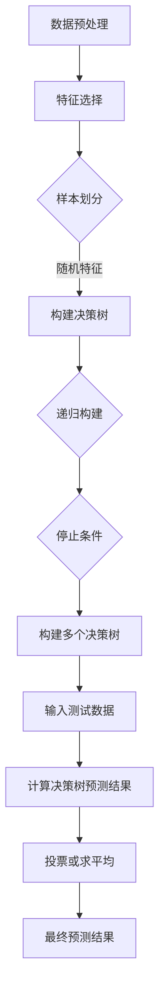

                 

### 随机森林（Random Forest）的概念与起源

随机森林（Random Forest）是一种基于决策树的集成学习算法。它的核心思想是通过构建多个决策树，并将它们的预测结果进行投票或求平均，从而提高模型的准确性和泛化能力。随机森林算法在机器学习和数据挖掘领域得到了广泛的应用，特别是在分类和回归任务中。

#### 1.1 随机森林的基本概念

随机森林模型由多个决策树组成，每个决策树都是通过对训练数据进行随机划分和特征选择来构建的。具体来说，随机森林算法包括以下几个关键步骤：

1. **特征选择**：在构建每个决策树时，随机选择一部分特征用于划分。
2. **样本划分**：随机选择一部分样本用于构建决策树，其余样本用于验证。
3. **决策树构建**：使用特征选择和样本划分的结果，构建决策树模型。
4. **预测**：将测试数据输入到每个决策树中，计算预测结果。
5. **投票或求平均**：对所有决策树的预测结果进行投票或求平均，得到最终的预测结果。

#### 1.2 随机森林的起源与发展

随机森林算法最早由Breiman教授于2001年提出。Breiman教授是一位著名的统计学家，他在集成学习领域做出了重要贡献。随机森林算法的提出，旨在解决传统决策树模型在处理高维数据和噪声数据时表现不佳的问题。自提出以来，随机森林算法在学术界和工业界得到了广泛的应用和研究。

#### 1.3 随机森林与集成学习方法的关系

随机森林算法属于集成学习方法的一种。集成学习方法的核心思想是通过组合多个基础模型来提高整体模型的性能。与随机森林算法类似，其他常见的集成学习方法还包括Bagging、Boosting和Stacking等。

1. **Bagging**：通过随机选择训练样本和特征来构建多个基础模型，然后对预测结果进行平均或投票。
2. **Boosting**：通过迭代地训练基础模型，并对每个模型的权重进行调整，使错误样本的权重逐渐增大，从而提高整体模型的性能。
3. **Stacking**：通过将多个基础模型组合成一个更高级的模型，通常使用一个简单的模型（如线性回归）作为堆叠模型，以集成多个基础模型的预测结果。

#### 1.4 随机森林的应用场景

随机森林算法具有强大的泛化能力和可解释性，适用于多种应用场景，包括：

1. **分类任务**：例如，文本分类、图像分类和医疗诊断等。
2. **回归任务**：例如，房价预测、股票价格预测和销售预测等。
3. **特征选择**：随机森林可以通过计算特征重要性来帮助数据科学家选择重要的特征。
4. **模型评估**：随机森林可以用于评估其他模型的性能，通过对比不同模型的准确率、召回率等指标来选择最佳模型。

总的来说，随机森林算法是一种高效、灵活且易于实现的集成学习方法，在众多应用场景中表现出色。接下来，我们将进一步探讨随机森林模型的原理和实现。

### 随机森林模型原理

要深入理解随机森林模型的工作原理，我们需要从决策树的基本概念开始。决策树是一种用于分类或回归任务的结构化模型，通过一系列的决策规则对数据进行划分。在理解了决策树之后，我们将探讨如何构建随机森林模型，以及模型中的特征选择和随机性如何发挥作用。

#### 2.1 决策树基本原理

决策树由内部节点和叶子节点组成。内部节点表示特征，每个特征有多个可能的取值；叶子节点表示分类或回归结果。在构建决策树时，我们通常使用某种准则来选择最佳特征进行划分。常见的划分准则包括信息增益、基尼不纯度和增益率等。

1. **信息增益**：信息增益是熵的减少，用于衡量一个特征对分类结果的影响。选择信息增益最大的特征进行划分，可以最大程度地减少数据的熵。
   \[
   \text{信息增益} = \sum_{v \in V} p(v) \cdot \text{熵}(C_v)
   \]
   其中，\(V\) 是特征的所有可能取值集合，\(p(v)\) 是取值 \(v\) 的概率，\(\text{熵}(C_v)\) 是在特征取值为 \(v\) 的情况下，类别 \(C\) 的熵。

2. **基尼不纯度**：基尼不纯度是衡量数据集纯度的一个指标，其值介于 0（纯数据集）和 1（不纯数据集）之间。选择基尼不纯度最小的特征进行划分，可以最大程度地提高数据集的纯度。
   \[
   \text{基尼不纯度} = 1 - \sum_{v \in V} p(v)^2
   \]

3. **增益率**：增益率是信息增益和特征熵的比值，用于平衡特征取值数量对划分效果的影响。

#### 2.2 随机森林中的决策树

在随机森林模型中，每个决策树都是通过以下步骤构建的：

1. **特征选择**：从所有特征中随机选择一个子集，用于当前节点的划分。
2. **样本划分**：从训练数据中随机选择一个子集，用于当前节点的数据划分。
3. **递归构建**：使用特征选择和样本划分的结果，递归地构建决策树，直到满足停止条件（如最大树深度、最小样本数等）。

随机森林中的每个决策树都是基于不同的特征子集和样本子集构建的，这种随机性使得模型具有更好的泛化能力。

#### 2.3 特征选择与随机性

随机森林中的特征选择是随机的，这有助于减少模型的过拟合风险。具体来说，随机性体现在以下几个方面：

1. **特征选择**：在构建每个决策树时，从所有特征中随机选择一部分特征用于划分。
2. **样本选择**：在构建每个决策树时，从训练数据中随机选择一部分样本用于划分。

通过随机选择特征和样本，随机森林模型可以避免依赖于单个特征或样本，从而提高模型的泛化能力。

#### 2.4 随机森林的预测过程

随机森林的预测过程相对简单，主要包括以下步骤：

1. **将测试数据输入到每个决策树中**：对于每个测试样本，将其输入到每个决策树中进行分类或回归预测。
2. **计算每个决策树的预测结果**：每个决策树会输出一个分类结果或回归值。
3. **对所有决策树的预测结果进行投票或求平均**：在分类任务中，通常使用投票法，即多数决策树选择的结果作为最终预测结果；在回归任务中，通常使用求平均法，即对所有决策树的预测结果求平均。

具体来说，对于分类任务，可以使用以下投票法：
\[
\text{预测结果} = \text{argmax}(\sum_{i=1}^{n} \text{决策树} \_ \text{预测结果})
\]
其中，\(n\) 是决策树的数量。

对于回归任务，可以使用以下求平均法：
\[
\text{预测结果} = \frac{1}{n} \sum_{i=1}^{n} \text{决策树} \_ \text{预测结果}
\]

#### 2.5 Mermaid流程图：随机森林模型构建与预测流程

以下是随机森林模型构建与预测流程的Mermaid流程图：



通过这个流程图，我们可以清晰地看到随机森林模型从数据预处理到预测结果生成的整个流程。

总的来说，随机森林模型通过组合多个决策树，并通过随机特征选择和样本划分来提高模型的泛化能力和鲁棒性。在接下来的章节中，我们将探讨如何实现随机森林算法，以及在实际应用中的效果评估。

### 随机森林算法实现

在了解了随机森林模型的基本原理后，接下来我们将深入探讨如何实现随机森林算法。实现随机森林算法包括选择合适的数据处理方法、构建决策树、计算特征重要性以及进行参数调优。在本节中，我们将使用伪代码详细描述这些步骤，并辅以必要的解释和例子。

#### 3.1 随机森林算法核心

随机森林算法的核心在于构建多个决策树，并通过随机特征选择和样本划分来提高模型的泛化能力。以下是随机森林算法的伪代码：

```python
Algorithm RandomForest(train_data, train_labels, n_trees, max_depth, n_features):
    # 初始化森林为空
    forest = []

    # 对每个树进行迭代
    for i = 1 to n_trees:
        # 随机选择特征子集
        feature_subset = RandomSubset(all_features, n_features)

        # 随机选择样本子集
        sample_subset = RandomSubset(train_data, n_samples)

        # 构建决策树
        tree = BuildDecisionTree(sample_subset, feature_subset, max_depth)

        # 添加决策树到森林
        forest.append(tree)

    # 对测试数据进行预测
    predictions = []
    for test_data in test_data_set:
        vote_results = []
        for tree in forest:
            prediction = Predict(tree, test_data)
            vote_results.append(prediction)
        
        # 计算最终预测结果
        final_prediction = MajorityVote(vote_results)
        predictions.append(final_prediction)

    return predictions
```

以下是伪代码的详细解释：

1. **初始化森林**：首先，我们初始化一个空森林，这个森林将包含多个决策树。

2. **构建每棵树**：对于每棵决策树，我们通过以下步骤进行构建：
   - **随机选择特征子集**：从所有特征中随机选择一个子集，用于当前决策树的划分。
   - **随机选择样本子集**：从训练数据中随机选择一部分样本，用于当前决策树的构建。
   - **构建决策树**：使用随机选择的特征和样本子集，递归地构建决策树。
   - **添加决策树到森林**：将构建好的决策树添加到森林中。

3. **预测测试数据**：对于测试数据集中的每个样本，我们将其输入到每棵决策树中进行预测，并记录每棵树的预测结果。

4. **计算最终预测结果**：通过多数投票法，计算每棵决策树的预测结果，并得到最终的预测结果。

#### 3.2 决策树分裂准则与优化

在构建决策树时，我们需要选择一个准则来划分节点。常见的划分准则包括信息增益、基尼不纯度和增益率。以下是使用信息增益作为分裂准则的伪代码：

```python
Algorithm BuildDecisionTree(data, feature_subset, max_depth):
    if 满足停止条件 or 最大深度达到 max_depth:
        return 叶子节点
    
    best_split = null
    best_impurity = +∞

    # 对每个特征进行划分
    for feature in feature_subset:
        for value in possible_values_of_feature:
            split_data = SplitData(data, feature, value)
            impurity = CalculateImpurity(split_data)

            if impurity < best_impurity:
                best_impurity = impurity
                best_split = (feature, value)

    # 如果没有找到更好的划分，则返回叶子节点
    if best_split is null:
        return 叶子节点

    # 递归构建子树
    left_data = SplitData(data, best_split[0], best_split[1], "left")
    right_data = SplitData(data, best_split[0], best_split[1], "right")

    left_child = BuildDecisionTree(left_data, feature_subset, max_depth - 1)
    right_child = BuildDecisionTree(right_data, feature_subset, max_depth - 1)

    return 决策节点(best_split, left_child, right_child)
```

以下是伪代码的详细解释：

1. **停止条件**：当满足停止条件（例如，数据集大小小于最小样本数或最大树深度达到最大深度）时，返回叶子节点。

2. **选择最佳划分**：对于每个特征和其可能的取值，计算划分后的数据集的纯度（使用信息增益作为衡量指标），选择纯度最低的划分作为最佳划分。

3. **递归构建子树**：使用最佳划分结果，递归地构建左右子树。

#### 3.3 特征重要性评估

随机森林的一个重要特性是它能够评估每个特征的重要性。特征重要性通常通过以下方法计算：

1. **基于树的均值减少**：对于每个特征，计算所有决策树中该特征对应的树在每个节点上的信息增益的总和，然后除以决策树的总数。这个值越大，表示特征对模型的重要性越高。

以下是特征重要性评估的伪代码：

```python
Algorithm FeatureImportance(forest, data):
    feature_importances = [0 for _ in range(n_features)]

    for tree in forest:
        tree_importances = CalculateTreeImportances(tree, data)
        for i, importance in enumerate(tree_importances):
            feature_importances[i] += importance

    # 归一化特征重要性
    total_importance = sum(feature_importances)
    feature_importances = [importance / total_importance for importance in feature_importances]

    return feature_importances
```

以下是伪代码的详细解释：

1. **初始化特征重要性**：将所有特征的重要性初始化为0。

2. **计算每个特征的重要性**：对于森林中的每棵树，计算该树中每个特征的信息增益，并将这些信息增益累加到对应的特征上。

3. **归一化特征重要性**：将每个特征的重要性除以总的重要性，以便比较不同特征的重要性。

#### 3.4 随机森林参数调优

随机森林的性能可以通过调优以下参数来优化：

1. **树的数量**（`n_trees`）：增加树的数量可以提高模型的泛化能力，但也会增加计算成本。
2. **树的深度**（`max_depth`）：较深的树可以捕捉到数据中的更多细节，但也容易过拟合。
3. **样本量**（`n_samples`）：样本量可以影响每个决策树的性能，较大的样本量通常更稳定。
4. **特征数量**（`n_features`）：在构建每个决策树时，随机选择特征的数量。

参数调优通常使用交叉验证和网格搜索等方法。以下是使用网格搜索进行参数调优的伪代码：

```python
Algorithm GridSearch(train_data, train_labels, param_grid):
    best_score = -∞
    best_params = null

    for params in param_grid:
        model = RandomForest(train_data, train_labels, **params)
        score = CrossValidation(model, k_folds)
        
        if score > best_score:
            best_score = score
            best_params = params

    return best_params
```

以下是伪代码的详细解释：

1. **遍历参数网格**：根据给定的参数网格，遍历所有可能的参数组合。
2. **训练模型**：对于每个参数组合，训练随机森林模型。
3. **评估模型**：使用交叉验证评估模型的性能。
4. **选择最佳参数**：选择性能最佳的参数组合。

通过以上步骤，我们可以有效地实现随机森林算法，并对其进行参数调优，以获得最佳性能。在下一节中，我们将通过实际代码实现来进一步展示如何使用Python库来构建和训练随机森林模型。

### 随机森林代码实现

在实际应用中，使用Python库实现随机森林算法是非常常见的。Python拥有丰富的机器学习库，如`sklearn`、`XGBoost`和`LightGBM`，这些库提供了方便的API来构建和训练随机森林模型。在本节中，我们将通过具体的代码示例来展示如何使用这些库来实现随机森林算法，并解释每一步的实现细节。

#### 4.1 Python随机森林库介绍

`sklearn`库是Python中最常用的机器学习库之一，它提供了`RandomForestClassifier`和`RandomForestRegressor`两个类，分别用于分类和回归任务。

1. **RandomForestClassifier**：用于分类任务的随机森林模型。
   ```python
   from sklearn.ensemble import RandomForestClassifier

   # 初始化模型
   clf = RandomForestClassifier(n_estimators=100, random_state=42)
   ```

2. **RandomForestRegressor**：用于回归任务的随机森林模型。
   ```python
   from sklearn.ensemble import RandomForestRegressor

   # 初始化模型
   reg = RandomForestRegressor(n_estimators=100, random_state=42)
   ```

#### 4.2 随机森林模型训练与预测

假设我们已经有一个数据集，其中包含特征矩阵`X`和标签向量`y`。下面我们将展示如何使用`sklearn`库来训练随机森林分类模型并进行预测。

##### 4.2.1 数据准备

首先，我们需要导入必要的库，并准备数据集。

```python
import numpy as np
import pandas as pd
from sklearn.model_selection import train_test_split
from sklearn.ensemble import RandomForestClassifier
from sklearn.metrics import accuracy_score, classification_report

# 加载数据
data = pd.read_csv('data.csv')
X = data.drop('target', axis=1)
y = data['target']

# 划分训练集和测试集
X_train, X_test, y_train, y_test = train_test_split(X, y, test_size=0.2, random_state=42)
```

##### 4.2.2 训练模型

接下来，我们初始化随机森林分类器，并使用训练集数据进行训练。

```python
# 初始化模型
clf = RandomForestClassifier(n_estimators=100, random_state=42)

# 训练模型
clf.fit(X_train, y_train)
```

##### 4.2.3 预测测试集

使用训练好的模型对测试集进行预测。

```python
# 预测测试集
y_pred = clf.predict(X_test)
```

##### 4.2.4 模型评估

对模型的预测结果进行评估。

```python
# 计算准确率
accuracy = accuracy_score(y_test, y_pred)
print(f'Accuracy: {accuracy}')

# 输出分类报告
print(classification_report(y_test, y_pred))
```

#### 4.3 案例一：随机森林分类

为了更具体地说明如何使用随机森林进行分类，下面我们将通过一个实际的案例来展示整个流程。

##### 4.3.1 案例背景

假设我们有一个关于客户购买意向的数据集，数据集包含客户的个人信息、消费历史等特征，目标是预测客户是否会购买某种商品。

##### 4.3.2 数据集准备

```python
# 加载数据
data = pd.read_csv('customer_data.csv')
X = data.drop('purchase', axis=1)
y = data['purchase']

# 划分训练集和测试集
X_train, X_test, y_train, y_test = train_test_split(X, y, test_size=0.2, random_state=42)
```

##### 4.3.3 特征工程

在训练模型之前，我们需要对数据进行特征工程，例如处理缺失值、进行数据标准化等。

```python
from sklearn.preprocessing import StandardScaler

# 数据标准化
scaler = StandardScaler()
X_train_scaled = scaler.fit_transform(X_train)
X_test_scaled = scaler.transform(X_test)
```

##### 4.3.4 训练随机森林模型

```python
# 初始化模型
clf = RandomForestClassifier(n_estimators=100, random_state=42)

# 训练模型
clf.fit(X_train_scaled, y_train)
```

##### 4.3.5 模型评估

```python
# 预测测试集
y_pred = clf.predict(X_test_scaled)

# 计算准确率
accuracy = accuracy_score(y_test, y_pred)
print(f'Accuracy: {accuracy}')

# 输出分类报告
print(classification_report(y_test, y_pred))
```

#### 4.4 案例二：随机森林回归

除了分类任务，随机森林还可以用于回归任务。下面我们将展示如何使用随机森林进行回归。

##### 4.4.1 案例背景

假设我们有一个关于房价预测的数据集，数据集包含房屋的各种特征，如面积、卧室数量等，目标是预测房价。

##### 4.4.2 数据集准备

```python
# 加载数据
data = pd.read_csv('house_data.csv')
X = data.drop('price', axis=1)
y = data['price']

# 划分训练集和测试集
X_train, X_test, y_train, y_test = train_test_split(X, y, test_size=0.2, random_state=42)
```

##### 4.4.3 特征工程

```python
# 数据标准化
scaler = StandardScaler()
X_train_scaled = scaler.fit_transform(X_train)
X_test_scaled = scaler.transform(X_test)
```

##### 4.4.4 训练随机森林模型

```python
# 初始化模型
reg = RandomForestRegressor(n_estimators=100, random_state=42)

# 训练模型
reg.fit(X_train_scaled, y_train)
```

##### 4.4.5 模型评估

```python
# 预测测试集
y_pred = reg.predict(X_test_scaled)

# 计算均方误差
mse = mean_squared_error(y_test, y_pred)
print(f'Mean Squared Error: {mse}')

# 计算决定系数
r2 = r2_score(y_test, y_pred)
print(f'R-squared: {r2}')
```

通过以上案例，我们可以看到如何使用随机森林进行分类和回归任务。在实际应用中，我们需要根据具体任务和数据集的特点来调整模型的参数，并进行特征工程，以提高模型的性能。

### 随机森林在数据分析中的应用

随机森林算法在数据分析中具有广泛的应用，特别是在处理复杂数据和进行预测分析时。以下将从数据预处理、特征工程和数据可视化三个方面，探讨随机森林在数据分析中的应用。

#### 5.1 数据预处理

数据预处理是数据分析中的关键步骤，对于提高模型性能至关重要。随机森林在数据分析中的数据预处理通常包括以下几个方面：

1. **缺失值处理**：对于含有缺失值的数据，可以通过填充缺失值、删除含有缺失值的样本或使用插值等方法进行处理。
2. **异常值处理**：异常值可能会对模型训练和预测结果产生不利影响，因此需要识别并处理这些异常值。常用的方法包括使用统计方法（如标准差范围、箱线图等）识别异常值，然后进行删除或替换。
3. **数据标准化**：随机森林对数据的分布有一定的要求，因此需要对数据进行标准化处理，以消除不同特征之间的尺度差异。常用的标准化方法包括Z-score标准化和Min-Max标准化。
4. **数据归一化**：与标准化不同，归一化是将数据转换为统一的范围，如[0, 1]或[-1, 1]。

#### 5.2 特征工程

特征工程是提高模型性能的重要手段，随机森林也不例外。在数据分析中，特征工程主要包括以下方面：

1. **特征提取**：通过转换现有特征或构造新特征，以增加模型对数据的描述能力。例如，可以通过聚合、离散化和转换等方法提取时间序列数据中的周期性特征。
2. **特征选择**：随机森林可以通过计算特征重要性来帮助数据科学家选择重要的特征。这些重要特征不仅可以提高模型的性能，还可以减少计算成本。常用的特征选择方法包括基于信息的特征选择、基于模型的特征选择和基于模型的特征重要性评估等。
3. **特征组合**：通过组合多个特征，可以创建新的特征，从而提高模型的解释性和准确性。例如，在金融数据分析中，可以将收入、支出和信用评分等特征组合成一个新的特征，以预测客户的信用风险。

#### 5.3 数据可视化

数据可视化是帮助数据科学家和业务决策者理解数据的重要工具。随机森林在数据分析中的应用中，数据可视化主要包括以下方面：

1. **特征重要性可视化**：通过可视化特征重要性，可以帮助数据科学家了解哪些特征对模型预测有最大的影响。常用的方法包括条形图、折线图和热力图等。
2. **决策树可视化**：随机森林中的每个决策树都是独立的，但了解单个决策树的结构可以帮助理解整体模型的决策逻辑。常用的决策树可视化工具包括`sklearn`库中的`plot_tree`函数和`graphviz`库。
3. **模型预测可视化**：通过可视化模型预测结果，可以帮助数据科学家和业务决策者理解模型的预测能力和可靠性。例如，可以使用散点图或箱线图来展示实际值和预测值之间的关系。

#### 5.4 随机森林在时间序列分析中的应用

时间序列分析是数据分析中的一个重要领域，随机森林在时间序列分析中的应用主要包括以下几个方面：

1. **趋势分析**：随机森林可以用于识别时间序列数据中的趋势。例如，通过计算每个时间点的特征重要性，可以识别出对趋势有显著影响的特征。
2. **季节性分析**：随机森林可以用于识别时间序列数据中的季节性模式。例如，通过分析特征重要性，可以识别出哪些特征与季节性模式相关。
3. **预测**：随机森林可以用于时间序列预测。例如，可以通过训练随机森林模型来预测未来的时间点值，然后使用这些预测值进行分析和决策。

总的来说，随机森林在数据分析中的应用非常广泛，通过数据预处理、特征工程和数据可视化等手段，可以有效地提高模型的性能，并为业务决策提供有力支持。

### 随机森林在金融风控中的应用

在金融领域，随机森林作为一种强大的机器学习工具，被广泛应用于信用评分、风险管理和欺诈检测等方面。以下将详细介绍随机森林在金融风控中的应用，并探讨其在信用评分模型构建中的具体实现方法。

#### 6.1 金融风险概述

金融风险是指金融机构、投资者或市场参与者因金融市场波动、宏观经济变化、企业内部问题等原因导致的潜在损失。金融风险主要包括以下类型：

1. **市场风险**：由于市场价格波动导致的潜在损失，如利率风险、汇率风险和股票价格风险。
2. **信用风险**：由于借款人无法按时偿还债务导致的潜在损失。
3. **操作风险**：由于内部程序、人员操作失误或系统故障导致的潜在损失。
4. **流动性风险**：由于无法在合理价格下迅速买卖资产而导致的潜在损失。

#### 6.2 随机森林在信用评分中的应用

信用评分是评估借款人信用风险的重要工具，它有助于金融机构确定贷款额度、利率和是否批准贷款。随机森林在信用评分中的应用主要体现在以下几个方面：

1. **特征选择**：通过计算特征重要性，随机森林可以帮助数据科学家识别出对信用评分有显著影响的特征，从而优化信用评分模型的准确性。
2. **预测性能**：随机森林能够处理高维数据，并且具有强大的预测性能，使其成为信用评分模型的一个理想选择。
3. **抗过拟合**：随机森林通过构建多个决策树，并在预测时进行投票或求平均，可以有效减少过拟合，提高模型的泛化能力。

#### 6.3 案例分析：某银行信用评分模型的构建

以下是一个关于某银行构建信用评分模型的案例分析：

##### 6.3.1 案例背景

某银行希望构建一个信用评分模型，以评估客户的信用风险。该银行提供了大量关于客户的历史数据和财务信息，包括年龄、收入、工作年限、信用历史等。

##### 6.3.2 数据集准备

```python
# 加载数据
data = pd.read_csv('bank_data.csv')
X = data.drop('credit_score', axis=1)
y = data['credit_score']

# 划分训练集和测试集
X_train, X_test, y_train, y_test = train_test_split(X, y, test_size=0.2, random_state=42)
```

##### 6.3.3 特征工程

```python
# 数据预处理
X_train = preprocess_data(X_train)
X_test = preprocess_data(X_test)

# 特征选择
feature_importances = calculate_feature_importances(clf)
selected_features = [feature for feature, importance in feature_importances.items() if importance > threshold]
X_train_selected = X_train[selected_features]
X_test_selected = X_test[selected_features]
```

##### 6.3.4 训练随机森林模型

```python
# 初始化模型
clf = RandomForestRegressor(n_estimators=100, random_state=42)

# 训练模型
clf.fit(X_train_selected, y_train)
```

##### 6.3.5 模型评估

```python
# 预测测试集
y_pred = clf.predict(X_test_selected)

# 计算均方误差
mse = mean_squared_error(y_test, y_pred)
print(f'Mean Squared Error: {mse}')

# 计算决定系数
r2 = r2_score(y_test, y_pred)
print(f'R-squared: {r2}')
```

##### 6.3.6 模型应用与预测

通过训练好的模型，银行可以对新客户的信用评分进行预测，并根据评分结果制定相应的信贷政策。

```python
# 预测新客户信用评分
new_client_data = pd.read_csv('new_client_data.csv')
new_client_data = preprocess_data(new_client_data)
new_client_data = new_client_data[selected_features]
new_client_credit_score = clf.predict(new_client_data)
print(f'Predicted Credit Score: {new_client_credit_score}')
```

#### 6.4 随机森林在信用评分模型中的优势

随机森林在信用评分模型中具有以下优势：

1. **可解释性**：随机森林的每个决策树都可以提供关于模型决策的解释，有助于理解模型预测背后的逻辑。
2. **稳健性**：随机森林能够处理高维数据和噪声数据，使其在信用评分这种复杂任务中表现出色。
3. **灵活性**：随机森林可以很容易地扩展到多个类别和回归任务，使其在信用评分、贷款风险管理和欺诈检测等不同领域都有应用。

通过以上案例分析，我们可以看到随机森林在金融风控中的应用，特别是在信用评分模型构建中的重要性。随机森林不仅提高了模型的准确性，还增强了模型的可解释性和稳健性，为金融机构提供了强有力的风险控制工具。

### 随机森林与深度学习结合

近年来，随着深度学习在图像识别、自然语言处理和生物信息学等领域的突破，深度学习与随机森林的结合成为一种新的研究方向。这种结合方法不仅可以发挥各自的优势，还可以弥补彼此的不足，从而提高模型的性能和可解释性。以下将详细探讨随机森林与深度学习结合的原理、方法和案例。

#### 7.1 深度学习基础

深度学习是一种基于多层神经网络的学习方法，它通过构建多层的非线性变换来提取数据的特征。深度学习的基本概念包括：

1. **神经元**：神经网络的基本单元，用于对数据进行加权和激活。
2. **神经网络**：由多个神经元层组成的网络结构，包括输入层、隐藏层和输出层。
3. **激活函数**：用于引入非线性变换的函数，如ReLU、Sigmoid和Tanh等。
4. **前向传播与反向传播**：神经网络训练过程中，通过前向传播计算输出，通过反向传播更新权重。
5. **损失函数**：用于衡量模型预测值与实际值之间的差异，如均方误差（MSE）、交叉熵损失等。
6. **优化算法**：用于更新模型参数以最小化损失函数，如梯度下降、Adam等。

#### 7.2 随机森林与深度学习结合的原理

随机森林与深度学习的结合主要基于以下原理：

1. **特征提取**：深度学习模型可以提取出高维、抽象的特征，这些特征往往对模型的预测有重要作用。随机森林可以利用这些特征进行分类或回归，从而提高模型的性能。
2. **模型融合**：通过将深度学习模型和随机森林模型结合，可以实现模型融合，从而提高模型的泛化能力和鲁棒性。具体来说，可以使用深度学习模型提取特征，然后输入到随机森林模型中进行预测，或者将随机森林作为深度学习模型的一个组成部分。
3. **可解释性**：随机森林具有良好的可解释性，可以清晰地展示每个特征对模型预测的影响。与深度学习相比，随机森林更容易被业务决策者理解和接受。

#### 7.3 随机森林与深度学习结合的方法

随机森林与深度学习结合的方法主要包括以下几种：

1. **深度特征提取 + 随机森林分类**：
   - **步骤**：首先使用深度学习模型提取特征，然后使用这些特征训练随机森林分类模型。
   - **优势**：深度学习模型可以提取出高维、抽象的特征，有助于提高分类性能；随机森林模型具有良好的可解释性，有助于理解特征对模型预测的影响。
   - **案例**：在图像分类任务中，可以使用卷积神经网络（CNN）提取图像特征，然后输入到随机森林分类模型中进行分类。

2. **深度学习 + 随机森林回归**：
   - **步骤**：首先使用深度学习模型进行预测，然后使用随机森林模型对预测结果进行修正。
   - **优势**：深度学习模型可以处理复杂的非线性关系，提高回归性能；随机森林模型可以提供对预测结果的解释，有助于发现潜在的问题。
   - **案例**：在房价预测任务中，可以使用深度学习模型（如神经网络）进行初步预测，然后使用随机森林模型对预测结果进行调整。

3. **深度神经网络 + 随机森林模型融合**：
   - **步骤**：将随机森林模型作为深度神经网络的一个组成部分，共同训练和优化。
   - **优势**：可以实现模型融合，提高模型的性能和鲁棒性；同时，随机森林模型可以提供特征的重要性评估，有助于理解模型的工作原理。
   - **案例**：在语音识别任务中，可以使用深度神经网络（如循环神经网络RNN）提取语音特征，然后将这些特征输入到随机森林模型中进行分类。

#### 7.4 案例分析：随机森林与深度学习结合的实例

以下是一个关于随机森林与深度学习结合的具体实例：

##### 7.4.1 案例背景

某电商平台希望通过深度学习和随机森林结合的方法来提升客户购买预测的准确性。该电商平台拥有大量关于客户行为的数据，包括浏览历史、购物车信息和购买记录等。

##### 7.4.2 数据集准备

```python
# 加载数据
data = pd.read_csv('customer_data.csv')
X = data.drop('purchase', axis=1)
y = data['purchase']

# 划分训练集和测试集
X_train, X_test, y_train, y_test = train_test_split(X, y, test_size=0.2, random_state=42)
```

##### 7.4.3 深度学习模型提取特征

```python
from keras.models import Sequential
from keras.layers import Dense, Conv2D, Flatten, MaxPooling2D, Dropout

# 构建深度学习模型
model = Sequential()
model.add(Dense(64, input_dim=X_train.shape[1], activation='relu'))
model.add(Dropout(0.5))
model.add(Dense(32, activation='relu'))
model.add(Dropout(0.5))
model.add(Dense(1, activation='sigmoid'))

# 训练模型
model.compile(optimizer='adam', loss='binary_crossentropy', metrics=['accuracy'])
model.fit(X_train, y_train, epochs=10, batch_size=32, validation_split=0.1)
```

##### 7.4.4 使用随机森林模型进行预测

```python
from sklearn.ensemble import RandomForestClassifier

# 提取深度学习模型特征
depth_learning_features = model.predict(X_test)

# 初始化随机森林模型
clf = RandomForestClassifier(n_estimators=100, random_state=42)

# 训练随机森林模型
clf.fit(depth_learning_features, y_test)
```

##### 7.4.5 模型评估

```python
# 预测测试集
y_pred = clf.predict(depth_learning_features)

# 计算准确率
accuracy = accuracy_score(y_test, y_pred)
print(f'Accuracy: {accuracy}')

# 输出分类报告
print(classification_report(y_test, y_pred))
```

通过以上步骤，我们可以看到如何将深度学习和随机森林结合，以提高客户购买预测的准确性。在实际应用中，这种结合方法不仅可以提高模型的性能，还可以增强模型的可解释性，为业务决策提供有力支持。

### 随机森林在生物信息学中的应用

在生物信息学领域，随机森林算法因其强大的特征选择能力和对高维数据的处理能力而得到了广泛应用。以下将介绍随机森林在生物信息学中的应用，包括蛋白质结构预测、基因表达分析和遗传关联研究等方面的具体案例。

#### 8.1 随机森林在蛋白质结构预测中的应用

蛋白质结构预测是生物信息学中的一个关键问题，它对理解蛋白质的功能和机制具有重要意义。随机森林可以通过构建复杂的非线性模型来提高蛋白质结构预测的准确性。

##### 8.1.1 应用领域

1. **蛋白质折叠分类**：随机森林可以用于预测蛋白质是否折叠成特定的结构类型。
2. **蛋白质三级结构预测**：通过预测蛋白质的氨基酸序列，随机森林可以帮助推断蛋白质的三级结构。
3. **蛋白质-蛋白质相互作用预测**：随机森林可以用于预测蛋白质之间的相互作用，这对于理解生物体内的信号传导和调控机制具有重要意义。

##### 8.1.2 案例分析

以下是一个使用随机森林进行蛋白质折叠分类的案例分析：

1. **数据集准备**：使用已知折叠类型的蛋白质序列数据集，将数据分为训练集和测试集。
2. **特征工程**：提取蛋白质序列的氨基酸组成、序列长度和序列多样性等特征。
3. **模型训练**：使用随机森林算法训练模型，并评估模型在训练集上的性能。
4. **模型评估**：在测试集上评估模型的预测准确性，通过交叉验证和ROC曲线等指标来衡量模型的性能。

```python
from sklearn.ensemble import RandomForestClassifier
from sklearn.model_selection import train_test_split
from sklearn.metrics import accuracy_score, classification_report

# 加载数据
data = pd.read_csv('protein_data.csv')
X = data.drop('fold_type', axis=1)
y = data['fold_type']

# 划分训练集和测试集
X_train, X_test, y_train, y_test = train_test_split(X, y, test_size=0.2, random_state=42)

# 初始化模型
clf = RandomForestClassifier(n_estimators=100, random_state=42)

# 训练模型
clf.fit(X_train, y_train)

# 预测测试集
y_pred = clf.predict(X_test)

# 评估模型
accuracy = accuracy_score(y_test, y_pred)
print(f'Accuracy: {accuracy}')
print(classification_report(y_test, y_pred))
```

#### 8.2 随机森林在基因表达分析中的应用

基因表达分析是研究基因在不同条件下表达模式的重要方法。随机森林可以通过分析基因表达数据来识别基因之间的相关性，以及它们在不同生物过程中的作用。

##### 8.2.1 应用领域

1. **基因分类**：随机森林可以用于分类基因表达数据，以识别特定基因在不同细胞类型或疾病状态下的表达模式。
2. **基因功能预测**：通过分析基因表达数据，随机森林可以帮助预测基因的功能和生物途径。
3. **生物标记物发现**：随机森林可以用于发现与特定疾病或生理状态相关的基因表达生物标记物。

##### 8.2.2 案例分析

以下是一个使用随机森林进行基因分类的案例分析：

1. **数据集准备**：使用已知的基因表达数据集，包括正常细胞和癌症细胞的基因表达数据。
2. **特征工程**：提取基因表达数据中具有显著差异的基因。
3. **模型训练**：使用随机森林算法训练分类模型，并评估模型在训练集上的性能。
4. **模型评估**：在测试集上评估模型的预测准确性，并通过交叉验证来优化模型参数。

```python
from sklearn.ensemble import RandomForestClassifier
from sklearn.model_selection import train_test_split
from sklearn.metrics import accuracy_score, classification_report

# 加载数据
data = pd.read_csv('gene_expression_data.csv')
X = data.drop('cell_type', axis=1)
y = data['cell_type']

# 划分训练集和测试集
X_train, X_test, y_train, y_test = train_test_split(X, y, test_size=0.2, random_state=42)

# 初始化模型
clf = RandomForestClassifier(n_estimators=100, random_state=42)

# 训练模型
clf.fit(X_train, y_train)

# 预测测试集
y_pred = clf.predict(X_test)

# 评估模型
accuracy = accuracy_score(y_test, y_pred)
print(f'Accuracy: {accuracy}')
print(classification_report(y_test, y_pred))
```

#### 8.3 随机森林在遗传关联研究中的应用

遗传关联研究旨在识别与特定疾病或表型相关的基因变异。随机森林可以通过分析大量的遗传数据来识别潜在的遗传关联。

##### 8.3.1 应用领域

1. **疾病风险预测**：随机森林可以用于预测个体患特定疾病的风险。
2. **药物反应预测**：通过分析基因和药物反应之间的关联，随机森林可以帮助预测个体对特定药物的反应。
3. **基因筛选**：随机森林可以用于从大量的基因中筛选出与特定表型相关的基因。

##### 8.3.2 案例分析

以下是一个使用随机森林进行遗传关联研究的案例分析：

1. **数据集准备**：使用包含基因变异和疾病表型的数据集。
2. **特征工程**：提取基因变异的特征，如单核苷酸多态性（SNP）和基因拷贝数变异（CNV）。
3. **模型训练**：使用随机森林算法训练关联分析模型，并评估模型在训练集上的性能。
4. **模型评估**：在测试集上评估模型的预测准确性，并通过交叉验证来优化模型参数。

```python
from sklearn.ensemble import RandomForestClassifier
from sklearn.model_selection import train_test_split
from sklearn.metrics import accuracy_score, classification_report

# 加载数据
data = pd.read_csv('genetic_data.csv')
X = data.drop('disease_status', axis=1)
y = data['disease_status']

# 划分训练集和测试集
X_train, X_test, y_train, y_test = train_test_split(X, y, test_size=0.2, random_state=42)

# 初始化模型
clf = RandomForestClassifier(n_estimators=100, random_state=42)

# 训练模型
clf.fit(X_train, y_train)

# 预测测试集
y_pred = clf.predict(X_test)

# 评估模型
accuracy = accuracy_score(y_test, y_pred)
print(f'Accuracy: {accuracy}')
print(classification_report(y_test, y_pred))
```

通过以上案例分析，我们可以看到随机森林在生物信息学中的应用，特别是在蛋白质结构预测、基因表达分析和遗传关联研究等领域的显著优势。随机森林的强大特征选择能力和对高维数据的处理能力，使其成为生物信息学研究中的一个重要工具。

### 随机森林实践技巧

在实际应用中，为了优化随机森林模型的性能，我们常常需要调整模型参数和进行特征工程。以下是一些提高随机森林模型性能的技巧：

#### 9.1 随机森林参数调优策略

1. **树的数量（`n_estimators`）**：增加树的数量可以提高模型的泛化能力，但也会增加计算成本。通常，我们可以使用交叉验证来选择最佳树的数量。

2. **树的深度（`max_depth`）**：较深的树可以捕捉到数据中的更多细节，但也容易过拟合。我们可以通过交叉验证来找到最佳树深度。

3. **样本量（`n_samples`）**：在构建每个决策树时，随机选择的样本数量可以影响模型的稳定性。较大的样本量通常更稳定。

4. **特征数量（`n_features`）**：在构建每个决策树时，随机选择的特征数量可以影响模型的性能。通常，选择特征数量与总特征数量成一定比例。

5. **最小样本数（`min_samples_split` 和 `min_samples_leaf`）**：这两个参数可以防止树在过拟合时变得过于复杂。

#### 9.2 随机森林模型优化方法

1. **交叉验证**：通过交叉验证，我们可以评估不同参数组合的性能，并选择最佳参数组合。

2. **网格搜索（`GridSearchCV`）**：网格搜索是一种常用的参数调优方法，它遍历所有可能的参数组合，并选择性能最佳的组合。

3. **随机搜索（`RandomizedSearchCV`）**：随机搜索通过随机选择参数组合来优化模型，这样可以减少计算成本。

以下是一个使用`GridSearchCV`进行参数调优的示例：

```python
from sklearn.ensemble import RandomForestClassifier
from sklearn.model_selection import GridSearchCV

# 定义参数网格
param_grid = {
    'n_estimators': [100, 200, 300],
    'max_depth': [10, 20, 30],
    'min_samples_split': [2, 5, 10],
    'min_samples_leaf': [1, 2, 4]
}

# 初始化模型
clf = RandomForestClassifier(random_state=42)

# 初始化网格搜索
grid_search = GridSearchCV(clf, param_grid, cv=5, n_jobs=-1, verbose=2)

# 训练模型并找到最佳参数
grid_search.fit(X_train, y_train)

# 输出最佳参数
print("Best parameters: ", grid_search.best_params_)

# 输出最佳性能
print("Best score: ", grid_search.best_score_)
```

4. **特征选择与特征工程**：通过特征选择和特征工程，我们可以选择对预测目标有显著影响的特征，并构建新的特征来增强模型的性能。

5. **模型集成**：通过集成多个模型，我们可以进一步提高模型的性能。例如，可以使用Bagging、Boosting或Stacking等方法。

#### 9.3 案例分析：随机森林优化案例

以下是一个关于随机森林优化案例的简要说明：

1. **背景**：某电商平台希望通过优化随机森林模型来提高客户购买预测的准确性。

2. **数据集**：使用电商平台的客户行为数据集，包括用户的浏览历史、购物车信息和购买记录等。

3. **实现步骤**：
   - **数据预处理**：处理缺失值、异常值，并进行数据标准化。
   - **特征工程**：提取特征，并进行特征选择，选择对购买预测有显著影响的特征。
   - **参数调优**：使用交叉验证和网格搜索进行参数调优，找到最佳参数组合。
   - **模型训练**：使用最佳参数训练随机森林模型。
   - **模型评估**：在测试集上评估模型的性能，并进行模型优化。

```python
from sklearn.ensemble import RandomForestClassifier
from sklearn.model_selection import train_test_split, GridSearchCV
from sklearn.metrics import accuracy_score

# 加载数据
data = pd.read_csv('customer_data.csv')
X = data.drop('purchase', axis=1)
y = data['purchase']

# 划分训练集和测试集
X_train, X_test, y_train, y_test = train_test_split(X, y, test_size=0.2, random_state=42)

# 定义参数网格
param_grid = {
    'n_estimators': [100, 200],
    'max_depth': [10, 20],
    'min_samples_split': [2, 5],
    'min_samples_leaf': [1, 2]
}

# 初始化模型
clf = RandomForestClassifier(random_state=42)

# 初始化网格搜索
grid_search = GridSearchCV(clf, param_grid, cv=5, n_jobs=-1, verbose=2)

# 训练模型并找到最佳参数
grid_search.fit(X_train, y_train)

# 输出最佳参数
print("Best parameters: ", grid_search.best_params_)

# 使用最佳参数训练模型
best_clf = grid_search.best_estimator_

# 预测测试集
y_pred = best_clf.predict(X_test)

# 计算准确率
accuracy = accuracy_score(y_test, y_pred)
print("Accuracy: ", accuracy)
```

通过以上案例，我们可以看到如何通过参数调优和特征工程来优化随机森林模型的性能。在实际应用中，我们需要根据具体任务和数据集的特点，灵活调整参数和进行特征工程，以提高模型的性能和准确性。

### 随机森林性能评估与比较

在机器学习任务中，评估模型的性能是至关重要的一步。随机森林作为一种强大的集成学习方法，其性能可以通过多种指标进行评估和比较。本文将详细讨论随机森林的性能评估指标，并与其他常见算法进行比较。

#### 10.1 性能评估指标

随机森林的性能评估主要针对分类问题和回归问题，以下分别介绍这两个方面的性能评估指标：

1. **分类问题**：

   - **准确率（Accuracy）**：准确率是模型预测正确的样本数占总样本数的比例。它是最直观的性能指标，但容易受到不平衡数据的影响。
     \[
     \text{Accuracy} = \frac{\text{预测正确的样本数}}{\text{总样本数}}
     \]

   - **精确率（Precision）**：精确率是预测为正类的样本中，实际为正类的比例。它反映了模型预测正类的能力。
     \[
     \text{Precision} = \frac{\text{预测为正类且实际为正类的样本数}}{\text{预测为正类的样本数}}
     \]

   - **召回率（Recall）**：召回率是实际为正类的样本中，被预测为正类的比例。它反映了模型捕获正类样本的能力。
     \[
     \text{Recall} = \frac{\text{预测为正类且实际为正类的样本数}}{\text{实际为正类的样本数}}
     \]

   - **F1分数（F1 Score）**：F1分数是精确率和召回率的调和平均数，用于综合评估模型的性能。
     \[
     \text{F1 Score} = 2 \times \frac{\text{Precision} \times \text{Recall}}{\text{Precision} + \text{Recall}}
     \]

   - **ROC曲线和AUC（Area Under Curve）**：ROC曲线展示了不同阈值下的真阳性率（True Positive Rate, TPR）和假阳性率（False Positive Rate, FPR）。AUC值越大，表示模型的性能越好。

2. **回归问题**：

   - **均方误差（Mean Squared Error, MSE）**：均方误差是预测值与实际值之间差的平方的平均值。它反映了预测值的波动程度。
     \[
     \text{MSE} = \frac{1}{n} \sum_{i=1}^{n} (\hat{y}_i - y_i)^2
     \]

   - **均方根误差（Root Mean Squared Error, RMSE）**：均方根误差是均方误差的平方根，用于更直观地表示预测误差。
     \[
     \text{RMSE} = \sqrt{\text{MSE}}
     \]

   - **决定系数（R-squared）**：决定系数反映了模型解释变量变化的能力，取值范围为0到1。越接近1，表示模型对数据的拟合越好。
     \[
     R^2 = 1 - \frac{\sum_{i=1}^{n} (\hat{y}_i - y_i)^2}{\sum_{i=1}^{n} (y_i - \bar{y})^2}
     \]

#### 10.2 随机森林与其他算法的比较

随机森林与其他常见机器学习算法如逻辑回归、支持向量机（SVM）、k-最近邻（k-NN）和神经网络等在性能上有显著差异。以下是比较分析：

1. **逻辑回归**：逻辑回归是一种线性分类模型，它通过最大化似然估计来训练模型。逻辑回归的优势在于计算速度快、易于解释，但它在处理非线性问题和高维数据时表现不佳。

2. **支持向量机（SVM）**：SVM通过寻找最优分隔超平面来分类数据。SVM在处理小样本和高维数据时表现出色，特别是在有明确的边界时。但SVM的训练过程相对复杂，训练时间较长。

3. **k-最近邻（k-NN）**：k-NN是一种基于实例的懒惰学习方法，它通过计算测试样本与训练样本的相似度来进行分类。k-NN的优势在于简单、易于实现，但它在处理高维数据时容易过拟合，且计算复杂度较高。

4. **神经网络**：神经网络通过多层非线性变换来提取特征和进行预测。神经网络在处理复杂数据和非线性问题时表现出色，特别是在深度学习领域。但神经网络对数据量和计算资源有较高要求，训练过程可能较慢。

随机森林结合了上述算法的优点，它通过构建多个决策树并投票来提高模型的准确性和鲁棒性。随机森林在处理大量特征和高维数据时具有显著优势，且计算复杂度相对较低。但随机森林的可解释性相对较差，且在处理小样本数据时可能不如SVM和神经网络。

以下是一个简单的性能比较表格：

| 算法      | 分类指标 | 回归指标 |
| --------- | ------- | ------- |
| 随机森林   | 准确率、F1分数、ROC-AUC | RMSE、R-squared |
| 逻辑回归   | 准确率、精确率、召回率 | 均方误差、决定系数 |
| 支持向量机 | 准确率、精确率、召回率 | 均方误差、决定系数 |
| k-最近邻   | 准确率、精确率、召回率 | 均方误差、决定系数 |
| 神经网络   | 准确率、F1分数、ROC-AUC | 均方误差、决定系数 |

通过以上比较，我们可以看到随机森林在不同任务和场景中的应用优势。在实际应用中，选择合适的算法取决于具体任务的需求和数据的特点。

### 附录A：随机森林常用工具与库

在机器学习中，使用合适的工具和库可以显著提高工作效率和模型性能。以下将介绍几个常用的随机森林工具和库，包括`sklearn`、`XGBoost`和`LightGBM`，并展示如何使用这些库来实现随机森林算法。

#### A.1 sklearn中的随机森林

`sklearn`库是Python中最常用的机器学习库之一，它提供了方便的API来构建和训练随机森林模型。

1. **随机森林分类**：

   ```python
   from sklearn.ensemble import RandomForestClassifier

   # 初始化模型
   clf = RandomForestClassifier(n_estimators=100, random_state=42)

   # 训练模型
   clf.fit(X_train, y_train)

   # 预测测试集
   y_pred = clf.predict(X_test)
   ```

   在这里，`n_estimators`参数指定决策树的数量，`random_state`用于确保结果的重复性。

2. **随机森林回归**：

   ```python
   from sklearn.ensemble import RandomForestRegressor

   # 初始化模型
   reg = RandomForestRegressor(n_estimators=100, random_state=42)

   # 训练模型
   reg.fit(X_train, y_train)

   # 预测测试集
   y_pred = reg.predict(X_test)
   ```

   对于回归任务，我们使用`RandomForestRegressor`类。

3. **特征重要性评估**：

   ```python
   feature_importances = clf.feature_importances_
   print(feature_importances)
   ```

   通过`feature_importances_`属性，我们可以获取每个特征的重要性评分。

#### A.2 XGBoost中的随机森林实现

`XGBoost`是一个高效的梯度提升树库，它支持随机森林算法的变种，并通过优化提高了性能。

1. **随机森林分类**：

   ```python
   import xgboost as xgb

   # 初始化模型
   params = {
       'n_estimators': 100,
       'tree_method': 'approx', # 使用近似算法
       'booster': 'rf' # 使用随机森林
   }
   model = xgb.XGBClassifier(**params)

   # 训练模型
   model.fit(X_train, y_train)

   # 预测测试集
   y_pred = model.predict(X_test)
   ```

   在这里，`tree_method`设置为`approx`以启用随机森林模式。

2. **随机森林回归**：

   ```python
   params = {
       'n_estimators': 100,
       'tree_method': 'approx', # 使用近似算法
       'booster': 'rf' # 使用随机森林
   }
   model = xgb.XGBRegressor(**params)

   # 训练模型
   model.fit(X_train, y_train)

   # 预测测试集
   y_pred = model.predict(X_test)
   ```

   对于回归任务，我们使用`XGBRegressor`类。

3. **特征重要性评估**：

   ```python
   feature_importances = model.feature_importances_
   print(feature_importances)
   ```

   通过`feature_importances_`属性，我们可以获取每个特征的重要性评分。

#### A.3 LightGBM中的随机森林实现

`LightGBM`是一个高效的开源梯度提升框架，它也支持随机森林算法的实现。

1. **随机森林分类**：

   ```python
   import lightgbm as lgb

   # 初始化模型
   params = {
       'boosting_type': 'rf', # 使用随机森林
       'num_leaves': 31, # 设置叶子节点数量
       'objective': 'binary', # 对于二分类任务
       'metric': 'binary_logloss' # 评估指标
   }
   model = lgb.LGBMClassifier(**params)

   # 训练模型
   model.fit(X_train, y_train)

   # 预测测试集
   y_pred = model.predict(X_test)
   ```

   在这里，`boosting_type`设置为`rf`以启用随机森林模式。

2. **随机森林回归**：

   ```python
   params = {
       'boosting_type': 'rf', # 使用随机森林
       'num_leaves': 31, # 设置叶子节点数量
       'objective': 'regression', # 对于回归任务
       'metric': 'mse' # 评估指标
   }
   model = lgb.LGBMRegressor(**params)

   # 训练模型
   model.fit(X_train, y_train)

   # 预测测试集
   y_pred = model.predict(X_test)
   ```

   对于回归任务，我们使用`LGBMRegressor`类。

3. **特征重要性评估**：

   ```python
   feature_importances = model.feature_importances_
   print(feature_importances)
   ```

   通过`feature_importances_`属性，我们可以获取每个特征的重要性评分。

通过以上介绍，我们可以看到如何使用`sklearn`、`XGBoost`和`LightGBM`等库来实现随机森林算法，并进行特征重要性评估。这些库不仅提供了高效的算法实现，还通过优化提高了模型的性能。

### 附录B：随机森林学习资源

对于希望深入了解随机森林和机器学习的读者，以下是一些推荐的书籍、在线课程与教程，以及相关的论坛和社区。

#### B.1 推荐书籍

1. **《随机森林：原理与应用》**：这本书详细介绍了随机森林的原理、实现和应用，适合有一定基础的数据科学家和机器学习爱好者。
2. **《机器学习实战》**：该书通过实际案例展示了如何使用机器学习解决实际问题，其中包含随机森林的详细使用方法。
3. **《Python机器学习基础教程》**：这本书为初学者提供了全面的机器学习知识和Python编程技巧，随机森林相关章节也非常实用。

#### B.2 在线课程与教程

1. **Coursera上的《机器学习》**：由吴恩达教授主讲，涵盖了从基础到高级的机器学习知识，其中包括随机森林的应用。
2. **edX上的《概率图模型》**：这门课程深入讲解了概率图模型的基本原理，包括随机森林在内的多种集成学习方法。
3. **吴恩达的《深度学习》**：虽然主要关注深度学习，但其中也涉及了随机森林与深度学习结合的内容。

#### B.3 论坛与社区

1. **Kaggle**：Kaggle是一个数据科学竞赛平台，上面有很多关于随机森林的实际案例和讨论。
2. **GitHub**：GitHub上有大量的随机森林开源项目，可以学习和借鉴。
3. **Stack Overflow**：在这个编程社区中，你可以找到很多关于随机森林编程问题的解答。
4. **LinkedIn上的机器学习群组**：加入这个群组，可以与全球的机器学习爱好者交流。

通过这些资源和社区，你可以不断学习和提升在随机森林和机器学习领域的技能。

### 附录C：随机森林常见问题解答

在应用随机森林算法时，可能会遇到一些常见问题。以下是一些常见问题的解答：

#### C.1 随机森林过拟合怎么办？

过拟合是指模型在训练数据上表现良好，但在新数据上表现不佳。以下是一些解决过拟合的方法：

1. **减少树的数量**：减少决策树的数量可以降低模型的复杂度，从而减少过拟合。
2. **增加训练数据**：如果可能，增加训练数据量可以改善模型的泛化能力。
3. **使用正则化**：在随机森林中，可以使用正则化参数（如`max_depth`）来控制模型的复杂度。
4. **使用交叉验证**：交叉验证可以帮助我们更准确地评估模型的泛化能力，从而避免过拟合。

#### C.2 随机森林特征重要性不稳定怎么办？

随机森林特征重要性可能会因为模型的不同运行而有所波动，以下是一些解决方案：

1. **多次运行**：多次运行随机森林并计算特征重要性，然后取平均值，可以减少波动。
2. **随机种子**：设置固定的随机种子，确保每次运行的结果一致。
3. **使用不同随机森林实现**：不同的随机森林实现（如`sklearn`、`XGBoost`和`LightGBM`）可能在计算特征重要性时有不同的方法，尝试不同的实现可能会得到更稳定的特征重要性。

#### C.3 随机森林预测速度慢怎么办？

随机森林在处理大数据时可能会遇到预测速度慢的问题，以下是一些解决方案：

1. **增加并行处理**：使用并行处理可以加速模型训练和预测。例如，在`sklearn`中，可以使用`n_jobs`参数设置并行处理的数量。
2. **减少树的数量**：减少决策树的数量可以显著提高预测速度。
3. **使用近似算法**：在`XGBoost`和`LightGBM`中，可以使用近似算法（如`tree_method='approx'`）来提高预测速度。
4. **优化数据结构**：使用更高效的数据结构（如稀疏矩阵）可以减少内存消耗和计算时间。

通过以上方法，我们可以优化随机森林模型，解决常见问题，提高其在实际应用中的性能。

### 总结与展望

本文从多个角度详细介绍了随机森林算法，包括其基本概念、模型原理、算法实现、应用场景以及性能评估。随机森林作为一种强大的集成学习方法，在分类、回归、特征选择和模型优化等方面表现出色。

随机森林的优势在于其强大的泛化能力和可解释性，使其在众多领域中得到了广泛应用。同时，随机森林可以通过调整参数和特征工程来优化模型性能，进一步提高其在实际应用中的效果。

未来的研究方向可能包括：

1. **结合深度学习**：随机森林与深度学习的结合可以进一步提升模型性能，尤其是在处理高维数据和复杂数据时。
2. **优化算法效率**：通过改进随机森林的算法结构和并行处理技术，可以显著提高模型的训练和预测速度。
3. **应用领域扩展**：随机森林在医疗、金融、生物信息学等领域的应用前景广阔，未来可以进一步探索其在这些领域的应用潜力。

通过不断的研究和优化，随机森林算法将在人工智能和机器学习领域发挥更大的作用。

