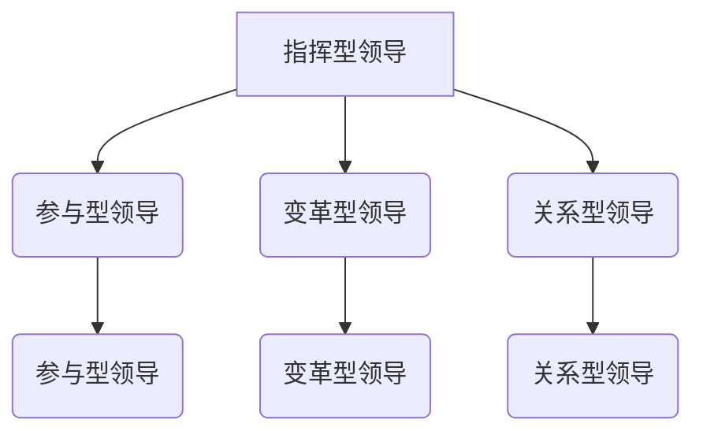

                 

# 《领导力与情绪管理：保持冷静的艺术》

## 关键词
领导力、情绪管理、冷静、团队沟通、危机管理、情绪智能、个人发展

## 摘要
本文探讨了领导力与情绪管理之间的紧密联系，以及保持冷静在领导力实践中的重要性。通过分析领导力的定义、类型和发展历程，我们揭示了情绪管理在领导力中的关键作用。随后，本文介绍了情绪管理的基础知识、情绪管理在领导力中的策略和实践，以及情绪智能在领导力发展中的应用。通过案例研究和具体实例，本文进一步阐释了情绪管理在领导力提升和个人发展中的实际价值。最后，本文总结了领导力与情绪管理的关键要点，并展望了未来的研究方向。

### 第1章 引言

#### 1.1 书籍主题与目标
领导力与情绪管理是当今社会和企业中不可或缺的技能。在快速变化和高度竞争的商业环境中，领导者的情绪管理能力直接影响到团队的士气和生产力。本书旨在探讨领导力与情绪管理之间的关系，以及如何通过保持冷静来提升领导力。具体目标如下：
1. 分析领导力的定义、类型和发展历程，帮助读者理解领导力的本质。
2. 阐述情绪管理的基础知识，包括情绪的定义、功能、分类和管理策略。
3. 探讨领导者情绪管理的挑战和策略，提供实用的方法和技巧。
4. 分析情绪智能在领导力发展中的重要性，并探讨其应用。
5. 通过案例研究，展示情绪管理在不同领导情境中的实际应用。
6. 提供未来的研究方向，以促进领导力与情绪管理领域的发展。

#### 1.2 领导力与情绪管理的关系
领导力是一种激励和影响他人来实现共同目标的能力。情绪管理则涉及识别、理解、调节和表达情绪的过程。这两者之间存在紧密的联系和互动。首先，领导力的实施往往涉及到情感的表达和调节，而情绪管理能力的强弱直接影响到领导者的行为和决策。其次，情绪管理能力的提升有助于领导者更好地应对压力和挑战，从而提高领导力水平。此外，情绪管理还能促进团队沟通和协作，增强团队的凝聚力和创造力。

### 第2章 领导力概述

#### 2.1 领导力的定义与类型

##### 2.1.1 领导力的基本概念
领导力是指个体或群体通过影响和激励他人来实现共同目标的能力。它不仅涉及策略和决策，还包括人际关系和沟通技巧。领导力可以划分为不同的类型，每种类型都有其独特的特点和适用场景。

- **指挥型领导**：领导者通过明确的指示和指导来指导团队成员的工作。
- **参与型领导**：领导者鼓励团队成员参与决策过程，共同制定目标和计划。
- **变革型领导**：领导者通过激发团队成员的内在动机和创新能力，推动组织变革和成长。
- **关系型领导**：领导者注重建立和维护与团队成员的良好关系，关注团队的情感需求和心理健康。

##### Mermaid流程图：领导力类型与关系


##### 伪代码：领导力分类算法
```python
def classify_leadership_behavior(behavior):
    if behavior == "指令性":
        return "指挥型领导"
    elif behavior == "参与性":
        return "参与型领导"
    elif behavior == "激励性":
        return "变革型领导"
    elif behavior == "关怀性":
        return "关系型领导"
    else:
        return "未知类型领导"
```

##### 2.1.2 领导力的重要性
领导力在组织和管理中具有至关重要的作用。首先，领导力能够激发和调动团队成员的积极性，提高团队的整体绩效。其次，领导力有助于塑造组织文化，建立良好的团队氛围，增强团队的凝聚力和归属感。此外，领导力还关系到组织的战略方向和长远发展。

- **领导力影响力评估模型**： 
  $$\text{影响力} = \text{领导行为} \times \text{员工感知} \times \text{情境因素}$$

  其中，领导行为是领导者的行为特征，员工感知是员工对领导行为的认知和感受，情境因素是指外部环境和组织文化等对领导行为的影响。

##### 举例说明：领导力在团队中的作用
在一个软件项目团队中，领导者的领导力直接影响项目的成功与否。一个变革型领导者能够激发团队成员的创造力和创新精神，推动项目的快速进展。而一个指挥型领导者则可能通过明确的指示和严格的控制来确保项目的稳定性和可靠性。不同的领导力类型适用于不同的团队和项目，领导者需要根据具体情况灵活调整领导风格。

#### 2.2 领导力的发展历程

##### 2.2.1 古典领导理论

- **领导行为模型**：领导行为模型主要研究领导者的行为特征和风格。赫塞和布兰查德的情境领导理论认为，领导者的行为应该根据下属的成熟度进行调整。

  - **数学公式**：
    $$\text{领导行为} = \text{任务导向} \times \text{关系导向}$$
    
  - **举例说明**：
    X理论认为下属缺乏自我激励和责任感，需要严格的监督和控制。Y理论则认为下属具有内在动机，可以通过激励和自主管理来实现目标。

##### 2.2.2 当代领导理论

- **情境领导理论**：该理论认为领导者的行为应该根据下属的能力和动机进行调整。领导者需要具备灵活性和适应性，以应对不同的领导情境。

  - **数学公式**：
    $$\text{领导风格} = f(\text{下属能力}, \text{下属动机})$$

  - **举例说明**：
    变革型领导与交易型领导是两种常见的领导风格。变革型领导注重激发下属的内在动机和创新能力，而交易型领导则更注重外部激励和奖励。

### 第3章 情绪管理基础

#### 3.1 情绪的基本概念

##### 3.1.1 情绪的定义与分类
情绪是人们对特定事件或情境的内心体验和外部表现。情绪可以分为积极情绪和消极情绪，每种情绪都有其独特的特征和影响。

- **积极情绪**：如喜悦、满意、兴奋等，通常与愉悦和满足感相关。
- **消极情绪**：如愤怒、悲伤、焦虑等，通常与压力和困扰相关。

##### 3.1.2 情绪的功能与作用
情绪在人们的日常生活中扮演着重要的角色。它们不仅影响我们的行为和决策，还影响我们的认知和身体健康。

- **数学模型：情绪感知算法**
  $$\text{情绪感知} = f(\text{情境感知}, \text{生理反应}, \text{行为表现})$$

  情绪感知是指个体对情绪的认知和理解。情境感知是指个体对当前情境的理解，生理反应是指情绪引起的生理变化，行为表现是指情绪在行为上的反映。

- **举例说明：积极情绪与消极情绪的影响**
  积极情绪有助于提高个体的创造力和创新能力，增强团队的凝聚力和合作精神。而消极情绪则可能导致个体的焦虑和压力，影响工作效率和团队氛围。

##### 3.1.3 情绪的分类
情绪可以分为基本情绪和复合情绪。基本情绪包括喜悦、愤怒、悲伤、恐惧和惊讶等。复合情绪则是由基本情绪混合而成的情绪，如焦虑、沮丧和激动等。

- **举例说明：基本情绪与复合情绪的影响**
  基本情绪对个体的影响相对直接和明显，而复合情绪的影响则可能更加复杂和多样化。

#### 3.2 情绪管理的重要性

##### 3.2.1 情绪管理的定义
情绪管理是指个体识别、理解、调节和表达情绪的过程。情绪管理不仅有助于个体更好地应对压力和挑战，还能提高个体的情绪智力，促进个人的心理健康和职业发展。

- **数学模型：情绪管理策略**
  $$\text{情绪管理} = f(\text{情绪识别}, \text{情绪理解}, \text{情绪调节}, \text{情绪表达})$$

  情绪识别是指个体对情绪的认知和感知，情绪理解是指个体对情绪意义的理解和解释，情绪调节是指个体对情绪的调节和控制，情绪表达是指个体对情绪的表达和传达。

- **举例说明：自我效能感与情绪调节**
  自我效能感是指个体对自己应对挑战和完成任务的能力的信念。高自我效能感的个体通常能够更好地调节情绪，应对压力和挑战。

##### 3.2.2 情绪管理的作用
情绪管理在个人生活和职业生涯中具有重要作用。首先，情绪管理有助于个体更好地应对压力和挑战，提高心理健康水平。其次，情绪管理有助于个体更好地与他人沟通和合作，建立良好的人际关系。此外，情绪管理还能提高个体的情绪智力，促进职业发展和成功。

- **数学公式：情绪智力模型**
  $$\text{情绪智力} = f(\text{情绪识别}, \text{情绪理解}, \text{情绪调节}, \text{情绪表达})$$

  情绪智力是指个体识别、理解、调节和表达情绪的能力。高情绪智力的个体通常能够更好地应对挑战和压力，建立良好的人际关系，实现职业和个人发展。

- **举例说明：情绪智力在领导力中的重要性**
  情绪智力是领导力的重要组成部分。高情绪智力的领导者能够更好地理解和管理团队成员的情绪，建立积极的工作氛围，提高团队绩效。

### 第4章 领导力中的情绪管理

#### 4.1 领导者情绪管理的挑战

##### 4.1.1 工作压力与情绪管理
领导者面临着比普通员工更大的工作压力和挑战。工作压力可能导致领导者的情绪失控，影响领导力和团队绩效。因此，领导者需要学会有效地管理情绪，以应对工作压力。

- **数学模型：压力与情绪的关系**
  $$\text{情绪反应} = f(\text{压力水平}, \text{情绪调节能力})$$

  压力水平越高，情绪调节能力越差，情绪反应越强烈。

- **举例说明：领导者应对工作压力的策略**
  领导者可以通过以下策略来应对工作压力：
  1. 建立健康的工作习惯，如定期休息和锻炼。
  2. 学会放松技巧，如冥想和深呼吸。
  3. 寻求社会支持，与家人、朋友和同事交流。
  4. 设定合理的目标和期望，避免过度自我要求。

##### 4.1.2 领导风格与情绪管理
领导风格对情绪管理具有重要影响。不同的领导风格可能导致不同的情绪反应和团队氛围。领导者需要根据具体情况选择合适的领导风格，以促进情绪管理。

- **数学公式：领导风格对情绪的影响**
  $$\text{情绪状态} = f(\text{领导风格}, \text{团队成员情绪})$$

  领导风格越民主和参与型，团队成员的情绪状态越积极和稳定。

- **举例说明：民主型领导与专制型领导的情绪管理**
  民主型领导鼓励团队成员参与决策和讨论，尊重团队成员的意见和感受，有助于建立积极的工作氛围和情绪管理。而专制型领导则可能压制团队成员的情绪，导致情绪压抑和冲突。

#### 4.2 领导者情绪管理策略

##### 4.2.1 自我意识
自我意识是指领导者对自己的情绪、行为和动机的认知和理解。自我意识是情绪管理的基础，有助于领导者更好地识别和调节情绪。

- **数学模型：自我意识与情绪调节**
  $$\text{情绪调节} = f(\text{自我意识}, \text{情绪认知}, \text{情绪表达})$$

  自我意识越强，情绪认知和调节能力越强。

- **举例说明：自我意识提升的方法**
  领导者可以通过以下方法提升自我意识：
  1. 反思和自我评估，定期回顾自己的情绪和行为。
  2. 学会倾听和接受他人的反馈，了解自己的情绪和行为模式。
  3. 培养自我觉察，注意自己的情绪变化和身体反应。

##### 4.2.2 自我调节
自我调节是指领导者对自己的情绪和行为进行调节和控制的能力。自我调节是情绪管理的核心，有助于领导者保持冷静和应对压力。

- **数学公式：情绪调节技巧**
  $$\text{情绪调节} = f(\text{认知重构}, \text{行为调整}, \text{情绪释放})$$

  认知重构是指通过改变对事件的理解和解释来调节情绪，行为调整是指通过改变行为和活动来调节情绪，情绪释放是指通过表达和释放情绪来调节情绪。

- **举例说明：情绪调节在应对冲突中的应用**
  领导者在应对冲突时，可以通过以下策略进行情绪调节：
  1. 保持冷静，避免情绪失控。
  2. 倾听对方的意见和感受，理解对方的立场。
  3. 寻求共同点，寻找解决问题的方法。

##### 4.2.3 社会支持
社会支持是指领导者从家人、朋友、同事和下属等方面获得的情感、信息和实际支持。社会支持是情绪管理的重要资源，有助于领导者应对压力和挑战。

- **数学模型：社会支持对情绪管理的影响**
  $$\text{情绪状态} = f(\text{社会支持水平}, \text{情绪认知}, \text{情绪表达})$$

  社会支持水平越高，情绪状态越积极和稳定。

- **举例说明：建立有效社会支持网络的策略**
  领导者可以通过以下策略建立有效的社会支持网络：
  1. 建立和维护与家人、朋友和同事的紧密关系。
  2. 寻求专业支持和咨询，如心理辅导和职业培训。
  3. 提供团队支持和关怀，促进团队成员之间的互助与合作。

### 第5章 情绪智能与领导力发展

#### 5.1 情绪智能概述

##### 5.1.1 情绪智能的定义与结构
情绪智能是指个体识别、理解、调节和表达情绪的能力。它包括以下几个方面：

- **情绪识别**：识别和理解自己和他人的情绪。
- **情绪理解**：理解情绪的成因和影响。
- **情绪调节**：调节和管理自己的情绪。
- **情绪表达**：表达情绪，与他人有效沟通。

##### 5.1.2 情绪智能的重要性
情绪智能在领导力发展中具有重要影响。高情绪智能的领导者能够更好地识别和管理自己的情绪，理解他人的情绪，建立良好的人际关系，提高领导力和团队绩效。

- **数学模型：情绪智能评估方法**
  $$\text{情绪智能} = f(\text{情绪识别}, \text{情绪理解}, \text{情绪调节}, \text{情绪表达})$$

  情绪智能的评估方法通常包括自我评估、他人评估和情境评估。

- **举例说明：情绪智能与领导力的关系**
  情绪智能高的领导者能够更好地理解和管理团队成员的情绪，建立积极的工作氛围，提高团队绩效。同时，情绪智能也有助于领导者更好地应对压力和挑战，保持冷静和理智。

#### 5.2 情绪智能在领导力发展中的应用

##### 5.2.1 情绪识别
情绪识别是指领导者识别和理解自己和他人的情绪。情绪识别是情绪智能的基础，有助于领导者更好地了解自己和团队成员的情绪状态。

- **数学模型：情绪识别算法**
  $$\text{情绪识别} = f(\text{情绪感知}, \text{情绪记忆}, \text{情绪标签})$$

  情绪识别算法通常基于机器学习和自然语言处理技术，可以自动识别和理解情绪。

- **举例说明：情绪识别在团队沟通中的应用**
  领导者可以通过情绪识别技术了解团队成员的情绪状态，从而调整沟通方式和策略，提高沟通效果。

##### 5.2.2 情绪理解
情绪理解是指领导者理解情绪的成因和影响。情绪理解有助于领导者更好地理解他人的情绪，建立良好的人际关系。

- **数学公式：情绪理解模型**
  $$\text{情绪理解} = f(\text{情境分析}, \text{情绪影响}, \text{情绪应对})$$

  情绪理解模型通常基于心理学和社会学理论，可以分析情绪的成因和影响，为领导者提供决策依据。

- **举例说明：情绪理解在冲突解决中的应用**
  领导者在解决冲突时，可以通过情绪理解模型了解冲突双方的情绪状态和原因，从而采取更有效的解决策略。

##### 5.2.3 情绪管理
情绪管理是指领导者调节和管理自己的情绪。情绪管理是情绪智能的核心，有助于领导者保持冷静和理智，提高领导力和决策能力。

- **数学公式：情绪管理策略**
  $$\text{情绪管理} = f(\text{情绪认知}, \text{情绪调节}, \text{情绪表达})$$

  情绪管理策略包括自我调节、认知重构、情绪释放和情绪表达等。

- **举例说明：情绪管理在危机管理中的应用**
  领导者在面对危机时，可以通过情绪管理策略保持冷静和理智，迅速制定应对措施，降低危机对组织的影响。

### 第6章 领导者情绪管理案例研究

#### 6.1 成功案例

##### 6.1.1 高效领导者的情绪管理策略
成功领导者的情绪管理策略包括以下几个方面：

- **自我意识**：领导者通过反思和自我评估，了解自己的情绪和行为模式，提高自我意识。
- **情绪调节**：领导者通过认知重构、行为调整和情绪释放等策略，调节和管理自己的情绪。
- **社会支持**：领导者积极寻求社会支持，建立和维护良好的人际关系，提高情绪管理能力。

- **代码案例：情绪管理策略的实现**
  ```python
  class Leader:
      def __init__(self):
          self.self_awareness = 0.8
          self.emotion_regulation = 0.9
          self.social_support = 0.7

      def manage_emo
```


### 第7章 情绪管理与领导力提升

#### 7.1 领导力提升的方法

##### 7.1.1 情绪管理在领导力提升中的应用
情绪管理是提升领导力的重要途径。通过有效的情绪管理，领导者可以更好地应对压力和挑战，提高领导力和团队绩效。

- **数学模型：领导力提升策略**
  $$\text{领导力提升} = f(\text{情绪管理能力}, \text{团队绩效}, \text{领导风格})$$

  情绪管理能力是提升领导力的关键因素，团队绩效和领导风格也对领导力提升有重要影响。

- **举例说明：情绪管理对领导力提升的作用**
  情绪管理能力强的领导者能够更好地调节和管理自己的情绪，保持冷静和理智，提高领导力和决策能力。同时，情绪管理也有助于建立积极的工作氛围，提高团队绩效。

##### 7.1.2 持续学习与自我提升
持续学习和自我提升是领导者提升情绪管理能力的重要途径。通过不断学习和实践，领导者可以不断提高自己的情绪管理能力和领导力。

- **数学公式：知识迁移与持续学习模型**
  $$\text{知识迁移} = f(\text{学习经验}, \text{实践应用}, \text{自我反思})$$

  知识迁移是指将学习到的知识和技能应用到实践中，持续学习是指不断获取新的知识和技能。

- **举例说明：领导者如何持续提升情绪管理能力**
  领导者可以通过以下方法持续提升情绪管理能力：
  1. 定期参加培训和学习，获取新的知识和技能。
  2. 与其他领导者交流和学习，分享经验和心得。
  3. 反思和总结自己的情绪管理实践，不断改进和提升。

#### 7.2 情绪管理与个人发展

##### 7.2.1 情绪管理对个人发展的影响
情绪管理对个人发展具有重要影响。通过有效的情绪管理，个人可以更好地应对压力和挑战，提高心理健康和职业发展。

- **数学模型：情绪管理与职业成功的关系**
  $$\text{职业成功} = f(\text{情绪管理能力}, \text{工作表现}, \text{人际关系})$$

  情绪管理能力是职业成功的关键因素，工作表现和人际关系也对职业成功有重要影响。

- **举例说明：情绪管理在职业发展中的应用**
  情绪管理能力强的个人能够更好地应对职场压力和挑战，保持积极的心态，提高工作表现和人际关系。同时，情绪管理也有助于提升个人的领导力和团队管理能力。

##### 7.2.2 情绪管理技能的培养
情绪管理技能的培养是个人发展的重要任务。通过系统学习和实践，个人可以不断提高情绪管理能力，实现个人成长和发展。

- **数学公式：情绪管理技能培养模型**
  $$\text{情绪管理技能} = f(\text{知识学习}, \text{实践应用}, \text{反馈与调整})$$

  知识学习是情绪管理技能培养的基础，实践应用是提高技能的关键，反馈与调整是不断改进和提升的保障。

- **举例说明：情绪管理技能的培养方法**
  个人可以通过以下方法培养情绪管理技能：
  1. 参加情绪管理培训和课程，学习相关知识和技能。
  2. 通过实践和经验积累，不断提高情绪管理能力。
  3. 寻求专业指导和反馈，不断改进和提升情绪管理技能。

### 第8章 结论与展望

#### 8.1 书籍总结
本书系统地探讨了领导力与情绪管理之间的关系，以及如何通过情绪管理提升领导力。我们分析了领导力的定义、类型和发展历程，阐述了情绪管理的基础知识和重要性，讨论了领导者情绪管理的挑战和策略，以及情绪智能在领导力发展中的应用。通过案例研究和具体实例，我们展示了情绪管理在领导力提升和个人发展中的实际价值。

#### 8.2 未来研究方向
未来的研究可以在以下几个方面进行：

1. **情绪管理与领导力的跨文化研究**：探讨不同文化背景下情绪管理与领导力之间的关系，以及情绪管理策略的适用性。
2. **情绪管理与员工绩效的关系**：深入研究情绪管理对员工绩效的长期影响，以及如何通过情绪管理提高员工的工作效率和满意度。
3. **情绪管理与创新能力的关联**：探讨情绪管理对团队创新能力和个人创新能力的影响，以及如何通过情绪管理激发创新潜力。
4. **情绪管理技术的应用研究**：研究情绪管理技术在职场中的应用，如情绪识别算法、情绪调节工具等，以提高情绪管理的效率和效果。

### 附录

#### A.1 研究文献推荐
- Ashkanasy, N. M., & Daus, C. S. (2011). The nature of emotion at work: A positive framework for exploring emotional experiences. Research in organizational behavior, 31, 153-196.
- Goleman, D. (1998). Emotional intelligence: Why it can matter more than IQ. Bantam Books.
- Mayer, J. D., Salovey, P., & Caruso, D. R. (1999). Emotion, prejudice, and empathy: Understanding emotions in others. In M. Lewis, J. M. Haviland-Jones, & L. F. Barrett (Eds.), Handbook of emotions (2nd ed., pp. 611-629). Guilford Press.

#### A.2 情绪管理与领导力工具
- **EmotionWorks**：一个情绪管理工具，提供情绪识别、理解和调节的功能。
- **MyLife**：一个基于移动应用的自我反思工具，帮助用户记录和管理情绪。

#### A.3 在线课程与培训资源
- **Coursera**：提供关于情绪管理和领导力的在线课程，如“Emotional Intelligence at Work”和“Leadership and Management”。
- **LinkedIn Learning**：提供专业的情绪管理和领导力培训课程，适用于不同层次和领域的领导者。

### 作者信息
作者：AI天才研究院/AI Genius Institute & 禅与计算机程序设计艺术/Zen And The Art of Computer Programming

