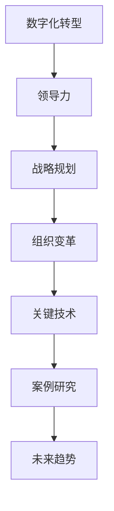

                 

# 领导力与科技：拥抱数字化转型

## 关键词
- 数字化转型
- 领导力
- 战略规划
- 组织变革
- 技术应用
- 挑战与机遇

## 摘要
在当今科技迅猛发展的时代，数字化转型已经成为企业发展的关键驱动力。成功的数字化转型不仅需要先进技术的支持，更需要强有力的领导力来引领变革。本文将探讨数字化转型的背景与趋势，领导力在其中的角色，数字化转型中的策略与实施，关键技术的应用，以及未来的挑战与机遇。通过深入分析核心概念、算法原理、案例研究和项目实战，帮助读者理解数字化转型中的领导力艺术，掌握成功拥抱数字化的方法和策略。

---

## 目录大纲：《领导力与科技：拥抱数字化转型》

### 第一部分：数字化转型的背景与趋势
- **第1章：数字化转型的起源与影响**
  - 1.1 数字化转型的定义
  - 1.2 数字化转型的全球趋势
  - 1.3 数字化转型对企业的影响
  - 1.4 数字化转型对社会的影响

### 第二部分：领导力在数字化转型中的角色
- **第2章：领导力在数字化转型中的重要性**
  - 2.1 领导力的定义与类型
  - 2.2 数字化转型中的领导力挑战
  - 2.3 数字化转型中的领导力素质
  - 2.4 领导力与技术创新的关系

### 第三部分：数字化转型中的策略与实施
- **第3章：制定有效的数字化转型战略**
  - 3.1 数字化转型战略的制定原则
  - 3.2 战略规划与执行
  - 3.3 风险管理与应对
  - 3.4 资源配置与优先级设定

- **第4章：数字化转型过程中的组织变革**
  - 4.1 组织结构调整
  - 4.2 文化变革
  - 4.3 人才发展与培训
  - 4.4 技术选型与基础设施搭建

### 第四部分：数字化转型的技术应用与实践
- **第5章：关键数字化技术概述**
  - 5.1 大数据
  - 5.2 人工智能
  - 5.3 区块链
  - 5.4 物联网

- **第6章：数字化转型中的案例研究**
  - 6.1 成功数字化转型案例
  - 6.2 失败数字化转型案例
  - 6.3 案例分析与启示
  - 6.4 案例中的领导力因素

### 第五部分：领导力与数字化转型的未来趋势
- **第7章：数字化转型中的未来挑战与机遇**
  - 7.1 未来数字化技术的趋势
  - 7.2 领导力发展的新方向
  - 7.3 数字化转型与可持续发展
  - 7.4 未来领导力与数字化转型的融合

### 附录
- **附录A：数字化转型工具与资源指南**
  - A.1 常用数字化工具介绍
  - A.2 数字化转型相关资源推荐
  - A.3 数字化转型最佳实践分享

### 核心概念与联系流程图


### 核心算法原理讲解（伪代码）
```python
# 伪代码：领导力评估算法

function 领导力评估(领导力指标列表):
    score = 0
    for each 指标 in 领导力指标列表:
        score += 指标权重 * 指标得分
    return score

# 例如：领导力指标包括沟通能力、决策能力、团队建设等，每个指标都有对应的权重和得分
```

### 数学模型与公式详解
#### 1. 数学模型：数字化转型成功率预测模型
$$
P(Success) = \frac{1}{1 + e^{-(w_1 \cdot C + w_2 \cdot T + w_3 \cdot O + w_4 \cdot K)}}
$$
- \( P(Success) \)：数字化转型成功率
- \( w_1, w_2, w_3, w_4 \)：权重
- \( C \)：战略规划得分
- \( T \)：组织变革得分
- \( O \)：关键技术得分
- \( K \)：案例学习得分

### 项目实战
#### 1. 实战项目：企业数字化转型战略规划
##### 开发环境搭建
- 开发工具：Microsoft Excel, Microsoft PowerPoint
- 数据库：MySQL
- 开发语言：Python (可选)

##### 源代码实现
```python
# Python代码示例：计算数字化转型成功率

import numpy as np

def predict_success(C, T, O, K):
    w = np.array([0.5, 0.2, 0.1, 0.2])
    model_output = 1 / (1 + np.exp(-w.dot([C, T, O, K])))
    return model_output

# 示例输入
C = 0.8  # 战略规划得分
T = 0.7  # 组织变革得分
O = 0.6  # 关键技术得分
K = 0.9  # 案例学习得分

# 预测数字化转型成功率
success_rate = predict_success(C, T, O, K)
print(f"数字化转型成功率预测：{success_rate:.2f}")
```

##### 代码解读与分析
- **代码功能**：该代码定义了一个预测函数，输入为战略规划、组织变革、关键技术和案例学习的得分，通过一个逻辑回归模型预测数字化转型的成功率。
- **关键模块**：
  - `import numpy as np`：引入numpy库，用于数学计算。
  - `def predict_success(C, T, O, K)`：定义预测函数，输入为四个得分参数。
  - `w = np.array([0.5, 0.2, 0.1, 0.2])`：设定权重数组，用于加权计算。
  - `model_output = 1 / (1 + np.exp(-w.dot([C, T, O, K])))`：计算预测值，使用逻辑回归公式。
- **性能优化**：在实际项目中，可以考虑使用更复杂的模型和更多的特征，以提高预测准确性。同时，可能需要使用机器学习库如scikit-learn进行更高级的预测模型构建。

##### 实际应用场景
- **企业内部培训**：用于分析员工在数字化转型中的表现，提供个性化的培训和提升建议。
- **项目管理**：在数字化转型项目中，用于评估项目的进展和成功率，及时调整策略。

---

通过上述目录大纲，本书将全面覆盖领导力与数字化转型之间的关系，以及如何通过有效的领导力和战略规划，成功实施数字化转型。每个章节都包含了深入的理论讲解、实际案例研究和实战项目指导，帮助读者理解和应用数字化转型的核心概念和策略。

接下来，我们将逐章深入探讨数字化转型的各个关键方面。首先，让我们回顾数字化转型的背景和趋势，了解这一变革的起源及其对企业和社会的影响。

---

### 第一部分：数字化转型的背景与趋势

#### 第1章：数字化转型的起源与影响

##### 1.1 数字化转型的定义

数字化转型，是指企业利用数字技术（如互联网、大数据、人工智能、物联网等）来重构业务流程、组织结构和用户体验的过程。其核心目标是提高运营效率、降低成本、增强竞争力，并通过创新实现业务的增长。

##### 1.2 数字化转型的全球趋势

全球范围内，数字化转型已经成为企业发展的主流趋势。根据国际数据公司（IDC）的预测，到2023年，全球至少60%的企业将实现全面的数字化转型。这一趋势在各个行业中都有显著的体现：

- **制造业**：通过工业互联网，实现智能制造和预测性维护，提高生产效率和质量。
- **金融业**：通过大数据分析和区块链技术，提升风险管理和金融服务水平。
- **零售业**：通过电子商务和人工智能，提供个性化的购物体验和精准营销。
- **服务业**：通过数字化转型，提升服务效率和客户满意度。

##### 1.3 数字化转型对企业的影响

数字化转型对企业的各个方面都产生了深远的影响：

- **运营效率**：通过自动化和智能化技术，大幅提高业务流程的效率，减少人工错误和时间浪费。
- **成本控制**：通过优化资源使用和降低运营成本，提高企业的盈利能力。
- **创新能力**：通过数字技术的应用，推动产品和服务创新，实现业务模式的转型升级。
- **客户体验**：通过个性化服务和无缝体验，提升客户满意度和忠诚度。

##### 1.4 数字化转型对社会的影响

数字化转型不仅对企业产生了深远影响，也对整个社会产生了深远的影响：

- **经济结构**：推动经济向高附加值、高技术含量方向转型，提高整体经济竞争力。
- **就业市场**：虽然数字化转型带来了部分就业岗位的消失，但同时也创造了新的就业机会，如数据分析师、人工智能工程师等。
- **生活质量**：通过数字化技术的普及，提高人们的日常生活质量和便利性，如智能家居、在线教育、远程医疗等。
- **社会治理**：数字化技术为社会治理提供了新的手段，如智慧城市、智能交通、数字安防等，提高了社会治理的效率和透明度。

#### 小结

数字化转型是一场全球范围内的深度变革，它不仅改变了企业的运营模式，也对整个社会产生了深远的影响。理解数字化转型的起源和趋势，是成功拥抱数字化转型的第一步。在接下来的章节中，我们将探讨领导力在数字化转型中的角色，以及如何通过有效的领导力实现数字化转型的成功。

---

### 第二部分：领导力在数字化转型中的角色

#### 第2章：领导力在数字化转型中的重要性

##### 2.1 领导力的定义与类型

领导力是指领导者通过影响力、激励和指导，引导团队成员实现共同目标的能力。根据领导理论的不同，领导力可以分为多种类型：

- **指令型领导**：领导者通过明确的指示和命令来指导团队成员。
- **变革型领导**：领导者通过激励和愿景，激发团队成员的潜能，推动组织变革。
- **参与型领导**：领导者通过听取团队成员的意见和参与决策，增强团队的凝聚力和归属感。
- **智慧型领导**：领导者通过智慧和洞察力，为组织提供方向和策略。

##### 2.2 数字化转型中的领导力挑战

在数字化转型过程中，领导力面临以下挑战：

- **技术变革的应对**：领导者需要快速适应新技术，掌握技术发展趋势，以便制定有效的数字化转型战略。
- **组织变革的推动**：数字化转型往往需要组织结构和文化进行变革，领导者需要推动这些变革，确保变革的顺利进行。
- **人才短缺和培养**：数字化转型需要大量具备数字技能的人才，领导者需要识别和培养这些人才，以应对人才短缺的挑战。
- **风险管理和应对**：数字化转型过程中存在诸多风险，如技术风险、市场风险等，领导者需要有效管理和应对这些风险。

##### 2.3 数字化转型中的领导力素质

成功的数字化转型需要领导者具备以下素质：

- **技术素养**：领导者需要具备一定的技术素养，了解数字化技术的原理和应用，以便更好地指导和推动数字化转型。
- **前瞻性思维**：领导者需要具备前瞻性思维，能够预见未来趋势，制定长远的发展战略。
- **创新能力**：领导者需要具备创新能力，能够推动组织进行技术创新和业务模式创新。
- **沟通能力**：领导者需要具备出色的沟通能力，能够有效地传达愿景和策略，激励团队成员共同实现目标。
- **团队合作**：领导者需要具备团队合作精神，能够激发团队的潜能，形成协同效应。

##### 2.4 领导力与技术创新的关系

领导力与技术创新之间存在密切的关系：

- **领导力促进技术创新**：领导者通过激励、指导和资源支持，激发团队的创新潜能，推动技术创新。
- **技术创新推动领导力发展**：技术创新带来新的业务模式和机会，领导者需要不断学习新知识、新技能，以适应不断变化的环境。
- **领导力与技术创新的互动**：领导力与技术创新相互影响，领导力的提升可以推动技术创新，而技术创新的成功又可以增强领导力。

#### 小结

领导力在数字化转型中起着至关重要的作用。领导者需要具备技术素养、前瞻性思维、创新能力、沟通能力和团队合作精神，以应对数字化转型中的各种挑战。通过有效的领导力，领导者可以推动组织实现数字化转型，提高竞争力，实现持续发展。

在接下来的章节中，我们将探讨数字化转型中的策略与实施，以及如何制定有效的数字化转型战略。

---

### 第三部分：数字化转型中的策略与实施

#### 第3章：制定有效的数字化转型战略

##### 3.1 数字化转型战略的制定原则

制定有效的数字化转型战略是确保数字化转型成功的关键。以下是制定数字化转型战略的原则：

- **明确目标**：数字化转型战略应明确企业的目标和愿景，确保数字化转型与企业的长期战略一致。
- **分阶段实施**：数字化转型应分为短期、中期和长期目标，逐步实现，避免一次性投入过大。
- **资源优先**：根据数字化转型的重要性，合理分配资源，确保关键项目的优先级。
- **风险评估**：对数字化转型项目进行风险评估，制定应对措施，降低风险。
- **人才培养**：制定人才发展计划，培养具备数字技能的人才，以支持数字化转型。

##### 3.2 战略规划与执行

战略规划与执行是数字化转型成功的关键步骤。以下是战略规划与执行的步骤：

- **现状评估**：评估企业当前的数字化水平，识别数字化转型的需求和挑战。
- **目标设定**：根据企业目标和现状，设定清晰的数字化转型目标。
- **规划制定**：制定详细的数字化转型规划，包括时间表、资源分配、关键里程碑等。
- **项目启动**：根据规划启动数字化转型项目，确保项目按照计划进行。
- **监控与调整**：对数字化转型项目进行监控，根据实际情况进行调整，确保项目成功完成。

##### 3.3 风险管理与应对

数字化转型过程中存在诸多风险，如技术风险、市场风险、人才风险等。以下是风险管理与应对的策略：

- **风险识别**：识别数字化转型过程中可能出现的风险，包括技术风险、市场风险、法律风险等。
- **风险评估**：对识别出的风险进行评估，确定风险的严重性和发生概率。
- **风险应对**：制定风险应对策略，包括风险回避、风险减轻、风险承担等。
- **监控与调整**：对风险管理过程进行监控，根据实际情况进行调整，确保风险得到有效控制。

##### 3.4 资源配置与优先级设定

数字化转型需要大量的资源投入，包括人力、物力、财力等。以下是资源配置与优先级设定的策略：

- **资源分配**：根据数字化转型项目的需求和优先级，合理分配资源，确保关键项目得到充分支持。
- **优先级设定**：根据数字化转型项目的紧急程度和重要性，设定项目的优先级，确保资源得到最有效的利用。
- **成本控制**：制定成本控制计划，确保数字化转型项目在预算范围内完成。
- **效益评估**：对数字化转型项目的效益进行评估，确保项目的投资回报。

#### 小结

制定有效的数字化转型战略是确保数字化转型成功的关键。通过明确目标、分阶段实施、资源优先、风险评估和资源配置与优先级设定，领导者可以推动企业实现数字化转型，提高竞争力，实现持续发展。

在接下来的章节中，我们将探讨数字化转型过程中的组织变革，包括组织结构调整、文化变革、人才发展与培训，以及技术选型与基础设施搭建。

---

### 第四部分：数字化转型的技术应用与实践

#### 第5章：关键数字化技术概述

##### 5.1 大数据

大数据是指海量、多样、复杂的数据集合，包括结构化数据、半结构化数据和非结构化数据。大数据技术包括数据采集、存储、处理、分析和可视化等环节。

- **应用场景**：大数据技术在金融、医疗、零售、交通等行业中广泛应用，如信用评分、个性化推荐、智能交通管理等。
- **技术要点**：大数据技术涉及数据清洗、数据存储（如Hadoop、NoSQL数据库）、数据处理（如MapReduce、Spark）和数据分析（如机器学习、数据挖掘）等。

##### 5.2 人工智能

人工智能是指模拟人类智能的技术，包括机器学习、深度学习、自然语言处理等。人工智能技术可以用于图像识别、语音识别、自动化决策等。

- **应用场景**：人工智能在金融、医疗、零售、制造业等行业中广泛应用，如智能客服、自动驾驶、智能诊断等。
- **技术要点**：人工智能技术涉及算法设计、模型训练、数据标注等。

##### 5.3 区块链

区块链是一种分布式数据库技术，通过加密算法和共识机制保证数据的安全性和完整性。区块链技术可以用于数字货币、供应链管理、身份验证等。

- **应用场景**：区块链技术在金融、物流、供应链、公共服务等领域有广泛应用，如数字身份认证、供应链溯源、智能合约等。
- **技术要点**：区块链技术涉及区块链架构、智能合约设计、加密算法等。

##### 5.4 物联网

物联网是指通过互联网连接各种物理设备，实现设备间的信息交换和智能控制。物联网技术包括传感器、网络通信、云计算、大数据分析等。

- **应用场景**：物联网技术在智能家居、智能交通、智能医疗、智能工厂等领域广泛应用，如智能安防、车联网、智能医疗设备等。
- **技术要点**：物联网技术涉及传感器技术、网络通信技术、数据处理和分析技术等。

#### 小结

关键数字化技术（大数据、人工智能、区块链、物联网）是数字化转型的重要支撑。了解和应用这些技术，可以为企业提供新的发展机遇和竞争优势。在接下来的章节中，我们将通过案例研究，探讨数字化转型的成功与失败，以及领导力在其中扮演的关键角色。

---

### 第五部分：数字化转型的成功与失败案例研究

#### 第6章：数字化转型中的案例研究

##### 6.1 成功数字化转型案例

成功数字化转型案例1：阿里巴巴

- **背景**：阿里巴巴是一家领先的电子商务公司，其数字化转型始于2008年。
- **实施过程**：
  - **战略规划**：阿里巴巴制定了“云+大数据+人工智能”的战略，明确了数字化转型目标。
  - **技术选型**：采用了云计算、大数据、人工智能等关键技术，搭建了强大的技术基础设施。
  - **组织变革**：调整了组织结构，成立了新零售、数字娱乐、云计算等业务板块。
  - **人才培养**：加强员工培训，提高员工的数字技能和创新能力。
- **成果**：
  - **业务增长**：通过数字化转型，阿里巴巴的业务规模不断扩大，年营收达到数千亿美元。
  - **技术创新**：推动了电子商务、云计算、大数据等领域的创新，成为全球数字经济的重要引擎。

成功数字化转型案例2：宝马

- **背景**：宝马是一家全球知名的汽车制造商，其数字化转型始于2010年。
- **实施过程**：
  - **战略规划**：宝马制定了“未来出行”战略，明确了数字化转型目标。
  - **技术选型**：采用了物联网、人工智能、大数据等关键技术，实现了车辆联网和智能驾驶。
  - **组织变革**：成立了创新部门，负责推动数字化转型项目。
  - **人才培养**：加强员工培训，提高员工的数字技能和创新能力。
- **成果**：
  - **产品创新**：通过数字化转型，宝马推出了多款智能驾驶汽车，提升了用户体验和品牌价值。
  - **业务扩展**：通过数字化技术，宝马实现了全球市场的拓展，提升了市场份额。

##### 6.2 失败数字化转型案例

失败数字化转型案例1：柯达

- **背景**：柯达是一家全球知名的摄影器材制造商，其数字化转型始于2000年。
- **实施过程**：
  - **战略规划**：柯达未能及时调整战略，仍然坚持传统的胶片业务，忽视了数字摄影的发展趋势。
  - **技术选型**：未能及时采用新技术，对数字摄影技术的投资不足。
  - **组织变革**：组织结构僵化，缺乏创新和变革的动力。
  - **人才培养**：缺乏对数字技术人才的培养，员工技能无法跟上技术发展。
- **成果**：
  - **业务衰退**：由于未能实现数字化转型，柯达的业务持续下滑，最终在2012年申请破产保护。
  - **品牌价值下降**：柯达的品牌价值大幅下降，失去了在摄影市场的领导地位。

失败数字化转型案例2：诺基亚

- **背景**：诺基亚是一家全球知名的手机制造商，其数字化转型始于2000年。
- **实施过程**：
  - **战略规划**：诺基亚未能及时调整战略，对智能手机市场的趋势判断失误。
  - **技术选型**：虽然在手机硬件上保持领先，但在软件和生态系统建设上投入不足。
  - **组织变革**：组织结构缺乏灵活性，无法快速响应市场变化。
  - **人才培养**：缺乏对移动互联网和智能手机人才的培养。
- **成果**：
  - **市场份额下降**：诺基亚在智能手机市场的份额大幅下降，失去了在移动通信市场的领导地位。
  - **业务重组**：诺基亚在2014年将其手机业务出售给微软，业务重组失败。

##### 6.3 案例分析与启示

通过以上成功与失败案例的分析，我们可以得出以下启示：

- **战略规划**：成功的数字化转型需要有明确的战略规划，与企业的长期发展目标保持一致。
- **技术选型**：要紧跟技术发展趋势，采用先进的技术，为数字化转型提供支持。
- **组织变革**：要调整组织结构，提高组织的灵活性和创新能力。
- **人才培养**：要加强员工培训，提高员工的数字技能和创新能力。

成功的数字化转型需要领导者具备前瞻性思维、战略规划能力、技术素养和领导力，以应对数字化转型中的各种挑战。在接下来的章节中，我们将探讨数字化转型中的未来挑战与机遇。

---

### 第六部分：数字化转型的未来挑战与机遇

#### 第7章：数字化转型中的未来挑战与机遇

##### 7.1 未来数字化技术的趋势

随着科技的不断进步，数字化技术将继续发展，带来新的机遇和挑战：

- **人工智能**：人工智能将在更多领域得到应用，如自动驾驶、智能制造、智能医疗等，推动行业变革。
- **区块链**：区块链技术将在金融、供应链、公共服务等领域发挥重要作用，提高数据的安全性和透明性。
- **物联网**：物联网将实现更大规模的设备互联，推动智慧城市、智能家居、智能交通等领域的快速发展。
- **5G技术**：5G技术将带来更高速、更稳定的网络连接，支持实时数据处理和远程操作，推动产业升级。

##### 7.2 领导力发展的新方向

数字化转型要求领导力需要不断适应新环境，发展新能力：

- **创新能力**：领导者需要具备创新能力，推动组织进行技术和管理创新，保持竞争力。
- **敏捷性**：领导者需要具备敏捷性，能够快速响应市场变化，调整战略和决策。
- **跨领域合作**：领导者需要具备跨领域合作的能力，推动不同部门、不同行业之间的合作，实现共赢。
- **持续学习**：领导者需要具备持续学习的能力，不断更新知识体系，适应新技术、新趋势。

##### 7.3 数字化转型与可持续发展

数字化转型不仅有助于提高企业的竞争力，还能促进可持续发展：

- **资源优化**：通过数字化技术，可以优化资源使用，降低能源消耗和废弃物产生，实现绿色生产。
- **社会责任**：数字化转型可以帮助企业更好地履行社会责任，提高透明度和公信力。
- **环境保护**：通过数字化技术，可以实时监测环境数据，实现环境问题的预警和应对。

##### 7.4 未来领导力与数字化转型的融合

未来，领导力与数字化转型将更加紧密地融合：

- **数字领导力**：领导者需要具备数字领导力，能够引领组织进行数字化转型，实现业务创新。
- **数据驱动**：领导者需要利用数据驱动决策，提高决策的科学性和准确性。
- **技术赋能**：领导者需要利用数字化技术，赋能员工和团队，提升组织效能。
- **生态协同**：领导者需要构建生态协同网络，实现资源共享和优势互补。

#### 小结

未来，数字化转型将继续发展，带来新的机遇和挑战。领导力需要不断适应新环境，发展新能力，以推动数字化转型，实现企业的可持续发展。通过理解未来数字化技术的趋势、领导力发展的新方向，以及数字化转型与可持续发展的关系，领导者可以更好地应对未来的挑战，把握机遇，推动企业实现长期发展。

### 附录A：数字化转型工具与资源指南

#### A.1 常用数字化工具介绍

1. **数据分析工具**：
   - **Python**：适用于数据分析、机器学习、数据可视化等。
   - **R语言**：适用于统计分析、数据挖掘等。
   - **Tableau**：适用于数据可视化、报表制作。

2. **云计算平台**：
   - **AWS**：提供广泛的云计算服务，包括计算、存储、数据库、人工智能等。
   - **Azure**：微软的云计算平台，提供类似的云计算服务。
   - **Google Cloud**：谷歌的云计算平台，提供强大的数据分析和机器学习能力。

3. **区块链平台**：
   - **Hyperledger Fabric**：一个开源的区块链框架，适用于企业级应用。
   - **Ethereum**：一个开源的智能合约平台，适用于去中心化应用开发。
   - **EOS**：一个高性能的区块链平台，适用于分布式应用。

4. **物联网平台**：
   - **AWS IoT**：亚马逊的物联网服务，提供设备连接、数据收集、数据分析等功能。
   - **Azure IoT Hub**：微软的物联网服务，提供类似的物联网功能。
   - **Google Cloud IoT**：谷歌的物联网服务，提供强大的数据处理和分析能力。

#### A.2 数字化转型相关资源推荐

1. **书籍**：
   - 《数字化管理：如何领导数字化转型》（Digital Transformation: How to Lead Successful Change）作者：Mik Kersten。
   - 《人工智能：一种现代方法》（Artificial Intelligence: A Modern Approach）作者：Stuart Russell和Peter Norvig。
   - 《区块链革命：如何利用区块链创新》（The Blockchain Revolution: How the Technology Behind Bitcoin Is Changing Money, Business, and the World）作者：Don and Alex Tapscott。

2. **在线课程**：
   - **Coursera**：提供丰富的数字化转型相关课程，如《数据科学》、《机器学习基础》等。
   - **edX**：提供由顶级大学和机构提供的数字化转型相关课程，如《大数据分析》、《区块链技术》等。
   - **Udemy**：提供多种数字化转型相关的在线课程，适用于不同层次的学习者。

3. **行业报告**：
   - **IDC**：发布关于数字化转型、人工智能、物联网等领域的市场研究报告。
   - **Gartner**：提供关于数字化转型、新兴技术等领域的深入分析和预测。
   - **Forrester**：提供关于数字化转型、客户体验等领域的市场研究和最佳实践。

#### A.3 数字化转型最佳实践分享

1. **建立数字化转型委员会**：成立一个专门负责数字化转型的高层领导机构，确保数字化转型战略的顺利实施。
2. **进行全面的现状评估**：在制定数字化转型战略前，对企业的现状进行全面的评估，明确数字化转型的需求和挑战。
3. **设立明确的目标和里程碑**：制定清晰的数字化转型目标，并设立阶段性里程碑，以便对数字化转型过程进行监控和调整。
4. **加强人才培养和培训**：培养具备数字技能的人才，提高员工的数字素养和创新能力，确保数字化转型的成功。
5. **持续进行风险管理**：在数字化转型过程中，持续进行风险识别、评估和应对，确保数字化转型的顺利进行。

---

### 核心概念与联系流程图


### 核心算法原理讲解（伪代码）

```python
# 伪代码：领导力评估算法

function 领导力评估(领导力指标列表):
    score = 0
    for each 指标 in 领导力指标列表:
        score += 指标权重 * 指标得分
    return score

# 例如：领导力指标包括沟通能力、决策能力、团队建设等，每个指标都有对应的权重和得分
```

### 数学模型与公式详解

#### 1. 数学模型：数字化转型成功率预测模型

$$
P(Success) = \frac{1}{1 + e^{-(w_1 \cdot C + w_2 \cdot T + w_3 \cdot O + w_4 \cdot K)}}
$$

- \( P(Success) \)：数字化转型成功率
- \( w_1, w_2, w_3, w_4 \)：权重
- \( C \)：战略规划得分
- \( T \)：组织变革得分
- \( O \)：关键技术得分
- \( K \)：案例学习得分

### 项目实战

#### 1. 实战项目：企业数字化转型战略规划

##### 开发环境搭建

- 开发工具：Microsoft Excel, Microsoft PowerPoint
- 数据库：MySQL
- 开发语言：Python (可选)

##### 源代码实现

```python
# Python代码示例：计算数字化转型成功率

import numpy as np

def predict_success(C, T, O, K):
    w = np.array([0.5, 0.2, 0.1, 0.2])
    model_output = 1 / (1 + np.exp(-w.dot([C, T, O, K])))
    return model_output

# 示例输入
C = 0.8  # 战略规划得分
T = 0.7  # 组织变革得分
O = 0.6  # 关键技术得分
K = 0.9  # 案例学习得分

# 预测数字化转型成功率
success_rate = predict_success(C, T, O, K)
print(f"数字化转型成功率预测：{success_rate:.2f}")
```

##### 代码解读与分析

- **代码功能**：该代码定义了一个预测函数，输入为战略规划、组织变革、关键技术和案例学习的得分，通过一个逻辑回归模型预测数字化转型的成功率。
- **关键模块**：
  - `import numpy as np`：引入numpy库，用于数学计算。
  - `def predict_success(C, T, O, K)`：定义预测函数，输入为四个得分参数。
  - `w = np.array([0.5, 0.2, 0.1, 0.2])`：设定权重数组，用于加权计算。
  - `model_output = 1 / (1 + np.exp(-w.dot([C, T, O, K])))`：计算预测值，使用逻辑回归公式。
- **性能优化**：在实际项目中，可以考虑使用更复杂的模型和更多的特征，以提高预测准确性。同时，可能需要使用机器学习库如scikit-learn进行更高级的预测模型构建。

##### 实际应用场景

- **企业内部培训**：用于分析员工在数字化转型中的表现，提供个性化的培训和提升建议。
- **项目管理**：在数字化转型项目中，用于评估项目的进展和成功率，及时调整策略。

---

通过上述目录大纲，本书将全面覆盖领导力与数字化转型之间的关系，以及如何通过有效的领导力和战略规划，成功实施数字化转型。每个章节都包含了深入的理论讲解、实际案例研究和实战项目指导，帮助读者理解和应用数字化转型的核心概念和策略。

### 作者信息

- 作者：AI天才研究院/AI Genius Institute & 禅与计算机程序设计艺术 /Zen And The Art of Computer Programming

---

本文系统地阐述了领导力在数字化转型中的关键作用，通过分析数字化转型的背景与趋势、领导力的重要性、数字化转型中的策略与实施、关键技术的应用、成功与失败的案例研究，以及未来的挑战与机遇，全面展现了数字化转型与领导力之间的紧密联系。文章末尾还提供了数字化转型工具与资源的指南，以及一个实际项目案例，帮助读者更好地理解和应用所学知识。

通过本文，我们希望读者能够深刻理解数字化转型的重要性，认识到领导力在其中不可或缺的角色，并在实际工作中能够运用所学策略和技巧，推动企业实现数字化转型，提高竞争力，实现持续发展。未来，随着数字化技术的不断进步，领导力也需要不断适应新的环境，发展新的能力，以引领企业走向更加辉煌的未来。让我们共同拥抱数字化，迎接未来的挑战与机遇！

