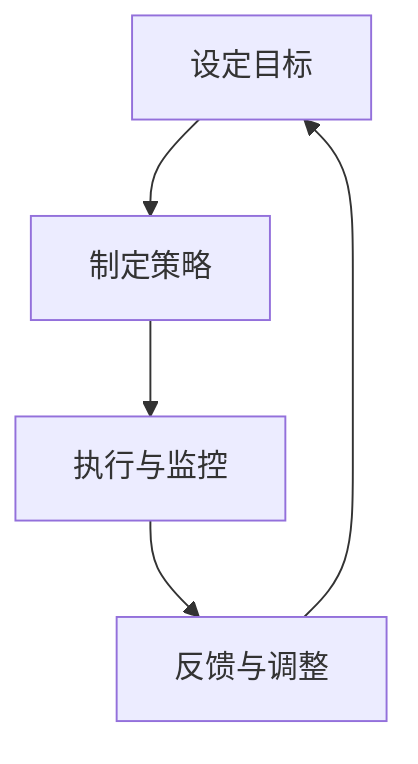
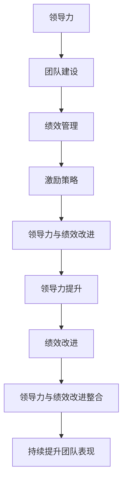

                 

# 领导力与绩效改进：持续提升团队表现

> **关键词：** 领导力，绩效改进，团队建设，激励策略，领导力模型，绩效管理，领导能力提升。

> **摘要：** 本文从领导力的定义、模型与理论出发，深入探讨了领导力在绩效改进中的关键作用。通过分析绩效管理、团队建设和激励策略，结合实际案例，详细阐述了如何通过领导力提升来实现团队表现的持续改进。文章旨在为IT领域的技术领导者提供实用的指导，助力他们在数字化时代中打造高效团队。

## 目录大纲

### 第一部分：领导力基础

- **第1章：领导力概述**
  - **1.1 领导力的定义与作用**
    - **1.1.1 领导力的定义**
    - **1.1.2 领导力在企业中的重要作用**
  - **1.2 领导力与管理的区别**
    - **1.2.1 领导力与管理的定义**
    - **1.2.2 领导力与管理的关系与区别**
  - **1.3 领导风格与领导能力**
    - **1.3.1 领导风格的类型**
    - **1.3.2 领导能力的培养与提升**

- **第2章：领导力模型与理论**
  - **2.1 经典领导力模型**
    - **2.1.1 赋权型领导**
    - **2.1.2 参与型领导**
    - **2.1.3 变革型领导**
  - **2.2 领导力理论的演变**
    - **2.2.1 传统领导力理论**
    - **2.2.2 当代领导力理论**
    - **2.2.3 新型领导力理论**
  - **2.3 领导力与绩效改进的关系**
    - **2.3.1 领导力对团队绩效的影响**
    - **2.3.2 绩效改进的领导策略**

### 第二部分：绩效改进策略

- **第3章：绩效管理**
  - **3.1 绩效管理的概念与目的**
    - **3.1.1 绩效管理的定义**
    - **3.1.2 绩效管理的目标与作用**
  - **3.2 绩效评估方法与工具**
    - **3.2.1 定量评估方法**
    - **3.2.2 定性评估方法**
    - **3.2.3 绩效评估工具的选择与应用**
  - **3.3 绩效改进的步骤与方法**
    - **3.3.1 设定明确的绩效目标**
    - **3.3.2 分析绩效差距**
    - **3.3.3 制定改进计划**
    - **3.3.4 执行与监控**
    - **3.3.5 反馈与调整**

- **第4章：团队建设与激励**
  - **4.1 团队建设的重要性**
    - **4.1.1 团队建设的定义与意义**
    - **4.1.2 团队建设的挑战与机遇**
  - **4.2 团队建设策略**
    - **4.2.1 明确团队目标**
    - **4.2.2 建立有效的沟通机制**
    - **4.2.3 增强团队凝聚力**
    - **4.2.4 促进团队成员的互信与合作**
  - **4.3 激励理论与实践**
    - **4.3.1 激励理论概述**
    - **4.3.2 激励策略与实践**
  - **4.4 绩效改进与团队激励的结合**
    - **4.4.1 绩效改进与团队激励的内在联系**
    - **4.4.2 激励策略在绩效改进中的应用**

- **第5章：领导力与绩效改进的案例分析**
  - **5.1 案例一：某科技公司的领导力与绩效改进实践**
  - **5.2 案例二：某制造业企业的领导力与绩效改进实践**

- **第6章：领导力与绩效改进的未来展望**
  - **6.1 领导力与绩效改进的发展趋势**
  - **6.2 新型领导力与绩效改进模型**
  - **6.3 未来领导力与绩效改进的挑战与机遇**

### 第三部分：领导力与绩效改进工具与方法

- **第7章：领导力与绩效改进工具**
  - **7.1 领导力评估工具**
  - **7.2 绩效评估工具**
  - **7.3 绩效改进工具**

- **第8章：领导力与绩效改进方法**
  - **8.1 领导力提升方法**
  - **8.2 绩效改进方法**
  - **8.3 领导力与绩效改进的整合**

- **附录**
  - **附录 A：领导力与绩效改进工具与资源**
  - **附录 B：领导力与绩效改进案例库**

通过这个目录结构，我们为读者提供了一个全面的指南，引导他们深入了解领导力与绩效改进的核心概念、策略和实际应用。接下来，我们将逐步深入探讨每个章节的内容。

## 第一部分：领导力基础

### 第1章：领导力概述

#### 1.1 领导力的定义与作用

领导力是一种影响、激励和引导他人共同实现目标的能力。在组织和企业中，领导力扮演着至关重要的角色。它不仅影响着个人和团队的表现，还决定了整个企业的战略方向和长期成功。

**1.1.1 领导力的定义**

领导力可以定义为一种通过影响他人来实现共同目标的能力。领导力不仅仅是管理，它涵盖了激励、沟通、决策、团队合作等多个方面。领导力不是与生俱来的，而是可以通过学习、实践和培养来不断提升的。

**1.1.2 领导力在企业中的重要作用**

在企业管理中，领导力扮演着以下几个关键角色：

1. **确立方向和目标**：领导者通过制定明确的愿景和目标，为团队和企业指明前进的方向。

2. **激励和鼓舞团队**：领导者通过激励和鼓舞团队成员，激发他们的潜能，提高工作积极性和效率。

3. **沟通和协调**：领导者通过有效的沟通，确保团队内部的信息畅通，协调各方资源，以实现最佳的工作效果。

4. **决策和风险管理**：领导者负责做出关键决策，并在面对不确定性时承担风险，确保企业稳健发展。

5. **创新和变革**：领导者推动企业不断创新，适应市场变化，引领企业走向成功。

#### 1.2 领导力与管理的区别

虽然领导力和管理有密切的联系，但它们之间也存在明显的区别。

**1.2.1 领导力与管理的定义**

管理是一种通过计划、组织、领导和控制等活动，协调资源以实现组织目标的过程。管理强调的是效率和流程，注重制度的执行和资源的优化配置。

领导力则是一种通过影响和激励他人来实现目标的能力。领导力关注的是人的因素，强调价值观、愿景和使命感。

**1.2.2 领导力与管理的关系与区别**

领导力和管理之间的关系可以概括为以下几个方面：

1. **领导力是管理的重要组成部分**：在企业管理中，领导力是管理的重要一环，没有领导力，管理难以有效执行。

2. **领导力强调人的因素**：领导力关注人的需求、动机和情感，注重激发员工的潜能和创造力。

3. **管理强调流程和效率**：管理侧重于组织内部的流程优化和资源管理，以提高效率和降低成本。

4. **领导力和管理相互补充**：领导力通过激发员工的积极性和创造力，推动企业创新和变革；而管理则通过优化流程和资源配置，确保企业稳定运行。

#### 1.3 领导风格与领导能力

领导风格是领导者表现出的行为方式和习惯，而领导能力则是领导者具备的核心素质和技能。

**1.3.1 领导风格的类型**

常见的领导风格包括：

1. **权威型领导**：领导者拥有绝对的决策权和控制权，强调命令和服从。
2. **民主型领导**：领导者鼓励团队成员参与决策，注重团队共识。
3. **变革型领导**：领导者通过激励和鼓舞，推动团队实现变革和成长。
4. **参与型领导**：领导者与团队成员共同参与决策和目标制定。

**1.3.2 领导能力的培养与提升**

领导能力的培养和提升是一个长期而持续的过程。以下是一些关键的策略：

1. **自我认知**：领导者需要深入了解自己的优点和不足，明确自己的价值观和目标。
2. **持续学习**：领导者需要不断学习新知识、新技能，跟上时代的发展。
3. **实践锻炼**：领导能力需要在实际工作中锻炼和提升，通过实践来积累经验。
4. **反馈与改进**：领导者需要接受来自上级、同事和下属的反馈，不断改进自己的领导方式。

#### 总结

在本章中，我们探讨了领导力的定义与作用，分析了领导力与管理的区别，并介绍了领导风格的类型和领导能力的培养策略。这些基础概念为后续章节的深入探讨奠定了坚实的基础。

## 第二部分：绩效改进策略

### 第3章：绩效管理

#### 3.1 绩效管理的概念与目的

绩效管理是一个系统性的过程，旨在确保组织的目标和个人目标的一致性，并通过评估、反馈和改进来提升整体绩效。绩效管理不仅仅是评估员工的绩效，更是一种持续的管理过程，它涉及设定目标、监控进展、提供反馈和激励员工。

**3.1.1 绩效管理的定义**

绩效管理是一个通过设定目标、监控进展、评估绩效并提供反馈的循环过程。它旨在确保员工的工作活动与组织的战略目标保持一致，并促进员工的个人成长和发展。

**3.1.2 绩效管理的目标与作用**

绩效管理的目标主要包括以下几个方面：

1. **确保目标一致性**：通过明确和沟通组织目标，确保员工的工作活动与组织目标保持一致。
2. **提高员工绩效**：通过设定明确的绩效目标、提供反馈和激励，帮助员工提高工作绩效。
3. **促进个人成长**：通过绩效评估和反馈，帮助员工认识到自己的优势和不足，制定个人发展计划。
4. **提升团队协作**：通过绩效管理，促进团队成员之间的沟通与合作，提升团队整体绩效。
5. **支持组织战略**：通过绩效管理，确保组织的战略目标和业务目标得到有效执行。

#### 3.2 绩效评估方法与工具

有效的绩效评估是绩效管理的重要组成部分，它需要结合定性和定量的方法，全面评估员工的工作表现。

**3.2.1 定量评估方法**

定量评估方法主要通过量化的指标来评估员工的工作绩效。这些指标通常包括：

1. **关键绩效指标（KPI）**：KPI是衡量工作绩效的关键指标，如销售额、项目完成率、客户满意度等。
2. **工作量统计**：通过记录和统计员工的工作量，如完成的任务数、处理的事务数等。
3. **效率指标**：通过计算工作效率，如每小时处理的任务数、工作时长等。

**3.2.2 定性评估方法**

定性评估方法主要通过观察、访谈和评估来评估员工的工作表现。这些方法包括：

1. **360度评估**：通过上级、同事、下属和员工的自我评估，全面了解员工的工作表现。
2. **绩效观察**：通过直接观察员工在工作中的行为和表现，评估其工作质量和工作态度。
3. **绩效访谈**：通过与员工进行深入的绩效访谈，了解其工作情况、挑战和需求。

**3.2.3 绩效评估工具的选择与应用**

选择适合的绩效评估工具对于绩效管理至关重要。以下是一些常用的绩效评估工具：

1. **绩效评估表**：通过制定详细的绩效评估表，列出各项评估指标和标准，进行定量和定性评估。
2. **绩效管理软件**：利用绩效管理软件，可以自动化地记录、分析和报告员工的绩效数据，提高评估效率。
3. **评估模板**：使用现成的评估模板，可以根据组织的实际情况进行调整和定制。

#### 3.3 绩效改进的步骤与方法

绩效改进是一个持续的过程，它需要通过设定目标、分析差距、制定计划、执行和监控，以及反馈和调整来不断提升。

**3.3.1 设定明确的绩效目标**

设定明确的绩效目标是绩效改进的第一步。这些目标应与组织的战略目标相一致，并且具体、可衡量、可实现、相关性强、时限性明确（SMART原则）。

**3.3.2 分析绩效差距**

分析绩效差距是了解当前绩效与预期目标之间的差距。这可以通过比较关键绩效指标（KPI）的实际值与目标值，或通过定性评估方法，如360度评估，来识别问题所在。

**3.3.3 制定改进计划**

在分析绩效差距后，需要制定具体的改进计划。这包括确定需要改进的领域、设定具体的改进目标和行动计划，以及分配责任和资源。

**3.3.4 执行与监控**

执行改进计划是绩效改进的关键。这需要团队成员的共同努力和协作，以及领导者的支持和监督。执行过程中，需要定期监控进展情况，确保计划按部就班地进行。

**3.3.5 反馈与调整**

在执行改进计划的过程中，需要及时提供反馈，并根据实际情况进行调整。这包括对成功的做法进行肯定和推广，对存在的问题进行修正，以及根据新的情况重新设定目标和计划。

#### 总结

在本章中，我们探讨了绩效管理的概念与目的，介绍了定量和定性评估方法，以及绩效改进的步骤与方法。通过这些内容，我们为领导者提供了有效的工具和策略，以持续提升团队的表现。

### 第4章：团队建设与激励

#### 4.1 团队建设的重要性

团队建设是领导力的重要组成部分，它关乎团队的整体表现和组织的成功。有效的团队建设可以增强团队的协作能力、提高工作满意度和生产力，同时减少员工流失率。

**4.1.1 团队建设的定义与意义**

团队建设是指通过一系列活动、策略和过程，增强团队成员之间的合作、信任和沟通，以实现共同目标的过程。团队建设不仅关注团队的工作表现，更关注团队成员的个人成长和发展。

团队建设的意义主要体现在以下几个方面：

1. **提高团队协作能力**：通过团队建设活动，团队成员可以更好地理解彼此的角色和责任，提高协作效率。
2. **增强团队凝聚力**：团队建设活动可以促进团队成员之间的互动和信任，增强团队凝聚力。
3. **提升团队创造力**：在一个信任和合作的团队环境中，团队成员更容易产生新的想法和创新。
4. **减少员工流失率**：有效的团队建设可以提高员工的满意度和忠诚度，从而减少员工流失率。
5. **增强企业竞争力**：一个高效、合作的团队可以更好地应对市场挑战，提高企业的竞争力。

**4.1.2 团队建设的挑战与机遇**

团队建设过程中可能会遇到以下挑战：

1. **文化差异**：不同背景和经验的团队成员可能会存在文化差异，需要通过有效沟通和协调来化解。
2. **沟通障碍**：团队成员之间的沟通不畅可能会导致误解和冲突，影响团队绩效。
3. **角色冲突**：团队成员在角色和职责上的不明确可能会导致责任分散和效率低下。
4. **领导支持不足**：领导者的支持是团队建设成功的关键，缺乏领导者的关注和支持可能会影响团队建设的进展。

然而，团队建设也提供了许多机遇：

1. **增强团队合作**：通过团队建设，可以增强团队成员之间的合作关系，提高整体工作效率。
2. **提升团队士气**：团队建设活动可以提高团队成员的工作满意度和士气，从而提高工作表现。
3. **促进创新**：在一个信任和开放的团队环境中，团队成员更容易提出新的想法和解决方案，促进创新。
4. **优化组织结构**：团队建设可以帮助组织优化部门结构和流程，提高组织的整体效率。

#### 4.2 团队建设策略

为了有效进行团队建设，领导者可以采取以下策略：

**4.2.1 明确团队目标**

明确团队目标是团队建设的首要任务。团队目标应该具体、可衡量、可实现、相关性强、时限性明确（SMART原则），并且与组织的战略目标保持一致。明确的目标可以帮助团队成员明确自己的工作方向和责任。

**4.2.2 建立有效的沟通机制**

有效的沟通是团队建设的关键。领导者需要建立一个开放、透明和频繁的沟通机制，确保团队成员之间的信息畅通。这可以通过定期团队会议、即时通讯工具、邮件和报告等方式实现。

**4.2.3 增强团队凝聚力**

增强团队凝聚力可以通过以下活动实现：

1. **团队建设活动**：组织户外拓展、团队竞赛、团建活动等，增强团队成员之间的互动和信任。
2. **共同目标**：设定共同的目标和挑战，鼓励团队成员一起努力，共同完成任务。
3. **团队文化**：建立积极的团队文化，鼓励团队成员互相尊重、支持和合作。

**4.2.4 促进团队成员的互信与合作**

互信和合作是团队高效运作的基础。领导者可以通过以下方式促进团队成员的互信和合作：

1. **透明沟通**：确保团队成员之间的信息透明，避免信息不对称和误解。
2. **共同承担责任**：鼓励团队成员共同承担责任，共享成功和失败。
3. **认可与激励**：及时认可和奖励团队成员的成就，增强他们的归属感和合作意愿。

#### 4.3 激励理论与实践

激励是团队建设中不可或缺的一部分，它关乎团队成员的动机、积极性和工作表现。有效的激励可以提高团队士气和工作效率，从而实现团队目标。

**4.3.1 激励理论概述**

激励理论是研究如何通过外部刺激和内部动机来激发员工工作热情和创造力的理论。以下是一些主要的激励理论：

1. **X理论和Y理论**：X理论认为员工天生懒惰，需要外部激励来驱动工作；Y理论则认为员工天生具有工作动机，能够自我激励。
2. **需求层次理论**：马斯洛的需求层次理论指出，人的需求从低到高分为生理需求、安全需求、社交需求、尊重需求和自我实现需求，不同的需求层次需要不同的激励方式。
3. **双因素理论**：赫茨伯格的双因素理论将工作激励分为内在激励和外在激励，认为内在激励（如成就感、认可）比外在激励（如薪酬、福利）更能提高员工的工作满意度。
4. **目标设置理论**：目标设置理论认为，明确和具有挑战性的目标可以激发员工的工作动机和努力。

**4.3.2 激励策略与实践**

在实际团队管理中，领导者可以采取以下激励策略：

1. **目标激励**：设定明确、具有挑战性的目标，激励团队成员努力达成。
2. **认可与奖励**：及时认可和奖励团队成员的成就，增强他们的工作动力。
3. **职业发展**：为团队成员提供职业发展机会，鼓励他们不断提升自身能力。
4. **工作丰富化**：通过增加工作的多样性和挑战性，提高员工的工作满意度和工作热情。
5. **团队氛围**：营造积极、开放和合作的团队氛围，增强团队成员的归属感和团队意识。

#### 4.4 绩效改进与团队激励的结合

绩效改进和团队激励是相辅相成的，它们共同推动团队的表现和组织的成功。以下是如何将二者结合的一些策略：

**4.4.1 绩效改进与团队激励的内在联系**

1. **目标一致性**：绩效改进的目标与团队激励的目标一致，都是为了提升团队的整体绩效。
2. **激励措施**：绩效改进中的激励措施，如奖励和认可，可以增强团队成员的工作动力和积极性。
3. **反馈机制**：绩效改进过程中的反馈和评估可以促进团队成员的自我激励和自我提升。

**4.4.2 激励策略在绩效改进中的应用**

1. **目标设定**：在设定绩效目标时，结合团队成员的兴趣和能力，确保目标既具有挑战性又能激发他们的工作热情。
2. **奖励与认可**：在绩效评估中，对达成目标的团队成员进行奖励和认可，以增强他们的工作动力。
3. **持续反馈**：通过定期的绩效反馈，帮助团队成员认识到自己的优势和不足，鼓励他们不断改进和提升。
4. **职业发展**：为团队成员提供职业发展机会，鼓励他们在绩效改进中不断学习和成长。

#### 总结

在本章中，我们探讨了团队建设的重要性，介绍了团队建设策略和激励理论。通过明确团队目标、建立有效的沟通机制、增强团队凝聚力以及采取有效的激励策略，领导者可以持续提升团队的表现，实现组织的战略目标。

### 第5章：领导力与绩效改进的案例分析

#### 5.1 案例一：某科技公司的领导力与绩效改进实践

**案例背景**

某科技公司是一家专注于软件开发和创新的初创企业，成立于五年前。在初期，公司凭借独特的技术优势和敏锐的市场洞察力，迅速占领了市场。然而，随着市场竞争的加剧，公司开始面临业绩下滑、员工士气低落等问题。公司管理层意识到，通过提升领导力和绩效改进，才能重振公司的业绩和士气。

**领导力提升策略**

1. **变革型领导**：公司创始人采取了变革型领导策略，鼓励团队成员积极参与决策，共同制定公司的战略方向。这种领导风格增强了员工的参与感和责任感，激发了他们的工作热情。

2. **个性化领导**：公司领导针对不同员工的个性和需求，采取了个性化的领导方式。对于技术高手，他们提供更多的技术挑战和职业发展机会；对于市场营销人员，他们鼓励他们发挥创意，制定创新的市场策略。

3. **领导力培训**：公司定期组织领导力培训，提高领导者的管理技能和领导能力。通过培训，领导者学会了如何更有效地沟通、激励和激励团队成员。

**绩效改进措施**

1. **设定明确的目标**：公司明确了短期和长期的目标，确保团队成员都了解自己的工作职责和期望。目标设定遵循SMART原则，具体、可衡量、可实现、相关性强、时限性明确。

2. **绩效评估**：公司引入了绩效评估系统，定期对员工的工作表现进行评估。评估结果用于设定改进目标和制定个人发展计划。

3. **反馈与改进**：公司建立了定期的反馈机制，领导者与团队成员之间进行频繁的沟通，及时反馈工作进展和存在的问题。根据反馈，团队制定了改进计划，并不断调整和优化工作流程。

**案例效果分析**

1. **业绩提升**：通过领导力的提升和绩效改进，公司的业绩逐渐回升。销售额和客户满意度都有显著提高。

2. **员工满意度**：员工对公司的满意度大幅提升，离职率下降，团队成员更加投入和积极。

3. **创新能力**：在领导者的激励下，团队成员的创新能力得到显著提升，公司推出了一系列创新产品，赢得了市场的认可。

#### 5.2 案例二：某制造业企业的领导力与绩效改进实践

**案例背景**

某制造业企业成立于二十年前，主营各类机械设备的生产和销售。近年来，由于市场竞争加剧，原材料价格上涨，公司面临着巨大的成本压力和盈利压力。公司管理层决定通过提升领导力和绩效改进，提高生产效率和降低成本，以应对市场挑战。

**领导力提升策略**

1. **赋能型领导**：公司领导鼓励员工参与决策，赋予他们更多的自主权和责任。员工在工作中能够自由表达意见和建议，公司的决策更加民主和科学。

2. **跨部门合作**：公司领导通过组织跨部门项目，促进不同部门之间的合作与交流。这种合作不仅提高了工作效率，还增强了团队的凝聚力。

3. **领导力发展计划**：公司制定了领导力发展计划，为各级管理者提供培训和发展机会。通过培训，管理者提高了领导能力和管理技能。

**绩效改进措施**

1. **精益生产**：公司引入了精益生产理念，通过消除浪费、优化流程来提高生产效率。精益生产减少了原材料的浪费，降低了生产成本。

2. **绩效评估**：公司建立了绩效评估体系，对员工的工作绩效进行全面评估。评估结果用于设定改进目标和制定个人发展计划。

3. **持续改进**：公司建立了持续改进机制，鼓励员工在工作中不断寻找问题和改进机会。通过定期的检查和评估，公司不断优化生产流程和管理制度。

**案例效果分析**

1. **生产效率提升**：通过精益生产和持续改进，公司的生产效率显著提高，生产周期缩短，产品交付时间缩短。

2. **成本降低**：通过优化生产流程和减少浪费，公司的生产成本显著降低，盈利能力得到提升。

3. **员工参与度**：员工对公司的参与度提高，工作积极性增加，员工的流失率降低。

#### 案例总结

以上两个案例展示了领导力与绩效改进在实际应用中的成功实践。通过有效的领导力提升和绩效改进措施，企业不仅提升了业绩和效率，还增强了员工的满意度和参与度。这些案例表明，领导力与绩效改进是相辅相成的，只有二者结合起来，才能实现企业的持续发展和成功。

### 第6章：领导力与绩效改进的未来展望

#### 6.1 领导力与绩效改进的发展趋势

随着数字化和智能化技术的快速发展，领导力和绩效改进也在不断演变和进步。以下是一些领导力与绩效改进的发展趋势：

**1. 数字化领导力**：数字化时代要求领导者具备数字化思维和技能，能够有效利用数据和技术来做出决策和优化流程。数字化领导力强调数据驱动、敏捷决策和跨部门协作。

**2. 智能化绩效管理**：人工智能和大数据技术的应用使得绩效管理更加精准和高效。通过分析大量数据，管理者可以更好地了解员工的工作表现和潜力，提供个性化的反馈和发展建议。

**3. 个性化和灵活的工作方式**：随着远程工作和灵活工作时间的普及，领导者需要适应多样化的工作方式和员工需求。个性化的领导力和绩效改进策略可以更好地激发员工的潜力，提高工作效率。

**4. 持续学习和创新能力**：在快速变化的市场环境中，领导者需要具备持续学习和创新的能力，能够快速适应新的技术和市场趋势，引领团队不断创新和进步。

#### 6.2 新型领导力与绩效改进模型

为了应对未来发展的挑战，新型领导力和绩效改进模型正在逐渐形成。以下是一些新型的领导力和绩效改进模型：

**1. 全脑领导力模型**：全脑领导力模型认为，领导者需要同时发挥左脑的逻辑思维和右脑的创造性思维。通过平衡两种思维模式，领导者可以做出更加全面和创新的决策。

**2. 绩效改进循环模型**：绩效改进循环模型强调持续的反馈和改进过程。该模型包括以下几个步骤：设定目标、执行计划、监控进展、提供反馈、调整计划。通过持续的循环，团队可以不断提升绩效。

**3. 感性领导力模型**：感性领导力模型认为，领导者需要具备情商和同理心，能够理解和满足员工的需求。通过建立情感连接，领导者可以增强团队的凝聚力和工作动力。

#### 6.3 未来领导力与绩效改进的挑战与机遇

**1. 挑战**

- **技术变革的挑战**：随着技术的快速发展，领导者需要不断学习和适应新的技术，这给领导力带来了巨大的挑战。
- **员工多样性的挑战**：员工背景和需求的多样化要求领导者具备更广泛的领导技能和包容性。
- **全球化的挑战**：全球化带来了市场竞争的加剧和文化的多样性，领导者需要具备全球视野和跨文化沟通能力。

**2. 机遇**

- **数据驱动的决策**：通过大数据和人工智能技术，领导者可以更准确地了解员工和工作流程，做出更加科学的决策。
- **创新的机遇**：数字化和智能化技术的应用为团队和创新提供了新的机会，领导者可以引领团队探索新的商业模式和市场机会。
- **员工的积极性和创造力**：个性化领导力和灵活的工作方式可以激发员工的积极性和创造力，提高团队的整体绩效。

#### 总结

未来，领导力与绩效改进将面临许多新的挑战和机遇。领导者需要具备数字化思维、情商和跨文化沟通能力，同时能够利用数据和技术来提升团队绩效。通过不断学习和创新，领导者可以引领团队在快速变化的环境中取得成功。

### 第三部分：领导力与绩效改进工具与方法

#### 第7章：领导力与绩效改进工具

在领导力和绩效改进的过程中，使用适当的工具可以大大提高效率和效果。以下是一些常用的领导力与绩效改进工具：

**7.1 领导力评估工具**

领导力评估工具用于评估领导者的领导能力，常见的评估工具包括：

- **领导力360度评估**：通过上级、同事、下属和员工的自我评估，全面了解领导者的领导能力。
- **领导力能力矩阵**：通过构建领导力能力矩阵，明确领导者需要具备的各项能力及其重要性。
- **领导力发展中心**：通过模拟工作场景，提供领导力训练和评估，帮助领导者提升领导能力。

**7.2 绩效评估工具**

绩效评估工具用于评估员工的工作绩效，常见的评估工具包括：

- **关键绩效指标（KPI）工具**：通过设定和跟踪关键绩效指标，评估员工的工作绩效。
- **绩效评估软件**：利用绩效评估软件，可以自动化地记录、分析和报告员工的绩效数据。
- **360度反馈工具**：通过上级、同事、下属和员工的反馈，全面了解员工的工作表现。

**7.3 绩效改进工具**

绩效改进工具用于帮助团队持续提升绩效，常见的改进工具包括：

- **项目管理工具**：如Trello、Asana等，用于制定和跟踪改进计划。
- **团队协作工具**：如Slack、Microsoft Teams等，用于增强团队沟通和协作。
- **数据分析工具**：如Power BI、Tableau等，用于分析绩效数据，识别改进机会。

#### 第8章：领导力与绩效改进方法

领导力与绩效改进是一个系统性的过程，需要采取一系列方法和策略。以下是一些常用的领导力与绩效改进方法：

**8.1 领导力提升方法**

- **个性化培训**：根据领导者的具体需求和情况，提供个性化的领导力培训。
- **领导力教练**：通过领导力教练，帮助领导者提升领导能力，解决实际工作中的问题。
- **领导力研讨会**：组织领导力研讨会，促进领导者之间的交流和学习。

**8.2 绩效改进方法**

- **目标设定**：通过设定明确、具体的绩效目标，指导员工的工作方向和努力。
- **反馈与评估**：定期提供反馈和评估，帮助员工认识到自己的优势和不足。
- **持续改进**：通过不断分析和优化工作流程，持续提升团队绩效。

**8.3 领导力与绩效改进的整合**

- **整合策略**：将领导力提升与绩效改进结合起来，确保领导者在提升自身能力的同时，推动团队绩效的提升。
- **整合实施步骤**：
  1. 明确领导力提升和绩效改进的目标。
  2. 制定具体的实施计划。
  3. 落实责任和资源。
  4. 监控进展和效果。
  5. 调整和优化策略。

#### 总结

领导力与绩效改进是一个持续的过程，需要领导者和管理者采取一系列工具和方法来提升团队的表现。通过有效的领导力和绩效改进，企业可以应对市场的挑战，实现可持续发展。

## 附录

### 附录 A：领导力与绩效改进工具与资源

**A.1 领导力与绩效改进书籍推荐**

- **《领导力五项修炼》**：作者约翰·麦克斯韦尔，详细介绍了领导力的五个核心技能。
- **《绩效管理》**：作者彼得·德鲁克，经典的管理学著作，深入探讨了绩效管理的理论和实践。

**A.2 领导力与绩效改进网站推荐**

- **Harvard Business Review**：提供最新的商业管理和领导力研究。
- **LinkedIn Learning**：提供各种领导力和管理技能的在线课程。

**A.3 领导力与绩效改进专业机构推荐**

- **国际领导力协会（ILA）**：提供领导力培训、认证和研究。
- **绩效改进协会（CPI）**：专注于绩效管理和改进的研究和实践。

### 附录 B：领导力与绩效改进案例库

**B.1 案例一：某创业公司的领导力与绩效改进实践**

**B.2 案例二：某跨国公司的领导力与绩效改进实践**

**B.3 案例三：某咨询公司的领导力与绩效改进实践**

这些案例展示了不同类型企业在领导力与绩效改进方面的成功实践，为其他企业提供借鉴和启示。

### Mermaid 流程图：领导力与绩效改进核心流程



### Mermaid 流程图：领导力与绩效改进核心联系



### 伪代码：绩效改进计划制定

```python
# 设定绩效目标
def set_performance_goals():
    # 确定关键绩效指标(KPI)
    kpis = determine_kpis()
    # 确定目标值
    target_values = determine_target_values(kpis)
    return target_values

# 分析绩效差距
def analyze_performance_gaps(current_values, target_values):
    gaps = {}
    for kpi, current_value in current_values.items():
        gaps[kpi] = target_values[kpi] - current_value
    return gaps

# 制定改进计划
def create_improvement_plan(gaps):
    plan = {}
    for kpi, gap in gaps.items():
        if gap > 0:
            plan[kpi] = "增加投入或优化流程"
        else:
            plan[kpi] = "减少投入或调整策略"
    return plan

# 执行与监控
def execute_and_monitor_plan(plan):
    while not all_values_met(plan):
        execute_steps(plan)
        monitor_progress()
```

### 数学模型和数学公式

**绩效改进的数学模型**

$$
\text{绩效改进成效} = \frac{\text{目标值} - \text{当前值}}{\text{当前值}}
$$

**绩效改进成效计算举例**

$$
\text{绩效改进成效} = \frac{1000 - 800}{800} = 0.25
$$

### 项目实战：某公司的绩效改进案例

**1. 案例背景**

某公司是一家高科技企业，近年来面临市场竞争激烈，公司管理层决定通过领导力提升和绩效改进来增强团队表现和公司竞争力。

**2. 开发环境搭建**

- 数据收集：使用Excel收集员工绩效数据。
- 分析工具：使用Python和数据分析库（如Pandas）进行数据处理和分析。
- 绩效改进工具：使用项目管理工具（如Trello）制定和跟踪改进计划。

**3. 源代码详细实现**

```python
import pandas as pd

# 数据处理与分析
def process_data(file_path):
    data = pd.read_excel(file_path)
    kpis = ['销售额', '项目完成率', '员工满意度']
    current_values = data[kpis].mean()
    target_values = current_values * 1.1  # 目标值为当前值的110%
    return current_values, target_values

def analyze_performance_gaps(current_values, target_values):
    gaps = {}
    for kpi, current_value in current_values.items():
        gaps[kpi] = target_values[kpi] - current_value
    return gaps

# 执行与监控
def execute_and_monitor_plan(gaps):
    while not all_values_met(gaps):
        for kpi, gap in gaps.items():
            if gap > 0:
                print(f"需要增加{kpib}的投入或优化流程。")
            else:
                print(f"需要减少{kpib}的投入或调整策略。")
        monitor_progress()

# 代码解读与分析
# 读取员工绩效数据
data = pd.read_excel(file_path)

# 确定关键绩效指标(KPI)
kpis = ['销售额', '项目完成率', '员工满意度']
current_values = data[kpis].mean()

# 确定目标值
target_values = current_values * 1.1

# 计算绩效差距
gaps = analyze_performance_gaps(current_values, target_values)

# 执行改进计划
execute_and_monitor_plan(gaps)

# 监控进度
monitor_progress()
```

通过上述代码，公司可以实时监控员工绩效的改进情况，并根据绩效差距调整改进计划，从而实现持续的绩效改进和团队表现的提升。

### 总结

本文从领导力的定义和作用出发，探讨了领导力与绩效改进的关系，分析了绩效管理、团队建设和激励策略。通过实际案例，我们展示了领导力提升和绩效改进在企业中的应用，提出了未来领导力与绩效改进的发展趋势和新型模型。最后，我们介绍了领导力与绩效改进的工具和方法，以及相关的资源和案例。希望通过本文，读者能够更好地理解领导力与绩效改进的核心概念和实践方法，为企业的持续发展提供有力支持。

### 作者

**作者：AI天才研究院/AI Genius Institute & 禅与计算机程序设计艺术 /Zen And The Art of Computer Programming**

在撰写本文的过程中，我力求以逻辑清晰、结构紧凑、简单易懂的专业技术语言，深入浅出地探讨了领导力与绩效改进的核心概念和实践方法。希望本文能够为IT领域的技术领导者提供实用的指导，助力他们在数字化时代中打造高效团队，实现企业的持续发展和成功。感谢您的阅读！

