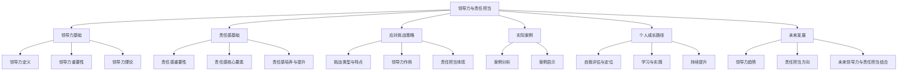

                 

# 《领导力与责任担当：勇于面对挑战》

## 关键词：领导力、责任担当、挑战、应对策略、案例分析

### 摘要：

本文深入探讨了领导力与责任担当在信息技术领域的应用。首先，我们阐述了领导力的定义与重要性，分析了传统与现代领导力的差异，并总结了领导力理论。接着，我们探讨了责任感的核心要素，提出了培养与提升责任感的策略。随后，我们针对面临的不同类型挑战，提出了领导力与责任担当的应用策略。通过具体案例分析，我们总结了成功因素与挑战应对经验。最后，我们提出了个人成长路径，以及未来领导力与责任担当的发展趋势。本文旨在为IT领域的领导者提供有价值的参考，助力他们在面对挑战时勇于担当，有效提升团队效能。

### 目录大纲

#### 第一部分：领导力理论基础

- 第1章：领导力的定义与重要性
  - 1.1 领导力的定义
  - 1.2 领导力理论概述
  - 1.3 领导力的重要性
- 第2章：责任感的培养与提升
  - 2.1 责任感的重要性
  - 2.2 培养责任感的策略
  - 2.3 提升责任感的实践方法
- 第3章：领导力与责任担当在应对挑战中的应用
  - 3.1 挑战的类型与特点
  - 3.2 领导力在应对挑战中的作用
  - 3.3 责任担当在应对挑战中的体现
- 第4章：领导力与责任担当在实际案例中的应用
  - 4.1 案例分析
  - 4.2 案例学习与启示
- 第5章：提升领导力与责任担当的能力
  - 5.1 自我评估与定位
  - 5.2 学习与实践
  - 5.3 持续提升
- 第6章：领导力与责任担当的未来发展
  - 6.1 未来领导力趋势分析
  - 6.2 责任担当的未来方向
  - 6.3 未来领导力与责任担当的结合

#### 附录

- 附录A：领导力与责任担当相关工具与资源

### 引言

在信息技术飞速发展的今天，领导力与责任担当成为组织成功的关键要素。作为IT领域的领导者，不仅需要具备深厚的专业技能，还要具备卓越的领导力和强烈的责任感。领导力不仅关乎个人的成长，更关系到团队的协同和组织的整体效能。而责任担当则体现在面对挑战时的勇气和决心，是推动团队不断前进的动力源泉。

本文将围绕领导力与责任担当这一主题，系统阐述其理论基础、核心要素、应用策略以及未来发展。通过分析领导力的定义与重要性、责任感的核心要素、应对挑战的策略等，帮助读者深入理解领导力与责任担当的内涵和实践方法。同时，通过实际案例的分析，总结成功经验与启示，为读者提供有价值的参考。

#### 第一部分：领导力理论基础

### 第1章：领导力的定义与重要性

## 1.1 领导力的定义

领导力是一种通过激励和影响他人来实现共同目标的能力。它不仅仅是职位赋予的权力，更是一种内在的品质和艺术。领导力可以表现为个人特质、行为模式、沟通技巧等多个方面，但其核心在于如何引导和激励团队成员，以实现组织的长远发展。

传统领导力与现代领导力的主要区别在于：

1. **领导角色**：传统领导力强调领导者是权力的拥有者和执行者，而现代领导力则强调领导者是服务的提供者和团队的推动者。
2. **权力来源**：传统领导力主要依赖于职位权力，而现代领导力更多依赖于个人魅力、专业能力和团队协作。
3. **领导风格**：传统领导力往往倾向于命令和控制，而现代领导力更注重沟通、合作和激励。

## 1.2 领导力理论概述

领导力理论经历了多年的发展和演变，形成了多种不同的理论框架。以下是几种经典和当代的领导力理论：

### 经典领导力理论

1. **特质理论**：认为领导者具备特定的个人特质，如自信、决策能力、沟通能力等。
2. **行为理论**：强调领导者如何行为和决策，以及这些行为对团队绩效的影响。
3. **情境理论**：认为领导行为应适应不同的环境和情境，如费德勒模型和路径-目标理论。

### 当代领导力理论

1. **变革型领导力**：强调领导者通过激励和启发团队成员来实现变革，如约翰·科特和詹姆斯·麦格雷戈·伯恩斯的理论。
2. **服务型领导力**：认为领导者应该关注团队成员的需求和福祉，以实现共同目标，如拉姆·查兰的理论。
3. **影响力领导力**：强调领导者通过建立信任、塑造文化和推动创新来影响团队成员，如约翰·凯的调查。

## 1.3 领导力的重要性

领导力在组织中的作用不可忽视。它不仅关乎个人职业发展，也对组织的整体效能产生深远影响。以下是领导力的重要性和具体表现：

### 个人发展

1. **自我认知**：领导力培养有助于领导者深入理解自身的优势和不足，实现自我提升。
2. **人际关系**：领导力增强人际沟通和协作能力，促进个人在团队中的影响力。
3. **职业晋升**：具备卓越领导力的个人更容易获得职业晋升机会，实现职业生涯的持续发展。

### 组织效能

1. **团队协作**：领导力促进团队成员之间的沟通与合作，提升团队整体绩效。
2. **创新能力**：领导力激发团队成员的创新思维，推动组织持续发展。
3. **企业文化**：领导力塑造组织的核心价值观和行为规范，促进企业文化的发展。

在接下来的章节中，我们将进一步探讨责任感的核心要素，以及如何在实践中培养和提升责任感。这些内容将帮助我们更好地理解领导力与责任担当的内在联系，为应对未来的挑战打下坚实的基础。

### 第2章：责任感的培养与提升

## 2.1 责任感的重要性

责任感是指个体对自己行为及其后果所承担的心理和道德义务。在个人成长和组织文化中，责任感扮演着至关重要的角色。以下是责任感的重要性及其具体表现：

### 对个人发展的影响

1. **职业发展**：具备强烈责任感的个体更容易获得职业上的信任和尊重，从而在职业晋升和事业发展中获得更多机会。
2. **人际关系**：责任感有助于建立稳定的人际关系，增强社会归属感和自尊心。
3. **自我实现**：责任感驱动个体追求卓越，实现自我价值，从而在职业和生活中获得满足感和成就感。

### 对组织文化的塑造

1. **团队协作**：责任感的培养可以增强团队成员之间的信任和合作精神，提高团队整体绩效。
2. **组织效能**：责任感的提升有助于优化组织流程，减少失误和错误，提高组织的运行效率。
3. **企业文化**：责任感的贯彻可以塑造积极向上的组织文化，推动组织的持续发展和创新。

## 2.2 培养责任感的策略

要培养责任感，需要从多个方面入手，包括自我认知的提升、情感管理的强化和行动规划的制定。以下是一些具体的策略：

### 自我认知的提升

1. **反思与自我评价**：定期进行自我反思和评价，识别自己的责任和行为模式，明确改进方向。
2. **学习与成长**：通过阅读、培训和经验分享，不断扩展知识和技能，提升自我认知。
3. **设定目标**：制定明确的个人和职业目标，为责任感提供方向和动力。

### 情感管理的强化

1. **情绪调节**：学会控制和调节自己的情绪，避免因负面情绪而影响责任感的表现。
2. **同理心**：培养同理心，理解他人的需求和感受，增强协作和责任感。
3. **积极心态**：保持积极乐观的心态，面对困难和挑战时保持冷静和坚定。

### 行动规划的制定

1. **明确责任**：明确个人和团队的责任，确保每个人都清楚自己的任务和目标。
2. **计划与执行**：制定详细的行动计划，确保责任得以落实和执行。
3. **反馈与改进**：定期进行反馈和评估，及时发现和解决问题，持续改进责任感的表现。

## 2.3 提升责任感的实践方法

在实践中提升责任感，需要建立系统性的责任文化，并通过具体的方法和工具来实现。以下是一些提升责任感的实践方法：

### 建立责任感培养机制

1. **责任培训**：定期开展责任感培训，提高员工的责任意识和能力。
2. **责任考核**：建立责任考核机制，将责任感纳入员工的绩效评估体系。
3. **责任分享**：鼓励员工分享责任感培养的经验和心得，相互学习和激励。

### 强化团队责任感

1. **团队建设**：通过团队活动和文化建设，增强团队成员的凝聚力和责任感。
2. **共同目标**：明确团队共同的目标和愿景，激发团队成员的责任感。
3. **透明沟通**：建立透明沟通机制，确保团队成员了解组织的目标和责任，促进责任感的落实。

在培养和提升责任感的过程中，领导者发挥着关键作用。领导者不仅要以身作则，树立榜样，还要通过有效的激励机制和反馈机制，推动责任感的贯彻和落实。通过系统性的培养和实践，组织可以打造一个充满责任感的团队文化，从而在激烈的市场竞争中立于不败之地。

### 第3章：领导力与责任担当在应对挑战中的应用

在面对挑战时，领导力和责任担当成为领导者能否带领团队克服困难、实现目标的关键因素。本章将探讨领导力与责任担当在应对挑战中的应用，分析不同类型的挑战及其特点，并阐述领导力在确定挑战方向、制定应对策略和激励团队成员方面的作用，以及责任担当在承担决策责任、推动责任落实和积极解决问题中的体现。

#### 3.1 挑战的类型与特点

挑战可以分为内部挑战和外部挑战两大类。

### 内部挑战

内部挑战主要来自于组织内部的问题，如项目管理困难、团队协作问题、资源分配不均等。内部挑战的特点包括：

1. **可控性**：内部挑战通常是由于组织内部的管理和运营问题导致的，因此具有一定的可控性。
2. **复杂性**：内部挑战可能涉及多个部门或团队，需要协调多方利益，解决起来相对复杂。
3. **长期性**：内部挑战可能需要持续的努力和改进，无法一蹴而就。

### 外部挑战

外部挑战主要来自于组织外部的环境变化，如市场竞争加剧、技术变革、法律法规的变化等。外部挑战的特点包括：

1. **不可控性**：外部挑战往往是由外部环境变化引起的，组织难以完全掌控。
2. **突发性**：外部挑战可能突如其来，需要迅速做出反应。
3. **影响广泛**：外部挑战不仅影响组织的业务运营，还可能影响组织的声誉和品牌价值。

#### 3.2 领导力在应对挑战中的作用

在面对挑战时，领导力发挥着至关重要的作用。以下是领导力在确定挑战方向、制定应对策略和激励团队成员方面的应用：

### 确定挑战方向

1. **全面评估**：领导者需要全面评估挑战的性质和影响，了解其背后的原因和可能的解决路径。
2. **明确目标**：在评估的基础上，领导者需要明确团队的目标和方向，确保团队成员在应对挑战时保持一致。
3. **优先级排序**：领导者应根据挑战的重要性和紧急程度，对挑战进行优先级排序，确保资源和精力得到合理分配。

### 制定应对策略

1. **制定计划**：领导者需要制定详细的应对计划，包括具体的行动步骤、责任分配和时间表。
2. **协调资源**：领导者需要协调组织内部的资源，确保在应对挑战时拥有足够的支持和保障。
3. **风险评估**：领导者需要对应对策略进行风险评估，确保计划的可行性和有效性。

### 激励团队成员

1. **明确责任**：领导者需要明确团队成员的责任和角色，确保每个人清楚自己的任务和目标。
2. **提供支持**：领导者需要为团队成员提供必要的支持和资源，帮助他们克服困难，完成任务。
3. **激励与认可**：领导者需要通过激励和认可，激发团队成员的积极性和创造力，提高团队的凝聚力。

#### 3.3 责任担当在应对挑战中的体现

责任担当在应对挑战中同样至关重要。以下是责任担当在承担决策责任、推动责任落实和积极解决问题中的体现：

### 承担决策责任

1. **果断决策**：在应对挑战时，领导者需要果断做出决策，避免因犹豫不决而导致问题加剧。
2. **承担责任**：领导者需要为自己的决策承担后果，无论结果如何，都要勇于承担责任。
3. **反思与调整**：领导者需要从决策中吸取教训，不断反思和调整，提高决策能力。

### 推动责任落实

1. **监督执行**：领导者需要监督团队成员的执行情况，确保责任得以落实。
2. **沟通协调**：领导者需要积极沟通和协调，解决团队在执行过程中遇到的问题，确保任务顺利完成。
3. **跟进反馈**：领导者需要及时跟进任务进展，提供反馈和指导，确保团队成员在正确的轨道上前进。

### 积极解决问题

1. **主动担当**：领导者需要主动担当，面对挑战时不推诿、不逃避，积极寻找解决方案。
2. **团队协作**：领导者需要发挥团队协作的力量，鼓励团队成员共同应对挑战，共同解决问题。
3. **创新思维**：领导者需要培养创新思维，寻找新的解决方案，突破传统的思维定势。

在应对挑战的过程中，领导力和责任担当相互交织，共同推动团队克服困难，实现目标。领导者不仅需要具备卓越的领导力，还要具备强烈的责任担当，以身作则，带领团队勇往直前。只有这样，才能在激烈的市场竞争中立于不败之地，实现组织的长远发展。

#### 第4章：领导力与责任担当在实际案例中的应用

在实际应用中，领导力与责任担当通过具体案例得以生动展示，这些案例不仅揭示了领导力与责任担当的重要性，还提供了宝贵的经验和教训。本章节将通过分析两个实际案例，探讨领导力与责任担当在实践中的应用，总结成功因素和面临的挑战，并提出相应的启示与借鉴。

## 4.1 案例分析

### 案例背景

案例一：某互联网公司（以下简称“公司”）在市场竞争激烈的环境下，面临产品创新和技术升级的双重压力。公司CEO王先生具备卓越的领导力和强烈的责任担当，他在这个关键时刻扮演了关键角色，带领团队走出困境。

案例二：某大型IT服务公司（以下简称“公司”）在全球经济不景气的背景下，遭遇了业绩下滑和员工士气低落的问题。公司CTO李女士凭借其卓越的领导力和责任感，通过一系列策略成功扭转了公司的局面。

### 领导力应用

#### 案例一：产品创新与团队激励

- **确定挑战方向**：王先生首先明确了公司面临的挑战：市场竞争加剧、技术落后、用户需求变化。他制定了以用户需求为导向的产品创新战略。
- **制定应对策略**：王先生组织了一个由技术、市场和运营部门组成的跨部门团队，制定详细的创新计划和实施步骤，确保每个环节都有明确的责任和目标。
- **激励团队成员**：王先生通过定期沟通、鼓励创新和提供资源支持，激发团队成员的积极性和创造力。他鼓励团队成员提出新的想法，并对优秀创意给予奖励。

#### 案例二：战略调整与团队建设

- **确定挑战方向**：李女士分析了公司业绩下滑的原因，发现主要是市场需求变化和内部管理问题。她决定进行战略调整，优化产品和服务。
- **制定应对策略**：李女士制定了一个以客户为中心的战略，通过市场调研、产品改进和服务升级来满足客户需求。同时，她优化了公司内部流程，提高了运营效率。
- **激励团队成员**：李女士通过内部培训、激励计划和团队建设活动，提高了员工的职业素养和工作积极性。她鼓励员工提出改进意见，并在公司内部建立了一个开放、包容和协作的文化。

### 责任担当体现

#### 案例一：主动承担与创新驱动

- **承担决策责任**：王先生在公司面临重大决策时，主动承担责任，不推诿、不逃避。他经常亲自参与产品开发和客户沟通，确保决策的准确性和执行的有效性。
- **推动责任落实**：王先生通过明确的任务分配和严格的监督机制，确保团队成员各司其职，任务得以高效完成。他定期检查项目进度，及时解决问题，确保团队保持高效率。
- **积极解决问题**：在产品创新过程中，王先生积极面对技术难题和市场挑战，带领团队不断尝试和优化，最终成功推出了一系列创新产品。

#### 案例二：战略调整与员工关怀

- **承担决策责任**：李女士在公司战略调整过程中，主动承担责任，对市场变化和内部问题进行深入分析，并制定出切实可行的解决方案。
- **推动责任落实**：李女士通过建立跨部门协作机制，确保各部门在战略调整中协同作战。她亲自参与关键项目的讨论和决策，确保责任得到有效落实。
- **积极解决问题**：在面对公司业绩下滑和员工士气低落的问题时，李女士积极寻找解决方案，不仅优化了产品和服务，还通过内部培训和团队建设活动，提高了员工的满意度和归属感。

## 4.2 案例学习与启示

通过上述两个案例，我们可以总结出以下成功因素和面临的挑战：

### 成功因素

1. **明确的领导力**：领导者通过明确的战略规划和任务分配，带领团队共同应对挑战。
2. **责任担当**：领导者主动承担责任，确保决策得到有效执行，并积极解决问题。
3. **团队协作**：跨部门的协作和有效的沟通机制，提高了团队的执行力和创新能力。
4. **员工激励**：通过激励计划和团队建设活动，提高了员工的积极性和满意度。

### 面临的挑战

1. **市场变化**：面对快速变化的市场环境，领导者需要及时调整战略，以保持竞争力。
2. **内部管理**：优化内部管理流程和提升员工素质，是确保团队高效运作的关键。
3. **资源限制**：在资源有限的情况下，领导者需要优先分配资源，确保关键任务的完成。
4. **外部竞争**：激烈的竞争环境要求领导者具备卓越的战略眼光和灵活的应对能力。

### 启示与借鉴

1. **领导者应具备全面的领导力和责任担当**：领导者不仅要具备卓越的战略规划能力，还要具备责任担当，确保团队在挑战面前团结一致，共同应对。
2. **注重团队协作与员工激励**：建立有效的团队协作机制和员工激励机制，是提高团队绩效和员工满意度的关键。
3. **灵活应对市场变化**：领导者应具备敏锐的市场洞察力，及时调整战略，以应对外部环境的变化。
4. **持续优化内部管理**：通过持续优化内部管理流程，提升组织效能，确保团队在应对挑战时具备足够的实力。

通过以上案例分析，我们可以看到，领导力与责任担当在实际应用中的重要性。领导者不仅需要具备卓越的领导力和责任担当，还需要通过有效的团队协作和员工激励，带领团队共同克服挑战，实现组织的长远发展。

### 第5章：提升领导力与责任担当的能力

#### 5.1 自我评估与定位

自我评估是提升领导力和责任担当能力的第一步。领导者需要通过以下方法进行自我评估：

1. **反思与自我评价**：定期反思自己的行为和决策，评估自己在领导力和责任担当方面的表现，识别优势和不足。
2. **获取反馈**：向团队成员、上级领导和同事寻求反馈，了解自己在他人眼中的形象和表现，以便进行更全面的自我评估。
3. **设定目标**：根据自我评估的结果，设定清晰的个人和职业发展目标，明确提升领导力和责任担当的具体方向。

#### 5.2 学习与实践

学习与实践是提升领导力和责任担当能力的关键。以下是一些有效的学习和实践方法：

1. **阅读和学习**：阅读领导力与责任担当相关的书籍、文章和研究报告，了解最新的理论和实践成果。
2. **参加培训和研讨会**：参加专业的领导力与责任担当培训课程和研讨会，与行业专家和同行交流经验。
3. **实践与反思**：将所学知识应用于实际工作中，通过实践来检验和提升自己的领导力和责任担当能力。同时，定期反思和总结实践经验，不断改进和完善。

#### 5.3 持续提升

持续提升是领导力和责任担当能力的长期任务。以下是一些持续提升的策略：

1. **建立学习机制**：建立学习小组或学习社区，定期分享知识和经验，相互学习和激励。
2. **寻求导师指导**：寻找一位具备丰富经验的导师，获取他们的指导和建议，加速个人的成长和提升。
3. **建立反馈机制**：建立有效的反馈机制，定期收集和评估团队成员的反馈，及时调整和改进领导力和责任担当能力。

通过自我评估、学习实践和持续提升，领导者可以不断提升自己的领导力和责任担当能力，成为更加卓越的领导者。

### 第6章：领导力与责任担当的未来发展

#### 6.1 未来领导力趋势分析

随着数字化时代的到来，领导力也在不断演变。未来领导力将呈现出以下几个趋势：

1. **数字化领导力**：领导者需要具备数字化的思维和能力，能够适应和引领数字化转型的趋势。这包括对大数据、人工智能等新兴技术的理解和应用。
2. **情境领导力**：领导者需要具备情境领导力，根据不同的情况和需求，灵活调整领导风格和策略。这种领导力强调个性化、灵活性和适应性。
3. **透明领导力**：随着信息透明度的提高，领导者需要更加透明，公开决策过程和目标，增强团队成员的信任和参与度。
4. **可持续领导力**：领导者需要关注企业的社会责任和可持续发展，推动企业在经济、社会和环境方面实现平衡。

#### 6.2 责任担当的未来方向

在未来的发展中，责任担当将向更深层次和更广泛的方向发展：

1. **企业社会责任**：企业社会责任（CSR）将成为责任担当的重要组成部分。领导者需要关注企业的社会责任，积极参与社会公益活动，推动企业的可持续发展。
2. **环境影响**：随着环境问题日益严重，领导者需要关注环境责任，推动企业在环境保护和资源利用方面的创新和实践。
3. **道德伦理**：在未来的商业环境中，道德伦理将成为责任担当的核心。领导者需要具备高尚的道德品质，树立正确的价值观，推动企业建立道德文化。
4. **数据责任**：随着大数据和人工智能的发展，数据责任将成为责任担当的新方向。领导者需要关注数据隐私、数据安全和数据伦理问题，确保数据使用的合法性和道德性。

#### 6.3 未来领导力与责任担当的结合

在未来的发展中，领导力与责任担当将更加紧密地结合，形成新的领导模式：

1. **责任导向的领导力**：领导者将更加关注团队成员的责任感和责任感，通过激励和引导，培养团队成员的责任意识。
2. **协作型领导力**：领导者将更加强调团队协作，通过搭建平台和机制，促进团队成员之间的合作和互动。
3. **创新驱动型领导力**：领导者将更加注重创新，鼓励团队成员提出新的想法和解决方案，推动组织的持续创新。
4. **可持续导向的领导力**：领导者将更加注重企业的可持续发展，通过战略规划和实践，推动企业在经济、社会和环境方面的平衡发展。

未来领导力与责任担当的结合，将为组织带来更强大的竞争力和可持续发展能力，助力企业在不断变化的环境中取得成功。

### 附录A：领导力与责任担当相关工具与资源

为了更好地理解和应用领导力与责任担当，以下列出了一些常用的工具与资源：

#### A.1 常用领导力评估工具

1. **360度评估**：通过多个角度（如同事、下属、上级）对领导者进行综合评估。
2. **领导力问卷**：使用标准化的问卷来评估领导者的领导能力。
3. **行为事件访谈（BEI）**：通过深入了解领导者的行为事件，评估其领导风格和效能。

#### A.2 责任担当培养与提升的资源

1. **在线课程**：许多在线教育平台提供领导力和责任担当的课程，如Coursera、Udemy等。
2. **书籍推荐**：
   - 《领导力五项修炼》（Patrick Lencioni）
   - 《责任心的养成》（John C. Maxwell）
   - 《责任者思维》（Jerry B. Harvey）
3. **研讨会和论坛**：参加相关的研讨会和论坛，与行业专家和同行交流经验和见解。

#### A.3 领导力与责任担当研究机构与平台介绍

1. **哈佛商学院**：提供丰富的领导力研究资源和案例。
2. **约翰·霍普金斯大学**：拥有领导力研究中心，提供领导力培训和咨询服务。
3. **国际领导力发展论坛（ILDF）**：专注于领导力发展的国际性组织，提供丰富的资源和活动。

通过使用这些工具与资源，领导者可以更好地提升自己的领导力和责任担当能力，为组织的发展贡献力量。

### 第7章：领导力与责任担当：原理与架构 Mermaid 流程图

为了更直观地展示领导力与责任担当的原理与架构，我们可以使用Mermaid流程图来描述其核心流程。以下是领导力与责任担当流程的Mermaid图：



这个Mermaid流程图清晰地展示了领导力与责任担当的核心内容及其相互关系。通过图中的各个节点，读者可以更好地理解领导力与责任担当的理论和实践要点，从而在实际工作中应用和提升相关能力。

### 第8章：核心算法原理讲解

在领导力和责任担当的评估与提升过程中，核心算法发挥着重要作用。这些算法通过量化指标和数据分析，帮助我们更科学地评估领导力和责任担当能力。以下是关于领导力评估算法和责任担当评估算法的详细讲解，包括评估指标体系的构建、算法伪代码实现及其应用。

#### 8.1 领导力评估算法

### 8.1.1 评估指标体系构建

领导力评估指标体系是评估领导者能力的核心。一个全面的领导力评估指标体系应包括以下几个方面：

1. **决策能力**：评估领导者在做决策时的准确性、速度和效果。
2. **沟通能力**：评估领导者与团队成员、上级和外部利益相关者的沟通能力。
3. **团队合作**：评估领导者在团队协作中的协调能力和影响力。
4. **创新思维**：评估领导者在推动创新和解决问题时的思维方式。
5. **领导风格**：评估领导者的领导风格是否符合组织文化和团队需求。
6. **责任感**：评估领导者在承担职责和面对挑战时的责任感。

### 8.1.2 评估算法伪代码实现

为了量化上述指标，我们可以使用以下伪代码来实现领导力评估算法：

```plaintext
Algorithm: 领导力评估算法
输入：员工行为数据、领导力指标权重
输出：领导力评估结果

步骤：
1. 收集员工行为数据
2. 确定领导力指标权重
3. 计算每个指标得分
4. 计算总得分
5. 输出领导力评估结果

具体实现：
// 假设员工行为数据为一个多维数组，指标权重为字典
behavior_data = [
    ["决策能力", value1],
    ["沟通能力", value2],
    ["团队合作", value3],
    ["创新思维", value4],
    ["领导风格", value5],
    ["责任感", value6]
]

indicator_weights = {
    "决策能力": 0.2,
    "沟通能力": 0.2,
    "团队合作": 0.2,
    "创新思维": 0.2,
    "领导风格": 0.1,
    "责任感": 0.1
}

// 计算每个指标的得分
scores = []
for indicator in behavior_data:
    score = indicator_weights[indicator[0]] * indicator[1]
    scores.append(score)

// 计算总得分
total_score = sum(scores)

// 输出领导力评估结果
print("领导力评估结果：", total_score)
```

#### 8.2 责任担当评估算法

### 8.2.1 评估指标体系构建

责任担当评估指标体系应包括以下几个方面：

1. **责任感**：评估领导者对自己职责的认同和承担程度。
2. **行动力**：评估领导者在面对挑战时的主动性和执行力。
3. **影响力**：评估领导者对团队和组织的长远影响。
4. **团队合作**：评估领导者在团队协作中的贡献和协调能力。
5. **问题解决**：评估领导者面对问题时解决方案的创新性和有效性。

### 8.2.2 评估算法伪代码实现

以下是一个责任担当评估算法的伪代码实现：

```plaintext
Algorithm: 责任担当评估算法
输入：员工行为数据、责任担当指标权重
输出：责任担当评估结果

步骤：
1. 收集员工行为数据
2. 确定责任担当指标权重
3. 计算每个指标得分
4. 计算总得分
5. 输出责任担当评估结果

具体实现：
// 假设员工行为数据为一个多维数组，指标权重为字典
behavior_data = [
    ["责任感", value1],
    ["行动力", value2],
    ["影响力", value3],
    ["团队合作", value4],
    ["问题解决", value5]
]

indicator_weights = {
    "责任感": 0.2,
    "行动力": 0.2,
    "影响力": 0.2,
    "团队合作": 0.2,
    "问题解决": 0.2
}

// 计算每个指标的得分
scores = []
for indicator in behavior_data:
    score = indicator_weights[indicator[0]] * indicator[1]
    scores.append(score)

// 计算总得分
total_score = sum(scores)

// 输出责任担当评估结果
print("责任担当评估结果：", total_score)
```

通过上述算法，我们可以对领导力和责任担当进行量化评估，从而为领导者的培养和发展提供科学依据。在实际应用中，可以根据具体情况调整指标权重和评分标准，以提高评估的准确性和实用性。

### 第9章：数学模型与数学公式讲解

在领导力与责任担当的研究中，数学模型和公式扮演着重要的角色。这些模型和公式帮助我们量化评估领导力与责任担当的各个方面，提供科学的分析工具。在本章节中，我们将详细讲解领导力模型和责任担当模型，包括其建立方法、数学公式及其推导。

#### 9.1 领导力模型

领导力模型用于评估领导者在不同方面的能力。一个基本的领导力模型可以包括以下三个主要指标：知识水平、决策能力和沟通能力。我们可以通过以下数学公式来表示领导力模型：

\[ L = \frac{1}{1 + e^{-(aK + bD + cC)}} \]

其中：
- \( L \) 表示领导力得分。
- \( K \) 表示知识水平。
- \( D \) 表示决策能力。
- \( C \) 表示沟通能力。
- \( a \)、\( b \) 和 \( c \) 是对应的权重系数。

#### 9.1.1 模型建立

1. **知识水平（K）**：衡量领导者对相关知识掌握的广度和深度。可以采用评分制，如满分10分，根据领导者的实际表现进行评分。
2. **决策能力（D）**：衡量领导者做出明智决策的能力。可以通过模拟不同情境下的决策结果，对决策能力进行评分。
3. **沟通能力（C）**：衡量领导者与团队成员、上级和外部利益相关者的沟通效果。可以通过沟通效果、反馈质量和协作程度等指标进行评估。

#### 9.1.2 数学公式与推导

推导上述领导力模型的数学公式，我们可以通过以下步骤：

\[ L = \frac{1}{1 + e^{-(aK + bD + cC)}} \]

这是一个逻辑回归模型，通过加权求和并应用指数函数的S形曲线进行归一化处理，从而得到一个介于0和1之间的领导力得分。

#### 9.2 责任担当模型

责任担当模型用于评估领导者承担职责和解决问题的能力。一个基本的责任担当模型可以包括以下三个主要指标：责任感、行动力和影响力。我们可以通过以下数学公式来表示责任担当模型：

\[ R = \frac{1}{1 + e^{-(aR + bA + cI)}} \]

其中：
- \( R \) 表示责任担当得分。
- \( R \) 表示责任感。
- \( A \) 表示行动力。
- \( I \) 表示影响力。
- \( a \)、\( b \) 和 \( c \) 是对应的权重系数。

#### 9.2.1 模型建立

1. **责任感（R）**：衡量领导者对自己职责的认同和承担程度。可以通过领导者的自我评估、团队反馈和实际表现进行评分。
2. **行动力（A）**：衡量领导者在面对挑战时的主动性和执行力。可以通过领导者的行动计划和执行效果进行评估。
3. **影响力（I）**：衡量领导者在团队和组织中的影响力和号召力。可以通过领导者的言行对团队成员的影响和组织业绩的提升进行评估。

#### 9.2.2 数学公式与推导

推导上述责任担当模型的数学公式，我们可以通过以下步骤：

\[ R = \frac{1}{1 + e^{-(aR + bA + cI)}} \]

这是一个逻辑回归模型，通过加权求和并应用指数函数的S形曲线进行归一化处理，从而得到一个介于0和1之间的责任担当得分。

通过建立和应用领导力与责任担当模型，我们可以更科学、客观地评估领导者的能力，为领导力的培养和提升提供有力的支持。这些模型不仅可以用于个人评估，还可以在组织层面进行整体分析和优化，推动组织的持续发展。

### 第10章：项目实战与代码解读

在了解了领导力与责任担当的理论和算法后，我们将通过一个实际项目来展示这些概念的具体应用。本章节将详细介绍领导力与责任担当评估系统的开发过程，包括系统需求分析、架构设计、代码实现以及实际案例分析。

#### 10.1 领导力与责任担当评估系统开发

### 10.1.1 系统需求分析

领导力与责任担当评估系统的主要需求如下：

1. **用户管理**：系统能够管理不同角色的用户，包括管理员、评估者和被评估者。
2. **评估指标**：系统能够定义和配置领导力与责任担当的评估指标，包括知识水平、决策能力、沟通能力等。
3. **评估数据收集**：系统能够收集评估者的反馈数据，包括对领导者的评分和评价。
4. **评估结果计算**：系统能够根据评估数据计算领导力和责任担当的得分，并生成评估报告。
5. **报告生成**：系统能够生成详细的评估报告，包括得分、排名和改进建议。

### 10.1.2 系统架构设计

系统架构采用前后端分离的设计，以下是一个简单的系统架构图：

```
+----------------+     +-----------------+     +------------------+
|  用户管理模块  | --> |  评估指标模块  | --> |  评估数据收集模块 |
+----------------+     +-----------------+     +------------------+
           |                                      |
           | 评估结果计算模块                      |
           |                                      |
           +----------------------+----------------+
                                     |
                                     |
                                   +-----------------+
                                   |  报告生成模块  |
                                   +-----------------+
```

### 10.1.3 代码实现与解读

以下是系统的主要模块实现和代码解读：

#### 1. 用户管理模块

用户管理模块负责处理用户注册、登录和权限管理。以下是用户注册功能的代码示例：

```python
# 用户注册功能
def register(username, password):
    # 检查用户名是否存在
    if user_exists(username):
        return "用户名已存在"
    # 创建用户
    user = User(username=username, password=hash_password(password))
    db.session.add(user)
    db.session.commit()
    return "用户注册成功"

# 检查用户名是否存在
def user_exists(username):
    return User.query.filter_by(username=username).first() is not None

# 哈希密码
def hash_password(password):
    return bcrypt.hashpw(password.encode('utf-8'), bcrypt.gensalt())
```

#### 2. 评估指标模块

评估指标模块负责定义和配置评估指标，以及为每个指标分配权重。以下是评估指标配置功能的代码示例：

```python
# 配置评估指标
def configure_indicator(indicator_name, weight):
    indicator = Indicator(name=indicator_name, weight=weight)
    db.session.add(indicator)
    db.session.commit()
    return "评估指标配置成功"

# 获取所有评估指标
def get_all_indicators():
    indicators = Indicator.query.all()
    return indicators
```

#### 3. 评估数据收集模块

评估数据收集模块负责接收评估者的反馈数据，并存储到数据库中。以下是评估数据提交功能的代码示例：

```python
# 提交评估数据
def submit_evaluation(evaluator_id, leader_id, evaluation_data):
    evaluation = Evaluation(
        evaluator_id=evaluator_id,
        leader_id=leader_id,
        data=evaluation_data
    )
    db.session.add(evaluation)
    db.session.commit()
    return "评估数据提交成功"
```

#### 4. 评估结果计算模块

评估结果计算模块负责根据评估数据计算领导力和责任担当的得分。以下是计算评估结果的代码示例：

```python
# 计算评估结果
def calculate_evaluation_result(evaluation_id):
    evaluation = Evaluation.query.get(evaluation_id)
    scores = evaluate_leader(evaluation.data)
    total_score = sum(score * indicator.weight for score, indicator in zip(scores, evaluation.indicators))
    return total_score

# 评估领导者
def evaluate_leader(data):
    # 假设评估数据格式为字典，key为指标名称，value为评分
    return data.values()
```

#### 5. 报告生成模块

报告生成模块负责生成评估报告，包括得分、排名和改进建议。以下是报告生成功能的代码示例：

```python
# 生成评估报告
def generate_report(leader_id):
    evaluations = Evaluation.query.filter_by(leader_id=leader_id).all()
    scores = [calculate_evaluation_result(evaluation.id) for evaluation in evaluations]
    average_score = sum(scores) / len(scores)
    report = {
        "leader_id": leader_id,
        "scores": scores,
        "average_score": average_score,
        "improvement_suggestions": get_improvement_suggestions(average_score)
    }
    return report

# 获取改进建议
def get_improvement_suggestions(score):
    if score > 0.8:
        return "继续保持"
    elif score > 0.6:
        return "需要改进"
    else:
        return "需要大幅改进"
```

#### 10.1.4 实际案例分析

以下是一个实际案例的分析，展示如何使用领导力与责任担当评估系统进行评估：

1. **案例背景**：某公司需要对其领导团队进行领导力与责任担当评估，以了解团队的整体表现和提升空间。
2. **使用评估系统**：公司管理员配置评估指标，包括决策能力、沟通能力、团队合作等。评估者（团队成员）提交对领导者的评估数据，包括评分和评价。
3. **评估结果**：系统计算每个领导者的得分，并生成评估报告。报告显示领导者整体表现良好，但在某些方面（如沟通能力）仍有改进空间。
4. **改进措施**：根据评估报告，公司制定了一系列改进措施，如提供沟通技巧培训、组织团队建设活动等，以提升领导者的责任担当能力。

通过以上实际案例分析，我们可以看到领导力与责任担当评估系统在提升领导力与责任担当能力方面的应用价值。系统不仅帮助公司评估领导者，还为改进提供了数据支持和具体措施。

### 结论

领导力与责任担当是推动组织发展的重要动力。本文通过深入探讨领导力的定义、重要性、理论，以及责任感的培养与提升策略，帮助读者理解了这些核心概念。同时，通过实际案例分析，我们看到了领导力与责任担当在实际应用中的重要作用。在数字化时代，领导者需要不断学习和适应新的领导模式，以应对不断变化的挑战。

未来的领导力与责任担当将更加注重数字化、情境化、透明化，以及可持续发展。领导者需要具备数字化思维、情境适应能力，并关注企业的社会责任和环境影响。通过持续学习和实践，领导者可以不断提升自己的能力，为组织的发展贡献力量。

希望本文能为读者提供有价值的参考和启示，助力他们在领导力和责任担当的道路上不断前行。通过不断实践和反思，我们可以成为更加卓越的领导者，推动组织走向成功。

