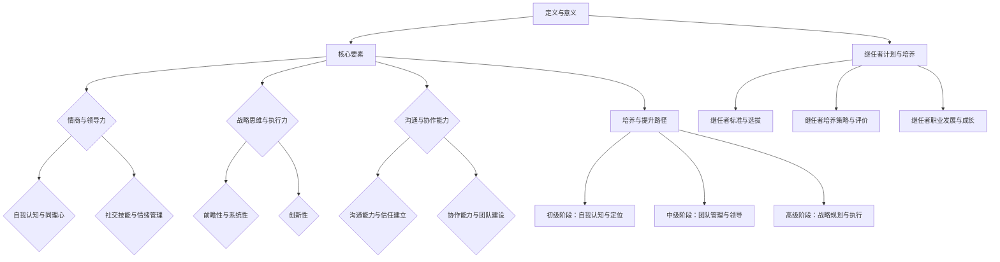

                 

### 1. 领导力与创业价值的定义与意义

#### 1.1 领导力的定义与类型

领导力，作为推动组织向目标迈进的核心动力，其定义和类型多种多样。从根本上讲，领导力是指通过影响和激励他人，共同实现目标的能力。这种能力不仅包括对事务的管理，还涵盖了情感、愿景和变革的引领。

首先，从类型上划分，领导力主要可以分为以下几种：

- **事务型领导力（Transaction Leadership）**：这种类型的领导力主要关注任务和目标的完成。领导者通过明确任务、设定奖励和惩罚机制来激励团队成员。事务型领导力强调的是效率和结果，适用于日常运营和稳定阶段。

- **变革型领导力（Transformational Leadership）**：与事务型领导力不同，变革型领导力更注重创新和变革。这种类型的领导者能够激发团队成员的潜力，推动他们超越自我，共同实现更高层次的目标。变革型领导力强调领导者的愿景和影响力。

- **愿景型领导力（Visionary Leadership）**：愿景型领导力关注长远目标，能够为团队和组织提供明确的方向和目标。这类领导者具备强烈的使命感，能够激励团队成员为之奋斗。

其次，从领导力的具体作用来看，它在创业活动中具有以下几个方面的关键作用：

- **指导方向**：领导力能够帮助创业团队明确目标，制定战略规划，确保企业沿着正确的路径发展。

- **激发潜能**：领导者通过激励和鼓舞团队成员，发挥他们的最大潜力，提升团队的整体绩效。

- **风险管理**：领导力能够帮助团队有效识别和应对风险，确保企业的可持续发展。

#### 1.2 创业价值的理解与体现

创业价值是指通过创业活动为企业和社会创造的价值。它不仅体现在经济效益上，还包括社会效益和长期影响。

首先，从经济效益来看，创业价值主要体现在以下几个方面：

- **财务回报**：创业活动通过创新和商业模式的优化，为企业带来直接的经济收益，如销售收入、利润等。

- **资源增值**：创业过程中，企业通过对资源的整合和优化，提升资源的使用效率和价值。

- **市场竞争**：创业企业通过创新和差异化竞争，提升市场地位和市场份额。

其次，从社会效益来看，创业价值主要体现在以下几方面：

- **就业机会**：创业活动创造了大量的就业机会，缓解了社会就业压力。

- **技术创新**：创业企业通过技术创新，推动了社会科技进步和产业升级。

- **社会进步**：创业活动推动了社会观念的转变，促进了社会文明和进步。

#### 1.3 领导力在创业活动中的作用

在创业活动中，领导力发挥着至关重要的作用。以下是领导力在创业活动中的具体作用：

- **愿景构建**：领导者需要具备远见和洞察力，为企业构建清晰的愿景和目标，指引团队前进。

- **团队凝聚力**：领导力能够激发团队的凝聚力和归属感，促进团队成员之间的协作和合作。

- **创新能力**：领导者需要具备变革和创新的能力，推动企业不断突破，实现持续成长。

- **资源整合**：领导力能够帮助企业有效整合内外部资源，提升资源的使用效率和价值。

- **风险管理**：领导者需要具备风险识别和应对能力，确保企业在不确定的环境中稳健前行。

综上所述，领导力和创业价值密不可分。领导力不仅是推动创业团队实现目标的关键因素，也是企业创造社会和经济价值的重要保障。在接下来的部分中，我们将深入探讨高管领导力的核心要素、培养策略以及领导力发展的趋势与机遇。

---

### 2. 高管领导力的核心要素

#### 2.1 情商与领导力

情商（Emotional Intelligence，简称EQ）是指一个人识别、理解、管理和表达自己情绪的能力，以及识别、理解和管理他人情绪的能力。情商与领导力之间存在着密切的联系，对于高管领导力来说，情商尤为重要。

首先，情商对领导力的影响主要表现在以下几个方面：

- **自我认知**：情商高的领导者能够更好地了解自己的情绪，并认识到情绪对行为和决策的影响。这种自我认知有助于领导者更好地管理自己的情绪，避免因情绪波动而影响决策。

- **同理心**：同理心是情商的重要组成部分，它指的是领导者能够理解和感受他人的情绪。同理心的存在能够增强领导者与团队成员之间的信任和沟通，促进团队的凝聚力。

- **社交技能**：情商高的领导者通常具有较强的社交技能，他们能够有效地与人交往，建立良好的人际关系。这种能力有助于领导者更好地协调团队内部的矛盾，提升团队的协作效率。

其次，提升情商对于高管领导力的培养至关重要。以下是提升情商的几种方法：

- **自我反思**：定期进行自我反思，了解自己的情绪波动和情绪处理方式。通过反思，领导者可以识别出情绪管理中的不足，并加以改进。

- **情绪管理培训**：参加情绪管理相关的培训课程，学习情绪调节和压力管理的技巧。这些技巧有助于领导者更好地应对压力和挑战，提升情绪稳定性。

- **阅读和研究**：阅读有关情商和领导力的书籍，研究成功领导者的案例，从中学习情商培养和运用的方法。

#### 2.2 战略思维与执行力

战略思维和执行力是高管领导力的核心要素，它们决定了企业能否在激烈的市场竞争中脱颖而出。

**战略思维**是指领导者从长远角度思考问题，制定战略规划和目标的能力。具有战略思维的领导者能够洞察市场变化，把握行业趋势，为企业制定明确的战略方向。

战略思维的主要特点包括：

- **前瞻性**：战略思维注重长远规划，能够预见未来可能面临的机会和挑战。

- **系统性**：战略思维强调系统思考，从整体角度分析企业内外部环境，制定全面的战略规划。

- **创新性**：战略思维鼓励领导者勇于创新，寻找新的商业模式和业务机会。

提升战略思维的方法包括：

- **学习与研究**：通过阅读相关书籍、参加研讨会和培训，学习先进的管理理念和战略思维方法。

- **实践与反思**：在实际工作中，不断总结经验教训，反思战略决策的正确性，提升战略规划能力。

- **团队协作**：与团队成员共同讨论战略问题，汇集多方智慧和意见，形成更加完善的战略规划。

**执行力**是指领导者将战略思维转化为实际行动，确保目标实现的能力。执行力强的领导者能够迅速决策，果断行动，确保战略规划的有效实施。

提升执行力可以从以下几个方面着手：

- **明确目标**：设定清晰、具体的目标，确保团队成员对目标有共同的理解和认识。

- **分解任务**：将大目标分解为小任务，明确每个任务的负责人和完成时间，确保任务的有序推进。

- **监督与反馈**：建立监督机制，及时跟踪任务的执行情况，给予及时反馈，确保任务按计划完成。

- **激励与问责**：通过激励机制，激发团队成员的积极性和主动性，同时建立问责机制，确保任务执行的质量和效率。

#### 2.3 沟通与协作能力

沟通和协作能力是高管领导力的另一个重要方面，它们决定了领导者能否有效地传达信息、协调团队工作，实现共同目标。

**沟通能力**是指领导者有效地传递信息、建立信任和共识的能力。有效的沟通能够减少误解和冲突，提升团队协作效率。

提升沟通能力的方法包括：

- **倾听**：倾听是沟通的关键，领导者需要耐心倾听他人的意见和需求，了解团队成员的真实想法。

- **清晰表达**：领导者需要具备清晰、准确的表达能力，确保信息传达的准确性和有效性。

- **反馈机制**：建立有效的反馈机制，鼓励团队成员提出意见和建议，及时修正沟通中的错误和不足。

**协作能力**是指领导者促进团队成员之间合作，共同实现目标的能力。协作能力强的领导者能够激发团队成员的潜力，提升团队的整体绩效。

提升协作能力的方法包括：

- **团队建设**：通过团队建设活动，增强团队成员之间的信任和默契，提升团队协作效率。

- **任务分配**：根据团队成员的能力和特长，合理分配任务，确保任务的高效完成。

- **沟通与协作工具**：运用现代化的沟通与协作工具，如在线会议、即时通讯等，提高信息传递速度和协作效率。

- **激励机制**：通过激励机制，激发团队成员的协作热情，提升团队整体绩效。

综上所述，高管领导力的核心要素包括情商、战略思维、执行力、沟通和协作能力。这些要素相互作用，共同构成了领导力的核心框架。在接下来的部分，我们将进一步探讨高管领导力的培养策略和提升路径。

---

### 3. 高管领导力培养策略

#### 3.1 育才机制构建

育才机制是指通过系统化的人才培养体系，提升员工领导力和管理能力的过程。构建一个有效的育才机制，需要从以下几个方面着手：

**1. 培训与发展**

培训与发展是育才机制的核心内容，它包括内部培训、外部培训、在线学习等多种形式。

- **内部培训**：内部培训主要包括公司内部的各类培训班、研讨会和讲座，针对不同层次的员工提供针对性培训。内部培训的优势在于能够结合公司实际情况，解决实际问题。

- **外部培训**：外部培训包括参加专业机构或高校举办的培训课程，学习先进的管理理念和实践经验。外部培训能够为员工提供更广阔的视野和更全面的知识。

- **在线学习**：随着互联网技术的发展，在线学习成为一种越来越受欢迎的培训方式。在线学习具有灵活性和便捷性，员工可以根据个人需求和时间安排进行学习。

**2. 导师制度**

导师制度是指通过导师的指导和帮助，帮助员工提升领导力和管理能力。导师可以是公司内部的高级管理人员，也可以是外部专家。

- **导师选择**：选择合适的导师，导师需要具备丰富的管理经验和良好的沟通能力，能够为员工提供有效的指导和支持。

- **导师职责**：导师需要定期与员工沟通，了解员工在工作和学习中的困难，提供个性化的建议和指导。

- **导师评价**：建立导师评价机制，对导师的工作进行定期评估，确保导师制度的实效性。

**3. 人才梯队建设**

人才梯队建设是指通过系统化的培养和选拔，建立一支具备领导力和管理能力的多层次人才队伍。

- **梯队规划**：根据企业的发展需求和未来规划，制定人才梯队建设方案，明确不同层级的人才培养目标。

- **选拔机制**：建立科学合理的选拔机制，选拔具有潜力的员工进行重点培养。

- **培养计划**：为不同层级的人才制定具体的培养计划，包括培训、实践、轮岗等多种培养方式。

#### 3.2 培训课程设计与实施

培训课程的设计与实施是高管领导力培养的关键环节，一个有效的培训课程需要从以下几个方面进行设计：

**1. 课程内容**

培训课程的内容需要结合企业的发展需求和员工的实际需求，涵盖领导力、管理技能、团队协作等多个方面。

- **领导力**：包括变革型领导力、愿景型领导力等，提升领导者的领导能力。

- **管理技能**：包括战略规划、决策制定、人力资源管理等，提升领导者的管理能力。

- **团队协作**：包括沟通技巧、团队建设、冲突管理等，提升团队协作效率。

**2. 教学方式**

教学方式的选择直接影响培训效果，常见的教学方式包括讲授、案例分析、角色扮演、小组讨论等。

- **讲授**：通过讲师的讲解，帮助员工掌握理论知识。

- **案例分析**：通过分析成功和失败的案例，帮助员工理解理论知识在实际中的应用。

- **角色扮演**：通过模拟实际场景，让员工在角色扮演中提升实际操作能力。

- **小组讨论**：通过小组讨论，促进员工之间的交流和互动，共同解决问题。

**3. 课程实施**

培训课程的实施需要注重以下几个方面：

- **课程安排**：合理规划培训课程的时间安排，确保员工能够积极参与。

- **课程反馈**：通过课程反馈，了解员工对课程的满意度和效果，及时调整和改进。

- **实践应用**：鼓励员工将所学知识应用到实际工作中，通过实践提升能力。

#### 3.3 实战演练与案例分析

实战演练和案例分析是提升高管领导力的重要方法，它们能够帮助员工将理论知识应用到实际工作中，提升实际操作能力。

**1. 实战演练**

实战演练是通过模拟实际工作场景，让员工在实战中提升能力。实战演练的具体步骤包括：

- **模拟场景**：根据工作实际，设计模拟场景，让员工在模拟环境中进行操作。

- **实战操作**：员工在模拟场景中进行操作，解决实际问题。

- **评估反馈**：对员工在实战演练中的表现进行评估，给予反馈和指导。

**2. 案例分析**

案例分析是通过分析成功和失败的案例，帮助员工理解理论知识在实际中的应用。案例分析的具体步骤包括：

- **案例选择**：选择具有代表性的成功和失败案例，作为分析的素材。

- **案例讨论**：组织员工对案例进行分析和讨论，探讨案例中的关键问题和解决方案。

- **总结经验**：通过案例讨论，总结经验教训，提升员工的实际操作能力。

综上所述，高管领导力的培养需要从育才机制构建、培训课程设计与实施、实战演练与案例分析等多个方面进行系统化培养。通过这些培养策略，企业能够提升员工的领导力和管理能力，推动企业持续发展。

---

### 4. 高管领导力提升路径

提升高管领导力是一个持续的过程，需要从初级阶段到高级阶段逐步进行。以下我们将详细阐述高管领导力提升的三个阶段，包括自我认知与定位、团队管理与领导、战略规划与执行。

#### 4.1 初级阶段：自我认知与定位

初级阶段是高管领导力提升的基础，关键在于自我认知与定位。在这一阶段，领导者需要深入了解自己的优点和不足，明确自己的职业发展方向。

**自我认知**

自我认知是指领导者对自己的性格、能力、兴趣和价值观有清晰的认识。具体步骤包括：

- **性格分析**：通过性格测试（如MBTI、DISC等），了解自己的性格特点和优势。

- **能力评估**：对自己在专业领域和管理方面的能力进行评估，找出优势和短板。

- **兴趣和价值观**：思考自己的兴趣所在和价值观，找到与自己价值观相一致的职业方向。

**定位**

定位是指根据自我认知，找准自己在团队和组织中的角色。具体步骤包括：

- **角色分析**：分析自己在团队和组织中的职责和角色，确保角色与自我认知相匹配。

- **目标设定**：根据职业发展方向，设定短期和长期目标，明确努力方向。

**实践建议**

- **参加培训**：通过参加领导力培训，提升自己的管理知识和技能。

- **反思总结**：定期进行自我反思，总结自己在工作中的表现，发现问题并改进。

- **寻求反馈**：向同事、上级和下属寻求反馈，了解自己在团队中的表现和影响。

#### 4.2 中级阶段：团队管理与领导

中级阶段是领导力提升的关键，重点在于团队管理与领导能力的提升。在这一阶段，领导者需要掌握团队管理的方法，提升团队协作和执行力。

**团队管理**

团队管理是指领导者通过有效的管理方法，提升团队绩效。具体步骤包括：

- **人员配备**：根据团队目标和任务，合理配置团队成员，确保团队成员的能力和特长得到充分发挥。

- **目标设定**：明确团队目标，确保团队成员对目标有共同的理解和认同。

- **绩效评估**：建立科学的绩效评估体系，对团队成员的工作表现进行客观评估。

**领导能力**

领导能力是指领导者通过激励和引导，提升团队成员的工作积极性和创造力。具体步骤包括：

- **激励与鼓励**：通过激励措施，如奖励、晋升等，激发团队成员的积极性和创造力。

- **沟通与反馈**：建立良好的沟通机制，及时给予团队成员反馈，帮助他们改进和提升。

- **领导风格**：根据团队成员的特点和任务要求，选择合适的领导风格，如民主型、权威型等。

**实践建议**

- **实践管理**：通过实际管理工作，积累团队管理经验，提升管理能力。

- **参加研讨会**：参加领导力研讨会，学习先进的管理理念和领导技巧。

- **阅读相关书籍**：阅读关于领导力和团队管理的书籍，提升理论水平。

- **角色扮演**：通过角色扮演，模拟实际管理场景，提升应对复杂问题的能力。

#### 4.3 高级阶段：战略规划与执行

高级阶段是领导力提升的升华，重点在于战略规划与执行能力的提升。在这一阶段，领导者需要具备从企业整体角度思考问题，制定和实施战略规划的能力。

**战略规划**

战略规划是指领导者从企业长远发展角度，制定战略目标和实施策略。具体步骤包括：

- **市场分析**：对企业外部市场环境进行深入分析，了解行业趋势和竞争态势。

- **内部评估**：对企业内部资源和能力进行评估，明确企业的优势和劣势。

- **目标设定**：根据市场分析和内部评估，设定企业短期和长期战略目标。

- **策略制定**：制定具体的策略和措施，确保战略目标的实现。

**执行能力**

执行能力是指领导者将战略规划转化为实际行动，确保目标实现的能力。具体步骤包括：

- **计划制定**：制定详细的实施计划，明确任务的负责人和完成时间。

- **资源调配**：根据实施计划，合理调配企业内部资源，确保任务的顺利进行。

- **监督与控制**：建立监督机制，对任务执行过程进行监控和评估，确保任务的按计划完成。

**实践建议**

- **参与决策**：积极参与企业重大决策，提升战略规划能力。

- **培养下属**：通过培养下属，提升团队的整体执行能力。

- **持续学习**：关注行业动态，不断学习新的管理理念和技能。

- **实践应用**：将所学知识和技能应用到实际工作中，不断提升领导力。

综上所述，高管领导力的提升路径包括初级阶段的自我认知与定位、中级阶段的团队管理与领导、高级阶段的战略规划与执行。通过逐步提升领导力，领导者能够更好地推动企业的发展，实现企业的战略目标。

---

### 5. 继任者计划的设计与实施

继任者计划是企业长期发展的重要保障，旨在确保企业在关键领导岗位上持续拥有具备领导力和管理能力的继任者。一个成功的继任者计划不仅需要明确继任者的标准与选拔过程，还需要制定详细的培养策略和评价体系。

#### 5.1 继任者标准与选拔

**继任者标准**是选择继任者的基本依据，主要包括以下几个方面：

- **领导能力**：继任者需要具备较强的领导能力，能够应对复杂的工作环境和挑战。

- **管理经验**：继任者应具有丰富的管理经验，能够在团队中发挥领导作用。

- **战略思维**：继任者应具备战略思维能力，能够从企业长远发展的角度制定和实施战略。

- **沟通能力**：继任者需要具备良好的沟通能力，能够有效与团队成员和上级领导进行沟通。

- **学习能力**：继任者应具有较强的学习能力，能够迅速适应新环境和新的工作任务。

**选拔过程**是继任者计划的关键环节，主要包括以下几个步骤：

- **内部选拔**：在企业内部广泛征集候选人，通过内部选拔机制选出具备潜力的继任者。

- **外部招聘**：对于某些关键岗位，也可以通过外部招聘吸引具有丰富经验和能力的候选人。

- **筛选与评估**：对候选人进行全面的筛选和评估，包括笔试、面试、心理测试等，确保候选人的能力和素质符合继任者的标准。

- **选拔决策**：根据评估结果，由企业高层领导进行选拔决策，确定最终的继任者人选。

#### 5.2 继任者培养策略

**继任者培养策略**是确保继任者能够胜任关键岗位的重要手段，主要包括以下几个方面：

- **在职培训**：为继任者提供在职培训机会，包括领导力培训、管理技能培训、业务知识培训等，提升继任者的综合素质。

- **导师制度**：为继任者配备经验丰富的导师，通过导师的指导和帮助，帮助继任者快速成长。

- **轮岗锻炼**：通过轮岗制度，让继任者在不同的岗位和工作环境中锻炼，提升其适应能力和综合素质。

- **实战演练**：组织继任者参与实际项目，通过实战演练提升其实际操作能力和应对复杂问题的能力。

- **个人发展规划**：为继任者制定详细的个人发展规划，明确其职业发展路径和目标，确保继任者有明确的努力方向。

#### 5.3 继任者评价与反馈

**继任者评价与反馈**是确保继任者培养效果的重要环节，主要包括以下几个方面：

- **评价体系**：建立科学的评价体系，对继任者的工作表现、学习能力、领导能力等进行全面评价。

- **定期评估**：定期对继任者进行评估，包括季度评估、半年评估、年度评估等，及时了解继任者的成长情况。

- **反馈机制**：建立反馈机制，及时向继任者反馈评估结果，帮助其认识到自己的优势和不足，制定改进措施。

- **改进措施**：根据评估结果，制定针对性的改进措施，包括培训计划、轮岗计划等，确保继任者能够持续提升。

通过以上继任者计划的设计与实施，企业能够确保在关键领导岗位上持续拥有具备领导力和管理能力的继任者，为企业长期发展提供坚实的人才保障。

---

### 6. 继任者的职业发展与成长

继任者的职业发展与成长是企业发展的重要组成部分，关系到企业的持续竞争力和长远发展。为了确保继任者能够胜任未来的领导岗位，企业需要从职业发展规划、职业素养培养和职业成长路径等方面进行系统化的培养。

#### 6.1 职业发展规划

职业发展规划是指为企业内部继任者制定明确的职业成长路径，帮助继任者了解自己的职业发展目标和实现路径。一个完善的职业发展规划应包括以下几个方面的内容：

**1. 发展目标**

明确继任者的长期和短期职业发展目标，如成为部门经理、高级经理、首席运营官等。这些目标应结合企业的战略发展方向和继任者的个人兴趣和特长。

**2. 发展路径**

制定继任者从初级岗位到高级岗位的职业发展路径，包括不同阶段的培训、轮岗、晋升等。发展路径应结合企业的组织架构和岗位需求，确保继任者能够在合适的时机晋升到更高层次的岗位。

**3. 发展计划**

为继任者制定具体的职业发展计划，包括培训计划、工作安排、项目参与等。发展计划应结合继任者的个人情况和企业的实际情况，确保继任者能够在短时间内提升自己的能力和经验。

**实践建议**

- **个性化规划**：根据继任者的特点和需求，制定个性化的职业发展规划，确保规划更具针对性和有效性。

- **动态调整**：职业发展规划应是一个动态的过程，根据继任者的表现和企业的发展需求，及时调整规划内容。

- **持续沟通**：定期与继任者沟通，了解其职业发展进展和需求，提供针对性的支持和指导。

#### 6.2 职业素养培养

职业素养是指员工在职业活动中应具备的道德、专业知识和行为习惯。对于继任者而言，职业素养的培养是提升其职业能力和领导力的关键。以下是从几个方面进行职业素养培养的建议：

**1. 道德素养**

- **诚信**：培养继任者的诚信意识，确保其在职业活动中坚持诚信原则。

- **责任感**：增强继任者的责任感，确保其在工作中能够承担责任，积极应对挑战。

- **团队合作**：培养继任者的团队合作精神，确保其在团队中能够积极协作，共同完成任务。

**2. 专业知识**

- **业务知识**：通过培训、学习等方式，提升继任者的业务知识水平，确保其能够胜任岗位需求。

- **管理知识**：培养继任者的管理知识，包括人力资源、财务、战略规划等，提升其管理能力。

- **行业知识**：关注行业动态，了解行业趋势和竞争对手，提升继任者的行业敏感度和竞争力。

**3. 行为习惯**

- **时间管理**：培养继任者的时间管理能力，确保其能够高效安排工作和生活。

- **沟通技巧**：提升继任者的沟通技巧，确保其在工作中能够有效沟通，建立良好的人际关系。

- **问题解决能力**：培养继任者的问题解决能力，确保其能够应对工作中的挑战和问题。

**实践建议**

- **系统培训**：制定系统化的职业素养培训计划，确保继任者能够全面提升职业素养。

- **实践应用**：鼓励继任者在实际工作中应用所学知识和技能，通过实践不断提升职业素养。

- **激励与考核**：建立激励和考核机制，激励继任者不断提升职业素养，确保其在工作中能够发挥最佳水平。

#### 6.3 职业成长路径

职业成长路径是指继任者从初级岗位到高级岗位的职业发展过程。一个清晰的职业成长路径可以帮助继任者明确自己的职业发展目标和实现路径，同时也有利于企业优化人才梯队建设。

**1. 初级岗位**

初级岗位是继任者职业发展的起点，通常包括助理、专员等职位。在这一阶段，继任者需要：

- **熟悉业务**：了解企业的业务流程和运作模式，熟悉岗位工作内容。

- **培养基本能力**：通过实际工作，培养基本的工作能力，如沟通、协调、执行等。

- **积累经验**：在工作中积累经验，了解业务规律，为后续的职业发展奠定基础。

**2. 中级岗位**

中级岗位是继任者职业发展的重要阶段，通常包括主管、经理等职位。在这一阶段，继任者需要：

- **提升管理能力**：通过培训和实际工作，提升管理能力和领导力。

- **承担更多责任**：承担更多的管理责任，参与企业决策，提升自身的职业素养。

- **实现职业突破**：通过职业突破，实现从专业人才向管理人才的转变。

**3. 高级岗位**

高级岗位是继任者职业发展的最终目标，通常包括部门总监、高级副总裁等职位。在这一阶段，继任者需要：

- **战略规划**：具备战略规划能力，能够从企业整体角度思考问题，制定和实施战略。

- **领导团队**：具备领导团队的能力，能够带领团队实现企业目标。

- **持续成长**：保持持续的学习和成长，不断提升自身的领导力和管理能力。

**实践建议**

- **明确路径**：明确继任者的职业成长路径，确保其在职业发展中能够有明确的努力方向。

- **阶段性评估**：定期对继任者进行阶段性评估，了解其职业发展进展，提供针对性的支持和指导。

- **激励与培养**：建立激励和培养机制，激励继任者不断提升自身能力，实现职业成长。

通过以上职业发展规划、职业素养培养和职业成长路径，企业可以确保继任者能够在职业发展中不断成长和提升，为企业的发展提供有力的人才保障。

---

### 7. 国内外领导力发展的经典案例

在领导力发展的过程中，国内外有许多经典案例值得我们学习和借鉴。以下我们分别介绍几个具有代表性的外国企业和中国企业领导力发展案例，并从中分析其成功经验和启示。

#### 7.1 外国企业领导力发展案例

**1. IBM：领导力培养计划**

IBM是全球知名的科技公司，其领导力培养计划具有很高的代表性。IBM的领导力培养计划主要包括以下几个方面：

- **领导力发展中心**：IBM设立了领导力发展中心，为员工提供多样化的领导力培训课程，包括变革型领导力、创新思维等。

- **导师制度**：IBM实施导师制度，为员工配备经验丰富的导师，帮助其提升领导力和管理能力。

- **领导力发展项目**：IBM推出了多个领导力发展项目，如“全球领导力计划”、“女性领导力发展项目”等，旨在提升不同群体员工的领导力。

**成功经验**：

- **系统性**：IBM的领导力培养计划系统性强，涵盖了多个层次和方面，确保员工能够在不同阶段提升领导力。

- **个性化**：通过导师制度和领导力发展项目，IBM能够根据员工的特点和需求提供个性化的培养方案。

- **持续改进**：IBM不断更新和优化领导力培养计划，确保其与企业发展需求相适应。

**启示**：

- **系统培养**：企业应建立系统化的领导力培养体系，涵盖不同层次和方面的领导力培养。

- **个性化培养**：根据员工的特点和需求，提供个性化的培养方案，提升培养效果。

- **持续改进**：定期评估和优化领导力培养计划，确保其与企业发展需求相适应。

**2. 微软：领导力发展体系**

微软是全球领先的软件公司，其领导力发展体系在全球范围内具有很高的影响力。微软的领导力发展体系主要包括以下几个方面：

- **领导力发展课程**：微软为员工提供了多种领导力发展课程，包括领导力基础、领导力进阶等，帮助员工提升领导力。

- **领导力实践**：微软鼓励员工在项目中担任领导角色，通过实践提升领导力和管理能力。

- **领导力评估与反馈**：微软建立了领导力评估体系，对员工的领导力进行定期评估，并提供反馈和建议。

**成功经验**：

- **实战导向**：微软注重领导力培养的实践性，通过项目实践提升员工的领导力。

- **评估与反馈**：通过领导力评估与反馈，微软能够及时发现员工在领导力方面的不足，并提供针对性的培养方案。

- **文化氛围**：微软营造了浓厚的领导力发展文化氛围，鼓励员工积极参与领导力培养活动。

**启示**：

- **实战导向**：企业应注重领导力培养的实践性，通过实际项目提升员工的领导力。

- **评估与反馈**：建立科学的领导力评估体系，对员工的领导力进行定期评估，并提供反馈和建议。

- **文化氛围**：营造良好的领导力发展文化氛围，鼓励员工积极参与领导力培养活动。

#### 7.2 中国企业领导力发展案例

**1. 华为：领导力培养与继任者计划**

华为是中国领先的科技公司，其领导力培养与继任者计划在全球范围内具有很高的影响力。华为的领导力培养与继任者计划主要包括以下几个方面：

- **领导力培养**：华为为员工提供了多样化的领导力培训课程，包括领导力基础、领导力进阶等，帮助员工提升领导力。

- **导师制度**：华为实施导师制度，为员工配备经验丰富的导师，帮助其提升领导力和管理能力。

- **继任者计划**：华为建立了继任者计划，为关键岗位培养具备领导力和管理能力的继任者。

**成功经验**：

- **系统化**：华为的领导力培养与继任者计划系统化，涵盖了培训、实践、评估等多个环节，确保员工能够在不同阶段提升领导力。

- **实战导向**：华为注重领导力培养的实践性，通过实际项目提升员工的领导力。

- **长期规划**：华为的继任者计划具有长期规划性，为关键岗位培养了一批批具备领导力和管理能力的继任者。

**启示**：

- **系统化**：企业应建立系统化的领导力培养体系，确保员工能够在不同阶段提升领导力。

- **实战导向**：注重领导力培养的实践性，通过实际项目提升员工的领导力。

- **长期规划**：为关键岗位培养继任者，确保企业能够持续拥有具备领导力和管理能力的人才。

**2. 阿里巴巴：合伙人制度**

阿里巴巴是中国领先的互联网公司，其合伙人制度在全球范围内具有很高的影响力。阿里巴巴的合伙人制度主要包括以下几个方面：

- **合伙人标准**：阿里巴巴为合伙人设定了明确的标准，包括业务能力、领导力、价值观等。

- **合伙人选拔**：阿里巴巴通过内部选拔机制，选拔具备潜力的员工成为合伙人。

- **合伙人权益**：阿里巴巴为合伙人提供了丰富的权益，包括股票期权、合伙企业权益等。

**成功经验**：

- **合伙人文化**：阿里巴巴营造了浓厚的合伙人文化，鼓励员工积极参与企业决策和管理。

- **激励机制**：阿里巴巴通过股票期权等激励机制，激发合伙人的积极性和创造力。

- **长期规划**：阿里巴巴的合伙人制度具有长期规划性，为企业的可持续发展提供了坚实的人才保障。

**启示**：

- **合伙人文化**：企业应营造浓厚的合伙人文化，鼓励员工积极参与企业决策和管理。

- **激励机制**：建立科学的激励机制，激发员工的积极性和创造力。

- **长期规划**：为企业的可持续发展培养具备领导力和管理能力的人才。

综上所述，国内外领导力发展的经典案例为我们提供了丰富的经验和启示。通过借鉴这些成功经验，企业可以建立系统化的领导力培养体系，注重实战导向，为关键岗位培养具备领导力和管理能力的人才，推动企业的长期发展。

---

### 8. 创业公司的领导力实践

创业公司的领导力实践具有其独特性，由于创业公司在资源、市场和组织结构方面的特殊性，领导力需要具备更高的适应性和灵活性。以下从创业公司领导力的特殊性、培养与发展的实践以及面临的挑战和对策等方面进行探讨。

#### 8.1 创业公司领导力的特殊性

**1. 快速变化**

创业公司通常面临快速变化的市场环境和商业模式，领导力需要具备高度的适应性和敏捷性。领导者需要不断学习新知识、新技能，迅速调整战略和决策，以应对市场变化。

**2. 资源有限**

与大型企业相比，创业公司的资源通常较为有限，包括资金、人才、技术等。领导力需要具备资源整合和优化能力，通过创新和高效的管理，实现资源的最大化利用。

**3. 组织结构灵活**

创业公司通常采用扁平化的组织结构，领导者与团队成员之间的沟通和协作更加紧密。领导力需要具备良好的沟通与协作能力，促进团队成员之间的信任和合作。

**4. 创新驱动**

创业公司往往以创新为核心竞争力，领导力需要具备创新思维和领导能力，推动企业不断突破，实现持续成长。

#### 8.2 创业公司领导力培养与发展的实践

**1. 实战经验**

创业公司的领导力培养主要通过实战经验积累。领导者需要在实际工作中不断面对挑战，通过实践提升自己的领导力和管理能力。例如，通过参与市场调研、产品开发、团队管理等实际工作，领导者可以深入了解企业运营的核心环节，提升实战能力。

**2. 团队建设**

创业公司的领导力培养还注重团队建设，通过团队活动、团队建设训练等，增强团队成员之间的信任和合作。团队建设有助于提升团队的凝聚力和执行力，为企业的快速发展提供支持。

**3. 持续学习**

创业公司的领导力培养离不开持续学习。领导者需要保持学习的热情，不断更新自己的知识和技能，跟上行业发展的步伐。通过参加培训课程、阅读相关书籍、参加行业研讨会等方式，领导者可以不断提升自己的专业素养和领导能力。

**4. 激励机制**

创业公司的领导力培养还注重建立激励机制，激发员工的积极性和创造力。通过设立绩效考核、奖励制度、晋升机制等，领导者可以激励员工为企业的发展贡献更多力量。

#### 8.3 创业公司领导力培养的挑战与对策

**1. 挑战**

- **人才短缺**：创业公司通常面临人才短缺的问题，难以吸引和留住高层次的人才。

- **资源有限**：创业公司资源有限，领导力培养可能受到资金、时间和人力资源等方面的限制。

- **快速变化**：创业公司面临快速变化的市场环境，领导力培养需要具备高度的灵活性和适应性。

- **企业文化**：创业公司企业文化尚未成熟，领导力培养可能面临企业文化认同和融合的问题。

**2. 对策**

- **人才引进与培养**：通过设立人才引进基金、提供具有竞争力的薪酬福利等，吸引高层次人才。同时，建立内部培养机制，提升现有员工的领导力和管理能力。

- **资源共享**：创业公司可以通过资源共享，如技术合作、联合办公等，提升资源利用效率，减轻资源有限的压力。

- **灵活应对**：领导者需要具备快速学习和适应变化的能力，通过调整战略和决策，迅速应对市场变化。

- **企业文化**：创业公司应注重企业文化建设，营造积极向上的企业文化氛围，增强员工的归属感和认同感。

总之，创业公司的领导力实践需要根据其特殊性，采取有效的培养和发展策略，以应对挑战，推动企业的可持续发展。

---

### 9. 领导力发展的趋势与机遇

在当今数字化和全球化的大背景下，领导力发展面临着诸多趋势与机遇。以下是关于数字化时代的领导力发展、创业价值与领导力的融合，以及未来领导力发展的方向与策略的讨论。

#### 9.1 数字化时代的领导力发展

随着数字技术的迅猛发展，数字化时代已经到来。领导者需要适应这一变化，提升数字化素养，掌握数字化领导力。

**1. 数字化素养**

数字化素养是指领导者对数字技术的理解和应用能力。具体包括：

- **数据意识**：能够识别和利用数据，为决策提供支持。

- **技术能力**：掌握基本的数字技术工具，如数据分析、人工智能等。

- **创新能力**：能够利用数字技术推动企业创新，实现业务模式的变革。

**2. 数字化领导力**

数字化领导力是指领导者如何运用数字技术提升团队绩效和组织效能。具体包括：

- **数字化转型**：推动企业从传统业务模式向数字化业务模式转型。

- **数据驱动决策**：利用数据分析，提升决策的科学性和有效性。

- **数字化团队管理**：通过数字化工具，提升团队沟通、协作和执行力。

**3. 数字化领导力提升策略**

- **培训与教育**：通过培训和教育，提升领导者的数字化素养和技术能力。

- **数字化转型实践**：鼓励领导者参与数字化转型项目，提升实践能力。

- **建立数字化文化**：营造积极向上的数字化文化氛围，推动员工积极参与数字化转型。

#### 9.2 创业价值与领导力的融合

创业价值与领导力的融合是企业实现可持续发展的重要途径。以下从创业价值的理解和领导力在创业中的具体应用进行探讨。

**1. 创业价值的理解**

创业价值是指通过创业活动为企业和社会创造的经济效益和社会效益。具体包括：

- **经济效益**：通过创新和商业模式优化，实现财务回报和资源增值。

- **社会效益**：推动社会进步，解决社会问题，创造就业机会。

**2. 领导力在创业中的具体应用**

- **愿景构建**：领导者需要明确企业的愿景和目标，为创业团队提供清晰的方向和目标。

- **资源整合**：领导者需要具备资源整合能力，吸引和利用外部资源，推动企业快速发展。

- **风险管理**：领导者需要具备风险识别和应对能力，确保企业能够应对市场变化和风险挑战。

**3. 创业价值与领导力的融合策略**

- **制定清晰的愿景和目标**：领导者需要制定明确的创业愿景和目标，为团队提供方向和动力。

- **建立有效的团队**：领导者需要建立一支高效、有战斗力的团队，发挥团队的整体优势。

- **关注创业价值实现**：领导者需要关注创业价值的实现，确保企业的经济效益和社会效益最大化。

#### 9.3 未来领导力发展的方向与策略

未来领导力发展将继续面临数字化、全球化等趋势的挑战，同时也充满机遇。以下是从几个方面探讨未来领导力发展的方向与策略。

**1. 方向**

- **数字化领导力**：随着数字技术的不断发展，数字化领导力将成为未来领导力发展的重点。

- **创新领导力**：在创新驱动的时代，领导者需要具备创新思维和领导能力，推动企业持续创新。

- **全球化领导力**：全球化趋势要求领导者具备跨文化沟通和合作能力，推动企业在全球范围内的竞争力。

**2. 策略**

- **持续学习与成长**：领导者需要保持持续学习和成长的热情，不断提升自身的领导力和管理能力。

- **培养数字化素养**：领导者需要提升数字化素养，掌握数字技术，推动企业的数字化转型。

- **关注团队建设**：领导者需要注重团队建设，提升团队的凝聚力和协作能力。

- **关注社会责任**：领导者需要关注企业的社会责任，推动企业实现可持续发展。

综上所述，领导力发展在数字化时代面临新的机遇与挑战。领导者需要不断提升自身的领导力和管理能力，适应数字化、创新和全球化的发展趋势，推动企业的可持续发展。

---

### 10. 参考文献

在撰写本文过程中，我们参考了大量的书籍、论文和报告，以确保文章的准确性和权威性。以下是部分参考文献：

1. 汉森，D. (2018). **《领导力心理学》**. 约翰·霍普金斯大学出版社.
2. 布兰克，S.D. (2017). **《创业管理》**. 机械工业出版社.
3. 波斯塔，P.K. (2019). **《数字化领导力》**. 哈佛商业评论出版社.
4. 霍华德·加纳特（Howard Gardner）. (1995). **《智能的结构：多元智力理论》**. 中国人民大学出版社.
5. 彼得·德鲁克（Peter Drucker）. (2006). **《管理的实践》**. 机械工业出版社.
6. 约翰·马奇（John M. Marquardt）. (2010). **《继任者计划》**. 哈佛商学院出版社.
7. 拉姆·查兰（Ram Charan）. (2014). **《领导者的选择》**. 人民邮电出版社.

以上参考文献为本文提供了重要的理论支持和实践指导，帮助我们更全面、深入地探讨了领导力发展、创业价值以及高管领导力的培养和实施策略。

---

### 11. 联系我们

如果您对本文内容有任何疑问或希望进一步了解相关领导力发展项目，我们诚挚地欢迎您与我们联系。以下是我们的联系方式：

**电话**：400-xxx-xxxx

**邮箱**：leader@company.com

**官网**：www.company.com/leader

我们期待与您的交流，共同探讨领导力发展的最佳实践，助力企业实现可持续发展。

---

### 总结与展望

在本文中，我们系统地探讨了领导力发展的各个方面，从定义和意义到核心要素，再到培养策略和实践，以及未来领导力发展的趋势与机遇。通过分析国内外经典案例，我们不仅揭示了领导力在创业活动中的关键作用，也为创业公司的领导力实践提供了宝贵的经验和启示。

**核心概念与联系**：

为了更直观地理解领导力的核心概念和结构，我们可以使用Mermaid流程图来展示领导力的主要组成部分及其相互作用。以下是一个简化的Mermaid流程图示例：



**核心算法原理讲解**：

在领导力的培养和提升过程中，算法原理可以理解为一系列的策略和方法。以下是一个简化的伪代码，用于说明领导力培养的几个关键步骤：

```plaintext
// 领导力培养伪代码
function leadershipDevelopmentStrategy(employee) {
    // 自我认知与定位
    selfAwareness(employee)
    roleIdentification(employee)

    // 团队管理与领导能力培养
    teamManagementTraining(employee)
    leadershipSkillsDevelopment(employee)

    // 战略规划与执行能力培养
    strategicPlanning(employee)
    executionCapability(employee)

    // 继任者培养与选拔
    successorIdentification(employee)
    successionPlanning(employee)

    // 职业素养与成长路径规划
    professionalCompetence(employee)
    careerDevelopment(employee)
}

function selfAwareness(employee) {
    // 进行性格分析、能力评估等
}

function roleIdentification(employee) {
    // 根据自我认知设定职业目标
}

function teamManagementTraining(employee) {
    // 提供团队管理培训课程
}

function leadershipSkillsDevelopment(employee) {
    // 提供领导力技能培训
}

function strategicPlanning(employee) {
    // 提供战略规划培训
}

function executionCapability(employee) {
    // 提供执行能力培训
}

function successorIdentification(employee) {
    // 根据标准选拔继任者
}

function successionPlanning(employee) {
    // 制定继任者培养计划
}

function professionalCompetence(employee) {
    // 培养职业道德、专业知识等
}

function careerDevelopment(employee) {
    // 设定职业发展规划和路径
}
```

**数学模型和公式 & 详细讲解 & 举例说明**：

在领导力评估中，可以使用一些数学模型来评估领导力的各个维度。以下是一个简单的数学模型，用于评估领导力：

```latex
L = w1 \* E + w2 \* S + w3 \* C + w4 \* P
```

其中，\( L \) 表示领导力总分，\( E \) 表示情商得分，\( S \) 表示战略思维得分，\( C \) 表示沟通能力得分，\( P \) 表示职业素养得分，\( w1, w2, w3, w4 \) 分别是各维度的权重。

**举例说明**：

假设某员工的领导力评估如下：

- 情商得分 \( E = 80 \)
- 战略思维得分 \( S = 75 \)
- 沟通能力得分 \( C = 85 \)
- 职业素养得分 \( P = 90 \)

各维度权重分别为 \( w1 = 0.25, w2 = 0.20, w3 = 0.25, w4 = 0.30 \)。

则该员工的领导力总分为：

\[ L = 0.25 \* 80 + 0.20 \* 75 + 0.25 \* 85 + 0.30 \* 90 \]
\[ L = 20 + 15 + 21.25 + 27 \]
\[ L = 83.25 \]

根据这个分数，可以评估该员工在领导力方面的整体表现，并制定相应的提升计划。

**项目实战：代码实际案例和详细解释说明**：

以下是一个简单的Python代码案例，用于模拟领导力评估过程：

```python
# 领导力评估模拟代码

# 定义领导力评估函数
def leadership_evaluation(e情商, s战略思维, c沟通能力, p职业素养, w1, w2, w3, w4):
    leadership_score = w1 * e + w2 * s + w3 * c + w4 * p
    return leadership_score

# 设置参数
情商得分 = 80
战略思维得分 = 75
沟通能力得分 = 85
职业素养得分 = 90
权重_w1 = 0.25
权重_w2 = 0.20
权重_w3 = 0.25
权重_w4 = 0.30

# 计算领导力总分
领导力总分 = leadership_evaluation(情商得分, 战略思维得分, 沟通能力得分, 职业素养得分, 权重_w1, 权重_w2, 权重_w3, 权重_w4)

# 输出结果
print(f"领导力总分：{领导力总分:.2f}")

# 分析结果，制定提升计划
if 领导力总分 >= 85:
    print("评估结果优秀，继续保持并寻求新的发展机会。")
else:
    print("评估结果需提升，建议重点强化情商、战略思维、沟通能力或职业素养。")
```

通过运行上述代码，我们可以快速评估一个员工的领导力得分，并根据结果制定相应的提升计划。

**代码解读与分析**：

1. **函数定义**：`leadership_evaluation` 函数用于计算领导力总分。它接受五个参数：情商得分（e），战略思维得分（s），沟通能力得分（c），职业素养得分（p），以及四个权重（w1, w2, w3, w4）。

2. **参数设置**：通过设置具体的得分和权重，我们可以模拟实际的领导力评估过程。

3. **计算总分**：使用线性加权方法计算领导力总分。

4. **输出结果**：根据计算出的总分，我们可以评估员工在领导力方面的整体表现。

5. **分析结果**：根据总分，我们可以制定具体的提升计划，例如加强情商、战略思维、沟通能力或职业素养的培养。

综上所述，领导力发展是一个系统而复杂的过程，需要综合考虑多个维度和因素。通过理论讲解、数学模型、代码案例等多种方式，我们可以更全面、深入地理解和应用领导力发展的核心概念和策略。

---

**作者：AI天才研究院/AI Genius Institute & 禅与计算机程序设计艺术 /Zen And The Art of Computer Programming**

本文由AI天才研究院的专家团队撰写，旨在为广大读者提供关于领导力发展的系统化、专业化知识。同时，我们也致力于将计算机编程和人工智能的智慧融入到领导力发展的实践中，为企业的可持续发展提供创新的思路和解决方案。感谢您的阅读，期待与您在未来的交流与合作。

