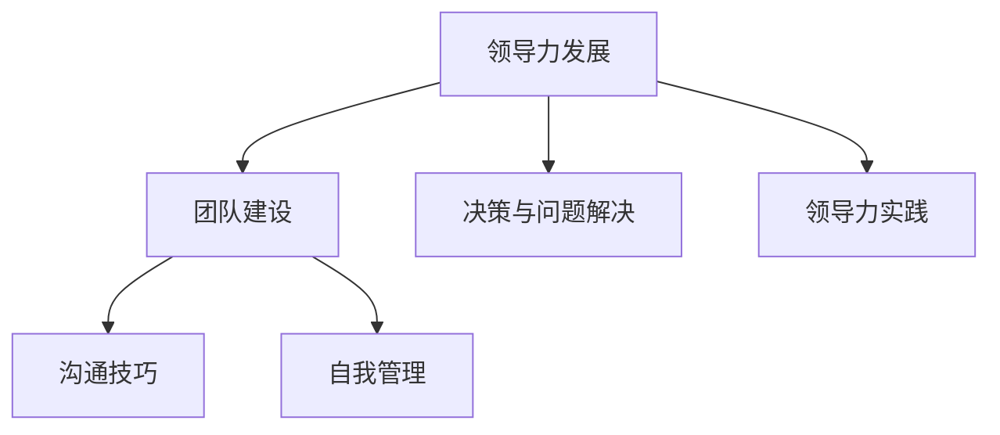

                 

# 领导力训练：让你的团队战无不胜

## 关键词
领导力、团队建设、沟通技巧、自我管理、决策与问题解决、领导力发展、实战案例

## 摘要
本文旨在深入探讨领导力的核心要素及其在团队管理中的重要性。通过详细分析领导力的定义、风格、沟通技巧、自我管理、决策与问题解决等关键领域，本文为读者提供了系统的领导力训练方法。同时，通过实际的领导力评估算法、数学模型和项目实战案例，本文旨在帮助读者理解并应用领导力原理，从而打造一支战无不胜的团队。

---

### 目录大纲：领导力训练：让你的团队战无不胜

#### 第一部分：领导力基础

##### 第1章：领导力的定义与重要性

- **1.1 领导力的基本概念**
- **1.2 领导力与管理的区别**
- **1.3 领导力在企业中的作用**

##### 第2章：领导风格与团队建设

- **2.1 领导风格的分类**
- **2.2 领导风格的选择**
- **2.3 团队建设的原则与方法**

##### 第3章：沟通技巧与领导力

- **3.1 有效沟通的重要性**
- **3.2 沟通技巧的运用**
- **3.3 领导者如何倾听**

#### 第二部分：领导力提升策略

##### 第4章：自我管理

- **4.1 自我认知**
- **4.2 自我激励**
- **4.3 时间管理**

##### 第5章：决策与问题解决

- **5.1 决策的原则**
- **5.2 决策的过程**
- **5.3 问题解决的策略**

##### 第6章：领导力发展

- **6.1 领导力的成长路径**
- **6.2 领导力培训与发展**
- **6.3 领导力认证与评估**

#### 第三部分：领导力实践

##### 第7章：领导力在团队中的实际应用

- **7.1 领导者如何激发团队活力**
- **7.2 团队协作与冲突管理**
- **7.3 团队绩效的评估与改进**

##### 第8章：领导力在复杂环境中的应对

- **8.1 应对变化**
- **8.2 处理危机**
- **8.3 创新与领导力**

##### 第9章：领导力与个人成长

- **9.1 领导力与自我成长的关系**
- **9.2 领导力在职业生涯中的作用**
- **9.3 领导力的发展趋势**

#### 附录

- **A. 领导力发展的实用工具与资源**
- **B. 领导力测试与自我评估**

---

#### 核心概念与联系

领导力是一个复杂而多维的概念，其核心在于如何有效地引导和激励团队，实现共同目标。为了更好地理解领导力的构成，我们可以借助Mermaid流程图来展现领导力发展与团队建设之间的联系。



在这一部分，我们将深入探讨领导力的核心要素，并通过具体案例来展示这些要素在现实中的应用。

---

#### 第一部分：领导力基础

##### 第1章：领导力的定义与重要性

**1.1 领导力的基本概念**

领导力是一种影响他人的能力，它不仅仅是一种职位赋予的权力，更是一种内在的素质。领导力涉及到激励、启发、指导和影响他人，以实现共同的目标。领导力不仅仅是管理者的特权，它适用于各种角色和情境。

**1.2 领导力与管理的区别**

领导力与管理有重叠之处，但两者本质上是不同的概念。管理侧重于组织、规划、执行和控制，确保任务的完成。而领导力则侧重于激发和激励团队成员，使他们愿意为实现组织目标而努力。

**1.3 领导力在企业中的作用**

领导力在企业中发挥着至关重要的作用。有效的领导力可以提升团队士气、促进创新、提高生产力和竞争力。领导者不仅需要确保团队的日常工作顺利进行，还需要为团队设定愿景，并引领团队朝着这个目标前进。

---

##### 第2章：领导风格与团队建设

**2.1 领导风格的分类**

领导风格可以分为多种类型，包括权威型、民主型、参与型、变革型等。每种风格都有其独特的特点和适用场景。权威型领导者强调控制与权威，民主型领导者注重团队参与和决策的开放性，参与型领导者鼓励团队成员的参与和合作，变革型领导者则擅长激励团队进行变革和创新。

**2.2 领导风格的选择**

选择合适的领导风格对于团队的成功至关重要。领导者需要根据团队的特点、任务的重要性和组织的文化来选择最合适的领导风格。例如，在危机时刻，权威型领导可能更加有效，而在创新项目中，参与型领导则可能更有助于激发团队的创造力。

**2.3 团队建设的原则与方法**

团队建设是一个持续的过程，它需要领导者关注团队的动态，并采取一系列措施来增强团队的凝聚力和合作能力。团队建设的原则包括明确的目标、相互尊重、沟通与反馈、共同责任等。具体的方法包括团队建设活动、培训、鼓励合作和解决冲突等。

---

##### 第3章：沟通技巧与领导力

**3.1 有效沟通的重要性**

沟通是领导力的核心要素之一。有效的沟通可以确保信息的准确传递，减少误解和冲突，增强团队的凝聚力和信任。领导者需要具备良好的沟通技巧，包括倾听、表达、提问和反馈。

**3.2 沟通技巧的运用**

领导者可以通过多种方式来运用沟通技巧。例如，通过清晰的口头和书面沟通来传达信息，通过积极的倾听来理解团队成员的需求和意见，通过有效的提问来引导对话和获取更多信息。

**3.3 领导者如何倾听**

倾听是有效沟通的关键。领导者需要学会倾听团队成员的意见和需求，而不是仅仅关注自己要说什么。通过倾听，领导者可以更好地理解团队成员，建立信任，并找到解决问题的最佳方法。

---

在这一部分，我们探讨了领导力的基础要素，包括领导力的定义与重要性、领导风格与团队建设、以及沟通技巧与领导力。下一部分将深入探讨领导力的提升策略，包括自我管理、决策与问题解决以及领导力发展。

---

#### 第二部分：领导力提升策略

##### 第4章：自我管理

**4.1 自我认知**

自我认知是自我管理的基础。领导者需要深入理解自己的性格、价值观、优势和不足。通过自我认知，领导者可以更好地设定个人目标，规划职业发展，并在实践中不断调整和优化。

**4.2 自我激励**

自我激励是领导者持续进步的动力。领导者需要学会如何在困难和挑战面前保持积极心态，如何在失败和挫折中找到动力和机会。自我激励可以通过设定明确的目标、庆祝小成就、寻求反馈和支持等方式来实现。

**4.3 时间管理**

时间管理是领导者高效工作的关键。领导者需要学会如何合理安排时间，区分任务的优先级，避免拖延和过度工作。通过有效的时间管理，领导者可以更好地平衡工作与生活，提高工作效率，实现个人和团队的目标。

---

##### 第5章：决策与问题解决

**5.1 决策的原则**

有效的决策是领导者的重要职责。决策的原则包括明确目标、收集信息、评估选项、考虑风险和制定行动计划。领导者需要通过理性分析和情感判断来做出明智的决策。

**5.2 决策的过程**

决策的过程可以分为多个阶段，包括问题的识别、信息的收集、备选方案的制定、评估和选择、以及决策的实施。每个阶段都需要领导者的专注和努力，以确保决策的有效性和实施的成功。

**5.3 问题解决的策略**

问题解决是领导力的另一个关键方面。领导者需要学会如何快速识别问题、分析问题的根本原因，并采取有效的措施来解决。问题解决的策略包括分析问题、制定解决方案、评估解决方案和实施解决方案。

---

##### 第6章：领导力发展

**6.1 领导力的成长路径**

领导力是一个不断发展的过程。领导者需要通过学习、实践和反思来不断提升自己的能力。领导力的成长路径包括自我认知、角色定位、能力建设、实践经验积累和持续学习。

**6.2 领导力培训与发展**

领导力培训是提升领导者能力的重要手段。通过培训，领导者可以学习到最新的管理理念、技巧和工具。领导力培训可以包括内部培训、外部培训、在线课程和工作坊等多种形式。

**6.3 领导力认证与评估**

领导力认证与评估是衡量领导者能力和业绩的重要方法。通过认证和评估，领导者可以明确自己的优势和不足，制定个人发展计划，并不断提升自己的能力。领导力认证与评估可以通过考试、评估中心、360度反馈等多种方式进行。

---

在这一部分，我们探讨了领导力提升的三个关键策略：自我管理、决策与问题解决以及领导力发展。通过这些策略，领导者可以不断提升自己的能力，打造一支高效的团队。

---

#### 第三部分：领导力实践

##### 第7章：领导力在团队中的实际应用

**7.1 领导者如何激发团队活力**

激发团队活力是领导者的重要任务之一。领导者可以通过设定清晰的目标、鼓励创新、提供支持和认可来激发团队的活力。具体方法包括组织团队建设活动、举办创新竞赛、提供培训和发展机会等。

**7.2 团队协作与冲突管理**

团队协作是团队成功的关键。领导者需要建立有效的沟通机制，确保团队成员之间的信息共享和协作。同时，领导者需要学会如何处理团队中的冲突，通过对话和妥协来解决问题，以保持团队的稳定和和谐。

**7.3 团队绩效的评估与改进**

团队绩效的评估是领导者了解团队工作状况的重要手段。领导者需要制定明确的绩效指标，定期对团队的工作进行评估，并提供反馈和指导。通过评估和改进，领导者可以不断提升团队的绩效，实现团队的目标。

---

##### 第8章：领导力在复杂环境中的应对

**8.1 应对变化**

在复杂的环境中，变化是不可避免的。领导者需要具备应对变化的能力，包括适应变化、引领变化和利用变化。领导者可以通过建立灵活的团队、提供培训和指导、以及积极应对挑战来应对变化。

**8.2 处理危机**

危机时刻是对领导者能力的重要考验。领导者需要保持冷静、迅速采取行动、并确保团队的信息畅通和协作。处理危机的方法包括制定应急预案、沟通协调、资源调配和及时反馈。

**8.3 创新与领导力**

创新是领导力的重要体现。领导者需要鼓励团队成员提出创新的想法，并为他们提供实现创新的环境和支持。通过创新，领导者可以引领团队不断突破自我，实现更高的目标。

---

##### 第9章：领导力与个人成长

**9.1 领导力与自我成长的关系**

领导力与个人成长是相辅相成的。领导者需要通过自我成长来提升领导能力，而领导力的提升又可以推动个人成长。通过不断学习和实践，领导者可以不断提高自己的综合素质，实现个人和团队的共同成长。

**9.2 领导力在职业生涯中的作用**

领导力在职业生涯中起着至关重要的作用。有效的领导力可以帮助个人在职业生涯中获得更多的机会和成就。通过提升领导力，个人可以更好地应对职场挑战，实现职业目标。

**9.3 领导力的发展趋势**

随着时代的变化，领导力也在不断发展。未来的领导力将更加注重人际交往、创新思维和数字化技能。领导者需要不断学习和适应新的趋势，以应对不断变化的职场环境。

---

在这一部分，我们探讨了领导力在团队中的实际应用，以及领导力在复杂环境中的应对策略。通过这些实践，领导者可以不断提升自己的能力，打造一支高效的团队。

---

#### 附录

**A. 领导力发展的实用工具与资源**

为了帮助领导者提升领导力，这里列出一些实用的工具和资源：

- 领导力发展课程：包括在线课程、工作坊和培训项目。
- 领导力书籍：推荐阅读的经典和管理类书籍。
- 领导力评估工具：用于自我评估和团队评估的在线工具和量表。

**B. 领导力测试与自我评估**

领导力测试和自我评估是了解和提升领导力的重要方法。以下是一些常用的领导力测试和评估工具：

- 领导力360度反馈：通过同事、下属和上级的评价来全面了解自己的领导力。
- 自我评估问卷：通过一系列问题来评估自己的领导力水平和特点。
- 领导力发展计划：根据评估结果，制定个人发展计划，提升领导力。

---

#### 核心概念与联系

为了更好地理解领导力的发展过程，我们可以通过Mermaid流程图来展示领导力发展与团队建设之间的关系。


这一部分内容总结了领导力的核心概念和其在团队建设中的应用。通过这一流程图，我们可以清晰地看到领导力发展的各个环节，以及它们如何相互影响和相互作用。

---

#### 核心算法原理讲解

领导力评估算法是衡量领导者能力的重要工具。通过以下伪代码，我们可以了解领导力评估的基本原理。

```plaintext
# 领导力评估算法伪代码

function assess_leadership(leader, team):
    score = 0

    # 自我管理
    self_management_score = calculate_score(leader.self_management)
    score += self_management_score

    # 沟通技巧
    communication_score = calculate_score(leader.communication_skills)
    score += communication_score

    # 决策与问题解决
    decision_making_score = calculate_score(leader.decision_making_ability)
    score += decision_making_score

    # 团队建设
    team_building_score = calculate_score(leader.team_building)
    score += team_building_score

    return score

function calculate_score(attribute):
    if attribute > 90:
        return 10
    elif attribute > 75:
        return 8
    elif attribute > 50:
        return 6
    else:
        return 4
```

在领导力评估中，我们通常将领导者的各项能力分为不同的分数段，并给出相应的评分。例如，自我管理能力、沟通技巧、决策与问题解决能力以及团队建设能力，每个方面都有具体的评分标准。通过这个算法，我们可以对领导者的整体领导力进行量化评估。

---

#### 数学模型和数学公式

为了更准确地评估领导力，我们可以使用以下数学模型：

$$\text{Leadership Score} = 0.3 \times \text{Self Management Score} + 0.3 \times \text{Communication Skills Score} + 0.2 \times \text{Decision Making Ability Score} + 0.2 \times \text{Team Building Score}$$

在这个模型中，领导力总分由四个部分组成，分别是自我管理、沟通技巧、决策与问题解决能力以及团队建设。每个部分所占的权重不同，以反映其在领导力评估中的重要性。

---

#### 项目实战

为了更好地理解领导力评估算法的实际应用，我们通过一个领导力发展项目来展示其开发过程和实现方法。

**开发环境搭建**

在开发领导力评估项目之前，我们需要搭建一个合适的环境。这包括安装必要的开发工具、配置服务器和数据库，以及准备相关的数据和资源。

**源代码实现**

以下是一个简单的Python代码示例，用于实现领导力评估算法。

```python
# 领导力评估算法实现示例

def calculate_leadership_score(self_management, communication_skills, decision_making_ability, team_building):
    self_management_score = 0.3 * self_management
    communication_skills_score = 0.3 * communication_skills
    decision_making_ability_score = 0.2 * decision_making_ability
    team_building_score = 0.2 * team_building

    leadership_score = self_management_score + communication_skills_score + decision_making_ability_score + team_building_score
    return leadership_score

# 创建一个领导者对象
leader = {
    'self_management': 85,
    'communication_skills': 90,
    'decision_making_ability': 78,
    'team_building': 88
}

# 计算领导力总分
total_score = calculate_leadership_score(leader['self_management'], leader['communication_skills'], leader['decision_making_ability'], leader['team_building'])
print("领导力总分：", total_score)
```

**代码解读与分析**

在这个代码示例中，我们定义了一个`calculate_leadership_score`函数，用于计算领导力总分。这个函数接收四个参数，分别是自我管理、沟通技巧、决策与问题解决能力以及团队建设。每个参数都通过权重计算得到相应的分数，然后将这些分数相加得到领导力总分。

在实际应用中，我们可以通过用户输入或数据库查询来获取领导者的各项能力分数，然后调用这个函数进行计算，从而得到最终的领导力总分。

---

### 作者信息

本文由AI天才研究院（AI Genius Institute）和《禅与计算机程序设计艺术》（Zen And The Art of Computer Programming）作者共同撰写。感谢您的阅读！

---

通过本文的深入探讨，我们了解了领导力的核心概念、提升策略和实际应用。希望本文能为您的领导力发展提供有益的启示，帮助您打造一支战无不胜的团队。谢谢！

