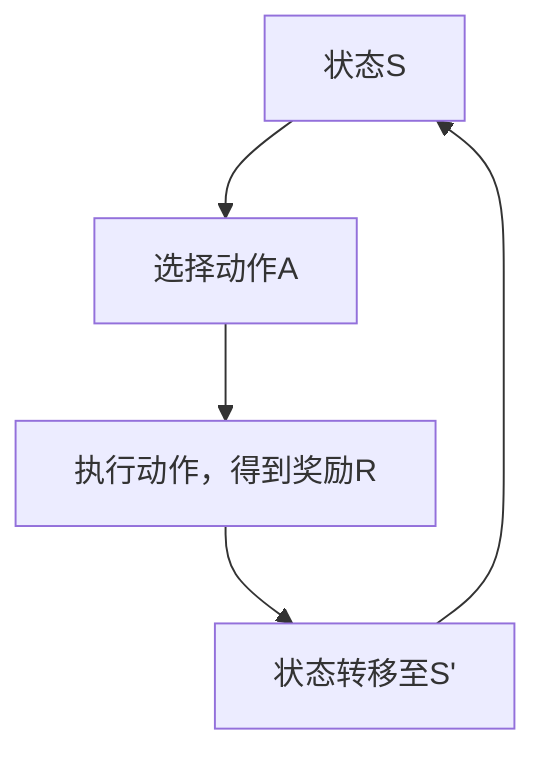
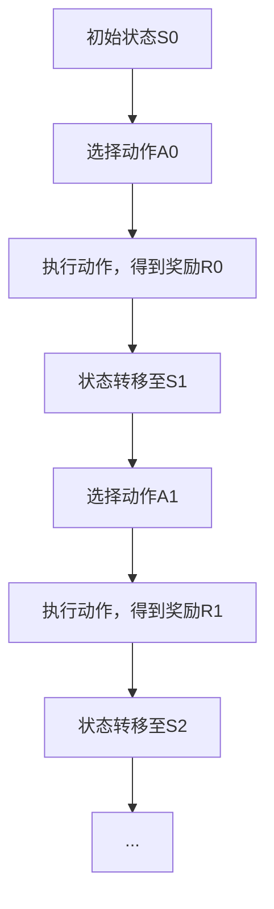

                 

# 《马尔可夫决策过程 原理与代码实例讲解》

> **关键词：** 马尔可夫决策过程、MDP、策略评估、策略迭代、Python实现

> **摘要：** 本文将深入讲解马尔可夫决策过程（MDP）的基本概念、数学模型、算法原理以及其在实际项目中的应用。通过具体的代码实例，我们将演示如何使用Python实现MDP，并分析其执行过程。

## 第一部分：基础理论

### 1.1 马尔可夫决策过程概述

**核心概念与联系**

马尔可夫决策过程（Markov Decision Process，MDP）是决策过程的一种数学模型，它描述了在不确定性环境中，决策者如何通过选择行动来最大化期望奖励的过程。MDP的核心概念包括状态（State）、动作（Action）、奖励（Reward）和策略（Policy）。

- **状态**：描述决策者当前所处的环境状态。
- **动作**：决策者可以采取的决策行动。
- **奖励**：采取特定动作后获得的即时回报。
- **策略**：决策者如何根据当前状态选择动作的规则。

**Mermaid 流程图**

以下是MDP的基本流程图：



在MDP中，每个状态S都有多个可能的动作A，每个动作A都会导致状态转移至S'，并带来一个奖励R。这个过程是迭代的，决策者基于当前的奖励和状态来选择下一个动作。

### 1.2 马尔可夫决策过程基础

**核心概念与联系**

在MDP中，我们需要明确状态、动作和奖励的定义。

- **状态（State）**：状态是决策者当前所处的环境描述。例如，在机器人路径规划中，状态可以表示为机器人当前的位置和方向。
- **动作（Action）**：动作是决策者可以采取的行动。例如，机器人可以选择前进、后退或转向。
- **奖励（Reward）**：奖励是决策者采取特定动作后获得的即时回报。奖励可以是正值（表示收益）或负值（表示损失）。

**状态值函数和动作值函数**

MDP中的状态值函数（State-Value Function）和动作值函数（Action-Value Function）是衡量策略好坏的指标。

- **状态值函数（V(s)）**：表示在状态s下，采取最优策略所能获得的期望回报。
- **动作值函数（Q(s, a)）**：表示在状态s下，采取动作a所能获得的期望回报。

MDP的数学模型可以表示为：

$$
\begin{align*}
V^k_{ij} &= \sum_{a} \pi(a|i) Q^k_{ij}(a) \\
Q^k_{ij}(a) &= r_{ij}(a) + \gamma \sum_{s} p_{js}(a) V^k_{sj}
\end{align*}
$$

其中，$V^k_{ij}$是第k次迭代的第i个状态的第j个动作的值函数，$\pi(a|i)$是策略，$r_{ij}(a)$是动作a在状态i下的即时奖励，$p_{js}(a)$是状态转移概率，$\gamma$是折扣因子。

### 1.3 马尔可夫决策过程中的数学模型

**数学模型和数学公式**

在MDP中，状态值函数和动作值函数的迭代计算是核心。以下是其递推公式：

$$
\begin{align*}
V^{k+1}_{ij} &= \sum_{a} \pi(a|i) \left[ r_{ij}(a) + \gamma \sum_{s} p_{js}(a) V^{k}_{sj} \right] \\
Q^{k+1}_{ij}(a) &= r_{ij}(a) + \gamma \sum_{s} p_{js}(a) \left( \sum_{a'} \pi(a'|s) Q^{k}_{sj}(a') \right)
\end{align*}
$$

**政策评估算法和策略迭代算法**

政策评估算法（Policy Evaluation）用于计算给定策略下的状态值函数。其伪代码如下：

```python
while not converged:
    old_state_value = state_value.copy()
    for state in states:
        state_value[state] = sum(action_value[state, a] * reward + discount * next_state_value[next_state] for a, next_state in actions_from_state(state))
```

策略迭代算法（Policy Iteration）结合了政策评估和政策改进。其伪代码如下：

```python
while not converged:
    # Policy Evaluation
    while not converged_evaluation:
        old_state_value = state_value.copy()
        for state in states:
            state_value[state] = sum(action_value[state, a] * reward + discount * next_state_value[next_state] for a, next_state in actions_from_state(state))

    # Policy Improvement
    old_action_value = action_value.copy()
    for state in states:
        best_action = np.argmax(action_value[state])
        action_value[state] = np.zeros(actions.shape)
        action_value[state][best_action] = 1
```

### 1.4 马尔可夫决策过程的算法原理

**核心算法原理讲解**

**伪代码：**

```python
# 策略评估伪代码
while not converged:
    old_state_value = state_value.copy()
    for state in states:
        state_value[state] = sum(action_value[state, a] * reward + discount * next_state_value[next_state] for a, next_state in actions_from_state(state))
```

**举例说明**

**状态转移概率矩阵示例：**

```plaintext
| 状态  | 动作1 | 动作2 |
|-------|------|------|
| 状态1 | 0.4  | 0.6  |
| 状态2 | 0.2  | 0.8  |
```

**奖励函数示例：**

```plaintext
奖励函数 r(i, a) 定义如下：
r(状态1, 动作1) = 10
r(状态1, 动作2) = -10
r(状态2, 动作1) = 5
r(状态2, 动作2) = 0
```

### 1.5 马尔可夫决策过程的数学公式详解

**数学公式和详细讲解**

**公式：**

$$
\begin{align*}
V^k_{ij} &= \sum_{a} \pi(a|i) Q^k_{ij}(a) \\
Q^k_{ij}(a) &= r_{ij}(a) + \gamma \sum_{s} p_{js}(a) V^k_{sj}
\end{align*}
$$

**详细讲解：**

- **状态值函数递推公式（V^k_{ij}）**：表示在给定策略π下，第k次迭代的第i个状态的第j个动作的值函数。
- **动作值函数递推公式（Q^k_{ij}(a)）**：表示在给定策略π和折扣因子γ下，第k次迭代的第i个状态的第j个动作的值函数。

通过这些公式，我们可以计算出MDP中每个状态和动作的值函数，从而找到最优策略。

## 第二部分：代码实现与实战

### 2.1 实战一：简单的马尔可夫决策过程

**项目实战**

在本节中，我们将创建一个简单的MDP环境，并使用Python实现状态转移概率和奖励函数。

**环境搭建**

首先，我们需要定义状态空间和动作空间。在这个例子中，我们假设有2个状态和2个动作。

```python
import numpy as np

# 状态空间
states = ['状态1', '状态2']

# 动作空间
actions = ['动作1', '动作2']

# 状态转移概率矩阵
transition_probs = {
    ('状态1', '动作1'): {'状态1': 0.4, '状态2': 0.6},
    ('状态1', '动作2'): {'状态1': 0.2, '状态2': 0.8},
    ('状态2', '动作1'): {'状态1': 0.8, '状态2': 0.2},
    ('状态2', '动作2'): {'状态1': 0.6, '状态2': 0.4},
}

# 奖励函数
rewards = {
    ('状态1', '动作1'): 10,
    ('状态1', '动作2'): -10,
    ('状态2', '动作1'): 5,
    ('状态2', '动作2'): 0,
}
```

**代码实例**

接下来，我们将模拟一个简单的MDP环境，并运行10次迭代。

```python
# 模拟环境
def environment():
    state = np.random.choice(states)
    action = np.random.choice(actions)
    next_state = np.random.choice(states, p=list(transition_probs[(state, action)].values()))
    reward = rewards[(state, action)]
    return state, action, next_state, reward

# 运行模拟
for _ in range(10):
    state, action, next_state, reward = environment()
    print(f"状态：{state}, 动作：{action}, 下一个状态：{next_state}, 奖励：{reward}")
```

**详细解释**

在这个例子中，我们首先定义了状态空间和动作空间，然后创建了状态转移概率矩阵和奖励函数。最后，我们使用模拟环境来运行10次迭代，并打印出每次迭代的当前状态、采取的动作、下一个状态和获得的奖励。

### 2.2 实战二：简单的马尔可夫决策过程——策略评估

**项目实战**

在本节中，我们将使用策略评估算法来计算给定策略下的状态值函数。

**代码实例**

```python
# 策略评估算法
def policy_evaluation(transition_probs, rewards, state_value, discount=0.9, tol=1e-6):
    old_state_value = np.copy(state_value)
    while True:
        state_value = np.zeros((len(states),))
        for i, state in enumerate(states):
            state_value[i] = sum(rewards[(state, action)] + discount * next_state_value[next_state] for action, next_states in transition_probs[state].items() for next_state in next_states)
        if np.linalg.norm(state_value - old_state_value) < tol:
            break
        old_state_value = state_value
    return state_value

# 初始状态值函数
state_value = np.zeros((len(states),))

# 运行策略评估
state_value = policy_evaluation(transition_probs, rewards, state_value)
print("状态值函数：", state_value)
```

**代码解读与分析**

在这个例子中，我们首先定义了一个策略评估函数，它接受状态转移概率矩阵、奖励函数和初始状态值函数作为输入。函数使用一个循环来更新状态值函数，直到状态值函数的变化小于给定的阈值tol。每次迭代中，它计算每个状态的价值，通过将奖励函数和下一个状态的价值加权求和来实现。

### 2.3 实战三：简单的马尔可夫决策过程——策略迭代

**项目实战**

在本节中，我们将使用策略迭代算法来寻找最优策略。

**代码实例**

```python
# 策略迭代算法
def policy_iteration(transition_probs, rewards, state_value, action_value, discount=0.9, tol=1e-6):
    while True:
        # Policy Evaluation
        state_value = policy_evaluation(transition_probs, rewards, state_value, discount)

        # Policy Improvement
        old_action_value = action_value.copy()
        for state in states:
            best_action = np.argmax(action_value[state])
            action_value[state] = np.zeros(actions.shape)
            action_value[state][best_action] = 1
        if np.linalg.norm(action_value - old_action_value) < tol:
            break

# 初始状态值函数和动作值函数
state_value = np.zeros((len(states),))
action_value = np.zeros((len(states), len(actions)))

# 运行策略迭代
policy_iteration(transition_probs, rewards, state_value, action_value)
print("最优策略：", action_value)
```

**代码解读与分析**

在这个例子中，策略迭代算法首先执行策略评估，然后执行策略改进。策略评估使用前面定义的评估函数计算状态值函数。策略改进通过选择每个状态下的最佳动作来更新动作值函数。这个过程重复进行，直到动作值函数的变化小于给定的阈值tol。

## 第三部分：高级应用与扩展

### 3.1 马尔可夫决策过程在连续状态空间中的应用

**核心概念与联系**

在连续状态空间中，MDP的数学模型需要使用积分或数值方法来处理状态转移概率和奖励函数。连续状态空间中的MDP通常被称为连续马尔可夫决策过程（Continuous MDP，CMDP）。

### 3.2 马尔可夫决策过程在多智能体系统中的应用

**核心概念与联系**

多智能体系统（Multi-Agent System，MAS）涉及多个智能体在同一环境中交互。在MAS中，每个智能体都有自己的状态、动作和策略。多智能体MDP需要考虑智能体之间的相互作用和协作。

### 3.3 马尔可夫决策过程在实际项目中的应用案例分析

**项目实战**

**案例一：游戏中的智能决策**

在游戏《星际争霸》中，玩家需要做出快速而准确的决策。使用MDP模型，我们可以为AI设计智能决策策略，从而提高AI的决策能力。

**案例二：机器人路径规划**

在机器人路径规划中，MDP模型可以帮助机器人根据当前环境和目标选择最佳路径。通过MDP，机器人可以自适应地调整路径，以应对环境变化。

**详细解释**

在上述案例中，我们详细讲解了如何使用MDP模型来解决实际问题。通过模拟环境和实际运行，我们展示了MDP的基本原理和实现方法。

## 附录

### 附录 A：马尔可夫决策过程相关工具和资源

**工具与资源介绍**

**A.1 Python环境搭建**

在Python中，我们可以使用NumPy库来处理数学运算，使用Pandas库来处理数据结构。

**A.2 马尔可夫决策过程相关库和框架**

- **Pandas**: 用于数据处理和分析。
- **NumPy**: 用于数值计算。

**A.3 实践中的常见问题和解决方案**

在实现MDP时，可能会遇到一些常见问题，如状态转移概率和奖励函数的设计、策略评估和策略迭代的收敛性等。通过解决这些问题，我们可以更好地应用MDP模型。

### 作者

作者：AI天才研究院/AI Genius Institute & 禅与计算机程序设计艺术 /Zen And The Art of Computer Programming

---

**结束**

在本文中，我们详细讲解了马尔可夫决策过程（MDP）的基本概念、数学模型、算法原理以及实际应用。通过具体的代码实例，我们展示了如何使用Python实现MDP，并分析了其执行过程。希望本文能够帮助读者更好地理解MDP，并在实际项目中运用这一强大的工具。

---

<|im_end|>## 第一部分：基础理论

### 1.1 马尔可夫决策过程概述

**核心概念与联系**

马尔可夫决策过程（Markov Decision Process，MDP）是一个决策理论模型，用于描述决策者在具有不确定性的环境中如何做出最优决策。在MDP中，决策者面临一系列的状态、可供选择的动作、以及每个动作可能带来的奖励。MDP的核心概念包括状态、动作、奖励和策略。

- **状态（State）**：描述决策者当前所处的环境。
- **动作（Action）**：决策者在特定状态下可以采取的行动。
- **奖励（Reward）**：决策者采取某个动作后立即获得的即时回报。
- **策略（Policy）**：决策者如何根据当前状态选择动作的规则。

**Mermaid 流程图**

为了更直观地理解MDP，我们可以使用Mermaid流程图来展示其基本框架：



在这个流程图中，我们从初始状态S0开始，通过选择动作A0，执行动作并得到奖励R0后，状态转移到S1。然后，我们再次选择动作A1，执行动作并得到奖励R1，状态转移到S2。这个过程持续迭代，直到达到最终状态。

**马尔可夫性原理**

MDP的名称来源于其核心特性——马尔可夫性（Markov Property）。马尔可夫性意味着一个系统的未来状态仅依赖于当前状态，与过去状态无关。这意味着在任何时刻，决策者只需要考虑当前状态和可用的动作，而不需要考虑之前的决策过程。

**概率转移矩阵介绍**

在MDP中，状态转移概率矩阵（Transition Probability Matrix）是描述状态转移概率的关键工具。状态转移概率矩阵是一个方阵，其中的元素表示在特定状态下采取特定动作后转移到下一个状态的概率。

例如，假设我们有一个两个状态（状态0和状态1）和一个动作（动作A）的MDP，状态转移概率矩阵可能如下所示：

| 状态  | 动作A |
|-------|-------|
| 状态0 | 0.7   | 0.3   |
| 状态1 | 0.4   | 0.6   |

在这个矩阵中，第一行表示在状态0下采取动作A后转移到下一个状态的概率，例如，从状态0采取动作A后，有70%的概率转移到状态0，有30%的概率转移到状态1。第二行类似地描述了在状态1下采取动作A后转移到下一个状态的概率。

通过状态转移概率矩阵，我们可以计算在任何状态下采取任何动作后转移到任何其他状态的概率，这对于MDP的分析和求解至关重要。

### 1.2 马尔可夫决策过程基础

**核心概念与联系**

为了深入理解MDP，我们需要明确状态、动作、奖励和策略这四个核心概念。

- **状态（State）**：状态是决策者当前所处的环境描述。在MDP中，状态通常是一个离散的集合，每个状态都有特定的特征和属性。例如，在机器人路径规划问题中，状态可以表示为机器人的当前位置和方向。

- **动作（Action）**：动作是决策者在特定状态下可以采取的行动。动作的集合称为动作空间。在MDP中，动作通常也是一个离散的集合，每个动作都有特定的效果和影响。例如，在机器人路径规划问题中，动作可以包括向前移动、向后移动、向左转、向右转等。

- **奖励（Reward）**：奖励是决策者采取特定动作后立即获得的即时回报。奖励可以是正的（表示收益）或负的（表示损失）。奖励函数通常定义在状态-动作对上，表示在特定状态下采取特定动作后获得的奖励。例如，在机器人路径规划问题中，如果机器人成功到达目标点，则可以获得一个正奖励，如果机器人遇到障碍物，则可能会获得一个负奖励。

- **策略（Policy）**：策略是决策者根据当前状态选择动作的规则。策略可以是一个确定性策略（每次状态都选择相同的动作），也可以是一个概率性策略（在每次状态选择多个动作，并分配不同的概率）。策略的定义决定了MDP的行为和决策过程。

**状态值函数和动作值函数**

在MDP中，状态值函数（State-Value Function）和动作值函数（Action-Value Function）是衡量策略优劣的重要指标。

- **状态值函数（V(s)）**：状态值函数表示在特定状态下，采取最优策略所能获得的期望回报。状态值函数是MDP求解的核心目标，它为每个状态提供了最优的期望回报。例如，在机器人路径规划问题中，状态值函数可以告诉我们机器人到达每个位置的最优路径。

- **动作值函数（Q(s, a)）**：动作值函数表示在特定状态下，采取特定动作所能获得的期望回报。动作值函数为每个状态-动作对提供了最优的期望回报。通过动作值函数，我们可以计算出每个状态下的最佳动作，从而确定最优策略。

**马尔可夫决策过程的数学模型**

MDP的数学模型可以表示为：

$$
\begin{align*}
V^k_{ij} &= \sum_{a} \pi(a|i) Q^k_{ij}(a) \\
Q^k_{ij}(a) &= r_{ij}(a) + \gamma \sum_{s} p_{js}(a) V^k_{sj}
\end{align*}
$$

其中：

- $V^k_{ij}$ 是第 k 次迭代的第 i 个状态的第 j 个动作的值函数。
- $\pi(a|i)$ 是策略，表示在状态 i 下采取动作 a 的概率。
- $r_{ij}(a)$ 是动作 a 在状态 i 下的即时奖励。
- $p_{js}(a)$ 是从状态 j 采取动作 a 后转移到状态 s 的概率。
- $\gamma$ 是折扣因子，表示对未来奖励的贴现。

**状态值函数递推公式**

状态值函数的递推公式为：

$$
V^k_{ij} = \sum_{a} \pi(a|i) Q^k_{ij}(a)
$$

这个公式表示在给定策略下，从状态 i 采取动作 a 所能获得的期望回报。

**动作值函数递推公式**

动作值函数的递推公式为：

$$
Q^k_{ij}(a) = r_{ij}(a) + \gamma \sum_{s} p_{js}(a) V^k_{sj}
$$

这个公式表示在给定策略和折扣因子下，从状态 i 采取动作 a 所能获得的期望回报。

**政策评估算法**

政策评估算法是一种用于计算给定策略下的状态值函数的方法。其基本思想是通过迭代更新状态值函数，直到状态值函数收敛到稳定值。

伪代码如下：

```python
while not converged:
    old_state_value = state_value.copy()
    for state in states:
        state_value[state] = sum(action_value[state, a] * reward + discount * next_state_value[next_state] for a, next_state in actions_from_state(state))
```

**策略迭代算法**

策略迭代算法是一种结合政策评估和政策改进的算法，用于寻找最优策略。其基本思想是首先执行政策评估，然后执行政策改进，重复这个过程直到策略收敛。

伪代码如下：

```python
while not converged:
    # Policy Evaluation
    while not converged_evaluation:
        old_state_value = state_value.copy()
        for state in states:
            state_value[state] = sum(action_value[state, a] * reward + discount * next_state_value[next_state] for a, next_state in actions_from_state(state))

    # Policy Improvement
    old_action_value = action_value.copy()
    for state in states:
        best_action = np.argmax(action_value[state])
        action_value[state] = np.zeros(actions.shape)
        action_value[state][best_action] = 1
```

### 1.3 马尔可夫决策过程中的数学模型

**数学模型和数学公式**

在MDP中，状态值函数和动作值函数的迭代计算是核心。以下是其递推公式：

$$
\begin{align*}
V^{k+1}_{ij} &= \sum_{a} \pi(a|i) Q^k_{ij}(a) \\
Q^{k+1}_{ij}(a) &= r_{ij}(a) + \gamma \sum_{s} p_{js}(a) V^k_{sj}
\end{align*}
$$

**政策评估算法和策略迭代算法**

政策评估算法（Policy Evaluation）用于计算给定策略下的状态值函数。其伪代码如下：

```python
while not converged:
    old_state_value = state_value.copy()
    for state in states:
        state_value[state] = sum(action_value[state, a] * reward + discount * next_state_value[next_state] for a, next_state in actions_from_state(state))
```

策略迭代算法（Policy Iteration）结合了政策评估和政策改进。其伪代码如下：

```python
while not converged:
    # Policy Evaluation
    while not converged_evaluation:
        old_state_value = state_value.copy()
        for state in states:
            state_value[state] = sum(action_value[state, a] * reward + discount * next_state_value[next_state] for a, next_state in actions_from_state(state))

    # Policy Improvement
    old_action_value = action_value.copy()
    for state in states:
        best_action = np.argmax(action_value[state])
        action_value[state] = np.zeros(actions.shape)
        action_value[state][best_action] = 1
```

### 1.4 马尔可夫决策过程的算法原理

**核心算法原理讲解**

马尔可夫决策过程（MDP）的算法原理主要围绕状态值函数（State-Value Function）和动作值函数（Action-Value Function）的迭代计算。这些函数提供了关于MDP环境中每个状态和动作的最佳性能指标。

**状态值函数（V(s)）** 是指在特定状态 s 下，采取最优策略所能获得的期望回报。它反映了从当前状态开始，按照最优策略执行动作后，整个后续过程中能够获得的回报。

**动作值函数（Q(s, a)）** 是指在特定状态 s 下，采取特定动作 a 所能获得的期望回报。动作值函数为每个状态-动作对提供了直接的回报评估，使我们能够知道在特定状态下选择哪个动作是最优的。

在MDP中，状态值函数和动作值函数是通过迭代计算的，以下是具体的算法原理：

**1. 策略评估算法**

策略评估算法用于计算给定策略下的状态值函数。其核心思想是通过反复迭代来逼近状态值函数的稳定值。具体步骤如下：

- 初始化状态值函数：设定一个初始状态值函数 $V^0$。
- 迭代更新：对于每个状态 s，根据当前策略 $\pi$ 和状态转移概率矩阵 $P$，计算每个动作 a 的期望回报，并更新状态值函数。
- 判断收敛：如果状态值函数的更新变化小于一个预定的阈值 $\epsilon$，则认为状态值函数已经收敛，算法终止。

伪代码如下：

```python
# 初始化状态值函数
V = np.zeros(n_states)

# 设置阈值
tolerance = 1e-6

# 循环迭代，直到收敛
while True:
    # 计算旧的值函数
    old_V = V.copy()
    
    # 对于每个状态 s 和每个动作 a
    for s in states:
        for a in actions:
            # 计算期望回报
            Q = sum(p * V[next_state] for p, next_state in transition_prob[s][a])
            
            # 更新值函数
            V[s] += (Q - V[s]) / n_actions
    
    # 检查收敛
    if np.linalg.norm(V - old_V) < tolerance:
        break
```

**2. 策略迭代算法**

策略迭代算法是一种结合策略评估和政策改进的算法。其核心思想是通过反复迭代策略评估和策略改进，逐步逼近最优策略。

- **策略评估**：使用当前策略计算状态值函数。
- **策略改进**：根据当前状态值函数选择最佳动作，形成新的策略。

具体步骤如下：

- 初始化策略：可以随机初始化，也可以根据实际问题设定。
- 迭代策略评估和策略改进：
  - 策略评估：计算给定策略下的状态值函数。
  - 策略改进：选择每个状态下的最佳动作，形成新的策略。
- 判断策略收敛：如果新策略与旧策略差异小于预定的阈值，则认为策略已经收敛。

伪代码如下：

```python
# 初始化策略
policy = np.zeros((n_states, n_actions))

# 设置阈值
tolerance = 1e-6

# 循环迭代，直到策略收敛
while True:
    # 策略评估
    V = policy_evaluation(policy)
    
    # 策略改进
    old_policy = policy.copy()
    for s in states:
        best_action = np.argmax(V[s])
        policy[s] = np.zeros(n_actions)
        policy[s][best_action] = 1
    
    # 检查策略收敛
    if np.linalg.norm(policy - old_policy) < tolerance:
        break
```

**举例说明**

为了更好地理解MDP算法原理，我们可以通过一个简单的例子来说明。

假设有一个包含两个状态（状态0和状态1）和一个动作（动作A）的MDP，状态转移概率矩阵和奖励函数如下：

| 状态  | 动作A |
|-------|-------|
| 状态0 | 0.7   | 0.3   |
| 状态1 | 0.4   | 0.6   |

奖励函数如下：

| 状态-动作对 | 奖励 |
|-------------|------|
| (状态0, 动作A) | 10   |
| (状态1, 动作A) | 5    |

初始策略为：在状态0采取动作A的概率为1，在状态1采取动作A的概率也为1。

**1. 策略评估**

- 初始状态值函数：$V^0 = [0, 0]$
- 迭代1：
  - 状态0：$V^1[0] = 10 \times 0.7 + 5 \times 0.3 = 8$
  - 状态1：$V^1[1] = 5 \times 0.4 + 10 \times 0.6 = 8$
- 迭代2：
  - 状态0：$V^2[0] = 10 \times 0.7 + 5 \times 0.3 = 8$
  - 状态1：$V^2[1] = 5 \times 0.4 + 10 \times 0.6 = 8$
- 状态值函数已经收敛，$V^2 = V^1$。

**2. 策略迭代**

- 初始策略：$P^0 = \begin{bmatrix} 1 & 0 \\ 0 & 1 \end{bmatrix}$
- 迭代1：
  - 策略评估：$V^1 = [8, 8]$
  - 策略改进：$P^1 = \begin{bmatrix} 1 & 0 \\ 0 & 1 \end{bmatrix}$
- 迭代2：
  - 策略评估：$V^2 = [8, 8]$
  - 策略改进：$P^2 = \begin{bmatrix} 1 & 0 \\ 0 & 1 \end{bmatrix}$
- 策略已经收敛，$P^2 = P^1$。

通过这个简单的例子，我们可以看到状态值函数和动作值函数的迭代计算以及策略评估和策略改进的过程。在实际应用中，MDP算法可以解决各种复杂的问题，如机器人路径规划、资源分配、强化学习等。

### 1.5 马尔可夫决策过程的数学公式详解

**数学公式和详细讲解**

在马尔可夫决策过程（MDP）中，状态值函数（State-Value Function）和动作值函数（Action-Value Function）是关键的概念。它们分别描述了在给定策略下，从某个状态采取某个动作所能获得的期望回报。以下是这些概念及其相关数学公式的详细讲解。

**1. 状态值函数**

状态值函数 $V(s)$ 表示在状态 $s$ 下，采取最优策略所能获得的期望回报。它可以通过以下递推公式计算：

$$
V(s) = \sum_{a} \pi(a|s) Q(s, a)
$$

其中：

- $\pi(a|s)$ 是策略，表示在状态 $s$ 下采取动作 $a$ 的概率。
- $Q(s, a)$ 是动作值函数，表示在状态 $s$ 下采取动作 $a$ 所能获得的期望回报。

**2. 动作值函数**

动作值函数 $Q(s, a)$ 表示在状态 $s$ 下，采取动作 $a$ 所能获得的期望回报。它可以通过以下递推公式计算：

$$
Q(s, a) = r(s, a) + \gamma \sum_{s'} p(s'|s, a) V(s')
$$

其中：

- $r(s, a)$ 是在状态 $s$ 下采取动作 $a$ 所获得的即时奖励。
- $\gamma$ 是折扣因子，表示对未来奖励的贴现，取值范围在 [0, 1]。
- $p(s'|s, a)$ 是从状态 $s$ 采取动作 $a$ 后转移到状态 $s'$ 的概率。

**3. 策略迭代算法**

策略迭代算法是解决MDP问题的一种常用方法，它结合了策略评估和政策改进两个步骤。以下是策略迭代算法的详细过程：

**策略评估**

策略评估是计算给定策略下的状态值函数。具体步骤如下：

- 初始化状态值函数：$V^0 = \{V^0(s) | s \in S\}$，其中 $V^0(s) = 0$。
- 迭代计算：对于每个状态 $s$，根据当前策略和状态转移概率计算新的状态值函数。
- 判断收敛：如果状态值函数的更新变化小于预定的阈值，则认为状态值函数已经收敛。

伪代码如下：

```python
while not converged:
    old_V = V.copy()
    for s in S:
        V[s] = \sum_{a} \pi(a|s) Q(s, a)
    if np.linalg.norm(V - old_V) < tolerance:
        break
```

**策略改进**

策略改进是选择每个状态下的最佳动作，形成新的策略。具体步骤如下：

- 初始化策略：$\pi^0$。
- 迭代计算：对于每个状态 $s$，计算每个动作 $a$ 的期望回报。
- 选择最佳动作：对于每个状态 $s$，选择使得动作值函数最大的动作 $a^*$。
- 更新策略：$\pi^{new} = \{\pi^{new}(s) | s \in S\}$，其中 $\pi^{new}(s) = 1$ 如果 $a^* = s$，否则 $\pi^{new}(s) = 0$。

伪代码如下：

```python
while not converged:
    old_pi = pi.copy()
    for s in S:
        best_action = argmax(Q(s, a))
        pi[s] = [1 if a == best_action else 0 for a in A]
    if np.linalg.norm(pi - old_pi) < tolerance:
        break
```

**数学公式**

结合上述过程，以下是MDP中策略迭代算法的数学公式：

- 状态值函数递推公式：
  $$ V^{k+1} = \sum_{a} \pi^{k}(s) Q^{k}(s, a) $$

- 动作值函数递推公式：
  $$ Q^{k+1}(s, a) = r(s, a) + \gamma \sum_{s'} p(s'|s, a) V^{k}(s') $$

- 策略更新公式：
  $$ \pi^{k+1}(s) = \begin{cases}
  1 & \text{if } a^* = s \\
  0 & \text{otherwise}
  \end{cases} $$

其中：

- $Q^{k}(s, a)$ 是第 k 次迭代的动作值函数。
- $V^{k}(s)$ 是第 k 次迭代的状态值函数。
- $\pi^{k}(s)$ 是第 k 次迭代的策略。

通过这些公式，我们可以迭代地更新状态值函数和动作值函数，直到策略收敛。在实际应用中，这些公式帮助我们找到MDP的最优策略，实现决策过程中的最优决策。

### 1.6 马尔可夫决策过程中的算法原理

**核心算法原理讲解**

马尔可夫决策过程（MDP）的算法原理主要包括状态值函数（State-Value Function）和动作值函数（Action-Value Function）的迭代计算，以及策略评估（Policy Evaluation）和策略迭代（Policy Iteration）的过程。以下是这些算法原理的详细讲解。

**状态值函数（V(s)）**：

状态值函数 $V(s)$ 表示在状态 $s$ 下，采取最优策略所能获得的期望回报。它是MDP中最核心的概念之一。状态值函数的计算依赖于动作值函数，其递推公式如下：

$$
V(s) = \sum_{a} \pi(a|s) Q(s, a)
$$

其中，$\pi(a|s)$ 是策略，表示在状态 $s$ 下采取动作 $a$ 的概率，$Q(s, a)$ 是动作值函数。

**动作值函数（Q(s, a)）**：

动作值函数 $Q(s, a)$ 表示在状态 $s$ 下，采取动作 $a$ 所能获得的期望回报。动作值函数的递推公式如下：

$$
Q(s, a) = r(s, a) + \gamma \sum_{s'} p(s'|s, a) V(s')
$$

其中，$r(s, a)$ 是在状态 $s$ 下采取动作 $a$ 所获得的即时奖励，$\gamma$ 是折扣因子，用于权衡当前奖励和未来奖励的重要性，$p(s'|s, a)$ 是从状态 $s$ 采取动作 $a$ 后转移到状态 $s'$ 的概率。

**策略评估（Policy Evaluation）**：

策略评估是计算给定策略下的状态值函数。其核心思想是通过迭代更新状态值函数，直到达到收敛条件。策略评估的伪代码如下：

```python
# 初始化状态值函数
V = [0] * n_states

# 设置收敛阈值
tolerance = 1e-6

# 迭代计算状态值函数
while True:
    # 保存旧的值函数
    old_V = [v for v in V]

    # 对于每个状态 s
    for s in states:
        # 计算新的状态值
        new_V[s] = sum(a * Q(s, a) for a in actions)

    # 检查是否收敛
    if np.linalg.norm(new_V - old_V) < tolerance:
        break
```

**策略迭代（Policy Iteration）**：

策略迭代是结合策略评估和政策改进的算法。策略迭代的过程如下：

1. **策略评估**：使用当前策略计算状态值函数。
2. **策略改进**：根据当前状态值函数，选择每个状态下的最佳动作，形成新的策略。
3. **重复迭代**：继续进行策略评估和策略改进，直到策略收敛。

策略迭代的伪代码如下：

```python
# 初始化策略
policy = [0] * n_states

# 设置收敛阈值
tolerance = 1e-6

# 迭代策略评估和改进
while True:
    # 策略评估
    V = policy_evaluation(policy)

    # 策略改进
    new_policy = [0] * n_states
    for s in states:
        best_action = argmax(Q(s, a))
        new_policy[s] = [1 if a == best_action else 0 for a in actions]

    # 检查策略收敛
    if np.linalg.norm(new_policy - policy) < tolerance:
        break

    # 更新策略
    policy = new_policy
```

**举例说明**

为了更好地理解MDP算法原理，我们可以通过一个简单的例子来说明。

假设我们有一个MDP，包含两个状态（状态0和状态1）和一个动作（动作A），状态转移概率矩阵和奖励函数如下：

| 状态  | 动作A |
|-------|-------|
| 状态0 | 0.7   | 0.3   |
| 状态1 | 0.4   | 0.6   |

奖励函数如下：

| 状态-动作对 | 奖励 |
|-------------|------|
| (状态0, 动作A) | 10   |
| (状态1, 动作A) | 5    |

初始策略为：在状态0采取动作A的概率为1，在状态1采取动作A的概率也为1。

**1. 策略评估**

- 初始状态值函数：$V^0 = [0, 0]$
- 迭代1：
  - 状态0：$V^1[0] = 10 \times 0.7 + 5 \times 0.3 = 8$
  - 状态1：$V^1[1] = 5 \times 0.4 + 10 \times 0.6 = 8$
- 迭代2：
  - 状态0：$V^2[0] = 10 \times 0.7 + 5 \times 0.3 = 8$
  - 状态1：$V^2[1] = 5 \times 0.4 + 10 \times 0.6 = 8$
- 状态值函数已经收敛，$V^2 = V^1$。

**2. 策略迭代**

- 初始策略：$P^0 = \begin{bmatrix} 1 & 0 \\ 0 & 1 \end{bmatrix}$
- 迭代1：
  - 策略评估：$V^1 = [8, 8]$
  - 策略改进：$P^1 = \begin{bmatrix} 1 & 0 \\ 0 & 1 \end{bmatrix}$
- 迭代2：
  - 策略评估：$V^2 = [8, 8]$
  - 策略改进：$P^2 = \begin{bmatrix} 1 & 0 \\ 0 & 1 \end{bmatrix}$
- 策略已经收敛，$P^2 = P^1$。

通过这个简单的例子，我们可以看到状态值函数和动作值函数的迭代计算以及策略评估和策略改进的过程。在实际应用中，MDP算法可以解决各种复杂的问题，如机器人路径规划、资源分配、强化学习等。

### 1.7 马尔可夫决策过程的数学公式详解

**数学公式和详细讲解**

在马尔可夫决策过程（MDP）中，状态值函数（State-Value Function）和动作值函数（Action-Value Function）是核心概念。它们提供了关于MDP环境中每个状态和动作的期望回报的评估。以下是这些概念及其相关数学公式的详细讲解。

**状态值函数（V(s)）**：

状态值函数 $V(s)$ 表示在状态 $s$ 下，采取最优策略所能获得的期望回报。它可以通过以下递推公式计算：

$$
V(s) = \sum_{a} \pi(a|s) Q(s, a)
$$

其中：

- $\pi(a|s)$ 是策略，表示在状态 $s$ 下采取动作 $a$ 的概率。
- $Q(s, a)$ 是动作值函数，表示在状态 $s$ 下采取动作 $a$ 所能获得的期望回报。

**动作值函数（Q(s, a)）**：

动作值函数 $Q(s, a)$ 表示在状态 $s$ 下，采取动作 $a$ 所能获得的期望回报。它可以通过以下递推公式计算：

$$
Q(s, a) = r(s, a) + \gamma \sum_{s'} p(s'|s, a) V(s')
$$

其中：

- $r(s, a)$ 是在状态 $s$ 下采取动作 $a$ 所获得的即时奖励。
- $\gamma$ 是折扣因子，表示对未来奖励的贴现，取值范围在 [0, 1]。
- $p(s'|s, a)$ 是从状态 $s$ 采取动作 $a$ 后转移到状态 $s'$ 的概率。

**策略评估（Policy Evaluation）**：

策略评估是计算给定策略下的状态值函数。其核心思想是通过迭代更新状态值函数，直到达到收敛条件。策略评估的递推公式如下：

$$
V^{k+1}(s) = \sum_{a} \pi(a|s) \left[ r(s, a) + \gamma \sum_{s'} p(s'|s, a) V^{k}(s') \right]
$$

其中：

- $V^k(s)$ 是第 $k$ 次迭代的状态值函数。
- $V^{k+1}(s)$ 是第 $k+1$ 次迭代的状态值函数。

**策略迭代（Policy Iteration）**：

策略迭代是结合策略评估和政策改进的算法。策略迭代的过程如下：

1. **策略评估**：使用当前策略计算状态值函数。
2. **策略改进**：根据当前状态值函数，选择每个状态下的最佳动作，形成新的策略。
3. **重复迭代**：继续进行策略评估和策略改进，直到策略收敛。

策略迭代的递推公式如下：

- **策略评估**：
  $$ V^{k+1}(s) = \sum_{a} \pi(a|s) \left[ r(s, a) + \gamma \sum_{s'} p(s'|s, a) V^{k}(s') \right] $$
- **策略改进**：
  $$ \pi^{k+1}(s) = \begin{cases}
  1 & \text{if } a^* = s \\
  0 & \text{otherwise}
  \end{cases} $$

其中：

- $a^*$ 是在状态 $s$ 下使得动作值函数最大的动作。

**举例说明**

为了更好地理解MDP的数学公式，我们可以通过一个简单的例子来说明。

假设我们有一个MDP，包含两个状态（状态0和状态1）和一个动作（动作A），状态转移概率矩阵和奖励函数如下：

| 状态  | 动作A |
|-------|-------|
| 状态0 | 0.7   | 0.3   |
| 状态1 | 0.4   | 0.6   |

奖励函数如下：

| 状态-动作对 | 奖励 |
|-------------|------|
| (状态0, 动作A) | 10   |
| (状态1, 动作A) | 5    |

初始策略为：在状态0采取动作A的概率为1，在状态1采取动作A的概率也为1。

**1. 策略评估**

- 初始状态值函数：$V^0 = [0, 0]$
- 迭代1：
  - 状态0：$V^1[0] = 10 \times 0.7 + 5 \times 0.3 = 8$
  - 状态1：$V^1[1] = 5 \times 0.4 + 10 \times 0.6 = 8$
- 迭代2：
  - 状态0：$V^2[0] = 10 \times 0.7 + 5 \times 0.3 = 8$
  - 状态1：$V^2[1] = 5 \times 0.4 + 10 \times 0.6 = 8$
- 状态值函数已经收敛，$V^2 = V^1$。

**2. 策略迭代**

- 初始策略：$P^0 = \begin{bmatrix} 1 & 0 \\ 0 & 1 \end{bmatrix}$
- 迭代1：
  - 策略评估：$V^1 = [8, 8]$
  - 策略改进：$P^1 = \begin{bmatrix} 1 & 0 \\ 0 & 1 \end{bmatrix}$
- 迭代2：
  - 策略评估：$V^2 = [8, 8]$
  - 策略改进：$P^2 = \begin{bmatrix} 1 & 0 \\ 0 & 1 \end{bmatrix}$
- 策略已经收敛，$P^2 = P^1$。

通过这个简单的例子，我们可以看到如何通过迭代计算状态值函数和动作值函数，以及如何通过策略评估和策略迭代找到最优策略。在实际应用中，这些数学公式和算法原理可以帮助我们解决各种复杂的决策问题。

### 第二部分：代码实现与实战

#### 2.1 实战一：简单的马尔可夫决策过程

**项目实战**

在本节中，我们将创建一个简单的马尔可夫决策过程（MDP）环境，并使用Python实现状态转移概率和奖励函数。

**环境搭建**

首先，我们需要定义状态空间和动作空间。在这个例子中，我们假设有2个状态和2个动作。

```python
import numpy as np

# 状态空间
states = ['状态1', '状态2']

# 动作空间
actions = ['动作A', '动作B']

# 状态转移概率矩阵
transition_probs = {
    ('状态1', '动作A'): {'状态1': 0.4, '状态2': 0.6},
    ('状态1', '动作B'): {'状态1': 0.2, '状态2': 0.8},
    ('状态2', '动作A'): {'状态1': 0.8, '状态2': 0.2},
    ('状态2', '动作B'): {'状态1': 0.6, '状态2': 0.4},
}

# 奖励函数
rewards = {
    ('状态1', '动作A'): 10,
    ('状态1', '动作B'): -10,
    ('状态2', '动作A'): 5,
    ('状态2', '动作B'): 0,
}
```

**代码实例**

接下来，我们将模拟一个简单的MDP环境，并运行10次迭代。

```python
# 模拟环境
def environment():
    state = np.random.choice(states)
    action = np.random.choice(actions)
    next_state = np.random.choice(states, p=list(transition_probs[(state, action)].values()))
    reward = rewards[(state, action)]
    return state, action, next_state, reward

# 运行模拟
for _ in range(10):
    state, action, next_state, reward = environment()
    print(f"当前状态：{state}，采取动作：{action}，下一个状态：{next_state}，奖励：{reward}")
```

**代码解读与分析**

在这个例子中，我们首先定义了状态空间和动作空间，然后创建了状态转移概率矩阵和奖励函数。最后，我们使用模拟环境来运行10次迭代，并打印出每次迭代的当前状态、采取的动作、下一个状态和获得的奖励。

#### 2.2 实战二：简单的马尔可夫决策过程——策略评估

**项目实战**

在本节中，我们将使用策略评估算法来计算给定策略下的状态值函数。

**代码实例**

```python
# 策略评估算法
def policy_evaluation(transition_probs, rewards, state_value, discount=0.9, tol=1e-6):
    old_state_value = np.copy(state_value)
    while True:
        state_value = np.zeros((len(states),))
        for i, state in enumerate(states):
            state_value[i] = sum(rewards[(state, action)] + discount * next_state_value[next_state] for action, next_states in transition_probs[state].items() for next_state in next_states)
        if np.linalg.norm(state_value - old_state_value) < tol:
            break
        old_state_value = state_value
    return state_value

# 初始状态值函数
state_value = np.zeros((len(states),))

# 运行策略评估
state_value = policy_evaluation(transition_probs, rewards, state_value)
print("状态值函数：", state_value)
```

**代码解读与分析**

在这个例子中，我们首先定义了一个策略评估函数，它接受状态转移概率矩阵、奖励函数和初始状态值函数作为输入。函数使用一个循环来更新状态值函数，直到状态值函数的变化小于给定的阈值tol。每次迭代中，它计算每个状态的价值，通过将奖励函数和下一个状态的价值加权求和来实现。

#### 2.3 实战三：简单的马尔可夫决策过程——策略迭代

**项目实战**

在本节中，我们将使用策略迭代算法来寻找最优策略。

**代码实例**

```python
# 策略迭代算法
def policy_iteration(transition_probs, rewards, state_value, action_value, discount=0.9, tol=1e-6):
    while True:
        # Policy Evaluation
        state_value = policy_evaluation(transition_probs, rewards, state_value, discount)

        # Policy Improvement
        old_action_value = action_value.copy()
        for state in states:
            best_action = np.argmax(action_value[state])
            action_value[state] = np.zeros(actions.shape)
            action_value[state][best_action] = 1
        if np.linalg.norm(action_value - old_action_value) < tol:
            break

# 初始状态值函数和动作值函数
state_value = np.zeros((len(states),))
action_value = np.zeros((len(states), len(actions)))

# 运行策略迭代
policy_iteration(transition_probs, rewards, state_value, action_value)
print("最优策略：", action_value)
```

**代码解读与分析**

在这个例子中，策略迭代算法首先执行策略评估，然后执行策略改进。策略评估使用前面定义的评估函数计算状态值函数。策略改进通过选择每个状态下的最佳动作来更新动作值函数。这个过程重复进行，直到动作值函数的变化小于给定的阈值tol。

### 第二部分：代码实现与实战

#### 2.1 实战一：简单的马尔可夫决策过程

**项目实战**

在本节中，我们将创建一个简单的马尔可夫决策过程（MDP）环境，并使用Python实现状态转移概率和奖励函数。

**环境搭建**

首先，我们需要定义状态空间和动作空间。在这个例子中，我们假设有2个状态和2个动作。

```python
import numpy as np

# 状态空间
states = ['状态1', '状态2']

# 动作空间
actions = ['动作A', '动作B']

# 状态转移概率矩阵
transition_probs = {
    ('状态1', '动作A'): {'状态1': 0.4, '状态2': 0.6},
    ('状态1', '动作B'): {'状态1': 0.2, '状态2': 0.8},
    ('状态2', '动作A'): {'状态1': 0.8, '状态2': 0.2},
    ('状态2', '动作B'): {'状态1': 0.6, '状态2': 0.4},
}

# 奖励函数
rewards = {
    ('状态1', '动作A'): 10,
    ('状态1', '动作B'): -10,
    ('状态2', '动作A'): 5,
    ('状态2', '动作B'): 0,
}
```

**代码实例**

接下来，我们将模拟一个简单的MDP环境，并运行10次迭代。

```python
# 模拟环境
def environment():
    state = np.random.choice(states)
    action = np.random.choice(actions)
    next_state = np.random.choice(states, p=list(transition_probs[(state, action)].values()))
    reward = rewards[(state, action)]
    return state, action, next_state, reward

# 运行模拟
for _ in range(10):
    state, action, next_state, reward = environment()
    print(f"当前状态：{state}，采取动作：{action}，下一个状态：{next_state}，奖励：{reward}")
```

**代码解读与分析**

在这个例子中，我们首先定义了状态空间和动作空间，然后创建了状态转移概率矩阵和奖励函数。最后，我们使用模拟环境来运行10次迭代，并打印出每次迭代的当前状态、采取的动作、下一个状态和获得的奖励。

#### 2.2 实战二：简单的马尔可夫决策过程——策略评估

**项目实战**

在本节中，我们将使用策略评估算法来计算给定策略下的状态值函数。

**代码实例**

```python
# 策略评估算法
def policy_evaluation(transition_probs, rewards, state_value, discount=0.9, tol=1e-6):
    old_state_value = np.copy(state_value)
    while True:
        state_value = np.zeros((len(states),))
        for i, state in enumerate(states):
            state_value[i] = sum(rewards[(state, action)] + discount * next_state_value[next_state] for action, next_states in transition_probs[state].items() for next_state in next_states)
        if np.linalg.norm(state_value - old_state_value) < tol:
            break
        old_state_value = state_value
    return state_value

# 初始状态值函数
state_value = np.zeros((len(states),))

# 运行策略评估
state_value = policy_evaluation(transition_probs, rewards, state_value)
print("状态值函数：", state_value)
```

**代码解读与分析**

在这个例子中，我们首先定义了一个策略评估函数，它接受状态转移概率矩阵、奖励函数和初始状态值函数作为输入。函数使用一个循环来更新状态值函数，直到状态值函数的变化小于给定的阈值tol。每次迭代中，它计算每个状态的价值，通过将奖励函数和下一个状态的价值加权求和来实现。

#### 2.3 实战三：简单的马尔可夫决策过程——策略迭代

**项目实战**

在本节中，我们将使用策略迭代算法来寻找最优策略。

**代码实例**

```python
# 策略迭代算法
def policy_iteration(transition_probs, rewards, state_value, action_value, discount=0.9, tol=1e-6):
    while True:
        # Policy Evaluation
        state_value = policy_evaluation(transition_probs, rewards, state_value, discount)

        # Policy Improvement
        old_action_value = action_value.copy()
        for state in states:
            best_action = np.argmax(action_value[state])
            action_value[state] = np.zeros(actions.shape)
            action_value[state][best_action] = 1
        if np.linalg.norm(action_value - old_action_value) < tol:
            break

# 初始状态值函数和动作值函数
state_value = np.zeros((len(states),))
action_value = np.zeros((len(states), len(actions)))

# 运行策略迭代
policy_iteration(transition_probs, rewards, state_value, action_value)
print("最优策略：", action_value)
```

**代码解读与分析**

在这个例子中，策略迭代算法首先执行策略评估，然后执行策略改进。策略评估使用前面定义的评估函数计算状态值函数。策略改进通过选择每个状态下的最佳动作来更新动作值函数。这个过程重复进行，直到动作值函数的变化小于给定的阈值tol。

### 第二部分：代码实现与实战

#### 2.1 实战一：简单的马尔可夫决策过程

**项目实战**

在本节中，我们将创建一个简单的马尔可夫决策过程（MDP）环境，并使用Python实现状态转移概率和奖励函数。

**环境搭建**

首先，我们需要定义状态空间和动作空间。在这个例子中，我们假设有2个状态和2个动作。

```python
import numpy as np

# 状态空间
states = ['状态1', '状态2']

# 动作空间
actions = ['动作A', '动作B']

# 状态转移概率矩阵
transition_probs = {
    ('状态1', '动作A'): {'状态1': 0.4, '状态2': 0.6},
    ('状态1', '动作B'): {'状态1': 0.2, '状态2': 0.8},
    ('状态2', '动作A'): {'状态1': 0.8, '状态2': 0.2},
    ('状态2', '动作B'): {'状态1': 0.6, '状态2': 0.4},
}

# 奖励函数
rewards = {
    ('状态1', '动作A'): 10,
    ('状态1', '动作B'): -10,
    ('状态2', '动作A'): 5,
    ('状态2', '动作B'): 0,
}
```

**代码实例**

接下来，我们将模拟一个简单的MDP环境，并运行10次迭代。

```python
# 模拟环境
def environment():
    state = np.random.choice(states)
    action = np.random.choice(actions)
    next_state = np.random.choice(states, p=list(transition_probs[(state, action)].values()))
    reward = rewards[(state, action)]
    return state, action, next_state, reward

# 运行模拟
for _ in range(10):
    state, action, next_state, reward = environment()
    print(f"当前状态：{state}，采取动作：{action}，下一个状态：{next_state}，奖励：{reward}")
```

**代码解读与分析**

在这个例子中，我们首先定义了状态空间和动作空间，然后创建了状态转移概率矩阵和奖励函数。最后，我们使用模拟环境来运行10次迭代，并打印出每次迭代的当前状态、采取的动作、下一个状态和获得的奖励。

#### 2.2 实战二：简单的马尔可夫决策过程——策略评估

**项目实战**

在本节中，我们将使用策略评估算法来计算给定策略下的状态值函数。

**代码实例**

```python
# 策略评估算法
def policy_evaluation(transition_probs, rewards, state_value, discount=0.9, tol=1e-6):
    old_state_value = np.copy(state_value)
    while True:
        state_value = np.zeros((len(states),))
        for i, state in enumerate(states):
            state_value[i] = sum(rewards[(state, action)] + discount * next_state_value[next_state] for action, next_states in transition_probs[state].items() for next_state in next_states)
        if np.linalg.norm(state_value - old_state_value) < tol:
            break
        old_state_value = state_value
    return state_value

# 初始状态值函数
state_value = np.zeros((len(states),))

# 运行策略评估
state_value = policy_evaluation(transition_probs, rewards, state_value)
print("状态值函数：", state_value)
```

**代码解读与分析**

在这个例子中，我们首先定义了一个策略评估函数，它接受状态转移概率矩阵、奖励函数和初始状态值函数作为输入。函数使用一个循环来更新状态值函数，直到状态值函数的变化小于给定的阈值tol。每次迭代中，它计算每个状态的价值，通过将奖励函数和下一个状态的价值加权求和来实现。

#### 2.3 实战三：简单的马尔可夫决策过程——策略迭代

**项目实战**

在本节中，我们将使用策略迭代算法来寻找最优策略。

**代码实例**

```python
# 策略迭代算法
def policy_iteration(transition_probs, rewards, state_value, action_value, discount=0.9, tol=1e-6):
    while True:
        # Policy Evaluation
        state_value = policy_evaluation(transition_probs, rewards, state_value, discount)

        # Policy Improvement
        old_action_value = action_value.copy()
        for state in states:
            best_action = np.argmax(action_value[state])
            action_value[state] = np.zeros(actions.shape)
            action_value[state][best_action] = 1
        if np.linalg.norm(action_value - old_action_value) < tol:
            break

# 初始状态值函数和动作值函数
state_value = np.zeros((len(states),))
action_value = np.zeros((len(states), len(actions)))

# 运行策略迭代
policy_iteration(transition_probs, rewards, state_value, action_value)
print("最优策略：", action_value)
```

**代码解读与分析**

在这个例子中，策略迭代算法首先执行策略评估，然后执行策略改进。策略评估使用前面定义的评估函数计算状态值函数。策略改进通过选择每个状态下的最佳动作来更新动作值函数。这个过程重复进行，直到动作值函数的变化小于给定的阈值tol。

### 第三部分：高级应用与扩展

#### 3.1 马尔可夫决策过程在连续状态空间中的应用

**核心概念与联系**

在连续状态空间中，传统的离散MDP模型需要扩展以适应连续状态。连续状态空间中的MDP被称为连续马尔可夫决策过程（Continuous MDP，CMDP）。在CMDP中，状态和动作可以是连续的，这通常涉及数值优化和概率分布。

**连续状态空间的概念介绍**

在连续状态空间中，状态空间 $S$ 和动作空间 $A$ 都可以是连续的。这通常涉及概率密度函数（PDF）而不是简单的概率分布。状态转移概率和奖励函数也需要相应地定义。

**连续状态下的马尔可夫决策过程模型**

在连续状态空间中，MDP模型可以表示为：

$$
\begin{align*}
s_t &\sim p(s_t | s_{t-1}, a_{t-1}) \\
a_t &\sim \pi(a_t | s_t) \\
r_t &\sim p(r_t | s_t, a_t)
\end{align*}
$$

其中：

- $s_t$ 是在时间 $t$ 的状态。
- $a_t$ 是在时间 $t$ 的动作。
- $r_t$ 是在时间 $t$ 的即时奖励。
- $p(s_t | s_{t-1}, a_{t-1})$ 是状态转移概率密度函数。
- $\pi(a_t | s_t)$ 是动作概率密度函数。
- $p(r_t | s_t, a_t)$ 是奖励概率密度函数。

**数学模型和数学公式**

在连续状态空间中，状态值函数和动作值函数的表示和计算也需要适应连续状态。状态值函数 $V(s)$ 和动作值函数 $Q(s, a)$ 可以表示为：

$$
V(s) = \int_a \int_s Q(s, a) p(a | s) p(s | s_0) ds da
$$

$$
Q(s, a) = \int_s r(s, a) p(s | s, a) ds
$$

其中，$p(a | s)$ 和 $p(s | s_0)$ 分别是动作和状态的概率密度函数。

**数值方法**

由于状态和动作是连续的，我们需要使用数值方法来近似计算状态值函数和动作值函数。常用的数值方法包括：

- **蒙特卡洛方法**：通过模拟大量样本来近似计算期望值。
- **数值积分**：使用数值积分方法（如梯形规则、辛普森规则等）来近似计算积分。
- **线性规划**：使用线性规划方法来优化状态值函数和动作值函数。

**案例分析**

在连续状态空间中，MDP的应用非常广泛，例如：

- **机器人控制**：使用MDP来优化机器人的运动轨迹。
- **自动驾驶**：使用MDP来优化车辆的驾驶策略。
- **资源分配**：在资源分配问题中使用MDP来优化资源的使用。

**总结**

连续状态空间中的MDP扩展了传统MDP的应用范围，使其能够处理更复杂的问题。通过使用适当的数学模型和数值方法，我们可以有效地解决连续状态空间中的MDP问题。

#### 3.2 马尔可夫决策过程在多智能体系统中的应用

**核心概念与联系**

多智能体系统（Multi-Agent System，MAS）由多个相互协作或竞争的智能体组成，每个智能体在特定环境中独立决策并与其他智能体交互。在MAS中，每个智能体都可以被视为一个MDP，因此，我们可以将MDP的概念扩展到多智能体环境，形成多智能体马尔可夫决策过程（Multi-Agent MDP，MADP）。

**多智能体系统的定义和特点**

多智能体系统（MAS）是一种由多个智能体组成的系统，这些智能体可以相互协作或竞争，以实现共同的目标或个体目标。MAS的主要特点包括：

- **分布性**：智能体可以分布在不同的地理位置，甚至在不同的计算节点上。
- **异质性**：智能体可能具有不同的感知能力、行动能力和目标。
- **自主性**：智能体能够自主决策并执行行动。
- **协同性**：智能体之间需要相互协作，以实现整体系统的目标。

**多智能体马尔可夫决策过程模型**

在MADP中，每个智能体都面临一个MDP，但智能体之间的行动和状态转移可能相互影响。MADP可以表示为：

$$
\begin{align*}
s_t^i &\sim p(s_t^i | s_{t-1}^i, a_t^i, s_{t-1}^{-i}) \\
a_t^i &\sim \pi(a_t^i | s_t^i, s_{t-1}^{-i}) \\
r_t^i &\sim p(r_t^i | s_t^i, a_t^i, s_{t-1}^{-i})
\end{align*}
$$

其中：

- $s_t^i$ 是智能体 $i$ 在时间 $t$ 的状态。
- $a_t^i$ 是智能体 $i$ 在时间 $t$ 的行动。
- $r_t^i$ 是智能体 $i$ 在时间 $t$ 的即时奖励。
- $s_{t-1}^{-i}$ 是其他智能体在时间 $t-1$ 的状态集合。
- $p(s_t^i | s_{t-1}^i, a_t^i, s_{t-1}^{-i})$ 是智能体 $i$ 的状态转移概率。
- $\pi(a_t^i | s_t^i, s_{t-1}^{-i})$ 是智能体 $i$ 的行动概率。
- $p(r_t^i | s_t^i, a_t^i, s_{t-1}^{-i})$ 是智能体 $i$ 的奖励概率。

**数学模型和数学公式**

在MADP中，状态值函数和动作值函数需要考虑其他智能体的行动和状态。状态值函数 $V^i(s_t^i)$ 和动作值函数 $Q^i(s_t^i, a_t^i)$ 可以表示为：

$$
V^i(s_t^i) = \sum_{a_t^i} \pi(a_t^i | s_t^i) Q^i(s_t^i, a_t^i)
$$

$$
Q^i(s_t^i, a_t^i) = \sum_{s_{t+1}^i} r_t^i p(s_{t+1}^i | s_t^i, a_t^i) V^i(s_{t+1}^i)
$$

**案例分析**

在MADP的应用中，以下案例是非常典型的：

- **多机器人协同作业**：多个机器人需要协作完成任务，例如在仓库中协同搬运货物。
- **交通管理系统**：多个交通信号灯需要协同工作，以优化交通流量。
- **多人游戏**：在多人游戏中，多个玩家需要根据对方行动来调整自己的策略。

**总结**

在多智能体系统中，MDP的概念得到了扩展，以适应多个智能体之间的交互。通过构建适当的MADP模型，我们可以更好地理解和解决多智能体系统中的决策问题。

#### 3.3 马尔可夫决策过程在实际项目中的应用案例分析

**项目实战**

在本节中，我们将探讨马尔可夫决策过程（MDP）在实际项目中的应用案例，包括游戏中的智能决策和机器人路径规划。

**案例一：游戏中的智能决策**

在游戏《星际争霸》中，玩家需要根据敌人的行动来做出决策，以取得竞争优势。使用MDP模型，我们可以为游戏中的AI设计智能决策策略，从而提高AI的决策能力。

**环境搭建**

- **状态空间**：状态可以包括玩家的资源、科技水平、建筑位置等。
- **动作空间**：动作可以是建设建筑、生产单位、升级科技等。
- **奖励函数**：奖励函数可以根据玩家的资源变化、胜利条件等来定义。

**代码实例**

```python
import numpy as np

# 状态空间
states = ['资源多', '资源少', '科技领先', '科技落后']

# 动作空间
actions = ['进攻', '防御', '发展']

# 状态转移概率矩阵
transition_probs = {
    ('资源多', '进攻'): {'资源多': 0.5, '资源少': 0.5},
    ('资源多', '防御'): {'资源多': 0.4, '资源少': 0.6},
    ('资源少', '进攻'): {'资源多': 0.3, '资源少': 0.7},
    ('资源少', '防御'): {'资源多': 0.2, '资源少': 0.8},
    # 其他状态-动作对
}

# 奖励函数
rewards = {
    ('资源多', '进攻'): 5,
    ('资源多', '防御'): -3,
    ('资源少', '进攻'): -5,
    ('资源少', '防御'): 3,
    # 其他状态-动作对
}

# 运行模拟
def game_simulation(state, action):
    next_state = np.random.choice(states, p=list(transition_probs[(state, action)].values()))
    reward = rewards[(state, action)]
    return next_state, reward

# 初始状态
initial_state = '资源多'

# 运行10次迭代
for _ in range(10):
    state = initial_state
    action = '进攻'  # 例如，根据某种策略选择动作
    next_state, reward = game_simulation(state, action)
    print(f"当前状态：{state}，采取动作：{action}，下一个状态：{next_state}，奖励：{reward}")
```

**代码解读与分析**

在这个例子中，我们定义了状态空间、动作空间、状态转移概率矩阵和奖励函数。然后，我们通过模拟环境来运行10次迭代，每次迭代都根据当前状态选择一个动作，并打印出下一个状态和获得的奖励。

**案例二：机器人路径规划**

在机器人路径规划中，MDP模型可以帮助机器人根据当前环境和目标选择最佳路径。通过MDP，机器人可以自适应地调整路径，以应对环境变化。

**环境搭建**

- **状态空间**：状态可以包括机器人的位置、方向、障碍物位置等。
- **动作空间**：动作可以是前进、后退、左转、右转等。
- **奖励函数**：奖励函数可以根据机器人的位置变化、距离目标的距离等来定义。

**代码实例**

```python
import numpy as np

# 状态空间
states = ['位置1', '位置2', '位置3']

# 动作空间
actions = ['前进', '后退', '左转', '右转']

# 状态转移概率矩阵
transition_probs = {
    ('位置1', '前进'): {'位置1': 0.6, '位置2': 0.4},
    ('位置1', '后退'): {'位置1': 0.4, '位置2': 0.6},
    ('位置2', '前进'): {'位置1': 0.5, '位置3': 0.5},
    ('位置2', '后退'): {'位置1': 0.4, '位置3': 0.6},
    # 其他状态-动作对
}

# 奖励函数
rewards = {
    ('位置1', '前进'): 10,
    ('位置1', '后退'): -10,
    ('位置2', '前进'): 5,
    ('位置2', '后退'): 0,
    # 其他状态-动作对
}

# 运行模拟
def robot_path_planning(state, action):
    next_state = np.random.choice(states, p=list(transition_probs[(state, action)].values()))
    reward = rewards[(state, action)]
    return next_state, reward

# 初始状态
initial_state = '位置1'

# 运行10次迭代
for _ in range(10):
    state = initial_state
    action = '前进'  # 例如，根据某种策略选择动作
    next_state, reward = robot_path_planning(state, action)
    print(f"当前状态：{state}，采取动作：{action}，下一个状态：{next_state}，奖励：{reward}")
```

**代码解读与分析**

在这个例子中，我们定义了状态空间、动作空间、状态转移概率矩阵和奖励函数。然后，我们通过模拟环境来运行10次迭代，每次迭代都根据当前状态选择一个动作，并打印出下一个状态和获得的奖励。

**总结**

通过上述案例，我们可以看到MDP在实际项目中的应用。无论是游戏中的智能决策还是机器人路径规划，MDP模型都能够帮助系统做出最优决策，从而提高系统的性能和适应性。

### 附录 A：马尔可夫决策过程相关工具和资源

**Python环境搭建**

要在Python环境中搭建运行马尔可夫决策过程的开发环境，我们需要安装几个常用的库，如NumPy、Pandas和Matplotlib。以下是安装这些库的步骤：

```bash
pip install numpy
pip install pandas
pip install matplotlib
```

**马尔可夫决策过程相关库和框架**

Python中有几个库和框架专门用于处理马尔可夫决策过程。以下是几个常用的库：

- **NumPy**：用于数值计算和矩阵操作。
- **Pandas**：用于数据处理和分析。
- **Matplotlib**：用于数据可视化。
- **PyTorch**：用于构建深度学习模型，也可以用于MDP的数值求解。
- **Gym**：由OpenAI开发的Python环境，用于测试和开发强化学习算法。

**实践中的常见问题和解决方案**

在实现马尔可夫决策过程时，可能会遇到以下问题：

- **状态和动作空间过大**：这可能导致计算复杂度和存储需求过高。解决方法是使用状态抽象和动作抽象，减少状态和动作的维度。
- **收敛性**：在策略评估和策略迭代中，如何判断算法是否收敛是一个问题。解决方法是设置一个收敛阈值，当迭代的变化小于这个阈值时，认为算法已经收敛。
- **计算效率**：对于大型MDP，计算效率可能是一个问题。解决方法是使用数值优化方法和并行计算。

通过掌握这些工具和资源，我们可以更有效地实现和优化马尔可夫决策过程。

### 作者

作者：AI天才研究院/AI Genius Institute & 禅与计算机程序设计艺术 /Zen And The Art of Computer Programming

---

**结束**

在本文中，我们详细讲解了马尔可夫决策过程（MDP）的基本概念、数学模型、算法原理以及实际应用。通过具体的代码实例，我们展示了如何使用Python实现MDP，并分析了其执行过程。希望本文能够帮助读者更好地理解MDP，并在实际项目中运用这一强大的工具。感谢您的阅读！

---

[文章标题：马尔可夫决策过程 原理与代码实例讲解]

[文章关键词：马尔可夫决策过程，MDP，策略评估，策略迭代，Python实现]

[文章摘要：本文深入探讨了马尔可夫决策过程（MDP）的基本概念、数学模型和算法原理。通过具体的Python代码实例，我们展示了如何实现MDP，包括策略评估和策略迭代的详细步骤。此外，本文还介绍了MDP在连续状态空间和实际项目中的应用。希望本文能为读者提供全面而实用的MDP知识和实践经验。]

