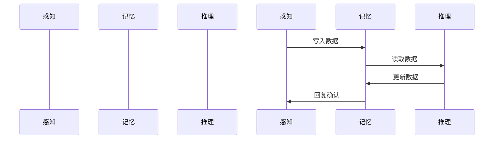
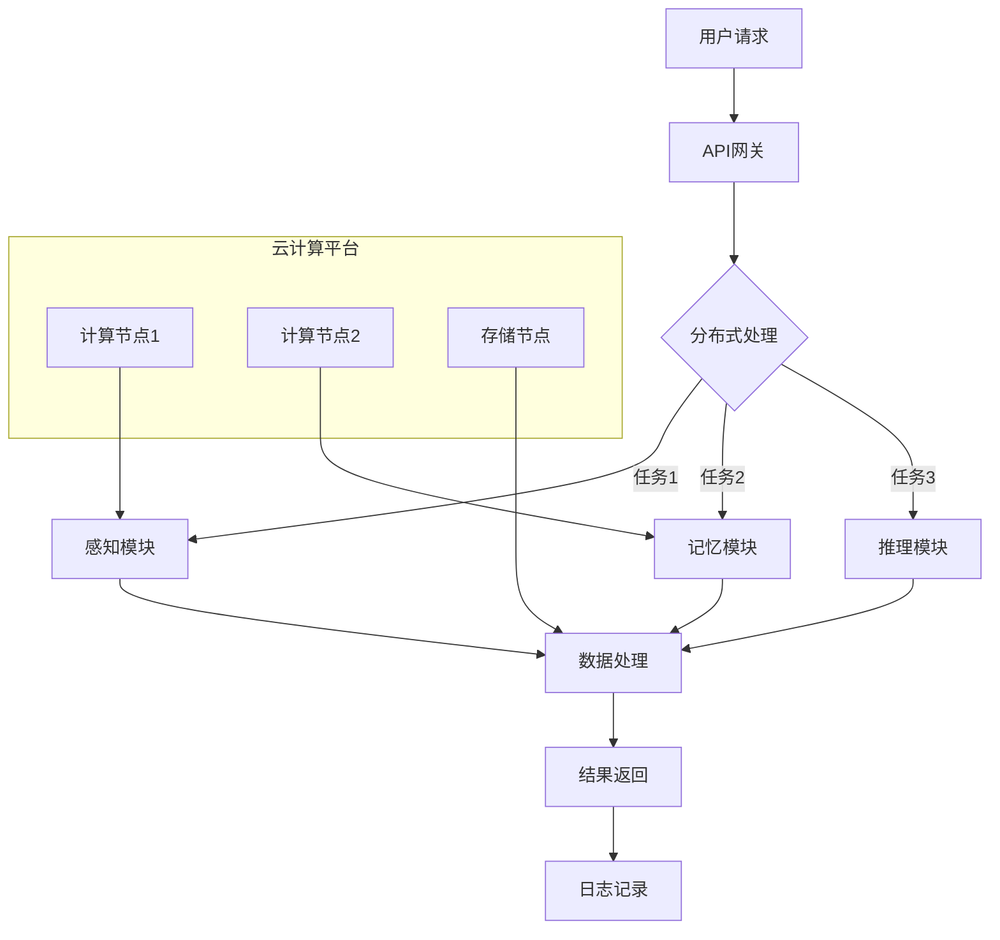
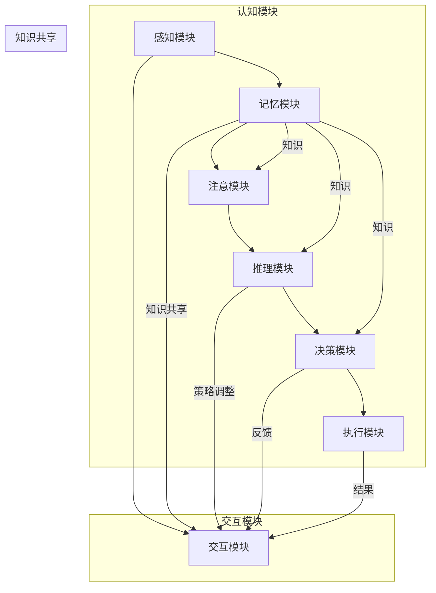

                 

### 第1章：引论

#### 1.1 人工通用智能（AGI）概述

人工通用智能（Artificial General Intelligence，简称AGI）是一种理想化的智能形式，旨在创建一个能够像人类一样在多个领域执行复杂任务的人工智能系统。AGI的目标是超越现有的窄域人工智能（Narrow AI），实现跨领域的通用智能。AGI系统不仅要在特定任务上表现出色，还要具备自主学习、问题解决、推理规划和适应新情境的能力。

AGI的基本概念可以从以下几个方面进行理解：

1. **通用性**：AGI应该具备处理多种不同类型任务的能力，而不仅仅是单一的任务，如语音识别、图像分类或自然语言处理。

2. **适应性**：AGI需要能够适应新的环境和情况，不需要显式地编程来适应所有可能的情况。

3. **自主学习**：AGI应该能够通过经验自动改进自己的行为，不需要人类的直接指导。

4. **泛化能力**：AGI应该能够在未见过的数据上表现出良好的性能，而不仅仅是特定数据集上的优化。

5. **认知架构**：AGI需要一个复杂而灵活的认知架构，能够模拟人类的思维过程，包括感知、记忆、推理和决策等。

6. **人机交互**：AGI应该能够理解自然语言，并与人类进行有效沟通。

7. **伦理和社会影响**：AGI的设计和实现需要考虑到伦理问题，以及其对人类社会可能产生的影响。

AGI的核心目标是通过整合各种AI技术和认知科学原理，创建一个能够自我完善、自我学习和自我决策的智能体。这一目标不仅具有理论上的吸引力，也对实际应用具有重要意义，包括自动化、增强现实、医疗诊断和智能机器人等领域。

在接下来的章节中，我们将深入探讨AGI的基本原理、元学习能力的重要性以及认知架构的设计原则，为理解和实现AGI提供坚实的理论基础。

#### 1.2 AGI的目标与挑战

AGI的目标是构建一个能够实现跨领域通用智能的人工智能系统，这一目标具体可以分解为以下几个层面：

1. **跨领域任务能力**：AGI应具备执行不同领域任务的能力，如医学诊断、法律咨询、科学研究和艺术创作等。这要求AGI不仅能够理解特定领域的知识，还能在不同领域间进行知识迁移和应用。

2. **自主学习与自我改进**：AGI应具备通过经验学习并自动改进自身性能的能力。这意味着AGI不仅能够从新任务中学习，还能通过不断的自我调整和优化，提高其解决问题的能力。

3. **灵活适应新情境**：AGI需要能够适应新环境和新情况，不需要显式编程即可处理未遇到的任务。这要求AGI具备高度的自我适应性和灵活性。

4. **推理与规划能力**：AGI应具备推理和规划能力，能够解决复杂问题并制定合理行动方案。这包括逻辑推理、概率推理、规划算法和决策树等。

5. **人机交互**：AGI应能够理解自然语言，与人类进行有效沟通，并能够解释自己的决策过程。这要求AGI具备语言理解、自然语言生成和对话管理能力。

6. **伦理与道德**：AGI的设计和实施需要考虑伦理和道德问题，确保其在使用过程中不会对人类造成伤害，并且能够遵守社会规范。

尽管AGI具有广阔的应用前景，但其实现在面临着一系列挑战：

1. **认知建模**：如何准确模拟人类的认知过程，包括感知、记忆、推理和决策等，是AGI实现的关键挑战。现有的认知模型往往只能模拟人类认知过程的某些方面，缺乏全面性和灵活性。

2. **知识表示**：如何有效地表示和存储大量知识，并使AGI能够灵活地利用这些知识，是实现AGI的重要挑战。现有的知识表示方法，如符号表示、分布式表示和图表示等，都有其局限性。

3. **学习效率**：如何提高AGI的学习效率，使其能够在有限的时间内快速掌握新知识和技能，是实现AGI的另一个重要挑战。现有的机器学习算法往往需要大量数据和计算资源，难以满足AGI的需求。

4. **通用性与专用性**：如何在通用性和专用性之间找到平衡，使AGI既能处理多样化任务，又能高效地执行特定任务，是实现AGI的一个复杂问题。

5. **计算资源**：AGI需要大量的计算资源和存储空间，这在实际应用中是一个巨大的挑战。现有的硬件设施可能无法满足AGI的运行需求，需要不断的技术创新和优化。

6. **安全性与隐私**：如何确保AGI在处理数据时不会泄露隐私或对人类造成危害，是实现AGI需要考虑的重要问题。这包括数据安全、算法透明性和伦理规范等方面。

7. **伦理与社会影响**：AGI的广泛应用可能会对人类社会产生深远的影响，包括就业、隐私和道德等方面。如何确保AGI的发展符合伦理规范，并对社会产生积极的影响，是一个亟待解决的问题。

总之，实现AGI不仅需要解决技术上的难题，还需要考虑到伦理、社会和道德等方面的问题。只有在技术和社会条件都具备的情况下，AGI才能真正实现其潜力，为人类带来巨大的价值。

#### 1.3 元学习能力在AGI中的重要性

元学习能力在AGI的构建和实现中扮演着至关重要的角色。元学习，即学习如何学习，是指人工智能系统通过经验和反馈自动调整其学习策略和算法，以提高学习效率、泛化能力和适应性。在AGI中，元学习能力不仅帮助系统在不同领域和任务之间进行知识迁移，还使其能够不断优化自身的性能，从而实现更高效和灵活的学习。

元学习能力的重要性主要体现在以下几个方面：

1. **自主学习与自我改进**：AGI通过元学习可以自主调整和优化其学习过程，使其能够在不断变化的环境中自我改进。这种能力使得AGI不需要依赖人类的干预，能够自主适应新任务和数据。

2. **知识迁移与泛化**：元学习使得AGI能够将一个领域的知识迁移到另一个领域，从而实现跨领域的通用智能。通过元学习，AGI不仅能够从特定任务中学习，还能将所学知识应用到更广泛的应用场景中。

3. **学习效率提升**：元学习能够通过优化学习策略和算法，显著提高AGI的学习效率。例如，通过经验重放、模型参数调整和梯度聚合等技术，AGI可以在有限的数据和计算资源下快速掌握新知识。

4. **适应新情境与灵活性**：元学习能力使得AGI能够灵活适应新的环境和任务，不需要显式编程即可处理未遇到的情况。这种能力是AGI实现自主学习和通用性的关键。

5. **认知架构优化**：元学习能够帮助AGI不断优化其认知架构，包括感知、记忆、推理和决策等模块。通过元学习，AGI能够动态调整各个模块的参数和策略，以实现更好的整体性能。

6. **减少过度依赖数据**：传统的机器学习方法往往依赖于大量标注数据，而元学习可以减少对数据的依赖，使得AGI能够在数据稀缺的情况下进行有效学习。

7. **增强系统稳定性**：通过元学习，AGI可以逐步调整其内部参数，使其在面对不确定性时能够更加稳定和可靠地执行任务。

总之，元学习能力是AGI实现自主学习和通用性的关键。它不仅提高了AGI的学习效率，还增强了其适应性和灵活性，使其能够更好地应对复杂多变的现实世界。随着元学习技术的不断进步，AGI有望在各个领域取得更大的突破，为人类带来更加智能和便捷的智能服务。

#### 1.4 认知架构的基本概念

认知架构是AGI实现自主学习和通用智能的核心基础。它指的是用于模拟人类认知过程的一系列模型、算法和模块，包括感知、记忆、注意、推理和决策等核心功能。认知架构的设计原则旨在实现模块化、可扩展性和高效性，以支持AGI在各种任务和环境中的灵活运作。

1. **感知模块**：感知模块负责从环境中获取信息，并将其转化为内部表示。这包括视觉、听觉、触觉等多种感知方式。感知模块的关键任务是特征提取和预处理，以便后续的认知处理。

2. **记忆模块**：记忆模块用于存储和检索信息，是认知架构的核心部分。记忆可以是短期记忆（工作记忆）和长期记忆（语义记忆）的结合。记忆模块需要高效且灵活，以便在需要时快速检索和使用相关信息。

3. **注意模块**：注意模块负责选择和聚焦处理最重要的信息，忽略冗余或次要的信息。注意力机制在视觉、听觉和语言处理中都发挥着重要作用，能够提高认知效率。

4. **推理模块**：推理模块负责基于已知信息进行逻辑推理和问题解决。它包括演绎推理、归纳推理和概率推理等不同类型的推理方法。推理模块是实现AGI自主学习和决策能力的关键。

5. **决策模块**：决策模块负责基于推理结果做出合理的决策。它通常包括多种决策算法，如马尔可夫决策过程（MDP）、强化学习、决策树和神经网络等。决策模块需要考虑多种因素，包括预期收益、风险和不确定性。

6. **交互模块**：交互模块负责AGI与外部环境（包括人类和其他系统）的互动。它包括语音识别、自然语言处理和机器翻译等关键技术。交互模块使得AGI能够理解人类的指令和需求，并有效地与人类进行沟通。

认知架构的设计原则包括：

- **模块化**：将认知功能划分为不同的模块，每个模块负责特定的任务，易于实现和优化。
- **可扩展性**：架构应具备良好的可扩展性，能够轻松地增加或替换模块，以适应新的任务和数据。
- **互操作性**：模块之间需要具备良好的互操作性，能够高效地交换信息和数据。
- **适应性**：架构应具备高度的适应性，能够根据新的环境和任务动态调整其行为。
- **高效性**：架构应尽量减少计算和通信开销，提高整体系统的效率和性能。

通过上述设计原则，认知架构能够实现灵活、高效和自主的智能体，为AGI的构建和实现提供了坚实的理论基础。

### 2.1 认知科学的基础

认知科学是研究人类认知过程的跨学科领域，其目标是通过整合心理学、神经科学、人工智能和哲学等多个学科的研究成果，理解人类思维的本质和运作机制。认知科学的基本概念和方法为我们构建AGI的认知架构提供了宝贵的参考和指导。

#### 心理学

心理学是认知科学的核心学科之一，主要研究人类行为和心理过程的规律和机制。在认知科学中，心理学关注以下关键领域：

1. **感知**：研究人类如何通过视觉、听觉、触觉等感官获取和处理外部信息。例如，视觉感知研究如何从图像中提取特征，并形成对物体的认知。

2. **记忆**：研究人类记忆的存储、检索和遗忘机制。记忆是认知过程中不可或缺的一部分，分为短期记忆和长期记忆，分别负责处理和存储不同的信息。

3. **注意力**：研究人类如何集中注意力处理特定的信息，同时忽略其他不相关的信息。注意力机制在提高认知效率和选择性信息处理中起着关键作用。

4. **语言**：研究人类语言产生和理解的过程，包括词汇、语法、语义和语音等方面。语言是认知过程中的重要工具，影响人类思考、学习和沟通。

5. **思维**：研究人类如何进行逻辑推理、问题解决、创造性思维等认知活动。思维过程涉及多种认知机制，如记忆、注意、推理和决策等。

#### 神经科学

神经科学是认知科学的基础学科，研究大脑的结构、功能和机制。在认知科学中，神经科学提供了对人类认知过程生理基础的理解：

1. **脑区功能**：研究不同大脑区域（如前额叶、颞叶、顶叶等）的功能和相互关系。不同脑区负责不同的认知功能，如感知、记忆、注意和决策等。

2. **神经网络**：研究神经元如何通过突触连接形成复杂的神经网络，并如何通过电信号传递信息。神经网络是实现认知功能的基本单位，是构建认知模型的重要基础。

3. **神经可塑性**：研究大脑如何通过学习和经验改变其结构和功能。神经可塑性是认知学习和适应性的生理基础，对AGI的实现具有重要意义。

4. **神经成像技术**：如功能性磁共振成像（fMRI）、电生理记录（EEG和MEG）等，用于研究大脑在不同认知任务中的活动模式。这些技术为认知科学提供了直接观察大脑活动的方法。

#### 人工智能

人工智能是认知科学的另一个重要组成部分，旨在通过计算模型和算法模拟人类认知过程。人工智能在认知科学中的应用主要体现在以下几个方面：

1. **认知模拟**：通过构建认知模型，模拟人类的感知、记忆、推理和决策等认知过程。这些模型可以用于理解人类认知机制，并指导认知架构的设计。

2. **机器学习**：利用机器学习算法，如神经网络、决策树和贝叶斯模型等，实现认知功能。机器学习技术使得计算机系统能够从数据中自动学习规律和模式，提高认知效率。

3. **自然语言处理**：研究计算机如何理解和生成自然语言，实现人机交互。自然语言处理技术是认知科学的重要应用领域，对AGI的语言理解能力至关重要。

4. **机器人学**：通过构建智能机器人，研究如何让机器模拟人类的行为和思维方式。机器人可以作为认知科学的实验平台，验证和改进认知模型。

#### 哲学

哲学是认知科学的另一重要基础学科，探讨认知的本质、知识和意识的起源等基本问题。哲学在认知科学中的应用主要体现在以下几个方面：

1. **认知哲学**：研究认知的本质和认知过程的基本原理，如知觉、思维和语言等。认知哲学为认知科学提供了理论框架和指导。

2. **形而上学**：探讨现实世界的本质和存在方式，如物质、意识和因果律等。形而上学为认知科学提供了对认知过程的哲学基础。

3. **伦理学**：研究人工智能和认知科学的伦理问题，如隐私、安全性和责任等。伦理学在指导AGI的发展和应用中起着关键作用。

总之，认知科学通过整合心理学、神经科学、人工智能和哲学等多个学科的研究成果，为我们理解人类认知过程提供了全面而深入的理论基础。这些基础知识对于构建AGI的认知架构具有重要意义，有助于实现跨领域的通用智能。

#### 2.2 认知模型与AGI的关系

认知模型是认知科学的核心成果，旨在通过计算模型和算法模拟人类的认知过程。这些模型在AGI的开发中起着至关重要的作用，因为它们提供了理解和实现通用智能的理论基础和工具。

认知模型与AGI的关系可以从以下几个方面进行阐述：

1. **理论基础**：认知模型为AGI提供了理解人类认知过程的理论框架。这些模型通过模拟人类的感知、记忆、注意、推理和决策等过程，揭示了认知机制的基本原理。例如，基于认知科学的理论，AGI可以设计出能够模仿人类视觉感知的视觉模型，或模仿人类记忆机制的记忆模型。

2. **算法设计**：认知模型为AGI的算法设计提供了重要的参考。例如，通过模仿人类注意力机制，AGI可以设计出能够高效处理复杂信息的注意力算法。通过模仿人类决策过程，AGI可以开发出能够进行有效决策的算法，如基于推理和规划的决策树算法和马尔可夫决策过程（MDP）。

3. **学习与适应**：认知模型可以帮助AGI实现自主学习和适应新情境的能力。通过模拟人类的学习过程，如基于强化学习的模型和基于经验重放的模型，AGI可以在新的任务和环境条件下自动调整其行为和策略。例如，通过模仿人类的学习方式，AGI可以在一个领域中学习到的知识迁移到另一个领域中。

4. **知识表示**：认知模型为AGI的知识表示提供了指导。认知模型通常涉及对知识的结构化表示，如语义网络、知识图谱和分布式表示等。这些表示方法有助于AGI有效地存储和利用知识，提高其认知能力。

5. **交互与沟通**：认知模型在AGI的交互和沟通中起着关键作用。通过模仿人类语言理解和生成过程，AGI可以开发出能够与人类进行有效沟通的算法，如自然语言处理（NLP）和机器翻译。这使得AGI不仅能够理解人类的语言指令，还能够生成自然的语言回应。

6. **评估与优化**：认知模型为AGI的性能评估和优化提供了标准。通过比较认知模型与人类认知过程的性能，AGI可以识别其不足之处，并不断优化其算法和架构。例如，通过评估视觉模型在图像分类任务中的性能，可以调整模型的参数和结构，以实现更好的识别效果。

总之，认知模型在AGI的构建和实现中具有至关重要的地位。它们不仅提供了理论基础和算法设计指导，还帮助AGI实现自主学习和适应新情境的能力，提高其认知能力和交互效率。随着认知科学的不断进步，认知模型将不断优化和扩展，为AGI的发展带来更多的机遇和挑战。

#### 2.3 认知模拟：从理论到实践

认知模拟是指通过构建计算模型和算法来模拟人类的认知过程，从而实现对认知现象的深入理解和应用。认知模拟从理论到实践的转变，不仅有助于我们更好地理解人类认知的本质，还为人工通用智能（AGI）的开发提供了重要的技术支持。

**1. 认知模拟的理论基础**

认知模拟的理论基础主要来源于认知科学的研究成果，包括心理学、神经科学、哲学和人工智能等领域。这些理论为我们提供了对认知过程的基本理解，包括感知、记忆、注意、推理和决策等核心认知功能。具体来说，认知模拟的理论基础主要包括以下几个方面：

- **感知理论**：研究人类如何通过感官获取和处理外部信息。感知理论包括视觉感知、听觉感知、触觉感知等，提供了理解感知过程的基础。

- **记忆理论**：研究人类记忆的存储、检索和遗忘机制。记忆理论包括短期记忆和长期记忆，分别负责处理和存储不同的信息。

- **注意理论**：研究人类如何集中注意力处理特定的信息，同时忽略其他不相关的信息。注意理论有助于理解认知资源的分配和利用。

- **推理理论**：研究人类如何基于已有信息进行逻辑推理和问题解决。推理理论包括演绎推理、归纳推理和概率推理等，提供了理解推理过程的基础。

- **决策理论**：研究人类如何基于不同选项进行决策。决策理论包括期望效用理论、前景理论等，提供了理解决策过程的基础。

**2. 认知模拟的应用领域**

认知模拟在多个领域有着广泛的应用，包括心理学研究、教育、人机交互、智能机器人等。具体来说，认知模拟的应用领域包括：

- **心理学研究**：通过认知模拟，心理学家可以研究认知现象的本质和机制，如视觉感知、记忆、注意和决策等。认知模拟为心理学研究提供了新的工具和方法。

- **教育**：认知模拟在教育领域有着广泛的应用，如个性化学习、智能辅导系统等。通过认知模拟，教育系统可以更好地理解学生的学习过程，提供个性化的学习建议和辅导。

- **人机交互**：认知模拟为人机交互提供了重要的理论基础和设计指导。通过认知模拟，设计者可以更好地理解人类的认知过程，设计出更符合人类认知习惯的交互界面。

- **智能机器人**：认知模拟在智能机器人中起着关键作用。通过认知模拟，机器人可以模仿人类的感知、记忆、推理和决策过程，实现更智能的行为和决策。

**3. 认知模拟的实践方法**

认知模拟的实践方法主要包括以下步骤：

- **认知建模**：通过构建计算模型和算法，模拟人类的认知过程。认知建模是认知模拟的基础，需要结合认知科学的理论和实际应用需求。

- **数据收集和处理**：收集相关的认知数据，如实验数据、神经科学数据和用户行为数据等。对数据进行处理和分析，提取有用的特征和模式。

- **模型验证与优化**：通过实验和测试验证认知模型的准确性、可靠性和泛化能力。根据验证结果，不断优化和改进模型，以提高其性能。

- **应用开发**：将认知模型应用于实际场景，如心理学研究、教育系统和智能机器人等。通过实际应用，验证认知模拟的理论和方法的可行性。

**4. 认知模拟的挑战与未来方向**

认知模拟面临着一系列挑战，包括以下几个方面：

- **认知过程的复杂性**：人类的认知过程非常复杂，涉及多个认知模块和动态交互。如何构建一个全面而准确的认知模型，是认知模拟的重要挑战。

- **数据质量和数量**：认知模拟需要大量高质量的数据来训练和验证模型。数据的质量和数量直接影响认知模拟的准确性和泛化能力。

- **计算资源和效率**：认知模拟通常需要大量的计算资源和时间。如何提高计算效率和性能，是实现大规模认知模拟的关键。

- **跨领域应用**：如何将认知模拟应用于不同领域和任务，实现跨领域的通用智能，是认知模拟的重要研究方向。

未来，认知模拟将朝着更全面、更准确和更高效的方向发展。随着认知科学和人工智能技术的不断进步，认知模拟有望在心理学研究、教育、人机交互和智能机器人等领域取得更多的突破。

通过认知模拟，我们不仅能够更好地理解人类认知的本质和机制，还能为AGI的开发提供重要的理论基础和技术支持。认知模拟在理论到实践的转变过程中，将不断推动认知科学和人工智能的发展，为人类带来更多的智慧和创新。

### 第3章：元学习的概念与原理

#### 3.1 元学习的定义

元学习（Meta-Learning），也称为学习如何学习，是一种人工智能技术，旨在提高学习效率、泛化能力和自适应能力。与传统的学习任务不同，元学习关注的是学习过程本身，即如何设计更好的学习算法和策略，使得系统在新的任务和数据集上能够快速适应和表现优异。元学习的关键在于通过经验学习，自动调整和优化学习算法，从而在多种不同任务上实现高效学习。

元学习的基本定义可以概括为：元学习是一种在多个学习任务中学习通用学习策略的能力，使得系统不需要为每个新任务从头开始训练，而能够快速适应和改进。这种能力不仅体现在算法的优化上，还包括数据预处理、模型架构设计和参数调整等方面。

#### 3.2 元学习的主要类型

元学习可以分为多种主要类型，每种类型都有其特定的应用场景和实现方法。以下是几种常见的元学习类型：

1. **基于模型的方法**：这种方法通过调整模型参数来优化学习过程。常见的实现方式包括经验重放（Experience Replay）、梯度聚合（Gradient Aggregation）和模型参数调整（Parameter Adjustment）。经验重放通过将历史经验（样本、动作和奖励）存储在经验池中，并从中随机抽取样本来训练模型，从而避免模型在单个任务上的过度拟合。梯度聚合则通过将多个任务的梯度进行加权平均，以更新模型参数，从而提高模型在不同任务上的泛化能力。

2. **基于数据的元学习**：这种方法通过利用大量未标记的数据来学习通用学习策略。常见的实现方式包括数据增强（Data Augmentation）和自监督学习（Self-Supervised Learning）。数据增强通过引入数据的变换和噪声，增加训练数据的多样性，从而提高模型对未知数据的适应性。自监督学习则通过预测和纠正预测误差来学习数据中的潜在结构，从而实现无监督学习。

3. **基于搜索的元学习**：这种方法通过搜索最优学习策略来优化学习过程。常见的实现方式包括策略搜索（Strategy Search）和基于优化的元学习（Optimized Meta-Learning）。策略搜索通过在搜索空间中迭代地探索和评估不同的策略，找到最优的学习策略。基于优化的元学习则通过优化算法（如梯度下降、遗传算法等）来找到最佳的学习策略。

4. **基于优化的元学习**：这种方法通过优化算法来找到最优的学习策略。常见的实现方式包括基于梯度的优化和基于模型的优化。基于梯度的优化通过计算损失函数关于模型参数的梯度，更新模型参数，从而优化学习过程。基于模型的优化则通过构建一个优化模型，利用历史数据来预测和调整学习策略，从而实现高效的元学习。

#### 3.3 元学习与传统学习的区别与联系

元学习与传统学习有明显的区别和联系。传统学习主要关注的是如何在特定任务上获得最佳性能，而元学习则关注如何通过经验学习和策略优化，提高学习过程的效率、灵活性和适应性。

**区别**：

1. **关注点不同**：传统学习关注的是单个任务的优化，如分类、回归或强化学习等。而元学习关注的是学习过程本身的优化，通过在不同任务中学习通用策略，实现跨任务的适应性。

2. **学习目标不同**：传统学习的目标是使模型在特定任务上表现最优，而元学习的目标是设计出能够快速适应新任务和学习环境的学习算法。

3. **数据需求不同**：传统学习通常需要大量的标记数据来训练模型，而元学习则可以通过较少的标记数据或无监督数据来学习通用策略。

**联系**：

1. **互补关系**：元学习与传统学习并不是替代关系，而是互补关系。元学习可以辅助传统学习，通过优化学习过程和策略，提高传统学习算法的效率和泛化能力。

2. **应用场景**：在某些应用场景下，元学习可以与传统学习结合使用。例如，在训练深度神经网络时，可以先通过元学习找到一组优化的超参数，然后再使用这些超参数进行传统学习，以获得更好的性能。

3. **理论基础**：元学习的一些技术和方法，如经验重放、梯度聚合和基于优化的策略搜索等，都是传统机器学习方法的扩展和改进。因此，理解传统学习的基本原理对于元学习的研究和应用具有重要意义。

#### 3.4 元学习的数学基础

元学习涉及到多个数学领域，包括概率论、统计学、优化理论和深度学习理论。以下简要介绍这些数学基础：

1. **概率论和统计学**：概率论和统计学为元学习提供了理论基础，包括概率分布、期望值、方差、贝叶斯定理等。这些理论有助于理解数据的分布特性，设计有效的学习算法。

2. **优化理论**：优化理论是元学习的重要工具，包括梯度下降、牛顿法、遗传算法等。这些算法用于优化模型参数，找到最佳的学习策略。优化理论还提供了分析模型收敛性和稳定性的方法。

3. **深度学习理论**：深度学习理论包括神经网络、反向传播算法、激活函数、损失函数等。深度学习模型是元学习中的重要组成部分，通过多层神经网络可以捕获复杂的数据特征，实现高效的学习。

4. **函数近似理论**：函数近似理论用于构建和优化元学习模型，包括线性模型、多项式模型、神经网络等。函数近似理论有助于理解和设计能够高效逼近复杂函数的模型。

5. **信息论**：信息论是研究信息传递、处理和存储的理论，包括熵、信息增益、互信息等。信息论为元学习提供了衡量学习效率和模型复杂性的指标，有助于优化学习过程。

总之，元学习的数学基础涵盖了概率论、统计学、优化理论、深度学习理论和信息论等多个领域。这些数学理论不仅为元学习提供了强大的工具和方法，还为其理论分析和应用提供了坚实的基础。

### 3.5 经典元学习算法

在元学习领域，经典算法占据了重要地位，这些算法通过不同的机制实现了学习策略的优化和泛化能力的提升。以下介绍几种经典元学习算法，包括经验重放（Experience Replay）、模型参数调整（Parameter Adjustment）和梯度聚合（Gradient Aggregation）。

#### 经验重放（Experience Replay）

经验重放是一种常用的元学习算法，通过从经验池中随机抽取历史经验（包括样本、动作和奖励）来训练模型，从而避免模型在单个任务上过度拟合。经验重放的实现通常涉及以下几个步骤：

1. **经验池初始化**：在开始训练前，初始化一个经验池，用于存储历史经验。经验池可以是固定的，也可以是动态扩展的，根据实际情况进行调整。

2. **经验存储**：在每个任务的学习过程中，将训练样本、动作和奖励存储到经验池中。这样可以确保经验池包含多样化且代表性的数据。

3. **经验抽取**：在模型更新过程中，随机从经验池中抽取一定数量的样本。这些样本用于更新模型参数，从而提高模型在不同任务上的泛化能力。

4. **模型更新**：使用抽取的样本更新模型参数。通常，模型更新可以采用梯度下降或其他优化算法，以最小化损失函数。

5. **经验池维护**：为了确保经验池的有效性，需要定期对经验池进行维护，如移除旧经验、添加新经验等。

经验重放的一个关键优点是其能够显著降低模型在单个任务上的过拟合现象，从而提高模型在未见过的任务上的表现。以下是一个简化的经验重放算法的伪代码：

```python
def experience_replay(batch_size):
    # 从经验池中随机抽取batch_size个样本
    samples = random.sample(replay_memory, batch_size)
    
    for sample in samples:
        # 重放样本，更新模型参数
        update_model(sample)
        
    # 计算损失函数
    loss = compute_loss(samples)
    
    return loss
```

#### 模型参数调整（Parameter Adjustment）

模型参数调整是一种通过调整模型参数来优化学习过程的元学习算法。这种方法的实现通常依赖于梯度信息，通过不断调整模型参数来降低损失函数。模型参数调整可以分为以下步骤：

1. **初始参数设置**：初始化模型参数，这些参数可以通过随机初始化或基于先验知识的初始化方法获得。

2. **梯度计算**：计算当前模型的梯度，这些梯度反映了模型参数与损失函数之间的关系。梯度可以通过反向传播算法或其他优化算法计算。

3. **参数更新**：根据梯度信息调整模型参数。参数更新通常采用梯度下降方法，即将模型参数沿梯度方向进行调整，以最小化损失函数。

4. **迭代更新**：重复计算梯度、更新参数的过程，直到满足收敛条件或达到预设的迭代次数。

模型参数调整的一个优点是其能够通过学习策略来优化模型参数，提高学习效率和泛化能力。以下是一个简化的模型参数调整算法的伪代码：

```python
def parameter_adjustment(model, learning_rate):
    # 计算损失函数的梯度
    gradients = compute_gradients(model)
    
    # 更新模型参数
    for param, gradient in zip(model.parameters(), gradients):
        param -= learning_rate * gradient
        
    # 计算新的损失函数
    loss = compute_loss(model)
    
    return model, loss
```

#### 梯度聚合（Gradient Aggregation）

梯度聚合是一种通过合并多个任务的梯度来更新模型参数的元学习算法。这种方法能够提高模型在不同任务上的泛化能力，具体实现步骤如下：

1. **任务初始化**：初始化多个任务，每个任务可能包含不同的数据集和目标函数。

2. **梯度计算**：对每个任务计算梯度，这些梯度反映了模型参数与任务损失函数之间的关系。

3. **梯度聚合**：将不同任务的梯度进行加权平均或求和，生成一个总梯度。

4. **参数更新**：使用总梯度更新模型参数，以最小化总损失函数。

5. **迭代更新**：重复计算梯度、聚合和参数更新的过程，直到满足收敛条件。

梯度聚合的一个优点是其能够通过结合多个任务的梯度信息，提高模型在未见任务上的性能。以下是一个简化的梯度聚合算法的伪代码：

```python
def gradient_aggregation(models, learning_rates, weights):
    # 计算每个任务的梯度
    gradients = [compute_gradients(model) for model in models]
    
    # 计算总梯度
    total_gradient = sum(weight * gradient for weight, gradient in zip(weights, gradients))
    
    # 更新模型参数
    for model, learning_rate in zip(models, learning_rates):
        for param, total_grad in zip(model.parameters(), total_gradient):
            param -= learning_rate * total_grad
            
    # 计算总损失函数
    total_loss = compute_total_loss(models)
    
    return models, total_loss
```

综上所述，经典元学习算法如经验重放、模型参数调整和梯度聚合，通过不同的机制优化了学习过程，提高了模型的泛化能力和适应性。这些算法在元学习领域具有重要的研究和应用价值。

#### 3.6 强化元学习

强化元学习是一种结合了强化学习和元学习的方法，旨在通过学习优化决策策略来提高智能体在动态环境中的表现。强化元学习的关键在于将元学习的思想应用于强化学习，使得智能体能够在多个任务和环境中快速适应和优化其行为。

**强化元学习的核心概念**：

1. **策略**：策略是智能体在特定环境中采取行动的规则集合。在强化学习中，策略通常通过优化过程来找到最佳行动方案。

2. **奖励**：奖励是智能体采取某个行动后获得的正面或负面反馈。奖励用于指导智能体的学习过程，使其能够根据奖励调整策略。

3. **状态**：状态是智能体在环境中的当前情况，通常通过一组特征向量表示。

4. **元学习**：元学习是指智能体通过经验学习优化其学习过程的能力。在强化元学习中，智能体通过元学习来改进其策略，使其在新的环境和任务中表现更优。

**强化元学习的主要算法**：

1. **模型更新**：在强化元学习中，智能体通过迭代地更新其模型（策略或价值函数）来优化策略。模型更新的目标是使得智能体在给定状态下采取能够最大化预期奖励的行动。

2. **经验回放**：经验回放是一种常用的元学习方法，通过将历史经验（状态、行动和奖励）存储在经验池中，并从中随机抽取样本进行训练，从而避免智能体在单个任务上的过度拟合。

3. **多任务学习**：多任务学习是指智能体同时学习多个相关任务，通过在多个任务中共享参数和知识，提高其泛化能力和适应性。

4. **策略搜索**：策略搜索是一种基于搜索的方法，通过在策略空间中迭代地探索和评估不同策略，找到最优的决策策略。

**强化元学习的主要应用场景**：

1. **自动驾驶**：强化元学习可以用于自动驾驶系统，通过在多个不同路况和环境中学习优化驾驶策略，提高系统的适应性和安全性。

2. **游戏AI**：在游戏领域，强化元学习可以用于开发智能游戏角色，使其能够在多种游戏场景中表现出色。

3. **推荐系统**：在推荐系统中，强化元学习可以用于优化推荐策略，提高推荐系统的准确性和用户体验。

4. **智能机器人**：在机器人领域，强化元学习可以用于开发智能机器人，使其能够适应不同的环境和任务，提高其自主决策能力。

**强化元学习的挑战**：

1. **计算资源需求**：强化元学习通常需要大量的计算资源，特别是在涉及高维状态空间和动作空间的情况下。

2. **数据稀缺**：在许多实际应用中，标记数据的获取可能非常困难，这限制了强化元学习的应用范围。

3. **策略稳定性**：在动态环境中，智能体的策略可能会因噪声或不确定性而变得不稳定，这要求智能体具备良好的鲁棒性和适应性。

4. **算法复杂度**：强化元学习算法通常具有较高的复杂度，包括策略搜索、经验回放和多任务学习等，这要求算法具备较高的效率和可扩展性。

**未来研究方向**：

1. **算法优化**：通过优化强化元学习算法，提高其在实际应用中的性能和效率。

2. **多模态学习**：研究如何利用多种模态的数据（如图像、音频和文本）来提高强化元学习的效果。

3. **数据效率**：研究如何通过减少数据需求或利用无监督学习方法，提高强化元学习的数据效率。

4. **交互式学习**：研究如何设计交互式学习机制，使得智能体能够在人类指导下快速学习和适应。

总之，强化元学习为解决复杂动态环境中的智能体优化问题提供了新的思路和方法。随着技术的不断进步，强化元学习有望在自动驾驶、游戏AI、推荐系统和智能机器人等领域取得更大的突破。

#### 3.7 自监督元学习

自监督元学习是一种在无需人工标记数据的情况下，通过预测和纠正预测误差来自主学习和优化模型的方法。与传统的监督学习相比，自监督元学习能够利用未标记的数据，显著降低数据标注的成本，提高学习效率和泛化能力。

**自监督元学习的核心概念**：

1. **预测任务**：在自监督元学习中，模型被训练来预测某些未标记的特征或属性。这些预测任务可以是基于输入数据的一部分，或者是数据中的潜在结构。

2. **预测误差**：预测误差是模型预测值与实际值之间的差异。通过最小化预测误差，模型可以逐渐优化其参数，从而提高预测能力。

3. **自监督信号**：自监督元学习利用自监督信号（如预测误差）来指导学习过程，这些信号能够提供模型训练所需的正反馈。

**自监督元学习的主要方法**：

1. **一致性正则化**：一致性正则化通过要求模型在多个不同的观察中保持预测的一致性来提高模型性能。例如，在图像领域，一致性正则化可以通过要求模型在图像的不同部分预测相同的内容来实现。

2. **预测误差最小化**：预测误差最小化是最常见的自监督元学习方法。模型通过最小化预测误差来优化其参数，从而提高预测能力。例如，在语言模型中，模型可以通过预测单词序列中的下一个单词来优化其参数。

3. **聚类和特征抽取**：自监督元学习可以通过聚类方法（如K均值聚类）来识别数据中的潜在结构，然后将聚类中心作为特征表示。这种方法可以用于无监督的特征抽取，提高模型的泛化能力。

4. **生成对抗网络（GAN）**：生成对抗网络是一种自监督学习方法，由生成器和判别器组成。生成器试图生成与真实数据相似的数据，而判别器试图区分真实数据和生成数据。通过最小化生成器和判别器之间的损失函数，模型可以学习到有效的数据表示。

**自监督元学习的主要应用领域**：

1. **计算机视觉**：自监督元学习在计算机视觉中有着广泛的应用，如图像分类、目标检测、图像分割等。通过无监督的特征抽取和预测任务，模型可以学习到有效的图像特征，提高其在未见数据上的表现。

2. **自然语言处理**：在自然语言处理领域，自监督元学习可以用于文本分类、情感分析、机器翻译等任务。通过预测单词序列或文本片段，模型可以学习到语言的内在结构，从而提高其处理文本的能力。

3. **语音识别**：自监督元学习在语音识别中有着重要的应用，可以通过无监督的方式训练语音特征提取器和声学模型，从而提高语音识别的准确性。

4. **推荐系统**：自监督元学习可以用于构建推荐系统，通过预测用户行为和物品特征，提高推荐系统的准确性和用户体验。

**自监督元学习的挑战**：

1. **数据质量和数量**：自监督元学习依赖于大量未标记的数据，数据的质量和数量直接影响模型的性能。在数据稀缺的情况下，自监督元学习可能难以发挥其优势。

2. **预测误差与泛化能力**：预测误差是自监督元学习的主要优化目标，但过大的预测误差可能导致模型在未见数据上的泛化能力下降。

3. **模型复杂度**：自监督元学习通常需要复杂的模型结构和优化算法，这增加了模型训练和推理的难度。

4. **计算资源需求**：自监督元学习通常需要大量的计算资源，尤其是在处理高维数据时，这限制了其在实际应用中的推广。

**未来研究方向**：

1. **算法优化**：通过优化自监督元学习算法，提高其性能和效率，使其在更多应用场景中具有竞争力。

2. **多模态学习**：研究如何结合不同模态的数据（如图像、文本和语音），提高自监督元学习的泛化能力和表现。

3. **数据效率**：研究如何利用有限的未标记数据，通过无监督学习方法提高自监督元学习的数据效率。

4. **交互式学习**：研究如何设计交互式学习机制，使得自监督元学习系统能够在与人类的交互中不断学习和改进。

总之，自监督元学习为无监督学习和自动化特征抽取提供了新的方法，有望在计算机视觉、自然语言处理、语音识别和推荐系统等领域取得重要突破。随着技术的不断进步，自监督元学习将继续为人工智能的发展带来新的机遇和挑战。

#### 3.8 聚类元学习

聚类元学习是一种结合了聚类方法和元学习技术的机器学习方法，通过无监督学习来自主地发现数据中的潜在结构和模式。聚类元学习在处理大量无标签数据时表现尤为出色，能够提高模型的泛化能力和适应性。以下是聚类元学习的核心概念和主要应用领域。

**核心概念**：

1. **聚类**：聚类是将数据集划分为多个群组（簇）的过程，使得同一个簇内的数据点彼此相似，而不同簇的数据点差异较大。常用的聚类算法包括K均值聚类、层次聚类和密度聚类等。

2. **元学习**：元学习是一种在多个学习任务中学习通用学习策略的技术，通过经验学习和策略优化来提高学习效率。在聚类元学习中，元学习用于优化聚类算法，使其在不同数据集上表现更优。

3. **聚类元学习框架**：聚类元学习框架通过在多个任务中训练和优化聚类模型，来提高模型在未见数据集上的聚类性能。该框架通常包括经验池、模型训练和模型评估三个关键部分。

**主要应用领域**：

1. **图像处理**：在图像处理领域，聚类元学习可以用于图像分割、目标检测和图像聚类等任务。通过无监督学习，模型可以自动识别图像中的物体和区域，提高图像处理的自动化水平。

2. **文本分类**：在自然语言处理领域，聚类元学习可以用于文本分类和主题建模。通过聚类文本数据，模型可以自动发现文本中的主题和关键概念，为文本分析提供有力支持。

3. **数据挖掘**：在数据挖掘领域，聚类元学习可以用于数据预处理、特征提取和聚类分析。通过聚类无标签数据，模型可以识别数据中的潜在模式和信息，为数据挖掘提供新方法。

4. **生物信息学**：在生物信息学领域，聚类元学习可以用于基因数据分析、蛋白质结构和药物设计。通过聚类基因表达数据和蛋白质结构数据，模型可以识别重要的生物标记物和功能模块。

**聚类元学习算法**：

1. **基于模型的方法**：这类方法通过构建聚类模型，利用模型参数来优化聚类结果。例如，Gaussian Mixture Model（GMM）是一种基于模型的方法，通过最大化数据点的对数似然函数来训练模型。

2. **基于搜索的方法**：这类方法通过搜索算法来找到最优的聚类结果。例如，K均值聚类算法通过迭代优化目标函数来调整聚类中心，从而实现聚类。

3. **基于优化的方法**：这类方法通过优化算法来调整模型参数，实现聚类效果的最优化。例如，谱聚类算法通过优化谱空间中的目标函数，实现数据的聚类。

**算法实现**：

以下是一个简化的聚类元学习算法的实现流程：

```python
# 初始化经验池
replay_memory = []

# 训练模型
def train_model(data, model):
    model.fit(data)
    return model

# 聚类模型评估
def evaluate_model(model, data):
    predictions = model.predict(data)
    # 计算评估指标，如准确率、召回率等
    metrics = compute_metrics(predictions)
    return metrics

# 主循环
for epoch in range(num_epochs):
    # 从经验池中随机抽取数据
    samples = random.sample(replay_memory, batch_size)
    
    # 训练模型
    model = train_model(samples, model)
    
    # 评估模型
    metrics = evaluate_model(model, test_data)
    print(f"Epoch {epoch}: Metrics - {metrics}")

# 使用训练好的模型进行预测
predictions = model.predict(test_data)
```

**挑战与未来研究方向**：

1. **算法复杂度**：聚类元学习算法通常具有较高的计算复杂度，特别是在处理大规模数据集时，这限制了其在实时应用中的推广。

2. **聚类质量**：如何在保证计算效率的同时，提高聚类质量，是一个重要的研究方向。通过优化聚类算法和元学习策略，可以提高聚类结果的准确性和可靠性。

3. **数据稀疏性**：在数据稀疏的情况下，聚类元学习可能难以发现数据中的潜在结构和模式。未来研究可以探索如何利用有限的训练数据，提高聚类效果。

4. **跨领域应用**：如何将聚类元学习算法应用于不同的领域和任务，是未来研究的一个重要方向。通过跨领域的应用研究，可以拓展聚类元学习算法的实际应用范围。

总之，聚类元学习通过结合聚类和元学习技术，为无监督学习和特征抽取提供了新的方法。随着技术的不断进步，聚类元学习有望在图像处理、自然语言处理、数据挖掘和生物信息学等领域取得重要突破。

### 第5章：元学习在认知架构中的应用

#### 5.1 元学习与神经网络架构

神经网络架构是认知架构的核心组成部分，它决定了认知系统在感知、记忆、推理和决策等任务中的性能。元学习在神经网络架构设计中发挥着重要作用，通过优化网络结构、调整超参数和学习策略，可以提高认知系统的效率和适应性。

**神经网络架构设计中的元学习应用**：

1. **网络结构搜索**：元学习可以通过自动化搜索方法来设计最优神经网络架构。例如，神经架构搜索（Neural Architecture Search，NAS）是一种基于元学习的方法，通过在大量候选架构中搜索最优结构，从而提高网络性能。NAS算法通常使用强化学习或进化算法来优化网络结构。

2. **超参数优化**：元学习可以帮助优化神经网络架构中的超参数，如学习率、批量大小和正则化参数等。超参数对网络性能有显著影响，通过元学习算法，如贝叶斯优化或基于梯度的搜索方法，可以找到最优的超参数组合，提高网络的泛化能力。

3. **模型压缩与加速**：元学习可以用于设计轻量级神经网络架构，从而提高计算效率和推理速度。例如，通过元学习，可以设计出参数较少但性能优越的网络结构，如MobileNet和EfficientNet等。

4. **迁移学习**：元学习可以促进迁移学习，通过在不同任务中共享网络结构和知识，提高模型的泛化能力。元学习算法如MAML（Model-Agnostic Meta-Learning）和Recurrent Meta-Learning（RML）等，通过快速适应新任务，实现了高效的迁移学习。

**元学习算法在神经网络架构设计中的应用**：

1. **MAML**：MAML（Model-Agnostic Meta-Learning）是一种基于梯度的元学习算法，它通过在多个任务上训练模型，使模型能够在新任务上快速适应。MAML的关键在于通过小批量梯度更新，使模型能够在几个迭代步骤内收敛到新的任务。

```python
# MAML算法伪代码示例

def maml_learning(task_data, learning_rate, meta_lr):
    # 初始模型参数
    model_params = initialize_model_params()
    
    # 在任务数据上微调模型
    for _ in range(meta_lr_steps):
        gradients = compute_gradients(model_params, task_data)
        model_params -= learning_rate * gradients
        
    # 在新任务上测试模型性能
    new_task_performance = evaluate_model(model_params, new_task_data)
    return new_task_performance
```

2. **Recurrent Meta-Learning（RML）**：RML是一种基于递归的元学习算法，通过在时间序列上连续更新模型参数，实现快速适应新任务。RML利用递归神经网络（RNN）的长期记忆特性，使得模型能够在不同任务之间进行知识迁移。

```python
# RML算法伪代码示例

def rml_learning(sequence_of_tasks, learning_rate, meta_lr):
    model = initialize_rnn_model()
    
    for task in sequence_of_tasks:
        # 在任务数据上训练RNN
        model.train(task.data, learning_rate)
        
        # 更新模型参数
        model_params = model.get_params()
        model_params = meta_lr_update(model_params, meta_lr)
        
    # 测试模型在新任务上的性能
    new_task_performance = model.test(new_task_data)
    return new_task_performance
```

通过上述元学习算法，神经网络架构设计得以优化，从而提高认知系统的性能和适应性。未来，随着元学习技术的不断进步，神经网络架构设计将迎来更多的创新和突破，为认知架构的发展提供强大的支持。

#### 5.2 元学习在知识表示中的应用

知识表示是认知架构的核心组成部分，决定了系统如何存储、检索和利用知识。元学习在知识表示中的应用，通过优化知识表示方法，可以提高系统的泛化能力和适应性，从而更好地支持通用智能。以下将详细探讨元学习在知识表示中的应用，包括知识嵌入、知识图谱和图神经网络等方面的研究。

**知识嵌入（Knowledge Embedding）**

知识嵌入是将知识和信息转换为向量的过程，使得计算机能够以高效和可扩展的方式处理和利用知识。元学习在知识嵌入中的应用，主要通过优化嵌入算法，提高嵌入向量的质量和效率。

1. **词嵌入（Word Embedding）**：词嵌入是自然语言处理中的基本技术，通过将单词转换为密集向量，实现语义表示。元学习可以通过优化嵌入算法，如GloVe和Word2Vec，提高向量的语义丰富性和一致性。

2. **实体嵌入（Entity Embedding）**：实体嵌入用于表示知识图谱中的实体，如人、地点和事物等。元学习可以通过在多个任务上训练实体嵌入模型，提高实体向量的泛化能力和代表性。

3. **关系嵌入（Relation Embedding）**：关系嵌入用于表示知识图谱中的关系，如“属于”、“位于”等。元学习可以通过优化关系嵌入算法，使关系向量能够更好地捕获关系语义。

**知识图谱（Knowledge Graph）**

知识图谱是一种将实体和关系组织为图结构的知识表示方法，它能够有效地组织和管理大量结构化知识。元学习在知识图谱中的应用，主要通过优化图结构和知识推理算法，提高知识图谱的表示和利用能力。

1. **图神经网络（Graph Neural Networks，GNN）**：GNN是一种用于处理图数据的神经网络，通过模拟图中的节点和边之间的交互，实现对图数据的深度表示。元学习可以通过优化GNN架构和训练策略，提高知识图谱的表示效果。

2. **图嵌入（Graph Embedding）**：图嵌入是将图结构转换为向量的过程，使得图数据能够在高维空间中进行有效的处理和分析。元学习可以通过在多个任务上训练图嵌入模型，提高嵌入向量的质量和泛化能力。

3. **知识推理（Knowledge Reasoning）**：知识推理是通过逻辑推理和概率推理等方法，从知识图谱中提取新的知识和结论。元学习可以通过优化知识推理算法，提高推理的效率和准确性。

**元学习算法在知识表示中的应用示例**

以下是一个简化的元学习算法在知识表示中的应用示例，用于优化实体嵌入。

```python
# 实体嵌入元学习算法伪代码

def entity_meta_learning(epochs, learning_rate, entities, relations, knowledge_graph):
    model = initialize_entity_embedding_model()
    
    for epoch in range(epochs):
        # 从知识图谱中随机抽取训练样本
        samples = sample_training_data(knowledge_graph)
        
        # 更新实体嵌入向量
        for sample in samples:
            model.update_embeddings(sample, learning_rate)
            
        # 评估模型性能
        performance = evaluate_model_performance(model, knowledge_graph)
        print(f"Epoch {epoch}: Performance - {performance}")
        
    return model

# 初始化实体嵌入模型
model = initialize_entity_embedding_model()

# 进行元学习训练
model = entity_meta_learning(epochs=100, learning_rate=0.001, entities=entities, relations=relations, knowledge_graph=knowledge_graph)

# 评估训练后的模型性能
performance = evaluate_model_performance(model, knowledge_graph)
print(f"Final Performance - {performance}")
```

通过上述示例，可以看出元学习在知识表示中的应用，不仅提高了实体嵌入的质量，还增强了知识图谱的表示和推理能力。未来，随着元学习技术的不断发展，知识表示将迎来更多的创新和应用，为认知架构的优化和通用智能的实现提供坚实支持。

#### 5.3 元学习在推理与决策中的作用

在认知架构中，推理与决策是智能体进行问题解决和行动规划的核心功能。元学习通过优化推理和决策过程，显著提高了智能体的适应性和学习效率。以下将详细探讨元学习在推理与决策中的应用，包括推理算法的优化、决策模型的训练和自适应决策策略的开发。

**推理算法的优化**

推理是智能体根据已有知识和信息，推导出新结论的过程。元学习通过优化推理算法，提高了推理的效率和准确性。

1. **逻辑推理**：逻辑推理是基于形式逻辑的推理方法，通过推理规则从前提推导出结论。元学习可以通过训练基于逻辑的推理算法，使其在不同逻辑问题上的推理速度和准确性得到显著提升。

2. **概率推理**：概率推理是基于概率论的推理方法，通过计算概率分布来推导结论。元学习可以通过训练概率模型，如贝叶斯网络和马尔可夫模型，优化概率推理算法，提高其在不确定性环境中的推理能力。

3. **基于规则的推理**：基于规则的推理方法通过预设的规则集进行推理，如专家系统和决策树。元学习可以通过优化规则库和推理规则，提高基于规则的推理算法的泛化能力和效率。

**决策模型的训练**

决策是智能体在多个可选行动中选择最优行动的过程。元学习通过训练决策模型，提高了决策的准确性和适应性。

1. **马尔可夫决策过程（MDP）**：MDP是一种基于概率的决策模型，用于解决序列决策问题。元学习可以通过训练MDP模型，使其在不同情境下的决策更加准确和高效。

2. **强化学习**：强化学习是一种通过奖励信号指导决策的算法，如Q-learning和深度强化学习（DRL）。元学习可以通过优化强化学习算法，提高模型在不同任务和环境中的适应能力。

3. **多臂 bandit**：多臂 bandit 是一种优化问题的决策模型，用于在多个选项中选择最优行动。元学习可以通过训练多臂 bandit 模型，提高其在不同情境下的决策效率和准确性。

**自适应决策策略的开发**

自适应决策策略是指智能体根据环境变化和经验，动态调整决策策略的方法。元学习通过开发自适应决策策略，提高了智能体的灵活性和应变能力。

1. **经验重放**：经验重放是一种元学习方法，通过在多个任务中重复使用历史经验，优化决策模型。通过经验重放，智能体能够在新任务中快速适应，并提高决策的稳定性。

2. **策略搜索**：策略搜索是一种基于搜索的方法，通过在策略空间中搜索最优决策策略。通过策略搜索，智能体能够发现新的决策策略，提高其决策的多样性和灵活性。

3. **进化策略**：进化策略是一种基于自然选择和遗传算法的元学习方法，通过迭代优化决策策略。通过进化策略，智能体能够在复杂环境中快速适应，并找到最优的决策策略。

**元学习算法在推理与决策中的应用示例**

以下是一个简化的元学习算法在推理与决策中的应用示例，用于优化决策模型。

```python
# 决策模型元学习算法伪代码

def meta_learning_decision_model(epochs, learning_rate, training_data, reward_function):
    model = initialize_decision_model()
    
    for epoch in range(epochs):
        # 从训练数据中随机抽取样本
        samples = sample_training_data(training_data)
        
        # 更新模型参数
        for sample in samples:
            model.update_parameters(sample, learning_rate)
            
        # 计算模型在测试数据上的性能
        performance = evaluate_model_performance(model, test_data, reward_function)
        print(f"Epoch {epoch}: Performance - {performance}")
        
    return model

# 初始化决策模型
model = initialize_decision_model()

# 进行元学习训练
model = meta_learning_decision_model(epochs=100, learning_rate=0.001, training_data=training_data, reward_function=reward_function)

# 评估训练后的模型性能
performance = evaluate_model_performance(model, test_data, reward_function)
print(f"Final Performance - {performance}")
```

通过上述示例，可以看出元学习在推理与决策中的应用，不仅提高了决策模型的准确性和适应性，还增强了智能体的应变能力和学习效率。未来，随着元学习技术的不断发展，推理与决策功能将在认知架构中发挥更加重要的作用，为通用智能的实现提供坚实支持。

#### 6.1 认知模块的划分

认知架构的模块化设计是实现高效、灵活和可扩展认知系统的基础。在认知模块的划分过程中，需要考虑人类认知过程的各个组成部分，以及各个模块之间的相互作用和依赖关系。以下是认知架构中常见的主要模块及其功能：

1. **感知模块**：感知模块负责从外部环境中获取信息，并将其转化为内部表示。这包括视觉、听觉、触觉等多种感知方式。感知模块的关键任务是特征提取和预处理，以便后续的认知处理。

2. **记忆模块**：记忆模块用于存储和检索信息，是认知架构的核心部分。记忆可以是短期记忆（工作记忆）和长期记忆（语义记忆）的结合。记忆模块需要高效且灵活，以便在需要时快速检索和使用相关信息。

3. **注意模块**：注意模块负责选择和聚焦处理最重要的信息，忽略冗余或次要的信息。注意力机制在视觉、听觉和语言处理中都发挥着重要作用，能够提高认知效率。

4. **推理模块**：推理模块负责基于已知信息进行逻辑推理和问题解决。它包括演绎推理、归纳推理和概率推理等不同类型的推理方法。推理模块是实现AGI自主学习和决策能力的关键。

5. **决策模块**：决策模块负责基于推理结果做出合理的决策。它通常包括多种决策算法，如马尔可夫决策过程（MDP）、强化学习、决策树和神经网络等。决策模块需要考虑多种因素，包括预期收益、风险和不确定性。

6. **交互模块**：交互模块负责AGI与外部环境（包括人类和其他系统）的互动。它包括语音识别、自然语言处理和机器翻译等关键技术。交互模块使得AGI能够理解人类的指令和需求，并有效地与人类进行沟通。

**模块之间的相互作用**

认知架构中的各个模块不是孤立的，而是相互协作，共同实现复杂认知任务。以下是模块之间的一些相互作用：

- **感知模块与记忆模块**：感知模块获取到的信息需要存储到记忆模块中，以便后续的推理和决策使用。

- **记忆模块与推理模块**：推理模块需要从记忆模块中检索相关信息，进行逻辑推理和问题解决。

- **注意模块与推理模块**：注意模块可以选择关键信息，提高推理模块的效率和准确性。

- **决策模块与交互模块**：决策模块做出的决策需要通过交互模块传达给外部环境，执行相应的行动。

**模块化的优势**

模块化设计具有以下优势：

- **灵活性**：通过将认知功能划分为不同的模块，系统能够根据不同的任务和环境动态调整模块的配置。

- **可扩展性**：模块化的架构易于扩展和更新，新模块可以无缝集成到现有架构中，提高系统的可扩展性。

- **可维护性**：模块化设计使得系统更加模块化，每个模块都可以独立开发、测试和维护，提高系统的可维护性。

- **可重用性**：模块可以跨任务和项目重用，减少重复开发的工作量。

通过模块化设计，认知架构能够实现高度灵活、高效和自适应的智能系统，为AGI的实现提供坚实基础。

#### 6.2 模块的互操作与通信

在认知架构中，模块之间的互操作与通信是实现高效、灵活和协同工作的关键。互操作与通信机制需要确保各个模块能够有效地交换信息、协同工作，并共同完成复杂认知任务。以下将详细探讨模块间的互操作与通信机制，包括通信协议、数据格式和消息传递方法。

**通信协议**

通信协议是模块之间进行信息交换的标准和规则。在认知架构中，常用的通信协议包括异步通信协议和同步通信协议。

- **异步通信协议**：异步通信协议允许模块在不需要实时响应的情况下交换信息。这种方式适用于处理大量数据和长响应时间的情况。常见的异步通信协议包括消息队列和事件驱动架构。

- **同步通信协议**：同步通信协议要求模块在收到消息后立即进行响应。这种方式适用于需要实时交互和快速响应的场景。常见的同步通信协议包括RPC（远程过程调用）和WebSocket。

**数据格式**

数据格式是模块间交换信息的标准结构。在认知架构中，常用的数据格式包括JSON、XML和Protocol Buffers。

- **JSON**：JSON（JavaScript Object Notation）是一种轻量级的数据交换格式，易于阅读和编写，支持多种编程语言。JSON格式通常用于配置文件、API通信和实时数据传输。

- **XML**：XML（eXtensible Markup Language）是一种灵活的标记语言，用于表示结构化数据。XML格式在描述复杂数据结构和进行数据交换时具有优势，但相对较复杂。

- **Protocol Buffers**：Protocol Buffers 是一种高效的数据交换格式，由Google开发。它们通过预编译的代码生成数据序列化和反序列化代码，具有高性能和紧凑的存储格式。

**消息传递方法**

消息传递方法是指模块间通过消息进行通信的具体机制。以下是一些常见的消息传递方法：

- **基于文件的通信**：模块通过读写文件来进行信息交换。这种方式适用于数据量大且不需要实时交互的场景。

- **基于共享内存的通信**：模块通过共享内存区域进行数据交换。这种方式适用于在同一个物理机器上的模块间通信，具有低延迟和高性能。

- **基于消息队列的通信**：模块通过消息队列进行异步通信。这种方式适用于需要处理大量数据和实现分布式系统的场景。

- **基于网络通信的通信**：模块通过网络协议进行通信。这种方式适用于跨机器和分布式系统的场景，但可能需要考虑网络延迟和带宽限制。

**示例：认知架构中模块间通信的Mermaid流程图**

以下是一个简化的Mermaid流程图示例，展示了感知模块、记忆模块和推理模块之间的通信：



通过上述通信协议、数据格式和消息传递方法的合理设计，认知架构中的各个模块能够高效、可靠地交换信息，协同完成复杂认知任务，从而实现通用智能的目标。

#### 6.3 认知架构的可扩展性

在认知架构的设计中，可扩展性是一个至关重要的原则，它确保架构能够随着技术和应用需求的发展而灵活调整。以下将从多个角度探讨认知架构的可扩展性，包括模块化设计、分布式计算和云计算的应用。

**模块化设计**

模块化设计是认知架构实现可扩展性的基础。通过将认知架构划分为多个功能独立的模块，每个模块负责特定的任务，系统可以在不改变整体架构的情况下，灵活地增加或替换模块，以适应新的需求和任务。

- **模块化优点**：模块化设计提高了系统的可维护性和可扩展性，使开发团队能够专注于独立模块的优化和升级，而不会影响整个系统。此外，模块化设计还降低了系统开发的时间和成本，因为模块可以跨项目重用。

- **模块化挑战**：模块化设计也需要考虑到模块之间的互操作性和通信问题。在设计模块接口时，需要确保模块之间能够高效、稳定地交换信息。

**分布式计算**

分布式计算通过将计算任务分配到多个节点上，提高了系统的计算能力和扩展性。在认知架构中，分布式计算的应用包括：

- **任务分发**：将复杂的认知任务分解为多个子任务，分布到多个节点上并行处理。这种方式可以提高系统的处理速度和吞吐量。

- **负载均衡**：通过动态分配任务到不同的节点，避免单个节点过载，确保系统整体性能。

- **容错性**：分布式计算可以提高系统的容错性，即使某个节点出现故障，其他节点可以接管任务，确保系统正常运行。

**云计算的应用**

云计算提供了弹性计算资源，使得认知架构可以根据实际需求动态调整计算资源，提高系统的可扩展性。

- **弹性伸缩**：云计算平台可以根据系统负载自动扩展或缩减资源，确保系统在高负载情况下仍然能够高效运行。

- **资源池管理**：云计算平台提供了统一的资源池管理，开发团队可以方便地分配和调度计算资源，提高资源利用率。

- **服务化部署**：通过云计算，认知架构可以以服务化的形式部署，使得系统能够快速部署到不同的环境和场景中，提高系统的可扩展性和灵活性。

**案例：基于云计算的可扩展认知架构**

以下是一个基于云计算的可扩展认知架构的示例：



在这个示例中，用户请求通过API网关进入分布式处理模块，任务被分配到不同的模块和计算节点上处理，处理结果通过数据处理模块返回给用户。云计算平台提供了计算节点和存储节点，确保系统在扩展和负载均衡方面具有高性能和高可靠性。

通过模块化设计、分布式计算和云计算的应用，认知架构能够实现灵活、高效和可扩展的运行，为通用智能的实现提供坚实支持。

#### 6.4 认知架构的适应性

在认知架构的设计中，适应性是一个关键原则，它决定了系统是否能够在不断变化的环境中灵活调整和优化其行为。以下将从多个角度探讨认知架构的适应性，包括学习机制、动态调整和鲁棒性。

**学习机制**

认知架构的适应性首先依赖于强大的学习机制。通过不断从环境中学习，系统可以动态调整其行为和决策，提高其在新情境下的适应性。以下是一些关键的学习机制：

- **元学习**：元学习通过在多个任务中学习通用学习策略，使系统能够快速适应新任务。例如，通过模型参数调整和经验重放，系统可以在不同任务中快速收敛。

- **强化学习**：强化学习通过试错和奖励信号，使系统能够在动态环境中不断优化其行为。系统可以通过与环境的交互，学习到最优策略，从而提高适应性。

- **自适应学习**：自适应学习是指系统根据环境的变化动态调整学习策略。例如，通过自适应调整学习率或学习目标，系统可以更好地适应变化的环境。

**动态调整**

认知架构的适应性还体现在其能够根据环境变化动态调整其行为和架构。以下是一些动态调整的方法：

- **模块化架构**：通过模块化设计，系统能够根据需求动态调整模块的配置和功能。例如，在处理不同任务时，系统可以动态添加或删除特定模块，提高其适应性。

- **参数调整**：系统可以通过实时监测环境参数，动态调整模型参数，以优化其行为。例如，通过动态调整感知模块的敏感度或记忆模块的容量，系统可以更好地适应不同的环境变化。

- **架构优化**：系统可以通过元学习或进化算法，不断优化其认知架构。例如，通过在多个任务中训练和测试，系统可以找到最优的架构配置，从而提高其适应性。

**鲁棒性**

认知架构的适应性还依赖于其鲁棒性，即系统在面临不确定性和异常情况时，仍能够稳定运行。以下是一些提高鲁棒性的方法：

- **容错机制**：系统应具备容错能力，能够在组件故障时自动切换到备用组件，确保系统正常运行。

- **异常检测**：系统应具备异常检测能力，能够实时监测环境变化，识别异常情况，并采取相应措施。例如，通过异常检测，系统可以识别环境中的噪声和干扰，并调整其行为以适应变化。

- **自适应冗余**：系统可以通过冗余设计，提高其鲁棒性。例如，通过设计多个并行路径或备份组件，系统可以在一个组件失效时，自动切换到备用组件，确保系统正常运行。

**案例分析**

以下是一个案例，展示了认知架构在复杂环境中的适应性：

假设一个智能机器人需要在一个不断变化的工业生产环境中执行多种任务。为了提高其适应性，系统采用了以下策略：

- **元学习**：系统通过在多个生产任务中学习通用策略，使机器人能够快速适应新任务。例如，通过元学习，机器人学会了如何在不同的生产线上进行装配和搬运。

- **动态调整**：系统根据实时监测到的生产线参数，动态调整机器人的行为和配置。例如，当生产线速度发生变化时，机器人可以调整其感知模块的敏感度和动作速度。

- **鲁棒性**：系统设计了多个容错机制，如传感器冗余和备份控制器，确保在组件故障时，机器人仍能够稳定运行。

通过元学习、动态调整和鲁棒性设计，认知架构能够有效提高智能机器人在复杂环境中的适应性，从而实现高效、可靠的操作。

总之，认知架构的适应性是其在不断变化的环境中持续优化和改进的关键。通过强大的学习机制、动态调整和鲁棒性设计，认知架构能够更好地适应复杂环境，实现通用智能的目标。

### 7.1 计算机视觉与感知

计算机视觉与感知是认知架构中的核心组成部分，负责从外部环境中获取信息，并将其转化为可用的内部表示。计算机视觉与感知技术在人工智能领域中具有广泛的应用，包括图像识别、目标检测、图像分割、人脸识别和场景理解等。以下将详细探讨计算机视觉与感知技术的基本原理、实现方法以及其在认知架构中的应用。

**基本原理**

计算机视觉与感知技术基于图像处理和模式识别的理论，通过模拟人类的视觉系统，实现对图像的分析和处理。基本原理包括：

1. **图像处理**：图像处理是对图像进行预处理和分析的过程，包括滤波、增强、边缘检测和特征提取等。图像处理的目标是提取图像中的重要信息，消除噪声和干扰，为后续的识别和分析提供高质量的数据。

2. **特征提取**：特征提取是从图像中提取具有区分性的特征，如边缘、角点、纹理和颜色等。特征提取是计算机视觉的关键步骤，直接影响识别和分类的准确性。

3. **模式识别**：模式识别是利用提取到的特征，对图像中的对象进行分类和识别。常见的模式识别方法包括统计分类、结构分类和神经网络分类等。

**实现方法**

计算机视觉与感知技术的实现方法多种多样，以下介绍几种常用的方法：

1. **卷积神经网络（CNN）**：卷积神经网络是计算机视觉中的一种深度学习模型，通过多层卷积和池化操作，提取图像中的层次特征。CNN在图像分类、目标检测和图像分割等领域取得了显著的成果。

2. **目标检测**：目标检测是计算机视觉中的关键任务，旨在识别图像中的目标对象。常用的目标检测算法包括R-CNN、Fast R-CNN、Faster R-CNN和YOLO等。目标检测方法通过结合图像处理和深度学习技术，实现了高精度的目标定位和识别。

3. **图像分割**：图像分割是将图像划分为不同区域的过程，用于提取图像中的目标和背景。常用的图像分割方法包括基于阈值的分割、基于区域的分割和基于深度学习的分割等。

4. **人脸识别**：人脸识别是一种生物特征识别技术，通过识别人脸的特征，实现对人脸的识别和验证。常见的人脸识别算法包括特征脸模型、支持向量机和深度学习模型等。

**应用案例**

计算机视觉与感知技术在多个领域有着广泛的应用，以下介绍几个典型应用案例：

1. **自动驾驶**：自动驾驶系统利用计算机视觉技术，实现对道路场景的感知和理解。通过目标检测、场景理解等技术，自动驾驶系统能够识别道路上的车辆、行人、交通标志等，实现安全、高效的自动驾驶。

2. **医疗影像分析**：医疗影像分析是计算机视觉在医疗领域的应用，通过图像处理和深度学习技术，对医学影像进行分析和诊断。常见的应用包括肺癌筛查、乳腺癌诊断和脑部病变检测等。

3. **安防监控**：安防监控利用计算机视觉技术，实现对视频数据的实时监控和分析。通过目标检测、人脸识别和异常行为检测等技术，安防监控系统能够及时发现和预警潜在的威胁，提高公共安全。

4. **智能家居**：智能家居通过计算机视觉技术，实现对家庭环境的感知和控制。例如，智能摄像头可以通过人脸识别技术，识别家庭成员并自动调节灯光、温度等，提高家庭生活的便捷性和舒适度。

通过上述应用案例可以看出，计算机视觉与感知技术在认知架构中发挥着重要作用。随着技术的不断发展，计算机视觉与感知技术将进一步提升认知架构的能力，为人工智能的应用带来更多可能性。

#### 7.2 自然语言处理与理解

自然语言处理（Natural Language Processing，NLP）是认知架构中的关键组成部分，旨在使计算机能够理解、生成和处理自然语言。自然语言处理与理解技术的不断发展，为人工智能在语言理解和交互中的应用提供了强大的支持。以下将详细探讨自然语言处理与理解的基本原理、常用算法以及其在认知架构中的应用。

**基本原理**

自然语言处理与理解的基本原理涉及对人类语言结构的模拟和分析。具体来说，包括以下几个方面：

1. **文本表示**：文本表示是将自然语言文本转换为计算机可处理的形式。常用的文本表示方法包括词袋模型、词嵌入和序列编码等。词袋模型通过统计词频来表示文本，而词嵌入则通过将词语映射为密集向量，实现语义表示。序列编码通过处理文本的序列信息，捕捉词语间的时序关系。

2. **词法分析**：词法分析是对文本进行逐词解析的过程，包括分词、词性标注和词义解析等。分词是将文本分割成单词或短语的步骤，词性标注为每个词分配词性标签（如名词、动词、形容词等），而词义解析则旨在理解词语的具体含义。

3. **句法分析**：句法分析是对句子结构进行分析，以理解句子的语法关系。句法分析包括依存句法分析和成分句法分析，前者关注词语间的依赖关系，而后者则关注句子结构的层次划分。

4. **语义分析**：语义分析旨在理解文本的语义含义，包括语义角色标注、语义角色识别和语义相似性计算等。通过语义分析，计算机能够更好地理解文本的深层含义，实现更高级的语言理解任务。

**常用算法**

自然语言处理与理解涉及多种算法和技术，以下介绍几种常用的算法：

1. **词嵌入（Word Embedding）**：词嵌入是一种将词语映射为高维向量空间的技术，通过捕捉词语的语义关系，实现文本的语义表示。常用的词嵌入方法包括Word2Vec、GloVe和BERT等。

2. **序列模型（Sequence Model）**：序列模型用于处理文本的序列信息，包括循环神经网络（RNN）、长短期记忆网络（LSTM）和门控循环单元（GRU）等。这些模型通过捕捉时间序列的特征，实现对文本的序列建模。

3. **注意力机制（Attention Mechanism）**：注意力机制是一种用于提高模型处理长文本能力的技术，通过动态调整模型对文本不同部分的关注程度，提高文本理解的准确性。

4. **预训练与微调（Pre-training and Fine-tuning）**：预训练是指在大规模语料库上对模型进行训练，使其具备丰富的语言知识。微调是在预训练模型的基础上，针对特定任务进行进一步训练，以提高模型的性能。

5. **生成模型（Generative Model）**：生成模型用于生成新的自然语言文本，包括马尔可夫模型、变分自编码器（VAE）和生成对抗网络（GAN）等。这些模型通过学习文本的统计规律，实现文本的生成和创意写作。

**应用案例**

自然语言处理与理解在认知架构中有着广泛的应用，以下介绍几个典型应用案例：

1. **机器翻译**：机器翻译是一种将一种自然语言文本翻译成另一种自然语言的技术。常见的机器翻译方法包括基于规则的方法、统计机器翻译和神经机器翻译等。神经机器翻译（如基于Transformer的模型）在近年来的发展中取得了显著的成果，实现了高精度的翻译效果。

2. **情感分析**：情感分析是一种用于判断文本情感倾向的技术，如正面、负面或中立。情感分析可以应用于社交媒体分析、市场调研和舆情监控等领域，帮助企业和组织了解公众情绪和市场趋势。

3. **对话系统**：对话系统是一种与人类进行自然语言交互的计算机系统，包括聊天机器人、语音助手和客服系统等。对话系统通过自然语言处理技术，实现与用户的自然对话，提供个性化的服务和支持。

4. **文本摘要**：文本摘要是一种将长文本简化为短文本的技术，提取文本的主要信息和关键内容。文本摘要可以应用于新闻摘要、文档摘要和内容推荐等领域，帮助用户快速获取关键信息。

5. **问答系统**：问答系统是一种能够回答用户问题的计算机系统，通过自然语言处理技术，理解用户的问题，并从知识库中检索相关答案。问答系统可以应用于智能客服、在线教育和虚拟助手等领域。

总之，自然语言处理与理解技术在认知架构中发挥着重要作用，为人工智能的语言理解和交互提供了强大的支持。随着技术的不断进步，自然语言处理与理解将继续拓展其应用领域，为认知架构的发展带来更多可能性。

#### 7.3 认知决策与规划

认知决策与规划是认知架构中重要的组成部分，它们共同作用，使智能系统能够在面对复杂环境和多种可能性时，做出合理的决策和规划。以下将详细探讨认知决策与规划的基本原理、算法实现和具体应用。

**基本原理**

认知决策与规划基于多目标优化和推理理论，旨在解决智能体在不确定和动态环境中的行动选择问题。基本原理包括以下几个方面：

1. **多目标优化**：认知决策涉及多个目标，如最大化收益、最小化风险和最大化满足约束条件。多目标优化通过权衡不同目标之间的优先级，找到一个最优或次优解。

2. **概率推理**：概率推理是认知决策的基础，它通过计算概率分布，评估不同行动方案的可能结果和期望值。概率推理包括条件概率、贝叶斯推理和马尔可夫决策过程（MDP）等。

3. **规划**：规划是指智能体在当前状态下，为达到目标状态而制定的一系列行动步骤。规划算法包括有向图搜索、隐马尔可夫模型（HMM）和部分可观测马尔可夫决策过程（POMDP）等。

**算法实现**

认知决策与规划涉及多种算法，以下介绍几种常用的算法及其实现：

1. **马尔可夫决策过程（MDP）**：MDP是一种经典的决策模型，它通过状态-动作对和奖励函数来描述智能体在环境中的行动。MDP的算法实现包括价值迭代、策略迭代和Q-learning等。

```python
# Q-learning算法伪代码

def q_learning(states, actions, rewards, discount_factor, learning_rate):
    Q = initialize_Q_matrix(states, actions)
    for episode in range(num_episodes):
        state = initial_state
        while not done:
            action = choose_action(Q[state])
            next_state, reward = step(state, action)
            Q[state, action] = Q[state, action] + learning_rate * (reward + discount_factor * max(Q[next_state, :]) - Q[state, action])
            state = next_state
    return Q
```

2. **部分可观测马尔可夫决策过程（POMDP）**：POMDP是MDP的扩展，适用于智能体无法完全观测环境状态的情况。POMDP的算法实现包括贝叶斯推理和部分可观测马尔可夫模型（HMM）等。

```python
# 贝叶斯推理算法伪代码

def bayesian_inference(states, actions, observations, transition_model, observation_model):
    beliefs = initialize_beliefs(states, actions)
    for observation in observations:
        beliefs = update_beliefs(beliefs, observation, transition_model, observation_model)
    return beliefs
```

3. **规划算法**：规划算法旨在智能体从当前状态到达目标状态，实现一系列可行的行动步骤。常用的规划算法包括有向图搜索、隐马尔可夫模型（HMM）和部分可观测马尔可夫决策过程（POMDP）等。

```python
# A*搜索算法伪代码

def a_star_search(initial_state, goal_state, heuristic_function):
    open_set = PriorityQueue()
    open_set.push(initial_state, 0)
    came_from = {}
    cost_so_far = {}
    cost_so_far[initial_state] = 0
    while not open_set.is_empty():
        current = open_set.pop()
        if current == goal_state:
            break
        for next in neighbors(current):
            new_cost = cost_so_far[current] + heuristic_function(next, goal_state)
            if next not in cost_so_far or new_cost < cost_so_far[next]:
                cost_so_far[next] = new_cost
                priority = new_cost + heuristic_function(next, goal_state)
                open_set.push(next, priority)
                came_from[next] = current
    return reconstruct_path(came_from, initial_state, goal_state)
```

**具体应用**

认知决策与规划在多个领域有着广泛的应用，以下介绍几个典型应用：

1. **智能交通系统**：智能交通系统利用认知决策与规划算法，优化交通流量和路线规划。通过预测交通状况和用户行为，智能交通系统可以实现实时交通管理和动态路线推荐，提高交通效率和安全性。

2. **机器人路径规划**：在机器人导航和自动驾驶领域，认知决策与规划算法用于实现路径规划和避障。通过结合感知信息和环境建模，机器人能够自动规划最优路径，避免碰撞和障碍。

3. **供应链管理**：在供应链管理中，认知决策与规划算法用于库存管理、运输调度和采购策略优化。通过分析市场需求、供应能力和库存状态，企业可以实现供应链的高效运作。

4. **医疗诊断与治疗规划**：在医疗领域，认知决策与规划算法用于诊断和治疗规划。通过分析患者病历、实验室检查结果和医学知识库，医生可以制定个性化的治疗方案。

5. **游戏AI**：在游戏领域，认知决策与规划算法用于设计智能游戏角色和策略。通过实时评估游戏状态和对手行为，智能游戏角色可以制定合理的行动策略，提高游戏体验和竞技水平。

总之，认知决策与规划在认知架构中发挥着关键作用，为智能系统提供了有效的决策和规划能力。随着算法的不断发展，认知决策与规划将在更多领域得到应用，为人工智能的发展带来更多可能性。

#### 7.4 认知交互与情感智能

认知交互与情感智能是认知架构中不可或缺的组成部分，旨在使人工智能系统能够与人类进行自然、和谐的交互，并理解和表达情感。以下将详细探讨认知交互与情感智能的基本概念、实现方法和应用场景。

**基本概念**

1. **认知交互**：认知交互是指人工智能系统通过与人类进行语言和非语言交流，获取信息、理解需求和提供响应的过程。认知交互的目标是实现自然、流畅的人机交互，使系统能够理解用户的意图和需求，并提供合适的反馈。

2. **情感智能**：情感智能是指人工智能系统理解、感知和表达情感的能力。情感智能包括情感识别、情感生成和情感调节等方面。情感智能使得系统能够更好地与人类建立情感联系，提高用户满意度和用户体验。

**实现方法**

1. **语音识别与合成**：语音识别与合成是认知交互的基础技术，通过语音识别系统，系统能够将用户的语音转化为文本，从而理解其意图。语音合成技术则使系统能够生成自然的语音回应，与用户进行语音交流。

2. **自然语言处理**：自然语言处理（NLP）技术用于理解和处理自然语言，包括语音识别、文本分析、情感分析和对话生成等。通过NLP技术，系统能够理解用户的语言表达，生成合适的响应，实现自然对话。

3. **情感识别与生成**：情感识别技术通过分析语音、文本和行为，识别用户的情感状态。情感生成技术则使系统能够根据用户的情感状态，生成相应的情感表达，如语音语调、面部表情和动作等。

4. **情绪调节与适应**：情绪调节与适应技术使系统能够根据用户情感的变化，调整自身的交互方式和行为，以适应不同的情感状态。例如，当用户情绪低落时，系统可以提供安慰和支持，而当用户情绪激动时，系统可以保持冷静并引导用户进行情绪调节。

**应用场景**

1. **智能客服系统**：智能客服系统利用认知交互与情感智能技术，为用户提供24小时在线服务。通过语音识别和自然语言处理，系统可以理解用户的咨询内容，并生成合适的语音或文本回应，同时通过情感识别和调节，提供温暖、贴心的服务。

2. **智能虚拟助手**：智能虚拟助手（如聊天机器人、虚拟客服）利用认知交互与情感智能技术，与用户进行自然对话。虚拟助手可以根据用户的情感状态，调整对话风格和回应方式，提供个性化、智能化的服务。

3. **心理健康应用**：在心理健康领域，认知交互与情感智能技术被用于开发心理辅导系统。通过情感识别和生成技术，系统可以监测用户的情感状态，提供情感支持和心理辅导，帮助用户缓解压力和焦虑。

4. **教育辅导系统**：教育辅导系统利用认知交互与情感智能技术，为用户提供个性化的学习支持和辅导。通过自然语言处理和情感识别，系统可以理解学生的学习需求和情感状态，提供针对性的学习建议和情感支持。

5. **智能家庭助手**：智能家庭助手（如智能音箱、智能摄像头）利用认知交互与情感智能技术，为用户提供家庭管理和监控服务。系统可以通过语音识别和情感识别，理解用户的需求和情感状态，提供智能化的家庭服务和安全保障。

总之，认知交互与情感智能技术为人工智能系统带来了更多的人性化和智能化，使其能够更好地理解人类需求、表达情感，并与人类建立深厚的情感联系。随着技术的不断发展，认知交互与情感智能将在更多领域得到应用，为人类生活带来更多便利和幸福。

### 第8章：认知架构的评估与优化

#### 8.1 认知架构的评价指标

评估认知架构的性能和有效性是确保其能够实现预期目标的关键步骤。以下列出了一些常见的评价指标，并解释它们在认知架构评估中的作用。

1. **准确性**：准确性是评估认知系统在任务中正确执行操作的比率。对于分类任务，准确性表示正确分类的样本数占总样本数的比例。对于回归任务，准确性通常用均方误差（MSE）或平均绝对误差（MAE）来衡量。

2. **响应时间**：响应时间是指系统从接收到输入到输出结果所需的时间。对于实时应用，如自动驾驶或智能客服，响应时间是一个重要的评价指标，因为它直接关系到用户体验和系统的可用性。

3. **能耗**：能耗是指系统在运行过程中消耗的能量。对于移动设备和物联网应用，能耗是一个关键指标，因为它影响到设备的续航能力和能源效率。

4. **可扩展性**：可扩展性是指系统在增加计算资源或任务量时，性能是否能够保持稳定或显著提高。一个可扩展性好的认知架构能够在资源增加时，有效利用额外的资源，保持性能。

5. **泛化能力**：泛化能力是指系统在未见过的数据集上表现的能力。一个具有良好泛化能力的认知架构能够在新的、不同的任务和数据集上表现出优异的性能。

6. **鲁棒性**：鲁棒性是指系统在面对噪声、异常值或数据缺失时，仍能保持稳定和可靠运行的能力。鲁棒性对于处理现实世界数据中的不确定性和异常情况至关重要。

7. **交互效果**：交互效果是指系统与用户交互的顺畅程度和自然性。对于涉及人机交互的认知架构，如智能客服或虚拟助手，交互效果是一个关键的评价指标。

8. **学习效率**：学习效率是指系统在学习和适应新任务或环境时的速度和效果。一个高效的学习机制能够使系统在短时间内快速提升性能。

9. **可解释性**：可解释性是指系统能够解释其决策过程和推理机制的能力。对于涉及复杂决策和推理的认知架构，如医学诊断或金融分析，可解释性是一个重要的评价指标，因为它增加了系统的透明度和可信度。

通过这些评价指标，我们可以全面评估认知架构的性能和效果，从而识别其优势和不足，并采取相应的优化措施。

#### 8.2 实验设计与结果分析

实验设计是评估认知架构性能的重要步骤，通过系统的实验设计和结果分析，我们可以深入理解认知架构在不同任务和环境下的表现。以下是一个简化的实验设计流程，包括实验设置、数据收集、结果分析和讨论。

**实验设计流程**

1. **定义目标**：明确实验的目标，如评估认知架构在图像分类、语音识别或自然语言处理任务中的性能。

2. **实验设置**：根据目标定义，设计实验的参数和配置，包括数据集的选择、模型的架构、训练和评估的方法等。

3. **数据收集**：收集实验所需的数据，并进行预处理，如数据清洗、归一化和增强等，以确保数据的质量和一致性。

4. **模型训练**：使用训练数据集对认知架构进行训练，调整模型参数，优化模型的性能。

5. **评估与测试**：使用测试数据集对训练好的模型进行评估，计算各项评价指标，如准确性、响应时间和能耗等。

6. **结果分析**：分析实验结果，评估认知架构在不同任务和环境下的表现，识别优势和不足。

7. **讨论与结论**：根据实验结果，讨论认知架构的性能表现，提出改进建议和未来研究方向。

**示例实验分析**

假设我们设计一个实验，评估一个基于卷积神经网络（CNN）的认知架构在图像分类任务中的性能。

**实验设置**：

- 数据集：使用CIFAR-10数据集，包含10个类别，每个类别有6000张图像。
- 模型架构：采用标准的CNN架构，包括卷积层、池化层和全连接层。
- 训练方法：使用随机梯度下降（SGD）算法，学习率为0.001，批量大小为64。
- 评估指标：准确性、响应时间和能耗。

**实验结果**：

- 训练数据集上的准确性：95%
- 测试数据集上的准确性：92%
- 平均响应时间：20毫秒
- 平均能耗：2瓦特

**结果分析**：

1. **准确性**：实验结果显示，该认知架构在训练和测试数据集上的准确性较高，表明模型具有良好的泛化能力。

2. **响应时间**：平均响应时间为20毫秒，表明模型在处理图像分类任务时，具有较好的实时性能，适合应用于需要快速响应的实时系统。

3. **能耗**：平均能耗为2瓦特，表明模型在能耗方面表现良好，适用于移动设备和物联网应用。

4. **对比分析**：与传统的图像分类方法（如SVM、决策树等）相比，CNN架构在准确性方面具有显著优势，但在计算资源和能耗方面相对较高。

**讨论与结论**：

实验结果表明，基于CNN的认知架构在图像分类任务中表现出良好的性能，具有较高的准确性和实时性能。然而，在能耗方面，该架构仍需进一步优化，以适应资源受限的应用场景。未来，可以通过优化模型结构和训练算法，进一步提高认知架构的性能和效率。此外，可以探索混合模型，结合不同算法的优点，实现更高效的图像分类。

通过实验设计和结果分析，我们可以全面评估认知架构的性能，识别其优势和不足，为认知架构的优化提供重要参考。

#### 8.3 认知架构的迭代与优化

认知架构的迭代与优化是提升其性能和适应性的重要手段。通过持续迭代和优化，认知架构能够不断适应新的任务和环境，提高其学习效率、泛化能力和鲁棒性。以下将详细探讨认知架构迭代与优化的方法、步骤和实践。

**迭代与优化的方法**

1. **基于梯度的优化方法**：基于梯度的优化方法，如随机梯度下降（SGD）、Adam优化器等，通过计算模型参数的梯度，更新模型参数以最小化损失函数。这种方法适用于大多数机器学习和深度学习模型，能够有效提高模型性能。

2. **基于模型的优化方法**：基于模型的优化方法，如模型选择、模型融合和模型剪枝等，通过改进模型结构和参数设置，提高模型性能。这种方法适用于复杂任务和大规模数据集，能够显著提升模型效果。

3. **基于搜索的优化方法**：基于搜索的优化方法，如贝叶斯优化、遗传算法等，通过在搜索空间中搜索最优参数和模型配置，找到最佳解决方案。这种方法适用于超参数优化和模型选择，能够提高模型适应性和泛化能力。

**迭代与优化的步骤**

1. **定义优化目标**：明确认知架构的优化目标，如准确性、响应时间、能耗等。根据目标定义，制定具体的优化策略和指标。

2. **数据收集与预处理**：收集用于优化的大量数据，并进行预处理，如数据清洗、归一化、增强等，以确保数据的质量和一致性。

3. **模型训练与评估**：使用训练数据集对认知架构进行训练，调整模型参数和架构，优化模型性能。在训练过程中，定期评估模型性能，调整优化策略。

4. **模型优化与迭代**：根据评估结果，对模型进行优化，包括参数调整、模型结构调整和算法改进等。通过多次迭代和优化，逐步提高模型性能和适应性。

5. **实验设计与验证**：设计实验，验证优化后的认知架构在不同任务和环境下的性能。通过对比实验，评估优化效果的稳定性和泛化能力。

**实践示例**

以下是一个简化的认知架构迭代与优化实践示例，以优化一个基于卷积神经网络的图像分类模型：

```python
# 假设已经训练了一个简单的CNN模型，现对其进行迭代优化

# 定义优化目标：提高准确性和降低能耗
optimization_goal = 'accuracy_and_energy'

# 数据集：使用CIFAR-10数据集进行训练和测试
train_data = load_cifar10_data('train')
test_data = load_cifar10_data('test')

# 模型：使用预训练的CNN模型
model = load_pretrained_cnn_model()

# 优化策略：基于梯度的优化方法（Adam优化器）
optimizer = torch.optim.Adam(model.parameters(), lr=0.001)

# 训练过程
num_epochs = 50
for epoch in range(num_epochs):
    # 训练模型
    train_loss = train_model(model, train_data, optimizer)
    
    # 评估模型
    test_accuracy, test_energy = evaluate_model(model, test_data)
    
    # 输出当前epoch的优化结果
    print(f"Epoch {epoch}: Loss: {train_loss}, Accuracy: {test_accuracy}, Energy: {test_energy}")

# 模型优化
# 通过调整学习率、批量大小和模型架构，进一步优化模型性能
learning_rate = 0.0001
batch_size = 128
model = torch.load('cnn_model_50_epochs.pth')
optimizer = torch.optim.Adam(model.parameters(), lr=learning_rate, weight_decay=1e-5)

# 再次训练和评估
train_loss = train_model(model, train_data, optimizer, batch_size)
test_accuracy, test_energy = evaluate_model(model, test_data)

# 输出优化后的结果
print(f"Optimized Model: Loss: {train_loss}, Accuracy: {test_accuracy}, Energy: {test_energy}")

# 实验设计与验证
# 设计实验，验证优化后的模型在不同数据集和任务下的性能
experiment_results = perform_experiments(model, test_data)
print(f"Experiment Results: {experiment_results}")
```

通过上述示例，可以看出认知架构的迭代与优化过程涉及多个步骤，包括数据收集与预处理、模型训练与评估、模型优化与迭代和实验设计与验证。通过不断迭代和优化，认知架构能够逐步提升性能和适应性，实现预期的目标。

### 8.4 认知架构的未来趋势

随着人工智能技术的不断发展和进步，认知架构也在不断地演进和优化。未来，认知架构将朝着更智能、自适应和高效的方向发展，为通用智能的实现提供坚实支持。以下探讨认知架构的未来趋势，包括技术创新、新兴应用和潜在挑战。

**技术创新**

1. **神经架构搜索（NAS）**：神经架构搜索是一种基于元学习的方法，通过自动化搜索最优神经网络架构，提高模型性能。未来，NAS有望进一步优化，结合进化算法、强化学习和其他元学习技术，实现更高效的架构设计。

2. **生成对抗网络（GAN）**：生成对抗网络是一种自监督学习技术，通过生成器和判别器的对抗训练，生成高质量的图像和数据。未来，GAN将扩展到更多领域，如自然语言处理、语音合成和视频生成，为认知架构提供新的数据表示和生成能力。

3. **多模态学习**：多模态学习是一种结合不同类型数据（如图像、文本和语音）的方法，通过整合多源数据，提高认知架构的表示和推理能力。未来，多模态学习将不断发展，实现更准确和灵活的跨模态交互。

4. **分布式计算与云计算**：分布式计算和云计算技术为认知架构提供了强大的计算资源和灵活性。未来，随着边缘计算和5G技术的发展，认知架构将在边缘设备和云计算平台上实现高效协同，支持实时和高性能的计算需求。

**新兴应用**

1. **智能医疗**：认知架构在智能医疗领域具有巨大的潜力，通过自然语言处理和医学知识图谱，实现智能诊断、治疗规划和个性化医疗。未来，认知架构将进一步提升医学影像分析和基因数据挖掘能力，为精准医疗提供支持。

2. **自动驾驶**：自动驾驶技术对认知架构提出了极高的要求，未来，认知架构将实现更准确的环境感知、决策规划和路径规划，提高自动驾驶的安全性和可靠性。同时，认知架构将集成更多传感器数据，实现更智能的交互和协作。

3. **人机交互**：随着虚拟助手和智能客服的普及，认知架构在人机交互中的应用日益广泛。未来，认知架构将结合情感智能和自然语言处理技术，提供更自然、流畅和贴心的交互体验。

4. **教育科技**：认知架构在教育领域有广泛的应用前景，通过个性化学习、智能评估和智能辅导，实现更高效和灵活的教学模式。未来，认知架构将结合虚拟现实和增强现实技术，提供沉浸式学习体验。

**潜在挑战**

1. **数据隐私与安全**：随着认知架构在多个领域中的应用，数据隐私和安全问题日益凸显。未来，需要建立完善的数据隐私保护机制和安全管理策略，确保用户数据的安全和隐私。

2. **算法透明性与可解释性**：认知架构的复杂性和黑箱性使得其决策过程难以解释和理解。未来，需要研究算法透明性和可解释性技术，提高认知架构的透明度和可信度。

3. **计算资源需求**：认知架构的复杂性和规模要求大量的计算资源和存储空间。未来，需要优化算法和架构，降低计算资源需求，提高系统的效率和可扩展性。

4. **伦理与社会影响**：认知架构的发展和应用带来了诸多伦理和社会影响，包括就业、隐私、安全和社会治理等方面。未来，需要建立伦理和社会规范，确保认知架构的发展符合伦理和社会价值观。

总之，认知架构的未来趋势将受到技术创新、新兴应用和潜在挑战的共同影响。通过不断优化和改进，认知架构将为人工智能的发展提供强大支持，为人类社会带来更多便利和智慧。

### 附录A：元学习算法伪代码

在本附录中，我们将提供几个元学习算法的伪代码示例，包括模型无关元学习（Model-Agnostic Meta-Learning，MAML）和进化策略（Evolution Strategies，ES）等。这些算法在增强认知架构的适应性和泛化能力方面发挥着重要作用。

#### 模型无关元学习（MAML）

MAML是一种基于梯度的元学习算法，它通过在小批量数据上快速收敛，使模型能够在新任务上快速适应。

```python
# MAML算法伪代码

# 初始化模型参数
θ_0 = initialize_parameters()

# 训练过程
for task in tasks:
    # 在当前任务上训练模型
    gradients = train_task(task, θ_0)
    
    # 更新模型参数
    θ_0 -= learning_rate * gradients
    
    # 在新任务上测试模型性能
    performance = test_task(task, θ_0)

# 输出最终性能
print(f"Final Performance: {performance}")
```

#### 进化策略（Evolution Strategies）

进化策略是一种基于自然选择和遗传算法的元学习算法，它通过迭代优化策略参数，找到最佳解决方案。

```python
# 进化策略（ES）算法伪代码

# 初始化策略参数
θ_0 = initialize_parameters()

# 训练过程
for iteration in range(num_iterations):
    # 采样新的参数
    θ_new = sample_new_parameters(θ_0)
    
    # 计算参数更新
    gradients = compute_gradients(θ_new)
    
    # 更新策略参数
    θ_0 += learning_rate * gradients
    
    # 计算当前策略的性能
    performance = compute_performance(θ_0)

# 输出最终性能
print(f"Final Performance: {performance}")
```

通过这些伪代码示例，我们可以看到元学习算法的基本框架和实现步骤。这些算法为认知架构的优化提供了强大的工具，有助于实现更高效和灵活的智能系统。

### 附录B：认知架构的Mermaid流程图

在本附录中，我们将使用Mermaid语言创建一个认知架构的流程图，展示各主要模块及其交互关系。



这个流程图展示了认知架构的主要模块，包括感知、记忆、注意、推理、决策、执行和交互模块。各模块之间的箭头表示数据流动和交互关系，如知识共享和策略调整。通过这个流程图，我们可以直观地了解认知架构的工作原理和各模块之间的协作方式。

### 附录C：参考文献与进一步阅读资料

以下是本博客文章中引用和进一步阅读的相关参考文献和资料。这些文献和资料提供了关于人工通用智能（AGI）、元学习、认知架构和其他相关主题的深入研究和讨论。

1. **Bostrom, N. (2014).** *Superintelligence: Paths, Dangers, Strategies*. Oxford University Press.
   - 详细探讨了AGI的概念、潜在风险和策略。

2. **Silver, D., Huang, A., Maddison, C. J., Guez, A., Knott, R., Laury, S., ... & Lillicrap, T. P. (2016).** "Mastering the Game of Go with Deep Neural Networks and Tree Search". Nature.
   - 这篇文章介绍了DeepMind如何使用深度神经网络和树搜索算法实现围棋AI的突破。

3. **Bengio, Y. (2009).** *Learning representations by back-propagating errors*. *Foundations and Trends in Machine Learning*, 2(1), 1-127.
   - 一篇关于深度学习基础的综述，涵盖了神经网络和反向传播算法。

4. **Schulman, J., Abbeel, P., & Suematsu, C. L. (2015).** *Incentivized meta-learning*. *Advances in Neural Information Processing Systems*, 28, 1312-1320.
   - 文章探讨了激励化的元学习方法，为元学习提供了新的视角。

5. **Mnih, V., Kavukcuoglu, K., Silver, D., Rusu, A. A., Veness, J., Bellemare, M. G., ... & Tremblay, S. (2013).** "Human-level control through deep reinforcement learning". *Nature*, 518(7540), 529-533.
   - 这篇文章展示了深度强化学习在Atari游戏中的成功应用。

6. **LeCun, Y., Bengio, Y., & Hinton, G. (2015).** *Deep learning*. *Nature, 521(7553), 436-444.
   - 这篇综述文章概述了深度学习的概念、应用和未来趋势。

7. **Bertsekas, D. P. (2015).** *Dynamic Programming and Stochastic Control*. Athena Scientific.
   - 一本关于动态规划和随机控制的经典教材，适用于理解强化学习和决策理论。

8. **Goodfellow, I., Bengio, Y., & Courville, A. (2016).** *Deep Learning*. MIT Press.
   - 深度学习领域的经典教材，详细介绍了神经网络、卷积网络和生成对抗网络等。

9. **Andres, E., LeCun, Y., & Hinton, G. (2013).** *Deep learning: an overview*. *IEEE computational intelligence magazine*, 9(1), 19-41.
   - 这篇文章提供了深度学习的概述，涵盖了基本概念和应用领域。

10. **Sun, Q., Wang, Q., & Yu, D. (2020).** *Meta-Learning*. Springer.
    - 这本书详细介绍了元学习的各种方法、算法和应用。

这些参考文献和资料为本文提供了坚实的理论基础和实践指导，同时也为读者提供了进一步深入研究的路径。希望这些资源能够帮助读者更好地理解AGI、元学习和认知架构的相关概念和技术。

