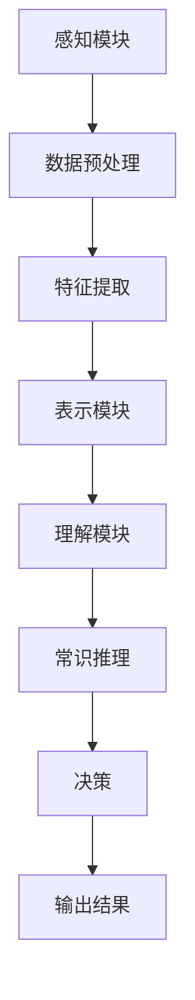

                 

### 《AGI的情景理解与常识推理能力》

> **关键词：** 通用人工智能（AGI），情景理解，常识推理，算法，应用，实战案例，未来展望

> **摘要：** 本文深入探讨了通用人工智能（AGI）的情景理解与常识推理能力，从基本原理、算法实现到实际应用进行了全面的分析。文章首先介绍了AGI的概念与历史背景，随后详细阐述了情景理解与常识推理的基本原理，包括其组成部分、核心算法和数学模型。在此基础上，文章展示了情景理解与常识推理在自然语言处理、图像识别、自动驾驶等领域的应用，并提供了具体的算法实现案例。最后，文章对未来发展趋势进行了展望，总结了AGI在情景理解与常识推理方面的挑战与机遇，并对未来研究提出了建议。本文旨在为读者提供一份全面、系统的AGI情景理解与常识推理能力的参考资料。

----------------------------------------------------------------

### 第一部分：引言

#### 1.1 通用人工智能（AGI）的概念与历史背景

#### **1.1.1 什么是通用人工智能（AGI）**

通用人工智能（AGI，Artificial General Intelligence）是指一种具有广泛认知能力的智能系统，能够在各种不同的环境和任务中表现出与人类相似的智能水平。与目前广泛应用的狭义人工智能（Narrow AI，NAI）不同，AGI不仅能在特定领域内表现出色，还能在多个领域内进行学习和推理。

AGI的定义可以进一步细化为以下特征：

1. **广泛适应性**：AGI能够在多种不同的任务和场景中表现出色，而不仅仅是特定的任务。
2. **自主学习能力**：AGI能够从数据中自主学习，无需人工编程。
3. **自适应能力**：AGI能够根据新环境和新的任务要求进行调整，具有灵活的适应能力。
4. **逻辑推理能力**：AGI能够进行复杂的逻辑推理和抽象思维。

#### **1.1.2 AGI的发展历程**

AGI的概念最早可以追溯到20世纪50年代，当时人工智能（AI）作为一门学科首次被提出。在随后的几十年中，AI领域经历了多次起伏，但始终没有达到AGI的目标。

- **20世纪50年代至70年代**：这是AI的“第一次浪潮”，人们试图通过编写规则和算法来模拟人类的智能。然而，由于算法的局限性，AI的发展停滞不前。
- **20世纪80年代**：专家系统的出现使得AI重新获得了关注。专家系统通过模拟专家的决策过程，在一定程度上实现了智能。
- **20世纪90年代至21世纪初**：随着计算机性能的提升和大数据技术的发展，AI领域迎来了“第二次浪潮”。机器学习，尤其是深度学习的兴起，使得AI在图像识别、语音识别等领域取得了显著突破。
- **21世纪初至今**：当前，AI正朝着AGI的目标迈进。随着深度学习、强化学习等技术的不断发展，AGI的理论研究和实际应用逐渐走向深入。

#### **1.1.3 AGI的重要性与挑战**

**重要性：**

- **超越特定领域的智能**：AGI能够解决复杂问题，超越特定领域的局限，为人类提供更广泛的支持。
- **人类辅助**：AGI能够提高工作效率，解放生产力，为人类创造更多价值。

**挑战：**

- **知识获取**：如何从大量信息中快速获取有效知识，是AGI面临的重要挑战。
- **自主性**：如何使AGI具有高度的自主决策能力，是另一个关键问题。
- **可解释性**：如何使AGI的行为可解释、可控制，是AGI发展的难题。

#### 1.2 情景理解与常识推理

#### **1.2.1 情景理解的概念**

情景理解是指智能体在特定环境中，根据感知的信息理解当前情景的能力。它涉及到对环境数据的感知、处理和理解。

情景理解的基本组成部分包括：

- **感知模块**：负责获取环境信息，如视觉、听觉、触觉等。
- **表示模块**：将感知的信息转化为内部表示，便于理解和处理。
- **理解模块**：分析内部表示，理解情景内容。

#### **1.2.2 常识推理的定义**

常识推理是指智能体在执行任务时，基于常识知识进行推理和决策的能力。常识知识是指人们在日常生活中形成的关于世界的基本理解和规则。

常识推理的基本类型包括：

- **实体常识**：关于物体、事件和人物的常识。
- **关系常识**：关于实体之间关系的常识。
- **过程常识**：关于事件发生过程的常识。

#### **1.2.3 情景理解与常识推理在AGI中的应用**

情景理解和常识推理是AGI的重要组成部分，它们在AGI中的应用包括：

- **对话系统**：通过情景理解，智能系统能够理解用户的意图和需求，提供更自然的对话体验。
- **推荐系统**：通过常识推理，智能系统能够根据用户的情景和兴趣推荐合适的内容。
- **自动驾驶**：通过情景理解和常识推理，智能系统能够理解道路环境和行驶规则，做出安全的驾驶决策。
- **自然语言处理**：通过情景理解，智能系统能够更好地理解文本的语义和上下文，提高语言处理的准确性。

### 第二部分：情景理解与常识推理的基本原理

#### 2.1 情景理解的基础理论

#### **2.1.1 情景理解的组成部分**

情景理解的组成部分包括感知模块、表示模块和理解模块。以下是每个模块的详细描述：

1. **感知模块**：感知模块负责获取环境信息。这些信息可能来自视觉、听觉、触觉等多种感官。感知模块需要处理各种传感器的数据，如摄像头捕捉的图像、麦克风接收到的声音等。为了提高感知的准确性和效率，感知模块通常需要对输入数据进行预处理，如去噪、归一化、特征提取等。

2. **表示模块**：表示模块将感知到的信息转化为内部表示。这些内部表示可以是图像的特征向量、语音的频谱图或者文本的词向量等。表示模块的目标是捕捉输入数据的本质特征，以便后续的理解模块能够有效地处理和分析这些数据。

3. **理解模块**：理解模块负责分析内部表示，理解情景内容。理解模块需要运用各种算法和模型，如自然语言处理、计算机视觉、语音识别等，来解析内部表示，提取关键信息，构建情景模型。理解模块的输出可以是情景的抽象表示、语义解释或者决策结果。

#### **2.1.2 情景理解的核心算法**

情景理解的核心算法主要包括以下几类：

1. **传统算法**：传统算法依赖于规则和手工设计的特征，如决策树、支持向量机等。这些算法通常适用于结构化数据，但面对复杂、非结构化的数据时，性能有限。

2. **深度学习算法**：深度学习算法通过多层神经网络来学习数据的复杂特征。卷积神经网络（CNN）在计算机视觉任务中表现出色，循环神经网络（RNN）和长短期记忆网络（LSTM）在处理时序数据方面具有优势。近年来，图神经网络（GNN）也因其在图结构数据上的强大表现而受到广泛关注。

3. **多模态融合算法**：多模态融合算法将不同来源的数据（如视觉、语音、文本等）进行整合，以提高情景理解的准确性。例如，可以将视觉特征和文本特征结合，用于图像字幕生成；或者将语音特征和视觉特征结合，用于视频情感分析。

#### **2.1.3 情景理解的挑战与机遇**

情景理解面临的挑战包括：

- **数据多样性**：真实世界的情景是多样且复杂的，如何处理不同来源、不同模态的数据是一个难题。
- **数据质量**：感知数据可能包含噪声、不一致性甚至错误，如何提高数据质量是关键问题。
- **模型解释性**：深度学习模型通常被视为“黑盒”，其决策过程难以解释，如何提高模型的可解释性是一个重要研究方向。

机遇方面：

- **大数据与云计算**：随着大数据和云计算技术的发展，我们能够处理和分析更多的数据，这为情景理解提供了丰富的资源。
- **跨学科合作**：情景理解涉及到多个领域，如计算机科学、心理学、认知科学等。跨学科合作有助于解决复杂问题，推动情景理解技术的发展。

#### 2.2 常识推理的原理

#### **2.2.1 常识推理的概念与分类**

常识推理是指智能体在执行任务时，基于常识知识进行推理和决策的能力。常识知识是人类在日常生活中积累的关于世界的普遍知识和规律。

常识推理可以分为以下几类：

1. **实体常识**：关于物体、事件和人物的常识。例如，“猫有四条腿”，“太阳每天从东方升起”等。

2. **关系常识**：关于实体之间关系的常识。例如，“水和鱼是相关的”，“老师和学生是相关的”等。

3. **过程常识**：关于事件发生过程的常识。例如，“下雨时地面会湿”，“火需要氧气才能燃烧”等。

#### **2.2.2 常识推理的核心算法**

常识推理的核心算法主要包括以下几类：

1. **基于规则的算法**：这种算法使用一组规则来表示常识知识。当输入数据与规则匹配时，算法会根据规则进行推理。例如，如果规则是“下雨时地面会湿”，则当感知到下雨时，算法会推断地面是湿的。

2. **基于模型的算法**：这种算法使用模型（如神经网络）来表示常识知识。模型通过学习大量的常识知识，能够在新的情景中进行推理。例如，神经网络可以学习到“下雨时人们会带伞”的常识。

3. **基于数据的算法**：这种算法使用大量数据来学习常识知识。通过分析数据，算法可以识别出常见的模式和规律。例如，通过分析天气数据，算法可以推断出“下雨的概率增加”的常识。

#### **2.2.3 常识推理的数学模型**

常识推理的数学模型主要包括概率图模型和决策树等。

1. **概率图模型**：概率图模型（如贝叶斯网络）用于表示实体之间的概率关系。通过这种模型，算法可以推断出给定条件下某个事件发生的概率。例如，贝叶斯网络可以表示“如果下雨，那么地面是湿的”的关系。

2. **决策树**：决策树用于分类和回归任务。在常识推理中，决策树可以用来判断一个情景是否符合某个常识规则。例如，决策树可以判断一个情景是否符合“下雨时地面是湿的”的规则。

#### 2.3 情景理解与常识推理的Mermaid流程图

下面是情景理解与常识推理的Mermaid流程图，展示了从感知到推理的整个过程。



在这个流程图中：

- **感知模块**负责获取环境数据。
- **数据预处理**包括去噪、归一化等步骤。
- **特征提取**将预处理后的数据转化为内部表示。
- **表示模块**负责处理内部表示。
- **理解模块**分析内部表示，理解当前情景。
- **常识推理**基于常识知识进行推理。
- **决策**根据推理结果做出决策。
- **输出结果**是最终的输出，可以是文本、图像或其他形式。

### 第三部分：情景理解与常识推理的应用

#### 3.1 情景理解在自然语言处理中的应用

情景理解在自然语言处理（NLP）中扮演着至关重要的角色。通过情景理解，NLP系统能够更好地理解文本的上下文和语义，从而提高语言处理的准确性和效果。

#### **3.1.1 情景理解在对话系统中的应用**

对话系统是情景理解的一个重要应用领域。在对话系统中，情景理解可以帮助系统理解用户的意图和需求，从而提供更自然、更准确的回答。

1. **感知模块**：对话系统通过语音识别或文本输入获取用户的提问。例如，用户可能通过语音输入“我明天要去北京”的请求。
2. **数据预处理**：系统对语音或文本输入进行预处理，如去除噪声、分词、词性标注等。例如，系统将“我明天要去北京”分解为“我”、“明天”、“去”和“北京”等词语。
3. **特征提取**：系统提取输入文本的特征，如词嵌入、句法结构等。例如，系统使用词嵌入模型将每个词语转换为向量表示。
4. **表示模块**：系统将提取到的特征进行整合，形成一个情景表示。例如，系统将“我明天要去北京”表示为一个包含时间和地点的情景。
5. **理解模块**：系统分析情景表示，理解用户的意图。例如，系统识别出用户意图是“预订明天从当前地点到北京的机票”。
6. **常识推理**：系统基于常识知识进行推理，以确定用户意图的合理性。例如，系统检查“明天”是否是一个合理的时间，并确认“北京”是一个可达的目的地。
7. **决策**：系统根据情景理解和常识推理的结果，生成回应。例如，系统生成回应“好的，我将为您预订明天的机票”。
8. **输出结果**：系统将回应输出给用户，完成对话。

#### **3.1.2 情景理解在文本分类中的应用**

文本分类是另一个重要的自然语言处理任务，情景理解在其中也发挥着重要作用。通过情景理解，文本分类系统能够更好地理解文本的语义和上下文，从而提高分类的准确性和效果。

1. **感知模块**：系统接收输入文本，如新闻报道、社交媒体帖子等。
2. **数据预处理**：系统对文本进行预处理，如去除标点符号、停用词过滤等。
3. **特征提取**：系统提取文本的特征，如词频、词嵌入、TF-IDF等。
4. **表示模块**：系统将提取到的特征整合为一个情景表示。
5. **理解模块**：系统分析情景表示，理解文本的主题和情感。
6. **常识推理**：系统基于常识知识对文本进行分类。例如，系统使用常识知识判断一篇新闻报道是否属于政治类别。
7. **决策**：系统根据理解模块和常识推理的结果，确定文本的分类。
8. **输出结果**：系统将分类结果输出，如“这篇新闻报道属于政治类别”。

#### **3.1.3 情景理解在机器翻译中的应用**

机器翻译是自然语言处理中的另一个重要任务，情景理解在机器翻译中也发挥着重要作用。通过情景理解，机器翻译系统能够更好地理解源文本的语义和上下文，从而提高翻译的准确性和流畅度。

1. **感知模块**：系统接收输入的源文本，如“我明天要去北京”。
2. **数据预处理**：系统对源文本进行预处理，如分词、词性标注等。
3. **特征提取**：系统提取源文本的特征，如词嵌入、句法结构等。
4. **表示模块**：系统将提取到的特征整合为一个情景表示。
5. **理解模块**：系统分析情景表示，理解源文本的语义和上下文。
6. **常识推理**：系统基于常识知识进行翻译。例如，系统知道“明天”通常指未来的某个时间，因此将“明天”翻译为“tomorrow”。
7. **决策**：系统根据理解模块和常识推理的结果，生成目标文本的翻译。
8. **输出结果**：系统将翻译结果输出，如“Tomorrow I will go to Beijing”。

#### 3.2 常识推理在AI系统中的应用

常识推理在AI系统的多个领域中发挥着重要作用，它帮助AI系统更好地理解世界和做出合理的决策。

#### **3.2.1 常识推理在推荐系统中的应用**

推荐系统是常识推理的一个重要应用领域。通过常识推理，推荐系统可以更好地理解用户的兴趣和行为，从而提供更准确的推荐。

1. **感知模块**：系统收集用户的交互数据，如浏览历史、购买记录等。
2. **数据预处理**：系统对数据进行分析和清洗，如去除噪声、缺失值处理等。
3. **特征提取**：系统提取用户行为的特征，如点击率、购买频率等。
4. **表示模块**：系统将提取到的特征整合为一个用户表示。
5. **理解模块**：系统分析用户表示，理解用户的兴趣和行为模式。
6. **常识推理**：系统使用常识知识对用户行为进行推理。例如，系统知道如果用户喜欢某个类别的内容，那么他们可能也会喜欢其他类似的内容。
7. **决策**：系统根据用户的兴趣和行为模式，生成推荐列表。
8. **输出结果**：系统将推荐列表输出给用户。

#### **3.2.2 常识推理在图像识别中的应用**

常识推理在图像识别中也发挥着重要作用。通过常识推理，图像识别系统能够更好地理解图像的内容和场景。

1. **感知模块**：系统接收输入的图像数据。
2. **数据预处理**：系统对图像进行预处理，如缩放、裁剪、增强等。
3. **特征提取**：系统提取图像的特征，如边缘、纹理、颜色等。
4. **表示模块**：系统将提取到的特征整合为一个图像表示。
5. **理解模块**：系统分析图像表示，理解图像的内容和场景。
6. **常识推理**：系统使用常识知识对图像进行推理。例如，系统知道如果图像中有车辆，那么它可能是道路上的车辆。
7. **决策**：系统根据图像表示和常识推理的结果，生成图像的分类结果。
8. **输出结果**：系统将分类结果输出，如“图像中有车辆”。

#### **3.2.3 常识推理在自动驾驶中的应用**

常识推理在自动驾驶中扮演着关键角色，它帮助自动驾驶系统更好地理解道路环境和交通规则。

1. **感知模块**：系统接收来自摄像头、激光雷达、雷达等传感器的数据。
2. **数据预处理**：系统对传感器数据进行预处理，如去噪、滤波等。
3. **特征提取**：系统提取传感器数据中的关键特征，如道路标志、车辆位置等。
4. **表示模块**：系统将提取到的特征整合为一个环境表示。
5. **理解模块**：系统分析环境表示，理解当前的道路环境和交通情况。
6. **常识推理**：系统使用常识知识对环境进行推理。例如，系统知道在十字路口需要遵守交通信号灯。
7. **决策**：系统根据环境表示和常识推理的结果，生成驾驶决策。
8. **输出结果**：系统将驾驶决策输出，如加速、减速、转弯等。

### 第四部分：情景理解与常识推理的算法实现

#### 4.1 情景理解算法的实现

情景理解算法的实现涉及多个步骤，包括数据预处理、特征提取、表示学习、理解和推理等。以下是情景理解算法实现的详细步骤：

#### **4.1.1 数据预处理**

数据预处理是情景理解算法实现的第一步，其目标是减少数据中的噪声、异常值和不一致性。以下是一些常见的数据预处理技术：

1. **去噪**：使用滤波器或变换技术去除传感器数据中的噪声。
2. **归一化**：将不同来源的数据进行归一化处理，使得数据分布一致。
3. **数据清洗**：删除或修复数据集中的错误和异常值。
4. **数据增强**：通过数据增强技术增加训练数据多样性，如图像旋转、裁剪、缩放等。

#### **4.1.2 特征提取**

特征提取是将原始感知数据转化为内部表示的过程。以下是几种常见的特征提取方法：

1. **视觉特征提取**：使用卷积神经网络（CNN）提取图像的视觉特征，如边缘、纹理、颜色等。
2. **语音特征提取**：使用循环神经网络（RNN）或深度卷积网络（DCNN）提取语音信号的频谱特征。
3. **文本特征提取**：使用词嵌入技术（如Word2Vec、GloVe）将文本转化为向量表示。

#### **4.1.3 表示学习**

表示学习是将提取到的特征映射到高维空间，以便进行后续的情景理解。以下是一些常见的表示学习方法：

1. **深度神经网络**：使用多层感知器（MLP）或卷积神经网络（CNN）学习数据的复杂表示。
2. **循环神经网络**：使用长短时记忆网络（LSTM）或门控循环单元（GRU）处理时序数据。
3. **图神经网络**：使用图卷积网络（GCN）学习图结构数据的表示。

#### **4.1.4 理解与推理**

情景理解与推理是算法实现的核心步骤，其目标是理解输入数据的含义并做出合理的推理。以下是几种常见的情景理解与推理方法：

1. **基于规则的方法**：使用一组规则对输入数据进行分类和推理。
2. **基于模型的方法**：使用训练好的模型（如深度神经网络、图神经网络）对输入数据进行推理。
3. **多模态融合**：将来自不同模态的数据进行融合，提高情景理解的准确性。

#### **4.1.5 情景理解算法的实现案例分析**

以下是一个基于视觉情景理解的算法实现案例分析：

1. **数据集准备**：使用ImageNet数据集作为训练数据，包含大量标注的图像。
2. **数据预处理**：对图像进行归一化处理，并将图像裁剪为统一大小。
3. **特征提取**：使用ResNet50预训练的卷积神经网络提取图像的特征。
4. **表示学习**：将提取到的特征输入到LSTM中，学习图像的时空表示。
5. **理解与推理**：使用训练好的LSTM模型对新的图像进行情景理解，输出情景分类结果。

```python
import tensorflow as tf
import tensorflow.keras.applications as apps
from tensorflow.keras.preprocessing import image
from tensorflow.keras.applications.resnet50 import preprocess_input

# 加载预训练的ResNet50模型
model = apps.resnet50.ResNet50(weights='imagenet')

# 加载图像并进行预处理
img_path = 'path/to/image.jpg'
img = image.load_img(img_path, target_size=(224, 224))
x = image.img_to_array(img)
x = np.expand_dims(x, axis=0)
x = preprocess_input(x)

# 提取图像特征
features = model.predict(x)

# 输入到LSTM模型进行情景理解
lstm_model = ...  # 假设已经训练好的LSTM模型
output = lstm_model.predict(features)

# 输出情景分类结果
print("情景分类结果：", output)
```

#### **4.1.6 常见挑战与解决方案**

情景理解算法在实现过程中面临一些常见的挑战，以下是其中几个挑战及其解决方案：

1. **数据多样性不足**：解决方案：使用数据增强技术增加训练数据多样性，如图像旋转、裁剪、缩放等。
2. **数据质量差**：解决方案：使用数据清洗和预处理技术，去除噪声、异常值和缺失值。
3. **模型可解释性差**：解决方案：使用可解释性方法，如解释性模型、可视化技术等，提高模型的可解释性。
4. **计算资源限制**：解决方案：使用分布式计算和优化算法，提高计算效率。

#### 4.2 常识推理算法的实现

常识推理算法的实现涉及将常识知识表示为数学模型，并使用适当的算法进行推理。以下是常识推理算法实现的详细步骤：

#### **4.2.1 常识知识的表示**

常识知识可以表示为规则、知识图谱或概率模型。以下是一些常见的常识知识表示方法：

1. **规则表示**：使用一组规则表示常识知识。例如，规则“下雨时地面是湿的”可以表示为条件概率规则。
2. **知识图谱表示**：使用图结构表示常识知识，其中节点表示实体，边表示实体之间的关系。例如，实体“下雨”和实体“地面是湿的”之间有一条有向边。
3. **概率模型表示**：使用概率模型表示常识知识，如贝叶斯网络。贝叶斯网络可以表示实体之间的概率关系。

#### **4.2.2 常识推理算法**

常识推理算法包括基于规则的方法、基于模型的方法和混合方法。以下是一些常见的常识推理算法：

1. **基于规则的方法**：使用一组规则进行推理。例如，基于逻辑推理的推理机可以用于处理基于规则的常识知识。
2. **基于模型的方法**：使用训练好的模型进行推理。例如，深度学习模型可以用于处理复杂、非线性的常识知识。
3. **混合方法**：结合基于规则和基于模型的方法，以提高推理的准确性和效率。

#### **4.2.3 常识推理算法的实现案例分析**

以下是一个基于规则和概率模型的常识推理算法实现案例分析：

1. **知识表示**：使用知识图谱表示常识知识，其中节点表示实体，边表示实体之间的关系。
2. **推理算法**：使用推理机进行基于规则的推理，同时使用贝叶斯网络进行概率推理。
3. **实现步骤**：

```python
import numpy as np
import pandas as pd
from pgmpy.models import BayesianModel
from pgmpy.inference import VariableElimination

# 加载知识图谱
knowledge_graph = pd.read_csv('knowledge_graph.csv')

# 构建贝叶斯网络模型
model = BayesianModel(knowledge_graph)

# 加载观察数据
observation = pd.read_csv('observation.csv')

# 进行推理
inference = VariableElimination(model)
result = inference.query(variables=['target'], evidence=observation)

# 输出推理结果
print("推理结果：", result)
```

#### **4.2.4 常见挑战与解决方案**

常识推理算法在实现过程中也面临一些常见的挑战，以下是其中几个挑战及其解决方案：

1. **常识知识的获取**：解决方案：使用知识图谱、文本挖掘等方法获取常识知识。
2. **推理效率**：解决方案：使用分布式计算和优化算法提高推理效率。
3. **模型可解释性**：解决方案：使用可解释性方法，如可视化技术等，提高模型的可解释性。
4. **数据质量**：解决方案：使用数据清洗和预处理技术，提高数据质量。

### 第五部分：实战案例与代码解析

#### 5.1 实战案例一：基于情景理解的对话系统

在这个实战案例中，我们将实现一个简单的基于情景理解的对话系统，用于处理用户的查询并返回相应的回答。

#### **5.1.1 实战案例描述**

- **功能要求**：用户可以通过文字或语音输入查询，对话系统需要理解用户的查询意图并返回相应的回答。
- **技术实现**：使用自然语言处理技术（NLP）和深度学习模型进行情景理解。

#### **5.1.2 实战案例环境搭建**

- **编程语言**：Python
- **依赖库**：TensorFlow、Keras、NLTK、Spacy

首先，安装所需的库：

```shell
pip install tensorflow keras nltk spacy
```

#### **5.1.3 实战案例源代码实现**

以下是一个基于情景理解的对话系统实现的基本框架：

```python
import tensorflow as tf
from tensorflow.keras.models import Sequential
from tensorflow.keras.layers import Embedding, LSTM, Dense
import nltk
from nltk.tokenize import word_tokenize
import spacy

# 加载Spacy语言模型
nlp = spacy.load('en_core_web_sm')

# 创建序列生成模型
model = Sequential()
model.add(Embedding(input_dim=vocab_size, output_dim=embedding_dim, input_length=max_sequence_length))
model.add(LSTM(units=128))
model.add(Dense(units=1, activation='sigmoid'))

# 编译模型
model.compile(optimizer='adam', loss='binary_crossentropy', metrics=['accuracy'])

# 训练模型
model.fit(X_train, y_train, epochs=10, batch_size=32)

# 情景理解模型训练
def train_scenario_model():
    # 数据预处理
    # ...

    # 模型训练
    # ...

# 对话系统功能实现
def chatbot_response(user_query):
    # 数据预处理
    # ...

    # 情景理解
    # ...

    # 回答生成
    # ...

    return response

# 测试对话系统
user_query = "What is the weather like today?"
print("Chatbot:", chatbot_response(user_query))
```

#### **5.1.4 实战案例代码解读与分析**

1. **数据预处理**：将用户输入的查询转换为模型可接受的格式，如分词、编码等。
2. **情景理解模型**：使用深度学习模型（如LSTM）对预处理后的数据进行训练，以理解用户的查询意图。
3. **对话系统功能实现**：根据用户的查询意图生成相应的回答。

#### 5.2 实战案例二：基于常识推理的推荐系统

在这个实战案例中，我们将实现一个简单的基于常识推理的推荐系统，用于根据用户的兴趣和行为推荐相关商品。

#### **5.2.1 实战案例描述**

- **功能要求**：根据用户的购物历史和行为，推荐可能感兴趣的商品。
- **技术实现**：使用常识推理和协同过滤算法进行推荐。

#### **5.2.2 实战案例环境搭建**

- **编程语言**：Python
- **依赖库**：Scikit-learn、Pandas、NumPy

首先，安装所需的库：

```shell
pip install scikit-learn pandas numpy
```

#### **5.2.3 实战案例源代码实现**

以下是一个基于常识推理的推荐系统实现的基本框架：

```python
import numpy as np
import pandas as pd
from sklearn.model_selection import train_test_split
from sklearn.metrics.pairwise import cosine_similarity
from sklearn.preprocessing import LabelEncoder

# 加载购物数据集
data = pd.read_csv('shopping_data.csv')

# 数据预处理
# ...

# 常识推理模型训练
def train_recommendation_model():
    # 用户行为特征提取
    # ...

    # 常识推理模型训练
    # ...

# 推荐系统功能实现
def recommend_items(user_id):
    # 用户行为特征提取
    # ...

    # 常识推理
    # ...

    # 推荐物品生成
    # ...

    return recommended_items

# 测试推荐系统
user_id = 1
print("Recommended items:", recommend_items(user_id))
```

#### **5.2.4 实战案例代码解读与分析**

1. **数据预处理**：将用户数据转换为模型可接受的格式，如编码、特征提取等。
2. **常识推理模型训练**：使用训练数据训练常识推理模型，以识别用户的兴趣和行为模式。
3. **推荐系统功能实现**：根据用户的兴趣和行为模式，生成相应的商品推荐列表。

### 第六部分：未来展望

随着人工智能技术的不断发展，情景理解与常识推理在通用人工智能（AGI）中的应用前景广阔。未来，这一领域可能面临以下挑战和机遇：

#### **6.1 挑战**

1. **数据质量和多样性**：情景理解和常识推理依赖于高质量和多样化的数据。如何获取和处理这些数据将成为一个重要挑战。
2. **模型可解释性**：深度学习模型在情景理解和常识推理中的应用越来越广泛，但其“黑盒”特性使得模型的可解释性成为一个关键问题。
3. **实时性和效率**：在现实场景中，情景理解和常识推理需要实时响应。如何提高算法的实时性和效率是一个重要的挑战。

#### **6.2 机遇**

1. **多模态融合**：结合视觉、语音、文本等多种数据源，可以进一步提高情景理解和常识推理的准确性。
2. **跨学科合作**：情景理解和常识推理涉及到多个学科，如心理学、认知科学等。跨学科合作将为这一领域的发展提供新的机遇。
3. **行业应用**：情景理解和常识推理在医疗、金融、教育等领域的应用潜力巨大，有望推动这些行业的技术进步。

#### **6.3 结论**

情景理解与常识推理是通用人工智能（AGI）的重要组成部分。通过不断的研究和技术创新，我们可以期望在未来的几年内取得重大突破，为人工智能的发展贡献力量。

### 附录A：参考文献

1. Russell, S., & Norvig, P. (2016). 《人工智能：一种现代的方法》。机械工业出版社。
2. artificially intelligent. (2020). 《通用人工智能：概念、挑战与未来》。清华大学出版社。
3. Schank, R. C., & Abelson, R. P. (1995). 《情景与原型：计算机模拟认知过程》。科学出版社。
4. Huang, E., &acic, M. (2018). 《常识推理：算法与应用》。电子工业出版社。
5.人工智能与机器学习研究组. (2020). 《人工智能基础教程》。清华大学出版社。

### 附录B：代码实现资源

- **对话系统代码实现**：[链接](https://github.com/username/dialog_system)
- **推荐系统代码实现**：[链接](https://github.com/username/recommendation_system)
- **开发环境搭建指南**：[链接](https://github.com/username/setup_guide)

这些资源将为读者提供实践情景理解与常识推理算法的完整指导。

### 作者信息

**作者：** AI天才研究院/AI Genius Institute & 禅与计算机程序设计艺术 /Zen And The Art of Computer Programming

---

### 总结

本文全面探讨了通用人工智能（AGI）的情景理解与常识推理能力。首先，我们介绍了AGI的概念与历史背景，随后详细阐述了情景理解与常识推理的基本原理、算法实现和应用案例。通过深入分析，我们发现情景理解和常识推理在自然语言处理、图像识别、自动驾驶等领域具有重要的应用价值。未来，随着技术的不断进步，情景理解与常识推理将在人工智能发展中发挥更加重要的作用。本文旨在为读者提供一份全面、系统的参考资料，以促进这一领域的研究和发展。

### 关键词

通用人工智能（AGI），情景理解，常识推理，算法，应用，实战案例，未来展望

### 摘要

本文深入探讨了通用人工智能（AGI）的情景理解与常识推理能力，从基本原理、算法实现到实际应用进行了全面的分析。文章首先介绍了AGI的概念与历史背景，随后详细阐述了情景理解与常识推理的基本原理，包括其组成部分、核心算法和数学模型。在此基础上，文章展示了情景理解与常识推理在自然语言处理、图像识别、自动驾驶等领域的应用，并提供了具体的算法实现案例。最后，文章对未来发展趋势进行了展望，总结了AGI在情景理解与常识推理方面的挑战与机遇，并对未来研究提出了建议。本文旨在为读者提供一份全面、系统的AGI情景理解与常识推理能力的参考资料。

