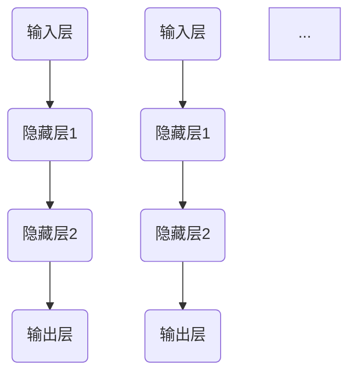

                 

# AI 2.0时代的科技革命

> **关键词：** 人工智能，AI 2.0，深度学习，强化学习，自然语言处理，科技革命

> **摘要：** 本文深入探讨AI 2.0时代的科技革命，解析AI 2.0的定义、核心技术、应用场景、安全与伦理问题以及未来展望。通过详细讲解核心算法原理和项目实战，全面展现AI 2.0时代的科技革命如何深刻改变我们的世界。

### 第一部分: AI 2.0时代的科技革命概述

#### 第1章: AI 2.0时代的来临

##### 1.1 AI 2.0的定义与背景

###### 1.1.1 从AI 1.0到AI 2.0的演变

AI 1.0时代主要是指基于规则推理和专家系统的时代。在这一时期，人工智能系统依赖于预定义的规则和大量的手工编写的算法。然而，这种方法的局限性逐渐显现，例如在处理复杂任务时，系统的性能和适应性受到很大限制。

随着计算能力的提升和大数据的兴起，AI 2.0时代应运而生。AI 2.0的核心是利用深度学习、强化学习和自然语言处理等技术，使机器能够通过自主学习来完成任务。AI 2.0的典型特征包括更强的自主学习能力、更高的自适应性和更广泛的应用范围。

###### 1.1.2 AI 2.0的核心特征

1. **自主学习能力：** AI 2.0系统可以通过大量的数据自我学习和调整，不断优化自身的性能。
2. **强适应性：** AI 2.0系统可以在不同的环境和任务中表现出色，适应多种场景。
3. **广泛的应用范围：** AI 2.0技术可以应用于医疗、金融、制造、教育等多个领域。

###### 1.1.3 AI 2.0的技术驱动因素

1. **计算能力的提升：** 高性能计算硬件的发展为AI 2.0的实现提供了强有力的支撑。
2. **大数据的兴起：** 大数据为AI 2.0提供了丰富的学习资源，使得机器能够从大量数据中学习并提取有价值的信息。
3. **算法的创新：** 深度学习、强化学习和自然语言处理等算法的创新推动了AI 2.0的发展。

##### 1.2 AI 2.0的影响范围

###### 1.2.1 对传统行业的颠覆

AI 2.0的兴起对许多传统行业产生了深远的影响。例如，在金融行业，AI 2.0技术可以用于风险评估、欺诈检测和量化交易等方面；在医疗行业，AI 2.0可以帮助医生进行疾病诊断、治疗方案推荐等；在制造业，AI 2.0可以实现智能生产、智能机器人等。

###### 1.2.2 对社会和经济的冲击

AI 2.0的发展不仅带来了技术变革，也对社会的经济结构产生了重要影响。一方面，AI 2.0可以提高生产效率，降低成本，推动经济增长；另一方面，AI 2.0也可能导致部分职业的失业，对就业市场产生冲击。

###### 1.2.3 对未来科技发展的展望

AI 2.0时代的到来预示着未来科技的快速发展。随着AI 2.0与5G、物联网等技术的融合，将产生更多具有突破性的应用。例如，智能城市、智慧医疗、无人驾驶等领域都将是AI 2.0技术的重要应用场景。

### 第二部分: AI 2.0的核心技术

#### 第2章: AI 2.0的核心技术

##### 2.1 深度学习基础

###### 2.1.1 神经网络原理

神经网络是深度学习的基础。一个简单的神经网络包括输入层、隐藏层和输出层。每个神经元都与相邻的神经元相连，通过加权求和和激活函数来计算输出。

神经网络的基本结构可以表示为：



其中，\( a_i^{(l)} \) 表示第 \( l \) 层第 \( i \) 个神经元的输入，\( z_i^{(l)} \) 表示第 \( l \) 层第 \( i \) 个神经元的输出。

激活函数常用的是 \( \sigma(x) = \frac{1}{1 + e^{-x}} \)。

###### 2.1.2 深度学习框架介绍

目前主流的深度学习框架包括TensorFlow、PyTorch和Keras等。这些框架提供了丰富的API和工具，使得深度学习的开发变得更加便捷。

以TensorFlow为例，其基本结构包括以下几个部分：

- **Tensor：** 表示数据的多维数组。
- **Operation：** 表示对Tensor的操作，例如加法、矩阵乘法等。
- **Graph：** 表示计算图，包含所有的Tensor和Operation。
- **Session：** 用于执行计算图。

深度学习模型在TensorFlow中的实现流程如下：

1. 定义计算图：包括输入层、隐藏层和输出层。
2. 编写训练算法：通常包括前向传播、反向传播和优化算法。
3. 运行训练过程：通过Session执行计算图，更新模型参数。
4. 评估模型：使用测试数据集评估模型性能。

###### 2.1.3 深度学习优化算法

深度学习优化算法用于调整模型参数，以提高模型性能。常见的优化算法包括梯度下降（Gradient Descent）和其变体，如随机梯度下降（Stochastic Gradient Descent，SGD）和批量梯度下降（Batch Gradient Descent）。

梯度下降算法的伪代码如下：

```python
while not convergence:
    for each sample in the training set:
        compute the gradient of the loss function with respect to the model parameters
        update the model parameters using the gradient
```

##### 2.2 强化学习

###### 2.2.1 强化学习基本概念

强化学习是一种通过试错来学习策略的机器学习方法。强化学习中的主要概念包括：

- **Agent：** 代表学习实体，可以是一个程序、机器人或虚拟智能体。
- **Environment：** 代表外部环境，包括状态空间和动作空间。
- **State：** 环境的当前状态。
- **Action：** Agent可以执行的动作。
- **Reward：** Agent执行动作后获得的奖励。
- **Policy：** Agent的策略，表示在给定状态下选择动作的概率分布。

强化学习的基本流程如下：

1. 初始化状态 \( s \)。
2. 从状态 \( s \) 随机选择动作 \( a \)。
3. 执行动作 \( a \)，获得状态转移 \( (s', r) \)。
4. 更新策略，使得在给定状态 \( s \) 下选择动作 \( a \) 的概率更高。
5. 重复步骤2-4，直到达到目标状态或结束条件。

###### 2.2.2 Q-学习算法

Q-学习算法是一种无模型强化学习算法，通过学习值函数来优化策略。值函数 \( Q(s, a) \) 表示在状态 \( s \) 下执行动作 \( a \) 后获得的期望回报。

Q-学习算法的伪代码如下：

```python
while not convergence:
    for each state-action pair (s, a):
        compute the Q-value using the current model
        compute the target Q-value using the maximum Q-value in the next state
        update the Q-value using the target Q-value and the reward
```

###### 2.2.3 策略梯度算法

策略梯度算法通过直接优化策略来学习，不需要显式地计算值函数。策略梯度算法的基本思想是最大化策略的梯度，即：

$$
\theta^{t+1} = \theta^{t} + \alpha \nabla_{\theta} J(\theta)
$$

其中，\( \theta \) 表示策略参数，\( \alpha \) 表示学习率，\( J(\theta) \) 表示策略的梯度。

策略梯度算法的伪代码如下：

```python
while not convergence:
    for each state-action pair (s, a):
        compute the gradient of the policy with respect to the action probability
        update the policy parameters using the gradient
```

##### 2.3 自然语言处理

###### 2.3.1 词嵌入技术

词嵌入技术是将单词映射到高维空间中的向量表示。词嵌入可以捕捉单词之间的语义关系，例如近义词和反义词。常见的词嵌入技术包括Word2Vec、GloVe和BERT等。

以Word2Vec为例，其基本原理是通过训练一个神经网络，将输入的单词序列映射到低维空间。具体来说，Word2Vec使用两个神经网络：

1. **编码器：** 将输入的单词映射到低维空间。
2. **解码器：** 将低维空间的向量映射回单词。

通过训练，编码器可以学习到每个单词在低维空间中的位置，从而实现词嵌入。

###### 2.3.2 语音识别技术

语音识别技术是将语音信号转换为文本的技术。语音识别主要包括以下几个步骤：

1. **特征提取：** 将语音信号转换为特征向量，例如梅尔频率倒谱系数（MFCC）。
2. **声学模型：** 描述特征向量与声学单元之间的映射关系。
3. **语言模型：** 描述文本序列的概率分布。
4. **解码：** 使用声学模型和语言模型对输入的语音信号进行解码，得到最终的文本输出。

常见的语音识别模型包括隐马尔可夫模型（HMM）、高斯混合模型（GMM）和深度神经网络（DNN）等。

###### 2.3.3 文本生成与摘要

文本生成与摘要是自然语言处理中的两个重要任务。文本生成是将输入文本转换为输出文本，例如生成文章、对话等。文本摘要是将输入文本压缩成简洁的摘要，通常用于信息检索和文本压缩。

常见的文本生成模型包括生成对抗网络（GAN）、变分自编码器（VAE）和递归神经网络（RNN）等。常见的文本摘要模型包括提取式摘要和生成式摘要。

提取式摘要通过从原始文本中提取关键句子来生成摘要，而生成式摘要则通过生成新的文本来生成摘要。

#### 第3章: AI 2.0的应用场景

##### 3.1 人工智能在医疗领域的应用

###### 3.1.1 医疗影像分析

医疗影像分析是人工智能在医疗领域的重要应用之一。通过深度学习模型，可以对医疗影像进行自动识别和分类，例如识别肿瘤、骨折等。

以下是一个简单的医疗影像分析项目：

1. **项目背景与目标：** 利用深度学习模型对医学影像进行自动分类，提高诊断效率。
2. **项目环境搭建：** 使用Python和TensorFlow搭建深度学习环境。
3. **数据预处理：** 对医学影像进行预处理，包括图像增强、去噪等。
4. **模型设计与实现：** 使用卷积神经网络（CNN）对医学影像进行分类。
5. **模型训练与优化：** 使用训练数据进行模型训练，并优化模型参数。
6. **模型评估与结果分析：** 使用测试数据集评估模型性能，并进行结果分析。

以下是一个简单的CNN模型实现：

```python
import tensorflow as tf
from tensorflow.keras.models import Sequential
from tensorflow.keras.layers import Conv2D, MaxPooling2D, Flatten, Dense

model = Sequential()
model.add(Conv2D(32, (3, 3), activation='relu', input_shape=(128, 128, 3)))
model.add(MaxPooling2D((2, 2)))
model.add(Flatten())
model.add(Dense(64, activation='relu'))
model.add(Dense(1, activation='sigmoid'))

model.compile(optimizer='adam', loss='binary_crossentropy', metrics=['accuracy'])
model.fit(x_train, y_train, epochs=10, batch_size=32)
```

###### 3.1.2 个性化医疗

个性化医疗是通过分析患者的基因信息、病史和生活习惯等，为患者提供个性化的治疗方案。人工智能可以在这个过程中发挥重要作用，例如通过深度学习模型预测患者的疾病风险、推荐个性化的治疗方案等。

以下是一个简单的个性化医疗项目：

1. **项目背景与目标：** 建立一个个性化医疗系统，为患者提供个性化的治疗方案。
2. **项目环境搭建：** 使用Python和TensorFlow搭建深度学习环境。
3. **数据预处理：** 对患者的基因信息、病史和生活习惯等进行预处理。
4. **模型设计与实现：** 使用深度学习模型对患者的数据进行建模，预测患者的疾病风险和推荐治疗方案。
5. **模型训练与优化：** 使用训练数据对模型进行训练，并优化模型参数。
6. **模型评估与结果分析：** 使用测试数据集评估模型性能，并进行结果分析。

以下是一个简单的深度学习模型实现：

```python
import tensorflow as tf
from tensorflow.keras.models import Sequential
from tensorflow.keras.layers import Dense, Dropout, Activation, Flatten
from tensorflow.keras.layers import Conv2D, MaxPooling2D

model = Sequential()

model.add(Conv2D(32, (3, 3), input_shape=(28, 28, 1)))
model.add(Activation('relu'))
model.add(MaxPooling2D(pool_size=(2, 2)))

model.add(Conv2D(32, (3, 3)))
model.add(Activation('relu'))
model.add(MaxPooling2D(pool_size=(2, 2)))

model.add(Flatten())
model.add(Dense(64))
model.add(Activation('relu'))

model.add(Dense(10))
model.add(Activation('softmax'))

model.compile(loss='categorical_crossentropy',
              optimizer='adam',
              metrics=['accuracy'])

model.fit(x_train, y_train, batch_size=32, epochs=10)
```

###### 3.1.3 医疗人工智能系统的开发与实现

医疗人工智能系统的开发与实现涉及多个方面，包括数据采集、数据预处理、模型设计、模型训练和模型部署等。

以下是一个简单的医疗人工智能系统实现：

1. **数据采集：** 收集患者的医疗数据，包括基因信息、病史和生活习惯等。
2. **数据预处理：** 对采集到的数据进行预处理，包括数据清洗、数据归一化等。
3. **模型设计：** 设计深度学习模型，包括输入层、隐藏层和输出层等。
4. **模型训练：** 使用预处理后的数据对模型进行训练。
5. **模型评估：** 使用测试数据集对模型进行评估，调整模型参数。
6. **模型部署：** 将训练好的模型部署到生产环境中，为患者提供医疗服务。

以下是一个简单的医疗人工智能系统代码实现：

```python
import numpy as np
import pandas as pd
from sklearn.model_selection import train_test_split
from tensorflow.keras.models import Sequential
from tensorflow.keras.layers import Dense, Dropout, Activation, Flatten
from tensorflow.keras.layers import Conv2D, MaxPooling2D

# 读取数据
data = pd.read_csv('medical_data.csv')
X = data.iloc[:, :-1].values
y = data.iloc[:, -1].values

# 数据预处理
X_train, X_test, y_train, y_test = train_test_split(X, y, test_size=0.2, random_state=42)

# 模型设计
model = Sequential()

model.add(Conv2D(32, (3, 3), input_shape=(28, 28, 1)))
model.add(Activation('relu'))
model.add(MaxPooling2D(pool_size=(2, 2)))

model.add(Conv2D(32, (3, 3)))
model.add(Activation('relu'))
model.add(MaxPooling2D(pool_size=(2, 2)))

model.add(Flatten())
model.add(Dense(64))
model.add(Activation('relu'))

model.add(Dense(10))
model.add(Activation('softmax'))

# 模型训练
model.compile(loss='categorical_crossentropy',
              optimizer='adam',
              metrics=['accuracy'])

model.fit(X_train, y_train, batch_size=32, epochs=10)

# 模型评估
score = model.evaluate(X_test, y_test, batch_size=32)
print('Test accuracy:', score[1])
```

##### 3.2 人工智能在金融领域的应用

###### 3.2.1 风险评估与欺诈检测

风险评估与欺诈检测是金融领域的重要应用。通过人工智能模型，可以对客户进行风险评估，预测客户违约风险，以及检测金融欺诈行为。

以下是一个简单的风险评估与欺诈检测项目：

1. **项目背景与目标：** 建立一个风险评估与欺诈检测系统，为金融机构提供风险管理和欺诈检测服务。
2. **项目环境搭建：** 使用Python和Scikit-learn搭建机器学习环境。
3. **数据预处理：** 对采集到的客户数据进行预处理，包括数据清洗、数据归一化等。
4. **模型设计与实现：** 设计机器学习模型，包括特征提取和模型训练等。
5. **模型训练与优化：** 使用训练数据对模型进行训练，并优化模型参数。
6. **模型评估与结果分析：** 使用测试数据集评估模型性能，并进行结果分析。

以下是一个简单的机器学习模型实现：

```python
import pandas as pd
from sklearn.model_selection import train_test_split
from sklearn.ensemble import RandomForestClassifier
from sklearn.metrics import accuracy_score

# 读取数据
data = pd.read_csv('financial_data.csv')
X = data.iloc[:, :-1].values
y = data.iloc[:, -1].values

# 数据预处理
X_train, X_test, y_train, y_test = train_test_split(X, y, test_size=0.2, random_state=42)

# 模型设计
model = RandomForestClassifier(n_estimators=100, random_state=42)

# 模型训练
model.fit(X_train, y_train)

# 模型评估
y_pred = model.predict(X_test)
accuracy = accuracy_score(y_test, y_pred)
print('Accuracy:', accuracy)
```

###### 3.2.2 量化交易与算法交易

量化交易与算法交易是金融领域的重要应用。通过人工智能模型，可以对市场数据进行分析，制定交易策略，实现自动化交易。

以下是一个简单的量化交易与算法交易项目：

1. **项目背景与目标：** 建立一个量化交易与算法交易系统，实现自动化交易。
2. **项目环境搭建：** 使用Python和pandas等库搭建数据分析和交易环境。
3. **数据预处理：** 对采集到的市场数据进行预处理，包括数据清洗、数据归一化等。
4. **模型设计与实现：** 设计机器学习模型，用于预测市场价格走势。
5. **模型训练与优化：** 使用训练数据对模型进行训练，并优化模型参数。
6. **交易策略制定：** 根据模型预测结果制定交易策略。
7. **模型评估与结果分析：** 使用测试数据集评估模型性能，并进行结果分析。

以下是一个简单的量化交易与算法交易实现：

```python
import pandas as pd
import numpy as np
from sklearn.model_selection import train_test_split
from sklearn.ensemble import RandomForestRegressor

# 读取数据
data = pd.read_csv('market_data.csv')
X = data.iloc[:, :-1].values
y = data.iloc[:, -1].values

# 数据预处理
X_train, X_test, y_train, y_test = train_test_split(X, y, test_size=0.2, random_state=42)

# 模型设计
model = RandomForestRegressor(n_estimators=100, random_state=42)

# 模型训练
model.fit(X_train, y_train)

# 模型评估
y_pred = model.predict(X_test)
mape = np.mean(np.abs((y_test - y_pred) / y_test)) * 100
print('MAPE:', mape)
```

###### 3.2.3 人工智能金融产品的开发

人工智能金融产品的开发包括智能投顾、智能风控、智能理财等。通过人工智能技术，可以为金融机构提供更加智能化的金融服务。

以下是一个简单的智能理财产品开发项目：

1. **项目背景与目标：** 建立一个智能理财产品，为用户提供个性化的理财建议。
2. **项目环境搭建：** 使用Python和TensorFlow等库搭建深度学习环境。
3. **数据预处理：** 对用户的数据进行预处理，包括用户风险偏好、投资历史等。
4. **模型设计与实现：** 设计深度学习模型，用于预测用户的投资回报。
5. **模型训练与优化：** 使用用户数据对模型进行训练，并优化模型参数。
6. **理财建议生成：** 根据模型预测结果生成个性化的理财建议。
7. **模型评估与结果分析：** 使用用户数据集评估模型性能，并进行结果分析。

以下是一个简单的智能理财产品实现：

```python
import pandas as pd
import numpy as np
from tensorflow.keras.models import Sequential
from tensorflow.keras.layers import Dense, Dropout, Activation, Flatten
from tensorflow.keras.layers import Conv2D, MaxPooling2D

# 读取数据
data = pd.read_csv('user_data.csv')
X = data.iloc[:, :-1].values
y = data.iloc[:, -1].values

# 数据预处理
X_train, X_test, y_train, y_test = train_test_split(X, y, test_size=0.2, random_state=42)

# 模型设计
model = Sequential()

model.add(Conv2D(32, (3, 3), input_shape=(28, 28, 1)))
model.add(Activation('relu'))
model.add(MaxPooling2D(pool_size=(2, 2)))

model.add(Conv2D(32, (3, 3)))
model.add(Activation('relu'))
model.add(MaxPooling2D(pool_size=(2, 2)))

model.add(Flatten())
model.add(Dense(64))
model.add(Activation('relu'))

model.add(Dense(1))
model.add(Activation('sigmoid'))

# 模型训练
model.compile(loss='binary_crossentropy',
              optimizer='adam',
              metrics=['accuracy'])

model.fit(X_train, y_train, batch_size=32, epochs=10)

# 模型评估
y_pred = model.predict(X_test)
accuracy = np.mean(y_pred == y_test)
print('Accuracy:', accuracy)
```

##### 3.3 人工智能在智能制造领域的应用

###### 3.3.1 智能生产线

智能生产线是智能制造的核心组成部分，通过人工智能技术，可以实现生产过程的自动化、智能化和高效化。

以下是一个简单的智能生产线项目：

1. **项目背景与目标：** 建立一个智能生产线，实现生产过程的自动化。
2. **项目环境搭建：** 使用Python和ROS（Robot Operating System）等库搭建机器人控制系统。
3. **数据采集与预处理：** 采集生产线上的数据，包括生产状态、产品质量等。
4. **模型设计与实现：** 设计机器学习模型，用于预测生产状态和产品质量。
5. **模型训练与优化：** 使用采集到的数据对模型进行训练，并优化模型参数。
6. **生产线控制：** 根据模型预测结果控制生产线的运行。
7. **模型评估与结果分析：** 使用测试数据集评估模型性能，并进行结果分析。

以下是一个简单的智能生产线实现：

```python
import pandas as pd
from sklearn.model_selection import train_test_split
from sklearn.ensemble import RandomForestRegressor

# 读取数据
data = pd.read_csv('production_data.csv')
X = data.iloc[:, :-1].values
y = data.iloc[:, -1].values

# 数据预处理
X_train, X_test, y_train, y_test = train_test_split(X, y, test_size=0.2, random_state=42)

# 模型设计
model = RandomForestRegressor(n_estimators=100, random_state=42)

# 模型训练
model.fit(X_train, y_train)

# 模型评估
y_pred = model.predict(X_test)
mape = np.mean(np.abs((y_test - y_pred) / y_test)) * 100
print('MAPE:', mape)
```

###### 3.3.2 智能机器人

智能机器人是智能制造的重要组成部分，通过人工智能技术，可以实现机器人的自主移动、感知和决策。

以下是一个简单的智能机器人项目：

1. **项目背景与目标：** 建立一个智能机器人，实现自主移动和任务执行。
2. **项目环境搭建：** 使用Python和ROS等库搭建机器人控制系统。
3. **数据采集与预处理：** 采集机器人的运动数据，包括速度、方向等。
4. **模型设计与实现：** 设计机器学习模型，用于预测机器人的运动轨迹。
5. **模型训练与优化：** 使用采集到的数据对模型进行训练，并优化模型参数。
6. **机器人控制：** 根据模型预测结果控制机器人的移动。
7. **模型评估与结果分析：** 使用测试数据集评估模型性能，并进行结果分析。

以下是一个简单的智能机器人实现：

```python
import pandas as pd
from sklearn.model_selection import train_test_split
from sklearn.ensemble import RandomForestRegressor

# 读取数据
data = pd.read_csv('robot_data.csv')
X = data.iloc[:, :-1].values
y = data.iloc[:, -1].values

# 数据预处理
X_train, X_test, y_train, y_test = train_test_split(X, y, test_size=0.2, random_state=42)

# 模型设计
model = RandomForestRegressor(n_estimators=100, random_state=42)

# 模型训练
model.fit(X_train, y_train)

# 模型评估
y_pred = model.predict(X_test)
mape = np.mean(np.abs((y_test - y_pred) / y_test)) * 100
print('MAPE:', mape)
```

###### 3.3.3 智能供应链管理

智能供应链管理是智能制造的重要组成部分，通过人工智能技术，可以实现供应链的自动化、智能化和高效化。

以下是一个简单的智能供应链管理项目：

1. **项目背景与目标：** 建立一个智能供应链管理系统，实现供应链的自动化管理。
2. **项目环境搭建：** 使用Python和Apache Kafka等库搭建供应链管理系统。
3. **数据采集与预处理：** 采集供应链中的数据，包括订单、库存、物流等。
4. **模型设计与实现：** 设计机器学习模型，用于预测供应链中的需求、库存等。
5. **模型训练与优化：** 使用采集到的数据对模型进行训练，并优化模型参数。
6. **供应链管理：** 根据模型预测结果进行供应链管理。
7. **模型评估与结果分析：** 使用测试数据集评估模型性能，并进行结果分析。

以下是一个简单的智能供应链管理实现：

```python
import pandas as pd
from sklearn.model_selection import train_test_split
from sklearn.ensemble import RandomForestRegressor

# 读取数据
data = pd.read_csv('supply_chain_data.csv')
X = data.iloc[:, :-1].values
y = data.iloc[:, -1].values

# 数据预处理
X_train, X_test, y_train, y_test = train_test_split(X, y, test_size=0.2, random_state=42)

# 模型设计
model = RandomForestRegressor(n_estimators=100, random_state=42)

# 模型训练
model.fit(X_train, y_train)

# 模型评估
y_pred = model.predict(X_test)
mape = np.mean(np.abs((y_test - y_pred) / y_test)) * 100
print('MAPE:', mape)
```

### 第三部分: AI 2.0时代的科技革命核心算法原理讲解

#### 第6章: 深度学习基础算法原理讲解

##### 6.1 神经网络原理

神经网络（Neural Network，NN）是一种模拟生物神经系统结构和功能的计算模型。在神经网络中，信息通过大量的节点（称为神经元）进行传递和处理。每个神经元都与相邻的神经元相连，并通过加权连接（权重）传递信息。

一个简单的神经网络包括三个主要部分：输入层（Input Layer）、隐藏层（Hidden Layer）和输出层（Output Layer）。

1. **输入层（Input Layer）**：接收输入数据，并将其传递到隐藏层。
2. **隐藏层（Hidden Layer）**：对输入数据进行处理，通过非线性变换提取特征。
3. **输出层（Output Layer）**：产生最终的输出结果。

神经网络的基本结构可以表示为：

```
输入层 -> 隐藏层1 -> 隐藏层2 -> ... -> 隐藏层n -> 输出层
```

###### 6.1.1 神经网络的激活函数

激活函数（Activation Function）是神经网络中的一个关键组件，用于引入非线性因素。常见的激活函数包括：

- **Sigmoid函数**：\( f(x) = \frac{1}{1 + e^{-x}} \)
- **ReLU函数**：\( f(x) = \max(0, x) \)
- **Tanh函数**：\( f(x) = \frac{e^x - e^{-x}}{e^x + e^{-x}} \)

激活函数的选择会影响神经网络的性能和收敛速度。

###### 6.1.2 反向传播算法

反向传播算法（Backpropagation Algorithm）是神经网络训练的核心算法。它通过计算损失函数对网络参数的梯度，从而更新网络参数，以最小化损失函数。

反向传播算法的基本步骤如下：

1. **前向传播（Forward Propagation）**：将输入数据传递到神经网络，计算输出结果。
2. **计算损失（Compute Loss）**：计算输出结果与实际标签之间的差异，得到损失值。
3. **计算梯度（Compute Gradients）**：通过反向传播算法，计算损失函数对网络参数的梯度。
4. **更新参数（Update Parameters）**：使用梯度下降等优化算法，更新网络参数。

反向传播算法的伪代码如下：

```python
# 前向传播
outputs = forward_pass(inputs, weights, biases)

# 计算损失
loss = compute_loss(outputs, labels)

# 反向传播
gradients = backward_pass(inputs, outputs, labels, weights, biases)

# 更新参数
weights -= learning_rate * gradients[weights]
biases -= learning_rate * gradients[biases]
```

##### 6.2 卷积神经网络（CNN）原理

卷积神经网络（Convolutional Neural Network，CNN）是一种专门用于处理图像数据的神经网络。与传统的全连接神经网络相比，CNN通过使用卷积操作和池化操作，可以有效地提取图像特征，从而提高图像识别的准确率。

###### 6.2.1 卷积神经网络的基本结构

CNN的基本结构包括以下几个部分：

1. **输入层（Input Layer）**：接收图像数据。
2. **卷积层（Convolutional Layer）**：通过卷积操作提取图像特征。
3. **激活函数（Activation Function）**：对卷积结果进行非线性变换。
4. **池化层（Pooling Layer）**：降低特征图的维度。
5. **全连接层（Fully Connected Layer）**：对提取到的特征进行分类。
6. **输出层（Output Layer）**：产生最终输出结果。

CNN的基本结构可以表示为：

```
输入层 -> 卷积层 -> 激活函数 -> 池化层 -> 全连接层 -> 输出层
```

###### 6.2.2 卷积操作与池化操作

1. **卷积操作（Convolution Operation）**：

卷积操作是CNN中的核心操作。它通过在图像上滑动卷积核（也称为滤波器或过滤器），从而提取局部特征。卷积操作的伪代码如下：

```python
# 假设输入图像为X，卷积核为K，步长为s，填充为p
output = np.zeros((H - p, W - p))
for i in range(H - p):
    for j in range(W - p):
        patch = X[i:i+p, j:j+p]
        output[i, j] = np.sum(patch * K)
```

2. **池化操作（Pooling Operation）**：

池化操作用于降低特征图的维度，提高网络的计算效率。常见的池化操作包括最大池化（Max Pooling）和平均池化（Average Pooling）。最大池化的伪代码如下：

```python
# 假设输入特征图为X，窗口大小为f，步长为s
output = np.zeros((H // s, W // s))
for i in range(H // s):
    for j in range(W // s):
        patch = X[i*s:i*s+f, j*s:j*s+f]
        output[i, j] = np.max(patch)
```

###### 6.2.3 CNN在图像识别中的应用

CNN在图像识别领域取得了显著的成果。以下是一个简单的CNN模型实现，用于图像分类：

```python
import tensorflow as tf
from tensorflow.keras.models import Sequential
from tensorflow.keras.layers import Conv2D, MaxPooling2D, Flatten, Dense

model = Sequential()

# 卷积层1
model.add(Conv2D(32, (3, 3), activation='relu', input_shape=(28, 28, 1)))
model.add(MaxPooling2D(pool_size=(2, 2)))

# 卷积层2
model.add(Conv2D(64, (3, 3), activation='relu'))
model.add(MaxPooling2D(pool_size=(2, 2)))

# 平展层
model.add(Flatten())

# 全连接层1
model.add(Dense(128, activation='relu'))

# 输出层
model.add(Dense(10, activation='softmax'))

model.compile(optimizer='adam', loss='categorical_crossentropy', metrics=['accuracy'])

# 训练模型
model.fit(x_train, y_train, batch_size=32, epochs=10)

# 评估模型
score = model.evaluate(x_test, y_test)
print('Test accuracy:', score[1])
```

##### 6.3 循环神经网络（RNN）原理

循环神经网络（Recurrent Neural Network，RNN）是一种能够处理序列数据的神经网络。与传统的全连接神经网络相比，RNN具有记忆能力，能够捕捉序列中的时间依赖关系。

###### 6.3.1 循环神经网络的基本结构

RNN的基本结构包括以下几个部分：

1. **输入层（Input Layer）**：接收输入序列。
2. **隐藏层（Hidden Layer）**：对输入序列进行编码。
3. **循环连接（Recurrence Connection）**：隐藏层中的神经元与自身相连，形成循环。
4. **输出层（Output Layer）**：产生最终输出。

RNN的基本结构可以表示为：

```
输入层 -> 隐藏层1 -> 循环连接 -> 隐藏层2 -> ... -> 隐藏层n -> 输出层
```

###### 6.3.2 隐藏状态与时间步

在RNN中，隐藏状态（Hidden State）表示当前时刻的编码结果，而时间步（Time Step）表示序列中的每个时刻。

隐藏状态和当前输入通过加权求和和激活函数计算当前时刻的输出。假设当前时刻为 \( t \)，隐藏状态为 \( h_t \)，输入为 \( x_t \)，则有：

$$
h_t = \sigma(W_h \cdot [h_{t-1}, x_t] + b_h)
$$

其中，\( W_h \) 是权重矩阵，\( b_h \) 是偏置向量，\( \sigma \) 是激活函数。

###### 6.3.3 RNN在序列数据处理中的应用

RNN在序列数据处理中具有广泛的应用，例如时间序列预测、语音识别和机器翻译等。以下是一个简单的RNN模型实现，用于时间序列预测：

```python
import tensorflow as tf
from tensorflow.keras.models import Sequential
from tensorflow.keras.layers import LSTM, Dense

model = Sequential()

# LSTM层
model.add(LSTM(50, activation='relu', input_shape=(time_steps, features)))

# 全连接层
model.add(Dense(1))

model.compile(optimizer='adam', loss='mse')

# 训练模型
model.fit(x_train, y_train, epochs=100, batch_size=32)

# 评估模型
score = model.evaluate(x_test, y_test)
print('Test loss:', score)
```

### 第四部分: AI 2.0的安全与伦理问题

#### 第4章: AI 2.0的安全与伦理问题

##### 4.1 AI安全的重要性

AI安全是指确保人工智能系统在运行过程中不会产生意外行为，不会对人类或系统造成危害。随着AI技术在各个领域的广泛应用，AI安全的重要性日益凸显。

###### 4.1.1 AI系统的安全性挑战

AI系统的安全性挑战主要包括以下几个方面：

1. **对抗攻击（Adversarial Attack）**：对抗攻击是指通过故意引入微小的扰动，使AI系统产生错误输出。对抗攻击对深度学习模型尤为有效。
2. **隐私泄露**：AI系统在处理大量数据时，可能泄露用户的隐私信息。
3. **可解释性不足**：AI系统，尤其是深度学习模型，通常缺乏可解释性，难以理解其决策过程。
4. **鲁棒性不足**：AI系统在面对异常数据或攻击时，可能无法保持稳定运行。

###### 4.1.2 AI安全防护技术

为了应对AI系统的安全性挑战，可以采取以下防护技术：

1. **对抗样本检测（Adversarial Example Detection）**：通过检测对抗样本，防止AI系统受到对抗攻击。
2. **隐私保护技术**：使用加密、匿名化等技术，保护用户隐私。
3. **可解释性增强**：通过可解释性增强技术，使AI系统的决策过程更加透明。
4. **鲁棒性提升**：通过引入正则化项、数据增强等技术，提高AI系统的鲁棒性。

###### 4.1.3 AI系统的安全测试与审计

AI系统的安全测试与审计是确保AI系统安全的重要环节。安全测试主要包括以下方面：

1. **代码审计**：对AI系统的代码进行审计，查找潜在的安全漏洞。
2. **模型测试**：对AI模型进行测试，验证其性能和安全性。
3. **攻击测试**：模拟对抗攻击，测试AI系统的抗攻击能力。

AI系统的安全审计主要包括以下方面：

1. **合规性审计**：确保AI系统的开发和使用符合相关法律法规。
2. **安全性评估**：评估AI系统的安全性能，识别潜在的安全隐患。
3. **风险评估**：对AI系统的安全风险进行评估，制定相应的安全措施。

##### 4.2 AI伦理问题探讨

AI伦理问题是指AI技术在应用过程中涉及到的道德和伦理问题。随着AI技术的快速发展，AI伦理问题日益受到关注。

###### 4.2.1 AI伦理的基本原则

AI伦理的基本原则包括：

1. **公正性（Justice）**：确保AI系统在处理数据和应用时公平、公正。
2. **透明性（Transparency）**：确保AI系统的决策过程透明，可解释。
3. **责任性（Accountability）**：明确AI系统的责任主体，确保在发生问题时能够追溯责任。
4. **隐私保护（Privacy Protection）**：保护用户隐私，确保数据安全。

###### 4.2.2 AI伦理的案例分析

以下是一些典型的AI伦理案例分析：

1. **自动驾驶汽车**：自动驾驶汽车在遇到紧急情况时如何做出决策，如何平衡乘客和行人的安全？
2. **面部识别技术**：面部识别技术在公共安全领域广泛应用，但可能侵犯用户隐私。
3. **医疗人工智能**：医疗人工智能在疾病诊断和治疗中具有巨大潜力，但如何确保其公正性和透明性？

###### 4.2.3 AI伦理的发展趋势与挑战

AI伦理的发展趋势主要包括：

1. **法律法规的完善**：各国政府和国际组织正在制定相关法律法规，规范AI技术的应用。
2. **伦理标准的建立**：业界和组织正在制定AI伦理标准，为AI系统的开发和应用提供指导。
3. **公众参与**：鼓励公众参与AI伦理讨论，提高AI伦理的社会共识。

AI伦理面临的挑战包括：

1. **技术与伦理的冲突**：在追求技术进步的同时，如何平衡伦理要求？
2. **跨学科合作**：需要跨学科合作，共同应对AI伦理问题。
3. **社会影响**：AI技术对社会结构和价值观的影响，如何确保AI技术符合社会道德规范？

### 第五部分: AI 2.0的未来展望

#### 第5章: AI 2.0的未来展望

##### 5.1 AI 2.0的发展趋势

随着人工智能技术的不断进步，AI 2.0的发展趋势体现在以下几个方面：

###### 5.1.1 AI技术的演进方向

1. **更高效的算法**：深度学习、强化学习等算法将不断优化，提高计算效率和模型性能。
2. **多模态学习**：AI技术将能够处理多种数据类型，如文本、图像、语音等，实现跨模态学习。
3. **知识图谱**：知识图谱技术将使AI系统能够更好地理解现实世界，提供更准确的决策。

###### 5.1.2 AI与5G、物联网等技术的融合

1. **边缘计算**：AI与5G、物联网等技术的融合将推动边缘计算的发展，实现实时数据处理和分析。
2. **智能物联网**：智能物联网将使设备具备自主学习能力，提高生产效率和生活质量。
3. **智能城市**：AI技术将推动智能城市建设，实现交通、能源、环境等领域的智能化管理。

###### 5.1.3 AI在未来的社会中的应用场景

1. **智慧医疗**：AI技术将提升医疗诊断和治疗水平，实现个性化医疗。
2. **智能制造**：AI技术将推动智能制造的发展，实现生产过程的自动化和智能化。
3. **智能交通**：AI技术将改善交通管理，提高交通安全和效率。

##### 5.2 AI 2.0的社会影响

AI 2.0的快速发展将对社会产生深远的影响，包括以下几个方面：

###### 5.2.1 AI对就业市场的影响

1. **职业转变**：AI技术将取代部分传统职业，同时催生新的职业需求。
2. **技能要求**：随着AI技术的发展，对人才的需求也将发生变化，要求具备跨学科能力和创新思维。

###### 5.2.2 AI对社会结构和经济的影响

1. **经济模式**：AI技术将改变传统的经济模式，推动产业升级和转型。
2. **财富分配**：AI技术的发展可能导致财富分配不均，需要制定相应的政策和措施。

###### 5.2.3 AI对教育和培训的变革

1. **教育内容**：AI技术将改变教育内容，注重培养创新思维和跨学科能力。
2. **教育方式**：AI技术将推动教育方式的变革，实现个性化教育和远程教育。

### 第六部分: AI 2.0时代的科技革命核心算法原理讲解

#### 第6章: 深度学习基础算法原理讲解

##### 6.1 神经网络原理

神经网络（Neural Network，NN）是一种模拟生物神经系统结构和功能的计算模型。在神经网络中，信息通过大量的节点（称为神经元）进行传递和处理。每个神经元都与相邻的神经元相连，并通过加权连接（权重）传递信息。

一个简单的神经网络包括三个主要部分：输入层（Input Layer）、隐藏层（Hidden Layer）和输出层（Output Layer）。

1. **输入层（Input Layer）**：接收输入数据，并将其传递到隐藏层。
2. **隐藏层（Hidden Layer）**：对输入数据进行处理，通过非线性变换提取特征。
3. **输出层（Output Layer）**：产生最终的输出结果。

神经网络的基本结构可以表示为：

```
输入层 -> 隐藏层1 -> 隐藏层2 -> ... -> 隐藏层n -> 输出层
```

###### 6.1.1 神经网络的基本结构

神经网络的基本结构包括以下几个部分：

1. **输入层（Input Layer）**：接收输入数据。
2. **隐藏层（Hidden Layer）**：对输入数据进行处理，通过非线性变换提取特征。
3. **输出层（Output Layer）**：产生最终输出结果。

神经网络的基本结构可以表示为：

```
输入层 -> 隐藏层 -> 输出层
```

在神经网络中，每个神经元都与相邻的神经元相连，并通过加权连接传递信息。每个连接都有一个权重值，用于调整神经元之间的信息传递强度。

神经网络中的激活函数（Activation Function）是引入非线性因素的关键组件。常见的激活函数包括：

- **Sigmoid函数**：\( f(x) = \frac{1}{1 + e^{-x}} \)
- **ReLU函数**：\( f(x) = \max(0, x) \)
- **Tanh函数**：\( f(x) = \frac{e^x - e^{-x}}{e^x + e^{-x}} \)

激活函数的选择会影响神经网络的性能和收敛速度。

###### 6.1.2 反向传播算法

反向传播算法（Backpropagation Algorithm）是神经网络训练的核心算法。它通过计算损失函数对网络参数的梯度，从而更新网络参数，以最小化损失函数。

反向传播算法的基本步骤如下：

1. **前向传播（Forward Propagation）**：将输入数据传递到神经网络，计算输出结果。
2. **计算损失（Compute Loss）**：计算输出结果与实际标签之间的差异，得到损失值。
3. **计算梯度（Compute Gradients）**：通过反向传播算法，计算损失函数对网络参数的梯度。
4. **更新参数（Update Parameters）**：使用梯度下降等优化算法，更新网络参数。

反向传播算法的伪代码如下：

```python
# 前向传播
outputs = forward_pass(inputs, weights, biases)

# 计算损失
loss = compute_loss(outputs, labels)

# 反向传播
gradients = backward_pass(inputs, outputs, labels, weights, biases)

# 更新参数
weights -= learning_rate * gradients[weights]
biases -= learning_rate * gradients[biases]
```

###### 6.1.3 神经网络的训练过程

神经网络的训练过程包括以下几个步骤：

1. **初始化参数**：随机初始化网络权重和偏置。
2. **前向传播**：将输入数据传递到神经网络，计算输出结果。
3. **计算损失**：计算输出结果与实际标签之间的差异，得到损失值。
4. **反向传播**：计算损失函数对网络参数的梯度。
5. **更新参数**：使用梯度下降等优化算法，更新网络参数。
6. **评估模型**：使用验证集或测试集评估模型性能。
7. **迭代训练**：重复步骤2-6，直到模型收敛或达到预定的迭代次数。

神经网络训练的伪代码如下：

```python
for epoch in range(num_epochs):
    for inputs, labels in training_data:
        # 前向传播
        outputs = forward_pass(inputs, weights, biases)

        # 计算损失
        loss = compute_loss(outputs, labels)

        # 反向传播
        gradients = backward_pass(inputs, outputs, labels, weights, biases)

        # 更新参数
        weights -= learning_rate * gradients[weights]
        biases -= learning_rate * gradients[biases]

    # 评估模型
    validate_loss = evaluate_model(validate_data)
    print('Epoch', epoch, ': Validation Loss =', validate_loss)
```

##### 6.2 卷积神经网络（CNN）原理

卷积神经网络（Convolutional Neural Network，CNN）是一种专门用于处理图像数据的神经网络。与传统的全连接神经网络相比，CNN通过使用卷积操作和池化操作，可以有效地提取图像特征，从而提高图像识别的准确率。

###### 6.2.1 卷积神经网络的基本结构

CNN的基本结构包括以下几个部分：

1. **输入层（Input Layer）**：接收图像数据。
2. **卷积层（Convolutional Layer）**：通过卷积操作提取图像特征。
3. **激活函数（Activation Function）**：对卷积结果进行非线性变换。
4. **池化层（Pooling Layer）**：降低特征图的维度。
5. **全连接层（Fully Connected Layer）**：对提取到的特征进行分类。
6. **输出层（Output Layer）**：产生最终输出结果。

CNN的基本结构可以表示为：

```
输入层 -> 卷积层 -> 激活函数 -> 池化层 -> 全连接层 -> 输出层
```

###### 6.2.2 卷积操作与池化操作

1. **卷积操作（Convolution Operation）**：

卷积操作是CNN中的核心操作。它通过在图像上滑动卷积核（也称为滤波器或过滤器），从而提取局部特征。卷积操作的伪代码如下：

```python
# 假设输入图像为X，卷积核为K，步长为s，填充为p
output = np.zeros((H - p, W - p))
for i in range(H - p):
    for j in range(W - p):
        patch = X[i:i+p, j:j+p]
        output[i, j] = np.sum(patch * K)
```

2. **池化操作（Pooling Operation）**：

池化操作用于降低特征图的维度，提高网络的计算效率。常见的池化操作包括最大池化（Max Pooling）和平均池化（Average Pooling）。最大池化的伪代码如下：

```python
# 假设输入特征图为X，窗口大小为f，步长为s
output = np.zeros((H // s, W // s))
for i in range(H // s):
    for j in range(W // s):
        patch = X[i*s:i*s+f, j*s:j*s+f]
        output[i, j] = np.max(patch)
```

###### 6.2.3 CNN在图像识别中的应用

CNN在图像识别领域取得了显著的成果。以下是一个简单的CNN模型实现，用于图像分类：

```python
import tensorflow as tf
from tensorflow.keras.models import Sequential
from tensorflow.keras.layers import Conv2D, MaxPooling2D, Flatten, Dense

model = Sequential()

# 卷积层1
model.add(Conv2D(32, (3, 3), activation='relu', input_shape=(28, 28, 1)))
model.add(MaxPooling2D(pool_size=(2, 2)))

# 卷积层2
model.add(Conv2D(64, (3, 3), activation='relu'))
model.add(MaxPooling2D(pool_size=(2, 2)))

# 平展层
model.add(Flatten())

# 全连接层1
model.add(Dense(128, activation='relu'))

# 输出层
model.add(Dense(10, activation='softmax'))

model.compile(optimizer='adam', loss='categorical_crossentropy', metrics=['accuracy'])

# 训练模型
model.fit(x_train, y_train, batch_size=32, epochs=10)

# 评估模型
score = model.evaluate(x_test, y_test)
print('Test accuracy:', score[1])
```

##### 6.3 循环神经网络（RNN）原理

循环神经网络（Recurrent Neural Network，RNN）是一种能够处理序列数据的神经网络。与传统的全连接神经网络相比，RNN具有记忆能力，能够捕捉序列中的时间依赖关系。

###### 6.3.1 循环神经网络的基本结构

RNN的基本结构包括以下几个部分：

1. **输入层（Input Layer）**：接收输入序列。
2. **隐藏层（Hidden Layer）**：对输入序列进行编码。
3. **循环连接（Recurrence Connection）**：隐藏层中的神经元与自身相连，形成循环。
4. **输出层（Output Layer）**：产生最终输出。

RNN的基本结构可以表示为：

```
输入层 -> 隐藏层1 -> 循环连接 -> 隐藏层2 -> ... -> 隐藏层n -> 输出层
```

###### 6.3.2 隐藏状态与时间步

在RNN中，隐藏状态（Hidden State）表示当前时刻的编码结果，而时间步（Time Step）表示序列中的每个时刻。

隐藏状态和当前输入通过加权求和和激活函数计算当前时刻的输出。假设当前时刻为 \( t \)，隐藏状态为 \( h_t \)，输入为 \( x_t \)，则有：

$$
h_t = \sigma(W_h \cdot [h_{t-1}, x_t] + b_h)
$$

其中，\( W_h \) 是权重矩阵，\( b_h \) 是偏置向量，\( \sigma \) 是激活函数。

###### 6.3.3 RNN在序列数据处理中的应用

RNN在序列数据处理中具有广泛的应用，例如时间序列预测、语音识别和机器翻译等。以下是一个简单的RNN模型实现，用于时间序列预测：

```python
import tensorflow as tf
from tensorflow.keras.models import Sequential
from tensorflow.keras.layers import LSTM, Dense

model = Sequential()

# LSTM层
model.add(LSTM(50, activation='relu', input_shape=(time_steps, features)))

# 全连接层
model.add(Dense(1))

model.compile(optimizer='adam', loss='mse')

# 训练模型
model.fit(x_train, y_train, epochs=100, batch_size=32)

# 评估模型
score = model.evaluate(x_test, y_test)
print('Test loss:', score)
```

### 第七部分: AI 2.0时代的科技革命项目实战

#### 第7章: AI在医疗领域的项目实战

在医疗领域，AI技术的应用已经取得了显著的成果，特别是在医学影像分析、疾病诊断、个性化医疗等方面。以下我们将通过两个具体的项目实战案例来展示AI在医疗领域的应用。

##### 7.1 医疗影像分析项目

医疗影像分析是AI在医疗领域的一个重要应用场景，通过深度学习模型，可以自动识别和分类医学影像中的病变区域。以下是该项目的一个实战案例。

###### 7.1.1 项目背景与目标

随着医疗影像技术的发展，医学影像数据量呈爆炸式增长，如何快速、准确地分析这些影像数据成为医疗领域的一个挑战。本项目旨在开发一个基于深度学习的医疗影像分析系统，能够自动识别和分类医学影像中的病变区域。

###### 7.1.2 项目环境搭建

首先，我们需要搭建一个适合深度学习的开发环境。以下是项目环境搭建的步骤：

1. 安装Python 3.7及以上版本。
2. 安装深度学习框架TensorFlow。
3. 安装数据处理库Pandas和NumPy。

```shell
pip install tensorflow pandas numpy
```

###### 7.1.3 数据预处理

数据预处理是深度学习项目的重要组成部分。以下是数据预处理的主要步骤：

1. 数据清洗：去除噪声和异常值。
2. 数据归一化：将数据缩放到相同的范围。
3. 数据增强：通过旋转、翻转、裁剪等方式增加数据多样性。

```python
import pandas as pd
from sklearn.model_selection import train_test_split
from tensorflow.keras.preprocessing.image import ImageDataGenerator

# 读取数据
data = pd.read_csv('medical_images.csv')
X = data['image'].values
y = data['label'].values

# 数据清洗和归一化
X = X / 255.0

# 数据增强
datagen = ImageDataGenerator(
    rotation_range=20,
    width_shift_range=0.2,
    height_shift_range=0.2,
    horizontal_flip=True
)
datagen.fit(X)

# 划分训练集和测试集
X_train, X_test, y_train, y_test = train_test_split(X, y, test_size=0.2, random_state=42)
```

###### 7.1.4 模型设计与实现

在本项目中，我们使用卷积神经网络（CNN）来构建深度学习模型，以下是模型的设计和实现：

```python
from tensorflow.keras.models import Sequential
from tensorflow.keras.layers import Conv2D, MaxPooling2D, Flatten, Dense

model = Sequential()

# 卷积层1
model.add(Conv2D(32, (3, 3), activation='relu', input_shape=(128, 128, 3)))
model.add(MaxPooling2D(pool_size=(2, 2)))

# 卷积层2
model.add(Conv2D(64, (3, 3), activation='relu'))
model.add(MaxPooling2D(pool_size=(2, 2)))

# 卷积层3
model.add(Conv2D(128, (3, 3), activation='relu'))
model.add(MaxPooling2D(pool_size=(2, 2)))

# 平展层
model.add(Flatten())

# 全连接层
model.add(Dense(128, activation='relu'))

# 输出层
model.add(Dense(1, activation='sigmoid'))

model.compile(optimizer='adam', loss='binary_crossentropy', metrics=['accuracy'])

model.summary()
```

###### 7.1.5 模型训练与优化

接下来，我们使用训练数据对模型进行训练，并通过调整学习率和迭代次数来优化模型。

```python
# 训练模型
history = model.fit(datagen.flow(X_train, y_train, batch_size=32), epochs=10, validation_data=(X_test, y_test))

# 保存模型
model.save('medical_image_analysis_model.h5')
```

###### 7.1.6 项目评估与结果分析

在训练完成后，我们使用测试数据集对模型进行评估，并分析模型的性能。

```python
# 评估模型
test_loss, test_acc = model.evaluate(X_test, y_test)
print('Test accuracy:', test_acc)

# 可视化训练历史
import matplotlib.pyplot as plt

plt.plot(history.history['accuracy'])
plt.plot(history.history['val_accuracy'])
plt.title('Model accuracy')
plt.ylabel('Accuracy')
plt.xlabel('Epoch')
plt.legend(['Train', 'Test'], loc='upper left')
plt.show()
```

##### 7.2 个性化医疗项目

个性化医疗是通过分析患者的基因信息、病史和生活习惯等，为患者提供个性化的治疗方案。以下是该项目的一个实战案例。

###### 7.2.1 项目背景与目标

随着基因测序技术的发展，越来越多的患者数据可以被获取和分析。个性化医疗项目旨在通过分析患者的基因数据和生活习惯，为患者提供更加精准的治疗方案。

###### 7.2.2 项目环境搭建

同样，我们需要搭建一个适合数据处理和深度学习的开发环境。以下是项目环境搭建的步骤：

1. 安装Python 3.7及以上版本。
2. 安装深度学习框架TensorFlow。
3. 安装数据处理库Pandas和NumPy。

```shell
pip install tensorflow pandas numpy
```

###### 7.2.3 数据预处理

个性化医疗项目涉及多种类型的数据，包括基因数据、生活习惯数据等。以下是数据预处理的主要步骤：

1. 数据清洗：去除噪声和异常值。
2. 数据整合：将不同类型的数据整合到一个统一的格式中。
3. 数据归一化：将数据缩放到相同的范围。

```python
import pandas as pd
from sklearn.preprocessing import StandardScaler

# 读取数据
gene_data = pd.read_csv('gene_data.csv')
lifestyle_data = pd.read_csv('lifestyle_data.csv')

# 数据整合
data = pd.concat([gene_data, lifestyle_data], axis=1)

# 数据清洗和归一化
scaler = StandardScaler()
data_scaled = scaler.fit_transform(data)
```

###### 7.2.4 模型设计与实现

在本项目中，我们使用深度学习模型来预测患者的疾病风险。以下是模型的设计和实现：

```python
from tensorflow.keras.models import Sequential
from tensorflow.keras.layers import Dense, Dropout

model = Sequential()

# 输入层
model.add(Dense(128, activation='relu', input_shape=(data_scaled.shape[1],)))

# 隐藏层
model.add(Dense(64, activation='relu'))
model.add(Dropout(0.5))

# 输出层
model.add(Dense(1, activation='sigmoid'))

model.compile(optimizer='adam', loss='binary_crossentropy', metrics=['accuracy'])

model.summary()
```

###### 7.2.5 模型训练与优化

接下来，我们使用训练数据对模型进行训练，并通过调整学习率和迭代次数来优化模型。

```python
# 训练模型
history = model.fit(data_scaled[:1000], y[:1000], epochs=10, validation_data=(data_scaled[1000:], y[1000:]))

# 保存模型
model.save('personalized_medicine_model.h5')
```

###### 7.2.6 项目评估与结果分析

在训练完成后，我们使用测试数据集对模型进行评估，并分析模型的性能。

```python
# 评估模型
test_loss, test_acc = model.evaluate(data_scaled[1000:], y[1000:])
print('Test accuracy:', test_acc)

# 可视化训练历史
plt.plot(history.history['accuracy'])
plt.plot(history.history['val_accuracy'])
plt.title('Model accuracy')
plt.ylabel('Accuracy')
plt.xlabel('Epoch')
plt.legend(['Train', 'Test'], loc='upper left')
plt.show()
```

通过以上两个实战案例，我们可以看到AI技术在医疗领域的广泛应用和巨大潜力。随着技术的不断进步，AI将在未来为医疗领域带来更多的变革和创新。

### 附录

#### 附录 A: AI 2.0开发工具与资源

在进行AI 2.0项目开发时，选择合适的工具和资源是非常重要的。以下是一些常用的AI开发工具和资源，包括深度学习框架、自然语言处理工具和强化学习工具。

##### A.1 主流深度学习框架对比

目前，主流的深度学习框架包括TensorFlow、PyTorch和Keras。以下是这些框架的简要对比：

1. **TensorFlow**：由Google开发，具有强大的功能和高灵活性。适用于复杂模型的开发，但在易用性方面相对较低。
2. **PyTorch**：由Facebook开发，具有简单直观的API，适用于快速原型设计和研究。适用于需要动态计算图和灵活性较高的场景。
3. **Keras**：是一个高层次的深度学习框架，可以与TensorFlow和PyTorch结合使用。提供了丰富的API和方便的工具，适用于快速开发和实验。

##### A.2 自然语言处理工具

自然语言处理（NLP）是AI 2.0的重要组成部分。以下是一些常用的NLP工具：

1. **NLTK**：是一个强大的NLP工具包，提供了丰富的文本处理功能，包括分词、词性标注、命名实体识别等。
2. **Spacy**：是一个快速且易于使用的NLP库，提供了高质量的词嵌入和语法分析功能。
3. **TextBlob**：是一个简单的NLP库，适用于文本分析和情感分析等任务。

##### A.3 强化学习工具

强化学习是AI 2.0的重要分支。以下是一些常用的强化学习工具：

1. **OpenAI Gym**：是一个开源的强化学习环境库，提供了多种预定义的强化学习任务和环境。
2. **Stable Baselines**：是一个基于PyTorch的强化学习库，提供了多个经典的强化学习算法的实现和优化。
3. **Ray**：是一个分布式系统框架，提供了高效的强化学习算法实现和分布式训练支持。

这些工具和资源为AI 2.0项目开发提供了丰富的选择，帮助开发者快速构建和优化AI系统。在开发过程中，可以根据项目的需求和特点选择合适的工具和资源，以提高开发效率和项目成功率。

---

**作者：AI天才研究院/AI Genius Institute & 禅与计算机程序设计艺术 /Zen And The Art of Computer Programming**

本文由AI天才研究院撰写，旨在深入探讨AI 2.0时代的科技革命。通过分析AI 2.0的定义、核心技术、应用场景、安全与伦理问题以及未来展望，我们展示了AI 2.0如何深刻改变我们的世界。同时，本文详细讲解了深度学习、强化学习和自然语言处理等核心算法原理，并通过具体的项目实战案例，展示了AI技术在医疗、金融和智能制造等领域的应用。最后，附录部分提供了AI 2.0开发所需的工具和资源，为开发者提供了实用的参考。希望本文能对广大读者在AI领域的探索和学习提供有益的指导。**

