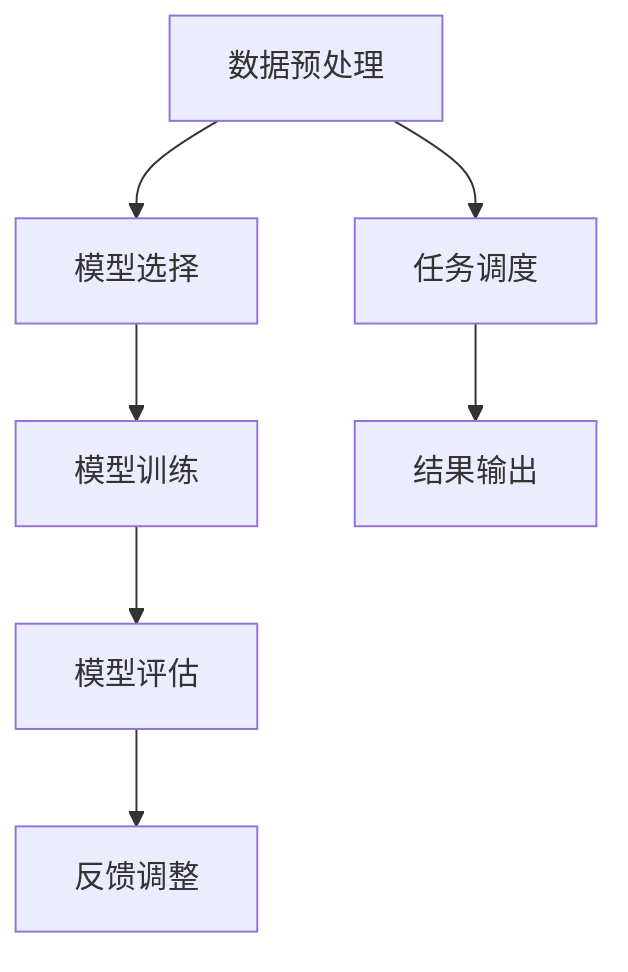
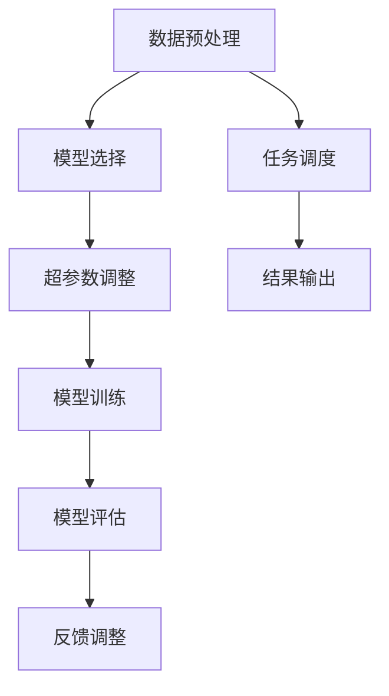

                 

# AI Agent: AI的下一个风口 AutoGen：下一代LLM应用的启动器

## 关键词
- AI Agent
- AutoGen
- 下一代LLM应用
- 自主智能系统
- 模型自动化
- 应用启动器
- AI安全与隐私
- 伦理问题

## 摘要
本文将深入探讨AI Agent的概念、前景及挑战，同时介绍AutoGen这一下一代LLM应用的启动器。通过解析AI Agent的核心特点与应用领域，我们将了解其在制造业、服务业、医疗保健等领域的应用潜力。随后，文章将详细阐述AutoGen的架构、工作原理及其在LLM应用中的优势与挑战。接着，我们将探讨AI Agent与AutoGen的集成应用及其带来的效益。文章还将介绍AI Agent与AutoGen的开发与实践，包括开发环境搭建、源代码解析和集成应用开发实例。最后，文章将分析AI Agent与AutoGen的未来发展趋势及其在社会生活与产业发展中的影响。

## 第一部分: AI Agent: AI的下一个风口 AutoGen：下一代LLM应用的启动器

### 第1章: AI Agent概述与前景

#### 1.1 AI Agent的定义与分类

##### 1.1.1 AI Agent的基本定义
AI Agent是指一种基于人工智能技术的智能实体，它能够在复杂的环境中自主决策并执行任务。AI Agent可以理解为一种智能体，它们可以模拟人类的思维过程，进行感知、理解、推理和行动。

##### 1.1.2 AI Agent的常见分类
根据功能和应用场景，AI Agent可以分为以下几类：

1. **搜索与导航Agent**：主要用于在未知环境中进行自主导航和目标搜索。
2. **决策与规划Agent**：负责在复杂决策场景中制定最优策略。
3. **交互式Agent**：能够与人或其他Agent进行自然语言交互，提供智能服务。
4. **数据采集与分析Agent**：负责收集环境数据并进行实时分析，为决策提供支持。

##### 1.1.3 AI Agent的发展历程
AI Agent的发展经历了多个阶段：

1. **规则基础Agent**：早期AI Agent主要基于预设的规则进行决策。
2. **基于模型的Agent**：随着机器学习技术的发展，AI Agent开始采用模型进行自主决策。
3. **强化学习Agent**：通过不断试错和反馈优化策略，这类Agent具有更强的适应能力。
4. **混合智能Agent**：结合多种技术，如深度学习、自然语言处理等，实现更复杂的决策能力。

#### 1.2 AI Agent的核心特点与优势

##### 1.2.1 自主性
AI Agent具有高度自主性，能够根据环境变化自主做出决策和调整行为。这种自主性使得AI Agent在复杂动态环境中具有更高的适应能力。

##### 1.2.2 反应速度
AI Agent能够实时感知环境变化，快速做出反应。这使得AI Agent在需要即时决策的场景中具有显著优势。

##### 1.2.3 学习能力
AI Agent具备学习能力，可以通过不断积累经验和数据，优化自身决策策略。这种学习能力使得AI Agent能够不断提高性能和适应性。

##### 1.2.4 可扩展性
AI Agent的设计具有高可扩展性，可以通过添加新的功能模块和算法，实现多样化应用。这种可扩展性为AI Agent的广泛应用提供了可能。

#### 1.3 AI Agent的应用领域

##### 1.3.1 制造业
AI Agent在制造业中可用于生产线的自动化控制、设备故障诊断、生产计划优化等方面，提高生产效率和质量。

##### 1.3.2 服务业
AI Agent在服务业中可以应用于客户服务、智能推荐、风险管理等场景，提供高效便捷的服务。

##### 1.3.3 医疗保健
AI Agent在医疗保健领域可用于疾病诊断、治疗建议、患者监护等，辅助医生提高诊疗水平。

##### 1.3.4 其他领域
AI Agent还可以应用于金融、交通、能源等多个领域，提供智能决策支持，优化业务流程。

#### 1.4 AI Agent面临的挑战与解决方案

##### 1.4.1 安全性问题
AI Agent的安全性问题主要包括数据泄露、恶意攻击、决策偏差等。解决方案包括加强数据安全防护、建立安全评估机制、提高算法透明度等。

##### 1.4.2 隐私保护问题
AI Agent在处理大量数据时，容易涉及隐私问题。解决方案包括采用加密技术保护数据、制定隐私保护法规、加强用户隐私教育等。

##### 1.4.3 算力与能耗问题
AI Agent需要大量计算资源，对算力和能耗有较高要求。解决方案包括优化算法、采用高效硬件、发展绿色AI等。

##### 1.4.4 解决方案探讨
通过多方协作，制定综合解决方案，包括技术创新、政策法规、教育普及等，共同推动AI Agent的发展与应用。

### 第2章: AutoGen: 下一代LLM应用的启动器

#### 2.1 AutoGen简介与架构

##### 2.1.1 AutoGen的定义
AutoGen是一种自动化LLM应用启动器，它通过自动化模型选择、超参数调整和任务调度等功能，简化了LLM应用的部署与优化过程。

##### 2.1.2 AutoGen的架构设计
AutoGen的架构设计主要包括以下几个模块：

1. **数据预处理模块**：负责数据清洗、格式化、特征提取等预处理工作。
2. **模型选择模块**：通过自动化算法，从多个预训练模型中选择最佳模型。
3. **超参数调整模块**：基于优化算法，自动调整模型超参数，提高模型性能。
4. **任务调度模块**：负责任务分配和执行，确保资源利用最大化。
5. **模型评估与反馈模块**：对训练完成的模型进行评估，并收集反馈数据用于进一步优化。

##### 2.1.3 AutoGen的主要功能模块
AutoGen的主要功能模块包括：

1. **自动化模型选择**：通过比较不同模型的性能，自动选择最佳模型。
2. **自动化超参数调整**：基于优化算法，自动调整超参数，提高模型性能。
3. **自动化任务调度**：根据任务优先级和资源情况，自动调度任务执行。
4. **模型评估与反馈**：对训练完成的模型进行评估，并收集反馈数据，用于进一步优化。

#### 2.2 AutoGen的工作原理

##### 2.2.1 数据预处理
数据预处理是AutoGen工作的第一步，主要包括数据清洗、格式化、特征提取等操作。数据预处理的质量直接影响模型性能，因此AutoGen采用了多种数据预处理方法，如去噪、归一化、降维等，以提高数据质量。

##### 2.2.2 模型选择与优化
模型选择与优化是AutoGen的核心功能之一。AutoGen通过比较不同模型的性能，自动选择最佳模型。在模型选择过程中，AutoGen采用了多种评估指标，如准确率、召回率、F1分数等，以全面评估模型性能。同时，AutoGen还支持多种优化算法，如随机搜索、贝叶斯优化等，以进一步提高模型性能。

##### 2.2.3 任务调度与执行
任务调度与执行是AutoGen的另一个重要功能。AutoGen根据任务优先级和资源情况，自动调度任务执行。在任务调度过程中，AutoGen采用了多种调度策略，如动态优先级调度、负载均衡等，以确保任务高效执行。同时，AutoGen还支持多任务并行执行，提高整体任务完成速度。

##### 2.2.4 模型评估与反馈
模型评估与反馈是AutoGen工作的重要环节。在模型训练完成后，AutoGen会对模型进行评估，以确定其性能是否符合预期。同时，AutoGen还会收集用户反馈数据，用于进一步优化模型。这种反馈机制使得AutoGen能够不断改进自身性能，提高应用效果。

#### 2.3 AutoGen的核心算法

##### 2.3.1 自动化模型选择
自动化模型选择是AutoGen的核心算法之一。AutoGen通过比较不同模型的性能，自动选择最佳模型。具体实现过程中，AutoGen采用了多种算法，如网格搜索、随机搜索、贝叶斯优化等。这些算法能够有效降低模型选择的复杂度，提高模型选择的准确性。

##### 2.3.2 自动化超参数调整
自动化超参数调整是AutoGen的另一个核心算法。AutoGen通过优化算法，自动调整模型超参数，以提高模型性能。具体实现过程中，AutoGen采用了多种优化算法，如随机搜索、贝叶斯优化、梯度下降等。这些算法能够自动搜索超参数空间，找到最优超参数组合。

##### 2.3.3 自动化任务调度
自动化任务调度是AutoGen的重要功能之一。AutoGen通过调度算法，自动调度任务执行。具体实现过程中，AutoGen采用了多种调度策略，如动态优先级调度、负载均衡等。这些策略能够有效提高任务执行效率，降低资源浪费。

##### 2.3.4 模型评估与优化算法
模型评估与优化算法是AutoGen的核心组成部分。AutoGen通过多种评估指标，如准确率、召回率、F1分数等，对模型进行评估。同时，AutoGen还支持多种优化算法，如梯度下降、随机搜索、贝叶斯优化等，以进一步优化模型性能。

#### 2.4 AutoGen在LLM应用中的优势与挑战

##### 2.4.1 LLM应用的现状与趋势
LLM（Large Language Model）应用在近年来取得了显著进展，如智能客服、智能写作、语音识别等。随着人工智能技术的不断发展，LLM应用将更加普及和多样化。

##### 2.4.2 AutoGen在LLM应用中的优势
AutoGen在LLM应用中具有以下优势：

1. **简化部署与优化**：AutoGen能够自动选择最佳模型和超参数，简化部署和优化过程。
2. **提高效率**：AutoGen支持多任务并行执行，提高整体任务完成速度。
3. **降低成本**：AutoGen能够有效降低模型选择和优化的人工成本。
4. **增强用户体验**：AutoGen能够根据用户反馈不断优化模型，提高用户体验。

##### 2.4.3 AutoGen在LLM应用中面临的挑战
AutoGen在LLM应用中面临以下挑战：

1. **数据隐私问题**：LLM应用涉及大量用户数据，数据隐私保护是重要挑战。
2. **计算资源需求**：AutoGen需要大量计算资源，对硬件设备有较高要求。
3. **算法可靠性**：自动化模型选择和超参数调整的可靠性是关键问题。
4. **模型解释性**：自动化模型选择和优化可能导致模型解释性降低，影响用户信任。

#### 2.5 AutoGen在AI Agent中的应用

##### 2.5.1 AI Agent与AutoGen的协同工作机制
AI Agent与AutoGen的协同工作机制如图所示：

```
+----------------+      +-----------------+
|       AI Agent |      |      AutoGen     |
+----------------+      +-----------------+
          |         |         |
          |         |         |
          V         V         V
      +--------------------+      +--------------------+
      |  数据预处理模块   |      |   模型选择模块     |
      +--------------------+      +--------------------+
          |         |         |
          |         |         |
          V         V         V
  +----------------+  +----------------+
  | 任务调度模块   |  | 超参数调整模块 |
  +----------------+  +----------------+
          |         |         |
          |         |         |
          V         V         V
      +--------------------+      +--------------------+
      |  模型评估与反馈模块 |      |      其他模块     |
      +--------------------+      +--------------------+
```

AI Agent通过AutoGen的数据预处理模块、模型选择模块、任务调度模块和超参数调整模块，实现模型的自动选择和优化。同时，AI Agent还可以通过模型评估与反馈模块，收集用户反馈，不断优化模型性能。

##### 2.5.2 AI Agent与AutoGen在具体场景中的应用案例

1. **制造业生产优化**：AI Agent与AutoGen协同工作，对生产线进行自动化监控和优化，提高生产效率和产品质量。

2. **服务业客户服务**：AI Agent与AutoGen结合，提供智能客服服务，提高客户满意度和服务效率。

3. **医疗保健诊断辅助**：AI Agent与AutoGen协同，对医学图像进行自动化分析，辅助医生进行诊断和治疗方案制定。

4. **其他领域创新应用**：AI Agent与AutoGen在金融、交通、能源等领域，提供智能决策支持，优化业务流程和资源配置。

### 第3章: AI Agent与AutoGen的集成应用

#### 3.1 AI Agent与AutoGen的协同工作机制

##### 3.1.1 AI Agent在AutoGen中的应用
AI Agent在AutoGen中的应用主要体现在以下几个方面：

1. **数据预处理**：AI Agent可以对输入数据进行预处理，如数据清洗、格式化、特征提取等，提高数据质量。
2. **模型选择**：AI Agent可以根据应用需求和数据特点，从多个预训练模型中选择最佳模型。
3. **任务调度**：AI Agent可以根据任务优先级和资源情况，自动调度任务执行，确保资源利用最大化。
4. **超参数调整**：AI Agent可以通过优化算法，自动调整模型超参数，提高模型性能。

##### 3.1.2 AutoGen对AI Agent的支持
AutoGen为AI Agent提供以下支持：

1. **自动化模型选择**：AutoGen可以根据模型性能指标，自动选择最佳模型，降低AI Agent的模型选择难度。
2. **自动化超参数调整**：AutoGen可以通过优化算法，自动调整模型超参数，提高模型性能。
3. **自动化任务调度**：AutoGen可以根据任务优先级和资源情况，自动调度任务执行，提高AI Agent的任务执行效率。
4. **模型评估与反馈**：AutoGen可以对训练完成的模型进行评估，并收集用户反馈，用于进一步优化模型。

##### 3.1.3 二者协同工作机制解析
AI Agent与AutoGen的协同工作机制如图所示：

```
+----------------+      +-----------------+
|       AI Agent |      |      AutoGen     |
+----------------+      +-----------------+
          |         |         |
          |         |         |
          V         V         V
      +--------------------+      +--------------------+
      |  数据预处理模块   |      |   模型选择模块     |
      +--------------------+      +--------------------+
          |         |         |
          |         |         |
          V         V         V
  +----------------+  +----------------+
  | 任务调度模块   |  | 超参数调整模块 |
  +----------------+  +----------------+
          |         |         |
          |         |         |
          V         V         V
      +--------------------+      +--------------------+
      |  模型评估与反馈模块 |      |      其他模块     |
      +--------------------+      +--------------------+
```

AI Agent通过AutoGen的数据预处理模块、模型选择模块、任务调度模块和超参数调整模块，实现模型的自动选择和优化。同时，AI Agent还可以通过模型评估与反馈模块，收集用户反馈，不断优化模型性能。

#### 3.2 AI Agent与AutoGen在具体场景中的应用案例

##### 3.2.1 制造业生产优化
在制造业中，AI Agent与AutoGen可以协同工作，实现生产线的自动化优化。具体应用场景如下：

1. **数据采集**：AI Agent通过传感器采集生产线数据，如设备状态、生产进度、质量指标等。
2. **数据预处理**：AutoGen对采集到的数据进行分析，去除噪声、格式化数据，提取有用特征。
3. **模型选择**：AI Agent根据应用需求，从多个预训练模型中选择最佳模型，如深度学习模型、决策树模型等。
4. **任务调度**：AutoGen根据设备状态和生产进度，自动调度任务执行，如设备维护、生产计划调整等。
5. **超参数调整**：AutoGen通过优化算法，自动调整模型超参数，提高模型性能。
6. **模型评估与反馈**：AI Agent对训练完成的模型进行评估，并收集用户反馈，用于进一步优化模型。

通过AI Agent与AutoGen的协同工作，制造业企业可以实现生产线的自动化优化，提高生产效率和产品质量。

##### 3.2.2 服务业客户服务
在服务业中，AI Agent与AutoGen可以应用于客户服务领域，提高服务效率和满意度。具体应用场景如下：

1. **数据采集**：AI Agent通过自然语言处理技术，从用户聊天记录、投诉信息等渠道采集客户反馈。
2. **数据预处理**：AutoGen对采集到的数据进行清洗、格式化，提取关键信息，如问题类别、情感倾向等。
3. **模型选择**：AI Agent根据业务需求，从多个预训练模型中选择最佳模型，如文本分类模型、情感分析模型等。
4. **任务调度**：AutoGen根据客户请求和系统负载，自动调度AI Agent处理客户请求，如自动回复、人工干预等。
5. **超参数调整**：AutoGen通过优化算法，自动调整模型超参数，提高模型性能。
6. **模型评估与反馈**：AI Agent对处理完成的客户请求进行评估，并收集用户反馈，用于进一步优化模型。

通过AI Agent与AutoGen的协同工作，企业可以提供更高效、个性化的客户服务，提高用户满意度。

##### 3.2.3 医疗保健诊断辅助
在医疗保健领域，AI Agent与AutoGen可以应用于诊断辅助和治疗方案制定。具体应用场景如下：

1. **数据采集**：AI Agent通过医疗数据接口，从电子病历、医学影像等渠道采集患者数据。
2. **数据预处理**：AutoGen对采集到的数据进行分析，提取关键信息，如症状、体征、影像特征等。
3. **模型选择**：AI Agent根据疾病类型和患者数据，从多个预训练模型中选择最佳模型，如疾病分类模型、影像诊断模型等。
4. **任务调度**：AutoGen根据诊断任务优先级和资源情况，自动调度AI Agent执行诊断任务，如影像分析、疾病预测等。
5. **超参数调整**：AutoGen通过优化算法，自动调整模型超参数，提高模型性能。
6. **模型评估与反馈**：AI Agent对诊断结果进行评估，并收集医生反馈，用于进一步优化模型。

通过AI Agent与AutoGen的协同工作，医疗机构可以提高诊断准确率，为患者提供更精准的治疗方案。

##### 3.2.4 其他领域创新应用
AI Agent与AutoGen在其他领域的创新应用还包括：

1. **金融领域**：AI Agent与AutoGen可以应用于风险管理、股票预测等，提供智能决策支持。
2. **交通领域**：AI Agent与AutoGen可以应用于交通流量预测、车辆调度等，优化交通管理。
3. **能源领域**：AI Agent与AutoGen可以应用于能源消耗预测、设备维护等，提高能源利用效率。

通过在不同领域的创新应用，AI Agent与AutoGen可以推动行业智能化发展，创造更多价值。

### 第4章: AI Agent与AutoGen的开发与实践

#### 4.1 AI Agent与AutoGen开发环境搭建

##### 4.1.1 硬件设备与软件环境选择
为了开发和运行AI Agent与AutoGen，需要选择合适的硬件设备和软件环境。以下是一些推荐的配置：

1. **硬件设备**：
   - CPU：Intel i7或以上
   - GPU：NVIDIA GTX 1080或以上（用于加速训练过程）
   - 内存：16GB或以上
   - 硬盘：1TB SSD（用于存储数据和模型）

2. **软件环境**：
   - 操作系统：Linux（如Ubuntu）
   - 编程语言：Python
   - 库和框架：TensorFlow、PyTorch、Scikit-learn等

##### 4.1.2 开发工具与资源下载
为了开发和运行AI Agent与AutoGen，需要安装以下开发工具和资源：

1. **Python**：从[Python官网](https://www.python.org/downloads/)下载并安装Python。
2. **pip**：安装pip，用于安装Python库。
3. **TensorFlow**：从[GitHub](https://github.com/tensorflow/tensorflow)下载TensorFlow源代码，并按照官方文档进行安装。
4. **PyTorch**：从[GitHub](https://github.com/pytorch/pytorch)下载PyTorch源代码，并按照官方文档进行安装。
5. **Scikit-learn**：使用pip安装Scikit-learn库。
6. **其他库**：根据需要安装其他相关库，如NumPy、Pandas等。

##### 4.1.3 开发环境配置与调试
在完成硬件设备和软件环境的配置后，需要进行开发环境的调试，以确保所有组件正常运行。以下是一些调试步骤：

1. **安装必要的库**：使用pip安装所有必需的库。
2. **配置环境变量**：设置Python环境变量，如`PYTHONPATH`、`LD_LIBRARY_PATH`等。
3. **测试GPU支持**：运行以下Python代码，检查GPU是否正常工作：
   ```python
   import tensorflow as tf
   print(tf.config.list_physical_devices('GPU'))
   ```
4. **测试模型训练**：选择一个简单的机器学习模型，进行训练，检查训练过程是否正常。

#### 4.2 AI Agent与AutoGen源代码解析

##### 4.2.1 AI Agent源代码结构
AI Agent的源代码结构如下：

```
ai_agent/
|-- data/
|   |-- raw/            # 原始数据
|   |-- processed/      # 预处理数据
|-- models/
|   |-- pretrain/       # 预训练模型
|   |-- custom/         # 自定义模型
|-- scripts/
|   |-- data_processing.py  # 数据预处理脚本
|   |-- model_selection.py  # 模型选择脚本
|   |-- training.py        # 模型训练脚本
|   |-- inference.py       # 模型推理脚本
|-- config.py            # 配置文件
|-- main.py              # 主程序
```

1. **数据模块**：包括原始数据和预处理数据。
2. **模型模块**：包括预训练模型和自定义模型。
3. **脚本模块**：包括数据预处理、模型选择、模型训练和模型推理等脚本。
4. **配置文件**：用于配置AI Agent的各种参数。
5. **主程序**：负责整体程序的运行。

##### 4.2.2 AI Agent核心功能代码解析
以下是一个示例，展示AI Agent的核心功能代码：

```python
import numpy as np
import tensorflow as tf
from data_processing import preprocess_data
from model_selection import select_model
from training import train_model
from inference import inference

# 数据预处理
data = preprocess_data(raw_data)

# 模型选择
model = select_model(data)

# 模型训练
train_model(model, data)

# 模型推理
predictions = inference(model, data)

# 输出预测结果
print(predictions)
```

1. **数据预处理**：调用`preprocess_data`函数，对原始数据进行预处理。
2. **模型选择**：调用`select_model`函数，从预训练模型中选择最佳模型。
3. **模型训练**：调用`train_model`函数，对模型进行训练。
4. **模型推理**：调用`inference`函数，对数据进行推理，输出预测结果。

##### 4.2.3 AutoGen源代码结构
AutoGen的源代码结构如下：

```
autogen/
|-- config.py            # 配置文件
|-- main.py              # 主程序
|-- modules/
|   |-- data_preprocessing.py  # 数据预处理模块
|   |-- model_selection.py      # 模型选择模块
|   |-- hyperparameter_tuning.py  # 超参数调整模块
|   |-- task_scheduling.py      # 任务调度模块
|   |-- model_evaluation.py      # 模型评估模块
|-- utils/
    |-- helper_functions.py  # 辅助函数
```

1. **配置文件**：用于配置AutoGen的各种参数。
2. **主程序**：负责整体程序的运行。
3. **模块**：包括数据预处理、模型选择、超参数调整、任务调度和模型评估等模块。
4. **辅助函数**：提供一些常用的辅助函数。

##### 4.2.4 AutoGen核心功能代码解析
以下是一个示例，展示AutoGen的核心功能代码：

```python
import autogen.utils.helper_functions as utils
from autogen.modules.data_preprocessing import preprocess_data
from autogen.modules.model_selection import select_model
from autogen.modules.hyperparameter_tuning import tune_hyperparameters
from autogen.modules.task_scheduling import schedule_tasks
from autogen.modules.model_evaluation import evaluate_model

# 数据预处理
data = preprocess_data(raw_data)

# 模型选择
model = select_model(data)

# 超参数调整
tuned_hyperparameters = tune_hyperparameters(model, data)

# 任务调度
schedules = schedule_tasks(data, tuned_hyperparameters)

# 模型评估
evaluation_results = evaluate_model(model, schedules)

# 输出评估结果
print(evaluation_results)
```

1. **数据预处理**：调用`preprocess_data`函数，对原始数据进行预处理。
2. **模型选择**：调用`select_model`函数，从预训练模型中选择最佳模型。
3. **超参数调整**：调用`tune_hyperparameters`函数，自动调整模型超参数。
4. **任务调度**：调用`schedule_tasks`函数，根据数据特点和超参数，自动调度任务执行。
5. **模型评估**：调用`evaluate_model`函数，对训练完成的模型进行评估，输出评估结果。

#### 4.3 AI Agent与AutoGen集成应用开发实例

##### 4.3.1 项目需求分析
以下是一个AI Agent与AutoGen集成应用开发实例的项目需求分析：

1. **项目背景**：某公司希望开发一款智能客服系统，以提供高效的客户服务。
2. **项目目标**：
   - 自动化处理客户咨询和投诉。
   - 提高客服效率和客户满意度。
   - 降低人工成本。
3. **项目需求**：
   - 数据采集：从公司官网、社交媒体、客服平台等渠道采集客户咨询和投诉数据。
   - 数据预处理：对采集到的数据进行清洗、格式化，提取关键信息。
   - 模型选择：根据业务需求，从预训练模型中选择最佳模型。
   - 模型训练：对模型进行训练，提高模型性能。
   - 模型推理：对客户咨询和投诉数据进行推理，输出回复和建议。
   - 模型评估：对训练完成的模型进行评估，确保模型性能满足预期。

##### 4.3.2 数据准备与预处理
以下是数据准备与预处理的具体步骤：

1. **数据采集**：从公司官网、社交媒体、客服平台等渠道采集客户咨询和投诉数据。
2. **数据清洗**：去除重复数据、缺失值填充、噪声去除等。
3. **数据格式化**：将数据转换为统一的格式，如JSON或CSV。
4. **特征提取**：提取关键信息，如问题类别、情感倾向等。
5. **数据集划分**：将数据划分为训练集、验证集和测试集，用于模型训练、验证和测试。

##### 4.3.3 模型选择与训练
以下是模型选择与训练的具体步骤：

1. **模型选择**：从预训练模型中选择最佳模型，如文本分类模型、情感分析模型等。
2. **模型训练**：使用训练集对模型进行训练，使用验证集进行调参和优化。
3. **模型评估**：使用测试集对模型进行评估，确保模型性能满足预期。

##### 4.3.4 集成应用开发与部署
以下是集成应用开发与部署的具体步骤：

1. **集成应用开发**：将AI Agent与AutoGen集成到智能客服系统中，实现自动化处理客户咨询和投诉。
2. **部署**：将集成应用部署到生产环境，如云服务器或私有服务器。
3. **测试与优化**：对集成应用进行测试，确保其正常运行，并根据用户反馈进行优化。

### 第5章: AI Agent与AutoGen的未来发展趋势

#### 5.1 AI Agent的技术发展趋势

##### 5.1.1 硬件技术的革新
随着硬件技术的不断发展，AI Agent的性能和功能将得到显著提升。具体来说：

1. **计算能力的提升**：随着GPU、TPU等专用硬件的普及，AI Agent的计算能力将大幅提高，支持更复杂的模型和应用。
2. **存储技术的进步**：随着NVMe、SSD等存储技术的不断发展，AI Agent的数据存储和处理效率将得到提升，支持更大规模的数据处理。
3. **通信技术的革新**：5G、物联网等通信技术的发展，将使得AI Agent能够实现更高效的远程通信和数据传输，提高其在复杂环境中的适应能力。

##### 5.1.2 软件技术的进步
软件技术的进步将进一步提升AI Agent的性能和应用范围。具体来说：

1. **深度学习技术的应用**：随着深度学习技术的不断成熟，AI Agent将能够利用更先进的算法和模型，实现更智能的决策和行动。
2. **自然语言处理技术的发展**：自然语言处理技术的进步将使得AI Agent能够更好地理解人类语言，提供更自然、更高效的交互服务。
3. **软件框架的优化**：随着软件框架的优化和集成，AI Agent的开发和维护将变得更加便捷，降低开发门槛。

##### 5.1.3 应用领域的拓展
随着技术的不断成熟，AI Agent的应用领域将得到进一步拓展。具体来说：

1. **智能制造**：AI Agent将在制造业中发挥重要作用，实现生产线的自动化控制、设备故障诊断等。
2. **智能交通**：AI Agent将在智能交通领域中发挥重要作用，实现交通流量预测、车辆调度等。
3. **智能医疗**：AI Agent将在医疗领域中发挥重要作用，实现疾病诊断、治疗方案制定等。

#### 5.2 AutoGen的技术发展趋势

##### 5.2.1 自动化程度的提升
随着自动化技术的不断发展，AutoGen的自动化程度将得到显著提升。具体来说：

1. **模型自动选择**：AutoGen将能够自动选择最佳模型，降低开发门槛，提高应用效率。
2. **超参数自动调整**：AutoGen将能够自动调整超参数，优化模型性能，提高应用效果。
3. **任务自动调度**：AutoGen将能够根据任务优先级和资源情况，自动调度任务执行，提高资源利用效率。

##### 5.2.2 模型优化技术的进展
随着模型优化技术的不断进展，AutoGen将能够实现更高效的模型优化。具体来说：

1. **优化算法的改进**：AutoGen将采用更先进的优化算法，如基于深度强化学习的优化算法，提高模型性能。
2. **并行计算的应用**：AutoGen将利用并行计算技术，提高模型优化速度，降低优化成本。
3. **模型压缩与加速**：AutoGen将采用模型压缩和加速技术，如剪枝、量化等，提高模型效率和性能。

##### 5.2.3 应用场景的多样化
随着技术的不断成熟，AutoGen的应用场景将得到进一步拓展。具体来说：

1. **智能家居**：AutoGen将应用于智能家居领域，实现智能设备的自动化控制。
2. **智能安防**：AutoGen将应用于智能安防领域，实现实时监控和报警。
3. **智能城市**：AutoGen将应用于智能城市建设，实现交通管理、环境监测等。

#### 5.3 AI Agent与AutoGen的融合发展趋势

##### 5.3.1 集成技术的创新
随着AI Agent与AutoGen的不断发展，集成技术将得到创新。具体来说：

1. **统一架构**：AI Agent与AutoGen将采用统一架构，实现无缝集成，提高系统效率和性能。
2. **模块化设计**：AI Agent与AutoGen将采用模块化设计，便于扩展和升级。
3. **协同优化**：AI Agent与AutoGen将协同优化，实现更高效的资源利用和任务执行。

##### 5.3.2 跨领域应用的发展
随着AI Agent与AutoGen的不断发展，跨领域应用将得到进一步拓展。具体来说：

1. **行业定制化**：AI Agent与AutoGen将根据不同行业需求，提供定制化解决方案。
2. **跨领域协同**：AI Agent与AutoGen将在不同领域实现协同应用，如智能制造与智能交通的协同。
3. **全球合作**：AI Agent与AutoGen将在全球范围内实现合作，推动智能化发展。

##### 5.3.3 持续学习的实现
随着AI Agent与AutoGen的不断发展，持续学习将得到实现。具体来说：

1. **实时反馈**：AI Agent与AutoGen将实现实时反馈机制，根据用户反馈进行持续优化。
2. **知识更新**：AI Agent与AutoGen将实现知识更新机制，不断积累经验和数据，提高模型性能。
3. **智能进化**：AI Agent与AutoGen将实现智能进化，通过自我学习和优化，不断提高自身能力。

### 第6章: AI Agent与AutoGen的安全性、隐私性与伦理问题

#### 6.1 AI Agent的安全性问题

##### 6.1.1 安全漏洞分析
AI Agent在运行过程中可能会面临以下安全漏洞：

1. **数据泄露**：AI Agent处理的数据可能包含敏感信息，如用户隐私、企业机密等，若未进行妥善保护，可能导致数据泄露。
2. **恶意攻击**：AI Agent可能遭受网络攻击，如DDoS攻击、注入攻击等，导致系统崩溃或数据泄露。
3. **决策偏差**：AI Agent的决策可能受到不良数据的干扰，导致决策错误，影响业务运行。

##### 6.1.2 安全防护措施
为防止AI Agent面临的安全问题，可以采取以下安全防护措施：

1. **数据加密**：对AI Agent处理的数据进行加密，确保数据在传输和存储过程中的安全性。
2. **访问控制**：对AI Agent的访问进行严格限制，确保只有授权用户才能访问系统。
3. **安全审计**：定期进行安全审计，检测系统漏洞和潜在威胁，及时进行修复。
4. **异常检测**：使用异常检测技术，实时监控AI Agent的运行状态，发现异常行为及时报警。

##### 6.1.3 未来安全趋势
随着AI技术的不断发展，AI Agent的安全性也将面临新的挑战。未来安全趋势包括：

1. **零信任架构**：采用零信任架构，确保只有经过验证的用户和设备才能访问系统。
2. **安全增强技术**：结合加密、访问控制、安全审计等安全技术，提高AI Agent的整体安全性。
3. **安全自动化**：通过自动化技术，实现安全防护的自动化，提高响应速度和效果。

#### 6.2 AutoGen的隐私性问题

##### 6.2.1 数据隐私风险
AutoGen在处理数据时可能面临以下隐私风险：

1. **数据泄露**：AutoGen处理的数据可能包含敏感信息，如用户隐私、企业机密等，若未进行妥善保护，可能导致数据泄露。
2. **数据滥用**：AutoGen在数据预处理和模型训练过程中，可能滥用用户数据，导致隐私侵犯。
3. **数据共享**：AutoGen可能将用户数据共享给第三方，导致用户隐私泄露。

##### 6.2.2 隐私保护技术
为防止AutoGen面临的隐私问题，可以采取以下隐私保护技术：

1. **数据脱敏**：对敏感数据进行脱敏处理，确保数据在传输和存储过程中的安全性。
2. **数据加密**：对AutoGen处理的数据进行加密，确保数据在传输和存储过程中的安全性。
3. **访问控制**：对AutoGen的访问进行严格限制，确保只有授权用户才能访问系统。
4. **隐私增强技术**：采用隐私增强技术，如差分隐私、联邦学习等，提高数据隐私保护水平。

##### 6.2.3 未来隐私保护趋势
随着AI技术的不断发展，数据隐私保护将成为越来越重要的议题。未来隐私保护趋势包括：

1. **法律法规的完善**：制定更加完善的隐私保护法律法规，规范数据处理行为。
2. **隐私保护技术的创新**：结合加密、访问控制、隐私增强等技术，提高数据隐私保护水平。
3. **用户隐私意识的提高**：通过教育普及，提高用户对隐私保护的重视，促进隐私保护技术的发展。

#### 6.3 AI Agent与AutoGen的伦理问题

##### 6.3.1 伦理标准与规范
AI Agent与AutoGen在应用过程中可能面临以下伦理问题：

1. **决策公正性**：AI Agent的决策可能存在偏见和歧视，影响公平性。
2. **透明度**：AI Agent和AutoGen的决策过程可能不够透明，难以解释。
3. **用户隐私**：AI Agent和AutoGen在处理数据时可能侵犯用户隐私。

为解决这些伦理问题，可以制定以下伦理标准与规范：

1. **公平性**：确保AI Agent的决策公平，避免偏见和歧视。
2. **透明度**：提高AI Agent和AutoGen的决策透明度，确保决策过程可解释。
3. **用户隐私保护**：严格保护用户隐私，确保数据处理合法合规。

##### 6.3.2 伦理决策机制
为解决AI Agent与AutoGen的伦理问题，可以建立以下伦理决策机制：

1. **伦理委员会**：建立独立的伦理委员会，负责审查AI Agent和AutoGen的伦理问题，确保决策符合伦理标准。
2. **伦理算法**：开发伦理算法，确保AI Agent和AutoGen的决策符合伦理要求。
3. **用户参与**：鼓励用户参与AI Agent和AutoGen的伦理决策过程，提高用户对系统的信任度。

##### 6.3.3 未来伦理发展趋势
随着AI技术的发展，伦理问题将越来越受到关注。未来伦理发展趋势包括：

1. **伦理规范的完善**：制定更加完善的伦理规范，规范AI Agent和AutoGen的应用。
2. **跨学科合作**：加强伦理学、计算机科学、心理学等领域的跨学科合作，共同应对伦理挑战。
3. **伦理教育的普及**：通过教育普及，提高公众对AI伦理问题的认识和理解。

### 第7章: AI Agent与AutoGen的未来展望

#### 7.1 AI Agent与AutoGen在社会生活中的应用前景

##### 7.1.1 生产效率提升
随着AI Agent与AutoGen的应用，生产效率将得到显著提升。具体来说：

1. **自动化生产**：AI Agent可以实现生产线的自动化控制，减少人工干预，提高生产效率。
2. **实时监控与优化**：AutoGen可以对生产线进行实时监控和优化，提高生产质量和效率。
3. **生产计划优化**：AI Agent和AutoGen可以基于数据分析和优化算法，制定最佳生产计划，降低生产成本。

##### 7.1.2 生活服务优化
AI Agent与AutoGen在生活服务领域具有广泛的应用前景。具体来说：

1. **智能客服**：AI Agent可以应用于客服领域，提供高效的客户服务，提高客户满意度。
2. **智能家居**：AutoGen可以应用于智能家居领域，实现智能设备的自动化控制，提高生活质量。
3. **健康监测**：AI Agent可以应用于健康监测领域，提供实时健康数据分析和建议，帮助用户保持健康。

##### 7.1.3 社会治理创新
AI Agent与AutoGen在社会治理领域具有巨大潜力。具体来说：

1. **智能交通管理**：AI Agent可以应用于交通管理领域，实现交通流量预测和优化，提高交通效率。
2. **公共安全监控**：AutoGen可以应用于公共安全领域，提供实时监控和报警服务，保障公共安全。
3. **环境监测**：AI Agent可以应用于环境监测领域，实时监测空气质量、水质等，为环保决策提供支持。

#### 7.2 AI Agent与AutoGen对产业发展的影响

##### 7.2.1 产业结构调整
AI Agent与AutoGen的应用将推动产业结构调整。具体来说：

1. **传统产业升级**：AI Agent和AutoGen可以应用于传统产业，如制造业、服务业等，实现智能化升级，提高产业竞争力。
2. **新兴产业崛起**：AI Agent和AutoGen的应用将催生新兴产业，如人工智能产业、智能交通产业等，推动产业创新发展。
3. **产业协同发展**：AI Agent和AutoGen可以促进产业间的协同发展，实现产业链的优化和整合。

##### 7.2.2 新兴产业发展
AI Agent与AutoGen的应用将推动新兴产业的发展。具体来说：

1. **人工智能产业**：AI Agent和AutoGen的应用将推动人工智能产业的发展，促进技术创新和应用推广。
2. **智能交通产业**：AI Agent和AutoGen可以应用于智能交通领域，推动智能交通产业的发展，提高交通效率。
3. **智能医疗产业**：AI Agent和AutoGen可以应用于医疗领域，推动智能医疗产业的发展，提高医疗服务质量。

##### 7.2.3 传统产业升级
AI Agent与AutoGen的应用将推动传统产业的升级。具体来说：

1. **制造业升级**：AI Agent和AutoGen可以应用于制造业，实现生产线的自动化控制、设备故障诊断等，提高生产效率和质量。
2. **服务业升级**：AI Agent和AutoGen可以应用于服务业，提供智能客服、智能推荐等，提高服务质量。
3. **农业升级**：AI Agent和AutoGen可以应用于农业，实现智能种植、智能灌溉等，提高农业生产效率。

#### 7.3 AI Agent与AutoGen的全球发展与合作

##### 7.3.1 全球化发展趋势
随着AI Agent与AutoGen的不断发展，全球化趋势将愈发明显。具体来说：

1. **国际竞争**：各国企业将加强竞争，争夺AI Agent与AutoGen市场份额，推动技术创新。
2. **国际合作**：各国将加强合作，共同推动AI Agent与AutoGen的发展，实现互利共赢。
3. **全球应用**：AI Agent与AutoGen将在全球范围内得到广泛应用，推动全球智能化进程。

##### 7.3.2 国际合作模式
为推动AI Agent与AutoGen的全球发展，可以采取以下国际合作模式：

1. **技术合作**：各国企业、研究机构等将加强技术合作，共同开发AI Agent与AutoGen相关技术。
2. **市场合作**：各国企业将共同开拓市场，实现AI Agent与AutoGen的全球应用。
3. **标准制定**：各国将共同制定AI Agent与AutoGen的相关标准，确保技术规范和安全性。

##### 7.3.3 全球未来发展机遇与挑战
在全球范围内，AI Agent与AutoGen的发展将面临以下机遇与挑战：

1. **机遇**：
   - 技术创新：随着AI技术的发展，AI Agent与AutoGen将实现更高性能、更广泛应用。
   - 市场需求：随着全球数字化进程的加快，AI Agent与AutoGen市场需求将持续增长。
   - 合作共赢：各国企业、研究机构等的合作将推动AI Agent与AutoGen的全球发展。

2. **挑战**：
   - 技术门槛：AI Agent与AutoGen的技术门槛较高，需要大量的研发投入和人才储备。
   - 数据隐私：在全球应用中，数据隐私保护将面临巨大挑战，需要制定相关法规和标准。
   - 安全性问题：AI Agent与AutoGen的安全性问题将受到广泛关注，需要加强安全防护和监管。

### 附录

#### 附录 A: AI Agent与AutoGen开发资源与工具

##### A.1 开发资源推荐
1. **AI Agent开发资源**：
   - 《人工智能：一种现代方法》（作者：Stuart Russell & Peter Norvig）
   - 《深度学习》（作者：Ian Goodfellow、Yoshua Bengio、Aaron Courville）
   - 《Python机器学习》（作者：Sebastian Raschka、Vahid Mirjalili）

2. **AutoGen开发资源**：
   - 《深度学习框架：TensorFlow、PyTorch、Keras使用指南》
   - 《机器学习算法原理与应用》（作者：刘建伟、李宏）
   - 《自动化机器学习：理论、算法与实践》（作者：Avik Datta、Arijit Sen、Jianping Zhang）

##### A.2 工具与框架介绍
1. **AI Agent开发工具**：
   - TensorFlow：开源机器学习框架，支持深度学习和传统机器学习。
   - PyTorch：开源机器学习库，提供灵活的动态计算图和丰富的API。
   - Scikit-learn：开源机器学习库，提供多种机器学习算法和工具。

2. **AutoGen开发工具**：
   - AutoGen框架：基于Python的自动化机器学习工具，支持模型选择、超参数调整等。
   - Hyperopt：基于Python的自动化机器学习库，支持超参数优化。
   - Optuna：开源超参数优化库，支持自动搜索和优化超参数。

#### 附录 B: Mermaid 流程图示例

##### B.1 AI Agent架构流程图



##### B.2 AutoGen工作流程图



#### 附录 C: 伪代码示例

##### C.1 自动化模型选择算法

```python
# 伪代码：自动化模型选择算法
def model_selection(data):
    # 初始化模型性能指标
    best_model = None
    best_score = 0

    # 遍历所有预训练模型
    for model in pretrain_models:
        # 训练模型
        model.train(data)

        # 评估模型性能
        score = model.evaluate(data)

        # 更新最佳模型
        if score > best_score:
            best_score = score
            best_model = model

    # 返回最佳模型
    return best_model
```

##### C.2 自动化超参数调整算法

```python
# 伪代码：自动化超参数调整算法
def hyperparameter_tuning(model, data):
    # 初始化超参数搜索空间
    search_space = {
        'learning_rate': [0.01, 0.001, 0.0001],
        'batch_size': [64, 128, 256],
        'dropout_rate': [0.2, 0.3, 0.4]
    }

    # 初始化最佳超参数
    best_hyperparameters = None
    best_score = 0

    # 遍历所有超参数组合
    for learning_rate in search_space['learning_rate']:
        for batch_size in search_space['batch_size']:
            for dropout_rate in search_space['dropout_rate']:
                # 设置超参数
                model.set_hyperparameters(learning_rate, batch_size, dropout_rate)

                # 训练模型
                model.train(data)

                # 评估模型性能
                score = model.evaluate(data)

                # 更新最佳超参数
                if score > best_score:
                    best_score = score
                    best_hyperparameters = {'learning_rate': learning_rate, 'batch_size': batch_size, 'dropout_rate': dropout_rate}

    # 返回最佳超参数
    return best_hyperparameters
```

##### C.3 任务调度算法

```python
# 伪代码：任务调度算法
def task_scheduling(tasks, resources):
    # 初始化任务调度结果
    schedule = []

    # 遍历所有任务
    for task in tasks:
        # 选择最优资源
        best_resource = None
        best_score = 0

        # 遍历所有可用资源
        for resource in resources:
            if resource.is_available():
                # 评估任务在资源上的执行时间
                score = task.evaluate_execution_time(resource)

                # 更新最优资源
                if score > best_score:
                    best_score = score
                    best_resource = resource

        # 分配任务到最优资源
        if best_resource:
            schedule.append((task, best_resource))
            best_resource.allocate()

    # 返回任务调度结果
    return schedule
```

#### 附录 D: 数学模型与公式

##### D.1 机器学习基础公式

$$
\begin{aligned}
J(\theta) &= \frac{1}{m} \sum_{i=1}^{m} (-y^{(i)} \log(h_\theta(x^{(i)})) - (1 - y^{(i)}) \log(1 - h_\theta(x^{(i)}))) \\
h_\theta(x) &= \sigma(\theta_0 + \theta_1 x_1 + \theta_2 x_2 + \dots + \theta_n x_n)
\end{aligned}
$$

其中，$J(\theta)$是损失函数，$\theta$是模型参数，$h_\theta(x)$是模型预测函数，$\sigma$是激活函数（通常为sigmoid函数）。

##### D.2 深度学习核心公式

$$
\begin{aligned}
\delta_{\text{output}} &= \text{sigmoid}(\text{output}) \odot (1 - \text{sigmoid}(\text{output})) \\
\delta_{\text{hidden}} &= (\text{weight}_{\text{hidden}} \cdot \delta_{\text{output}}) \odot \text{sigmoid}(\text{hidden}) \odot (1 - \text{sigmoid}(\text{hidden})) \\
\end{aligned}
$$

其中，$\delta_{\text{output}}$和$\delta_{\text{hidden}}$分别是输出层和隐藏层的误差，$\odot$表示元素-wise乘法。

##### D.3 自然语言处理公式

$$
\begin{aligned}
P(w_i \mid w_j) &= \frac{P(w_i, w_j)}{P(w_j)} \\
P(w_i, w_j) &= \frac{1}{V} \sum_{k=1}^{V} \text{count}(w_i, w_j, k) \\
P(w_j) &= \frac{1}{V} \sum_{k=1}^{V} \text{count}(w_j, k)
\end{aligned}
$$

其中，$P(w_i \mid w_j)$表示单词$w_i$在单词$w_j$之后出现的条件概率，$P(w_i, w_j)$表示单词$w_i$和单词$w_j$同时出现的概率，$P(w_j)$表示单词$w_j$出现的概率。

#### 附录 E: AI Agent与AutoGen项目案例

##### E.1 制造业案例
某制造企业引入AI Agent与AutoGen，实现生产线的自动化优化。具体应用如下：

1. **数据采集**：AI Agent通过传感器采集生产线数据，如设备状态、生产进度、质量指标等。
2. **数据预处理**：AutoGen对采集到的数据进行分析，去除噪声、格式化数据，提取有用特征。
3. **模型选择**：AI Agent从预训练模型中选择最佳模型，如深度学习模型、决策树模型等。
4. **任务调度**：AutoGen根据设备状态和生产进度，自动调度任务执行，如设备维护、生产计划调整等。
5. **超参数调整**：AutoGen通过优化算法，自动调整模型超参数，提高模型性能。
6. **模型评估与反馈**：AI Agent对训练完成的模型进行评估，并收集用户反馈，用于进一步优化模型。

通过AI Agent与AutoGen的协同工作，企业实现了生产线的自动化优化，提高了生产效率和产品质量。

##### E.2 服务业案例
某服务企业引入AI Agent与AutoGen，提供智能客服服务。具体应用如下：

1. **数据采集**：AI Agent通过自然语言处理技术，从用户聊天记录、投诉信息等渠道采集客户反馈。
2. **数据预处理**：AutoGen对采集到的数据进行清洗、格式化，提取关键信息，如问题类别、情感倾向等。
3. **模型选择**：AI Agent根据业务需求，从多个预训练模型中选择最佳模型，如文本分类模型、情感分析模型等。
4. **任务调度**：AutoGen根据客户请求和系统负载，自动调度AI Agent处理客户请求，如自动回复、人工干预等。
5. **超参数调整**：AutoGen通过优化算法，自动调整模型超参数，提高模型性能。
6. **模型评估与反馈**：AI Agent对处理完成的客户请求进行评估，并收集用户反馈，用于进一步优化模型。

通过AI Agent与AutoGen的协同工作，企业提供了更高效、个性化的客户服务，提高了用户满意度。

##### E.3 医疗保健诊断辅助
某医疗机构引入AI Agent与AutoGen，实现医学图像的自动化分析。具体应用如下：

1. **数据采集**：AI Agent通过医学影像设备，采集患者医学图像数据。
2. **数据预处理**：AutoGen对采集到的医学图像进行清洗、格式化，提取关键特征。
3. **模型选择**：AI Agent从预训练模型中选择最佳模型，如卷积神经网络（CNN）、深度学习模型等。
4. **任务调度**：AutoGen根据医学图像特点和医生需求，自动调度AI Agent执行分析任务。
5. **超参数调整**：AutoGen通过优化算法，自动调整模型超参数，提高模型性能。
6. **模型评估与反馈**：AI Agent对分析结果进行评估，并收集医生反馈，用于进一步优化模型。

通过AI Agent与AutoGen的协同工作，医疗机构提高了医学图像分析效率，为医生提供了更准确的诊断支持。

##### E.4 其他领域案例
AI Agent与AutoGen在金融、交通、能源等领域也取得了广泛应用：

1. **金融领域**：AI Agent与AutoGen应用于风险管理、股票预测等，提供智能决策支持。
2. **交通领域**：AI Agent与AutoGen应用于交通流量预测、车辆调度等，优化交通管理。
3. **能源领域**：AI Agent与AutoGen应用于能源消耗预测、设备维护等，提高能源利用效率。

通过在不同领域的创新应用，AI Agent与AutoGen为各行业提供了智能化解决方案，推动了行业智能化发展。

