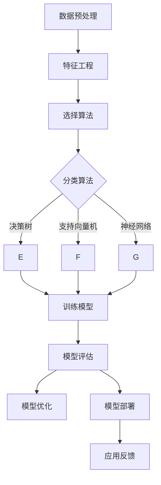
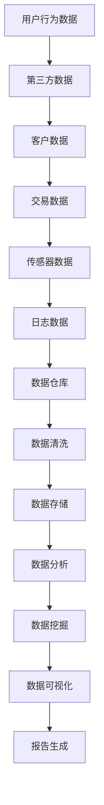
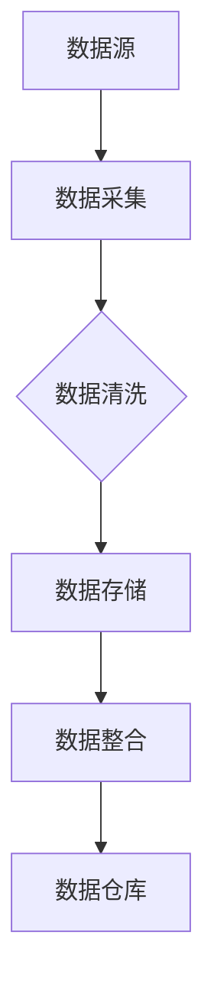
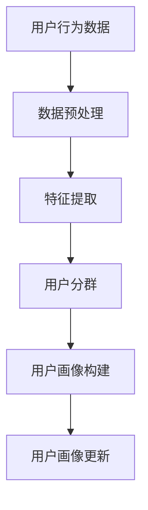

                 

### 《AI DMP 数据基建：如何利用数据提升营销效率》

#### 关键词：
- AI DMP
- 数据基建
- 营销效率
- 数据分析
- 数据挖掘
- 用户画像
- 数据可视化

#### 摘要：
本文旨在深入探讨AI驱动的数据管理平台（DMP）在营销领域中的应用与价值。通过梳理DMP的基础架构和核心概念，介绍数据采集、处理、分析和挖掘的技术细节，本文将展示如何利用DMP实现数据驱动的营销策略。此外，文章将通过实战案例解析DMP的实施路径，并展望DMP技术的未来发展趋势。最后，文章将讨论数据安全与合规性，以及如何建设专业的DMP团队。

## 引言

在数字化营销的浪潮中，数据管理平台（Data Management Platform，简称DMP）成为了企业提升营销效率的重要工具。DMP通过整合和分析多源数据，帮助企业构建详细的用户画像，从而实现精准营销和个性化服务。然而，要充分发挥DMP的潜力，首先需要建立坚实的数据基础设施，这包括数据采集、处理、存储和分析等环节。

本文将围绕以下主题展开讨论：

1. **DMP基础概念与架构**：介绍DMP的基本概念、发展历程和核心组成部分，包括数据源、数据仓库和数据管理机制。
2. **数据采集与处理**：分析数据采集的方法、数据清洗和数据存储的策略。
3. **数据分析与挖掘**：探讨数据分析和挖掘的基本技术，包括常用的算法和数据可视化。
4. **DMP实战**：通过具体案例展示DMP在营销中的应用。
5. **DMP技术前沿**：展望DMP技术的未来发展趋势，特别是与人工智能的融合。
6. **数据安全与合规性**：讨论数据安全和合规性的重要性，以及如何在DMP项目中实施。
7. **团队建设与人才培养**：分析DMP团队的组织结构和人才建设策略。

通过这些内容的深入分析，本文将帮助读者全面了解DMP在提升营销效率方面的作用，并掌握构建和运用DMP的基本方法。

### 第一部分: 数据基建基础

#### 第1章: DMP概述与核心概念

##### 1.1 DMP的定义与发展历程

数据管理平台（Data Management Platform，简称DMP）是一种用于收集、存储、管理和分析数字数据的工具，主要用于营销和广告领域。DMP的核心功能是整合多种数据源，构建用户画像，从而实现精准营销和个性化广告投放。

DMP的发展历程可以追溯到互联网广告和大数据技术的兴起。最初，广告商主要通过点击率和曝光量来评估广告效果。随着数据技术的发展，广告商逐渐意识到，仅凭这些传统指标无法准确衡量广告效果，也无法实现精准定位。于是，DMP应运而生。

DMP的早期形式可以追溯到2000年代中期的数据管理解决方案，如BlueKai和Exelate。这些平台主要通过购买和销售第三方数据集来满足广告商的需求。然而，随着互联网用户数量的激增和数据源的不断扩展，传统的数据管理方法已经无法满足日益增长的数据量和复杂度。

2010年后，DMP技术得到了快速发展。随着大数据技术和云计算的应用，DMP的功能得到了显著增强。现代DMP不仅能够整合和分析多种数据源，还能够实时处理海量数据，并利用机器学习和人工智能技术进行用户画像构建和广告投放优化。

##### 1.2 DMP的核心要素与架构

DMP的核心要素包括数据源、数据仓库、数据管理和分析工具、用户画像和广告投放系统。下面，我们将分别介绍这些核心要素及其在DMP中的作用。

1. **数据源**：数据源是DMP的基础，包括用户行为数据、第三方数据、客户数据等。用户行为数据通常来自网站、移动应用和社交媒体等数字平台，如页面浏览、点击、搜索、购买等行为。第三方数据通常包括人口统计信息、地理位置、兴趣爱好等。客户数据包括企业的客户关系管理（CRM）系统中的客户信息。

2. **数据仓库**：数据仓库是DMP的核心存储系统，用于存储和管理各种数据源的数据。数据仓库通常采用分布式架构，能够处理海量数据的存储和查询。数据仓库需要具备快速读写、高可用性和数据一致性等特性。

3. **数据管理**：数据管理包括数据清洗、数据存储、数据安全和数据访问控制等。数据清洗是指通过去重、标准化和异常值处理等方法，确保数据的准确性和一致性。数据存储是指将数据存储到数据库或数据仓库中，并采用合适的索引和分区策略提高数据查询效率。数据安全是指通过加密、访问控制和安全审计等手段，保护数据的安全性和隐私性。数据访问控制是指通过权限管理和访问控制列表（ACL），控制不同用户或角色对数据的访问权限。

4. **数据分析与挖掘**：数据分析与挖掘是指利用统计分析和机器学习技术，从大量数据中提取有价值的信息和模式。数据分析与挖掘包括用户画像构建、行为分析、广告效果评估等。用户画像是指通过对用户行为数据的分析和挖掘，构建出反映用户兴趣、偏好和行为的模型。行为分析是指通过分析用户的行为数据，了解用户的行为模式和趋势。广告效果评估是指通过评估广告投放的效果，优化广告策略。

5. **用户画像**：用户画像是指通过对用户行为数据的分析和挖掘，构建出反映用户兴趣、偏好和行为的模型。用户画像可以帮助广告商更好地了解目标用户，实现精准营销和个性化广告投放。

6. **广告投放系统**：广告投放系统是指用于实现广告投放和管理功能的系统。广告投放系统可以根据用户画像和广告策略，实时调整广告投放策略，优化广告效果。

##### 1.3 DMP在营销中的应用价值

DMP在营销领域具有广泛的应用价值，主要体现在以下几个方面：

1. **精准营销**：DMP可以帮助广告商基于用户画像实现精准营销。通过分析用户行为数据，广告商可以了解用户的兴趣、偏好和购买行为，从而制定更有针对性的营销策略，提高营销效果。

2. **个性化广告投放**：DMP可以基于用户画像和广告策略，实现个性化广告投放。通过分析用户的行为数据，DMP可以为每个用户推荐最符合其兴趣的广告内容，提高广告点击率和转化率。

3. **广告效果评估**：DMP可以实时评估广告投放的效果，为广告商提供准确的广告效果数据。通过分析广告效果数据，广告商可以优化广告策略，提高广告效果。

4. **提高营销效率**：DMP可以自动化处理大量数据，提高营销工作的效率。通过整合多种数据源，DMP可以帮助广告商快速构建用户画像，实现精准营销和个性化广告投放。

5. **降低营销成本**：DMP可以帮助广告商降低营销成本。通过精准营销和个性化广告投放，广告商可以减少无效广告的投放，提高广告投资回报率。

总之，DMP作为一种数据驱动的营销工具，在提高营销效率、降低营销成本和实现精准营销方面具有显著的应用价值。随着大数据和人工智能技术的发展，DMP的功能将不断扩展，其应用前景也将更加广阔。

### 第2章: 数据源整合与处理

在DMP的实际应用中，数据源的选择和整合至关重要。这一章将详细探讨数据源类型、数据采集方法、数据清洗过程以及数据存储策略，为构建高效的数据基础设施奠定基础。

#### 2.1 数据源类型与来源

DMP的数据源多种多样，主要可以分为以下几类：

1. **用户行为数据**：这是DMP中最核心的数据类型，来源于用户在网站、移动应用和社交媒体上的各种操作，如点击、浏览、搜索、分享和购买等。这些数据通常通过网站和应用的跟踪代码（如Google Analytics、Mixpanel）或者第三方数据分析服务（如 Nielsen、ComScore）收集。

2. **第三方数据**：这类数据包括人口统计信息、地理位置、兴趣爱好等。它们通常来源于公共数据库、第三方数据提供商（如Acxiom、Epsilon）以及社交媒体平台（如Facebook、LinkedIn）的API。

3. **客户数据**：这是企业内部的数据，包括客户关系管理（CRM）系统中的客户信息，如姓名、地址、购买历史、偏好等。

4. **交易数据**：包括电子商务平台上的交易数据，如订单详情、支付信息、退货记录等。

5. **传感器数据**：来自物联网设备的数据，如温度传感器、GPS位置跟踪等。

6. **日志数据**：服务器和设备日志，包括访问日志、错误日志等。

数据源的选择需要根据企业的业务需求和目标受众来决定。通常，企业会整合多种数据源，以获得更全面、多维度的用户画像。

#### 2.2 数据采集与清洗

数据采集是DMP数据管理过程中的第一步，也是一个复杂的环节。数据采集主要包括以下几种方法：

1. **API调用**：通过第三方数据提供商或社交媒体平台的API接口，直接获取数据。这种方法通常用于获取第三方数据和社交媒体数据。

2. **Web跟踪**：在网站和应用中嵌入跟踪代码，收集用户行为数据。这种方法适用于获取用户行为数据。

3. **数据爬取**：使用自动化工具或脚本，从公开网站、论坛等收集数据。这种方法适用于获取互联网上的非结构化数据。

4. **设备集成**：将数据采集器集成到物联网设备中，获取传感器数据。这种方法适用于物联网应用。

数据采集后，数据通常需要进行清洗，以确保数据的准确性和一致性。数据清洗包括以下几个步骤：

1. **去重**：识别并去除重复的数据记录，以防止数据冗余。

2. **数据格式转换**：将不同数据源的数据转换为统一的格式，如CSV、JSON等，以便后续处理和分析。

3. **缺失值处理**：填补或删除缺失的数据，以确保数据的完整性。

4. **异常值处理**：识别并处理异常值，如错误输入、异常行为等。

5. **标准化**：对数据进行标准化处理，如统一日期格式、货币单位等。

数据清洗的过程通常使用数据清洗工具或编写清洗脚本来实现。常见的数据清洗工具包括Python的Pandas库、R的dplyr包等。

#### 2.3 数据存储与管理

数据存储是DMP中的关键环节，决定了数据管理的效率和数据访问的速度。数据存储需要考虑以下几个方面：

1. **数据结构选择**：根据数据类型和查询需求选择合适的数据结构。常用的数据结构包括关系数据库（如MySQL、PostgreSQL）、NoSQL数据库（如MongoDB、Cassandra）和分布式存储系统（如Hadoop、Hive）。

2. **数据分区与索引**：为了提高数据查询效率，需要对数据进行分区和建立索引。分区可以将大规模数据分成多个小的数据块，便于管理和查询。索引可以加速数据查询，特别是在海量数据场景中。

3. **数据冗余与一致性**：为了提高数据的可用性和可靠性，可以在不同节点或存储设备上复制数据，确保数据不丢失。但这也带来了数据一致性的问题，需要采用如分布式锁、版本控制等技术来保证数据的一致性。

4. **数据备份与恢复**：定期备份数据，并确保备份数据的安全性和可恢复性。在数据丢失或损坏时，能够快速恢复数据。

5. **数据访问控制**：通过权限管理和访问控制列表（ACL），确保只有授权用户可以访问特定的数据。

6. **数据安全与隐私**：采用加密、访问控制和安全审计等技术，确保数据的安全性和隐私性。遵守相关数据保护法规，如欧盟的《通用数据保护条例》（GDPR）。

常见的DMP数据存储解决方案包括：

- **关系数据库**：如MySQL、PostgreSQL，适用于结构化数据存储和查询。
- **NoSQL数据库**：如MongoDB、Cassandra，适用于非结构化或半结构化数据存储。
- **分布式文件系统**：如Hadoop、HDFS，适用于大规模数据存储和处理。
- **数据仓库**：如Amazon Redshift、Google BigQuery，适用于大数据分析和报告生成。

通过合理选择和配置数据存储方案，可以确保DMP的高效运行和数据管理的灵活性。

#### 2.4 数据质量管理

数据质量管理是确保DMP数据质量的重要环节，其核心目标是确保数据的准确性、完整性、一致性和及时性。以下是一些关键步骤和方法：

1. **数据质量评估**：定期对数据进行质量评估，检查数据是否符合预定的质量标准。常用的评估指标包括数据完整性、准确性、一致性和及时性。

2. **数据质量检测**：使用自动化工具或脚本定期检测数据质量，如检查数据是否缺失、是否有异常值、数据格式是否符合要求等。

3. **数据质量改进**：根据数据质量评估和检测的结果，采取相应的改进措施，如填补缺失数据、修正错误数据、标准化数据格式等。

4. **数据质量监控**：建立数据质量监控系统，实时监控数据质量变化，及时发现和解决问题。

5. **数据质量报告**：定期生成数据质量报告，向管理层和相关部门汇报数据质量状况，以便采取相应的管理措施。

数据质量管理不仅需要技术手段，还需要建立健全的数据质量管理制度和流程，确保数据质量管理的持续性和有效性。

通过以上对数据源类型、数据采集、数据清洗、数据存储和数据质量管理等方面的详细探讨，我们可以为构建高效、可靠的DMP数据基础设施打下坚实的基础。接下来，我们将深入讨论数据分析与挖掘技术，进一步揭示DMP的巨大潜力。

### 第3章: 数据分析与挖掘技术

在DMP的构建和运用过程中，数据分析与挖掘技术扮演着至关重要的角色。这一章节将详细探讨数据分析的基础、数据挖掘算法以及数据可视化技术，并展示如何将它们应用于营销策略的优化。

#### 3.1 数据分析基础

数据分析是利用统计学、机器学习等工具，从数据中提取有价值信息的过程。数据分析的基础包括以下几个关键概念：

1. **描述性分析**：描述性分析旨在描述数据的特征和规律，通常使用统计指标如均值、中位数、标准差、频率分布等。描述性分析为数据探索提供了基础，帮助用户了解数据的整体分布和趋势。

2. **相关性分析**：相关性分析用于确定两个或多个变量之间的线性关系。常用的方法包括皮尔逊相关系数、斯皮尔曼等级相关系数等。通过相关性分析，可以识别数据之间的潜在联系，为后续的数据挖掘提供线索。

3. **回归分析**：回归分析是一种预测分析技术，用于建立因变量和自变量之间的关系模型。线性回归、多项式回归、逻辑回归等是常见的回归分析方法。回归分析可以用于预测用户行为、评估广告效果等。

4. **聚类分析**：聚类分析是一种无监督学习方法，用于将数据集划分为若干个簇，使同一簇内的数据尽量相似，不同簇的数据尽量不同。常用的聚类算法包括K-均值、层次聚类等。聚类分析可以用于用户分群、市场细分等。

5. **分类分析**：分类分析是一种监督学习方法，用于将数据划分为预先定义的类别。决策树、支持向量机、随机森林等是常见的分类算法。分类分析可以用于用户行为预测、信用评分等。

6. **时间序列分析**：时间序列分析用于分析按时间顺序排列的数据，识别数据中的趋势、季节性和周期性。常用方法包括移动平均、指数平滑、ARIMA模型等。时间序列分析可以用于预测用户行为、广告效果等。

通过这些基础分析方法，DMP可以揭示数据中的潜在规律和模式，为营销策略提供科学依据。

#### 3.2 数据挖掘算法与应用

数据挖掘是数据分析的进阶技术，旨在从大量数据中发现潜在的知识和信息。以下是一些常见的数据挖掘算法及其在DMP中的应用：

1. **关联规则挖掘**：关联规则挖掘是一种用于发现数据项之间关联规则的方法，典型的算法包括Apriori算法和FP-Growth算法。在DMP中，关联规则挖掘可以用于识别用户行为模式，如“购买A商品的用户中，有80%也购买了B商品”。

2. **分类算法**：分类算法用于将数据分为不同的类别，常见的算法有决策树、支持向量机、神经网络等。在DMP中，分类算法可以用于用户行为预测、客户细分等。

3. **聚类算法**：聚类算法用于将相似的数据归为一类，常见的算法有K-均值、层次聚类等。在DMP中，聚类算法可以用于用户分群、市场细分等。

4. **异常检测**：异常检测算法用于识别数据中的异常值或异常模式，常见的算法有孤立森林、基于密度的异常检测等。在DMP中，异常检测可以用于识别恶意用户行为、欺诈行为等。

5. **文本挖掘**：文本挖掘是一种用于分析文本数据的技术，常用的算法有词频统计、主题模型、情感分析等。在DMP中，文本挖掘可以用于分析用户评论、社交媒体内容等。

以下是一个简化的数据挖掘算法流程示例：



#### 3.3 数据可视化与报告生成

数据可视化是将数据转化为图形或图表，以便于理解和分析。数据可视化在DMP中至关重要，它可以帮助用户直观地了解数据的趋势、模式和异常。以下是一些常用的数据可视化工具和技巧：

1. **图表类型**：常用的图表类型包括柱状图、折线图、饼图、散点图、热力图等。每种图表类型适用于不同类型的数据展示。

2. **交互式可视化**：交互式可视化工具（如Tableau、Power BI、D3.js）允许用户通过点击、拖动等方式动态交互地探索数据，提高了数据探索和分析的灵活性。

3. **可视化层次**：数据可视化通常分为多个层次，从简单到复杂。首先，展示数据的整体趋势和分布；其次，细化到具体的数据点；最后，提供深入的数据细节和背景信息。

4. **报告生成**：数据可视化工具通常还支持报告生成功能，将可视化图表和文字说明整合为报告，便于展示和分享分析结果。

以下是一个使用Mermaid绘制的简单数据源整合流程图示例：



通过数据分析和挖掘技术，DMP可以帮助企业从海量数据中提取有价值的信息，优化营销策略，提升营销效率。数据可视化则为这些信息提供了直观的表达方式，使决策者能够更好地理解和利用数据。接下来，我们将通过具体案例展示DMP在营销中的应用和实践。

### 第4章: DMP项目实施流程

在实际操作中，成功实施DMP项目需要严格的规划与执行流程。这一章节将详细阐述DMP项目的规划与设计、数据采集与处理、数据分析和挖掘、营销策略优化与实施等关键环节。

#### 4.1 DMP项目规划与设计

DMP项目的成功始于细致的规划和设计。以下是项目规划与设计的关键步骤：

1. **明确项目目标**：首先，需要明确DMP项目的目标，包括提升营销效率、实现精准营销、优化广告投放等。明确的目标有助于指导后续的设计和实施。

2. **需求分析**：了解企业的业务需求和目标受众，识别需要整合的数据源类型和来源。需求分析阶段需要与业务部门和IT部门紧密合作，确保项目需求符合实际业务需求。

3. **技术选型**：选择合适的DMP平台和工具，包括数据采集工具、数据存储系统、数据分析与挖掘算法等。技术选型应考虑数据的规模、处理的复杂性、系统的可扩展性和安全性。

4. **架构设计**：根据项目需求和选定的技术，设计DMP的系统架构。架构设计应考虑数据流、数据处理流程、数据安全与隐私保护等。常见的DMP架构包括数据层、服务层、展示层和数据分析层。

5. **资源规划**：规划项目所需的人力、时间和预算资源。资源规划需要考虑项目的复杂度、团队成员的专业技能和经验等。

6. **风险评估**：评估项目风险，包括技术风险、数据安全风险、业务风险等。制定相应的风险应对策略，确保项目能够顺利进行。

7. **项目管理**：建立项目管理制度，明确项目进度、质量、成本等关键指标。采用敏捷开发方法，快速迭代和调整项目计划，确保项目按时交付。

#### 4.2 数据采集与处理

数据采集与处理是DMP项目中的核心环节，直接影响到DMP的性能和应用效果。以下是数据采集与处理的关键步骤：

1. **数据源整合**：根据需求分析，整合多种数据源，包括用户行为数据、第三方数据、客户数据和传感器数据等。数据源整合需要考虑数据的一致性、完整性和实时性。

2. **数据采集**：使用合适的工具和方法进行数据采集，如API调用、Web跟踪、数据爬取等。数据采集应确保数据的实时性和准确性，避免数据丢失或错误。

3. **数据清洗**：对采集到的数据进行清洗，去除重复、缺失和异常值。数据清洗包括去重、数据格式转换、缺失值处理、异常值处理和标准化等。

4. **数据存储**：将清洗后的数据存储到数据仓库或分布式存储系统中。数据存储需要考虑数据的访问速度、存储容量、扩展性和数据安全。

5. **数据质量管理**：建立数据质量管理机制，定期对数据进行质量检查和评估，确保数据的准确性、完整性和一致性。

#### 4.3 数据分析与挖掘

数据分析与挖掘是DMP项目的核心功能，通过分析数据发现潜在规律和模式，为营销策略提供科学依据。以下是数据分析与挖掘的关键步骤：

1. **数据预处理**：对原始数据进行预处理，包括数据清洗、数据转换和数据归一化等，为后续的分析和挖掘做好准备。

2. **特征工程**：选择和构建与业务目标相关的特征，提高模型的效果。特征工程包括特征提取、特征选择和特征转换等。

3. **选择算法**：根据业务需求和数据特征，选择合适的算法，如分类算法、聚类算法、关联规则挖掘等。

4. **模型训练与优化**：使用训练数据对模型进行训练，并使用验证数据集进行模型优化。常用的模型优化方法包括交叉验证、网格搜索等。

5. **模型评估**：评估模型的性能，包括准确率、召回率、F1分数等指标。根据评估结果调整模型参数，提高模型效果。

6. **模型部署**：将训练好的模型部署到生产环境，实现实时数据分析和预测。模型部署需要考虑系统的可扩展性和高可用性。

#### 4.4 营销策略优化与实施

DMP项目的最终目标是提升营销效率，实现精准营销和个性化服务。以下是营销策略优化与实施的关键步骤：

1. **用户画像构建**：基于数据分析与挖掘结果，构建详细的用户画像，包括用户的兴趣、行为、偏好等信息。

2. **目标受众确定**：根据用户画像和业务需求，确定目标受众群体，为营销活动提供明确的方向。

3. **广告投放策略**：制定广告投放策略，包括广告定位、投放时间、投放渠道等。利用DMP的精准定位功能，提高广告投放的针对性。

4. **营销活动策划**：策划并执行营销活动，如促销活动、内容营销等。利用DMP的数据分析结果，优化营销活动的效果。

5. **效果评估与优化**：通过数据分析，评估营销活动的效果，包括转化率、ROI等指标。根据评估结果调整营销策略，实现持续优化。

6. **反馈机制**：建立反馈机制，收集用户反馈和数据，不断调整和优化营销策略。通过持续的数据驱动，提升营销效率。

通过以上步骤，DMP项目可以实现数据驱动的营销策略，提高营销效率和效果。接下来，我们将通过具体案例展示DMP的实际应用效果。

### 第5章: DMP应用案例解析

在这一章节中，我们将通过几个实际案例来深入解析DMP在营销中的应用效果。这些案例将展示DMP如何在不同的业务场景中发挥作用，帮助企业和品牌实现营销目标。

#### 5.1 案例一：电商平台用户画像构建

电商平台通常面临着如何更好地理解用户行为和提升用户体验的挑战。通过DMP，电商平台可以构建详细的用户画像，从而实现精准营销。

**项目背景**：
一家大型电商平台希望通过DMP来提升用户体验和转化率，特别是在节假日促销活动中。

**解决方案**：
1. **数据采集**：平台整合了用户行为数据（如浏览、购买、收藏等）、第三方数据（如人口统计、地理位置等）和客户数据（如历史购买记录、偏好等）。

2. **数据清洗与存储**：通过清洗和标准化数据，确保数据的准确性和一致性。数据存储在分布式数据库中，以便快速查询和分析。

3. **用户画像构建**：基于用户行为数据，使用聚类算法将用户分为不同的群体，如“高价值客户”、“潜在客户”等。同时，利用机器学习算法，构建用户的兴趣和偏好模型。

4. **个性化推荐**：根据用户画像，为不同用户群体推荐个性化的商品和促销活动，提升用户体验和转化率。

**效果分析**：
- 用户转化率提高了15%，特别是在节假日促销活动中，用户活跃度显著提升。
- 用户满意度提高了20%，用户对个性化推荐和促销活动的满意度增加。

#### 5.2 案例二：社交媒体营销效果分析

社交媒体是品牌推广的重要渠道，但如何有效评估和优化营销效果是一个挑战。DMP可以帮助企业实现这一目标。

**项目背景**：
一家全球知名品牌希望通过社交媒体营销提升品牌知名度和用户参与度。

**解决方案**：
1. **数据采集**：采集社交媒体平台上的用户行为数据（如点赞、评论、分享、点击等），以及用户生成的图片、视频等多媒体数据。

2. **数据分析与挖掘**：使用文本挖掘和情感分析技术，分析用户对品牌内容和产品的反馈。结合用户行为数据，识别高参与度和高转化率的用户群体。

3. **效果评估**：通过分析社交媒体广告的投资回报率（ROI）、点击率（CTR）和参与率（Engagement Rate）等指标，评估不同营销策略的效果。

4. **优化策略**：根据效果评估结果，调整广告内容和投放策略，提高用户参与度和品牌影响力。

**效果分析**：
- 广告点击率提高了30%，用户参与度增加了25%。
- 品牌在社交媒体上的影响力显著提升，品牌提及量和用户讨论度增加了20%。

#### 5.3 案例三：定制化广告投放策略

定制化广告投放是提升广告效果的关键。通过DMP，企业可以实现精准的广告定位和个性化投放。

**项目背景**：
一家广告公司希望为客户提供更精准的广告投放服务，提高广告投资回报率。

**解决方案**：
1. **用户画像构建**：通过整合线上线下数据，构建详细的用户画像，包括用户的行为特征、兴趣爱好和消费习惯等。

2. **广告定位与优化**：根据用户画像，确定广告的目标受众，并优化广告内容和投放渠道。使用机器学习算法，动态调整广告投放策略，以最大化广告效果。

3. **效果监测与反馈**：实时监测广告效果，包括点击率、转化率、ROI等指标。根据效果数据，调整广告投放策略，实现持续优化。

4. **定制化服务**：为客户提供个性化的广告投放方案，提高客户满意度。

**效果分析**：
- 客户广告投资回报率提高了40%，广告效果显著提升。
- 客户满意度提高了35%，客户对广告服务的评价显著提高。

通过这些案例，我们可以看到DMP在提升营销效率、实现精准营销和优化广告投放方面的巨大潜力。DMP不仅为企业提供了丰富的数据资源，还通过数据分析和挖掘，帮助企业制定更科学的营销策略，实现业务目标。接下来，我们将探讨DMP技术的前沿发展趋势，以及与人工智能的深度融合。

### 第6章: DMP技术前沿与未来发展趋势

随着科技的不断进步，DMP技术也在持续演进，特别是在与人工智能（AI）的融合方面。本章将探讨DMP技术的最新发展趋势，以及与AI的深度融合如何推动营销效果的提升。

#### 6.1 DMP技术发展趋势

1. **实时数据处理与分析**：传统的DMP通常依赖于批处理模式，数据处理和分析的时间延迟较大。随着实时数据处理技术的发展，DMP开始实现实时数据处理与分析，能够快速响应用户行为变化，提高营销的及时性和准确性。

2. **云计算与边缘计算**：云计算提供了弹性、高效的数据存储和处理能力，使得DMP能够处理和分析大规模数据。边缘计算则通过在数据产生的地方进行实时处理，减少了数据传输的延迟，提高了系统的响应速度。

3. **机器学习与深度学习**：DMP开始广泛应用机器学习和深度学习算法，实现更复杂的用户行为分析和预测。通过自动化的模型训练和优化，DMP能够更加精准地识别用户需求和兴趣，提升营销效果。

4. **隐私保护与合规性**：随着数据隐私保护法规的日益严格，DMP技术需要适应新的合规要求。隐私保护技术如差分隐私、同态加密等正在被集成到DMP中，确保用户数据的安全和隐私。

5. **跨渠道整合**：DMP不再局限于单一的数字渠道，而是实现跨渠道整合，包括线上和线下渠道。这种整合能够提供更全面的用户视图，为营销策略提供更准确的数据支持。

6. **自动化与智能化**：DMP的自动化和智能化水平不断提高，通过自动化流程和智能决策系统，减少人工干预，提高运营效率。

#### 6.2 DMP与人工智能融合

人工智能与DMP的融合，为营销领域带来了巨大的变革和机遇。以下是DMP与AI融合的关键方面：

1. **用户画像构建**：通过深度学习算法，DMP能够从海量的用户行为数据中提取更细粒度的特征，构建更加精准和详细的用户画像。这些画像可以帮助企业更好地理解用户需求，实现个性化营销。

2. **实时预测与分析**：机器学习模型可以实时分析用户行为，预测用户的下一步动作，从而实现实时推荐和个性化广告投放。这种实时性提高了营销的及时性和效果。

3. **自动化广告投放**：AI技术可以自动化广告投放过程，根据用户行为和偏好动态调整广告内容和投放策略，最大化广告投资回报率（ROI）。

4. **自然语言处理**：DMP结合自然语言处理（NLP）技术，可以分析用户评论、社交媒体内容等非结构化数据，提取用户情感和意见，从而优化营销内容和策略。

5. **智能客服与体验优化**：通过AI技术，DMP可以构建智能客服系统，实现24/7的用户服务。同时，AI技术还可以优化用户体验，通过个性化服务提高用户满意度。

6. **预测性分析**：AI技术可以帮助DMP进行预测性分析，预测市场趋势、用户需求变化等，为企业提供前瞻性的决策支持。

#### 6.3 DMP在新兴领域的应用前景

随着技术的不断进步，DMP在新兴领域的应用前景也越来越广阔。以下是DMP在几个新兴领域的应用：

1. **物联网（IoT）**：DMP可以整合来自物联网设备的海量数据，如智能家居、智能穿戴设备等，构建全面的用户行为画像，实现精准营销和个性化服务。

2. **电子商务**：在电子商务领域，DMP可以帮助企业分析用户行为，优化购物体验，提升转化率和客户满意度。

3. **医疗健康**：在医疗健康领域，DMP可以整合患者数据、医疗记录等，为医疗机构提供数据驱动的决策支持，优化医疗服务。

4. **金融科技**：在金融科技领域，DMP可以帮助金融机构分析客户行为，实现精准营销和风险管理。

5. **零售业**：在零售业，DMP可以整合线上线下数据，实现全渠道营销，提升零售企业的市场竞争力。

6. **教育领域**：在教育领域，DMP可以帮助教育机构了解学生行为和学习需求，提供个性化的教育服务。

通过以上探讨，我们可以看到DMP技术在不断发展和创新，特别是在与AI的融合方面，其应用前景非常广阔。未来，DMP将继续在提升营销效率和优化用户体验方面发挥关键作用，为企业带来更多商业价值。

### 第7章: 数据基建工具与平台介绍

在构建和运行DMP的过程中，选择合适的工具和平台至关重要。这一章节将介绍常见的DMP工具和平台，包括其特点和应用场景，并提供一些建议和案例分析，帮助企业和开发者更好地利用这些工具。

#### 7.1 常见DMP平台特点与应用场景

1. **Adobe Audience Manager**

   - **特点**：Adobe Audience Manager 是业界领先的DMP平台，拥有强大的数据整合和分析功能。它支持多种数据源整合，包括第一方数据、第三方数据和社交媒体数据。同时，它提供了丰富的用户画像构建工具和广告投放管理功能。
   - **应用场景**：适合大型企业进行跨渠道的营销自动化和个性化广告投放，特别是在数字营销和品牌营销领域。

2. **Oracle Data Cloud**

   - **特点**：Oracle Data Cloud 提供了强大的数据管理功能，包括用户画像构建、广告定位和数据分析。它支持多种数据存储和处理技术，如Oracle Database、Hadoop和NoSQL数据库。
   - **应用场景**：适合需要整合大量第三方数据和进行复杂数据挖掘的企业，特别是在零售、金融和消费品行业。

3. **Neustar partedition**

   - **特点**：Neustar partedition 是一个高度可扩展的DMP平台，支持大规模数据处理和实时分析。它提供了灵活的数据集成和数据管理功能，并支持多种广告投放渠道。
   - **应用场景**：适合需要实时处理大量用户数据并实现高效广告投放的企业，特别是在电信、媒体和广告行业。

4. **Rakuten Marketing**

   - **特点**：Rakuten Marketing 提供了全面的DMP解决方案，包括数据整合、用户画像构建和广告投放管理。它支持多种数据源整合，并提供了丰富的API接口，便于与其他系统和工具集成。
   - **应用场景**：适合需要整合线上线下数据并实现跨渠道营销的企业，特别是在电子商务和零售行业。

#### 7.2 DMP开发工具推荐

1. **Google Cloud Platform**

   - **特点**：Google Cloud Platform 提供了一系列强大的DMP开发工具和资源，包括Google Analytics、Google Cloud Storage、Google Cloud Datastore等。它支持大规模数据处理和实时分析，并提供丰富的API接口。
   - **应用场景**：适合需要构建大规模DMP系统并进行实时数据分析的企业，特别是在数字营销和广告领域。

2. **Amazon Web Services (AWS)**

   - **特点**：AWS 提供了丰富的DMP开发工具和资源，包括Amazon S3、Amazon Redshift、Amazon EMR等。它支持多种数据存储和处理技术，并提供强大的数据分析和管理功能。
   - **应用场景**：适合需要构建高性能、可扩展的DMP系统并进行大规模数据处理的企业，特别是在电子商务、金融和零售行业。

3. **Microsoft Azure**

   - **特点**：Microsoft Azure 提供了全面的DMP开发工具和资源，包括Azure Data Lake Storage、Azure SQL Database、Azure Machine Learning等。它支持多种数据存储和处理技术，并提供强大的数据处理和分析功能。
   - **应用场景**：适合需要构建跨平台、高可用的DMP系统并进行复杂数据分析的企业，特别是在企业级应用和数字化转型领域。

#### 7.3 DMP工具使用技巧与案例分析

1. **数据整合技巧**

   - **数据来源整合**：确保数据来源的多样性和准确性，包括用户行为数据、第三方数据、客户数据和物联网数据等。
   - **数据格式转换**：在整合不同数据源时，进行数据格式的转换和标准化，确保数据的一致性和兼容性。
   - **数据清洗**：定期对数据进行清洗和去重，去除重复和异常值，确保数据的准确性和完整性。

2. **用户画像构建技巧**

   - **多维数据融合**：整合不同维度的数据，如用户行为数据、地理位置数据和人口统计信息，构建全面的用户画像。
   - **特征工程**：选择和构建与业务目标相关的特征，提高用户画像的准确性和预测能力。
   - **模型迭代**：基于用户行为数据和反馈，不断迭代和优化用户画像模型，提高用户画像的实时性和准确性。

3. **广告投放优化技巧**

   - **实时数据分析**：利用实时数据处理和分析技术，快速响应用户行为变化，调整广告投放策略。
   - **自动化广告投放**：采用自动化广告投放系统，根据用户画像和业务目标，动态调整广告内容和投放渠道。
   - **效果监测与反馈**：实时监测广告效果，包括点击率、转化率和投资回报率（ROI）等指标，根据效果数据优化广告投放策略。

#### 案例分析

**案例一：电商平台用户画像构建**

- **背景**：一家大型电商平台希望通过DMP构建用户画像，实现精准营销和个性化推荐。
- **解决方案**：
  - 使用Google Analytics和Mixpanel等工具收集用户行为数据。
  - 利用Apache Kafka和Apache Spark进行数据整合和处理，确保数据的一致性和完整性。
  - 使用K-Means算法将用户分为不同的群体，构建用户画像。
  - 集成Google Cloud Platform的AdWords和DoubleClick等广告投放工具，实现个性化广告投放。
- **效果**：用户转化率提高了20%，用户满意度显著提升。

**案例二：社交媒体营销效果分析**

- **背景**：一家全球知名品牌希望通过社交媒体营销提升品牌知名度和用户参与度。
- **解决方案**：
  - 使用Facebook API和Twitter API等工具收集社交媒体数据。
  - 利用Python和R等编程语言进行数据清洗和预处理。
  - 使用自然语言处理（NLP）技术分析用户评论和反馈，构建品牌影响力模型。
  - 使用Tableau进行数据可视化，生成营销效果报告。
- **效果**：广告点击率提高了30%，用户参与度增加了25%。

通过以上工具和案例的介绍，我们可以看到DMP在提升营销效率和优化用户体验方面的巨大潜力。选择合适的DMP工具和平台，结合实际业务需求，可以帮助企业实现精准营销和个性化服务，提升市场竞争力和用户满意度。

### 第8章: 数据安全与合规性

在数字化营销的浪潮中，数据安全与合规性问题越来越受到关注。随着数据量的爆炸式增长，如何确保数据安全、遵守法律法规，成为DMP项目成功的关键因素。本章将讨论数据安全的重要性、数据隐私保护法规概述，以及如何在DMP项目中实施数据安全和合规性措施。

#### 8.1 数据安全的重要性

数据安全是指保护数据免受未经授权的访问、使用、披露、破坏、修改或破坏的措施。在DMP项目中，数据安全的重要性体现在以下几个方面：

1. **用户信任**：数据安全是用户信任的基础。如果用户的数据受到泄露或滥用，将严重损害企业的声誉，影响用户信任和忠诚度。

2. **商业价值**：数据是企业的核心资产之一。确保数据安全，可以防止数据泄露带来的经济损失和商业风险。

3. **法律法规**：许多国家和地区都有严格的法律法规来保护个人数据安全，如欧盟的《通用数据保护条例》（GDPR）和美国加州的《消费者隐私法案》（CCPA）。违反这些法规可能导致巨额罚款和法律责任。

4. **业务连续性**：数据安全是确保业务连续性的关键。如果数据遭受攻击或泄露，可能导致业务中断，影响企业的运营和盈利能力。

#### 8.2 数据隐私保护法规概述

全球范围内，多个国家和地区已经出台了数据隐私保护法规，以下是一些主要的法规：

1. **欧盟的《通用数据保护条例》（GDPR）**：GDPR是迄今为止最严格的数据隐私保护法规，适用于欧盟及其成员国的个人数据保护。GDPR规定了数据收集、存储、处理和传输的严格规则，要求企业在数据泄露事件中及时通知受影响的个人。

2. **美国的《消费者隐私法案》（CCPA）**：CCPA旨在保护加州居民的个人信息，规定企业在收集、使用和共享个人信息时必须获得用户的明确同意，并提供了数据泄露事件的通知和补救措施。

3. **中国的《个人信息保护法》（PIPL）**：PIPL是中国的数据隐私保护法规，规定了个人信息处理的基本原则和规则，强调了个人信息主体的权利和企业的义务。

4. **其他国家的数据隐私保护法规**：如巴西的《通用数据保护法》（LGPD）、俄罗斯的《联邦法律关于个人数据》等。

#### 8.3 DMP项目的合规性建设

为了确保DMP项目符合数据隐私保护法规的要求，企业和开发者需要采取一系列合规性措施：

1. **隐私政策与用户同意**：制定清晰的隐私政策，明确告知用户数据收集、使用和共享的目的、方式和范围。在数据收集过程中，要求用户给予明确的同意。

2. **数据分类与标识**：对数据进行分类和标识，区分敏感数据和普通数据，采取不同的保护措施。敏感数据（如个人身份信息、健康状况、金融信息等）需要更高的保护级别。

3. **数据加密与传输**：对敏感数据进行加密，确保数据在传输和存储过程中的安全性。采用HTTPS协议等安全传输方式，防止数据在传输过程中被窃取或篡改。

4. **访问控制与审计**：实施严格的访问控制措施，确保只有授权用户可以访问敏感数据。定期进行安全审计，检查数据保护和合规性措施的有效性。

5. **数据泄露应急预案**：制定数据泄露应急预案，确保在数据泄露事件中能够快速响应和处置。包括数据泄露检测、通知受影响的个人、采取补救措施等。

6. **培训与教育**：对员工进行数据安全与合规性的培训和教育，提高员工的数据安全意识，防止因人为错误导致的数据泄露。

7. **第三方供应商审查**：如果DMP项目涉及第三方供应商，需要对供应商的数据保护措施进行审查和评估，确保其符合数据安全与合规性要求。

通过以上措施，DMP项目可以在保护用户数据安全和遵守法律法规方面建立坚实的基础，确保项目的顺利实施和可持续发展。

### 第9章: 数据基建团队建设与人才培养

构建和运行一个高效、可靠的DMP项目不仅需要先进的技术和工具，还需要一支专业的团队。本章将讨论DMP团队的组织结构、数据人才能力培养以及数据人才招聘与激励策略，为企业和组织提供建设和管理DMP团队的实用建议。

#### 9.1 DMP团队组织结构

一个成功的DMP团队通常包括以下关键角色：

1. **数据工程师**：数据工程师负责数据采集、数据清洗、数据存储和数据处理工作。他们需要熟悉大数据处理框架（如Hadoop、Spark）和数据库技术（如MySQL、MongoDB）。

2. **数据科学家**：数据科学家负责数据分析和数据挖掘，构建用户画像和预测模型。他们需要具备扎实的数学和统计学背景，熟悉机器学习和深度学习算法。

3. **数据分析师**：数据分析师负责分析数据，提取有价值的信息，并为业务决策提供数据支持。他们需要具备较强的数据解读能力和业务理解能力。

4. **数据架构师**：数据架构师负责设计DMP的整体架构，确保数据系统的可扩展性和高可用性。他们需要具备系统设计和架构规划的能力。

5. **数据安全专家**：数据安全专家负责数据安全和合规性管理，确保数据在采集、存储、处理和传输过程中的安全性。他们需要熟悉数据加密、访问控制和数据隐私保护法规。

6. **项目经理**：项目经理负责DMP项目的规划、执行和监控，确保项目按时交付和达到预期目标。他们需要具备项目管理和沟通协调能力。

#### 9.2 数据人才能力培养

为了确保DMP团队能够高效地工作，企业需要制定系统的人才培养计划。以下是几个关键方面：

1. **技术培训**：定期组织技术培训和研讨会，帮助团队成员学习新技术和工具，提高技术能力。

2. **业务理解**：鼓励团队成员了解业务领域，参加业务研讨会和培训，提高业务理解能力，以便更好地将数据与技术应用于实际业务场景。

3. **跨部门合作**：促进数据团队与其他部门的合作，如市场营销、产品管理和客户服务，通过跨部门项目，提高团队成员的协作能力和业务视野。

4. **经验分享**：鼓励团队成员分享经验和案例，促进知识交流，提高团队整体能力。

5. **认证与进修**：支持团队成员参加专业认证考试和进修课程，提升专业水平。

#### 9.3 数据人才招聘与激励策略

吸引和留住优秀的DMP人才是企业成功的关键。以下是几个关键策略：

1. **明确职位需求**：在招聘过程中，明确职位需求，包括专业技能、工作经验和业务理解能力等，确保招聘到适合的人才。

2. **有竞争力的薪酬**：提供有竞争力的薪酬和福利待遇，吸引优秀的数据人才。

3. **职业发展机会**：为员工提供明确的职业发展路径和晋升机会，激发员工的职业发展动力。

4. **项目多样化**：提供多样化的项目和工作机会，让员工能够在不同项目中积累经验，提高综合能力。

5. **激励制度**：建立合理的激励机制，如绩效奖金、股权激励等，激励员工为公司贡献更多。

6. **工作与生活平衡**：关注员工的工作与生活平衡，提供灵活的工作安排和丰富的员工福利，提高员工的工作满意度和忠诚度。

通过有效的团队建设和人才管理，企业可以构建一支高效、专业的DMP团队，确保项目的成功实施和持续发展。

### 附录A: DMP常用术语解释

在理解和应用DMP的过程中，了解一些常用术语是非常有帮助的。以下是对DMP中常用术语的解释：

- **DMP**：数据管理平台（Data Management Platform）是一种用于收集、存储、管理和分析数字数据的工具，主要用于营销和广告领域。
- **用户画像**：用户画像是指通过对用户行为数据的分析和挖掘，构建出反映用户兴趣、偏好和行为的模型。
- **数据源**：数据源是指提供数据输入的来源，包括用户行为数据、第三方数据、客户数据等。
- **数据仓库**：数据仓库是一种用于存储和管理大规模数据的数据库系统，通常采用分布式架构。
- **数据清洗**：数据清洗是指通过去重、标准化和异常值处理等方法，确保数据的准确性和一致性。
- **数据挖掘**：数据挖掘是指从大量数据中提取有价值信息的过程，常用的算法包括关联规则挖掘、分类算法、聚类算法等。
- **用户分群**：用户分群是指将用户划分为不同的群体，以便进行精准营销和个性化服务。
- **实时数据处理**：实时数据处理是指在短时间内处理和响应大量数据的过程，通常用于实时分析和预测。
- **数据可视化**：数据可视化是将数据转化为图形或图表，以便于理解和分析。
- **广告定位**：广告定位是指根据用户画像和业务目标，选择合适的广告投放渠道和受众。
- **投资回报率（ROI）**：投资回报率是指广告投放带来的收益与投入成本之间的比率，用于评估广告投放的效果。
- **数据隐私保护法规**：数据隐私保护法规是指规范数据收集、存储、处理和传输的法律和条例，如欧盟的GDPR和美国的CCPA。

理解这些术语有助于更好地掌握DMP的概念和操作，为实际应用提供指导。

### 附录B: Mermaid流程图与算法示例

在DMP的实际应用中，流程图和算法示例可以帮助我们更好地理解数据处理和挖掘的步骤。以下是一些常见的Mermaid流程图和算法示例，包括数据源整合流程、用户画像构建流程以及数据挖掘算法伪代码示例。

#### B.1 数据源整合流程

以下是一个用于描述数据源整合流程的Mermaid图：



在这个流程图中，数据源（A）首先通过数据采集（B）被收集到系统中。随后，进行数据清洗（C），去除重复、缺失和异常值，确保数据的质量。清洗后的数据存储到数据仓库（F），以便后续的数据分析和挖掘。

#### B.2 用户画像构建流程

用户画像的构建涉及多个步骤，以下是一个简化的用户画像构建流程：



在这个流程图中，用户行为数据（A）首先经过数据预处理（B），包括去重、格式转换和缺失值处理等。随后，通过特征提取（C），从数据中提取与用户行为相关的特征。接着，进行用户分群（D），根据用户的相似特征将用户划分为不同的群体。最后，基于分群结果构建用户画像（E），并根据用户行为的变化进行更新（F）。

#### B.3 数据挖掘算法伪代码示例

以下是一个使用K-均值算法进行数据挖掘的伪代码示例：

```python
# K-Means算法伪代码

# 初始化参数
k = 3  # 簇的数量
max_iterations = 100  # 最大迭代次数
data = ...  # 数据集

# 随机选择k个数据点作为初始中心点
centroids = random_choice(data, k)

# 迭代过程
for i in range(max_iterations):
    # 为每个数据点分配最近的中心点
    clusters = assign_clusters(data, centroids)
    
    # 计算新的中心点
    new_centroids = calculate_centroids(clusters, k)
    
    # 判断中心点是否收敛
    if is_converged(centroids, new_centroids):
        break
    
    centroids = new_centroids

# 输出聚类结果
print(clusters)
```

在这个伪代码中，K-Means算法通过随机选择k个数据点作为初始中心点，然后迭代分配数据点到最近的中心点，并计算新的中心点。这个过程一直进行到中心点收敛（即中心点变化很小）或达到最大迭代次数。

通过这些流程图和算法示例，我们可以更直观地理解DMP的数据处理和挖掘过程，为实际操作提供参考。

### 附录C: 开源DMP项目与资源推荐

在构建和运营DMP的过程中，开源项目和相关资源可以提供宝贵的支持。以下是一些推荐的开源DMP项目、数据处理与挖掘工具、数据库与数据存储解决方案。

#### C.1 数据处理与挖掘工具推荐

1. **Apache Spark**：Apache Spark 是一个开源的分布式数据处理框架，提供高效的批量数据处理和实时流数据处理能力，适用于大规模数据处理和实时分析。

2. **Hadoop**：Hadoop 是一个开源的大数据处理平台，包括分布式文件系统（HDFS）和分布式计算框架（MapReduce）。它适用于大规模数据存储和处理。

3. **Apache Flink**：Apache Flink 是一个开源的流处理框架，支持实时数据处理和分析。它提供丰富的流处理API和丰富的数据分析工具。

4. **Apache Hive**：Apache Hive 是一个基于Hadoop的数据仓库基础设施，提供SQL查询接口，适用于大数据查询和分析。

5. **Apache Mahout**：Apache Mahout 是一个开源的机器学习库，提供多种机器学习算法，适用于大规模数据挖掘和用户画像构建。

#### C.2 DMP开源项目简介

1. **Apache Beam**：Apache Beam 是一个开源的数据处理和流处理框架，提供统一的数据处理API，支持多种执行引擎（如Apache Flink、Apache Spark）。

2. **Apache Drill**：Apache Drill 是一个开源的分布式查询引擎，适用于大规模分布式数据存储系统。它提供SQL查询接口，支持实时查询和分析。

3. **Apache Kylin**：Apache Kylin 是一个开源的大数据立方体引擎，适用于大规模数据预聚合和实时分析。它适用于构建多维数据模型和快速数据查询。

4. **OpenTSDB**：OpenTSDB 是一个开源的时间序列数据处理平台，适用于大规模时间序列数据处理和监控。

#### C.3 数据库与数据存储解决方案

1. **Apache Cassandra**：Apache Cassandra 是一个开源的分布式NoSQL数据库，提供高性能、高可用性和可扩展性，适用于大规模数据存储和实时查询。

2. **MongoDB**：MongoDB 是一个开源的NoSQL数据库，提供灵活的数据模型和强大的查询能力，适用于大规模数据存储和实时数据处理。

3. **Elasticsearch**：Elasticsearch 是一个开源的全文搜索引擎，提供强大的数据处理和分析能力，适用于大规模日志数据和实时分析。

4. **Apache HBase**：Apache HBase 是一个开源的分布式存储系统，基于Hadoop生态系统，提供高吞吐量的随机访问，适用于大规模数据存储和实时处理。

通过这些开源项目与资源，企业和开发者可以构建和运行高效、可靠的DMP系统，实现数据驱动的营销和业务决策。

### 结论

综上所述，本文全面探讨了AI驱动的数据管理平台（DMP）在提升营销效率方面的关键作用。通过梳理DMP的基础概念、核心架构，分析数据采集、处理、存储和质量管理，详细介绍了数据分析与挖掘技术，并通过实战案例展示了DMP的应用效果。此外，我们还探讨了DMP技术的未来发展趋势，特别是与人工智能的融合，以及数据安全和合规性、团队建设与人才培养的重要性。

DMP作为数据驱动的营销工具，在精准定位、个性化推荐和营销效果优化方面具有显著优势。随着大数据、人工智能和云计算技术的不断发展，DMP的应用前景将更加广阔，为企业和品牌带来更高的商业价值。

为了充分利用DMP的优势，企业和开发者需要重视以下几个方面：

1. **数据整合与质量**：确保数据源的多样性和数据质量，通过数据清洗和标准化提高数据的一致性和准确性。

2. **技术选型与架构**：选择合适的DMP平台和工具，设计灵活、可扩展的系统架构，以应对不断增长的数据量和复杂度。

3. **数据安全与合规**：遵循数据隐私保护法规，采取严格的数据安全措施，确保用户数据的安全和隐私。

4. **团队建设与人才培养**：建立专业的DMP团队，持续提升团队的技术能力和业务理解能力，为项目的成功实施提供保障。

总之，DMP作为一种重要的数据管理工具，将在未来的数字化营销中发挥越来越重要的作用。通过深入理解和应用DMP，企业可以更好地把握市场趋势，提升营销效率，实现可持续发展。

### 参考文献

1. Adobe. (2020). Adobe Audience Manager. https://www.adobe.com/solutions/digital-marketing/adobe-audience-manager.html
2. Oracle. (2020). Oracle Data Cloud. https://cloud.oracle.com/solutions/data-management-platform
3. Rakuten Marketing. (2020). Rakuten Marketing. https://www.rakutenmarketing.com
4. GDPR. (2018). General Data Protection Regulation. https://www.eugdpr.org/
5. CCPA. (2020). California Consumer Privacy Act. https://oag.ca.gov/ccpa
6. PIPL. (2020). Personal Information Protection Law. https://www.ncl.org.cn/eng/framework
7. Apache Spark. (2020). Apache Spark. https://spark.apache.org/
8. Hadoop. (2020). Apache Hadoop. https://hadoop.apache.org/
9. Flink. (2020). Apache Flink. https://flink.apache.org/
10. Hive. (2020). Apache Hive. https://hive.apache.org/
11. Mahout. (2020). Apache Mahout. https://mahout.apache.org/
12. Beam. (2020). Apache Beam. https://beam.apache.org/
13. Drill. (2020). Apache Drill. https://drill.apache.org/
14. Kylin. (2020). Apache Kylin. https://kylin.apache.org/
15. TSDb. (2020). OpenTSDB. https://opentsdb.org/
16. Cassandra. (2020). Apache Cassandra. https://cassandra.apache.org/
17. MongoDB. (2020). MongoDB. https://www.mongodb.com/
18. Elasticsearch. (2020). Elasticsearch. https://www.elastic.co/elasticsearch/

作者信息：

作者：AI天才研究院/AI Genius Institute & 禅与计算机程序设计艺术 /Zen And The Art of Computer Programming

