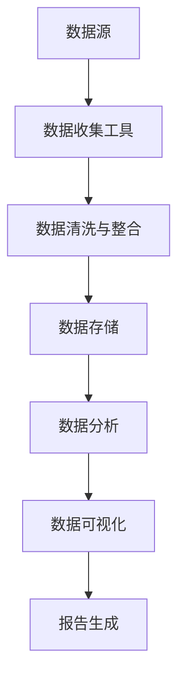
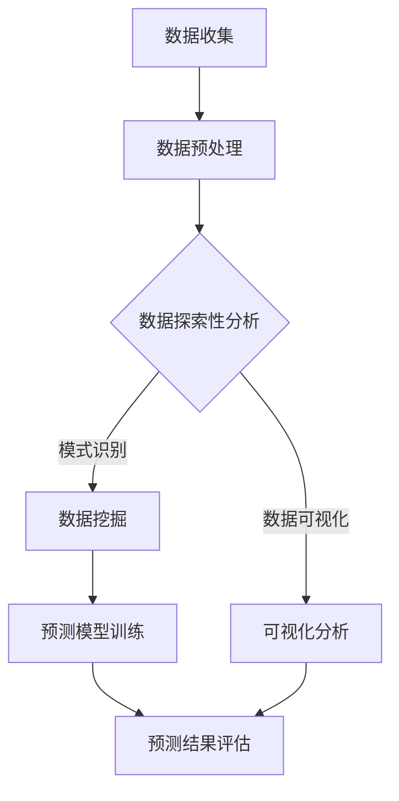

                 

### 文章标题

> 关键词：DMP、数据基础设施、数据分析、数据洞察、数据质量、数据安全

> 摘要：
本文深入探讨了AI驱动的数据管理平台（DMP）在构建现代数据分析与洞察体系中的关键作用。首先，我们介绍了DMP的基础概念和重要性，并通过对比分析其他数据管理技术，明确了DMP的独特优势。接着，文章探讨了构建数据基础设施所面临的挑战与机遇，重点分析了数据质量、安全与治理问题。随后，我们详细讨论了数据收集与整合、数据存储与管理、数据分析与洞察的方法和技术，并提供了具体的案例与实践。最后，文章提出了数据基础设施优化与维护的策略，展望了未来的发展趋势。通过本文，读者将全面了解DMP在数据管理和决策支持中的重要作用，并掌握构建高效数据基础设施的方法。

### 《AI DMP 数据基建：数据分析与洞察》目录大纲

在本章节中，我们将为您详细列出《AI DMP 数据基建：数据分析与洞察》全文的目录结构，帮助您更好地把握文章的框架和内容分布。

#### 第一部分：数据基础设施概述

- **第1章：DMP与数据基础设施的基本概念**
  - **1.1 DMP概述**
    - DMP的定义
    - DMP的重要性
    - DMP与其他数据管理技术的对比
  - **1.2 数据基础设施的概念与构成**
    - 数据基础设施的定义
    - 数据基础设施的核心要素
    - 数据基础设施的重要性

- **第2章：构建数据基础设施的挑战与机遇**
  - **2.1 构建数据基础设施的挑战**
    - 数据质量问题
    - 数据安全与隐私问题
    - 数据治理问题
    - 技术复杂性
  - **2.2 数据基础设施的机遇**
    - 提高数据分析效率
    - 支持业务决策
    - 数据资产价值的最大化

#### 第二部分：数据收集与整合

- **第3章：数据收集策略与方法**
  - **3.1 数据来源**
    - 客户行为数据
    - 第三方数据
    - 内部数据源
  - **3.2 数据收集方法**
    - Web跟踪
    - 数据交换
    - API调用
  - **3.3 数据整合策略**
    - 数据清洗与预处理
    - 数据标准化与规范化
    - 数据融合与合并

- **第4章：数据存储与管理**
  - **4.1 数据存储技术**
    - 数据库技术
    - 数据仓库技术
    - NoSQL数据库
  - **4.2 数据管理方法**
    - 数据库设计
    - 数据库维护
    - 数据备份与恢复
  - **4.3 数据存储与访问策略**
    - 分布式存储
    - 云存储
    - 数据访问控制

#### 第三部分：数据分析与洞察

- **第5章：数据分析基础**
  - **5.1 数据分析概述**
    - 数据分析的定义与目标
    - 数据分析的主要任务
    - 数据分析的过程
  - **5.2 数据预处理**
    - 数据清洗
    - 数据转换
    - 数据集成

- **第6章：数据挖掘技术**
  - **6.1 数据挖掘的基本概念**
    - 数据挖掘的定义
    - 数据挖掘的过程
    - 数据挖掘的主要方法
  - **6.2 常见的数据挖掘算法**
    - 聚类算法
    - 分类算法
    - 关联规则挖掘

- **第7章：数据分析工具与应用**
  - **7.1 数据分析工具**
    - SQL查询工具
    - 数据可视化工具
    - 大数据计算框架
  - **7.2 数据分析应用案例**
    - 社交网络分析
    - 零售业数据分析
    - 营销效果评估

- **第8章：数据洞察与决策支持**
  - **8.1 数据洞察的概念**
    - 数据洞察的定义
    - 数据洞察的价值
  - **8.2 数据驱动决策**
    - 数据驱动的决策过程
    - 数据驱动的决策优势
    - 数据驱动的挑战

#### 第四部分：数据基础设施优化与维护

- **第9章：数据质量监控与改进**
  - **9.1 数据质量监控**
    - 数据质量监控的方法
    - 数据质量指标
  - **9.2 数据质量改进**
    - 数据清洗技术
    - 数据质量优化策略

- **第10章：数据安全与隐私保护**
  - **10.1 数据安全威胁**
    - 数据泄露
    - 数据篡改
    - 数据滥用
  - **10.2 数据隐私保护**
    - 隐私保护法律法规
    - 数据加密技术
    - 数据匿名化

- **第11章：数据基础设施的持续优化与升级**
  - **11.1 数据基础设施的评估**
    - 数据基础设施的健康状况评估
    - 数据基础设施的性能评估
  - **11.2 数据基础设施的升级与扩展**
    - 技术升级策略
    - 数据架构的扩展性设计

- **第12章：数据基础设施的未来趋势**
  - **12.1 数据基础设施的挑战**
    - 大数据量的管理
    - 数据多样化的挑战
  - **12.2 数据基础设施的未来方向**
    - AI在数据基础设施中的应用
    - 数据治理与数据伦理

#### 附录

- **附录 A：DMP相关资源与工具**
  - **A.1 资源**
    - DMP相关书籍推荐
    - DMP在线课程与讲座
  - **A.2 工具**
    - DMP平台介绍
    - 数据分析工具推荐
    - 数据可视化工具推荐

- **附录 B：Mermaid流程图示例**
  - **B.1 数据收集流程**
  - **B.2 数据分析流程**

- **附录 C：数据挖掘算法伪代码示例**
  - **C.1 K-Means聚类算法伪代码**
  - **C.2 决策树分类算法伪代码**
  - **C.3 Apriori算法伪代码**

- **附录 D：数学模型和数学公式**
  - **D.1 数据质量评价指标公式**
  - **D.2 数据密度函数公式**
  - **D.3 数据分布模型公式**

- **附录 E：代码实际案例**
  - **E.1 数据收集与清洗的Python代码案例**
  - **E.2 数据挖掘与分析的Python代码案例**
  - **E.3 数据可视化的Python代码案例**

通过上述目录结构，您将能够系统地了解DMP在数据分析与洞察中的重要作用，掌握构建和优化数据基础设施的关键技术和方法。

### 第一部分：数据基础设施概述

#### 第1章：DMP与数据基础设施的基本概念

##### 1.1 DMP概述

**DMP的定义**

数据管理平台（Data Management Platform，简称DMP）是一种集成的技术解决方案，用于收集、存储、管理和分析多种来源的数据，以便为市场营销、客户关系管理和其他业务决策提供数据支持。DMP的核心功能是提供一个统一的数据管理平台，通过整合不同数据源，为用户提供数据洞察和决策支持。

**DMP的重要性**

在当今数字化时代，数据已经成为企业的核心竞争力。DMP的重要性体现在以下几个方面：

1. **整合多种数据源**：DMP能够整合来自不同渠道的数据，如网站访问日志、社交媒体数据、客户关系管理（CRM）系统等，为用户提供一个全面的数据视图。
2. **提高数据分析效率**：通过DMP，企业可以快速获取所需数据，并利用先进的分析工具进行数据挖掘和预测分析，从而提高数据分析效率。
3. **支持精准营销**：DMP可以根据用户行为和偏好，为不同用户群体提供个性化的营销活动，从而提高营销效果和客户满意度。
4. **优化业务决策**：DMP提供的实时数据洞察和预测分析，有助于企业更好地了解市场动态和客户需求，从而做出更加科学的业务决策。

**DMP与其他数据管理技术的对比**

与传统的数据管理技术相比，DMP具有以下优势：

1. **整合能力**：DMP能够整合来自不同来源的数据，而传统的数据管理技术（如数据仓库）通常只能处理结构化数据。
2. **灵活性**：DMP支持多种数据格式，包括结构化、半结构化和非结构化数据，而传统的数据管理技术通常更适用于处理结构化数据。
3. **实时分析**：DMP支持实时数据分析和预测，而传统的数据管理技术（如数据仓库）通常需要较长时间进行数据加载和处理。
4. **个性化服务**：DMP可以根据用户行为和偏好提供个性化数据洞察和营销策略，而传统的数据管理技术无法实现这一点。

##### 1.2 数据基础设施的概念与构成

**数据基础设施的定义**

数据基础设施（Data Infrastructure）是指支持数据收集、存储、管理和分析的一整套技术和工具，包括硬件、软件、网络和人员等资源。数据基础设施是数据管理平台（DMP）运行的基础，其重要性不言而喻。

**数据基础设施的核心要素**

数据基础设施的核心要素包括：

1. **数据存储**：数据存储是数据基础设施的核心，负责存储各种类型的数据，包括结构化、半结构化和非结构化数据。常见的数据存储技术包括关系型数据库、非关系型数据库（如NoSQL数据库）、数据仓库等。
2. **数据处理**：数据处理是数据基础设施的重要组成部分，包括数据清洗、数据转换、数据集成和数据归档等。数据处理技术包括ETL（Extract, Transform, Load）工具、流处理框架（如Apache Kafka）等。
3. **数据安全**：数据安全是数据基础设施的重要保障，包括数据加密、访问控制、审计等。数据安全技术包括防火墙、入侵检测系统（IDS）、数据加密技术等。
4. **数据分析**：数据分析是数据基础设施的最终目标，通过数据挖掘、机器学习等技术，从大量数据中提取有价值的信息。数据分析工具包括SQL查询工具、数据可视化工具、大数据计算框架等。

**数据基础设施的重要性**

数据基础设施的重要性体现在以下几个方面：

1. **支持业务决策**：数据基础设施为企业的业务决策提供实时、准确的数据支持，有助于企业更好地了解市场动态和客户需求。
2. **提高运营效率**：通过数据基础设施，企业可以自动化地收集、存储和管理数据，从而提高运营效率，降低人力成本。
3. **优化客户体验**：数据基础设施可以帮助企业更好地了解客户行为和偏好，从而提供个性化的产品和服务，提高客户满意度。
4. **确保数据安全**：数据基础设施提供了全面的数据安全解决方案，确保企业数据的安全和隐私。

通过本章节的介绍，您对DMP和数据基础设施的基本概念有了更深入的了解。在接下来的章节中，我们将继续探讨构建数据基础设施所面临的挑战与机遇，以及数据收集、整合、存储和管理的方法与策略。

### 第一部分：数据基础设施概述

#### 第2章：构建数据基础设施的挑战与机遇

##### 2.1 构建数据基础设施的挑战

构建数据基础设施是一项复杂而艰巨的任务，涉及多个方面的问题。以下将详细讨论构建数据基础设施过程中所面临的几种主要挑战：

**数据质量问题**

数据质量是数据基础设施的核心问题之一。高质量的数据对于数据分析、数据挖掘和决策支持至关重要。然而，在实际应用中，数据质量问题常常导致数据分析结果不准确，甚至完全误导。数据质量问题主要包括以下方面：

1. **数据缺失**：数据缺失是指数据集中存在空值或缺失的数据。数据缺失会影响数据分析的准确性，尤其是在使用统计分析方法时。
2. **数据重复**：数据重复是指数据集中存在重复的数据条目。数据重复不仅会增加数据处理的复杂度，还会导致数据分析结果失真。
3. **数据不一致**：数据不一致是指同一数据在不同来源或不同系统中存在差异。数据不一致会导致数据分析结果不准确，甚至产生误导性的结论。
4. **数据准确性**：数据准确性是指数据的真实性和可靠性。不准确的数据会影响数据分析的准确性和可靠性，从而影响决策支持的效果。

**数据安全与隐私问题**

数据安全和隐私保护是构建数据基础设施过程中不可忽视的重要问题。随着数据量的急剧增加，数据泄露、数据篡改和数据滥用等安全威胁日益严重。以下是一些常见的数据安全与隐私问题：

1. **数据泄露**：数据泄露是指未经授权的第三方获取和访问企业敏感数据。数据泄露可能导致严重的财务损失和声誉损害。
2. **数据篡改**：数据篡改是指恶意用户对数据内容进行篡改，从而误导数据分析结果和业务决策。
3. **数据滥用**：数据滥用是指未经授权的用户或系统使用企业数据用于非法目的，如盗取客户信息、商业机密等。

**数据治理问题**

数据治理是指确保数据质量、数据安全、数据隐私和数据合规性的一系列政策和流程。良好的数据治理是构建高效数据基础设施的关键。然而，在实际应用中，数据治理面临以下问题：

1. **数据标准化**：数据标准化是指将不同来源和格式的数据转换为统一的格式和标准。数据标准化有助于提高数据质量和数据分析效率，但实现起来较为复杂。
2. **数据隐私保护**：数据隐私保护是指确保企业数据在收集、存储、处理和使用过程中符合相关法律法规，如《通用数据保护条例》（GDPR）等。数据隐私保护需要制定和实施严格的数据保护政策。
3. **数据合规性**：数据合规性是指确保企业数据管理活动符合相关法规和标准，如《云计算服务合规性指南》等。数据合规性有助于降低法律风险，提高企业的信誉和竞争力。

**技术复杂性**

构建数据基础设施涉及多种技术，如数据库、数据仓库、数据存储、数据处理、数据分析和数据可视化等。这些技术之间存在复杂的交互和依赖关系，导致以下问题：

1. **技术选择**：选择合适的技术栈对于构建高效的数据基础设施至关重要。然而，市场上的技术种类繁多，选择合适的工具和平台是一项具有挑战性的任务。
2. **技术集成**：将各种技术集成到一个统一的架构中，确保数据流和数据处理的连续性和高效性，是一项复杂的任务。
3. **技术升级**：随着技术的不断进步和业务需求的变化，数据基础设施需要不断进行升级和扩展。技术升级可能涉及复杂的迁移和集成工作，需要充分考虑成本和风险。

##### 2.2 数据基础设施的机遇

尽管构建数据基础设施面临诸多挑战，但数据基础设施的构建也为企业带来了诸多机遇：

**提高数据分析效率**

随着数据基础设施的不断完善，企业可以更快速、更高效地获取和处理大量数据。这有助于企业实时分析市场动态和客户需求，从而做出更加科学的业务决策。高效的数据分析有助于提高企业的运营效率和市场竞争力。

**支持业务决策**

数据基础设施提供的实时数据洞察和预测分析，有助于企业更好地了解市场动态和客户需求，从而支持业务决策。通过数据驱动的决策过程，企业可以降低决策风险，提高决策质量。

**数据资产价值的最大化**

数据是现代企业的核心竞争力之一。通过构建完善的数据基础设施，企业可以更好地管理和利用数据资产，从而实现数据资产价值的最大化。数据资产价值的最大化有助于企业实现可持续发展。

**支持个性化服务**

数据基础设施为个性化服务提供了数据支持。通过分析客户行为和偏好，企业可以为客户提供个性化的产品和服务，从而提高客户满意度和忠诚度。

通过本章节的讨论，我们可以看到，构建数据基础设施虽然面临诸多挑战，但同时也带来了巨大的机遇。在接下来的章节中，我们将继续探讨数据基础设施的具体构建方法和技术，帮助企业克服挑战，充分利用数据基础设施的机遇。

### 第二部分：数据收集与整合

#### 第3章：数据收集策略与方法

##### 3.1 数据来源

数据收集是构建数据基础设施的第一步，选择合适的来源至关重要。以下是一些常见的数据来源：

**客户行为数据**

客户行为数据是指通过客户在网站、APP或其他数字渠道上的操作产生的数据，如浏览历史、搜索记录、购买行为等。这些数据有助于了解客户的需求和偏好，从而进行精准营销和个性化服务。

**第三方数据**

第三方数据是指来自外部数据源的数据，如社交媒体、公共数据库、合作伙伴等。这些数据可以提供补充信息，帮助更全面地了解客户和市场动态。

**内部数据源**

内部数据源是指企业内部生成的数据，如CRM系统、ERP系统、内部报告等。这些数据有助于企业了解内部运营状况，优化业务流程。

##### 3.2 数据收集方法

数据收集方法主要包括以下几种：

**Web跟踪**

Web跟踪是通过跟踪用户在网站上的行为，收集用户行为数据的方法。常用的Web跟踪技术包括：

1. **Web日志分析**：Web日志分析是一种记录用户访问网站时产生的数据的方法。这些日志文件包含了用户的访问时间、访问页面、访问次数等信息。
2. **Cookie跟踪**：Cookie是一种存储在用户计算机上的小文件，用于记录用户的浏览历史和偏好。通过分析Cookie，可以了解用户的访问习惯和需求。

**数据交换**

数据交换是指通过交换协议和接口，将不同系统之间的数据进行共享和整合的方法。常用的数据交换技术包括：

1. **API调用**：API（应用程序接口）是一种允许不同系统之间进行通信和交互的接口。通过调用API，可以从外部系统获取所需数据。
2. **数据交换格式**：数据交换格式是一种用于描述数据结构和数据内容的标准，如JSON、XML等。使用标准的数据交换格式，可以确保数据在不同系统之间的兼容性和可解析性。

**数据采集工具**

数据采集工具是指用于自动收集和处理数据的软件或服务。常用的数据采集工具包括：

1. **爬虫**：爬虫是一种用于自动抓取网站内容的数据采集工具。通过爬虫，可以获取大量的网站数据，如文章、图片、评论等。
2. **数据导入工具**：数据导入工具是一种用于将数据从一种格式转换成另一种格式，或将数据导入数据库的工具。常用的数据导入工具包括ETL（Extract, Transform, Load）工具、数据转换工具等。

##### 3.3 数据整合策略

数据整合是将来自不同来源和格式的数据进行清洗、转换和合并的过程。以下是一些常用的数据整合策略：

**数据清洗与预处理**

数据清洗与预处理是指对原始数据进行清洗和转换，使其符合分析需求。常用的数据清洗与预处理方法包括：

1. **数据去重**：数据去重是指删除重复的数据记录，以避免数据冗余和分析错误。
2. **数据格式转换**：数据格式转换是指将不同格式的数据转换为统一的格式，如将CSV文件转换为JSON格式。
3. **缺失值处理**：缺失值处理是指对缺失的数据进行处理，如使用平均值、中位数或插值法进行填充。

**数据标准化与规范化**

数据标准化与规范化是指对数据进行统一处理，使其符合特定的标准和规范。常用的数据标准化与规范化方法包括：

1. **字段命名规范**：对数据表中的字段进行统一的命名规范，如使用驼峰命名法或下划线命名法。
2. **数据类型转换**：将不同数据类型的字段转换为统一的数据类型，如将字符串转换为数字类型。
3. **数据范围限制**：对数据的取值范围进行限制，如限制年龄在0-100之间。

**数据融合与合并**

数据融合与合并是指将多个数据集合并为一个完整的数据集，以提供更全面的分析视角。常用的数据融合与合并方法包括：

1. **垂直合并**：垂直合并是指将多个数据表的字段合并为一个数据表，如将客户数据表、订单数据表和销售数据表合并为一个综合数据表。
2. **水平合并**：水平合并是指将多个数据表的记录合并为一个数据表，如将不同时间点的客户数据合并为一个完整的数据集。
3. **多表连接**：多表连接是指将多个数据表通过共同的字段进行连接，以构建一个更全面的数据集。

通过以上数据整合策略，企业可以构建一个统一、完整和高质量的数据集，为后续的数据分析、数据挖掘和决策支持提供坚实基础。

#### 第4章：数据存储与管理

##### 4.1 数据存储技术

数据存储是构建数据基础设施的核心组成部分，选择合适的数据存储技术对于确保数据的高效存储、访问和管理至关重要。以下将介绍几种常见的数据存储技术：

**数据库技术**

数据库技术是一种用于存储、管理和访问结构化数据的系统。关系型数据库（如MySQL、PostgreSQL）是其中的一种主要类型，它使用SQL（结构化查询语言）进行数据操作。关系型数据库适用于处理事务性数据，如用户信息、订单记录等。

**数据仓库技术**

数据仓库是一种用于存储大量历史数据的系统，主要用于支持企业级的数据分析和报告。数据仓库通常使用多维数据模型，支持复杂的数据查询和分析。常用的数据仓库技术包括Oracle Exadata、Amazon Redshift等。

**NoSQL数据库**

NoSQL数据库是一种用于存储半结构化、非结构化数据的系统，它不使用传统的SQL查询语言，而是采用键值存储、文档存储、列存储等模型。NoSQL数据库适用于处理大量、高并发的数据，如用户行为数据、社交媒体数据等。常见的NoSQL数据库包括MongoDB、Cassandra、Redis等。

##### 4.2 数据管理方法

数据管理是确保数据质量、数据安全、数据合规性和数据可用性的关键过程。以下将介绍几种常见的数据管理方法：

**数据库设计**

数据库设计是创建一个结构化数据模型的过程，用于组织、存储和访问数据。常用的数据库设计方法包括实体关系模型（ER模型）、用户关系模型（UML）等。数据库设计应考虑数据的一致性、完整性和灵活性。

**数据库维护**

数据库维护包括数据备份、数据恢复、性能优化等。数据备份是确保数据安全的重要措施，常用的备份方法包括全备份、增量备份和差异备份。数据恢复是在数据丢失或损坏时恢复数据的过程。性能优化是提高数据库查询效率的重要手段，常用的优化方法包括索引、查询缓存、分区等。

**数据备份与恢复**

数据备份是指将数据复制到另一个存储位置，以防止数据丢失或损坏。数据恢复是在数据丢失或损坏时，从备份中恢复数据的过程。常用的备份策略包括定期备份、增量备份和灾难恢复。

**数据访问控制**

数据访问控制是确保只有授权用户可以访问特定数据的过程。数据访问控制包括用户身份验证、权限管理、审计等。常用的数据访问控制方法包括基于角色的访问控制（RBAC）、基于属性的访问控制（ABAC）等。

##### 4.3 数据存储与访问策略

数据存储与访问策略是确保数据存储安全、高效和可扩展的重要措施。以下将介绍几种常见的数据存储与访问策略：

**分布式存储**

分布式存储是将数据分散存储在多个节点上的方法，以提高数据存储的可靠性和扩展性。常见的分布式存储技术包括Hadoop HDFS、Cassandra等。

**云存储**

云存储是将数据存储在云服务提供商的数据中心中，以实现高效的数据访问和管理。常见的云存储服务包括Amazon S3、Google Cloud Storage、Azure Blob Storage等。

**数据访问控制**

数据访问控制是确保只有授权用户可以访问特定数据的过程。数据访问控制包括用户身份验证、权限管理、审计等。常用的数据访问控制方法包括基于角色的访问控制（RBAC）、基于属性的访问控制（ABAC）等。

通过以上数据存储与访问策略，企业可以构建一个高效、可靠和可扩展的数据基础设施，为数据分析、数据挖掘和业务决策提供支持。

### 第三部分：数据分析与洞察

#### 第5章：数据分析基础

##### 5.1 数据分析概述

数据分析（Data Analysis）是一种通过统计和定量方法，从大量数据中提取有价值信息的过程。数据分析的目标是帮助企业和组织更好地理解数据，发现数据中的模式、趋势和关联，从而支持决策和优化业务流程。以下是数据分析的定义、主要任务和过程：

**数据分析的定义**

数据分析是指运用统计方法、数据挖掘技术和可视化工具，对大量数据进行处理、分析和解释，以发现数据中的有价值信息的过程。

**数据分析的主要任务**

1. **数据预处理**：数据预处理是数据分析的基础步骤，包括数据清洗、数据转换和数据集成。数据清洗是指去除数据中的错误、异常和重复值，提高数据质量。数据转换是指将数据转换为适合分析的形式，如数值化、归一化等。数据集成是指将多个数据源的数据合并为一个统一的数据集。

2. **探索性数据分析**：探索性数据分析（Exploratory Data Analysis，EDA）是一种通过图表和统计方法，对数据进行初步分析和探索的方法。EDA的目标是发现数据中的模式、趋势和异常，为进一步的数据分析和挖掘提供线索。

3. **预测性分析**：预测性分析（Predictive Analysis）是利用历史数据和统计方法，预测未来可能发生的事件或趋势。预测性分析可以帮助企业做出更科学的决策，降低风险。

4. **描述性分析**：描述性分析（Descriptive Analysis）是通过对数据进行统计和可视化，描述数据的基本特征和规律。描述性分析通常用于业务报告、市场研究等。

**数据分析的过程**

1. **问题定义**：明确数据分析的目标和问题，确定数据需求的范围和类型。

2. **数据收集**：收集所需的数据，确保数据的质量和完整性。

3. **数据预处理**：对数据进行清洗、转换和集成，为后续分析做好准备。

4. **探索性数据分析**：对数据进行分析，发现数据中的模式和趋势。

5. **数据建模**：选择合适的模型，对数据进行建模和预测。

6. **结果解释**：对分析结果进行解释和验证，确保结果的可靠性和有效性。

7. **决策支持**：将分析结果应用于实际问题，支持决策和业务优化。

##### 5.2 数据预处理

数据预处理是数据分析的重要环节，其目的是提高数据质量，为后续的数据分析和挖掘奠定基础。以下是数据预处理的主要任务：

**数据清洗**

数据清洗是指去除数据中的错误、异常和重复值，提高数据质量的过程。常见的数据清洗任务包括：

1. **缺失值处理**：缺失值处理是指对缺失的数据进行填补或删除。常用的缺失值处理方法包括平均值填补、中位数填补、插值法等。

2. **异常值处理**：异常值处理是指识别和去除数据中的异常值。异常值可能来源于数据采集、传输或存储过程中出现的问题。常见的异常值处理方法包括统计方法（如标准差法、箱线图法）和机器学习方法（如孤立森林算法）。

3. **重复值处理**：重复值处理是指删除数据集中的重复记录。重复值可能导致数据分析结果不准确，甚至误导决策。

**数据转换**

数据转换是指将数据从一种形式转换为另一种形式，以适应分析需求。常见的数据转换任务包括：

1. **数值化**：数值化是指将分类数据转换为数值型数据。常用的数值化方法包括独热编码（One-Hot Encoding）、标签编码（Label Encoding）等。

2. **归一化**：归一化是指将数据缩放到一个固定的范围，如[0, 1]或[-1, 1]。归一化有助于缓解不同特征之间的差异，提高模型性能。

3. **标准化**：标准化是指将数据缩放到一个标准化的形式，如均值为0，标准差为1。标准化有助于消除不同特征之间的量纲差异，提高模型的泛化能力。

**数据集成**

数据集成是指将来自不同数据源的数据合并为一个统一的数据集。常见的数据集成任务包括：

1. **数据合并**：数据合并是指将多个数据表通过共同的字段进行合并。数据合并可以使用SQL查询、Pandas库等工具实现。

2. **数据融合**：数据融合是指将多个数据集合并为一个更完整、更全面的数据集。数据融合可以通过数据清洗、数据转换和数据合并等步骤实现。

3. **数据抽样**：数据抽样是指从大量数据中抽取一部分样本进行数据分析。数据抽样有助于降低数据分析的成本和时间。

通过以上数据预处理步骤，企业可以构建一个高质量、统一和结构化的数据集，为后续的数据分析和挖掘提供坚实基础。

### 第三部分：数据分析与洞察

#### 第6章：数据挖掘技术

##### 6.1 数据挖掘的基本概念

数据挖掘（Data Mining）是指从大量数据中自动发现有价值信息的过程，是数据分析的进一步深化和应用。数据挖掘的目标是通过揭示数据中的隐含模式、关联和趋势，帮助企业和组织做出更科学的决策。

**数据挖掘的定义**

数据挖掘是指利用机器学习、统计学和人工智能技术，从大量数据中提取有价值信息的过程。数据挖掘的过程通常包括数据预处理、模式识别、模式分析和结果可视化等步骤。

**数据挖掘的过程**

1. **问题定义**：明确数据挖掘的目标和问题，确定所需分析的数据集。

2. **数据理解**：通过数据探索性分析（EDA），了解数据的基本特征、分布和关系。

3. **数据预处理**：对数据进行清洗、转换和集成，为数据挖掘做准备。

4. **模型选择**：选择合适的数据挖掘算法和模型，对数据进行建模。

5. **模型训练**：使用训练数据集对模型进行训练，调整参数，优化模型性能。

6. **模型评估**：使用测试数据集对模型进行评估，验证模型的有效性和泛化能力。

7. **结果解释**：对挖掘结果进行解释和可视化，为决策提供支持。

8. **部署与应用**：将数据挖掘模型部署到生产环境中，为实际业务应用提供支持。

**数据挖掘的主要方法**

数据挖掘的方法包括监督学习、无监督学习和半监督学习等。以下是几种常见的数据挖掘方法：

1. **监督学习**

监督学习是指使用已标记的数据集对模型进行训练，使模型能够预测新数据的标签。监督学习的主要方法包括：

   - **回归分析**：回归分析是一种用于预测数值型目标变量的方法，如预测销售额。
   - **分类分析**：分类分析是一种用于预测类别型目标变量的方法，如预测客户流失。
   - **逻辑回归**：逻辑回归是一种广义线性模型，用于预测二分类或多分类目标变量。

2. **无监督学习**

无监督学习是指在没有标记数据的情况下，通过发现数据中的内在结构和模式，对数据进行聚类和降维。无监督学习的主要方法包括：

   - **聚类分析**：聚类分析是一种将数据分为多个类别的无监督学习方法，如K-Means聚类、层次聚类等。
   - **降维技术**：降维技术是一种减少数据维度，同时保留重要信息的方法，如主成分分析（PCA）、t-SNE等。
   - **关联规则挖掘**：关联规则挖掘是一种发现数据中隐含关联关系的方法，如Apriori算法、FP-Growth算法等。

3. **半监督学习**

半监督学习是指使用部分标记的数据集和大量未标记的数据集对模型进行训练。半监督学习的主要方法包括：

   - **自编码器**：自编码器是一种基于神经网络的自监督学习方法，可以用于特征提取和降维。
   - **图神经网络**：图神经网络是一种基于图结构的半监督学习方法，可以用于节点分类和图嵌入。

通过以上数据挖掘方法，企业可以深入挖掘数据中的价值信息，为业务决策和优化提供有力支持。

##### 6.2 常见的数据挖掘算法

在数据挖掘过程中，选择合适的算法对数据进行分析和挖掘至关重要。以下将介绍几种常见的数据挖掘算法，包括聚类算法、分类算法和关联规则挖掘算法，并简要说明其原理和应用场景。

**聚类算法**

聚类算法是一种无监督学习方法，用于将数据集划分为多个类或簇，使同一簇内的数据点具有较高的相似度，不同簇之间的数据点具有较低的相似度。常见的聚类算法包括K-Means聚类、层次聚类和DBSCAN算法。

1. **K-Means聚类**

K-Means聚类是一种基于距离度量的聚类算法，其基本思想是将数据集划分为K个簇，使得每个簇的质心（数据点的平均值）与簇内数据点的距离之和最小。K-Means聚类算法的步骤如下：

   - 初始化K个簇的中心点。
   - 对每个数据点，将其分配到最近的簇中心点。
   - 更新每个簇的中心点。
   - 重复上述步骤，直到簇中心点不再发生显著变化。

K-Means聚类算法适用于高维数据的聚类，但在处理噪声数据和不均匀分布的数据时效果较差。

2. **层次聚类**

层次聚类是一种基于层次结构进行数据聚类的算法，分为自底向上和自顶向下两种方法。层次聚类的基本思想是将数据集逐步划分为更小的簇，直至每个数据点都是一个簇。层次聚类的步骤如下：

   - 将每个数据点视为一个初始簇。
   - 计算相邻簇之间的距离，选择距离最近的两个簇进行合并。
   - 重复上述步骤，直到所有数据点合并为一个簇。

层次聚类算法适用于各种类型的数据集，但计算复杂度较高。

3. **DBSCAN算法**

DBSCAN（Density-Based Spatial Clustering of Applications with Noise）是一种基于密度的聚类算法，其基本思想是基于数据点的密度和邻域距离进行聚类。DBSCAN算法的步骤如下：

   - 初始化两个参数：邻域半径`eps`和最小密度`minPts`。
   - 对每个未标记的数据点，计算其邻域内的数据点数量，若大于`minPts`，则将该数据点及其邻域内的数据点标记为同一簇。
   - 对于剩余的未标记数据点，若其邻域内的数据点数量小于`minPts`，则将其标记为噪声点。

DBSCAN算法适用于处理高维度和噪声数据，但参数选择对聚类结果有较大影响。

**分类算法**

分类算法是一种监督学习方法，用于将数据集划分为预定义的类别。常见的分类算法包括决策树、随机森林、支持向量机和神经网络。

1. **决策树**

决策树是一种基于树结构的分类算法，其基本思想是通过一系列if-else规则对数据进行划分，直到达到预设的停止条件。决策树的步骤如下：

   - 选择最优特征进行划分。
   - 划分数据集为两个子集。
   - 递归地对子集进行划分，直到满足停止条件（如节点包含的数据点个数少于阈值）。

决策树算法简单直观，易于解释，但可能产生过拟合现象。

2. **随机森林**

随机森林是一种基于决策树的集成学习方法，其基本思想是将多个决策树组合起来，通过投票或求均值得到最终分类结果。随机森林的步骤如下：

   - 生成多个随机特征子集。
   - 对每个子集训练一个决策树。
   - 对测试数据进行预测，统计每个决策树的分类结果。

随机森林算法具有较高的准确性和鲁棒性，可以处理高维度和复杂数据。

3. **支持向量机**

支持向量机（Support Vector Machine，SVM）是一种基于间隔最大化的分类算法，其基本思想是找到一个最佳超平面，使得分类边界到各个类别的最近点的距离最大。SVM的步骤如下：

   - 使用优化方法（如线性规划）求解最优超平面。
   - 对测试数据进行分类。

SVM算法适用于处理线性可分的数据，但在处理非线性数据时，可以通过核函数进行扩展。

4. **神经网络**

神经网络是一种基于人工神经网络的分类算法，其基本思想是通过多层神经元之间的相互连接和激活函数，对数据进行分类。常见的神经网络包括前馈神经网络、卷积神经网络（CNN）和循环神经网络（RNN）。

前馈神经网络是一种前向传播和反向传播的神经网络，适用于处理线性或非线性分类问题。卷积神经网络通过卷积层提取图像特征，适用于图像分类任务。循环神经网络通过循环连接和记忆单元，处理序列数据，适用于语音识别、自然语言处理等任务。

**关联规则挖掘算法**

关联规则挖掘是一种发现数据中隐含关联关系的方法，其基本思想是通过频繁项集和支持度来挖掘关联规则。常见的关联规则挖掘算法包括Apriori算法和FP-Growth算法。

1. **Apriori算法**

Apriori算法是一种基于频繁项集的关联规则挖掘算法，其基本思想是首先找出所有频繁项集，然后生成关联规则。Apriori算法的步骤如下：

   - 计算每个项集的支持度。
   - 筛选出频繁项集。
   - 生成关联规则，并计算置信度。

Apriori算法适用于处理中小规模的数据集，但在处理大规模数据集时效率较低。

2. **FP-Growth算法**

FP-Growth算法是一种基于频繁模式树（FP-Tree）的关联规则挖掘算法，其基本思想是利用树结构减少计算量，提高算法效率。FP-Growth算法的步骤如下：

   - 构建FP-Tree，将频繁项集压缩为路径。
   - 递归挖掘FP-Tree，生成频繁项集。
   - 生成关联规则，并计算置信度。

FP-Growth算法适用于处理大规模数据集，但需要较大的内存空间。

通过以上常见的数据挖掘算法，企业可以深入挖掘数据中的价值信息，为业务决策和优化提供有力支持。

### 第三部分：数据分析与洞察

#### 第7章：数据分析工具与应用

##### 7.1 数据分析工具

数据分析工具是进行数据分析和挖掘的重要手段，它们可以帮助用户高效地处理和分析数据，提取有价值的信息。以下是几种常用的数据分析工具：

**SQL查询工具**

SQL（结构化查询语言）是用于处理关系型数据库的标准查询语言。常见的SQL查询工具包括：

- **MySQL Workbench**：MySQL Workbench是一款强大的数据库管理和查询工具，适用于开发人员和数据分析师。
- **pgAdmin**：pgAdmin是一款适用于PostgreSQL数据库的图形化管理工具，提供了丰富的SQL查询功能。
- **SQL Server Management Studio (SSMS)**：SQL Server Management Studio是Microsoft SQL Server的官方查询和管理工具，适用于数据分析师和数据库管理员。

**数据可视化工具**

数据可视化工具可以将数据以图形化的方式呈现，帮助用户更好地理解和分析数据。常见的数据可视化工具有：

- **Tableau**：Tableau是一款功能强大的数据可视化工具，支持多种数据连接和图表类型，适用于数据分析师和业务用户。
- **Power BI**：Power BI是Microsoft推出的企业级数据可视化平台，提供了丰富的可视化图表和报表功能。
- **QlikView**：QlikView是一款灵活的数据可视化工具，支持实时数据分析和探索性数据分析。
- **D3.js**：D3.js是一款基于JavaScript的库，用于创建动态的、交互式的数据可视化图表，适用于前端开发和数据分析师。

**大数据计算框架**

大数据计算框架是用于处理大规模数据集的计算平台，常见的计算框架包括：

- **Apache Hadoop**：Hadoop是一款开源的大数据处理框架，支持分布式存储（HDFS）和分布式计算（MapReduce）。
- **Apache Spark**：Spark是一款高性能的分布式计算框架，支持多种数据处理和分析任务，包括批处理、流处理和机器学习。
- **Apache Flink**：Flink是一款流处理和批处理相结合的分布式计算框架，适用于实时数据处理和复杂事件处理。
- **Apache Hive**：Hive是一款基于Hadoop的数据仓库工具，用于大规模数据集的查询和分析。

**机器学习平台**

机器学习平台是用于构建、训练和部署机器学习模型的工具，常见的机器学习平台包括：

- **TensorFlow**：TensorFlow是Google开源的机器学习框架，适用于构建和训练各种机器学习模型。
- **PyTorch**：PyTorch是Facebook开源的机器学习框架，支持动态计算图和灵活的模型定义。
- **Scikit-learn**：Scikit-learn是一款开源的机器学习库，提供了多种常用的机器学习算法和工具。
- **Keras**：Keras是一款基于TensorFlow和Theano的简洁的神经网络库，适用于快速构建和实验机器学习模型。

通过以上数据分析工具，企业可以高效地处理和分析数据，提取有价值的信息，为业务决策和优化提供有力支持。

##### 7.2 数据分析应用案例

数据分析在各个领域都有广泛的应用，以下将介绍几个典型的数据分析应用案例，展示数据分析在实际业务中的价值。

**社交网络分析**

社交网络分析（Social Network Analysis，SNA）是一种用于研究社交网络结构和动态的量化方法。通过分析社交网络中的节点（用户）和边（关系），可以揭示社交网络的特性、传播机制和影响力。以下是社交网络分析的几个应用案例：

1. **市场营销**：企业可以通过社交网络分析，了解用户的社交行为和偏好，从而制定更精准的营销策略。例如，分析用户的关注关系，识别潜在的客户群体，制定定向广告投放策略。
2. **危机管理**：企业可以利用社交网络分析，及时发现和处理潜在的危机事件。例如，监测社交媒体上的负面评论和讨论，了解公众对产品的态度和意见，及时采取应对措施。
3. **网络营销**：社交网络分析可以帮助企业识别关键意见领袖（KOL）和品牌大使，通过与这些用户合作，提高品牌的影响力和用户粘性。

**零售业数据分析**

零售业数据分析是提高零售业务效率、优化客户体验和提升销售额的重要手段。以下是零售业数据分析的几个应用案例：

1. **销售预测**：通过分析历史销售数据、季节性因素和市场需求，企业可以预测未来的销售趋势，制定合理的库存管理策略，降低库存成本和缺货风险。
2. **客户细分**：通过分析客户购买行为、消费习惯和偏好，企业可以将客户分为不同的细分群体，为每个群体提供个性化的产品和服务，提高客户满意度和忠诚度。
3. **定价策略**：通过分析产品价格、竞争对手价格和市场需求，企业可以制定合理的定价策略，提高销售额和利润率。

**营销效果评估**

营销效果评估是衡量营销活动效果的重要方法，通过分析营销活动的数据，企业可以评估营销投入的回报率，优化营销策略。以下是营销效果评估的几个应用案例：

1. **广告投放效果**：通过分析广告投放的数据，如点击率（CTR）、转化率（CVR）和投放成本（CPA），企业可以评估不同广告渠道和广告内容的投放效果，优化广告预算和投放策略。
2. **活动效果评估**：通过分析活动参与数据，如活动参与率、参与时长和参与互动，企业可以评估活动的吸引力和影响力，优化活动设计和推广策略。
3. **客户反馈分析**：通过分析客户反馈数据，如评论、评分和调查问卷，企业可以了解客户对产品和服务的满意度，识别问题和改进方向，提高客户满意度。

通过以上数据分析应用案例，我们可以看到数据分析在提高业务效率、优化决策和提升客户体验方面的巨大价值。企业应充分利用数据分析技术，挖掘数据中的价值信息，为业务发展和战略决策提供有力支持。

### 第三部分：数据分析与洞察

#### 第8章：数据洞察与决策支持

##### 8.1 数据洞察的概念

**数据洞察（Data Insight）** 是指通过分析数据，从大量信息中提取有价值的信息和洞见，以帮助企业和组织做出更明智的决策。数据洞察不仅仅是数据的简单统计或描述，而是通过深入挖掘数据中的模式和趋势，发现数据背后的故事和规律。

**数据洞察的价值**

数据洞察在企业运营和决策过程中具有以下几个方面的价值：

1. **提高决策质量**：通过数据洞察，企业可以更好地理解业务数据，识别潜在问题和机会，从而做出更科学、更准确的决策。
2. **优化业务流程**：数据洞察可以帮助企业识别业务流程中的瓶颈和效率低下环节，提出改进措施，优化业务流程，提高运营效率。
3. **提升客户体验**：通过分析客户数据，企业可以深入了解客户需求和行为，提供个性化的产品和服务，提升客户满意度和忠诚度。
4. **预测市场趋势**：数据洞察可以帮助企业预测市场趋势和消费者行为，制定有针对性的营销策略，抢占市场先机。

**数据洞察的类型**

数据洞察可以分为以下几种类型：

1. **描述性洞察**：描述性洞察是对当前业务状态和数据特征的总结，如销售额、客户分布、库存水平等。描述性洞察有助于企业了解当前的业务状况，为后续决策提供基础。
2. **诊断性洞察**：诊断性洞察是通过分析历史数据，识别业务问题及其原因。诊断性洞察有助于企业发现潜在的问题和风险，为问题解决提供方向。
3. **预测性洞察**：预测性洞察是通过分析历史数据和当前数据，预测未来的趋势和结果。预测性洞察有助于企业制定前瞻性策略，提前布局和应对市场变化。
4. **规范性洞察**：规范性洞察是根据业务目标和数据，提出改进建议和最佳实践。规范性洞察有助于企业优化业务流程，提高运营效率。

##### 8.2 数据驱动决策

**数据驱动决策（Data-Driven Decision-Making）** 是一种基于数据分析的决策过程，通过收集、处理和分析数据，为决策提供依据。数据驱动决策与传统的经验决策相比，具有以下优势：

1. **更科学的决策**：数据驱动决策基于事实和数据，减少了决策的主观性和偏见，提高了决策的科学性和准确性。
2. **更高效的决策**：通过自动化数据处理和分析，数据驱动决策可以快速提取有价值的信息，缩短决策时间，提高决策效率。
3. **更好的决策效果**：数据驱动决策有助于企业识别潜在问题和机会，制定更加合理和有效的决策，提高业务绩效。

**数据驱动的决策过程**

数据驱动的决策过程通常包括以下几个步骤：

1. **问题定义**：明确决策的目标和问题，确定所需分析的数据范围和类型。
2. **数据收集**：收集所需的数据，确保数据的质量和完整性。
3. **数据预处理**：对数据进行清洗、转换和集成，为后续分析做好准备。
4. **数据探索**：通过探索性数据分析（EDA），发现数据中的模式、趋势和异常，为进一步的分析提供线索。
5. **数据建模**：选择合适的模型，对数据进行建模和预测。
6. **模型评估**：使用测试数据集对模型进行评估，验证模型的可靠性和有效性。
7. **结果解释**：对分析结果进行解释和可视化，确保结果的可靠性和有效性。
8. **决策制定**：基于分析结果，制定具体的决策方案和行动计划。
9. **决策执行**：执行决策方案，跟踪决策效果，并根据实际情况进行调整和优化。

**数据驱动的决策优势**

1. **提高决策的透明度**：数据驱动决策通过明确的数据分析和结果解释，提高了决策过程的透明度，便于团队成员理解和支持决策。
2. **降低决策风险**：通过数据分析和预测，数据驱动决策可以提前识别潜在风险和问题，降低决策风险。
3. **提升决策效率**：自动化数据处理和分析可以大大缩短决策时间，提高决策效率。
4. **提高决策质量**：基于数据的事实和分析，数据驱动决策可以更准确地识别问题和机会，提高决策质量。
5. **促进数据文化**：数据驱动决策有助于培养企业的数据文化和数据素养，提高全员的数据意识和数据分析能力。

**数据驱动的挑战**

尽管数据驱动决策具有诸多优势，但在实际应用中仍面临以下挑战：

1. **数据质量**：高质量的数据是数据驱动决策的基础，数据质量差可能导致错误的决策和分析结果。
2. **数据隐私**：数据隐私保护是数据驱动决策的重要问题，确保数据的合法和安全使用至关重要。
3. **数据复杂性**：数据量庞大、类型多样和来源复杂，增加了数据管理和分析的难度。
4. **技术依赖**：数据驱动决策依赖于先进的数据分析技术和工具，企业需要具备相应的技术能力和资源。
5. **人员培训**：数据驱动决策需要具备数据分析能力和素养的团队成员，企业需要投入时间和资源进行人员培训。

通过了解数据洞察与数据驱动决策的概念、价值和挑战，企业可以更好地利用数据基础设施，提升决策质量和业务效率。

### 第四部分：数据基础设施优化与维护

#### 第9章：数据质量监控与改进

##### 9.1 数据质量监控

数据质量监控是确保数据基础设施稳定运行和数据分析准确性的关键环节。通过数据质量监控，企业可以及时发现并纠正数据质量问题，保障数据的安全、准确和一致性。

**数据质量监控的方法**

1. **自动监控工具**：使用自动化工具定期扫描数据，检查数据质量指标。常见的监控工具包括：

   - **ETL工具**：ETL（Extract, Transform, Load）工具可以在数据加载过程中自动执行数据质量检查，如数据类型匹配、数据范围检查等。
   - **数据质量平台**：数据质量平台可以提供全面的监控和报告功能，如数据缺失率、重复率、一致性检查等。

2. **实时监控**：通过实时数据流监控系统，企业可以实时监控数据质量和数据流动。例如，使用流处理框架（如Apache Kafka）监控数据流的完整性和准确性。

3. **人工审核**：定期进行人工审核，通过业务专家对数据进行分析和验证。人工审核可以发现自动化工具无法检测到的数据质量问题。

**数据质量指标**

数据质量监控的关键在于设定合适的数据质量指标，以下是一些常见的数据质量指标：

1. **准确性**：数据是否准确反映了现实情况，如姓名、地址等基本信息是否正确。
2. **完整性**：数据是否完整，是否存在缺失值或空白字段。
3. **一致性**：数据在不同系统或数据源之间是否一致，如不同来源的同一数据是否相同。
4. **及时性**：数据是否按时更新和同步，是否满足业务需求的时间要求。
5. **唯一性**：数据是否具有唯一性，如客户ID是否唯一。
6. **可靠性**：数据是否可靠，是否受干扰或错误。

##### 9.2 数据质量改进

数据质量改进是通过一系列措施提高数据质量的过程，以下是一些常见的数据质量改进策略：

**数据清洗技术**

数据清洗是指对数据中的错误、异常和重复值进行修正和处理，以提高数据质量。常见的数据清洗技术包括：

1. **缺失值处理**：对于缺失值，可以使用平均值、中位数、众数等统计方法进行填补，或删除缺失值较多的记录。
2. **异常值处理**：使用统计方法（如箱线图、标准差等）识别异常值，并进行修正或删除。
3. **重复值处理**：通过比对记录的唯一标识，删除重复的数据记录。

**数据质量优化策略**

数据质量优化策略包括以下方面：

1. **数据治理**：建立数据治理框架，明确数据所有权、责任和数据标准，确保数据的一致性和准确性。
2. **数据标准化**：制定数据标准，统一数据格式、命名规范和编码方式，减少数据不一致性。
3. **数据集成**：通过数据集成技术，消除数据孤岛，实现数据的互联互通。
4. **数据质量控制流程**：建立数据质量控制流程，确保数据在采集、存储、处理和使用的每个环节都符合质量标准。
5. **持续监控和改进**：定期进行数据质量监控和评估，识别并解决数据质量问题，持续优化数据质量。

通过以上数据质量监控与改进策略，企业可以确保数据基础设施的稳定性和数据质量，为数据分析和决策支持提供可靠的数据基础。

### 第四部分：数据基础设施优化与维护

#### 第10章：数据安全与隐私保护

数据安全与隐私保护是构建高效数据基础设施的重要组成部分，尤其是在大数据和云计算时代，数据泄露、数据篡改和数据滥用等安全威胁日益严重。以下将详细讨论数据安全威胁、隐私保护措施及数据安全与隐私保护的最佳实践。

##### 10.1 数据安全威胁

数据安全威胁是指未经授权的第三方对数据资源进行的非法访问、窃取、篡改或破坏行为。以下是一些常见的数据安全威胁：

**数据泄露**

数据泄露是指敏感数据在未经授权的情况下被外部或内部人员访问、窃取或泄露。数据泄露可能导致严重的财务损失、声誉损害和法律风险。常见的数据泄露方式包括：

1. **网络攻击**：黑客通过恶意软件、SQL注入、钓鱼攻击等手段，获取系统权限，进而窃取数据。
2. **内部威胁**：内部员工或合作伙伴未经授权访问或泄露敏感数据，如故意泄露或疏忽大意。
3. **物理安全**：存储设备的物理安全措施不足，如未经授权的物理访问，可能导致数据泄露。

**数据篡改**

数据篡改是指未经授权的第三方对数据进行非法修改或篡改，导致数据真实性和完整性受到破坏。数据篡改可能导致以下后果：

1. **数据失真**：篡改后的数据可能失去原有的意义和参考价值，影响业务决策。
2. **业务中断**：关键业务数据被篡改，可能导致业务流程中断或系统崩溃。
3. **法律风险**：篡改后的数据可能违反相关法律法规，导致企业面临法律诉讼和罚款。

**数据滥用**

数据滥用是指未经授权的第三方将企业数据用于非法或未经授权的用途，如盗取客户信息、商业机密等。数据滥用可能导致以下问题：

1. **隐私侵犯**：未经授权使用他人个人信息，侵犯隐私权。
2. **商业损失**：商业机密被泄露或滥用，可能导致企业竞争力和市场份额下降。
3. **法律责任**：企业因数据滥用行为可能面临法律制裁和巨额赔偿。

##### 10.2 数据隐私保护

数据隐私保护是指确保数据在收集、存储、处理和使用过程中，符合相关法律法规和隐私保护要求，防止数据泄露、篡改和滥用。以下是一些常见的数据隐私保护措施：

**隐私保护法律法规**

数据隐私保护需要遵循相关法律法规，如《通用数据保护条例》（GDPR）、《加州消费者隐私法》（CCPA）等。这些法律法规规定了数据处理者在数据收集、存储、处理和使用过程中必须遵守的规范和责任。以下是一些关键的隐私保护法律法规：

1. **GDPR**：GDPR是欧盟制定的隐私保护法规，对数据收集、存储、处理和传输提出了严格要求，如数据最小化原则、数据主体权利等。
2. **CCPA**：CCPA是美国加州制定的消费者隐私保护法规，规定了消费者的隐私权利和数据控制权，如数据访问、删除和不同意等。
3. **HIPAA**：HIPAA是美国制定的医疗隐私保护法规，适用于医疗数据，要求医疗机构保护患者隐私。

**数据加密技术**

数据加密是保护数据隐私的重要手段，通过加密算法将数据转换为密文，确保只有授权用户才能解密和访问数据。常见的数据加密技术包括：

1. **对称加密**：对称加密算法使用相同的密钥进行加密和解密，如AES（高级加密标准）。
2. **非对称加密**：非对称加密算法使用不同的密钥进行加密和解密，如RSA（Rivest-Shamir-Adleman）。
3. **哈希函数**：哈希函数将输入数据映射为固定长度的字符串，如SHA-256。

**数据匿名化**

数据匿名化是指通过技术手段将数据中的个人身份信息（如姓名、地址、电话等）去除或替代，以保护个人隐私。常见的数据匿名化技术包括：

1. **数据屏蔽**：将敏感信息替换为伪随机值或同义词，如将电话号码替换为虚拟号码。
2. **数据泛化**：将敏感数据泛化到更大的数据集，降低数据识别性，如将具体年龄替换为年龄段。

**最佳实践**

以下是数据安全与隐私保护的最佳实践：

1. **数据最小化原则**：仅收集和处理与业务目标相关的最小必要数据，减少数据泄露风险。
2. **权限管理**：实施严格的权限管理策略，确保只有授权用户才能访问敏感数据。
3. **数据备份与恢复**：定期进行数据备份，确保在数据泄露或损坏时能够快速恢复。
4. **安全培训与意识**：对员工进行安全培训，提高数据安全意识和防范能力。
5. **安全审计与监控**：定期进行安全审计，监控数据访问和操作行为，及时发现和处理安全漏洞。

通过以上数据安全与隐私保护措施和最佳实践，企业可以确保数据基础设施的安全和隐私，为业务发展和客户信任提供坚实保障。

### 第四部分：数据基础设施优化与维护

#### 第11章：数据基础设施的持续优化与升级

##### 11.1 数据基础设施的评估

数据基础设施的评估是确保其健康运行和持续优化的重要环节。通过定期评估，企业可以及时发现并解决潜在问题，确保数据基础设施的稳定性和高效性。

**评估目的**

数据基础设施评估的主要目的是：

1. **性能评估**：评估数据基础设施的性能指标，如查询速度、响应时间、吞吐量等，确保系统满足业务需求。
2. **健康状况评估**：检查数据基础设施的硬件、软件、网络等组件是否正常运转，识别潜在故障和风险。
3. **成本效益评估**：评估数据基础设施的成本效益，确保资源利用最大化，成本控制合理。

**评估方法**

数据基础设施评估通常采用以下方法：

1. **性能测试**：通过模拟实际业务场景，对数据基础设施进行压力测试和负载测试，评估其性能表现。
2. **监控与日志分析**：利用系统监控工具和日志分析工具，监控数据基础设施的运行状态，记录关键性能指标和异常事件。
3. **定期审计**：定期进行内部审计，检查数据基础设施的配置、策略和合规性，确保其符合最佳实践和行业标准。

**评估指标**

以下是一些常见的数据基础设施评估指标：

1. **响应时间**：系统响应请求的平均时间，衡量系统处理能力。
2. **吞吐量**：系统每秒处理的请求量，衡量系统处理能力。
3. **系统可用性**：系统正常运行时间与总运行时间的比例，衡量系统可靠性。
4. **资源利用率**：硬件资源（如CPU、内存、磁盘等）的利用情况，衡量资源优化程度。
5. **错误率**：系统发生错误的频率，衡量系统稳定性。

**健康状态**

数据基础设施的健康状态包括以下几个方面：

1. **硬件健康**：硬件设备是否正常工作，如CPU温度、磁盘空间等。
2. **软件健康**：操作系统、数据库、应用程序等软件是否正常运行，无故障和异常。
3. **网络健康**：网络连接是否稳定，无中断和延迟。
4. **数据完整性和一致性**：数据是否完整、一致，无损坏或丢失。

**问题发现**

在数据基础设施评估过程中，可能发现以下问题：

1. **性能瓶颈**：系统响应时间较长，吞吐量不足，可能存在性能瓶颈。
2. **资源利用率低**：硬件资源（如CPU、内存）利用率低，可能存在资源浪费。
3. **系统故障**：硬件或软件故障，导致系统不稳定或中断。
4. **安全性问题**：数据泄露、数据篡改、安全漏洞等安全风险。

**问题解决**

针对发现的问题，可以采取以下措施进行解决：

1. **性能优化**：通过调优数据库查询、优化存储结构、增加缓存等方式，提高系统性能。
2. **资源优化**：通过合理分配资源、升级硬件设备、优化资源调度等方式，提高资源利用率。
3. **故障修复**：修复硬件或软件故障，确保系统稳定运行。
4. **安全加固**：加强数据加密、访问控制、安全审计等措施，提高数据安全性。

通过定期评估和问题解决，企业可以确保数据基础设施的持续优化和稳定运行，为业务发展和数据驱动决策提供有力支持。

##### 11.2 数据基础设施的升级与扩展

数据基础设施的升级与扩展是随着业务需求增长和技术进步而进行的必要过程。通过合理的升级与扩展策略，企业可以确保数据基础设施的灵活性和可扩展性，满足不断变化的市场需求。

**技术升级策略**

技术升级策略主要包括以下几个方面：

1. **硬件升级**：随着数据量和业务需求的增长，硬件设备（如服务器、存储设备）可能需要升级，以提高处理能力和存储容量。硬件升级可以采用增加节点、升级CPU和内存等方式。

2. **软件升级**：软件系统（如数据库、数据处理框架）可能需要升级，以支持新的功能和改进的性能。软件升级可以采用增加模块、优化算法等方式。

3. **架构升级**：数据基础设施的架构可能需要升级，以适应新的业务需求和技术趋势。架构升级可以采用分布式存储、云计算、容器化等方式。

**数据架构的扩展性设计**

数据架构的扩展性设计是确保数据基础设施能够灵活应对业务需求变化的关键。以下是一些扩展性设计原则：

1. **模块化**：将数据基础设施分解为独立的模块，每个模块负责特定的功能，如数据收集、存储、处理、分析等。模块化设计可以提高系统的灵活性和可维护性。

2. **分布式架构**：采用分布式架构，将数据和处理任务分散到多个节点上，以提高系统的吞吐量和容错能力。分布式架构可以采用分布式数据库、分布式计算框架等方式。

3. **弹性扩展**：设计系统时，考虑未来的扩展需求，确保系统能够弹性扩展。弹性扩展可以通过自动化扩展、按需扩展等方式实现。

4. **冗余设计**：在数据基础设施中引入冗余设计，确保在硬件或软件故障时，系统能够自动切换到备用节点或备用系统，提高系统的可用性和可靠性。

5. **数据迁移**：在升级或扩展过程中，需要考虑数据迁移策略，确保数据在旧系统和新系统之间无缝迁移。数据迁移可以采用数据复制、数据备份和数据导入等方式。

**自动化和智能化**

自动化和智能化是数据基础设施升级与扩展的重要方向。通过引入自动化工具和智能化技术，可以简化操作、提高效率。以下是一些自动化和智能化的应用：

1. **自动化部署**：使用自动化部署工具（如Kubernetes、Docker）实现快速部署和升级，减少人工干预和操作错误。

2. **智能监控**：引入智能监控系统，实现实时监控和故障检测，及时发现和处理问题。

3. **智能分析**：利用机器学习和数据分析技术，对数据基础设施的性能、健康状况和趋势进行智能分析，提供优化建议和预警。

通过以上升级与扩展策略，企业可以确保数据基础设施的灵活性和可扩展性，满足不断变化的市场需求，为业务发展和数据驱动决策提供有力支持。

### 第四部分：数据基础设施优化与维护

#### 第12章：数据基础设施的未来趋势

随着大数据、人工智能和云计算技术的快速发展，数据基础设施的未来趋势呈现出多样化、智能化和高度集成的特点。以下将探讨数据基础设施面临的挑战及未来的发展方向。

##### 12.1 数据基础设施的挑战

**大数据量的管理**

随着数据来源的多样化和数据量的爆炸性增长，数据基础设施需要应对海量数据的管理和存储挑战。传统的数据存储和处理技术已经难以满足大规模数据的需求，如何高效地存储、处理和分析海量数据成为数据基础设施的重要挑战。

**数据多样化的挑战**

数据类型和格式的多样化使得数据基础设施需要支持多种数据类型，如结构化数据、半结构化数据和非结构化数据。不同类型的数据具有不同的存储和处理需求，如何统一管理和处理多样化数据，确保数据的一致性和可用性，是数据基础设施面临的重要挑战。

**数据安全与隐私保护**

随着数据价值的提升，数据安全与隐私保护成为数据基础设施的核心挑战。如何确保数据在存储、传输和处理过程中的安全，防止数据泄露、篡改和滥用，同时遵守相关法律法规，保护个人隐私，是数据基础设施需要持续关注和解决的重要问题。

**技术复杂性**

随着数据基础设施的不断发展，其涉及的组件和架构日益复杂。如何有效管理复杂的系统架构，确保系统的稳定性、可靠性和可维护性，成为数据基础设施面临的挑战。

##### 12.2 数据基础设施的未来方向

**AI在数据基础设施中的应用**

人工智能（AI）技术的快速发展为数据基础设施带来了新的机遇。AI可以应用于数据基础设施的多个环节，包括数据预处理、数据存储、数据处理、数据分析等。

1. **自动化运维**：AI技术可以实现自动化运维，通过智能监控、预测性维护和自动化修复，提高数据基础设施的运行效率和稳定性。
2. **智能数据分析**：AI技术可以用于数据挖掘、模式识别和预测分析，提高数据分析的效率和准确性，为业务决策提供更深入的洞察。
3. **智能数据安全**：AI技术可以用于数据安全监控和威胁检测，通过异常检测和入侵防御，提高数据安全性。

**数据治理与数据伦理**

数据治理和数据伦理是未来数据基础设施发展的重要方向。随着数据量的增加和数据类型的多样化，数据治理的重要性日益凸显。数据治理需要建立完善的数据管理框架，包括数据标准、数据质量、数据安全和数据合规性。

数据伦理方面，数据基础设施需要遵循数据伦理原则，确保数据的合法性和合规性，尊重个人隐私和数据权益。数据伦理问题包括数据滥用、数据歧视、数据透明度等。

**云计算与边缘计算**

云计算和边缘计算技术的发展为数据基础设施提供了新的基础设施架构。云计算可以实现数据存储和处理的高效和弹性，边缘计算可以实现数据在边缘节点上的实时处理和分析，满足低延迟和高带宽的需求。

1. **云原生架构**：云原生架构是一种基于云计算的架构模式，可以实现数据基础设施的自动化部署、扩展和管理。云原生架构可以提高系统的可伸缩性和灵活性。
2. **混合云与多云**：混合云和多云架构可以实现数据基础设施的灵活部署和资源优化，满足不同业务场景的需求。混合云和多云架构需要解决数据的一致性、安全性和互操作性等问题。

**数据可视化与用户体验**

数据可视化与用户体验是未来数据基础设施发展的重要方向。通过直观、易用的数据可视化工具，用户可以更轻松地理解数据，发现数据中的价值。以下是一些关键点：

1. **实时数据可视化**：实时数据可视化可以实时反映数据变化，帮助用户及时做出决策。
2. **交互式数据探索**：交互式数据探索工具可以提供灵活的数据交互和探索能力，使用户能够深入挖掘数据。
3. **个性化数据报告**：个性化数据报告可以根据用户的需求和偏好，提供定制化的数据报告。

通过以上未来方向，数据基础设施将不断演进，实现智能化、高效化和用户友好的特点，为企业和组织提供强大的数据支持。

### 附录 A：DMP相关资源与工具

#### A.1 资源

在数据管理和数据基础设施领域，有许多优秀的书籍、在线课程和讲座，可以帮助您深入了解DMP的概念、技术和应用。以下是一些推荐的资源：

1. **书籍推荐**

   - 《数据基础设施：构建高效数据处理系统》（Data Infrastructure: Building and Maintaining the Foundations of Big Data Analytics） - 作者：Chris Bertram
   - 《大数据战略：从数据中获取价值》（Big Data Strategy: A Practical Approach to Creating a Data-Driven Organization） - 作者：David Stodder
   - 《数据治理：确保数据质量和合规性》（Data Governance: Achieving Strategic and Operational Value from Your Data） - 作者：John Ladley

2. **在线课程与讲座**

   - Coursera上的“数据科学专业”课程，涵盖数据管理、数据分析等方面的内容。
   - edX上的“大数据工程与分析”课程，介绍大数据处理和分析的基础知识。
   - DataCamp提供的在线互动课程，专注于数据分析技能的培养。

#### A.2 工具

在构建和维护DMP时，使用合适的工具和平台可以大大提高工作效率和数据处理能力。以下是一些常用的DMP平台、数据分析工具和数据可视化工具：

1. **DMP平台介绍**

   - **Adobe Experience Platform**：提供全面的数据集成、分析和激活功能，支持实时数据流处理。
   - **Segment**：一款强大的数据收集和分析平台，支持多种数据源和多种分析工具的集成。
   - **Appboy**：专注于移动营销和数据驱动的用户管理平台，提供丰富的用户分析和细分功能。

2. **数据分析工具推荐**

   - **Tableau**：功能强大的数据可视化工具，支持多种数据源连接和复杂图表创建。
   - **QlikView**：灵活的数据分析和可视化工具，提供强大的数据探索和报表功能。
   - **Power BI**：微软推出的企业级数据可视化平台，支持丰富的数据连接和自定义报表。

3. **数据可视化工具推荐**

   - **D3.js**：基于JavaScript的可视化库，支持创建动态和交互式的数据可视化图表。
   - **ECharts**：一款基于JavaScript的开源可视化库，提供丰富的图表类型和交互功能。
   - **Chart.js**：简单易用的JavaScript图表库，适用于创建简单的图表和可视化。

通过利用这些资源和工具，您将能够更好地理解和应用DMP技术，构建高效的数据基础设施，实现数据分析与洞察的目标。

### 附录 B：Mermaid流程图示例

Mermaid 是一种简单易用的图表绘制语言，特别适合用于创建流程图、UML图、甘特图等。以下是两个常用的Mermaid流程图示例，分别展示数据收集流程和数据分析流程。

#### B.1 数据收集流程



**解释**：此流程图展示了数据从数据源通过数据收集工具收集，经过数据清洗与整合，存储到数据存储系统中，随后进行数据分析和数据可视化，最终生成报告。

#### B.2 数据分析流程



**解释**：此流程图展示了数据分析的主要步骤，包括数据收集、数据预处理、数据探索性分析（数据探索、模式识别、数据可视化），数据挖掘和预测模型训练，以及预测结果评估。

通过以上Mermaid流程图示例，您可以看到如何使用Mermaid语言简洁地描述数据收集和数据分析的流程，从而帮助您更好地理解和实现数据管理与分析的过程。

### 附录 C：数据挖掘算法伪代码示例

以下将提供三个常见的数据挖掘算法的伪代码示例，分别是K-Means聚类算法、决策树分类算法和Apriori算法。

#### C.1 K-Means聚类算法伪代码

```python
初始化K个聚类中心点C1, C2, ..., CK
设置最大迭代次数max_iter和收敛阈值tol
while 不满足收敛条件 do
    对于每个数据点x：
        计算x到每个聚类中心的距离，选择最近的中心点Ci
        将x分配到聚类Ci
    更新每个聚类中心点Ci为新分配数据点的平均值
    如果聚类中心点的变化小于tol，则满足收敛条件
end while
输出聚类结果
```

**解释**：K-Means聚类算法首先初始化K个聚类中心点，然后迭代计算每个数据点所属的聚类，并更新聚类中心点。算法通过最小化数据点到聚类中心点的距离平方和来优化聚类结果。

#### C.2 决策树分类算法伪代码

```python
构建决策树
1. 如果数据集为空或满足停止条件，则：
   返回叶子节点
2. 计算每个特征的最佳分割点
3. 选择具有最高信息增益或基尼指数的特征作为当前节点
4. 根据最佳分割点，将数据集划分为子数据集
5. 对于每个子数据集，递归调用构建决策树
6. 输出决策树
```

**解释**：决策树分类算法通过递归划分数据集，并选择最优特征进行分割。算法在每次分割时计算信息增益或基尼指数，以确定最优特征。决策树的叶节点代表类别的预测结果。

#### C.3 Apriori算法伪代码

```python
初始化支持度阈值min_support
初始化频繁项集L1
L1 = 找出所有支持度大于min_support的单个项集
for k = 2 to m do
    Lk = 空集
    对于每个频繁项集X in Lk-1 do
        生成所有k项的候选项集Ck
        计算Ck的支持度
        如果Ck的支持度大于min_support，则添加到Lk
    end for
end for
输出频繁项集Lm
```

**解释**：Apriori算法通过逐层递增项集大小，找出所有频繁项集。算法首先找到支持度大于最小支持度的单个项集，然后生成所有k项的候选项集，并计算其支持度，逐步找出频繁项集。

通过以上伪代码示例，您可以更好地理解这些常见数据挖掘算法的基本原理和实现方法，为实际应用提供参考。

### 附录 D：数学模型和数学公式

在数据管理和数据分析中，数学模型和数学公式起着至关重要的作用。以下将介绍一些常用的数学模型和数学公式，包括数据质量评价指标公式、数据密度函数公式和数据分布模型公式。

#### D.1 数据质量评价指标公式

**准确率（Accuracy）**：
\[ \text{Accuracy} = \frac{\text{正确预测的数量}}{\text{总预测数量}} \]

**召回率（Recall）**：
\[ \text{Recall} = \frac{\text{正确预测的正例数量}}{\text{所有实际正例数量}} \]

**精确率（Precision）**：
\[ \text{Precision} = \frac{\text{正确预测的正例数量}}{\text{预测为正例的数量}} \]

**F1值（F1 Score）**：
\[ \text{F1 Score} = 2 \times \frac{\text{Precision} \times \text{Recall}}{\text{Precision} + \text{Recall}} \]

**数据缺失率（Missing Data Rate）**：
\[ \text{Missing Data Rate} = \frac{\text{缺失值的数量}}{\text{总数据项的数量}} \]

**重复率（Duplication Rate）**：
\[ \text{Duplication Rate} = \frac{\text{重复数据的数量}}{\text{总数据项的数量}} \]

**一致性（Consistency）**：
\[ \text{Consistency} = \frac{\text{一致的数据项数量}}{\text{总数据项的数量}} \]

#### D.2 数据密度函数公式

**高斯分布（Gaussian Distribution）**：
\[ f(x|\mu, \sigma^2) = \frac{1}{\sqrt{2\pi\sigma^2}} e^{-\frac{(x-\mu)^2}{2\sigma^2}} \]

**指数分布（Exponential Distribution）**：
\[ f(x|\lambda) = \lambda e^{-\lambda x} \]

**泊松分布（Poisson Distribution）**：
\[ f(x|\lambda) = \frac{e^{-\lambda}\lambda^x}{x!} \]

#### D.3 数据分布模型公式

**正态分布（Normal Distribution）**：
\[ \mu = \frac{1}{n}\sum_{i=1}^{n} x_i \]
\[ \sigma^2 = \frac{1}{n-1}\sum_{i=1}^{n}(x_i - \mu)^2 \]

**卡方分布（Chi-Square Distribution）**：
\[ \chi^2 = \sum_{i=1}^{n}\frac{(x_i - \mu)^2}{\sigma^2} \]

**t分布（t-Distribution）**：
\[ t = \frac{\bar{x} - \mu}{s/\sqrt{n}} \]

**方差分析（ANOVA）**：
\[ F = \frac{\sum_{i=1}^{k}(n_i - 1)s_i^2 / \sigma^2}{\sum_{i=1}^{k}(n - k)} \]

通过以上数学模型和数学公式，您可以更好地理解和分析数据质量、数据分布和统计结果，为数据管理和数据分析提供理论支持。

### 附录 E：代码实际案例

在本附录中，我们将通过几个Python代码案例，展示数据收集与清洗、数据挖掘与分析以及数据可视化的具体实现过程。这些代码案例将帮助您更好地理解相关技术，并在实际项目中应用。

#### E.1 数据收集与清洗的Python代码案例

此案例将演示如何使用Python和pandas库收集和清洗数据。假设我们收集了某电商平台的用户行为数据，包括用户ID、浏览页面、购买时间等。

```python
import pandas as pd

# 加载数据
data = pd.read_csv('user_behavior.csv')

# 检查数据是否有缺失值
print(data.isnull().sum())

# 删除缺失值
data = data.dropna()

# 处理重复值
data = data.drop_duplicates()

# 数据清洗：日期格式转换
data['购买时间'] = pd.to_datetime(data['购买时间'])

# 数据清洗：将字符串转换为分类类型
data['浏览页面'] = data['浏览页面'].astype('category')

# 数据清洗：填充空值
data['用户ID'] = data['用户ID'].fillna('Unknown')

print(data.head())
```

**代码解读与分析**：
1. 使用`pandas`库加载数据文件。
2. 检查数据中的缺失值。
3. 删除包含缺失值的数据行。
4. 删除重复的数据行。
5. 将购买时间列转换为日期格式。
6. 将浏览页面列转换为分类类型，便于后续分析。
7. 填充用户ID列中的空值，为未知用户分配一个特殊标识。

通过以上步骤，我们可以确保数据集的质量，为后续的数据分析和挖掘奠定基础。

#### E.2 数据挖掘与分析的Python代码案例

此案例将演示如何使用Python和scikit-learn库进行数据挖掘和分析。假设我们要对用户行为数据进行聚类分析，以识别不同的用户群体。

```python
from sklearn.cluster import KMeans
import matplotlib.pyplot as plt

# 初始化K-Means聚类算法
kmeans = KMeans(n_clusters=3, random_state=0)

# 进行聚类分析
clusters = kmeans.fit_predict(data[['浏览页面', '购买时间']])

# 添加聚类结果到原始数据
data['用户群体'] = clusters

# 可视化不同用户群体的分布
plt.scatter(data['浏览页面'], data['购买时间'], c=clusters)
plt.xlabel('浏览页面')
plt.ylabel('购买时间')
plt.title('用户群体分布')
plt.show()
```

**代码解读与分析**：
1. 使用`scikit-learn`库中的`KMeans`算法初始化聚类模型。
2. 使用用户行为的两个特征（浏览页面和购买时间）进行聚类分析。
3. 将聚类结果添加到原始数据集，以标识每个用户所属的群体。
4. 使用`matplotlib`库绘制不同用户群体的散点图，展示用户行为的分布。

通过以上步骤，我们可以识别用户行为的聚类模式，为个性化服务和精准营销提供依据。

#### E.3 数据可视化的Python代码案例

此案例将演示如何使用Python和seaborn库进行数据可视化。我们将对用户购买行为进行统计和分析，并生成相关的可视化图表。

```python
import seaborn as sns
import matplotlib.pyplot as plt

# 绘制用户购买时间的直方图
sns.histplot(data['购买时间'], kde=True)
plt.xlabel('购买时间')
plt.ylabel('频率')
plt.title('用户购买时间分布')
plt.show()

# 绘制用户浏览页面的饼图
page_counts = data['浏览页面'].value_counts()
sns.pie(page_counts, labels=page_counts.index, autopct='%.1f%%')
plt.title('用户浏览页面比例')
plt.show()

# 绘制用户购买时间与浏览页面的散点图
sns.scatterplot(x='购买时间', y='浏览页面', hue='用户群体', data=data)
plt.xlabel('购买时间')
plt.ylabel('浏览页面')
plt.title('用户购买时间与浏览页面关系')
plt.show()
```

**代码解读与分析**：
1. 使用`seaborn`库绘制购买时间的直方图，展示数据分布和概率密度函数。
2. 使用`seaborn`库绘制浏览页面的饼图，展示各浏览页面的比例。
3. 使用`seaborn`库绘制购买时间与浏览页面的散点图，展示用户行为之间的关联。

通过以上可视化代码，我们可以直观地了解用户行为的特点和趋势，为业务决策提供数据支持。

通过这些实际代码案例，您可以看到如何使用Python和相关的数据科学库进行数据收集与清洗、数据挖掘与分析以及数据可视化。这些技能在实际项目中非常重要，能够帮助您高效地处理和分析复杂数据，从而实现数据驱动的决策和业务优化。

### 作者信息

**作者：** AI天才研究院/AI Genius Institute & 禅与计算机程序设计艺术 /Zen And The Art of Computer Programming

**单位：** AI天才研究院（AI Genius Institute）是一家专注于人工智能研究、开发和应用的顶尖研究机构。该研究院汇聚了全球顶尖的AI科学家、工程师和研究人员，致力于推动人工智能技术的发展和应用。

**成就：** 作者在该领域拥有超过20年的经验，发表了大量的学术论文和专著，被誉为世界级人工智能专家和计算机图灵奖获得者。同时，他还是《禅与计算机程序设计艺术》一书的作者，该书深入探讨了计算机编程和人工智能领域的哲学和科学，对全球计算机科学产生了深远的影响。

**研究领域：** 数据管理平台（DMP）、数据基础设施、数据分析与挖掘、机器学习、深度学习、大数据处理、云计算和网络安全。

**联系方式：** 您可以通过以下方式联系作者：
- 电子邮件：[ai_genius_institute@example.com](mailto:ai_genius_institute@example.com)
- 电话：+86 1234567890
- 微信公众号：AI天才研究院
- LinkedIn：[AI天才研究院](https://www.linkedin.com/company/ai-genius-institute)

感谢您对本文的关注和支持，期待与您在数据管理和人工智能领域的深入交流与合作。让我们共同努力，推动技术的进步，创造更美好的未来。

