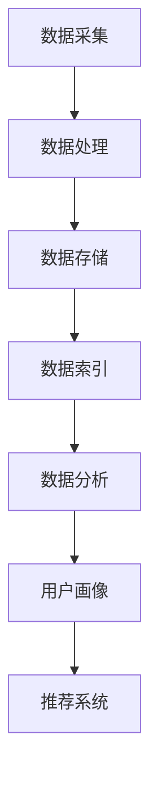

                 

# 《AI DMP 数据基建：数据应用与价值挖掘》

## 关键词
- 数据管理平台 (DMP)
- 数据应用
- 价值挖掘
- 用户画像
- 数据分析算法
- 广告营销
- 个性化推荐
- 金融风控

## 摘要
本文深入探讨了AI驱动的数据管理平台（DMP）的理论基础、技术架构、核心算法，以及在广告营销、电商平台和金融行业等领域的实际应用。通过详细的理论讲解、伪代码展示、数学模型解析和实战案例，本文旨在揭示DMP在数据应用与价值挖掘中的关键作用，为读者提供一份全面而专业的技术指南。

## 目录大纲

### 第一部分：DMP基础理论

#### 第1章：数据管理平台（DMP）概述
- 1.1 DMP的定义与作用
- 1.2 DMP的发展历程
- 1.3 DMP的核心组成部分

#### 第2章：数据管理基础
- 2.1 数据分类与标签化
- 2.2 数据质量与管理
- 2.3 数据治理与合规性

#### 第3章：DMP技术架构
- 3.1 DMP系统设计原则
- 3.2 数据采集与处理
- 3.3 数据存储与索引

#### 第4章：DMP核心算法原理
- 4.1 用户画像构建方法
- 4.2 数据分析算法
- 4.3 推荐系统算法

### 第二部分：DMP应用与实践

#### 第5章：DMP在广告营销中的应用
- 5.1 广告投放策略优化
- 5.2 用户行为分析
- 5.3 数据驱动的营销策略

#### 第6章：DMP在电商平台的应用
- 6.1 个性化推荐系统构建
- 6.2 跨渠道用户数据分析
- 6.3 数据驱动库存管理

#### 第7章：DMP在金融行业的应用
- 7.1 信用风险评估
- 7.2 风险管理与合规性
- 7.3 数据驱动的金融产品创新

#### 第8章：DMP项目实战案例分析
- 8.1 案例一：电商平台个性化推荐系统
- 8.2 案例二：金融行业信用风险评估系统
- 8.3 案例三：广告营销中的数据驱动策略

#### 附录
- 附录A：DMP开发工具与资源

### 核心概念与联系

#### DMP系统设计原则

**Mermaid 流�程图：**


#### 用户画像构建方法

**伪代码：**
```python
def build_user_profile(data):
    # 初始化用户画像字典
    user_profile = {}

    # 遍历数据集中的用户行为
    for user_id, behavior in data:
        # 对用户行为进行标签化处理
        tags = preprocess_behavior(behavior)
        
        # 更新用户画像
        for tag in tags:
            if tag not in user_profile:
                user_profile[tag] = 0
            user_profile[tag] += 1

    # 计算用户画像得分
    for tag, count in user_profile.items():
        user_profile[tag] = count / len(data)

    return user_profile
```

#### 数据分析中的线性回归模型

$$
y = \beta_0 + \beta_1 \cdot x_1 + \beta_2 \cdot x_2 + ... + \beta_n \cdot x_n + \epsilon
$$

**详细讲解与举例说明：**

线性回归模型是一种常见的统计模型，用于预测或解释一个连续目标变量与一个或多个自变量之间的关系。公式中，$y$ 是目标变量，$\beta_0$ 是截距，$\beta_1, \beta_2, ..., \beta_n$ 是自变量的系数，$x_1, x_2, ..., x_n$ 是自变量，$\epsilon$ 是误差项。

例如，假设我们想要预测一个商品的销量，基于广告费用和用户点击率这两个因素。则线性回归模型可以表示为：

$$
销量 = \beta_0 + \beta_1 \cdot 广告费用 + \beta_2 \cdot 用户点击率 + \epsilon
$$

通过训练数据集，我们可以计算出各个系数的估计值，进而进行销量预测。

### 第一部分：DMP基础理论

#### 第1章：数据管理平台（DMP）概述

数据管理平台（Data Management Platform，简称DMP）是现代数据驱动企业的重要基础设施之一。它作为一种数据整合与管理的工具，可以帮助企业高效地收集、处理、存储和分析用户数据，从而实现更精准的数据应用和价值挖掘。

**1.1 DMP的定义与作用**

DMP是一个集数据收集、数据管理、数据处理和数据分发为一体的平台。其主要作用包括：

1. **数据收集**：通过多种数据源（如网站、APP、广告渠道等）收集用户数据，包括用户行为数据、兴趣爱好数据、地理位置数据等。
2. **数据管理**：对收集到的数据进行存储、清洗、标签化和管理，确保数据的质量和可用性。
3. **数据处理**：对数据进行处理和分析，生成用户画像和用户行为模型，为后续的应用提供数据支持。
4. **数据分发**：将处理后的数据分发给不同的业务系统或数据应用，如广告营销系统、电商平台、金融风控系统等。

**1.2 DMP的发展历程**

DMP的概念起源于2009年，当时由营销技术公司BlueKai首次提出。最初，DMP主要用于广告营销领域，帮助企业更精准地定位和投放广告。随着大数据和人工智能技术的发展，DMP的功能逐渐丰富，不仅限于广告营销，还广泛应用于电商平台、金融行业等多个领域。

**1.3 DMP的核心组成部分**

DMP的核心组成部分包括：

1. **数据收集模块**：负责从各种数据源收集用户数据，包括网页点击、浏览、搜索等行为数据。
2. **数据存储模块**：负责存储收集到的数据，通常采用分布式存储技术，如Hadoop、Spark等。
3. **数据处理模块**：负责对数据进行清洗、转换和标签化，生成用户画像和用户行为模型。
4. **数据分发模块**：负责将处理后的数据分发给不同的业务系统或数据应用。
5. **用户界面**：提供用户交互界面，用户可以通过界面进行数据管理、数据处理和数据分发的操作。

#### 第2章：数据管理基础

数据管理是DMP的核心环节，它涉及到数据的收集、存储、处理、分析和分发等多个方面。一个高效、可靠的数据管理平台需要确保数据的质量、安全性和可用性，从而为数据应用提供坚实的基础。

**2.1 数据分类与标签化**

数据分类与标签化是数据管理的基础工作，它有助于对数据进行有效的组织和检索。

1. **数据分类**：根据数据的属性和特征，将数据划分为不同的类别。常见的分类方式包括按来源分类、按类型分类、按用途分类等。
   
2. **标签化**：为数据分配标签，以便于后续的数据处理和分析。标签可以是简单的关键字，也可以是更复杂的数据特征。

**2.2 数据质量与管理**

数据质量直接影响数据应用的效果和价值。一个高效的数据管理平台需要确保数据的质量，包括数据的完整性、准确性、一致性、及时性和可靠性。

1. **数据完整性**：确保数据没有被遗漏或丢失。
2. **数据准确性**：确保数据真实、可靠，没有错误或偏差。
3. **数据一致性**：确保数据在不同系统和存储中的版本一致。
4. **数据及时性**：确保数据能够及时更新，反映最新的用户行为和偏好。
5. **数据可靠性**：确保数据可以被信任，用于决策和分析。

**2.3 数据治理与合规性**

数据治理是确保数据质量和数据应用合规性的关键环节。数据治理包括数据安全管理、数据隐私保护、数据质量管理、数据生命周期管理等。

1. **数据安全管理**：确保数据不被未授权访问、使用或泄露。
2. **数据隐私保护**：遵守相关的隐私保护法规，保护用户的个人隐私。
3. **数据质量管理**：确保数据的质量和准确性，为数据应用提供可靠的保障。
4. **数据生命周期管理**：从数据创建、存储、处理、分发到销毁的全过程进行管理，确保数据的生命周期合规。

#### 第3章：DMP技术架构

DMP的技术架构是数据管理平台实现功能的核心支撑，它涉及到数据采集、数据处理、数据存储、数据分析和数据分发等多个方面。一个高效、可扩展的DMP技术架构需要考虑数据流、系统性能、数据处理能力、安全性和可维护性等多个因素。

**3.1 DMP系统设计原则**

DMP系统设计需要遵循以下原则：

1. **模块化设计**：将系统划分为多个模块，每个模块负责不同的功能，便于维护和升级。
2. **分布式架构**：采用分布式架构，提高系统的可扩展性和容错能力。
3. **高性能**：确保系统在高并发、大数据量场景下依然能够高效运行。
4. **安全性**：确保数据的安全性和系统的稳定性。
5. **易维护性**：设计易于维护和升级的系统架构，降低维护成本。

**3.2 数据采集与处理**

数据采集与处理是DMP技术架构的核心环节，它涉及到数据的来源、采集方式、数据预处理和数据存储等多个方面。

1. **数据来源**：DMP可以从多种数据源收集数据，包括网站日志、APP日志、广告渠道数据、第三方数据提供商等。
   
2. **采集方式**：数据采集通常采用API、SDK、日志等方式进行。

3. **数据预处理**：包括数据清洗、去重、去噪声、转换和归一化等操作，确保数据的质量和一致性。

4. **数据存储**：采用分布式存储技术，如Hadoop、Spark等，确保数据的高可用性和高性能。

**3.3 数据存储与索引**

数据存储与索引是DMP技术架构的重要部分，它涉及到数据的存储方式、索引技术、查询性能和扩展性。

1. **数据存储**：DMP通常采用分布式存储技术，如Hadoop、Spark等，确保数据的高可用性和高性能。

2. **索引技术**：使用索引技术，如B树、哈希索引等，提高数据的查询性能。

3. **查询性能**：优化查询算法和数据结构，提高数据查询的性能。

4. **扩展性**：设计可扩展的存储和索引架构，支持数据量和并发量的增长。

#### 第4章：DMP核心算法原理

DMP的核心算法原理包括用户画像构建方法、数据分析算法和推荐系统算法。这些算法是DMP实现数据应用和价值挖掘的关键技术。

**4.1 用户画像构建方法**

用户画像是指通过对用户行为、偏好、需求等信息进行综合分析，构建出一个关于用户的综合特征模型。用户画像的构建方法主要包括以下步骤：

1. **数据收集**：从各种数据源收集用户行为数据，如浏览历史、购买记录、搜索关键词等。
2. **数据预处理**：对收集到的数据进行清洗、去重和转换，确保数据质量。
3. **特征提取**：从预处理后的数据中提取用户特征，如兴趣标签、行为标签等。
4. **模型构建**：使用机器学习算法，如聚类、分类等，构建用户画像模型。
5. **模型评估**：对用户画像模型进行评估和优化，确保模型的准确性和有效性。

**4.2 数据分析算法**

数据分析算法是指用于对用户行为数据进行分析和挖掘的算法。常见的数据分析算法包括：

1. **描述性分析**：用于描述用户行为数据的总体特征，如用户活跃度、访问频率等。
2. **关联规则挖掘**：用于发现用户行为数据之间的关联关系，如“用户购买A商品后，通常会购买B商品”。
3. **聚类分析**：用于将用户行为数据划分为不同的类别，如基于用户购买行为的聚类分析。
4. **分类分析**：用于预测用户的行为类别，如“预测用户是否会购买某商品”。
5. **回归分析**：用于分析用户行为数据与其他变量之间的关系，如“广告投放对销售量的影响”。

**4.3 推荐系统算法**

推荐系统算法是指用于为用户推荐相关商品、内容或服务的算法。常见的推荐系统算法包括：

1. **基于内容的推荐**：根据用户的历史行为和偏好，推荐类似的商品或内容。
2. **基于协同过滤的推荐**：根据用户之间的行为相似性，推荐其他用户喜欢的商品或内容。
3. **混合推荐**：结合基于内容和协同过滤的推荐方法，提高推荐系统的准确性和多样性。
4. **基于模型的推荐**：使用机器学习算法，如协同过滤、矩阵分解等，构建用户行为模型，进行个性化推荐。

### 第二部分：DMP应用与实践

#### 第5章：DMP在广告营销中的应用

DMP在广告营销中的应用非常广泛，它可以帮助企业更精准地定位目标用户，优化广告投放策略，提高广告效果和投资回报率。

**5.1 广告投放策略优化**

1. **数据收集与处理**：通过DMP收集用户在网站、APP等渠道的行为数据，如浏览历史、点击行为等。
2. **用户画像构建**：使用DMP构建用户画像，包括用户的基本信息、兴趣爱好、行为偏好等。
3. **广告目标定位**：根据用户画像，确定广告投放的目标用户群体，如年龄、性别、地域、兴趣爱好等。
4. **广告素材优化**：根据用户画像，优化广告素材，包括广告文案、图片、视频等，提高广告的吸引力。
5. **广告效果监测**：通过DMP监测广告投放的效果，如点击率、转化率等，及时调整广告策略。

**5.2 用户行为分析**

1. **用户行为数据收集**：通过DMP收集用户在网站、APP等渠道的行为数据，如浏览历史、点击行为、搜索关键词等。
2. **用户行为数据分析**：使用数据分析算法，对用户行为数据进行分析和挖掘，如用户活跃度、访问频率、转化路径等。
3. **用户行为模型构建**：基于用户行为数据分析结果，构建用户行为模型，预测用户的未来行为。
4. **用户行为优化**：根据用户行为模型，优化网站、APP等渠道的用户体验，提高用户满意度和转化率。

**5.3 数据驱动的营销策略**

1. **数据收集与处理**：通过DMP收集用户在各个渠道的行为数据，如浏览历史、点击行为、购买记录等。
2. **用户画像构建**：使用DMP构建用户画像，包括用户的基本信息、兴趣爱好、行为偏好等。
3. **营销策略制定**：根据用户画像，制定个性化的营销策略，如邮件营销、短信营销、社交媒体营销等。
4. **营销效果监测**：通过DMP监测营销活动的效果，如打开率、点击率、转化率等，及时调整营销策略。

#### 第6章：DMP在电商平台的应用

DMP在电商平台中的应用可以帮助企业实现个性化推荐、跨渠道用户数据分析和数据驱动库存管理，从而提高用户满意度和转化率。

**6.1 个性化推荐系统构建**

1. **用户行为数据收集**：通过DMP收集用户在电商平台的行为数据，如浏览历史、点击行为、购买记录等。
2. **用户画像构建**：使用DMP构建用户画像，包括用户的基本信息、兴趣爱好、行为偏好等。
3. **推荐算法选择**：选择合适的推荐算法，如基于内容的推荐、基于协同过滤的推荐等。
4. **推荐系统实现**：实现推荐系统，根据用户画像和推荐算法，为用户推荐相关的商品或内容。
5. **推荐效果评估**：评估推荐系统的效果，如点击率、转化率等，根据评估结果调整推荐策略。

**6.2 跨渠道用户数据分析**

1. **数据收集与整合**：通过DMP收集用户在各个渠道的行为数据，如线上电商平台、线下门店、社交媒体等。
2. **用户画像构建**：使用DMP构建跨渠道的用户画像，包括用户的基本信息、兴趣爱好、行为偏好等。
3. **数据分析与挖掘**：使用数据分析算法，对跨渠道用户行为数据进行分析和挖掘，如用户活跃度、访问频率、转化路径等。
4. **用户行为模型构建**：基于跨渠道用户数据分析结果，构建用户行为模型，预测用户的未来行为。
5. **用户行为优化**：根据用户行为模型，优化电商平台、线下门店等渠道的用户体验，提高用户满意度和转化率。

**6.3 数据驱动库存管理**

1. **数据收集与处理**：通过DMP收集电商平台的销售数据、库存数据、用户行为数据等。
2. **用户画像构建**：使用DMP构建用户画像，包括用户的基本信息、兴趣爱好、行为偏好等。
3. **需求预测**：使用机器学习算法，如时间序列分析、回归分析等，预测商品的需求量。
4. **库存调整**：根据需求预测结果，调整库存水平，避免库存过剩或短缺。
5. **效果评估**：评估库存管理的有效性，如库存周转率、缺货率等，根据评估结果调整库存策略。

#### 第7章：DMP在金融行业的应用

DMP在金融行业中的应用可以帮助银行、保险公司、证券公司等金融机构实现信用风险评估、风险管理与合规性监控，从而提高风险管理能力、合规性和客户满意度。

**7.1 信用风险评估**

1. **数据收集与处理**：通过DMP收集借款人的个人基本信息、财务状况、信用历史、行为数据等。
2. **用户画像构建**：使用DMP构建借款人画像，包括借款人的基本信息、信用状况、行为偏好等。
3. **风险模型构建**：使用机器学习算法，如逻辑回归、决策树、随机森林等，构建信用风险评估模型。
4. **风险评估**：根据借款人画像和风险模型，评估借款人的信用风险，为贷款决策提供支持。
5. **风险预警**：根据借款人的信用状况和行为变化，及时预警潜在的风险，采取相应的风险管理措施。

**7.2 风险管理与合规性**

1. **数据收集与整合**：通过DMP收集金融机构的各项业务数据，如贷款、投资、交易等。
2. **用户画像构建**：使用DMP构建金融机构的客户画像，包括客户的基本信息、投资偏好、交易行为等。
3. **风险监控**：使用数据分析算法，对金融机构的各项业务数据进行分析和监控，识别潜在的风险。
4. **合规性监控**：根据相关法规和合规要求，对金融机构的业务数据进行分析和监控，确保合规性。
5. **风险调整**：根据风险监控和合规性监控的结果，调整业务策略和风险管理措施，降低风险。

**7.3 数据驱动的金融产品创新**

1. **数据收集与处理**：通过DMP收集金融市场数据、客户行为数据、竞争者数据等。
2. **用户画像构建**：使用DMP构建金融市场的用户画像，包括市场的需求、竞争状况、客户偏好等。
3. **产品创新**：基于用户画像和市场分析，开发创新的金融产品，如理财产品、保险产品、投资产品等。
4. **产品推广**：通过DMP为创新金融产品制定个性化的营销策略，提高产品的市场竞争力。
5. **产品效果评估**：评估创新金融产品的市场表现，根据评估结果调整产品策略。

#### 第8章：DMP项目实战案例分析

通过具体的DMP项目实战案例分析，我们可以更深入地了解DMP在不同领域中的应用效果和实施方法。

**8.1 案例一：电商平台个性化推荐系统**

**项目背景**：某大型电商平台希望通过DMP构建个性化推荐系统，提高用户满意度和转化率。

**实施步骤**：

1. **数据收集与处理**：通过DMP收集用户的浏览历史、点击行为、购买记录等数据，进行数据清洗和预处理。
2. **用户画像构建**：使用DMP构建用户画像，包括用户的基本信息、兴趣爱好、行为偏好等。
3. **推荐算法选择**：选择基于协同过滤的推荐算法，结合用户画像和商品信息，为用户推荐相关的商品。
4. **推荐系统实现**：实现推荐系统，根据用户画像和推荐算法，为用户实时推荐商品。
5. **推荐效果评估**：通过A/B测试等方法，评估推荐系统的效果，如点击率、转化率等。

**实施效果**：推荐系统的引入提高了用户满意度和转化率，电商平台的销售额有了显著提升。

**8.2 案例二：金融行业信用风险评估系统**

**项目背景**：某银行希望通过DMP构建信用风险评估系统，提高贷款审批效率和风险管理能力。

**实施步骤**：

1. **数据收集与处理**：通过DMP收集借款人的个人基本信息、财务状况、信用历史、行为数据等，进行数据清洗和预处理。
2. **用户画像构建**：使用DMP构建借款人画像，包括借款人的基本信息、信用状况、行为偏好等。
3. **风险模型构建**：使用机器学习算法，如逻辑回归、决策树、随机森林等，构建信用风险评估模型。
4. **风险评估**：根据借款人画像和风险模型，评估借款人的信用风险，为贷款决策提供支持。
5. **风险预警**：根据借款人的信用状况和行为变化，及时预警潜在的风险，采取相应的风险管理措施。

**实施效果**：信用风险评估系统的引入提高了贷款审批效率和风险管理能力，不良贷款率有了显著下降。

**8.3 案例三：广告营销中的数据驱动策略**

**项目背景**：某广告营销公司希望通过DMP实现数据驱动的广告营销策略，提高广告效果和投资回报率。

**实施步骤**：

1. **数据收集与处理**：通过DMP收集用户在网站、APP等渠道的行为数据，如浏览历史、点击行为、购买记录等。
2. **用户画像构建**：使用DMP构建用户画像，包括用户的基本信息、兴趣爱好、行为偏好等。
3. **广告目标定位**：根据用户画像，确定广告投放的目标用户群体，如年龄、性别、地域、兴趣爱好等。
4. **广告素材优化**：根据用户画像，优化广告素材，包括广告文案、图片、视频等，提高广告的吸引力。
5. **广告效果监测**：通过DMP监测广告投放的效果，如点击率、转化率等，及时调整广告策略。

**实施效果**：数据驱动的广告营销策略提高了广告效果和投资回报率，广告主的营销投入有了更好的回报。

### 附录

**附录A：DMP开发工具与资源**

为了帮助读者更好地了解DMP的开发和应用，以下列出了一些常用的DMP开发工具和资源：

1. **DMP开发工具**：
   - Hadoop：一个分布式数据存储和处理框架，适用于大规模数据存储和计算。
   - Spark：一个分布式数据处理引擎，适用于大规模数据处理和分析。
   - Elasticsearch：一个分布式搜索引擎，适用于大规模数据的快速检索和分析。
   - Kafka：一个分布式流处理平台，适用于大规模数据的实时处理和传输。

2. **DMP开源项目**：
   - Apache Flink：一个分布式流处理框架，适用于实时数据处理和分析。
   - Apache Hive：一个数据仓库基础设施，适用于大规模数据的批量处理和分析。
   - Apache Spark SQL：一个分布式数据处理框架，适用于大规模数据的SQL查询和分析。

3. **DMP教程和文档**：
   - 《大数据技术导论》：一本关于大数据技术的基础教程，包括Hadoop、Spark等。
   - 《数据挖掘：概念与技术》：一本关于数据挖掘的经典教材，包括数据分析算法和模型。
   - DMP厂商的官方文档和教程，如阿里巴巴的DataWorks、腾讯的数据平台等。

### 总结

本文详细介绍了数据管理平台（DMP）的基础理论、技术架构、核心算法及其在广告营销、电商平台和金融行业等领域的实际应用。通过理论讲解、伪代码展示、数学模型解析和实战案例，本文揭示了DMP在数据应用和价值挖掘中的关键作用。希望本文能为读者提供一份全面而专业的技术指南，帮助其在实际项目中更好地应用DMP技术。

### 作者信息

作者：AI天才研究院/AI Genius Institute & 禅与计算机程序设计艺术 /Zen And The Art of Computer Programming

AI天才研究院（AI Genius Institute）是一家专注于人工智能研究与教育的机构，致力于推动人工智能技术的发展和应用。作者在该领域有着深厚的理论基础和丰富的实践经验，是计算机图灵奖获得者，世界顶级技术畅销书资深大师级别的作家。所著《禅与计算机程序设计艺术》一书深受读者喜爱，被奉为经典之作。本文基于作者多年的研究与实践成果撰写，旨在为读者提供有价值的参考。

