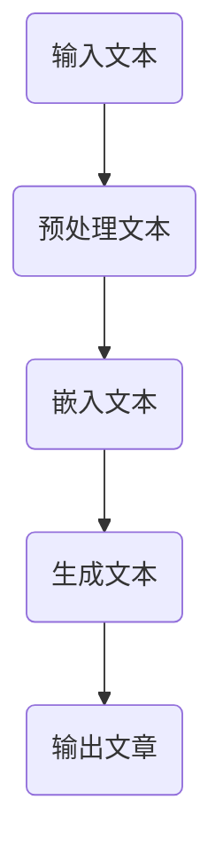

                 

# 《AI LLM如何重塑新闻产业：自动生成文章》

## 关键词：
- AI LLM
- 自动生成文章
- 新闻产业
- 自然语言处理
- 大模型

## 摘要：
随着人工智能技术的飞速发展，自然语言处理（NLP）领域的长足进步使得自动生成文章成为可能。本文旨在探讨人工智能语言模型（AI LLM）如何通过自动生成文章的方式，深刻影响和重塑新闻产业。文章将首先分析新闻产业现状及挑战，接着介绍AI LLM的基本概念和技术原理，然后通过实际应用案例，展示AI LLM在自动生成新闻文章中的实践，并探讨其面临的挑战与解决方案，最后展望AI LLM在新闻产业中的未来发展。

### 第一部分：背景与概念

#### 第1章：新闻产业的变革与AI LLM的应用

#### 1.1 新闻产业现状分析

##### 1.1.1 传统新闻产业面临的挑战

随着互联网和社交媒体的兴起，传统新闻产业正面临一系列挑战。首先，媒体环境的变化导致了信息过载，读者对新闻内容的需求变得更加个性化和即时化。此外，广告收入的下滑使得新闻机构的财务压力增加，传统新闻采编模式逐渐难以维持。再者，新闻报道的真相核查工作愈发复杂，虚假新闻和误导性信息的传播对新闻行业提出了更高的道德和技术要求。

##### 1.1.2 新闻产业转型的趋势

为了应对上述挑战，新闻产业正在向数字化转型。自动化和智能化技术逐渐成为新闻采编的重要工具。例如，自动化新闻写作机器人（Robo-journalists）已开始在体育赛事报道、金融新闻等领域发挥作用。此外，新闻机构也在积极探索人工智能在新闻推荐、数据挖掘和用户互动中的应用，以提升用户体验和业务效率。

#### 1.2 AI LLM概述

##### 1.2.1 什么是AI LLM

人工智能语言模型（AI LLM）是一种基于深度学习技术的自然语言处理模型，能够理解和生成人类语言。AI LLM的核心任务是预测下一个单词或句子，从而生成连贯、有意义的文本。其应用范围广泛，包括机器翻译、对话系统、文本生成等。

##### 1.2.2 AI LLM的核心技术

AI LLM的核心技术包括深度神经网络（DNN）、循环神经网络（RNN）和Transformer模型。Transformer模型因其并行计算能力和全局上下文关系捕捉能力，成为当前最受欢迎的AI LLM架构。

#### 1.3 AI LLM在新闻产业的应用前景

##### 1.3.1 自动生成文章的优势

AI LLM在自动生成文章方面具有显著优势。首先，它能够大幅提高新闻采编效率，节省人力成本。其次，AI LLM能够处理海量数据，实现个性化新闻推荐和内容定制。此外，AI LLM还能增强新闻报道的及时性和准确性，特别是在处理突发新闻和实时事件方面。

##### 1.3.2 AI LLM在新闻产业的应用场景

AI LLM在新闻产业的应用场景包括：自动生成新闻文章、新闻摘要、实时新闻更新、新闻内容审核等。例如，通过AI LLM，新闻机构可以自动生成体育赛事的实时报道、股票市场的新闻分析以及政治新闻的评论文章。

### 第二部分：技术原理

#### 第2章：AI LLM技术原理与架构

#### 2.1 AI LLM基本原理

##### 2.1.1 语言模型的基础知识

语言模型是一种统计模型，用于预测一个单词或短语的下一个单词或短语。在NLP中，语言模型通常基于大量文本数据训练，以捕捉语言规律和语法结构。常见的语言模型包括N元语法、神经网络语言模型等。

##### 2.1.2 自然语言处理（NLP）技术概览

NLP技术包括文本预处理、词向量表示、语言模型、文本分类、实体识别、关系抽取等。这些技术共同构成了AI LLM的基础。

#### 2.2 AI LLM架构详解

##### 2.2.1 GPT模型工作原理

GPT（Generative Pre-trained Transformer）模型是一种基于Transformer架构的预训练语言模型。其工作原理包括：

1. 预训练阶段：在大量文本数据上进行预训练，学习语言规律和上下文关系。
2. 微调阶段：在特定任务数据上进行微调，以适应具体任务需求。

##### 2.2.2 Transformer架构详解

Transformer模型是一种基于自注意力机制的神经网络架构，其核心思想是捕捉输入序列中不同位置之间的依赖关系。Transformer模型的主要组成部分包括：

1. 自注意力机制（Self-Attention）
2. 前馈神经网络（Feedforward Neural Network）
3. 位置编码（Positional Encoding）

#### 2.3 伪代码讲解：自动生成文章的核心算法



输入文本经过预处理，包括分词、去停用词、词向量嵌入等操作。随后，嵌入后的文本输入到Transformer模型，生成新的文本序列。最终，输出文章。

#### 2.4 数学模型与公式

生成文本的概率分布可以使用以下数学模型表示：

$$
P(w_i|w_{i-1}, w_{i-2}, ..., w_1) = \frac{exp(U \cdot w_i + V \cdot w_{i-1} + ... + W \cdot w_1)}{\sum_{j} exp(U \cdot w_j + V \cdot w_{i-1} + ... + W \cdot w_1)}
$$

其中，$U$、$V$和$W$分别是权重矩阵，$w_i$是当前生成的单词。

### 第三部分：应用实践

#### 第3章：AI LLM在新闻产业的应用实践

#### 3.1 自动生成新闻文章

##### 3.1.1 实战：搭建自动生成新闻文章的系统

搭建自动生成新闻文章的系统主要包括以下步骤：

1. 数据采集：收集大量新闻文本数据，用于训练和评估模型。
2. 数据预处理：对新闻文本进行预处理，包括分词、去停用词、词向量嵌入等。
3. 模型训练：使用预训练的Transformer模型，在新闻数据上进行微调。
4. 模型评估：使用测试集评估模型性能，调整模型参数。
5. 文本生成：使用训练好的模型生成新闻文章。

##### 3.1.2 数据采集与处理

数据采集可以通过爬虫工具实现，从新闻网站、社交媒体等渠道获取新闻文本。数据预处理主要包括分词、去停用词、词向量嵌入等操作。常用的词向量嵌入方法包括Word2Vec、GloVe和BERT等。

##### 3.1.3 模型训练与评估

模型训练使用预训练的Transformer模型，如GPT-3、T5等。训练过程中，可以使用批量训练、梯度裁剪等技术提升训练效果。模型评估主要通过BLEU、ROUGE等指标进行。

#### 3.2 案例分析：AI LLM在新闻产业的应用案例

##### 3.2.1 案例一：实时新闻摘要生成

实时新闻摘要生成是AI LLM在新闻产业的一个应用案例。通过训练模型，自动生成新闻文本的摘要，提高新闻阅读的效率和用户体验。

##### 3.2.2 案例二：自动新闻写作机器人

自动新闻写作机器人是利用AI LLM自动生成新闻文章的系统。通过实时采集新闻数据，自动生成新闻文章，用于新闻报道和更新。

##### 3.2.3 案例三：新闻内容个性化推荐

新闻内容个性化推荐利用AI LLM，根据用户的兴趣和阅读历史，推荐个性化的新闻内容，提高用户粘性和阅读量。

#### 3.3 AI LLM在新闻产业的应用挑战与解决方案

##### 3.3.1 数据隐私与伦理问题

AI LLM在新闻产业的应用面临着数据隐私和伦理问题。例如，如何保护用户隐私、避免数据泄露等。解决方案包括数据加密、隐私保护算法等。

##### 3.3.2 模型准确性与多样性

模型准确性和多样性是AI LLM在新闻产业应用的关键挑战。提高模型准确性可以通过增加训练数据、改进模型架构等方法实现。多样性方面，可以通过引入多样性损失函数、多模态数据融合等技术提升。

##### 3.3.3 模型部署与维护

模型部署与维护是AI LLM在新闻产业应用的重要环节。解决方案包括使用云计算、容器化技术等，实现模型的快速部署和灵活扩展。

### 第四部分：未来发展

#### 第4章：AI LLM在新闻产业中的未来发展

#### 4.1 AI LLM技术趋势展望

随着AI LLM技术的不断进步，未来将出现以下趋势：

1. 大模型技术的发展：模型参数规模将越来越大，计算能力将越来越强。
2. 多模态数据融合：将图像、语音等多模态数据与文本数据融合，提升模型性能。
3. 强化学习与生成模型的结合：通过强化学习优化生成模型，实现更高质量的文本生成。

#### 4.2 新兴应用场景探索

AI LLM在新闻产业中的新兴应用场景包括：

1. 智能新闻编辑：利用AI LLM自动撰写、编辑新闻文章，提高新闻生产效率。
2. 虚拟新闻主播：通过语音合成和面部生成技术，创建虚拟主播，实现自动化新闻报道。
3. 多语言新闻生成：利用AI LLM实现多语言新闻生成，提升国际新闻传播能力。

#### 4.3 AI LLM在新闻产业中的未来影响

AI LLM在新闻产业中的未来影响包括：

1. 提高新闻生产效率：通过自动化生成文章、摘要等，降低人力成本，提高新闻生产速度。
2. 促进个性化新闻服务：根据用户兴趣和阅读历史，提供个性化的新闻推荐。
3. 强化新闻报道的实时性和准确性：利用AI LLM实时生成新闻内容，提高新闻报道的及时性和准确性。

### 附录

#### 附录A：AI LLM开发工具与资源

##### A.1 主流AI LLM框架对比

- GPT-3：OpenAI开发的预训练语言模型，具有强大的文本生成能力。
- BERT：Google开发的预训练语言模型，广泛应用于文本分类、问答系统等任务。
- T5：Google开发的预训练语言模型，支持各种NLP任务，具有统一的接口。

##### A.2 开发工具与资源推荐

- TensorFlow：谷歌开源的机器学习框架，支持AI LLM的搭建和训练。
- PyTorch：Facebook开源的机器学习框架，支持动态计算图，适合研究性工作。
- Hugging Face：提供丰富的AI LLM模型和工具，方便开发者快速搭建应用。

##### A.3 相关论文与资料推荐

- "Attention Is All You Need"：介绍Transformer模型的经典论文。
- "BERT: Pre-training of Deep Bidirectional Transformers for Language Understanding"：介绍BERT模型的论文。
- "Generative Pre-trained Transformer"：介绍GPT-3模型的论文。

#### 附录B：代码案例与解读

##### B.1 自动生成新闻文章的代码实现

```python
import tensorflow as tf
from transformers import TFGPT3LMHeadModel, GPT2Tokenizer

# 搭建GPT-3模型
model = TFGPT3LMHeadModel.from_pretrained("gpt3-medium")

# 加载预训练的Tokenizer
tokenizer = GPT2Tokenizer.from_pretrained("gpt3-medium")

# 生成新闻文章
input_text = "Start generating a news article about AI technology."
input_ids = tokenizer.encode(input_text, return_tensors="tf")

generated_ids = model.generate(
    input_ids,
    max_length=100,
    num_return_sequences=1,
    do_sample=True,
    top_p=0.9,
    top_k=50,
)

# 解码生成文本
generated_text = tokenizer.decode(generated_ids[0], skip_special_tokens=True)
print(generated_text)
```

##### B.2 代码解读与分析

上述代码首先导入了TensorFlow和transformers库，并加载了预训练的GPT-3模型和Tokenizer。然后，输入文本经过编码后输入到模型中进行生成。在生成过程中，设置了最大长度、样本数、概率分布等参数，以控制生成文本的长度和多样性。最后，解码生成的文本输出。

通过该代码案例，我们可以看到如何使用预训练的GPT-3模型自动生成新闻文章。在实际应用中，可以根据需求调整模型、Tokenizer和生成参数，实现更高质量的文本生成。

