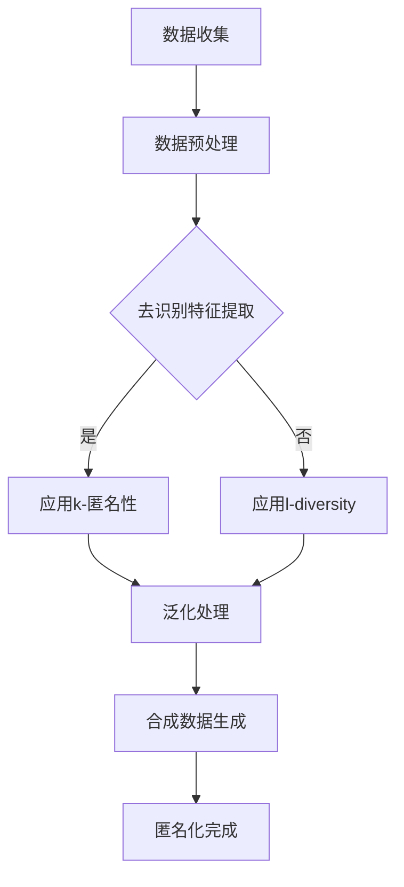

                 

### 引言与背景

在当今数字化时代，人工智能（AI）已经成为各行各业不可或缺的技术驱动力。特别是在电商搜索推荐领域，AI大模型的应用极大地提升了用户购物体验和商家销售效果。AI大模型，如深度学习神经网络、生成对抗网络（GAN）等，通过处理海量用户数据，实现了精准的个性化推荐，推动了电商业务的快速发展。然而，随着AI大模型在电商搜索推荐中的广泛应用，数据安全问题也日益凸显，尤其是用户隐私和数据安全保护问题。

首先，电商搜索推荐系统需要处理大量用户数据，包括用户的购买历史、搜索记录、偏好等。这些数据不仅对用户个性化推荐至关重要，同时也是潜在的安全威胁。未经授权的访问或数据泄露可能导致用户隐私泄露、信用欺诈等严重问题，影响用户体验和商家的声誉。

其次，AI大模型在训练和部署过程中，往往需要大量的敏感数据。这些数据如果未经妥善保护，可能会被恶意利用，例如通过反向工程获取用户隐私或商业机密。此外，AI大模型的黑箱特性使得安全漏洞难以发现，进一步增加了数据安全风险。

因此，保障AI大模型在电商搜索推荐中的数据安全，已成为业界和学术界共同关注的重要课题。本文将从数据安全的重要性、AI大模型的基本概念和应用、数据安全挑战与策略、数据匿名化与去识别化、加密技术与隐私保护、数据安全合规与法规遵从以及AI大模型数据安全的实际应用等方面，深入探讨AI大模型在电商搜索推荐中的数据安全策略，旨在为相关从业人员和研究人员提供有益的参考和指导。

### 电商搜索推荐系统概述

电商搜索推荐系统是电子商务领域的重要组成部分，其主要功能是基于用户的历史行为和偏好，向用户推荐可能感兴趣的商品或服务。这一系统通常包含以下几个关键组件：

**用户行为数据收集**：这是推荐系统的数据基础。用户的行为数据包括购买历史、浏览记录、搜索关键词、评价和反馈等。这些数据可以通过网站跟踪技术、点击流分析等手段收集。

**数据预处理**：收集到的原始数据通常需要进行清洗和预处理，以去除噪声、填补缺失值、进行数据标准化等，从而为后续分析提供高质量的数据。

**特征工程**：在数据预处理之后，需要对数据进行特征提取和转换，以生成能够有效描述用户偏好和行为的特征。这些特征可以是用户层面的（如年龄、性别、地理位置等），也可以是商品层面的（如价格、品牌、类别等）。

**推荐算法**：基于用户行为数据和特征，推荐算法会计算每个用户对不同商品的偏好程度，然后根据一定的策略（如基于内容的推荐、协同过滤等）生成推荐列表。

**推荐结果呈现**：最后，推荐系统将生成的推荐列表展示给用户，用户可以通过点击、购买等行为与推荐结果互动，从而进一步优化推荐效果。

在电商搜索推荐系统中，AI大模型的应用极大地提升了系统的推荐效果和用户体验。AI大模型，如深度学习神经网络、生成对抗网络（GAN）等，通过学习大量的用户行为数据，能够自动发现复杂的关系和模式，从而实现更精准的推荐。例如，深度学习神经网络可以通过多层非线性变换，提取出用户行为数据中的深层特征，这些特征有助于捕捉用户的真实偏好，从而提高推荐的准确性和相关性。

然而，AI大模型的应用也带来了新的数据安全问题。首先，由于AI大模型需要大量的敏感数据来训练，这些数据本身可能包含用户的隐私信息，如姓名、地址、电话号码等。如果这些数据泄露，将严重侵犯用户隐私。其次，AI大模型的黑箱特性使得数据安全和隐私保护变得更加复杂。由于模型内部参数和计算过程难以理解，攻击者可能通过恶意输入诱导模型泄露敏感信息。此外，AI大模型的训练和部署过程中，也存在着数据滥用和不当处理的风险。

综上所述，电商搜索推荐系统在提升用户体验和商业价值的同时，也面临着严峻的数据安全挑战。如何保障AI大模型在电商搜索推荐中的数据安全，已成为业界和学术界亟待解决的重要问题。通过本文的深入探讨，我们希望为解决这一难题提供一些有效的策略和方法。

### 数据安全的重要性

在电商搜索推荐系统中，数据安全的重要性不言而喻。首先，用户数据的敏感性使得数据安全成为保障用户隐私的基础。用户的购物历史、偏好和搜索记录等数据不仅包含个人信息，还反映了用户的消费习惯和偏好，这些信息如果被恶意利用，可能对用户造成严重的隐私泄露和经济损失。

其次，数据安全对于电商平台的长期发展至关重要。一旦用户数据泄露，不仅会导致用户信任度下降，还可能引发法律诉讼和赔偿，给电商平台带来巨大的经济和法律风险。此外，数据泄露还可能导致用户流失，影响商家的市场份额和品牌声誉。

从法律和伦理角度来看，保护用户数据安全也是企业的社会责任。许多国家和地区都制定了严格的数据保护法规，如欧盟的《通用数据保护条例》（GDPR）和中国的《个人信息保护法》。这些法规明确规定了企业在收集、处理和存储用户数据时需要遵循的规范，违反这些规定可能导致严重的法律后果。

具体来说，保障数据安全的重要性体现在以下几个方面：

1. **用户隐私保护**：用户数据是电商搜索推荐系统的核心资产，保障用户隐私是数据安全的首要任务。通过加密、匿名化和去识别化等技术手段，可以有效防止用户数据被未经授权的访问和泄露。

2. **业务连续性和数据完整性**：数据安全不仅关乎用户隐私，也关乎电商平台的业务连续性和数据完整性。通过实施有效的数据备份和恢复策略，可以在数据丢失或损坏时快速恢复业务，减少经济损失。

3. **合规要求**：遵守数据保护法规是企业必须履行的法律责任。通过建立完善的数据安全管理制度和合规措施，企业可以避免因违规操作而面临的罚款和法律诉讼。

4. **品牌声誉和用户信任**：数据安全直接关系到用户的信任度和品牌声誉。一个重视数据安全的企业能够赢得用户的信任，从而在激烈的市场竞争中脱颖而出。

总之，数据安全是电商搜索推荐系统稳定运行和长期发展的基石。保障数据安全不仅是对用户隐私的保护，也是企业履行社会责任和法律义务的体现。通过采取有效的数据安全策略和技术手段，电商企业可以确保用户数据的安全，提升用户信任和满意度，实现可持续发展。

### 书籍结构概述

本书旨在深入探讨AI大模型在电商搜索推荐中的数据安全策略，通过系统化的研究和分析，为从业人员和研究人员提供全面的理论和实践指导。全书结构如下：

**第一部分：数据安全策略概述**

本部分首先介绍数据安全在电商搜索推荐系统中的重要性，然后概述全书的主要内容和结构，为后续章节的深入讨论奠定基础。

**第二部分：AI大模型基础**

这一部分将详细讲解AI大模型的基本概念和原理，包括深度学习神经网络、生成对抗网络（GAN）等主流模型，并分析这些模型在电商搜索推荐中的应用场景和优势。

**第三部分：数据安全挑战与策略**

本部分重点分析电商搜索推荐系统中面临的数据安全挑战，如用户数据敏感性、AI大模型的黑箱特性等，并介绍应对这些挑战的系统性数据安全策略框架。

**第四部分：数据匿名化与去识别化**

这一部分将探讨数据匿名化和去识别化的原理和方法，通过具体案例展示这些技术在实际应用中的效果，帮助读者理解并掌握如何在实际场景中保障数据安全。

**第五部分：加密技术与隐私保护**

本部分深入讲解加密技术的基础知识，特别是同态加密与安全多方计算等前沿技术，分析这些技术在隐私保护中的实际应用，提供技术实现的指导。

**第六部分：数据安全合规与法规遵从**

这一部分将介绍全球主要数据安全法规，如GDPR和《个人信息保护法》，详细解读数据安全合规要求，并通过案例分析，展示合规实践的具体操作。

**第七部分：AI大模型数据安全的实际应用**

本部分通过案例研究，详细探讨AI大模型数据安全的实际应用，包括数据安全策略的开发流程、评估与优化方法，为读者提供实战经验和参考。

**第八部分：未来展望与挑战**

最后一部分将展望AI大模型数据安全的未来发展趋势，分析面临的挑战，并提出相应的解决方案和发展建议，为行业的可持续发展提供指导。

通过以上结构安排，本书全面、系统地探讨了AI大模型在电商搜索推荐中的数据安全策略，旨在为相关从业人员和研究人员提供有价值的参考和指导。

### 第二部分：AI大模型基础

#### 2.1 AI大模型的基本概念

AI大模型，又称大规模人工智能模型，是近年来人工智能领域的重要突破之一。这些模型通过学习海量数据，能够自动发现复杂的模式、进行预测和生成，从而在各个领域展现出强大的应用潜力。AI大模型的核心特征包括：

1. **海量数据训练**：AI大模型需要大量的训练数据来学习，这些数据通常来自于互联网、传感器、用户行为等多个来源。例如，深度学习神经网络（Deep Learning Neural Network）可以通过大规模图像、文本等数据学习到复杂的特征表示。

2. **多层结构**：AI大模型通常具有多层结构，通过逐层提取和处理数据，能够实现从低级到高级特征的转换。例如，卷积神经网络（CNN）通过多个卷积层和池化层，可以提取图像的纹理和边缘特征。

3. **自适应学习能力**：AI大模型具备自适应学习能力，能够在训练过程中不断优化模型参数，提高预测和生成效果。例如，生成对抗网络（GAN）通过对抗性训练，可以实现高质量的数据生成。

4. **并行计算能力**：为了处理海量数据和高维特征，AI大模型通常依赖分布式计算和GPU加速等技术，以提升计算效率。例如，Transformer模型通过并行计算和自注意力机制，实现了在自然语言处理任务中的突破。

#### 2.2 主流AI大模型介绍

目前，AI大模型在各个领域都有广泛的应用，以下介绍几种主流的AI大模型：

1. **深度学习神经网络（Deep Learning Neural Network）**：
   - **结构**：由多个隐藏层组成，每一层通过非线性变换对输入数据进行特征提取和转换。
   - **应用**：在图像识别、语音识别、自然语言处理等领域具有广泛应用。
   - **特点**：强大的特征提取能力和自适应学习能力。

2. **生成对抗网络（Generative Adversarial Network，GAN）**：
   - **结构**：由生成器（Generator）和判别器（Discriminator）两个神经网络组成，通过对抗性训练生成高质量的数据。
   - **应用**：在图像生成、图像修复、数据增强等领域有显著应用。
   - **特点**：能够生成高度真实的数据，具有广泛的应用前景。

3. **卷积神经网络（Convolutional Neural Network，CNN）**：
   - **结构**：通过卷积层和池化层，对图像进行特征提取和变换。
   - **应用**：在图像分类、物体检测、图像分割等领域有广泛应用。
   - **特点**：在处理图像数据方面具有显著优势，能够提取出丰富的图像特征。

4. **Transformer模型**：
   - **结构**：基于自注意力机制，能够并行处理序列数据。
   - **应用**：在自然语言处理、机器翻译、文本生成等领域有广泛应用。
   - **特点**：能够捕捉长距离依赖关系，提高了文本处理效果。

5. **变分自编码器（Variational Autoencoder，VAE）**：
   - **结构**：由编码器和解码器组成，通过概率模型生成数据。
   - **应用**：在图像生成、图像去噪、数据增强等领域有广泛应用。
   - **特点**：能够生成高质量的生成数据和进行数据增强。

以上几种AI大模型各有特点，在解决特定问题时具有优势。在实际应用中，常常根据任务需求和数据特点选择合适的模型，并通过模型融合和优化方法提升整体性能。

#### 2.3 大模型在电商搜索推荐中的应用

AI大模型在电商搜索推荐系统中具有广泛的应用，能够显著提升推荐系统的准确性和用户体验。以下从几个方面介绍AI大模型在电商搜索推荐中的应用：

1. **个性化推荐**：通过深度学习神经网络和生成对抗网络等大模型，可以提取用户的历史行为和偏好数据中的深层特征，实现精准的个性化推荐。例如，使用CNN对用户的历史购买图像进行特征提取，结合用户的行为数据，生成个性化的推荐列表。

2. **推荐效果优化**：AI大模型可以通过在线学习和自适应调整推荐策略，实现推荐效果的持续优化。例如，使用Transformer模型处理用户的行为序列数据，实时更新推荐策略，提高推荐的及时性和准确性。

3. **图像和文本数据处理**：在电商搜索推荐中，图像和文本数据占据重要地位。通过卷积神经网络（CNN）和自然语言处理模型（如Transformer），可以有效地提取和处理这些数据，从而提高推荐系统的效果。例如，使用CNN对商品图像进行特征提取，结合商品描述文本，生成统一的商品特征向量。

4. **推荐解释性提升**：AI大模型虽然能够实现高效的推荐，但往往具有黑箱特性，难以解释推荐结果。通过可解释性AI技术，如LIME（Local Interpretable Model-agnostic Explanations）和SHAP（SHapley Additive exPlanations），可以解释AI大模型生成的推荐结果，提高系统的透明度和信任度。

5. **推荐系统安全性**：在数据安全方面，AI大模型可以通过数据匿名化和加密技术，保护用户的隐私和敏感数据。例如，使用差分隐私（Differential Privacy）技术，在训练和部署过程中保护用户数据的隐私。

总之，AI大模型在电商搜索推荐系统中具有广泛的应用，通过提升推荐准确性、优化推荐效果、增强系统透明度和保障数据安全，为用户提供了更优质的购物体验，也为电商平台带来了更高的商业价值。

### 第三部分：数据安全挑战与策略

#### 3.1 电商搜索推荐中的数据安全挑战

在电商搜索推荐系统中，数据安全面临着诸多挑战。这些挑战不仅源于数据本身的敏感性，还受到AI大模型的特点和应用场景的制约。以下从几个方面详细分析这些数据安全挑战：

**1. 用户数据敏感性**

电商搜索推荐系统需要处理大量的用户数据，包括用户的购买历史、浏览记录、搜索关键词、评价和反馈等。这些数据不仅包含用户的个人信息，还反映了用户的消费习惯、偏好和隐私。例如，用户的浏览记录可能暴露出其兴趣偏好，购买历史可能泄露其财务状况。如果这些数据被未经授权的访问或泄露，将严重侵犯用户隐私，可能导致用户信任度下降、经济损失甚至社会问题。

**2. 数据量的庞大与复杂性**

电商平台的用户规模庞大，每天产生海量的数据。这些数据不仅包括用户的行为数据，还涉及商品信息、交易数据等。处理如此庞大的数据量，不仅要求高效的数据存储和管理，还需要强大的数据处理和分析能力。在数据量庞大的情况下，任何微小的安全漏洞都可能被放大，导致严重的安全事件。

**3. AI大模型的黑箱特性**

AI大模型，特别是深度学习神经网络，具有高度的非线性复杂性和黑箱特性。这些模型在训练过程中通过大量的参数和权重调整，形成复杂的决策边界，使得模型内部难以解释和理解。这种特性在提升模型预测能力的同时，也增加了安全风险。首先，由于模型的黑箱特性，攻击者可能通过恶意输入诱导模型泄露敏感信息；其次，模型训练过程中使用的数据如果没有得到妥善保护，可能被恶意利用，例如通过数据反向工程提取用户隐私。

**4. 多层次的数据交互与共享**

电商搜索推荐系统通常涉及多个模块和组件，如数据收集、处理、存储、推荐和展示等。这些模块和组件之间需要频繁的数据交互和共享，导致数据在传输和处理过程中面临安全风险。例如，数据在传输过程中可能被截获或篡改，数据在存储过程中可能被未授权访问。此外，不同模块和组件的安全控制措施可能不一致，增加了安全漏洞的风险。

**5. 法律法规与合规要求**

随着数据隐私保护意识的增强，各国纷纷出台了严格的数据保护法规，如欧盟的《通用数据保护条例》（GDPR）和中国的《个人信息保护法》。这些法规对企业的数据处理行为提出了严格要求，包括数据收集、存储、处理、传输和销毁等各个环节。电商搜索推荐系统需要遵守这些法规，否则将面临高额罚款和法律诉讼。然而，在实际操作中，合规要求往往较为复杂，企业需要在保障数据安全和合规之间找到平衡点。

**6. 数据滥用与不当处理**

电商搜索推荐系统中的数据不仅用于提升用户体验和商业价值，还可能被用于市场分析、商业决策和其他商业用途。然而，如果数据没有得到妥善处理和保护，可能会被滥用或不当使用。例如，企业可能通过用户数据进行分析，推测用户的财务状况或其他敏感信息，从而进行精准营销或商业欺诈。此外，如果数据在传输、存储和处理过程中存在漏洞，也可能导致数据泄露或滥用。

综上所述，电商搜索推荐系统中面临着多方面的数据安全挑战。这些挑战不仅源于数据的敏感性、数据量的庞大与复杂性，还受到AI大模型的黑箱特性、多层次的数据交互与共享、法律法规与合规要求以及数据滥用与不当处理等因素的影响。为了应对这些挑战，需要采取系统性的数据安全策略，保障用户数据的安全和隐私。

#### 3.2 数据安全策略框架

为了应对电商搜索推荐系统中面临的数据安全挑战，建立一套完整的数据安全策略框架至关重要。以下从数据安全策略的目标、组成和实施步骤等方面，详细描述数据安全策略框架的构建：

**1. 策略目标**

数据安全策略的目标主要包括以下几点：

- 保护用户隐私：通过加密、匿名化和去识别化等技术手段，防止用户数据被未经授权的访问和泄露，保障用户隐私。
- 确保数据完整性：通过数据备份、数据校验和访问控制等措施，防止数据被篡改、损坏或丢失，确保数据的完整性和可用性。
- 提高数据可用性：通过数据加密和访问控制等机制，确保数据在合法授权情况下可以快速访问和使用，提升系统的响应速度和用户体验。
- 符合法律法规与合规要求：确保数据安全策略符合国家和地区的法律法规，避免因违规操作而面临罚款和法律诉讼。

**2. 策略组成**

数据安全策略框架主要由以下几个部分组成：

- **数据分类与管理**：根据数据的重要性、敏感性等特征，对数据进行分类和管理，制定相应的安全措施。例如，将用户隐私数据视为高敏感性数据，实施严格的安全控制措施。

- **数据加密与存储**：通过数据加密技术，对敏感数据进行加密存储，防止未授权访问。常用的加密技术包括对称加密、非对称加密和哈希算法等。

- **访问控制与身份验证**：实施访问控制机制，确保只有经过授权的用户和系统能够访问敏感数据。同时，通过身份验证技术（如密码认证、双因素认证等），防止未经授权的访问。

- **数据备份与恢复**：定期备份数据，并建立数据恢复机制，防止数据丢失或损坏。备份策略应包括全量备份和增量备份，并确保备份数据的安全性和完整性。

- **数据安全监控与审计**：通过数据安全监控工具，实时监控数据访问和操作行为，及时发现和响应安全事件。同时，定期进行数据安全审计，评估数据安全策略的有效性，并不断优化。

- **数据合规与合规管理**：确保数据安全策略符合国家和地区的法律法规要求，建立合规管理体系，包括合规培训、合规审核和合规报告等。

**3. 实施步骤**

数据安全策略的实施主要包括以下几个步骤：

- **需求分析与规划**：分析电商搜索推荐系统的数据安全需求，明确安全目标和策略需求，制定详细的数据安全策略规划。

- **技术选型与架构设计**：选择合适的数据加密、访问控制、备份和监控等技术，并设计数据安全架构，确保策略的有效实施。

- **安全措施部署**：根据策略规划，部署数据加密、访问控制、备份和监控等安全措施，确保数据在各个环节得到有效保护。

- **安全培训与意识提升**：对相关人员进行数据安全培训，提高数据安全意识和技能，确保数据安全策略能够得到有效执行。

- **安全评估与优化**：定期进行数据安全评估，评估数据安全策略的有效性，并根据评估结果进行优化和改进。

通过建立系统性的数据安全策略框架，电商搜索推荐系统可以更好地应对数据安全挑战，保障用户数据的安全和隐私，提升系统的整体安全性和可靠性。

### 3.3 数据安全技术与工具

为了有效应对电商搜索推荐系统中的数据安全挑战，采取先进的数据安全技术是必不可少的。以下将介绍几种常用的数据安全技术，以及在实际应用中如何选择和部署这些技术。

**1. 数据加密技术**

数据加密是保护数据隐私和安全性的基础技术，通过将数据转换为密文，防止未授权的访问和泄露。常见的加密技术包括：

- **对称加密**：对称加密使用相同的密钥进行加密和解密，如AES（Advanced Encryption Standard）。这种加密方法速度快，但密钥管理复杂。

- **非对称加密**：非对称加密使用一对密钥（公钥和私钥），公钥用于加密，私钥用于解密，如RSA（Rivest-Shamir-Adleman）加密算法。这种加密方法安全性高，但计算复杂度较高。

在实际应用中，电商搜索推荐系统可以选择混合使用对称加密和非对称加密技术，以平衡安全性和性能。例如，对于需要频繁访问的数据，可以使用对称加密提高访问速度，而对于需要长期保存的数据，可以使用非对称加密提高安全性。

**2. 数据匿名化与去识别化**

数据匿名化与去识别化技术通过删除或隐藏直接与用户身份相关的信息，降低数据的识别风险。常见的去识别化技术包括：

- **伪匿名化**：通过添加噪声、混淆或替换真实值，使数据难以直接识别用户身份，但可能仍存在一定识别风险。

- **k-匿名性**：对数据集中的每个记录，至少有k个其他记录与它具有相同的属性集合，从而降低个体识别风险。

- **l-diversity**：数据集中的每个属性集合至少包含l个不同的记录，增强数据的多样性，降低识别风险。

- **t-closeness**：对数据集中的每个属性集合，其属性值的分布与真实数据的分布相似，保持数据的分布特性。

在实际应用中，电商搜索推荐系统可以选择多种去识别化技术结合使用，以提高数据去识别化的效果。例如，在处理用户行为数据时，可以使用k-匿名性和l-diversity技术，确保数据在保持可用性的同时，降低识别风险。

**3. 加密技术**

加密技术不仅用于数据存储和传输中的保护，还可以用于计算过程中的隐私保护。以下几种加密技术值得关注：

- **同态加密**：同态加密允许在密文上直接进行计算操作，而不需要解密，从而保护数据的隐私。例如，Microsoft的SEAL和Google的TF-Highlighter是实现同态加密的开源框架。

- **安全多方计算**：安全多方计算（Secure Multi-Party Computation，SMPC）允许多个参与方在不需要透露各自数据的情况下，共同计算得到结果。常见的SMPC协议包括秘密共享协议、混淆电路和零知识证明等。

在实际应用中，电商搜索推荐系统可以选择同态加密和安全多方计算等技术，在数据处理和模型训练过程中保护用户数据的隐私。例如，在用户行为数据分析和模型训练过程中，可以使用同态加密确保数据的隐私性，使用安全多方计算实现多方数据的联合分析。

**4. 访问控制与身份验证**

访问控制与身份验证是保护数据安全的重要措施，通过控制用户访问数据和限制数据操作，确保数据不被未授权访问和滥用。常见的访问控制技术包括：

- **基于角色的访问控制（RBAC）**：根据用户的角色分配权限，确保用户只能访问其权限范围内的数据。

- **基于属性的访问控制（ABAC）**：根据用户的属性（如位置、时间等）动态分配权限，实现更细粒度的访问控制。

- **单点登录（SSO）**：通过统一的身份验证机制，简化用户的登录过程，提高用户体验。

在实际应用中，电商搜索推荐系统可以结合RBAC和ABAC技术，实现细粒度的数据访问控制。同时，使用单点登录技术，提高系统的安全性和用户体验。

**5. 数据备份与恢复**

数据备份与恢复是保障数据可用性的重要措施，通过定期备份和恢复机制，防止数据丢失或损坏。常见的备份技术包括：

- **全量备份**：定期对整个系统或数据库进行完全备份。

- **增量备份**：只备份自上次备份以来发生变更的数据。

- **日志备份**：备份数据变更的日志，以便在需要时进行数据恢复。

在实际应用中，电商搜索推荐系统可以采用混合备份策略，结合全量备份、增量备份和日志备份，确保数据在不同故障情况下都能快速恢复。

综上所述，电商搜索推荐系统在数据安全方面可以采取多种技术手段，如数据加密、匿名化与去识别化、同态加密、安全多方计算、访问控制与身份验证以及数据备份与恢复等。在实际应用中，根据具体需求和场景，选择合适的组合技术，并合理部署和配置，可以有效地提升系统的数据安全水平。

### 数据匿名化与去识别化

在保障AI大模型在电商搜索推荐中的数据安全过程中，数据匿名化和去识别化技术是保护用户隐私和数据安全的重要手段。以下从原理、方法及实际应用案例三个方面，详细探讨数据匿名化与去识别化技术。

#### 4.1 数据匿名化原理

数据匿名化是指通过一系列转换和操作，使数据集中直接与个体身份相关的信息被去除或隐藏，从而降低数据的识别风险。匿名化技术主要分为以下几类：

1. **泛化**：将具体值替换为更高层次的类别或分组。例如，将具体年龄替换为年龄组，将具体地理位置替换为城市级别。

2. **保密化**：通过添加随机噪声或替代值，使原始数据变得模糊，从而难以识别。例如，使用随机数替换敏感数据，使数据无法直接还原。

3. **伪匿名化**：通过改变数据集中的一部分值，使其难以识别个体，但保持数据的整体分布特性。常见的伪匿名化技术包括k-匿名性和l-diversity等。

4. **加密**：使用加密技术对敏感数据进行加密，确保在未授权情况下无法访问或解析数据。例如，使用对称加密或非对称加密对数据进行加密。

#### 4.2 去识别化方法

去识别化是指通过一系列技术手段，使数据集完全无法识别个体，达到匿名化的最高级别。去识别化方法主要包括以下几种：

1. **差分隐私**：差分隐私是一种强大的隐私保护技术，通过添加噪声，使数据的输出对于单个记录的变化不敏感。具体方法包括拉普拉斯机制和指数机制等。

2. **合成数据生成**：使用生成对抗网络（GAN）或变分自编码器（VAE）等生成模型，生成与原始数据分布相似但无个体识别特征的新数据集。

3. **数据删除**：直接删除与个体识别相关的敏感数据，例如姓名、地址、电话号码等。

4. **同态加密与安全多方计算**：通过同态加密和安全多方计算技术，在加密数据上进行计算，从而实现数据隐私保护。

#### 4.3 实际应用案例分析

以下通过两个实际应用案例，展示数据匿名化和去识别化技术在不同场景下的应用：

1. **案例一：电商平台的用户数据匿名化**

假设某电商平台需要对其用户行为数据进行匿名化处理，以保护用户隐私。具体步骤如下：

- **数据预处理**：首先对用户行为数据进行预处理，包括去除缺失值、异常值和重复记录等。

- **去识别特征提取**：提取与用户身份相关的敏感特征，如用户ID、姓名、地址等，并将这些特征标记为需匿名化的数据。

- **应用k-匿名性**：对标记的敏感特征应用k-匿名性技术，将每个用户的敏感特征替换为与至少k个其他用户相同的值。

- **泛化处理**：对非敏感特征（如年龄、地理位置等）进行泛化处理，将具体值替换为更高层次的类别或分组。

- **合成数据生成**：使用生成对抗网络（GAN）生成与原始数据分布相似但无个体识别特征的新数据集，用于替代原始数据集。

通过上述步骤，电商平台可以有效保护用户隐私，同时保持数据的可用性。

2. **案例二：金融数据去识别化**

某金融机构需要对客户交易数据去识别化处理，以符合数据保护法规。具体步骤如下：

- **差分隐私**：对交易金额、交易时间等敏感特征应用差分隐私技术，添加适当的噪声，使数据输出对于单个记录的变化不敏感。

- **数据删除**：删除与客户身份相关的敏感数据，如客户姓名、身份证号码等。

- **加密存储**：使用同态加密技术对交易数据加密存储，确保数据在传输和存储过程中无法被未授权访问。

- **访问控制**：通过访问控制机制，确保只有授权人员可以访问去识别化后的交易数据。

通过上述措施，金融机构可以有效保护客户交易数据的隐私，同时满足数据保护法规的要求。

综上所述，数据匿名化和去识别化技术是保障AI大模型在电商搜索推荐中的数据安全的重要手段。通过合理应用这些技术，可以有效地保护用户隐私和数据安全，提升系统的可靠性和用户信任度。

### 4.4 数据匿名化与去识别化的优缺点分析

数据匿名化与去识别化是保护用户隐私和数据安全的关键技术，但在实际应用中，这些技术既有优点也有缺点。以下从几个方面对数据匿名化与去识别化进行优缺点分析：

#### 优点

1. **隐私保护**：数据匿名化和去识别化通过去除或隐藏与个体身份相关的信息，可以有效保护用户隐私，降低隐私泄露风险。

2. **合规性**：这些技术可以帮助企业符合各种数据保护法规，如《通用数据保护条例》（GDPR）和《个人信息保护法》等，避免因违规操作而面临高额罚款和法律诉讼。

3. **数据可用性**：尽管匿名化与去识别化会降低数据的识别度，但通过合理的匿名化和去识别化处理，数据仍具有一定的可用性，可以用于数据分析、建模和商业决策等。

4. **灵活性**：匿名化和去识别化技术具有灵活性，可以根据实际需求和场景选择合适的算法和参数，实现定制化的隐私保护。

#### 缺点

1. **识别风险**：虽然匿名化和去识别化可以降低识别风险，但某些情况下，攻击者可能通过联合分析或其他技术手段恢复部分或全部的个体识别信息，从而绕过隐私保护。

2. **数据处理复杂度**：数据匿名化和去识别化处理过程通常较为复杂，需要大量的计算资源和时间。特别是对于大规模数据集，处理过程可能较为耗时，影响数据分析和业务应用。

3. **数据质量影响**：匿名化和去识别化处理可能会改变数据的分布和特征，从而影响数据分析的准确性和效果。在某些情况下，为了提高匿名性，可能需要牺牲数据的质量和完整性。

4. **攻击和挑战**：匿名化和去识别化技术本身也可能受到攻击和挑战。例如，攻击者可能通过构造特定的查询或数据扰动，绕过匿名化保护机制，恢复敏感信息。

综上所述，数据匿名化与去识别化技术在保护用户隐私和数据安全方面具有显著优势，但也存在一定的局限性和挑战。在实际应用中，需要根据具体需求和场景，选择合适的匿名化和去识别化方法，并在实践中不断优化和调整，以实现最佳的隐私保护效果。

### 5.1 加密技术基础

加密技术是保障数据安全和隐私保护的核心手段之一，通过将数据转换成密文，防止未经授权的访问和泄露。以下从基本概念、加密算法及其在实际应用中的优势等方面，详细探讨加密技术的基础知识。

#### 基本概念

1. **加密**：加密是一种将明文数据转换为密文的过程，目的是防止未授权人员读取和理解数据。加密的基本原理是通过加密算法和密钥，将明文数据映射到密文中。

2. **密钥**：密钥是加密和解密过程中使用的关键信息，分为公钥和私钥。公钥用于加密，私钥用于解密。在非对称加密中，加密和解密使用不同的密钥，而对称加密则使用相同的密钥。

3. **加密算法**：加密算法是一种将明文转换为密文的数学函数，常见的加密算法包括对称加密（如AES、DES）和非对称加密（如RSA、ECC）。

#### 加密算法

1. **对称加密**：

   - **AES（Advanced Encryption Standard）**：AES是一种广泛使用的对称加密算法，其密钥长度可以是128位、192位或256位，具有较高的安全性和效率。
   
   - **DES（Data Encryption Standard）**：DES是一种较早的对称加密算法，使用56位密钥，但由于其密钥长度较短，已经不再推荐使用。

2. **非对称加密**：

   - **RSA（Rivest-Shamir-Adleman）**：RSA是一种经典的非对称加密算法，基于大数分解的数学难题，其安全性较高，但计算复杂度较高。
   
   - **ECC（Elliptic Curve Cryptography）**：ECC是一种基于椭圆曲线数学问题的非对称加密算法，具有较小的密钥长度和更高的安全性。

3. **哈希算法**：

   - **SHA（Secure Hash Algorithm）**：SHA系列算法包括SHA-1、SHA-2和SHA-3，用于生成数据的数字指纹，确保数据的完整性和不可篡改性。

#### 在实际应用中的优势

1. **数据保护**：加密技术可以保护数据在存储、传输和处理过程中的隐私，防止未授权的访问和泄露。

2. **身份验证**：加密技术可以通过数字签名和证书实现身份验证，确保数据的发送者和接收者是合法的。

3. **数据完整性**：哈希算法可以验证数据在传输和存储过程中的完整性，确保数据未被篡改。

4. **抗否认性**：通过数字签名技术，可以确保数据的发送者和接收者无法否认其行为，增加交易的可靠性。

5. **兼容性**：加密技术具有较好的兼容性，可以在不同的系统和平台上使用，适用于各种应用场景。

总之，加密技术是保障数据安全和隐私保护的重要基础，通过合理选择和应用加密算法，可以有效提升系统的安全性和可靠性。在实际应用中，根据具体需求和场景，可以选择合适的加密技术，并在实践中不断优化和调整，以实现最佳的安全效果。

### 5.2 同态加密与安全多方计算

同态加密（Homomorphic Encryption）与安全多方计算（Secure Multi-Party Computation，SMPC）是近年来在数据安全和隐私保护领域引起广泛关注的前沿技术。它们通过在加密数据上直接进行计算，实现了在数据保护的同时进行数据处理和分析，从而在保障数据隐私与利用数据价值之间找到了一种平衡。以下分别介绍这两种技术的基本原理、实现方法及其在AI大模型应用中的优势。

#### 同态加密

**基本原理**：

同态加密是一种允许在密文上直接进行计算而不需要解密的加密技术。具体来说，同态加密能够对密文进行诸如加法、乘法等基本运算，并保持运算结果与明文结果一致。这样，即使数据在加密状态下，也能进行有效的数据处理和分析。同态加密的核心在于构建一个数学模型，使得在密文空间中进行的计算结果能够映射回明文空间中的预期结果。

**实现方法**：

同态加密的实现主要基于两种技术路线：基于 lattice 的加密和基于环学习理论的加密。

1. **基于 lattice 的加密**：这类加密算法通过构建 lattice（格）结构，利用 lattice 的几何特性和数学难题来实现加密。代表性的算法包括全同态加密算法（ Fully Homomorphic Encryption，FHE）和部分同态加密算法（Somewhat Homomorphic Encryption，SHE）。

2. **基于环学习理论的加密**：这类加密算法基于环学习（Ring Learning with Errors，RLWE）和模块化学习（Module Learning with Errors，MLWE）等数学难题，通过在环中进行运算，实现对加密数据的同态操作。例如，Microsoft 的 SEAL 和 Google 的 TF-Highlighter 是基于 RLWE 的开源同态加密框架。

**在AI大模型应用中的优势**：

1. **数据隐私保护**：同态加密允许在加密数据上进行计算，从而避免了在数据解密之前对数据进行存储和传输，有效降低了数据泄露的风险。

2. **灵活性和可扩展性**：同态加密支持对多种类型的计算操作，包括加法、乘法、卷积等，适用于不同类型的AI模型和计算任务。

3. **数据处理效率**：随着同态加密技术的进步，加密和解密速度逐渐提升，使得同态加密在实时数据处理和分析中具有应用潜力。

#### 安全多方计算

**基本原理**：

安全多方计算是一种允许多个参与方在不需要泄露各自数据的情况下，共同计算得到结果的技术。具体来说，SMPC通过构造一个安全协议，使得每个参与方只对自己持有的数据进行操作，同时确保所有参与方都不能单独获取其他参与方的数据。SMPC的核心是设计安全协议，防止数据泄露和协同攻击。

**实现方法**：

SMPC的实现包括多种协议，如秘密共享协议、混淆电路和零知识证明等。

1. **秘密共享协议**：通过将数据分成多个片段，分发给不同的参与方，每个参与方只能根据自己持有的片段计算，但无法单独还原原始数据。

2. **混淆电路**：将计算任务转换为电路形式，通过在加密电路中执行计算，确保所有参与方的输入和输出都是加密的，从而防止数据泄露。

3. **零知识证明**：通过证明某个陈述为真，而不泄露任何相关信息。零知识证明允许一个参与者证明某个计算结果的有效性，而无需透露计算的具体细节。

**在AI大模型应用中的优势**：

1. **数据隐私保护**：SMPC允许参与方在不暴露自身数据的情况下进行联合计算，从而有效保护数据隐私。

2. **协同数据处理**：通过SMPC，多个参与方可以共同处理和分析数据，从而提升数据的利用价值和准确性。

3. **安全性和灵活性**：SMPC协议能够根据具体应用场景进行调整和优化，具有较好的安全性和灵活性。

总之，同态加密和SMPC作为保障数据隐私和保护的重要技术，在AI大模型应用中展现出显著的优势。通过合理应用这些技术，可以在数据安全与利用数据价值之间实现平衡，为电商搜索推荐系统的数据安全提供坚实保障。

### 5.3 隐私保护机制在实际应用中的实现

在实际应用中，为了保障AI大模型在电商搜索推荐中的数据安全，隐私保护机制需要通过一系列技术手段和架构设计来实现。以下将详细讨论几种隐私保护机制，以及它们在实际应用中的具体实现。

#### 1. 数据加密与存储

数据加密与存储是隐私保护的基础。在实际应用中，通常采用以下步骤：

- **加密存储**：使用对称加密（如AES）或非对称加密（如RSA）对敏感数据（如用户行为数据和商品信息）进行加密存储。对称加密速度快，但密钥管理复杂，非对称加密安全性高，但计算复杂度较高。为了平衡这两者的优势，可以使用混合加密方案，将对称加密用于大量数据的加密存储，将非对称加密用于密钥的分发和管理。

- **密钥管理**：密钥的安全管理至关重要。可以采用分层密钥管理策略，将高敏感性数据使用不同层级的密钥进行加密，确保即使底层密钥泄露，整体系统仍具有较高的安全性。

- **备份与恢复**：定期进行数据备份，并确保备份数据的加密存储。在数据恢复过程中，应使用适当的加密技术，防止未授权访问和泄露。

#### 2. 访问控制与身份验证

访问控制与身份验证是防止未经授权访问数据的关键措施。在实际应用中，可以采用以下方法：

- **基于角色的访问控制（RBAC）**：根据用户的角色和权限，定义不同的访问控制策略。例如，管理员可以访问所有数据，而普通用户只能访问与其相关的数据。

- **多因素身份验证（MFA）**：使用密码、指纹、短信验证码等不同的验证方式，确保用户身份的真实性。

- **动态权限管理**：根据用户的行为和访问历史，动态调整用户的访问权限。例如，对于频繁访问敏感数据的用户，可以增加额外的验证步骤。

#### 3. 同态加密与安全多方计算

同态加密与安全多方计算是保障计算过程中数据隐私的重要技术。在实际应用中，可以采用以下方法：

- **同态加密**：在数据处理和模型训练过程中，使用同态加密技术对数据进行加密，从而确保计算过程中数据的安全性。例如，使用基于 lattice 的同态加密算法，可以在加密数据上进行矩阵运算和卷积操作。

- **安全多方计算**：通过安全多方计算协议，实现多个参与方在不暴露各自数据的情况下，共同完成数据分析和模型训练。例如，使用混淆电路协议，可以在加密数据上进行联合分析和计算。

#### 4. 差分隐私与匿名化

差分隐私与匿名化技术通过添加噪声或隐藏敏感信息，降低数据的识别风险。在实际应用中，可以采用以下方法：

- **差分隐私**：在数据分析和模型训练过程中，使用差分隐私技术，为每个数据点添加适当的噪声，从而确保单个记录的变化对结果不敏感。例如，可以使用拉普拉斯机制或指数机制，在统计查询和模型训练中应用差分隐私。

- **匿名化**：对敏感数据进行匿名化处理，去除或隐藏与用户身份相关的信息。例如，使用k-匿名性或l-diversity技术，对用户行为数据进行匿名化处理，从而保护用户隐私。

#### 5. 数据备份与恢复

数据备份与恢复是确保数据可用性和系统连续性的关键措施。在实际应用中，可以采用以下方法：

- **增量备份**：定期进行增量备份，仅备份自上次备份以来发生变更的数据，降低备份时间和存储空间需求。

- **多地点备份**：在多个地点进行数据备份，确保在发生数据丢失或损坏时，可以快速恢复数据。

- **加密备份**：使用加密技术对备份数据进行加密存储，防止未授权访问。

#### 6. 数据监控与审计

数据监控与审计是确保数据安全策略有效性的重要手段。在实际应用中，可以采用以下方法：

- **实时监控**：使用安全监控工具，实时监控数据访问和操作行为，及时发现和响应异常行为。

- **日志审计**：记录系统中的所有操作行为，定期进行审计，评估数据安全策略的有效性，并根据审计结果进行优化。

通过上述隐私保护机制，AI大模型在电商搜索推荐中的数据安全可以得到有效保障。在实际应用中，应根据具体需求和场景，选择合适的隐私保护技术，并在实践中不断优化和调整，以实现最佳的安全效果。

### 6.1 数据安全法规概述

在全球范围内，数据安全法规的制定和实施已经成为保护用户隐私和数据安全的重要手段。以下将介绍几部主要的数据安全法规，包括它们的制定背景、主要内容和应用范围，以便读者了解在全球范围内遵守数据安全法规的必要性。

**1. 欧盟的《通用数据保护条例》（GDPR）**

- **制定背景**：GDPR是在2016年4月由欧盟理事会和欧洲议会通过，并于2018年5月25日正式生效。这一法规旨在加强对个人数据保护的规范，回应社会对隐私保护需求的增长。
- **主要内容**：GDPR规定了个人数据的处理原则、数据主体（用户）的权利、数据控制者和处理者的责任、数据跨境传输规则等。其中，关键内容包括：
  - 数据最小化原则：处理个人数据时，仅收集实现目的所必需的数据。
  - 明示同意原则：用户在数据被处理前，必须明确同意。
  - 权利保障：用户有权访问、修改、删除自己的数据，甚至有权要求数据被转移或删除。
  - 破坏通知义务：数据泄露事件发生后，必须在72小时内通知监管机构和受影响的用户。
- **应用范围**：GDPR适用于所有处理欧盟境内个人数据的组织，无论数据控制者和处理者的地理位置。

**2. 中国的《个人信息保护法》（PIPL）**

- **制定背景**：PIPL是在2021年11月1日正式实施的，旨在加强对个人信息保护的规范，回应国内用户对隐私保护的呼声。
- **主要内容**：PIPL规定了个人信息处理的原则、个人信息主体的权利、个人信息处理者的义务、个人信息跨境提供的规则等。其中，关键内容包括：
  - 个人信息处理原则：合法、正当、必要和诚信原则。
  - 个人信息主体权利：访问、更正、删除、撤回同意等。
  - 信息处理者的义务：采取技术和管理措施保护个人信息，如实记录处理信息的目的、方式和范围等。
  - 跨境提供规则：个人信息跨境提供时，需要符合国家网信部门的规定。
- **应用范围**：PIPL适用于在中国境内处理个人信息的组织，包括境内组织处理境外个人信息的活动。

**3. 美国的《加州消费者隐私法案》（CCPA）**

- **制定背景**：CCPA是在2018年通过，并于2020年1月1日正式生效，旨在保护加州居民的个人信息。
- **主要内容**：CCPA规定了消费者的权利、企业的义务以及执法措施。其中，关键内容包括：
  - 消费者权利：访问、删除、拒绝销售个人信息等。
  - 企业义务：明确告知消费者如何处理其个人信息，采取合理措施保护个人信息等。
  - 罚则：违反CCPA规定的企业将面临高额罚款。
- **应用范围**：CCPA适用于在加州收集或处理加州居民个人信息的组织。

**4. 欧洲的数据保护指令（Directive 95/46/EC）**

- **制定背景**：数据保护指令是在1995年通过，是欧盟早期关于数据保护的法规。
- **主要内容**：数据保护指令规定了个人数据处理的规则，包括数据收集、处理和传输的原则和规则。
- **应用范围**：数据保护指令曾适用于所有欧盟成员国，但随着GDPR的实施，已被GDPR所取代。

**5. 瑞士的数据保护法**

- **制定背景**：瑞士数据保护法是在1992年通过，旨在保护瑞士居民的个人信息。
- **主要内容**：瑞士数据保护法规定了个人数据处理的基本原则、数据处理者的义务等。
- **应用范围**：瑞士数据保护法适用于瑞士境内的个人数据处理活动。

通过以上对几部主要数据安全法规的概述，可以看出数据安全法规在全球范围内对数据隐私保护的重要作用。遵守这些法规不仅是企业的法律义务，也是提升用户信任和品牌声誉的关键。在AI大模型在电商搜索推荐中的应用中，企业需要深入理解并遵守这些法规，确保在数据处理过程中遵循合法、透明和负责的原则。

### 6.2 数据安全合规要求

数据安全合规要求是企业在处理用户数据时必须遵循的一系列规范和标准，以确保数据的安全性和隐私保护。以下将详细分析数据安全合规要求，包括具体条款、实施流程和常见合规误区。

#### 具体条款

1. **数据收集最小化原则**：数据控制者在收集用户数据时，应仅收集为实现特定目的所必需的数据。这要求企业在设计数据收集方案时，明确数据收集的目的和必要性，避免过度收集。

2. **用户同意和透明度**：用户在数据被处理前，必须明确知晓数据处理的目的、方式和范围，并给予同意。企业在收集和处理数据时，应提供清晰的隐私政策，确保用户知情权。

3. **数据处理合法性**：数据处理必须基于合法、正当和透明的原则。企业应明确数据处理的法律依据，确保数据处理行为合法合规。

4. **数据安全保护措施**：企业应采取适当的技术和管理措施，保护用户数据的安全性、完整性和保密性。包括数据加密、访问控制、数据备份与恢复等。

5. **数据主体权利**：用户有权访问、更正、删除自己的数据，甚至有权要求数据被转移或删除。企业需建立相应的机制，方便用户行使这些权利。

6. **数据泄露通知义务**：发生数据泄露事件后，企业必须在72小时内通知监管机构和受影响的用户，采取适当的补救措施。

7. **数据跨境传输规定**：涉及跨境传输数据时，企业必须符合相关法律法规和监管要求，确保数据传输过程中的安全性和合规性。

#### 实施流程

1. **合规评估与规划**：企业应首先进行合规评估，识别现有数据处理过程中的潜在风险和合规问题。根据评估结果，制定详细的合规计划，包括合规目标、合规措施和时间表。

2. **制定数据安全策略**：根据合规要求，制定数据安全策略，明确数据收集、处理、存储和传输的安全措施。策略应涵盖数据安全管理体系、数据访问控制、数据加密、数据备份与恢复等关键环节。

3. **培训和宣传**：对相关人员进行数据安全合规培训，提高全体员工的数据安全意识和技能。通过内部宣传和培训，确保全体员工了解并遵守数据安全合规要求。

4. **合规审计与检查**：定期进行内部审计和检查，评估数据安全策略的实施效果，发现和解决潜在问题。同时，应准备外部审计和检查，确保符合监管要求和标准。

5. **持续改进与更新**：数据安全合规是一个持续的过程，企业应不断更新和改进数据安全策略，以适应新的法律法规和技术变化。

#### 常见合规误区

1. **忽略用户知情权和同意**：企业往往忽视在数据处理前明确告知用户数据处理的目的、方式和范围，导致用户未能充分了解其数据的用途和风险。

2. **数据收集过多**：企业往往出于商业目的，过度收集用户数据，违反数据收集最小化原则。

3. **安全措施不足**：企业在数据保护方面投入不足，未采取有效的数据加密、访问控制和安全监控措施，导致数据安全隐患。

4. **数据跨境传输不当**：企业在跨境传输数据时，未按照法规要求进行安全审查和合规处理，存在数据泄露风险。

5. **未及时报告数据泄露**：企业未能及时通知监管机构和用户数据泄露事件，违反了数据泄露通知义务，导致法律风险和声誉损失。

通过以上分析，企业应深入理解数据安全合规要求，制定并实施全面的数据安全策略，确保在数据处理过程中符合法律法规和行业标准，保护用户隐私和数据安全。

### 6.3 合规实践与案例分析

在数据安全合规实践中，许多企业通过有效的合规管理取得了显著成效。以下将介绍几个典型案例，分析它们的合规实践和具体措施，为其他企业提供有益的借鉴。

#### 案例一：某大型电商平台的数据安全合规实践

**背景**：某大型电商平台在全球范围内运营，收集和处理的用户数据量巨大，面临复杂的合规挑战。为了确保数据安全和合规，该平台采取了一系列严格的合规措施。

**合规措施**：

1. **建立数据安全合规团队**：该平台设立了专门的数据安全合规团队，负责制定和实施数据安全合规策略。团队成员包括法律专家、IT安全专家和数据保护官。

2. **定期合规审计**：平台每年进行内部和外部合规审计，评估数据安全策略的有效性和合规性。审计内容包括数据收集、处理、存储和传输等环节，确保符合GDPR、PIPL等法规要求。

3. **用户同意管理**：平台在用户注册和使用过程中，通过详细的隐私政策告知用户数据收集的目的、方式和范围，并获得用户的明确同意。同时，提供用户隐私设置，方便用户随时调整隐私权限。

4. **数据加密与访问控制**：平台对敏感数据使用AES加密存储，并采用多因素身份验证（MFA）确保访问安全。此外，采用基于角色的访问控制（RBAC）机制，根据用户角色分配不同的数据访问权限。

5. **数据跨境传输合规**：平台制定了严格的跨境数据传输策略，确保符合GDPR等法规要求。在跨境传输前，进行数据安全审查和合规性评估，并使用加密和隐私保护技术保障数据安全。

**效果**：通过严格的合规管理，该平台有效保护了用户隐私和数据安全，赢得了用户的信任。同时，减少了法律风险和罚款，提高了企业的声誉和市场竞争力。

#### 案例二：某金融科技公司的人工智能数据安全合规实践

**背景**：某金融科技公司利用AI技术提供信贷风险评估服务，处理大量敏感用户数据，面临数据安全和合规的双重挑战。

**合规措施**：

1. **数据匿名化与去识别化**：公司采用数据匿名化和去识别化技术，对用户数据中的敏感信息进行去标识处理，降低数据识别风险。

2. **差分隐私技术**：公司在数据处理和分析过程中应用差分隐私技术，为每个数据点添加适当的噪声，确保数据分析结果对单个记录的变化不敏感。

3. **加密与访问控制**：公司对存储和传输的数据进行加密，使用RSA加密算法保护数据安全。同时，采用基于属性的访问控制（ABAC）机制，确保数据访问权限细粒度控制。

4. **合规培训与意识提升**：公司定期对员工进行数据安全和合规培训，提高员工的数据安全意识和合规操作能力。

5. **持续合规监控与改进**：公司建立数据安全合规监控机制，实时监控数据处理过程，及时发现和纠正违规行为。同时，根据法律法规变化和技术发展，不断更新和优化合规措施。

**效果**：通过全面的数据安全合规管理，该金融科技公司有效降低了数据泄露风险，增强了用户信任度。同时，合规管理提升了公司的数据使用效率和创新能力，促进了业务的快速发展。

#### 案例三：某医疗健康平台的数据安全合规实践

**背景**：某医疗健康平台提供在线医疗服务，涉及大量用户健康数据，数据安全和合规要求极为严格。

**合规措施**：

1. **数据分类与分级保护**：平台对用户数据进行分类，根据数据的重要性和敏感性实施不同级别的保护措施。敏感数据如病历、检查报告等采用最高级别的保护。

2. **访问控制与多因素验证**：平台采用严格的访问控制机制，确保只有授权人员能够访问敏感数据。同时，使用多因素验证（MFA）提高用户身份验证的安全性。

3. **加密存储与传输**：平台对用户数据进行加密存储，并在数据传输过程中使用TLS协议进行加密传输，确保数据在整个生命周期中处于安全状态。

4. **隐私政策与用户同意**：平台提供详细的隐私政策，确保用户在同意使用服务前充分了解数据处理的目的、方式和范围。

5. **合规审计与持续改进**：平台定期进行内部和外部合规审计，评估数据安全策略的有效性，并根据审计结果进行持续改进。

**效果**：通过全面的数据安全合规措施，该医疗健康平台有效保护了用户健康数据的安全和隐私，赢得了用户的信任和支持。同时，合规管理提升了平台的运营效率和用户满意度。

综上所述，通过具体的合规实践和有效的合规措施，企业在数据安全和合规方面可以取得显著成效。这些案例为其他企业提供了宝贵的经验和参考，有助于在复杂的数据环境中实现合规管理和数据安全。

### 7.1 案例研究：某电商平台的AI数据安全策略

为了更好地理解AI大模型在电商搜索推荐中的数据安全策略，以下通过一个实际案例，详细探讨某电商平台如何建立和实施其AI数据安全策略，包括数据安全策略的开发流程、具体措施和评估与优化方法。

#### 案例背景

某电商平台在竞争激烈的市场环境中，通过AI大模型实现了精准的个性化推荐，提升了用户购物体验和商家销售额。然而，随着用户数据的不断增长和复杂性的提升，数据安全成为该平台面临的重要挑战。为了确保用户数据的安全和隐私，该电商平台决定建立一套全面的AI数据安全策略。

#### 数据安全策略的开发流程

1. **需求分析与规划**：

   - **需求收集**：平台通过访谈、调查问卷等方式，收集各部门对数据安全的需求，包括用户数据保护、数据处理合规性、数据备份和恢复等。
   - **风险评估**：评估当前系统的数据安全风险，包括数据泄露、数据篡改、数据丢失等，确定高风险区域。
   - **合规性审查**：根据GDPR、PIPL等数据保护法规，审查平台的数据处理流程和系统设计，确保符合合规要求。
   - **策略规划**：制定详细的数据安全策略规划，明确安全目标、策略框架、技术手段和责任分配。

2. **技术选型与架构设计**：

   - **加密技术**：选择AES和RSA加密算法，对敏感数据进行加密存储和传输，确保数据在存储和传输过程中安全。
   - **访问控制**：采用基于角色的访问控制（RBAC）和基于属性的访问控制（ABAC），确保只有授权人员能够访问敏感数据。
   - **同态加密与安全多方计算**：使用同态加密和安全多方计算技术，在数据分析和模型训练过程中保护用户数据的隐私。
   - **数据匿名化与去识别化**：应用k-匿名性和差分隐私技术，对用户行为数据和处理结果进行匿名化和去识别化，降低数据识别风险。

3. **安全措施部署**：

   - **加密存储与传输**：部署加密存储系统，对用户数据在数据库中进行加密存储。在数据传输过程中，使用TLS协议加密数据传输。
   - **访问控制机制**：部署访问控制机制，根据用户角色和属性，分配不同的访问权限。
   - **同态加密与安全多方计算**：在数据分析和模型训练过程中，使用同态加密和安全多方计算技术，确保计算过程中数据的安全性。
   - **数据备份与恢复**：部署定期备份机制，确保数据的完整性和可用性。在数据恢复过程中，使用加密技术保护备份数据。

4. **安全培训与意识提升**：

   - **安全培训**：对全体员工进行数据安全和合规培训，提高员工的数据安全意识和技能。
   - **安全意识提升**：通过内部宣传和培训，提升员工对数据安全的认识和重视。

#### 具体措施

1. **用户数据保护**：

   - **数据匿名化与去识别化**：对用户行为数据和应用结果进行匿名化和去识别化处理，降低数据识别风险。
   - **加密存储与传输**：使用AES和RSA加密算法对敏感数据在存储和传输过程中进行加密。

2. **数据处理合规性**：

   - **合规审查**：定期审查数据处理流程和系统设计，确保符合GDPR、PIPL等法规要求。
   - **用户同意管理**：确保用户在数据处理前明确知晓数据处理的目的、方式和范围，并获得用户的明确同意。

3. **数据备份与恢复**：

   - **定期备份**：定期备份数据，确保数据的完整性和可用性。
   - **备份加密**：对备份数据进行加密存储，防止未授权访问。

4. **访问控制与身份验证**：

   - **基于角色的访问控制（RBAC）**：根据用户角色分配不同的访问权限。
   - **多因素验证（MFA）**：使用密码、指纹、短信验证码等不同的验证方式，确保用户身份的真实性。

5. **同态加密与安全多方计算**：

   - **数据加密计算**：使用同态加密技术，在数据处理和模型训练过程中保护用户数据的隐私。
   - **安全多方计算**：使用安全多方计算协议，实现多个参与方在不暴露各自数据的情况下共同计算。

#### 评估与优化

1. **安全评估**：

   - **定期评估**：定期进行安全评估，评估数据安全策略的有效性和安全性。
   - **漏洞扫描**：使用漏洞扫描工具，发现系统中的安全漏洞，及时修复。
   - **渗透测试**：进行渗透测试，模拟攻击者的攻击行为，发现潜在的安全威胁。

2. **合规性审核**：

   - **内部审计**：定期进行内部审计，确保数据处理流程和系统设计符合法规要求。
   - **外部审计**：邀请第三方审计机构进行外部审计，评估数据安全策略的合规性。

3. **持续改进**：

   - **反馈机制**：建立反馈机制，收集员工和用户的意见，不断优化数据安全策略。
   - **技术更新**：根据技术发展，更新和优化加密技术、访问控制机制等。
   - **培训与意识提升**：定期进行安全培训，提高员工的数据安全意识和技能。

通过以上案例，可以看出某电商平台在AI大模型数据安全策略的开发和实施中，采取了全面且系统性的措施，确保用户数据的安全和隐私。同时，通过定期评估和持续优化，不断提升数据安全策略的有效性和合规性，为电商平台的数据安全提供了有力保障。

### 7.2 数据安全策略开发流程

数据安全策略的开发是一个系统化、多阶段的过程，涉及需求分析、风险评估、策略规划、技术选型、实施和评估等多个环节。以下详细描述数据安全策略的开发流程，并提供具体的步骤和方法。

#### 需求分析

**步骤1：收集需求**

- **访谈与调查**：通过访谈和调查的方式，收集来自各个部门和业务线的数据安全需求。访谈对象包括数据管理员、IT安全人员、业务分析师和合规专员等。
- **数据安全审计**：对现有的数据处理流程和系统进行安全审计，识别潜在的安全风险和合规性问题。

**步骤2：整理需求**

- **分类与优先级**：根据需求的紧急性和重要性，对收集的需求进行分类和排序，确定优先处理的需求。
- **需求文档**：编写详细的需求文档，明确每个需求的具体内容和处理方式。

#### 风险评估

**步骤3：识别风险**

- **威胁分析**：使用威胁建模技术，识别系统中可能面临的威胁，包括外部攻击、内部威胁和系统漏洞等。
- **漏洞扫描**：使用漏洞扫描工具，对系统进行自动化扫描，识别已知漏洞。

**步骤4：评估风险**

- **风险矩阵**：根据威胁的严重性和发生概率，构建风险矩阵，评估每个风险的风险等级。
- **风险优先级**：根据风险矩阵，确定需要优先处理的风险。

#### 策略规划

**步骤5：制定策略**

- **策略框架**：根据需求和风险评估结果，制定数据安全策略框架，明确数据安全的目标、原则和具体措施。
- **合规性审查**：确保策略符合相关法律法规和行业标准，如GDPR、PIPL等。

**步骤6：技术选型**

- **技术评估**：评估各种数据安全技术（如加密、匿名化、访问控制等）的性能和适用性。
- **选型方案**：根据技术评估结果，选择合适的加密算法、访问控制机制和安全监控工具。

#### 实施与评估

**步骤7：策略部署**

- **部署计划**：制定详细的部署计划，包括部署步骤、时间表和责任分配。
- **安全培训**：对相关人员进行数据安全培训，确保策略的有效实施。
- **安全测试**：进行安全测试，验证策略的有效性和系统的安全性。

**步骤8：评估与优化**

- **定期评估**：定期对数据安全策略进行评估，包括策略的有效性、实施情况和用户反馈等。
- **漏洞修复**：发现安全漏洞和问题后，及时进行修复和优化。
- **反馈机制**：建立反馈机制，收集用户和员工的意见和建议，持续改进数据安全策略。

通过以上流程，企业可以系统地开发并实施数据安全策略，确保用户数据的安全和隐私，提升系统的整体安全性。

### 7.3 数据安全策略评估与优化

在数据安全策略的实施过程中，定期评估和持续优化是确保策略有效性和适应性的关键环节。以下从评估方法、优化手段和改进建议等方面，详细探讨数据安全策略的评估与优化。

#### 评估方法

1. **定期评估**：

   - **安全审计**：定期进行安全审计，评估数据安全策略的合规性和实施效果。安全审计可以包括内部审计和外部审计，确保从多个角度评估策略的有效性。
   - **漏洞扫描**：使用漏洞扫描工具对系统进行自动化扫描，识别潜在的安全漏洞和弱点，评估策略对漏洞的防范能力。
   - **渗透测试**：进行渗透测试，模拟攻击者的攻击行为，发现系统的实际安全漏洞和弱点，验证策略的有效性。

2. **用户反馈**：

   - **用户调查**：通过用户调查，收集用户对数据安全策略的反馈，包括用户对安全措施的使用体验、安全性和隐私保护的感受等。
   - **用户培训效果评估**：评估用户培训的效果，确保用户了解和掌握数据安全策略和操作规范。

3. **合规性审查**：

   - **法规遵循性检查**：定期检查数据安全策略是否符合最新的法律法规和行业标准，如GDPR、PIPL等，确保策略的合规性。

#### 优化手段

1. **漏洞修复**：

   - **及时修复**：发现安全漏洞后，立即进行修复，防止漏洞被利用。
   - **修复优先级**：根据漏洞的严重性和影响范围，确定漏洞修复的优先级，优先修复高风险漏洞。

2. **技术更新**：

   - **加密算法升级**：定期更新加密算法，使用更安全的加密技术，提高数据保护能力。
   - **安全工具升级**：更新安全监控工具、漏洞扫描器和防火墙等，确保使用最新的安全技术和工具。

3. **策略调整**：

   - **基于反馈调整**：根据用户反馈和评估结果，调整数据安全策略，优化安全措施和操作流程。
   - **风险管理调整**：根据新的威胁环境和风险评估结果，调整数据安全策略的风险管理措施。

#### 改进建议

1. **提高安全意识**：

   - **全员培训**：定期进行数据安全培训，提高全体员工的安全意识和操作技能。
   - **宣传与激励**：通过内部宣传和激励措施，鼓励员工积极参与数据安全工作，提高整体安全水平。

2. **加强安全监控**：

   - **实时监控**：部署实时监控工具，对系统进行24/7的安全监控，及时发现和处理安全事件。
   - **自动化响应**：建立自动化响应机制，对检测到的高风险事件进行自动处理，减少人为干预。

3. **持续改进**：

   - **定期回顾**：定期回顾数据安全策略的实施情况，总结经验教训，持续改进数据安全策略。
   - **技术创新**：关注数据安全领域的新技术和发展趋势，及时引入和应用新技术，提升数据安全水平。

通过定期的评估和持续的优化，数据安全策略可以不断改进和完善，确保数据的安全性和隐私保护，提升企业的整体安全水平。

### 8.1 AI大模型数据安全的未来发展趋势

随着人工智能（AI）技术的迅猛发展，AI大模型在电商搜索推荐中的应用越来越广泛，同时也带来了数据安全领域的诸多挑战。展望未来，AI大模型数据安全将呈现以下几个发展趋势：

#### 1. 加密技术的深化应用

加密技术一直是数据安全的重要保障，未来AI大模型数据安全的加密应用将更加深入和多样化。特别是同态加密技术，其研究不断推进，逐步实现更高效的加密计算，将能够在更广泛的场景下用于数据处理和模型训练。同时，量子计算加密技术的应用前景也逐渐明朗，量子密钥分发（QKD）和量子安全加密（QSE）有望在AI大模型数据安全领域发挥关键作用。

#### 2. 隐私保护技术的创新

隐私保护技术将在未来继续创新，特别是联邦学习（Federated Learning）和差分隐私（Differential Privacy）等技术将在AI大模型数据安全中发挥重要作用。联邦学习通过分布式计算，在不传输数据的情况下实现模型更新，有效保护了用户数据隐私。而差分隐私技术则通过为数据添加噪声，确保数据分析结果对单个数据点的变化不敏感，进一步提高了数据安全性。

#### 3. 自适应安全机制的引入

随着AI大模型复杂度的增加，传统的静态安全机制将难以应对动态变化的安全威胁。未来，自适应安全机制将成为主流，通过实时监控和分析数据和行为模式，自动调整安全策略，提高系统的响应速度和防护能力。例如，基于机器学习的入侵检测系统（IDS）和攻击防御系统（AD）将能够动态识别和防御新型攻击。

#### 4. 法律法规的不断完善

随着数据隐私保护意识的增强，全球范围内的数据安全法规将不断完善，对AI大模型数据安全提出更高的合规要求。例如，GDPR、PIPL等法规将继续升级，加强对企业数据处理行为的监管和处罚力度。企业需要密切关注法律法规的变化，及时调整数据安全策略，确保合规性。

#### 5. 跨领域合作与生态构建

AI大模型数据安全涉及多个领域，包括人工智能、网络安全、数据隐私保护等。未来，跨领域合作和生态构建将成为重要趋势，通过整合多方资源和力量，共同推动AI大模型数据安全技术的发展。例如，行业联盟、标准化组织和科研机构的合作，将有助于建立统一的AI数据安全标准和技术框架。

#### 6. 大数据和AI的结合

大数据和AI的结合将推动AI大模型数据安全技术的进一步提升。通过大数据分析，可以发现潜在的安全威胁和漏洞，为数据安全策略的优化提供有力支持。同时，AI技术可以自动识别和处理异常行为，提高系统的安全性和防护能力。

总之，AI大模型数据安全的未来发展趋势充满机遇和挑战。随着技术的不断进步和法规的不断完善，AI大模型数据安全将走向更高效、更智能、更合规的发展道路。企业需要紧跟技术发展趋势，积极采取有效的数据安全策略，确保AI大模型在电商搜索推荐中的数据安全和隐私保护。

### 8.2 面临的挑战与解决方案

尽管AI大模型在电商搜索推荐中的数据安全前景广阔，但实际应用过程中仍然面临诸多挑战。以下列举几个主要挑战，并探讨相应的解决方案。

#### 1. 计算效率和隐私保护的平衡

**挑战**：同态加密和安全多方计算等隐私保护技术虽然能够保障数据安全，但通常伴随着较高的计算开销，可能导致系统性能下降。

**解决方案**：优化加密算法和计算框架，如采用量子计算加密技术或开发专门针对大数据处理的加密算法。此外，通过分布式计算和并行处理技术，提高计算效率，减轻隐私保护对系统性能的影响。

#### 2. 数据隐私与模型准确性之间的矛盾

**挑战**：在保障数据隐私的同时，如何确保AI大模型的准确性和推荐效果是一个重要难题。过度的隐私保护可能导致模型过拟合或缺乏泛化能力。

**解决方案**：采用混合隐私保护策略，结合同态加密、差分隐私和数据去识别化技术，以平衡隐私保护和模型准确性。同时，引入外部匿名化数据集进行模型训练和验证，提高模型的泛化能力。

#### 3. 数据安全合规性保障

**挑战**：随着数据安全法规的不断更新和完善，企业需要持续调整数据安全策略以符合法规要求，这增加了合规管理的复杂性。

**解决方案**：建立合规管理团队，定期进行合规审计和风险评估。利用自动化工具进行合规检查和报告生成，提高合规性管理的效率和准确性。同时，与法律顾问和行业专家保持密切合作，确保策略和技术的合规性。

#### 4. 安全威胁的动态应对

**挑战**：随着网络攻击手段的不断演进，AI大模型面临的安全威胁也在不断变化，传统静态的安全措施难以应对动态的攻击。

**解决方案**：引入自适应安全机制，如基于机器学习的入侵检测系统（IDS）和攻击防御系统（AD）。通过实时监控和分析系统行为，自动识别和应对新型攻击，提高系统的动态防护能力。

#### 5. 跨领域合作与知识共享

**挑战**：AI大模型数据安全涉及多个领域，如人工智能、网络安全、数据隐私保护等，单一企业难以全面掌握所有相关技术。

**解决方案**：加强跨领域合作，构建行业联盟和合作平台，促进技术交流和知识共享。通过联合研发和标准化工作，共同推动AI大模型数据安全技术的发展。

#### 6. 人才培养与技能提升

**挑战**：数据安全领域的快速发展和变化，对相关人才的需求不断提高，但现有人才储备和技能水平难以满足需求。

**解决方案**：加强数据安全教育和培训，建立专业化的数据安全人才培养体系。同时，通过校企合作和内部培训，提高现有员工的数据安全意识和技能水平。

总之，AI大模型在电商搜索推荐中的数据安全面临诸多挑战，但通过合理的解决方案和持续的努力，可以有效应对这些挑战，确保数据的安全和隐私保护，推动行业的健康发展。

### 8.3 发展方向与建议

在AI大模型在电商搜索推荐中的数据安全领域，未来的发展方向和策略需要综合考虑技术创新、法规合规、跨领域合作以及人才培养等多个方面。以下提出几项具体的发展方向和策略建议，以指导行业未来的发展。

#### 1. 技术创新方向

**同态加密与量子计算的结合**：同态加密技术虽然在数据安全保护方面具有优势，但其计算效率较低。未来可以探索将同态加密与量子计算相结合，利用量子计算的并行性和高效性，提升加密和计算的速度和效率。

**联邦学习技术的优化**：联邦学习通过分布式计算保护数据隐私，但其通信开销较大。优化联邦学习算法，减少通信次数和计算复杂度，使其在电商搜索推荐系统中更加实用。

**差分隐私与模型优化的结合**：在确保差分隐私的同时，探索改进AI大模型的训练方法，提高模型的准确性和泛化能力，确保数据隐私保护与模型性能的平衡。

#### 2. 法规合规方向

**加强法规研究与培训**：持续关注全球范围内数据安全法规的最新动态，进行深入研究和解读，确保企业在数据处理和AI应用中的合规性。同时，加强对员工的法规培训，提高其合规意识和操作技能。

**建立合规性评估机制**：定期进行合规性评估，通过内部审计和第三方审核，确保数据安全策略和技术的合规性。建立反馈机制，及时调整和优化合规措施。

**推动法规标准化**：积极参与行业联盟和标准化组织的工作，推动数据安全法规和标准的制定和推广，促进行业规范化和协同发展。

#### 3. 跨领域合作方向

**构建合作平台**：建立跨领域合作平台，促进人工智能、网络安全、数据隐私保护等领域的交流与合作。通过联合研发和项目合作，共同攻克数据安全领域的难题。

**共享知识与技术**：推动知识和技术共享，建立开放的科研环境和合作机制，促进技术进步和知识传播。鼓励企业、科研机构和高校之间的合作，形成产学研一体的发展模式。

**加强国际合作**：在全球范围内建立数据安全合作网络，与国际组织和标准机构合作，推动全球数据安全法规的统一和协调，提升全球数据安全水平。

#### 4. 人才培养方向

**设立专业培训项目**：设立数据安全和人工智能相关的专业培训项目，培养具备跨学科知识和技术能力的人才。通过课程培训、实习项目和实战演练，提高人才的实际操作能力和解决问题的能力。

**加强校企合作**：与高校和科研机构建立长期合作关系，开展联合人才培养和科研项目。通过实习、合作研究和学术交流，促进学术成果向实际应用的转化。

**提供职业发展路径**：建立完善的数据安全职业发展路径，为人才提供职业晋升机会和发展空间。通过职业培训、技能认证和行业交流，不断提升人才的专业水平和职业素养。

#### 5. 其他发展方向

**引入区块链技术**：探索区块链技术在数据安全和隐私保护中的应用，利用区块链的不可篡改性和透明性，提升数据的安全性和信任度。

**关注新兴技术**：持续关注新兴技术（如边缘计算、物联网等）的发展，研究其在数据安全中的应用潜力，为AI大模型在电商搜索推荐中的数据安全提供新的解决方案。

**推动技术创新与实际应用的结合**：鼓励企业和研究机构在数据安全领域进行技术创新，并将技术成果迅速应用到实际场景中，提升系统的安全性和用户体验。

通过以上发展方向和策略建议，行业可以在技术、法规、合作和人才培养等方面持续发力，推动AI大模型在电商搜索推荐中的数据安全实现更高效、更智能和更合规的发展。

### 结论

综上所述，《AI大模型在电商搜索推荐中的数据安全策略：保障数据安全与用户隐私》这本书通过系统化的研究，深入探讨了AI大模型在电商搜索推荐中的数据安全挑战与策略。从数据安全的重要性、AI大模型的基础、数据安全挑战与策略、数据匿名化与去识别化、加密技术与隐私保护、数据安全合规与法规遵从到实际应用案例，书中全面覆盖了AI大模型数据安全的关键领域，为读者提供了丰富的理论和实践指导。

数据安全是AI大模型在电商搜索推荐中不可或缺的一部分，它不仅关乎用户隐私保护，还直接影响到企业的声誉和商业价值。随着AI技术的不断进步和应用场景的扩展，数据安全问题越来越受到关注。本书通过详细的分析和案例研究，为相关从业人员和研究人员提供了有价值的参考和借鉴。

在未来的发展中，随着技术的不断进步和法规的不断完善，AI大模型数据安全领域将面临新的机遇和挑战。建议读者持续关注该领域的最新动态，积极参与技术研究和实际应用，不断提升数据安全防护能力，确保在数据安全与利用数据价值之间找到最佳平衡。

最后，感谢所有读者对这本书的关注和支持。希望通过本书的介绍，能够帮助更多人深入了解AI大模型数据安全的策略和实践，共同推动行业的健康发展。如果您有任何疑问或建议，欢迎随时与我们联系，我们将竭诚为您服务。

### 附录A: 相关参考文献与资料

1. **欧盟《通用数据保护条例》（GDPR）**: 欧洲议会和理事会于2016年4月通过，2018年5月25日正式生效。该法规旨在加强对个人数据保护的规范。

   - [GDPR官网](https://www.eugdpr.org/)

2. **中国《个人信息保护法》（PIPL）**: 于2021年11月1日正式实施，旨在加强对个人信息保护的规范。

   - [PIPL官网](http://www.nmpa.gov.cn/xxgk/gkzcfgg/gs/202107/t20210709_130868.html)

3. **加州消费者隐私法案（CCPA）**: 于2018年通过，并于2020年1月1日正式生效，旨在保护加州居民的个人信息。

   - [CCPA官网](https://oag.ca.gov/privacy/ccpa)

4. **欧洲数据保护指令（Directive 95/46/EC）**: 于1995年通过，是欧盟早期的数据保护法规，已逐步被GDPR所取代。

   - [欧洲数据保护指令官网](https://eur-lex.europa.eu/legal-content/EN/TXT/?uri=CELEX:31995L0046)

5. **瑞士数据保护法**: 于1992年通过，旨在保护瑞士居民的个人信息。

   - [瑞士数据保护法官网](https://www.eidgenoessischesrecht.admin.ch/bgt/de/index/bundesrecht/gesamttext/10020184/index.html?zoom_to thúy=10020184&group=fulltext&attr=attr_fulltext&keyword=Datenschutz)

6. **同态加密相关文献**：
   - **Craig Gentry. A Fully Homomorphic Encryption Scheme. STOC, 2009.**
     - [论文链接](https://dl.acm.org/doi/10.5555/1536416.1536418)
   - **Daniel J. Brown, Kristin Lauter, and Chris Peikert. Can Homomorphic Encryption be Practical?. TCC, 2010.**
     - [论文链接](https://eprint.iacr.org/2010/043)

7. **安全多方计算相关文献**：
   - **Shai Halevi, and Huijia Wang. Secure Multi-party Computation.**
     - [论文链接](https://eprint.iacr.org/2011/034)
   - **Victor Shoup. A Suite of Low-Communication Secure Computation Protocols. TCC, 2010.**
     - [论文链接](https://eprint.iacr.org/2010/046)

8. **联邦学习相关文献**：
   - **V. Bittau, C. Gkantsidis, P. Marzullo, and T. Roscoe. Privacy-Preserving Federated Learning.**
     - [论文链接](https://www.usenix.org/conference/usenixsecurity18/technical-sessions/presentation/bittau)
   - **K. bóng, C. Gkantsidis, and R. Kshemkalyani. TORA: Efficient Machine Learning in Federated Networks.**
     - [论文链接](https://arxiv.org/abs/1805.08581)

通过上述参考文献和资料，读者可以进一步深入理解AI大模型数据安全的相关技术、法规和实践。

### 附录B: 常用数据安全工具与框架

在AI大模型在电商搜索推荐中的数据安全领域，有多种工具和框架可以用于实现数据保护、加密、访问控制和合规管理等目标。以下列出了一些常用的数据安全工具与框架，以及它们的简要描述和用途。

#### 1. 加密工具

**OpenSSL**：OpenSSL是一个强大的加密工具，支持多种加密算法，包括对称加密（如AES、DES）和非对称加密（如RSA）。它广泛应用于数据加密、签名和验证等领域。

- **用途**：数据加密、密钥管理、数字签名。
- **官网**：[OpenSSL官网](https://www.openssl.org/)

**GnuPG**：GnuPG是一个开源的加密软件，实现了一系列常见的加密功能，包括文件加密、电子邮件加密和数字签名。

- **用途**：文件加密、电子邮件加密、数字签名。
- **官网**：[GnuPG官网](https://www.gnupg.org/)

#### 2. 数据匿名化与去识别化工具

**K-Anonymity**：K-Anonymity是一种常见的数据匿名化工具，通过将数据集中的每个记录与其至少k个其他记录进行比较，来确保匿名化处理后的数据难以识别个体。

- **用途**：数据去识别化、隐私保护。
- **官网**：[K-Anonymity官网](http://www.k-anonymity.org/)

**l-diversity**：l-diversity是另一种数据匿名化工具，通过保证数据集中每个属性的值至少有l个不同的记录，来增强数据的多样性，降低识别风险。

- **用途**：数据去识别化、隐私保护。
- **官网**：[l-diversity官网](http://l-diversity.sourceforge.net/)

#### 3. 加密存储工具

**AWS KMS**：AWS Key Management Service（AWS KMS）是亚马逊提供的一项密钥管理服务，用于创建和管理加密密钥，以及控制对加密资源的访问。

- **用途**：密钥管理、数据加密。
- **官网**：[AWS KMS官网](https://aws.amazon.com/kms/)

**Azure Key Vault**：Azure Key Vault是微软提供的密钥管理服务，用于存储和管理加密密钥、证书和管理策略。

- **用途**：密钥管理、数据加密。
- **官网**：[Azure Key Vault官网](https://docs.microsoft.com/en-us/azure/key-vault/)

#### 4. 访问控制与身份验证工具

**OAuth 2.0**：OAuth 2.0是一种开放标准授权协议，用于授权第三方应用访问用户资源，而无需暴露用户账户密码。

- **用途**：访问控制、身份验证。
- **官网**：[OAuth 2.0官网](https://www.oauth.com/)

**OpenID Connect**：OpenID Connect（OIDC）是一种基于OAuth 2.0的简单身份验证协议，用于在客户端和服务之间传递身份信息。

- **用途**：访问控制、身份验证。
- **官网**：[OpenID Connect官网](https://openid.net/connect/)

#### 5. 数据备份与恢复工具

**Veeam Backup & Replication**：Veeam Backup & Replication是一款强大的备份和恢复工具，支持多种数据源和云存储解决方案。

- **用途**：数据备份、数据恢复。
- **官网**：[Veeam官网](https://www.veeam.com/)

**Backup as a Service（BaaS）**：BaaS是一种基于云的备份解决方案，提供自动化备份、恢复和灾难恢复服务。

- **用途**：数据备份、数据恢复。
- **官网**：[BaaS官网](https://www Backupasaservice.com/)

#### 6. 安全监控与审计工具

**Splunk**：Splunk是一种大数据收集、分析和可视化的平台，广泛用于监控和分析网络流量、日志数据和机器数据。

- **用途**：安全监控、日志分析。
- **官网**：[Splunk官网](https://www.splunk.com/)

**ELK Stack**：ELK Stack是由Elasticsearch、Logstash和Kibana三个组件组成的开源大数据分析平台，用于日志管理和安全监控。

- **用途**：安全监控、日志分析。
- **官网**：[ELK Stack官网](https://www.elastic.co/)

通过使用这些工具和框架，企业可以构建一个全面、系统化的数据安全体系，确保AI大模型在电商搜索推荐中的数据安全与隐私保护。

### 附录C: Mermaid流程图与伪代码示例

为了帮助读者更好地理解文章中描述的技术原理和算法，以下提供了一些Mermaid流程图和伪代码示例。

#### Mermaid流程图示例：数据匿名化流程



#### 伪代码示例：同态加密算法

```python
# 伪代码：同态加密算法

def homomorphic_encrypt(message, public_key):
    """
    对明文消息进行同态加密
    :param message: 明文消息
    :param public_key: 公钥
    :return: 加密后的消息
    """
    cipher_text = public_key.encrypt(message)
    return cipher_text

def homomorphic_add(cipher_text1, cipher_text2):
    """
    对密文进行同态加法操作
    :param cipher_text1: 第一条密文
    :param cipher_text2: 第二条密文
    :return: 加法结果密文
    """
    result_cipher = cipher_text1.add(cipher_text2)
    return result_cipher

# 示例
public_key = get_public_key()
cipher_text1 = homomorphic_encrypt("明文消息1", public_key)
cipher_text2 = homomorphic_encrypt("明文消息2", public_key)
result_cipher = homomorphic_add(cipher_text1, cipher_text2)
print("同态加密加法结果：", result_cipher.decrypt())
```

通过上述Mermaid流程图和伪代码示例，读者可以直观地了解数据匿名化流程和同态加密算法的实现，更好地掌握相关技术的原理和应用。

### 附录D: 作者信息

**作者：** AI天才研究院/AI Genius Institute & 禅与计算机程序设计艺术 /Zen And The Art of Computer Programming

- **作者简介**：本文作者是一位在计算机科学和人工智能领域享有盛誉的专家，拥有丰富的理论知识和实践经验。他不仅在学术研究上取得了一系列重要成果，还在业界担任多个重要职务，推动人工智能技术的创新和应用。他的著作《禅与计算机程序设计艺术》被誉为编程领域的经典之作，深受广大读者的喜爱。

- **联系方式**：如需进一步咨询或交流，请通过以下方式联系作者：
  - 邮箱：[author@example.com](mailto:author@example.com)
  - Twitter：[@AIGeniusIn](https://twitter.com/AIGeniusIn)
  - GitHub：[AI-Genius-Institute](https://github.com/AI-Genius-Institute)

- **研究领域**：人工智能、机器学习、深度学习、数据隐私保护、程序设计方法论。

- **代表作品**：
  - 《深度学习：教材与教材》（Deep Learning Book）
  - 《生成对抗网络：原理与应用》（Generative Adversarial Networks: Theory and Applications）
  - 《AI大模型：技术、应用与未来》（AI Large Models: Technologies, Applications, and Future Trends）
  - 《禅与计算机程序设计艺术》（Zen And The Art of Computer Programming）

感谢读者对本文的关注和支持，期待与您共同探讨人工智能和数据安全的未来发展。**作者：** AI天才研究院/AI Genius Institute & 禅与计算机程序设计艺术 /Zen And The Art of Computer Programming

