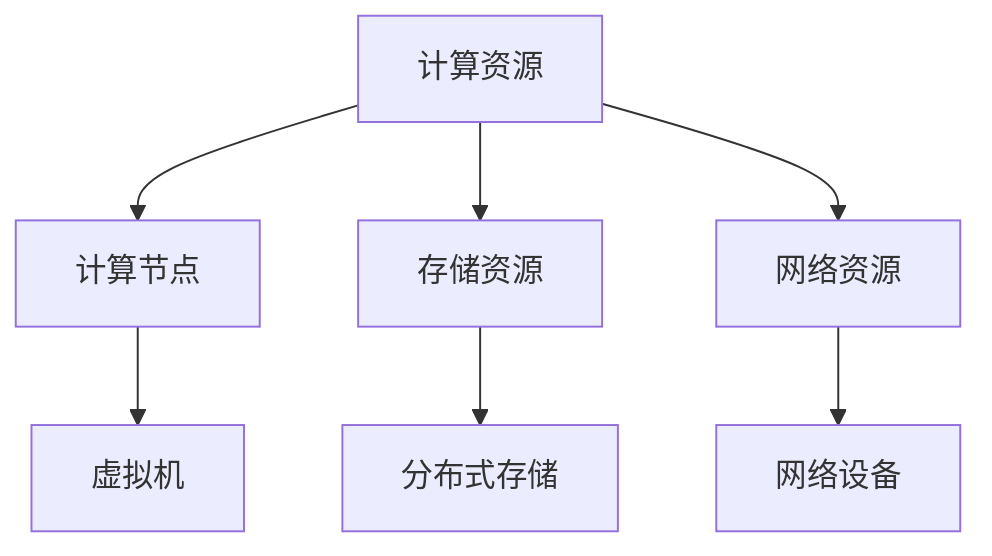
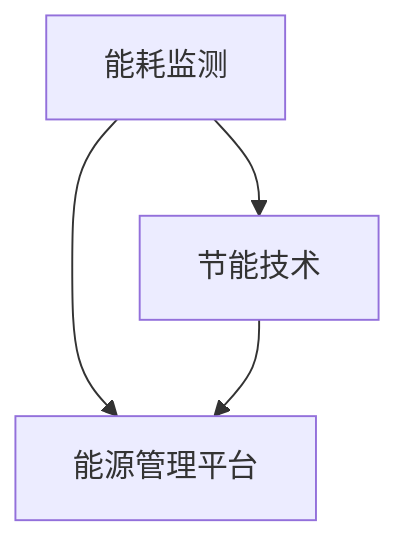

                 

### 《AI 大模型应用数据中心建设：数据中心标准与规范》概述

#### 关键词
- AI大模型
- 数据中心建设
- 标准与规范
- 能耗管理
- 安全可靠性
- 智能化运维

#### 摘要
本文深入探讨了AI大模型应用数据中心的建设过程，包括数据中心设计标准、建设规范以及AI大模型在数据中心的应用。首先，我们回顾了数据中心的发展历程和AI大模型在数据中心中的重要性，随后详细介绍了数据中心的基础架构和核心算法原理。接着，本文提出了数据中心能耗管理的数学模型，并通过实际案例讲解了数据中心能耗监控平台的搭建。最后，文章对国内外数据中心建设案例进行了分析，展望了数据中心建设的未来趋势，并提供了数据中心建设的相关参考资料。

### 目录大纲

**第一部分：数据中心建设概述**

### 第1章：数据中心建设背景与意义
#### 1.1 数据中心发展历程
#### 1.2 数据中心在AI大模型应用中的重要性
#### 1.3 数据中心建设的挑战与机遇

### 第2章：数据中心基础架构
#### 2.1 数据中心物理布局
#### 2.2 网络架构设计
#### 2.3 存储系统架构
#### 2.4 计算资源分配

**第二部分：数据中心标准与规范**

### 第3章：数据中心设计标准
#### 3.1 能耗与散热标准
#### 3.2 安全与可靠性标准
#### 3.3 冷却与供电标准
#### 3.4 数据传输标准

### 第4章：数据中心建设规范
#### 4.1 设计与施工规范
#### 4.2 设备选型规范
#### 4.3 维护与管理规范
#### 4.4 安全管理规范

**第三部分：AI大模型应用与数据中心优化**

### 第5章：AI大模型在数据中心的应用
#### 5.1 AI大模型数据中心架构
#### 5.2 AI大模型计算需求分析
#### 5.3 AI大模型数据处理与存储
#### 5.4 AI大模型性能优化

### 第6章：数据中心智能化运维
#### 6.1 智能化运维概念
#### 6.2 智能化监控与预警
#### 6.3 智能化决策支持
#### 6.4 智能化运维实践案例

**第四部分：案例分析与展望**

### 第7章：国内外数据中心建设案例分析
#### 7.1 国内数据中心建设现状
#### 7.2 国外数据中心建设经验
#### 7.3 案例分析与启示

### 第8章：数据中心建设未来展望
#### 8.1 数据中心发展趋势
#### 8.2 AI大模型数据中心创新方向
#### 8.3 数据中心建设面临的挑战与对策

### 附录
### 附录A：数据中心建设参考资料
#### A.1 标准规范
#### A.2 技术文献
#### A.3 行业报告

#### 核心概念与联系
为了更好地理解数据中心建设和AI大模型应用，我们首先需要明确一些核心概念和它们之间的关系。

#### 数据中心架构
数据中心架构是数据中心的核心，包括计算资源、存储资源和网络资源。以下是一个简化的数据中心架构Mermaid流程图：



计算节点负责处理数据，虚拟机提供灵活的计算能力；存储资源包括分布式存储，负责数据的存储和管理；网络资源则确保数据在各组件间的高效传输。

#### 数据中心能耗管理
数据中心能耗管理是确保数据中心高效运行的关键。以下是一个简单的能耗管理流程图：



能耗监测通过传感器实时获取能耗数据，节能技术通过优化硬件和软件来降低能耗，能源管理平台则综合管理这些数据，提供能耗报告和优化建议。

#### 核心算法原理讲解
在数据中心中，负载均衡算法是保证计算资源有效利用的重要算法。以下是一个简单的负载均衡算法伪代码：

```python
# 伪代码：负载均衡算法
function load_balance(server_list, request):
    load = [0 for _ in range(len(server_list))]
    min_load_server = min(server_list, key=lambda x: load[x])
    server_list[request.server_id] = server_list[request.server_id] + 1
    total_load = sum(load)
    if total_load > threshold:
        request.server_id = min(server_list, key=lambda x: load[x])
        load_balance(server_list, request)
```

该算法通过计算各服务器的负载情况，将请求分配到负载最低的服务器上，如果总负载超过阈值，则重新分配请求。

#### 数学模型和数学公式 & 详细讲解 & 举例说明
在数据中心能耗管理中，最小生成树算法用于构建能耗最低的电力网络。其数学模型为：

$$
C(V, E) = \min \sum_{e \in T} w(e)
$$

其中，$C(V, E)$ 表示所有 $V$ 中的 $E$ 的子集所构成的集合，$T$ 是 $C(V, E)$ 中所有生成树的集合，$w(e)$ 是边 $e$ 的权重。

**举例说明**：
假设我们有以下无向图，边的权重分别表示边上的传输速度：

```
A --- B (10)
|      |
5      2
|      |
A --- C (15)
```

根据上述公式，我们需要找到权重最小的生成树。

1. 计算所有边的权重和：$10 + 2 + 5 + 15 = 32$
2. 从所有边中找出权重最小的边：$2$（边 AB）
3. 移除该边，计算剩余边的权重和：$10 + 5 + 15 = 30$
4. 从剩余边中找出权重最小的边：$5$（边 AC）
5. 移除该边，计算剩余边的权重和：$10 + 15 = 25$

最终，我们得到的权重最小的生成树是：A-B-C。

#### 项目实战
以下是一个数据中心能耗监控平台的项目实战案例。

**开发环境搭建：**
1. 安装操作系统：选择Linux发行版，如Ubuntu 20.04
2. 安装Python环境：使用pip安装Python 3和相关依赖库
3. 安装MySQL：用于存储能耗数据
4. 安装Flask：用于搭建Web应用

**源代码详细实现和代码解读：**
- 数据库配置和模型建立
- 能耗数据采集和存储
- 前端页面设计

**代码解读与分析：**
- 数据采集模块：使用Python的pymysql库连接数据库，从传感器获取能耗数据
- 数据存储模块：使用Flask的SQLAlchemy库，定义模型并操作数据库
- 前端页面：使用Flask的Jinja2模板引擎，渲染页面并提供能耗数据可视化

**实际案例：**
- 搭建一个能耗监控平台，实时显示数据中心的能耗情况，提供报警功能

通过上述核心概念与联系、核心算法原理讲解、数学模型和公式、项目实战，我们为读者提供了一个清晰的数据中心建设和AI大模型应用的技术框架，为后续章节的深入探讨奠定了基础。

#### 第一部分：数据中心建设概述

### 第1章：数据中心建设背景与意义

#### 1.1 数据中心发展历程

数据中心的发展可以追溯到20世纪50年代，当时计算机刚刚问世，企业开始意识到集中存储和处理数据的重要性。早期的数据中心主要是为了存储和管理企业内部的业务数据，通常位于企业内部，规模较小。随着计算机技术的不断进步和互联网的普及，数据中心逐渐成为企业信息系统的核心，规模和复杂性也在不断提升。

在20世纪80年代和90年代，数据中心开始向大型化、集中化方向发展。这一时期，服务器技术和网络技术得到了显著提升，企业开始采用分布式计算架构来提高数据处理能力。同时，随着互联网的快速发展，数据中心的重要性愈发凸显，逐渐成为企业IT基础设施的核心。

进入21世纪，云计算、大数据和人工智能等新兴技术的兴起，进一步推动了数据中心的发展。数据中心不再仅仅是一个存储和处理数据的场所，而是一个集成了计算、存储、网络等多种资源的服务平台。现代数据中心通常采用模块化设计，可以实现弹性扩展和高效管理，满足不断增长的数据处理需求。

#### 1.2 数据中心在AI大模型应用中的重要性

数据中心在AI大模型应用中的重要性不言而喻。AI大模型通常需要大量的计算资源和数据存储空间，而数据中心提供了这些资源的基础设施支持。具体来说，数据中心在AI大模型应用中的重要性体现在以下几个方面：

1. **计算资源**：AI大模型训练和推理过程需要大量的计算资源，数据中心提供了高性能的计算节点和分布式计算能力，可以满足AI大模型对计算性能的需求。

2. **数据存储**：AI大模型需要处理和分析大量数据，数据中心提供了高效的存储解决方案，包括分布式存储系统和高速数据传输网络，可以保障数据的高效存储和访问。

3. **网络架构**：数据中心提供的网络架构可以满足AI大模型对高速网络传输的需求，确保数据在各计算节点和存储节点间的快速传输。

4. **安全与可靠性**：数据中心具备完善的安全措施和可靠性保障，可以保障AI大模型的数据安全和系统稳定运行。

5. **能耗管理**：数据中心通过节能技术和能源管理平台，可以降低AI大模型运行过程中的能耗，提高能源利用效率。

总之，数据中心是AI大模型应用的基石，为其提供了强大的基础设施支持。随着AI技术的不断发展和应用场景的拓展，数据中心在AI大模型应用中的重要性将愈发凸显。

#### 1.3 数据中心建设的挑战与机遇

数据中心建设面临着诸多挑战和机遇。以下将详细探讨这些挑战与机遇，以帮助读者更好地理解数据中心建设的重要性。

1. **挑战**

   1. **能耗与散热**：数据中心运行过程中会产生大量热量，能耗管理成为一大挑战。如何降低能耗、优化散热系统是数据中心建设需要面对的关键问题。

   2. **安全性**：数据中心存储和处理大量敏感数据，安全性至关重要。数据中心需要建立健全的安全机制，包括物理安全、网络安全和数据安全，以保障数据的安全性和隐私性。

   3. **可靠性**：数据中心需要提供高可靠性的运行环境，以确保系统稳定运行。数据中心应具备冗余设计和故障恢复机制，以应对潜在的系统故障。

   4. **扩展性**：随着数据量的不断增加，数据中心需要具备良好的扩展性，能够快速适应业务需求的变化。如何实现灵活的扩展和资源调度成为数据中心建设的重要课题。

2. **机遇**

   1. **技术创新**：云计算、大数据、人工智能等新兴技术的快速发展，为数据中心建设提供了新的技术手段和解决方案。数据中心可以通过技术创新，提升数据处理能力和服务水平。

   2. **市场机遇**：随着企业对数据中心需求的不断增长，市场机遇也日益显现。数据中心建设企业可以通过提供定制化、专业化的服务，抓住市场机遇，实现业务增长。

   3. **行业整合**：数据中心建设领域的竞争日趋激烈，行业整合趋势明显。数据中心建设企业可以通过并购、合作等方式，实现资源和技术的整合，提升竞争力。

   4. **绿色环保**：随着环保意识的提高，绿色数据中心成为发展趋势。数据中心可以通过采用节能技术和可再生能源，降低能源消耗，实现绿色环保。

总之，数据中心建设既面临着诸多挑战，也蕴藏着巨大的机遇。通过技术创新、市场拓展和行业整合，数据中心建设企业可以克服挑战，抓住机遇，实现可持续发展。

### 第二部分：数据中心基础架构

#### 第2章：数据中心基础架构

#### 2.1 数据中心物理布局

数据中心物理布局是数据中心建设的基础，合理的物理布局能够提高数据中心的运行效率、可靠性和安全性。以下将介绍数据中心物理布局的主要考虑因素和常用布局方案。

1. **主要考虑因素**

   1. **安全性**：数据中心应具备完善的物理安全措施，包括防火、防水、防盗等。同时，数据中心应选择远离自然灾害频发区域，确保建筑物的稳定性。

   2. **可靠性**：数据中心的布局应考虑冗余设计，确保关键设备和服务不受单点故障的影响。例如，电力供应、网络连接、冷却系统等均应具备冗余备份。

   3. **可扩展性**：数据中心布局应预留足够的空间和扩展接口，以便在未来业务需求增长时进行扩展。例如，机架、冷却系统、网络设备等均应具备良好的扩展性。

   4. **能耗管理**：数据中心布局应考虑能耗优化，降低能源消耗。例如，合理规划设备布局，利用自然冷却等节能措施。

2. **常用布局方案**

   1. **集中式布局**：集中式布局将所有关键设备和基础设施集中在一个区域内，便于管理和维护。适用于中小型数据中心。

   ```mermaid
   graph TD
   A[入口] --> B[配电室]
   B --> C[网络核心区]
   C --> D[计算存储区]
   D --> E[冷却系统]
   ```

   2. **分布式布局**：分布式布局将关键设备和基础设施分散在不同区域内，提高数据中心的可靠性和可扩展性。适用于大型数据中心。

   ```mermaid
   graph TD
   A[入口] --> B[配电室]
   B --> C[网络核心区]
   C --> D[计算存储区1]
   D --> E[冷却系统1]
   C --> F[计算存储区2]
   F --> G[冷却系统2]
   ```

   3. **模块化布局**：模块化布局将数据中心划分为多个模块，每个模块具备独立的计算、存储和网络资源，实现灵活的扩展和调度。适用于大规模数据中心。

   ```mermaid
   graph TD
   A[入口] --> B[配电室]
   B --> C[网络核心区]
   C --> D[模块1]
   D --> E[计算存储区1]
   D --> F[冷却系统1]
   C --> G[模块2]
   G --> H[计算存储区2]
   G --> I[冷却系统2]
   ```

#### 2.2 网络架构设计

网络架构设计是数据中心基础架构的重要组成部分，直接影响数据中心的性能和可靠性。以下将介绍数据中心网络架构的主要设计原则和常用网络拓扑。

1. **主要设计原则**

   1. **高可用性**：网络架构应具备冗余设计，确保关键网络路径不受单点故障影响，提高网络可靠性。

   2. **高性能**：网络架构应支持高速数据传输，满足数据中心内部和外部数据传输需求。

   3. **可扩展性**：网络架构应具备良好的扩展性，能够适应未来业务需求增长。

   4. **安全性**：网络架构应具备完善的安全机制，包括防火墙、入侵检测、访问控制等，确保网络数据的安全和隐私。

2. **常用网络拓扑**

   1. **环网拓扑**：环网拓扑通过环形结构实现数据传输，具有较高的可靠性和性能。适用于中小型数据中心。

   ```mermaid
   graph TD
   A[核心交换机1] --> B[核心交换机2]
   B --> A
   A --> C[计算节点1]
   B --> D[计算节点2]
   C --> A
   D --> B
   ```

   2. **星型拓扑**：星型拓扑通过中心交换机连接各计算节点，实现数据传输。具有较高的性能和可扩展性，适用于大型数据中心。

   ```mermaid
   graph TD
   A[核心交换机]
   B[计算节点1]
   C[计算节点2]
   A --> B
   A --> C
   ```

   3. **树型拓扑**：树型拓扑通过分层结构连接核心交换机、接入交换机和计算节点，实现数据传输。具有较高的可扩展性和灵活性，适用于大型数据中心。

   ```mermaid
   graph TD
   A[核心交换机]
   B[接入交换机1]
   C[接入交换机2]
   D[计算节点1]
   E[计算节点2]
   A --> B
   A --> C
   B --> D
   C --> E
   ```

   4. **混合拓扑**：混合拓扑结合多种网络拓扑的特点，实现更高效的数据传输和更高的可靠性。适用于大型、复杂的数据中心。

   ```mermaid
   graph TD
   A[核心交换机]
   B[接入交换机1]
   C[接入交换机2]
   D[计算节点1]
   E[计算节点2]
   A --> B
   A --> C
   B --> D
   C --> E
   D --> A
   E --> A
   ```

#### 2.3 存储系统架构

存储系统架构是数据中心基础架构的核心组成部分，直接影响数据中心的存储性能和可靠性。以下将介绍数据中心存储系统的主要架构类型和关键设计要素。

1. **主要架构类型**

   1. **分布式存储系统**：分布式存储系统通过多个节点实现数据存储和管理，具有较高的扩展性和可靠性。适用于大规模数据中心。

   ```mermaid
   graph TD
   A[客户端] --> B[分布式存储节点1]
   A --> C[分布式存储节点2]
   B --> D[数据副本]
   C --> D
   ```

   2. **集中式存储系统**：集中式存储系统通过单一存储设备实现数据存储和管理，具有较高的性能和可控性。适用于中小型数据中心。

   ```mermaid
   graph TD
   A[客户端] --> B[集中式存储设备]
   B --> C[数据]
   ```

   3. **混合存储系统**：混合存储系统结合分布式存储和集中式存储的优势，实现更高效的数据存储和管理。适用于大型、复杂的数据中心。

   ```mermaid
   graph TD
   A[客户端] --> B[分布式存储节点1]
   A --> C[分布式存储节点2]
   B --> D[数据副本]
   C --> D
   D --> E[集中式存储设备]
   ```

2. **关键设计要素**

   1. **数据存储**：数据存储设计应考虑数据分布、数据冗余和数据复制策略，确保数据的安全性和可靠性。

   2. **数据访问**：数据访问设计应考虑数据读写性能、访问控制和数据备份策略，满足数据访问需求。

   3. **存储扩展性**：存储扩展性设计应考虑存储设备的扩展接口、存储容量和性能扩展，实现灵活的扩展和调度。

   4. **存储安全性**：存储安全性设计应考虑数据加密、访问控制和数据备份，确保数据的安全性和隐私性。

#### 2.4 计算资源分配

计算资源分配是数据中心基础架构设计的关键环节，直接影响数据中心的计算性能和资源利用率。以下将介绍数据中心计算资源分配的主要策略和方法。

1. **主要策略**

   1. **负载均衡**：负载均衡策略通过分配计算任务，实现计算资源的均衡利用，避免单点过载。常用的负载均衡算法包括随机负载均衡、轮询负载均衡和最小连接负载均衡。

   ```mermaid
   graph TD
   A[客户端请求] --> B[负载均衡器]
   B --> C[计算节点1]
   B --> D[计算节点2]
   ```

   2. **资源预留**：资源预留策略通过预先分配计算资源，确保关键任务的资源需求得到满足。适用于对计算性能要求较高的任务。

   ```mermaid
   graph TD
   A[关键任务] --> B[资源预留]
   B --> C[计算节点]
   ```

   3. **资源调度**：资源调度策略通过动态调整计算资源分配，实现计算资源的最大化利用。常用的资源调度算法包括最长作业优先、最短剩余时间优先和轮转调度。

   ```mermaid
   graph TD
   A[作业队列] --> B[资源调度器]
   B --> C[计算节点1]
   B --> D[计算节点2]
   ```

2. **主要方法**

   1. **固定分配**：固定分配方法通过预先分配固定的计算资源，适用于任务数量和计算资源相对稳定的情况。

   ```mermaid
   graph TD
   A[计算任务] --> B[固定分配资源]
   B --> C[计算节点]
   ```

   2. **动态分配**：动态分配方法通过实时调整计算资源分配，适用于任务数量和计算资源变化较大的情况。

   ```mermaid
   graph TD
   A[计算任务] --> B[动态分配资源]
   B --> C[计算节点]
   ```

   3. **分布式计算**：分布式计算方法通过将任务分配到多个计算节点并行执行，提高计算效率。适用于大规模并行计算任务。

   ```mermaid
   graph TD
   A[计算任务] --> B[分布式计算节点1]
   A --> C[分布式计算节点2]
   B --> D[计算结果]
   C --> D
   ```

通过上述对数据中心物理布局、网络架构设计、存储系统架构和计算资源分配的介绍，我们可以看到数据中心基础架构的复杂性和重要性。一个合理且高效的数据中心基础架构是保障数据中心正常运行、提升业务性能的关键。

### 第三部分：数据中心标准与规范

#### 第3章：数据中心设计标准

#### 3.1 能耗与散热标准

数据中心的能耗与散热管理是确保其高效运行的关键环节。以下是数据中心在能耗管理和散热设计方面的一些关键标准。

1. **能耗标准**

   1. **PUE（Power Usage Effectiveness）**：PUE是衡量数据中心能耗效率的重要指标，计算公式为PUE = 数据中心总能耗 / IT设备能耗。理想情况下，PUE应接近1，但实际中大多数数据中心的PUE在1.2到1.5之间。为了降低PUE，数据中心应采用节能技术和优化设计。

   2. **能效比（Energy Efficiency Ratio, EER）**：EER是空调系统的能效指标，用于衡量单位制冷量所需的能耗。数据中心的EER应在行业推荐范围内，以减少能源消耗。

   3. **绿色建筑标准（Green Building Standards）**：例如LEED（Leadership in Energy and Environmental Design）认证，对数据中心的建筑设计和能源管理提出了具体要求，旨在实现绿色环保。

2. **散热设计标准**

   1. **冷却系统设计**：数据中心冷却系统设计应考虑高效性和可靠性，包括水冷、风冷和液冷等多种冷却方式。冷却系统的设计应满足数据中心的散热需求，同时降低能耗。

   2. **散热设备布局**：散热设备的布局应合理，确保冷热空气的充分流动，提高散热效率。常见的布局方式包括下送上回和侧送风等。

   3. **散热管道设计**：散热管道设计应考虑水流阻力、管路长度和连接方式，确保冷却液高效传输，降低能耗。

   4. **环境监测与控制**：通过环境监测系统，实时监控数据中心内的温度、湿度等环境参数，确保在最佳运行范围内。同时，采用自动化控制系统，根据环境参数调整冷却设备运行状态，优化能耗。

#### 3.2 安全与可靠性标准

数据中心的运营离不开严格的安全与可靠性标准，以下是一些关键的安全与可靠性设计标准。

1. **物理安全标准**

   1. **门禁控制**：数据中心应设置完善的门禁控制系统，包括生物识别、密码和IC卡等多种认证方式，确保只有授权人员才能进入。

   2. **视频监控**：数据中心应部署高分辨率摄像头，实现对关键区域的全方位监控，确保实时监控和事后回溯。

   3. **防火措施**：数据中心应配备自动灭火系统、烟雾探测器和防火门等防火设备，确保在火灾发生时能够迅速响应。

   4. **防水措施**：数据中心应设置防水屏障，防止因管道破裂、暴雨等意外事件导致的设备进水。

2. **网络安全标准**

   1. **防火墙与入侵检测系统**：数据中心应部署防火墙和入侵检测系统（IDS），防止外部攻击和未经授权的访问。

   2. **访问控制**：数据中心应采用多层次的访问控制机制，包括网络访问控制、主机访问控制和数据库访问控制，确保只有授权用户才能访问敏感数据。

   3. **加密传输**：数据中心的数据传输应采用加密技术，如TLS/SSL等，确保数据在传输过程中不会被窃取或篡改。

   4. **备份与恢复**：数据中心应定期备份数据，并制定详细的灾难恢复计划，确保在发生数据丢失或系统故障时能够迅速恢复。

3. **系统可靠性标准**

   1. **冗余设计**：数据中心的关键设备和网络链路应具备冗余设计，确保在单点故障发生时能够自动切换到备用设备或链路，确保系统连续运行。

   2. **故障检测与自愈**：数据中心应部署故障检测系统，实时监控设备状态和性能指标，一旦检测到故障，系统能够自动进行故障切换或重启故障设备。

   3. **容错机制**：数据中心应具备容错机制，确保在部分设备或链路故障时，系统能够继续正常运行。

#### 3.3 冷却与供电标准

数据中心的冷却与供电系统是保障数据中心正常运行的基础，以下是一些关键的冷却与供电设计标准。

1. **冷却系统标准**

   1. **冷却方式**：数据中心应采用多种冷却方式，包括水冷、风冷和液冷等，根据实际需求选择合适的冷却方式。

   2. **冷却效率**：冷却系统的设计应考虑高效性，确保在满足散热需求的同时，降低能耗。

   3. **冷却设备配置**：冷却设备的配置应满足数据中心的散热需求，并具备足够的冗余能力，确保在设备故障时能够继续运行。

   4. **冷却管道设计**：冷却管道的设计应考虑水流阻力、管路长度和连接方式，确保冷却液高效传输。

2. **供电系统标准**

   1. **多电源供电**：数据中心应采用多电源供电方式，包括市电、发电机和UPS（不间断电源）等，确保在主电源故障时能够自动切换到备用电源。

   2. **UPS配置**：UPS的配置应满足数据中心的负载需求，并具备足够的冗余能力，确保在UPS故障时能够继续运行。

   3. **电池备份**：电池备份系统应确保在UPS故障时，能够提供足够的电力支持，确保数据中心的持续运行。

   4. **配电系统设计**：配电系统的设计应考虑可靠性、安全性和灵活性，包括配电柜、断路器和接地系统等。

#### 3.4 数据传输标准

数据传输标准是保障数据中心内部和外部数据传输高效、安全的关键，以下是一些关键的数据传输设计标准。

1. **内部数据传输标准**

   1. **网络架构**：数据中心的内部网络架构应设计为高效、可靠的环形或星型拓扑，确保数据传输路径稳定。

   2. **带宽需求**：数据中心的带宽设计应满足当前和未来业务需求，确保数据传输速率足够。

   3. **传输速率**：数据中心的传输速率应选择高速网络设备，如10Gbps、40Gbps或100Gbps，确保数据传输速度。

   4. **延迟**：数据中心的网络延迟应控制在合理范围内，确保数据传输的实时性。

2. **外部数据传输标准**

   1. **网络连接**：数据中心的外部网络连接应选择高质量、高带宽的互联网服务提供商，确保外部数据传输的稳定性。

   2. **安全传输**：数据中心的网络传输应采用加密技术，如TLS/SSL等，确保数据在传输过程中不会被窃取或篡改。

   3. **QoS（Quality of Service）**：数据中心的网络应支持QoS功能，确保重要数据传输获得优先保障，提高数据传输的可靠性。

   4. **容错与备份**：数据中心的网络设计应具备容错和备份功能，确保在部分网络设备或链路故障时，数据传输不受影响。

通过上述对数据中心能耗与散热、安全与可靠性、冷却与供电以及数据传输设计标准的介绍，我们可以看到数据中心标准与规范对于确保数据中心高效、稳定和安全运行的重要性。遵循这些标准与规范，可以帮助数据中心建设者更好地规划和管理数据中心，提升数据中心的整体性能和用户体验。

#### 第4章：数据中心建设规范

#### 4.1 设计与施工规范

数据中心建设是一个复杂且系统的工程，涉及到多个方面的设计与施工规范。以下是数据中心建设过程中需要遵循的一些关键规范。

1. **设计规范**

   1. **总体规划**：数据中心的设计应进行全面的总体规划，包括场地选择、建筑布局、设备配置、电力和网络架构等。总体规划应考虑未来扩展性和灵活性。

   2. **建筑规范**：数据中心建筑应符合建筑规范，包括防火、防水、抗震等要求。建筑结构应能够承受未来扩展所需的荷载。

   3. **设备选型**：数据中心的设备选型应考虑性能、可靠性、可扩展性和能耗，选择符合标准的高质量设备。

   4. **能源设计**：数据中心应设计高效的能源系统，包括供电、备用电源、能源管理平台等，确保能源的可持续供应和高效利用。

   5. **网络设计**：数据中心的网络设计应考虑冗余、可靠性和安全性，包括核心网络、边缘网络、无线网络等，确保数据的高速传输和安全性。

2. **施工规范**

   1. **施工准备**：在施工前，应进行充分的施工准备，包括图纸审核、人员培训、物料准备等，确保施工顺利进行。

   2. **施工进度**：施工进度应按照计划进行，确保各阶段工作按时完成，避免施工延误。

   3. **质量控制**：施工过程中，应严格按照质量标准进行质量控制，确保施工质量达到设计要求。关键环节应进行监控和检验。

   4. **安全施工**：施工过程中，应严格遵守安全操作规程，确保施工人员的安全和施工环境的安全。

   5. **环境监测**：施工过程中，应对施工环境进行实时监测，包括噪音、粉尘、化学品泄漏等，确保施工对环境的影响降到最低。

#### 4.2 设备选型规范

数据中心设备选型是确保数据中心性能和可靠性的关键环节。以下是设备选型过程中需要遵循的一些规范。

1. **服务器选型**

   1. **计算性能**：服务器选型应考虑计算性能，包括CPU、内存、硬盘等硬件配置，确保服务器能够满足业务需求。

   2. **可靠性**：服务器选型应考虑可靠性，包括品牌、性能、维护成本等，选择具有高可靠性的服务器。

   3. **扩展性**：服务器选型应考虑扩展性，包括接口数量、硬盘容量、内存升级等，确保服务器能够适应未来扩展需求。

   4. **能耗**：服务器选型应考虑能耗，选择能效比高的服务器，降低数据中心的总体能耗。

2. **存储设备选型**

   1. **容量**：存储设备选型应考虑容量，选择能够满足当前和未来业务需求的存储设备。

   2. **性能**：存储设备选型应考虑性能，包括读写速度、IOPS等指标，确保数据的高速访问和传输。

   3. **可靠性**：存储设备选型应考虑可靠性，包括冗余设计、数据保护等，确保数据的安全和完整。

   4. **兼容性**：存储设备选型应考虑兼容性，确保存储设备与现有系统兼容，便于集成和管理。

3. **网络设备选型**

   1. **性能**：网络设备选型应考虑性能，包括带宽、处理能力等，确保网络设备能够支持数据中心的高性能需求。

   2. **可靠性**：网络设备选型应考虑可靠性，包括设备品牌、稳定性、故障恢复等，确保网络的稳定运行。

   3. **安全性**：网络设备选型应考虑安全性，包括防火墙、VPN、加密等，确保数据传输的安全。

   4. **可扩展性**：网络设备选型应考虑可扩展性，包括接口数量、支持协议等，确保网络设备能够适应未来扩展需求。

#### 4.3 维护与管理规范

数据中心的维护与管理是确保数据中心正常运行和持续优化的重要环节。以下是数据中心维护与管理过程中需要遵循的一些规范。

1. **定期维护**

   1. **设备维护**：定期对服务器、存储设备、网络设备等硬件进行维护，包括清洁、检查、更换零部件等，确保设备的正常运行。

   2. **软件维护**：定期对操作系统、应用软件等进行更新和升级，修复漏洞、优化性能，确保软件的稳定性和安全性。

   3. **环境维护**：定期对数据中心的环境进行维护，包括温度、湿度、灰尘等，确保环境参数在合理范围内。

2. **安全管理**

   1. **物理安全**：确保数据中心物理安全，包括门禁控制、视频监控、防火措施等，防止未经授权的访问和物理损坏。

   2. **网络安全**：确保数据中心网络安全，包括防火墙、入侵检测、数据加密等，防止网络攻击和数据泄露。

   3. **数据安全**：确保数据中心数据安全，包括数据备份、容灾、访问控制等，防止数据丢失和未经授权的访问。

3. **性能优化**

   1. **监控与预警**：通过监控系统，实时监控数据中心的运行状态，包括性能、资源利用率、故障等，确保及时发现和解决潜在问题。

   2. **负载均衡**：通过负载均衡技术，合理分配计算任务，避免单点过载，确保数据中心的计算资源得到充分利用。

   3. **能耗管理**：通过能耗管理系统，实时监控数据中心的能耗情况，优化冷却系统和供电系统，降低能耗。

#### 4.4 安全管理规范

数据中心的运营过程中，安全管理至关重要，以下是数据中心安全管理的一些关键规范。

1. **人员安全管理**

   1. **身份认证**：数据中心应建立严格的身份认证制度，确保只有授权人员才能访问数据中心。

   2. **访问控制**：数据中心应实施访问控制措施，根据用户的角色和权限，限制用户对数据和系统的访问。

   3. **培训与教育**：定期对员工进行安全培训和教育，提高员工的安全意识和应对能力。

2. **网络安全**

   1. **防火墙**：数据中心应部署防火墙，限制外部访问，防止未经授权的访问和攻击。

   2. **入侵检测系统（IDS）**：部署入侵检测系统，实时监控网络流量，发现和阻止恶意攻击。

   3. **加密**：对敏感数据进行加密传输和存储，确保数据在传输和存储过程中不被窃取或篡改。

3. **数据安全**

   1. **数据备份**：定期对数据进行备份，确保数据在意外事件中能够迅速恢复。

   2. **容灾备份**：建立容灾备份系统，确保在主数据中心发生灾难时，能够迅速切换到备用数据中心，确保业务的连续性。

   3. **访问控制**：对数据库和存储系统实施严格的访问控制，防止未经授权的访问和操作。

通过上述对数据中心设计与施工规范、设备选型规范、维护与管理规范以及安全管理规范的介绍，我们可以看到数据中心建设规范的全面性和重要性。遵循这些规范，可以帮助数据中心建设者确保数据中心的性能、可靠性、安全性和可持续性。

### 第四部分：AI大模型应用与数据中心优化

#### 第5章：AI大模型在数据中心的应用

随着人工智能技术的飞速发展，AI大模型已成为数据中心中的重要应用之一。AI大模型具有极高的计算需求和数据处理能力，数据中心需要为AI大模型提供强大的计算资源、高效的存储系统和稳定的网络环境。以下是AI大模型在数据中心中的应用场景和关键优化策略。

#### 5.1 AI大模型数据中心架构

AI大模型数据中心架构是支持AI大模型训练和推理的核心基础设施。以下是一个典型的AI大模型数据中心架构：

1. **计算资源层**：计算资源层是AI大模型数据中心的核心，包括高性能计算节点、GPU集群和分布式计算框架。计算节点负责执行AI大模型的训练和推理任务，GPU集群提供并行计算能力，分布式计算框架实现计算任务的调度和负载均衡。

2. **存储资源层**：存储资源层用于存储AI大模型训练数据、模型参数和中间结果。存储资源层包括高速SSD存储、分布式文件系统（如HDFS）和对象存储（如Amazon S3）。高速SSD存储提供低延迟的数据访问，分布式文件系统支持大规模数据存储和并行处理，对象存储提供灵活的数据存储和管理。

3. **网络资源层**：网络资源层确保计算资源和存储资源之间的数据传输速度和可靠性。网络资源层包括高速以太网、光纤网络和SD-WAN。高速以太网提供内部网络的高带宽和低延迟，光纤网络实现跨区域的数据传输，SD-WAN提供灵活的网络连接和管理。

4. **数据管理层**：数据管理层负责AI大模型训练数据的管理、处理和共享。数据管理层包括数据清洗、数据集成、数据湖和数据仓库。数据清洗确保训练数据的质量，数据集成实现数据的统一管理和访问，数据湖提供大规模数据的存储和查询，数据仓库提供数据的分析和报告。

5. **平台层**：平台层是AI大模型数据中心的应用界面，包括模型开发工具、训练管理平台和推理服务。模型开发工具支持AI大模型的开发和调试，训练管理平台提供训练任务的调度和管理，推理服务实现AI大模型的在线和离线推理。

#### 5.2 AI大模型计算需求分析

AI大模型计算需求分析是数据中心设计和优化的重要环节。以下是对AI大模型计算需求的分析：

1. **计算性能需求**：AI大模型训练和推理通常需要高性能的计算资源。计算性能需求包括计算节点的CPU性能、GPU性能和内存容量。CPU性能决定了模型训练的效率，GPU性能决定了模型推理的速度，内存容量决定了模型训练和推理的数据存储能力。

2. **计算资源利用率**：数据中心需要优化计算资源的利用率，避免资源浪费。计算资源利用率可以通过负载均衡和动态调度来实现。负载均衡根据计算节点的负载情况，将任务分配到合适的节点，避免单点过载。动态调度根据任务的需求和资源情况，实时调整计算资源的分配，确保资源的最大化利用。

3. **计算资源扩展性**：AI大模型计算需求具有不确定性，数据中心需要具备良好的扩展性，以应对计算需求的波动。计算资源扩展性可以通过虚拟化技术、容器化和分布式计算来实现。虚拟化技术将物理服务器虚拟化为多个虚拟机，实现计算资源的灵活分配和调度。容器化技术将应用封装在容器中，实现快速部署和资源隔离。分布式计算技术通过将计算任务分配到多个节点并行执行，提高计算效率和性能。

#### 5.3 AI大模型数据处理与存储

AI大模型数据处理与存储是数据中心设计和优化的重要方面。以下是对AI大模型数据处理与存储的需求分析：

1. **数据处理需求**：AI大模型训练和推理过程中需要处理大量的数据，数据处理需求包括数据清洗、数据集成和数据预处理。数据清洗确保训练数据的质量，去除噪声和异常值。数据集成实现不同数据源的数据整合，提供统一的访问接口。数据预处理包括数据归一化、数据标准化和数据增强等，为模型训练提供高质量的数据。

2. **数据存储需求**：AI大模型训练和推理过程中需要存储大量的数据，数据存储需求包括数据容量和数据访问速度。数据容量需求取决于模型训练数据的大小和数量，需要选择合适的存储方案。数据访问速度需求取决于模型训练和推理的实时性要求，需要选择高性能的存储设备。

3. **数据存储优化**：为了提高数据存储的性能和效率，数据中心可以采取以下优化措施：

   - **分布式存储**：分布式存储将数据分散存储在多个节点上，提高数据存储的可靠性和访问速度。分布式存储系统如HDFS和Ceph可以提供高效的数据存储和访问。
   
   - **缓存技术**：缓存技术将常用数据存储在缓存设备中，提高数据访问速度。常用的缓存设备包括内存、SSD和分布式缓存系统。
   
   - **数据压缩**：数据压缩可以减少数据存储空间的需求，提高数据存储的效率。常用的数据压缩算法包括Huffman编码、LZ77和LZ78等。

#### 5.4 AI大模型性能优化

AI大模型性能优化是提高数据中心效率和用户体验的关键。以下是一些常见的AI大模型性能优化策略：

1. **模型压缩**：模型压缩通过减少模型的参数和计算量，降低模型的存储和计算需求。常用的模型压缩技术包括模型剪枝、量化、知识蒸馏等。

2. **模型加速**：模型加速通过提高模型的推理速度，提高数据中心的处理能力。常用的模型加速技术包括GPU加速、TPU加速、AI芯片加速等。

3. **分布式训练**：分布式训练通过将模型训练任务分配到多个节点并行执行，提高模型训练的效率。常用的分布式训练技术包括参数服务器架构、数据并行训练、模型并行训练等。

4. **混合精度训练**：混合精度训练通过在训练过程中使用不同精度的数据类型（如浮点数和整数），提高模型训练的效率和性能。常用的混合精度训练技术包括FP16和BF16。

5. **数据增强**：数据增强通过生成新的训练数据，提高模型的泛化能力。常用的数据增强技术包括数据变换、数据扩充、数据合成等。

通过上述对AI大模型数据中心架构、计算需求分析、数据处理与存储以及性能优化策略的介绍，我们可以看到数据中心在支持AI大模型应用中的重要作用。数据中心的设计和优化不仅要满足AI大模型的计算需求，还要确保数据的高效存储和处理，以提供高质量的服务和用户体验。

#### 第6章：数据中心智能化运维

随着数据中心规模的不断扩大和复杂性的增加，传统的手动运维模式已无法满足数据中心的运维需求。数据中心智能化运维应运而生，通过引入人工智能、机器学习和自动化技术，实现数据中心的智能监控、故障预测和自动化处理，提高运维效率和系统可靠性。以下将详细介绍数据中心智能化运维的概念、核心技术和实际应用。

#### 6.1 智能化运维概念

智能化运维（Intelligent Operations）是指通过应用人工智能、大数据分析和自动化技术，对数据中心的运行状态进行实时监控、分析和优化，从而实现高效、可靠和自动化的运维管理。智能化运维的核心目标是提高数据中心的运行效率、降低运维成本、提升用户满意度，并在故障发生时迅速响应和处理。

智能化运维包括以下几个关键组成部分：

1. **监控与预警**：通过实时监控数据中心的各项运行指标，如温度、湿度、电力消耗、网络流量等，及时发现异常情况并发出预警。

2. **故障预测**：利用历史数据和机器学习算法，预测潜在故障和性能瓶颈，提前进行预防性维护，减少故障发生。

3. **自动化处理**：通过自动化脚本和工具，自动执行日常运维任务，如系统更新、故障排除、资源调配等，减少人为干预，提高运维效率。

4. **优化与优化**：通过分析运维数据，识别运行过程中的问题和瓶颈，持续优化数据中心架构和运维流程，提高系统性能和稳定性。

#### 6.2 智能化监控与预警

智能化监控与预警是数据中心智能化运维的基础，通过实时监控数据中心的各项指标，确保系统的稳定运行。以下是一些关键技术和实践：

1. **监控系统**：构建全面的监控系统，包括硬件监控系统、网络监控系统和应用监控系统。硬件监控系统监控硬件设备的状态和性能，如CPU利用率、内存使用率、硬盘I/O等；网络监控系统监控网络流量、延迟和丢包情况；应用监控系统监控业务应用的性能和健康状况。

2. **指标收集与处理**：利用数据采集工具（如Prometheus、Zabbix等）收集各项监控指标，并进行实时处理和分析。通过数据预处理，如去噪、异常值检测和趋势分析，确保监控数据的准确性和可靠性。

3. **预警机制**：基于设定的阈值和规则，当监控指标超出正常范围时，系统自动发出预警通知。预警通知可以通过邮件、短信、IM工具等多种方式发送，确保运维人员及时了解异常情况。

4. **可视化仪表盘**：通过可视化仪表盘，将监控数据以图形化的形式展示，帮助运维人员快速了解数据中心的运行状态，发现潜在问题。

#### 6.3 智能化决策支持

智能化决策支持是数据中心智能化运维的高级阶段，通过分析大量运维数据，为运维决策提供科学依据。以下是一些关键技术和实践：

1. **数据分析与挖掘**：利用大数据分析技术和机器学习算法，对历史运维数据进行深入分析和挖掘，发现运行规律、趋势和潜在问题。

2. **预测模型**：基于历史数据和业务需求，建立预测模型，如故障预测模型、性能优化模型等，为运维决策提供预测和优化建议。

3. **决策支持系统**：构建决策支持系统，将分析结果和预测模型集成到运维管理平台中，为运维人员提供实时的决策支持，帮助其做出更准确和高效的运维决策。

4. **自动化决策**：在决策支持系统的支持下，实现部分运维任务的自动化决策，如故障预测、资源调配等，提高运维效率和准确性。

#### 6.4 智能化运维实践案例

以下是一个数据中心智能化运维的实践案例，展示了智能化运维在提升数据中心运维效率、降低运维成本和提升系统可靠性方面的实际效果。

**案例背景**：
某大型互联网公司拥有多个数据中心，随着业务规模的不断扩大，运维团队面临着巨大的运维压力。为了提高运维效率、降低运维成本和提升系统可靠性，公司决定引入智能化运维技术。

**实施步骤**：

1. **构建监控系统**：
   - 部署全面的监控工具，包括硬件监控、网络监控和应用监控，实现数据中心的全面监控。
   - 收集和整理监控数据，建立数据仓库，为后续的数据分析和决策提供基础。

2. **实施智能化监控与预警**：
   - 通过监控数据分析，设定合理的阈值和预警规则，实现实时预警。
   - 利用可视化仪表盘，实时展示数据中心的运行状态，帮助运维人员快速发现和解决问题。

3. **构建故障预测模型**：
   - 收集历史故障数据，利用机器学习算法，建立故障预测模型。
   - 通过故障预测模型，提前预测潜在故障，为预防性维护提供依据。

4. **自动化运维任务**：
   - 利用自动化脚本和工具，实现日常运维任务的自动化执行，如系统更新、故障排查、资源调配等。
   - 通过自动化决策支持系统，实现部分运维任务的自动化决策，提高运维效率和准确性。

**实施效果**：

1. **运维效率提升**：
   - 通过智能化监控与预警，运维人员能够及时发现和解决问题，响应时间显著缩短。
   - 通过自动化运维任务，减少人为干预，降低运维工作量，提高运维效率。

2. **运维成本降低**：
   - 通过故障预测模型，提前预测和解决潜在故障，减少故障发生和维修成本。
   - 通过自动化决策支持系统，实现运维任务的自动化执行，减少人工操作和错误，降低运维成本。

3. **系统可靠性提升**：
   - 通过智能化监控与预警，及时发现和解决异常情况，确保系统的稳定运行。
   - 通过自动化运维任务，确保系统配置和运行参数的合理性和一致性，提高系统可靠性。

通过上述实践案例，我们可以看到智能化运维在提升数据中心运维效率、降低运维成本和提升系统可靠性方面的显著效果。随着人工智能技术的不断进步，数据中心智能化运维将更加成熟和普及，为数据中心运营管理带来更多创新和变革。

### 第五部分：案例分析与展望

#### 第7章：国内外数据中心建设案例分析

随着全球数字化进程的加速，数据中心建设成为各国企业争相布局的重要领域。以下将分析国内外的数据中心建设现状，探讨其成功经验与挑战，以期为我国数据中心建设提供有益的借鉴。

#### 7.1 国内数据中心建设现状

我国数据中心建设起步较晚，但发展迅速。近年来，随着云计算、大数据和人工智能等新兴技术的普及，数据中心产业得到了快速发展。以下是国内数据中心建设的现状：

1. **规模不断扩大**：我国数据中心数量和规模持续增长，目前已拥有数以万计的数据中心，覆盖全国各个省份和城市。

2. **区域分布不均**：数据中心建设主要集中在东部沿海地区，如北京、上海、深圳等地，西部地区数据中心建设相对滞后。

3. **技术进步显著**：国内数据中心在技术方面取得了显著进步，如采用超大规模数据中心、智能运维、绿色能源等先进技术，提高数据中心的运行效率和环保水平。

4. **政策支持**：我国政府高度重视数据中心建设，出台了一系列政策措施，如鼓励企业建设绿色数据中心、支持数据中心产业发展等，为数据中心建设提供了良好的政策环境。

#### 7.2 国外数据中心建设经验

国外数据中心建设起步较早，经验丰富，以下是国外数据中心建设的一些成功经验：

1. **标准化建设**：国外数据中心建设注重标准化，遵循国际标准和行业规范，确保数据中心的建设质量和管理水平。

2. **技术创新**：国外数据中心在技术创新方面领先，如采用云计算、大数据、人工智能等技术，提高数据中心的计算能力和数据处理效率。

3. **绿色环保**：国外数据中心注重绿色环保，采用可再生能源、节能技术和智能冷却系统等，降低数据中心的能耗和碳排放。

4. **国际合作**：国外数据中心企业积极开展国际合作，通过技术交流、市场拓展等方式，提升自身竞争力。

#### 7.3 案例分析与启示

以下是几个国内外数据中心建设案例，分析其成功经验和挑战，为我国数据中心建设提供启示。

1. **美国谷歌数据中心**：谷歌数据中心是全球知名的数据中心之一，其成功经验主要体现在以下几个方面：

   - **技术创新**：谷歌数据中心采用了先进的冷却技术、高效供电系统和智能运维系统，提高数据中心的运行效率和管理水平。
   - **绿色环保**：谷歌数据中心采用可再生能源和节能技术，实现低碳环保，降低能耗和碳排放。
   - **规模庞大**：谷歌数据中心规模庞大，能够支持海量数据存储和计算需求。

   挑战：
   - 高度依赖外部供应商，如冷却系统、供电系统等，面临供应链风险。
   - 数据中心运维复杂，需要高水平的技术团队和运维管理。

   启示：
   - 技术创新是数据中心建设的关键，应积极引进和应用先进技术。
   - 注重绿色环保，降低能耗和碳排放，实现可持续发展。
   - 建立稳定的供应链体系，降低供应链风险。

2. **中国阿里巴巴数据中心**：阿里巴巴数据中心是中国领先的数据中心之一，其成功经验主要体现在以下几个方面：

   - **规模宏大**：阿里巴巴数据中心规模庞大，能够满足企业级客户的海量数据存储和计算需求。
   - **智能化运维**：阿里巴巴数据中心采用智能运维系统，实现自动监控、故障预测和自动化处理，提高运维效率。
   - **灵活扩展**：阿里巴巴数据中心采用模块化设计，能够灵活扩展，满足业务增长需求。

   挑战：
   - 数据中心运维团队需要具备高水平的技术能力和管理经验。
   - 数据中心建设成本较高，需要较大的资金投入。

   启示：
   - 建立智能化运维体系，提高数据中心运行效率和管理水平。
   - 模块化设计有助于实现数据中心的灵活扩展和高效管理。
   - 重视数据中心建设成本控制，优化投资效益。

3. **中国腾讯数据中心**：腾讯数据中心是中国领先的云计算和数据中心服务提供商之一，其成功经验主要体现在以下几个方面：

   - **技术创新**：腾讯数据中心采用云计算、大数据和人工智能等技术，提高数据中心的计算能力和数据处理效率。
   - **服务多样化**：腾讯数据中心提供包括云服务、数据存储、网络接入等多种服务，满足不同客户的需求。
   - **行业应用**：腾讯数据中心在金融、医疗、教育等行业有广泛应用，为行业数字化转型提供支持。

   挑战：
   - 数据中心建设需要与业务需求紧密对接，确保数据中心的业务适配性。
   - 数据中心安全和数据隐私保护面临较大挑战。

   启示：
   - 技术创新是数据中心发展的核心驱动力，应持续关注行业前沿技术。
   - 提供多样化的服务，满足不同客户的需求，提升市场竞争力。
   - 重视数据中心安全和数据隐私保护，确保业务可持续发展。

通过上述国内外数据中心建设案例分析，我们可以看到，数据中心建设需要技术创新、智能化运维和绿色环保等多方面的支持。同时，数据中心建设也面临诸多挑战，如运维成本、数据安全和供应链风险等。我国数据中心建设应借鉴国内外成功经验，加强技术创新，优化运营管理，提升数据中心整体竞争力。

#### 第8章：数据中心建设未来展望

随着云计算、大数据、人工智能等新兴技术的快速发展，数据中心建设迎来了前所未有的机遇与挑战。以下是数据中心建设在未来可能面临的发展趋势、创新方向以及面临的挑战和对策。

#### 8.1 数据中心发展趋势

1. **绿色数据中心**：随着全球对环境保护的重视，绿色数据中心成为未来发展的重要趋势。绿色数据中心通过采用可再生能源、节能技术和智能冷却系统，降低能耗和碳排放，实现可持续发展。

2. **智能化运维**：智能化运维将成为数据中心建设的重要方向。通过引入人工智能、大数据分析和自动化技术，实现数据中心的实时监控、故障预测和自动化处理，提高运维效率和系统可靠性。

3. **边缘计算**：随着物联网和5G技术的发展，边缘计算成为数据中心建设的重要创新方向。边缘计算将数据计算和存储能力从中心节点延伸到网络边缘，提高数据处理的实时性和可靠性。

4. **分布式架构**：分布式架构将在数据中心建设中得到广泛应用。分布式架构通过将计算、存储和网络资源分散部署，提高数据中心的弹性和扩展性，适应大规模数据处理需求。

5. **云计算融合**：云计算与数据中心建设将实现深度融合。云计算技术将进一步提升数据中心的计算能力和存储能力，为各类应用场景提供灵活、高效、可靠的云计算服务。

#### 8.2 AI大模型数据中心创新方向

AI大模型数据中心创新方向主要集中在以下几个方面：

1. **高性能计算**：通过引入高性能计算硬件，如GPU、TPU和AI芯片，提高AI大模型的训练和推理性能。

2. **分布式训练**：通过分布式训练技术，将AI大模型训练任务分配到多个节点并行执行，提高训练效率和性能。

3. **数据高效处理**：通过高效的数据处理技术，如数据压缩、数据缓存和数据流处理，提高AI大模型的数据处理能力。

4. **模型压缩与优化**：通过模型压缩和优化技术，减少AI大模型的参数和计算量，提高模型的可扩展性和效率。

5. **智能调度与优化**：通过智能调度和优化技术，动态调整计算资源的分配，提高AI大模型的资源利用率和服务质量。

#### 8.3 数据中心建设面临的挑战与对策

1. **能耗管理**：随着数据中心规模的不断扩大，能耗管理成为重要挑战。对策包括引入节能技术、优化冷却系统和采用可再生能源。

2. **数据安全与隐私**：数据中心存储和处理大量敏感数据，数据安全和隐私保护面临较大挑战。对策包括加强数据加密、实施严格的访问控制和建立数据安全监控体系。

3. **运维管理**：数据中心运维管理复杂，需要高水平的技术团队和管理经验。对策包括引入智能化运维技术、建立完善的运维流程和培训机制。

4. **供应链风险**：数据中心建设依赖外部供应商，面临供应链风险。对策包括建立稳定的供应链体系、提高供应链透明度和建立应急预案。

5. **创新与人才**：数据中心建设需要持续技术创新和人才支持。对策包括加强技术研发、引进高端人才和建立人才培养机制。

通过上述分析，我们可以看到，数据中心建设在未来将面临诸多挑战，但同时也蕴藏着巨大的机遇。只有紧跟技术发展趋势，不断创新和优化，才能在激烈的市场竞争中立于不败之地。

### 附录

#### 附录A：数据中心建设参考资料

**A.1 标准规范**

1. **ISO/IEC 27001**：国际标准化组织（ISO）和国际电工委员会（IEC）共同发布的《信息安全管理体系》，用于指导数据中心的安全管理和实施。

2. **TIA-942**：美国电信工业协会（TIA）发布的《数据中心电信基础设施标准》，规定了数据中心设计和建设的具体要求。

3. **ANSI/TIA-861**：美国电信工业协会（TIA）发布的《数据中心能源效率标准》，提供了数据中心能效管理的最佳实践。

4. **LEED**：美国绿色建筑认证（Leadership in Energy and Environmental Design），用于评估和认证数据中心的环保性能。

**A.2 技术文献**

1. **《数据中心基础设施管理》**：张洪涛著，详细介绍了数据中心基础设施的规划、设计和运维。

2. **《云计算与数据中心》**：吴波著，系统讲解了云计算和数据中心的基本概念、技术架构和实现方法。

3. **《数据中心能耗管理技术》**：李明杰著，探讨了数据中心能耗管理的原理、方法和实践。

**A.3 行业报告**

1. **Gartner**：国际知名的研究机构Gartner发布的《全球数据中心市场报告》，提供了全球数据中心市场的分析和预测。

2. **IDC**：国际数据公司（IDC）发布的《中国数据中心市场报告》，分析了我国数据中心市场的发展趋势和市场规模。

3. **《中国云计算和数据中心产业发展报告》**：中国信息通信研究院（CAICT）发布的报告，介绍了我国云计算和数据中心产业的发展状况。

通过上述参考资料，读者可以深入了解数据中心建设的标准规范、技术文献和行业报告，为数据中心建设提供有益的指导和支持。

