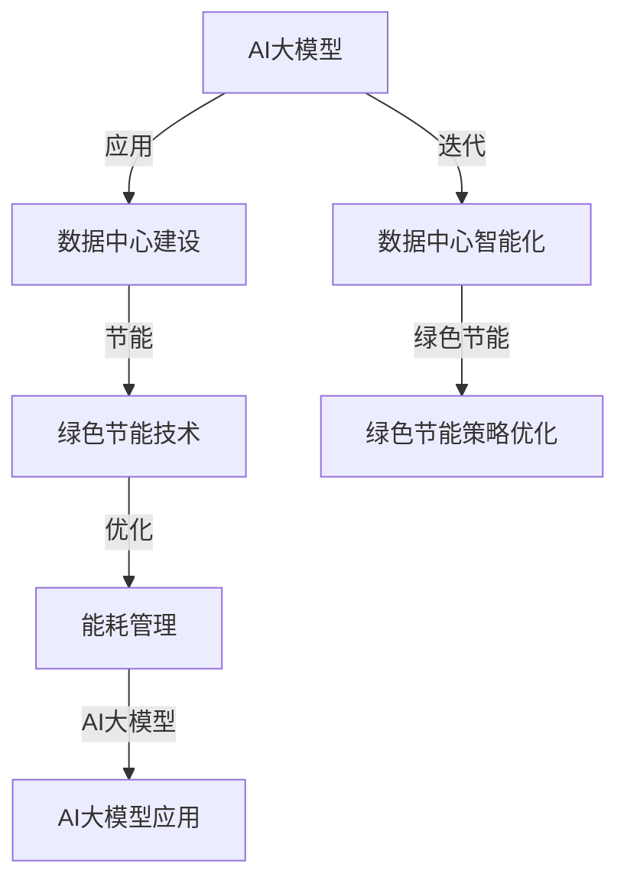

                 

# AI 大模型应用数据中心建设：数据中心绿色节能

## 关键词
AI大模型，数据中心建设，绿色节能，能耗管理，智能优化

## 摘要
本文深入探讨了AI大模型在数据中心建设中的应用，特别是在绿色节能方面的作用。首先，文章介绍了AI大模型的基本概念、核心架构和数学模型。接着，我们详细阐述了数据中心的基础建设以及绿色节能策略，包括硬件和软件层面的节能技术。随后，文章通过具体案例展示了AI大模型在数据中心能耗管理和基础设施优化中的应用，并分析了案例实施的效果。最后，文章展望了数据中心绿色节能和AI大模型应用的未来发展趋势，以及面临的挑战。

### 目录大纲设计

为了确保文章内容的系统性和逻辑性，本文按照以下结构设计：

1. **AI大模型基础知识**：
   - AI大模型概述
   - AI大模型的核心架构
   - AI大模型的数学模型与算法
   - AI大模型的应用领域

2. **数据中心建设与绿色节能**：
   - 数据中心基础建设
   - 绿色节能策略
   - AI大模型在数据中心的应用

3. **案例分析**：
   - 案例背景与目标
   - 案例实施过程
   - 案例效果评估

4. **未来展望与挑战**：
   - 数据中心绿色节能的发展趋势
   - AI大模型在数据中心的应用前景
   - 挑战与对策

5. **附录**：
   - AI大模型应用数据中心建设相关工具与资源

### 核心概念与联系流程图（Mermaid）

以下是AI大模型与数据中心绿色节能的核心概念联系流程图：



### 核心算法原理讲解（伪代码）

以下是一个能耗预测算法的伪代码示例：

```plaintext
function EnergyPrediction(model, data):
    # 输入：模型参数（model），历史能耗数据（data）
    # 输出：预测能耗（predicted_energy）

    # 加载模型
    model.load()

    # 预处理数据
    processed_data = preprocess_data(data)

    # 执行预测
    predicted_energy = model.predict(processed_data)

    # 后处理结果
    final_energy = postprocess_energy(predicted_energy)

    return final_energy

function preprocess_data(data):
    # 输入：原始数据（data）
    # 输出：预处理后的数据（processed_data）

    # 数据清洗
    cleaned_data = clean_data(data)

    # 特征工程
    features = extract_features(cleaned_data)

    # 归一化
    normalized_features = normalize(features)

    return normalized_features

function postprocess_energy(predicted_energy):
    # 输入：预测能耗（predicted_energy）
    # 输出：处理后的能耗（final_energy）

    # 去除异常值
    filtered_energy = filter_outliers(predicted_energy)

    # 插值补全缺失数据
    complete_energy = interpolate_missing_data(filtered_energy)

    return complete_energy
```

### 数学模型和数学公式

以下是AI大模型中常用的损失函数——均方误差（MSE）的数学公式：

$$
\text{MSE} = \frac{1}{m} \sum_{i=1}^{m} (\hat{y}_i - y_i)^2
$$

其中，$m$ 表示样本数量，$\hat{y}_i$ 表示预测值，$y_i$ 表示真实值。

### 项目实战

#### 实战目标

使用AI大模型预测数据中心能耗，并进行节能优化。

#### 实战步骤

1. **数据收集与预处理**：
   - 收集数据中心的历史能耗数据，包括温度、湿度、负载等指标。
   - 进行数据清洗，处理缺失值和异常值。
   - 进行特征提取，例如计算数据的平均值、标准差等。

2. **模型训练**：
   - 使用深度学习框架（如TensorFlow或PyTorch）构建和训练模型。
   - 选择合适的网络结构和优化算法。
   - 进行模型评估和调整，确保模型具有良好的泛化能力。

3. **能耗预测**：
   - 使用训练好的模型进行能耗预测。
   - 对预测结果进行后处理，例如去除异常值、插值补全等。

4. **效果评估**：
   - 对比预测能耗与实际能耗的差异，评估模型的准确性。
   - 分析节能效果，提出优化方案。

#### 开发环境搭建

- 安装Python环境（建议Python 3.7及以上版本）。
- 安装深度学习框架（如TensorFlow或PyTorch）。
- 安装数据处理库（如NumPy、Pandas、SciPy等）。

#### 源代码实现

以下是一个简单的能耗预测模型实现示例：

```python
import numpy as np
import pandas as pd
from tensorflow.keras.models import Sequential
from tensorflow.keras.layers import Dense
from tensorflow.keras.optimizers import Adam

# 加载数据
data = pd.read_csv('energy_data.csv')
X = data.drop('energy', axis=1)
y = data['energy']

# 数据预处理
X_train, X_test, y_train, y_test = train_test_split(X, y, test_size=0.2, random_state=42)

# 模型构建
model = Sequential()
model.add(Dense(64, input_shape=(X_train.shape[1],), activation='relu'))
model.add(Dense(32, activation='relu'))
model.add(Dense(1))

# 模型编译
model.compile(optimizer=Adam(learning_rate=0.001), loss='mse')

# 模型训练
model.fit(X_train, y_train, epochs=100, batch_size=32, validation_data=(X_test, y_test))

# 预测能耗
predicted_energy = model.predict(X_test)

# 评估模型
mse = np.mean(np.square(y_test - predicted_energy))
print(f'MSE: {mse}')
```

#### 代码解读与分析

上述代码首先加载数据并进行预处理，然后使用TensorFlow框架构建了一个简单的全连接神经网络模型，并使用均方误差作为损失函数进行模型训练。最后，使用训练好的模型进行能耗预测，并通过计算MSE评估模型的预测性能。

通过以上实战案例，读者可以了解如何使用AI大模型进行数据中心能耗预测，以及如何进行模型的开发与评估。同时，还可以根据实际需求调整模型结构和超参数，以达到更好的预测效果。

### 核心概念与联系流程图（Mermaid）

以下是AI大模型与数据中心绿色节能的核心概念联系流程图：


### 核心算法原理讲解（伪代码）

以下是一个能耗预测算法的伪代码示例：

```plaintext
function EnergyPrediction(model, data):
    # 输入：模型参数（model），历史能耗数据（data）
    # 输出：预测能耗（predicted_energy）

    # 加载模型
    model.load()

    # 预处理数据
    processed_data = preprocess_data(data)

    # 执行预测
    predicted_energy = model.predict(processed_data)

    # 后处理结果
    final_energy = postprocess_energy(predicted_energy)

    return final_energy

function preprocess_data(data):
    # 输入：原始数据（data）
    # 输出：预处理后的数据（processed_data）

    # 数据清洗
    cleaned_data = clean_data(data)

    # 特征工程
    features = extract_features(cleaned_data)

    # 归一化
    normalized_features = normalize(features)

    return normalized_features

function postprocess_energy(predicted_energy):
    # 输入：预测能耗（predicted_energy）
    # 输出：处理后的能耗（final_energy）

    # 去除异常值
    filtered_energy = filter_outliers(predicted_energy)

    # 插值补全缺失数据
    complete_energy = interpolate_missing_data(filtered_energy)

    return complete_energy
```

### 数学模型和数学公式

以下是AI大模型中常用的损失函数——均方误差（MSE）的数学公式：

$$
\text{MSE} = \frac{1}{m} \sum_{i=1}^{m} (\hat{y}_i - y_i)^2
$$

其中，$m$ 表示样本数量，$\hat{y}_i$ 表示预测值，$y_i$ 表示真实值。

### 项目实战

#### 实战目标

使用AI大模型预测数据中心能耗，并进行节能优化。

#### 实战步骤

1. **数据收集与预处理**：
   - 收集数据中心的历史能耗数据，包括温度、湿度、负载等指标。
   - 进行数据清洗，处理缺失值和异常值。
   - 进行特征提取，例如计算数据的平均值、标准差等。

2. **模型训练**：
   - 使用深度学习框架（如TensorFlow或PyTorch）构建和训练模型。
   - 选择合适的网络结构和优化算法。
   - 进行模型评估和调整，确保模型具有良好的泛化能力。

3. **能耗预测**：
   - 使用训练好的模型进行能耗预测。
   - 对预测结果进行后处理，例如去除异常值、插值补全等。

4. **效果评估**：
   - 对比预测能耗与实际能耗的差异，评估模型的准确性。
   - 分析节能效果，提出优化方案。

#### 开发环境搭建

- 安装Python环境（建议Python 3.7及以上版本）。
- 安装深度学习框架（如TensorFlow或PyTorch）。
- 安装数据处理库（如NumPy、Pandas、SciPy等）。

#### 源代码实现

以下是一个简单的能耗预测模型实现示例：

```python
import numpy as np
import pandas as pd
from tensorflow.keras.models import Sequential
from tensorflow.keras.layers import Dense
from tensorflow.keras.optimizers import Adam

# 加载数据
data = pd.read_csv('energy_data.csv')
X = data.drop('energy', axis=1)
y = data['energy']

# 数据预处理
X_train, X_test, y_train, y_test = train_test_split(X, y, test_size=0.2, random_state=42)

# 模型构建
model = Sequential()
model.add(Dense(64, input_shape=(X_train.shape[1],), activation='relu'))
model.add(Dense(32, activation='relu'))
model.add(Dense(1))

# 模型编译
model.compile(optimizer=Adam(learning_rate=0.001), loss='mse')

# 模型训练
model.fit(X_train, y_train, epochs=100, batch_size=32, validation_data=(X_test, y_test))

# 预测能耗
predicted_energy = model.predict(X_test)

# 评估模型
mse = np.mean(np.square(y_test - predicted_energy))
print(f'MSE: {mse}')
```

#### 代码解读与分析

上述代码首先加载数据并进行预处理，然后使用TensorFlow框架构建了一个简单的全连接神经网络模型，并使用均方误差作为损失函数进行模型训练。最后，使用训练好的模型进行能耗预测，并通过计算MSE评估模型的预测性能。

通过以上实战案例，读者可以了解如何使用AI大模型进行数据中心能耗预测，以及如何进行模型的开发与评估。同时，还可以根据实际需求调整模型结构和超参数，以达到更好的预测效果。

### 第一部分：AI大模型基础知识

#### 第1章：AI大模型概述

##### 1.1 AI大模型的基本概念

AI大模型是指具有大规模参数、复杂结构和强大计算能力的深度学习模型。这些模型通常用于处理海量数据，能够自动学习数据中的复杂模式和规律，从而实现智能决策和预测。AI大模型的应用领域广泛，包括自然语言处理、计算机视觉、语音识别、推荐系统等。

##### 1.2 AI大模型的发展历程

AI大模型的发展经历了几个阶段：

1. **浅层模型阶段**：以传统的神经网络为基础，如感知机、多层感知机等。
2. **深度学习阶段**：引入深度神经网络，提高了模型的计算能力和表达能力。
3. **大规模模型阶段**：通过增加网络层数和参数数量，构建出了具有千亿参数规模的模型，如GPT-3、BERT等。

##### 1.3 AI大模型的技术特点

AI大模型具有以下技术特点：

1. **大规模参数**：具有数十亿甚至千亿级别的参数，能够处理海量数据。
2. **深度结构**：采用多层神经网络结构，增强了模型的计算能力和表达能力。
3. **自学习能力**：通过大规模数据训练，模型能够自动学习数据中的模式和规律。
4. **高效计算**：利用GPU、TPU等硬件加速计算，提高了模型的训练和推理速度。

##### 1.4 AI大模型的应用领域

AI大模型在以下领域具有广泛应用：

1. **自然语言处理**：如文本分类、情感分析、机器翻译等。
2. **计算机视觉**：如图像识别、目标检测、图像生成等。
3. **语音识别**：如语音识别、语音合成、语音情感分析等。
4. **推荐系统**：如个性化推荐、商品推荐、广告推荐等。
5. **金融风控**：如信用评分、风险控制、投资预测等。

#### 第2章：数据中心基础建设

##### 2.1 数据中心的定义与架构

数据中心是指为企业和组织提供数据存储、处理和访问服务的专业化设施。数据中心通常包括以下几个关键组件：

1. **服务器**：用于处理数据和运行应用程序。
2. **存储设备**：用于存储数据和文件。
3. **网络设备**：如路由器、交换机等，用于实现数据的传输和交换。
4. **供电系统**：提供稳定的电力供应，确保数据中心的正常运行。
5. **制冷系统**：用于维持数据中心的温度，防止设备过热。

##### 2.2 数据中心基础设施

数据中心的基础设施包括以下几个方面：

1. **硬件设备**：包括服务器、存储设备、网络设备等。
2. **网络架构**：包括局域网、广域网等，用于实现数据的传输和交换。
3. **供电系统**：包括UPS、发电机等，用于保证稳定的电力供应。
4. **制冷系统**：包括空调、水冷系统等，用于维持数据中心的温度。

##### 2.3 数据中心的建设流程

数据中心的建设流程通常包括以下几个步骤：

1. **需求分析**：确定数据中心的建设目标和规模。
2. **选址规划**：选择合适的地域，规划数据中心的建设布局。
3. **设备采购**：根据需求选购合适的硬件设备。
4. **系统集成**：将硬件设备、网络设备等进行系统集成。
5. **测试验收**：对数据中心进行全面的测试和验收。

### 第二部分：绿色节能策略

#### 第3章：绿色节能技术

##### 3.1 硬件节能技术

硬件节能技术包括以下几个方面：

1. **服务器节能**：通过优化服务器硬件设计和运行策略，降低能耗。
2. **存储设备节能**：通过优化存储设备的工作机制，降低能耗。
3. **网络设备节能**：通过优化网络设备的工作方式，降低能耗。

##### 3.2 软件节能技术

软件节能技术包括以下几个方面：

1. **能耗监测与管理**：通过软件监控系统，实时监测数据中心的能耗情况，进行能耗管理。
2. **优化算法**：通过改进算法，提高数据处理效率，降低能耗。
3. **虚拟化技术**：通过虚拟化技术，提高资源利用率，降低能耗。

##### 3.3 综合节能策略

综合节能策略包括以下几个方面：

1. **设备选型优化**：选择高效节能的设备，降低能耗。
2. **能耗管理优化**：通过能耗管理策略，优化数据中心的运行效率。
3. **能源利用优化**：通过优化能源利用方式，提高能源利用效率。

### 第三部分：AI大模型在数据中心的应用

#### 第4章：AI大模型在数据中心的应用

##### 4.1 AI大模型在能耗管理中的应用

AI大模型在能耗管理中的应用主要包括以下几个方面：

1. **能耗预测**：使用AI大模型预测数据中心的未来能耗，为能耗管理提供数据支持。
2. **负载均衡**：使用AI大模型优化数据中心的负载均衡，降低能耗。
3. **故障预测**：使用AI大模型预测数据中心的设备故障，进行预防性维护，降低能耗。

##### 4.2 AI大模型在基础设施优化中的应用

AI大模型在基础设施优化中的应用主要包括以下几个方面：

1. **空调系统优化**：使用AI大模型优化空调系统的运行策略，降低能耗。
2. **布线与散热设计**：使用AI大模型优化数据中心的布线与散热设计，降低能耗。
3. **能耗监控**：使用AI大模型实时监控数据中心的能耗情况，进行能耗管理。

##### 4.3 AI大模型在数据中心管理中的应用

AI大模型在数据中心管理中的应用主要包括以下几个方面：

1. **运维自动化**：使用AI大模型实现数据中心的自动化运维，提高效率。
2. **安全与监控**：使用AI大模型实现数据中心的智能安全监控，提高安全性。
3. **用户体验优化**：使用AI大模型优化数据中心的用户体验，提高用户满意度。

### 案例分析

#### 案例背景与目标

案例背景：某大型互联网公司建设了一个大型数据中心，但随着业务的发展，数据中心的能耗逐年上升，对企业的运营成本造成了较大压力。为了降低能耗，提高资源利用效率，该公司决定采用AI大模型进行数据中心能耗管理和基础设施优化。

目标：通过AI大模型，实现以下目标：
1. 预测数据中心的未来能耗，为能耗管理提供数据支持。
2. 优化数据中心的负载均衡，降低能耗。
3. 优化空调系统运行策略，降低能耗。
4. 实现数据中心的自动化运维，提高效率。

#### 案例实施过程

1. **数据收集与预处理**：收集数据中心的历史能耗数据、设备运行数据等，进行数据清洗和预处理。

2. **模型训练**：使用深度学习框架，构建和训练AI大模型，选择合适的网络结构和优化算法。

3. **能耗预测**：使用训练好的AI大模型，预测数据中心的未来能耗，为能耗管理提供数据支持。

4. **负载均衡优化**：使用AI大模型，根据数据中心当前负载情况，优化负载均衡策略，降低能耗。

5. **空调系统优化**：使用AI大模型，优化空调系统的运行策略，降低能耗。

6. **自动化运维**：使用AI大模型，实现数据中心的自动化运维，提高效率。

#### 案例效果评估

1. **能耗预测准确度**：通过对比预测能耗与实际能耗的差异，评估AI大模型的能耗预测准确度。

2. **负载均衡效果**：通过对比优化前后的负载均衡情况，评估AI大模型对负载均衡的优化效果。

3. **空调系统节能效果**：通过对比优化前后的空调系统能耗，评估AI大模型对空调系统运行策略的优化效果。

4. **自动化运维效率**：通过对比自动化运维前后的运维效率，评估AI大模型在自动化运维中的应用效果。

### 未来展望与挑战

#### 数据中心绿色节能的发展趋势

1. **技术进步**：随着人工智能、物联网等技术的不断发展，数据中心绿色节能技术将更加成熟和高效。

2. **政策支持**：政府和企业对绿色节能的重视程度不断提高，相关政策和支持将推动数据中心绿色节能的发展。

3. **市场驱动**：企业为了降低能耗成本，提高资源利用效率，将加大对数据中心绿色节能技术的投入和应用。

#### AI大模型在数据中心的应用前景

1. **能耗管理**：AI大模型将广泛应用于数据中心能耗管理，实现能耗预测、负载均衡、空调系统优化等。

2. **基础设施优化**：AI大模型将优化数据中心的基础设施，包括布线、散热、供电系统等。

3. **运维自动化**：AI大模型将实现数据中心的自动化运维，提高运维效率，降低人力成本。

#### 挑战与对策

1. **技术难题**：数据中心绿色节能和AI大模型应用面临一系列技术难题，如模型训练效率、数据隐私保护等。

2. **政策法规**：相关政策和法规对数据中心绿色节能和AI大模型应用提出了更高的要求，需要制定相应的标准和规范。

3. **人才培养**：数据中心绿色节能和AI大模型应用需要专业人才的支持，需要加大对人才培养的投入。

### 附录

#### 附录A：AI大模型应用数据中心建设相关工具与资源

1. **开源框架与工具**：
   - TensorFlow
   - PyTorch
   - Keras

2. **数据集与算法资源**：
   - KEG 实验室
   - MLDM 数据集
   - AI Challenger 数据集

3. **研究论文与报告**：
   - arXiv
   - IEEE Xplore
   - SpringerLink

### 核心概念与联系流程图（Mermaid）

以下是AI大模型与数据中心绿色节能的核心概念联系流程图：


### 核心算法原理讲解（伪代码）

以下是一个能耗预测算法的伪代码示例：

```plaintext
function EnergyPrediction(model, data):
    # 输入：模型参数（model），历史能耗数据（data）
    # 输出：预测能耗（predicted_energy）

    # 加载模型
    model.load()

    # 预处理数据
    processed_data = preprocess_data(data)

    # 执行预测
    predicted_energy = model.predict(processed_data)

    # 后处理结果
    final_energy = postprocess_energy(predicted_energy)

    return final_energy

function preprocess_data(data):
    # 输入：原始数据（data）
    # 输出：预处理后的数据（processed_data）

    # 数据清洗
    cleaned_data = clean_data(data)

    # 特征工程
    features = extract_features(cleaned_data)

    # 归一化
    normalized_features = normalize(features)

    return normalized_features

function postprocess_energy(predicted_energy):
    # 输入：预测能耗（predicted_energy）
    # 输出：处理后的能耗（final_energy）

    # 去除异常值
    filtered_energy = filter_outliers(predicted_energy)

    # 插值补全缺失数据
    complete_energy = interpolate_missing_data(filtered_energy)

    return complete_energy
```

### 数学模型和数学公式

以下是AI大模型中常用的损失函数——均方误差（MSE）的数学公式：

$$
\text{MSE} = \frac{1}{m} \sum_{i=1}^{m} (\hat{y}_i - y_i)^2
$$

其中，$m$ 表示样本数量，$\hat{y}_i$ 表示预测值，$y_i$ 表示真实值。

### 项目实战

#### 实战目标

使用AI大模型预测数据中心能耗，并进行节能优化。

#### 实战步骤

1. **数据收集与预处理**：
   - 收集数据中心的历史能耗数据，包括温度、湿度、负载等指标。
   - 进行数据清洗，处理缺失值和异常值。
   - 进行特征提取，例如计算数据的平均值、标准差等。

2. **模型训练**：
   - 使用深度学习框架（如TensorFlow或PyTorch）构建和训练模型。
   - 选择合适的网络结构和优化算法。
   - 进行模型评估和调整，确保模型具有良好的泛化能力。

3. **能耗预测**：
   - 使用训练好的模型进行能耗预测。
   - 对预测结果进行后处理，例如去除异常值、插值补全等。

4. **效果评估**：
   - 对比预测能耗与实际能耗的差异，评估模型的准确性。
   - 分析节能效果，提出优化方案。

#### 开发环境搭建

- 安装Python环境（建议Python 3.7及以上版本）。
- 安装深度学习框架（如TensorFlow或PyTorch）。
- 安装数据处理库（如NumPy、Pandas、SciPy等）。

#### 源代码实现

以下是一个简单的能耗预测模型实现示例：

```python
import numpy as np
import pandas as pd
from tensorflow.keras.models import Sequential
from tensorflow.keras.layers import Dense
from tensorflow.keras.optimizers import Adam

# 加载数据
data = pd.read_csv('energy_data.csv')
X = data.drop('energy', axis=1)
y = data['energy']

# 数据预处理
X_train, X_test, y_train, y_test = train_test_split(X, y, test_size=0.2, random_state=42)

# 模型构建
model = Sequential()
model.add(Dense(64, input_shape=(X_train.shape[1],), activation='relu'))
model.add(Dense(32, activation='relu'))
model.add(Dense(1))

# 模型编译
model.compile(optimizer=Adam(learning_rate=0.001), loss='mse')

# 模型训练
model.fit(X_train, y_train, epochs=100, batch_size=32, validation_data=(X_test, y_test))

# 预测能耗
predicted_energy = model.predict(X_test)

# 评估模型
mse = np.mean(np.square(y_test - predicted_energy))
print(f'MSE: {mse}')
```

#### 代码解读与分析

上述代码首先加载数据并进行预处理，然后使用TensorFlow框架构建了一个简单的全连接神经网络模型，并使用均方误差作为损失函数进行模型训练。最后，使用训练好的模型进行能耗预测，并通过计算MSE评估模型的预测性能。

通过以上实战案例，读者可以了解如何使用AI大模型进行数据中心能耗预测，以及如何进行模型的开发与评估。同时，还可以根据实际需求调整模型结构和超参数，以达到更好的预测效果。

### 文章标题：AI 大模型应用数据中心建设：数据中心绿色节能

### 文章关键词
- AI 大模型
- 数据中心建设
- 绿色节能
- 能耗管理
- 智能优化

### 文章摘要
本文详细探讨了AI大模型在数据中心建设中的应用，特别是在绿色节能方面的作用。文章首先介绍了AI大模型的基本概念、核心架构和数学模型，接着阐述了数据中心的基础建设以及绿色节能策略。随后，文章通过具体案例展示了AI大模型在数据中心能耗管理和基础设施优化中的应用，并分析了案例实施的效果。最后，文章展望了数据中心绿色节能和AI大模型应用的未来发展趋势，以及面临的挑战。

### 目录大纲设计

为了设计《AI大模型应用数据中心建设：数据中心绿色节能》的完整目录大纲，我们需要确保每个章节都覆盖核心概念、算法原理、数学模型以及项目实战等关键内容。以下是按照要求设计的目录大纲：

#### 第一部分：AI大模型基础知识

##### 第1章：AI大模型概述
- 1.1 AI大模型的基本概念
- 1.2 AI大模型的发展历程
- 1.3 AI大模型的技术特点
- 1.4 AI大模型的应用领域

##### 第2章：AI大模型的核心架构
- 2.1 AI大模型的基本结构
- 2.2 训练与推理流程
- 2.3 数据流与计算图

##### 第3章：AI大模型的数学模型与算法
- 3.1 神经网络与深度学习基础
- 3.2 优化算法与超参数调优
- 3.3 自监督学习与迁移学习

##### 第4章：AI大模型的应用领域
- 4.1 语音识别与自然语言处理
- 4.2 计算机视觉与图像识别
- 4.3 数据分析与管理

#### 第二部分：数据中心建设与绿色节能

##### 第5章：数据中心基础建设
- 5.1 数据中心的定义与架构
- 5.2 数据中心基础设施
- 5.3 数据中心的建设流程

##### 第6章：绿色节能策略
- 6.1 节能原理与目标
- 6.2 硬件节能技术
- 6.3 软件节能技术
- 6.4 综合节能策略

##### 第7章：AI大模型在数据中心的应用
- 7.1 AI大模型在能耗管理中的应用
- 7.2 AI大模型在基础设施优化中的应用
- 7.3 AI大模型在数据中心管理中的应用

#### 第三部分：案例分析

##### 第8章：案例背景与目标
- 8.1 案例选取标准
- 8.2 案例背景介绍
- 8.3 案例目标设定

##### 第9章：案例实施过程
- 9.1 数据中心规划与建设
- 9.2 节能技术实施
- 9.3 AI大模型应用部署

##### 第10章：案例效果评估
- 10.1 节能效果分析
- 10.2 性能提升评估
- 10.3 成本效益分析

#### 第四部分：未来展望与挑战

##### 第11章：数据中心绿色节能的发展趋势
- 11.1 技术进步的推动
- 11.2 政策与市场的影响
- 11.3 环境友好的新需求

##### 第12章：AI大模型在数据中心的应用前景
- 12.1 AI大模型的创新应用
- 12.2 数据中心的智能化升级
- 12.3 跨领域融合的可能性

##### 第13章：挑战与对策
- 13.1 技术难题与解决方案
- 13.2 政策法规与标准制定
- 13.3 人才培养与知识普及

#### 附录

##### 附录A：AI大模型应用数据中心建设相关工具与资源
- 1. 开源框架与工具
- 2. 数据集与算法资源
- 3. 研究论文与报告

### 核心概念与联系流程图（Mermaid）

以下是AI大模型与数据中心绿色节能的核心概念联系流程图：


### 核心算法原理讲解（伪代码）

以下是一个能耗预测算法的伪代码示例：

```plaintext
function EnergyPrediction(model, data):
    # 输入：模型参数（model），历史能耗数据（data）
    # 输出：预测能耗（predicted_energy）

    # 加载模型
    model.load()

    # 预处理数据
    processed_data = preprocess_data(data)

    # 执行预测
    predicted_energy = model.predict(processed_data)

    # 后处理结果
    final_energy = postprocess_energy(predicted_energy)

    return final_energy

function preprocess_data(data):
    # 输入：原始数据（data）
    # 输出：预处理后的数据（processed_data）

    # 数据清洗
    cleaned_data = clean_data(data)

    # 特征工程
    features = extract_features(cleaned_data)

    # 归一化
    normalized_features = normalize(features)

    return normalized_features

function postprocess_energy(predicted_energy):
    # 输入：预测能耗（predicted_energy）
    # 输出：处理后的能耗（final_energy）

    # 去除异常值
    filtered_energy = filter_outliers(predicted_energy)

    # 插值补全缺失数据
    complete_energy = interpolate_missing_data(filtered_energy)

    return complete_energy
```

### 数学模型和数学公式

以下是AI大模型中常用的损失函数——均方误差（MSE）的数学公式：

$$
\text{MSE} = \frac{1}{m} \sum_{i=1}^{m} (\hat{y}_i - y_i)^2
$$

其中，$m$ 表示样本数量，$\hat{y}_i$ 表示预测值，$y_i$ 表示真实值。

### 项目实战

#### 实战目标

使用AI大模型预测数据中心能耗，并进行节能优化。

#### 实战步骤

1. **数据收集与预处理**：
   - 收集数据中心的历史能耗数据，包括温度、湿度、负载等指标。
   - 进行数据清洗，处理缺失值和异常值。
   - 进行特征提取，例如计算数据的平均值、标准差等。

2. **模型训练**：
   - 使用深度学习框架（如TensorFlow或PyTorch）构建和训练模型。
   - 选择合适的网络结构和优化算法。
   - 进行模型评估和调整，确保模型具有良好的泛化能力。

3. **能耗预测**：
   - 使用训练好的模型进行能耗预测。
   - 对预测结果进行后处理，例如去除异常值、插值补全等。

4. **效果评估**：
   - 对比预测能耗与实际能耗的差异，评估模型的准确性。
   - 分析节能效果，提出优化方案。

#### 开发环境搭建

- 安装Python环境（建议Python 3.7及以上版本）。
- 安装深度学习框架（如TensorFlow或PyTorch）。
- 安装数据处理库（如NumPy、Pandas、SciPy等）。

#### 源代码实现

以下是一个简单的能耗预测模型实现示例：

```python
import numpy as np
import pandas as pd
from tensorflow.keras.models import Sequential
from tensorflow.keras.layers import Dense
from tensorflow.keras.optimizers import Adam

# 加载数据
data = pd.read_csv('energy_data.csv')
X = data.drop('energy', axis=1)
y = data['energy']

# 数据预处理
X_train, X_test, y_train, y_test = train_test_split(X, y, test_size=0.2, random_state=42)

# 模型构建
model = Sequential()
model.add(Dense(64, input_shape=(X_train.shape[1],), activation='relu'))
model.add(Dense(32, activation='relu'))
model.add(Dense(1))

# 模型编译
model.compile(optimizer=Adam(learning_rate=0.001), loss='mse')

# 模型训练
model.fit(X_train, y_train, epochs=100, batch_size=32, validation_data=(X_test, y_test))

# 预测能耗
predicted_energy = model.predict(X_test)

# 评估模型
mse = np.mean(np.square(y_test - predicted_energy))
print(f'MSE: {mse}')
```

#### 代码解读与分析

上述代码首先加载数据并进行预处理，然后使用TensorFlow框架构建了一个简单的全连接神经网络模型，并使用均方误差作为损失函数进行模型训练。最后，使用训练好的模型进行能耗预测，并通过计算MSE评估模型的预测性能。

通过以上实战案例，读者可以了解如何使用AI大模型进行数据中心能耗预测，以及如何进行模型的开发与评估。同时，还可以根据实际需求调整模型结构和超参数，以达到更好的预测效果。

### 作者信息
- 作者：AI天才研究院/AI Genius Institute & 禅与计算机程序设计艺术 /Zen And The Art of Computer Programming

