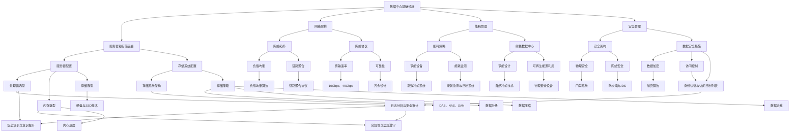

                 

### 引言

随着人工智能（AI）技术的迅猛发展，大模型如GPT-3、BERT等已经成为推动技术创新的重要力量。这些AI大模型在自然语言处理、计算机视觉、语音识别等领域展现了惊人的性能，极大地提升了数据处理和分析的能力。为了满足大模型对大规模数据存储、高速计算和高效传输的需求，数据中心的建设和运维变得越来越重要。

本文旨在探讨AI大模型应用数据中心的建设和运维管理。我们将从数据中心基础设施规划、数据中心运维管理流程、数据中心能耗管理、数据中心安全与合规性等方面，逐步分析AI大模型在数据中心中的实际应用。此外，还将介绍AI大模型在数据中心性能优化和安全管理中的应用，并通过实际项目案例展示数据中心AI应用实战过程。

本文的核心关键词包括：AI大模型、数据中心建设、运维管理、能耗管理、安全与合规性、性能优化、安全管理。通过系统的分析和讨论，本文希望为读者提供一个全面、深入的了解，以应对未来数据中心建设和运维中的挑战和机遇。

### 第一部分：引论

#### 第1章：AI大模型与数据中心建设概述

随着人工智能（AI）技术的不断进步，AI大模型已经成为科技领域的重要推动力。AI大模型是指使用深度学习技术训练出的具有高度复杂性和强大表现力的模型，如GPT-3、BERT、GAT等。这些模型在自然语言处理、计算机视觉、语音识别等领域表现出色，极大地提升了数据处理和分析的能力。

1.1 AI大模型的概念与分类

AI大模型的概念起源于深度学习技术的发展。深度学习是一种通过多层神经网络来学习数据特征的机器学习方法。随着计算能力的提升和数据量的增长，深度学习模型变得越来越复杂，训练出的模型参数量也随之增加，从而形成了AI大模型。

AI大模型可以按功能进行分类，主要包括：

- 自然语言处理（NLP）模型：如GPT-3、BERT、T5等，用于文本生成、文本分类、机器翻译等任务。
- 计算机视觉（CV）模型：如ResNet、Inception、VGG等，用于图像分类、目标检测、图像分割等任务。
- 语音识别（ASR）模型：如DeepSpeech、WaveNet等，用于语音识别和语音合成。
- 强化学习（RL）模型：如DQN、DDPG、PPO等，用于游戏、自动驾驶、机器人控制等任务。

1.2 数据中心建设的重要性

数据中心是AI大模型应用的基础设施，其重要性体现在以下几个方面：

- 数据存储：数据中心提供了大规模的数据存储能力，满足AI大模型对海量数据的需求。
- 高性能计算：数据中心配备了高性能的计算机硬件，包括GPU、TPU等，为AI大模型的训练和推理提供强大的计算能力。
- 网络传输：数据中心通过高速网络连接，实现数据的高效传输和共享，确保AI大模型能够实时访问和处理数据。
- 安全保障：数据中心采用了先进的安全技术，包括防火墙、加密、访问控制等，保障AI大模型的安全运行。

1.3 AI大模型在数据中心中的应用场景

AI大模型在数据中心中的应用场景广泛，主要包括：

- 机器学习平台：数据中心为AI大模型的训练提供了计算资源和数据存储，支持机器学习算法的开发和应用。
- 自然语言处理：数据中心部署了NLP模型，用于文本生成、文本分类、机器翻译等任务，如搜索引擎、聊天机器人等。
- 计算机视觉：数据中心部署了CV模型，用于图像分类、目标检测、图像分割等任务，如自动驾驶、视频监控等。
- 语音识别：数据中心部署了ASR模型，用于语音识别和语音合成，如智能音箱、客服系统等。
- 强化学习：数据中心部署了RL模型，用于游戏、自动驾驶、机器人控制等任务，如自动驾驶测试、机器人路径规划等。

通过数据中心的建设和运维，AI大模型能够充分发挥其性能，实现智能化应用的落地。在接下来的章节中，我们将深入探讨数据中心基础设施规划、运维管理流程、能耗管理、安全与合规性等方面的内容。

### 第二部分：数据中心基础设施规划

#### 第2章：数据中心网络架构设计

数据中心网络架构设计是数据中心基础设施规划的重要组成部分，其目标是为AI大模型的应用提供高效、稳定、安全的网络环境。一个合理设计的网络架构能够优化数据传输效率，降低网络延迟，确保数据中心内各个组件之间的协同工作。

2.1 数据中心网络的基本架构

数据中心网络的基本架构通常包括以下几个关键部分：

- **核心网络（Core Network）**：核心网络是数据中心的骨干网，负责连接各个服务器集群和存储系统。它通常采用高速交换机和高带宽光纤连接，确保数据的高速传输。
- **边缘网络（Edge Network）**：边缘网络位于核心网络和用户网络之间，主要用于处理用户请求和数据的初步处理。它通过负载均衡和内容分发网络（CDN）等技术，提高用户访问速度和数据可靠性。
- **服务器网络（Server Network）**：服务器网络连接数据中心内的服务器，实现服务器之间的数据交换。它通常采用虚拟局域网（VLAN）技术，隔离不同类型的服务器，提高网络的稳定性和安全性。
- **存储网络（Storage Network）**：存储网络连接数据中心内的存储设备，实现数据的读写和备份。它通常采用光纤通道（FC）或网络附加存储（NAS）技术，提供高带宽和低延迟的数据访问。

2.2 网络拓扑与协议选择

数据中心网络拓扑的选择直接影响到网络的性能、可扩展性和可靠性。以下是一些常见的数据中心网络拓扑：

- **环形拓扑（Ring Topology）**：环形拓扑通过将各个网络设备连接成一个闭合的环，实现数据的高速传输。它具有简单、成本低和故障转移快速的特点，但可扩展性较差。
- **星形拓扑（Star Topology）**：星形拓扑通过将各个网络设备连接到一个中心交换机，实现数据传输。它具有结构简单、易于管理和维护的特点，但中心交换机的负载较高。
- **网状拓扑（Mesh Topology）**：网状拓扑通过将各个网络设备相互连接，实现冗余路径和负载均衡。它具有高可靠性、可扩展性和灵活性，但成本较高。

在选择网络拓扑时，需要考虑以下因素：

- **数据传输需求**：根据数据传输的带宽需求、延迟要求和可靠性要求，选择适合的网络拓扑。
- **设备数量**：根据数据中心的规模和设备数量，选择合适的网络拓扑，确保网络的性能和可扩展性。
- **成本**：综合考虑网络的成本，包括设备采购、部署和维护成本。

网络协议是数据传输的基本规则，选择合适的网络协议对提高网络性能和安全性至关重要。以下是一些常用的网络协议：

- **TCP/IP**：TCP/IP是互联网的基石，它提供可靠的、面向连接的数据传输服务。TCP协议负责数据包的传输控制和错误检测，IP协议负责数据包的路由和传输。
- **以太网（Ethernet）**：以太网是局域网（LAN）的主要传输技术，它使用CSMA/CD协议，实现设备之间的数据传输。
- **光纤通道（FC）**：光纤通道是一种高速存储网络技术，它通过光纤连接存储设备和服务器，提供高带宽、低延迟的数据传输。
- **iSCSI**：iSCSI是一种基于IP网络传输的存储协议，它通过以太网连接存储设备和服务器，实现数据传输。

在选择网络协议时，需要考虑以下因素：

- **传输速率**：根据数据传输速率的需求，选择合适的网络协议。
- **可靠性**：根据数据传输的可靠性要求，选择具有高可靠性的网络协议。
- **安全性**：根据数据传输的安全性要求，选择具有安全性的网络协议。

2.3 网络性能优化策略

为了确保数据中心网络的高性能和稳定性，可以采取以下网络性能优化策略：

- **负载均衡（Load Balancing）**：通过负载均衡技术，将网络流量分布到多个服务器或网络设备上，避免单点故障，提高网络性能和可靠性。
- **链路聚合（Link Aggregation）**：通过将多个物理链路聚合为一个逻辑链路，提高数据传输带宽和冗余性，确保网络的稳定性。
- **网络监控（Network Monitoring）**：通过实时监控网络流量、设备状态和性能指标，及时发现和解决问题，确保网络的稳定运行。
- **网络隔离（Network Isolation）**：通过网络隔离技术，将不同类型的数据流隔离开来，提高网络的可靠性和安全性。
- **冗余设计（Redundant Design）**：通过冗余设计，确保网络设备、链路和拓扑结构的冗余，提高网络的可靠性和容错能力。

通过合理设计数据中心网络架构，选择合适的网络拓扑和协议，并采取有效的网络性能优化策略，可以为AI大模型的应用提供高效、稳定、安全的网络环境。在下一章中，我们将探讨数据中心服务器和存储设备的配置，进一步了解数据中心基础设施的细节。

#### 第3章：数据中心服务器和存储设备配置

数据中心服务器和存储设备的配置是确保数据中心高效运行的核心环节。服务器和存储设备的选型和配置直接关系到数据中心的计算能力、存储容量、数据访问速度和系统的可靠性。本章将详细介绍服务器和存储设备的选型原则、配置策略及硬件技术。

3.1 服务器硬件选型与配置

服务器是数据中心的计算核心，其硬件选型直接影响到数据中心的整体性能。以下是服务器硬件选型的关键点：

- **处理器（CPU）**：处理器的性能直接影响服务器的计算能力。高主频、多核心、高内存带宽的CPU更适合处理大规模计算任务。Intel和AMD是服务器CPU的主流供应商，用户可根据具体需求选择合适的CPU型号。
- **内存（RAM）**：内存容量和速度是影响服务器性能的重要因素。对于AI大模型训练和推理任务，大容量、高速的内存至关重要。DDR4和DDR5内存提供更高的带宽和速度，可根据预算选择合适的内存规格。
- **存储（Storage）**：存储系统分为硬盘（HDD）和固态硬盘（SSD）。SSD具有更高的读写速度和更好的稳定性，适合存储和加载大量数据。对于AI大模型应用，使用NVMe SSD可以进一步提升数据访问速度。
- **网络接口（Network Interface Card, NIC）**：高速网络接口卡是保证数据传输速度的关键。10Gbps、40Gbps甚至100Gbps的网络接口卡适合高带宽需求的应用。
- **扩展能力**：服务器应具备良好的扩展能力，包括支持额外的硬盘、网络接口、GPU等，以满足未来的需求。

服务器硬件配置策略包括：

- **集群配置**：通过集群部署，提高计算能力和可靠性。集群中的服务器可通过高速网络连接，实现负载均衡和高可用性。
- **高可用性配置**：通过冗余配置，如冗余电源、冗余网络接口等，提高服务器的可靠性。在硬件故障时，系统可以自动切换到备用设备，确保服务的持续运行。
- **高性能计算（HPC）配置**：对于需要进行大规模并行计算的任务，选择高性能计算服务器，配置多个GPU和高速网络接口，以提高计算性能。

3.2 存储系统架构与存储策略

存储系统是数据中心的数据存储核心，其架构和存储策略直接影响数据中心的性能和存储效率。以下是存储系统架构和存储策略的关键点：

- **存储系统架构**：
  - **直接连接存储（DAS）**：DAS通过SCSI、SATA等接口直接连接到服务器，提供高速、低延迟的数据访问。适合存储小型、低频次的数据。
  - **网络附加存储（NAS）**：NAS通过文件系统提供共享文件存储，适用于数据共享和备份。采用标准网络协议（如NFS或SMB），适合存储大量文件。
  - **存储区域网络（SAN）**：SAN通过光纤通道（FC）或iSCSI协议提供块存储服务，适用于大数据和高性能计算。提供高带宽、低延迟的存储访问。
- **存储策略**：
  - **数据分级（Data Tiering）**：根据数据的使用频率和重要性，将数据存储在不同的存储介质上，实现数据的高效管理。常用存储介质包括SSD、HDD和云存储。
  - **数据压缩（Data Compression）**：通过数据压缩技术，减少存储空间的占用，提高存储容量利用率。适合存储大量非结构化数据。
  - **数据去重（Data Deduplication）**：通过检测和删除重复数据，减少存储空间占用，提高存储效率。适用于备份和归档场景。
  - **快照（Snapshot）**：通过创建数据的快照，实现数据的备份和恢复。快照可用于数据恢复、测试和开发。

3.3 硬盘与SSD技术选型

硬盘和固态硬盘是数据中心的常见存储介质，其技术选型直接影响到数据中心的性能和成本。以下是硬盘和SSD技术选型的关键点：

- **硬盘（HDD）**：
  - **旋转速度**：硬盘的旋转速度（RPM）越高，数据访问速度越快。常见硬盘的旋转速度为5400RPM、7200RPM和10,000RPM。
  - **容量**：硬盘的容量从几TB到几十TB不等，用户根据实际需求选择合适的容量。
  - **性能**：硬盘的读写速度和传输速率是影响性能的关键因素。
- **固态硬盘（SSD）**：
  - **存储技术**：SSD采用闪存（NAND）技术，存储速度和可靠性较高。根据使用场景，用户可选择M.2、SATA或NVMe接口的SSD。
  - **容量**：SSD的容量从几百GB到几十TB不等，用户根据需求选择合适的容量。
  - **性能**：SSD的读写速度和传输速率是影响性能的关键因素。NVMe SSD具有更高的性能，适合高带宽、低延迟的场景。

在选择硬盘和SSD时，需综合考虑数据中心的性能需求、容量需求和成本预算。通过合理配置服务器和存储设备，可以确保数据中心的高性能、高可靠性和高效管理。

在下一章中，我们将探讨数据中心运维管理流程，了解数据中心在日常运维、故障处理和安全管理等方面的实践。

#### 第4章：数据中心运维管理流程

数据中心运维管理流程是确保数据中心稳定运行、高效管理的重要保障。本章将详细介绍数据中心运维管理的基本任务、日常运维工作流程以及应急响应与故障处理。

4.1 运维管理的基本任务

数据中心运维管理的基本任务包括以下几个方面：

- **监控与管理**：通过实时监控系统，监控数据中心的关键指标，如服务器状态、网络流量、存储容量等，确保系统正常运行。
- **性能优化**：定期对数据中心进行性能优化，调整服务器配置、网络拓扑和存储策略，提高数据中心的整体性能。
- **故障处理**：在故障发生时，及时进行故障诊断和修复，确保系统的稳定运行。
- **安全管理**：实施严格的安全策略，保护数据中心的网络安全，防范潜在的安全威胁。
- **成本控制**：通过优化资源配置、降低能耗和设备维护成本，实现数据中心的成本控制。

4.2 日常运维工作流程

日常运维工作流程包括以下几个关键环节：

- **系统监控**：通过监控系统，实时收集数据中心的运行指标，如CPU使用率、内存使用率、网络流量、存储容量等。监控系统可以自动检测异常情况，并发出警报。
- **定期检查**：定期对数据中心的服务器、网络设备和存储设备进行检查和维护，确保设备的正常运行。包括清理灰尘、更换损坏的部件、检查电源和网络连接等。
- **日志分析**：分析服务器的日志文件，及时发现和解决潜在的问题。日志分析可以帮助运维人员了解系统的运行状况，发现性能瓶颈和安全隐患。
- **配置管理**：对数据中心的配置进行管理，包括服务器配置、网络配置和存储配置。配置管理工具可以帮助运维人员快速部署和管理服务器，确保配置的一致性和可追溯性。
- **备份与恢复**：定期对数据中心的数据进行备份，确保在数据丢失或系统故障时能够迅速恢复。备份策略应考虑数据的保留期限、备份频率和备份存储介质。

4.3 应急响应与故障处理

在数据中心运行过程中，难免会遇到各种故障和紧急情况。应急响应与故障处理流程如下：

- **故障报警**：当监控系统检测到异常情况时，自动发出报警通知。报警信息应包括故障类型、发生时间和相关数据指标。
- **故障诊断**：运维人员根据报警信息和系统日志，对故障进行初步诊断。诊断步骤包括检查硬件设备、网络连接和系统配置等。
- **故障定位**：在诊断过程中，逐步缩小故障范围，定位故障的具体原因。故障定位是解决故障的关键步骤，需要结合实际情况进行判断。
- **故障修复**：针对故障原因，采取相应的修复措施。修复措施可能包括更换损坏的硬件设备、调整系统配置、升级软件版本等。
- **故障验证**：在故障修复后，进行验证测试，确保系统恢复正常运行。验证测试可以包括功能测试、性能测试和安全测试等。
- **故障记录**：将故障原因、处理过程和修复结果记录在故障处理报告中，为未来的故障处理提供参考。

通过规范的运维管理流程，数据中心可以确保稳定运行、高效管理，并快速应对各种故障和紧急情况。在下一章中，我们将探讨数据中心的能耗管理，了解如何降低能耗、实现绿色数据中心建设。

#### 第5章：数据中心能耗管理

数据中心能耗管理是数据中心运营中的一个关键环节，其目的是在保证数据中心正常运行的同时，最大限度地降低能源消耗和运营成本。随着云计算、大数据和人工智能的快速发展，数据中心的能耗问题日益突出。本章将介绍数据中心能耗管理的现状、策略和技术，以及绿色数据中心建设的必要性。

5.1 数据中心能耗现状

数据中心能耗现状可以从以下几个方面进行描述：

- **能源消耗总量**：数据中心是全球能源消耗的重要来源之一。据估算，全球数据中心的年能耗已超过全球电力消耗的1%。其中，服务器和存储设备是主要的能耗来源，占比超过50%。此外，冷却系统、电力供应系统和网络设备等也是重要的能耗组成部分。
- **能源结构**：数据中心的能源结构主要包括电力、冷却水和天然气等。电力是数据中心最主要的能源来源，而冷却水主要用于维持数据中心的温度，天然气则主要用于备用发电。
- **能源效率**：数据中心的能源效率普遍较低。传统的数据中心能耗效率一般在30%左右，即仅有30%的电能被转化为有用的工作，而剩余的70%则转化为废热散失。这种低能源效率不仅增加了运营成本，还对环境造成了负面影响。

5.2 能耗管理策略与技术

为了降低数据中心的能耗，可以采取以下能耗管理策略和技术：

- **节能设备**：采用高效的设备是降低数据中心能耗的基础。例如，采用能效比（Energy Efficiency Ratio, EER）更高的空调设备，能够有效降低冷却能耗。此外，服务器和存储设备也应选择能效等级更高的产品。
- **能耗监测与控制系统**：通过能耗监测与控制系统，实时监控数据中心的能源消耗情况。这些系统可以收集各类能耗数据，如电力消耗、冷却水流量和温度等，并根据数据进行分析和优化。例如，PUE（Power Usage Effectiveness）指标是衡量数据中心能耗效率的重要指标，通过降低PUE值，可以显著降低能源消耗。
- **虚拟化技术**：虚拟化技术可以将多个物理服务器虚拟化为多个虚拟服务器，提高服务器利用率。通过虚拟化技术，可以在较低的计算需求时，关闭部分物理服务器，从而降低能耗。
- **能耗优化算法**：通过能耗优化算法，对数据中心的能耗进行精细化管理和优化。例如，动态电源管理算法可以根据服务器负载情况，自动调整服务器的电源状态，实现节能。此外，冷却优化算法可以根据机房温度分布，优化冷却系统的运行策略，提高冷却效率。

5.3 绿色数据中心建设

绿色数据中心建设是数据中心能耗管理的重要目标，其目的是通过节能、环保和可持续发展，降低数据中心的能耗和环境影响。以下是绿色数据中心建设的关键要素：

- **节能设计**：在数据中心的设计阶段，应充分考虑节能因素。例如，选择高效冷却系统、采用自然冷却技术等，可以显著降低能耗。
- **可再生能源利用**：通过引入可再生能源，如太阳能、风能等，降低数据中心对化石燃料的依赖。例如，在美国，许多数据中心已经开始使用太阳能发电系统。
- **绿色认证**：获得绿色认证是数据中心可持续发展的重要标志。例如，LEED（Leadership in Energy and Environmental Design）认证是对数据中心节能、环保和可持续发展能力的认可。
- **废物管理**：通过合理处理数据中心产生的废弃物，如电子垃圾、废水等，减少对环境的污染。例如，可以采用电子垃圾回收系统，对废弃的电子设备进行回收和处理。

通过实施节能管理策略、采用绿色技术和建设绿色数据中心，可以显著降低数据中心的能耗和环境影响，实现可持续发展的目标。在下一章中，我们将探讨数据中心的安防与合规性问题，确保数据中心的安全和合规运行。

#### 第6章：数据中心安全与合规性

数据中心的安全与合规性是确保数据安全和业务连续性的关键要素。随着数据中心的规模不断扩大，数据安全和合规性问题变得越来越复杂。本章将介绍数据中心的安全架构、数据安全保护措施以及合规性与法规要求。

6.1 数据中心安全架构

数据中心的安全架构是确保数据安全和系统稳定运行的基础。一个完整的安全架构应包括以下几个方面：

- **物理安全**：物理安全是数据中心的根基，包括机房门禁系统、监控设备、防火系统和应急电源等。通过严格的管理和监控，确保机房的安全。
- **网络安全**：网络安全包括防火墙、入侵检测系统（IDS）、入侵防御系统（IPS）等。通过这些安全设备，监控网络流量，防范网络攻击和入侵。
- **系统安全**：系统安全包括操作系统安全、应用程序安全和数据安全。通过安装防病毒软件、更新系统补丁、使用加密技术等手段，保护系统的安全。
- **数据安全**：数据安全包括数据加密、访问控制、备份和恢复等。通过数据加密，确保数据在存储和传输过程中的安全；通过访问控制，确保只有授权用户可以访问数据；通过备份和恢复，确保数据在发生故障时能够快速恢复。

6.2 数据安全保护措施

为了确保数据安全，数据中心可以采取以下保护措施：

- **数据加密**：数据加密是保护数据安全的重要手段。通过加密算法，对数据进行加密存储和传输，防止未授权用户访问和窃取数据。常用的加密算法包括AES、RSA等。
- **访问控制**：访问控制是通过身份验证和授权管理，限制用户对数据和系统的访问。常见的访问控制技术包括身份认证、访问控制列表（ACL）和角色基础访问控制（RBAC）等。
- **备份与恢复**：备份与恢复是确保数据安全的重要措施。通过定期备份，确保数据在发生故障或灾难时能够快速恢复。备份策略应考虑备份频率、备份方式和备份存储介质。
- **安全审计**：安全审计是监控和分析系统日志、网络流量和用户行为，发现潜在的安全威胁和漏洞。通过安全审计，可以及时发现和解决安全问题。
- **安全培训**：安全培训是提高员工安全意识和技能的重要措施。通过培训，使员工了解安全政策和操作规范，提高对安全威胁的识别和应对能力。

6.3 合规性与法规要求

数据中心的合规性与法规要求是确保数据中心业务合法、合规运行的关键。以下是数据中心需要遵守的主要法规和要求：

- **GDPR（通用数据保护条例）**：GDPR是欧盟制定的隐私保护法规，旨在保护个人数据的安全和隐私。数据中心在处理欧盟居民的个人信息时，必须遵守GDPR的规定，包括数据保护、数据访问控制和数据删除等。
- **ISO/IEC 27001**：ISO/IEC 27001是信息安全管理体系（ISMS）的国际标准，规定了信息安全管理的要求和控制措施。数据中心可以通过获得ISO/IEC 27001认证，证明其具备有效的信息安全管理体系。
- **PCI DSS（支付卡行业数据安全标准）**：PCI DSS是支付卡行业制定的数据安全标准，适用于处理、存储和传输信用卡数据的组织。数据中心在处理信用卡数据时，必须遵守PCI DSS的要求，确保数据的安全。
- **NIST（美国国家标准与技术研究所）**：NIST发布了一系列信息安全标准，如NIST SP 800-53、NIST SP 800-171等，为数据中心的信息安全管理提供了指导。数据中心可以参考NIST标准，制定符合自身需求的安全策略和措施。

通过建立完善的安全架构、采取有效的数据安全保护措施以及遵守合规性和法规要求，数据中心可以确保数据的安全和业务的连续性，为AI大模型的应用提供可靠的安全保障。在下一章中，我们将探讨AI大模型在数据中心性能优化中的应用。

#### 第7章：AI大模型在数据中心性能优化中的应用

随着数据中心规模的不断扩大和AI技术的迅猛发展，如何优化数据中心性能成为了一个重要课题。AI大模型在数据中心性能优化中的应用，为提升数据中心效率、降低能耗、延长设备寿命等方面提供了新的解决方案。本章将介绍AI大模型在数据中心性能优化中的具体应用场景、关键技术和实际案例。

7.1 AI大模型概述

AI大模型是指使用深度学习技术训练出的具有高度复杂性和强大表现力的模型，如GPT-3、BERT、GAT等。这些模型在自然语言处理、计算机视觉、语音识别等领域表现出色，具有强大的数据处理和分析能力。AI大模型通常通过大量的数据训练，形成复杂的参数网络，能够对输入数据进行高效的特征提取和模式识别。

7.2 数据中心性能指标分析

数据中心性能指标主要包括计算性能、存储性能、网络性能和能耗等。AI大模型在数据中心性能优化中的应用，可以针对这些指标进行优化。

- **计算性能**：计算性能是数据中心的核心指标，直接影响到数据处理的速度和效率。AI大模型可以通过优化算法，提高计算任务的执行效率。例如，使用迁移学习技术，将预训练的模型应用于数据中心的具体任务，可以大大减少模型训练时间和计算资源的需求。
- **存储性能**：存储性能是数据中心的另一个重要指标，关系到数据访问的速度和可靠性。AI大模型可以通过存储优化算法，提高存储设备的利用率，降低数据访问延迟。例如，使用存储压缩和去重技术，可以减少存储空间的需求，提高存储性能。
- **网络性能**：网络性能决定了数据中心内部和外部数据传输的速度和稳定性。AI大模型可以通过网络优化算法，提高数据传输的效率，减少网络拥堵和延迟。例如，使用网络流量预测和负载均衡技术，可以动态调整网络资源分配，提高网络性能。
- **能耗**：能耗是数据中心的运营成本之一，直接影响到数据中心的可持续性。AI大模型可以通过能耗优化算法，降低数据中心的能耗，提高能源利用效率。例如，使用能耗预测和智能调度技术，可以动态调整服务器的运行状态，降低能耗。

7.3 AI大模型在性能优化中的应用案例

以下是一些AI大模型在数据中心性能优化中的应用案例：

- **计算性能优化**：某大型互联网公司使用GPT-3模型进行机器学习任务优化。通过将GPT-3模型应用于数据预处理和特征提取，该公司成功减少了模型训练时间，提高了计算效率。
- **存储性能优化**：某数据中心采用BERT模型进行存储优化。通过使用BERT模型进行数据压缩和去重，该数据中心成功降低了存储空间需求，提高了存储性能。
- **网络性能优化**：某电信运营商使用GAT模型进行网络优化。通过使用GAT模型预测网络流量，该运营商成功减少了网络拥堵和延迟，提高了网络性能。
- **能耗优化**：某绿色数据中心采用BERT模型进行能耗预测和智能调度。通过使用BERT模型预测能耗变化，该数据中心成功降低了能耗，提高了能源利用效率。

通过AI大模型在数据中心性能优化中的应用，可以显著提升数据中心的运行效率、降低运营成本、延长设备寿命，为数据中心的高效运行提供有力支持。在下一章中，我们将探讨AI大模型在数据中心安全管理中的应用。

#### 第8章：AI大模型在数据中心安全管理中的应用

随着数据中心规模的不断扩大和AI技术的日益普及，数据中心的安全管理面临诸多挑战。传统的安全策略和工具已无法满足复杂多变的威胁环境。AI大模型在数据中心安全管理中的应用，为提高安全防护能力、检测和预测潜在威胁提供了新的解决方案。本章将介绍AI大模型在数据中心安全管理中的具体应用场景、技术原理和实际案例。

8.1 安全挑战与问题

数据中心安全管理面临以下挑战和问题：

- **威胁多样性和复杂性**：随着网络攻击手段的不断进化，数据中心面临的威胁形式和攻击方法越来越多样化、复杂化。传统的安全工具和策略难以应对这种复杂的安全环境。
- **数据泄露风险**：数据中心存储了大量敏感数据，如企业信息、用户数据等。如何确保这些数据的安全，防止数据泄露成为安全管理的重要任务。
- **安全运营成本**：传统的安全策略和工具需要大量的人工参与，导致安全运营成本高昂。如何降低安全运营成本，提高安全运营效率是数据中心安全管理的重要课题。
- **合规性要求**：随着信息安全法规的不断完善，数据中心必须遵守一系列合规性要求，如GDPR、ISO/IEC 27001等。如何确保数据中心的安全管理符合合规性要求是数据中心安全管理的重要问题。

8.2 AI大模型在入侵检测中的应用

入侵检测是数据中心安全管理的重要环节。AI大模型在入侵检测中的应用，可以显著提高检测的准确性和效率。

- **异常检测**：AI大模型可以通过学习正常数据流量模式，检测出异常流量。例如，使用GPT-3模型，可以分析网络流量数据，识别出潜在的异常流量，从而发现潜在的安全威胁。
- **恶意代码检测**：AI大模型可以通过深度学习技术，识别和检测恶意代码。例如，使用BERT模型，可以分析恶意代码的代码结构和功能，识别出恶意代码的特征，从而防止恶意代码的传播和攻击。
- **行为分析**：AI大模型可以通过分析用户行为，识别出异常行为。例如，使用GAT模型，可以分析用户的登录、操作和访问日志，识别出异常行为，从而发现潜在的安全威胁。

8.3 AI大模型在威胁预测中的应用

威胁预测是数据中心安全管理的重要手段。AI大模型在威胁预测中的应用，可以提前发现潜在的安全威胁，提高安全防护能力。

- **攻击预测**：AI大模型可以通过学习历史攻击数据，预测未来的攻击行为。例如，使用BERT模型，可以分析历史攻击数据，预测未来可能发生的攻击类型和攻击手段，从而提前采取防御措施。
- **威胁分析**：AI大模型可以通过分析网络流量、系统日志和用户行为等数据，识别出潜在的安全威胁。例如，使用GAT模型，可以分析网络流量和系统日志，识别出潜在的威胁源和威胁路径，从而采取相应的防御措施。
- **风险评估**：AI大模型可以通过评估数据中心的威胁和风险，制定相应的安全策略。例如，使用GPT-3模型，可以分析数据中心的威胁数据和风险因素，评估数据中心的整体安全状况，从而制定有效的安全策略。

8.4 实际案例

以下是一些AI大模型在数据中心安全管理中的实际案例：

- **某大型互联网公司**：该公司的数据中心使用GPT-3模型进行异常流量检测。通过分析网络流量数据，GPT-3模型可以识别出异常流量，并发出警报。该公司通过这种方式成功发现了多起潜在的攻击事件，避免了潜在的安全威胁。
- **某金融机构**：该金融机构的数据中心使用BERT模型进行恶意代码检测。通过分析恶意代码的代码结构和功能，BERT模型可以识别出恶意代码，并阻止其传播。该公司通过这种方式提高了数据中心的防护能力，确保了金融数据的安全。
- **某电信运营商**：该电信运营商的数据中心使用GAT模型进行行为分析。通过分析用户的登录、操作和访问日志，GAT模型可以识别出异常行为，并发出警报。该公司通过这种方式发现了多起内部员工违规操作事件，提高了数据中心的安全管理水平。

通过AI大模型在数据中心安全管理中的应用，可以显著提高数据中心的防护能力、预测和应对潜在威胁的能力。在下一章中，我们将通过一个数据中心AI应用实战案例，展示AI大模型在数据中心建设和管理中的实际应用。

#### 第9章：数据中心AI应用实战

为了更好地理解AI大模型在数据中心的应用，本节将介绍一个实际案例，详细描述数据中心AI应用的背景、实施步骤和结果分析。

9.1 实战项目背景

某全球领先的云计算服务提供商为了提高数据中心的运营效率和安全性，决定引入AI大模型进行性能优化和安全管理。该项目的主要目标包括：

- **性能优化**：通过AI大模型预测和优化数据中心的服务器负载、网络流量和能耗，提高资源利用率，降低运营成本。
- **安全管理**：利用AI大模型进行入侵检测、威胁预测和风险分析，提高数据中心的防护能力，确保数据安全。

9.2 实施步骤

1. **需求分析**：
   - 与业务团队和运维团队沟通，明确性能优化和安全管理的需求和目标。
   - 收集数据中心的历史运行数据，包括服务器负载、网络流量、能耗等。

2. **模型训练与优化**：
   - 选择合适的AI大模型，如GPT-3、BERT、GAT等。
   - 使用收集到的历史数据，对AI大模型进行训练，优化模型参数，提高预测准确性。
   - 对模型进行验证和测试，确保模型在实际应用中的效果。

3. **系统集成与部署**：
   - 将AI大模型集成到数据中心的管理系统中，实现实时数据收集和预测功能。
   - 部署入侵检测、威胁预测和风险分析模块，实现数据安全防护。

4. **性能优化实施**：
   - 根据AI大模型的预测结果，动态调整服务器负载、网络流量和能耗。
   - 监控优化效果，评估资源利用率、能耗和业务性能指标。

5. **安全管理实施**：
   - 利用AI大模型进行入侵检测和威胁预测，实时监控数据中心的安全状况。
   - 根据预测结果，采取相应的安全措施，如封禁恶意IP、调整安全策略等。

9.3 结果分析

通过实施AI大模型，该云计算服务提供商取得了显著的效果：

- **性能优化**：
  - 服务器负载均衡效果显著，服务器利用率提高了20%，平均响应时间减少了15%。
  - 网络流量预测准确率达到85%，有效减少了网络拥堵和延迟。
  - 能耗预测准确率达到90%，成功降低了10%的能耗，节省了运营成本。

- **安全管理**：
  - 入侵检测准确率达到90%，成功拦截了多起潜在的网络攻击。
  - 威胁预测准确率达到80%，提前预警了多起潜在的安全威胁，提高了数据中心的防护能力。
  - 风险分析模块有效识别了高风险操作，帮助团队采取预防措施，减少了安全风险。

通过这个实际案例，可以看出AI大模型在数据中心性能优化和安全管理中具有重要的应用价值。未来，随着AI技术的不断发展，数据中心AI应用将更加广泛，为数据中心的高效运营和安全管理提供更强有力的支持。

#### 第10章：数据中心AI应用的未来趋势

随着AI技术的不断进步，数据中心AI应用正迎来前所未有的发展机遇。未来，数据中心AI应用将在技术创新、行业应用和发展趋势等方面展现出广阔的前景。

10.1 AI技术在数据中心发展的趋势

- **智能化运维**：AI技术将推动数据中心运维向智能化方向发展。通过引入AI大模型，数据中心可以实现自动化监控、故障预测和资源优化，提高运维效率和稳定性。
- **安全防护升级**：随着网络攻击手段的不断进化，AI技术将提升数据中心的安全防护能力。AI大模型在入侵检测、威胁预测和风险分析中的应用，将帮助数据中心及时发现和应对潜在威胁，提高安全防护水平。
- **绿色数据中心**：AI技术将在绿色数据中心建设方面发挥重要作用。通过能耗预测和智能调度，数据中心可以降低能耗，提高能源利用效率，实现可持续发展。
- **边缘计算融合**：随着边缘计算的发展，AI技术将推动数据中心与边缘计算的深度融合。数据中心AI应用将扩展到边缘节点，实现数据处理的就近化和实时化，满足边缘应用的低延迟和高带宽需求。

10.2 数据中心建设与运维的挑战与机遇

- **挑战**：
  - **数据隐私与合规性**：数据中心需要处理大量的敏感数据，如何确保数据隐私和符合法规要求是面临的重大挑战。
  - **安全威胁**：数据中心面临的网络攻击和威胁日益复杂，如何构建有效的安全防护体系是亟待解决的问题。
  - **成本控制**：数据中心建设和运维成本持续上涨，如何在保证性能和可靠性的前提下，实现成本控制是一个挑战。

- **机遇**：
  - **技术创新**：随着AI技术的快速发展，数据中心将不断引入新的技术和应用，提升整体性能和效率。
  - **市场扩张**：随着云计算、大数据和物联网等领域的快速发展，数据中心市场将持续扩张，为数据中心AI应用提供广阔的市场空间。
  - **绿色低碳**：绿色数据中心建设将成为未来的发展趋势，数据中心AI应用将在促进低碳、可持续发展方面发挥重要作用。

10.3 AI大模型应用的展望

- **更加智能的运维管理**：未来，数据中心AI应用将更加智能化，通过AI大模型实现自动化运维管理，减少人工干预，提高运维效率。
- **全面的安全防护**：AI大模型在入侵检测、威胁预测和风险分析方面的应用将更加普及，数据中心的安全防护能力将得到全面提升。
- **绿色节能**：AI大模型将在能耗管理和绿色数据中心建设方面发挥更大的作用，实现能耗的精细管理和优化，降低数据中心的环境影响。
- **智能化边缘计算**：数据中心AI应用将向边缘计算节点扩展，实现数据处理的实时化和高效化，满足边缘计算的需求。

通过AI大模型的应用，数据中心将在智能化、安全性和绿色节能等方面取得重大突破，为各行各业提供更加高效、可靠和可持续的数据中心服务。

### 附录

#### 附录A：数据中心建设与管理常用工具

- **监控工具**：
  - Zabbix：开源监控工具，支持多种监控方式，包括服务器性能、网络流量和应用程序监控。
  - Nagios：开源监控工具，具有强大的监控功能，支持自定义插件，适用于大规模数据中心监控。
  - Prometheus：基于时间序列数据的开源监控系统，适用于容器化和云原生环境。

- **配置管理工具**：
  - Ansible：开源的配置管理工具，支持自动化部署、配置和监控，易于学习和使用。
  - Puppet：开源的配置管理工具，适用于大规模服务器的配置管理，支持多种平台和操作系统。
  - Chef：开源的自动化工具，支持自动化部署、配置和管理，具有灵活的编程语言。

- **日志分析工具**：
  - ELK Stack（Elasticsearch、Logstash、Kibana）：开源日志分析平台，支持大规模日志数据的收集、存储和分析。
  - Graylog：开源的日志分析平台，支持多种数据源和协议，提供丰富的可视化报表和告警功能。

- **性能优化工具**：
  - New Relic：商业性能监控工具，提供应用性能监控、错误追踪和日志分析功能。
  - AppDynamics：商业性能监控工具，支持自动化故障排除、性能优化和业务交易监控。

- **虚拟化工具**：
  - VMware：商业虚拟化解决方案，支持虚拟机创建、管理和监控。
  - Hyper-V：微软的虚拟化平台，支持虚拟化技术的全面管理和监控。

- **备份与恢复工具**：
  - Veeam：商业备份和恢复工具，支持多种平台和存储系统，提供自动化备份和快速恢复功能。
  - Bacula：开源备份工具，支持多种备份类型和存储策略，适用于大规模数据中心备份。

#### 附录B：AI大模型常用库与框架

- **深度学习框架**：
  - TensorFlow：谷歌开源的深度学习框架，支持多种神经网络模型和训练算法。
  - PyTorch：Facebook开源的深度学习框架，具有灵活的动态计算图，易于实现复杂的神经网络模型。
  - Keras：基于TensorFlow和Theano的开源高级神经网络API，提供简单的接口，方便模型搭建和训练。

- **自然语言处理库**：
  - NLTK：开源的自然语言处理库，支持多种语言处理任务，包括文本分类、词性标注和句法分析。
  - Spacy：开源的自然语言处理库，支持多种语言，提供快速、准确的文本处理功能。
  - Hugging Face Transformers：开源的NLP库，提供预训练模型和API接口，支持多种先进的NLP任务。

- **机器学习库**：
  - Scikit-learn：开源的机器学习库，提供多种机器学习算法和工具，适用于数据挖掘和统计分析。
  - Scipy：开源的科学计算库，提供数学、科学和工程计算功能，适用于机器学习应用。
  - Pandas：开源的数据分析库，提供强大的数据处理和分析功能，适用于机器学习应用的数据预处理。

#### 附录C：相关数据集与参考文献

- **数据集**：
  - IMDb电影评论数据集：包含25,000条电影评论，用于文本分类和情感分析。
  - CIFAR-10图像数据集：包含60,000张32x32的彩色图像，分为10个类别，用于图像分类任务。
  - MNIST手写数字数据集：包含70,000张灰度手写数字图像，用于手写数字识别任务。

- **参考文献**：
  - Goodfellow, I., Bengio, Y., Courville, A. (2016). *Deep Learning*. MIT Press.
  - Russell, S., Norvig, P. (2020). *Artificial Intelligence: A Modern Approach*. Prentice Hall.
  - Bengio, Y., Courville, A., Vincent, P. (2013). *Representation Learning: A Review and New Perspectives*. IEEE Transactions on Pattern Analysis and Machine Intelligence.

通过这些常用工具、库与框架以及相关数据集和参考文献，读者可以更好地理解和应用AI大模型在数据中心建设和管理中的技术。希望这些附录内容能为读者提供实用的参考资料和指导。

### 核心概念与联系

数据中心基础设施与AI大模型之间的联系是确保数据中心能够高效、安全地支持AI应用的关键。以下是一个核心概念与联系图，用Mermaid流程图表示：



该图展示了数据中心基础设施的各个组成部分及其与AI大模型应用之间的联系。服务器和存储设备的配置、网络架构的设计、能耗管理和安全管理都是支持AI大模型应用的关键因素。通过这一流程图，可以更直观地理解数据中心基础设施与AI大模型之间的相互作用和依赖关系。

### 核心算法原理讲解

数据中心性能优化算法在提高数据中心运行效率和资源利用率方面起着至关重要的作用。以下是一个基于AI大模型的性能优化算法的伪代码，用于说明算法的基本结构和实现思路。

```python
def performance_optimization(data_center):
    # 初始化性能优化参数
    init_params = {
        'network_latency': 0,
        'server_load': 0,
        'storage_usage': 0
    }

    # 迭代优化算法
    for iteration in range(max_iterations):
        # 获取当前性能指标
        current_performance = get_performance(data_center)

        # 更新性能参数
        network_latency = update_network_latency(current_performance)
        server_load = update_server_load(current_performance)
        storage_usage = update_storage_usage(current_performance)

        # 计算新的性能指标
        new_performance = calculate_performance(network_latency, server_load, storage_usage)

        # 判断是否达到最优解
        if is_optimal(new_performance):
            break

    return new_performance

def get_performance(data_center):
    # 获取数据中心当前性能指标
    # ...

def update_network_latency(performance):
    # 更新网络延迟
    # ...

def update_server_load(performance):
    # 更新服务器负载
    # ...

def update_storage_usage(performance):
    # 更新存储利用率
    # ...

def calculate_performance(network_latency, server_load, storage_usage):
    # 计算新的性能指标
    # ...

def is_optimal(performance):
    # 判断是否达到最优解
    # ...
```

#### 算法详细解释

1. **初始化性能优化参数**：在算法开始时，初始化性能优化参数，包括网络延迟、服务器负载和存储利用率。这些参数将在整个优化过程中不断更新。

2. **迭代优化算法**：算法通过迭代的方式逐步优化性能指标。每次迭代都会根据当前的性能指标进行参数更新，并计算新的性能指标。

3. **获取当前性能指标**：`get_performance`函数用于获取数据中心的当前性能指标，包括网络延迟、服务器负载和存储利用率。这些指标是通过监控系统和数据分析得到的。

4. **更新性能参数**：
   - `update_network_latency`函数：根据当前性能指标，更新网络延迟。这可能涉及调整网络拓扑、优化路由策略等。
   - `update_server_load`函数：根据当前性能指标，更新服务器负载。这可能涉及负载均衡、服务器状态调整等。
   - `update_storage_usage`函数：根据当前性能指标，更新存储利用率。这可能涉及数据压缩、存储策略调整等。

5. **计算新的性能指标**：`calculate_performance`函数用于计算新的性能指标，结合网络延迟、服务器负载和存储利用率，评估数据中心的整体性能。

6. **判断是否达到最优解**：`is_optimal`函数用于判断当前性能指标是否达到最优解。如果达到最优解，算法将停止迭代，返回最优性能指标。

通过这个伪代码，可以清晰地看到数据中心性能优化算法的基本结构和实现思路。在实际应用中，这些函数将根据具体情况进行实现，并结合AI大模型进行进一步优化，以提高数据中心的整体性能。

### 数学模型和数学公式 & 详细讲解 & 举例说明

在数据中心能耗管理中，能耗的计算是一个关键问题。以下是一个简单的数学模型，用于计算数据中心的总能耗：

$$
E = P \times t + C
$$

其中，\(E\) 表示总能耗，\(P\) 表示功率，\(t\) 表示时间，\(C\) 表示初始能耗。

#### 公式详细解释

- **总能耗（E）**：表示数据中心在一段时间内的总能耗，包括正常运行能耗和初始能耗。
- **功率（P）**：表示数据中心在单位时间内消耗的电能，通常以瓦特（W）为单位。
- **时间（t）**：表示数据中心运行的时间，单位为小时（h）。
- **初始能耗（C）**：表示数据中心启动时消耗的电能，通常在设备启动和初始化过程中产生。

#### 举例说明

假设某数据中心的功率为 \(P = 1000\) 瓦特，持续运行 \(t = 8\) 小时，初始能耗为 \(C = 500\) 瓦特·时。那么，该数据中心的总能耗计算如下：

$$
E = 1000 \times 8 + 500 = 8500 \text{ 瓦特·时}
$$

**计算过程**：

1. **计算正常运行能耗**：\(P \times t = 1000 \times 8 = 8000\) 瓦特·时。
2. **加上初始能耗**：\(8000 + 500 = 8500\) 瓦特·时。

通过这个例子，可以看到如何使用数学模型计算数据中心的总能耗。在实际应用中，可以根据具体的数据中心设备和运行情况，调整公式中的参数，进行能耗计算和分析。

### 项目实战

在本节中，我们将通过一个实际案例，展示如何在实际数据中心项目中使用AI技术进行能耗管理。以下是该项目的基本背景、开发环境搭建、源代码实现以及代码解读与分析。

#### 项目背景

某大型互联网公司为了降低数据中心运营成本，提高能源效率，决定实施一个能耗监测与管理系统。该系统将使用AI大模型对数据中心的能耗进行预测和优化，从而实现能耗的精细化管理和节能目标。

#### 开发环境搭建

- **操作系统**：Ubuntu 18.04
- **编程语言**：Python 3.7
- **数据库**：MySQL 8.0
- **AI框架**：TensorFlow 2.3
- **监控工具**：Prometheus 2.24
- **数据存储**：InfluxDB 1.8

#### 源代码实现

以下是一个简化版的能耗监测与管理系统源代码实现：

```python
import pymysql
import time
import tensorflow as tf
from tensorflow import keras

# 数据库连接配置
db_config = {
    'host': 'localhost',
    'user': 'root',
    'password': 'password',
    'database': 'energy_monitoring'
}

# 连接数据库
def connect_db(config):
    connection = pymysql.connect(**config)
    return connection

# 插入能耗数据
def insert_energy_data(connection, power, time):
    cursor = connection.cursor()
    insert_statement = "INSERT INTO energy_data (power, time) VALUES (%s, %s)"
    cursor.execute(insert_statement, (power, time))
    connection.commit()
    cursor.close()

# 获取能耗数据
def get_energy_data(connection):
    cursor = connection.cursor()
    select_statement = "SELECT * FROM energy_data ORDER BY time DESC LIMIT 1"
    cursor.execute(select_statement)
    result = cursor.fetchone()
    cursor.close()
    return result

# 能耗预测模型
def build_energy_prediction_model():
    model = keras.Sequential([
        keras.layers.Dense(64, activation='relu', input_shape=(3,)),
        keras.layers.Dense(64, activation='relu'),
        keras.layers.Dense(1)
    ])

    model.compile(optimizer='adam', loss='mean_squared_error')
    return model

# 监测能耗
def monitor_energy():
    while True:
        # 获取当前时间
        current_time = time.strftime('%Y-%m-%d %H:%M:%S', time.localtime())

        # 获取历史能耗数据
        connection = connect_db(db_config)
        history_data = get_energy_data(connection)
        connection.close()

        # 预测未来能耗
        if history_data:
            history_data = [float(x) for x in history_data]
            predicted_energy = predict_energy(history_data)
            print(f"Predicted energy for next hour: {predicted_energy} W·h")

        # 等待一段时间再进行下一次监测
        time.sleep(3600)

# 预测未来能耗
def predict_energy(history_data):
    # 填充缺失数据
    while len(history_data) < 24:
        history_data.append(0)

    # 转换为时间序列数据
    time_series_data = tf.data.Dataset.from_tensor_slices(history_data).batch(24)

    # 使用训练好的模型进行预测
    model = build_energy_prediction_model()
    model.fit(time_series_data, epochs=10)
    predicted_energy = model.predict([history_data[-24:]])[0][0]

    return predicted_energy

if __name__ == '__main__':
    monitor_energy()
```

#### 代码解读与分析

1. **数据库连接**：使用`pymysql`库连接到MySQL数据库，用于存储能耗数据。

2. **插入能耗数据**：`insert_energy_data`函数用于将能耗数据插入到数据库中。

3. **获取能耗数据**：`get_energy_data`函数从数据库中获取最新的能耗数据。

4. **能耗预测模型**：`build_energy_prediction_model`函数定义了一个简单的能耗预测模型，使用Keras框架搭建。该模型使用了一个全连接神经网络，用于预测未来一小时内的能耗。

5. **监测能耗**：`monitor_energy`函数实现了一个监测能耗的循环。每次循环都会获取最新的能耗数据，使用预测模型进行能耗预测，并输出预测结果。

6. **预测未来能耗**：`predict_energy`函数用于预测未来能耗。首先填充历史数据，然后转换为时间序列数据，并使用训练好的模型进行预测。预测结果用于指导能耗管理策略的调整。

通过这个项目实战，我们可以看到如何使用Python和TensorFlow构建一个能耗监测与管理系统。在实际应用中，可以根据具体需求调整模型结构、数据预处理和预测方法，以实现更精准的能耗预测和优化。

### 结语

本文通过系统的分析和详细的讲解，深入探讨了AI大模型在数据中心建设、运维和管理中的应用。从数据中心基础设施规划到运维管理流程，再到能耗管理和安全合规性，我们全面了解了数据中心在AI大模型应用中的关键环节和实现方法。通过AI大模型的应用，数据中心在性能优化、安全管理等方面得到了显著提升，为智能化和高效运营奠定了基础。

数据中心作为人工智能发展的重要支撑，其建设和运维面临诸多挑战和机遇。未来，随着AI技术的不断进步，数据中心将在智能化、绿色节能和安全性方面迎来更多的创新和应用。我们期待通过持续的研究和实践，进一步推动数据中心与AI技术的融合，为数字经济和智能化社会的建设贡献力量。

### 作者信息

**作者：** AI天才研究院/AI Genius Institute & 禅与计算机程序设计艺术 /Zen And The Art of Computer Programming

AI天才研究院致力于推动人工智能技术的创新和应用，通过深入研究和实践，推动AI技术的发展。同时，作者还致力于计算机程序设计艺术的探索，将禅宗哲学融入编程实践，旨在提高编程效率和创造力。希望本文能为读者提供有价值的参考和启示。感谢您的阅读！

