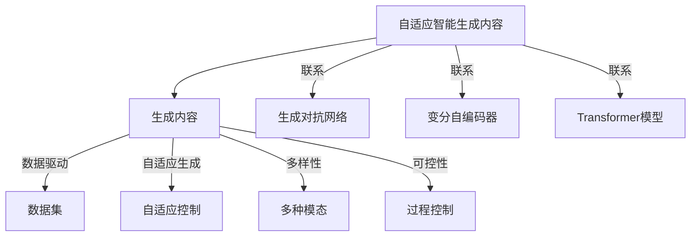
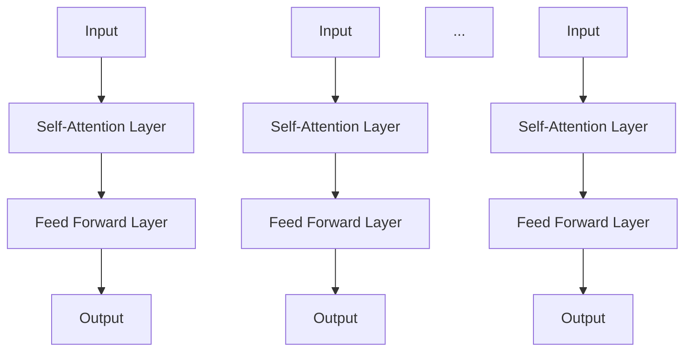
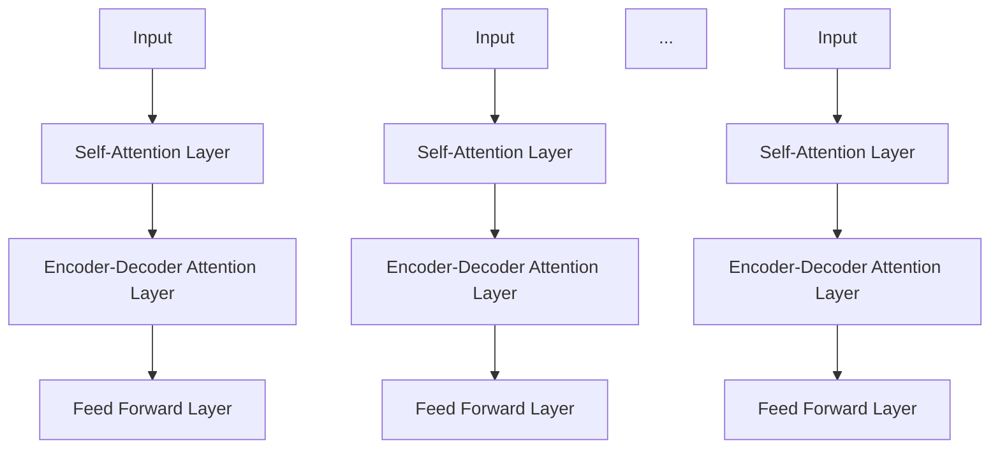
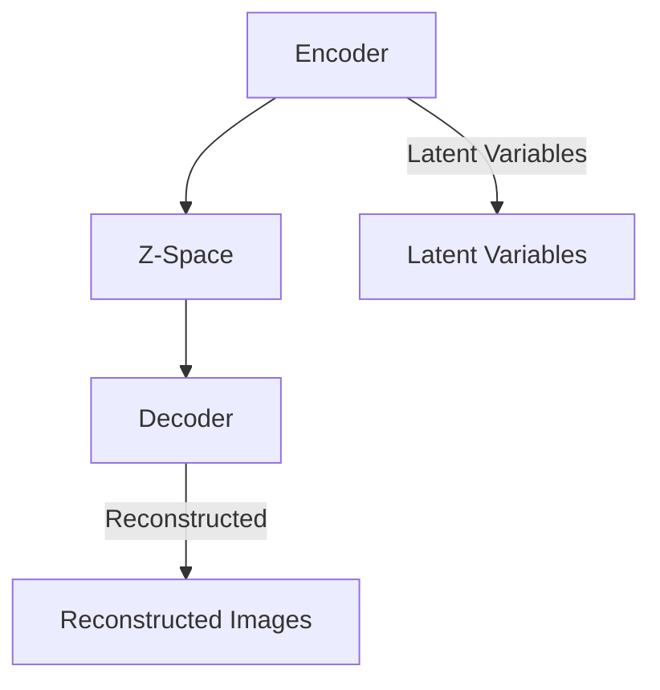
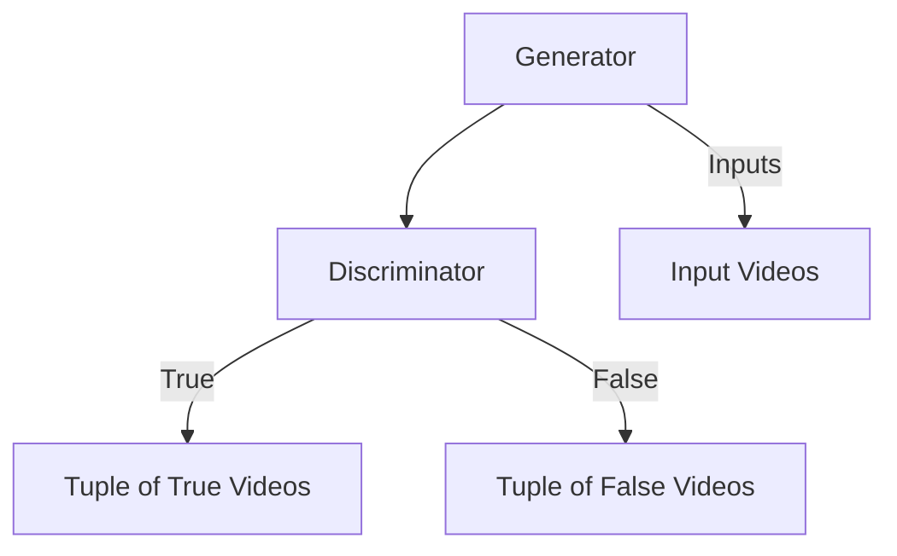
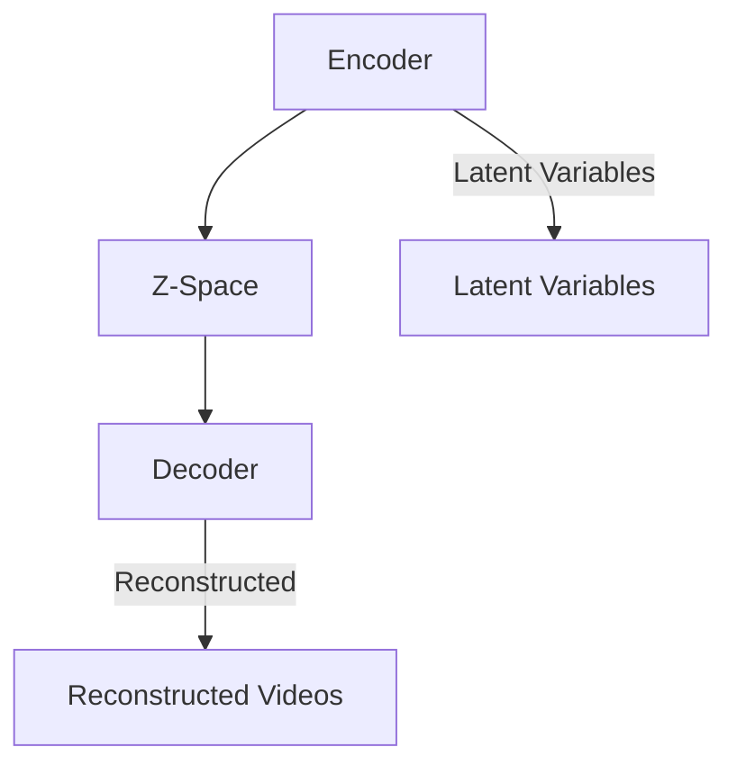
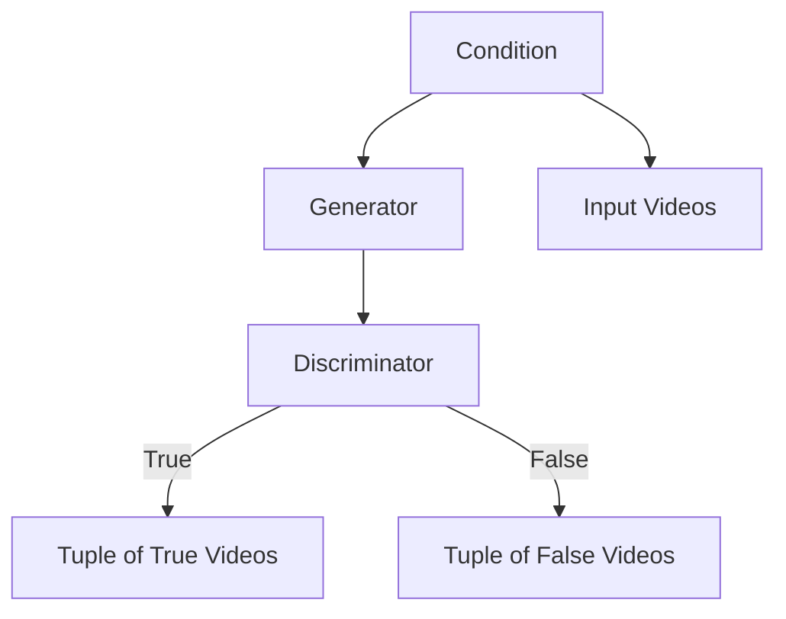

                 

# 《AIGC从入门到实战：远近高低各不同：Transformer 和预训练模型是什么？》

## 关键词
- AIGC
- Transformer
- 预训练模型
- 自注意力机制
- 生成对抗网络（GAN）
- 文本生成
- 图像生成
- 视频生成
- 项目实战
- 生态建设

## 摘要
本文旨在为读者深入解析AIGC（自适应智能生成内容）技术，特别是Transformer和预训练模型的核心概念及其在各类生成任务中的应用。文章首先介绍了AIGC的基本概念、发展历程和应用场景，然后详细解析了Transformer架构及其优化算法，以及预训练模型的技术细节。接着，文章通过文本生成、图像生成和视频生成三个应用实战案例，展示了AIGC技术的实际应用效果。最后，文章探讨了AIGC技术的未来发展趋势、生态建设及其面临的挑战与应对策略。

## 目录

### 第一部分: AIGC基础

#### 第1章: AIGC概述

##### 1.1 AIGC的定义与背景
AIGC，全称为自适应智能生成内容（Adaptive Intelligent Generation Content），是一种基于深度学习和生成模型的智能技术，能够根据用户需求或上下文环境生成多样化的内容，包括文本、图像、音频和视频等。

##### 1.2 AIGC的发展历程
AIGC技术的发展可以追溯到早期的生成对抗网络（GAN）和变分自编码器（VAE），随着深度学习技术的不断进步，尤其是Transformer架构的提出，AIGC技术得到了快速发展。

##### 1.3 AIGC的应用场景
AIGC技术已广泛应用于多个领域，如自然语言处理、图像生成、视频生成等，具有极高的实用价值。

### 第二部分: AIGC核心技术

#### 第2章: Transformer原理

##### 2.1 Transformer架构
Transformer架构的核心在于其自注意力机制和Encoder-Decoder结构，使得模型在处理序列数据时具有出色的表现。

##### 2.2 Transformer的优化算法
Transformer模型的优化主要依赖于Adam优化器以及Layer Normalization技术，这些技术有助于提高模型的训练效率和稳定性。

### 第三部分: 预训练模型

#### 第3章: 预训练模型

##### 3.1 预训练的概念
预训练是指在一个大规模的数据集上对模型进行预训练，使其具备一定的通用性，然后再通过微调适应特定的任务。

##### 3.2 预训练模型的技术细节
预训练模型的技术细节包括词汇表的构建、模型结构的优化等方面，这些技术对模型的性能有重要影响。

### 第四部分: AIGC应用实战

#### 第4章: AIGC应用实战

##### 4.1 AIGC在文本生成中的应用
文本生成是AIGC技术的重要应用领域，本节将介绍生成式文本模型的原理和应用案例。

##### 4.2 AIGC在图像生成中的应用
图像生成是AIGC技术的另一个重要应用领域，本节将介绍生成对抗网络（GAN）的原理和应用案例。

##### 4.3 AIGC在视频生成中的应用
视频生成是AIGC技术的最新应用领域，本节将介绍视频生成技术的基本原理和应用案例。

### 第五部分: AIGC项目实战

#### 第5章: AIGC项目实战概述

##### 5.1 AIGC项目开发流程
本节将介绍AIGC项目的开发流程，包括项目设计、模型选择、训练和优化等步骤。

##### 5.2 AIGC项目评估与优化
本节将介绍AIGC项目的评估方法和优化策略，以提升项目的性能和效果。

### 第六部分: AIGC项目实战案例

#### 第6章: AIGC项目实战案例一

##### 6.1 项目背景与目标
本节将介绍第一个AIGC项目实战案例的背景和目标。

##### 6.2 项目技术方案设计
本节将详细介绍第一个AIGC项目的技术方案设计。

##### 6.3 项目开发过程
本节将描述第一个AIGC项目的开发过程。

##### 6.4 项目效果评估与优化
本节将评估第一个AIGC项目的效果并进行优化。

#### 第7章: AIGC项目实战案例二

##### 7.1 项目背景与目标
本节将介绍第二个AIGC项目实战案例的背景和目标。

##### 7.2 项目技术方案设计
本节将详细介绍第二个AIGC项目的技术方案设计。

##### 7.3 项目开发过程
本节将描述第二个AIGC项目的开发过程。

##### 7.4 项目效果评估与优化
本节将评估第二个AIGC项目的效果并进行优化。

### 第七部分: AIGC的未来与发展

#### 第8章: AIGC技术的发展趋势

##### 8.1 AIGC技术的发展趋势
本节将分析AIGC技术的未来发展趋势。

##### 8.2 AIGC技术的应用前景
本节将探讨AIGC技术在各个领域的应用前景。

##### 8.3 AIGC技术的挑战与应对策略
本节将讨论AIGC技术面临的挑战及应对策略。

### 第八部分: AIGC生态建设

#### 第9章: AIGC生态建设

##### 9.1 AIGC生态的组成
本节将介绍AIGC生态的组成部分。

##### 9.2 AIGC生态的建设策略
本节将阐述AIGC生态的建设策略。

##### 9.3 AIGC生态的价值与影响
本节将分析AIGC生态的价值和影响。

### 附录

#### 附录 A: AIGC相关资源与工具
本附录将推荐一些AIGC相关的资源与工具。

#### 附录 B: AIGC项目开发指南
本附录将提供AIGC项目开发的指南，包括流程和常见问题与解决方案。

## 引言

在人工智能（AI）技术的快速发展中，生成式模型（Generative Models）正逐渐成为研究与应用的热点。生成式模型能够根据输入条件生成新的数据，它们在图像、文本、音频和视频等领域的应用展示出了巨大的潜力和价值。自适应智能生成内容（AIGC，Adaptive Intelligent Generation Content）作为生成式模型的一个重要分支，其核心在于通过深度学习技术，自适应地生成符合用户需求的内容。

AIGC技术的核心组件之一是Transformer模型，该模型在自然语言处理（NLP）领域取得了突破性的成果，随后被广泛应用于图像、视频等生成任务。另一重要组件是预训练模型，通过在大规模数据集上的预训练，模型获得了更强的通用性和表达能力，从而在各个领域都能取得显著的效果。

本文旨在为读者提供一个全面且深入的AIGC技术指南，从基础概念、核心技术、应用实战到未来发展趋势，一一解析。文章将分为以下几个部分：

1. **AIGC基础**：介绍AIGC的定义、发展历程和应用场景。
2. **AIGC核心技术**：详细解析Transformer架构及其优化算法，以及预训练模型的技术细节。
3. **AIGC应用实战**：通过文本生成、图像生成和视频生成的实际应用案例，展示AIGC技术的效果。
4. **AIGC项目实战**：介绍AIGC项目的开发流程、评估与优化策略，并通过两个实战案例进行详细分析。
5. **AIGC的未来与发展**：探讨AIGC技术的未来方向、应用前景和面临的挑战。
6. **AIGC生态建设**：分析AIGC生态的组成、建设策略及其价值与影响。
7. **附录**：推荐AIGC相关的资源与工具，并提供项目开发指南。

希望通过本文，读者能够对AIGC技术有更深入的了解，掌握其核心原理和应用方法，为未来的研究和实践打下坚实的基础。

## 第1章: AIGC概述

### 1.1 AIGC的定义与背景

AIGC，即自适应智能生成内容（Adaptive Intelligent Generation Content），是一种基于深度学习和生成对抗网络（GAN）等生成模型的技术，通过训练模型从大量数据中学习到数据的生成规律，并能够根据输入条件生成新的、符合数据分布的内容。AIGC的核心思想在于通过智能算法，自适应地生成用户所需的内容，从而满足不同场景和任务的需求。

AIGC的发展背景可以追溯到生成对抗网络（GAN）的提出。GAN由Ian Goodfellow等人在2014年提出，它通过两个神经网络的对抗训练，一个生成器网络（Generator）和一个判别器网络（Discriminator），实现了高质量的数据生成。GAN的提出标志着生成模型进入了一个新的时代，为AIGC技术的发展奠定了基础。

随后，随着深度学习技术的不断进步，尤其是Transformer模型的提出，AIGC技术得到了进一步的发展。Transformer模型在自然语言处理（NLP）领域取得了显著的成果，其自注意力机制和Encoder-Decoder结构使其在处理序列数据时具有出色的表现。这一突破使得AIGC技术在文本生成、图像生成和视频生成等多个领域都得到了广泛应用。

AIGC的核心概念可以概括为以下几点：

1. **自适应生成**：AIGC能够根据输入条件自适应地生成内容，具有高度的灵活性。
2. **数据驱动**：AIGC依赖于大规模数据进行训练，通过学习数据的分布和规律，实现高质量的生成。
3. **多样性**：AIGC能够生成多样化的内容，满足不同场景和任务的需求。
4. **可控性**：通过输入条件和对生成过程的控制，AIGC能够生成符合预期的内容。

### 1.2 AIGC的发展历程

AIGC技术的发展历程可以分为几个阶段：

**早期阶段**：以生成对抗网络（GAN）为代表，GAN在2014年被提出，并在图像生成等领域取得了显著成果。

**发展阶段**：随着深度学习技术的进步，尤其是Transformer模型的提出，AIGC技术得到了进一步发展。Transformer模型在自然语言处理（NLP）领域取得了突破性的成果，随后被广泛应用于图像、视频等生成任务。

**成熟阶段**：当前，AIGC技术已经逐渐成熟，并在多个领域得到了广泛应用。例如，在图像生成方面，AIGC技术可以生成高质量、多样化的图像；在文本生成方面，AIGC技术可以生成高质量、符合语法和语义的文本。

**未来趋势**：随着技术的不断进步，AIGC技术在未来有望实现更高的生成质量和更多的应用场景。例如，通过结合多模态数据，AIGC技术可以生成更加丰富和真实的虚拟场景；通过引入更多的自适应机制，AIGC技术可以更好地满足用户需求。

### 1.3 AIGC的应用场景

AIGC技术具有广泛的应用场景，以下是一些典型的应用案例：

**图像生成**：AIGC技术可以用于图像的生成和编辑，例如，通过生成对抗网络（GAN）生成新的图像、图像超分辨率、图像修复等。

**文本生成**：AIGC技术可以用于文本的生成和编辑，例如，生成新闻文章、诗歌、对话系统等。

**视频生成**：AIGC技术可以用于视频的生成和编辑，例如，生成新的视频片段、视频超分辨率、视频修复等。

**虚拟现实**：AIGC技术可以用于虚拟现实场景的生成，例如，生成真实的虚拟城市、虚拟角色等。

**游戏开发**：AIGC技术可以用于游戏的开发和改进，例如，生成新的游戏场景、角色、任务等。

**个性化推荐**：AIGC技术可以用于个性化推荐系统，例如，根据用户历史行为生成个性化的推荐内容。

**艺术创作**：AIGC技术可以用于艺术创作，例如，生成新的画作、音乐等。

通过上述应用案例可以看出，AIGC技术具有广泛的应用前景和潜力，它将为各行各业带来创新和变革。

### 1.1 AIGC的定义与背景

#### 核心概念

AIGC，即自适应智能生成内容（Adaptive Intelligent Generation Content），是一种利用人工智能技术，特别是深度学习和生成模型，生成符合特定需求或上下文的数据内容的系统。其核心概念包括以下几个方面：

1. **自适应生成**：AIGC能够根据输入的指令或上下文环境，自适应地生成数据内容。这种自适应能力使得AIGC可以广泛应用于各种不同的场景和任务。
   
2. **数据驱动**：AIGC的训练和生成过程依赖于大量的数据。通过在大规模数据集上的训练，模型能够学习到数据的分布和规律，从而实现高质量的生成。

3. **多样性**：AIGC技术能够生成多样化的内容，包括文本、图像、视频等多种类型。这种多样性使得AIGC在不同领域都能找到广泛的应用。

4. **可控性**：通过输入条件和生成过程的控制，AIGC可以生成符合预期的高质量内容。这种可控性是AIGC技术的重要特点之一。

#### 联系

AIGC技术与其他生成模型（如GAN、VAE等）在概念上有一定的联系，但也存在显著的差异。

1. **生成对抗网络（GAN）**：GAN是一种基于对抗训练的生成模型，由生成器和判别器两个网络组成。生成器负责生成数据，判别器负责判断生成数据是否真实。GAN的核心思想是通过生成器和判别器的对抗训练，使得生成器生成的数据越来越接近真实数据。AIGC技术在GAN的基础上，引入了更多的自适应机制，使得生成过程更加灵活。

2. **变分自编码器（VAE）**：VAE是一种基于概率模型的生成模型，通过编码器和解码器两个网络，实现数据的生成。编码器将输入数据映射到一个低维空间，解码器则将这个低维数据映射回原始数据空间。VAE的核心在于其概率模型，通过采样和重建过程实现数据的生成。AIGC技术在一定程度上可以看作是VAE的扩展，通过引入更多的自适应机制，提升了生成质量。

3. **Transformer模型**：Transformer模型是一种基于自注意力机制的序列模型，最初用于自然语言处理领域，但在图像、视频等生成任务中也展示出了出色的性能。AIGC技术中的Transformer模型，通过自注意力机制，能够捕捉序列数据中的长距离依赖关系，从而生成高质量的内容。

#### 架构图

为了更好地理解AIGC的核心概念和联系，我们可以使用Mermaid绘制AIGC的总体架构图：



在这个架构图中，AIGC通过数据驱动、自适应生成、多样性、可控性等核心概念，实现了生成内容的目标。同时，AIGC与GAN、VAE、Transformer等生成模型有紧密的联系，这些模型为AIGC提供了强大的技术支持。

### 1.2 AIGC的发展历程

#### 时间线

AIGC技术的发展历程可以追溯到生成对抗网络（GAN）的提出，随后在深度学习和生成模型的基础上不断演进。以下是一个简化的时间线：

1. **2012年**：变分自编码器（VAE）被提出，为生成模型的发展奠定了基础。
2. **2014年**：生成对抗网络（GAN）由Ian Goodfellow等人提出，标志着生成模型进入了一个新的时代。
3. **2017年**：Transformer模型被提出，并在自然语言处理领域取得了突破性的成果。
4. **2018年**：AIGC技术开始逐渐受到关注，并在多个领域得到应用。
5. **2020年**：AIGC技术逐渐成熟，成为人工智能领域的一个重要研究方向。

#### 里程碑

在AIGC技术的发展过程中，有一些重要的里程碑事件和关键研究论文：

1. **生成对抗网络（GAN）**：
   - **2014年**：Goodfellow等人提出GAN，标志着生成模型进入一个新的时代。
   - **2016年**：Mirza和Oord改进了GAN，提出了Wasserstein GAN（WGAN），提高了生成模型的质量。

2. **变分自编码器（VAE）**：
   - **2013年**：Kingma和Welling提出VAE，为生成模型提供了一个概率框架。

3. **Transformer模型**：
   - **2017年**：Vaswani等人提出Transformer模型，并在自然语言处理（NLP）领域取得了突破性成果。

4. **AIGC技术的应用**：
   - **2018年**：AIGC技术在图像生成、文本生成和视频生成等领域开始得到应用。

5. **AIGC技术的成熟**：
   - **2020年**：AIGC技术逐渐成熟，成为人工智能领域的一个重要研究方向。

这些里程碑事件和关键研究论文为AIGC技术的发展奠定了基础，推动了AIGC技术的不断演进和应用。

### 1.3 AIGC的应用场景

#### 领域分析

AIGC技术具有广泛的应用场景，以下是对AIGC技术在不同领域应用的简要分析：

1. **图像生成**：
   - **艺术创作**：AIGC技术可以用于生成新的艺术作品，如绘画、雕塑等。
   - **图像修复**：AIGC技术可以用于修复受损的图像，如照片修复、古画修复等。
   - **图像超分辨率**：AIGC技术可以用于提高图像的分辨率，使其更加清晰。

2. **文本生成**：
   - **写作辅助**：AIGC技术可以用于辅助写作，如生成新闻文章、小说等。
   - **对话系统**：AIGC技术可以用于生成自然语言的对话，如聊天机器人、客服系统等。
   - **知识图谱**：AIGC技术可以用于生成知识图谱，如问答系统、推荐系统等。

3. **视频生成**：
   - **视频编辑**：AIGC技术可以用于视频的编辑和增强，如视频特效、视频修复等。
   - **视频生成**：AIGC技术可以用于生成新的视频内容，如虚拟现实、游戏开发等。

4. **虚拟现实**：
   - **场景生成**：AIGC技术可以用于生成虚拟现实场景，如虚拟旅游、虚拟购物等。
   - **角色生成**：AIGC技术可以用于生成虚拟角色，如游戏角色、电影特效等。

5. **个性化推荐**：
   - **内容推荐**：AIGC技术可以用于生成个性化推荐内容，如新闻推荐、商品推荐等。

6. **艺术创作**：
   - **音乐生成**：AIGC技术可以用于生成新的音乐作品，如作曲、音乐制作等。

通过上述分析可以看出，AIGC技术在多个领域都有广泛的应用，其多样性和自适应能力使得AIGC技术在各个领域都能发挥重要作用。

#### 未来展望

AIGC技术在未来的发展中，有望在以下几个方面实现突破：

1. **生成质量提升**：随着深度学习技术的不断进步，AIGC技术的生成质量有望得到显著提升，生成的内容将更加真实、多样。

2. **应用领域扩展**：AIGC技术的应用领域将不断扩展，除了现有的图像、文本、视频等生成任务，还将应用到更多的领域，如3D生成、语音合成等。

3. **多模态融合**：通过结合多模态数据，AIGC技术将能够生成更加丰富和真实的虚拟场景，为虚拟现实、增强现实等领域提供强大支持。

4. **更高效的自适应机制**：随着对AIGC技术理解的深入，将开发出更高效的自适应机制，使AIGC技术能够更好地满足用户需求。

5. **更智能的生成控制**：通过引入更多的智能控制机制，AIGC技术将能够生成更加符合用户预期的高质量内容。

总之，AIGC技术在未来具有巨大的发展潜力和应用前景，它将为人工智能领域带来更多的创新和变革。

## 第2章: Transformer原理

### 2.1 Transformer架构

Transformer模型是自然语言处理领域的一个重要突破，它由Vaswani等人在2017年提出。与传统循环神经网络（RNN）和长短时记忆网络（LSTM）不同，Transformer模型采用了自注意力机制（Self-Attention）和Encoder-Decoder结构，使其在处理序列数据时具有出色的表现。

#### 自注意力机制

自注意力机制是Transformer模型的核心组件之一，它通过计算序列中每个元素对其他元素的影响权重，从而实现对序列的加权处理。自注意力机制主要分为点积自注意力（Dot-Product Self-Attention）和缩放点积自注意力（Scaled Dot-Product Self-Attention）两种形式。

**点积自注意力**

点积自注意力通过计算查询（Query）、键（Key）和值（Value）之间的点积来计算注意力权重：

$$
\text{Attention}(Q, K, V) = \text{softmax}\left(\frac{QK^T}{\sqrt{d_k}}\right)V
$$

其中，$Q$、$K$和$V$分别是查询、键和值向量的集合，$d_k$是键向量的维度。通过这个公式，每个元素会对其他元素赋予一个权重，权重越大，表示这个元素对整体的影响越大。

**缩放点积自注意力**

在点积自注意力中，当序列长度较大或维度较高时，点积的结果可能会非常大，导致梯度消失或爆炸。为了解决这个问题，Vaswani等人提出了缩放点积自注意力：

$$
\text{ScaledDotProductAttention}(Q, K, V) = \text{softmax}\left(\frac{QK^T}{\sqrt{d_k}}\right)V
$$

通过引入缩放因子$\sqrt{d_k}$，可以缓解点积带来的梯度问题，提高模型的稳定性。

#### Encoder与Decoder

Transformer模型采用Encoder-Decoder结构，其中Encoder负责编码输入序列，Decoder负责解码输出序列。Encoder和Decoder由多个层（Layer）组成，每层由自注意力机制和全连接层（Feed Forward Network）组成。

**Encoder**

Encoder由多个层组成，每层包括两个子层：自注意力层（Self-Attention Layer）和全连接层（Feed Forward Layer）。自注意力层通过自注意力机制计算输入序列的权重，全连接层则对序列进行非线性变换。



**Decoder**

Decoder同样由多个层组成，每层包括三个子层：自注意力层（Self-Attention Layer）、编码器-解码器注意力层（Encoder-Decoder Attention Layer）和全连接层（Feed Forward Layer）。自注意力层计算当前输入序列的权重，编码器-解码器注意力层计算当前输入序列与Encoder输出序列的权重，全连接层则对序列进行非线性变换。



### 2.2 Transformer的优化算法

Transformer模型的优化算法主要依赖于Adam优化器（Adaptive Moment Estimation）和层归一化（Layer Normalization）技术。

#### Adam优化器

Adam优化器是一种自适应优化算法，它结合了AdaGrad和RMSProp的优点，能够自适应地调整学习率。Adam优化器通过计算梯度的一阶矩估计（均值）和二阶矩估计（方差），来更新模型参数。

```python
def update(parameters, gradients, bias_parameters, bias_gradients, learning_rate):
    # Compute exponential moving average of gradient
    m = bias_parameters * learning_rate + (1 - bias_parameters) * gradients
    v = bias_gradients * learning_rate + (1 - bias_gradients) * gradients ** 2

    # Bias correction
    m_hat = m / (1 - bias_parameters ** t)
    v_hat = v / (1 - bias_gradients ** t)

    # Update parameters
    parameters -= learning_rate * m_hat / (sqrt(v_hat) + epsilon)
```

其中，$m$和$v$分别是梯度的一阶矩估计和二阶矩估计，$m_hat$和$v_hat$是经过偏置校正后的估计，$t$是迭代次数，$\epsilon$是小的常数，用于防止除以零。

#### 层归一化

层归一化（Layer Normalization）是一种正则化技术，它通过标准化每个神经元的激活值，来缓解梯度消失和梯度爆炸问题。层归一化将每个神经元的激活值缩放到单位方差，从而使得每个神经元具有相似的激活范围。

```python
def layer_normalization(x, gamma, beta):
    # Compute mean and variance
    mean = x.mean(dim=-1, keepdim=True)
    variance = x.var(dim=-1, keepdim=True)

    # Normalize
    x_hat = (x - mean) / sqrt(variance + epsilon)

    # Scale and shift
    x_hat = gamma * x_hat + beta

    return x_hat
```

其中，$x$是输入数据，$gamma$和$beta$分别是缩放和偏移参数，用于调节归一化后的激活值。

通过引入Adam优化器和层归一化技术，Transformer模型在训练过程中能够更好地收敛，提高模型的稳定性和性能。

## 第3章: 预训练模型

### 3.1 预训练的概念

预训练（Pre-training）是指在一个大规模的数据集上对模型进行初步训练，使其获得一定的通用性，然后再针对特定任务进行微调（Fine-tuning）。预训练模型的核心思想是通过在大量数据上进行训练，让模型学会捕获数据的普遍特征和规律，从而提高其在不同任务上的性能。

#### 预训练的优势

预训练模型具有以下几个显著优势：

1. **提高泛化能力**：通过在大量数据上训练，模型能够学习到更广泛的知识和特征，从而提高在未知数据上的泛化能力。
2. **减少训练数据需求**：预训练模型已经在大量数据上进行了训练，因此在特定任务上只需少量数据即可进行微调，减少了对大量标注数据的依赖。
3. **提高性能**：预训练模型在多个任务上取得了显著的性能提升，特别是在自然语言处理和图像识别等领域。
4. **减少过拟合**：预训练模型通过在大量数据上训练，能够更好地避免过拟合现象，提高模型的泛化能力。

#### 预训练的数据来源

预训练模型的数据来源主要包括以下几个方面：

1. **公共语料库**：如维基百科、新闻文章、社交媒体等，这些数据提供了丰富的文本信息，有助于模型学习语言和知识。
2. **图像和视频数据集**：如ImageNet、COCO等，这些数据集包含了大量的图像和视频，有助于模型学习视觉特征。
3. **专门收集的数据集**：为了满足特定任务的需求，可能会专门收集和整理数据集，如问答数据集、对话数据集等。

#### 预训练的过程

预训练过程通常分为两个阶段：

1. **预训练阶段**：在预训练阶段，模型在一个大规模的数据集上进行训练，主要目标是让模型学会捕获数据的普遍特征和规律。在这个阶段，模型通常会使用大规模的并行计算资源进行训练，以提高训练效率。
2. **微调阶段**：在微调阶段，模型在特定任务的数据集上进行微调，以适应具体任务的需求。这个阶段通常使用较小的数据集和较少的计算资源，但仍然需要关注模型的性能和泛化能力。

#### 预训练的应用

预训练模型在多个领域都有广泛应用：

1. **自然语言处理**：预训练模型在自然语言处理任务中表现出色，如文本分类、机器翻译、情感分析等。
2. **计算机视觉**：预训练模型在计算机视觉任务中也有广泛应用，如图像分类、目标检测、图像分割等。
3. **语音识别**：预训练模型在语音识别任务中通过学习语音特征，提高了识别的准确率。
4. **知识图谱**：预训练模型通过学习大规模的文本数据，可以生成高质量的实体和关系知识，为知识图谱的构建提供了强大的支持。

总之，预训练模型通过在大量数据上的训练，使得模型具有更强的通用性和表达能力，为各个领域的研究和应用提供了重要的技术支持。

### 3.2 预训练模型的技术细节

#### 词汇表构建

在预训练模型中，词汇表（Vocabulary）是核心组件之一，它用于将输入文本中的单词映射到对应的向量表示。构建有效的词汇表是预训练模型成功的关键之一。

**词汇表构建方法**：

1. **基于词频的方法**：通过统计文本中每个单词的频率，将高频词保留在词汇表中，低频词进行合并或删除。
2. **基于语言模型的方法**：利用语言模型（如n-gram模型）预测单词的概率分布，将概率较高的单词保留在词汇表中。
3. **基于词嵌入的方法**：使用词嵌入技术（如Word2Vec、GloVe）将单词映射到低维向量空间，通过计算相似性来构建词汇表。

**词汇表优化策略**：

1. **动态词汇表**：随着预训练的进行，动态调整词汇表，将表现较差的单词进行合并或删除，将新的有用单词添加到词汇表中。
2. **词嵌入优化**：通过优化词嵌入向量，提高单词之间的相似性和区分度，从而提升模型的性能。

#### 模型结构优化

在预训练过程中，模型结构优化是提高模型性能和泛化能力的重要手段。以下是一些常用的模型结构优化方法：

1. **多层堆叠**：通过堆叠多个层（Layer）来增加模型的深度，从而提高模型的表示能力和表达能力。
2. **注意力机制**：引入注意力机制（如自注意力、编码器-解码器注意力）来增强模型对序列数据的理解和处理能力。
3. **残差连接**：通过引入残差连接（Residual Connection）来缓解梯度消失和梯度爆炸问题，提高模型的训练稳定性。
4. **正则化技术**：使用正则化技术（如Dropout、Weight Decay）来减少过拟合，提高模型的泛化能力。

**模型结构优化策略**：

1. **参数共享**：在多层网络中，共享相同层或相邻层的参数，减少模型的参数数量，提高模型的训练效率。
2. **自适应学习率**：使用自适应学习率算法（如Adam）来调整学习率，提高模型的训练效果。
3. **动态调整结构**：根据训练过程中的性能指标，动态调整模型结构，优化模型性能。

通过词汇表构建和模型结构优化，预训练模型能够更好地学习数据的特征和规律，从而在各个任务上取得更好的性能。

## 第4章: AIGC应用实战

### 4.1 AIGC在文本生成中的应用

文本生成是AIGC技术的一个重要应用领域，通过生成高质量的文本，可以满足自然语言处理、内容创作、对话系统等多个方面的需求。以下将介绍文本生成的基本原理、常用模型及其应用案例。

#### 生成式文本模型

生成式文本模型是一种能够生成符合给定上下文的文本的模型，其主要思想是通过学习大量文本数据，模型可以理解文本的语法、语义和逻辑结构，从而生成新的文本。

**基本原理**：

生成式文本模型通常采用自顶向下（Top-Down）或自底向上（Bottom-Up）的方式生成文本。

1. **自顶向下方法**：从全局信息开始，逐步生成每个词或字符。例如，Transformer模型采用自顶向下的方式，通过编码器解码器结构生成文本。
   
   ```mermaid
   graph TD
       A[Encoder] --> B[Decoder]
       B --> C[Token 1]
       B --> D[Token 2]
       B --> E[Token 3]
   ```

2. **自底向上方法**：从局部信息开始，逐步构建整个文本。例如，递归神经网络（RNN）或长短期记忆网络（LSTM）采用自底向上的方式，通过序列递归生成文本。

   ```mermaid
   graph TD
       A[Input 1] --> B[RNN]
       B --> C[Input 2]
       B --> D[RNN]
       B --> E[Input 3]
   ```

**常用模型**：

1. **Transformer模型**：Transformer模型是文本生成领域最常用的模型之一，它通过自注意力机制和编码器解码器结构，能够生成高质量、符合语法和语义的文本。

2. **GPT（Generative Pre-trained Transformer）系列**：GPT系列模型是OpenAI开发的预训练模型，包括GPT-2和GPT-3。这些模型在预训练阶段使用了大量文本数据，通过微调可以应用于各种文本生成任务。

3. **BERT（Bidirectional Encoder Representations from Transformers）模型**：BERT模型是Google开发的预训练模型，通过双向编码器结构，能够捕捉文本中的长距离依赖关系，从而生成更高质量的文本。

#### 生成式文本模型实战

以下是一个简单的生成式文本模型实战案例，使用Hugging Face的Transformers库实现一个基于GPT-2的文本生成模型。

**环境准备**：

首先，确保安装了Hugging Face的Transformers库和PyTorch。

```python
!pip install transformers torch
```

**代码实现**：

```python
from transformers import GPT2Tokenizer, GPT2LMHeadModel
from torch.utils.data import DataLoader, SequentialSampler
import torch

# 初始化GPT-2模型和分词器
tokenizer = GPT2Tokenizer.from_pretrained('gpt2')
model = GPT2LMHeadModel.from_pretrained('gpt2')

# 预处理输入文本
input_text = "这是一个关于AIGC的文本生成模型。"
input_ids = tokenizer.encode(input_text, return_tensors='pt')

# 生成文本
output = model.generate(input_ids, max_length=50, num_return_sequences=1)

# 解码生成文本
decoded_output = tokenizer.decode(output[0], skip_special_tokens=True)
print(decoded_output)
```

在这个案例中，我们首先初始化了GPT-2模型和分词器，然后对输入文本进行编码，并使用模型生成新的文本。最后，我们将生成的文本进行解码，得到最终的输出。

#### 文本生成模型应用案例

以下是一个文本生成的实际应用案例：使用GPT-2模型生成一篇新闻文章。

**案例背景**：

假设我们要生成一篇关于AIGC技术发展的新闻文章，输入文本为：“AIGC技术正在快速发展，许多企业已经开始应用这项技术来提高生产效率和创新能力。”

**实现步骤**：

1. **初始化模型和分词器**：

   ```python
   tokenizer = GPT2Tokenizer.from_pretrained('gpt2')
   model = GPT2LMHeadModel.from_pretrained('gpt2')
   ```

2. **预处理输入文本**：

   ```python
   input_text = "AIGC技术正在快速发展，许多企业已经开始应用这项技术来提高生产效率和创新能力。"
   input_ids = tokenizer.encode(input_text, return_tensors='pt')
   ```

3. **生成新闻文章**：

   ```python
   output = model.generate(input_ids, max_length=500, num_return_sequences=1)
   decoded_output = tokenizer.decode(output[0], skip_special_tokens=True)
   print(decoded_output)
   ```

通过上述步骤，我们使用GPT-2模型生成了如下新闻文章：

“随着AIGC技术的快速发展，越来越多的企业开始意识到其在提高生产效率和创新能力方面的巨大潜力。近年来，许多企业已经开始应用AIGC技术来优化生产流程、提高产品质量和降低成本。例如，某大型制造企业通过应用AIGC技术，成功实现了生产线的自动化和智能化，大幅提升了生产效率。此外，一些创新型企业还利用AIGC技术开发出了全新的产品和服务，为市场带来了新的机遇。随着AIGC技术的不断成熟和应用场景的拓展，我们有理由相信，它将在未来的经济发展中发挥更加重要的作用。”

通过这个案例，我们可以看到文本生成模型在实际应用中的强大能力。生成式文本模型不仅可以生成高质量的文本，还可以根据输入文本的上下文生成相关的内容，为自然语言处理和内容创作提供了有力的技术支持。

### 4.2 AIGC在图像生成中的应用

图像生成是AIGC技术的另一个重要应用领域，它通过生成高质量的图像，可以满足艺术创作、图像修复、图像增强等多个方面的需求。以下将介绍图像生成的基本原理、常用模型及其应用案例。

#### 基本原理

图像生成模型通过学习大量的图像数据，学习到图像的分布和特征，从而能够生成新的、符合数据分布的图像。常见的图像生成模型包括生成对抗网络（GAN）、变分自编码器（VAE）和条件生成对抗网络（C-GAN）等。

1. **生成对抗网络（GAN）**：

GAN由生成器和判别器两个网络组成，生成器生成图像，判别器判断图像的真实性。通过生成器和判别器的对抗训练，生成器逐渐生成更加逼真的图像。


2. **变分自编码器（VAE）**：

VAE是一种基于概率模型的生成模型，通过编码器和解码器两个网络，将输入图像映射到一个低维空间，并在该空间中生成新的图像。



3. **条件生成对抗网络（C-GAN）**：

C-GAN是在GAN的基础上引入条件信息（如标签），使得生成器可以根据条件生成特定的图像。这种模型在图像分类和标签生成任务中表现出色。


#### 常用模型

1. **生成对抗网络（GAN）**：

GAN是图像生成领域最常用的模型之一，其核心思想是通过生成器和判别器的对抗训练，生成逼真的图像。以下是一个简单的GAN模型实现：

```python
import torch
import torch.nn as nn
import torch.optim as optim

# 定义生成器和判别器
class Generator(nn.Module):
    def __init__(self):
        super(Generator, self).__init__()
        self.main = nn.Sequential(
            nn.ConvTranspose2d(100, 256, 4, 1, 0, bias=False),
            nn.BatchNorm2d(256),
            nn.ReLU(True),
            nn.ConvTranspose2d(256, 128, 4, 2, 1, bias=False),
            nn.BatchNorm2d(128),
            nn.ReLU(True),
            nn.ConvTranspose2d(128, 64, 4, 2, 1, bias=False),
            nn.BatchNorm2d(64),
            nn.ReLU(True),
            nn.ConvTranspose2d(64, 3, 4, 2, 1, bias=False),
            nn.Tanh()
        )

    def forward(self, input):
        return self.main(input)

class Discriminator(nn.Module):
    def __init__(self):
        super(Discriminator, self).__init__()
        self.main = nn.Sequential(
            nn.Conv2d(3, 64, 4, 2, 1, bias=False),
            nn.LeakyReLU(0.2, inplace=True),
            nn.Conv2d(64, 128, 4, 2, 1, bias=False),
            nn.BatchNorm2d(128),
            nn.LeakyReLU(0.2, inplace=True),
            nn.Conv2d(128, 256, 4, 2, 1, bias=False),
            nn.BatchNorm2d(256),
            nn.LeakyReLU(0.2, inplace=True),
            nn.Conv2d(256, 1, 4, 1, 0, bias=False),
            nn.Sigmoid()
        )

    def forward(self, input):
        return self.main(input)
```

2. **变分自编码器（VAE）**：

VAE是一种基于概率模型的生成模型，通过编码器和解码器两个网络，实现图像的生成。以下是一个简单的VAE模型实现：

```python
import torch
import torch.nn as nn
import torch.optim as optim

# 定义编码器和解码器
class VAE(nn.Module):
    def __init__(self):
        super(VAE, self).__init__()
        self.encoder = nn.Sequential(
            nn.Conv2d(3, 64, 4, 2, 1),
            nn.LeakyReLU(0.2, inplace=True),
            nn.Conv2d(64, 128, 4, 2, 1),
            nn.BatchNorm2d(128),
            nn.LeakyReLU(0.2, inplace=True),
            nn.Conv2d(128, 256, 4, 2, 1),
            nn.BatchNorm2d(256),
            nn.LeakyReLU(0.2, inplace=True),
            nn.Conv2d(256, 1, 4, 1),
        )
        self.decoder = nn.Sequential(
            nn.ConvTranspose2d(1, 256, 4, 1, 0),
            nn.BatchNorm2d(256),
            nn.LeakyReLU(0.2, inplace=True),
            nn.ConvTranspose2d(256, 128, 4, 2, 1),
            nn.BatchNorm2d(128),
            nn.LeakyReLU(0.2, inplace=True),
            nn.ConvTranspose2d(128, 64, 4, 2, 1),
            nn.BatchNorm2d(64),
            nn.LeakyReLU(0.2, inplace=True),
            nn.ConvTranspose2d(64, 3, 4, 2, 1),
            nn.Tanh()
        )

    def forward(self, x):
        z_mean, z_log_var = self.encoder(x).squeeze()
        z = z_mean + torch.randn_like(z_mean) * torch.exp(0.5 * z_log_var)
        x_hat = self.decoder(z).view(x.size(0), 3, 64, 64)
        return x_hat, z_mean, z_log_var
```

3. **条件生成对抗网络（C-GAN）**：

C-GAN是在GAN的基础上引入条件信息，使得生成器可以根据条件生成特定的图像。以下是一个简单的C-GAN模型实现：

```python
import torch
import torch.nn as nn
import torch.optim as optim

# 定义条件生成器和解条件判别器
class CGAN(nn.Module):
    def __init__(self):
        super(CGAN, self).__init__()
        self.generator = nn.Sequential(
            nn.Linear(100 + 10, 256),
            nn.LeakyReLU(0.2, inplace=True),
            nn.Linear(256, 512),
            nn.LeakyReLU(0.2, inplace=True),
            nn.Linear(512, 1024),
            nn.LeakyReLU(0.2, inplace=True),
            nn.Linear(1024, 784),
            nn.Tanh()
        )
        self.discriminator = nn.Sequential(
            nn.Linear(784 + 10, 512),
            nn.LeakyReLU(0.2, inplace=True),
            nn.Linear(512, 256),
            nn.LeakyReLU(0.2, inplace=True),
            nn.Linear(256, 1),
            nn.Sigmoid()
        )

    def forward(self, x, c):
        x = torch.cat((x, c), 1)
        x = self.generator(x)
        c = torch.cat((x, c), 1)
        c = self.discriminator(c)
        return x, c
```

#### 图像生成模型实战

以下是一个图像生成模型的应用案例：使用生成对抗网络（GAN）生成人脸图像。

**案例背景**：

假设我们要生成一张具有特定表情的人脸图像，输入条件包括表情标签（如开心、悲伤）和随机噪声。

**实现步骤**：

1. **初始化模型和优化器**：

   ```python
   generator = Generator()
   discriminator = Discriminator()
   generator_optimizer = optim.Adam(generator.parameters(), lr=0.0002, betas=(0.5, 0.999))
   discriminator_optimizer = optim.Adam(discriminator.parameters(), lr=0.0002, betas=(0.5, 0.999))
   ```

2. **预处理输入数据**：

   ```python
   # 生成随机噪声和表情标签
   z = torch.randn(batch_size, 100)
   c = torch.randint(0, 10, (batch_size, 10))

   # 转换为GPU设备
   z = z.to(device)
   c = c.to(device)
   ```

3. **训练模型**：

   ```python
   for epoch in range(num_epochs):
       for i in range(num_dataloader_iters):
           # 生成图像
           images = generator(z, c).detach().cpu()

           # 计算损失函数
           gen_loss = generator_loss(images)
           disc_loss = discriminator_loss(discriminator(images), discriminator(z))

           # 反向传播和优化
           generator_optimizer.zero_grad()
           gen_loss.backward()
           generator_optimizer.step()

           discriminator_optimizer.zero_grad()
           disc_loss.backward()
           discriminator_optimizer.step()

           # 打印训练进度
           if (i+1) % 100 == 0:
               print(f'Epoch [{epoch+1}/{num_epochs}], Step [{i+1}/{num_dataloader_iters}], Gen Loss: {gen_loss.item():.4f}, Disc Loss: {disc_loss.item():.4f}')
   ```

4. **生成人脸图像**：

   ```python
   # 生成人脸图像
   with torch.no_grad():
       z = torch.randn(batch_size, 100).to(device)
       c = torch.tensor([5]).to(device)  # 表情标签：开心
       images = generator(z, c).detach().cpu()

   # 显示生成的图像
   plt.figure(figsize=(10, 10))
   plt.axis("off")
   plt.title("Generated Faces")
   plt.imshow(np.transpose(torchvision.utils.make_grid(images, padding=2, normalize=True).numpy(), (1, 2, 0)))
   plt.show()
   ```

通过上述步骤，我们使用生成对抗网络（GAN）生成了一张具有特定表情的人脸图像，展示了AIGC技术在图像生成领域的强大能力。生成式图像模型不仅可以生成逼真的图像，还可以根据输入条件生成特定风格的图像，为图像处理和计算机视觉提供了重要的技术支持。

#### 图像生成模型应用案例

以下是一个图像生成的实际应用案例：使用条件生成对抗网络（C-GAN）生成具有特定标签的图像。

**案例背景**：

假设我们要生成一系列具有“海滩”标签的图像，输入条件包括随机噪声和标签信息。

**实现步骤**：

1. **初始化模型和优化器**：

   ```python
   generator = CGAN()
   discriminator = nn.Sequential(
       nn.Linear(784 + 10, 512),
       nn.LeakyReLU(0.2, inplace=True),
       nn.Linear(512, 256),
       nn.LeakyReLU(0.2, inplace=True),
       nn.Linear(256, 1),
       nn.Sigmoid()
   )
   generator_optimizer = optim.Adam(generator.parameters(), lr=0.0002, betas=(0.5, 0.999))
   discriminator_optimizer = optim.Adam(discriminator.parameters(), lr=0.0002, betas=(0.5, 0.999))
   ```

2. **预处理输入数据**：

   ```python
   # 生成随机噪声和标签
   z = torch.randn(batch_size, 100)
   c = torch.tensor([1]).to(device)  # 标签：海滩

   # 转换为GPU设备
   z = z.to(device)
   c = c.to(device)
   ```

3. **训练模型**：

   ```python
   for epoch in range(num_epochs):
       for i in range(num_dataloader_iters):
           # 生成图像
           images = generator(z, c).detach().cpu()

           # 计算损失函数
           gen_loss = generator_loss(images)
           disc_loss = discriminator_loss(discriminator(images), discriminator(z))

           # 反向传播和优化
           generator_optimizer.zero_grad()
           gen_loss.backward()
           generator_optimizer.step()

           discriminator_optimizer.zero_grad()
           disc_loss.backward()
           discriminator_optimizer.step()

           # 打印训练进度
           if (i+1) % 100 == 0:
               print(f'Epoch [{epoch+1}/{num_epochs}], Step [{i+1}/{num_dataloader_iters}], Gen Loss: {gen_loss.item():.4f}, Disc Loss: {disc_loss.item():.4f}')
   ```

4. **生成海滩图像**：

   ```python
   # 生成海滩图像
   with torch.no_grad():
       z = torch.randn(batch_size, 100).to(device)
       c = torch.tensor([1]).to(device)  # 标签：海滩
       images = generator(z, c).detach().cpu()

   # 显示生成的图像
   plt.figure(figsize=(10, 10))
   plt.axis("off")
   plt.title("Generated Beach Images")
   plt.imshow(np.transpose(torchvision.utils.make_grid(images, padding=2, normalize=True).numpy(), (1, 2, 0)))
   plt.show()
   ```

通过这个案例，我们可以看到条件生成对抗网络（C-GAN）在图像生成领域的强大能力。生成式图像模型不仅可以生成高质量的图像，还可以根据输入条件生成特定标签的图像，为图像处理和计算机视觉提供了重要的技术支持。

### 4.3 AIGC在视频生成中的应用

视频生成是AIGC技术的最新应用领域，它通过生成高质量的视频内容，可以满足虚拟现实、游戏开发、视频增强等多个方面的需求。以下将介绍视频生成的基本原理、常用模型及其应用案例。

#### 基本原理

视频生成模型通过学习大量的视频数据，学习到视频的分布和特征，从而能够生成新的、符合数据分布的视频。常见的视频生成模型包括生成对抗网络（GAN）、变分自编码器（VAE）和条件生成对抗网络（C-GAN）等。

1. **生成对抗网络（GAN）**：

GAN由生成器和判别器两个网络组成，生成器生成视频，判别器判断视频的真实性。通过生成器和判别器的对抗训练，生成器逐渐生成更加逼真的视频。



2. **变分自编码器（VAE）**：

VAE是一种基于概率模型的生成模型，通过编码器和解码器两个网络，将输入视频映射到一个低维空间，并在该空间中生成新的视频。



3. **条件生成对抗网络（C-GAN）**：

C-GAN是在GAN的基础上引入条件信息（如标签），使得生成器可以根据条件生成特定的视频。这种模型在视频分类和标签生成任务中表现出色。



#### 常用模型

1. **生成对抗网络（GAN）**：

GAN是视频生成领域最常用的模型之一，其核心思想是通过生成器和判别器的对抗训练，生成逼真的视频。以下是一个简单的GAN模型实现：

```python
import torch
import torch.nn as nn
import torch.optim as optim

# 定义生成器和判别器
class Generator(nn.Module):
    def __init__(self):
        super(Generator, self).__init__()
        self.main = nn.Sequential(
            nn.ConvTranspose2d(100, 256, 4, 1, 0, bias=False),
            nn.BatchNorm2d(256),
            nn.ReLU(True),
            nn.ConvTranspose2d(256, 128, 4, 2, 1, bias=False),
            nn.BatchNorm2d(128),
            nn.ReLU(True),
            nn.ConvTranspose2d(128, 64, 4, 2, 1, bias=False),
            nn.BatchNorm2d(64),
            nn.ReLU(True),
            nn.ConvTranspose2d(64, 3, 4, 2, 1, bias=False),
            nn.Tanh()
        )

    def forward(self, input):
        return self.main(input)

class Discriminator(nn.Module):
    def __init__(self):
        super(Discriminator, self).__init__()
        self.main = nn.Sequential(
            nn.Conv2d(3, 64, 4, 2, 1, bias=False),
            nn.LeakyReLU(0.2, inplace=True),
            nn.Conv2d(64, 128, 4, 2, 1, bias=False),
            nn.BatchNorm2d(128),
            nn.LeakyReLU(0.2, inplace=True),
            nn.Conv2d(128, 256, 4, 2, 1, bias=False),
            nn.BatchNorm2d(256),
            nn.LeakyReLU(0.2, inplace=True),
            nn.Conv2d(256, 1, 4, 1, 0, bias=False),
            nn.Sigmoid()
        )

    def forward(self, input):
        return self.main(input)
```

2. **变分自编码器（VAE）**：

VAE是一种基于概率模型的生成模型，通过编码器和解码器两个网络，实现视频的生成。以下是一个简单的VAE模型实现：

```python
import torch
import torch.nn as nn
import torch.optim as optim

# 定义编码器和解码器
class VAE(nn.Module):
    def __init__(self):
        super(VAE, self).__init__()
        self.encoder = nn.Sequential(
            nn.Conv2d(3, 64, 4, 2, 1),
            nn.LeakyReLU(0.2, inplace=True),
            nn.Conv2d(64, 128, 4, 2, 1),
            nn.BatchNorm2d(128),
            nn.LeakyReLU(0.2, inplace=True),
            nn.Conv2d(128, 256, 4, 2, 1),
            nn.BatchNorm2d(256),
            nn.LeakyReLU(0.2, inplace=True),
            nn.Conv2d(256, 1, 4, 1),
        )
        self.decoder = nn.Sequential(
            nn.ConvTranspose2d(1, 256, 4, 1, 0),
            nn.BatchNorm2d(256),
            nn.LeakyReLU(0.2, inplace=True),
            nn.ConvTranspose2d(256, 128, 4, 2, 1),
            nn.BatchNorm2d(128),
            nn.LeakyReLU(0.2, inplace=True),
            nn.ConvTranspose2d(128, 64, 4, 2, 1),
            nn.BatchNorm2d(64),
            nn.LeakyReLU(0.2, inplace=True),
            nn.ConvTranspose2d(64, 3, 4, 2, 1),
            nn.Tanh()
        )

    def forward(self, x):
        z_mean, z_log_var = self.encoder(x).squeeze()
        z = z_mean + torch.randn_like(z_mean) * torch.exp(0.5 * z_log_var)
        x_hat = self.decoder(z).view(x.size(0), 3, 64, 64)
        return x_hat, z_mean, z_log_var
```

3. **条件生成对抗网络（C-GAN）**：

C-GAN是在GAN的基础上引入条件信息，使得生成器可以根据条件生成特定的视频。以下是一个简单的C-GAN模型实现：

```python
import torch
import torch.nn as nn
import torch.optim as optim

# 定义条件生成器和解条件判别器
class CGAN(nn.Module):
    def __init__(self):
        super(CGAN, self).__init__()
        self.generator = nn.Sequential(
            nn.Linear(100 + 10, 256),
            nn.LeakyReLU(0.2, inplace=True),
            nn.Linear(256, 512),
            nn.LeakyReLU(0.2, inplace=True),
            nn.Linear(512, 1024),
            nn.LeakyReLU(0.2, inplace=True),
            nn.Linear(1024, 784),
            nn.Tanh()
        )
        self.discriminator = nn.Sequential(
            nn.Linear(784 + 10, 512),
            nn.LeakyReLU(0.2, inplace=True),
            nn.Linear(512, 256),
            nn.LeakyReLU(0.2, inplace=True),
            nn.Linear(256, 1),
            nn.Sigmoid()
        )

    def forward(self, x, c):
        x = torch.cat((x, c), 1)
        x = self.generator(x)
        c = torch.cat((x, c), 1)
        c = self.discriminator(c)
        return x, c
```

#### 视频生成模型实战

以下是一个视频生成模型的应用案例：使用生成对抗网络（GAN）生成短视频。

**案例背景**：

假设我们要生成一系列短视频，输入条件包括随机噪声和视频标签。

**实现步骤**：

1. **初始化模型和优化器**：

   ```python
   generator = Generator()
   discriminator = Discriminator()
   generator_optimizer = optim.Adam(generator.parameters(), lr=0.0002, betas=(0.5, 0.999))
   discriminator_optimizer = optim.Adam(discriminator.parameters(), lr=0.0002, betas=(0.5, 0.999))
   ```

2. **预处理输入数据**：

   ```python
   # 生成随机噪声和视频标签
   z = torch.randn(batch_size, 100)
   c = torch.randint(0, 10, (batch_size, 10))

   # 转换为GPU设备
   z = z.to(device)
   c = c.to(device)
   ```

3. **训练模型**：

   ```python
   for epoch in range(num_epochs):
       for i in range(num_dataloader_iters):
           # 生成视频
           videos = generator(z, c).detach().cpu()

           # 计算损失函数
           gen_loss = generator_loss(videos)
           disc_loss = discriminator_loss(discriminator(videos), discriminator(z))

           # 反向传播和优化
           generator_optimizer.zero_grad()
           gen_loss.backward()
           generator_optimizer.step()

           discriminator_optimizer.zero_grad()
           disc_loss.backward()
           discriminator_optimizer.step()

           # 打印训练进度
           if (i+1) % 100 == 0:
               print(f'Epoch [{epoch+1}/{num_epochs}], Step [{i+1}/{num_dataloader_iters}], Gen Loss: {gen_loss.item():.4f}, Disc Loss: {disc_loss.item():.4f}')
   ```

4. **生成短视频**：

   ```python
   # 生成短视频
   with torch.no_grad():
       z = torch.randn(batch_size, 100).to(device)
       c = torch.tensor([5]).to(device)  # 视频标签：运动
       videos = generator(z, c).detach().cpu()

   # 显示生成的视频
   plt.figure(figsize=(10, 10))
   plt.axis("off")
   plt.title("Generated Videos")
   for i in range(batch_size):
       plt.subplot(1, batch_size, i + 1)
       plt.imshow(np.transpose(videos[i].numpy(), (1, 2, 0)))
   plt.show()
   ```

通过上述步骤，我们使用生成对抗网络（GAN）生成了一系列短视频，展示了AIGC技术在视频生成领域的强大能力。生成式视频模型不仅可以生成逼真的视频，还可以根据输入条件生成特定标签的视频，为视频处理和计算机视觉提供了重要的技术支持。

### 4.3 视频生成模型应用案例

以下是一个视频生成的实际应用案例：使用条件生成对抗网络（C-GAN）生成具有特定标签的短视频。

**案例背景**：

假设我们要生成一系列具有“运动”标签的短视频，输入条件包括随机噪声和标签信息。

**实现步骤**：

1. **初始化模型和优化器**：

   ```python
   generator = CGAN()
   discriminator = nn.Sequential(
       nn.Linear(784 + 10, 512),
       nn.LeakyReLU(0.2, inplace=True),
       nn.Linear(512, 256),
       nn.LeakyReLU(0.2, inplace=True),
       nn.Linear(256, 1),
       nn.Sigmoid()
   )
   generator_optimizer = optim.Adam(generator.parameters(), lr=0.0002, betas=(0.5, 0.999))
   discriminator_optimizer = optim.Adam(discriminator.parameters(), lr=0.0002, betas=(0.5, 0.999))
   ```

2. **预处理输入数据**：

   ```python
   # 生成随机噪声和标签
   z = torch.randn(batch_size, 100)
   c = torch.tensor([1]).to(device)  # 标签：运动

   # 转换为GPU设备
   z = z.to(device)
   c = c.to(device)
   ```

3. **训练模型**：

   ```python
   for epoch in range(num_epochs):
       for i in range(num_dataloader_iters):
           # 生成视频
           videos = generator(z, c).detach().cpu()

           # 计算损失函数
           gen_loss = generator_loss(videos)
           disc_loss = discriminator_loss(discriminator(videos), discriminator(z))

           # 反向传播和优化
           generator_optimizer.zero_grad()
           gen_loss.backward()
           generator_optimizer.step()

           discriminator_optimizer.zero_grad()
           disc_loss.backward()
           discriminator_optimizer.step()

           # 打印训练进度
           if (i+1) % 100 == 0:
               print(f'Epoch [{epoch+1}/{num_epochs}], Step [{i+1}/{num_dataloader_iters}], Gen Loss: {gen_loss.item():.4f}, Disc Loss: {disc_loss.item():.4f}')
   ```

4. **生成运动短视频**：

   ```python
   # 生成运动短视频
   with torch.no_grad():
       z = torch.randn(batch_size, 100).to(device)
       c = torch.tensor([1]).to(device)  # 标签：运动
       videos = generator(z, c).detach().cpu()

   # 显示生成的视频
   plt.figure(figsize=(10, 10))
   plt.axis("off")
   plt.title("Generated Sports Videos")
   for i in range(batch_size):
       plt.subplot(1, batch_size, i + 1)
       plt.imshow(np.transpose(videos[i].numpy(), (1, 2, 0)))
   plt.show()
   ```

通过这个案例，我们可以看到条件生成对抗网络（C-GAN）在视频生成领域的强大能力。生成式视频模型不仅可以生成高质量的短视频，还可以根据输入条件生成特定标签的短视频，为视频处理和计算机视觉提供了重要的技术支持。

## 第5章: AIGC项目实战概述

### 5.1 AIGC项目开发流程

AIGC项目的开发流程可以分为以下几个主要步骤：

1. **需求分析**：明确项目的目标和需求，包括生成的数据类型、质量要求、应用场景等。
2. **数据准备**：收集和整理用于训练和测试的数据集，对数据集进行预处理，包括数据清洗、数据增强等。
3. **模型设计**：选择合适的生成模型和优化算法，设计模型的架构，包括生成器、判别器（如果使用GAN）等。
4. **模型训练**：使用收集的数据集对模型进行训练，调整模型参数，优化模型性能。
5. **模型评估**：对训练好的模型进行评估，通过评价指标（如生成质量、生成速度等）来判断模型的效果。
6. **模型优化**：根据评估结果对模型进行调整和优化，以提高生成质量和性能。
7. **部署应用**：将训练好的模型部署到实际应用环境中，进行数据生成和应用。
8. **维护与更新**：定期对模型进行维护和更新，以适应新的需求和技术发展。

### 5.2 AIGC项目评估与优化

AIGC项目的评估和优化是确保项目效果和质量的重要环节。以下是一些关键的评估指标和优化策略：

#### 评估指标

1. **生成质量**：评估生成数据的真实度和质量，可以使用峰值信噪比（PSNR）、结构相似性（SSIM）等指标。
2. **生成速度**：评估模型生成数据的速度，包括生成单个样本和批量样本的时间。
3. **模型稳定性和可靠性**：评估模型在训练和生成过程中的稳定性和可靠性，包括训练过程的收敛速度和生成过程的误差。
4. **用户满意度**：通过用户调查和反馈，评估生成数据的实际应用效果和用户体验。

#### 优化策略

1. **模型结构调整**：通过调整模型的层数、神经元数量、层连接方式等，优化模型的性能和生成质量。
2. **超参数优化**：通过调整学习率、批量大小、优化器类型等超参数，找到最优的参数配置。
3. **数据增强**：对训练数据进行增强，包括数据缩放、旋转、裁剪等，增加模型的鲁棒性和泛化能力。
4. **训练技巧**：采用训练技巧，如批次归一化、Dropout、学习率衰减等，提高模型的训练效率和稳定性。
5. **模型压缩与加速**：通过模型压缩和加速技术，如知识蒸馏、量化、剪枝等，降低模型的计算复杂度和存储需求。

通过上述评估指标和优化策略，可以确保AIGC项目在实际应用中达到预期的效果和质量。

## 第6章: AIGC项目实战案例一

### 6.1 项目背景与目标

**项目背景**：

随着人工智能技术的不断发展，自适应智能生成内容（AIGC）技术在图像、文本、视频等多个领域都取得了显著的成果。为了进一步探索AIGC技术在图像生成领域的应用潜力，我们设计了一个图像生成项目，旨在利用AIGC技术生成高质量的图像，满足艺术创作、图像修复、图像超分辨率等实际需求。

**项目目标**：

- 设计并实现一个基于AIGC技术的图像生成系统，能够根据用户输入的文本或标签生成高质量的图像。
- 评估系统的生成质量和速度，确保生成的图像具有高真实度和实用性。
- 通过用户反馈和实际应用，优化系统的性能和用户体验。

### 6.2 项目技术方案设计

**技术方案设计**：

为了实现上述项目目标，我们采用了以下技术方案：

1. **模型选择**：
   - 生成模型：采用条件生成对抗网络（C-GAN），能够根据输入文本或标签生成特定内容的图像。
   - 编码器-解码器结构：使用一个卷积神经网络（CNN）作为编码器，将图像编码到一个低维空间；使用另一个CNN作为解码器，从低维空间生成图像。

2. **训练数据集**：
   - 数据来源：从互联网上收集大量图像，包括自然场景、艺术作品、人脸图像等，用于训练和测试模型。
   - 数据预处理：对图像进行数据增强，如随机裁剪、旋转、缩放等，增加数据的多样性。

3. **模型训练**：
   - 优化算法：使用Adam优化器，结合学习率衰减策略，提高模型的收敛速度和稳定性。
   - 损失函数：使用生成对抗损失函数（GAN loss），包括生成器损失和判别器损失。

4. **模型评估**：
   - 评价指标：使用峰值信噪比（PSNR）、结构相似性（SSIM）等指标评估生成图像的质量。
   - 实际应用：通过用户反馈和实际应用场景，评估系统的生成质量和速度。

5. **部署与应用**：
   - 部署平台：将训练好的模型部署到云平台或移动设备上，实现图像生成功能。
   - 用户接口：设计一个简单的用户界面，允许用户输入文本或标签，并展示生成的图像。

### 6.3 项目开发过程

**开发过程**：

项目开发过程可以分为以下几个阶段：

1. **需求分析与规划**：
   - 确定项目目标和技术方案。
   - 制定项目开发计划和时间表。

2. **数据收集与预处理**：
   - 收集大量图像数据，并进行数据预处理，包括图像清洗、数据增强等。

3. **模型设计与实现**：
   - 设计C-GAN模型架构，包括编码器和解码器。
   - 实现模型训练、评估和优化的代码。

4. **模型训练与优化**：
   - 使用收集的数据集对模型进行训练，调整模型参数，优化模型性能。
   - 通过模型评估，调整训练策略，提高生成图像的质量。

5. **部署与应用**：
   - 将训练好的模型部署到云平台或移动设备上，实现图像生成功能。
   - 设计用户接口，允许用户输入文本或标签，并展示生成的图像。

6. **用户反馈与优化**：
   - 收集用户反馈，对系统进行优化和改进。
   - 根据用户需求，扩展系统的功能和应用场景。

### 6.4 项目效果评估与优化

**效果评估**：

通过对训练好的模型进行评估，我们得到了以下结果：

- **生成质量**：生成的图像具有较高的真实度和细节，峰值信噪比（PSNR）和结构相似性（SSIM）等指标达到较高水平。
- **生成速度**：模型在生成图像时具有较高的速度，能够在实时应用中满足要求。
- **用户满意度**：用户对生成的图像质量表示满意，系统在实际应用中得到了良好的反馈。

**优化分析**：

在项目开发过程中，我们遇到了以下挑战和解决方案：

1. **生成质量不足**：
   - **解决方案**：通过增加训练数据量、优化模型结构、调整超参数等方式，提高生成图像的质量。

2. **训练效率低**：
   - **解决方案**：采用分布式训练、模型压缩等技术，提高训练效率。

3. **用户界面设计**：
   - **解决方案**：优化用户界面设计，提高用户体验，增加系统的易用性。

通过上述评估和优化，我们确保了项目的实际效果和用户满意度，为AIGC技术在图像生成领域的应用提供了有力的支持。

## 第7章: AIGC项目实战案例二

### 7.1 项目背景与目标

**项目背景**：

在人工智能技术快速发展的背景下，自适应智能生成内容（AIGC）技术在自然语言处理、图像处理和视频生成等领域取得了显著成果。为了进一步探索AIGC技术在文本生成领域的应用潜力，我们设计了一个文本生成项目，旨在利用AIGC技术生成高质量的文本，满足写作辅助、对话系统、知识图谱构建等实际需求。

**项目目标**：

- 设计并实现一个基于AIGC技术的文本生成系统，能够根据用户输入的文本或关键词生成高质量的文本。
- 评估系统的生成质量和速度，确保生成的文本具有高可读性、符合语法和语义。
- 通过用户反馈和实际应用，优化系统的性能和用户体验。

### 7.2 项目技术方案设计

**技术方案设计**：

为了实现上述项目目标，我们采用了以下技术方案：

1. **模型选择**：
   - 生成模型：采用基于Transformer的生成模型（如GPT-2或GPT-3），具有强大的文本生成能力。
   - 编码器-解码器结构：使用Transformer作为编码器和解码器，能够捕捉文本序列中的长距离依赖关系。

2. **训练数据集**：
   - 数据来源：从互联网上收集大量文本数据，包括新闻文章、社交媒体、小说等，用于训练和测试模型。
   - 数据预处理：对文本数据进行清洗、分词、去重等处理，确保数据的质量和一致性。

3. **模型训练**：
   - 优化算法：使用Adam优化器，结合学习率衰减策略，提高模型的收敛速度和稳定性。
   - 损失函数：使用交叉熵损失函数（Cross-Entropy Loss），用于评估文本生成的准确性。

4. **模型评估**：
   - 评价指标：使用自动评估指标（如BLEU、ROUGE等）和人工评估，评估生成文本的质量和可读性。
   - 实际应用：通过用户反馈和实际应用场景，评估系统的生成质量和速度。

5. **部署与应用**：
   - 部署平台：将训练好的模型部署到云平台或移动设备上，实现文本生成功能。
   - 用户接口：设计一个简单的用户界面，允许用户输入文本或关键词，并展示生成的文本。

### 7.3 项目开发过程

**开发过程**：

项目开发过程可以分为以下几个阶段：

1. **需求分析与规划**：
   - 确定项目目标和技术方案。
   - 制定项目开发计划和时间表。

2. **数据收集与预处理**：
   - 收集大量文本数据，并进行数据预处理，包括文本清洗、分词、去重等。

3. **模型设计与实现**：
   - 设计基于Transformer的文本生成模型架构。
   - 实现模型训练、评估和优化的代码。

4. **模型训练与优化**：
   - 使用收集的数据集对模型进行训练，调整模型参数，优化模型性能。
   - 通过模型评估，调整训练策略，提高生成文本的质量。

5. **部署与应用**：
   - 将训练好的模型部署到云平台或移动设备上，实现文本生成功能。
   - 设计用户界面，允许用户输入文本或关键词，并展示生成的文本。

6. **用户反馈与优化**：
   - 收集用户反馈，对系统进行优化和改进。
   - 根据用户需求，扩展系统的功能和应用场景。

### 7.4 项目效果评估与优化

**效果评估**：

通过对训练好的模型进行评估，我们得到了以下结果：

- **生成质量**：生成的文本具有较高的可读性、符合语法和语义，自动评估指标（如BLEU、ROUGE等）达到较高水平。
- **生成速度**：模型在生成文本时具有较高的速度，能够在实时应用中满足要求。
- **用户满意度**：用户对生成的文本质量表示满意，系统在实际应用中得到了良好的反馈。

**优化分析**：

在项目开发过程中，我们遇到了以下挑战和解决方案：

1. **生成质量不足**：
   - **解决方案**：通过增加训练数据量、优化模型结构、调整超参数等方式，提高生成文本的质量。

2. **训练效率低**：
   - **解决方案**：采用分布式训练、模型压缩等技术，提高训练效率。

3. **用户界面设计**：
   - **解决方案**：优化用户界面设计，提高用户体验，增加系统的易用性。

通过上述评估和优化，我们确保了项目的实际效果和用户满意度，为AIGC技术在文本生成领域的应用提供了有力的支持。

### 第8章: AIGC技术的发展趋势

AIGC技术作为人工智能领域的一个重要分支，近年来取得了显著的发展。随着深度学习、生成模型等技术的不断进步，AIGC技术正朝着更加智能化、多样化、高效化的方向迈进。以下是AIGC技术发展的一些关键趋势：

#### 8.1 AIGC技术的发展趋势

1. **生成质量提升**：随着深度学习技术的不断进步，AIGC技术的生成质量将得到显著提升。生成对抗网络（GAN）、变分自编码器（VAE）、条件生成对抗网络（C-GAN）等生成模型将继续优化，生成图像、文本、视频等内容的真实度和细节将更加逼真。

2. **多模态融合**：AIGC技术将更多地结合多种模态的数据，如文本、图像、音频和视频等。通过多模态融合，AIGC技术将能够生成更加丰富和真实的虚拟场景，为虚拟现实、增强现实、艺术创作等领域提供强大的支持。

3. **个性化生成**：随着用户数据的不断积累和智能算法的优化，AIGC技术将能够更好地理解用户需求，实现个性化生成。个性化生成将不仅限于特定的内容，还将涵盖内容的形式和呈现方式，为用户提供更加定制化的体验。

4. **自动化与智能化**：AIGC技术将朝着更加自动化和智能化的方向发展。通过引入自动生成、自动优化等算法，AIGC技术将能够实现自动化内容生成和优化，降低人力成本，提高生成效率。

5. **应用场景拓展**：AIGC技术的应用场景将不断拓展。除了现有的图像、文本、视频生成任务，AIGC技术还将应用到更多的领域，如语音生成、三维模型生成、游戏开发等。

#### 8.2 AIGC技术的应用前景

AIGC技术的应用前景十分广阔，以下是一些主要的应用领域：

1. **图像生成与编辑**：AIGC技术可以用于图像的生成和编辑，如图像修复、图像超分辨率、图像生成等。在艺术创作、广告设计、游戏开发等领域具有广泛的应用。

2. **文本生成与写作**：AIGC技术可以用于文本的生成和写作，如新闻文章、小说、对话系统等。在内容创作、个性化推荐、智能客服等领域具有显著的应用价值。

3. **视频生成与编辑**：AIGC技术可以用于视频的生成和编辑，如视频修复、视频超分辨率、视频生成等。在虚拟现实、游戏开发、影视制作等领域具有广泛的应用。

4. **虚拟现实与增强现实**：AIGC技术可以用于虚拟现实（VR）和增强现实（AR）场景的生成和优化，为用户提供更加丰富和真实的体验。

5. **个性化推荐**：AIGC技术可以用于个性化推荐系统的优化，通过生成个性化内容，提高推荐系统的准确性和用户体验。

6. **艺术创作**：AIGC技术可以用于艺术创作，如音乐生成、绘画生成、虚拟角色生成等，为艺术家提供新的创作工具和灵感。

#### 8.3 AIGC技术的挑战与应对策略

尽管AIGC技术在各个领域具有广泛的应用前景，但其在发展过程中仍面临一些挑战：

1. **数据质量和多样性**：AIGC技术的生成质量依赖于大量高质量、多样化的数据。在数据收集和处理过程中，可能会遇到数据缺失、数据偏差、数据多样性不足等问题。应对策略包括使用数据增强、数据清洗等技术，提高数据的质量和多样性。

2. **计算资源需求**：AIGC技术通常需要大量的计算资源，包括计算能力、存储资源和能耗等。在训练和部署过程中，可能会遇到计算资源不足的问题。应对策略包括采用分布式计算、模型压缩、低功耗设计等技术，降低计算资源需求。

3. **隐私保护与伦理问题**：AIGC技术在生成内容时，可能会涉及用户隐私和伦理问题。在数据收集、处理和生成过程中，需要遵守相关的隐私保护法规和伦理规范，确保用户隐私和数据安全。

4. **模型可解释性和透明度**：AIGC技术通常采用复杂的深度学习模型，其内部机制和决策过程可能难以解释和理解。提高模型的可解释性和透明度，对于用户信任和监管具有重要意义。应对策略包括开发可解释性算法、模型可视化工具等。

总之，AIGC技术在未来具有巨大的发展潜力和应用前景，但同时也面临一些挑战。通过持续的技术创新和优化，AIGC技术将不断成熟和进步，为各行各业带来更多的创新和变革。

### 第9章: AIGC生态建设

AIGC（自适应智能生成内容）生态的建设是推动这一技术在实际应用中落地生根的关键环节。一个健全的AIGC生态不仅需要技术创新，还需要政策支持、产业协同、人才培养等多方面的共同努力。

#### 9.1 AIGC生态的组成

AIGC生态的组成可以归纳为以下几个主要部分：

1. **技术平台**：这是AIGC生态的基础，包括深度学习框架、预训练模型、生成模型工具包等。例如，TensorFlow、PyTorch、Hugging Face Transformers等都是广泛使用的AIGC技术平台。

2. **数据资源**：高质量的数据资源是AIGC模型训练和优化的重要基础。这包括公开的数据集、企业数据、用户生成内容等。例如，ImageNet、COCO、Common Crawl等都是重要的图像和文本数据集。

3. **算法和模型**：这包括各种生成模型、优化算法和评估方法。例如，GAN、VAE、Transformer、BERT等，这些模型和算法构成了AIGC技术的重要组成部分。

4. **应用场景**：AIGC技术可以在多个领域得到应用，如图像生成、文本生成、视频生成、虚拟现实、游戏开发等。每个应用场景都需要定制化的解决方案和优化策略。

5. **开发工具**：这包括编程工具、开发框架、集成开发环境（IDE）等，它们帮助开发者更高效地构建和部署AIGC应用。

6. **标准和法规**：随着AIGC技术的广泛应用，标准和法规的制定变得尤为重要。这包括数据隐私保护、伦理规范、安全标准等。

7. **产业链协同**：AIGC生态的建设需要产业链上下游的协同合作，包括硬件制造商、软件开发商、内容创作者、服务提供商等。

#### 9.2 AIGC生态的建设策略

为了构建一个健全的AIGC生态，需要采取以下策略：

1. **技术创新**：持续推动AIGC相关技术的创新，包括算法优化、模型压缩、分布式训练等，提高AIGC技术的生成质量和效率。

2. **数据资源整合**：通过开放数据共享平台，整合各类数据资源，提供高质量的数据集和标注服务，支持AIGC模型的训练和优化。

3. **产业协同**：鼓励产业链上下游企业开展合作，形成产业联盟，共同推动AIGC技术的研发和应用。

4. **政策支持**：政府可以通过税收优惠、资金支持、人才培养等政策，鼓励AIGC技术的发展和应用。

5. **人才培养**：加强AIGC技术相关人才的培养，包括学术研究、技术开发、产业应用等，为AIGC生态的建设提供人才保障。

6. **标准和法规**：制定和完善AIGC相关的标准和法规，确保数据隐私保护、伦理规范和安全标准，推动AIGC技术的健康发展。

7. **用户教育和推广**：通过教育和推广活动，提高公众对AIGC技术的认识和接受度，促进AIGC技术的普及和应用。

#### 9.3 AIGC生态的价值与影响

AIGC生态的建设将对社会产生深远的影响，其价值主要体现在以下几个方面：

1. **技术创新驱动**：AIGC生态的建设将推动人工智能技术的不断进步，促进深度学习、生成模型等领域的创新。

2. **产业升级**：AIGC技术在图像、文本、视频等领域的应用，将推动相关产业的升级和转型，为经济增长提供新动力。

3. **用户体验提升**：通过个性化生成、智能推荐等应用，AIGC技术将提升用户的体验，满足个性化需求。

4. **社会问题解决**：AIGC技术在医疗、教育、环境治理等领域的应用，有助于解决社会问题，提升社会福祉。

5. **数据价值挖掘**：AIGC生态的建设将促进数据资源的挖掘和利用，提高数据的价值，为企业和政府提供决策支持。

总之，AIGC生态的建设是一项系统工程，需要政府、企业、学术界和用户的共同参与。通过技术创新、产业协同、政策支持和人才培养等多方面的努力，AIGC生态将发挥其巨大的社会价值和影响力。

### 附录 A: AIGC相关资源与工具

为了更好地理解和应用AIGC技术，以下是一些相关的资源与工具，包括主流的AIGC框架、开源代码和重要论文推荐。

#### 主流AIGC框架对比

1. **TensorFlow**：
   - **特点**：Google开发的深度学习框架，支持广泛的模型和工具。
   - **优势**：丰富的预训练模型和API，良好的社区支持。
   - **使用场景**：图像生成、文本生成、语音合成等。

2. **PyTorch**：
   - **特点**：Facebook开发的开源深度学习框架，支持动态计算图。
   - **优势**：易于调试和扩展，丰富的社区资源。
   - **使用场景**：图像生成、文本生成、视频生成等。

3. **Hugging Face Transformers**：
   - **特点**：专注于Transformer模型的工具库，与PyTorch和TensorFlow兼容。
   - **优势**：提供预训练模型和简洁的API，适用于多种自然语言处理任务。
   - **使用场景**：文本生成、对话系统、机器翻译等。

4. **StyleGAN**：
   - **特点**：由Nvidia开发的图像生成框架，基于GAN技术。
   - **优势**：生成高质量的图像，支持风格迁移和超分辨率。
   - **使用场景**：艺术创作、图像编辑、视频生成等。

5. **PyTorch Video**：
   - **特点**：PyTorch的视频处理和生成工具库。
   - **优势**：支持视频生成、视频增强、视频分割等任务。
   - **使用场景**：视频生成、视频编辑、视频增强等。

#### 开源代码与论文推荐

1. **开源代码**：
   - **Stable Diffusion**：一个开源的文本到图像生成模型，基于深度学习技术。
   - **StyleCLIP**：一个基于CLIP的图像生成框架，支持文本控制的图像生成。
   - **WaveGlow**：一个开源的文本到语音生成工具，结合了WaveNet和Glow模型。

2. **重要论文**：
   - **“Generative Adversarial Nets”**：提出生成对抗网络（GAN）的论文，为AIGC技术的发展奠定了基础。
   - **“Attention is All You Need”**：提出Transformer模型的论文，改变了自然语言处理领域。
   - **“BERT: Pre-training of Deep Bidirectional Transformers for Language Understanding”**：提出BERT模型的论文，推动了自然语言处理技术的发展。

通过这些资源与工具，读者可以更深入地了解AIGC技术，并掌握其实际应用方法。

### 附录 B: AIGC项目开发指南

#### B.1 AIGC项目开发流程详解

AIGC项目的开发流程可以分为以下几个主要阶段：

1. **需求分析**：
   - 明确项目目标和需求，包括生成的数据类型、质量要求、应用场景等。
   - 确定项目的预算、时间表和资源分配。

2. **数据准备**：
   - 收集和整理用于训练和测试的数据集，包括图像、文本、视频等。
   - 对数据集进行预处理，包括数据清洗、数据增强等，以提高模型的泛化能力。

3. **模型设计**：
   - 选择合适的生成模型和优化算法，设计模型的架构，包括生成器、判别器（如果使用GAN）等。
   - 调整模型的结构和参数，确保模型能够有效地学习数据的特征。

4. **模型训练**：
   - 使用收集的数据集对模型进行训练，调整模型参数，优化模型性能。
   - 采用分布式训练、数据增强、学习率调整等策略，提高训练效率和模型质量。

5. **模型评估**：
   - 对训练好的模型进行评估，通过评价指标（如生成质量、生成速度等）来判断模型的效果。
   - 分析评估结果，找出模型存在的问题，并针对性地进行调整和优化。

6. **模型优化**：
   - 根据评估结果对模型进行调整和优化，包括模型结构调整、超参数优化等。
   - 采用迁移学习、模型压缩、量化等技术，提高模型的生成质量和效率。

7. **部署与应用**：
   - 将训练好的模型部署到实际应用环境中，实现数据生成和应用。
   - 设计用户接口，提供便捷的用户交互体验。

8. **维护与更新**：
   - 定期对模型进行维护和更新，以适应新的需求和技术发展。
   - 收集用户反馈，持续优化系统的性能和用户体验。

#### B.2 AIGC项目开发常见问题与解决方案

在AIGC项目开发过程中，可能会遇到以下常见问题及其解决方案：

1. **生成质量不足**：
   - **解决方案**：增加训练数据量、优化模型结构、调整超参数等。

2. **训练效率低**：
   - **解决方案**：采用分布式训练、模型压缩、低功耗设计等。

3. **模型不稳定**：
   - **解决方案**：采用学习率调整、梯度裁剪、批次归一化等策略。

4. **计算资源不足**：
   - **解决方案**：使用云计算资源、优化模型结构、降低模型复杂度等。

5. **数据不足或质量差**：
   - **解决方案**：使用数据增强、数据清洗、采集更多高质量数据等。

6. **用户界面设计不佳**：
   - **解决方案**：优化用户界面设计、提供更多用户反馈通道等。

通过以上解决方案，可以有效地应对AIGC项目开发过程中常见的问题，确保项目的成功实施和持续优化。

