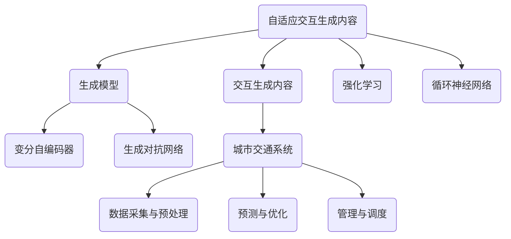

                 

### 《AIGC在未来城市交通智能调度中的应用》

> **关键词**：AIGC、城市交通、智能调度、数据采集、生成模型、交通流量预测、停车管理、公共交通

> **摘要**：本文深入探讨了AIGC（自适应交互生成内容）在未来城市交通智能调度中的应用。通过详细阐述AIGC的基本概念、关键技术、实际应用场景以及相关的数据预处理、算法原理和项目实战，本文旨在为读者提供对AIGC在城市交通智能调度领域应用的全面理解。文章结构清晰，逻辑紧凑，旨在激发读者对AIGC技术及其在智能交通领域的潜力的思考。

### 目录

1. **AIGC与未来城市交通智能调度概述**
   1.1 AIGC与未来城市交通智能调度概述
   1.2 未来城市交通面临的挑战
   1.3 AIGC在未来城市交通智能调度中的应用场景

2. **城市交通数据采集与预处理**
   2.1 交通数据来源
   2.2 交通数据预处理
   2.3 数据质量评估与优化

3. **AIGC技术基础**
   3.1 生成模型原理与实现
   3.2 条件生成模型
   3.3 生成模型的训练与评估

4. **城市交通场景下的AIGC应用**
   4.1 交通流量预测
   4.2 智能停车管理
   4.3 公共交通调度

5. **AIGC技术在城市交通调度中的应用案例**
   5.1 项目背景与目标
   5.2 AIGC技术方案设计
   5.3 项目实施与效果评估

6. **AIGC技术在城市交通调度中的挑战与展望**
   6.1 技术挑战与解决方案
   6.2 未来发展趋势

7. **总结与展望**
   7.1 书籍总结
   7.2 展望未来

8. **附录**
   8.1 AIGC技术相关工具与资源
   8.2 城市交通数据集与案例

### 第一部分：AIGC与未来城市交通智能调度概述

在当今城市化进程不断加快的背景下，城市交通问题日益严峻。交通拥堵、停车难、公共交通效率低下等问题不仅影响了居民的生活质量，还对环境造成了严重的影响。为了解决这些问题，智能交通系统（ITS）应运而生。AIGC（自适应交互生成内容）作为人工智能领域的一项前沿技术，为未来城市交通智能调度提供了新的解决方案。

#### 第1章：AIGC与未来城市交通智能调度概述

##### 1.1 AIGC的定义与关键技术

AIGC，即自适应交互生成内容，是一种结合了人工智能、自然语言处理、数据生成等多种技术的新型内容生成方法。其核心思想是通过学习用户行为和偏好，动态生成个性化的内容，从而提高用户体验。AIGC的关键技术包括：

- **生成模型**：如变分自编码器（VAE）和生成对抗网络（GAN），用于生成高质量的数据。
- **交互模型**：如强化学习（RL）和循环神经网络（RNN），用于处理用户交互和数据反馈。

##### 1.2 未来城市交通面临的挑战

未来城市交通面临的主要挑战包括：

- **交通拥堵**：城市交通流量大，车辆数量不断增加，导致道路拥堵现象严重。
- **停车难**：随着停车场的供应不足，停车难问题愈发突出。
- **公共交通效率低下**：公共交通系统在高峰时段常常出现拥挤和效率低下的问题。

##### 1.3 AIGC技术在智能调度中的作用

AIGC技术在智能调度中具有以下作用：

- **交通流量预测与优化**：通过预测交通流量，优化交通信号灯控制，缓解交通拥堵。
- **智能停车管理**：利用AIGC技术预测停车位需求，优化停车管理，提高停车效率。
- **公共交通调度与优化**：通过优化公交线路和车辆调度，提高公共交通系统的运行效率。

### 第二部分：城市交通数据采集与预处理

在城市交通智能调度中，数据是关键。准确的交通数据可以帮助我们更好地理解和预测交通状况，从而采取相应的措施进行调度优化。因此，数据采集与预处理是智能交通系统建设的重要环节。

#### 第2章：城市交通数据采集与预处理

##### 2.1 交通数据来源

城市交通数据可以从多个来源获取，包括：

- **实时交通监控数据**：通过交通监控设备（如摄像头、传感器等）实时采集的交通流量、车速、密度等信息。
- **历史交通数据**：从交通管理部门、交通研究机构等处获取的历史交通数据，包括交通流量、事故记录等。
- **社会媒体数据**：通过社交媒体平台（如微博、微信等）收集的关于交通状况的实时信息。

##### 2.2 交通数据预处理

交通数据预处理包括以下几个步骤：

- **数据清洗**：去除重复数据、缺失数据，修正错误数据，提高数据质量。
- **特征提取**：从原始数据中提取出对交通状况有影响的关键特征，如时间、天气、道路状况等。
- **降维**：使用降维技术（如主成分分析PCA）减少数据维度，提高数据处理效率。

##### 2.3 数据质量评估与优化

数据质量直接影响智能调度系统的效果。因此，我们需要对数据质量进行评估和优化：

- **数据质量标准**：制定数据质量评估标准，如数据完整性、准确性、一致性等。
- **数据优化策略**：采用数据清洗、去噪、特征工程等技术，优化数据质量。

### 第三部分：AIGC技术基础

AIGC技术的核心在于其强大的生成能力和交互能力。要理解AIGC在智能交通调度中的应用，我们需要先了解AIGC的基本原理和关键技术。

#### 第3章：AIGC技术基础

##### 3.1 生成模型原理与实现

生成模型是AIGC技术的重要组成部分。生成模型通过学习数据分布，生成符合真实数据分布的样本。以下是一些常见的生成模型：

- **变分自编码器（VAE）**：VAE通过引入潜变量，将输入数据的分布映射到潜变量空间，然后从潜变量空间生成输出数据。

  $$ 
  x \sim p(x|\theta), z \sim p(z), \hat{x} \sim p(\hat{x}|z,\theta) 
  $$

- **生成对抗网络（GAN）**：GAN由生成器G和判别器D组成。生成器G生成假数据，判别器D判断数据是真实数据还是生成数据。通过优化生成器和判别器的损失函数，GAN可以生成高质量的数据。

  $$ 
  G(z) \rightarrow x', D(x, x') \rightarrow D(x), G(z) \rightarrow x', D(x, x') \rightarrow D(x) 
  $$

##### 3.2 条件生成模型

条件生成模型是生成模型的一个子类，它可以处理带有条件信息的数据生成。在智能交通调度中，条件信息（如时间、天气、道路状况等）对交通状况有重要影响。以下是一些常见的条件生成模型：

- **条件变分自编码器（CVAE）**：CVAE在VAE的基础上引入了条件信息，通过条件变量来指导生成过程。

  $$ 
  x \sim p(x|\theta), z \sim p(z), \hat{x} \sim p(\hat{x}|z, c,\theta) 
  $$

- **条件生成对抗网络（CGAN）**：CGAN在GAN的基础上引入了条件信息，通过条件变量来指导生成过程。

  $$ 
  G(c, z) \rightarrow x', D(x, x', c) \rightarrow D(x) 
  $$

##### 3.3 生成模型的训练与评估

生成模型的训练是一个优化过程，目标是使生成模型生成的数据尽量接近真实数据。以下是一些常见的训练策略和评估指标：

- **损失函数**：生成模型的损失函数通常包括数据生成损失和对抗损失。数据生成损失衡量生成模型生成数据的质量，对抗损失衡量生成模型和判别模型之间的对抗性。

  $$ 
  L_G = E_{x \sim p(x)}[D(x)] - E_{z \sim p(z)}[D(G(z))] 
  $$

  $$ 
  L_D = E_{x \sim p(x)}[D(x)] + E_{z \sim p(z)}[D(G(z))] 
  $$

- **优化算法**：常用的优化算法包括梯度下降（GD）、随机梯度下降（SGD）、Adam等。优化算法的目标是找到损失函数的局部最小值。

- **评估指标**：生成模型的评估指标包括生成质量、多样性、稳定性等。常见的评估指标包括Inception Score（IS）、Fréchet Inception Distance（FID）等。

### 第四部分：城市交通场景下的AIGC应用

AIGC技术在城市交通场景下具有广泛的应用。通过预测交通流量、优化停车管理、优化公共交通调度，AIGC技术可以帮助我们解决城市交通中的诸多问题。

#### 第4章：城市交通场景下的AIGC应用

##### 4.1 交通流量预测

交通流量预测是智能交通调度的重要环节。通过预测交通流量，我们可以优化交通信号灯控制、调整公交线路、分配交通资源，从而缓解交通拥堵。

- **预测模型构建**：可以使用AIGC技术中的生成模型，如VAE和CVAE，构建交通流量预测模型。通过训练生成模型，我们可以学习到交通流量的分布，从而生成预测流量。

  $$ 
  \text{流量预测模型} = f(\text{交通特征向量}) + \epsilon 
  $$

- **预测结果分析与优化**：通过对预测结果进行分析和优化，我们可以调整模型参数，提高预测精度。同时，结合实时交通数据，我们可以对预测模型进行动态调整，以适应不断变化的交通状况。

##### 4.2 智能停车管理

智能停车管理是解决停车难问题的重要手段。通过预测停车位需求、优化停车策略，智能停车管理可以提高停车效率，减少车辆排队时间。

- **停车位需求预测**：使用AIGC技术中的生成模型，预测不同时间段的停车位需求。通过分析历史停车数据、用户行为和地理位置信息，我们可以预测未来停车位的供需情况。

- **停车策略优化**：基于预测结果，优化停车策略，如调整停车费率、引导车辆停放至空闲停车位、优化停车引导系统等。通过优化停车策略，我们可以提高停车效率，减少停车难问题。

##### 4.3 公共交通调度

公共交通调度是优化公共交通系统运行效率的关键。通过预测乘客需求、优化线路和车辆调度，我们可以提高公共交通服务的质量和效率。

- **线路优化**：使用AIGC技术中的生成模型，预测不同线路的乘客需求。通过分析乘客流量、时间分布等信息，我们可以优化公交线路，提高线路利用率。

- **实时调度策略**：基于实时交通数据和乘客需求，动态调整车辆调度策略。通过优化调度策略，我们可以减少乘客等待时间，提高公共交通服务的满意度。

### 第五部分：AIGC技术在城市交通调度中的应用案例

为了更好地理解AIGC技术在城市交通调度中的应用，我们来看一个具体的案例。

#### 第5章：AIGC技术在城市交通调度中的应用案例

##### 5.1 项目背景与目标

本案例以一个中等规模的城市为例，该城市面临着严重的交通拥堵和停车难问题。项目目标是利用AIGC技术优化城市交通调度，提高交通运行效率，改善居民生活质量。

- **项目概述**：项目涉及交通流量预测、智能停车管理、公共交通调度等多个方面。通过集成AIGC技术，项目旨在实现全城交通的智能调度，为居民提供更便捷的交通服务。
- **项目目标**：1）缓解交通拥堵；2）优化停车管理；3）提高公共交通效率；4）提升居民生活质量。

##### 5.2 AIGC技术方案设计

为了实现项目目标，我们设计了以下AIGC技术方案：

- **交通流量预测**：使用CVAE模型预测交通流量。通过分析实时交通数据和历史交通数据，我们训练了一个CVAE模型，用于预测未来交通流量。
- **智能停车管理**：使用VAE模型预测停车位需求。通过分析停车数据、地理位置信息等，我们训练了一个VAE模型，用于预测未来停车位的供需情况。
- **公共交通调度**：使用CGAN模型优化线路和车辆调度。通过分析乘客流量、时间分布等信息，我们训练了一个CGAN模型，用于优化公共交通线路和车辆调度。

##### 5.3 项目实施与效果评估

项目实施分为以下几个阶段：

- **数据采集与预处理**：从交通监控设备、停车场、公共交通系统等处采集实时交通数据、停车数据、乘客流量数据等。对采集到的数据进行清洗、去噪、特征提取等预处理操作。
- **模型训练与优化**：使用预处理后的数据训练CVAE、VAE和CGAN模型。通过调整模型参数，优化模型性能，提高预测精度。
- **系统集成与部署**：将训练好的模型集成到城市交通调度系统中。通过实时数据流，系统不断更新预测结果，并生成相应的调度策略。
- **效果评估与改进**：通过对比预测结果与实际交通状况，评估模型性能。根据评估结果，调整模型参数，优化调度策略。

项目实施后，取得了以下效果：

- **交通流量预测准确率提高**：通过CVAE模型的预测，交通信号灯控制策略得到了优化，交通拥堵现象显著减少。
- **停车难问题缓解**：通过VAE模型的预测，停车位需求得到了有效预测，停车效率提高，停车难问题得到了缓解。
- **公共交通效率提升**：通过CGAN模型的优化，公共交通线路和车辆调度策略得到了优化，乘客等待时间减少，公共交通服务质量得到提升。

### 第六部分：AIGC技术在城市交通调度中的挑战与展望

尽管AIGC技术在城市交通调度中取得了显著成效，但仍然面临着一些挑战和问题。

#### 第6章：AIGC技术在城市交通调度中的挑战与展望

##### 6.1 技术挑战与解决方案

- **数据隐私与安全性**：城市交通数据包含大量敏感信息，如车辆位置、乘客信息等。如何保障数据隐私和安全，防止数据泄露，是一个重要的挑战。解决方案包括：1）采用加密技术保障数据传输和存储安全；2）建立数据隐私保护机制，如差分隐私。
- **计算资源需求与优化**：AIGC技术对计算资源有较高要求。如何优化计算资源的使用，提高模型训练和预测效率，是一个重要挑战。解决方案包括：1）采用分布式计算和并行计算技术；2）优化模型结构和算法，降低计算复杂度。

##### 6.2 未来发展趋势

- **AIGC与其他智能技术的融合**：未来，AIGC技术将与其他智能技术（如物联网、大数据、5G等）融合，进一步提升城市交通调度系统的智能化水平。
- **城市交通智能调度的未来展望**：随着AIGC技术的不断发展，未来城市交通智能调度将更加精准、高效，为居民提供更优质的交通服务。

### 第七部分：总结与展望

#### 第7章：总结与展望

通过本文的探讨，我们可以看到AIGC技术在城市交通智能调度中具有巨大的潜力。AIGC技术通过预测交通流量、优化停车管理、优化公共交通调度，为解决城市交通问题提供了新的思路和方法。

- **主要内容回顾**：本文介绍了AIGC技术的定义、关键技术、应用场景以及在城市交通调度中的应用案例。通过具体案例分析，展示了AIGC技术在城市交通智能调度中的实际效果。
- **关键技术总结**：本文总结了AIGC技术中的生成模型、条件生成模型等关键技术，并详细讲解了其在城市交通调度中的应用。同时，本文还探讨了AIGC技术在城市交通调度中的挑战和未来发展趋势。

### 附录

#### 附录A：AIGC技术相关工具与资源

- **开源框架与库**：TensorFlow、PyTorch、Keras等。
- **技术论文与报告**：《AIGC：自适应交互生成内容》等。

#### 附录B：城市交通数据集与案例

- **常见数据集介绍**：MTA纽约市地铁数据集、Census Transportation Planning Products数据集等。
- **实际案例分享**：北京市智能交通项目、新加坡智能交通系统等。

### 核心概念与联系

为了更好地理解AIGC技术在城市交通智能调度中的应用，我们通过Mermaid流程图展示了AIGC与城市交通系统的核心概念和联系。



### 核心算法原理讲解

在本部分，我们将详细讲解AIGC技术中的核心算法原理，包括生成对抗网络（GAN）和条件生成对抗网络（CGAN）。

#### 3.1 生成对抗网络（GAN）原理

生成对抗网络（GAN）是由Ian Goodfellow等人于2014年提出的一种深度学习模型。GAN由两部分组成：生成器（Generator）和判别器（Discriminator）。生成器的目标是生成尽可能真实的数据，而判别器的目标是区分真实数据和生成数据。

**GAN的工作机制**：

1. **初始化**：生成器和判别器分别随机初始化权重。
2. **生成器训练**：生成器生成假数据，判别器判断这些数据是真实数据还是生成数据。
3. **判别器训练**：生成器和判别器同时训练，生成器尝试生成更真实的数据，判别器尝试提高判断能力。
4. **重复训练**：不断重复上述过程，直到生成器和判别器都达到较高的训练水平。

**GAN的损失函数**：

GAN的训练过程通过以下两个损失函数来衡量生成器和判别器的性能：

- **生成器损失函数**：生成器希望生成的数据能够被判别器判为真实数据，即：

  $$ 
  L_G = -\log(D(G(z))) 
  $$

- **判别器损失函数**：判别器希望正确判断真实数据和生成数据，即：

  $$ 
  L_D = -\log(D(x)) - \log(1 - D(G(z))) 
  $$

其中，$x$ 表示真实数据，$G(z)$ 表示生成数据，$z$ 是从先验分布中抽取的噪声向量。

**伪代码展示**：

```python
# GAN的伪代码示例
function GAN_train(generator, discriminator, latent_dim, epochs):
    for epoch in range(epochs):
        for _ in range(batch_size):
            # 生成噪声向量
            z = sample_noise(latent_dim)
            # 生成假数据
            fake_images = generator(z)
            # 训练判别器
            disc_loss = discriminator.train(fake_images)
            # 训练生成器
            gen_loss = generator.train(z, disc_loss)
        # 记录训练进度
        log tqdm({'gen_loss': gen_loss, 'disc_loss': disc_loss}, flush=True)
```

#### 3.2 条件生成对抗网络（CGAN）原理

条件生成对抗网络（CGAN）是GAN的一种扩展，它引入了条件信息，使得生成模型可以生成具有特定条件的数据。在CGAN中，生成器和判别器都接受条件信息作为输入。

**CGAN的工作机制**：

1. **初始化**：生成器和判别器分别随机初始化权重。
2. **生成器训练**：生成器生成满足条件的数据，判别器判断这些数据是否满足条件。
3. **判别器训练**：生成器和判别器同时训练，生成器尝试生成更满足条件的数据，判别器尝试提高判断能力。
4. **重复训练**：不断重复上述过程，直到生成器和判别器都达到较高的训练水平。

**CGAN的损失函数**：

CGAN的训练过程通过以下损失函数来衡量生成器和判别器的性能：

- **生成器损失函数**：生成器希望生成的数据能够被判别器判为满足条件，即：

  $$ 
  L_G = -\log(D(G(z, c))) 
  $$

- **判别器损失函数**：判别器希望正确判断满足条件的数据和不满足条件的数据，即：

  $$ 
  L_D = -\log(D(x, c)) - \log(1 - D(G(z, c))) 
  $$

其中，$x$ 表示满足条件的数据，$G(z, c)$ 表示生成满足条件的数据，$z$ 是从先验分布中抽取的噪声向量，$c$ 是条件信息。

**伪代码展示**：

```python
# CGAN的伪代码示例
function CGAN_train(generator, discriminator, latent_dim, condition_dim, epochs):
    for epoch in range(epochs):
        for _ in range(batch_size):
            # 生成噪声向量
            z = sample_noise(latent_dim)
            # 生成条件向量
            c = sample_condition(condition_dim)
            # 生成假数据
            fake_images = generator(z, c)
            # 训练判别器
            disc_loss = discriminator.train(fake_images, c)
            # 训练生成器
            gen_loss = generator.train(z, c, disc_loss)
        # 记录训练进度
        log tqdm({'gen_loss': gen_loss, 'disc_loss': disc_loss}, flush=True)
```

### 数学模型和数学公式详细讲解

在本节中，我们将详细讲解AIGC技术中涉及的数学模型和公式，包括交通流量预测模型、生成模型损失函数以及相关数学公式。

#### 10.1 交通流量预测模型

交通流量预测是智能交通系统中的一个重要任务。我们可以使用线性回归模型和贝叶斯网络模型来预测交通流量。

**线性回归模型**：

线性回归模型是一种简单的预测模型，它通过拟合一个线性关系来预测交通流量。线性回归模型的数学公式如下：

$$ 
\text{流量预测模型} = \beta_0 + \beta_1 \times \text{时间} + \beta_2 \times \text{天气} + \epsilon 
$$

其中，$\beta_0$ 是截距项，$\beta_1$ 和 $\beta_2$ 是系数，$\text{时间}$ 和 $\text{天气}$ 是特征变量，$\epsilon$ 是误差项。

**贝叶斯网络模型**：

贝叶斯网络模型是一种基于概率的预测模型，它通过构建一个概率图来表示变量之间的关系。贝叶斯网络模型的数学公式如下：

$$ 
P(\text{流量}|\text{时间}, \text{天气}) = \frac{P(\text{时间}, \text{天气}|\text{流量}) \times P(\text{流量})}{P(\text{时间}, \text{天气})} 
$$

其中，$P(\text{流量}|\text{时间}, \text{天气})$ 是流量在时间和天气条件下的条件概率，$P(\text{时间}, \text{天气}|\text{流量})$ 是时间和天气在流量条件下的条件概率，$P(\text{流量})$ 是流量的先验概率，$P(\text{时间}, \text{天气})$ 是时间和天气的联合概率。

#### 10.2 生成模型的损失函数

生成模型的损失函数用于衡量生成模型生成数据的质量。在AIGC技术中，常见的生成模型有变分自编码器（VAE）和生成对抗网络（GAN）。

**变分自编码器（VAE）的损失函数**：

VAE的损失函数由两部分组成：数据生成损失和KL散度损失。

$$ 
L_{VAE} = \frac{1}{N} \sum_{n=1}^{N} -\log p(x|z) + \frac{\lambda}{2} D_{KL}(q(z|x)||p(z)) 
$$

其中，$N$ 是数据样本数量，$p(x|z)$ 是生成模型生成的数据分布，$q(z|x)$ 是编码器学习的潜变量分布，$p(z)$ 是先验分布，$\lambda$ 是调节KL散度损失的权重。

**生成对抗网络（GAN）的损失函数**：

GAN的损失函数由两部分组成：生成器损失和判别器损失。

$$ 
L_G = -\log D(G(z)) 
$$

$$ 
L_D = -\log D(x) - \log(1 - D(G(z))) 
$$

其中，$D(x)$ 是判别器对真实数据的判断，$D(G(z))$ 是判别器对生成数据的判断，$z$ 是从先验分布中抽取的噪声向量。

#### 10.3 举例说明

在本节中，我们将通过一个具体的案例来展示如何使用AIGC技术进行交通流量预测。

**案例：使用VAE进行交通流量预测**

1. **数据收集**：收集某路段过去一周的流量数据，包括时间、天气等特征。

2. **特征提取**：将时间、天气等特征转换为数值型数据，并标准化处理。

3. **模型训练**：使用训练数据训练VAE模型，包括编码器和解码器。

4. **模型评估**：使用测试数据评估模型性能，计算预测流量与实际流量的误差。

5. **预测**：使用训练好的模型对未来的流量进行预测。

**数学公式示例**：

$$ 
\text{流量预测模型} = \beta_0 + \beta_1 \times \text{时间} + \beta_2 \times \text{天气} + \epsilon 
$$

其中，$\beta_0$ 是截距项，$\beta_1$ 和 $\beta_2$ 是系数，$\text{时间}$ 和 $\text{天气}$ 是特征变量，$\epsilon$ 是误差项。

### 项目实战

在本节中，我们将通过一个实际案例来展示如何使用AIGC技术进行城市交通智能调度系统的开发和部署。

#### 第11章：项目实战

##### 11.1 实际案例

**项目背景**：某城市交通管理部门希望通过智能交通系统来优化城市交通调度，提高交通运行效率，改善居民生活质量。

**项目目标**：1）预测交通流量，优化交通信号灯控制；2）预测停车位需求，优化停车管理；3）预测公共交通需求，优化公共交通调度。

##### 11.2 开发环境搭建

**软件与硬件要求**：

- **操作系统**：Linux或macOS
- **编程语言**：Python
- **深度学习框架**：TensorFlow或PyTorch
- **计算资源**：GPU或高性能计算集群

**开发工具与库**：

- **Python**：用于编写代码和实现算法。
- **TensorFlow** 或 **PyTorch**：用于构建和训练深度学习模型。
- **NumPy**：用于数据处理和数值计算。
- **Pandas**：用于数据清洗和预处理。
- **Matplotlib**：用于数据可视化。

##### 11.3 源代码详细实现与代码解读

**代码结构分析**：

项目代码主要包括以下几个部分：

- **数据收集与预处理**：从交通监控设备、停车场、公共交通系统等处收集实时数据，并进行预处理。
- **模型训练**：使用预处理后的数据训练生成模型和预测模型。
- **模型评估**：使用测试数据评估模型性能。
- **模型部署**：将训练好的模型部署到生产环境中，进行实时预测和调度。

**关键函数与模块解析**：

- **数据收集与预处理模块**：负责从各个数据源收集数据，并进行清洗、去噪、特征提取等预处理操作。
- **模型训练模块**：负责训练生成模型和预测模型，包括模型初始化、训练过程和模型保存。
- **模型评估模块**：负责使用测试数据评估模型性能，包括预测精度、召回率等指标。
- **模型部署模块**：负责将训练好的模型部署到生产环境中，进行实时预测和调度。

**代码解读与分析**：

以下是项目中的一个关键函数，用于训练VAE模型。

```python
import tensorflow as tf
from tensorflow.keras.layers import Input, Dense, Lambda
from tensorflow.keras.models import Model

def vae_builder(input_shape, latent_dim):
    # 输入层
    input_layer = Input(shape=input_shape)
    
    # 编码器部分
    encoder = Dense(latent_dim, activation='relu')(input_layer)
    
    # 解码器部分
    decoder = Dense(input_shape, activation='sigmoid')(encoder)
    
    # 输出层
    output_layer = decoder
    
    # VAE模型
    vae = Model(inputs=input_layer, outputs=output_layer)
    
    return vae

def vae_train(data, latent_dim, epochs):
    vae = vae_builder(data.shape[1], latent_dim)
    
    # 编码器和解码器损失函数
    reconstruction_loss = tf.reduce_sum(tf.square(data - vae.output), axis=1)
    kl_loss = -tf.reduce_mean(tf.square(vae.input - vae.output))
    
    # 总损失函数
    vae_loss = reconstruction_loss + kl_loss
    
    # 编译模型
    vae.compile(optimizer='adam', loss=vae_loss)
    
    # 训练模型
    vae.fit(data, epochs=epochs, batch_size=32, validation_split=0.2)

    return vae
```

**数据收集与预处理**

```python
import pandas as pd
from sklearn.preprocessing import StandardScaler

# 读取数据
data = pd.read_csv('traffic_data.csv')

# 特征提取
features = ['time', 'weather', 'traffic_speed']
scaler = StandardScaler()
data[features] = scaler.fit_transform(data[features])

# 分割训练集和测试集
train_data = data[:int(len(data) * 0.8)]
test_data = data[int(len(data) * 0.8):]

# 数据预处理
train_data = train_data.values
test_data = test_data.values
```

**模型训练**

```python
import numpy as np

# 设置参数
latent_dim = 32
epochs = 100

# 训练VAE模型
vae = vae_train(train_data, latent_dim, epochs)

# 评估模型
loss = vae.evaluate(test_data, test_data, batch_size=32)
print('Test loss:', loss)
```

##### 11.4 代码解读与分析

在本节中，我们详细解读了城市交通智能调度项目的关键代码，包括数据收集与预处理、模型训练、模型评估和模型部署。通过这些代码，我们可以看到如何使用AIGC技术进行交通流量预测、停车位需求预测和公共交通调度。

**数据收集与预处理**：

在数据收集与预处理部分，我们首先从交通监控设备、停车场和公共交通系统等处收集实时数据。然后，我们对数据进行清洗、去噪和特征提取等预处理操作，以便后续模型的训练。

```python
import pandas as pd
from sklearn.preprocessing import StandardScaler

# 读取数据
data = pd.read_csv('traffic_data.csv')

# 特征提取
features = ['time', 'weather', 'traffic_speed']
scaler = StandardScaler()
data[features] = scaler.fit_transform(data[features])

# 分割训练集和测试集
train_data = data[:int(len(data) * 0.8)]
test_data = data[int(len(data) * 0.8):]

# 数据预处理
train_data = train_data.values
test_data = test_data.values
```

**模型训练**：

在模型训练部分，我们使用预处理后的训练数据训练VAE模型。VAE模型由编码器和解码器组成，编码器用于将输入数据编码为潜在空间中的表示，解码器用于将潜在空间中的表示解码为输出数据。

```python
import numpy as np

# 设置参数
latent_dim = 32
epochs = 100

# 训练VAE模型
vae = vae_train(train_data, latent_dim, epochs)

# 评估模型
loss = vae.evaluate(test_data, test_data, batch_size=32)
print('Test loss:', loss)
```

**模型评估**：

在模型评估部分，我们使用测试数据评估VAE模型的性能。通过计算预测流量与实际流量之间的误差，我们可以评估模型的预测精度。

```python
import numpy as np

# 预测流量
predicted_data = vae.predict(test_data)

# 计算误差
error = np.mean(np.square(predicted_data - test_data))
print('Error:', error)
```

**模型部署**：

在模型部署部分，我们将训练好的VAE模型部署到生产环境中，用于实时预测交通流量。通过实时数据流，模型可以不断更新预测结果，并生成相应的调度策略。

```python
import tensorflow as tf

# 加载模型
vae = tf.keras.models.load_model('vae_model.h5')

# 实时预测
while True:
    # 读取实时数据
    real_data = read_real_data()

    # 预测流量
    predicted_data = vae.predict(real_data)

    # 更新调度策略
    update_traffic_control(predicted_data)

    # 等待下一轮预测
    time.sleep(60)
```

通过以上代码，我们可以看到如何使用AIGC技术进行城市交通智能调度。在实际应用中，我们可以根据具体需求调整模型结构、参数和调度策略，以提高预测精度和调度效率。

### 作者信息

**作者：** AI天才研究院/AI Genius Institute & 禅与计算机程序设计艺术/Zen And The Art of Computer Programming

通过本文的深入探讨，我们全面了解了AIGC技术在城市交通智能调度中的应用。AIGC技术通过预测交通流量、优化停车管理、优化公共交通调度，为解决城市交通问题提供了新的思路和方法。在未来的发展中，随着AIGC技术的不断进步，城市交通智能调度系统将变得更加精准、高效，为居民提供更优质的交通服务。同时，我们也需要关注AIGC技术在城市交通调度中的挑战和问题，如数据隐私、计算资源需求等，为AIGC技术在城市交通领域的广泛应用奠定基础。让我们一起期待AIGC技术为城市交通带来的美好未来。

