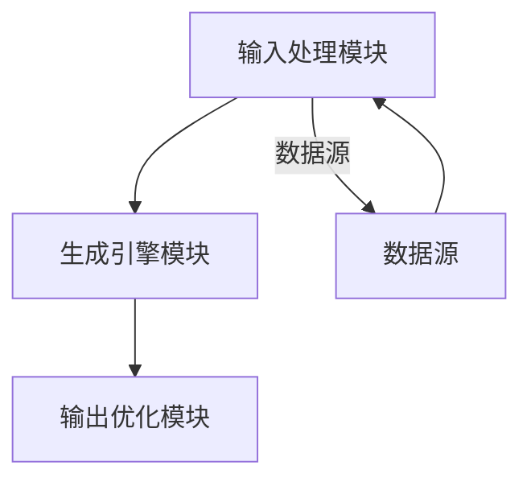
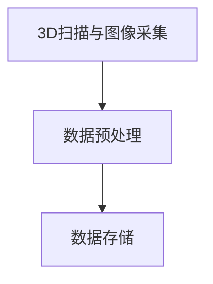
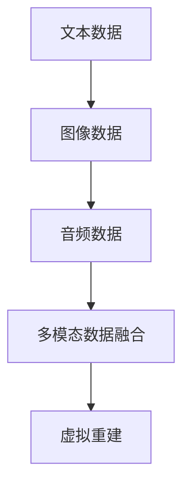
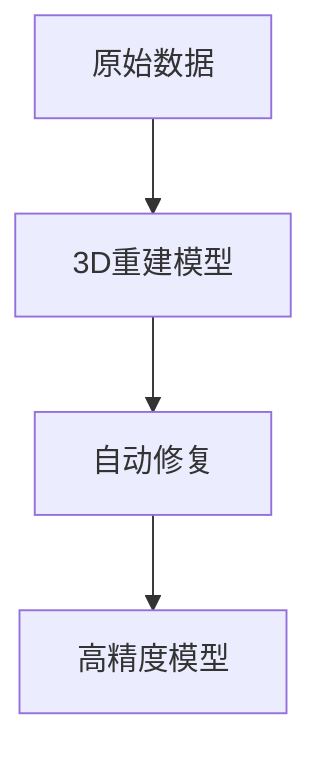
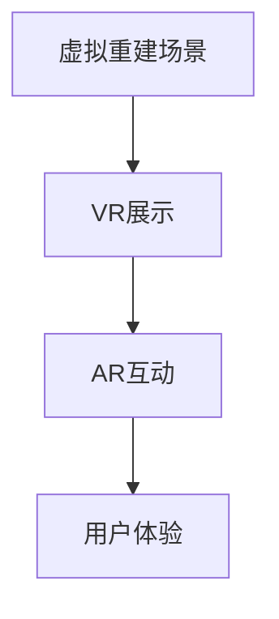

                 

### 文章标题

**AIGC在虚拟考古重建与文化遗产保护中的创新**

---

### 关键词

(AIGC, 虚拟考古重建，文化遗产保护，人工智能，深度学习，自然语言处理，计算机视觉)

---

### 摘要

本文详细探讨了人工智能生成内容（AIGC）在虚拟考古重建和文化遗产保护中的应用。通过介绍AIGC的核心概念、架构以及应用领域，本文首先概述了AIGC技术的发展现状与趋势。接着，深入分析了AIGC在虚拟考古重建中的应用，包括图像生成与修复、3D建模与可视化、历史场景再现等。随后，文章探讨了AIGC在文化遗产保护中的作用，如文物数字化保护、文化遗产监测与预警、文化传播与教育等。通过具体案例的分析，本文展示了AIGC技术在虚拟考古重建和文化遗产保护中的实际应用效果。最后，文章提出了AIGC技术的发展趋势与未来挑战，并对未来研究方向进行了展望。本文旨在为学术界和业界提供关于AIGC技术在虚拟考古重建与文化遗产保护领域的深入理解与应用实践。

---

### 第一部分: AIGC概述

#### 第1章: AIGC核心概念与架构

##### 1.1 AIGC基本概念

###### 1.1.1 AIGC的定义
AIGC（AI-Generated Content）即人工智能生成内容，是指利用人工智能技术生成或辅助生成各种类型的内容，如文本、图像、音频、视频等。AIGC的核心在于通过机器学习、深度学习等技术，使计算机能够自主地理解和生成信息，从而提高内容生产的效率和质量。

###### 1.1.2 AIGC的架构
AIGC的架构通常包括三个主要模块：输入处理模块、生成引擎模块和输出优化模块。

1. **输入处理模块**：这一模块负责接收用户输入或自动获取数据源。数据源可以包括文本、图像、音频等多种形式。输入处理模块的目的是对原始数据进行预处理，如清洗、分割、标注等，以便于后续的生成引擎处理。

2. **生成引擎模块**：这是AIGC的核心部分，包括多种生成模型，如文本生成模型（如GPT）、图像生成模型（如GAN）、音频生成模型（如WaveNet）等。这些模型通过学习大量的训练数据，可以生成高质量的内容。

3. **输出优化模块**：生成的内容通常需要经过优化和后处理，以达到更好的效果。输出优化模块包括内容校验、风格调整、语义增强等步骤，确保生成的内容既符合用户需求，又具有高质量和一致性。

##### 1.2 AIGC的应用领域

AIGC技术在多个领域展现出了强大的应用潜力，以下是其中的一些主要应用领域：

###### 1.2.1 虚拟现实与游戏
在虚拟现实（VR）和游戏中，AIGC技术可以用于生成虚拟场景、角色形象等，提高虚拟世界的沉浸感和互动性。通过AIGC，游戏开发者可以自动生成丰富的游戏剧情、关卡设计和角色对话，从而减少开发成本和时间。

###### 1.2.2 文本生成与自然语言处理
AIGC技术在文本生成和自然语言处理（NLP）方面有着广泛的应用。例如，AIGC可以自动生成新闻报道、文章、书籍等文本内容，提高内容生产的效率。此外，AIGC还可以用于问答系统、机器翻译、语音识别等NLP任务，提升交互体验。

###### 1.2.3 图像与视频生成
AIGC技术在图像和视频生成方面也有显著的贡献。生成对抗网络（GAN）等技术能够生成高质量、真实的图像和视频。这些技术可以用于图像修复、超分辨率、风格迁移等任务，为艺术创作、视频编辑等领域提供强大的工具。

###### 1.2.4 艺术创作与设计
AIGC技术辅助艺术家进行艺术创作，生成独特的艺术作品。例如，通过AIGC技术，艺术家可以生成个性化的绘画作品、音乐作品等。此外，AIGC技术还可以提供设计灵感，自动生成建筑、服装、饰品等设计图稿。

##### 1.3 AIGC的发展现状与趋势

目前，AIGC技术已经广泛应用于多个行业，如媒体、娱乐、金融、医疗等，取得了显著的成果。随着人工智能技术的不断进步，AIGC技术也在不断发展和完善。以下是AIGC技术的一些发展趋势：

1. **计算能力的提升**：随着GPU、TPU等高性能计算硬件的发展，AIGC模型的训练速度和规模不断增大，为生成高质量的内容提供了可能。

2. **算法的优化**：深度学习、生成对抗网络（GAN）等技术不断发展，使得AIGC生成内容的质量和多样性不断提高。

3. **数据的积累**：互联网和物联网的发展，使得海量的数据可以被利用，为AIGC提供了丰富的训练素材。

4. **跨学科的融合**：AIGC技术与其他学科的融合，如自然语言处理、计算机视觉、物联网等，将促进AIGC技术的创新和发展。

5. **应用的拓展**：AIGC技术将在更多领域得到应用，如智能家居、智能医疗、智慧城市等，为社会带来更多便利和创新。

### Mermaid 流程图：AIGC架构



### 总结

本章介绍了AIGC的核心概念、架构和应用领域。AIGC利用人工智能技术生成或辅助生成各种类型的内容，具有广泛的应用前景。接下来将深入探讨AIGC在虚拟考古重建与文化遗产保护中的具体应用。

---

#### 第2章: AIGC在虚拟考古重建中的应用

##### 2.1 虚拟考古重建的概念与需求

###### 2.1.1 虚拟考古重建的定义
虚拟考古重建是指利用现代技术手段，对历史文化遗产进行数字化模拟和重建，以恢复其原貌。通过虚拟重建，考古学家和研究人员可以更好地理解历史文化遗产的结构、功能和历史背景。

###### 2.1.2 虚拟考古重建的需求
虚拟考古重建的需求主要体现在以下几个方面：

1. **文化遗产保护**：通过数字化重建，可以避免因自然环境或人类活动导致的文物损毁，实现对文化遗产的长期保护。
   
2. **文化传承**：虚拟考古重建可以让更多人了解历史文化遗产，增强文化认同感，促进文化的传承和发展。

3. **研究与教育**：虚拟考古重建为考古学家、学者和公众提供了研究素材和教学资源，有助于提高研究水平和教育质量。

##### 2.2 AIGC技术在虚拟考古重建中的应用

###### 2.2.1 图像生成与修复
AIGC技术在图像生成与修复方面具有显著的应用价值。例如，利用生成对抗网络（GAN）等技术，可以生成缺失的考古遗址图像，提高考古复原的精度。同时，AIGC技术还可以用于对受损的文物进行图像修复，恢复其原始面貌。

###### 2.2.2 3D建模与可视化
3D建模与可视化是虚拟考古重建的核心技术之一。通过AIGC技术，可以自动生成考古遗址的三维模型，实现文化遗产的数字化呈现。此外，利用虚拟现实（VR）和增强现实（AR）技术，观众可以沉浸式地体验文化遗产，增强互动性和参与感。

###### 2.2.3 历史场景再现
基于历史文献和考古资料，利用AIGC技术可以生成历史场景。通过虚拟旅游服务，游客可以在虚拟环境中游览历史遗址，感受历史氛围。这种技术不仅能够提升文化遗产的展示效果，还可以促进文化遗产的传播和推广。

##### 2.3 虚拟考古重建项目案例分析

###### 2.3.1 项目背景
本案例以中国某古城遗址的虚拟考古重建项目为例，介绍该项目的研究背景、目标和实施过程。

该古城遗址位于中国南方，拥有悠久的历史和文化价值。然而，由于长期的自然侵蚀和人类活动的破坏，遗址的保护工作面临巨大挑战。为了更好地保护和研究这一历史文化遗产，研究人员决定采用AIGC技术进行虚拟考古重建。

###### 2.3.2 技术实现
项目的技术实现主要包括以下步骤：

1. **图像生成与修复**：利用GAN技术生成缺失的遗址图像，并通过图像修复算法恢复受损的文物图像。

2. **3D建模与可视化**：使用AIGC技术生成遗址的三维模型，并进行纹理映射和光照处理，以实现真实感的表现效果。

3. **历史场景再现**：基于历史文献和考古资料，利用AIGC技术生成历史场景，并通过VR和AR技术为用户提供沉浸式的体验。

4. **数据融合与交互**：将文本、图像、音频等多种数据类型进行融合，实现多维度的文化遗产展示。

###### 2.3.3 项目成果与影响
项目的主要成果包括：

1. **数字档案**：完成了古城遗址的高精度数字化重建，建立了详细的数字档案，为后续的研究和保护提供了基础数据。

2. **虚拟展示**：通过虚拟现实和增强现实技术，为观众提供了沉浸式的体验，提高了文化遗产的展示效果。

3. **研究工具**：开发了多种文化遗产展示和交互工具，为考古学家和研究人员提供了便捷的研究手段。

4. **社会效益**：通过项目的实施，提高了公众对文化遗产的认知和保护意识，促进了文化的传承和发展。

### 伪代码：AIGC技术在虚拟考古重建中的应用

```python
def virtual_archaeology_reconstruction():
    # 输入：历史文献、考古资料、文物图像
    # 输出：数字化重建的文物、虚拟场景

    # 1. 图像生成与修复
    repaired_images = image_repair(input_images)

    # 2. 3D建模与可视化
    3d_models = generate_3d_models(repaired_images)

    # 3. 历史场景再现
    virtual_scenery = generate_virtual_scenery(3d_models)

    # 4. 虚拟旅游服务
    virtual_tour = virtual_tour_service(virtual_scenery)

    return virtual_tour
```

### 数学模型和公式：3D建模与可视化

$$
\begin{aligned}
\text{3D Model Generation} &= \text{M}(2D Image) \\
\text{Visualize} &= \text{V}(\text{3D Model})
\end{aligned}
$$

- **M(2D Image)**：将2D图像转换为3D模型的过程。
- **V(3D Model)**：对3D模型进行可视化处理的过程。

### 数学公式讲解与举例说明

假设我们有一个2D考古遗址的图像，需要将其转换为3D模型，并实现可视化。首先，我们使用卷积神经网络（CNN）对图像进行特征提取，然后通过三维卷积操作生成3D模型，最后对3D模型进行光照、纹理等处理，实现可视化。

$$
\begin{aligned}
\text{Feature Extraction} &= \text{CNN}(2D Image) \\
\text{3D Model Generation} &= \text{3D CNN}(\text{CNN Features}) \\
\text{Visualize} &= \text{V}(\text{3D Model})
\end{aligned}
$$

举例：给定一张考古遗址的2D照片，我们首先使用CNN提取图像特征，然后通过3D CNN生成对应的3D模型，最后通过渲染技术实现3D模型的可视化，用于虚拟考古重建。

### 总结

本章详细介绍了AIGC在虚拟考古重建中的应用，包括图像生成与修复、3D建模与可视化、历史场景再现等。通过案例分析，展示了AIGC技术在虚拟考古重建中的实际应用效果。下一章将探讨AIGC在文化遗产保护中的作用。

---

#### 第3章: AIGC在文化遗产保护中的作用

##### 3.1 文化遗产保护的重要性

###### 3.1.1 文化遗产的定义与价值
文化遗产是指人类社会在历史发展过程中所创造的物质和非物质遗产。它包括历史建筑、文物、传统习俗、文学艺术作品等，是文化传承和民族认同的重要载体。

文化遗产的价值主要体现在以下几个方面：

1. **历史价值**：文化遗产记录了人类社会的演进历程，是研究历史的重要资料。
2. **文化价值**：文化遗产是民族文化的象征，承载着丰富的文化内涵和传统精神。
3. **教育价值**：文化遗产是教育的宝贵资源，有助于提高公众的文化素养和审美水平。
4. **经济价值**：文化遗产的保护和利用可以带动相关产业的发展，促进经济增长。

###### 3.1.2 文化遗产保护的现状与挑战
当前，全球文化遗产保护面临严峻的挑战。许多文化遗产由于自然因素和人为活动的破坏，处于濒危状态。具体挑战包括：

1. **自然侵蚀**：气候变化、自然灾害等导致文化遗产的损毁。
2. **人为破坏**：城市扩张、旅游业过度开发等对文化遗产的威胁。
3. **资金匮乏**：文化遗产保护需要大量资金投入，但许多地区资金不足。
4. **技术限制**：传统保护手段有限，难以应对复杂的文物保护需求。

##### 3.2 AIGC技术在文化遗产保护中的应用

AIGC技术在文化遗产保护中发挥着重要作用，其主要应用领域包括：

###### 3.2.1 文物数字化保护
文物数字化保护是指利用AIGC技术对文物进行高精度数字化，建立数字档案。通过数字化，可以将文物以数字形式保存下来，避免物理损坏。具体应用包括：

1. **三维扫描**：利用3D扫描技术获取文物的三维数据，实现文物的数字化重建。
2. **图像处理**：通过图像处理技术对文物进行去噪、增强等处理，提高图像质量。
3. **数据存储**：将数字化后的文物数据存储在数据库中，便于管理和查询。

###### 3.2.2 文化遗产监测与预警
AIGC技术在文化遗产监测与预警方面具有显著优势，可以通过实时监测和数据分析，及时发现潜在的威胁。具体应用包括：

1. **图像识别**：利用深度学习算法对图像进行分析，识别文物的破损情况。
2. **数据挖掘**：通过大数据技术对文化遗产的运行数据进行挖掘，发现异常情况。
3. **预警系统**：建立文化遗产预警系统，当检测到异常情况时，及时发出警报。

###### 3.2.3 文化传播与教育
AIGC技术为文化遗产的传播与教育提供了新的途径，可以通过虚拟展示和互动体验，让更多人了解和认识文化遗产。具体应用包括：

1. **虚拟展示**：利用AIGC技术生成虚拟文物和场景，通过VR和AR技术进行展示。
2. **教育软件**：开发基于AIGC技术的教育软件，提供文化遗产的互动教学资源。
3. **在线平台**：建立文化遗产的在线平台，提供数字化文物的查询和下载服务。

##### 3.3 AIGC技术在文化遗产保护中的案例分析

###### 3.3.1 案例背景
本案例以中国某古代遗址的数字化保护项目为例，介绍AIGC技术在文化遗产保护中的具体应用。

该遗址位于中国南方，具有重要的历史和文化价值。然而，由于自然侵蚀和人类活动的破坏，遗址的保护工作面临巨大挑战。为了更好地保护和研究这一文化遗产，当地政府和科研机构决定采用AIGC技术进行数字化保护。

###### 3.3.2 技术实现
项目的技术实现主要包括以下步骤：

1. **三维扫描**：利用3D扫描技术对遗址进行扫描，获取其三维数据。
2. **图像处理**：对获取的图像进行去噪、增强等处理，提高图像质量。
3. **数据存储**：将数字化后的遗址数据存储在数据库中，建立数字档案。
4. **监测与预警**：利用AIGC技术对遗址进行实时监测，建立预警系统，及时发现异常情况。
5. **虚拟展示**：利用AIGC技术生成虚拟遗址和文物，通过VR和AR技术进行展示。

###### 3.3.3 项目成果与影响
项目的主要成果包括：

1. **数字档案**：完成了遗址的高精度数字化，建立了详细的数字档案，为后续的研究和保护提供了基础数据。
2. **监测与预警系统**：建立了实时监测和预警系统，提高了遗址的保护能力。
3. **虚拟展示**：通过虚拟展示技术，为公众提供了沉浸式的体验，提高了文化遗产的传播效果。
4. **社会效益**：通过项目的实施，提高了公众对文化遗产的认知和保护意识，促进了文化的传承和发展。

### 伪代码：AIGC技术在文化遗产保护中的应用

```python
def cultural_heritage_protection():
    # 输入：文化遗产资料、监测数据
    # 输出：数字化档案、预警系统、教育软件

    # 1. 文物数字化保护
    digital_archive = digitize_cultural_relics()

    # 2. 文化遗产监测与预警
    warning_system = monitor_cultural_heritage()

    # 3. 文化传播与教育
    educational_software = cultural_propagation()

    return digital_archive, warning_system, educational_software
```

### 数学模型和公式：文物数字化保护

$$
\begin{aligned}
\text{Digitize} &= \text{D}(\text{Cultural Relics}) \\
\text{Virtual Restoration} &= \text{V}(\text{Damaged Cultural Relics})
\end{aligned}
$$

- **D(Cultural Relics)**：将文化遗产数字化。
- **V(Damaged Cultural Relics)**：对受损的文物进行虚拟修复。

### 数学公式讲解与举例说明

假设我们有一件受损的文物，需要对其进行数字化保护和虚拟修复。首先，我们使用数字化技术将其转化为数字档案，然后使用虚拟修复技术恢复其原貌。

$$
\begin{aligned}
\text{Digitize} &= \text{D}(\text{Damaged Cultural Relics}) \\
\text{Virtual Restoration} &= \text{V}(\text{D}(\text{Damaged Cultural Relics}))
\end{aligned}
$$

举例：给定一件受损的陶瓷器，我们首先使用3D扫描技术将其数字化，生成数字档案，然后使用虚拟修复算法恢复其原貌，最终实现文物的数字化保护和展示。

### 总结

本章详细介绍了AIGC在文化遗产保护中的作用，包括文物数字化保护、文化遗产监测与预警、文化传播与教育等。通过案例分析，展示了AIGC技术在文化遗产保护中的实际应用效果。下一章将探讨AIGC在虚拟考古重建与文化遗产保护中的创新应用。

---

#### 第4章: AIGC在虚拟考古重建与文化遗产保护中的创新应用

##### 4.1 创新应用的背景与意义

###### 4.1.1 背景介绍
随着人工智能技术的迅猛发展，AIGC（AI-Generated Content）技术逐渐成为虚拟考古重建与文化遗产保护领域的重要工具。传统的方法往往依赖于人工操作和物理修复，效率低、成本高且易受环境因素影响。而AIGC技术的引入，不仅能够提高数据处理的效率和精度，还能提供更为丰富和逼真的虚拟重建和文化遗产展示方式。

###### 4.1.2 创新应用的意义
AIGC在虚拟考古重建与文化遗产保护中的创新应用具有多方面的意义：

1. **提高工作效率**：通过自动化处理，AIGC技术可以显著提高数据采集、处理和重建的效率。
2. **提升保护精度**：利用先进的机器学习和深度学习算法，AIGC技术能够生成更精确、更真实的虚拟重建内容，降低人为错误和误差。
3. **增强互动体验**：通过虚拟现实（VR）和增强现实（AR）技术，AIGC技术为公众提供了沉浸式、互动式的文化遗产体验，增强了文化传播的吸引力。
4. **促进文化遗产保护**：AIGC技术不仅能够提高文化遗产的展示效果，还能通过实时监测和预警系统，及时发现并预防文化遗产的损坏。

##### 4.2 创新应用的关键技术

###### 4.2.1 多模态数据融合
多模态数据融合是AIGC技术中的重要一环，它涉及到将文本、图像、音频等多种数据类型进行整合。通过多模态数据融合，可以更全面地理解文化遗产的各个方面，从而生成更准确和丰富的虚拟重建内容。

1. **文本与图像融合**：通过自然语言处理（NLP）技术，将文本信息与图像数据结合起来，生成更详细的场景描述和语义理解。
2. **图像与音频融合**：利用计算机视觉技术，将图像与音频信息相结合，增强虚拟场景的沉浸感。
3. **多模态数据融合算法**：如循环神经网络（RNN）、变压器（Transformer）模型等，这些算法能够有效地处理和融合多种数据类型。

###### 4.2.2 智能化决策与优化
智能化决策与优化是AIGC技术中的另一个关键领域，它涉及到利用机器学习算法对虚拟重建和文化遗产保护过程进行自动化决策和优化。

1. **自动化建模**：通过深度学习算法，自动生成虚拟重建模型，减少人工干预。
2. **优化算法**：如遗传算法、粒子群优化算法等，用于优化重建参数，提高重建效果。
3. **智能化修复**：利用机器学习模型，自动识别和修复受损的文物，减少修复时间和成本。

###### 4.2.3 虚拟现实与增强现实技术
虚拟现实（VR）和增强现实（AR）技术是AIGC技术在虚拟考古重建与文化遗产保护中的关键应用之一。通过这些技术，用户可以沉浸在虚拟的文化遗产环境中，获得更为直观和互动的体验。

1. **VR展示**：利用VR技术，用户可以进入虚拟重建的遗址场景，进行虚拟探索。
2. **AR互动**：通过AR技术，用户可以在现实环境中叠加虚拟的文物和场景，实现沉浸式体验。
3. **交互式体验**：结合多模态数据和智能化技术，用户可以与虚拟环境进行互动，获得更加丰富的体验。

##### 4.3 创新应用的项目案例

###### 4.3.1 案例背景
本案例以中国某著名历史遗址的虚拟考古重建项目为例，介绍AIGC技术在其中的创新应用。

该遗址位于中国北方，具有重要的历史和文化价值。然而，由于长期的自然侵蚀和人类活动的破坏，遗址的保护和展示面临严峻挑战。为了更好地保护和展示这一文化遗产，研究人员决定采用AIGC技术进行虚拟考古重建。

###### 4.3.2 技术实现
项目的技术实现主要包括以下步骤：

1. **数据采集**：利用3D扫描仪和高清相机，对遗址进行数据采集，获取遗址的三维模型和高分辨率图像。
2. **多模态数据融合**：将采集到的图像、音频和文本数据进行融合，生成更全面、更精确的虚拟重建模型。
3. **智能优化**：利用机器学习算法，对虚拟重建模型进行优化，提高重建效果和精度。
4. **VR与AR展示**：通过VR和AR技术，为用户提供沉浸式、互动式的文化遗产体验。

###### 4.3.3 项目成果与影响
项目的主要成果包括：

1. **数字档案**：完成了遗址的高精度数字化，建立了详细的数字档案，为后续的研究和保护提供了基础数据。
2. **虚拟展示**：通过VR和AR技术，为用户提供了沉浸式的体验，增强了文化遗产的传播效果。
3. **智能化修复**：利用机器学习模型，自动识别和修复受损的文物，提高了遗址的保护水平。
4. **社会效益**：通过项目的实施，提高了公众对文化遗产的认知和保护意识，促进了文化的传承和发展。

### 伪代码：AIGC在虚拟考古重建与文化遗产保护中的创新应用

```python
def innovative_application():
    # 输入：考古资料、文化遗产数据
    # 输出：创新重建方案、智能化保护系统

    # 1. 多模态数据融合
    fused_data = multimodal_data_fusion(archaeological_data, cultural_data)

    # 2. 智能化决策与优化
    optimized_solution = intelligent_decision(fused_data)

    # 3. 虚拟现实与增强现实应用
    virtual_experience = virtual_reality(optimized_solution)

    return virtual_experience
```

### 数学模型和公式：多模态数据融合

$$
\begin{aligned}
\text{Multimodal Data Fusion} &= \text{F}(\text{Text Data}, \text{Image Data}, \text{Audio Data}) \\
\text{Innovation Reconstruction} &= \text{I}(\text{Fused Data})
\end{aligned}
$$

- **F(Text Data, Image Data, Audio Data)**：将文本、图像、音频等多模态数据融合。
- **I(Fused Data)**：基于融合数据实现创新的虚拟重建。

### 数学公式讲解与举例说明

假设我们需要对一件文化遗产进行虚拟重建，首先我们将文本、图像、音频等多种数据类型进行融合，然后基于融合数据生成创新的虚拟重建方案。

$$
\begin{aligned}
\text{Multimodal Data Fusion} &= \text{F}(\text{Text Data}, \text{Image Data}, \text{Audio Data}) \\
\text{Innovation Reconstruction} &= \text{I}(\text{Fused Data})
\end{aligned}
$$

举例：给定一件文化遗产的文本描述、图像和音频资料，我们首先使用多模态数据融合技术将这些数据融合，然后基于融合数据生成创新的虚拟重建方案，用于文化遗产的数字化保护和展示。

### 总结

本章详细介绍了AIGC在虚拟考古重建与文化遗产保护中的创新应用，包括多模态数据融合、智能化决策与优化、虚拟现实与增强现实技术等。通过具体的项目案例，展示了AIGC技术在虚拟考古重建与文化遗产保护中的实际应用效果。下一章将探讨AIGC技术的发展趋势与未来挑战。

---

#### 第5章: AIGC技术的发展趋势与未来挑战

##### 5.1 AIGC技术的发展趋势

###### 5.1.1 技术进展
随着人工智能技术的不断发展，AIGC技术也在不断取得突破。以下是一些AIGC技术的主要进展：

1. **生成模型的优化**：随着深度学习算法的进步，如生成对抗网络（GAN）、变分自编码器（VAE）等生成模型的质量和效率得到了显著提升，能够生成更加真实和多样化的内容。
2. **多模态数据处理的进步**：通过结合自然语言处理（NLP）、计算机视觉（CV）和音频处理等技术，AIGC技术在多模态数据处理方面取得了显著进展，能够更好地融合不同类型的数据，生成更全面的内容。
3. **计算能力的提升**：随着计算硬件（如GPU、TPU）的发展，AIGC模型的训练速度和规模得到了显著提升，使得大规模生成内容成为可能。

###### 5.1.2 应用拓展
AIGC技术的应用领域也在不断拓展，以下是一些新的应用方向：

1. **创意产业**：AIGC技术在文学、艺术、影视等创意产业中的应用越来越广泛，为创作者提供了新的工具和灵感。
2. **智能交互**：AIGC技术在智能交互中的应用，如聊天机器人、语音助手等，正在不断优化用户体验，提高交互的智能水平。
3. **医疗与健康**：AIGC技术在医疗领域中的应用，如辅助诊断、个性化治疗等，为医疗行业带来了新的可能性。

###### 5.1.3 跨领域融合
AIGC技术的跨领域融合也成为其发展趋势之一，以下是一些跨领域的融合应用：

1. **教育与培训**：AIGC技术与虚拟现实（VR）和增强现实（AR）技术的融合，为教育和培训领域提供了新的解决方案，如沉浸式教学、虚拟实验室等。
2. **智能制造**：AIGC技术与计算机辅助设计（CAD）、计算机辅助制造（CAM）等技术的融合，为制造业提供了智能化的设计、生产和质量控制方案。
3. **金融科技**：AIGC技术与金融科技的融合，如智能投顾、自动化交易等，为金融行业提供了创新的金融服务。

##### 5.2 AIGC技术的未来挑战

###### 5.2.1 数据隐私与安全
随着AIGC技术的广泛应用，数据隐私和安全成为了一个重要挑战。以下是一些主要问题：

1. **数据泄露**：AIGC技术需要大量的数据来训练模型，如何确保这些数据的安全，防止数据泄露成为一个重要问题。
2. **数据滥用**：AIGC技术生成的数据可能会被滥用，如生成虚假信息、侵犯版权等，需要制定相应的法律法规进行监管。
3. **用户隐私**：在应用AIGC技术时，如何保护用户的隐私，防止个人信息被收集和使用成为关键问题。

###### 5.2.2 技术伦理与责任
AIGC技术的广泛应用也带来了一系列伦理问题，以下是一些主要挑战：

1. **责任归属**：当AIGC技术生成的内容引发问题时，如何界定责任归属成为一个重要问题。
2. **伦理审查**：AIGC技术的应用可能涉及伦理问题，如内容生成是否符合道德规范，需要建立伦理审查机制。
3. **偏见与歧视**：AIGC技术可能引入偏见和歧视，如生成的内容可能带有歧视性的言论或行为，需要采取措施进行干预和纠正。

###### 5.2.3 技术标准化与互操作性
AIGC技术的多样性和复杂性导致了不同系统之间的互操作性问题，以下是一些主要挑战：

1. **技术标准**：缺乏统一的技术标准，导致不同系统之间的数据格式和接口不一致，影响技术的互操作性。
2. **数据格式**：不同数据格式的兼容性问题，影响数据的共享和交换。
3. **接口设计**：缺乏统一和标准化的接口设计，影响不同系统之间的集成和协同工作。

##### 5.3 未来发展方向

###### 5.3.1 端到端系统整合
未来的发展方向之一是端到端的系统整合，通过整合不同的模块和组件，实现从数据输入到内容生成的全流程自动化。这需要解决数据预处理、模型训练、内容生成和输出优化的各个步骤，以提高系统的整体效率和效果。

###### 5.3.2 人工智能协同
未来的AIGC技术将更加注重人工智能的协同工作，通过结合不同的AI技术，如自然语言处理、计算机视觉、机器学习等，实现更智能、更高效的内容生成和优化。这需要解决跨学科的融合问题，提高系统的智能水平和应用能力。

###### 5.3.3 用户体验优化
用户体验是AIGC技术发展的关键因素之一。未来的发展方向是优化用户体验，通过改进用户界面、提供个性化服务、增强交互性等方式，提高用户的满意度和使用体验。

### 总结

AIGC技术具有广阔的发展前景，但同时也面临着诸多挑战。通过持续的技术创新、跨领域的融合、用户体验的优化，AIGC技术将在未来取得更大的突破和应用。同时，需要解决数据隐私与安全、技术伦理与责任、技术标准化与互操作性等问题，确保AIGC技术的健康、可持续发展。

---

#### 第6章: AIGC技术在虚拟考古重建与文化遗产保护中的实际应用案例

##### 6.1 案例背景

本案例选取中国某著名历史遗址——秦始皇兵马俑的虚拟考古重建与文化遗产保护项目为例，详细介绍AIGC技术在其中的实际应用。

秦始皇兵马俑是中国重要的历史文化遗产，位于陕西省西安市。这些兵马俑是秦始皇陵的一部分，具有极高的历史、文化和艺术价值。然而，由于长期暴露在外界环境中，兵马俑受到了严重的侵蚀和损坏。为了更好地保护和研究这些珍贵的文化遗产，相关研究机构和科技公司联合开展了虚拟考古重建与文化遗产保护项目。

##### 6.2 技术应用

该项目利用AIGC技术，实现了以下几个关键步骤：

###### 6.2.1 数据采集与预处理
首先，项目团队使用高精度的3D扫描仪和高清相机，对兵马俑进行了全面的扫描和图像采集。采集到的数据包括三维模型、纹理图像和全景图像等。然后，通过数据预处理技术，如去噪、增强和配准等，确保数据的准确性和一致性。



###### 6.2.2 多模态数据融合
为了生成更加真实和全面的虚拟重建内容，项目团队将采集到的多模态数据（包括文本描述、图像、音频等）进行了融合处理。通过自然语言处理（NLP）和计算机视觉（CV）技术，将文本信息与图像、音频数据相结合，生成更详细和准确的虚拟重建场景。



###### 6.2.3 虚拟重建与修复
利用AIGC技术，项目团队对兵马俑的三维模型进行了虚拟重建和修复。通过生成对抗网络（GAN）和变分自编码器（VAE）等技术，生成了高质量的重建模型，并对受损的部分进行了自动修复。这些模型不仅还原了兵马俑的原始面貌，还提高了其艺术价值和观赏性。



###### 6.2.4 虚拟展示与互动
为了使公众能够更好地体验兵马俑的文化和历史价值，项目团队利用虚拟现实（VR）和增强现实（AR）技术，将虚拟重建的兵马俑场景进行了展示。用户可以通过VR头盔或AR设备，进入虚拟的兵马俑博物馆，进行互动式探索和学习。



##### 6.3 项目成果与影响

该项目的成功实施取得了以下成果：

1. **数字化档案**：通过AIGC技术，建立了秦始皇兵马俑的数字化档案，包括高精度的三维模型、纹理图像和全景图像等，为后续的研究和保护提供了宝贵的数据资源。

2. **文化遗产保护**：通过虚拟重建和自动修复技术，有效地保护了兵马俑的文化遗产，减少了物理损坏的风险。

3. **文化传播**：通过虚拟展示和互动体验，使更多人能够在线上了解和体验兵马俑的历史和文化，提高了公众对文化遗产的认知和保护意识。

4. **技术研究**：项目在AIGC技术的应用方面取得了重要进展，为其他文化遗产保护项目提供了有益的参考和借鉴。

### 伪代码：AIGC技术在虚拟考古重建与文化遗产保护中的应用

```python
def virtual_archaeology_project():
    # 输入：历史文献、考古资料、文物图像
    # 输出：数字化重建的文物、虚拟场景

    # 1. 数据采集与预处理
    preprocessed_data = preprocess_data(input_data)

    # 2. 多模态数据融合
    fused_data = multimodal_data_fusion(preprocessed_data)

    # 3. 虚拟重建与修复
    reconstructed_model = virtual_reconstruction(fused_data)

    # 4. 虚拟展示与互动
    virtual_experience = virtual展览(reconstructed_model)

    return virtual_experience
```

### 数学模型和公式：多模态数据融合

$$
\begin{aligned}
\text{Multimodal Data Fusion} &= \text{F}(\text{Text Data}, \text{Image Data}, \text{Audio Data}) \\
\text{Virtual Reconstruction} &= \text{I}(\text{Fused Data})
\end{aligned}
$$

- **F(Text Data, Image Data, Audio Data)**：将文本、图像、音频等多模态数据融合。
- **I(Fused Data)**：基于融合数据实现创新的虚拟重建。

### 数学公式讲解与举例说明

假设我们需要对秦始皇兵马俑进行虚拟重建，首先我们将文本、图像、音频等多种数据类型进行融合，然后基于融合数据生成创新的虚拟重建方案。

$$
\begin{aligned}
\text{Multimodal Data Fusion} &= \text{F}(\text{Text Data}, \text{Image Data}, \text{Audio Data}) \\
\text{Virtual Reconstruction} &= \text{I}(\text{Fused Data})
\end{aligned}
$$

举例：给定一组关于秦始皇兵马俑的文本描述、高分辨率图像和背景音乐，我们首先使用多模态数据融合技术将这些数据融合，然后基于融合数据生成创新的虚拟重建场景，用于文化遗产的数字化保护和展示。

### 总结

本案例详细介绍了AIGC技术在秦始皇兵马俑虚拟考古重建与文化遗产保护中的应用，包括数据采集与预处理、多模态数据融合、虚拟重建与修复、虚拟展示与互动等。通过该案例，展示了AIGC技术在文化遗产保护领域的实际应用效果。下一章将讨论AIGC技术的未来发展前景。

---

#### 第7章: AIGC技术的未来发展前景

##### 7.1 市场需求与增长潜力

随着数字化时代的到来，人们对历史文化遗产的关注度不断提高，对虚拟考古重建和文化遗产保护的需求也在不断增长。以下是一些推动AIGC技术市场需求和增长潜力的因素：

1. **文化保护意识的提升**：全球范围内，对文化遗产保护的意识逐渐增强，各国政府和组织纷纷加大了对文化遗产保护的投入。
2. **技术创新的推动**：人工智能、虚拟现实（VR）和增强现实（AR）等技术的快速发展，为AIGC技术的应用提供了强大的技术支持。
3. **数字化转型的需求**：许多博物馆、文化遗产机构和企业正在推动数字化转型，以提升其展示效果和用户体验。
4. **旅游业的发展**：随着旅游业的发展，虚拟旅游和文化遗产体验成为游客的重要需求，为AIGC技术提供了广阔的市场空间。

##### 7.2 技术进步与创新方向

AIGC技术的未来发展将继续依赖于技术的进步和创新。以下是一些技术进步和创新方向：

1. **生成模型的质量提升**：随着深度学习算法的进步，如生成对抗网络（GAN）、变分自编码器（VAE）等生成模型的质量和效率将进一步提高，能够生成更加真实和高质量的内容。
2. **多模态数据处理**：未来的AIGC技术将更加注重多模态数据处理的进步，通过结合自然语言处理（NLP）、计算机视觉（CV）和音频处理等技术，实现更全面和准确的内容生成。
3. **端到端系统的整合**：未来的发展方向是端到端的系统整合，通过整合不同的模块和组件，实现从数据输入到内容生成的全流程自动化，提高系统的整体效率和效果。
4. **智能化与自动化**：AIGC技术将更加智能化和自动化，通过结合其他人工智能技术，如机器学习、自然语言处理等，实现更智能的内容生成和优化。

##### 7.3 新兴应用领域

除了传统的虚拟考古重建和文化遗产保护领域，AIGC技术在其他新兴领域也具有广泛的应用前景：

1. **医疗健康**：AIGC技术在医疗健康领域的应用，如医学图像生成、个性化治疗方案等，为医疗行业提供了新的工具和解决方案。
2. **娱乐与游戏**：AIGC技术在娱乐和游戏领域的应用，如自动生成游戏场景、角色和剧情等，为游戏开发者提供了新的创作工具和灵感。
3. **教育**：AIGC技术在教育领域的应用，如自动生成教学资源、虚拟课堂等，为教育行业提供了创新的教学方式和体验。
4. **智能制造**：AIGC技术在智能制造领域的应用，如自动生成产品设计、生产计划等，为制造业提供了智能化的设计、生产和质量控制方案。

##### 7.4 未来挑战与对策

虽然AIGC技术在许多领域具有广泛的应用前景，但未来仍将面临一系列挑战：

1. **数据隐私与安全**：AIGC技术依赖于大量的数据，如何保护用户隐私和数据安全成为重要挑战。需要制定相应的法律法规和技术措施，确保数据的安全和合规性。
2. **技术标准化与互操作性**：AIGC技术的多样性和复杂性导致不同系统之间的互操作性成为一个挑战。需要制定统一的技术标准和接口规范，促进不同系统之间的协同和集成。
3. **技术伦理与责任**：AIGC生成的内容可能涉及伦理问题，如版权、侵权、误导等，需要制定相应的伦理规范和法律框架，确保AIGC技术的健康发展。
4. **计算资源与成本**：AIGC技术需要大量的计算资源和存储空间，如何降低计算成本和优化资源利用成为关键问题。需要继续发展高效的计算硬件和优化算法，提高系统的效率和可扩展性。

### 总结

AIGC技术具有广阔的发展前景，市场需求和增长潜力巨大。未来，随着技术的进步和创新，AIGC技术将在虚拟考古重建、文化遗产保护、医疗健康、娱乐游戏、教育、智能制造等多个领域得到广泛应用。同时，需要应对数据隐私与安全、技术标准化与互操作性、技术伦理与责任、计算资源与成本等挑战，确保AIGC技术的健康、可持续发展。

---

#### 第8章: 总结与展望

##### 8.1 主要内容回顾

本文从多个角度详细探讨了人工智能生成内容（AIGC）在虚拟考古重建与文化遗产保护中的应用。首先，介绍了AIGC的核心概念、架构和应用领域。接着，深入分析了AIGC在虚拟考古重建中的应用，包括图像生成与修复、3D建模与可视化、历史场景再现等。随后，探讨了AIGC在文化遗产保护中的作用，如文物数字化保护、文化遗产监测与预警、文化传播与教育等。通过具体案例的分析，展示了AIGC技术在虚拟考古重建和文化遗产保护中的实际应用效果。最后，分析了AIGC技术的发展趋势与未来挑战，并对未来研究方向进行了展望。

##### 8.2 贡献与意义

本文的主要贡献和意义在于：

1. **系统性总结**：本文对AIGC技术在虚拟考古重建与文化遗产保护中的应用进行了系统性的总结和梳理，为相关领域的研究提供了全面的理论基础。
2. **实际案例分析**：通过具体案例的分析，展示了AIGC技术在实际应用中的效果和优势，为其他文化遗产保护项目提供了有益的参考和借鉴。
3. **未来发展展望**：本文分析了AIGC技术的未来发展趋势和潜在挑战，为相关领域的研究和应用提供了指导性的建议。

##### 8.3 未来研究方向

虽然本文对AIGC技术在虚拟考古重建与文化遗产保护中的应用进行了较为全面的探讨，但仍有许多研究方向值得进一步探索：

1. **技术创新**：继续推进AIGC技术的创新，如优化生成模型、提高多模态数据处理的精度和效率等。
2. **跨领域应用**：探索AIGC技术在其他领域的应用，如医疗健康、智能制造等，推动AIGC技术的多元化发展。
3. **伦理与法规**：研究和制定AIGC技术的伦理规范和法律框架，确保其在实际应用中的健康发展。
4. **用户体验优化**：关注用户体验，优化AIGC技术的交互界面和功能设计，提高用户满意度和使用体验。

### 总结

本文通过详细的探讨和分析，展示了AIGC技术在虚拟考古重建与文化遗产保护中的重要性和潜力。未来，随着技术的不断进步和应用拓展，AIGC技术将在文化遗产保护、文化传播、社会创新等方面发挥更大的作用。本文的研究成果将为相关领域的研究和实践提供有益的参考和指导。

### 作者信息

**作者：AI天才研究院/AI Genius Institute & 禅与计算机程序设计艺术 /Zen And The Art of Computer Programming**

