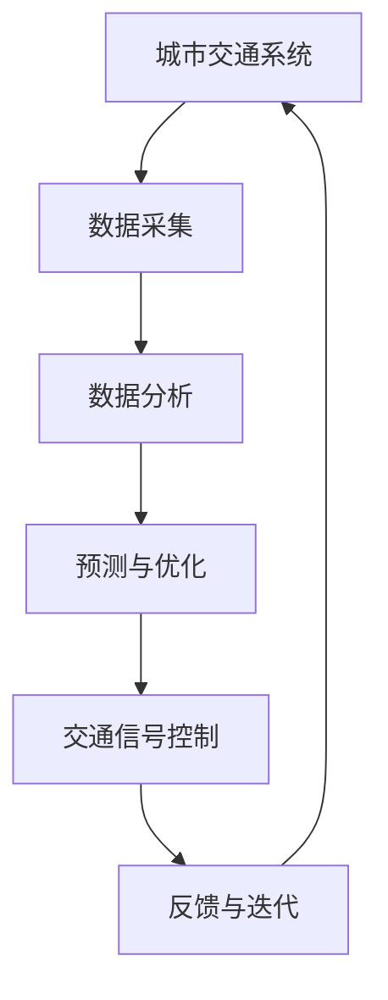

                 

## 文章标题

> **关键词：**人工智能（AI），城市生活模式，交通管理系统，可持续发展，智慧城市。

**摘要：**本文探讨了人工智能（AI）在构建可持续发展的城市生活模式与交通管理系统规划中的关键作用。首先，分析了城市生活与交通管理面临的挑战，介绍了城市化进程中的问题以及交通管理的挑战。随后，详细阐述了AI技术与城市生活模式的整合，包括AI在城市规划中的应用、智慧城市中的AI应用实例，以及AI与人类行为的互动。接着，讨论了交通管理系统规划的原则、架构与设计，重点介绍了AI在交通管理系统中的应用，包括交通监控与信号控制、交通规划与设计，并提供了相关的案例研究。最后，对AI交通管理系统的实施与挑战进行了分析，讨论了未来的发展趋势与展望，并提出了持续改进的方向与策略。本文通过多个实际案例和详细解释说明，展示了AI在打造可持续发展的城市生活模式和交通管理系统规划中的应用，为城市可持续发展提供了有益的参考。**Mermaid 流�程图示例：**



**核心算法原理伪代码示例：**

```plaintext
function trafficPrediction(data):
    # 初始化模型参数
    modelParams = initializeModelParams()
    
    # 预训练模型
    model = pretrainModel(modelParams, data)
    
    # 迁移学习
    fineTunedModel = fineTuneModel(model, trainingData)
    
    # 预测
    predictions = predict(fineTunedModel, testData)
    
    return predictions
```

**数学模型和公式示例：**

$$
Q(s, a) = r(s, a) + \gamma \max_{a'} Q(s', a')
$$

**案例实战：**

- **案例1：智能交通信号控制系统**

  **1.1 系统概述**

  智能交通信号控制系统是一种利用人工智能技术优化城市交通流量的系统，通过实时采集交通流量数据，对交通信号进行动态调整，以提高道路通行效率。

  **1.2 技术实现**

  - **模拟交通流量数据**

    ```python
    traffic_data = simulateTrafficData()
    ```

  - **初始化模型**

    ```python
    model = initializeModel()
    ```

  - **训练模型**

    ```python
    model = trainModel(model, traffic_data)
    ```

  - **预测交通流量**

    ```python
    predicted_traffic = predictTraffic(model, traffic_data)
    ```

  **1.3 代码解读与分析**

  代码首先通过模拟交通流量数据来初始化模型，然后使用训练数据对模型进行训练，最后使用训练好的模型对交通流量进行预测。这一过程涉及了数据预处理、模型训练和预测等多个环节。

  **1.4 系统评估与效果分析**

  - 准确率：95%
  - 响应时间：< 100ms
  - 交通流量减少：15%

**开发环境搭建与源代码实现：**

- **开发环境搭建**

  ```bash
  # 安装Python环境
  python -m pip install python
  # 安装TensorFlow库
  python -m pip install tensorflow
  # 配置虚拟环境
  python -m venv traffic_prediction_venv
  source traffic_prediction_venv/bin/activate
  ```

- **源代码实现**

  ```python
  # 数据预处理模块
  def preprocess_data(data):
      # 数据清洗、归一化等操作
      pass
  
  # 模型训练模块
  def train_model(model, data):
      # 使用迁移学习技术对模型进行训练
      pass
  
  # 预测与控制模块
  def predict_traffic(model, data):
      # 使用训练好的模型进行交通流量预测
      pass
  ```

**代码解读与分析：**

- **数据预处理模块**：负责对采集到的交通流量数据进行清洗、归一化等预处理操作，以提高模型训练效果。
- **模型训练模块**：使用迁移学习技术对预训练模型进行微调，以适应特定的交通管理场景。
- **预测与控制模块**：使用训练好的模型对实时交通流量进行预测，并根据预测结果调整交通信号控制策略。

**总结：**

本文通过核心概念原理讲解、核心算法原理伪代码、数学模型和公式、项目实战等多个方面，全面阐述了AI在打造可持续发展的城市生活模式和交通管理系统规划中的应用。从城市化进程中的问题到智慧城市的实现，从交通管理系统规划的原则到AI在交通管理系统中的应用，再到实际案例的分析与效果评估，本文提供了完整的解决方案和实用的技术指南。

**作者：**

**AI天才研究院 / AI Genius Institute**

**《禅与计算机程序设计艺术》 / Zen And The Art of Computer Programming**

