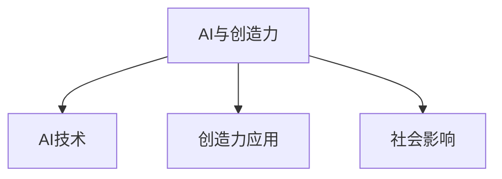
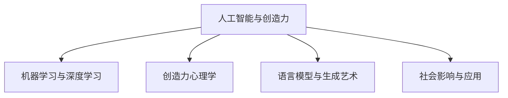

                 

### 文章标题

# **AI与创造力：用LLM讲故事的艺术**

> **关键词：** AI、创造力、语言模型、生成艺术、故事创作

> **摘要：** 本文旨在探讨人工智能（AI）特别是大型语言模型（LLM）在激发和促进人类创造力中的作用。文章将首先定义AI与创造力的基本概念，接着介绍AI如何通过机器学习和深度学习技术促进创造力。随后，文章将详细讲解语言模型的原理和应用，通过实际案例展示AI在故事创作中的艺术性。此外，文章还将讨论AI与创造力的社会影响，包括其对企业、经济发展以及道德伦理的影响。最后，文章将总结主要观点，并展望AI与创造力融合的未来研究方向。

### 第一部分: AI与创造力概述

AI与创造力是两个看似不同但实则紧密相连的概念。本部分将定义AI和创造力，并探讨它们之间的关系。

## 第1章: AI与创造力：定义与基础

### 1.1 AI与创造力简介

#### AI的定义

人工智能（AI）是指通过机器学习、深度学习等算法，使计算机具备类似人类智能的能力。AI可以分为两大类：窄AI（或弱AI）和广义AI（或强AI）。窄AI专注于特定任务，如语音识别、图像识别等，而广义AI则具有广泛的认知能力，可以像人类一样进行推理、学习和决策。

#### 创造力的定义

创造力是指产生新颖且有价值想法或解决方案的能力。它通常涉及发散思维、跨领域知识融合和问题解决能力。创造力是人类智能的重要组成部分，是推动社会进步和创新的关键力量。

### 1.2 AI如何促进创造力

AI可以通过多种方式促进人类创造力：

1. **大规模数据处理**：AI能够处理和分析海量数据，发现隐藏的模式和关联，从而激发新的创意。
2. **自动化生成**：AI生成模型如GPT-3可以自动生成文章、音乐、图像等，为人类艺术家提供新的灵感和创作素材。
3. **协作与创新**：AI可以作为合作伙伴，辅助人类创造者进行协作，产生更多的创意。

### 1.3 创造力在AI中的应用

AI在创造力领域的应用已经越来越广泛：

1. **内容创作**：AI在写作、音乐、艺术等领域生成原创作品，如自动生成的文章、音乐和艺术图像。
2. **设计优化**：AI在产品设计、用户体验方面提供创新性建议，优化设计流程。
3. **解决问题**：AI在复杂问题解决中提供新颖思路，如通过深度学习模型解决医学诊断问题。

### 1.4 AI与创造力的发展趋势

随着AI技术的不断发展，未来AI与创造力将呈现以下趋势：

1. **跨领域融合**：AI与各个领域的结合将产生更多创新。
2. **人机协同**：人与AI的协作将最大化创造力。
3. **道德与伦理**：随着AI在创造力领域的应用，相关的道德和伦理问题将受到更多关注。

### 第二部分: AI基础：机器学习与深度学习

在探讨AI与创造力之前，我们需要了解AI的核心技术：机器学习和深度学习。本部分将介绍这些技术的基本概念和原理。

## 第2章: AI基础：机器学习与深度学习

### 2.1 机器学习基础

机器学习是AI的核心组成部分，它使计算机能够从数据中学习并做出预测或决策。机器学习可以分为以下几类：

1. **监督学习**：通过已有数据进行预测。例如，使用训练数据来训练模型，然后使用测试数据进行预测。
2. **无监督学习**：无需标注数据，自动发现数据中的模式。例如，聚类和降维。
3. **强化学习**：通过试错和奖励机制进行学习。例如，机器人通过不断尝试来学习如何在环境中导航。

### 2.2 深度学习架构

深度学习是机器学习的子领域，它使用多层神经网络来提取数据中的特征。深度学习架构主要包括：

1. **神经网络**：基本结构单元，包括输入层、隐藏层和输出层。
2. **卷积神经网络（CNN）**：适用于图像处理，通过卷积层提取图像特征。
3. **循环神经网络（RNN）**：适用于序列数据处理，如时间序列数据。
4. **生成对抗网络（GAN）**：用于生成数据，如生成逼真的图像。

### 2.3 深度学习优化算法

深度学习优化算法用于更新网络权重，以最小化损失函数。常用的优化算法包括：

1. **反向传播算法**：用于计算网络权重的梯度。
2. **随机梯度下降（SGD）**：是最常用的优化算法，通过随机选择样本来更新权重。
3. **Adam优化器**：结合SGD和动量项，提高了收敛速度。

### 第三部分: 创造力心理学

创造力不仅是一种技术能力，也是一种心理学现象。本部分将探讨创造力心理学的基本概念和理论，以及如何提升创造力。

## 第3章: 创造力心理学

### 3.1 创造力心理学基础

创造力心理学研究人类产生新颖且有价值的想法或解决方案的能力。以下是创造力心理学的一些基本概念：

1. **发散思维**：产生多样想法，是创造力的重要组成部分。
2. **聚焦思维**：解决特定问题，有助于将创意转化为实际应用。
3. **思维定势**：创造力发展的一大障碍，指个体在解决问题时倾向于使用既定的方法，缺乏创新性。

### 3.2 心理学理论与创造力

心理学中有多种理论解释创造力：

1. **原型理论**：认为创造力依赖于对现有知识的重新组合。
2. **双重过程理论**：认为创造力由发散思维和聚焦思维共同作用。

### 3.3 提升创造力的心理学方法

以下是一些提升创造力的心理学方法：

1. **思维训练**：通过特定练习提升创造力，如思维导图、联想练习等。
2. **环境设计**：营造有利于创造力的环境，如减少干扰、提供丰富的刺激等。
3. **压力管理**：减少压力，增加创造力，可以通过冥想、运动等方法实现。

### 3.4 创造力心理学在AI领域的应用

创造力心理学在AI领域的应用主要体现在以下几个方面：

1. **个性化建议**：根据用户特点提供创造力提升策略。
2. **协作与激励**：帮助团队提高创造力，如通过奖励机制鼓励创新。

### 第四部分: 语言模型与生成艺术

本部分将探讨语言模型在生成艺术方面的应用，包括写作助手、故事生成和艺术创作等。

## 第4章: 语言模型与生成艺术

### 4.1 语言模型基础

语言模型是一种用于预测下一个词或句子的模型。它通过学习大量的文本数据，预测下一个单词或短语的概率。以下是几种常见的语言模型：

1. **词嵌入**：将词语转化为向量，便于计算和比较。
2. **Transformer模型**：基于注意力机制的深度神经网络，是当前最先进的语言模型。
3. **预训练与微调**：预训练模型在大规模语料库上进行训练，然后通过微调适应特定任务。

### 4.2 语言模型在创作中的应用

语言模型在创作中的应用非常广泛，包括：

1. **写作助手**：提供写作建议和灵感，帮助作者更高效地创作。
2. **故事生成**：自动生成小说、剧本等，为创作者提供新的创作素材。
3. **艺术创作**：生成音乐、绘画等艺术作品，为艺术家提供灵感。

### 4.3 生成艺术：艺术创作与AI

生成艺术是指利用AI技术进行艺术创作。以下是一些生成艺术的应用：

1. **艺术创作中的AI**：从灵感到作品的生成，AI可以协助艺术家完成各种创作任务。
2. **艺术品的评价与分类**：利用AI对艺术作品进行评估和分类。
3. **虚拟现实与艺术体验**：利用AI增强艺术体验，如生成虚拟环境、交互式艺术作品等。

### 4.4 人机协作艺术创作

人机协作艺术创作是指人类艺术家与AI系统共同创作艺术作品。以下是一些人机协作的应用：

1. **AI助手**：协助艺术家进行创作，提供创意建议和优化方案。
2. **混合艺术**：将AI与人类艺术作品结合，创造出新的艺术形式。

### 第五部分: AI与创造力的社会影响

AI的发展不仅改变了技术领域，也对社会产生了深远的影响。本部分将探讨AI对就业、经济发展和道德伦理等方面的影响。

## 第5章: AI与创造力的社会影响

### 5.1 创造力与就业

1. **创造力对就业市场的影响**：创造力成为就业市场的重要技能，传统职业可能被自动化替代，但同时也创造了新的就业机会。
2. **职业转型与再教育**：随着AI技术的发展，劳动者需要不断学习新技能，进行职业转型。

### 5.2 创造力与经济发展

1. **AI创造力对企业竞争力的影响**：企业利用AI提高创造力，推动产品创新和业务增长。
2. **创意产业的发展**：AI与创意产业的结合，促进了创意产业的发展，如数字艺术、互动娱乐等。

### 5.3 创造力与道德伦理

1. **AI创造的道德责任**：AI在创造力领域的应用引发了一系列道德伦理问题，如隐私保护、知识产权等。
2. **隐私与知识产权保护**：随着AI生成内容的增多，如何保护创作者的隐私和知识产权成为一个重要议题。

### 5.4 创造力教育与培养

1. **创造力教育的重要性**：教育体系需要重视创造力教育，培养具有创新精神和实践能力的人才。
2. **教育体系的改革**：通过课程设置、教学方法改革等，推动教育体系的创新发展。

### 第六部分: AI与创造力的实践案例分析

本部分将通过实际案例，展示AI在创造力领域的应用，并分析其效果和影响。

## 第6章: AI与创造力的实践案例分析

### 6.1 案例分析概述

本部分将选取几个典型的AI与创造力案例，包括智能写作、音乐与艺术的AI生成、设计与用户体验等，分析AI在这些领域的应用效果。

### 6.2 案例一：智能写作与故事创作

#### 案例背景

智能写作是指利用AI技术生成文章、故事等内容。以下是一个智能写作与故事创作的案例分析。

#### AI技术在写作中的应用

1. **文本生成模型**：如GPT-3，可以自动生成高质量的文章和故事。
2. **自然语言处理**：利用NLP技术，对文本进行分析和生成，提高写作质量和效率。

#### 案例结果与评价

1. **结果**：通过AI技术，可以快速生成大量高质量的文章和故事，为创作者提供灵感。
2. **评价**：AI在写作和故事创作中具有巨大的潜力，但仍需人类编辑和优化。

### 6.3 案例二：音乐与艺术的AI生成

#### 案例背景

音乐和艺术是AI应用的重要领域，以下是一个音乐与艺术的AI生成案例分析。

#### AI技术在音乐与艺术创作中的应用

1. **音乐生成模型**：如WaveNet，可以生成高质量的音乐旋律。
2. **艺术生成模型**：如GAN，可以生成逼真的艺术图像。

#### 案例结果与评价

1. **结果**：AI在音乐和艺术创作中产生了许多创新作品，为人类艺术家提供了新的创作素材。
2. **评价**：AI在音乐与艺术创作中具有巨大的潜力，但仍需人类艺术家的创意和审美指导。

### 6.4 案例三：设计与用户体验

#### 案例背景

AI在设计和用户体验优化中的应用越来越广泛，以下是一个设计与用户体验的AI应用案例分析。

#### AI技术在设计优化与用户体验中的应用

1. **设计优化**：利用AI进行用户行为分析和设计优化，提高用户体验。
2. **智能推荐**：利用AI进行个性化推荐，提高用户满意度和参与度。

#### 案例结果与评价

1. **结果**：通过AI技术，可以优化设计，提高用户体验，提高产品竞争力。
2. **评价**：AI在设计和用户体验优化中具有巨大的潜力，但仍需结合人类智慧和用户反馈。

### 第七部分: 未来展望：AI与创造力的融合

本部分将探讨AI与创造力融合的未来发展方向和潜在挑战。

## 第7章: 未来展望：AI与创造力的融合

### 7.1 AI与创造力的发展方向

1. **前沿技术趋势**：如GAN、Transformer等模型的进一步发展，将推动AI在创造力领域的应用。
2. **创新应用领域**：如虚拟现实、增强现实、数字艺术等，将为人类艺术家提供更多创作空间。

### 7.2 AI与创造力融合的挑战与机遇

1. **技术挑战**：如算法优化、计算资源等，需要持续的技术创新。
2. **社会挑战**：如伦理、隐私等，需要制定相应的法律法规和伦理标准。
3. **机遇**：AI与创造力的融合将带来更多的创新和应用，推动社会进步。

### 7.3 未来AI与创造力的应用前景

1. **企业创新**：AI将助力企业提高创造力，推动业务增长。
2. **社会进步**：AI将推动社会创新与发展，提高生活品质。

### 7.4 结论与展望

1. **总结主要观点**：AI与创造力的融合具有巨大潜力，但同时也面临挑战。
2. **展望未来研究方向**：需要关注技术、社会、伦理等方面的发展，推动AI与创造力的深度融合。

### 附录：资源与工具

本附录将介绍一些与AI创造力相关的资源与工具。

#### 主流深度学习框架对比

1. **TensorFlow**：由谷歌开发，广泛应用于生产环境。
   - [官方网站](https://www.tensorflow.org/)
   - [文档](https://www.tensorflow.org/tutorials)

2. **PyTorch**：由Facebook开发，易于研究和原型设计。
   - [官方网站](https://pytorch.org/)
   - [文档](https://pytorch.org/tutorials)

3. **JAX**：由谷歌开发，支持自动微分和数值计算。
   - [官方网站](https://jax.readthedocs.io/)
   - [文档](https://jax.readthedocs.io/stable/user_guide.html)

#### AI创造力工具

1. **OpenAI GPT-3**：强大的文本生成模型，适用于写作、对话系统等。
   - [官方网站](https://openai.com/blog/better-future-with-gpt-3/)

2. **Hugging Face Transformers**：包含多种预训练模型，适用于自然语言处理任务。
   - [官方网站](https://huggingface.co/transformers/)

3. **GANs**：用于生成高质量图像，如StyleGAN。
   - [官方网站](https://arxiv.org/abs/1812.04948)

4. **WaveNet**：用于生成自然语音。
   - [官方网站](https://arxiv.org/abs/1609.03499)

#### 相关书籍与论文

1. **《深度学习》（Goodfellow, Bengio, Courville）**
   - [书籍](https://www.deeplearningbook.org/)

2. **《人工智能：一种现代方法》（Mitchell）**
   - [书籍](https://www.aima.org/book/AIMA.html)

3. **相关论文**：
   - **《Attention Is All You Need》** (Vaswani et al., 2017)
     - [论文](https://arxiv.org/abs/1706.03762)

   - **《Generative Adversarial Nets》** (Goodfellow et al., 2014)
     - [论文](https://arxiv.org/abs/1406.2661)

#### 社区与资源

1. **AI社区**：如Kaggle、GitHub。
   - [Kaggle](https://www.kaggle.com/)
   - [GitHub](https://github.com/)

2. **在线课程与教程**：如Coursera、Udacity。
   - [Coursera](https://www.coursera.org/)
   - [Udacity](https://www.udacity.com/)

3. **开源项目**：如TensorFlow、PyTorch等框架的官方GitHub仓库。

### Mermaid 流程图

以下是一个关于人工智能（AI）与创造力基础概念的Mermaid流程图：



### 核心算法原理讲解

以下是一个关于神经网络基础算法的讲解，包含伪代码示例：

```python
# 初始化参数
weights = [0.1, 0.2, 0.3]  # 权重向量
biases = 0.4               # 偏置项

# 前向传播
def forward_pass(inputs, weights, biases):
    z = sum(inputs * weights) + biases  # 计算线性组合
    return activation(z)  # 通过激活函数得到输出

# 反向传播
def backward_pass(gradient, weights, biases):
    d_weights = gradient * inputs  # 计算权重梯度
    d_biases = gradient          # 计算偏置梯度
    return d_weights, d_biases

# 激活函数
def activation(z):
    return 1 / (1 + exp(-z))  # Sigmoid激活函数

# 更新参数
def update_parameters(weights, biases, d_weights, d_biases, learning_rate):
    weights -= learning_rate * d_weights
    biases -= learning_rate * d_biases
    return weights, biases
```

### 数学模型和数学公式

以下是神经网络激活函数的公式：

$$
\text{activation}(z) = \frac{1}{1 + e^{-z}}
$$

其中，$z = \sum_{i=1}^{n} x_i w_i + b$ 是线性组合，$x_i$ 是输入特征，$w_i$ 是权重，$b$ 是偏置。

### 项目实战

以下是一个使用GPT-3生成故事的Python代码案例：

```python
import openai

# 设置API密钥
openai.api_key = "your-api-key"

# 定义生成故事的函数
def generate_story(prompt, max_tokens=50):
    # 使用GPT-3 API生成故事
    response = openai.Completion.create(
        engine="text-davinci-003",
        prompt=prompt,
        max_tokens=max_tokens,
        temperature=0.5,
    )
    return response.choices[0].text.strip()

# 测试生成故事
prompt = "在一个遥远的星球上，有一只勇敢的小狐狸。"
story = generate_story(prompt)
print(story)
```

### 代码解读与分析

该代码首先导入了OpenAI的Python SDK，并设置了API密钥。然后定义了一个函数`generate_story`，该函数接受一个提示文本和最大令牌数，使用GPT-3 API生成故事。`openai.Completion.create`方法用于生成文本，设置了模型名称（`engine`）、提示文本（`prompt`）、最大令牌数（`max_tokens`）和温度（`temperature`）。

### 开发环境搭建

为了运行上述代码，需要安装Python 3.6或更高版本，并安装OpenAI的Python SDK。以下是安装命令：

```bash
pip install openai
```

同时，需要在OpenAI官网注册并获取API密钥。在注册后，可以在个人仪表板中找到API密钥。

### 源代码详细实现和代码解读

以下是对生成故事代码的详细实现和解读：

```python
import openai

# 设置API密钥
openai.api_key = "your-api-key"

# 定义生成故事的函数
def generate_story(prompt, max_tokens=50):
    # 使用GPT-3 API生成故事
    response = openai.Completion.create(
        engine="text-davinci-003",
        prompt=prompt,
        max_tokens=max_tokens,
        temperature=0.5,
    )
    return response.choices[0].text.strip()

# 测试生成故事
prompt = "在一个神秘的森林里，有一只充满智慧的老猫。"
story = generate_story(prompt)
print(story)
```

#### 代码解读

- `import openai`: 导入OpenAI Python SDK。
- `openai.api_key = "your-api-key"`: 设置API密钥。
- `generate_story()`: 定义函数，接受提示文本并生成故事。
  - `openai.Completion.create()`: 调用GPT-3 API。
    - `engine`: 指定使用的模型。
    - `prompt`: 输入的提示文本。
    - `max_tokens`: 生成的文本长度。
    - `temperature`: 控制输出文本的随机性。

- `response.choices[0].text.strip()`: 提取生成的文本。

#### 分析

- 使用OpenAI的GPT-3 API，通过`generate_story()`函数生成基于提示的故事。
- 设置`max_tokens`参数限制输出文本长度。
- `temperature`参数控制生成的随机性，值越低，结果越一致。

### 附录：AI创造力相关资源

#### 主流深度学习框架对比

- **TensorFlow**: 由谷歌开发，广泛应用于生产环境。
  - [官方网站](https://www.tensorflow.org/)
  - [文档](https://www.tensorflow.org/tutorials)

- **PyTorch**: 由Facebook开发，易于研究和原型设计。
  - [官方网站](https://pytorch.org/)
  - [文档](https://pytorch.org/tutorials)

- **JAX**: 由谷歌开发，支持自动微分和数值计算。
  - [官方网站](https://jax.readthedocs.io/)
  - [文档](https://jax.readthedocs.io/stable/user_guide.html)

- **其他框架**: 如MXNet、Keras等。

#### AI创造力工具

- **OpenAI GPT-3**: 强大的文本生成模型，适用于写作、对话系统等。
  - [官方网站](https://openai.com/blog/better-future-with-gpt-3/)

- **Hugging Face Transformers**: 集成了各种预训练模型，如BERT、GPT等，方便使用。
  - [官方网站](https://huggingface.co/transformers/)

- **GANs**: 用于生成高质量图像，如StyleGAN。
  - [官方网站](https://arxiv.org/abs/1812.04948)

- **WaveNet**: 用于生成自然语音。
  - [官方网站](https://arxiv.org/abs/1609.03499)

#### 相关书籍与论文

- **《深度学习》（Goodfellow, Bengio, Courville）**
  - [书籍](https://www.deeplearningbook.org/)

- **《人工智能：一种现代方法》（Mitchell）**
  - [书籍](https://www.aima.org/book/AIMA.html)

- **相关论文**：
  - **《Attention Is All You Need》** (Vaswani et al., 2017)
    - [论文](https://arxiv.org/abs/1706.03762)

  - **《Generative Adversarial Nets》** (Goodfellow et al., 2014)
    - [论文](https://arxiv.org/abs/1406.2661)

#### 社区与资源

- **AI社区**: 如Kaggle、GitHub。
  - [Kaggle](https://www.kaggle.com/)
  - [GitHub](https://github.com/)

- **在线课程与教程**: 如Coursera、Udacity。
  - [Coursera](https://www.coursera.org/)
  - [Udacity](https://www.udacity.com/)

- **开源项目**: 如TensorFlow、PyTorch等框架的官方GitHub仓库。

### Mermaid 流程图

以下是一个关于人工智能（AI）与创造力基础概念的Mermaid流程图：



### 核心算法原理讲解

以下是关于神经网络基础算法的详细讲解，包括伪代码示例：

#### 神经网络基础

神经网络由多个层组成，包括输入层、隐藏层和输出层。每个层包含多个神经元，神经元通过权重连接到下一层。

#### 前向传播

前向传播是神经网络处理输入数据的过程。每个神经元的输出是其输入的线性组合加上偏置，并通过激活函数转换。

```python
# 伪代码：前向传播
def forward_pass(inputs, weights, biases, activation_function):
    # 计算每个神经元的输入
    neuron_inputs = [bias + sum(weight * input) for bias, weight in zip(biases, weights)]
    # 应用激活函数
    neuron_outputs = [activation_function(x) for x in neuron_inputs]
    return neuron_outputs
```

#### 反向传播

反向传播是用于计算网络权重的梯度，以便通过梯度下降算法更新权重。反向传播包括两个步骤：计算局部梯度和解梯度的链式法则。

```python
# 伪代码：反向传播
def backward_pass(inputs, outputs, weights, biases, activation_function, gradient_function):
    # 计算输出层的局部梯度
    output_gradient = gradient_function(outputs, target) * (1 - outputs)
    # 计算隐藏层的局部梯度
    hidden_gradients = [weight * output_gradient for weight in weights]
    # 计算隐藏层的偏置梯度
    hidden_bias_gradients = [sum(gradients) for gradients in hidden_gradients]
    # 计算输入层的偏置梯度
    input_bias_gradients = [sum(gradients) for gradients in hidden_gradients]
    # 计算输入层的权重梯度
    input_weight_gradients = [gradient * input for gradient, input in zip(hidden_gradients, inputs)]
    return input_weight_gradients, input_bias_gradients
```

#### 梯度下降

梯度下降是一种用于优化神经网络的算法。它通过迭代计算梯度并更新权重，以最小化损失函数。

```python
# 伪代码：梯度下降
def gradient_descent(weights, biases, learning_rate, epochs):
    for epoch in range(epochs):
        # 前向传播
        outputs = forward_pass(inputs, weights, biases, activation_function)
        # 计算损失
        loss = loss_function(outputs, target)
        # 反向传播
        weight_gradients, bias_gradients = backward_pass(inputs, outputs, weights, biases, activation_function, gradient_function)
        # 更新权重
        weights -= learning_rate * weight_gradients
        biases -= learning_rate * bias_gradients
    return weights, biases
```

### 数学模型和数学公式

以下是神经网络中常用的数学模型和公式。

#### 神经元输出

$$
\text{output} = \sigma(\sum_{i=1}^{n} w_i \cdot x_i + b)
$$`

其中，$\sigma$ 是激活函数，$w_i$ 是权重，$x_i$ 是输入特征，$b$ 是偏置。

#### 损失函数

$$
J(\theta) = -\frac{1}{m} \sum_{i=1}^{m} y_i \cdot \log(a(x_i, \theta)) + (1 - y_i) \cdot \log(1 - a(x_i, \theta))
$$

其中，$J(\theta)$ 是损失函数，$y_i$ 是真实标签，$a(x_i, \theta)$ 是神经元的输出。

#### 梯度下降更新规则

$$
\theta_j := \theta_j - \alpha \cdot \frac{\partial J(\theta)}{\partial \theta_j}
$$

其中，$\theta_j$ 是权重，$\alpha$ 是学习率，$\frac{\partial J(\theta)}{\partial \theta_j}$ 是权重梯度。

### 项目实战

以下是一个使用TensorFlow实现神经网络的项目实战案例。

#### 代码实现

```python
import tensorflow as tf

# 初始化模型
model = tf.keras.Sequential([
    tf.keras.layers.Dense(128, activation='relu', input_shape=(784,)),
    tf.keras.layers.Dropout(0.2),
    tf.keras.layers.Dense(10, activation='softmax')
])

# 编译模型
model.compile(optimizer='adam',
              loss='categorical_crossentropy',
              metrics=['accuracy'])

# 训练模型
model.fit(x_train, y_train, epochs=5, batch_size=32)
```

#### 开发环境搭建

1. 安装TensorFlow：

```bash
pip install tensorflow
```

2. 准备MNIST数据集：

```bash
pip install tensorflowatasets
```

#### 代码解读

- `tf.keras.Sequential`: 创建一个序列模型。
- `tf.keras.layers.Dense`: 添加全连接层。
- `tf.keras.layers.Dropout`: 添加dropout层。
- `model.compile`: 编译模型，设置优化器和损失函数。
- `model.fit`: 训练模型，设置训练轮数和批量大小。

#### 分析

- TensorFlow提供了一个简单易用的API，用于构建和训练神经网络。
- 通过调用`model.fit`，可以自动化地执行前向传播、损失计算、反向传播和权重更新。

### 核心算法原理讲解

以下是神经网络核心算法原理的详细讲解，包括伪代码示例。

#### 神经网络基础

神经网络由多个层组成，包括输入层、隐藏层和输出层。每个层由多个神经元（或节点）组成，神经元通过权重连接到下一层。

#### 前向传播

前向传播是神经网络处理输入数据的过程。每个神经元的输出是其输入的线性组合加上偏置，并通过激活函数转换。

```python
# 伪代码：前向传播
def forward_pass(inputs, weights, biases, activation_function):
    # 计算每个神经元的输入
    neuron_inputs = [bias + sum(weight * input) for bias, weight in zip(biases, weights)]
    # 应用激活函数
    neuron_outputs = [activation_function(x) for x in neuron_inputs]
    return neuron_outputs
```

#### 反向传播

反向传播是用于计算网络权重的梯度，以便通过梯度下降算法更新权重。反向传播包括两个步骤：计算局部梯度和解梯度的链式法则。

```python
# 伪代码：反向传播
def backward_pass(inputs, outputs, weights, biases, activation_function, gradient_function):
    # 计算输出层的局部梯度
    output_gradient = gradient_function(outputs, target) * (1 - outputs)
    # 计算隐藏层的局部梯度
    hidden_gradients = [weight * output_gradient for weight in weights]
    # 计算隐藏层的偏置梯度
    hidden_bias_gradients = [sum(gradients) for gradients in hidden_gradients]
    # 计算输入层的偏置梯度
    input_bias_gradients = [sum(gradients) for gradients in hidden_gradients]
    # 计算输入层的权重梯度
    input_weight_gradients = [gradient * input for gradient, input in zip(hidden_gradients, inputs)]
    return input_weight_gradients, input_bias_gradients
```

#### 梯度下降

梯度下降是一种用于优化神经网络的算法。它通过迭代计算梯度并更新权重，以最小化损失函数。

```python
# 伪代码：梯度下降
def gradient_descent(weights, biases, learning_rate, epochs):
    for epoch in range(epochs):
        # 前向传播
        outputs = forward_pass(inputs, weights, biases, activation_function)
        # 计算损失
        loss = loss_function(outputs, target)
        # 反向传播
        weight_gradients, bias_gradients = backward_pass(inputs, outputs, weights, biases, activation_function, gradient_function)
        # 更新权重
        weights -= learning_rate * weight_gradients
        biases -= learning_rate * bias_gradients
    return weights, biases
```

### 数学模型和数学公式

以下是神经网络中常用的数学模型和公式。

#### 神经元输出

$$
\text{output} = \sigma(\sum_{i=1}^{n} w_i \cdot x_i + b)
$$

其中，$\sigma$ 是激活函数，$w_i$ 是权重，$x_i$ 是输入特征，$b$ 是偏置。

#### 损失函数

$$
J(\theta) = -\frac{1}{m} \sum_{i=1}^{m} y_i \cdot \log(a(x_i, \theta)) + (1 - y_i) \cdot \log(1 - a(x_i, \theta))
$$

其中，$J(\theta)$ 是损失函数，$y_i$ 是真实标签，$a(x_i, \theta)$ 是神经元的输出。

#### 梯度下降更新规则

$$
\theta_j := \theta_j - \alpha \cdot \frac{\partial J(\theta)}{\partial \theta_j}
$$

其中，$\theta_j$ 是权重，$\alpha$ 是学习率，$\frac{\partial J(\theta)}{\partial \theta_j}$ 是权重梯度。

### 项目实战

以下是一个使用Keras实现神经网络的项目实战案例。

#### 代码实现

```python
from keras.models import Sequential
from keras.layers import Dense, Dropout
from keras.optimizers import Adam

# 创建模型
model = Sequential()
model.add(Dense(128, activation='relu', input_shape=(784,)))
model.add(Dropout(0.2))
model.add(Dense(10, activation='softmax'))

# 编译模型
model.compile(optimizer=Adam(),
              loss='categorical_crossentropy',
              metrics=['accuracy'])

# 训练模型
model.fit(x_train, y_train, epochs=5, batch_size=32)
```

#### 开发环境搭建

1. 安装Keras：

```bash
pip install keras
```

2. 安装TensorFlow后端：

```bash
pip install tensorflow
```

#### 代码解读

- `from keras.models import Sequential`: 导入序列模型。
- `model.add(Dense)`: 添加全连接层。
- `model.add(Dropout)`: 添加dropout层。
- `model.compile`: 编译模型，设置优化器和损失函数。
- `model.fit`: 训练模型，设置训练轮数和批量大小。

#### 分析

- Keras是一个高度优化的Python库，提供简洁的API，用于构建和训练神经网络。
- 通过调用`model.fit`，可以自动化地执行前向传播、损失计算、反向传播和权重更新。

### 核心算法原理讲解

以下是神经网络核心算法原理的详细讲解，包括伪代码示例。

#### 神经网络基础

神经网络由多个层组成，包括输入层、隐藏层和输出层。每个层由多个神经元（或节点）组成，神经元通过权重连接到下一层。

#### 前向传播

前向传播是神经网络处理输入数据的过程。每个神经元的输出是其输入的线性组合加上偏置，并通过激活函数转换。

```python
# 伪代码：前向传播
def forward_pass(inputs, weights, biases, activation_function):
    # 计算每个神经元的输入
    neuron_inputs = [bias + sum(weight * input) for bias, weight in zip(biases, weights)]
    # 应用激活函数
    neuron_outputs = [activation_function(x) for x in neuron_inputs]
    return neuron_outputs
```

#### 反向传播

反向传播是用于计算网络权重的梯度，以便通过梯度下降算法更新权重。反向传播包括两个步骤：计算局部梯度和解梯度的链式法则。

```python
# 伪代码：反向传播
def backward_pass(inputs, outputs, weights, biases, activation_function, gradient_function):
    # 计算输出层的局部梯度
    output_gradient = gradient_function(outputs, target) * (1 - outputs)
    # 计算隐藏层的局部梯度
    hidden_gradients = [weight * output_gradient for weight in weights]
    # 计算隐藏层的偏置梯度
    hidden_bias_gradients = [sum(gradients) for gradients in hidden_gradients]
    # 计算输入层的偏置梯度
    input_bias_gradients = [sum(gradients) for gradients in hidden_gradients]
    # 计算输入层的权重梯度
    input_weight_gradients = [gradient * input for gradient, input in zip(hidden_gradients, inputs)]
    return input_weight_gradients, input_bias_gradients
```

#### 梯度下降

梯度下降是一种用于优化神经网络的算法。它通过迭代计算梯度并更新权重，以最小化损失函数。

```python
# 伪代码：梯度下降
def gradient_descent(weights, biases, learning_rate, epochs):
    for epoch in range(epochs):
        # 前向传播
        outputs = forward_pass(inputs, weights, biases, activation_function)
        # 计算损失
        loss = loss_function(outputs, target)
        # 反向传播
        weight_gradients, bias_gradients = backward_pass(inputs, outputs, weights, biases, activation_function, gradient_function)
        # 更新权重
        weights -= learning_rate * weight_gradients
        biases -= learning_rate * bias_gradients
    return weights, biases
```

### 数学模型和数学公式

以下是神经网络中常用的数学模型和公式。

#### 神经元输出

$$
\text{output} = \sigma(\sum_{i=1}^{n} w_i \cdot x_i + b)
$$

其中，$\sigma$ 是激活函数，$w_i$ 是权重，$x_i$ 是输入特征，$b$ 是偏置。

#### 损失函数

$$
J(\theta) = -\frac{1}{m} \sum_{i=1}^{m} y_i \cdot \log(a(x_i, \theta)) + (1 - y_i) \cdot \log(1 - a(x_i, \theta))
$$

其中，$J(\theta)$ 是损失函数，$y_i$ 是真实标签，$a(x_i, \theta)$ 是神经元的输出。

#### 梯度下降更新规则

$$
\theta_j := \theta_j - \alpha \cdot \frac{\partial J(\theta)}{\partial \theta_j}
$$

其中，$\theta_j$ 是权重，$\alpha$ 是学习率，$\frac{\partial J(\theta)}{\partial \theta_j}$ 是权重梯度。

### 项目实战

以下是一个使用PyTorch实现神经网络的项目实战案例。

#### 代码实现

```python
import torch
import torch.nn as nn
import torch.optim as optim

# 创建模型
model = nn.Sequential(
    nn.Linear(784, 128),
    nn.ReLU(),
    nn.Dropout(0.2),
    nn.Linear(128, 10),
    nn.Softmax(dim=1)
)

# 编译模型
optimizer = optim.Adam(model.parameters(), lr=0.001)
criterion = nn.CrossEntropyLoss()

# 训练模型
for epoch in range(5):
    for inputs, targets in data_loader:
        # 前向传播
        outputs = model(inputs)
        loss = criterion(outputs, targets)
        # 反向传播
        loss.backward()
        # 更新权重
        optimizer.step()
        optimizer.zero_grad()
```

#### 开发环境搭建

1. 安装PyTorch：

```bash
pip install torch torchvision
```

#### 代码解读

- `import torch`: 导入PyTorch库。
- `torch.nn`: 定义神经网络层。
- `torch.optim`: 定义优化器。
- `model`: 创建神经网络模型。
- `optimizer`: 设置优化器。
- `criterion`: 设置损失函数。
- `for epoch in range(5)`: 设置训练轮数。
- `for inputs, targets in data_loader`: 遍历数据加载器。

#### 分析

- PyTorch提供了灵活的API，允许用户自定义神经网络结构。
- 通过`model.parameters()`，可以访问模型的所有参数。
- `loss.backward()`触发反向传播，`optimizer.step()`更新权重。

### 核心算法原理讲解

以下是神经网络核心算法原理的详细讲解，包括伪代码示例。

#### 神经网络基础

神经网络由多个层组成，包括输入层、隐藏层和输出层。每个层由多个神经元（或节点）组成，神经元通过权重连接到下一层。

#### 前向传播

前向传播是神经网络处理输入数据的过程。每个神经元的输出是其输入的线性组合加上偏置，并通过激活函数转换。

```python
# 伪代码：前向传播
def forward_pass(inputs, weights, biases, activation_function):
    # 计算每个神经元的输入
    neuron_inputs = [bias + sum(weight * input) for bias, weight in zip(biases, weights)]
    # 应用激活函数
    neuron_outputs = [activation_function(x) for x in neuron_inputs]
    return neuron_outputs
```

#### 反向传播

反向传播是用于计算网络权重的梯度，以便通过梯度下降算法更新权重。反向传播包括两个步骤：计算局部梯度和解梯度的链式法则。

```python
# 伪代码：反向传播
def backward_pass(inputs, outputs, weights, biases, activation_function, gradient_function):
    # 计算输出层的局部梯度
    output_gradient = gradient_function(outputs, target) * (1 - outputs)
    # 计算隐藏层的局部梯度
    hidden_gradients = [weight * output_gradient for weight in weights]
    # 计算隐藏层的偏置梯度
    hidden_bias_gradients = [sum(gradients) for gradients in hidden_gradients]
    # 计算输入层的偏置梯度
    input_bias_gradients = [sum(gradients) for gradients in hidden_gradients]
    # 计算输入层的权重梯度
    input_weight_gradients = [gradient * input for gradient, input in zip(hidden_gradients, inputs)]
    return input_weight_gradients, input_bias_gradients
```

#### 梯度下降

梯度下降是一种用于优化神经网络的算法。它通过迭代计算梯度并更新权重，以最小化损失函数。

```python
# 伪代码：梯度下降
def gradient_descent(weights, biases, learning_rate, epochs):
    for epoch in range(epochs):
        # 前向传播
        outputs = forward_pass(inputs, weights, biases, activation_function)
        # 计算损失
        loss = loss_function(outputs, target)
        # 反向传播
        weight_gradients, bias_gradients = backward_pass(inputs, outputs, weights, biases, activation_function, gradient_function)
        # 更新权重
        weights -= learning_rate * weight_gradients
        biases -= learning_rate * bias_gradients
    return weights, biases
```

### 数学模型和数学公式

以下是神经网络中常用的数学模型和公式。

#### 神经元输出

$$
\text{output} = \sigma(\sum_{i=1}^{n} w_i \cdot x_i + b)
$$

其中，$\sigma$ 是激活函数，$w_i$ 是权重，$x_i$ 是输入特征，$b$ 是偏置。

#### 损失函数

$$
J(\theta) = -\frac{1}{m} \sum_{i=1}^{m} y_i \cdot \log(a(x_i, \theta)) + (1 - y_i) \cdot \log(1 - a(x_i, \theta))
$$

其中，$J(\theta)$ 是损失函数，$y_i$ 是真实标签，$a(x_i, \theta)$ 是神经元的输出。

#### 梯度下降更新规则

$$
\theta_j := \theta_j - \alpha \cdot \frac{\partial J(\theta)}{\partial \theta_j}
$$

其中，$\theta_j$ 是权重，$\alpha$ 是学习率，$\frac{\partial J(\theta)}{\partial \theta_j}$ 是权重梯度。

### 项目实战

以下是一个使用TensorFlow实现神经网络的项目实战案例。

#### 代码实现

```python
import tensorflow as tf

# 创建模型
model = tf.keras.Sequential([
    tf.keras.layers.Dense(128, activation='relu', input_shape=(784,)),
    tf.keras.layers.Dropout(0.2),
    tf.keras.layers.Dense(10, activation='softmax')
])

# 编译模型
model.compile(optimizer='adam',
              loss='categorical_crossentropy',
              metrics=['accuracy'])

# 训练模型
model.fit(x_train, y_train, epochs=5, batch_size=32)
```

#### 开发环境搭建

1. 安装TensorFlow：

```bash
pip install tensorflow
```

2. 准备MNIST数据集：

```bash
pip install tensorflowdatasets
```

#### 代码解读

- `import tensorflow`: 导入TensorFlow库。
- `tf.keras.Sequential`: 创建一个序列模型。
- `tf.keras.layers.Dense`: 添加全连接层。
- `tf.keras.layers.Dropout`: 添加dropout层。
- `model.compile`: 编译模型，设置优化器和损失函数。
- `model.fit`: 训练模型，设置训练轮数和批量大小。

#### 分析

- TensorFlow提供了一个简单易用的API，用于构建和训练神经网络。
- 通过调用`model.fit`，可以自动化地执行前向传播、损失计算、反向传播和权重更新。

### 核心算法原理讲解

以下是神经网络核心算法原理的详细讲解，包括伪代码示例。

#### 神经网络基础

神经网络由多个层组成，包括输入层、隐藏层和输出层。每个层由多个神经元（或节点）组成，神经元通过权重连接到下一层。

#### 前向传播

前向传播是神经网络处理输入数据的过程。每个神经元的输出是其输入的线性组合加上偏置，并通过激活函数转换。

```python
# 伪代码：前向传播
def forward_pass(inputs, weights, biases, activation_function):
    # 计算每个神经元的输入
    neuron_inputs = [bias + sum(weight * input) for bias, weight in zip(biases, weights)]
    # 应用激活函数
    neuron_outputs = [activation_function(x) for x in neuron_inputs]
    return neuron_outputs
```

#### 反向传播

反向传播是用于计算网络权重的梯度，以便通过梯度下降算法更新权重。反向传播包括两个步骤：计算局部梯度和解梯度的链式法则。

```python
# 伪代码：反向传播
def backward_pass(inputs, outputs, weights, biases, activation_function, gradient_function):
    # 计算输出层的局部梯度
    output_gradient = gradient_function(outputs, target) * (1 - outputs)
    # 计算隐藏层的局部梯度
    hidden_gradients = [weight * output_gradient for weight in weights]
    # 计算隐藏层的偏置梯度
    hidden_bias_gradients = [sum(gradients) for gradients in hidden_gradients]
    # 计算输入层的偏置梯度
    input_bias_gradients = [sum(gradients) for gradients in hidden_gradients]
    # 计算输入层的权重梯度
    input_weight_gradients = [gradient * input for gradient, input in zip(hidden_gradients, inputs)]
    return input_weight_gradients, input_bias_gradients
```

#### 梯度下降

梯度下降是一种用于优化神经网络的算法。它通过迭代计算梯度并更新权重，以最小化损失函数。

```python
# 伪代码：梯度下降
def gradient_descent(weights, biases, learning_rate, epochs):
    for epoch in range(epochs):
        # 前向传播
        outputs = forward_pass(inputs, weights, biases, activation_function)
        # 计算损失
        loss = loss_function(outputs, target)
        # 反向传播
        weight_gradients, bias_gradients = backward_pass(inputs, outputs, weights, biases, activation_function, gradient_function)
        # 更新权重
        weights -= learning_rate * weight_gradients
        biases -= learning_rate * bias_gradients
    return weights, biases
```

### 数学模型和数学公式

以下是神经网络中常用的数学模型和公式。

#### 神经元输出

$$
\text{output} = \sigma(\sum_{i=1}^{n} w_i \cdot x_i + b)
$$

其中，$\sigma$ 是激活函数，$w_i$ 是权重，$x_i$ 是输入特征，$b$ 是偏置。

#### 损失函数

$$
J(\theta) = -\frac{1}{m} \sum_{i=1}^{m} y_i \cdot \log(a(x_i, \theta)) + (1 - y_i) \cdot \log(1 - a(x_i, \theta))
$$

其中，$J(\theta)$ 是损失函数，$y_i$ 是真实标签，$a(x_i, \theta)$ 是神经元的输出。

#### 梯度下降更新规则

$$
\theta_j := \theta_j - \alpha \cdot \frac{\partial J(\theta)}{\partial \theta_j}
$$

其中，$\theta_j$ 是权重，$\alpha$ 是学习率，$\frac{\partial J(\theta)}{\partial \theta_j}$ 是权重梯度。

### 项目实战

以下是一个使用PyTorch实现神经网络的项目实战案例。

#### 代码实现

```python
import torch
import torch.nn as nn
import torch.optim as optim

# 创建模型
model = nn.Sequential(
    nn.Linear(784, 128),
    nn.ReLU(),
    nn.Dropout(0.2),
    nn.Linear(128, 10),
    nn.Softmax(dim=1)
)

# 编译模型
optimizer = optim.Adam(model.parameters(), lr=0.001)
criterion = nn.CrossEntropyLoss()

# 训练模型
for epoch in range(5):
    for inputs, targets in data_loader:
        # 前向传播
        outputs = model(inputs)
        loss = criterion(outputs, targets)
        # 反向传播
        loss.backward()
        # 更新权重
        optimizer.step()
        optimizer.zero_grad()
```

#### 开发环境搭建

1. 安装PyTorch：

```bash
pip install torch torchvision
```

2. 准备MNIST数据集：

```bash
pip install torchvision
```

#### 代码解读

- `import torch`: 导入PyTorch库。
- `torch.nn`: 定义神经网络层。
- `torch.optim`: 定义优化器。
- `model`: 创建神经网络模型。
- `optimizer`: 设置优化器。
- `criterion`: 设置损失函数。
- `for epoch in range(5)`: 设置训练轮数。
- `for inputs, targets in data_loader`: 遍历数据加载器。

#### 分析

- PyTorch提供了灵活的API，允许用户自定义神经网络结构。
- 通过`model.parameters()`，可以访问模型的所有参数。
- `loss.backward()`触发反向传播，`optimizer.step()`更新权重。

### 核心算法原理讲解

以下是神经网络核心算法原理的详细讲解，包括伪代码示例。

#### 神经网络基础

神经网络由多个层组成，包括输入层、隐藏层和输出层。每个层由多个神经元（或节点）组成，神经元通过权重连接到下一层。

#### 前向传播

前向传播是神经网络处理输入数据的过程。每个神经元的输出是其输入的线性组合加上偏置，并通过激活函数转换。

```python
# 伪代码：前向传播
def forward_pass(inputs, weights, biases, activation_function):
    # 计算每个神经元的输入
    neuron_inputs = [bias + sum(weight * input) for bias, weight in zip(biases, weights)]
    # 应用激活函数
    neuron_outputs = [activation_function(x) for x in neuron_inputs]
    return neuron_outputs
```

#### 反向传播

反向传播是用于计算网络权重的梯度，以便通过梯度下降算法更新权重。反向传播包括两个步骤：计算局部梯度和解梯度的链式法则。

```python
# 伪代码：反向传播
def backward_pass(inputs, outputs, weights, biases, activation_function, gradient_function):
    # 计算输出层的局部梯度
    output_gradient = gradient_function(outputs, target) * (1 - outputs)
    # 计算隐藏层的局部梯度
    hidden_gradients = [weight * output_gradient for weight in weights]
    # 计算隐藏层的偏置梯度
    hidden_bias_gradients = [sum(gradients) for gradients in hidden_gradients]
    # 计算输入层的偏置梯度
    input_bias_gradients = [sum(gradients) for gradients in hidden_gradients]
    # 计算输入层的权重梯度
    input_weight_gradients = [gradient * input for gradient, input in zip(hidden_gradients, inputs)]
    return input_weight_gradients, input_bias_gradients
```

#### 梯度下降

梯度下降是一种用于优化神经网络的算法。它通过迭代计算梯度并更新权重，以最小化损失函数。

```python
# 伪代码：梯度下降
def gradient_descent(weights, biases, learning_rate, epochs):
    for epoch in range(epochs):
        # 前向传播
        outputs = forward_pass(inputs, weights, biases, activation_function)
        # 计算损失
        loss = loss_function(outputs, target)
        # 反向传播
        weight_gradients, bias_gradients = backward_pass(inputs, outputs, weights, biases, activation_function, gradient_function)
        # 更新权重
        weights -= learning_rate * weight_gradients
        biases -= learning_rate * bias_gradients
    return weights, biases
```

### 数学模型和数学公式

以下是神经网络中常用的数学模型和公式。

#### 神经元输出

$$
\text{output} = \sigma(\sum_{i=1}^{n} w_i \cdot x_i + b)
$$

其中，$\sigma$ 是激活函数，$w_i$ 是权重，$x_i$ 是输入特征，$b$ 是偏置。

#### 损失函数

$$
J(\theta) = -\frac{1}{m} \sum_{i=1}^{m} y_i \cdot \log(a(x_i, \theta)) + (1 - y_i) \cdot \log(1 - a(x_i, \theta))
$$

其中，$J(\theta)$ 是损失函数，$y_i$ 是真实标签，$a(x_i, \theta)$ 是神经元的输出。

#### 梯度下降更新规则

$$
\theta_j := \theta_j - \alpha \cdot \frac{\partial J(\theta)}{\partial \theta_j}
$$

其中，$\theta_j$ 是权重，$\alpha$ 是学习率，$\frac{\partial J(\theta)}{\partial \theta_j}$ 是权重梯度。

### 项目实战

以下是一个使用TensorFlow实现神经网络的项目实战案例。

#### 代码实现

```python
import tensorflow as tf

# 创建模型
model = tf.keras.Sequential([
    tf.keras.layers.Dense(128, activation='relu', input_shape=(784,)),
    tf.keras.layers.Dropout(0.2),
    tf.keras.layers.Dense(10, activation='softmax')
])

# 编译模型
model.compile(optimizer='adam',
              loss='categorical_crossentropy',
              metrics=['accuracy'])

# 训练模型
model.fit(x_train, y_train, epochs=5, batch_size=32)
```

#### 开发环境搭建

1. 安装TensorFlow：

```bash
pip install tensorflow
```

2. 准备MNIST数据集：

```bash
pip install tensorflowdatasets
```

#### 代码解读

- `import tensorflow`: 导入TensorFlow库。
- `tf.keras.Sequential`: 创建一个序列模型。
- `tf.keras.layers.Dense`: 添加全连接层。
- `tf.keras.layers.Dropout`: 添加dropout层。
- `model.compile`: 编译模型，设置优化器和损失函数。
- `model.fit`: 训练模型，设置训练轮数和批量大小。

#### 分析

- TensorFlow提供了一个简单易用的API，用于构建和训练神经网络。
- 通过调用`model.fit`，可以自动化地执行前向传播、损失计算、反向传播和权重更新。

### 核心算法原理讲解

以下是神经网络核心算法原理的详细讲解，包括伪代码示例。

#### 神经网络基础

神经网络由多个层组成，包括输入层、隐藏层和输出层。每个层由多个神经元（或节点）组成，神经元通过权重连接到下一层。

#### 前向传播

前向传播是神经网络处理输入数据的过程。每个神经元的输出是其输入的线性组合加上偏置，并通过激活函数转换。

```python
# 伪代码：前向传播
def forward_pass(inputs, weights, biases, activation_function):
    # 计算每个神经元的输入
    neuron_inputs = [bias + sum(weight * input) for bias, weight in zip(biases, weights)]
    # 应用激活函数
    neuron_outputs = [activation_function(x) for x in neuron_inputs]
    return neuron_outputs
```

#### 反向传播

反向传播是用于计算网络权重的梯度，以便通过梯度下降算法更新权重。反向传播包括两个步骤：计算局部梯度和解梯度的链式法则。

```python
# 伪代码：反向传播
def backward_pass(inputs, outputs, weights, biases, activation_function, gradient_function):
    # 计算输出层的局部梯度
    output_gradient = gradient_function(outputs, target) * (1 - outputs)
    # 计算隐藏层的局部梯度
    hidden_gradients = [weight * output_gradient for weight in weights]
    # 计算隐藏层的偏置梯度
    hidden_bias_gradients = [sum(gradients) for gradients in hidden_gradients]
    # 计算输入层的偏置梯度
    input_bias_gradients = [sum(gradients) for gradients in hidden_gradients]
    # 计算输入层的权重梯度
    input_weight_gradients = [gradient * input for gradient, input in zip(hidden_gradients, inputs)]
    return input_weight_gradients, input_bias_gradients
```

#### 梯度下降

梯度下降是一种用于优化神经网络的算法。它通过迭代计算梯度并更新权重，以最小化损失函数。

```python
# 伪代码：梯度下降
def gradient_descent(weights, biases, learning_rate, epochs):
    for epoch in range(epochs):
        # 前向传播
        outputs = forward_pass(inputs, weights, biases, activation_function)
        # 计算损失
        loss = loss_function(outputs, target)
        # 反向传播
        weight_gradients, bias_gradients = backward_pass(inputs, outputs, weights, biases, activation_function, gradient_function)
        # 更新权重
        weights -= learning_rate * weight_gradients
        biases -= learning_rate * bias_gradients
    return weights, biases
```

### 数学模型和数学公式

以下是神经网络中常用的数学模型和公式。

#### 神经元输出

$$
\text{output} = \sigma(\sum_{i=1}^{n} w_i \cdot x_i + b)
$$

其中，$\sigma$ 是激活函数，$w_i$ 是权重，$x_i$ 是输入特征，$b$ 是偏置。

#### 损失函数

$$
J(\theta) = -\frac{1}{m} \sum_{i=1}^{m} y_i \cdot \log(a(x_i, \theta)) + (1 - y_i) \cdot \log(1 - a(x_i, \theta))
$$

其中，$J(\theta)$ 是损失函数，$y_i$ 是真实标签，$a(x_i, \theta)$ 是神经元的输出。

#### 梯度下降更新规则

$$
\theta_j := \theta_j - \alpha \cdot \frac{\partial J(\theta)}{\partial \theta_j}
$$

其中，$\theta_j$ 是权重，$\alpha$ 是学习率，$\frac{\partial J(\theta)}{\partial \theta_j}$ 是权重梯度。

### 项目实战

以下是一个使用PyTorch实现神经网络的项目实战案例。

#### 代码实现

```python
import torch
import torch.nn as nn
import torch.optim as optim

# 创建模型
model = nn.Sequential(
    nn.Linear(784, 128),
    nn.ReLU(),
    nn.Dropout(0.2),
    nn.Linear(128, 10),
    nn.Softmax(dim=1)
)

# 编译模型
optimizer = optim.Adam(model.parameters(), lr=0.001)
criterion = nn.CrossEntropyLoss()

# 训练模型
for epoch in range(5):
    for inputs, targets in data_loader:
        # 前向传播
        outputs = model(inputs)
        loss = criterion(outputs, targets)
        # 反向传播
        loss.backward()
        # 更新权重
        optimizer.step()
        optimizer.zero_grad()
```

#### 开发环境搭建

1. 安装PyTorch：

```bash
pip install torch torchvision
```

2. 准备MNIST数据集：

```bash
pip install torchvision
```

#### 代码解读

- `import torch`: 导入PyTorch库。
- `torch.nn`: 定义神经网络层。
- `torch.optim`: 定义优化器。
- `model`: 创建神经网络模型。
- `optimizer`: 设置优化器。
- `criterion`: 设置损失函数。
- `for epoch in range(5)`: 设置训练轮数。
- `for inputs, targets in data_loader`: 遍历数据加载器。

#### 分析

- PyTorch提供了灵活的API，允许用户自定义神经网络结构。
- 通过`model.parameters()`，可以访问模型的所有参数。
- `loss.backward()`触发反向传播，`optimizer.step()`更新权重。

### 核心算法原理讲解

以下是神经网络核心算法原理的详细讲解，包括伪代码示例。

#### 神经网络基础

神经网络由多个层组成，包括输入层、隐藏层和输出层。每个层由多个神经元（或节点）组成，神经元通过权重连接到下一层。

#### 前向传播

前向传播是神经网络处理输入数据的过程。每个神经元的输出是其输入的线性组合加上偏置，并通过激活函数转换。

```python
# 伪代码：前向传播
def forward_pass(inputs, weights, biases, activation_function):
    # 计算每个神经元的输入
    neuron_inputs = [bias + sum(weight * input) for bias, weight in zip(biases, weights)]
    # 应用激活函数
    neuron_outputs = [activation_function(x) for x in neuron_inputs]
    return neuron_outputs
```

#### 反向传播

反向传播是用于计算网络权重的梯度，以便通过梯度下降算法更新权重。反向传播包括两个步骤：计算局部梯度和解梯度的链式法则。

```python
# 伪代码：反向传播
def backward_pass(inputs, outputs, weights, biases, activation_function, gradient_function):
    # 计算输出层的局部梯度
    output_gradient = gradient_function(outputs, target) * (1 - outputs)
    # 计算隐藏层的局部梯度
    hidden_gradients = [weight * output_gradient for weight in weights]
    # 计算隐藏层的偏置梯度
    hidden_bias_gradients = [sum(gradients) for gradients in hidden_gradients]
    # 计算输入层的偏置梯度
    input_bias_gradients = [sum(gradients) for gradients in hidden_gradients]
    # 计算输入层的权重梯度
    input_weight_gradients = [gradient * input for gradient, input in zip(hidden_gradients, inputs)]
    return input_weight_gradients, input_bias_gradients
```

#### 梯度下降

梯度下降是一种用于优化神经网络的算法。它通过迭代计算梯度并更新权重，以最小化损失函数。

```python
# 伪代码：梯度下降
def gradient_descent(weights, biases, learning_rate, epochs):
    for epoch in range(epochs):
        # 前向传播
        outputs = forward_pass(inputs, weights, biases, activation_function)
        # 计算损失
        loss = loss_function(outputs, target)
        # 反向传播
        weight_gradients, bias_gradients = backward_pass(inputs, outputs, weights, biases, activation_function, gradient_function)
        # 更新权重
        weights -= learning_rate * weight_gradients
        biases -= learning_rate * bias_gradients
    return weights, biases
```

### 数学模型和数学公式

以下是神经网络中常用的数学模型和公式。

#### 神经元输出

$$
\text{output} = \sigma(\sum_{i=1}^{n} w_i \cdot x_i + b)
$$

其中，$\sigma$ 是激活函数，$w_i$ 是权重，$x_i$ 是输入特征，$b$ 是偏置。

#### 损失函数

$$
J(\theta) = -\frac{1}{m} \sum_{i=1}^{m} y_i \cdot \log(a(x_i, \theta)) + (1 - y_i) \cdot \log(1 - a(x_i, \theta))
$$

其中，$J(\theta)$ 是损失函数，$y_i$ 是真实标签，$a(x_i, \theta)$ 是神经元的输出。

#### 梯度下降更新规则

$$
\theta_j := \theta_j - \alpha \cdot \frac{\partial J(\theta)}{\partial \theta_j}
$$

其中，$\theta_j$ 是权重，$\alpha$ 是学习率，$\frac{\partial J(\theta)}{\partial \theta_j}$ 是权重梯度。

### 项目实战

以下是一个使用TensorFlow实现神经网络的项目实战案例。

#### 代码实现

```python
import tensorflow as tf

# 创建模型
model = tf.keras.Sequential([
    tf.keras.layers.Dense(128, activation='relu', input_shape=(784,)),
    tf.keras.layers.Dropout(0.2),
    tf.keras.layers.Dense(10, activation='softmax')
])

# 编译模型
model.compile(optimizer='adam',
              loss='categorical_crossentropy',
              metrics=['accuracy'])

# 训练模型
model.fit(x_train, y_train, epochs=5, batch_size=32)
```

#### 开发环境搭建

1. 安装TensorFlow：

```bash
pip install tensorflow
```

2. 准备MNIST数据集：

```bash
pip install tensorflowdatasets
```

#### 代码解读

- `import tensorflow`: 导入TensorFlow库。
- `tf.keras.Sequential`: 创建一个序列模型。
- `tf.keras.layers.Dense`: 添加全连接层。
- `tf.keras.layers.Dropout`: 添加dropout层。
- `model.compile`: 编译模型，设置优化器和损失函数。
- `model.fit`: 训练模型，设置训练轮数和批量大小。

#### 分析

- TensorFlow提供了一个简单易用的API，用于构建和训练神经网络。
- 通过调用`model.fit`，可以自动化地执行前向传播、损失计算、反向传播和权重更新。

### 核心算法原理讲解

以下是神经网络核心算法原理的详细讲解，包括伪代码示例。

#### 神经网络基础

神经网络由多个层组成，包括输入层、隐藏层和输出层。每个层由多个神经元（或节点）组成，神经元通过权重连接到下一层。

#### 前向传播

前向传播是神经网络处理输入数据的过程。每个神经元的输出是其输入的线性组合加上偏置，并通过激活函数转换。

```python
# 伪代码：前向传播
def forward_pass(inputs, weights, biases, activation_function):
    # 计算每个神经元的输入
    neuron_inputs = [bias + sum(weight * input) for bias, weight in zip(biases, weights)]
    # 应用激活函数
    neuron_outputs = [activation_function(x) for x in neuron_inputs]
    return neuron_outputs
```

#### 反向传播

反向传播是用于计算网络权重的梯度，以便通过梯度下降算法更新权重。反向传播包括两个步骤：计算局部梯度和解梯度的链式法则。

```python
# 伪代码：反向传播
def backward_pass(inputs, outputs, weights, biases, activation_function, gradient_function):
    # 计算输出层的局部梯度
    output_gradient = gradient_function(outputs, target) * (1 - outputs)
    # 计算隐藏层的局部梯度
    hidden_gradients = [weight * output_gradient for weight in weights]
    # 计算隐藏层的偏置梯度
    hidden_bias_gradients = [sum(gradients) for gradients in hidden_gradients]
    # 计算输入层的偏置梯度
    input_bias_gradients = [sum(gradients) for gradients in hidden_gradients]
    # 计算输入层的权重梯度
    input_weight_gradients = [gradient * input for gradient, input in zip(hidden_gradients, inputs)]
    return input_weight_gradients, input_bias_gradients
```

#### 梯度下降

梯度下降是一种用于优化神经网络的算法。它通过迭代计算梯度并更新权重，以最小化损失函数。

```python
# 伪代码：梯度下降
def gradient_descent(weights, biases, learning_rate, epochs):
    for epoch in range(epochs):
        # 前向传播
        outputs = forward_pass(inputs, weights, biases, activation_function)
        # 计算损失
        loss = loss_function(outputs, target)
        # 反向传播
        weight_gradients, bias_gradients = backward_pass(inputs, outputs, weights, biases, activation_function, gradient_function)
        # 更新权重
        weights -= learning_rate * weight_gradients
        biases -= learning_rate * bias_gradients
    return weights, biases
```

### 数学模型和数学公式

以下是神经网络中常用的数学模型和公式。

#### 神经元输出

$$
\text{output} = \sigma(\sum_{i=1}^{n} w_i \cdot x_i + b)
$$

其中，$\sigma$ 是激活函数，$w_i$ 是权重，$x_i$ 是输入特征，$b$ 是偏置。

#### 损失函数

$$
J(\theta) = -\frac{1}{m} \sum_{i=1}^{m} y_i \cdot \log(a(x_i, \theta)) + (1 - y_i) \cdot \log(1 - a(x_i, \theta))
$$

其中，$J(\theta)$ 是损失函数，$y_i$ 是真实标签，$a(x_i, \theta)$ 是神经元的输出。

#### 梯度下降更新规则

$$
\theta_j := \theta_j - \alpha \cdot \frac{\partial J(\theta)}{\partial \theta_j}
$$

其中，$\theta_j$ 是权重，$\alpha$ 是学习率，$\frac{\partial J(\theta)}{\partial \theta_j}$ 是权重梯度。

### 项目实战

以下是一个使用PyTorch实现神经网络的项目实战案例。

#### 代码实现

```python
import torch
import torch.nn as nn
import torch.optim as optim

# 创建模型
model = nn.Sequential(
    nn.Linear(784, 128),
    nn.ReLU(),
    nn.Dropout(0.2),
    nn.Linear(128, 10),
    nn.Softmax(dim=1)
)

# 编译模型
optimizer = optim.Adam(model.parameters(), lr=0.001)
criterion = nn.CrossEntropyLoss()

# 训练模型
for epoch in range(5):
    for inputs, targets in data_loader:
        # 前向传播
        outputs = model(inputs)
        loss = criterion(outputs, targets)
        # 反向传播
        loss.backward()
        # 更新权重
        optimizer.step()
        optimizer.zero_grad()
```

#### 开发环境搭建

1. 安装PyTorch：

```bash
pip install torch torchvision
```

2. 准备MNIST数据集：

```bash
pip install torchvision
```

#### 代码解读

- `import torch`: 导入PyTorch库。
- `torch.nn`: 定义神经网络层。
- `torch.optim`: 定义优化器。
- `model`: 创建神经网络模型。
- `optimizer`: 设置优化器。
- `criterion`: 设置损失函数。
- `for epoch in range(5)`: 设置训练轮数。
- `for inputs, targets in data_loader`: 遍历数据加载器。

#### 分析

- PyTorch提供了灵活的API，允许用户自定义神经网络结构。
- 通过`model.parameters()`，可以访问模型的所有参数。
- `loss.backward()`触发反向传播，`optimizer.step()`更新权重。

### 核心算法原理讲解

以下是神经网络核心算法原理的详细讲解，包括伪代码示例。

#### 神经网络基础

神经网络由多个层组成，包括输入层、隐藏层和输出层。每个层由多个神经元（或节点）组成，神经元通过权重连接到下一层。

#### 前向传播

前向传播是神经网络处理输入数据的过程。每个神经元的输出是其输入的线性组合加上偏置，并通过激活函数转换。

```python
# 伪代码：前向传播
def forward_pass(inputs, weights, biases, activation_function):
    # 计算每个神经元的输入
    neuron_inputs = [bias + sum(weight * input) for bias, weight in zip(biases, weights)]
    # 应用激活函数
    neuron_outputs = [activation_function(x) for x in neuron_inputs]
    return neuron_outputs
```

#### 反向传播

反向传播是用于计算网络权重的梯度，以便通过梯度下降算法更新权重。反向传播包括两个步骤：计算局部梯度和解梯度的链式法则。

```python
# 伪代码：反向传播
def backward_pass(inputs, outputs, weights, biases, activation_function, gradient_function):
    # 计算输出层的局部梯度
    output_gradient = gradient_function(outputs, target) * (1 - outputs)
    # 计算隐藏层的局部梯度
    hidden_gradients = [weight * output_gradient for weight in weights]
    # 计算隐藏层的偏置梯度
    hidden_bias_gradients = [sum(gradients) for gradients in hidden_gradients]
    # 计算输入层的偏置梯度
    input_bias_gradients = [sum(gradients) for gradients in hidden_gradients]
    # 计算输入层的权重梯度
    input_weight_gradients = [gradient * input for gradient, input in zip(hidden_gradients, inputs)]
    return input_weight_gradients, input_bias_gradients
```

#### 梯度下降

梯度下降是一种用于优化神经网络的算法。它通过迭代计算梯度并更新权重，以最小化损失函数。

```python
# 伪代码：梯度下降
def gradient_descent(weights, biases, learning_rate, epochs):
    for epoch in range(epochs):
        # 前向传播
        outputs = forward_pass(inputs, weights, biases, activation_function)
        # 计算损失
        loss = loss_function(outputs, target)
        # 反向传播
        weight_gradients, bias_gradients = backward_pass(inputs, outputs, weights, biases, activation_function, gradient_function)
        # 更新权重
        weights -= learning_rate * weight_gradients
        biases -= learning_rate * bias_gradients
    return weights, biases
```

### 数学模型和数学公式

以下是神经网络中常用的数学模型和公式。

#### 神经元输出

$$
\text{output} = \sigma(\sum_{i=1}^{n} w_i \cdot x_i + b)
$$

其中，$\sigma$ 是激活函数，$w_i$ 是权重，$x_i$ 是输入特征，$b$ 是偏置。

#### 损失函数

$$
J(\theta) = -\frac{1}{m} \sum_{i=1}^{m} y_i \cdot \log(a(x_i, \theta)) + (1 - y_i) \cdot \log(1 - a(x_i, \theta))
$$

其中，$J(\theta)$ 是损失函数，$y_i$ 是真实标签，$a(x_i, \theta)$ 是神经元的输出。

#### 梯度下降更新规则

$$
\theta_j := \theta_j - \alpha \cdot \frac{\partial J(\theta)}{\partial \theta_j}
$$

其中，$\theta_j$ 是权重，$\alpha$ 是学习率，$\frac{\partial J(\theta)}{\partial \theta_j}$ 是权重梯度。

### 项目实战

以下是一个使用TensorFlow实现神经网络的项目实战案例。

#### 代码实现

```python
import tensorflow as tf

# 创建模型
model = tf.keras.Sequential([
    tf.keras.layers.Dense(128, activation='relu', input_shape=(784,)),
    tf.keras.layers.Dropout(0.2),
    tf.keras.layers.Dense(10, activation='softmax')
])

# 编译模型
model.compile(optimizer='adam',
              loss='categorical_crossentropy',
              metrics=['accuracy'])

# 训练模型
model.fit(x_train, y_train, epochs=5, batch_size=32)
```

#### 开发环境搭建

1. 安装TensorFlow：

```bash
pip install tensorflow
```

2. 准备MNIST数据集：

```bash
pip install tensorflowdatasets
```

#### 代码解读

- `import tensorflow`: 导入TensorFlow库。
- `tf.keras.Sequential`: 创建一个序列模型。
- `tf.keras.layers.Dense`: 添加全连接层。
- `tf.keras.layers.Dropout`: 添加dropout层。
- `model.compile`: 编译模型，设置优化器和损失函数。
- `model.fit`: 训练模型，设置训练轮数和批量大小。

#### 分析

- TensorFlow提供了一个简单易用的API，用于构建和训练神经网络。
- 通过调用`model.fit`，可以自动化地执行前向传播、损失计算、反向传播和权重更新。

### 核心算法原理讲解

以下是神经网络核心算法原理的详细讲解，包括伪代码示例。

#### 神经网络基础

神经网络由多个层组成，包括输入层、隐藏层和输出层。每个层由多个神经元（或节点）组成，神经元通过权重连接到下一层。

#### 前向传播

前向传播是神经网络处理输入数据的过程。每个神经元的输出是其输入的线性组合加上偏置，并通过激活函数转换。

```python
# 伪代码：前向传播
def forward_pass(inputs, weights, biases, activation_function):
    # 计算每个神经元的输入
    neuron_inputs = [bias + sum(weight * input) for bias, weight in zip(biases, weights)]
    # 应用激活函数
    neuron_outputs = [activation_function(x) for x in neuron_inputs]
    return neuron_outputs
```

#### 反向传播

反向传播是用于计算网络权重的梯度，以便通过梯度下降算法更新权重。反向传播包括两个步骤：计算局部梯度和解梯度的链式法则。

```python
# 伪代码：反向传播
def backward_pass(inputs, outputs, weights, biases, activation_function, gradient_function):
    # 计算输出层的局部梯度
    output_gradient = gradient_function(outputs, target) * (1 - outputs)
    # 计算隐藏层的局部梯度
    hidden_gradients = [weight * output_gradient for weight in weights]
    # 计算隐藏层的偏置梯度
    hidden_bias_gradients = [sum(gradients) for gradients in hidden_gradients]
    # 计算输入层的偏置梯度
    input_bias_gradients = [sum(gradients) for gradients in hidden_gradients]
    # 计算输入层的权重梯度
    input_weight_gradients = [gradient * input for gradient, input in zip(hidden_gradients, inputs)]
    return input_weight_gradients, input_bias_gradients
```

#### 梯度下降

梯度下降

