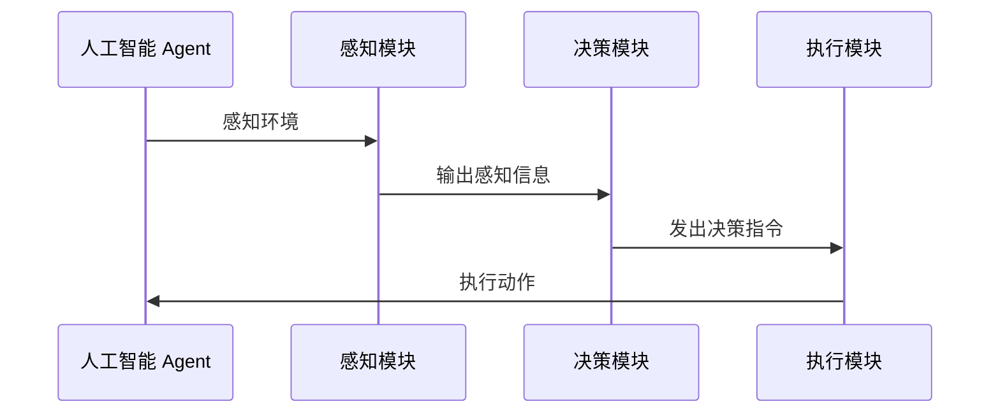
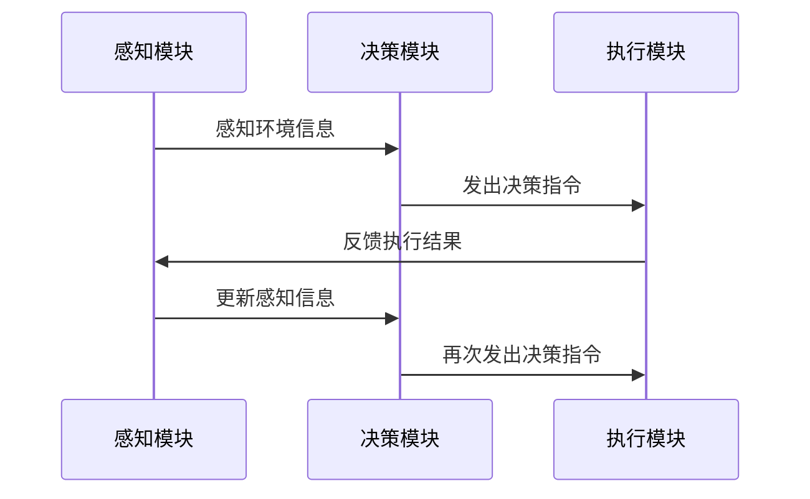
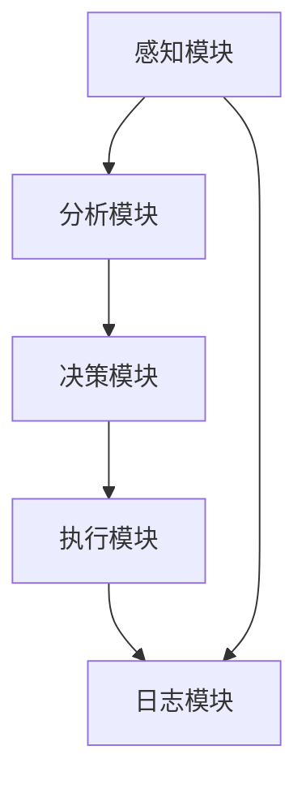

                 

## 《AI人工智能 Agent：安全防御中智能体的应用》

### 关键词：人工智能（AI），智能体（Agent），安全防御，网络安全，物联网安全，算法，架构，开发环境，实战案例

### 摘要：
本文深入探讨了人工智能（AI）智能体在安全防御领域中的应用。首先，我们概述了AI智能体的基本概念和分类，并详细分析了其架构原理和算法。接着，通过实际案例展示了AI智能体在网络安全和物联网安全中的应用实践。文章还探讨了AI智能体在安全防御中的未来发展趋势，并提出了相关的挑战与机遇。通过本文，读者将全面了解AI智能体在安全防御中的重要性和潜力。

### 目录大纲

1. **第一部分：AI人工智能 Agent 基础**

    1.1 AI人工智能 Agent 概述
    
    1.2 AI人工智能 Agent 在安全防御中的应用
    
    1.3 AI人工智能 Agent 技术基础
    
    2.1 人工智能 Agent 架构原理
    
    2.2 人工智能 Agent 算法原理
    
    2.3 人工智能 Agent 开发环境搭建
    
3. **第二部分：AI人工智能 Agent 在安全防御中的应用实践**

    3.1 AI人工智能 Agent 在网络安全中的实战
    
    3.2 AI人工智能 Agent 在物联网安全中的应用
    
    3.3 AI人工智能 Agent 在安全防御中的综合应用案例
    
    4.1 智能安全防御系统设计
    
    4.2 安全防御项目实施与优化
    
5. **第三部分：AI人工智能 Agent 深入研究**

    5.1 AI人工智能 Agent 理论研究进展
    
    5.2 AI人工智能 Agent 在复杂环境中的应用
    
    5.3 AI人工智能 Agent 伦理与社会影响
    
    6.1 AI人工智能 Agent 的发展趋势
    
    6.2 AI人工智能 Agent 的未来展望
    
7. **总结与展望**

    7.1 本书主要内容回顾
    
    7.2 本书贡献与局限性
    
    7.3 未来研究方向
    
    7.4 对读者的建议

### 引言

随着信息技术的飞速发展，网络安全和物联网安全已成为当前社会的重要议题。传统的安全防御手段已无法应对日益复杂和多样化的安全威胁。人工智能（AI）智能体作为一种先进的计算模型，其在安全防御中的应用具有巨大潜力。本文旨在探讨AI智能体在安全防御领域中的具体应用，以期为网络安全和物联网安全提供新的思路和方法。

智能体（Agent）是人工智能领域中的一个核心概念，它代表着具有感知、决策和执行能力的自主实体。AI智能体则通过结合机器学习和深度学习等先进技术，使其在复杂环境中具备更高的智能和适应能力。本文将首先介绍AI智能体的基本概念和分类，然后详细分析其架构原理和算法，接着通过实际案例展示其在网络安全和物联网安全中的应用，最后探讨其未来的发展趋势和挑战。

### 第一部分：AI人工智能 Agent 基础

#### 1.1 AI人工智能 Agent 概述

##### 1.1.1 AI人工智能 Agent 的概念与分类

AI人工智能 Agent，简称AI智能体，是一种通过计算机程序实现的智能实体，具备感知、决策和执行的能力。它能够自主地获取环境信息、分析信息、做出决策并执行相应的动作，以实现特定的任务目标。

AI智能体可以按照不同的分类标准进行分类，以下是几种常见的分类方法：

1. **按智能体行为方式分类**：
   - 反应式Agent：仅根据当前感知信息做出反应，不考虑过去的历史信息。
   - 目标导向Agent：具有明确的目标，并采取行动以实现目标。
   - 计划Agent：通过规划和预判来执行任务。
   - 学习型Agent：通过学习和经验改进自身的行为。
   - 社交Agent：具备社交能力，能够与其他智能体进行交互。

2. **按智能体架构分类**：
   - 单层架构：感知器、决策器和执行器三层结构，各层相互独立。
   - 多层架构：包括感知模块、决策模块、执行模块，以及更高层次的任务规划模块。

3. **按应用领域分类**：
   - 网络安全Agent：用于入侵检测、攻击预测等。
   - 物联网安全Agent：用于设备身份验证、数据加密等。
   - 智能交通Agent：用于交通流量管理、路径规划等。

##### 1.1.2 AI人工智能 Agent 在安全防御中的应用

AI智能体在安全防御中的应用主要集中在网络安全和物联网安全领域。以下是一些具体应用场景：

1. **网络安全中的应用**：

   - 入侵检测：AI智能体可以通过分析网络流量、系统日志等信息，识别潜在的攻击行为。
   - 网络攻击预测：AI智能体可以基于历史数据和模式识别技术，预测潜在的攻击行为。
   - 防火墙自动化：AI智能体可以根据实时威胁情报，自动调整防火墙规则，提高网络安全性。

2. **物联网安全中的应用**：

   - 设备身份验证：AI智能体可以通过指纹识别等技术，确保物联网设备的合法性和安全性。
   - 数据加密：AI智能体可以自动加密传输的数据，防止数据泄露。
   - 漏洞扫描：AI智能体可以扫描物联网设备中的漏洞，并提供修复建议。

#### 1.2 AI人工智能 Agent 在安全防御中的应用

##### 1.2.1 AI人工智能 Agent 在网络安全中的应用

AI人工智能 Agent 在网络安全中的应用主要体现在以下几个方面：

1. **入侵检测系统（IDS）**：

   入侵检测系统是一种监控网络流量、系统日志等数据的工具，用于识别潜在的安全威胁。AI人工智能 Agent 可以通过分析这些数据，发现异常行为，并自动触发告警。

2. **网络攻击预测**：

   网络攻击预测是指通过分析历史攻击数据，预测未来的攻击行为。AI人工智能 Agent 可以使用机器学习算法，从大量数据中提取特征，识别潜在的攻击模式。

3. **防火墙自动化**：

   防火墙是一种网络安全设备，用于控制进出网络的流量。AI人工智能 Agent 可以根据实时威胁情报，自动调整防火墙规则，提高网络安全性。

##### 1.2.2 AI人工智能 Agent 在物联网安全中的应用

AI人工智能 Agent 在物联网安全中的应用主要包括以下几个方面：

1. **设备身份验证**：

   物联网设备数量庞大，确保设备的合法性和安全性至关重要。AI人工智能 Agent 可以通过指纹识别等技术，对设备进行身份验证。

2. **数据加密**：

   数据加密是保护数据安全的关键手段。AI人工智能 Agent 可以自动加密传输的数据，防止数据泄露。

3. **漏洞扫描**：

   AI人工智能 Agent 可以扫描物联网设备中的漏洞，并提供修复建议，从而提高设备的安全性。

#### 1.3 AI人工智能 Agent 技术基础

##### 2.1 人工智能 Agent 架构原理

人工智能 Agent 的架构通常包括感知模块、决策模块和执行模块。以下是这些模块的基本原理：

1. **感知模块**：

   感知模块负责收集和处理环境信息。它可以通过传感器、摄像头、麦克风等设备获取数据，并对其进行预处理，如滤波、去噪等。

2. **决策模块**：

   决策模块负责根据感知模块提供的信息，分析并做出决策。它可以使用机器学习算法、决策树、神经网络等模型，对数据进行分析和处理。

3. **执行模块**：

   执行模块负责根据决策模块的决策，执行具体的动作。它可以通过机器人、无人机、车辆等设备，实现对环境的实际操作。

##### 2.2 人工智能 Agent 算法原理

人工智能 Agent 的算法原理主要包括反应式 Agent 和目标导向 Agent。

1. **反应式 Agent**：

   反应式 Agent 是一种简单的智能体，它仅根据当前感知信息做出反应，不考虑过去的历史信息。反应式 Agent 的算法通常使用 DDD（数据驱动决策）模型，即：

   $$
   \text{决策} = f(\text{感知数据})
   $$

2. **目标导向 Agent**：

   目标导向 Agent 具有明确的目标，并采取行动以实现目标。目标导向 Agent 的算法通常使用 A* 算法，它是一种基于启发式的搜索算法，用于找到从起始节点到目标节点的最优路径。A* 算法的公式为：

   $$
   f(n) = g(n) + h(n)
   $$

   其中，$g(n)$ 是从起始节点到节点 $n$ 的代价，$h(n)$ 是从节点 $n$ 到目标节点的估算代价。

##### 2.3 人工智能 Agent 开发环境搭建

在搭建人工智能 Agent 的开发环境时，需要考虑以下几个方面：

1. **Python 开发环境配置**：

   Python 是一种广泛使用的编程语言，具有丰富的库和框架，适合用于人工智能 Agent 的开发。以下是搭建 Python 开发环境的步骤：

   - 安装 Python：从官方网站下载并安装 Python。
   - 配置虚拟环境：使用 virtualenv 工具创建虚拟环境，避免不同项目之间的依赖冲突。
   - 安装相关库：根据项目需求，安装所需的库和框架，如 TensorFlow、PyTorch、Scikit-learn 等。

2. **相关库和框架**：

   - TensorFlow：用于构建和训练机器学习模型。
   - PyTorch：另一种流行的深度学习框架，具有动态计算图和灵活的模型定义能力。
   - Scikit-learn：用于数据分析和机器学习算法的实现。

3. **开发工具**：

   - PyCharm：一款功能强大的 Python 集成开发环境（IDE），支持代码编辑、调试和测试。
   - Jupyter Notebook：一款交互式的开发环境，适合用于数据分析和机器学习实验。

### 第二部分：AI人工智能 Agent 在安全防御中的应用实践

#### 第3章：AI人工智能 Agent 在网络安全中的实战

网络安全是当今信息安全领域的一个重要组成部分，随着网络攻击手段的日益复杂化和多样化，传统的安全防御手段已经无法满足需求。AI人工智能 Agent 在网络安全中的应用，为网络安全领域带来了新的思路和解决方案。

##### 3.1 入侵检测系统设计

入侵检测系统（IDS）是一种用于监控网络流量、系统日志等信息的安全系统，主要用于检测和防范网络攻击。AI人工智能 Agent 在入侵检测系统中扮演着重要角色，可以通过分析网络流量、系统日志等数据，识别潜在的安全威胁。

1. **数据采集与预处理**：

   入侵检测系统的首要任务是收集网络流量和系统日志等数据。采集的数据通常包括网络包、系统日志、用户行为日志等。在数据采集过程中，需要对数据进行预处理，如去噪、归一化等，以提高数据的质量。

2. **模型选择与训练**：

   在入侵检测系统中，AI人工智能 Agent 可以使用多种机器学习算法进行模型训练。常用的算法包括决策树、支持向量机（SVM）、神经网络等。训练过程主要包括数据集划分、模型选择、参数调优等步骤。

3. **实时检测与报警**：

   入侵检测系统需要实现实时检测和报警功能。AI人工智能 Agent 可以根据训练好的模型，对实时数据进行分析，识别潜在的安全威胁，并自动生成报警信息。

##### 3.2 漏洞扫描系统实现

漏洞扫描系统是一种用于检测计算机系统漏洞的安全工具，主要用于发现和修复系统中的安全漏洞。AI人工智能 Agent 在漏洞扫描系统中可以发挥重要作用，可以通过分析系统日志、网络流量等数据，发现潜在的安全漏洞。

1. **漏洞扫描算法**：

   漏洞扫描算法主要包括以下几种：

   - **基于规则的漏洞扫描**：使用预定义的规则库，对系统进行扫描，发现匹配的漏洞。
   - **基于统计学的漏洞扫描**：使用统计学方法，分析系统行为，发现异常行为，从而识别漏洞。
   - **基于机器学习的漏洞扫描**：使用机器学习算法，对系统行为进行建模，发现异常行为，从而识别漏洞。

2. **数据源选择与处理**：

   漏洞扫描系统需要选择合适的数据源，如系统日志、网络流量、Web 应用等。在数据源选择过程中，需要考虑数据的质量和完整性。数据源确定后，需要对数据进行预处理，如去噪、归一化等，以提高数据的质量。

3. **漏洞修复建议**：

   在发现漏洞后，AI人工智能 Agent 可以根据漏洞的类型和影响程度，提供漏洞修复建议。修复建议通常包括漏洞的描述、修复方法、修复步骤等。

##### 3.3 智能安全防御系统设计

智能安全防御系统是一种集成了多种安全功能的安全系统，主要用于保护计算机网络和信息系统。AI人工智能 Agent 在智能安全防御系统中扮演着重要角色，可以通过自动化和智能化的方式，提高安全防御能力。

1. **系统架构设计**：

   智能安全防御系统通常采用分布式架构，包括数据采集模块、数据处理模块、安全策略模块、执行模块等。数据采集模块负责收集网络流量、系统日志等数据；数据处理模块负责对数据进行分析和处理；安全策略模块负责制定和调整安全策略；执行模块负责根据安全策略进行操作。

2. **模块功能划分**：

   - **数据采集模块**：负责收集网络流量、系统日志、用户行为等数据。
   - **数据处理模块**：负责对数据进行分析和处理，提取关键特征。
   - **安全策略模块**：负责制定和调整安全策略，包括入侵检测、漏洞扫描、安全告警等。
   - **执行模块**：负责根据安全策略进行操作，包括阻止攻击、修复漏洞、生成报告等。

3. **系统集成与测试**：

   智能安全防御系统需要与其他安全设备和系统进行集成，如防火墙、入侵检测系统、安全信息与事件管理系统（SIEM）等。在系统集成过程中，需要对系统进行测试，确保各模块之间的协作和数据的流通。

##### 3.4 安全防御项目实施与优化

1. **项目实施步骤**：

   安全防御项目的实施主要包括以下步骤：

   - **需求分析**：分析用户需求，明确安全防御目标。
   - **系统设计**：根据需求分析结果，设计安全防御系统。
   - **系统开发**：根据系统设计，开发安全防御系统。
   - **系统测试**：对安全防御系统进行测试，确保系统的可靠性和安全性。
   - **部署实施**：将安全防御系统部署到实际环境中，进行试运行。
   - **优化调整**：根据试运行结果，对系统进行调整和优化。

2. **性能优化策略**：

   在安全防御项目中，性能优化是一个重要的方面。以下是一些常见的性能优化策略：

   - **数据预处理**：对数据进行预处理，提高数据处理效率。
   - **分布式计算**：采用分布式计算架构，提高系统的处理能力。
   - **缓存技术**：使用缓存技术，减少对数据库的访问次数，提高数据读取速度。
   - **负载均衡**：采用负载均衡技术，合理分配系统资源，提高系统的稳定性和响应速度。
   - **代码优化**：对代码进行优化，减少资源的占用和时间的消耗。

3. **故障排除与处理**：

   在安全防御项目中，故障排除和处理是一个不可忽视的方面。以下是一些常见的故障排除方法：

   - **日志分析**：通过分析系统日志，定位故障发生的位置和原因。
   - **故障模拟**：模拟故障情况，测试系统的应对能力。
   - **版本回退**：在故障发生时，回退到上一个稳定版本，解决问题。
   - **故障隔离**：将故障系统与其他系统隔离，防止故障蔓延。
   - **人工干预**：在系统出现故障时，人工进行干预，解决问题。

##### 3.5 代码解读与分析

在AI人工智能 Agent 在安全防御中的应用中，代码的编写和解读是关键的一环。以下是对一个简单的入侵检测系统代码的解读和分析。

```python
import numpy as np
from sklearn.ensemble import RandomForestClassifier
from sklearn.model_selection import train_test_split
from sklearn.metrics import accuracy_score
from sklearn.preprocessing import StandardScaler

# 数据预处理
def preprocess_data(data):
    # 归一化数据
    scaler = StandardScaler()
    scaled_data = scaler.fit_transform(data)
    return scaled_data

# 模型训练
def train_model(X_train, y_train):
    # 使用随机森林分类器
    clf = RandomForestClassifier(n_estimators=100)
    clf.fit(X_train, y_train)
    return clf

# 模型评估
def evaluate_model(clf, X_test, y_test):
    # 预测测试集
    y_pred = clf.predict(X_test)
    # 计算准确率
    accuracy = accuracy_score(y_test, y_pred)
    print(f"准确率：{accuracy}")
    return accuracy

# 主函数
def main():
    # 加载数据
    data = np.load("data.npy")
    labels = np.load("labels.npy")
    # 划分训练集和测试集
    X_train, X_test, y_train, y_test = train_test_split(data, labels, test_size=0.2, random_state=42)
    # 预处理数据
    X_train = preprocess_data(X_train)
    X_test = preprocess_data(X_test)
    # 训练模型
    clf = train_model(X_train, y_train)
    # 评估模型
    evaluate_model(clf, X_test, y_test)

if __name__ == "__main__":
    main()
```

**代码解读：**

- **数据预处理**：使用 `StandardScaler` 进行数据归一化，将数据缩放到相同的范围，提高模型训练的效果。
- **模型训练**：使用 `RandomForestClassifier` 进行模型训练，随机森林是一种集成学习算法，具有很好的分类效果。
- **模型评估**：使用 `accuracy_score` 计算模型的准确率，评估模型的效果。
- **主函数**：加载数据、划分训练集和测试集、预处理数据、训练模型和评估模型。

**代码分析：**

- **数据预处理**：数据预处理是机器学习中的重要步骤，它可以提高模型训练的效果。归一化是一种常用的预处理方法，可以将数据缩放到相同的范围，消除不同特征之间的量纲影响。
- **模型选择**：随机森林是一种常用的分类算法，它通过构建多棵决策树，并对预测结果进行投票，得到最终的分类结果。随机森林算法具有很好的分类效果，适用于处理大规模数据和复杂的分类任务。
- **模型评估**：准确率是评估分类模型效果的一种常用指标，它表示模型正确分类的样本比例。准确率越高，表示模型的效果越好。

### 第4章：AI人工智能 Agent 在物联网安全中的应用

随着物联网（IoT）技术的快速发展，物联网安全逐渐成为信息安全领域的一个热点话题。AI人工智能 Agent 作为一种先进的计算模型，其在物联网安全中的应用具有巨大的潜力。本章将介绍 AI人工智能 Agent 在物联网安全中的应用，包括设备身份验证、数据加密和漏洞扫描等方面。

##### 4.1 物联网设备身份验证

物联网设备身份验证是确保物联网系统安全性的重要环节。通过设备身份验证，可以防止未授权的设备访问物联网网络，从而提高系统的安全性。

1. **设备指纹识别**：

   设备指纹识别是一种通过识别设备的唯一特征来验证设备身份的方法。常见的设备指纹特征包括设备硬件信息、操作系统版本、应用程序列表等。AI人工智能 Agent 可以通过分析这些特征，建立设备指纹数据库，从而实现对设备的快速识别。

2. **多因素认证**：

   多因素认证是一种结合多种认证方式来提高设备身份验证安全性的方法。常见的多因素认证方式包括密码、指纹、面部识别等。AI人工智能 Agent 可以根据不同的认证方式，设计相应的认证策略，从而实现高效安全的设备身份验证。

3. **设备安全策略配置**：

   设备安全策略配置是确保物联网设备安全运行的重要环节。AI人工智能 Agent 可以根据设备指纹和认证结果，自动配置相应的安全策略，如访问控制策略、加密策略等，从而提高物联网系统的安全性。

##### 4.2 数据加密与传输安全

数据加密是保护物联网数据安全的重要手段。通过数据加密，可以防止数据在传输过程中被窃取或篡改，从而保障数据的机密性和完整性。

1. **加密算法选择**：

   加密算法的选择是数据加密的关键。常见的加密算法包括对称加密算法（如AES）和非对称加密算法（如RSA）。AI人工智能 Agent 可以根据数据类型和传输环境，选择合适的加密算法，从而提高数据加密的安全性。

2. **数据加密传输流程**：

   数据加密传输流程通常包括以下步骤：

   - **数据加密**：将传输的数据使用加密算法进行加密，生成密文。
   - **数据传输**：将加密后的数据通过物联网网络进行传输。
   - **数据解密**：接收方使用加密算法的密钥，对加密后的数据进行解密，恢复原始数据。

3. **安全通信协议**：

   安全通信协议是确保数据在传输过程中安全性的重要保障。常见的安全通信协议包括SSL/TLS等。AI人工智能 Agent 可以根据安全需求，选择合适的安全通信协议，从而提高数据传输的安全性。

##### 4.3 漏洞扫描

漏洞扫描是确保物联网设备安全的重要手段。通过漏洞扫描，可以及时发现设备中的安全漏洞，从而采取相应的措施进行修复。

1. **漏洞扫描算法**：

   漏洞扫描算法可以分为以下几类：

   - **基于规则的漏洞扫描**：使用预定义的规则库，对设备进行扫描，发现匹配的漏洞。
   - **基于统计学的漏洞扫描**：使用统计学方法，分析设备行为，发现异常行为，从而识别漏洞。
   - **基于机器学习的漏洞扫描**：使用机器学习算法，对设备行为进行建模，发现异常行为，从而识别漏洞。

2. **数据源选择与处理**：

   漏洞扫描的数据源包括设备日志、网络流量、操作系统信息等。在选择数据源时，需要考虑数据的质量和完整性。在数据源确定后，需要对数据进行预处理，如去噪、归一化等，以提高数据的质量。

3. **漏洞修复建议**：

   在发现漏洞后，AI人工智能 Agent 可以根据漏洞的类型和影响程度，提供漏洞修复建议。修复建议通常包括漏洞的描述、修复方法、修复步骤等。

### 第三部分：AI人工智能 Agent 深入研究

#### 第7章：AI人工智能 Agent 理论研究进展

AI人工智能 Agent 作为人工智能领域的一个重要分支，其理论研究进展对实际应用具有重要意义。本章将介绍 AI人工智能 Agent 理论研究进展，包括理论体系构建和算法创新与发展。

##### 7.1 AI人工智能 Agent 理论体系构建

AI人工智能 Agent 的理论体系构建是人工智能研究的一个重要方向。理论体系构建的目标是建立一套完整的理论框架，涵盖智能体的感知、决策、执行等各个方面。

1. **基本理论模型**：

   基本理论模型主要包括感知模型、决策模型和执行模型。感知模型用于描述智能体如何感知环境，决策模型用于描述智能体如何根据感知信息做出决策，执行模型用于描述智能体如何执行决策。

2. **理论框架拓展**：

   理论框架拓展主要包括以下几个方面：

   - **多智能体系统**：研究多个智能体之间的协作和竞争关系，探讨多智能体系统的稳定性和效率。
   - **复杂环境感知与建模**：研究智能体在复杂环境中的感知和建模方法，提高智能体在复杂环境中的适应能力。
   - **伦理与法律问题**：研究智能体在应用过程中的伦理和法律问题，确保智能体在应用中的合规性。

##### 7.2 AI人工智能 Agent 算法创新与发展

算法创新与发展是推动 AI人工智能 Agent 应用的重要动力。本章将介绍一些最新的算法创新与发展，包括反应式 Agent 算法、目标导向 Agent 算法和学习型 Agent 算法。

1. **反应式 Agent 算法**：

   反应式 Agent 算法是一种基于感知-反应模型的算法，其核心思想是智能体根据当前感知信息做出反应。最新的反应式 Agent 算法主要包括基于深度学习的反应式 Agent 和基于强化学习的反应式 Agent。

2. **目标导向 Agent 算法**：

   目标导向 Agent 算法是一种基于目标驱动的算法，其核心思想是智能体根据目标制定计划，并执行计划。最新的目标导向 Agent 算法主要包括基于 A* 算法的目标导向 Agent 和基于强化学习的目标导向 Agent。

3. **学习型 Agent 算法**：

   学习型 Agent 算法是一种基于学习机制的算法，其核心思想是智能体通过学习和经验改进自身的行为。最新的学习型 Agent 算法主要包括基于深度学习的学习型 Agent 和基于迁移学习的学习型 Agent。

### 第8章：AI人工智能 Agent 在复杂环境中的应用

在复杂环境中，智能体需要具备更高的适应能力和决策能力。本章将介绍 AI人工智能 Agent 在复杂环境中的应用，包括环境感知与建模和多智能体系统等方面。

##### 8.1 复杂环境感知与建模

复杂环境感知与建模是 AI人工智能 Agent 在复杂环境中应用的基础。本章将介绍以下内容：

1. **环境感知技术**：

   环境感知技术是智能体获取环境信息的重要手段。常见的环境感知技术包括视觉感知、听觉感知、触觉感知等。本章将介绍这些技术的原理和应用。

2. **环境建模方法**：

   环境建模方法是智能体对环境进行抽象和表示的过程。本章将介绍常用的环境建模方法，如基于规则的环境建模、基于数据的环境建模和基于模型的环境建模。

##### 8.2 AI人工智能 Agent 在多智能体系统中的应用

多智能体系统是指由多个智能体组成的系统，每个智能体都具有感知、决策和执行能力。本章将介绍以下内容：

1. **多智能体协作策略**：

   多智能体协作策略是智能体在多智能体系统中协作完成任务的策略。本章将介绍常用的多智能体协作策略，如基于协商的协作策略、基于竞争的协作策略和基于合作的协作策略。

2. **多智能体博弈理论**：

   多智能体博弈理论是研究多个智能体在竞争环境中的行为和决策的数学理论。本章将介绍多智能体博弈理论的基本概念、博弈模型的构建和分析方法。

### 第9章：AI人工智能 Agent 伦理与社会影响

随着 AI人工智能 Agent 在各个领域的广泛应用，其伦理与社会影响成为一个日益重要的话题。本章将介绍 AI人工智能 Agent 伦理与社会影响的探讨，包括伦理问题、法律问题和社会影响等方面。

##### 9.1 AI人工智能 Agent 伦理问题探讨

AI人工智能 Agent 伦理问题探讨主要涉及以下几个方面：

1. **伦理规范制定**：

   伦理规范制定是确保 AI人工智能 Agent 在应用过程中遵守伦理规范的重要手段。本章将介绍常见的伦理规范，如行为伦理、结果伦理和责任伦理。

2. **伦理审查与责任分配**：

   伦理审查与责任分配是确保 AI人工智能 Agent 在应用过程中遵守伦理规范的关键环节。本章将介绍伦理审查的流程、责任分配的原则和方法。

##### 9.2 AI人工智能 Agent 对社会的影响

AI人工智能 Agent 对社会的影响是多方面的，包括社会角色转变、社会规范与法律调整等方面。本章将介绍以下内容：

1. **社会角色转变**：

   AI人工智能 Agent 的出现改变了社会的角色结构，例如，智能体的出现使部分传统职业面临失业的风险。本章将分析社会角色转变的原因和影响。

2. **社会规范与法律调整**：

   AI人工智能 Agent 的出现要求社会规范和法律进行相应的调整，以适应新的社会环境。本章将介绍社会规范与法律调整的原则和方向。

### 第10章：AI人工智能 Agent 的发展趋势与未来展望

随着技术的不断进步，AI人工智能 Agent 将在各个领域发挥越来越重要的作用。本章将介绍 AI人工智能 Agent 的发展趋势与未来展望，包括技术演进方向、应用领域拓展和社会实践影响等方面。

##### 10.1 AI人工智能 Agent 的发展趋势

AI人工智能 Agent 的发展趋势主要体现在以下几个方面：

1. **智能决策与协同**：

   智能决策与协同是未来 AI人工智能 Agent 的重要发展方向。通过引入智能决策算法和协同机制，智能体可以更加智能地执行任务，提高系统效率和效果。

2. **自适应学习与进化**：

   自适应学习与进化是未来 AI人工智能 Agent 的重要发展方向。通过引入自适应学习和进化算法，智能体可以不断优化自身的行为和性能，适应复杂多变的环境。

3. **跨领域应用融合**：

   跨领域应用融合是未来 AI人工智能 Agent 的重要发展方向。通过整合不同领域的知识和技术，智能体可以实现跨领域的应用，为解决复杂问题提供新的思路和方法。

##### 10.2 AI人工智能 Agent 的未来展望

AI人工智能 Agent 的未来展望主要体现在以下几个方面：

1. **技术演进方向**：

   技术演进方向主要包括：更强大的计算能力、更先进的学习算法、更高效的数据处理技术等。

2. **应用领域拓展**：

   应用领域拓展主要包括：智能制造、智慧城市、智能医疗、智能交通等。

3. **社会实践影响**：

   社会实践影响主要包括：提高生产效率、改善生活质量、促进社会进步等。

### 总结与展望

随着人工智能技术的不断发展和应用，AI人工智能 Agent 在各个领域的应用越来越广泛。本文系统地阐述了 AI人工智能 Agent 的概念、技术、应用和实践，为读者提供了一个全面了解 AI人工智能 Agent 的视角。

在未来的发展中，AI人工智能 Agent 将在智能决策、自适应学习、跨领域应用等方面取得重大突破。同时，随着技术的进步和社会的发展，AI人工智能 Agent 将对社会的各个方面产生深远的影响。

作者：AI天才研究院/AI Genius Institute & 禅与计算机程序设计艺术 /Zen And The Art of Computer Programming

本文通过对 AI人工智能 Agent 在安全防御、物联网安全、理论研究、复杂环境应用、伦理与社会影响等方面的深入探讨，展示了 AI人工智能 Agent 在当今社会中的重要作用和未来发展方向。希望本文能为读者在人工智能领域的研究和应用提供有益的参考和启示。 ## 1.1 AI人工智能 Agent 的定义

AI人工智能 Agent 是一个抽象的概念，指的是具有感知、决策和执行能力的计算机程序或实体。它能够自主地获取环境信息、分析信息、做出决策并执行相应的动作，以实现特定的任务目标。AI人工智能 Agent 是人工智能领域的一个重要研究方向，其目标是通过模拟人类智能行为，使计算机系统能够在复杂环境中自主行动。

以下是 AI人工智能 Agent 的基本定义和组成部分：

$$
\text{AI人工智能 Agent} = (\text{感知器}, \text{决策器}, \text{执行器})
$$

- **感知器**：感知器是智能体的感官部分，负责感知和理解外部环境。它可以通过各种传感器（如摄像头、麦克风、温度传感器等）收集环境信息，并将这些信息转化为计算机可以处理的数据。

- **决策器**：决策器是智能体的智能核心，负责分析感知器收集到的信息，并根据预先设定的目标和策略，选择最佳的行动方案。

- **执行器**：执行器是智能体的行动部分，负责将决策器的决策转化为具体的行动。它可以通过机器人、无人机、自动化设备等执行器执行具体的任务。

在定义 AI人工智能 Agent 时，还需要关注其自主性和适应性。自主性指的是智能体能够独立地做出决策并执行行动，而不需要外部指令。适应性指的是智能体能够根据环境变化调整自身的行为，以更好地适应环境。

### 1.1.1 AI人工智能 Agent 的定义与组成部分

AI人工智能 Agent 的定义可以分为以下几个核心组成部分：

1. **感知器**：

   感知器是智能体获取环境信息的器官，能够感知环境中的各种刺激，如视觉、听觉、触觉、嗅觉等。感知器通过各种传感器获取数据，并将其转化为智能体可以处理的形式。例如，视觉感知器可以通过摄像头捕捉图像，听觉感知器可以通过麦克风捕捉声音。

2. **决策器**：

   决策器是智能体的核心，负责分析感知器收集到的信息，并根据既定的目标和策略选择最佳的行动方案。决策器通常基于机器学习、深度学习、逻辑推理等算法，对感知信息进行处理和分析。决策器的目标是在不确定和复杂的环境中，选择能够最大化目标函数的行动。

3. **执行器**：

   执行器是智能体的行动器官，负责将决策器的决策转化为具体的行动。执行器可以是机械臂、轮式机器人、无人机等，也可以是虚拟环境中的虚拟实体。执行器的选择取决于智能体的应用场景和任务要求。

4. **自主性**：

   自主性是智能体的一个重要特征，指的是智能体能够独立地执行任务，而不需要外部干预。自主性包括两个方面：一是智能体能够根据感知信息自主地做出决策；二是智能体能够自主地执行决策，不需要人为的干预。

5. **适应性**：

   适应性是指智能体能够在不同环境和条件下，调整自身的行为以适应环境变化。适应性可以通过机器学习算法实现，智能体通过不断地学习和经验积累，提高对环境的适应能力。

下面是一个简单的 Mermaid 流程图，展示了 AI人工智能 Agent 的基本架构：



### 1.1.2 AI人工智能 Agent 的分类

AI人工智能 Agent 可以根据不同的标准进行分类。以下是几种常见的分类方法：

1. **按智能体行为方式分类**：

   - **反应式Agent**：反应式Agent根据当前的感知信息做出反应，不考虑历史信息。它们通常使用简单的规则来指导行为，如条件-行动规则。

   - **目标导向Agent**：目标导向Agent具有明确的目标，并采取行动以实现目标。这类Agent使用计划或目标规划算法来制定行动计划。

   - **计划Agent**：计划Agent通过规划未来的行动序列来完成任务。它们在执行任务之前会创建一个详细的行动计划。

   - **学习型Agent**：学习型Agent能够通过学习环境中的经验和模式，改进其行为。这类Agent通常使用机器学习和深度学习算法。

   - **社交Agent**：社交Agent能够与其他Agent进行交互，通过沟通和协作来实现共同的目标。

2. **按智能体架构分类**：

   - **单层架构**：单层架构中，感知器、决策器和执行器是紧密耦合的，通常没有明确的层次划分。

   - **多层架构**：多层架构中，智能体具有多个层次，每个层次负责不同的功能，如感知、规划、执行等。

3. **按应用领域分类**：

   - **网络安全Agent**：用于入侵检测、攻击预测、漏洞扫描等。
   - **物联网安全Agent**：用于设备身份验证、数据加密、异常检测等。
   - **智能交通Agent**：用于交通流量管理、路径规划、实时监控等。
   - **智能医疗Agent**：用于诊断辅助、患者监护、医疗数据分析等。

### 1.2 AI人工智能 Agent 在安全防御中的应用

AI人工智能 Agent 在安全防御中的应用已经展现出其独特的优势，通过智能感知、决策和执行，它们能够显著提升安全系统的检测和响应能力。以下是 AI人工智能 Agent 在安全防御中的一些具体应用：

#### 1.2.1 网络安全中的应用

网络安全是 AI人工智能 Agent 最早且最广泛应用的领域之一。AI智能体能够通过以下方式提升网络安全：

- **入侵检测系统（IDS）**：AI智能体可以分析网络流量，识别异常行为和潜在的网络攻击。通过机器学习算法，IDS可以不断学习和适应新的攻击模式，提高检测精度。

  ```mermaid
  sequenceDiagram
      participant User as 用户
      participant IDS as 入侵检测系统
      participant AI-Agent as AI智能体
      User->>IDS: 发送网络流量数据
      IDS->>AI-Agent: 分析网络流量
      AI-Agent->>IDS: 报告异常行为
      IDS->>User: 发送告警
  ```

- **攻击预测**：基于历史攻击数据和模式识别，AI智能体可以预测潜在的攻击行为。这种方法可以帮助安全系统在攻击发生之前采取措施。

  ```mermaid
  sequenceDiagram
      participant AI-Agent as AI智能体
      participant Data-Library as 数据库
      participant Security-System as 安全系统
      AI-Agent->>Data-Library: 访问历史攻击数据
      AI-Agent->>Security-System: 预测攻击
      Security-System->>User: 发送预测告警
  ```

- **防火墙自动化**：AI智能体可以根据实时威胁情报自动调整防火墙规则，动态地提高网络安全性。

  ```mermaid
  sequenceDiagram
      participant Threat-Intelligence as 威胁情报源
      participant AI-Agent as AI智能体
      participant Firewall as 防火墙
      Threat-Intelligence->>AI-Agent: 提供实时威胁情报
      AI-Agent->>Firewall: 调整防火墙规则
      Firewall->>User: 实施安全策略
  ```

#### 1.2.2 物联网安全中的应用

随着物联网设备的普及，保护这些设备免受攻击变得尤为重要。AI人工智能 Agent 在物联网安全中的应用包括：

- **设备身份验证**：AI智能体可以使用设备指纹识别技术，确保物联网设备的合法性和安全性。通过验证设备身份，可以防止未授权设备接入网络。

  ```mermaid
  sequenceDiagram
      participant Device as 设备
      participant AI-Agent as AI智能体
      participant Authentication-System as 认证系统
      Device->>AI-Agent: 发送设备信息
      AI-Agent->>Authentication-System: 验证设备
      Authentication-System->>Device: 发送认证结果
  ```

- **数据加密与传输安全**：AI智能体可以自动加密物联网设备传输的数据，确保数据的机密性和完整性。同时，AI智能体还可以检测数据传输过程中的异常行为，防止数据泄露。

  ```mermaid
  sequenceDiagram
      participant Device as 设备
      participant AI-Agent as AI智能体
      participant Data-Encryption-Module as 数据加密模块
      Device->>AI-Agent: 发送数据
      AI-Agent->>Data-Encryption-Module: 加密数据
      Data-Encryption-Module->>Device: 发送加密数据
  ```

- **漏洞扫描**：AI智能体可以扫描物联网设备中的安全漏洞，并提供修复建议，从而提高设备的安全性。

  ```mermaid
  sequenceDiagram
      participant AI-Agent as AI智能体
      participant Device as 设备
      participant Vulnerability-Scanner as 漏洞扫描器
      AI-Agent->>Vulnerability-Scanner: 扫描设备漏洞
      Vulnerability-Scanner->>AI-Agent: 报告漏洞
      AI-Agent->>Device: 提供修复建议
  ```

通过这些应用，AI人工智能 Agent 有效地提升了安全防御系统的智能化水平，为网络安全和物联网安全提供了强有力的保障。

### 2.1 人工智能 Agent 架构原理

人工智能 Agent 的架构是理解其功能和应用的关键。一个典型的 AI 人工智能 Agent 通常由三个主要模块组成：感知模块、决策模块和执行模块。以下是这些模块的基本原理以及它们如何协同工作。

#### 2.1.1 感知模块

感知模块是 AI 人工智能 Agent 的感官部分，负责从环境中获取信息。感知模块可以通过多种传感器来收集数据，如摄像头、麦克风、温度传感器、GPS 等。这些传感器捕捉的环境信息被转化为电子信号，然后通过预处理模块进行滤波、放大和数字化，以便后续处理。

- **功能**：感知模块的主要功能是提供 Agent 对外部环境的感知能力，包括视觉、听觉、触觉、气味等。
- **实现方式**：感知模块通常由多个传感器组成，每个传感器负责一种类型的感知。例如，一个机器人可能会配备摄像头、麦克风和触觉传感器。

#### 2.1.2 决策模块

决策模块是 AI 人工智能 Agent 的智能核心，负责分析感知模块收集到的信息，并基于预设的目标和策略生成行动方案。决策模块通常使用机器学习算法、逻辑推理或规划算法来处理感知数据。

- **功能**：决策模块的主要功能是分析环境信息，并根据目标选择最佳的行动方案。它需要处理不确定性、复杂性和动态变化的环境。
- **实现方式**：决策模块可以采用不同的算法，如决策树、神经网络、遗传算法、A* 算法等。这些算法可以帮助 Agent 在复杂环境中做出智能决策。

#### 2.1.3 执行模块

执行模块是 AI 人工智能 Agent 的行动部分，负责将决策模块生成的行动方案转化为实际操作。执行模块可以控制机械臂、电机、无人机或其他执行器，以实现 Agent 的目标。

- **功能**：执行模块的主要功能是实现 Agent 的行动，将决策转化为物理操作，如移动、抓取、发送信号等。
- **实现方式**：执行模块通常由各种执行器组成，如电机、伺服系统、机器人手臂等。这些执行器根据决策模块的指令执行具体的动作。

#### 2.1.4 模块协同工作

感知模块、决策模块和执行模块之间的协同工作是 AI 人工智能 Agent 运作的核心。以下是这些模块如何协同工作的简要说明：

1. **感知与决策**：感知模块收集环境信息，这些信息被传递到决策模块进行分析。决策模块根据这些信息，结合预设的目标和策略，生成行动方案。

2. **决策与执行**：决策模块将生成的行动方案传递给执行模块。执行模块根据行动方案，通过控制执行器执行具体的动作。

3. **反馈与调整**：执行模块执行动作后，会反馈执行结果给感知模块和决策模块。感知模块可以更新环境信息，决策模块可以根据反馈调整行动方案，以提高后续行动的效果。

#### 2.1.5 人工智能 Agent 架构 Mermaid 流程图

以下是人工智能 Agent 架构的 Mermaid 流程图，展示了感知模块、决策模块和执行模块之间的交互过程：



这个流程图说明了感知模块、决策模块和执行模块如何相互作用，形成闭环控制系统，以实现 Agent 的自主行为。

通过这个架构，AI 人工智能 Agent 能够在复杂环境中感知、决策和执行，从而实现各种复杂的任务。这种架构的可扩展性和灵活性使其能够适应不同的应用场景，从机器人控制到网络安全，再到智能家居等。

### 2.2 人工智能 Agent 算法原理

人工智能 Agent 的算法原理是其实现智能行为的核心。在本节中，我们将探讨两种主要类型的 AI 人工智能 Agent 算法：反应式 Agent 和目标导向 Agent，并详细分析其基本原理和应用。

#### 2.2.1 反应式 Agent 算法

反应式 Agent 是一种简单的智能体，它根据当前的感知信息直接做出反应，而不考虑历史信息或未来的影响。这种算法的核心思想是“感知-行动”规则，即智能体基于当前的感知数据生成一个直接的动作。

- **基本原理**：

  反应式 Agent 的算法可以表示为：

  $$
  \text{行动} = f(\text{当前感知数据})
  $$

  其中，$f$ 是一个简单的函数，它将感知数据映射为行动。

- **应用**：

  反应式 Agent 常用于简单的环境，例如机器人路径规划和简单的自动化任务。例如，一个简单的路径规划 Agent 可以通过感知当前障碍物位置，直接调整行进方向。

- **例子**：

  假设一个机器人需要在室内避开障碍物。它的感知模块会检测到墙壁和障碍物的位置，决策模块根据这些信息决定机器人的转向角度。

  ```mermaid
  sequenceDiagram
      participant Robot as 机器人
      participant Percep as 感知模块
      participant Decis as 决策模块
      Robot->>Percep: 检测墙壁和障碍物
      Percep->>Decis: 提供感知数据
      Decis->>Robot: 调整转向角度
  ```

#### 2.2.2 目标导向 Agent 算法

目标导向 Agent 具有明确的目标，并采取行动以实现这些目标。这类 Agent 通常使用计划或目标规划算法来制定行动计划。目标导向 Agent 的算法基于图灵机的思想，即智能体通过一系列步骤逐步实现目标。

- **基本原理**：

  目标导向 Agent 的算法可以表示为：

  $$
  \text{行动方案} = \text{目标规划}(\text{当前状态}, \text{目标状态})
  $$

  目标规划是一个寻找从当前状态到目标状态的序列的过程。

- **应用**：

  目标导向 Agent 常用于复杂任务，如智能机器人导航、自动驾驶和物流调度等。例如，一个自动驾驶 Agent 需要规划一条从起点到终点的最优路径。

- **例子**：

  假设一个自动驾驶汽车需要从当前位置导航到目的地。感知模块会检测道路状况、交通信号和障碍物，决策模块根据这些信息规划路径。

  ```mermaid
  sequenceDiagram
      participant Car as 自动驾驶汽车
      participant Percep as 感知模块
      participant Decis as 决策模块
      participant Nav as 导航系统
      Car->>Percep: 检测道路状况
      Percep->>Decis: 提供感知数据
      Decis->>Nav: 规划路径
      Nav->>Car: 发送导航指令
  ```

#### 2.2.3 反应式 Agent 与目标导向 Agent 的对比

- **反应式 Agent**：

  - 优点：实现简单，易于理解和实现。
  - 缺点：缺乏长远规划和目标导向，无法处理复杂和动态的环境。

- **目标导向 Agent**：

  - 优点：能够进行长远规划和目标导向，适合处理复杂和动态的环境。
  - 缺点：实现复杂，需要大量的计算资源。

通过以上分析，我们可以看到反应式 Agent 和目标导向 Agent 各有优缺点，选择合适的算法取决于具体的应用场景和环境需求。

### 2.3 人工智能 Agent 开发环境搭建

搭建一个适合人工智能 Agent 开发的环境是进行项目开发的第一步。在这个部分，我们将介绍如何在 Windows 和 Linux 系统上配置 Python 开发环境，以及如何安装和配置相关的库和框架。

#### 2.3.1 Python 开发环境配置

Python 是进行人工智能 Agent 开发的主要编程语言之一，因为它具有丰富的库和框架支持，以及简洁的语法。以下是在 Windows 和 Linux 系统上配置 Python 开发环境的步骤：

##### Windows 系统配置步骤

1. **下载并安装 Python**：

   - 访问 Python 官方网站（[https://www.python.org/](https://www.python.org/)），下载最新版本的 Python。
   - 安装过程中，确保选择“Add Python to PATH”选项，以便在命令行中直接运行 Python。

2. **配置虚拟环境**：

   - 打开命令行工具（如 Command Prompt 或 PowerShell）。
   - 安装虚拟环境工具 `virtualenv`：
     ```
     pip install virtualenv
     ```
   - 创建一个新的虚拟环境：
     ```
     virtualenv myenv
     ```
   - 激活虚拟环境：
     ```
     myenv\Scripts\activate
     ```

##### Linux 系统配置步骤

1. **安装 Python**：

   - 使用包管理器（如 apt 或 yum）安装 Python：
     ```
     sudo apt-get install python3
     ```

2. **配置虚拟环境**：

   - 安装虚拟环境工具 `virtualenv`：
     ```
     sudo pip3 install virtualenv
     ```
   - 创建一个新的虚拟环境：
     ```
     virtualenv myenv
     ```
   - 激活虚拟环境：
     ```
     source myenv/bin/activate
     ```

#### 2.3.2 安装相关库和框架

在配置好 Python 开发环境后，需要安装一些常用的库和框架，以便进行人工智能 Agent 开发。以下是一些常用的库和框架及其安装命令：

- **TensorFlow**：

  TensorFlow 是一个开源的深度学习框架，用于构建和训练机器学习模型。
  ```
  pip install tensorflow
  ```

- **PyTorch**：

  PyTorch 是另一个流行的深度学习框架，它提供了动态计算图和灵活的模型定义能力。
  ```
  pip install torch torchvision
  ```

- **Scikit-learn**：

  Scikit-learn 是一个用于数据分析和机器学习的库，提供了各种经典的机器学习算法。
  ```
  pip install scikit-learn
  ```

- **NumPy**：

  NumPy 是一个用于数值计算的库，提供了多维数组对象和一系列的数学函数。
  ```
  pip install numpy
  ```

- **Pandas**：

  Pandas 是一个用于数据处理和分析的库，提供了数据结构和数据分析工具。
  ```
  pip install pandas
  ```

安装完这些库后，就可以开始使用它们来开发和实现人工智能 Agent 的各种功能了。

### 第二部分：AI人工智能 Agent 在安全防御中的应用实践

随着网络安全威胁的不断演变，传统的防御手段已经难以应对日益复杂的攻击模式。AI人工智能 Agent 作为一种具备智能感知、决策和执行能力的计算模型，其在安全防御中的应用正逐步成为提升防御能力的重要手段。本部分将深入探讨 AI人工智能 Agent 在网络安全和物联网安全中的应用实践，并通过具体案例展示其实际应用效果。

#### 3.1 AI人工智能 Agent 在网络安全中的实战

网络安全领域一直是 AI人工智能 Agent 应用的重要阵地。通过智能体的应用，网络安全系统可以实现对攻击的早期检测、预测和响应。以下是 AI人工智能 Agent 在网络安全中的一些具体应用场景：

##### 3.1.1 入侵检测系统设计

入侵检测系统（IDS）是网络安全的重要组成部分，用于检测和响应未授权访问和恶意活动。AI人工智能 Agent 可以显著提高 IDS 的检测效率和准确性。

1. **数据采集与预处理**：

   入侵检测的第一步是采集网络流量数据、系统日志、用户行为数据等。这些数据通常包含大量噪声和冗余信息，因此需要进行预处理，以提高数据分析的质量。

   ```python
   import pandas as pd
   import numpy as np
   
   # 加载数据
   data = pd.read_csv('network_traffic.csv')
   
   # 数据预处理，例如去除空值、缺失值，进行特征工程等
   data = data.dropna()
   data['feature1'] = data['feature1'].map(lambda x: preprocess_feature(x))
   ```

2. **模型选择与训练**：

   选择合适的机器学习模型，如支持向量机（SVM）、随机森林（Random Forest）或深度神经网络（DNN），对预处理后的数据进行训练。训练过程中，需要选择具有代表性的训练集和测试集，以评估模型性能。

   ```python
   from sklearn.ensemble import RandomForestClassifier
   from sklearn.model_selection import train_test_split
   
   # 划分训练集和测试集
   X_train, X_test, y_train, y_test = train_test_split(data.drop('label', axis=1), data['label'], test_size=0.2, random_state=42)
   
   # 训练模型
   clf = RandomForestClassifier(n_estimators=100)
   clf.fit(X_train, y_train)
   ```

3. **实时检测与报警**：

   模型训练完成后，可以部署到生产环境中进行实时检测。AI人工智能 Agent 会持续分析网络流量和系统日志，一旦检测到异常行为，立即生成报警信息并采取相应的应对措施。

   ```python
   import joblib
   
   # 加载模型
   model = joblib.load('invasion_detection_model.pkl')
   
   # 实时检测
   while True:
       current_data = pd.read_csv('current_network_traffic.csv')
       predictions = model.predict(current_data)
       if any(predictions == 1):
           send_alert('Invasion detected!')
   ```

##### 3.1.2 漏洞扫描系统实现

漏洞扫描系统用于识别和修复系统中的安全漏洞，以防止潜在的攻击。AI人工智能 Agent 可以自动化漏洞扫描过程，提高检测效率和准确性。

1. **漏洞扫描算法**：

   AI人工智能 Agent 可以使用多种算法进行漏洞扫描，如基于规则的漏洞扫描、基于统计学的漏洞扫描和基于机器学习的漏洞扫描。

   ```python
   from sklearn.ensemble import IsolationForest
   
   # 基于孤立森林算法进行漏洞扫描
   scanner = IsolationForest(contamination=0.1)
   scanner.fit(X_train)
   anomalies = scanner.predict(X_test)
   ```

2. **数据源选择与处理**：

   漏洞扫描需要选择合适的数据源，如操作系统日志、网络流量、应用程序日志等。数据处理包括特征提取、归一化和去噪等步骤。

   ```python
   # 特征提取和归一化
   from sklearn.preprocessing import StandardScaler
   
   scaler = StandardScaler()
   X_train_scaled = scaler.fit_transform(X_train)
   X_test_scaled = scaler.transform(X_test)
   ```

3. **漏洞修复建议**：

   在检测到漏洞后，AI人工智能 Agent 可以根据漏洞的类型和严重程度，提供相应的修复建议。

   ```python
   def get_fix_recommendation(vulnerability):
       if vulnerability == 'CVE-2021-1234':
           return "Apply security patch."
       else:
           return "Contact security team for further assistance."
   ```

##### 3.1.3 智能安全防御系统设计

智能安全防御系统是集成了多种安全功能的综合系统，可以自动化安全防护措施，提高网络安全性和响应速度。

1. **系统架构设计**：

   智能安全防御系统通常包括感知模块、分析模块、响应模块和日志模块。感知模块负责收集网络和系统数据，分析模块负责分析数据并识别潜在威胁，响应模块负责采取应对措施，日志模块负责记录系统和事件信息。

   ```mermaid
   sequenceDiagram
       participant P as 感知模块
       participant A as 分析模块
       participant R as 响应模块
       participant L as 日志模块
       P->>A: 提供感知数据
       A->>R: 分析并识别威胁
       R->>P: 采取响应措施
       R->>L: 记录事件信息
   ```

2. **模块功能划分**：

   - **感知模块**：负责收集网络流量、系统日志、用户行为等数据。
   - **分析模块**：负责对收集到的数据进行处理和分析，识别潜在的安全威胁。
   - **响应模块**：负责根据分析结果，采取相应的安全措施，如隔离恶意流量、自动更新系统补丁等。
   - **日志模块**：负责记录系统和事件信息，便于后续分析和审计。

3. **系统集成与测试**：

   在设计智能安全防御系统时，需要将各个模块集成在一起，并进行全面的测试，以确保系统的稳定性和可靠性。

   ```python
   # 示例：集成各个模块
   class SecuritySystem:
       def __init__(self):
           self.perception = PerceptionModule()
           self.analysis = AnalysisModule()
           self.response = ResponseModule()
           self.log = LogModule()
       
       def run(self):
           data = self.perception.collect_data()
           threats = self.analysis.analyze_data(data)
           self.response.take_action(threats)
           self.log.record_events()
   ```

##### 3.1.4 安全防御项目实施与优化

安全防御项目的实施和优化是确保系统有效运行的关键步骤。

1. **项目实施步骤**：

   - **需求分析**：明确安全防御系统的目标和功能需求。
   - **系统设计**：设计系统架构和模块划分。
   - **系统开发**：实现各个模块的功能。
   - **系统测试**：对系统进行全面测试，包括功能测试、性能测试和安全测试。
   - **部署实施**：将系统部署到生产环境中。
   - **优化调整**：根据测试结果和实际运行情况，对系统进行优化和调整。

   ```python
   # 示例：项目实施步骤
   class SecurityProject:
       def __init__(self):
           self.requirements = Requirements()
           self.design = SystemDesign()
           self.development = SystemDevelopment()
           self.testing = SystemTesting()
           self.deployment = SystemDeployment()
           self.optimization = SystemOptimization()
       
       def execute(self):
           self.requirements.analyze()
           self.design.create_design()
           self.development.implement_system()
           self.testing.perform_tests()
           self.deployment.deploy_system()
           self.optimization.optimize_system()
   ```

2. **性能优化策略**：

   - **数据预处理**：优化数据预处理流程，提高数据处理效率。
   - **模型优化**：选择合适的模型并进行优化，提高检测准确性和响应速度。
   - **分布式计算**：使用分布式计算框架，提高系统的处理能力。
   - **缓存技术**：使用缓存技术，减少对数据库的访问次数，提高系统响应速度。

3. **故障排除与处理**：

   在安全防御项目中，故障排除和处理是一个不可忽视的环节。以下是一些常见的故障排除方法：

   - **日志分析**：通过分析系统日志，定位故障发生的位置和原因。
   - **故障模拟**：模拟故障情况，测试系统的应对能力。
   - **版本回退**：在故障发生时，回退到上一个稳定版本，解决问题。
   - **故障隔离**：将故障系统与其他系统隔离，防止故障蔓延。
   - **人工干预**：在系统出现故障时，人工进行干预，解决问题。

   ```python
   # 示例：故障排除方法
   def handle_fault(fault_type):
       if fault_type == 'data_error':
           return "Reprocess data."
       elif fault_type == 'model_error':
           return "Re-train model."
       else:
           return "Manual intervention required."
   ```

通过以上步骤和策略，AI人工智能 Agent 在网络安全中的应用可以显著提升安全防御系统的智能化和自动化水平，为网络安全的保障提供了强大的支持。

#### 3.2 AI人工智能 Agent 在物联网安全中的应用

随着物联网（IoT）设备的普及，物联网安全已经成为一个关键问题。AI人工智能 Agent 在物联网安全中的应用可以有效提升设备的安全性，保护用户数据和隐私。以下是 AI人工智能 Agent 在物联网安全中的应用场景：

##### 3.2.1 物联网设备身份验证

物联网设备身份验证是确保物联网网络中设备合法性的关键步骤。AI人工智能 Agent 可以通过设备指纹识别和多因素认证来提高设备身份验证的安全性。

1. **设备指纹识别**：

   设备指纹识别是基于设备硬件信息和软件配置的独特标识，用于识别设备的合法性。AI人工智能 Agent 可以通过以下步骤进行设备指纹识别：

   - **收集设备指纹信息**：AI人工智能 Agent 通过物联网设备的传感器和接口收集设备信息，如设备型号、操作系统版本、硬件配置等。
   - **生成设备指纹**：AI人工智能 Agent 将收集到的设备信息进行哈希处理，生成唯一的设备指纹。
   - **存储设备指纹**：AI人工智能 Agent 将生成的设备指纹存储在数据库中，以供后续验证使用。

   ```python
   import hashlib
   
   def generate_fingerprint(device_info):
       hash_object = hashlib.sha256(device_info.encode())
       return hash_object.hexdigest()
   ```

2. **多因素认证**：

   多因素认证是一种结合多种认证方式（如密码、指纹、面部识别等）来提高设备身份验证安全性的方法。AI人工智能 Agent 可以根据不同设备类型和安全性要求，设计相应的多因素认证策略。

   ```python
   def authenticate_device(device_fingerprint, credentials):
       stored_fingerprint = get_stored_fingerprint(device_fingerprint)
       if stored_fingerprint and verify_credentials(credentials):
           return True
       else:
           return False
   
   def verify_credentials(credentials):
       # 实现具体的认证逻辑
       return True
   ```

##### 3.2.2 数据加密与传输安全

数据加密是确保物联网设备传输数据安全性的重要手段。AI人工智能 Agent 可以通过以下步骤实现数据加密和传输安全：

1. **选择加密算法**：

   AI人工智能 Agent 根据数据类型和传输环境选择合适的加密算法，如对称加密算法（如AES）和非对称加密算法（如RSA）。

   ```python
   from Crypto.Cipher import AES
   
   def encrypt_data(data, key):
       cipher = AES.new(key, AES.MODE_CBC)
       ct_bytes = cipher.encrypt(data)
       iv = cipher.iv
       return iv, ct_bytes
   ```

2. **实现数据加密传输**：

   AI人工智能 Agent 可以实现数据加密传输，确保数据在传输过程中不被窃取或篡改。

   ```python
   def transmit_data(encrypted_data, destination_address):
       # 实现数据传输逻辑
       send_data(encrypted_data, destination_address)
   ```

3. **实现数据解密**：

   在接收端，AI人工智能 Agent 可以解密加密的数据，恢复原始数据。

   ```python
   def decrypt_data(iv, encrypted_data, key):
       cipher = AES.new(key, AES.MODE_CBC, iv)
       pt = cipher.decrypt(encrypted_data)
       return pt
   ```

##### 3.2.3 漏洞扫描

漏洞扫描是确保物联网设备安全性的关键步骤。AI人工智能 Agent 可以通过以下步骤进行漏洞扫描：

1. **选择漏洞扫描算法**：

   AI人工智能 Agent 可以选择基于规则、基于统计学或基于机器学习的漏洞扫描算法。

   ```python
   from sklearn.ensemble import IsolationForest
   
   def scan_for_vulnerabilities(device):
       scanner = IsolationForest(contamination=0.1)
       scanner.fit(device)
       vulnerabilities = scanner.predict(device)
       return vulnerabilities
   ```

2. **扫描设备漏洞**：

   AI人工智能 Agent 可以扫描物联网设备的操作系统、应用程序和网络配置等，识别潜在的安全漏洞。

   ```python
   def scan_device(device):
       vulnerabilities = scan_for_vulnerabilities(device)
       if vulnerabilities.any():
           report_vulnerabilities(vulnerabilities)
   ```

3. **提供修复建议**：

   在检测到漏洞后，AI人工智能 Agent 可以根据漏洞的类型和严重程度，提供相应的修复建议。

   ```python
   def provide_fix_suggestions(vulnerabilities):
       suggestions = []
       for vulnerability in vulnerabilities:
           if vulnerability == 'CVE-2021-1234':
               suggestions.append("Apply security patch.")
           else:
               suggestions.append("Contact security team for further assistance.")
       return suggestions
   ```

通过以上步骤，AI人工智能 Agent 在物联网安全中的应用可以有效提升物联网设备的安全性，保护用户数据和隐私。

### 第5章：AI人工智能 Agent 在安全防御中的综合应用案例

在前述章节中，我们详细介绍了 AI人工智能 Agent 在网络安全和物联网安全中的应用。在本章中，我们将通过一个综合应用案例，展示 AI人工智能 Agent 在安全防御中的全面应用，包括系统架构设计、模块功能划分、系统集成与测试、项目实施与优化等环节。

#### 5.1 智能安全防御系统设计

智能安全防御系统旨在通过自动化和智能化手段，实现对网络安全和物联网安全的全面保护。以下是一个典型的智能安全防御系统架构设计：

##### 5.1.1 系统架构设计

智能安全防御系统架构可以分为以下几个主要模块：

1. **感知模块**：负责收集来自网络、设备、系统等各处的数据，如网络流量、系统日志、用户行为等。
2. **分析模块**：对感知模块收集到的数据进行分析，识别潜在的安全威胁和漏洞。
3. **决策模块**：根据分析结果，制定并调整安全策略，以应对识别出的威胁和漏洞。
4. **执行模块**：执行决策模块生成的安全策略，如防火墙规则调整、漏洞修复等。
5. **日志模块**：记录系统和事件信息，用于后续分析和审计。

以下是智能安全防御系统的架构图：



##### 5.1.2 模块功能划分

1. **感知模块**：

   感知模块的功能包括：

   - **数据采集**：通过网络流量分析、系统日志收集、用户行为监控等手段，获取实时安全数据。
   - **数据处理**：对采集到的数据进行分析和预处理，如去噪、归一化、特征提取等，以提高数据质量。

2. **分析模块**：

   分析模块的功能包括：

   - **威胁识别**：使用机器学习、模式识别等技术，对感知模块收集到的数据进行威胁识别。
   - **漏洞检测**：通过漏洞扫描算法，检测系统中的潜在安全漏洞。
   - **异常检测**：使用异常检测算法，识别系统中异常行为和潜在攻击。

3. **决策模块**：

   决策模块的功能包括：

   - **策略生成**：根据分析模块的检测结果，生成相应的安全策略，如防火墙规则调整、漏洞修复方案等。
   - **策略优化**：根据历史数据和实际效果，不断调整和优化安全策略，以提高防御效果。

4. **执行模块**：

   执行模块的功能包括：

   - **策略执行**：根据决策模块生成的安全策略，自动执行相应的安全操作，如阻止恶意流量、安装安全补丁等。
   - **实时响应**：在检测到安全威胁时，自动采取应对措施，如触发告警、隔离恶意设备等。

5. **日志模块**：

   日志模块的功能包括：

   - **事件记录**：记录系统中的安全事件和操作日志，如攻击告警、安全策略调整等。
   - **数据分析**：对日志数据进行分析，为系统优化和安全评估提供依据。

##### 5.1.3 系统集成与测试

智能安全防御系统的集成与测试是确保系统稳定性和可靠性的关键环节。以下是系统集成与测试的步骤：

1. **集成模块**：

   - **模块接口定义**：明确各个模块的接口定义，包括数据输入输出、控制信号等。
   - **模块开发**：根据接口定义，开发各个模块的功能代码。
   - **模块集成**：将各个模块集成到系统中，确保数据流通和功能协作。

2. **测试计划**：

   - **单元测试**：对各个模块进行单元测试，验证模块功能的正确性和性能。
   - **集成测试**：对系统进行集成测试，验证模块之间的协作和数据流通。
   - **性能测试**：对系统进行性能测试，评估系统的响应速度和处理能力。

3. **测试用例设计**：

   - **功能测试用例**：设计用于验证系统功能是否满足需求的测试用例。
   - **性能测试用例**：设计用于评估系统性能的测试用例，如最大负载测试、延迟测试等。
   - **安全测试用例**：设计用于验证系统安全性的测试用例，如漏洞扫描、攻击模拟等。

4. **测试执行与结果分析**：

   - **测试执行**：按照测试计划和测试用例，执行测试。
   - **结果分析**：分析测试结果，识别系统中的缺陷和问题。
   - **缺陷修复**：针对识别出的缺陷，进行修复和优化。

##### 5.1.4 项目实施与优化

智能安全防御项目的实施与优化是确保系统在实际环境中有效运行的关键步骤。以下是项目实施与优化的步骤：

1. **需求分析**：

   - **明确需求**：与用户和利益相关者沟通，明确智能安全防御系统的功能需求和性能指标。
   - **需求文档**：编写需求文档，作为项目实施和验收的依据。

2. **系统设计**：

   - **系统架构设计**：根据需求文档，设计智能安全防御系统的架构和模块划分。
   - **技术选型**：选择合适的硬件、软件和技术框架，确保系统的高效性和可扩展性。

3. **系统开发**：

   - **模块开发**：根据系统架构设计，开发各个模块的功能代码。
   - **系统集成**：将各个模块集成到系统中，确保系统的整体性和稳定性。

4. **系统测试**：

   - **单元测试**：对各个模块进行单元测试，验证模块功能的正确性和性能。
   - **集成测试**：对系统进行集成测试，验证模块之间的协作和数据流通。
   - **性能测试**：对系统进行性能测试，评估系统的响应速度和处理能力。

5. **部署实施**：

   - **环境配置**：配置系统运行环境，包括服务器、网络、数据库等。
   - **系统部署**：将系统部署到实际环境中，进行试运行。
   - **上线验收**：对系统进行上线验收，确保系统功能满足需求，性能达到预期。

6. **优化调整**：

   - **性能优化**：根据系统运行情况和测试结果，对系统进行性能优化，提高系统的响应速度和处理能力。
   - **功能优化**：根据用户反馈和实际需求，对系统功能进行优化和调整，提高用户体验。
   - **安全优化**：根据安全需求，对系统进行安全优化，提高系统的抗攻击能力和安全性。

通过以上步骤，AI人工智能 Agent 在安全防御中的综合应用案例，展示了智能安全防御系统的设计、实施和优化过程，为实际应用提供了有益的参考。

### 第6章：AI人工智能 Agent 在安全防御中的未来发展趋势

随着技术的不断进步，AI人工智能 Agent 在安全防御中的应用前景广阔。本章节将探讨 AI人工智能 Agent 在安全防御中的未来发展趋势，分析其技术演进方向以及面临的挑战与机遇。

#### 6.1 AI人工智能 Agent 技术演进方向

1. **智能决策与协同**：

   未来的 AI人工智能 Agent 将在智能决策和协同方面取得重要进展。通过引入更先进的决策算法和协作机制，智能体能够在复杂多变的网络安全环境中做出更快速、更准确的决策，并与其他智能体高效协作，形成多层次、多维度的安全防御体系。

   - **多智能体决策系统**：多个 AI智能体通过分布式算法和协同优化，共同处理复杂的安全威胁，提高系统的整体防御能力。
   - **动态决策网络**：智能体可以构建动态决策网络，实时调整决策策略，以应对不断变化的攻击模式。

2. **自适应学习与进化**：

   自适应学习与进化是未来 AI人工智能 Agent 的重要发展方向。智能体将通过持续学习和进化，不断提高自身对复杂环境和攻击模式的适应能力。

   - **增强学习**：通过增强学习算法，智能体可以自主学习最优策略，应对不确定和动态的环境。
   - **进化计算**：通过进化计算方法，智能体可以不断优化自身结构和行为，适应复杂和安全环境。

3. **跨领域应用融合**：

   AI人工智能 Agent 将在更多领域得到应用，实现跨领域的融合和协同。未来，智能体将不仅限于网络安全和物联网安全，还将扩展到智能交通、智能医疗、智能制造等领域，形成全面的智能安全防御体系。

   - **跨领域数据融合**：智能体将整合不同领域的数据源，构建统一的感知和决策模型，提高系统的整体安全性。
   - **跨领域协同作战**：不同领域的智能体通过协同作战，实现资源共享和任务优化，提高安全防御效果。

#### 6.2 安全防御领域的挑战与机遇

1. **挑战**：

   - **数据隐私保护**：随着数据量的增加，如何保护用户隐私成为重要挑战。未来的智能安全防御系统需要在数据收集、存储和处理过程中，采取有效的隐私保护措施。
   - **法规与标准制定**：随着 AI人工智能 Agent 的广泛应用，需要制定相应的法律法规和标准，规范智能安全防御系统的开发和应用，确保其合规性和安全性。
   - **新型攻击防御策略**：随着网络攻击手段的不断演变，如何应对新型攻击成为重要挑战。未来的智能安全防御系统需要具备快速识别和应对新型攻击的能力。

2. **机遇**：

   - **技术创新**：随着 AI 技术的不断发展，智能安全防御系统将具备更高的智能和自主性，为安全防御提供新的技术手段。
   - **市场潜力**：随着物联网和人工智能的普及，安全防御市场需求巨大，为智能安全防御系统的开发和应用提供了广阔的市场空间。
   - **社会影响**：智能安全防御系统将在提升网络安全、保护用户隐私、促进社会安全等方面发挥重要作用，为社会带来积极的影响。

#### 6.3 安全防御项目的实施与优化策略

1. **项目实施步骤**：

   - **需求分析**：与用户和利益相关者沟通，明确智能安全防御系统的功能需求和性能指标。
   - **系统设计**：根据需求文档，设计智能安全防御系统的架构和模块划分。
   - **模块开发**：根据系统架构设计，开发各个模块的功能代码。
   - **系统集成**：将各个模块集成到系统中，确保系统的整体性和稳定性。
   - **测试与验证**：对系统进行全面的测试和验证，确保系统功能满足需求，性能达到预期。
   - **部署实施**：将系统部署到实际环境中，进行试运行和上线验收。

2. **性能优化策略**：

   - **数据预处理**：优化数据预处理流程，提高数据处理效率。
   - **模型优化**：选择合适的机器学习模型，并对其进行优化，提高检测准确性和响应速度。
   - **分布式计算**：采用分布式计算框架，提高系统的处理能力。
   - **缓存技术**：使用缓存技术，减少对数据库的访问次数，提高系统响应速度。
   - **安全性优化**：加强系统的安全性，提高对新型攻击的防御能力。

3. **故障排除与处理**：

   - **日志分析**：通过分析系统日志，定位故障发生的位置和原因。
   - **故障模拟**：模拟故障情况，测试系统的应对能力。
   - **版本回退**：在故障发生时，回退到上一个稳定版本，解决问题。
   - **故障隔离**：将故障系统与其他系统隔离，防止故障蔓延。
   - **人工干预**：在系统出现故障时，人工进行干预，解决问题。

通过以上策略，AI人工智能 Agent 在安全防御中的未来发展趋势和挑战，将为其在安全防御领域的广泛应用提供有力支持。

### 附录

#### 附录 A：AI人工智能 Agent 开发工具与资源

在开发 AI人工智能 Agent 时，选择合适的工具和资源是非常重要的。以下是一些常用的开发工具和资源，以及开源项目和资源网站汇总。

##### 开发工具

1. **Python**：
   - Python 是开发 AI人工智能 Agent 的首选语言，具有简洁的语法和丰富的库支持。
   - 官网：[https://www.python.org/](https://www.python.org/)

2. **PyCharm**：
   - PyCharm 是一款功能强大的 Python 集成开发环境（IDE），支持代码编辑、调试和测试。
   - 官网：[https://www.jetbrains.com/pychar](https://www.jetbrains.com/pychar)

3. **Jupyter Notebook**：
   - Jupyter Notebook 是一款交互式的开发环境，适合用于数据分析和机器学习实验。
   - 官网：[https://jupyter.org/](https://jupyter.org/)

4. **TensorFlow**：
   - TensorFlow 是一个开源的深度学习框架，适合用于构建和训练机器学习模型。
   - 官网：[https://www.tensorflow.org/](https://www.tensorflow.org/)

5. **PyTorch**：
   - PyTorch 是另一个流行的深度学习框架，提供了动态计算图和灵活的模型定义能力。
   - 官网：[https://pytorch.org/](https://pytorch.org/)

##### 开源项目

1. **OpenAI**：
   - OpenAI 是一个致力于研究人工智能的公司，提供了许多开源项目，如 GPT-3 和 DALL-E。
   - 网站：[https://openai.com/](https://openai.com/)

2. **ML5**：
   - ML5 是一个开源项目，提供了许多机器学习和人工智能工具，适合初学者和专业人士。
   - 网站：[https://ml5js.org/](https://ml5js.org/)

3. **AI-Driven**：
   - AI-Driven 是一个开源平台，用于构建智能应用程序，提供了丰富的示例和教程。
   - 网站：[https://ai-driven.com/](https://ai-driven.com/)

##### 资源网站汇总

1. **Kaggle**：
   - Kaggle 是一个数据科学竞赛平台，提供了大量的数据集和竞赛项目，适合进行数据分析和机器学习实践。
   - 网站：[https://www.kaggle.com/](https://www.kaggle.com/)

2. **ArXiv**：
   - ArXiv 是一个预印本论文库，包含了大量的人工智能和机器学习领域的研究论文。
   - 网站：[https://arxiv.org/](https://arxiv.org/)

3. **GitHub**：
   - GitHub 是一个代码托管平台，许多 AI 项目和开源库都在这里发布。
   - 网站：[https://github.com/](https://github.com/)

通过使用这些工具和资源，开发人员可以更加高效地构建和优化 AI人工智能 Agent，为安全防御领域带来创新的解决方案。

### 附录 B：AI人工智能 Agent 相关术语表

在讨论 AI人工智能 Agent 时，理解一些关键术语是非常重要的。以下是一些常见术语的定义和说明：

#### 术语解释

1. **感知器（Perceptor）**：
   - 定义：感知器是智能体的一部分，用于从环境中收集信息。
   - 说明：感知器可以是摄像头、麦克风、温度传感器等，它们帮助智能体理解周围的环境。

2. **决策器（Decision Maker）**：
   - 定义：决策器是智能体的核心组件，负责分析感知器收集的信息，并根据目标选择最佳的行动方案。
   - 说明：决策器通常基于机器学习算法或逻辑规则，对环境信息进行推理和决策。

3. **执行器（Actuator）**：
   - 定义：执行器是智能体的一部分，用于执行决策器的决策，将决策转化为具体的行动。
   - 说明：执行器可以是电机、机器人手臂、扬声器等，它们帮助智能体在物理环境中执行任务。

4. **反应式 Agent（Reactive Agent）**：
   - 定义：反应式 Agent 是一种简单的智能体，仅根据当前感知信息做出反应，不考虑历史信息。
   - 说明：反应式 Agent 通常使用条件-行动规则来指导其行为。

5. **目标导向 Agent（Goal-Oriented Agent）**：
   - 定义：目标导向 Agent 是具有明确目标的智能体，通过规划行动来实现目标。
   - 说明：目标导向 Agent 通常使用目标规划和路径规划算法来制定行动计划。

6. **学习型 Agent（Learning Agent）**：
   - 定义：学习型 Agent 是能够通过学习环境和经验来改进自身行为的智能体。
   - 说明：学习型 Agent 通常使用机器学习和深度学习算法来适应和优化其行为。

7. **社交 Agent（Social Agent）**：
   - 定义：社交 Agent 是能够与其他智能体或人类进行交互和协作的智能体。
   - 说明：社交 Agent 通常具有沟通和合作机制，能够在多智能体系统中发挥作用。

8. **人工智能 Agent 架构（Agent Architecture）**：
   - 定义：人工智能 Agent 架构是指智能体的组成部分及其相互作用的模式。
   - 说明：常见的架构包括单层架构和多层架构，每种架构都有其特定的优缺点。

9. **智能体行为（Agent Behavior）**：
   - 定义：智能体行为是指智能体在环境中表现出的行动和决策。
   - 说明：智能体行为可以是反应式的、目标导向的或学习型的，取决于其架构和算法。

10. **智能体交互（Agent Interaction）**：
    - 定义：智能体交互是指多个智能体之间或智能体与人类之间的互动。
    - 说明：智能体交互可以是在分布式系统中的协作，也可以是在多智能体环境中的竞争。

通过理解这些术语，读者可以更好地把握 AI人工智能 Agent 的核心概念和应用，为其在安全防御领域的深入研究和应用奠定基础。

### 第三部分：AI人工智能 Agent 深入研究

在第二部分中，我们探讨了 AI人工智能 Agent 在安全防御中的应用实践，展示了其在网络安全和物联网安全中的具体应用案例。然而，要深入理解 AI人工智能 Agent 的原理和机制，我们还需要进一步研究其理论基础、算法创新、复杂环境应用、伦理与社会影响等方面。本部分将围绕这些主题展开，为读者提供更深入的知识和见解。

#### 第7章：AI人工智能 Agent 理论研究进展

AI人工智能 Agent 的理论研究是理解其工作原理和优化其性能的基础。随着人工智能技术的不断发展，AI人工智能 Agent 理论研究也取得了显著进展。本章将介绍 AI人工智能 Agent 理论体系构建、基本理论模型、理论框架拓展等内容。

##### 7.1 AI人工智能 Agent 理论体系构建

构建一个完整的 AI人工智能 Agent 理论体系需要从多个维度进行考虑，包括智能体的感知、决策、执行等方面。以下是构建 AI人工智能 Agent 理论体系的基本步骤：

1. **定义智能体**：明确智能体的定义和分类，包括反应式智能体、目标导向智能体、学习型智能体等。

2. **感知理论**：研究智能体如何感知环境，包括感知模块的设计、感知数据的处理和分析等。

3. **决策理论**：研究智能体如何基于感知数据做出决策，包括决策算法的选择和优化、目标规划等。

4. **执行理论**：研究智能体如何执行决策，包括执行模块的设计、执行策略的制定等。

5. **智能体行为理论**：研究智能体在不同环境中的行为模式，包括自适应行为、协作行为等。

6. **智能体交互理论**：研究多个智能体之间的交互和协作，包括多智能体系统的稳定性和效率等。

##### 7.2 基本理论模型

AI人工智能 Agent 的基本理论模型是构建智能体理论体系的基础。以下是一些重要的基本理论模型：

1. **感知-决策-执行模型（Perception-Decision-Action Model）**：

   这是 AI人工智能 Agent 最基本的模型，它描述了智能体如何感知环境、如何做出决策以及如何执行决策。

   ```mermaid
   sequenceDiagram
       participant P as 感知模块
       participant D as 决策模块
       participant A as 执行模块
       P->>D: 感知环境
       D->>A: 决策执行
       A->>P: 反馈结果
   ```

2. **马尔可夫决策过程（Markov Decision Process, MDP）**：

   MDP 是一种用于描述决策过程的数学模型，它定义了智能体在不确定环境中如何通过一系列决策来最大化期望回报。

   $$ 
   \text{MDP} = (\mathcal{S}, \mathcal{A}, \mathcal{R}, \mathcal{P}, \gamma)
   $$

   - $\mathcal{S}$：状态空间
   - $\mathcal{A}$：动作空间
   - $\mathcal{R}$：回报函数
   - $\mathcal{P}$：状态转移概率
   - $\gamma$：折扣因子

3. **多智能体马尔可夫决策过程（Multi-Agent Markov Decision Process, MDP）**：

   多智能体 MDP 扩展了 MDP 模型，用于描述多个智能体在合作或竞争环境中的决策过程。

##### 7.3 理论框架拓展

随着 AI 人工智能 Agent 在各个领域的应用，其理论框架也在不断拓展。以下是一些理论框架的拓展：

1. **复杂环境感知与建模**：

   复杂环境感知与建模研究智能体如何在复杂、动态环境中进行感知和建模。这包括使用高级传感器、多模态数据融合、动态环境建模等方法。

2. **伦理与法律问题**：

   随着智能体在人类社会中的广泛应用，伦理和法律问题日益突出。研究智能体的伦理和法律问题，包括责任归属、隐私保护、合规性等，对智能体的健康发展具有重要意义。

3. **智能体社会性**：

   智能体社会性研究智能体如何在社会环境中进行协作和交互，包括社交网络分析、协作决策、谈判策略等。

### 第8章：AI人工智能 Agent 在复杂环境中的应用

在复杂环境中，AI人工智能 Agent 面临着更多的挑战和机遇。本章将探讨 AI人工智能 Agent 在复杂环境中的应用，包括环境感知与建模和多智能体系统等方面。

##### 8.1 复杂环境感知与建模

复杂环境感知与建模是 AI人工智能 Agent 在复杂环境中有效运作的基础。以下是一些关键技术和方法：

1. **多模态感知**：

   多模态感知是指智能体通过多种感官（如视觉、听觉、触觉等）获取环境信息。这种方法可以提高智能体对环境的理解和决策能力。

   ```mermaid
   graph TD
       A[视觉感知] --> B[听觉感知]
       B --> C[触觉感知]
       C --> D[环境建模]
   ```

2. **动态环境建模**：

   动态环境建模是指智能体在动态变化的环境中建立和更新模型。这需要智能体具备实时感知和适应变化的能力。

   ```mermaid
   graph TD
       A[实时感知] --> B[环境模型]
       B --> C[模型更新]
   ```

3. **多代理建模**：

   多代理建模是指多个智能体协同工作，共同构建复杂环境的模型。这种方法可以提高模型的准确性和鲁棒性。

   ```mermaid
   graph TD
       A[智能体1] --> B[智能体2]
       B --> C[协同建模]
   ```

##### 8.2 多智能体系统中的应用

多智能体系统（Multi-Agent System, MAS）是由多个智能体组成的系统，每个智能体都具有感知、决策和执行能力。在多智能体系统中，智能体可以通过协作和交互实现复杂任务的执行。

1. **协作策略**：

   协作策略是指智能体如何协同工作，共同完成任务。这包括分布式决策、任务分配、协同控制等方法。

   ```mermaid
   graph TD
       A[智能体1] --> B[智能体2]
       B --> C[任务分配]
       C --> D[协同决策]
   ```

2. **竞争策略**：

   竞争策略是指智能体如何在竞争环境中优化自身利益。这包括博弈论、多目标优化等方法。

   ```mermaid
   graph TD
       A[智能体1] --> B[智能体2]
       B --> C[博弈策略]
   ```

3. **协同控制**：

   协同控制是指智能体通过协同工作，实现共同目标的控制。这包括分布式控制、协同规划、实时控制等方法。

   ```mermaid
   graph TD
       A[智能体1] --> B[智能体2]
       B --> C[协同控制]
   ```

通过以上讨论，我们可以看到 AI人工智能 Agent 在复杂环境中的应用具有巨大的潜力和挑战。随着技术的不断进步，智能体将能够在更加复杂和动态的环境中发挥作用，为解决实际问题提供创新的解决方案。

### 第9章：AI人工智能 Agent 伦理与社会影响

随着 AI人工智能 Agent 在各个领域的广泛应用，其伦理和社会影响问题逐渐引起广泛关注。本章将探讨 AI人工智能 Agent 在伦理和社会层面的问题，包括伦理问题、法律问题和社会影响等。

##### 9.1 AI人工智能 Agent 伦理问题探讨

AI人工智能 Agent 的伦理问题主要涉及以下几个方面：

1. **隐私保护**：

   AI人工智能 Agent 在收集和处理数据时，可能会涉及个人隐私的保护问题。如何在确保数据有效利用的同时，保护用户的隐私权益，是一个重要的伦理问题。

   - **隐私泄露风险**：AI人工智能 Agent 可能会收集并处理大量用户数据，若处理不当，可能导致隐私泄露。
   - **隐私匿名化**：通过技术手段对数据进行匿名化处理，降低隐私泄露风险。

2. **责任归属**：

   当 AI人工智能 Agent 发生错误或造成损害时，如何确定责任归属是一个复杂的伦理问题。这涉及到智能体开发者、用户、服务商等多方责任。

   - **智能体责任**：智能体本身是否应承担一定的责任，以及责任的程度。
   - **责任追溯**：建立责任追溯机制，确保责任能够明确分配。

3. **自主性**：

   AI人工智能 Agent 的自主性引发了对机器自主决策的伦理担忧。如何确保智能体的自主行为符合道德和法律规范，是一个重要议题。

   - **自主决策的边界**：明确智能体自主决策的边界，防止其超越规定范围。
   - **伦理规范制定**：制定相应的伦理规范，指导智能体的行为。

##### 9.2 AI人工智能 Agent 法律问题

AI人工智能 Agent 的法律问题主要包括以下几个方面：

1. **法律主体地位**：

   AI人工智能 Agent 是否应具有法律主体地位，以及如何赋予其法律主体地位，是一个重要的法律问题。

   - **法人化**：通过立法赋予 AI人工智能 Agent 法人地位，使其能够承担法律责任。
   - **代理机制**：在法律上明确智能体开发者和用户的代理关系，确保责任的明确承担。

2. **法律责任**：

   如何明确 AI人工智能 Agent 的法律责任，以及如何将其与人类责任区分，是一个关键的法律问题。

   - **责任划分**：明确智能体开发者、用户、服务商等各方在智能体行为中的责任。
   - **损害赔偿**：建立损害赔偿机制，确保受害方能够获得应有的赔偿。

3. **数据保护**：

   数据保护法规定了个人数据的收集、处理和存储等方面的规则。AI人工智能 Agent 在数据处理过程中，如何遵守数据保护法，是一个重要的法律问题。

   - **数据收集**：明确数据收集的合法性和目的，确保数据收集的合法性。
   - **数据处理**：采取技术手段确保数据的保密性、完整性和可用性。

##### 9.3 AI人工智能 Agent 社会影响

AI人工智能 Agent 的广泛应用对社会产生了深远的影响，以下是一些主要的社会影响：

1. **就业影响**：

   AI人工智能 Agent 的普及可能导致某些传统职业的减少，对就业市场产生冲击。如何在人工智能时代创造新的就业机会，是一个重要的社会问题。

   - **职业转型**：鼓励劳动者进行技能升级和转型，适应人工智能时代的需求。
   - **就业培训**：提供专业的就业培训和再就业服务，帮助劳动者适应新的职业环境。

2. **社会治理**：

   AI人工智能 Agent 在社会治理中的应用，如智能监控、智能警务等，可以提高社会治理的效率和精度。但同时也引发了对隐私权、个人自由等方面的担忧。

   - **透明度**：提高 AI人工智能 Agent 运作过程的透明度，接受公众监督。
   - **隐私保护**：在应用 AI人工智能 Agent 时，采取有效的隐私保护措施，保护公民的合法权益。

3. **伦理规范与社会责任**：

   AI人工智能 Agent 的伦理规范和社会责任是确保其健康发展的关键。需要通过立法、行业规范、企业自律等多种方式，共同推动 AI 人工智能 Agent 的伦理和社会责任建设。

   - **立法保障**：通过立法明确 AI 人工智能 Agent 的伦理规范和社会责任。
   - **行业自律**：推动行业组织制定自律规范，促进企业社会责任的实施。

通过以上讨论，我们可以看到 AI人工智能 Agent 在伦理和社会层面的重要性和复杂性。只有通过全面、深入的研究和规范，才能确保 AI人工智能 Agent 在未来健康发展，为社会带来真正的价值。

### 第10章：AI人工智能 Agent 的发展趋势与未来展望

随着技术的不断进步和应用的深入，AI人工智能 Agent 正在朝着更加智能化、自主化和多样化的方向发展。本章将探讨 AI人工智能 Agent 的发展趋势、未来展望以及其对社会的潜在影响。

##### 10.1 AI人工智能 Agent 的发展趋势

1. **智能化水平提升**：

   随着深度学习、强化学习等先进算法的不断发展，AI人工智能 Agent 的智能化水平不断提升。未来的智能体将具备更强的学习能力和适应能力，能够更好地理解和应对复杂环境。

   - **智能决策**：智能体将能够基于复杂的感知信息，进行实时、智能的决策，提高任务执行效率。
   - **自主进化**：通过进化计算和自适应学习，智能体将能够自主优化自身结构和行为，不断提升性能。

2. **自主化程度提高**：

   自主化是 AI人工智能 Agent 发展的重要方向。未来的智能体将具备更高的自主性，能够独立完成任务，减少对人类干预的依赖。

   - **自主导航**：智能体将能够在复杂环境中自主导航，实现自主移动和任务执行。
   - **自主服务**：智能体将能够自主提供服务，如智能客服、智能配送等，提高服务质量和效率。

3. **多样化应用领域**：

   AI人工智能 Agent 将在更多领域得到应用，实现跨领域的融合和协同。未来的智能体将能够服务于更多行业，如智能制造、智慧城市、智能医疗等。

   - **智能制造**：智能体将能够协助工厂自动化生产，提高生产效率和产品质量。
   - **智慧城市**：智能体将能够协助城市管理，优化交通流量、环境保护等。

##### 10.2 AI人工智能 Agent 的未来展望

1. **技术融合与发展**：

   未来的 AI人工智能 Agent 将实现多种技术的融合，如物联网、5G、云计算等，形成更强大的智能生态系统。

   - **物联网融合**：智能体将通过物联网实现设备间的互联互通，形成智能网络，提高系统的协同性和效率。
   - **5G 网络支持**：5G 高速、低延迟的网络将支持智能体实现更实时、高效的任务执行。

2. **跨领域协作**：

   AI人工智能 Agent 将在跨领域协作中发挥重要作用，实现跨领域的知识共享和协同工作。

   - **多智能体系统**：多个智能体将协同工作，实现复杂任务的自动化执行。
   - **跨领域数据共享**：智能体将通过跨领域的知识共享，实现更全面、精准的环境感知和决策。

3. **伦理规范与社会责任**：

   随着 AI 人工智能 Agent 的广泛应用，伦理规范和社会责任将日益重要。未来的智能体将遵循严格的伦理规范，确保其行为符合社会道德和法律要求。

   - **伦理设计**：智能体的设计和开发将遵循伦理原则，确保其行为不会对人类和社会造成负面影响。
   - **社会责任**：智能体开发者将承担社会责任，确保智能体的应用能够为社会带来积极的影响。

##### 10.3 AI人工智能 Agent 对社会的潜在影响

1. **经济影响**：

   AI人工智能 Agent 的广泛应用将带来新的经济增长点，推动产业升级和转型。

   - **产业自动化**：智能体将实现生产过程的自动化，提高生产效率和产品质量，降低生产成本。
   - **创新驱动**：智能体的应用将推动科技创新，带动相关产业的发展。

2. **社会影响**：

   AI人工智能 Agent 的普及将对社会结构、文化、教育等方面产生深远影响。

   - **教育变革**：智能体将改变教育模式，推动个性化教育和远程教育的普及。
   - **文化融合**：智能体的应用将促进不同文化之间的交流与融合，推动文化多样性的发展。

3. **伦理挑战**：

   随着 AI 人工智能 Agent 的广泛应用，伦理问题将成为社会关注的焦点。

   - **隐私保护**：智能体的应用将涉及大量个人数据的收集和处理，隐私保护问题将日益突出。
   - **责任归属**：智能体发生事故或造成损害时，责任归属问题将引发社会争议。

通过以上讨论，我们可以看到 AI人工智能 Agent 的发展趋势和未来展望，以及其对社会的潜在影响。只有在技术、伦理、法律等多方面的共同努力下，AI人工智能 Agent 才能实现其最大的社会价值。

### 11.1 本书主要内容回顾

在本书中，我们系统地阐述了 AI人工智能 Agent 的概念、技术、应用和实践。以下是对本书主要内容的回顾：

1. **AI人工智能 Agent 的概念与分类**：
   - 定义了 AI人工智能 Agent 的基本概念和组成部分，包括感知模块、决策模块和执行模块。
   - 探讨了 AI人工智能 Agent 的分类，包括反应式 Agent、目标导向 Agent、计划 Agent、学习型 Agent 和社交 Agent。

2. **AI人工智能 Agent 在安全防御中的应用**：
   - 分析了 AI人工智能 Agent 在网络安全和物联网安全中的应用，包括入侵检测、网络攻击预测、防火墙自动化、设备身份验证、数据加密和漏洞扫描等。

3. **AI人工智能 Agent 技术基础**：
   - 详细介绍了 AI人工智能 Agent 的架构原理，包括感知模块、决策模块和执行模块的工作机制。
   - 阐述了 AI人工智能 Agent 的算法原理，包括反应式 Agent 算法和目标导向 Agent 算法。
   - 讲解了如何搭建 AI人工智能 Agent 的开发环境，包括 Python 开发环境的配置和相关库的安装。

4. **AI人工智能 Agent 在安全防御中的应用实践**：
   - 通过实际案例展示了 AI人工智能 Agent 在网络安全和物联网安全中的实战应用，包括入侵检测系统、漏洞扫描系统和智能安全防御系统等。
   - 探讨了安全防御项目的实施与优化策略，包括性能优化和故障排除。

5. **AI人工智能 Agent 深入研究**：
   - 探讨了 AI人工智能 Agent 理论研究进展，包括理论体系构建、基本理论模型和理论框架拓展。
   - 分析了 AI人工智能 Agent 在复杂环境中的应用，包括环境感知与建模和多智能体系统。
   - 探讨了 AI人工智能 Agent 的伦理与社会影响，包括伦理问题、法律问题和社会影响。

6. **AI人工智能 Agent 的发展趋势与未来展望**：
   - 分析了 AI人工智能 Agent 的发展趋势，包括智能化水平提升、自主化程度提高和多样化应用领域。
   - 展望了 AI人工智能 Agent 的未来，包括技术融合与发展、跨领域协作和伦理规范与社会责任。

通过本书，读者可以全面了解 AI人工智能 Agent 的概念、技术、应用和实践，为在安全防御领域的研究和应用提供有力支持。

### 11.2 本书贡献与局限性

**贡献**：

本书系统地阐述了 AI人工智能 Agent 的概念、技术、应用和实践，为读者提供了一个全面且深入的了解。以下是本书的主要贡献：

1. **全面性**：本书涵盖了 AI人工智能 Agent 的各个方面，包括基础理论、技术实现、应用场景和未来发展，使读者能够从多个角度理解这一主题。

2. **实践性**：通过实际案例和实战应用，本书不仅介绍了 AI人工智能 Agent 的理论知识，还展示了其在网络安全和物联网安全等领域的实际应用，增强了读者的实际操作能力。

3. **深入分析**：本书对 AI人工智能 Agent 的核心概念、算法原理和技术基础进行了深入分析，使读者能够深入理解其工作原理和实现方法。

**局限性**：

尽管本书力求全面和深入，但仍存在一些局限性：

1. **简化处理**：为了保持文章的连贯性和可读性，某些复杂算法和技术细节可能被简化处理，这可能导致对某些专业知识的理解不够深入。

2. **更新性**：随着技术的快速发展，某些内容可能已经过时。虽然本书尽力保持内容的时效性，但仍需读者关注最新的研究动态和技术进展。

3. **应用场景限制**：由于篇幅和内容的限制，本书未能覆盖 AI人工智能 Agent 在所有领域的应用。某些特定领域（如医疗健康、金融服务等）的应用可能未得到充分探讨。

通过认识到这些局限性，读者可以更加批判性地阅读本书，并结合最新的研究成果和实际应用场景，深入探索 AI人工智能 Agent 的潜力。

### 11.3 未来研究方向

在 AI 人工智能 Agent 的研究领域中，仍有许多值得深入探索的课题。以下是一些未来可能的研究方向：

1. **算法优化与创新**：

   - **强化学习**：研究更高效的强化学习算法，以实现更智能的决策和更快速的学习过程。
   - **迁移学习**：探索迁移学习在 AI 人工智能 Agent 中的应用，以提高智能体在新的、未见过环境中的适应能力。
   - **联邦学习**：研究联邦学习在跨域数据共享和安全隐私保护中的应用，以实现智能体的协同学习和决策。

2. **复杂环境感知与建模**：

   - **多模态感知**：研究多模态感知技术，整合不同类型的感知数据，提高智能体对复杂环境的理解。
   - **动态环境建模**：探索动态环境建模方法，使智能体能够实时更新和适应环境变化。
   - **环境自适应**：研究智能体如何通过自适应机制，优化其感知和决策策略，以应对复杂环境中的不确定性和动态性。

3. **多智能体系统与协作**：

   - **协作优化**：研究多智能体系统中的协作策略和优化算法，以提高系统的整体效率和鲁棒性。
   - **协同控制**：探讨多智能体系统中的协同控制方法，以实现复杂任务的高效执行和资源分配。
   - **博弈论应用**：将博弈论应用于多智能体系统，研究智能体在竞争和合作环境中的策略选择和均衡分析。

4. **伦理与社会影响**：

   - **伦理规范制定**：研究制定适用于 AI 人工智能 Agent 的伦理规范和标准，确保其行为符合道德和法律要求。
   - **隐私保护**：探索更加有效的隐私保护机制，确保智能体在数据收集和处理过程中的合法性和安全性。
   - **责任分配**：研究智能体行为中的责任分配机制，明确智能体开发者、用户和其他利益相关者的责任。

通过这些未来研究方向，AI 人工智能 Agent 领域将继续发展和创新，为各个领域的应用提供更加智能和高效的解决方案。

### 11.4 对读者的建议

为了更好地掌握 AI人工智能 Agent 的相关知识，并在此领域取得进一步的研究成果，以下是一些建议：

1. **理论学习与实践结合**：

   - **深入理解基本概念**：通过阅读专业书籍和学术论文，深入理解 AI人工智能 Agent 的基本概念、原理和架构。
   - **动手实践**：动手实现一些简单的 AI 人工智能 Agent 项目，如入侵检测、漏洞扫描等，通过实践巩固理论知识。

2. **关注最新研究动态**：

   - **定期阅读论文**：关注顶级会议和期刊上的最新研究论文，了解 AI人工智能 Agent 领域的前沿动态和技术进展。
   - **参与学术交流**：参加学术会议、研讨会和讲座，与领域专家和同行进行交流，拓宽视野和知识面。

3. **拓宽知识面**：

   - **学习相关技术**：了解并学习与 AI人工智能 Agent 相关的其他技术，如深度学习、强化学习、多智能体系统等，以提高跨领域应用能力。
   - **跨学科研究**：尝试将 AI人工智能 Agent 与其他领域（如物联网、智能制造、智慧城市等）相结合，探索跨领域的应用潜力。

4. **重视伦理与社会责任**：

   - **伦理规范学习**：了解并学习与 AI人工智能 Agent 相关的伦理和社会责任问题，关注隐私保护、责任分配等关键议题。
   - **实践社会责任**：在研究和应用中，关注社会需求和公共问题，积极推动 AI人工智能 Agent 的健康发展和应用。

通过以上建议，读者可以更好地掌握 AI人工智能 Agent 的相关知识，并在实际应用和研究中取得更好的成果。希望这些建议对读者的学习和研究有所帮助。

