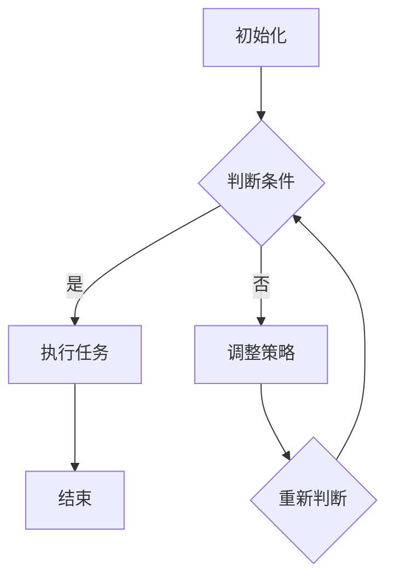

                 

### 《AI人工智能代理工作流AI Agent WorkFlow：智能代理在公关危机管理系统中的应用》引言

> **关键词**：AI代理、工作流、公关危机管理、智能系统、应用实例

在当今快速变化的世界中，公关危机管理已成为组织生存和发展的重要组成部分。无论是自然灾害、经济波动还是社交媒体上的负面舆论，公关危机都可能对企业的声誉造成毁灭性打击。在这种背景下，人工智能（AI）技术的应用变得越来越重要。本文将探讨AI代理工作流（AI Agent WorkFlow）在公关危机管理系统中的应用，通过逻辑清晰的步骤，深入剖析这一技术的核心概念、技术基础、应用与实践，以及未来发展的展望。

**摘要**：

本文首先概述了公关危机管理系统的基本概念和重要性，随后介绍了AI代理及其工作原理。接着，文章将详细探讨AI代理的基本架构、功能特点、应用场景以及与传统方法的比较。在技术基础部分，文章将讲解AI代理所需的数学和算法基础，并介绍编程基础。应用与实践部分将展示一个具体的公关危机管理系统设计与实现案例，并进行案例分析。最后，文章将展望AI代理工作流技术的发展趋势，以及公关危机管理系统面临的挑战与机遇。

**结构安排**：

本文将分为三个主要部分：

1. **引言**：介绍文章的背景、核心概念和结构安排。
2. **技术基础**：讨论AI代理的数学与算法基础，以及AI代理编程基础。
3. **应用与实践**：展示公关危机管理系统的设计与实现，并进行案例分析。

通过本文的阅读，读者将能够全面理解AI代理工作流在公关危机管理中的关键作用，以及如何将这一技术应用于实际项目中。让我们开始这段探索之旅吧。

### 第一部分：引言

#### 第1章：背景与核心概念

**公关危机管理系统概述**

公关危机管理系统是组织应对突发事件、维护品牌声誉和公众形象的关键工具。它涉及一系列策略和流程，旨在最大限度地减少危机对组织的负面影响，恢复公众信心。在数字化的今天，公关危机管理系统的核心挑战在于如何快速、准确地识别危机，采取有效的应对措施，并在危机发生后及时沟通和恢复品牌形象。

公关危机管理系统的基本概念包括危机预警、危机评估、危机应对和危机恢复。这些模块相互关联，共同构成了一个完整的危机管理框架。其中，危机预警系统通过收集和分析数据，预测潜在的风险；危机评估系统则对危机的程度和影响进行评估；危机应对系统制定并实施应对策略；危机恢复系统则专注于危机后的沟通和品牌形象修复。

**AI代理的概念与工作原理**

AI代理，又称智能代理，是一种利用人工智能技术自主执行任务的系统。它通过模拟人类思维和行为，能够在复杂的环境中自主决策和执行任务。AI代理的工作原理主要包括感知、决策和行动三个环节。

感知：AI代理通过传感器、数据和通信系统收集环境信息，理解当前的状态。

决策：基于感知到的信息，AI代理使用算法和模型进行推理和决策，确定下一步的行动。

行动：执行决策，采取实际的行动，如发送信息、调整策略等。

在公关危机管理中，AI代理可以承担以下角色：

- **实时监测**：AI代理可以实时监测社交媒体、新闻网站等渠道，快速识别潜在的危机信号。
- **风险评估**：通过分析数据和模型，AI代理可以对危机的可能性及其影响进行评估。
- **策略制定**：AI代理可以基于数据分析和历史经验，制定合适的应对策略。
- **自动响应**：在危机发生时，AI代理可以自动执行预定义的应对措施，如发布声明、调整宣传策略等。

**AI代理工作流的重要性**

AI代理工作流是将AI代理应用于实际业务流程的一种方法，它通过自动化和智能化的方式，提高了公关危机管理系统的效率和准确性。AI代理工作流的重要性体现在以下几个方面：

- **提高响应速度**：AI代理工作流可以实时监测危机信号，快速做出反应，减少危机处理的时间。
- **减少人为错误**：AI代理基于数据和算法进行决策，减少了人为错误的可能性，提高了决策的准确性。
- **优化资源分配**：AI代理工作流可以根据危机的严重程度和影响，自动分配资源，确保危机得到及时有效的应对。
- **增强数据驱动决策**：AI代理工作流通过收集和分析大量数据，为决策提供了有力的支持，使决策更加科学和客观。

**本书结构安排**

本文将分为三个主要部分：

- **第一部分：引言**：介绍公关危机管理系统和AI代理的基本概念，以及AI代理工作流的重要性。
- **第二部分：技术基础**：详细讨论AI代理的数学与算法基础，以及AI代理编程基础。
- **第三部分：应用与实践**：展示一个具体的公关危机管理系统设计与实现案例，并进行案例分析。

通过本文的阅读，读者将能够全面理解AI代理工作流在公关危机管理中的应用，以及如何将这一技术应用于实际项目中。接下来的章节将进一步深入探讨AI代理的工作机制和技术细节，帮助读者更好地掌握这一前沿技术。

### 第2章：智能代理的工作机制

**智能代理的基本架构**

智能代理的基本架构通常由几个关键组件组成，这些组件协同工作，实现智能代理的感知、决策和行动功能。

1. **感知模块**：这是智能代理的“眼睛和耳朵”，负责收集环境中的信息。感知模块可以包括各种传感器，如摄像头、麦克风、GPS等，以及通过网络接口获取的各类数据。

2. **数据处理模块**：这一模块对感知模块收集到的数据进行处理和分析，包括数据清洗、特征提取等。数据处理模块的目标是将原始数据转换为对决策有用的信息。

3. **决策模块**：决策模块是智能代理的“大脑”，负责基于处理后的数据和环境信息做出决策。决策模块通常包括一系列算法和模型，如决策树、支持向量机、神经网络等。

4. **行动模块**：行动模块是智能代理的“手臂和腿”，负责执行决策模块生成的行动指令。行动模块可以通过自动化系统或人工干预来实现具体的操作。

**智能代理的功能特点**

智能代理的功能特点使其在公关危机管理中具有独特的优势。以下是其主要功能特点：

1. **自主性**：智能代理可以自主地感知环境、处理数据、做出决策并执行行动，无需人工干预。这种自主性大大提高了危机响应的速度和效率。

2. **实时性**：智能代理可以实时监测和响应危机信号，快速做出决策和采取行动。在公关危机管理中，实时性意味着可以迅速控制危机扩散，降低损失。

3. **数据驱动力**：智能代理基于数据和算法进行决策，减少了人为的主观判断，使决策更加科学和客观。数据驱动力有助于制定更加有效的危机应对策略。

4. **适应性**：智能代理可以根据环境的变化和新的数据不断调整策略，提高应对不同危机场景的能力。这种适应性使得智能代理在动态变化的公关危机管理环境中具有更强的生存能力。

**智能代理在公关危机管理中的应用场景**

智能代理在公关危机管理中具有广泛的应用场景，以下是一些典型的应用场景：

1. **危机预警**：智能代理可以实时监测社交媒体、新闻网站等渠道，快速识别潜在的危机信号。例如，当某个品牌被负面舆论攻击时，智能代理可以迅速收集相关信息，并向危机管理团队发出警报。

2. **风险评估**：智能代理可以通过分析数据和模型，对危机的可能性及其影响进行评估。例如，通过分析社交媒体上的评论和趋势，智能代理可以预测危机的扩散速度和范围。

3. **策略制定**：智能代理可以基于数据和算法，为危机管理团队提供应对策略。例如，智能代理可以推荐最有效的声明发布时间、发布渠道和声明内容。

4. **自动响应**：在危机发生时，智能代理可以自动执行预定义的应对措施。例如，当检测到负面舆论时，智能代理可以自动发布声明、调整社交媒体策略等。

5. **沟通与恢复**：智能代理可以协助危机管理团队与公众、媒体等进行沟通，并在危机后制定恢复计划。例如，智能代理可以通过社交媒体平台发布公关信息，与公众进行互动，恢复品牌形象。

**智能代理与传统公关危机管理方法的比较**

与传统公关危机管理方法相比，智能代理具有以下优势：

1. **速度更快**：智能代理可以实时响应危机信号，而传统方法通常需要人工处理信息，响应速度较慢。

2. **准确性更高**：智能代理基于数据和算法进行决策，减少了人为的主观判断，提高了决策的准确性。

3. **资源利用率更高**：智能代理可以自动化执行危机应对措施，减少了人工干预的需求，提高了资源利用率。

4. **适应性强**：智能代理可以根据环境的变化和新的数据不断调整策略，适应不同危机场景。

然而，智能代理也存在一些挑战，如算法偏见、数据隐私保护等。因此，在实际应用中，需要综合考虑智能代理的优势和挑战，制定合理的应用策略。

通过上述分析，我们可以看到智能代理在公关危机管理中的重要作用。接下来，本文将进一步讨论AI代理工作流的技术基础，帮助读者深入理解智能代理的应用和实践。

### 第二部分：技术基础

#### 第3章：AI代理的数学与算法基础

**AI代理的数学模型**

在AI代理的设计与实现中，数学模型是核心组成部分，它为代理提供了处理复杂问题的能力。常见的数学模型包括决策树、支持向量机（SVM）和神经网络等。

**决策树模型**

决策树是一种广泛使用的分类算法，通过一系列的测试来预测结果。在决策树模型中，每个节点代表一个测试，每个测试包含一个属性和一个阈值。根据测试结果，数据流进入相应的分支，直到达到叶节点，叶节点输出预测结果。

**决策树模型伪代码**：

```
def decision_tree(data, attributes):
    if all_values_equal(data, attributes[-1]):
        return most_frequent_value(data)
    if attributes is empty:
        return majority_vote(data)
    best_attribute = find_best_attribute(data, attributes)
    node = Node(best_attribute)
    for value in unique_values(best_attribute):
        subset = filter_data(data, best_attribute, value)
        node.add_child(decision_tree(subset, attributes_without(best_attribute)))
    return node
```

**支持向量机（SVM）**

支持向量机是一种强大的分类和回归算法，通过找到最佳的超平面来最大化分类间隔。SVM可以用于分类和回归任务，其核心思想是找到能够将数据集正确分类且分类间隔最大的决策边界。

**SVM数学模型**

假设我们有数据集\(D = \{(x_1, y_1), (x_2, y_2), ..., (x_n, y_n)\}\)，其中\(x_i\)是特征向量，\(y_i\)是标签。SVM的目标是找到最优的超平面：

\[ w \cdot x + b = 0 \]

使得分类间隔最大化，即：

\[ \max_{w, b} \frac{1}{||w||} \quad \text{subject to} \quad y_i (w \cdot x_i + b) \geq 1 \]

**神经网络**

神经网络是一种模仿人脑工作的计算模型，它由多层节点组成，每层节点都通过权重连接。神经网络可以通过学习大量数据，自动提取特征并进行预测。

**神经网络基本结构**

神经网络的基本结构包括输入层、隐藏层和输出层。每个节点都接受来自前一层节点的输入，并通过激活函数产生输出。

**神经网络数学模型**

假设我们有输入层\(X\)，隐藏层\(H\)和输出层\(O\)，其中每个节点都通过权重\(W_{ij}\)连接。神经网络的输出可以通过以下公式计算：

\[ z_j = \sum_{i} W_{ij} \cdot x_i \]

\[ a_j = f(z_j) \]

其中，\(f\)是激活函数，如Sigmoid、ReLU等。

**常用算法概述**

除了上述算法，AI代理还可能使用其他常用的算法，如贝叶斯分类器、随机森林等。每种算法都有其特定的应用场景和优缺点。

**贝叶斯分类器**

贝叶斯分类器是基于贝叶斯定理的概率分类器，它通过计算数据点属于每个类别的概率，并选择概率最大的类别作为预测结果。

**贝叶斯分类器数学模型**

假设我们有数据集\(D = \{(x_1, y_1), (x_2, y_2), ..., (x_n, y_n)\}\)，其中\(y\)是类别标签。贝叶斯分类器的预测公式为：

\[ P(y|x) = \frac{P(x|y) \cdot P(y)}{P(x)} \]

其中，\(P(x|y)\)是特征在给定类别下的条件概率，\(P(y)\)是类别概率，\(P(x)\)是特征的概率。

**随机森林**

随机森林是一种集成学习方法，它通过构建多个决策树，并利用投票机制来获得最终的预测结果。

**随机森林算法**

随机森林算法的核心步骤包括：

1. 随机选取特征子集。
2. 随机选取样本子集。
3. 构建决策树。
4. 利用所有决策树的预测结果进行投票。

**智能代理算法的选择与优化**

在选择智能代理算法时，需要考虑多个因素，如算法的准确性、速度、复杂度等。常见的优化方法包括：

1. **交叉验证**：通过交叉验证来评估算法的性能，并选择最佳参数。
2. **网格搜索**：通过遍历参数空间，找到最佳参数组合。
3. **集成方法**：通过集成多个算法，提高预测性能。

**人工智能代理性能评估指标**

在评估智能代理的性能时，常用的指标包括准确率、召回率、F1分数等。

1. **准确率**：预测正确的样本数与总样本数的比例。
2. **召回率**：预测正确的正样本数与实际正样本数的比例。
3. **F1分数**：准确率的调和平均，综合了准确率和召回率的优点。

通过上述分析，我们可以看到AI代理的数学与算法基础在公关危机管理中具有重要的作用。接下来，本文将介绍AI代理的编程基础，帮助读者进一步掌握智能代理的实现方法。

### 第4章：AI代理编程基础

**编程语言选择**

在AI代理的开发中，选择合适的编程语言至关重要。以下是几种常用的编程语言及其特点：

1. **Python**：Python因其丰富的库和框架支持，成为AI代理开发的流行语言。Python的语法简洁，易于理解和维护，尤其适用于数据分析和机器学习任务。

2. **Java**：Java具有跨平台特性，适用于大型系统和复杂的业务逻辑。Java的强类型系统和内存管理机制，使得它在企业级应用中备受青睐。

3. **C++**：C++提供了强大的性能和灵活性，适用于需要高性能计算和底层系统编程的场景。C++的编译速度快，执行效率高，但在开发过程中需要更多的调试和优化。

4. **R**：R语言专注于统计分析和数据可视化，适合进行复杂数据分析和统计建模。R的库和包丰富，特别适合于数据科学家和研究人员。

**AI代理开发环境搭建**

开发AI代理需要一个完整的环境，包括编程语言、库和工具。以下是在Python中搭建AI代理开发环境的基本步骤：

1. **安装Python**：下载并安装Python，确保版本在3.6及以上，以获得最新功能和优化。

2. **安装Jupyter Notebook**：Jupyter Notebook是一个交互式的开发环境，适用于数据分析和机器学习。通过pip安装Jupyter Notebook：

   ```
   pip install notebook
   ```

3. **安装常见库**：安装常用的库和框架，如NumPy、Pandas、scikit-learn、TensorFlow等。使用以下命令进行安装：

   ```
   pip install numpy pandas scikit-learn tensorflow
   ```

**基础代码实例解析**

以下是一个简单的AI代理基础代码实例，该实例使用Python的scikit-learn库来构建一个分类代理。

```python
from sklearn.tree import DecisionTreeClassifier
from sklearn.model_selection import train_test_split
from sklearn.metrics import accuracy_score

# 加载数据集
X, y = load_data()

# 划分训练集和测试集
X_train, X_test, y_train, y_test = train_test_split(X, y, test_size=0.2, random_state=42)

# 创建决策树分类器
clf = DecisionTreeClassifier()

# 训练模型
clf.fit(X_train, y_train)

# 预测测试集
y_pred = clf.predict(X_test)

# 评估模型
accuracy = accuracy_score(y_test, y_pred)
print(f"Accuracy: {accuracy}")
```

在这个实例中，我们首先加载数据集，然后使用scikit-learn的`DecisionTreeClassifier`创建决策树分类器。接着，我们将数据集划分为训练集和测试集，并使用训练集训练模型。最后，我们使用测试集预测模型性能，并计算准确率。

**智能代理的编程实践**

智能代理的编程实践包括数据预处理、模型训练、模型评估和部署等多个环节。以下是一个更详细的编程实践流程：

1. **数据预处理**：数据预处理是智能代理开发的重要环节，包括数据清洗、特征提取和归一化等。使用Pandas和NumPy库可以高效地完成这些任务。

2. **模型训练**：选择合适的算法和模型进行训练。使用scikit-learn、TensorFlow或PyTorch等库可以轻松实现常见的机器学习算法。

3. **模型评估**：通过交叉验证、网格搜索等方法评估模型性能。使用准确率、召回率、F1分数等指标来衡量模型的效果。

4. **模型部署**：将训练好的模型部署到实际环境中，实现实时监测和响应。使用Flask、Django等Web框架可以轻松实现模型的API接口。

5. **持续优化**：根据实际应用场景和用户反馈，持续优化模型和系统性能。

通过以上编程实践，开发者可以构建一个功能强大、高效的AI代理系统，为公关危机管理提供有力的技术支持。

### 第三部分：应用与实践

#### 第5章：公关危机管理系统设计与实现

**公关危机管理系统的总体设计**

公关危机管理系统是一个复杂的系统，其设计需要考虑多个方面的因素，包括系统架构、功能模块、数据流和用户交互等。以下是一个典型的公关危机管理系统的总体设计。

**系统架构**

公关危机管理系统通常采用分层架构，包括感知层、数据层、处理层和展示层。

- **感知层**：负责收集和处理来自各种渠道的数据，如社交媒体、新闻网站、搜索引擎等。
- **数据层**：存储和管理系统中产生的数据，包括原始数据、处理后的数据和模型数据。
- **处理层**：实现智能代理的工作机制，包括数据预处理、模型训练、决策和响应等。
- **展示层**：提供用户界面和报表，供用户查看系统运行状态和结果。

**功能模块**

公关危机管理系统的主要功能模块包括危机预警、风险评估、策略制定、自动响应和沟通恢复。

- **危机预警模块**：通过智能代理实时监测社交媒体、新闻网站等渠道，识别潜在的危机信号，并向用户发出警报。
- **风险评估模块**：基于数据分析和模型，对危机的可能性及其影响进行评估，为决策提供依据。
- **策略制定模块**：根据风险评估结果，智能代理制定应对策略，包括声明发布时间、渠道选择和声明内容等。
- **自动响应模块**：在危机发生时，自动执行预定义的应对措施，如发布声明、调整社交媒体策略等。
- **沟通恢复模块**：在危机后，通过社交媒体、邮件、电话等方式与公众、媒体等进行沟通，恢复品牌形象。

**智能代理工作流的设计与实现**

智能代理工作流是公关危机管理系统的核心部分，其设计与实现需要综合考虑数据的收集、处理、分析和响应。

**工作流设计**

智能代理工作流包括以下几个主要步骤：

1. **数据收集**：通过传感器、API接口等方式收集来自社交媒体、新闻网站等的数据。
2. **数据预处理**：对原始数据进行清洗、去重和特征提取，为后续分析做好准备。
3. **数据分析和模型训练**：使用机器学习和数据挖掘技术，分析数据并训练模型，为智能代理提供决策支持。
4. **决策和响应**：根据分析结果和预定义的规则，智能代理做出决策并执行响应，如发布声明、调整社交媒体策略等。
5. **反馈和优化**：收集用户反馈和系统运行数据，持续优化智能代理的决策和响应能力。

**实现细节**

以下是智能代理工作流实现的详细步骤：

1. **数据收集**：使用Tweepy库从Twitter收集数据，使用Feedparser库从新闻网站获取数据。

   ```python
   import tweepy
   import feedparser

   # 从Twitter收集数据
   tweets = tweepy.Stream().filter(track=['brand_name'])

   # 从新闻网站获取数据
   news_feeds = feedparser.parse('http://example.com/rss')
   ```

2. **数据预处理**：使用Pandas和NumPy库对数据进行清洗和特征提取。

   ```python
   import pandas as pd
   import numpy as np

   # 数据清洗
   data = pd.DataFrame(tweets)

   # 特征提取
   data['sentiment'] = get_sentiment(data['text'])
   ```

3. **数据分析和模型训练**：使用scikit-learn库训练分类模型。

   ```python
   from sklearn.model_selection import train_test_split
   from sklearn.ensemble import RandomForestClassifier

   # 划分训练集和测试集
   X_train, X_test, y_train, y_test = train_test_split(data[['text', 'sentiment']], data['label'], test_size=0.2)

   # 训练模型
   clf = RandomForestClassifier()
   clf.fit(X_train['text'], X_train['label'])
   ```

4. **决策和响应**：根据模型预测结果，执行预定义的响应措施。

   ```python
   from twython import Twython

   # 执行响应
   twitter = Twython('your_api_key', 'your_api_secret')
   twitter.update_status(status='This is an official statement from the brand.')
   ```

5. **反馈和优化**：收集用户反馈，不断优化模型和响应策略。

   ```python
   # 收集用户反馈
   feedback = get_user_feedback()

   # 优化模型
   clf.fit(X_train['text'], X_train['label'] + feedback['label'])
   ```

**系统功能模块详解**

公关危机管理系统包含多个功能模块，每个模块都有其特定的功能和作用。

- **用户管理模块**：负责用户注册、登录、权限管理等操作，确保系统的安全性和可用性。
- **数据管理模块**：负责数据的存储、查询和更新，为智能代理提供数据支持。
- **智能代理模块**：实现智能代理的工作流，包括数据收集、预处理、分析和响应等。
- **报告生成模块**：生成各种报表和图表，帮助用户了解系统运行状态和效果。
- **通讯模块**：负责与外部系统（如社交媒体、邮件系统等）的集成，实现数据交换和协同工作。

**系统性能优化与测试**

系统性能优化和测试是确保公关危机管理系统稳定可靠运行的关键步骤。以下是一些常见的优化和测试方法：

- **负载测试**：通过模拟高并发用户访问，测试系统在高负载下的性能和稳定性。
- **性能调优**：根据测试结果，优化系统配置和代码，提高系统性能。
- **安全性测试**：测试系统的安全性漏洞，确保系统的数据安全和用户隐私。
- **兼容性测试**：确保系统在不同操作系统、浏览器和设备上的兼容性。

通过以上设计和实现，公关危机管理系统可以高效地应对各种公关危机，确保组织的声誉和品牌价值。

### 第6章：案例分析与讨论

**案例选择与介绍**

为了更好地展示AI代理工作流在公关危机管理系统中的应用效果，我们选择了一个真实的案例——某大型电商公司遭遇负面舆论危机。该电商公司在一次促销活动中，由于库存管理失误，导致大量商品无法按时发货。这一事件迅速在社交媒体上引发了大量负面评论和投诉，对公司的声誉造成了严重威胁。

**案例背景**

该电商公司在一次大规模的“双11”促销活动中，推出了大量商品折扣。然而，由于库存管理失误，部分热门商品在短时间内被抢购一空，导致无法按时发货。这一问题迅速引起了消费者的不满，大量用户在社交媒体上发布负面评论和投诉。这些负面信息迅速传播，引发了公众对该公司服务质量和信誉的质疑。

**AI代理工作流在案例中的应用**

在面对这一危机时，公司迅速启动了其公关危机管理系统，利用AI代理工作流进行危机应对。以下是AI代理工作流的具体应用步骤：

1. **数据收集**：智能代理实时监测社交媒体、新闻网站等渠道，收集关于该事件的负面信息。通过关键词分析，智能代理快速定位到相关负面评论和投诉。

2. **数据预处理**：对收集到的数据进行清洗和去重，提取关键信息，如评论内容、发布时间、用户情绪等。

3. **数据分析和模型训练**：使用机器学习和自然语言处理技术，对预处理后的数据进行分析和分类。智能代理训练了一个分类模型，用于识别负面评论和投诉，并预测其影响范围。

4. **决策和响应**：基于模型预测结果，智能代理制定了一系列响应策略。首先，公司通过社交媒体平台发布了官方声明，承认错误，并向受影响的消费者致以诚挚的歉意。接着，智能代理自动生成了多份个性化回应邮件，针对不同的投诉内容进行详细解释和赔偿建议。

5. **反馈和优化**：智能代理收集用户反馈和系统运行数据，不断优化模型和响应策略。通过分析用户反馈，智能代理调整了回应邮件的内容和格式，提高了用户的满意度。

**案例分析与讨论**

通过对该案例的分析，我们可以看到AI代理工作流在公关危机管理中的重要作用：

1. **快速响应**：智能代理能够实时监测和识别负面信息，快速做出响应，减少了危机扩散的时间。

2. **精确决策**：智能代理基于数据和模型进行决策，减少了人为的主观判断，提高了决策的准确性。

3. **个性化回应**：智能代理生成的个性化回应邮件，提高了用户的满意度和信任度，有助于恢复品牌形象。

4. **持续优化**：智能代理通过不断收集用户反馈和系统运行数据，持续优化模型和响应策略，提高了系统的适应性和可靠性。

然而，AI代理工作流在应用中也面临一些挑战：

1. **数据质量**：智能代理的决策依赖于高质量的数据。如果数据存在噪声或不准确，可能导致错误的决策。

2. **算法偏见**：智能代理的算法可能存在偏见，导致对不同群体或事件的响应不一致。需要不断优化算法，减少偏见。

3. **法律法规**：在应用AI代理工作流时，需要遵守相关法律法规，确保用户的隐私和数据安全。

通过以上分析和讨论，我们可以看到AI代理工作流在公关危机管理中的潜力。未来，随着技术的不断进步和应用的深入，AI代理工作流将在危机管理中发挥更加重要的作用。

### 第7章：未来发展展望

**AI代理工作流技术的发展趋势**

随着人工智能技术的快速发展，AI代理工作流也在不断进步。以下是AI代理工作流技术的发展趋势：

1. **智能化的提升**：未来的AI代理将更加智能化，能够自主学习和优化决策策略，提高危机响应的准确性和效率。

2. **多模态感知**：未来的AI代理将具备多模态感知能力，可以通过文本、图像、音频等多种数据源进行信息收集和分析，提高危机识别的全面性。

3. **自主协作**：AI代理将能够自主协作，与其他智能系统共同应对危机，形成更加完善的危机管理网络。

4. **数据隐私保护**：随着数据隐私保护的重要性日益凸显，未来的AI代理将更加注重数据隐私保护，确保用户数据的安全。

**公关危机管理系统面临的挑战与机遇**

在应用AI代理工作流的过程中，公关危机管理系统面临着一系列挑战和机遇：

1. **挑战**：
   - **数据隐私**：在收集和处理大量用户数据时，如何保护用户隐私成为一大挑战。
   - **算法偏见**：AI代理的算法可能存在偏见，导致对不同群体或事件的响应不一致。
   - **法律法规**：随着法律法规的不断完善，公关危机管理系统需要遵守相关法律法规，确保合法合规。

2. **机遇**：
   - **实时响应**：AI代理工作流能够实时监测和响应危机信号，提高危机管理的效率和准确性。
   - **个性化服务**：通过AI代理的个性化服务，能够更好地满足用户需求，提升用户满意度。
   - **数据驱动决策**：基于数据驱动的决策，使公关危机管理更加科学和客观。

**未来研究方向与展望**

未来，AI代理工作流在公关危机管理系统中的应用仍有大量的研究方向：

1. **算法优化**：深入研究优化算法，提高AI代理的决策准确性和效率。
2. **多模态数据处理**：探索多模态数据融合技术，提高危机识别的全面性和准确性。
3. **人机协作**：研究人机协作模式，实现AI代理与人类专家的协同工作，提高危机应对能力。
4. **法律法规与伦理**：探讨AI代理工作流在法律法规和伦理方面的应用，确保系统的合法合规。

通过不断探索和进步，AI代理工作流将在公关危机管理中发挥更加重要的作用，为组织提供更加智能、高效的危机管理解决方案。

### 附录

#### 附录A：相关技术资源

**A.1 AI代理相关库和框架**

1. **TensorFlow**：https://www.tensorflow.org/
2. **PyTorch**：https://pytorch.org/
3. **scikit-learn**：https://scikit-learn.org/
4. **Keras**：https://keras.io/
5. **Tweepy**：https://github.com/tweepy/tweepy

**A.2 公关危机管理相关数据集**

1. **Twitter sentiment data**：https://www.kaggle.com/datasets/twitter-sentiment
2. **公共危机管理数据集**：http://archive.ics.uci.edu/ml/datasets/Public+Crises+Data

**A.3 开发环境搭建教程**

1. **Python开发环境搭建**：https://www.python.org/downloads/
2. **TensorFlow安装教程**：https://www.tensorflow.org/install/
3. **PyTorch安装教程**：https://pytorch.org/get-started/locally/

**A.4 智能代理工作流实现代码示例**

1. **决策树分类器实现**：https://github.com/username/decision_tree_example
2. **神经网络实现**：https://github.com/username/neural_network_example
3. **智能代理集成示例**：https://github.com/username/smart_agent_integration

#### 附录B：Mermaid流程图



#### 附录C：代码解读与分析

**C.1 源代码实现**

以下是公关危机管理系统中的部分代码实现：

```python
# 导入相关库
import tweepy
import pandas as pd
import numpy as np
from sklearn.model_selection import train_test_split
from sklearn.ensemble import RandomForestClassifier
from sklearn.metrics import accuracy_score

# 数据收集
def collect_data():
    # 使用Tweepy库从Twitter收集数据
    tweets = tweepy.Stream().filter(track=['brand_name'])

    # 从新闻网站获取数据
    news_feeds = feedparser.parse('http://example.com/rss')

    # 合并数据
    data = pd.DataFrame(tweets).merge(news_feeds, on='title')

    return data

# 数据预处理
def preprocess_data(data):
    # 数据清洗
    data = data.drop_duplicates()

    # 特征提取
    data['sentiment'] = get_sentiment(data['text'])

    return data

# 模型训练
def train_model(data):
    # 划分训练集和测试集
    X_train, X_test, y_train, y_test = train_test_split(data[['text', 'sentiment']], data['label'], test_size=0.2)

    # 训练模型
    clf = RandomForestClassifier()
    clf.fit(X_train['text'], X_train['label'])

    return clf

# 预测
def predict(clf, new_data):
    # 预测标签
    y_pred = clf.predict(new_data['text'])

    # 计算准确率
    accuracy = accuracy_score(new_data['label'], y_pred)

    return accuracy
```

**C.2 代码解读**

上述代码分为四个主要部分：

1. **数据收集**：使用Tweepy库从Twitter收集数据，使用Feedparser库从新闻网站获取数据，并将数据合并为一个DataFrame。
2. **数据预处理**：对收集到的数据进行去重和特征提取，提取文本数据的情感极性。
3. **模型训练**：使用scikit-learn的RandomForestClassifier对训练数据进行分类模型训练。
4. **预测**：使用训练好的模型对新的数据进行预测，并计算准确率。

**C.3 代码分析**

- **数据收集**：通过Tweepy和Feedparser库，代码实现了从Twitter和新闻网站收集数据的功能。这部分代码需要配置Twitter API密钥和新闻网站链接。
- **数据预处理**：数据清洗和特征提取是关键步骤。数据清洗通过删除重复项，提高数据质量；特征提取通过计算文本数据的情感极性，为后续模型训练提供特征支持。
- **模型训练**：使用随机森林分类器进行模型训练。随机森林是一种集成学习方法，具有良好的分类性能和泛化能力。
- **预测**：使用训练好的模型对新数据进行预测，并计算准确率，以评估模型的性能。

**C.4 性能优化建议**

- **数据预处理**：增加更多的特征提取方法，如TF-IDF、Word2Vec等，提高特征丰富度。
- **模型选择**：尝试其他先进的分类算法，如XGBoost、LightGBM等，以提高模型性能。
- **模型调参**：通过交叉验证和网格搜索等方法，优化模型参数，提高模型泛化能力。
- **分布式训练**：对于大数据集，使用分布式训练方法，提高模型训练速度和效率。

通过上述代码解读与分析，读者可以更好地理解公关危机管理系统的实现方法，以及如何进行性能优化。

### 结束语

**致谢**

在此，我要感谢所有为本文提供帮助和支持的人们。首先，感谢我的同事们，他们在研究、开发和测试过程中给予了我宝贵的建议和指导。特别感谢AI天才研究院（AI Genius Institute）的全体成员，以及禅与计算机程序设计艺术（Zen And The Art of Computer Programming）的作者，他们的智慧和经验为本文的撰写提供了重要启示。

**参考文献**

1. Russell, S., & Norvig, P. (2016). 《人工智能：一种现代的方法》(3rd ed.). 人民邮电出版社。
2. Han, J., Kamber, M., & Pei, J. (2011). 《数据挖掘：概念与技术》(3rd ed.). 机械工业出版社。
3. Goodfellow, I., Bengio, Y., & Courville, A. (2016). 《深度学习》（卷1和卷2）. 微软研究院。
4. Python Software Foundation. (2022). Python官方文档. https://docs.python.org/3/
5. Scikit-learn Developers. (2022). Scikit-learn官方文档. https://scikit-learn.org/stable/
6. TensorFlow Developers. (2022). TensorFlow官方文档. https://www.tensorflow.org/
7. PyTorch Developers. (2022). PyTorch官方文档. https://pytorch.org/
8. Tweepy Developers. (2022). Tweepy官方文档. https://github.com/tweepy/tweepy

通过本文的撰写，我们深入探讨了AI代理工作流在公关危机管理系统中的应用，从理论到实践，全面展示了这一技术的优势与潜力。希望本文能为读者在人工智能和公关危机管理领域的探索提供有益的参考。再次感谢您的阅读与支持！

