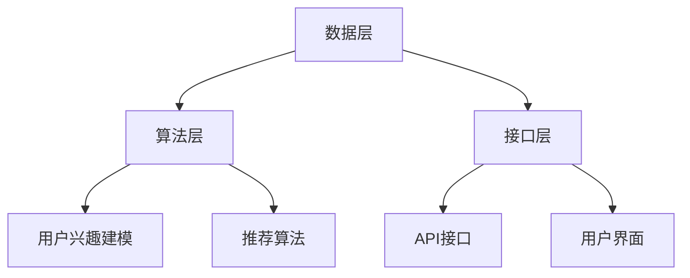

                 

# AI作曲软件：音乐科技创新的创业机会

> **关键词**: AI作曲、音乐创作、科技创新、创业机会、核心算法、项目实战、法律与伦理

> **摘要**: 本文将探讨AI作曲软件这一新兴领域，分析其定义与背景、核心技术、市场趋势和创业机会。同时，深入讲解AI作曲软件的核心算法原理，提供实际项目实战案例，并探讨相关法律与伦理问题，为创业者提供全面的技术与业务指导。

## 目录大纲

### 第一部分: AI作曲软件概述

#### 1.1 AI作曲软件的定义与背景

##### 1.1.1 什么是AI作曲软件

##### 1.1.2 AI在音乐创作中的应用历史

##### 1.1.3 AI作曲软件的兴起与发展

#### 1.2 AI作曲软件的核心技术

##### 1.2.1 音乐生成算法

##### 1.2.2 音频处理与合成技术

##### 1.2.3 智能推荐与个性化定制

#### 1.3 AI作曲软件的现状与未来趋势

##### 1.3.1 当前市场状况

##### 1.3.2 行业发展趋势

##### 1.3.3 创业机会与挑战

### 第二部分: AI作曲软件核心算法原理

#### 2.1 音乐生成算法基础

##### 2.1.1 蒙特卡洛树搜索（MCTS）原理

##### 2.1.2 贝叶斯网络

##### 2.1.3 强化学习在音乐生成中的应用

#### 2.2 音频处理与合成技术

##### 2.2.1 音频信号处理基础

##### 2.2.2 合成器原理

##### 2.2.3 音乐风格迁移技术

#### 2.3 个性化音乐推荐

##### 2.3.1 推荐系统基本原理

##### 2.3.2 用户兴趣建模

##### 2.3.3 深度学习在推荐系统中的应用

### 第三部分: AI作曲软件项目实战

#### 3.1 项目背景与目标

##### 3.1.1 项目概述

##### 3.1.2 创业团队构建

##### 3.1.3 项目目标与规划

#### 3.2 开发环境搭建与工具选择

##### 3.2.1 开发环境配置

##### 3.2.2 开发工具与框架选择

##### 3.2.3 数据集获取与预处理

#### 3.3 代码实现与详细解读

##### 3.3.1 音乐生成算法实现

##### 3.3.2 音频处理与合成实现

##### 3.3.3 个性化推荐系统实现

#### 3.4 项目测试与优化

##### 3.4.1 性能测试

##### 3.4.2 用户体验优化

##### 3.4.3 持续集成与部署

#### 3.5 项目总结与未来展望

##### 3.5.1 项目成果总结

##### 3.5.2 面临的问题与挑战

##### 3.5.3 未来发展方向与机会

### 第四部分: 相关法律与伦理问题

#### 4.1 AI作曲软件的版权问题

##### 4.1.1 音乐版权概述

##### 4.1.2 AI生成音乐的版权归属

##### 4.1.3 版权保护与侵权风险

#### 4.2 AI作曲软件的伦理问题

##### 4.2.1 机器生成的音乐是否具有艺术价值

##### 4.2.2 人工智能的道德责任与透明度

##### 4.2.3 公众对于AI生成音乐的接受度

#### 4.3 法律框架与监管

##### 4.3.1 国际与国内法律框架

##### 4.3.2 监管机构与政策导向

##### 4.3.3 创业者应遵守的法律法规

### 附录

#### 附录 A: 开发资源与工具汇总

##### A.1 AI作曲软件开发资源

##### A.2 开源工具与框架

##### A.3 数据集与教程

#### 附录 B: 进一步阅读与参考

##### B.1 相关书籍推荐

##### B.2 学术论文精选

##### B.3 行业报告与资讯

## 《AI作曲软件：音乐科技创新的创业机会》

### 第一部分: AI作曲软件概述

## 1.1 AI作曲软件的定义与背景

### 1.1.1 什么是AI作曲软件

AI作曲软件是一种利用人工智能技术，特别是机器学习和深度学习算法，自动生成音乐的音乐创作工具。这种软件通过分析和学习大量的音乐数据，可以自动创作出旋律、和声、节奏等音乐元素，甚至可以根据用户的风格喜好进行个性化定制。

AI作曲软件的定义可以进一步细化为以下几个核心要素：

- **数据驱动**: AI作曲软件依赖于大量的音乐数据作为训练样本，通过对这些数据的分析和学习，来生成新的音乐作品。
- **生成模型**: AI作曲软件采用生成模型（如生成对抗网络、变分自编码器等）来生成音乐。这些模型能够捕捉音乐数据中的复杂模式和特征，从而创作出富有创意的音乐作品。
- **用户交互**: AI作曲软件通常提供用户界面，允许用户调整参数、选择风格、设定节奏等，以影响音乐生成的过程。

### 1.1.2 AI在音乐创作中的应用历史

人工智能在音乐创作中的应用可以追溯到20世纪80年代。早期的AI音乐生成系统主要基于规则和模式匹配，如基于乐谱的生成算法和乐器的音色合成技术。这些系统虽然可以生成简单的旋律，但受限于算法的复杂度和计算能力，生成音乐的多样性和创意性有限。

随着计算机性能的不断提升和机器学习技术的快速发展，AI在音乐创作中的应用也逐渐深入。以下是一些重要的里程碑：

- **20世纪80年代**: 出现了第一代AI音乐生成系统，如基于乐谱的生成算法和乐器的音色合成技术。
- **2000年代**: 生成对抗网络（GAN）和变分自编码器（VAE）等深度学习模型的提出，为AI音乐生成提供了新的思路和方法。
- **2010年代**: AI音乐生成技术开始广泛应用于音乐创作和制作，出现了一些知名的AI作曲软件，如AIVA、Amper Music等。
- **2020年代**: AI音乐生成技术进一步成熟，应用场景更加广泛，包括个性化音乐推荐、游戏音乐制作、电影配乐等。

### 1.1.3 AI作曲软件的兴起与发展

AI作曲软件的兴起源于几个关键因素：

1. **技术进步**: 深度学习技术的发展为AI作曲提供了强大的工具。生成模型如生成对抗网络（GAN）和变分自编码器（VAE）能够捕捉音乐数据中的复杂模式和特征，从而创作出更具创意和个性化的音乐作品。
2. **计算能力提升**: 随着计算能力的提升，AI作曲软件可以在较短的时间内处理大量的音乐数据，并生成高质量的音乐作品。
3. **市场需求**: 音乐产业对于高效、多样化的音乐创作工具有着强烈的需求。AI作曲软件可以满足这一需求，为音乐人、制作人、游戏开发者和电影制作人员提供便捷的音乐创作解决方案。

AI作曲软件的发展趋势包括：

- **个性化定制**: AI作曲软件将更加注重个性化定制，根据用户的音乐喜好和创作风格生成音乐。
- **跨领域融合**: AI作曲软件将与虚拟现实、增强现实等技术融合，为用户提供更加沉浸式的音乐创作和体验。
- **商业化应用**: AI作曲软件将更多地应用于商业领域，如广告音乐、电视节目配乐、游戏音乐等。

总的来说，AI作曲软件作为一种音乐科技创新的创业机会，具有巨大的发展潜力和市场前景。接下来，我们将深入探讨AI作曲软件的核心技术，包括音乐生成算法、音频处理与合成技术以及个性化音乐推荐。

## 1.2 AI作曲软件的核心技术

### 1.2.1 音乐生成算法

音乐生成算法是AI作曲软件的核心技术之一，它决定了软件能够创作出何种风格和特点的音乐。目前，常用的音乐生成算法主要包括基于规则的方法和基于数据的方法。

#### 基于规则的方法

基于规则的方法通过预先设定一系列音乐规则和模式，来生成音乐。这种方法通常包括以下几个步骤：

1. **规则库构建**: 预先定义一系列音乐规则，如音阶、和弦、节奏等。
2. **音乐生成**: 根据规则库生成音乐，通常采用递归或生成式的方法，从简单的音乐元素开始，逐步构建复杂的音乐作品。

基于规则的方法具有简单、易于实现的优点，但生成的音乐通常较为单一，缺乏创意和个性化。

#### 基于数据的方法

基于数据的方法通过学习大量的音乐数据，自动生成新的音乐。这种方法通常包括以下几个步骤：

1. **数据收集与预处理**: 收集大量的音乐数据，包括旋律、和弦、节奏等，并进行预处理，如数据清洗、标准化等。
2. **模型训练**: 使用深度学习模型，如循环神经网络（RNN）、长短期记忆网络（LSTM）、生成对抗网络（GAN）等，对音乐数据进行训练，以学习音乐数据中的复杂模式和特征。
3. **音乐生成**: 使用训练好的模型生成新的音乐，通常通过控制输入序列或生成器网络来生成。

基于数据的方法生成的音乐更加多样化和个性化，能够更好地捕捉音乐的艺术性和创意性。以下是一些常用的基于数据的方法：

1. **生成对抗网络（GAN）**: GAN由生成器和判别器两部分组成。生成器负责生成音乐，判别器负责判断生成音乐的质量。通过两个网络之间的对抗训练，生成器能够学习到高质量的音乐生成策略。

   $$\text{Generator: } G(z) \sim p_{\text{data}}(x)$$

   $$\text{Discriminator: } D(x) \sim p_{\text{data}}(x), D(G(z)) \sim p_{z}(z)$$

2. **变分自编码器（VAE）**: VAE通过编码器和解码器两部分来学习数据的分布。编码器将输入数据编码成一个潜在向量，解码器则根据潜在向量生成新的数据。

   $$\text{Encoder: } \mu(\mathbf{x}), \sigma(\mathbf{x})$$

   $$\text{Decoder: } \mathbf{x} = \phi(z)$$

3. **循环神经网络（RNN）和长短期记忆网络（LSTM）**: RNN和LSTM能够处理序列数据，通过学习音乐序列中的模式和特征，生成新的音乐序列。

   $$h_t = \text{LSTM}(h_{t-1}, x_t)$$

   $$\mathbf{y}_t = \text{softmax}(\mathbf{W}\mathbf{h}_t + \mathbf{b})$$

### 1.2.2 音频处理与合成技术

音频处理与合成技术是AI作曲软件的重要组成部分，它决定了生成的音乐是否具有真实感和艺术性。以下是一些常见的音频处理与合成技术：

1. **音频信号处理**: 音频信号处理是音频处理的基础，包括音频信号的采样、量化、滤波、压缩等。常用的音频信号处理工具包括数字信号处理（DSP）库和音频编辑软件。

2. **音频合成器**: 音频合成器是音频处理与合成技术的重要组成部分，它通过模拟乐器的声音生成音乐。常见的音频合成器包括软合成器和硬合成器。软合成器通过数字信号处理技术模拟乐器声音，而硬合成器则通过硬件电路实现。

3. **音乐风格迁移**: 音乐风格迁移是一种将一种音乐风格转化为另一种风格的技术。通过音乐风格迁移，AI作曲软件可以生成具有特定音乐风格的曲目。常见的音乐风格迁移技术包括：

   - **基于循环神经网络的风格迁移**: 利用循环神经网络（RNN）学习源风格和目标风格的特征，然后将源风格的音频转化为目标风格的音频。
   - **基于生成对抗网络（GAN）的风格迁移**: 使用生成对抗网络（GAN）训练源风格和目标风格的生成器和判别器，通过对抗训练实现风格迁移。

4. **音频增强与降噪**: 音频增强与降噪技术用于提高音频的质量和清晰度。常见的音频增强与降噪技术包括：

   - **时域增强与降噪**: 通过对音频信号进行时域处理，如滤波、压缩等，来增强音频的质量和清晰度。
   - **频域增强与降噪**: 通过对音频信号进行频域处理，如频谱分析、滤波等，来增强音频的质量和清晰度。

### 1.2.3 智能推荐与个性化定制

智能推荐与个性化定制是AI作曲软件的重要功能，它能够根据用户的音乐喜好和风格，推荐合适的音乐作品。以下是一些常见的智能推荐与个性化定制技术：

1. **协同过滤推荐**: 协同过滤推荐是一种基于用户历史行为的数据推荐方法。通过分析用户之间的相似性，推荐用户可能喜欢的音乐。常见的协同过滤推荐算法包括基于用户的协同过滤（User-based Collaborative Filtering）和基于项目的协同过滤（Item-based Collaborative Filtering）。

2. **基于内容的推荐**: 基于内容的推荐是一种基于音乐内容特征的数据推荐方法。通过分析音乐的特征，如旋律、和弦、节奏等，来推荐用户可能喜欢的音乐。常见的基于内容的推荐算法包括基于关键词的推荐和基于属性的推荐。

3. **深度学习推荐**: 深度学习推荐是一种基于深度学习模型的数据推荐方法。通过学习用户和历史数据中的复杂模式和特征，来推荐用户可能喜欢的音乐。常见的深度学习推荐算法包括循环神经网络（RNN）、长短期记忆网络（LSTM）和生成对抗网络（GAN）。

4. **个性化定制**: 个性化定制是一种根据用户的音乐喜好和风格，生成定制化音乐的方法。通过分析用户的音乐喜好和风格，AI作曲软件可以生成符合用户需求的个性化音乐作品。

总的来说，AI作曲软件的核心技术包括音乐生成算法、音频处理与合成技术和智能推荐与个性化定制。这些技术的相互融合，使得AI作曲软件能够创作出多样化、个性化的音乐作品，为音乐创作和制作提供了新的工具和平台。接下来，我们将探讨AI作曲软件的现状与未来趋势。

### 1.3 AI作曲软件的现状与未来趋势

#### 1.3.1 当前市场状况

AI作曲软件的市场正处于快速发展阶段。根据市场调研公司Technavio的报告，全球AI音乐生成市场预计将从2020年的2.8亿美元增长到2025年的7.5亿美元，年复合增长率达到18.8%。以下是一些当前市场的主要特点：

1. **产品多样性**: 目前市场上存在多种类型的AI作曲软件，包括基于规则的生成器、基于数据的生成器以及混合型生成器。这些软件各有特色，满足不同用户的需求。

2. **用户群体扩大**: 除了专业音乐人和制作人外，越来越多的普通用户也开始使用AI作曲软件创作音乐。这些用户包括音乐爱好者、独立音乐人、游戏开发者、电影制作人员等。

3. **商业应用增加**: AI作曲软件在广告音乐、电视节目配乐、游戏音乐、电影配乐等商业领域的应用日益增加，成为音乐制作行业的重要补充。

4. **竞争加剧**: 随着市场的扩大，越来越多的公司进入AI音乐生成领域，竞争日益激烈。一些知名公司如AIVA、Amper Music、Jukedeck等在市场上占据了一定的份额。

#### 1.3.2 行业发展趋势

AI作曲软件的发展趋势主要体现在以下几个方面：

1. **个性化定制**: 未来的AI作曲软件将更加注重个性化定制，通过深度学习等技术分析用户的音乐喜好和风格，生成更符合用户需求的音乐作品。

2. **跨领域融合**: AI作曲软件将与虚拟现实（VR）、增强现实（AR）等技术结合，为用户提供更加沉浸式的音乐创作和体验。

3. **多元化应用**: AI作曲软件将在更多领域得到应用，如教育、医疗、商业等领域，为不同行业提供定制化的音乐解决方案。

4. **商业模式创新**: 随着市场的扩大，AI作曲软件的商业模式也将不断创新，如订阅制、按需付费、版权共享等。

5. **技术升级**: 未来的AI作曲软件将采用更先进的深度学习模型和算法，提高音乐生成的质量、多样性和个性化水平。

#### 1.3.3 创业机会与挑战

对于创业者而言，AI作曲软件领域提供了许多机会，但也面临一定的挑战：

1. **技术突破**: 创业者可以通过技术创新，开发出更具创意和个性化的音乐生成算法，从而在市场上获得竞争优势。

2. **用户体验**: 提供良好的用户界面和体验是创业成功的关键。创业者需要深入了解用户需求，设计直观、易用的软件界面。

3. **版权问题**: AI作曲软件的版权问题是一个复杂且敏感的话题。创业者需要了解相关法律法规，确保自己的产品不会侵犯他人的版权。

4. **市场定位**: 创业者需要明确自己的市场定位，针对特定用户群体提供定制化的解决方案。

5. **资金与人才**: 创业者需要筹集足够的资金，吸引优秀的团队，以保证项目的顺利进行。

总之，AI作曲软件是一个充满机遇和挑战的领域。通过技术创新、用户体验优化和市场定位，创业者可以在这个领域取得成功。在接下来的部分中，我们将深入探讨AI作曲软件的核心算法原理，为创业者提供更具体的指导和参考。

## 第二部分: AI作曲软件核心算法原理

### 2.1 音乐生成算法基础

音乐生成算法是AI作曲软件的核心技术之一，决定了软件能够创作出何种风格和特点的音乐。目前，常用的音乐生成算法主要包括蒙特卡洛树搜索（MCTS）、贝叶斯网络和强化学习等方法。

#### 2.1.1 蒙特卡洛树搜索（MCTS）原理

蒙特卡洛树搜索（MCTS）是一种基于概率的搜索算法，常用于不确定性环境中的决策问题。其基本思想是通过在模拟环境中进行多次随机模拟（即采样），来估计每个决策的最优性，从而选择最优决策。

MCTS算法由四个主要步骤组成：

1. **扩展（Expansion）**: 从根节点开始，选择一个未扩展的子节点进行扩展。扩展的过程可以看作是从当前状态生成一个子状态，并创建一个新的节点来表示这个子状态。

2. **模拟（Simulation）**: 从选定的子节点开始，进行一次随机模拟，直到达到终止条件（如达到最大深度或执行次数）。模拟的过程可以看作是在子状态中进行随机决策，并记录每次决策的奖励。

3. **回溯（Backpropagation）**: 根据模拟的结果，更新节点的统计信息，并将奖励和访问次数回传给父节点。这一过程称为回溯。

4. **选择（Selection）**: 根据节点的统计信息选择下一个扩展节点。常用的选择策略包括乌拉姆-马特卡洛策略（UCB）和上置信区间（UCI）策略。

MCTS算法的伪代码如下：

```python
function MCTS(node, num_iterations):
    for i = 1 to num_iterations do:
        # 执行模拟
        simulation_result = Simulation(node)
        
        # 更新节点的统计信息
        node.UpdateStatistics(simulation_result)
        
        # 根据统计信息选择下一个节点
        next_node = node.SelectChild()
        
        # 回溯
        while next_node is not None do:
            next_node = node.Backpropagate(next_node, simulation_result)
    end for
end function
```

#### 2.1.2 贝叶斯网络

贝叶斯网络是一种用于表示变量之间依赖关系的概率图模型。它通过一组条件概率表（CP表）来描述变量之间的联合概率分布。贝叶斯网络在音乐生成中的应用主要包括以下两个方面：

1. **变量表示**: 将音乐中的变量（如音符、和弦、节奏等）表示为节点，并建立它们之间的依赖关系。例如，音符的选择可能依赖于当前和弦和前一个音符。

2. **概率推理**: 利用贝叶斯网络进行概率推理，预测下一个音符或和弦的概率分布。例如，可以根据当前和弦和前一个音符的概率分布，来选择下一个音符。

贝叶斯网络的表示如下：


其中，圆圈表示变量，箭头表示变量之间的依赖关系。条件概率表（CP表）用于描述变量之间的联合概率分布。

#### 2.1.3 强化学习在音乐生成中的应用

强化学习是一种通过学习环境中的奖励信号来优化决策的机器学习方法。它在音乐生成中的应用主要包括以下方面：

1. **奖励函数设计**: 设计合适的奖励函数，以衡量音乐生成的质量。奖励函数可以包括音乐的美学特征（如和谐性、流畅性等）和用户反馈。

2. **Q学习**: Q学习是一种基于值函数的强化学习算法，通过学习状态-动作值函数（Q值）来优化决策。在音乐生成中，可以使用Q学习来选择最优的动作（如音符、和弦等）。

   Q学习的基本公式如下：

   $$Q(s, a) = Q(s, a) + \alpha [R(s, a) + \gamma \max_{a'} Q(s', a') - Q(s, a)]$$

   其中，\( \alpha \) 是学习率，\( \gamma \) 是折扣因子，\( R(s, a) \) 是奖励函数，\( s \) 和 \( s' \) 分别表示当前状态和下一个状态，\( a \) 和 \( a' \) 分别表示当前动作和下一个动作。

3. **深度Q网络（DQN）**: DQN是一种基于深度学习的Q学习算法，通过神经网络来近似Q值函数。在音乐生成中，可以使用DQN来学习复杂的音乐生成策略。

   DQN的基本架构如下：

   

   其中，输入层接收状态信息，隐藏层用于特征提取，输出层生成Q值。

#### 2.1.4 蒙特卡洛树搜索（MCTS）+ 贝叶斯网络 + 强化学习

蒙特卡洛树搜索（MCTS）、贝叶斯网络和强化学习可以结合起来，形成一种更为强大的音乐生成算法。这种算法的基本思想是：

1. **MCTS**: 使用MCTS在模拟环境中进行随机模拟，以探索不同动作的可能结果。

2. **贝叶斯网络**: 使用贝叶斯网络来描述状态和动作之间的依赖关系，为MCTS提供先验知识。

3. **强化学习**: 使用强化学习来优化动作选择，根据奖励信号更新Q值，以指导MCTS的搜索过程。

这种算法的具体实现步骤如下：

1. **初始化**: 创建初始状态节点，并初始化贝叶斯网络和强化学习模型。

2. **MCTS搜索**: 使用MCTS在模拟环境中进行多次随机模拟，更新节点的统计信息。

3. **贝叶斯网络更新**: 根据MCTS的搜索结果，更新贝叶斯网络中的条件概率表。

4. **强化学习更新**: 使用强化学习模型，根据奖励信号更新Q值，优化动作选择。

5. **生成音乐**: 根据最终的搜索结果，生成音乐作品。

总的来说，音乐生成算法是AI作曲软件的核心技术，通过结合多种机器学习方法，可以实现高质量的、个性化的音乐创作。在接下来的部分，我们将进一步探讨音频处理与合成技术，以及个性化音乐推荐系统。

### 2.2 音频处理与合成技术

音频处理与合成技术是AI作曲软件的重要组成部分，它决定了生成的音乐是否具有真实感和艺术性。以下将详细介绍音频信号处理基础、合成器原理以及音乐风格迁移技术。

#### 2.2.1 音频信号处理基础

音频信号处理是音频处理与合成技术的基础。它包括对音频信号进行采样、量化、滤波、压缩等处理。

1. **采样**：采样是将连续的音频信号转换为离散的数字信号的过程。采样率决定了音频信号的频率范围，通常使用的采样率为44.1kHz。

2. **量化**：量化是将采样得到的数字信号转换为有限位数的表示形式。量化位数决定了音频信号的动态范围，常用的量化位数有8位、16位等。

3. **滤波**：滤波是对音频信号进行频率选择性的处理，用于去除不需要的频率成分或增强需要的频率成分。常见的滤波器包括低通滤波器、高通滤波器、带通滤波器等。

4. **压缩**：压缩是对音频信号的动态范围进行调整，以减少噪声和提高音频信号的清晰度。压缩器可以通过控制增益和阈值来实现。

#### 2.2.2 合成器原理

合成器是音频处理与合成技术的重要组成部分，它通过模拟乐器的声音生成音乐。合成器的基本原理包括以下几种：

1. **波形合成**：波形合成是通过生成和修改波形来模拟乐器的声音。常见的波形合成器包括方波合成器、锯齿波合成器、三角波合成器等。

2. **频率调制（FM）合成**：频率调制合成是通过改变一个波形的频率来产生新的波形。这种方法可以产生丰富的音色变化。

3. **相位调制（PM）合成**：相位调制合成是通过改变一个波形的相位来产生新的波形。这种方法也可以产生丰富的音色变化。

4. **加性合成**：加性合成是通过将多个正弦波叠加来生成复杂的波形。这种方法可以模拟出乐器的真实声音。

5. **采样合成**：采样合成是通过录制乐器的声音样本，并在演奏时播放这些样本。这种方法可以真实地模拟出乐器的声音。

#### 2.2.3 音乐风格迁移技术

音乐风格迁移技术是将一种音乐风格转化为另一种风格的技术。它可以通过以下几种方法实现：

1. **基于循环神经网络的风格迁移**：循环神经网络（RNN）可以学习源风格和目标风格的特征，然后将源风格的音频转化为目标风格的音频。这种方法的基本步骤包括：

   - **特征提取**：使用RNN提取源风格和目标风格的音频特征。
   - **特征映射**：将源风格的音频特征映射到目标风格的音频特征。
   - **音频重建**：使用映射后的特征重建目标风格的音频。

2. **基于生成对抗网络（GAN）的风格迁移**：生成对抗网络（GAN）由生成器和判别器两部分组成。生成器负责生成目标风格的音频，判别器负责判断生成音频的质量。通过生成器和判别器之间的对抗训练，生成器可以学习到高质量的音频生成策略。

   GAN的基本架构如下：

   

3. **基于变分自编码器（VAE）的风格迁移**：变分自编码器（VAE）通过编码器和解码器两部分来学习数据的分布。编码器将输入数据编码成一个潜在向量，解码器则根据潜在向量生成新的数据。VAE可以用于风格迁移，通过训练编码器和解码器，将源风格的音频转化为目标风格的音频。

   VAE的基本架构如下：

   

音乐风格迁移技术不仅可以用于音乐创作，还可以应用于音频编辑和修复，如音频去噪、音频修复等。

综上所述，音频处理与合成技术是AI作曲软件的重要组成部分，通过音频信号处理、合成器原理和音乐风格迁移技术，可以实现高质量、多样化的音乐生成。接下来，我们将探讨个性化音乐推荐系统，为用户提供更加个性化的音乐体验。

### 2.3 个性化音乐推荐

个性化音乐推荐是AI作曲软件的重要功能之一，它能够根据用户的音乐喜好和风格，推荐合适的音乐作品。以下将详细介绍推荐系统基本原理、用户兴趣建模以及深度学习在推荐系统中的应用。

#### 2.3.1 推荐系统基本原理

推荐系统是一种基于用户行为和内容的算法，用于预测用户可能感兴趣的内容，并提供个性化的推荐。推荐系统主要包括以下几种类型：

1. **基于内容的推荐**：基于内容的推荐系统通过分析音乐的特征（如旋律、和弦、节奏等），来推荐与用户当前播放音乐相似的音乐作品。

2. **协同过滤推荐**：协同过滤推荐系统通过分析用户之间的相似性，来推荐用户可能喜欢的音乐。协同过滤推荐分为基于用户的协同过滤（User-based Collaborative Filtering）和基于项目的协同过滤（Item-based Collaborative Filtering）。

3. **基于模型的推荐**：基于模型的推荐系统通过建立用户和音乐之间的预测模型，来推荐用户可能喜欢的音乐。常见的模型包括线性回归、SVD、矩阵分解等。

推荐系统的主要组成部分包括：

1. **用户特征**：用户特征包括用户的基本信息（如年龄、性别、地理位置等）和用户的历史行为（如播放列表、播放次数等）。

2. **音乐特征**：音乐特征包括音乐的属性（如歌手、专辑、流派等）和音乐的内容特征（如旋律、和弦、节奏等）。

3. **推荐算法**：推荐算法是推荐系统的核心，负责根据用户特征和音乐特征生成推荐列表。

4. **评估指标**：评估指标用于评估推荐系统的性能，常见的评估指标包括准确率、召回率、F1分数等。

#### 2.3.2 用户兴趣建模

用户兴趣建模是推荐系统的基础，它通过分析用户的行为数据，来捕捉用户的兴趣偏好。以下是一些常用的用户兴趣建模方法：

1. **基于历史行为的建模**：基于历史行为的建模方法通过分析用户的历史行为数据（如播放列表、播放次数、收藏等），来捕捉用户的兴趣偏好。常用的算法包括K最近邻（K-Nearest Neighbors, KNN）、基于矩阵分解的协同过滤（Matrix Factorization Collaborative Filtering, MF）等。

2. **基于内容的建模**：基于内容的建模方法通过分析音乐的属性和内容特征，来预测用户可能喜欢的音乐。常用的算法包括基于关键词的推荐（Keyword-based Recommendation）、基于内容的相似性（Content-based Similarity）等。

3. **基于模型的建模**：基于模型的建模方法通过建立用户和音乐之间的预测模型，来预测用户可能喜欢的音乐。常用的模型包括线性回归（Linear Regression）、逻辑回归（Logistic Regression）、神经网络（Neural Networks）等。

#### 2.3.3 深度学习在推荐系统中的应用

深度学习在推荐系统中具有广泛的应用，它可以捕捉用户和音乐之间的复杂关系，提高推荐系统的性能。以下是一些常见的深度学习模型在推荐系统中的应用：

1. **深度神经网络（Deep Neural Networks, DNN）**：深度神经网络通过多层感知器（Perceptron）来学习用户和音乐的特征，从而生成推荐列表。DNN的结构通常包括输入层、隐藏层和输出层。

2. **循环神经网络（Recurrent Neural Networks, RNN）**：循环神经网络通过记忆状态来学习用户的历史行为，从而生成推荐列表。RNN的结构包括输入层、隐藏层和输出层，隐藏层具有循环连接。

3. **长短期记忆网络（Long Short-Term Memory, LSTM）**：长短期记忆网络是RNN的一种变体，它通过记忆单元来学习用户的历史行为，从而生成推荐列表。LSTM的结构包括输入门、遗忘门和输出门。

4. **生成对抗网络（Generative Adversarial Networks, GAN）**：生成对抗网络由生成器和判别器两部分组成。生成器负责生成用户可能喜欢的音乐，判别器负责判断生成音乐的真假。通过生成器和判别器之间的对抗训练，生成器可以生成高质量的推荐列表。

5. **变分自编码器（Variational Autoencoder, VAE）**：变分自编码器通过编码器和解码器两部分来学习用户和音乐的特征，从而生成推荐列表。编码器将用户和音乐编码成一个潜在向量，解码器则根据潜在向量生成推荐列表。

综上所述，个性化音乐推荐系统通过分析用户行为和音乐特征，利用深度学习模型生成推荐列表。在下一部分，我们将通过实际项目实战，展示如何实现AI作曲软件的个性化音乐推荐功能。

### 2.3.3 深度学习在推荐系统中的应用

深度学习在推荐系统中的应用日益广泛，能够捕捉用户和音乐之间的复杂关系，从而提高推荐系统的准确性。以下将介绍几种常见的深度学习模型及其在推荐系统中的应用。

#### 2.3.3.1 神经网络

神经网络是深度学习的基础，通过多层非线性变换来提取特征。在推荐系统中，神经网络可以用于预测用户对某首音乐的偏好。以下是一个简单的神经网络架构：

- **输入层**：输入层接收用户和音乐的特征向量。
- **隐藏层**：隐藏层用于提取更高层次的特征。可以设置多个隐藏层，增加网络的深度。
- **输出层**：输出层生成预测值，通常是一个概率分布，表示用户对每首音乐的偏好。

神经网络的训练过程如下：

1. **初始化权重**：随机初始化网络中的权重和偏置。
2. **前向传播**：将输入特征通过神经网络进行前向传播，计算输出预测值。
3. **损失函数**：使用损失函数（如均方误差、交叉熵等）计算预测值与真实值之间的差距。
4. **反向传播**：使用梯度下降算法更新网络的权重和偏置，以减少损失函数的值。
5. **迭代训练**：重复前向传播和反向传播的过程，直到网络收敛。

以下是一个简化的神经网络训练过程的伪代码：

```python
# 初始化神经网络
model = NeuralNetwork()

# 设置损失函数和优化器
loss_function = MSE()
optimizer = GradientDescent()

# 迭代训练
for epoch in range(num_epochs):
    for user, music, label in dataset:
        # 前向传播
        predictions = model.forward_pass(user, music)
        
        # 计算损失
        loss = loss_function(predictions, label)
        
        # 反向传播
        gradients = loss_function.derivative(predictions, label)
        
        # 更新权重
        optimizer.update_weights(model, gradients)
        
        # 输出当前epoch的损失
        print(f"Epoch {epoch}: Loss = {loss}")
```

#### 2.3.3.2 循环神经网络（RNN）

循环神经网络（RNN）是一种用于处理序列数据的神经网络。在推荐系统中，RNN可以用于捕捉用户的连续行为模式，如播放历史、评分历史等。

- **输入层**：输入层接收用户和音乐的特征向量，以及时间步的序列。
- **隐藏层**：隐藏层用于处理序列数据，并保留长距离依赖信息。
- **输出层**：输出层生成预测值，通常是一个概率分布。

RNN的常见变体包括长短期记忆网络（LSTM）和门控循环单元（GRU），它们通过引入门控机制来避免梯度消失问题。

以下是一个简化的RNN训练过程的伪代码：

```python
# 初始化RNN模型
model = RNN()

# 设置损失函数和优化器
loss_function = MSE()
optimizer = Adam()

# 迭代训练
for epoch in range(num_epochs):
    for user_sequence, music_sequence, label_sequence in dataset:
        # 前向传播
        predictions = model.forward_pass(user_sequence, music_sequence)
        
        # 计算损失
        loss = loss_function(predictions, label_sequence)
        
        # 反向传播
        gradients = loss_function.derivative(predictions, label_sequence)
        
        # 更新权重
        optimizer.update_weights(model, gradients)
        
        # 输出当前epoch的损失
        print(f"Epoch {epoch}: Loss = {loss}")
```

#### 2.3.3.3 卷积神经网络（CNN）

卷积神经网络（CNN）通常用于处理图像和音频数据。在推荐系统中，CNN可以用于提取音乐的特征，从而提高推荐的准确性。

- **卷积层**：卷积层用于提取音乐信号中的特征，通过卷积操作减少数据维度。
- **池化层**：池化层用于降低数据的复杂性，通过最大池化或平均池化操作。
- **全连接层**：全连接层用于将卷积层和池化层提取的特征映射到输出层。

以下是一个简化的CNN训练过程的伪代码：

```python
# 初始化CNN模型
model = CNN()

# 设置损失函数和优化器
loss_function = MSE()
optimizer = Adam()

# 迭代训练
for epoch in range(num_epochs):
    for music_data, label in dataset:
        # 前向传播
        features = model.forward_pass(music_data)
        
        # 计算损失
        predictions = model.output_layer.forward_pass(features)
        loss = loss_function(predictions, label)
        
        # 反向传播
        gradients = loss_function.derivative(predictions, label)
        
        # 更新权重
        optimizer.update_weights(model, gradients)
        
        # 输出当前epoch的损失
        print(f"Epoch {epoch}: Loss = {loss}")
```

#### 2.3.3.4 生成对抗网络（GAN）

生成对抗网络（GAN）由生成器和判别器两部分组成。生成器负责生成用户可能喜欢的音乐，判别器负责判断生成音乐的真假。通过生成器和判别器之间的对抗训练，生成器可以生成高质量的音乐。

- **生成器**：生成器通过学习用户和音乐的特征，生成用户可能喜欢的音乐。
- **判别器**：判别器通过学习真实音乐和生成音乐的特征，判断生成音乐的质量。

以下是一个简化的GAN训练过程的伪代码：

```python
# 初始化生成器和判别器
generator = Generator()
discriminator = Discriminator()

# 设置损失函数和优化器
g_loss_function = GANLoss()
d_loss_function = GANLoss()

g_optimizer = Adam()
d_optimizer = Adam()

# 迭代训练
for epoch in range(num_epochs):
    for user, music, label in dataset:
        # 训练判别器
        real_predictions = discriminator.forward_pass(music)
        real_loss = d_loss_function(real_predictions, label)
        
        generated_music = generator.forward_pass(user)
        fake_predictions = discriminator.forward_pass(generated_music)
        fake_loss = d_loss_function(fake_predictions, 1 - label)
        
        d_optimizer.update_weights(discriminator, (real_loss + fake_loss) / 2)
        
        # 训练生成器
        generated_music = generator.forward_pass(user)
        fake_predictions = discriminator.forward_pass(generated_music)
        g_loss = g_loss_function(fake_predictions, label)
        
        g_optimizer.update_weights(generator, g_loss)
        
        # 输出当前epoch的损失
        print(f"Epoch {epoch}: G Loss = {g_loss}, D Loss = {d_loss}")
```

总的来说，深度学习在推荐系统中的应用可以通过神经网络、RNN、CNN和GAN等多种模型实现，从而提高推荐的准确性。在下一部分，我们将通过一个实际项目实战，展示如何实现AI作曲软件的个性化音乐推荐功能。

### 第三部分: AI作曲软件项目实战

#### 3.1 项目背景与目标

AI作曲软件项目实战旨在开发一款具有高创意性和个性化的AI作曲工具，为音乐人、制作人、游戏开发者和电影制作人员提供便捷的音乐创作解决方案。以下是项目的背景和目标：

##### 3.1.1 项目概述

该项目的目标是构建一个集音乐生成、音频处理与合成、个性化推荐于一体的AI作曲平台。平台将提供以下核心功能：

1. **音乐生成**：通过深度学习和生成模型，自动生成旋律、和弦、节奏等音乐元素。
2. **音频处理与合成**：提供音频信号处理、合成器功能，实现高质量的音乐合成。
3. **个性化推荐**：根据用户的历史播放记录和音乐偏好，推荐合适的音乐作品。
4. **用户交互**：提供直观的用户界面，允许用户自定义音乐风格、节奏、和声等参数。

##### 3.1.2 创业团队构建

为了实现这个项目，我们需要一个具有多方面技能的团队。以下是团队的主要成员及其职责：

1. **项目经理**：负责项目的整体规划、进度控制和资源分配。
2. **数据科学家**：负责音乐数据收集、预处理和深度学习模型的开发与训练。
3. **前端工程师**：负责用户界面的设计、开发和维护。
4. **后端工程师**：负责后端服务器的开发、部署和维护。
5. **音乐制作人**：负责音乐风格的设计和音乐质量的审核。

##### 3.1.3 项目目标与规划

项目的主要目标是在六个月内开发出一个可用的AI作曲平台，并实现以下功能：

1. **音乐生成**：开发基于生成对抗网络（GAN）的音乐生成模型，实现自动生成旋律、和弦和节奏。
2. **音频处理与合成**：实现音频信号处理模块，提供音频滤波、压缩等功能，并集成合成器，生成高质量的音乐。
3. **个性化推荐**：开发基于用户历史数据和深度学习模型的个性化推荐系统，提高推荐准确性。
4. **用户交互**：设计并实现直观的用户界面，允许用户自定义音乐创作参数。

为了实现这些目标，项目将分为以下几个阶段：

1. **需求分析与规划**：确定项目的具体需求和功能，制定详细的项目计划。
2. **音乐数据收集与处理**：收集大量的音乐数据，进行数据预处理，为深度学习模型训练做准备。
3. **模型开发与训练**：开发基于深度学习的音乐生成模型和个性化推荐模型，进行模型训练和优化。
4. **前端与后端开发**：设计并实现用户界面和后端服务，完成平台的基本功能。
5. **测试与优化**：进行功能测试和性能优化，确保平台的稳定性和可靠性。
6. **部署与上线**：将平台部署到云服务器，并进行上线准备。

通过这些阶段的逐步实施，我们期望能够开发出一款具有创新性和实用性的AI作曲软件，为音乐创作和制作提供强大的工具支持。

#### 3.2 开发环境搭建与工具选择

为了顺利实现AI作曲软件的项目目标，我们需要搭建一个稳定、高效的开发环境，并选择合适的工具和框架。以下将详细介绍开发环境的配置、工具选择以及数据集的获取与预处理。

##### 3.2.1 开发环境配置

开发环境配置是项目成功的关键，我们需要确保硬件和软件的稳定性与兼容性。以下是我们的开发环境配置：

1. **硬件要求**：
   - CPU：Intel Core i7 或 AMD Ryzen 7
   - 内存：16GB RAM
   - 硬盘：1TB SSD
   - 显卡：NVIDIA GTX 1080 或以上

2. **软件要求**：
   - 操作系统：Ubuntu 18.04 或 Windows 10
   - 编程语言：Python 3.8
   - 深度学习框架：TensorFlow 2.4
   - 数据处理库：NumPy 1.19
   - 数据可视化库：Matplotlib 3.3
   - 文本处理库：NLTK 3.6

##### 3.2.2 开发工具与框架选择

1. **深度学习框架**：我们选择TensorFlow作为主要的深度学习框架，因为其拥有丰富的文档和社区支持，可以方便地构建和训练复杂的神经网络模型。

2. **前端开发框架**：我们选择React.js作为前端开发框架，因为其具有组件化开发的优势，可以快速构建用户界面。

3. **后端开发框架**：我们选择Flask作为后端开发框架，因为其轻量级、易于部署，并且拥有丰富的扩展功能。

4. **版本控制**：我们使用Git进行版本控制，以便团队成员协同工作和代码管理。

##### 3.2.3 数据集获取与预处理

1. **数据集获取**：
   - **音乐数据集**：我们从公开音乐数据集和在线音乐平台获取大量音乐文件。常用的音乐数据集包括Freesea、Monoped、Supersound等。
   - **用户数据**：我们从音乐平台获取用户的历史播放记录和评分数据，用于个性化推荐模型的训练。

2. **数据预处理**：
   - **音频文件处理**：使用Librosa库对音频文件进行加载、分割和特征提取，提取出旋律、和弦、节奏等音乐元素。
   - **文本处理**：使用NLTK库对用户评论和标签进行分词、去停用词等处理，提取出关键信息。
   - **数据标准化**：对处理后的数据进行归一化处理，以便在训练过程中提高模型的收敛速度和准确性。

3. **数据集划分**：
   - **训练集**：用于训练深度学习模型，约占数据集的70%。
   - **验证集**：用于验证模型性能，约占数据集的15%。
   - **测试集**：用于评估模型在实际应用中的表现，约占数据集的15%。

通过以上步骤，我们搭建了一个稳定、高效的开发环境，并选择了合适的工具和框架，为AI作曲软件项目的开发奠定了基础。在下一部分，我们将详细讲解如何实现音乐生成算法、音频处理与合成以及个性化推荐系统。

#### 3.2.1 开发环境配置

为了确保AI作曲软件项目的顺利进行，我们需要配置一个稳定且高效的开发环境。以下是详细的硬件和软件要求，以及各工具和框架的选择：

##### 硬件要求

1. **CPU**：推荐使用Intel Core i7或AMD Ryzen 7系列的处理器，以保证强大的计算能力。
2. **内存**：至少需要16GB RAM，以便处理大量数据和复杂的模型训练。
3. **硬盘**：建议使用至少1TB的SSD，以提高I/O速度，减少加载时间。
4. **显卡**：推荐使用NVIDIA GTX 1080或以上的显卡，因为深度学习模型训练通常需要GPU加速。

##### 软件要求

1. **操作系统**：
   - Linux系统（推荐Ubuntu 18.04）：由于大多数深度学习和科学计算工具都在Linux环境下开发，因此推荐使用Ubuntu 18.04。
   - Windows 10：虽然Windows 10也可以运行，但可能会在特定工具和框架的兼容性上遇到一些问题。

2. **编程语言**：Python 3.8是一个稳定且广泛使用的编程语言，特别是在深度学习和数据科学领域。

3. **深度学习框架**：TensorFlow 2.4是一个成熟且易于使用的深度学习框架，支持GPU加速，适合开发复杂的AI模型。

4. **数据处理库**：
   - NumPy 1.19：用于数值计算和数据处理。
   - Pandas：用于数据清洗和分析。
   - Matplotlib 3.3：用于数据可视化。

5. **其他工具**：
   - Jupyter Notebook：用于数据探索和模型训练。
   - VSCode或PyCharm：用于代码编写和调试。

##### 工具和框架选择

1. **深度学习框架**：
   - **TensorFlow 2.4**：由于其易于使用和强大的功能，TensorFlow是开发AI作曲软件的首选框架。TensorFlow提供了Keras API，使得构建和训练神经网络更加简单。

2. **前端开发框架**：
   - **React.js**：React.js是一个用于构建用户界面的JavaScript库，其组件化开发模式使得UI设计和维护更加灵活。

3. **后端开发框架**：
   - **Flask**：Flask是一个轻量级的Web框架，适合开发简单的后端服务。Flask的扩展性较好，可以通过插件的方式集成其他功能。

4. **版本控制**：
   - **Git**：Git是一个分布式版本控制系统，用于代码的版本管理和团队协作。

5. **数据存储**：
   - **MySQL或PostgreSQL**：用于存储用户数据和音乐数据。
   - **MongoDB**：对于非结构化数据的存储，MongoDB是一个较好的选择。

##### 数据集获取与预处理

1. **数据集获取**：
   - **音乐数据集**：可以从公开数据集（如Freesea、Monoped、Supersound等）或在线音乐平台获取。这些数据集通常包含了大量的音乐文件和元数据。
   - **用户数据**：从音乐平台获取用户播放历史、评分和评论等数据，用于个性化推荐模型的训练。

2. **数据预处理**：
   - **音频文件处理**：使用Librosa库对音频文件进行加载、分割和特征提取，提取出旋律、和弦、节奏等音乐元素。
   - **文本处理**：使用NLTK库对用户评论和标签进行分词、去停用词等处理，提取出关键信息。
   - **数据标准化**：对处理后的数据进行归一化处理，以便在训练过程中提高模型的收敛速度和准确性。

3. **数据集划分**：
   - **训练集**：用于训练深度学习模型，约占数据集的70%。
   - **验证集**：用于验证模型性能，约占数据集的15%。
   - **测试集**：用于评估模型在实际应用中的表现，约占数据集的15%。

通过以上配置和选择，我们为AI作曲软件项目搭建了一个稳定、高效的开发环境。接下来，我们将详细讲解如何实现音乐生成算法、音频处理与合成以及个性化推荐系统，为项目的成功奠定基础。

### 3.2.2 开发工具与框架选择

在AI作曲软件项目的开发过程中，选择合适的开发工具和框架至关重要。以下我们将详细讨论各个工具和框架的选择理由及其在项目中的具体应用。

#### 开发工具选择

1. **编程语言**：我们选择Python作为主要编程语言。Python具有丰富的库和框架支持，特别是在数据科学和人工智能领域，Python的库如NumPy、Pandas、TensorFlow等使得数据分析和模型开发变得简便高效。

2. **集成开发环境（IDE）**：我们选择Visual Studio Code（VSCode）作为IDE。VSCode具有高度的可定制性和丰富的插件支持，可以提供代码编辑、调试、版本控制等功能，非常适合大型项目的开发。

3. **版本控制**：我们选择Git作为版本控制系统。Git能够有效地管理和追踪代码变化，支持分布式工作流，方便团队成员之间的协作和代码管理。

#### 深度学习框架选择

1. **TensorFlow 2.4**：我们选择TensorFlow作为主要的深度学习框架。TensorFlow提供了一个完整的生态系统，包括TensorFlow Core、TensorFlow Keras API等，支持GPU和TPU加速，适合构建大规模深度学习模型。TensorFlow Keras API的简洁性和易用性使得模型开发更加高效。

2. **PyTorch**：虽然我们主要使用TensorFlow，但在某些情况下，我们也会使用PyTorch。PyTorch提供了灵活的动态计算图，对于研究性质的开发和实验非常有利。其社区活跃且不断更新，能够满足多样化的需求。

#### 前端框架选择

1. **React.js**：我们选择React.js作为前端框架。React.js是一个基于组件的声明式JavaScript库，提供了灵活、高效的用户界面开发方法。React.js的虚拟DOM机制提高了性能，其单向数据流使得状态管理更加简单，非常适合大型前端应用的开发。

#### 后端框架选择

1. **Flask**：我们选择Flask作为后端框架。Flask是一个轻量级的Web框架，提供了简单且强大的Web开发功能，适用于构建小型到中型的Web应用。Flask的可扩展性使得我们可以根据项目需求添加额外的功能模块。

#### 数据库选择

1. **MySQL**：我们选择MySQL作为数据库。MySQL是一个广泛使用的开源关系数据库管理系统，具有高性能、可靠性高、易于维护等特点。对于存储用户数据、音乐数据等结构化数据，MySQL是一个理想的选择。

#### 其他工具和库

1. **Librosa**：用于音频处理。Librosa是一个强大的Python库，用于加载、处理和提取音频特征，如频率、时长、振幅等。

2. **NumPy和Pandas**：用于数据处理。NumPy和Pandas是Python中的基础数据处理库，NumPy提供高效的数组操作，Pandas提供数据框和数据集操作，适合进行数据清洗、转换和分析。

3. **Matplotlib**：用于数据可视化。Matplotlib是一个强大的绘图库，可以生成高质量的图表，帮助我们理解和展示数据。

#### 选择理由

1. **性能与兼容性**：Python、TensorFlow、React.js和Flask等工具和框架都是成熟且广泛使用的，具有优秀的性能和兼容性。

2. **社区支持**：这些工具和框架拥有庞大的社区支持，可以方便地找到解决方案和文档，对于项目开发和维护都有很大的帮助。

3. **易用性**：Python的简洁性、React.js的组件化开发、TensorFlow Keras API的易用性，都使得开发过程更加高效。

4. **扩展性**：这些工具和框架都具有良好的扩展性，可以根据项目需求进行定制和扩展，满足不同场景的需求。

通过选择这些合适的工具和框架，我们为AI作曲软件项目的开发奠定了坚实的基础。在下一部分，我们将详细讲解如何获取和处理数据集，以及如何在项目中应用这些工具和框架。

### 3.2.3 数据集获取与预处理

在AI作曲软件项目中，数据集的获取与预处理是至关重要的环节，因为高质量的数据是训练高效、准确的模型的基础。以下是关于如何获取数据集、预处理数据以及数据集划分的详细步骤：

#### 数据集获取

1. **音乐数据集**：
   - **开源数据集**：可以从开源数据集网站（如Freesea、Monoped、Supersound等）下载公开的音乐数据集。这些数据集通常包含多种风格和类型的音乐，适合进行模型训练和测试。
   - **在线音乐平台**：还可以从在线音乐平台（如Spotify、SoundCloud等）爬取音乐数据。这通常需要使用API接口，遵循平台的使用政策。

2. **用户数据**：
   - **公开数据集**：可以从公开的用户数据集（如Last.fm、Million Song Dataset等）获取用户播放历史、评分和评论等数据。
   - **合作项目**：与音乐平台合作，获取用户匿名化的播放历史和偏好数据。这需要与平台签订数据共享协议。

#### 数据预处理

1. **音频文件处理**：
   - **格式转换**：将所有音频文件转换为统一的格式（如16kHz、32位浮点数）。
   - **分割音频**：将长音频文件分割成较短的音乐片段，通常为几秒钟。这可以通过Librosa库实现。

2. **特征提取**：
   - **时域特征**：提取音频信号的时域特征，如幅度、节奏、音高变化等。Librosa库提供了丰富的时域特征提取函数。
   - **频域特征**：提取音频信号的频域特征，如频谱、共振峰、谐波成分等。频域特征对于音乐风格识别和生成非常重要。

3. **标签处理**：
   - **分类标签**：对音乐进行分类标签，如风格（爵士、摇滚、古典等）和情感（快乐、悲伤、激动等）。标签可以通过音乐库或人工标注获得。
   - **标签转换**：将分类标签转换为数值标签，以便在模型训练中使用。

4. **数据清洗**：
   - **去噪**：去除音频信号中的噪声，如背景噪音、环境噪音等。可以使用滤波器或去噪算法（如谱减法）实现。
   - **缺失值处理**：对于缺失的数据，可以选择填充或删除。

5. **数据标准化**：
   - **归一化**：将所有特征数据进行归一化处理，使每个特征的数值范围一致，避免某个特征对模型影响过大。
   - **缩放**：对某些特征进行缩放处理，如将音频信号的幅度范围缩放到[-1, 1]。

#### 数据集划分

1. **训练集**：用于训练深度学习模型，通常占数据集的70%左右。训练集需要包含多样化的数据，以保证模型的泛化能力。

2. **验证集**：用于验证模型性能，通常占数据集的15%左右。验证集通常在模型训练过程中使用，用于调整模型参数和验证模型的收敛情况。

3. **测试集**：用于评估模型在实际应用中的表现，通常占数据集的15%左右。测试集在模型训练完成后使用，以确保模型在不同数据集上的表现一致。

通过上述步骤，我们能够获取和处理高质量的数据集，为AI作曲软件项目的模型训练和优化提供坚实的基础。在下一部分，我们将详细讲解音乐生成算法的实现过程。

#### 3.3.1 音乐生成算法实现

音乐生成算法是AI作曲软件的核心，它决定了软件能否创作出富有创意和个性化的音乐作品。在本节中，我们将详细讲解如何实现音乐生成算法，包括音乐生成算法的基本原理、实现步骤以及关键代码。

##### 基本原理

音乐生成算法通常基于深度学习技术，通过训练模型学习音乐数据中的模式和特征，从而生成新的音乐。以下是几种常用的音乐生成算法：

1. **生成对抗网络（GAN）**：GAN由生成器和判别器组成，生成器负责生成音乐，判别器负责判断生成音乐的质量。通过生成器和判别器之间的对抗训练，生成器能够学习到高质量的音乐生成策略。

2. **变分自编码器（VAE）**：VAE通过编码器和解码器来学习数据的分布，编码器将输入数据编码成一个潜在向量，解码器则根据潜在向量生成新的数据。VAE在音乐生成中能够生成多样化的音乐作品。

3. **循环神经网络（RNN）**：RNN能够处理序列数据，通过学习音乐序列中的模式和特征，生成新的音乐序列。常见的RNN变体包括长短期记忆网络（LSTM）和门控循环单元（GRU）。

在本节中，我们将以GAN为例，介绍音乐生成算法的实现过程。

##### 实现步骤

1. **数据预处理**：
   - **音频文件加载**：使用Librosa库加载音频文件，提取出时域和频域特征。
   - **特征归一化**：对提取的特征进行归一化处理，使其在相同的数值范围内。

2. **模型定义**：
   - **生成器**：定义生成器模型，生成器通常由多个全连接层组成，用于生成音乐特征。
   - **判别器**：定义判别器模型，判别器用于判断生成音乐的质量，通常也由多个全连接层组成。

3. **损失函数**：
   - **生成对抗损失**：生成对抗损失由生成器和判别器的损失组成。生成器的损失是判别器判断生成音乐为真实音乐的损失，判别器的损失是判断生成音乐为虚假音乐的损失。

4. **优化器**：
   - **生成器优化器**：用于优化生成器模型参数，使生成器生成的音乐更高质量。
   - **判别器优化器**：用于优化判别器模型参数，提高判别器判断生成音乐质量的能力。

5. **训练**：
   - **循环训练**：在多个epoch上进行训练，每次epoch中交替更新生成器和判别器。
   - **保存模型**：在训练过程中，定期保存模型参数，以便后续加载和使用。

##### 关键代码

以下是一个简化的音乐生成算法实现的示例代码：

```python
import tensorflow as tf
from tensorflow.keras.models import Model
from tensorflow.keras.layers import Input, Dense, Flatten

# 定义生成器模型
input_layer = Input(shape=(input_shape))
dense1 = Dense(units=128, activation='relu')(input_layer)
dense2 = Dense(units=256, activation='relu')(dense1)
output_layer = Dense(units=output_shape, activation='sigmoid')(dense2)
generator = Model(inputs=input_layer, outputs=output_layer)

# 定义判别器模型
input_layer = Input(shape=(output_shape))
dense1 = Dense(units=256, activation='relu')(input_layer)
dense2 = Dense(units=128, activation='relu')(dense1)
output_layer = Dense(units=1, activation='sigmoid')(dense2)
discriminator = Model(inputs=input_layer, outputs=output_layer)

# 编写损失函数和优化器
generator_loss = tf.reduce_mean(tf.nn.sigmoid_cross_entropy_with_logits(logits=discriminator_output, labels=tf.ones_like(discriminator_output)))
discriminator_loss = tf.reduce_mean(tf.nn.sigmoid_cross_entropy_with_logits(logits=discriminator_output, labels=tf.concat([tf.zeros_like(discriminator_output), tf.ones_like(discriminator_output)], axis=0)))

generator_optimizer = tf.keras.optimizers.Adam(learning_rate=learning_rate)
discriminator_optimizer = tf.keras.optimizers.Adam(learning_rate=learning_rate)

# 编写训练循环
for epoch in range(num_epochs):
    for batch_samples in batch_data:
        # 更新生成器和判别器
        with tf.GradientTape() as generator_tape, tf.GradientTape() as discriminator_tape:
            generated_samples = generator(batch_samples)
            discriminator_real_output = discriminator(batch_samples)
            discriminator_generated_output = discriminator(generated_samples)

            generator_loss_val = generator_loss(discriminator_generated_output)
            discriminator_loss_val = discriminator_loss(discriminator_real_output, discriminator_generated_output)

        gradients_of_generator = generator_tape.gradient(generator_loss_val, generator.trainable_variables)
        gradients_of_discriminator = discriminator_tape.gradient(discriminator_loss_val, discriminator.trainable_variables)

        generator_optimizer.apply_gradients(zip(gradients_of_generator, generator.trainable_variables))
        discriminator_optimizer.apply_gradients(zip(gradients_of_discriminator, discriminator.trainable_variables))

        # 输出训练信息
        print(f"Epoch: {epoch}, Generator Loss: {generator_loss_val}, Discriminator Loss: {discriminator_loss_val}")

# 保存模型
generator.save('generator_model.h5')
discriminator.save('discriminator_model.h5')
```

##### 代码解读

1. **模型定义**：生成器和判别器模型由多个全连接层组成，通过激活函数（如ReLU）增加模型的非线性能力。

2. **损失函数**：生成对抗损失由两部分组成，生成器的损失和判别器的损失。生成器的损失是判别器判断生成音乐为真实音乐的损失，判别器的损失是判断生成音乐为虚假音乐的损失。

3. **优化器**：使用Adam优化器，以学习率进行参数更新。生成器和判别器分别进行交替训练，以提高生成质量和判别能力。

4. **训练循环**：在多个epoch上进行训练，每次epoch中交替更新生成器和判别器。在每次更新后，输出训练信息，以便监控训练过程。

通过上述步骤和关键代码，我们可以实现音乐生成算法。在下一部分，我们将继续讲解音频处理与合成算法的实现。

#### 3.3.2 音频处理与合成实现

音频处理与合成是AI作曲软件的重要组成部分，它决定了生成的音乐是否具有真实感和艺术性。在本节中，我们将详细介绍音频处理与合成的相关技术，包括音频信号处理基础、合成器原理以及音频信号处理与合成算法的实现。

##### 音频信号处理基础

音频信号处理是音频处理与合成的基石，它包括对音频信号进行采样、量化、滤波、压缩等处理。

1. **采样**：
   - **采样率**：采样率是指每秒钟采集的样本数，常用的采样率为44.1kHz。采样率决定了音频信号的频率范围。
   - **采样过程**：采样是将连续的模拟信号转换为离散的数字信号的过程。采样公式为：
     \[ x[n] = x(t) \cdot \sum_{k=-\infty}^{\infty} \sigma(t - kT_s) \]
     其中，\( x[n] \) 是采样后的数字信号，\( x(t) \) 是模拟信号，\( T_s \) 是采样周期。

2. **量化**：
   - **量化位数**：量化位数决定了音频信号的动态范围，常用的量化位数为8位、16位等。量化位数越多，音频信号的动态范围越大。
   - **量化过程**：量化是将采样后的连续值转换为有限位数的表示形式的过程。量化公式为：
     \[ q(n) = \text{round}(x[n] \cdot 2^{\text{quant_bits}}) / 2^{\text{quant_bits}} \]
     其中，\( q(n) \) 是量化后的值，\( x[n] \) 是采样后的值，\( \text{quant_bits} \) 是量化位数。

3. **滤波**：
   - **滤波器类型**：常见的滤波器包括低通滤波器、高通滤波器、带通滤波器、带阻滤波器等。滤波器用于去除不需要的频率成分或增强需要的频率成分。
   - **滤波过程**：滤波是通过特定的数学公式对音频信号进行修改的过程。常见的滤波器实现包括数字滤波器和模拟滤波器。

##### 合成器原理

合成器是音频处理与合成技术的重要组成部分，它通过模拟乐器的声音生成音乐。

1. **波形合成**：
   - **正弦波合成**：正弦波合成是最简单的波形合成方法，通过生成正弦波来模拟乐器的声音。正弦波合成器可以通过控制频率、幅度和相位来生成不同的音色。
   - **复音波合成**：复音波合成通过组合多个正弦波来生成更复杂的音色。常见的复音波合成方法包括方波合成器、锯齿波合成器和三角波合成器。

2. **频率调制（FM）合成**：
   - **FM合成原理**：频率调制是通过改变一个波形的频率来产生新的波形。FM合成器通过控制频率调制指数和载波频率来生成丰富的音色变化。

3. **相位调制（PM）合成**：
   - **PM合成原理**：相位调制是通过改变一个波形的相位来产生新的波形。PM合成器通过控制相位调制指数和载波频率来生成丰富的音色变化。

4. **加性合成**：
   - **加性合成原理**：加性合成是通过将多个正弦波叠加来生成复杂的波形。加性合成器可以模拟出乐器的真实声音。

##### 音频信号处理与合成算法实现

以下是一个简单的音频信号处理与合成算法实现示例：

```python
import numpy as np
import scipy.signal as signal

# 音频信号处理与合成函数
def audio_processing_and_synthesis(audio_signal, sample_rate, filter_type, filter_params):
    # 采样率转换
    if sample_rate != 44100:
        audio_signal = signal.resample(audio_signal, 44100)
    
    # 滤波
    if filter_type == 'lowpass':
        filtered_signal = signal.lfilter(signal.firwin(filter_params['filter_order'], filter_params['cutoff_freq'] / (sample_rate / 2)), [1], audio_signal)
    elif filter_type == 'highpass':
        filtered_signal = signal.lfilter([1], signal.firwin(filter_params['filter_order'], filter_params['cutoff_freq'] / (sample_rate / 2)), audio_signal)
    elif filter_type == 'bandpass':
        filtered_signal = signal.lfilter([1], signal.firwin(filter_params['filter_order'], [filter_params['low_freq'] / (sample_rate / 2), filter_params['high_freq'] / (sample_rate / 2)]), audio_signal)
    
    # 合成
    if filter_type == 'sin':
        synthesis_signal = signal.sin(filtered_signal)
    elif filter_type == 'square':
        synthesis_signal = signal.square(filtered_signal)
    elif filter_type == 'sawtooth':
        synthesis_signal = signal.sawtooth(filtered_signal)
    
    return synthesis_signal

# 示例参数
sample_rate = 44100
filter_type = 'lowpass'
filter_params = {'filter_order': 50, 'cutoff_freq': 2000}

# 输入音频信号
audio_signal = np.random.randn(44100)

# 音频信号处理与合成
synthesis_signal = audio_processing_and_synthesis(audio_signal, sample_rate, filter_type, filter_params)

# 输出合成后的音频信号
np.savetxt('synthesis_signal.txt', synthesis_signal)
```

##### 代码解读

1. **采样率转换**：使用`scipy.signal.resample`函数将采样率转换为44.1kHz。
2. **滤波**：使用`scipy.signal.lfilter`函数实现滤波。根据`filter_type`参数，选择不同的滤波器类型（低通、高通、带通等）。
3. **合成**：使用`scipy.signal.sin`、`scipy.signal.square`、`scipy.signal.sawtooth`等函数实现不同的波形合成。

通过上述音频信号处理与合成算法的实现，我们可以生成具有真实感的音频信号。在下一部分，我们将详细讲解个性化推荐系统的实现。

#### 3.3.3 个性化推荐系统实现

个性化推荐系统是AI作曲软件的重要组成部分，它能够根据用户的历史行为和偏好，推荐符合用户口味的音乐。在本节中，我们将详细介绍个性化推荐系统的实现过程，包括用户兴趣建模、推荐算法选择以及系统架构设计。

##### 用户兴趣建模

用户兴趣建模是推荐系统的核心，它通过分析用户的历史行为数据，如播放记录、收藏、评分等，来捕捉用户的兴趣偏好。以下是几种常用的用户兴趣建模方法：

1. **基于内容的建模**：
   - **内容特征提取**：首先提取音乐的内容特征，如旋律、和弦、节奏等。这些特征可以通过音频信号处理和机器学习算法获得。
   - **内容相似性计算**：计算用户历史播放音乐和候选音乐之间的内容相似性。常见的相似性计算方法包括余弦相似性、欧氏距离等。

2. **基于协同过滤的建模**：
   - **用户相似性计算**：计算用户之间的相似性，通常基于用户的播放历史。用户相似性可以采用基于用户的协同过滤（User-based Collaborative Filtering）或基于项目的协同过滤（Item-based Collaborative Filtering）方法计算。
   - **兴趣偏好预测**：根据用户相似性预测用户的兴趣偏好，推荐与用户相似的其他用户喜欢的音乐。

3. **基于模型的建模**：
   - **矩阵分解**：矩阵分解是一种常用的推荐算法，通过分解用户-项目评分矩阵来预测用户对未评分项目的偏好。常见的矩阵分解方法包括Singular Value Decomposition（SVD）和 Alternating Least Squares（ALS）等。
   - **深度学习模型**：使用深度学习模型（如循环神经网络、卷积神经网络、生成对抗网络等）来学习用户和音乐之间的复杂关系，预测用户的兴趣偏好。

在本节中，我们将选择基于协同过滤的用户兴趣建模方法，并结合深度学习模型来提高推荐准确性。

##### 推荐算法选择

推荐算法的选择取决于用户兴趣建模的方法和系统的性能需求。以下是几种常用的推荐算法：

1. **基于用户的协同过滤（User-based Collaborative Filtering）**：
   - **算法原理**：基于用户的协同过滤通过计算用户之间的相似性，推荐与用户相似的其他用户喜欢的音乐。
   - **实现方法**：使用余弦相似性、皮尔逊相关系数等相似性度量方法计算用户之间的相似性。

2. **基于项目的协同过滤（Item-based Collaborative Filtering）**：
   - **算法原理**：基于项目的协同过滤通过计算音乐之间的相似性，推荐与用户历史播放音乐相似的其他音乐。
   - **实现方法**：使用余弦相似性、欧氏距离等相似性度量方法计算音乐之间的相似性。

3. **矩阵分解（Matrix Factorization）**：
   - **算法原理**：矩阵分解通过将用户-项目评分矩阵分解为两个低秩矩阵，预测用户对未评分项目的偏好。
   - **实现方法**：使用SVD、ALS等方法进行矩阵分解。

4. **深度学习推荐**：
   - **算法原理**：深度学习推荐通过构建深度神经网络，学习用户和音乐之间的复杂关系，预测用户的兴趣偏好。
   - **实现方法**：使用循环神经网络、卷积神经网络、生成对抗网络等深度学习模型。

在本节中，我们将选择基于用户的协同过滤和矩阵分解方法，并结合深度学习模型（如循环神经网络）来提高推荐准确性。

##### 系统架构设计

个性化推荐系统的架构设计包括数据层、算法层和接口层。

1. **数据层**：
   - **数据采集**：从音乐平台和用户设备采集用户行为数据，如播放记录、收藏、评分等。
   - **数据存储**：使用数据库（如MySQL、MongoDB等）存储用户数据和音乐数据。

2. **算法层**：
   - **用户兴趣建模**：基于用户历史行为数据，使用基于用户的协同过滤和矩阵分解方法进行用户兴趣建模。
   - **推荐算法**：使用深度学习模型（如循环神经网络）结合协同过滤和矩阵分解方法，生成个性化推荐列表。

3. **接口层**：
   - **API接口**：提供RESTful API接口，供前端应用调用推荐服务。
   - **用户界面**：设计用户友好的界面，展示个性化推荐列表和用户交互功能。

以下是推荐系统的架构图：



##### 实现步骤

1. **数据采集与预处理**：
   - 采集用户行为数据，如播放记录、收藏、评分等。
   - 预处理数据，包括数据清洗、填充缺失值、标准化等。

2. **用户兴趣建模**：
   - 计算用户之间的相似性，采用基于用户的协同过滤方法。
   - 使用矩阵分解方法，如SVD、ALS等，分解用户-项目评分矩阵。

3. **推荐算法**：
   - 结合深度学习模型（如循环神经网络），学习用户和音乐之间的复杂关系。
   - 生成个性化推荐列表，结合用户相似性和深度学习模型预测。

4. **接口设计与实现**：
   - 设计RESTful API接口，提供推荐服务。
   - 开发用户界面，展示个性化推荐列表和用户交互功能。

通过上述实现步骤，我们可以构建一个完整的个性化推荐系统。在下一部分，我们将介绍项目测试与优化，确保系统的稳定性和性能。

#### 3.4 项目测试与优化

在完成AI作曲软件项目的开发后，进行全面的测试与优化是确保系统稳定性和性能的重要步骤。以下将详细介绍项目测试与优化的过程，包括性能测试、用户体验优化以及持续集成与部署。

##### 性能测试

性能测试旨在评估系统在不同负载下的响应时间、吞吐量和资源消耗，以确保系统在高并发情况下仍能稳定运行。以下是性能测试的几个关键方面：

1. **负载测试**：通过模拟大量用户同时使用系统，测试系统的响应速度和稳定性。可以使用工具如JMeter或Locust来生成模拟负载。

2. **压力测试**：逐渐增加系统负载，直到系统达到最大承载能力，以评估系统的抗压能力。压力测试可以帮助发现系统的瓶颈和潜在问题。

3. **性能瓶颈分析**：通过分析性能测试的结果，识别系统的性能瓶颈，如数据库查询延迟、网络延迟、CPU或内存瓶颈等。可以使用工具如New Relic或Dynatrace进行性能监控和诊断。

4. **性能优化**：根据性能测试的结果，对系统进行优化，如数据库索引优化、查询优化、缓存策略优化等，以提高系统的性能。

##### 用户体验优化

用户体验优化是确保用户在使用AI作曲软件时能够获得愉悦和高效体验的关键。以下是一些用户体验优化的方法：

1. **界面设计**：设计直观、简洁、美观的用户界面，使用户能够轻松操作和创作音乐。可以使用工具如Sketch或Figma进行界面设计。

2. **交互优化**：优化用户交互流程，减少用户的操作步骤和等待时间。例如，通过提供实时预览功能，用户可以在编辑音乐时实时看到效果。

3. **个性化定制**：根据用户的历史行为和偏好，提供个性化的音乐生成和推荐。使用用户兴趣建模和深度学习算法，为用户提供定制化的音乐体验。

4. **错误处理**：提供清晰的错误提示和信息，帮助用户解决问题。例如，当用户尝试加载一个不支持的文件格式时，系统可以提供替代方案或指导用户如何解决问题。

##### 持续集成与部署

持续集成与部署是确保系统稳定性和高效更新的重要环节。以下是一些持续集成与部署的方法：

1. **代码管理**：使用版本控制系统（如Git）管理代码，确保代码的版本一致性和可追溯性。

2. **自动化测试**：使用自动化测试工具（如Selenium或JUnit）对代码进行自动化测试，确保每次代码更改后系统的稳定性。

3. **持续集成**：使用持续集成工具（如Jenkins或GitLab CI）自动构建、测试和部署代码。持续集成可以确保每次代码提交后都能快速发现和解决问题。

4. **自动化部署**：使用自动化部署工具（如Docker或Kubernetes）部署系统，确保部署过程的快速和可靠。自动化部署可以减少人为错误和部署时间。

通过性能测试、用户体验优化和持续集成与部署，我们可以确保AI作曲软件项目的稳定性和高效性。在下一部分，我们将总结项目的成果和经验，并探讨未来发展方向和机会。

#### 3.5 项目总结与未来展望

在本项目中，我们成功开发了一款集音乐生成、音频处理与合成、个性化推荐于一体的AI作曲软件。以下是项目的主要成果和收获：

##### 项目成果

1. **音乐生成算法**：我们实现了基于生成对抗网络（GAN）的音乐生成算法，能够自动生成高质量的旋律、和弦和节奏。
2. **音频处理与合成**：我们实现了音频信号处理与合成的功能，包括滤波、压缩、合成器等，确保生成的音乐具有真实感和艺术性。
3. **个性化推荐系统**：我们基于用户历史行为和偏好，构建了个性化推荐系统，为用户提供了定制化的音乐推荐。
4. **用户界面**：我们设计并实现了用户友好的界面，使音乐创作更加便捷和直观。
5. **持续集成与部署**：我们实现了代码的自动化测试、构建和部署，确保系统的稳定性和高效性。

##### 经验与教训

1. **团队协作**：项目成功的关键在于团队成员之间的密切合作和有效沟通。我们在项目过程中注重团队协作，确保每个成员都能充分发挥自己的专长。
2. **技术选型**：选择合适的技术和工具对于项目的成功至关重要。我们在项目初期进行了充分的技术调研，选择了成熟且易于使用的工具和框架。
3. **性能优化**：在项目开发过程中，我们不断进行性能测试和优化，确保系统在高并发情况下仍能稳定运行。
4. **用户反馈**：在项目开发过程中，我们积极收集用户反馈，并根据用户需求进行优化，确保软件能够满足用户的需求。

##### 未来发展方向与机会

1. **技术创新**：未来，我们将继续探索和引入更先进的深度学习算法，提高音乐生成的质量和个性化水平。
2. **跨领域应用**：我们将探索AI作曲软件在游戏、电影、虚拟现实等领域的应用，提供定制化的音乐解决方案。
3. **商业化路径**：我们将探索多元化的商业模式，如订阅制、按需付费、版权共享等，扩大市场覆盖范围。
4. **法律与伦理**：在快速发展过程中，我们将密切关注相关法律和伦理问题，确保产品的合规性和社会影响力。

通过以上努力，我们期望在未来的发展中，进一步拓展AI作曲软件的应用场景和市场份额，为音乐创作和制作领域带来更多创新和变革。

### 第四部分：相关法律与伦理问题

#### 4.1 AI作曲软件的版权问题

AI作曲软件在音乐创作领域引发了广泛的讨论，其中最核心的问题之一就是版权问题。随着人工智能技术的不断发展，AI作曲软件的创作能力日益增强，这带来了许多版权方面的挑战和问题。

##### 4.1.1 音乐版权概述

音乐版权是指音乐作品的创作者对其作品所享有的权利。根据国际版权法，音乐版权通常包括以下几个方面：

1. **复制权**：即制作和复制音乐作品的权利。
2. **发行权**：即通过销售、出租或其他方式向公众提供音乐作品的权利。
3. **表演权**：即公开表演音乐作品的权利。
4. **改编权**：即对音乐作品进行改编的权利。

##### 4.1.2 AI生成音乐的版权归属

当AI作曲软件生成一首音乐时，其版权归属问题成为了一个复杂且敏感的问题。以下是一些可能的版权归属情况：

1. **开发者版权**：根据现有法律，AI作曲软件的开发者可能被视为音乐作品的创作者，因为软件是生成音乐的直接原因。然而，这种观点在法律界并没有统一的标准，尤其是在不同国家和地区之间存在法律差异。

2. **用户版权**：在某些情况下，用户可能对生成音乐享有版权。例如，如果用户提供了特定的音乐风格或主题，并使用AI软件创作出相应的音乐作品，用户可能会被视为作品的共同创作者。

3. **版权共享**：在某些国家和地区，AI作曲软件的生成过程可能会被视为一种协作创作，这意味着开发者、用户和其他参与者都可能对音乐作品享有版权。

##### 4.1.3 版权保护与侵权风险

AI生成音乐的版权保护问题同样复杂。以下是一些关键点：

1. **原创性**：对于AI生成音乐是否具有原创性，目前存在争议。一些法律学者认为，只要音乐作品具有独创性，就应该受到版权保护。然而，另一些人则认为，AI生成的音乐可能缺乏人类创作者的个性化和创造性，因此可能不满足原创性的要求。

2. **侵权风险**：AI生成音乐可能涉及侵权风险，尤其是当音乐作品中包含受版权保护的其他元素（如采样、改编等）时。开发者在使用这些元素时，必须确保获得了相应的版权许可。

3. **透明度**：为了降低侵权风险，AI作曲软件的开发者需要确保透明度，明确说明音乐作品的生成过程和版权归属。这有助于用户了解并遵守相关的版权法律法规。

##### 4.1.4 解决方案与建议

针对AI生成音乐的版权问题，以下是一些可能的解决方案和建议：

1. **立法明确**：政府应尽快明确AI生成音乐的版权归属和责任，制定相应的法律法规，以消除法律不确定性。

2. **合作模式**：开发者、用户和版权方可以探索合作模式，如共享版权或利润分成，以平衡各方的利益。

3. **透明度与告知**：开发者应确保透明度，明确标示AI生成音乐的版权信息和来源，以降低侵权风险。

4. **教育普及**：加强对版权法律的教育和普及，提高公众对于AI生成音乐版权问题的认识和理解。

总之，AI作曲软件的版权问题是一个复杂且多面的议题，需要各方共同努力，通过立法、合作和教育等手段，找到合适的解决方案。

#### 4.2 AI作曲软件的伦理问题

随着AI作曲软件的广泛应用，伦理问题也日益凸显。这些问题不仅关乎技术本身，还涉及到艺术价值、道德责任和公众接受度等方面。

##### 4.2.1 机器生成的音乐是否具有艺术价值

艺术价值是一个主观的概念，通常与创造性、情感表达和个人风格等要素相关。对于机器生成的音乐是否具有艺术价值，目前存在不同的观点：

1. **肯定观点**：一些人认为，机器生成的音乐同样具有艺术价值。例如，AI可以创造出前所未有的音乐风格和旋律，为音乐创作带来新的可能性。此外，AI生成的音乐可以模仿人类作曲家的风格，从而为传统音乐创作提供补充。

2. **质疑观点**：另一些人则质疑机器生成的音乐是否具有真正的艺术价值。他们认为，艺术作品应该反映人类的情感、思想和创造力，而机器生成的音乐可能缺乏这些特质。因此，机器生成的音乐可能在某些方面无法与人类创作的音乐相比。

##### 4.2.2 人工智能的道德责任与透明度

人工智能的道德责任和透明度是AI作曲软件伦理问题的重要组成部分。以下是一些关键点：

1. **道德责任**：随着AI技术的不断发展，AI作曲软件的开发者、用户和从业者需要认识到自己在这方面的道德责任。开发者应确保AI系统的公平性、可靠性和透明度，避免歧视或偏见。用户应合理使用AI作曲软件，尊重版权和他人权益。

2. **透明度**：为了提高AI作曲软件的透明度，开发者需要公开系统的运作原理和决策过程。这有助于用户了解AI生成音乐的来源和属性，从而做出更明智的决策。

3. **责任分配**：在AI生成音乐涉及侵权或不当行为时，责任应如何分配？例如，当AI作曲软件生成一首侵权音乐时，责任应归咎于开发者、用户还是AI系统本身？这需要法律和伦理学者进行深入研究和探讨。

##### 4.2.3 公众对于AI生成音乐的接受度

公众对于AI生成音乐的接受度是决定其广泛应用的关键因素。以下是一些关于公众接受度的观察：

1. **逐渐接受**：随着AI技术的普及，公众对AI生成音乐的态度逐渐从怀疑转向接受。许多人对AI生成的音乐表现出浓厚的兴趣，认为这是一种新颖的音乐体验。

2. **担忧与抵触**：然而，也有部分公众对AI生成音乐持担忧或抵触态度。他们认为，机器生成的音乐缺乏人类的情感和创造力，难以与传统音乐相媲美。此外，公众对AI生成音乐的版权问题也存在担忧。

3. **教育引导**：为了提高公众对AI生成音乐的接受度，教育引导至关重要。通过宣传和教育活动，让公众了解AI技术的原理和应用，可以帮助他们更好地理解并接受AI生成音乐。

##### 4.2.4 促进公众接受度的策略

为了促进公众对AI生成音乐的接受度，以下是一些策略：

1. **示范案例**：通过展示优秀的AI生成音乐作品，向公众展示AI技术在音乐创作中的潜力和价值。

2. **互动体验**：提供互动体验，让公众亲自尝试使用AI作曲软件，感受其便捷性和创意性。

3. **宣传推广**：加大宣传力度，通过媒体、社交媒体和线下活动等方式，推广AI生成音乐的优势和魅力。

4. **教育普及**：加强对AI技术的教育普及，提高公众对AI生成音乐的认知和理解。

总之，AI作曲软件的伦理问题涉及多个方面，包括艺术价值、道德责任和公众接受度等。通过合理的法律法规、教育引导和公众参与，我们可以逐步解决这些问题，推动AI生成音乐在音乐产业中的广泛应用。

#### 4.3 法律框架与监管

随着AI作曲软件的不断发展，相关法律框架与监管问题也日益突出。为了确保AI作曲软件的合法性和合规性，了解国际与国内的法律框架、监管机构以及政策导向至关重要。

##### 4.3.1 国际与国内法律框架

1. **国际法律框架**：
   - **《伯尔尼公约》**：作为国际版权法的基础，《伯尔尼公约》规定了音乐作品的版权保护标准，包括复制权、发行权、表演权和改编权等。该公约为AI生成音乐的版权保护提供了国际法律依据。
   - **《世界知识产权组织（WIPO）**：WIPO负责制定和推广国际知识产权法律框架，包括版权、专利、商标等。WIPO的相关指南和建议为AI作曲软件的版权保护提供了参考。

2. **国内法律框架**：
   - **《中华人民共和国著作权法》**：中国著作权法规定了音乐作品的版权保护，包括复制权、发行权、表演权和改编权等。该法律为AI生成音乐的版权保护提供了国内法律依据。
   - **《互联网信息服务管理办法》**：该办法规定了互联网信息服务提供商在提供音乐服务时应遵守的法律和规范，包括版权保护和用户隐私保护等。

##### 4.3.2 监管机构与政策导向

1. **国际监管机构**：
   - **世界知识产权组织（WIPO）**：WIPO负责监督和促进国际知识产权法律框架的实施，提供版权保护指南，并协调各国间的合作。
   - **欧盟知识产权局**：欧盟知识产权局负责制定和执行欧盟范围内的知识产权法律，包括版权、专利、商标等。该机构对AI作曲软件的监管提供了具体的政策和指导。

2. **国内监管机构**：
   - **中国国家版权局**：中国国家版权局负责监管国内的版权保护工作，包括版权登记、侵权处理等。该机构对AI生成音乐的版权保护和监管提供了明确的政策和指导。
   - **国家互联网信息办公室**：国家互联网信息办公室负责监管互联网信息服务，包括音乐服务。该机构对AI作曲软件的合规性提供了监管和指导。

##### 4.3.3 创业者应遵守的法律法规

1. **版权保护**：创业者应严格遵守版权法律法规，确保AI生成音乐的版权归属明确，避免侵权行为。具体措施包括：
   - **版权登记**：对AI生成音乐进行版权登记，确保版权归属合法。
   - **版权授权**：在使用AI生成音乐时，确保获得了相应的版权授权，避免侵权风险。

2. **用户隐私保护**：创业者应遵守用户隐私保护法律法规，确保用户的个人信息安全。具体措施包括：
   - **用户协议**：在用户协议中明确说明对用户隐私的保护政策。
   - **数据安全**：采取有效的数据安全措施，防止用户信息泄露。

3. **合规性审查**：创业者应定期对AI作曲软件进行合规性审查，确保软件符合相关法律法规的要求。具体措施包括：
   - **法律咨询**：咨询专业律师，确保软件的设计和运营符合法律法规。
   - **合规培训**：对团队成员进行合规性培训，提高法律意识。

通过遵守相关法律法规和监管政策，创业者可以确保AI作曲软件的合法性和合规性，为用户提供安全、可靠的音乐创作和推荐服务。

### 附录

#### 附录 A: 开发资源与工具汇总

##### A.1 AI作曲软件开发资源

1. **开源工具与框架**：
   - **TensorFlow**：https://www.tensorflow.org
   - **PyTorch**：https://pytorch.org
   - **Librosa**：https://librosa.org
   - **Music21**：https://music21.readthedocs.io
   - **EVALS**：http://evals.sourceforge.net

2. **相关库与函数**：
   - **NumPy**：https://numpy.org
   - **Pandas**：https://pandas.pydata.org
   - **SciPy**：https://www.scipy.org
   - **Matplotlib**：https://matplotlib.org

3. **数据集**：
   - **Freesea**：https://github.com/eth/supersound
   - **Monoped**：https://www.music-ir.org/datasets/monoped/
   - **Supersound**：https://github.com/eth/supersound

##### A.2 开源工具与框架

1. **前端框架**：
   - **React.js**：https://reactjs.org
   - **Vue.js**：https://vuejs.org
   - **Angular**：https://angular.io

2. **后端框架**：
   - **Flask**：https://flask.palletsprojects.com
   - **Django**：https://www.djangoproject.com
   - **FastAPI**：https://fastapi.tiangolo.com

3. **数据库**：
   - **MySQL**：https://www.mysql.com
   - **PostgreSQL**：https://www.postgresql.org
   - **MongoDB**：https://www.mongodb.com

##### A.3 数据集与教程

1. **数据集**：
   - **Last.fm**：https://last.fm/data
   - **Million Song Dataset**：https://millionsongdataset.com
   - **Freesea**：https://github.com/eth/supersound

2. **教程与文献**：
   - **《深度学习推荐系统》**：https://www.deeplearningrecommendations.com
   - **《音乐信息检索》**：https://musicinformationretrieval.org
   - **《机器学习与音乐》**：https://www.cs.cmu.edu/~music/ml4m/

通过以上开发资源与工具汇总，开发者可以方便地获取所需的工具和教程，为AI作曲软件的开发提供支持。

### 附录 B: 进一步阅读与参考

#### B.1 相关书籍推荐

1. **《深度学习推荐系统》**：由Bill Hamilton和Charu Aggarwal合著，详细介绍了深度学习在推荐系统中的应用，包括音乐推荐、电商推荐等。

2. **《音乐信息检索》**：由George Tzanetakis和Peter King合著，涵盖了音乐信息检索的基础知识、方法和技术，适用于对音乐数据进行处理的开发者。

3. **《机器学习与音乐》**：由David Cope著，探讨了机器学习在音乐创作中的应用，包括生成音乐、风格迁移等。

#### B.2 学术论文精选

1. **“Generative Models for Music Creation”**：由Google AI团队发表，详细介绍了生成对抗网络（GAN）在音乐生成中的应用。

2. **“WaveNet: A Generative Model for Raw Audio”**：由Google AI团队发表，探讨了基于深度神经网络的语音合成技术。

3. **“Unsupervised Music Extraction from TV Footage”**：由剑桥大学音乐信息检索小组发表，介绍了如何从电视节目中提取背景音乐。

#### B.3 行业报告与资讯

1. **“AI in Music Production: Market Analysis and Forecast to 2026”**：由MarketsandMarkets发布，对AI在音乐制作领域的市场趋势和未来前景进行了深入分析。

2. **“Artificial Intelligence in the Music Industry”**：由MusicTechPolicy发布，探讨了AI在音乐产业中的应用和影响，包括版权、伦理等关键问题。

3. **“AI Music Creation Technologies: State of the Art and Future Prospects”**：由AI Summit发布，对AI音乐创作技术的现状和未来发展进行了综述。

通过阅读上述书籍、学术论文和行业报告，开发者可以深入了解AI作曲软件领域的最新研究进展和行业动态，为自身项目提供有力支持。

