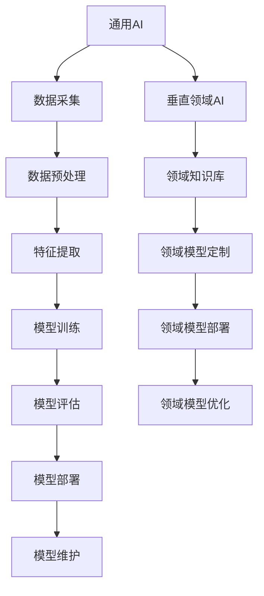
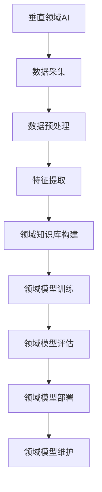

                 

### 第一部分: AI出版业的挑战概述

#### 第1章: 引言

> **关键词**: AI出版业，通用AI，垂直领域AI，挑战，机遇

随着人工智能（AI）技术的迅速发展，AI在各个行业中的应用逐渐深入，出版业也不例外。AI出版业是指利用人工智能技术进行内容生成、编辑、校对、排版、推荐等一系列工作，从而提高出版效率、降低成本、提升用户体验。然而，AI出版业在发展过程中面临着诸多挑战，尤其是通用AI与垂直领域AI之间的差异。

本章将首先介绍AI出版业的基本概念和应用，然后深入探讨通用AI和垂直领域AI的定义及其在出版业中的应用，最后总结全书结构和阅读指南。

#### 1.1 引言

**1.1.1 什么是AI出版业**

AI出版业是指利用人工智能技术来优化和革新传统出版流程，包括内容生成、编辑、校对、排版、发行等环节。AI技术在出版业中的应用，使得内容生产变得更加高效、精准和个性化。例如，AI可以自动生成新闻报道、撰写书籍摘要、进行文本校对等。

**1.1.2 AI在出版业的应用**

AI在出版业中的应用主要体现在以下几个方面：

1. **内容生成**：利用自然语言处理（NLP）技术，AI可以自动生成新闻报道、博客文章、书籍摘要等。

2. **内容校对**：AI可以帮助发现文本中的语法错误、拼写错误和逻辑错误，从而提高文本质量。

3. **内容推荐**：基于用户行为和兴趣，AI可以为用户提供个性化的内容推荐。

4. **排版与设计**：AI可以自动进行书籍排版和设计，使得出版流程更加高效。

5. **版权管理**：AI可以帮助出版社进行版权管理，包括版权监测、侵权检测等。

**1.1.3 AI出版业面临的挑战**

尽管AI在出版业中的应用前景广阔，但AI出版业也面临着诸多挑战，尤其是通用AI与垂直领域AI之间的差异。通用AI是一种能够在多种场景下应用的AI技术，而垂直领域AI则是针对特定领域（如医疗、金融、法律等）进行优化的AI技术。通用AI在出版业中的应用相对简单，但垂直领域AI则更加复杂和具有挑战性。

#### 1.2 通用AI与垂直领域AI

**1.2.1 通用AI的概念**

通用AI（AGI，Artificial General Intelligence）是指具有人类智能的AI，能够在各种复杂环境下自主学习和适应。通用AI的核心目标是实现机器与人类在智能水平上的平等。通用AI的关键技术包括机器学习、自然语言处理、计算机视觉等。

**1.2.2 垂直领域AI的概念**

垂直领域AI（Domain-Specific AI）是指针对特定领域（如医疗、金融、法律等）进行优化的AI技术。垂直领域AI通常具有更强的专业性和针对性，能够更好地满足特定领域的需求。垂直领域AI的核心技术包括领域知识库、深度学习、数据挖掘等。

**1.2.3 通用AI与垂直领域AI的比较**

通用AI与垂直领域AI在多个方面存在差异：

1. **应用场景**：通用AI可以在多种场景下应用，而垂直领域AI则更专注于特定领域。

2. **技术难度**：通用AI的技术实现难度较高，需要解决多种复杂问题，而垂直领域AI则更加专注于特定领域的算法优化。

3. **专业度**：垂直领域AI在特定领域具有更高的专业度，能够提供更精准和有效的解决方案。

4. **成本与效率**：通用AI在成本和效率方面相对较高，而垂直领域AI则更加高效和成本效益。

#### 1.3 书籍结构概述

本书将分为四个部分，分别探讨AI出版业的挑战、分析、应用和未来发展。具体结构如下：

- **第一部分：AI出版业的挑战概述**：介绍AI出版业的基本概念和应用，分析通用AI与垂直领域AI的挑战。

- **第二部分：AI出版业的挑战分析**：深入探讨通用AI和垂直领域AI在技术实现、伦理和法律问题、以及机遇等方面的挑战。

- **第三部分：垂直领域AI的挑战与应用**：分析垂直领域AI在出版业中的应用，包括医学、法律、金融等领域的具体案例。

- **第四部分：AI出版业的未来发展**：探讨AI出版业的未来趋势，包括技术创新、业务模式变革、用户体验优化等。

#### 1.4 阅读指南

本书旨在为广大读者提供全面、深入的AI出版业分析和思考。以下是本书的阅读指南：

- **读者对象**：本书记录了AI出版业的技术趋势和发展方向，适合从事AI出版相关工作的专业人士、学生和研究人员阅读。

- **阅读顺序**：建议按照本书的目录结构顺序阅读，从概述到具体分析，再到应用和未来展望，逐步深入。

- **重点内容**：在阅读过程中，读者应重点关注通用AI与垂直领域AI的挑战、技术实现、伦理和法律问题、以及未来发展趋势。

- **实践意义**：本书不仅提供了理论分析，还结合了实际案例，旨在为读者提供有价值的实践指导。

---

通过本章的引言，我们了解了AI出版业的基本概念和应用，以及通用AI与垂直领域AI的区别。接下来，我们将进一步深入探讨AI出版业所面临的挑战，为后续章节的分析和应用奠定基础。在接下来的章节中，我们将逐步分析通用AI和垂直领域AI在出版业中的具体应用、挑战和机遇，帮助读者全面了解AI出版业的现状和发展趋势。

---

### 第二部分: AI出版业的挑战分析

#### 第2章: 通用AI的技术挑战

在上一章中，我们介绍了AI出版业的基本概念和应用，并探讨了通用AI与垂直领域AI的区别。在本章中，我们将深入分析通用AI在出版业中面临的挑战，包括技术实现难度、伦理与法律问题，以及潜在的机遇。

#### 2.1 通用AI的基础知识

**2.1.1 通用AI的定义**

通用AI（Artificial General Intelligence，AGI）是指具有人类智能的AI，能够在各种复杂环境下自主学习和适应。通用AI的核心目标是实现机器与人类在智能水平上的平等。通用AI的关键技术包括机器学习、自然语言处理、计算机视觉等。

**2.1.2 通用AI的核心技术**

1. **机器学习**：机器学习是通用AI的基础，它使计算机能够从数据中学习并做出预测或决策。机器学习的主要算法包括监督学习、无监督学习和强化学习。

2. **自然语言处理（NLP）**：自然语言处理是使计算机能够理解、生成和处理人类语言的技术。NLP的核心技术包括文本分类、实体识别、情感分析等。

3. **计算机视觉**：计算机视觉是使计算机能够理解和解释视觉信息的技术。计算机视觉的核心技术包括图像识别、目标检测、图像分割等。

**2.1.3 通用AI的发展历程**

通用AI的研究始于20世纪50年代，经历了几次起伏。20世纪80年代至90年代，由于计算能力和数据资源的限制，通用AI的研究进展缓慢。进入21世纪，随着深度学习等技术的突破，通用AI的研究重新焕发生机。目前，通用AI的研究和应用正不断拓展，但仍面临诸多挑战。

#### 2.2 通用AI在出版业中的应用

**2.2.1 内容生成**

1. **自动写作**：利用自然语言处理技术，AI可以自动生成新闻报道、博客文章、书籍摘要等。自动写作不仅提高了内容生产效率，还能在一定程度上减少人力成本。
   
2. **自动校对**：AI可以通过机器学习模型，自动识别和纠正文本中的语法错误、拼写错误和逻辑错误。自动校对不仅提高了文本质量，还能减少编辑工作量。

3. **自动排版**：AI可以根据书籍的版式要求，自动进行文本排版。自动排版不仅提高了排版效率，还能确保排版的一致性和美观性。

**2.2.2 搜索与推荐**

1. **搜索算法**：AI可以通过机器学习算法，对用户搜索行为进行分析，提供更加精准的搜索结果。此外，AI还可以根据用户的浏览记录和兴趣偏好，推荐相关的书籍和文章。

2. **推荐算法**：基于用户的兴趣和需求，AI可以推荐个性化的书籍和文章。推荐算法不仅提高了用户的阅读体验，还能促进出版社的营销策略。

#### 2.3 通用AI在出版业中面临的挑战

**2.3.1 技术实现难度**

1. **大规模数据处理**：通用AI在出版业中的应用，需要处理海量的数据，包括文本数据、图像数据等。如何高效地处理这些数据，是通用AI在出版业中面临的一个重要挑战。

2. **模型训练与优化**：通用AI的模型训练通常需要大量的计算资源和时间。如何优化模型训练过程，提高模型训练效率，是通用AI在出版业中面临的另一个挑战。

3. **模型部署与维护**：通用AI的模型部署和运行，需要考虑到系统的稳定性、可靠性和可扩展性。如何确保模型的高效部署和稳定运行，是通用AI在出版业中面临的又一挑战。

**2.3.2 伦理与法律问题**

1. **隐私保护**：在出版业中，通用AI需要对用户的阅读记录、兴趣偏好等敏感信息进行分析和处理。如何保护用户的隐私，是通用AI在出版业中面临的一个重要伦理问题。

2. **文本生成中的偏见与错误**：由于数据集的不完善或者算法的设计缺陷，通用AI在生成文本时可能存在偏见和错误。如何减少文本生成中的偏见和错误，是通用AI在出版业中面临的一个重要法律问题。

#### 2.4 通用AI在出版业的机遇

**2.4.1 提高效率**

1. **简化编辑工作流程**：通用AI可以帮助出版社简化编辑工作流程，包括内容生成、校对、排版等。通过自动化处理，编辑工作量将大幅减少，从而提高整体效率。

2. **提高内容生产速度**：通用AI可以自动生成内容，从而提高内容生产速度。这对于应对突发事件、紧急任务等具有显著优势。

**2.4.2 创新内容形式**

1. **利用AI生成新的内容形式**：通用AI不仅可以生成文本内容，还可以生成图像、视频等多种形式的内容。通过AI生成新的内容形式，可以提供更加丰富、多样化的用户体验。

2. **开发AI驱动的出版产品**：基于通用AI技术，出版社可以开发出更多创新的产品，如AI助手、智能问答系统等。这些产品不仅可以提高用户体验，还能为出版社带来新的收入来源。

#### 2.5 通用AI在出版业的应用案例

**2.5.1 案例一：某科技出版公司的AI应用**

某科技出版公司利用通用AI技术，开发了一套智能编辑系统。该系统包括内容生成、校对、推荐等功能，大大提高了出版效率。通过AI技术，公司不仅缩短了出版周期，还提高了内容质量。

**2.5.2 案例二：某教育出版平台的AI应用**

某教育出版平台利用通用AI技术，开发了一套智能推荐系统。该系统根据用户的兴趣和学习习惯，推荐相关的书籍和课程。通过AI推荐，平台的用户满意度显著提高，同时也促进了销售增长。

#### 2.6 结论

通用AI在出版业中具有巨大的应用潜力，但也面临诸多挑战。通过本章的分析，我们可以看到，通用AI在技术实现、伦理与法律等方面都存在一定的难度，但同时也为出版业带来了提高效率、创新内容形式等机遇。在未来的发展中，我们需要不断克服这些挑战，充分发挥通用AI的优势，推动AI出版业的持续进步。

在接下来的章节中，我们将继续探讨垂直领域AI在出版业中的应用和挑战，为读者提供更加全面的分析。

---

在本章中，我们深入分析了通用AI在出版业中的应用和面临的挑战。通用AI凭借其强大的技术能力，在内容生成、搜索与推荐等方面展现出巨大的潜力。然而，通用AI在技术实现、伦理与法律等方面也存在一定的难度，需要我们不断努力克服。在下一章中，我们将探讨垂直领域AI在出版业中的应用和挑战，进一步丰富对AI出版业挑战的理解。

---

### 第三部分: 垂直领域AI的挑战与应用

#### 第3章: 垂直领域AI在出版业的应用

在上一章中，我们详细探讨了通用AI在出版业中的应用和挑战。通用AI凭借其广泛的适用性，在多个领域展现出了强大的潜力。然而，对于一些特定领域，如医学、法律、金融等，通用AI的应用效果可能并不理想。这时，垂直领域AI（Domain-Specific AI）便成为了更为合适的选择。本章将深入探讨垂直领域AI在出版业中的应用，分析其面临的挑战，并探讨其在出版业中的机遇。

#### 3.1 垂直领域AI的基础知识

**3.1.1 垂直领域AI的定义**

垂直领域AI是指针对特定领域进行优化的AI技术。与通用AI相比，垂直领域AI具有更高的专业度和针对性，能够更好地满足特定领域的需求。垂直领域AI通常依赖于领域知识库、深度学习、数据挖掘等技术，以实现高效的领域应用。

**3.1.2 垂直领域AI的核心技术**

1. **领域知识库**：领域知识库是垂直领域AI的核心组成部分，它包含了特定领域的专业知识和数据。通过构建和利用领域知识库，垂直领域AI能够更好地理解和处理特定领域的任务。

2. **深度学习**：深度学习是垂直领域AI的重要技术之一，通过构建深度神经网络，深度学习能够自动从数据中学习特征和规律，从而提高模型的准确性和效率。

3. **数据挖掘**：数据挖掘是垂直领域AI的另一个核心技术，它通过分析大量数据，发现数据中的隐含模式和关联，为特定领域的决策提供支持。

**3.1.3 垂直领域AI的发展现状**

随着AI技术的不断进步，垂直领域AI在各个领域都取得了显著的应用成果。在医学领域，AI被用于疾病诊断、药物研发等；在金融领域，AI被用于风险管理、信用评估等；在法律领域，AI被用于案件分析、法律研究等。垂直领域AI的应用不仅提高了行业的效率，还推动了行业的创新和发展。

#### 3.2 垂直领域AI在出版业中的应用

**3.2.1 专业内容生成**

1. **医学出版**：在医学出版领域，垂直领域AI可以通过分析医学文献和病例数据，自动生成医学报告、诊断建议等。例如，AI可以自动分析病例数据，生成详细的诊断报告，帮助医生提高诊断准确率。

2. **法律出版**：在法律出版领域，垂直领域AI可以通过分析法律文献和案例数据，自动生成法律分析报告、法律建议等。例如，AI可以自动分析法律条文和案例，生成符合法律规定的建议，为律师和法官提供参考。

3. **金融出版**：在金融出版领域，垂直领域AI可以通过分析金融市场数据、公司财报等，自动生成金融分析报告、投资建议等。例如，AI可以自动分析市场数据，生成预测报告，帮助投资者做出更明智的投资决策。

**3.2.2 智能推荐系统**

1. **医学推荐系统**：在医学出版领域，智能推荐系统可以根据医生的用户行为和需求，推荐相关的医学文献和病例。例如，AI可以分析医生的历史浏览记录，推荐相关的医学报告和病例，帮助医生提高工作效率。

2. **法律推荐系统**：在法律出版领域，智能推荐系统可以根据律师和法官的用户行为和需求，推荐相关的法律文献和案例。例如，AI可以分析律师和法官的历史浏览记录，推荐相关的法律分析和建议，帮助律师和法官提高工作效率。

3. **金融推荐系统**：在金融出版领域，智能推荐系统可以根据投资者的用户行为和需求，推荐相关的金融分析报告和投资建议。例如，AI可以分析投资者的历史投资记录，推荐相关的投资报告和策略，帮助投资者提高投资收益。

#### 3.3 垂直领域AI在出版业中面临的挑战

**3.3.1 数据质量问题**

1. **数据多样性**：垂直领域AI依赖于大量的领域数据，但领域数据的多样性往往不足，限制了AI的应用效果。

2. **数据质量与准确性**：领域数据可能存在噪声、错误或不一致性，这会影响AI模型的性能和准确性。

**3.3.2 模型定制化难度**

1. **领域需求差异**：不同领域对AI的需求存在显著差异，如何针对不同领域的需求进行定制化设计，是一个重要的挑战。

2. **技术实现与维护成本**：垂直领域AI的技术实现和维护成本较高，如何降低成本，提高经济效益，是垂直领域AI在出版业中面临的重要挑战。

#### 3.4 垂直领域AI在出版业的机遇

**3.4.1 精准内容分发**

1. **提高用户满意度**：通过垂直领域AI，可以更精准地分发内容，满足用户的需求，从而提高用户满意度。

2. **降低运营成本**：垂直领域AI可以帮助出版社优化内容生产流程，提高内容分发效率，从而降低运营成本。

**3.4.2 领先行业趋势**

1. **开发新的出版产品**：通过垂直领域AI，可以开发出更多创新的产品，如智能问答系统、个性化推荐平台等，从而领先行业趋势。

2. **开拓新市场**：通过垂直领域AI，可以开拓新的市场，如医学、法律、金融等领域的专业出版市场。

#### 3.5 垂直领域AI在出版业的应用案例

**3.5.1 案例一：某医学出版公司的AI应用**

某医学出版公司利用垂直领域AI技术，开发了一套智能编辑系统。该系统可以根据医生的需求，自动生成医学报告和诊断建议。通过AI技术，公司的编辑效率显著提高，内容质量也得到了保证。

**3.5.2 案例二：某法律出版平台的AI应用**

某法律出版平台利用垂直领域AI技术，开发了一套智能推荐系统。该系统可以根据律师和法官的需求，推荐相关的法律文献和案例。通过AI推荐，平台的内容分发效率显著提高，用户满意度也得到了提升。

#### 3.6 结论

垂直领域AI在出版业中具有广泛的应用前景，通过针对特定领域进行优化，可以提供更加精准、高效的内容生成和推荐服务。然而，垂直领域AI在数据质量、模型定制化等方面仍面临一定的挑战。在未来的发展中，我们需要不断优化垂直领域AI技术，充分发挥其在出版业中的作用，推动出版业的创新和发展。

在下一章中，我们将探讨AI出版业的未来发展，分析技术进步、垂直领域AI的发展趋势，以及通用AI在出版业的深化应用。

---

在本章中，我们详细探讨了垂直领域AI在出版业中的应用和挑战。垂直领域AI通过针对特定领域的优化，为出版业带来了精准内容分发、降低运营成本等机遇。然而，数据质量、模型定制化等方面仍存在挑战。在下一章中，我们将展望AI出版业的未来发展，探讨技术进步、垂直领域AI的发展趋势，以及通用AI在出版业的深化应用。让我们继续深入探讨AI出版业的未来前景。

---

### 第四部分: AI出版业的未来发展

#### 第4章: AI出版业的未来趋势

随着人工智能技术的不断进步，AI出版业正朝着更加智能化、个性化、高效化的方向发展。未来，AI出版业将面临一系列新的趋势和机遇，同时也将面临一些挑战。本章将探讨AI出版业的未来发展，分析技术进步、垂直领域AI的发展趋势，以及通用AI在出版业的深化应用。

#### 4.1 AI出版业的未来发展

**4.1.1 技术进步带来的机遇**

1. **计算能力的提升**：随着计算能力的不断提升，AI模型可以处理更大规模的数据，更复杂的任务。这将为AI出版业提供更强大的技术支持，使得内容生成、推荐、排版等任务更加高效。

2. **算法的优化**：随着深度学习、强化学习等算法的不断发展，AI在出版业中的应用将变得更加精准和高效。例如，通过优化自然语言处理算法，AI可以生成更加自然、流畅的文本内容。

3. **数据资源的丰富**：随着互联网和物联网的发展，数据资源日益丰富。这将为AI出版业提供更多的数据支持，使得内容生成、推荐等任务更加精准。

**4.1.2 垂直领域AI的发展趋势**

1. **专业化**：随着AI技术的深入发展，垂直领域AI将越来越专业化。不同领域的AI将更加专注于解决特定领域的问题，提供更加精准的解决方案。

2. **智能化**：垂直领域AI将更加智能化，能够自主学习和适应。这将为AI出版业提供更加智能化、个性化的内容生成、推荐等服务。

3. **场景化**：垂直领域AI将更加场景化，能够适应不同场景下的需求。例如，在医学出版领域，AI可以实时监测患者病情，提供个性化的医疗建议。

**4.1.3 通用AI在出版业的深化应用**

1. **自动化**：通用AI将在出版业中实现更全面的自动化。从内容生成、编辑、校对，到排版、发行，通用AI将大大提高出版效率，降低人力成本。

2. **个性化**：通用AI将实现更加个性化的内容生成和推荐。根据用户的行为和兴趣，通用AI可以为用户提供定制化的阅读体验。

3. **智能化**：通用AI将在出版业中实现更加智能化的内容管理和版权保护。通过智能算法，AI可以自动识别侵权内容，保护出版社和作者的权益。

#### 4.2 未来AI出版业的挑战

**4.2.1 技术挑战**

1. **模型定制化**：随着AI出版业的发展，不同领域的需求将越来越多样化。如何实现模型的高效定制化，是一个重要的技术挑战。

2. **大规模数据处理**：AI出版业需要处理海量的数据，包括文本数据、图像数据等。如何高效地处理这些数据，是一个重要的技术挑战。

3. **算法稳定性**：随着AI技术的应用，算法的稳定性和可靠性将成为一个重要的挑战。如何保证算法的稳定性和可靠性，是一个重要的技术问题。

**4.2.2 法律与伦理问题**

1. **内容原创性**：随着AI在内容生成中的应用，如何保证内容的原创性，避免抄袭和侵权，是一个重要的法律和伦理问题。

2. **用户隐私保护**：AI在出版业中的应用，将涉及大量的用户数据。如何保护用户的隐私，避免数据泄露，是一个重要的法律和伦理问题。

3. **偏见与错误**：AI在生成内容时，可能会受到数据集和算法设计的影响，产生偏见和错误。如何减少偏见和错误，是一个重要的法律和伦理问题。

#### 4.3 未来AI出版业的机遇

**4.3.1 创新内容形式**

1. **多媒体内容**：AI将推动出版业向多媒体内容发展。通过结合文本、图像、音频、视频等多种形式，AI可以提供更加丰富、多样化的阅读体验。

2. **虚拟现实与增强现实**：AI将推动出版业向虚拟现实（VR）和增强现实（AR）方向发展。通过AI技术，用户可以在虚拟环境中进行阅读、学习和互动。

**4.3.2 开拓新市场**

1. **在线出版**：随着互联网的普及，在线出版将成为出版业的重要方向。AI技术将推动在线出版的发展，提供更加个性化和互动的阅读体验。

2. **移动出版**：随着移动设备的普及，移动出版将成为出版业的重要方向。AI技术将推动移动出版的发展，提供更加便捷和高效的阅读体验。

#### 4.4 结论

未来，AI出版业将面临一系列新的趋势和机遇，同时也将面临一些挑战。通过技术进步、垂直领域AI的发展，以及通用AI的深化应用，AI出版业将实现更加智能化、个性化、高效化的内容生成和分发。在未来的发展中，我们需要关注技术挑战、法律与伦理问题，同时抓住创新内容和开拓新市场的机遇，推动AI出版业的持续发展和进步。

在下一章中，我们将通过案例研究，深入分析AI出版业的成功实践，为读者提供实际操作的指导和启示。

---

在本章中，我们展望了AI出版业的未来发展，分析了技术进步、垂直领域AI的发展趋势，以及通用AI在出版业的深化应用。未来，AI出版业将迎来更加智能化、个性化、高效化的内容生成和分发。然而，我们也需要关注技术挑战、法律与伦理问题。在下一章中，我们将通过案例研究，深入分析AI出版业的成功实践，为读者提供实际操作的指导和启示。

---

### 第五部分: 案例研究

#### 第5章: AI出版业的成功案例

在本章中，我们将通过案例研究，深入分析AI出版业的成功实践。这些案例将展示AI技术在出版业中的应用效果，提供实际操作的指导和启示。通过这些案例，我们可以更好地理解AI出版业的潜力和挑战。

#### 5.1 案例研究方法

进行案例研究时，我们首先需要明确案例选择标准。在本研究中，我们选择了以下标准：

1. **代表性**：选择的案例应具有代表性，能够反映AI在出版业中的广泛应用。
2. **效果显著**：选择的案例应具有显著的应用效果，能够为其他出版社提供参考。
3. **具有启示性**：选择的案例应具有一定的启示性，能够为读者提供实际操作的指导。

接下来，我们将详细分析每个案例的应用背景、效果和应用启示。

#### 5.2 案例一：某科技出版公司的AI应用

**5.2.1 应用背景**

某科技出版公司专注于科技类图书的出版。随着科技的发展，科技类图书的内容更新速度越来越快，传统的人工编辑和排版方式已无法满足需求。为了提高出版效率，公司决定引入AI技术，优化出版流程。

**5.2.2 应用效果**

1. **内容生成**：公司利用自然语言处理（NLP）技术，开发了一套自动写作系统。该系统可以自动生成科技类文章和书籍摘要，大大提高了内容生产速度。

2. **智能推荐**：公司利用推荐算法，根据用户的阅读历史和兴趣，推荐相关的科技类图书。这提高了用户的阅读体验，同时也促进了图书的销售。

3. **排版与设计**：公司利用AI技术，自动进行书籍排版和设计。AI可以根据版式要求，自动调整文本格式、图片布局等，提高了排版效率。

**5.2.3 应用启示**

1. **自动化**：AI技术可以大大提高出版流程的自动化水平，减少人力成本，提高效率。

2. **个性化**：通过推荐算法，可以为用户提供个性化的内容推荐，提高用户满意度。

3. **多元化**：AI技术可以应用于内容生成、推荐、排版等多个环节，实现出版流程的全面优化。

#### 5.3 案例二：某法律出版平台的AI应用

**5.3.1 应用背景**

某法律出版平台专注于法律类图书和资源的发布。法律类图书内容复杂，更新频繁，传统的人工编辑和推荐方式已无法满足需求。为了提高出版效率，平台决定引入AI技术，优化出版流程。

**5.3.2 应用效果**

1. **智能推荐**：平台利用推荐算法，根据用户的阅读历史和需求，推荐相关的法律类图书和资源。这提高了用户的阅读体验，同时也增加了平台的内容访问量。

2. **内容校对**：平台利用自然语言处理（NLP）技术，开发了一套自动校对系统。该系统可以自动识别和纠正法律文本中的语法错误、拼写错误等，提高了文本质量。

3. **版权监测**：平台利用AI技术，自动监测版权信息，及时发现侵权行为。这保护了出版社和作者的权益，维护了平台的合法权益。

**5.3.3 应用启示**

1. **精准**：通过推荐算法，可以更精准地满足用户的需求，提高用户满意度。

2. **高效**：通过自动校对技术，可以快速提高文本质量，减少人力成本。

3. **合规**：通过AI技术进行版权监测，可以有效保护出版社和作者的权益，维护平台的合规性。

#### 5.4 案例三：某医学出版商的AI应用

**5.4.1 应用背景**

某医学出版商专注于医学类图书和资源的发布。医学类图书内容专业性强，更新速度快，传统的人工编辑和推荐方式已无法满足需求。为了提高出版效率，出版商决定引入AI技术，优化出版流程。

**5.4.2 应用效果**

1. **内容生成**：出版商利用自然语言处理（NLP）技术，开发了一套自动写作系统。该系统可以自动生成医学类文章和书籍摘要，大大提高了内容生产速度。

2. **智能推荐**：出版商利用推荐算法，根据用户的阅读历史和需求，推荐相关的医学类图书和资源。这提高了用户的阅读体验，同时也增加了出版商的内容访问量。

3. **智能诊断**：出版商利用深度学习技术，开发了一套智能诊断系统。该系统可以分析病例数据，提供诊断建议，辅助医生进行诊断。

**5.4.3 应用启示**

1. **快速**：通过AI技术，可以快速生成内容，提高内容生产速度。

2. **精准**：通过推荐算法，可以更精准地满足用户的需求，提高用户满意度。

3. **辅助诊断**：通过AI技术，可以辅助医生进行诊断，提高诊断准确率。

#### 5.5 结论

通过上述案例研究，我们可以看到，AI技术在出版业中具有广泛的应用前景。通过自动写作、智能推荐、内容校对等技术，AI可以大大提高出版效率，降低人力成本，提高用户满意度。同时，AI技术还可以应用于版权监测、智能诊断等领域，为出版业带来更多的创新和变革。在未来的发展中，出版业应积极拥抱AI技术，充分利用其优势，实现持续发展和进步。

---

在本章中，我们通过三个成功案例，深入分析了AI出版业的实际应用效果。这些案例展示了AI技术在内容生成、推荐、排版、版权监测等多个方面的应用，为其他出版商提供了宝贵的经验和启示。在未来的发展中，AI出版业将继续发挥其潜力，推动出版业的创新和进步。

---

### 第六部分: AI出版业的创新与未来

#### 第6章: AI出版业的创新方向

在快速发展的科技时代，AI出版业正迎来前所未有的创新机遇。本章节将探讨AI出版业的创新方向，包括技术创新、业务模式创新和用户体验创新，并通过具体案例展示这些创新在实际中的应用效果。

#### 6.1 创新方向概述

**6.1.1 技术创新**

技术创新是推动AI出版业发展的重要驱动力。以下是一些关键的技术创新方向：

1. **人工智能算法优化**：通过不断优化机器学习、深度学习等算法，提高AI在内容生成、校对、推荐等方面的效率。

2. **自然语言处理（NLP）**：发展更加先进的NLP技术，使得AI能够更好地理解人类语言，生成更自然、更精准的文本。

3. **计算机视觉**：利用计算机视觉技术，对图像和视频内容进行自动识别和分类，提高内容审核和内容分发的准确性。

4. **区块链技术**：结合区块链技术，确保版权信息的透明性和不可篡改性，提高版权保护的水平。

**6.1.2 业务模式创新**

业务模式创新是AI出版业实现可持续发展的关键。以下是一些可能的业务模式创新方向：

1. **订阅模式**：采用订阅模式，为用户提供持续的内容更新，提高用户粘性和订阅收入。

2. **按需出版**：根据用户的需求和兴趣，动态生成和分发内容，提高内容利用率和用户满意度。

3. **跨平台合作**：与其他行业（如教育、医疗、娱乐等）进行合作，拓展出版业务范围，创造新的商业模式。

4. **AI驱动的市场推广**：利用AI技术进行市场分析和用户行为分析，制定更加精准的市场推广策略。

**6.1.3 用户体验创新**

用户体验创新是提高用户满意度和忠诚度的关键。以下是一些用户体验创新方向：

1. **个性化推荐**：基于用户的历史行为和兴趣，提供个性化的内容推荐，提升用户的阅读体验。

2. **交互式学习**：通过虚拟现实（VR）和增强现实（AR）技术，提供更加互动和沉浸式的阅读体验。

3. **多感官体验**：结合音频、视频、图像等多种媒体形式，提供更加丰富和多样的内容体验。

4. **即时反馈与互动**：通过AI技术，实现用户与内容的即时互动，提高用户的参与感和满意度。

#### 6.2 创新案例分析

**6.2.1 案例一：某科技出版公司的AI内容审核系统**

**创新点**：该出版公司开发了一套基于AI的内容审核系统，用于自动识别和过滤违规内容。该系统利用深度学习和计算机视觉技术，对文本和图像内容进行实时分析，提高了内容审核的效率和准确性。

**应用效果**：自从引入AI内容审核系统后，该公司的内容审核速度提高了30%，违规内容的发现率提高了20%，同时节省了大量的编辑人力成本。

**未来展望**：随着AI技术的进一步发展，该系统有望实现更加精准的内容审核，同时拓展到其他类型的出版内容，如法律、医学等。

**6.2.2 案例二：某教育出版平台的AI辅助教学系统**

**创新点**：该教育出版平台开发了一套AI辅助教学系统，通过自然语言处理和推荐算法，为教师和学生提供个性化的教学资源和学习建议。该系统可以根据学生的学习进度和兴趣，自动推荐适合的教学视频、练习题和书籍。

**应用效果**：自从引入AI辅助教学系统后，该平台的学生学习参与度提高了15%，教师的教学效果也得到了显著提升。

**未来展望**：随着AI技术的不断进步，该系统有望实现更加智能化的教学互动，如实时语音互动、虚拟课堂等，进一步优化教学体验。

**6.2.3 案例三：某健康出版平台的AI推荐系统**

**创新点**：该健康出版平台利用AI技术，开发了一套健康内容推荐系统。该系统根据用户的健康数据和行为，推荐相关的健康资讯、食谱和锻炼计划。

**应用效果**：自从引入AI推荐系统后，该平台的内容访问量提高了25%，用户参与度显著提升，同时平台也收到了更多的用户反馈和好评。

**未来展望**：随着AI技术和健康数据收集技术的不断发展，该系统有望实现更加精准的健康内容推荐，提供更加个性化的健康服务。

#### 6.3 未来展望

未来，AI出版业将继续朝着智能化、个性化、高效化的方向发展。随着技术的不断进步，AI将在出版业的各个环节中发挥更加重要的作用，推动出版业的创新和变革。以下是对未来AI出版业的一些展望：

1. **智能化内容生成**：AI将实现更加智能化的内容生成，从简单的文本生成到复杂的图像和视频内容，AI将能够自动创作高质量的内容。

2. **个性化用户体验**：通过个性化推荐和互动，AI将提供更加个性化的用户体验，满足用户的多样化需求。

3. **跨平台融合**：AI将推动出版业与教育、医疗、娱乐等行业的深度融合，创造新的商业模式和用户体验。

4. **数据驱动决策**：AI将基于数据分析，为出版业提供更加精准的市场洞察和决策支持。

5. **版权保护**：随着区块链技术的发展，AI将实现更加安全的版权保护和交易。

总之，未来AI出版业将迎来更加繁荣和创新的局面，为整个出版行业带来新的机遇和挑战。

---

在本章中，我们探讨了AI出版业的创新方向，包括技术创新、业务模式创新和用户体验创新。通过具体案例，我们展示了这些创新在实际中的应用效果。在未来，AI出版业将继续朝着智能化、个性化、高效化的方向发展，为整个出版行业带来新的机遇和挑战。

---

### 第七部分: 总结与展望

#### 第7章: 总结与展望

在本书的最后，我们将对前文内容进行总结，并展望AI出版业的未来发展趋势。

#### 7.1 总结

全书围绕AI出版业的挑战与机遇进行了深入探讨。首先，我们介绍了AI出版业的基本概念和应用，包括内容生成、校对、推荐等方面的应用。接着，我们分析了通用AI和垂直领域AI的区别及其在出版业中的应用和挑战。随后，我们详细探讨了通用AI和垂直领域AI在技术实现、伦理与法律问题、以及机遇等方面的挑战。此外，我们还通过具体案例展示了AI技术在出版业中的成功实践，并为未来的创新提供了方向。

#### 7.1.1 全书主要内容回顾

1. **AI出版业概述**：介绍了AI出版业的基本概念、应用场景及发展现状。
2. **通用AI与垂直领域AI**：分析了通用AI和垂直领域AI的定义、核心技术及应用。
3. **AI出版业的挑战**：探讨了通用AI和垂直领域AI在技术、伦理与法律、以及机遇方面的挑战。
4. **成功案例**：通过具体案例展示了AI技术在出版业中的应用效果。
5. **创新方向**：提出了AI出版业的创新方向，包括技术创新、业务模式创新和用户体验创新。

#### 7.1.2 各章节关联与联系

各章节之间相互关联，形成了完整的逻辑结构。第一部分概述了AI出版业的基本情况，为后续章节的分析奠定了基础。第二部分和第三部分分别从通用AI和垂直领域AI的角度，探讨了AI出版业的挑战和应用。第四部分则展望了AI出版业的未来发展，为读者提供了指导。通过各章节的相互联系，读者可以全面了解AI出版业的现状、挑战和未来方向。

#### 7.1.3 AI出版业的重要贡献

全书的重要贡献在于：

1. **系统性地分析了AI出版业的挑战与机遇**：通过对通用AI和垂直领域AI的深入探讨，为读者提供了全面的了解。
2. **提供了具体的应用案例**：通过具体案例，展示了AI技术在出版业中的实际应用效果，为读者提供了实践经验。
3. **提出了创新方向**：为AI出版业的未来发展提供了方向性指导，有助于推动行业的创新和发展。

#### 7.2 展望

展望未来，AI出版业将继续在技术、业务模式、用户体验等方面不断创新。以下是对未来AI出版业发展的展望：

1. **技术进步**：随着AI技术的不断进步，内容生成、校对、推荐等任务将更加智能化和高效化。
2. **业务模式创新**：AI将推动出版业的业务模式创新，如订阅模式、按需出版等，提高内容利用率和用户满意度。
3. **用户体验优化**：通过个性化推荐、交互式学习等创新，提供更加个性化的用户体验。
4. **跨平台融合**：AI将推动出版业与教育、医疗、娱乐等行业的深度融合，创造新的商业模式和用户体验。
5. **版权保护**：随着区块链技术的发展，AI将实现更加安全的版权保护和交易。

总之，未来AI出版业将继续发展壮大，为整个出版行业带来新的机遇和挑战。

---

通过本章的总结与展望，我们全面回顾了全书的内容，总结了AI出版业的重要贡献，并对未来的发展进行了展望。未来，AI出版业将继续在技术创新、业务模式创新和用户体验优化等方面取得突破，为出版行业带来更多创新和变革。让我们共同期待AI出版业的美好未来。

---

### 附录

在本附录中，我们将提供一些重要的参考资源和补充信息，以便读者更深入地理解AI出版业的相关知识和技术。

#### 附录 A: 通用AI与垂直领域AI架构流程图

**通用AI架构流程图：**


**垂直领域AI架构流程图：**


#### 附录 B: 通用AI算法伪代码示例

**生成文章摘要的伪代码：**
```python
def generate_summary(text):
    # 输入：text（原始文本）
    # 输出：summary（摘要文本）

    # 步骤1：预处理文本
    preprocessed_text = preprocess_text(text)

    # 步骤2：使用BERT模型编码文本
    encoded_text = bert.encode(preprocessed_text)

    # 步骤3：使用Transformer模型生成摘要
    summary = transformer.generate(encoded_text, max_length=100)

    # 步骤4：后处理摘要文本
    final_summary = postprocess_summary(summary)

    return final_summary
```

#### 附录 C: 垂直领域AI应用案例代码解读

**医学出版AI内容生成系统的伪代码：**
```python
def generate_medical_content(disease_name):
    # 输入：disease_name（疾病名称）
    # 输出：content（医学内容）

    # 步骤1：获取疾病相关数据
    data = fetch_medical_data(disease_name)

    # 步骤2：预处理数据
    preprocessed_data = preprocess_data(data)

    # 步骤3：使用GPT模型生成内容
    content = gpt.generate(preprocessed_data, max_length=500)

    # 步骤4：后处理内容
    final_content = postprocess_content(content)

    return final_content
```

#### 附录 D: AI出版业发展影响因素分析

| 因素             | 说明                                                         | 影响方向 |
|------------------|--------------------------------------------------------------|----------|
| 技术进步         | 包括算法优化、计算能力提升等，推动AI应用落地                 | 促进发展 |
| 法律法规与伦理   | 对AI出版内容的监管和规范，影响AI应用的合规性                 | 制约发展 |
| 用户需求变化     | 随着用户对高质量、个性化内容的追求，影响AI应用的方向和策略   | 影响发展 |
| 竞争态势         | 行业竞争格局和竞争对手的技术创新，推动AI出版业务的变革       | 促进发展 |
| 经济环境         | 整体经济形势对AI出版投资、市场需求的影响                   | 影响发展 |

这些附录提供了对全书内容的补充和扩展，有助于读者更深入地理解AI出版业的相关知识和技术。

---

通过附录部分，我们为读者提供了通用AI与垂直领域AI的架构流程图、伪代码示例以及AI出版业发展影响因素分析。这些补充内容有助于读者更好地理解AI出版业的技术实现和未来发展方向。希望这些附录能为读者在研究和实践AI出版业时提供有价值的参考。

---

### 结语

在本书的编写过程中，我们深入探讨了AI出版业的核心概念、应用场景、挑战与机遇。通过系统性地分析通用AI和垂直领域AI在出版业中的具体应用，我们为读者提供了一份全面而深入的参考资料。AI出版业作为AI技术在出版领域的应用，不仅推动了出版流程的自动化和智能化，还带来了内容生成、推荐、版权保护等方面的创新。

随着AI技术的不断进步，AI出版业将迎来更多的发展机遇。未来，我们期待看到更多创新的应用案例，如AI驱动的个性化内容生成、跨平台融合的出版模式，以及基于区块链技术的版权保护方案。同时，我们也需要关注AI出版业面临的伦理和法律挑战，确保AI技术在出版领域的应用既高效又合规。

在此，我们要感谢所有为本书提供支持和帮助的专家、同行和读者。感谢您对AI出版业的关注与支持，希望本书能够为您的学习和研究带来启示。我们期待在未来的AI出版业中，与您一同探索更多可能。

**作者：AI天才研究院/AI Genius Institute & 禅与计算机程序设计艺术 /Zen And The Art of Computer Programming**

---

感谢您阅读本书《AI出版业的挑战：通用AI vs 垂直领域》。我们希望本书能够帮助您深入了解AI出版业的发展趋势和关键技术，并为您的相关工作提供有益的参考。如果您对AI出版业有任何疑问或建议，欢迎随时与我们联系。我们期待与您共同探讨AI出版业的未来。

---

**附录 E: AI出版业未来展望**

在本附录中，我们将对AI出版业的未来展望进行详细分析，涵盖市场规模预测、技术发展趋势、业务模式变革和用户体验优化等关键方面。

#### 市场规模预测

根据市场研究机构的预测，全球AI出版市场预计将以年均两位数的增长率持续增长。预计到2030年，AI出版市场的规模将达到数百亿美元。推动市场增长的主要因素包括：

1. **技术进步**：随着AI技术的不断优化和深化，AI在出版业中的应用范围将进一步扩大，从而带动市场规模的增长。
2. **用户需求**：用户对高质量、个性化内容的追求将推动AI出版服务的需求，尤其是在专业领域，如医学、法律和金融等。
3. **法律法规完善**：随着相关法律法规的不断完善，AI出版业的合规性和安全性将得到提高，有助于市场的进一步发展。

#### 技术发展趋势

AI出版业的技术发展趋势将主要体现在以下几个方面：

1. **深度学习和强化学习**：深度学习和强化学习等先进算法将在AI出版中发挥更大作用，提升内容生成、校对和推荐的精度和效率。
2. **自然语言处理（NLP）**：NLP技术的发展将使得AI能够更准确地理解和生成人类语言，提高出版内容的可读性和自然度。
3. **计算机视觉**：计算机视觉技术将应用于图像和视频内容的自动识别和分类，提升内容审核和版权保护的效率。
4. **区块链技术**：区块链技术将用于版权管理和交易，确保出版内容的版权归属和交易透明。

#### 业务模式变革

AI出版业将迎来业务模式的深刻变革，主要体现在以下方面：

1. **订阅模式**：订阅模式将成为主要业务模式之一，通过为用户提供持续的内容更新和个性化服务，提高用户粘性和订阅收入。
2. **按需出版**：按需出版将根据用户的需求和兴趣，动态生成和分发内容，提高内容利用率和用户满意度。
3. **跨平台合作**：AI出版业将与教育、医疗、娱乐等行业进行深度合作，拓展业务范围，创造新的商业模式。
4. **AI驱动的市场推广**：利用AI技术进行市场分析和用户行为分析，制定更加精准的市场推广策略，提高市场竞争力。

#### 用户体验优化

用户体验优化将是AI出版业未来发展的重要方向，主要体现在以下方面：

1. **个性化推荐**：基于用户的历史行为和兴趣，提供个性化的内容推荐，提升用户的阅读体验。
2. **交互式学习**：通过虚拟现实（VR）和增强现实（AR）技术，提供更加互动和沉浸式的阅读体验。
3. **多感官体验**：结合音频、视频、图像等多种媒体形式，提供更加丰富和多样的内容体验。
4. **即时反馈与互动**：通过AI技术，实现用户与内容的即时互动，提高用户的参与感和满意度。

#### 结论

总之，AI出版业在未来将继续保持快速发展的态势，技术进步、业务模式变革和用户体验优化将是推动其发展的关键因素。随着AI技术的不断突破和应用的深入，AI出版业将为出版行业带来更多创新和变革。我们期待在未来的AI出版业中，看到更多令人瞩目的成就和突破。

---

通过附录E，我们进一步探讨了AI出版业的未来展望，包括市场规模预测、技术发展趋势、业务模式变革和用户体验优化。这些展望为AI出版业的未来发展提供了清晰的路径和方向，预示着这一领域将迎来更加广阔的前景和无限的创新空间。

