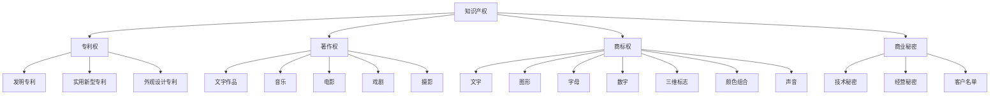
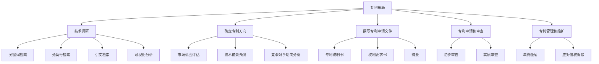
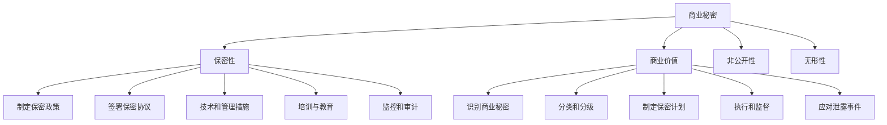

                 

## 《AI创业公司的知识产权保护：专利布局与商业秘密管理》

### 关键词：知识产权保护、AI创业公司、专利布局、商业秘密管理、创业公司、知识产权战略

### 摘要：

本文将探讨AI创业公司在知识产权保护方面面临的挑战和解决方案。首先，我们将介绍知识产权保护的基本概念和重要性，特别是对创业公司的重要性。接着，我们将详细分析专利布局策略和商业秘密管理，涵盖专利布局的基础知识、步骤与方法，以及商业秘密的定义、保护措施和管理流程。随后，我们将通过实际案例展示专利申请与实务操作，讨论专利运营策略，并探讨专利纠纷的应对方法。最后，我们将结合案例，分析商业秘密与专利的综合运用，提出创业公司知识产权保护的综合方案。本文旨在为AI创业公司提供一套系统、实用的知识产权保护策略，帮助它们在激烈的市场竞争中立于不败之地。

### 目录大纲设计

为了让读者更好地理解文章内容，我们设计了详细的目录大纲，将文章内容划分为四个主要部分：

#### 第一部分：引言与基础知识
- **第1章：知识产权保护的基本概念**
  - **1.1 知识产权的定义与类型**
  - **1.2 知识产权保护的重要性**
  - **1.3 创业公司知识产权面临的挑战**
- **第2章：专利布局策略**
  - **2.1 专利基础知识**
  - **2.2 专利布局的步骤与方法**
  - **2.3 专利检索与分析**
- **第3章：商业秘密管理**
  - **3.1 商业秘密的定义与特性**
  - **3.2 商业秘密的保护措施**
  - **3.3 商业秘密管理流程**

#### 第二部分：专利实战
- **第4章：专利申请与实务**
  - **4.1 专利申请的流程**
  - **4.2 专利撰写技巧**
  - **4.3 专利申请实例分析**
- **第5章：专利运营策略**
  - **5.1 专利运营的概念与目标**
  - **5.2 专利许可与转让**
  - **5.3 专利池构建与战略**
- **第6章：专利纠纷应对**
  - **6.1 专利纠纷的类型与解决途径**
  - **6.2 专利侵权判定**
  - **6.3 专利维权策略**

#### 第三部分：商业秘密保护案例解析
- **第7章：商业秘密保护案例分析**
  - **7.1 案例介绍**
  - **7.2 案例分析**
  - **7.3 案例启示**
- **第8章：商业秘密与专利的综合运用**
  - **8.1 商业秘密与专利的互补作用**
  - **8.2 知识产权战略规划**
  - **8.3 创业公司知识产权保护的综合方案**

#### 第四部分：总结与展望
- **第9章：总结与展望**
  - **9.1 知识产权保护的关键点**
  - **9.2 创业公司知识产权保护的未来趋势**
  - **9.3 知识产权保护的策略选择**

通过上述目录，读者可以清晰地了解文章的结构和内容，逐步深入探讨AI创业公司知识产权保护的各种策略和案例。

### 引言

在当前高度竞争和快速变化的AI市场中，知识产权保护已经成为AI创业公司成功的关键因素。知识产权，尤其是专利和商业秘密，是企业技术创新和市场竞争的重要工具。对于AI创业公司来说，如何有效地保护其知识产权，不仅关乎企业的生存和发展，更直接影响其在市场上的竞争力。

#### 知识产权保护的基本概念

知识产权是指人们对其智力劳动成果所依法享有的专有权利。它主要包括专利权、著作权、商标权、商业秘密等。其中，专利权是指对发明创造所享有的独占性权利，著作权则是指对文学、艺术和科学作品享有的权利，商标权是指对标识的独占性使用权，而商业秘密则是指不为公众所知悉、具有商业价值的信息。

#### 创业公司知识产权保护的挑战

对于AI创业公司来说，知识产权保护面临着诸多挑战：

1. **专利成本高**：专利申请和维护需要大量资金，这对于初创公司来说是一个巨大的负担。
2. **技术更新快**：AI技术发展迅速，如何及时更新专利布局，确保技术创新的持续性和领先性，是一个巨大的挑战。
3. **商业秘密泄露**：在市场竞争激烈的环境中，如何防止商业秘密泄露，确保企业的竞争优势，是创业公司面临的另一个重要挑战。
4. **国际竞争**：全球范围内的AI市场竞争激烈，如何在全球化背景下进行知识产权布局，是一个复杂的策略问题。

#### 知识产权保护的重要性

尽管面临诸多挑战，知识产权保护对AI创业公司的重要性不容忽视：

1. **市场竞争优势**：有效的知识产权保护可以使企业在市场上拥有独特的竞争优势，提高市场占有率。
2. **技术创新动力**：知识产权保护鼓励企业持续创新，通过专利保护和商业秘密保护，企业可以更好地保护其技术成果，激发创新活力。
3. **融资优势**：拥有强大知识产权保护能力的企业，在融资过程中更容易获得投资者的信任和支持，提高融资成功率。
4. **法律保护**：知识产权保护为企业在法律上提供了有力的保护，可以有效地防止竞争对手的侵权行为，保障企业的合法权益。

### 总结

通过上述分析，我们可以看出，知识产权保护是AI创业公司成功的重要保障。它不仅关系到企业的市场竞争优势，更是企业技术创新和可持续发展的关键。在接下来的章节中，我们将详细探讨专利布局策略、商业秘密管理以及实际操作中的案例，帮助AI创业公司构建一套有效的知识产权保护体系。

### 第1章：知识产权保护的基本概念

#### 1.1 知识产权的定义与类型

知识产权是指人们对其智力劳动成果所依法享有的专有权利。它包括但不限于以下几个方面：

1. **专利权**：专利权是指对发明创造所享有的独占性权利。根据专利的类型，可以分为发明专利、实用新型专利和外观设计专利。发明专利是指对产品、方法或者其改进所提出的新的技术方案，实用新型专利是指对产品的形状、构造或者其结合所提出的适于实用的新的技术方案，而外观设计专利是指对产品的形状、图案或者其结合以及色彩与形状、图案的结合所作出的富有美感并适于工业应用的新设计。

2. **著作权**：著作权是指对文学、艺术和科学作品享有的权利。著作权涵盖了文字作品、音乐、电影、戏剧、摄影等多种类型。著作权保护的是创作者的原创性表达，而不是其思想、过程、系统或方法。

3. **商标权**：商标权是指对标识的独占性使用权。商标是用来区别商品或服务来源的一种标志，包括文字、图形、字母、数字、三维标志、颜色组合和声音等。商标权的保护范围取决于商标的显著性和知名度。

4. **商业秘密**：商业秘密是指不为公众所知悉、具有商业价值的信息，包括技术秘密、经营秘密、客户名单等。商业秘密的保护依赖于企业的保密措施和法律规定。

#### 1.2 知识产权保护的重要性

知识产权保护对企业和整个社会具有重要意义：

1. **激励创新**：知识产权保护为创新者提供了独占性的权利，使他们能够从其创新成果中获得经济利益，从而激励更多创新活动。

2. **提升竞争力**：拥有有效的知识产权，可以帮助企业建立市场竞争优势，防止竞争对手模仿或抄袭其技术和产品。

3. **增加企业价值**：知识产权是企业无形资产的重要组成部分，它可以直接影响企业的估值和谈判地位。

4. **促进经济发展**：知识产权保护能够促进技术转移和商业合作，推动经济发展。

#### 1.3 创业公司知识产权面临的挑战

对于创业公司来说，知识产权保护面临着一些特殊挑战：

1. **资金有限**：创业公司通常资金有限，专利申请和维护需要大量费用，这可能成为其知识产权保护的障碍。

2. **技术更新快**：AI技术发展迅速，如何及时更新专利布局，确保技术创新的持续性和领先性，是一个巨大挑战。

3. **商业秘密泄露风险**：在市场竞争激烈的环境中，如何防止商业秘密泄露，确保企业的竞争优势，是一个重要问题。

4. **国际竞争**：全球范围内的AI市场竞争激烈，创业公司需要在全球范围内进行知识产权布局，这是一个复杂的策略问题。

### 核心概念联系

为了更好地理解知识产权保护的核心概念，我们可以通过以下Mermaid流程图展示各个概念之间的联系：

通过上述流程图，我们可以清晰地看到知识产权及其各个类型之间的关联，以及它们如何共同作用于企业的创新和发展。

### 总结

本章对知识产权保护的基本概念进行了详细的阐述，包括知识产权的定义、类型以及其重要性。同时，我们也讨论了创业公司知识产权保护面临的挑战。理解这些基本概念对于创业公司制定有效的知识产权保护策略至关重要。

### 第2章：专利布局策略

#### 2.1 专利基础知识

专利是一种法律保护机制，旨在授予发明人对其发明创造一定期限的独占权利，以防止他人未经许可使用或复制其发明。专利布局是指企业在技术研发过程中，对可能形成的专利进行规划、申请和保护的过程。

#### 2.2 专利布局的步骤与方法

专利布局是一个系统工程，需要综合考虑技术发展、市场战略、竞争对手等因素。以下是专利布局的主要步骤和方法：

1. **技术调研**：在专利布局之前，企业需要对相关技术进行深入调研，了解现有技术的水平和发展趋势。这包括对技术文献、专利数据库的检索和分析，以及对行业报告的研究。

2. **确定专利方向**：根据技术调研结果，企业需要确定哪些技术方向具有潜在的专利布局价值。这通常涉及对市场机会的评估、技术前景的预测以及竞争对手的动向分析。

3. **撰写专利申请文件**：撰写专利申请文件是专利布局的关键环节。专利申请文件包括专利说明书、权利要求书和摘要等。撰写过程中需要确保发明内容的新颖性、创造性和实用性。

4. **专利申请和审查**：企业需要向国家知识产权局提交专利申请，并接受审查。专利审查通常包括初步审查和实质审查两个阶段。通过审查的专利将获得授权，并享有法律保护。

5. **专利管理和维护**：专利授权后，企业需要对其进行管理和维护，包括定期缴纳年费、应对潜在的侵权诉讼等。

#### 2.3 专利检索与分析

专利检索是专利布局的重要步骤，通过检索可以了解现有技术状况、竞争对手的专利布局情况，为企业的技术创新和专利申请提供参考。以下是专利检索与分析的主要方法：

1. **关键词检索**：通过输入与技术创新相关关键词，检索相关的专利文献。关键词的选择至关重要，直接影响检索结果的质量。

2. **分类号检索**：根据国际专利分类号（IPC）进行检索，可以更精准地找到相关领域的专利。

3. **引文检索**：通过分析专利的引文，可以了解该专利的技术影响力、竞争对手的动态等。

4. **可视化分析**：利用专利数据库提供的可视化工具，对检索结果进行图表分析，更直观地了解技术发展趋势和竞争格局。

### 核心概念联系

为了更好地理解专利布局的核心概念，我们可以通过以下Mermaid流程图展示各个概念之间的联系：

通过上述流程图，我们可以清晰地看到专利布局的各个步骤和方法之间的联系，以及它们如何共同作用于企业的技术创新和知识产权保护。

### 总结

本章详细介绍了专利布局的基础知识、步骤与方法，以及专利检索与分析的方法。了解这些知识对于创业公司制定有效的专利布局策略至关重要。在下一章中，我们将进一步探讨商业秘密管理的相关内容。

### 第3章：商业秘密管理

#### 3.1 商业秘密的定义与特性

商业秘密是指不为公众所知悉、具有商业价值并经权利人采取保密措施的技术信息和经营信息。这些信息可以是技术秘密、经营秘密、客户名单、商业计划等。商业秘密具有以下特性：

1. **保密性**：商业秘密的核心在于其保密性，权利人必须采取有效的保密措施，防止信息泄露。

2. **商业价值**：商业秘密必须具有实际或潜在的商业价值，否则无法构成商业秘密。

3. **非公开性**：商业秘密不为公众所知悉，具有独特的竞争优势。

4. **无形性**：商业秘密是信息或知识，不具备物理形态。

#### 3.2 商业秘密的保护措施

商业秘密的保护主要依赖于企业自身的保密措施和法律法规的约束。以下是商业秘密保护的主要措施：

1. **制定保密政策**：企业应制定明确的保密政策，规范员工的保密行为，明确保密责任和奖惩机制。

2. **签署保密协议**：与员工、合作伙伴和供应商签订保密协议，明确各方在商业秘密保护方面的责任和义务。

3. **技术和管理措施**：采取技术和管理措施，如设置访问权限、使用加密技术、建立防火墙等，防止商业秘密泄露。

4. **培训与教育**：定期对员工进行保密培训，提高员工的保密意识和能力。

5. **监控和审计**：建立商业秘密监控和审计机制，及时发现和处理潜在的安全隐患。

#### 3.3 商业秘密管理流程

商业秘密管理是一个系统化的过程，包括以下主要步骤：

1. **识别商业秘密**：企业需要对内部信息进行评估，识别出具有商业价值的秘密信息。

2. **分类和分级**：根据商业秘密的重要性和敏感性，对其进行分类和分级，制定相应的保护措施。

3. **制定保密计划**：根据商业秘密的特点和需求，制定详细的保密计划，包括保密措施、责任分配、保密期限等。

4. **执行和监督**：按照保密计划执行，并定期对保密措施进行监督和评估，确保保密措施的落实。

5. **应对泄露事件**：一旦发生商业秘密泄露事件，企业应迅速采取应对措施，如立即调查、追查责任、采取补救措施等。

### 核心概念联系

为了更好地理解商业秘密管理的核心概念，我们可以通过以下Mermaid流程图展示各个概念之间的联系：

通过上述流程图，我们可以清晰地看到商业秘密管理的各个步骤和措施之间的联系，以及它们如何共同作用于企业的商业秘密保护。

### 总结

本章详细介绍了商业秘密的定义、特性以及保护措施和管理流程。了解这些内容对于创业公司建立有效的商业秘密保护机制至关重要。在下一章中，我们将探讨专利申请与实务操作的相关内容。

### 第4章：专利申请与实务

#### 4.1 专利申请的流程

专利申请是一个复杂而严谨的过程，通常包括以下几个主要阶段：

1. **前期准备**：
   - **技术调研**：在申请专利之前，申请人需要对相关技术进行充分调研，了解现有技术的状况和前沿发展，以确保其发明的新颖性和创造性。
   - **确定保护范围**：根据技术调研结果，确定需要申请保护的发明内容和技术方案，明确专利的保护范围。

2. **撰写专利申请文件**：
   - **专利说明书**：专利说明书是专利申请的核心文件，需详细描述发明的内容、背景技术、发明内容、实施例等。撰写过程中，要求语言精确、逻辑清晰、条理分明。
   - **权利要求书**：权利要求书是确定专利保护范围的关键文件，需明确、具体地指出发明所要求保护的技术特征。撰写时，应注意权利要求的清晰性和完整性。

3. **提交专利申请**：
   - **申请提交**：申请人需向国家知识产权局提交专利申请文件，并缴纳相关费用。提交的文件应包括专利说明书、权利要求书、摘要、图纸（如有）等。

4. **初步审查**：
   - 初步审查主要针对申请文件的形式要求，如文件格式、提交材料是否齐全等。审查通过后，专利申请将进入实质审查阶段。

5. **实质审查**：
   - 实质审查是专利申请的关键环节，审查员会对发明的新颖性、创造性和实用性进行深入评估。如果审查员认为发明符合专利条件，将发出授权通知书。

6. **专利授权与维持**：
   - 专利授权后，申请人需按照规定缴纳年费，以维持专利的有效性。专利维持期间，申请人应密切关注市场动态，应对潜在的侵权行为。

#### 4.2 专利撰写技巧

专利撰写的质量直接影响到专利申请的通过率和保护范围。以下是专利撰写的一些关键技巧：

1. **精确描述**：
   - 在专利说明书中，应详细描述发明的工作原理、技术特征和实施方式，确保描述清晰、具体、无歧义。

2. **创新点突出**：
   - 权利要求书应突出发明的新颖性和创造性，明确指出发明相较于现有技术的改进和创新之处。

3. **保护范围合理**：
   - 在撰写权利要求时，应确保保护范围既不宽泛也不狭窄，既能保护核心发明，又能防止侵权行为。

4. **多角度阐述**：
   - 在说明书中，可以采用多种方式（如文本、图表、实例等）来阐述发明，提高专利说明的全面性和易懂性。

5. **引用相关文献**：
   - 在专利说明书中，可以适当引用相关文献，以证明发明的新颖性和创造性，增强专利的权威性。

#### 4.3 专利申请实例分析

为了更好地理解专利申请的流程和撰写技巧，以下是一个具体的专利申请实例：

**案例：一种基于深度学习的图像识别方法**

**专利说明书摘要**：
本发明提供了一种基于深度学习的图像识别方法，通过改进卷积神经网络结构，提高了图像识别的准确率和速度。

**权利要求书**：
1. 一种基于深度学习的图像识别方法，包括：
   - 输入图像；
   - 使用改进的卷积神经网络对图像进行特征提取；
   - 根据提取的特征进行分类。

**详细说明**：
本发明提供了一种图像识别方法，其特点在于：
   - 采用了改进的卷积神经网络结构，包括多个卷积层和池化层，以及全连接层；
   - 通过批量归一化和激活函数的引入，提高了网络训练的效率和效果；
   - 对不同类型的图像数据进行了预处理，增强了网络的泛化能力。

**实施例**：
1. 准备一幅待识别的图像，进行数据增强和预处理；
2. 使用改进的卷积神经网络对图像进行特征提取；
3. 根据提取的特征，通过全连接层进行分类，输出识别结果。

通过上述实例，我们可以看到专利申请文件中的各个部分是如何配合起来的，以及如何准确地描述发明和创新点。

### 总结

本章详细介绍了专利申请的流程、专利撰写的技巧以及一个具体的实例分析。了解这些内容对于创业公司成功申请专利至关重要。在下一章中，我们将进一步探讨专利运营策略的相关内容。

### 第5章：专利运营策略

#### 5.1 专利运营的概念与目标

专利运营是指企业通过有效的专利管理和运营，实现技术创新、市场拓展、风险控制和经济效益最大化的一系列策略和措施。其核心目标是：

1. **保护技术创新**：通过专利布局和申请，确保企业技术创新成果得到法律保护，防止竞争对手的侵权行为。

2. **提升市场竞争力**：利用专利组合，形成市场竞争优势，增加市场占有率，提升品牌影响力。

3. **实现经济价值**：通过专利许可、转让、投资等运营方式，实现专利的经济效益，为企业创造持续利润。

4. **规避法律风险**：通过专利情报分析，提前识别潜在的法律风险，采取相应的应对措施，规避侵权纠纷。

#### 5.2 专利许可与转让

专利许可与转让是专利运营的重要手段，通过授权他人使用专利技术，或者将专利所有权转移给他人，实现专利价值最大化。

1. **专利许可**：
   - **许可类型**：专利许可分为独占许可、排他许可和普通许可。独占许可是指许可方在合同有效期内，不得将相同技术再许可给第三方使用；排他许可是指许可方可以自行使用该技术，但不得再许可给第三方使用；普通许可是指许可方可以在合同有效期内，将相同技术同时许可给多个第三方使用。
   - **许可费用**：专利许可费用可以根据许可类型、许可地域、许可期限等因素进行协商。常见的许可费用模式包括一次性支付、提成支付等。

2. **专利转让**：
   - **转让方式**：专利转让可以通过协议转让、司法转让、继承等方式进行。转让过程中，需要签订转让协议，明确转让专利的权利、义务和费用等事项。
   - **转让流程**：专利转让需要向国家知识产权局申请登记，办理专利权转移手续。转让完成后，受让方将获得专利的所有权。

#### 5.3 专利池构建与战略

专利池是指企业或组织拥有的一系列专利组合，这些专利在技术领域、市场应用等方面具有一定的互补性和协同性。构建专利池可以实现以下目标：

1. **技术整合**：通过专利池，企业可以整合多项相关技术，形成完整的技术体系，提高技术创新的整体效能。

2. **市场拓展**：专利池可以作为市场拓展的利器，通过专利许可、合作研发等方式，快速占领市场。

3. **风险分散**：专利池可以分散单一专利面临的风险，提高企业在市场竞争中的稳定性。

4. **协同创新**：专利池中的专利可以相互补充，促进技术协同创新，提高企业的创新能力。

构建专利池的关键步骤包括：

1. **确定专利方向**：根据企业的发展战略和市场定位，确定专利池的技术领域和应用方向。

2. **收集专利信息**：通过专利检索，收集与企业战略相关的专利信息，筛选出有价值的专利。

3. **构建专利组合**：根据专利信息，构建专利组合，确保专利之间在技术、市场等方面的互补性。

4. **制定运营策略**：根据专利池的特点和市场需求，制定相应的运营策略，包括专利许可、转让、合作研发等。

#### 5.4 专利运营案例分析

以下是一个专利运营的成功案例分析：

**案例：华为的专利运营策略**

华为作为全球领先的科技公司，其专利运营策略在业界具有很高的影响力。以下是华为专利运营的主要特点：

1. **多元化专利布局**：华为在全球范围内进行了广泛的专利布局，涵盖了5G、云计算、人工智能、物联网等多个技术领域。通过多元化的专利布局，华为形成了强大的专利组合。

2. **许可与转让**：华为积极推动专利许可与转让，与全球多家企业建立了战略合作关系。例如，华为与微软、英特尔等公司达成了专利交叉许可协议，实现了互利共赢。

3. **技术创新驱动**：华为通过持续的技术创新，不断丰富其专利组合，提高了专利的质量和影响力。华为每年在研发上的投入超过150亿美元，其技术创新能力得到了全球认可。

4. **法律维权**：华为高度重视专利维权，积极应对海外市场中的专利纠纷。通过法律手段，华为成功维护了其专利权益，提升了企业的国际竞争力。

通过上述案例分析，我们可以看到华为在专利运营方面的成功经验，这对其他创业公司具有重要的借鉴意义。

### 总结

本章详细介绍了专利运营的概念与目标，专利许可与转让的运作方式，以及专利池构建与战略。通过实际案例的分析，我们可以更深入地理解专利运营的重要性和实施方法。在下一章中，我们将探讨专利纠纷的应对策略。

### 第6章：专利纠纷应对

#### 6.1 专利纠纷的类型与解决途径

专利纠纷是指涉及专利权属、专利有效性、专利侵权等方面的争议。根据纠纷的性质，可以将其分为以下几类：

1. **专利权属纠纷**：涉及专利权归属、专利申请人资格等方面的争议。例如，企业内部员工对专利申请权归属的争议，或多个主体共同开发的技术成果的专利权归属问题。

2. **专利有效性纠纷**：涉及专利是否符合授权条件、是否具有新颖性、创造性和实用性等方面的争议。例如，专利申请被驳回后，申请人提出的复审和无效宣告请求。

3. **专利侵权纠纷**：涉及专利权是否被他人侵犯的争议。专利权人发现他人未经许可使用其专利技术时，可能会提出侵权诉讼。

解决专利纠纷的途径主要包括以下几种：

1. **协商解决**：双方通过友好协商，自愿达成解决方案。这种方式成本较低，但需要双方具有较好的沟通和合作意愿。

2. **调解解决**：由第三方调解机构进行调解，协助双方达成协议。调解程序灵活，可以节省时间和费用。

3. **仲裁解决**：将纠纷提交给仲裁机构，由仲裁员作出裁决。仲裁裁决具有法律效力，比协商和调解具有更强的约束力。

4. **诉讼解决**：将纠纷提交给法院审理，通过司法程序解决。诉讼程序严格，裁决结果具有最终法律效力，但成本较高，时间较长。

#### 6.2 专利侵权判定

专利侵权判定是指法院或仲裁机构根据专利权的法律要求和事实依据，判断被诉侵权行为是否构成专利侵权的过程。专利侵权判定的主要依据包括：

1. **专利文件**：包括专利说明书、权利要求书等文件，确定专利的保护范围。

2. **侵权行为**：判断被诉侵权行为是否落入专利保护范围。通常采用全面覆盖原则，即如果被诉侵权行为的技术特征与专利权利要求中的技术特征完全相同，则构成侵权。

3. **权利冲突**：判断专利权与其他权利（如著作权、商标权）之间的冲突，例如，专利权与著作权之间的侵权判断。

4. **公正性原则**：在侵权判定过程中，应遵循公正、公平的原则，充分考虑双方当事人的利益和证据。

#### 6.3 专利维权策略

专利维权是指专利权人采取法律手段，保护其专利权益的过程。以下是一些专利维权策略：

1. **专利布局策略**：通过合理的专利布局，确保专利权在关键技术和市场领域得到全面保护，减少侵权风险。

2. **监控与预警**：建立专利监控机制，定期监测市场动态，及时发现潜在的侵权行为，采取相应的维权措施。

3. **法律咨询**：在侵权纠纷中，寻求专业法律机构的帮助，确保维权策略的法律可行性和有效性。

4. **诉讼维权**：对于严重的侵权行为，通过诉讼手段维护专利权益。在诉讼过程中，准备充分、证据确凿，增强诉讼的胜诉率。

5. **和解与许可**：在必要时，通过和解或许可方式，达成双方都能接受的解决方案，实现利益最大化。

#### 6.4 专利纠纷应对案例分析

以下是一个专利纠纷的应对案例分析：

**案例：苹果与三星的专利纠纷**

苹果和三星是全球领先的科技公司，在智能手机市场中竞争激烈。以下是他们之间的一些主要专利纠纷案例：

1. **外观设计专利侵权**：苹果指控三星的Galaxy智能手机侵犯了其外观设计专利，尤其是iPhone的设计特征。经过多次诉讼，法院最终认定三星部分产品侵犯了苹果的专利，并判决其赔偿一定金额的赔偿金。

2. **软件专利侵权**：三星指控苹果的iOS操作系统侵犯了其软件专利，特别是与触摸屏技术相关的专利。在这次诉讼中，苹果通过调整其操作系统，减少了与三星专利的直接冲突，并成功辩护。

3. **和解与许可**：尽管双方在诉讼中意见分歧，但最终通过和解达成协议。苹果和三星签订了交叉许可协议，解决了大部分专利纠纷，实现了双方利益的平衡。

通过上述案例分析，我们可以看到专利纠纷的复杂性和应对策略的多样性。了解这些案例，对创业公司制定专利维权策略具有重要参考价值。

### 总结

本章详细介绍了专利纠纷的类型、解决途径、侵权判定以及维权策略。通过实际案例分析，我们可以更深入地理解专利纠纷的应对方法。在下一章中，我们将探讨商业秘密保护案例分析。

### 第7章：商业秘密保护案例分析

#### 7.1 案例介绍

为了更好地理解商业秘密保护的实际应用，我们将分析一个真实的商业秘密泄露案例。该案例涉及一家知名科技公司——谷歌（Google）。

**案例背景**：谷歌是一家全球领先的科技公司，其商业秘密涵盖广泛的领域，包括搜索算法、广告技术、云计算平台等。2014年，谷歌发现其商业秘密遭受了严重泄露，导致公司蒙受了巨大的经济损失和声誉损害。

#### 7.2 案例分析

**1. 商业秘密泄露的原因**：
   - **内部员工泄露**：谷歌发现，其部分员工泄露了公司的重要商业秘密。这些员工可能因为个人利益、不满或恶意行为而泄露了公司的核心技术信息。
   - **网络攻击**：谷歌还遭受了多次网络攻击，黑客通过侵入公司系统，窃取了大量商业秘密。这些网络攻击手段包括钓鱼攻击、恶意软件植入等。
   - **供应链风险**：谷歌的供应商和合作伙伴也可能存在泄露商业秘密的风险，特别是在缺乏有效保密措施的情况下。

**2. 商业秘密泄露的影响**：
   - **经济损失**：谷歌因商业秘密泄露而蒙受了巨大的经济损失，包括市场竞争力下降、广告收入减少等。
   - **声誉损害**：商业秘密泄露事件严重损害了谷歌的声誉，影响了其在投资者、客户和合作伙伴中的形象。
   - **法律风险**：谷歌可能面临侵权诉讼和法律纠纷，增加了公司的法律成本和风险。

**3. 商业秘密泄露的应对措施**：
   - **加强内部管理**：谷歌采取了多项措施，加强员工管理和监督，包括强化保密制度、开展保密培训、建立举报机制等。
   - **网络安全防护**：谷歌加强了网络安全防护措施，包括升级防火墙、增加安全监控、定期进行网络安全审计等。
   - **法律维权**：谷歌积极采取法律手段，对泄露商业秘密的行为进行追究和诉讼，维护了公司的合法权益。

#### 7.3 案例启示

**1. 商业秘密保护的重要性**：
   - 商业秘密是企业核心竞争力的重要体现，是企业长期积累和投入的成果。保护商业秘密对企业的生存和发展至关重要。

**2. 商业秘密保护的方法和策略**：
   - **技术手段**：企业应采取加密技术、访问控制、审计日志等技术手段，防止商业秘密泄露。
   - **管理措施**：企业应制定严格的保密制度，明确员工的保密责任和奖惩机制，加强内部管理和监督。
   - **培训与教育**：定期对员工进行保密培训，提高员工的保密意识和能力。
   - **法律维权**：在商业秘密泄露事件发生后，企业应积极采取法律手段，维护自身合法权益。

**3. 商业秘密与专利的综合运用**：
   - 企业应合理运用商业秘密和专利，形成知识产权的综合保护体系。一方面，通过专利保护技术创新和核心成果；另一方面，通过商业秘密保护非专利信息，如经营策略、客户名单等。

### 总结

通过上述案例分析，我们可以看到商业秘密保护的重要性和实际应用中的挑战。了解这些案例，对创业公司在商业秘密保护方面具有重要的借鉴意义。在下一章中，我们将探讨商业秘密与专利的综合运用。

### 第8章：商业秘密与专利的综合运用

#### 8.1 商业秘密与专利的互补作用

商业秘密和专利都是企业知识产权保护的重要手段，它们在保护范围、保护期限和实施方式等方面具有互补作用：

1. **保护范围**：
   - **专利**：专利主要保护技术方案，具有明确的权利要求，保护范围清晰。
   - **商业秘密**：商业秘密保护的信息范围更广，包括技术信息、经营信息等，不受权利要求书的具体限制。

2. **保护期限**：
   - **专利**：专利保护期限通常为20年，一旦专利过期，将进入公有领域，任何人都可以免费使用。
   - **商业秘密**：商业秘密保护期限没有固定期限，只要权利人能够持续采取保密措施，商业秘密就可以继续受保护。

3. **实施方式**：
   - **专利**：专利授权通常通过公开出版、许可等方式进行，公众可以查阅和使用专利信息。
   - **商业秘密**：商业秘密的授权通常基于信任和保密协议，不对外公开，仅在特定范围内使用。

#### 8.2 知识产权战略规划

为了实现商业秘密与专利的互补作用，企业需要制定全面的知识产权战略规划，包括以下步骤：

1. **知识产权识别**：识别和保护企业的重要知识产权，包括专利和商业秘密。这需要对企业内部技术、产品、服务进行详细分析，确定需要保护的知识产权类型和内容。

2. **知识产权评估**：评估知识产权的价值和重要性，确定哪些知识产权需要重点保护。评估内容包括创新性、市场前景、潜在竞争对手等。

3. **知识产权布局**：根据企业战略和市场定位，制定知识产权布局策略。专利布局应侧重于关键技术领域，商业秘密布局则应侧重于非专利信息，如经营策略、客户名单等。

4. **知识产权保护**：采取有效的保护措施，包括技术手段（如加密、访问控制等）、管理措施（如保密制度、培训等）和法律手段（如申请专利、签订保密协议等）。

5. **知识产权运营**：通过专利许可、转让、合作研发等方式，实现知识产权的经济效益。同时，利用商业秘密的保密性，建立竞争优势，防止竞争对手的侵权行为。

#### 8.3 创业公司知识产权保护的综合方案

对于创业公司来说，制定一套全面的知识产权保护方案至关重要。以下是一个具体的综合方案：

1. **内部知识产权管理**：
   - **建立知识产权管理制度**：制定详细的知识产权管理制度，明确知识产权的管理流程、责任人和奖惩机制。
   - **设立知识产权管理部门**：设立专门的知识产权管理部门，负责知识产权的识别、评估、保护和运营。

2. **专利布局与申请**：
   - **技术调研**：对关键技术领域进行调研，确定需要申请专利的技术点。
   - **专利申请**：根据技术调研结果，撰写专利申请文件，提交专利申请。
   - **专利维护**：确保专利的有效性和稳定性，定期缴纳年费，应对潜在的侵权行为。

3. **商业秘密保护**：
   - **保密制度**：建立严格的保密制度，包括员工保密协议、保密文件管理等。
   - **技术和管理措施**：采取技术和管理措施，如加密、访问控制、防火墙等，防止商业秘密泄露。
   - **培训与教育**：定期对员工进行保密培训，提高员工的保密意识和能力。

4. **知识产权运营**：
   - **专利许可**：通过专利许可，实现专利的经济效益，减少研发成本。
   - **商业秘密授权**：在特定范围内，授权合作伙伴或供应商使用商业秘密，建立战略合作关系。

5. **法律维权**：
   - **法律咨询**：与专业律师团队合作，制定维权策略，应对侵权诉讼。
   - **监控和预警**：建立知识产权监控机制，定期监测市场动态，及时发现潜在侵权行为。

通过上述方案，创业公司可以系统地保护其知识产权，实现技术创新和市场拓展，提升核心竞争力。

### 总结

本章详细介绍了商业秘密与专利的综合运用，包括它们的互补作用、知识产权战略规划以及创业公司知识产权保护的综合方案。了解这些内容，对于创业公司构建有效的知识产权保护体系具有重要意义。

### 第9章：总结与展望

#### 9.1 知识产权保护的关键点

在本文的最后，我们总结一下知识产权保护的关键点，这些关键点对于AI创业公司至关重要：

1. **全面识别与评估**：准确识别和保护企业的核心知识产权，包括专利和商业秘密，并进行全面评估，以确定其价值和重要性。

2. **系统布局与维护**：制定全面的知识产权布局策略，通过专利申请和商业秘密保护措施，确保知识产权的稳定性。

3. **法律维权与监控**：建立法律维权机制，及时应对侵权行为，并定期监控市场动态，预防潜在的法律风险。

4. **文化与教育**：在企业内部培养知识产权保护的意识和文化，定期对员工进行保密培训，提高保密意识和能力。

#### 9.2 创业公司知识产权保护的未来趋势

随着科技的发展和市场环境的变迁，创业公司知识产权保护的未来趋势包括：

1. **全球化**：全球范围内的知识产权保护将越来越重要，创业公司需要在全球范围内进行知识产权布局。

2. **数字化转型**：随着数字化技术的普及，商业秘密的泄露风险增加，创业公司需要采取更加严格的数字化转型措施，如加密技术、区块链等。

3. **技术创新**：技术更新的速度将不断加快，创业公司需要持续进行技术创新，保持竞争优势。

4. **合作与共享**：知识产权的保护与运用将越来越依赖合作与共享，创业公司需要建立合作伙伴关系，实现知识产权的最大化价值。

#### 9.3 知识产权保护的策略选择

针对AI创业公司，以下是一些具体的知识产权保护策略选择：

1. **早期规划**：在创业初期，就应制定知识产权保护策略，确保技术创新和知识产权的同步发展。

2. **专利密集型战略**：针对核心技术领域，采取专利密集型战略，通过大量的专利申请，形成技术壁垒。

3. **商业秘密保护**：对非专利信息，如商业计划、客户名单等，采取严格的商业秘密保护措施，防止泄露。

4. **国际合作与联盟**：与其他企业建立合作关系，共享知识产权，共同应对市场竞争。

5. **持续投资**：持续投资于知识产权保护，包括专利申请费用、保密措施投入等，确保知识产权的有效性和稳定性。

### 总结

通过本文的探讨，我们深入了解了AI创业公司知识产权保护的关键点和未来趋势，并提出了具体的策略选择。有效的知识产权保护不仅是创业公司成功的关键，更是其在激烈市场竞争中立于不败之地的保障。希望本文能为AI创业公司在知识产权保护方面提供有益的参考和指导。

### 作者信息

**作者：** AI天才研究院/AI Genius Institute & 禅与计算机程序设计艺术 /Zen And The Art of Computer Programming

**简介：** 作者AI天才研究院/AI Genius Institute是世界顶级的人工智能研究机构，致力于推动人工智能技术的创新和发展。同时，作者也是《禅与计算机程序设计艺术》一书的资深作者，该书在计算机编程和人工智能领域具有广泛影响力。作者凭借深厚的技术功底和丰富的实践经验，为读者提供了深入浅出的专业知识和实用技巧。

