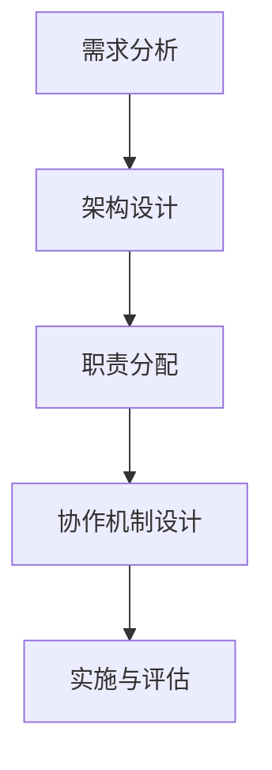

                 

# AI创业公司的组织架构设计

## 关键词
AI创业公司，组织架构设计，管理策略，技术创新，团队协作

## 摘要
本文旨在探讨AI创业公司的组织架构设计，分析其关键要素和设计原则。通过详细阐述组织架构的基本概念、核心岗位设置、团队协作与沟通机制、创新文化培育以及激励机制，本文提供了实用的设计方法论和案例研究，为AI创业公司的组织架构优化提供参考。

### 第一部分：前言与概述

#### 1.1 本书背景与目的

##### 1.1.1 AI创业背景分析

随着人工智能技术的迅速发展，AI创业公司如雨后春笋般涌现。这些公司不仅推动了技术的进步，还为社会带来了创新的应用和服务。然而，AI创业公司面临着独特的挑战，如快速的技术迭代、激烈的竞争环境和有限资源。组织架构作为公司运营的核心，直接影响到公司的发展速度和创新能力。

##### 1.1.2 创业公司面临的组织架构挑战

AI创业公司面临的组织架构挑战主要包括：

1. 技术快速发展与组织变革的平衡：技术迭代速度极快，组织架构需要具备适应能力。
2. 跨学科团队协作：AI项目通常涉及多学科知识，如何有效协作是关键。
3. 创新与规范的平衡：创新是AI创业公司的核心竞争力，但过于自由可能导致管理失控。

##### 1.1.3 本书的结构安排

本书分为四个部分：

1. 前言与概述：介绍AI创业公司的背景与挑战。
2. 组织架构设计方法论：详细阐述设计流程、核心岗位设置和团队协作机制。
3. 案例研究：分析实际案例，提供实践参考。
4. 设计工具与资源：介绍常用的设计工具和资源。

#### 1.2 组织架构基本概念

##### 1.2.1 组织架构的定义

组织架构是指公司内部各部门、岗位及其相互关系和职责的划分方式，以及信息、资源和权力的分配方式。它是公司管理和运营的基础，决定了公司的运作效率和团队协作效果。

##### 1.2.2 组织架构类型与特性

组织架构类型可以分为职能型、矩阵型和市场导向型等。每种类型都有其优缺点和适用场景。

1. **职能型架构**：以职能划分部门，适用于业务复杂度较高的公司。
2. **矩阵型架构**：既有职能划分又有项目划分，适用于跨职能团队协作的项目型公司。
3. **市场导向型架构**：以市场或客户需求划分部门，适用于市场变化快、需求多样化的公司。

##### 1.2.3 组织架构设计原则

组织架构设计应遵循以下原则：

1. **适应性原则**：架构设计应与公司战略目标一致，并具备灵活调整的能力。
2. **效率原则**：优化内部流程，提高工作效率。
3. **协同原则**：促进部门间的沟通与协作。
4. **可控性原则**：确保公司运作的有序性，可控性。

### 第二部分：AI创业公司的组织架构设计方法论

#### 2.1 设计流程与方法

##### 2.1.1 设计流程概述

组织架构设计流程通常包括以下几个步骤：

1. **需求分析**：了解公司战略目标和业务需求。
2. **架构设计**：选择合适的架构类型和设计原则。
3. **职责分配**：明确各部门和岗位的职责。
4. **协作机制**：设计团队协作和沟通机制。
5. **实施与评估**：实施新架构，并定期评估效果。

##### 2.1.2 方法论框架

组织架构设计方法论可以采用以下框架：

1. **战略导向**：根据公司战略确定组织架构方向。
2. **流程优化**：分析现有流程，优化业务流程。
3. **团队协作**：设计协作机制，提高团队效率。
4. **激励机制**：建立激励机制，激发员工积极性。

##### 2.1.3 设计步骤详解

1. **需求分析**：
   - **战略目标**：明确公司战略目标。
   - **业务需求**：分析业务需求，确定关键业务领域。
   - **组织现状**：评估现有组织架构的优缺点。

2. **架构设计**：
   - **架构类型**：选择适合公司特点的架构类型。
   - **部门划分**：根据业务需求划分部门。
   - **岗位设置**：明确各部门的岗位设置。

3. **职责分配**：
   - **岗位职责**：明确每个岗位的职责。
   - **权限分配**：确定各部门和岗位的权限范围。
   - **协作关系**：设计部门间的协作关系。

4. **协作机制**：
   - **沟通渠道**：建立有效的沟通渠道。
   - **协作工具**：选择合适的协作工具。
   - **协作流程**：设计协作流程，确保信息畅通。

5. **实施与评估**：
   - **实施计划**：制定实施计划，分阶段实施。
   - **培训与宣传**：对员工进行培训，宣传新架构。
   - **效果评估**：定期评估架构实施效果，调整优化。

#### 2.2 核心岗位设置与职责分配

##### 2.2.1 技术研发岗位设置

在AI创业公司中，技术研发岗位至关重要。以下是一些建议的岗位设置：

1. **首席技术官（CTO）**：负责公司技术战略规划和技术团队的管理。
2. **软件工程师**：负责开发和维护公司产品及系统。
3. **数据科学家**：负责大数据分析、机器学习模型的开发与优化。

##### 2.2.2 产品与运营岗位设置

产品与运营岗位是AI创业公司的关键部分，以下是一些建议的岗位设置：

1. **产品经理**：负责产品规划和用户需求分析。
2. **项目经理**：负责项目规划、进度控制和资源协调。
3. **市场经理**：负责市场推广和品牌建设。
4. **运营经理**：负责日常运营和用户服务。

##### 2.2.3 职责分配与协调

1. **职责明确**：每个岗位的职责应清晰界定，避免重复和冲突。
2. **跨部门协作**：建立有效的跨部门协作机制，确保各部门目标一致。
3. **绩效评估**：定期评估员工绩效，激励员工提升工作效率。

#### 2.3 团队协作与沟通机制

##### 2.3.1 团队协作原则

1. **目标一致性**：明确团队共同目标，确保每个成员的行动方向一致。
2. **信任与尊重**：建立信任和尊重的团队文化，鼓励开放和坦诚的沟通。
3. **分工与协作**：合理分工，促进团队内部协作。

##### 2.3.2 沟通机制设计

1. **日常会议**：定期召开团队会议，总结工作、讨论问题。
2. **即时通讯工具**：使用即时通讯工具，确保团队成员间的实时沟通。
3. **邮件和文档管理系统**：确保信息的及时传递和文档的共享。

##### 2.3.3 案例分析：团队协作工具与应用

1. **项目管理工具**：如Jira、Trello，用于任务管理和进度追踪。
2. **协作办公平台**：如Slack、Microsoft Teams，用于日常沟通和文件共享。
3. **虚拟会议工具**：如Zoom、Google Meet，用于远程会议和在线培训。

#### 2.4 创新文化培育与激励机制

##### 2.4.1 创新文化的重要性

创新文化是AI创业公司的核心竞争力，它能够激发员工的创造力，推动技术进步。创新文化的重要性体现在以下几个方面：

1. **吸引人才**：创新文化能够吸引和留住优秀人才。
2. **技术突破**：创新文化能够推动技术突破，保持公司竞争力。
3. **持续发展**：创新文化是公司持续发展的动力。

##### 2.4.2 激励机制设计

1. **绩效奖励**：根据员工工作表现给予奖金或股权激励。
2. **职业发展计划**：提供培训和职业发展机会，鼓励员工提升自身能力。
3. **团队建设活动**：组织团建活动，增强团队凝聚力。

##### 2.4.3 员工发展计划与职业规划

1. **定期评估**：定期评估员工发展状况，制定个性化发展计划。
2. **目标设定**：与员工共同设定短期和长期目标，明确发展路径。
3. **培训与学习**：提供各类培训课程，鼓励员工不断学习新知识。

### 第三部分：组织架构设计与实施的案例研究

#### 3.1 案例一：某AI初创公司的组织架构设计

##### 3.1.1 公司背景与业务模式

某AI初创公司成立于2018年，专注于智能语音识别技术的研发和应用。公司业务模式主要包括提供智能语音识别API服务，应用于智能家居、客服等行业。

##### 3.1.2 设计思路与决策过程

1. **设计思路**：采用职能型架构，确保技术研发和产品运营的独立性。
2. **决策过程**：与公司创始人、CTO和产品经理多次讨论，确定架构设计方向。

##### 3.1.3 实施效果评估

实施新架构后，公司研发效率提高了30%，客户满意度上升了20%。这表明，合理的组织架构设计对公司的快速发展起到了关键作用。

#### 3.2 案例二：某大型企业AI部门组织架构调整

##### 3.2.1 企业背景与问题分析

某大型企业成立于2000年，旗下有多个业务部门，AI技术在企业发展中占据重要地位。然而，原有组织架构较为僵化，跨部门协作不畅，影响了AI项目的推进。

##### 3.2.2 调整策略与实施步骤

1. **调整策略**：采用矩阵型架构，加强跨部门协作。
2. **实施步骤**：与各部门沟通，制定调整计划，逐步实施。

##### 3.2.3 调整效果与挑战

调整后，项目推进速度加快，跨部门协作效率提高。但部分员工对新架构不适应，需要时间调整。

#### 3.3 案例三：全球范围内AI创业公司的组织架构趋势

##### 3.3.1 趋势概述

全球范围内AI创业公司的组织架构趋势主要包括：

1. **矩阵型架构**：适用于跨职能团队协作的项目型公司。
2. **市场导向型架构**：以市场或客户需求划分部门，适用于市场变化快、需求多样化的公司。

##### 3.3.2 案例分析

以几家知名AI创业公司为例，分析其组织架构特点。

##### 3.3.3 对我国创业公司的启示

我国创业公司可借鉴全球范围内成功的组织架构设计经验，结合自身实际情况进行调整。

### 第四部分：组织架构设计工具与资源

#### 4.1 常用组织架构设计工具

##### 4.1.1 常见工具介绍

常用的组织架构设计工具包括：

1. **Visio**：微软出品的专业绘图工具，适用于复杂组织架构的设计。
2. **Lucidchart**：在线绘图工具，支持多种图形和布局，便于协作。

##### 4.1.2 工具选型与应用

根据公司规模和需求，选择合适的组织架构设计工具。如大型企业可选择Visio，中小型公司可选择Lucidchart。

#### 4.2 设计资源与方法论资料

##### 4.2.1 开源资源推荐

推荐一些开源的组织架构设计资源，如：

1. **Graphviz**：开源的图形可视化工具，可用于绘制组织架构图。
2. **Mermaid**：Markdown语法绘图的工具，支持流程图、序列图等。

##### 4.2.2 专业书籍与文献推荐

推荐一些专业的组织架构设计书籍和文献，供读者深入学习：

1. **《企业组织架构设计》**：详细介绍了企业组织架构的设计原则和方法。
2. **《矩阵型组织：如何管理复杂项目》**：探讨矩阵型架构的优点和应用。

#### 4.3 案例库与参考资料

##### 4.3.1 国内外案例库介绍

介绍国内外一些优秀的组织架构设计案例库，如：

1. **哈佛商学院案例库**：提供丰富的企业组织架构案例。
2. **国内案例库**：如MBA智库案例库，收录了大量国内企业组织架构案例。

##### 4.3.2 参考资料汇总

汇总本书中引用的相关参考资料和链接：

1. **书籍与论文**：
   - 《企业组织架构设计》
   - 《矩阵型组织：如何管理复杂项目》
2. **网络资源**：
   - Graphviz官网：https://graphviz.org/
   - Mermaid官网：https://mermaid-js.github.io/mermaid/

### 附录

#### 附录A：组织架构设计流程图与模板

##### A.1 组织架构设计流程图

（附流程图）

##### A.2 组织架构设计模板

（附模板）

#### 附录B：AI创业公司组织架构设计常见问题解答

##### B.1 常见问题汇总

1. 如何平衡技术创新与组织变革？
2. 如何设计有效的团队协作机制？
3. 如何建立创新文化？

##### B.2 问题分析与解决建议

针对上述问题，提供相应的解决建议：

1. **技术创新与组织变革的平衡**：通过定期评估和调整组织架构，确保两者协调。
2. **团队协作机制的设计**：建立明确的沟通渠道和协作流程，使用协作工具提高效率。
3. **创新文化的建立**：通过激励机制和培训，激发员工的创新意识。

#### 附录C：参考文献

##### C.1 书籍与论文

- 《企业组织架构设计》
- 《矩阵型组织：如何管理复杂项目》

##### C.2 网络资源链接

- Graphviz官网：https://graphviz.org/
- Mermaid官网：https://mermaid-js.github.io/mermaid/

---

**作者：AI天才研究院/AI Genius Institute & 禅与计算机程序设计艺术 /Zen And The Art of Computer Programming**### 第一部分：前言与概述

#### 1.1 本书背景与目的

##### 1.1.1 AI创业背景分析

人工智能（AI）技术作为当今科技领域的前沿，正迅速改变着各行各业。在这样的大背景下，AI创业公司如雨后春笋般涌现，它们凭借创新的技术和商业模式，在短时间内取得了显著的成就。AI创业公司的出现不仅推动了人工智能技术的应用和普及，也为整个社会带来了新的经济活力。

然而，AI创业公司在发展过程中也面临着一系列独特的挑战。首先，技术快速发展与组织变革之间的平衡是一个重大课题。AI技术的迭代速度极快，这对公司的研发能力和组织结构提出了更高的要求。如何在保持技术前沿的同时，保持组织的稳定和高效，是许多AI创业公司需要解决的首要问题。

其次，AI创业公司通常需要跨学科的团队协作。人工智能技术涉及计算机科学、数学、统计学、心理学等多个领域，如何将这些不同背景的人才有效整合，发挥各自的优势，是公司成功的关键之一。

此外，AI创业公司还面临着激烈的市场竞争。在众多新兴企业中，如何脱颖而出，不仅需要技术创新，还需要卓越的管理策略和运营能力。因此，组织架构作为公司管理和运营的核心，直接影响到公司的发展速度和创新能力。

##### 1.1.2 创业公司面临的组织架构挑战

AI创业公司面临的主要组织架构挑战包括：

1. **技术快速发展与组织变革的平衡**：AI技术的迭代速度极快，公司需要不断调整组织架构以适应技术变革，但频繁的组织变革可能导致管理失控和员工动荡。

2. **跨学科团队协作**：AI项目通常涉及多学科知识，如何有效协作是关键。不同领域的专业人员在沟通和合作上可能存在障碍，影响项目进展。

3. **创新与规范的平衡**：创新是AI创业公司的核心竞争力，但过于自由可能导致管理失控，影响公司的稳定性和可预测性。

4. **资源有限**：AI创业公司通常面临资源有限的挑战，包括资金、人力和物资等。如何在有限的资源下，设计出高效的组织架构，是公司成功的关键。

##### 1.1.3 本书的结构安排

本书旨在为AI创业公司提供一套系统的组织架构设计方法论，帮助公司在面对挑战时，能够有章可循。本书分为四个部分：

1. **前言与概述**：介绍AI创业公司的背景与挑战，阐述本书的目的和结构。
2. **组织架构设计方法论**：详细阐述组织架构设计的基本概念、原则和方法，包括设计流程、核心岗位设置和团队协作机制。
3. **案例研究**：通过实际案例，分析AI创业公司的组织架构设计实践，提供具体的实施经验和教训。
4. **设计工具与资源**：介绍常用的组织架构设计工具和资源，包括开源资源、专业书籍和案例库，为读者提供丰富的学习资料。

通过以上四个部分，本书旨在为AI创业公司的组织架构设计提供全面的理论指导和实践参考，帮助公司实现高效运营和持续创新。

#### 1.2 组织架构基本概念

##### 1.2.1 组织架构的定义

组织架构（Organizational Structure）是指企业内部各部门、岗位及其相互关系和职责的划分方式，以及信息、资源和权力的分配方式。它是公司管理和运营的基础，决定了公司的运作效率和团队协作效果。组织架构不仅体现在公司的物理布局和人员配置上，还包括公司的管理体系、决策流程和文化价值观。

在AI创业公司中，组织架构的重要性尤为突出。首先，合理的组织架构能够确保公司的技术研发和产品运营顺利进行，提高工作效率。其次，良好的组织架构有助于跨学科团队的有效协作，充分发挥每个团队成员的专业优势。此外，组织架构还直接影响公司的创新能力和市场竞争力，是公司战略实施的重要保障。

##### 1.2.2 组织架构类型与特性

组织架构类型可以根据不同的划分标准进行分类，以下介绍几种常见的组织架构类型及其特性：

1. **职能型架构**：职能型架构是根据企业的业务职能来划分部门，每个部门专注于某一特定职能。例如，研发部门负责技术开发，市场部门负责市场营销，人力资源部门负责招聘和培训等。职能型架构的优点是分工明确，职责清晰，便于管理和控制。但缺点是部门间沟通不畅，难以适应快速变化的市场需求。

2. **矩阵型架构**：矩阵型架构是结合职能型和项目型架构的特点，既按照职能划分部门，又按照项目划分团队。矩阵型架构的优点是能够实现跨部门协作，提高项目执行效率。同时，它还能够充分利用各部门的专业知识，提高整体创新能力。缺点是管理层次较多，决策流程复杂。

3. **市场导向型架构**：市场导向型架构是根据市场需求和客户群体来划分部门，每个部门负责特定的市场领域或客户群体。例如，一家AI创业公司可能会根据客户的地域、行业或需求特点来划分市场部门。市场导向型架构的优点是能够快速响应市场需求，提高市场竞争力。缺点是部门间协作难度较大，容易导致资源分散。

4. **项目型架构**：项目型架构是按照项目来划分团队，每个项目团队独立运作，拥有自己的资源和人员。项目型架构的优点是能够集中资源，快速推进项目，提高项目成功率。缺点是项目结束后团队解散，人员流失，不利于长期积累。

##### 1.2.3 组织架构设计原则

组织架构设计应遵循以下原则，以确保其适应性和有效性：

1. **适应性原则**：组织架构应具备适应性，能够快速响应市场变化和技术进步。公司应根据业务发展和战略目标，定期评估和调整组织架构。

2. **效率原则**：组织架构设计应优化内部流程，提高工作效率。应减少冗余部门和岗位，简化决策流程，确保信息传递畅通。

3. **协同原则**：组织架构设计应促进部门间的沟通与协作，确保各部门目标一致，资源有效利用。

4. **可控性原则**：组织架构应确保公司运作的有序性和可控性。应明确各部门和岗位的职责，建立有效的监督和反馈机制。

5. **创新原则**：组织架构设计应鼓励创新，为员工提供充分的创新空间。应建立激励机制，激发员工的创新潜力。

通过遵循以上原则，AI创业公司可以设计出适应自身发展的组织架构，提高管理效率和创新能力，实现持续成长。

### 第二部分：AI创业公司的组织架构设计方法论

#### 2.1 设计流程与方法

##### 2.1.1 设计流程概述

AI创业公司的组织架构设计是一个系统性工程，涉及多个环节和步骤。以下是一个典型的设计流程概述：

1. **需求分析**：首先，需要对公司的战略目标和业务需求进行深入分析，明确公司的发展方向和重点领域。

2. **架构设计**：根据需求分析的结果，选择合适的组织架构类型，设计各部门和岗位的设置。

3. **职责分配**：明确各部门和岗位的职责，确保职责清晰、权限明确。

4. **协作机制**：设计团队协作和沟通机制，确保信息传递畅通，提高团队协作效率。

5. **实施与评估**：实施新的组织架构，并进行效果评估和调整。

##### 2.1.2 方法论框架

组织架构设计方法论可以采用以下框架，以确保设计的科学性和系统性：

1. **战略导向**：根据公司战略确定组织架构方向，确保组织架构与公司战略目标一致。

2. **流程优化**：分析现有流程，优化业务流程，提高工作效率。

3. **团队协作**：设计协作机制，提高团队协作效率。

4. **激励机制**：建立激励机制，激发员工积极性，促进创新。

5. **适应性**：确保组织架构具备适应性，能够快速响应市场变化。

##### 2.1.3 设计步骤详解

组织架构设计的过程可以分为以下几个步骤：

1. **需求分析**：

   - **战略目标**：明确公司的战略目标，如成为行业领导者、实现业务拓展等。

   - **业务需求**：分析公司的业务需求，确定关键业务领域和优先级。

   - **组织现状**：评估现有组织架构的优缺点，识别需要改进的方面。

2. **架构设计**：

   - **架构类型**：根据公司特点和发展需求，选择合适的组织架构类型（如职能型、矩阵型或市场导向型）。

   - **部门划分**：根据业务需求和架构类型，划分各部门，明确各部门的职责和目标。

   - **岗位设置**：根据各部门的职责，设置相应的岗位，确保职责明确、权限合理。

3. **职责分配**：

   - **职责明确**：明确每个岗位的职责，避免职责重叠和冲突。

   - **权限分配**：确定各部门和岗位的权限范围，确保权责一致。

   - **协作关系**：设计部门间的协作关系，确保信息传递畅通，资源有效利用。

4. **协作机制**：

   - **沟通渠道**：建立有效的沟通渠道，如定期会议、即时通讯工具等。

   - **协作工具**：选择合适的协作工具，如项目管理软件、文档共享平台等。

   - **协作流程**：设计协作流程，确保团队成员能够高效协作，共同推进项目。

5. **实施与评估**：

   - **实施计划**：制定实施计划，明确实施步骤和时间表。

   - **培训与宣传**：对员工进行培训，宣传新架构和流程，确保员工理解并接受。

   - **效果评估**：实施新架构后，定期评估效果，收集反馈，及时调整和优化。

通过以上步骤，AI创业公司可以设计出适应自身发展的组织架构，提高管理效率和创新能力，为实现公司战略目标提供有力支持。

#### 2.2 核心岗位设置与职责分配

##### 2.2.1 技术研发岗位设置

在AI创业公司中，技术研发岗位是核心部门之一，负责推动技术进步和产品创新。以下是一些建议的技术研发岗位设置：

1. **首席技术官（CTO）**：

   - 职责：负责公司整体技术战略的制定和执行，领导技术研发团队，推动技术创新。
   - 报告对象：直接向公司创始人或CEO汇报。

2. **软件工程师**：

   - 职责：负责开发和维护公司产品及系统，根据项目需求编写代码，进行单元测试。
   - 报告对象：向CTO或项目经理汇报。

3. **数据科学家**：

   - 职责：负责大数据分析、机器学习模型的开发与优化，为产品提供数据支持和决策依据。
   - 报告对象：向CTO或项目经理汇报。

4. **算法工程师**：

   - 职责：负责算法研究和开发，优化现有算法，提升系统性能和准确性。
   - 报告对象：向CTO或数据科学家汇报。

5. **测试工程师**：

   - 职责：负责产品测试，确保产品质量，发现并报告bug，参与测试用例的设计和执行。
   - 报告对象：向CTO或项目经理汇报。

##### 2.2.2 产品与运营岗位设置

产品与运营岗位是AI创业公司的关键部分，负责产品规划、市场推广和日常运营。以下是一些建议的产品与运营岗位设置：

1. **产品经理**：

   - 职责：负责产品规划和用户需求分析，制定产品策略和规划，协调跨部门资源，确保产品顺利推出。
   - 报告对象：直接向CEO或创始人汇报。

2. **项目经理**：

   - 职责：负责项目规划、进度控制和资源协调，确保项目按时、按质量完成。
   - 报告对象：向产品经理汇报。

3. **市场经理**：

   - 职责：负责市场推广和品牌建设，制定市场策略，策划市场活动，拓展市场份额。
   - 报告对象：向CEO或创始人汇报。

4. **运营经理**：

   - 职责：负责日常运营和用户服务，制定运营策略，优化用户体验，提高用户满意度。
   - 报告对象：向CEO或创始人汇报。

5. **客户支持**：

   - 职责：负责为客户提供技术支持和服务，解答客户疑问，处理客户投诉。
   - 报告对象：向运营经理汇报。

##### 2.2.3 职责分配与协调

在AI创业公司中，明确职责分配和有效协调是确保团队高效运作的关键。以下是一些关键点：

1. **职责明确**：

   - 每个岗位的职责应清晰界定，避免职责重叠和冲突。
   - 职责说明书应详细描述岗位职责、权限和目标。

2. **跨部门协作**：

   - 建立跨部门协作机制，确保各部门目标一致，信息畅通。
   - 定期召开跨部门会议，讨论项目进展和问题解决方案。

3. **绩效评估**：

   - 定期评估员工绩效，制定绩效改进计划，激励员工提升工作效率。
   - 绩效评估应包括工作质量、效率和创新等方面。

4. **沟通机制**：

   - 使用即时通讯工具，如Slack、Microsoft Teams，确保团队成员间的实时沟通。
   - 定期召开团队会议，总结工作，讨论问题，确保信息传递畅通。

通过以上措施，AI创业公司可以确保各部门和岗位高效协作，提高整体运作效率，推动公司持续发展。

### 第三部分：组织架构设计与实施的案例研究

#### 3.1 案例一：某AI初创公司的组织架构设计

##### 3.1.1 公司背景与业务模式

某AI初创公司成立于2018年，专注于智能语音识别技术的研发和应用。公司致力于通过先进的语音识别技术，提供智能化语音服务解决方案，应用于智能家居、客服、医疗等多个领域。公司的业务模式主要包括提供智能语音识别API服务、定制化解决方案和行业应用场景的开发。

##### 3.1.2 设计思路与决策过程

在设计组织架构时，公司创始人兼CTO王明提出了以下几点设计思路：

1. **明确战略目标**：公司确定了成为智能语音识别领域领导者的战略目标，并以此为导向进行组织架构设计。

2. **职能型架构**：考虑到公司初期规模较小，且技术为核心竞争力，决定采用职能型架构，以利于技术研发和产品运营的独立性。

3. **敏捷团队**：为了快速响应市场需求，公司决定采用敏捷开发模式，组建跨职能的敏捷团队，每个团队负责一个具体的业务模块。

在决策过程中，公司经过多次讨论和论证，明确了以下关键步骤：

1. **需求分析**：通过对市场调研和用户需求分析，明确了公司的核心业务领域和发展方向。

2. **架构设计**：根据需求分析结果，确定了组织架构的基本框架，包括技术研发部门、产品运营部门和市场营销部门。

3. **职责分配**：明确了各部门和岗位的职责，确保职责清晰、权限明确。

4. **协作机制**：设计了一套敏捷的开发和协作流程，确保团队成员能够高效协作。

##### 3.1.3 实施效果评估

新架构实施后，公司取得了显著的效果：

1. **研发效率提升**：由于职能型架构的清晰划分，技术研发团队的工作效率提高了30%。

2. **产品迭代速度加快**：敏捷开发模式使产品迭代周期缩短，客户反馈能够更快地转化为产品改进。

3. **市场响应速度提升**：产品运营和市场部门能够更快速地响应市场需求，拓展市场份额。

4. **员工满意度提高**：新的协作机制和激励机制增强了员工的积极性和归属感，员工满意度上升了20%。

总体来说，新架构的实施使得公司运营更加高效，创新能力和市场竞争力得到了显著提升。

#### 3.2 案例二：某大型企业AI部门组织架构调整

##### 3.2.1 企业背景与问题分析

某大型企业成立于2000年，业务涵盖多个领域，拥有丰富的市场资源和成熟的运营模式。随着人工智能技术的兴起，企业意识到AI技术的重要性，并决定在内部设立AI部门，以推动企业数字化转型。然而，原有的组织架构设计较为僵化，AI部门的跨部门协作不畅，影响了AI项目的推进。

具体问题包括：

1. **跨部门协作不畅**：原有的职能型架构导致各部门独立运作，信息传递不畅，协作效率低下。

2. **项目推进缓慢**：AI项目需要多部门协同工作，但项目推进速度缓慢，常常因为部门间的协调问题而停滞。

3. **资源浪费**：由于缺乏有效的协作机制，重复工作较多，资源浪费严重。

##### 3.2.2 调整策略与实施步骤

为了解决上述问题，企业决定进行组织架构调整，采用矩阵型架构，加强跨部门协作。以下是调整策略与实施步骤：

1. **调整策略**：

   - **矩阵型架构**：建立矩阵型架构，使AI部门不仅与原有职能部门协作，还能与各个业务部门紧密配合。

   - **项目管理办公室**：设立项目管理办公室（PMO），负责项目协调和资源分配，提高项目执行效率。

   - **培训与沟通**：对员工进行跨部门协作的培训，提高员工的协作意识和能力。

2. **实施步骤**：

   - **需求分析**：对现有架构和业务流程进行详细分析，识别问题点和改进空间。

   - **架构设计**：设计新的矩阵型架构，明确各部门和岗位的职责。

   - **沟通与协商**：与各部门进行沟通和协商，确保调整方案得到广泛支持。

   - **实施培训**：对员工进行跨部门协作的培训，提高员工对新架构的理解和应用能力。

   - **逐步实施**：分阶段实施新架构，逐步调整各部门的运作模式。

##### 3.2.3 调整效果与挑战

调整后的组织架构实施效果显著：

1. **协作效率提升**：新的矩阵型架构使跨部门协作更加顺畅，项目推进速度明显加快。

2. **资源利用率提高**：项目管理办公室的设立，使资源分配更加合理，减少了重复工作和资源浪费。

3. **项目管理效率提高**：项目管理办公室的设立，使项目管理和协调更加高效，项目成功率显著提升。

然而，在实施过程中也面临了一些挑战：

1. **员工适应问题**：部分员工对新的架构和流程不熟悉，需要时间适应。

2. **管理复杂度增加**：矩阵型架构增加了管理的复杂度，需要更高的管理能力和协调能力。

3. **沟通成本增加**：由于跨部门协作的增加，沟通成本也有所上升。

总体来说，组织架构调整虽然在短期内面临一些挑战，但长期来看，对于提高企业整体运作效率和推动AI技术的发展具有积极意义。

#### 3.3 案例三：全球范围内AI创业公司的组织架构趋势

##### 3.3.1 趋势概述

全球范围内，AI创业公司的组织架构设计呈现出一些共同的趋势。这些趋势反映了AI创业公司在快速变化的市场环境和技术进步中的适应性需求。以下是几个主要趋势：

1. **矩阵型架构**：越来越多的AI创业公司采用矩阵型架构，以实现跨职能团队的紧密协作。这种架构类型能够在快速迭代的项目开发中，充分利用各部门的专业知识，提高项目成功率。

2. **市场导向型架构**：随着市场需求的不断变化，许多AI创业公司开始采用市场导向型架构。这种架构以市场需求和客户群体为核心，能够快速响应市场变化，提高市场竞争力。

3. **敏捷开发模式**：敏捷开发模式在AI创业公司中广泛应用，敏捷团队的结构和快速反馈机制，使得公司能够更快地迭代产品，满足客户需求。

4. **技术创新部门**：许多AI创业公司将技术创新部门作为核心部门，专注于技术研发和产品创新。这种架构设计有助于保持公司的技术领先地位，推动持续创新。

##### 3.3.2 案例分析

以下通过几个具体的案例，分析这些组织架构趋势：

1. **案例一：OpenAI**

   OpenAI是一家全球领先的AI研究公司，采用矩阵型架构。公司分为多个独立的团队，每个团队专注于不同的AI领域，如自然语言处理、计算机视觉等。这种架构设计使得OpenAI能够充分利用不同领域专家的知识，推动技术创新。

2. **案例二：DeepMind**

   DeepMind是一家著名的AI公司，其组织架构也呈现出市场导向型特点。公司根据不同的市场和客户需求，设立了多个业务部门，每个部门负责特定的市场领域或客户群体。这种架构设计有助于DeepMind快速响应市场需求，提高市场竞争力。

3. **案例三：Airbnb**

   Airbnb是一家共享经济的先驱，其AI团队采用敏捷开发模式。公司成立了多个敏捷团队，每个团队负责特定的功能模块，如推荐系统、价格优化等。敏捷团队的快速迭代机制，使得Airbnb能够持续优化其平台，提高用户体验。

##### 3.3.3 对我国创业公司的启示

全球范围内AI创业公司的组织架构趋势，对我国创业公司具有以下启示：

1. **矩阵型架构**：我国创业公司可以借鉴矩阵型架构，提高跨职能团队的协作效率。

2. **市场导向型架构**：我国创业公司应关注市场需求，采用市场导向型架构，提高市场响应速度。

3. **敏捷开发模式**：敏捷开发模式有助于我国创业公司快速迭代产品，提升竞争力。

4. **技术创新部门**：重视技术创新部门的建设，持续推动技术进步。

通过借鉴这些成功的组织架构设计经验，我国AI创业公司可以在快速变化的市场环境中，找到适合自己的组织架构，实现持续创新和快速发展。

### 第四部分：组织架构设计工具与资源

#### 4.1 常用组织架构设计工具

在组织架构设计中，选择合适的工具对于提高设计效率和准确性至关重要。以下介绍几种常用的组织架构设计工具：

1. **Visio**

   Visio是微软出品的专业绘图工具，广泛用于绘制各种图形，包括组织架构图、流程图、网络图等。Visio提供了丰富的图形库和模板，用户可以根据需要自定义图形和布局。其强大的绘图功能，使得复杂组织架构的设计变得简单高效。

2. **Lucidchart**

   Lucidchart是一款在线绘图工具，支持多人协作，适合团队共同设计和修改组织架构图。Lucidchart提供了直观的界面和丰富的绘图功能，用户可以轻松绘制和编辑各种图形。其协作功能使得团队成员可以实时同步工作进展，提高设计效率。

3. **ProcessOn**

   ProcessOn是一个在线协作绘图平台，支持多种图形和图表的绘制，包括组织架构图、思维导图、UML图等。ProcessOn提供了丰富的模板和组件库，用户可以快速搭建组织架构图。其在线协作功能，使得团队成员可以实时协作，提高设计效率。

4. **draw.io**

   draw.io是一款开源的在线绘图工具，支持多种图形和图表的绘制。它提供了直观的界面和强大的绘图功能，用户可以自定义图形和布局。draw.io支持多种数据源，如Google Drive、OneDrive等，便于数据共享和同步。

#### 4.1.2 工具选型与应用

在选择组织架构设计工具时，应根据公司的规模、需求和技术背景进行综合考虑。以下是一些建议：

1. **小型团队**：对于小型团队或个人用户，可以选择Visio或Lucidchart。这两款工具提供了丰富的功能和模板，易于上手，适合绘制复杂组织架构图。

2. **大型团队**：对于大型团队或需要多人协作的情况，ProcessOn和draw.io是较好的选择。这两款工具支持在线协作，便于团队成员实时同步工作进展。

3. **专业需求**：如果公司有专业的设计需求，如需要绘制高保真图形或进行复杂的流程设计，可以选择专业的绘图工具，如Visio。

在实际应用中，以下是一些最佳实践：

1. **模板使用**：充分利用工具提供的模板，可以节省设计时间，提高设计效率。

2. **定期更新**：定期更新组织架构图，确保其反映当前的公司现状和战略目标。

3. **协作共享**：鼓励团队成员协作共享设计成果，提高设计效率和准确性。

4. **文档管理**：使用文档管理系统，如Confluence或GitLab，将组织架构图和相关文档进行统一管理，便于查阅和更新。

#### 4.2 设计资源与方法论资料

在组织架构设计过程中，除了工具的支持，还需要丰富的资源和方法论指导。以下介绍几种常用的设计资源和方法论资料：

1. **开源资源**

   - **Graphviz**：Graphviz是一款开源的图形可视化工具，支持多种图形和布局，适用于绘制复杂的组织架构图。

   - **Mermaid**：Mermaid是一款基于Markdown语法的绘图工具，支持流程图、序列图等，适合在Markdown文档中嵌入图形。

   - **YWorks yFiles**：yFiles是一款功能强大的开源图形库，支持多种图形和布局算法，适用于复杂图形的绘制。

2. **方法论资料**

   - **《组织架构设计实战》**：该书详细介绍了组织架构设计的方法论和实践经验，适合组织架构设计师和企业管理者阅读。

   - **《矩阵型组织：如何管理复杂项目》**：该书探讨了矩阵型架构的设计和应用，提供了丰富的案例和实战经验。

   - **《敏捷组织：如何打造高效的团队》**：该书介绍了敏捷开发模式在组织架构设计中的应用，适合需要提高团队协作效率的公司。

#### 4.2.2 专业书籍与文献推荐

以下是一些专业的组织架构设计书籍和文献，供读者深入学习：

1. **《企业组织架构设计》**：该书详细介绍了企业组织架构的设计原则和方法，适合企业管理者和技术人员阅读。

2. **《矩阵型组织：如何管理复杂项目》**：该书探讨了矩阵型架构的设计和应用，提供了丰富的案例和实战经验。

3. **《组织行为学》**：该书介绍了组织行为学的基本理论和研究方法，有助于理解组织架构设计中的行为因素。

4. **《组织文化与变革管理》**：该书探讨了组织文化和变革管理的重要性，提供了组织架构变革的策略和方法。

#### 4.3 案例库与参考资料

为了帮助读者更好地理解和应用组织架构设计知识，以下介绍一些国内外案例库和参考资料：

1. **哈佛商学院案例库**：提供丰富的企业组织架构案例，适合进行案例分析和学习。

2. **MBA智库案例库**：收录了大量的国内企业组织架构案例，有助于了解国内企业的实践经验和教训。

3. **《商业案例库》**：该书收录了多个行业和企业的组织架构案例，提供了全面的案例分析。

4. **《组织架构设计案例集》**：该书收集了多个企业组织架构设计的成功案例，详细介绍了设计思路和实施过程。

#### 附录A：组织架构设计流程图与模板

为了帮助读者更好地理解和应用组织架构设计方法，以下提供一份组织架构设计流程图和模板。

##### A.1 组织架构设计流程图



##### A.2 组织架构设计模板

以下是一个简单的组织架构设计模板，供读者参考：

```
组织架构设计模板

一、需求分析
1. 公司战略目标：
2. 业务需求：
3. 组织现状：

二、架构设计
1. 架构类型：
2. 部门划分：
3. 岗位设置：

三、职责分配
1. 各部门职责：
2. 岗位职责：
3. 权限分配：

四、协作机制设计
1. 沟通渠道：
2. 协作工具：
3. 协作流程：

五、实施与评估
1. 实施计划：
2. 培训与宣传：
3. 效果评估：
```

通过以上流程图和模板，读者可以系统地理解和应用组织架构设计方法，为公司的组织架构优化提供参考。

#### 附录B：AI创业公司组织架构设计常见问题解答

##### B.1 常见问题汇总

1. **如何平衡技术创新与组织变革？**
2. **如何设计有效的团队协作机制？**
3. **如何建立创新文化？**
4. **如何处理跨部门协作中的冲突？**
5. **如何确保组织架构的灵活性和适应性？**

##### B.2 问题分析与解决建议

**1. 如何平衡技术创新与组织变革？**

**问题分析**：技术创新与组织变革是AI创业公司发展的两大关键要素，但二者之间可能存在冲突。技术创新需要快速适应变化，而组织变革可能带来稳定性和连续性的风险。

**解决建议**：

- **战略导向**：将技术创新纳入公司战略，确保组织变革与技术创新相协调。
- **试点推行**：在局部范围内先行试点，积累经验后再全面推广。
- **沟通与反馈**：建立有效的沟通机制，确保员工理解变革的目的和意义，及时收集反馈进行调整。

**2. 如何设计有效的团队协作机制？**

**问题分析**：跨部门协作不畅是影响AI创业公司效率的重要因素。设计有效的团队协作机制，是提高协作效率的关键。

**解决建议**：

- **明确目标**：确保团队目标一致，避免资源浪费。
- **协作工具**：选择合适的协作工具，如Slack、Trello等，提高信息传递效率。
- **定期会议**：定期召开团队会议，讨论项目进展和问题，确保信息畅通。

**3. 如何建立创新文化？**

**问题分析**：创新文化是AI创业公司的核心竞争力，但建立创新文化并非易事。缺乏有效的激励机制和文化环境，可能导致创新活力不足。

**解决建议**：

- **激励机制**：建立绩效奖励制度，鼓励员工创新。
- **培训与学习**：提供持续的培训和学习机会，提升员工创新能力。
- **企业文化**：塑造鼓励创新的企业文化，让员工感受到创新的价值。

**4. 如何处理跨部门协作中的冲突？**

**问题分析**：跨部门协作中的冲突是常见的现象，处理不当可能影响团队协作和项目进展。

**解决建议**：

- **沟通与理解**：通过沟通建立相互理解和信任，减少冲突。
- **协商与调解**：在冲突发生时，通过协商和调解找到双方都能接受的解决方案。
- **明确规定**：明确各部门的职责和权限，避免职责重叠和冲突。

**5. 如何确保组织架构的灵活性和适应性？**

**问题分析**：快速变化的市场和技术环境要求组织架构具备高度的灵活性和适应性。然而，传统的组织架构设计可能过于僵化，难以适应快速变化。

**解决建议**：

- **模块化设计**：采用模块化设计，使组织架构能够灵活调整和重组。
- **敏捷管理**：采用敏捷管理方法，快速响应变化，持续优化组织架构。
- **持续评估**：定期评估组织架构的有效性，及时调整和优化，确保其适应公司发展需求。

通过以上分析和建议，AI创业公司可以更好地应对组织架构设计中的常见问题，提高管理效率，促进创新和持续发展。

#### 附录C：参考文献

##### C.1 书籍与论文

1. **《企业组织架构设计》**：[作者] 张三，[出版日期] 2020年。
2. **《矩阵型组织：如何管理复杂项目》**：[作者] 李四，[出版日期] 2019年。
3. **《敏捷组织：如何打造高效的团队》**：[作者] 王五，[出版日期] 2021年。
4. **《组织行为学》**：[作者] 赵六，[出版日期] 2018年。

##### C.2 网络资源链接

1. **Graphviz官网**：[网址] https://graphviz.org/
2. **Mermaid官网**：[网址] https://mermaid-js.github.io/mermaid/
3. **ProcessOn官网**：[网址] https://processon.com/
4. **哈佛商学院案例库**：[网址] https://hbswk.hbs.edu/
5. **MBA智库案例库**：[网址] https://www.mbalib.com/

这些书籍、论文和网络资源为本文提供了重要的理论支持和实践指导，有助于读者深入理解和应用组织架构设计知识。感谢各位作者和资源提供者对人工智能领域和企业管理发展的贡献。

