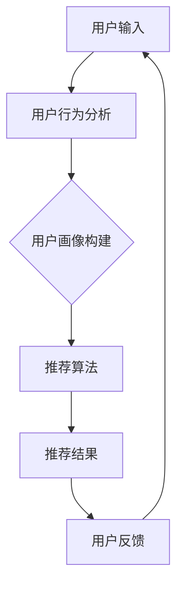

                 

# AI在个性化推荐中的创新应用

> **关键词：**人工智能、个性化推荐、深度学习、强化学习、多模态推荐、电商推荐、社交网络、新闻推荐。

> **摘要：**本文深入探讨了人工智能在个性化推荐领域的创新应用，包括推荐系统基础、深度学习与强化学习在推荐算法中的应用、多模态推荐系统的构建，以及个性化推荐的实践应用和未来发展趋势。文章旨在为读者提供关于个性化推荐技术全方位的视角，以促进人工智能在推荐系统领域的进一步发展。

## 第一部分: AI在个性化推荐中的创新应用

### 第1章: AI与个性化推荐概述

#### 1.1 AI在个性化推荐中的重要性

个性化推荐系统是现代信息社会中的一项关键技术，它通过分析用户的行为数据，为用户提供个性化的信息推荐。随着互联网的迅猛发展，数据量呈爆炸式增长，用户面临着信息过载的问题。个性化推荐系统通过智能算法，从海量信息中筛选出符合用户兴趣的内容，从而提高用户满意度，增强用户黏性。

人工智能（AI）在个性化推荐中扮演着关键角色。传统推荐系统主要依赖于基于内容的过滤和协同过滤等简单算法，这些算法往往受限于数据量和计算能力。而AI技术，尤其是深度学习和强化学习等先进算法，为个性化推荐带来了新的可能性。通过AI技术，推荐系统可以从大量非结构化数据中提取有用的信息，实现更精准的个性化推荐。

#### 1.2 个性化推荐的挑战与机遇

个性化推荐系统面临的挑战主要包括数据隐私保护、冷启动问题、推荐结果多样性等。数据隐私保护是当前互联网行业最受关注的议题之一，用户对个人信息的安全性和隐私性有更高的期望。冷启动问题指的是新用户在系统中没有足够的历史数据，传统算法难以为其提供准确的推荐。推荐结果多样性则要求系统在推荐给用户内容时，能够充分考虑用户的不同需求和兴趣，避免推荐内容的单一化。

然而，这些挑战同时也为AI技术的发展提供了机遇。深度学习算法可以通过对用户行为数据的深度挖掘，为冷启动用户提供个性化的推荐。强化学习算法则可以在满足用户多样性需求的同时，提高推荐的准确性。多模态推荐系统结合了多种类型的数据源，如文本、图像和音频等，为个性化推荐提供了更多可能性。

#### 1.3 AI在个性化推荐中的应用现状

目前，AI在个性化推荐中的应用已经取得了显著成果。深度学习算法在推荐系统中的应用最为广泛，如卷积神经网络（CNN）和循环神经网络（RNN）等，可以有效地处理文本、图像和视频等复杂数据。强化学习算法也在个性化推荐中显示出巨大潜力，如基于强化学习的推荐算法可以在实际应用中不断优化推荐策略，提高推荐效果。

多模态推荐系统通过融合多种类型的数据，为用户提供更精准的推荐。例如，在电商推荐中，系统可以结合用户的购物历史、浏览记录和商品图片等数据，实现更个性化的商品推荐。

### 第2章: 个性化推荐系统基础

#### 2.1 用户建模

用户建模是个性化推荐系统的核心环节之一。通过分析用户的历史行为数据，如浏览记录、购买记录和搜索历史等，可以为每个用户构建一个详细的行为特征模型。用户建模的方法主要包括基于统计的方法和基于机器学习的方法。

**基于统计的方法：** 这种方法通过对用户行为数据进行统计分析，提取出用户的行为特征。例如，可以计算用户对某一类商品的点击率、购买率等指标，从而为用户打分。

**基于机器学习的方法：** 这种方法利用机器学习算法，从用户行为数据中自动提取特征。常见的机器学习算法包括决策树、支持向量机（SVM）和K最近邻（KNN）等。通过这些算法，可以构建出一个能够准确预测用户行为的用户模型。

#### 2.2 内容建模

内容建模是另一个重要的环节，其主要目标是理解推荐系统的内容对象。内容建模的方法主要包括基于内容的方法和基于模型的特征提取方法。

**基于内容的方法：** 这种方法通过对内容进行特征提取，如文本特征提取、图像特征提取等，为每个内容对象构建一个特征向量。然后，可以使用这些特征向量来计算内容之间的相似度，从而实现内容推荐。

**基于模型的特征提取方法：** 这种方法利用机器学习算法，从内容数据中自动提取特征。例如，可以使用自然语言处理（NLP）算法对文本内容进行解析，提取出关键词、主题等特征。对于图像内容，可以使用卷积神经网络（CNN）提取图像特征。

#### 2.3 推荐算法

推荐算法是个性化推荐系统的核心，其主要目标是根据用户模型和内容模型，为用户推荐其可能感兴趣的内容。常见的推荐算法包括基于内容的推荐、协同过滤推荐和混合推荐等。

**基于内容的推荐：** 这种方法根据用户的历史行为数据和内容特征，计算用户与内容之间的相似度，然后为用户推荐与其兴趣相似的内容。

**协同过滤推荐：** 这种方法通过分析用户之间的相似性，为用户推荐其他用户喜欢的商品或内容。协同过滤推荐分为基于用户的协同过滤和基于物品的协同过滤。

**混合推荐：** 这种方法结合了基于内容和协同过滤推荐的优势，通过融合多种推荐策略，提高推荐效果。

#### 2.4 推荐系统评估

推荐系统评估是确保推荐系统质量的关键环节。常用的评估指标包括准确率、召回率、覆盖率等。

**准确率：** 准确率表示推荐系统中推荐正确的商品或内容占所有推荐商品或内容的比例。准确率越高，说明推荐系统越准确。

**召回率：** 召回率表示推荐系统中推荐给用户的商品或内容中，用户实际喜欢的商品或内容占所有用户实际喜欢的商品或内容的比例。召回率越高，说明推荐系统能够更多地召回用户喜欢的商品或内容。

**覆盖率：** 覆盖率表示推荐系统中推荐给用户的商品或内容种类占所有商品或内容种类的比例。覆盖率越高，说明推荐系统能够为用户推荐更多样化的商品或内容。

## 第二部分: 基于深度学习的推荐算法

### 第3章: 基于深度学习的推荐算法

#### 3.1 卷积神经网络在推荐中的应用

卷积神经网络（CNN）是深度学习领域的一种重要算法，其在图像处理和文本分类等领域取得了显著成果。近年来，CNN在个性化推荐中也得到了广泛应用。CNN的核心思想是通过卷积层和池化层对输入数据进行特征提取，从而实现高层次的抽象表示。

**CNN在图像推荐中的应用：** 在图像推荐系统中，CNN可以用来提取图像特征。例如，可以使用预训练的CNN模型（如VGG、ResNet等）对商品图片进行特征提取，然后将这些特征用于计算用户与商品之间的相似度，从而实现图像推荐。

**CNN在文本推荐中的应用：** 对于文本数据，CNN可以通过文本编码器将句子编码为固定长度的向量。然后，这些向量可以用于计算用户与文本之间的相似度，从而实现文本推荐。

**CNN算法原理：**
```latex
% CNN算法原理

$$
\text{Input: } X \in \mathbb{R}^{n \times d}
$$

$$
\text{Output: } Y \in \mathbb{R}^{n \times c}
$$

$$
\text{Convolution Layer: } h^{(1)} = \sigma(W^{(1)} \cdot X + b^{(1)})
$$

$$
\text{Pooling Layer: } h^{(2)} = \text{Pooling}(h^{(1)})
$$

$$
\text{Fully Connected Layer: } Y = \sigma(W^{(2)} \cdot h^{(2)} + b^{(2)})
$$
```

**伪代码：**
```python
def convolutional_layer(input_data, weights, bias, activation_function):
    # 实现卷积层
    pass

def pooling_layer(input_data, pooling_type):
    # 实现池化层
    pass

def fully_connected_layer(input_data, weights, bias, activation_function):
    # 实现全连接层
    pass

def CNN(input_data, weights, biases, activation_function):
    # 实现CNN模型
    pass
```

#### 3.2 循环神经网络在推荐中的应用

循环神经网络（RNN）是一种能够处理序列数据的神经网络，其在自然语言处理和时间序列分析等领域取得了显著成果。近年来，RNN在个性化推荐中也得到了广泛应用。RNN的核心思想是通过循环结构来捕捉序列数据中的时间依赖关系。

**RNN在推荐中的应用：** 在个性化推荐中，RNN可以用来建模用户的历史行为序列。例如，可以使用RNN对用户的历史浏览记录进行编码，然后将这些编码用于计算用户与商品之间的相似度，从而实现序列推荐。

**RNN算法原理：**
```latex
% RNN算法原理

$$
\text{Input: } X_t \in \mathbb{R}^{d}
$$

$$
\text{Output: } Y_t \in \mathbb{R}^{c}
$$

$$
\text{RNN: } h_t = \sigma(W_h \cdot [h_{t-1}, X_t] + b_h)
$$

$$
\text{Output Layer: } Y_t = \sigma(W_y \cdot h_t + b_y)
$$
```

**伪代码：**
```python
def RNN(input_sequence, weights, biases, activation_function):
    # 实现RNN模型
    pass
```

#### 3.3 注意力机制在推荐中的应用

注意力机制（Attention Mechanism）是一种能够提高神经网络模型注意力集中度的方法，其在机器翻译、文本摘要等领域取得了显著成果。近年来，注意力机制在个性化推荐中也得到了广泛应用。

**注意力机制在推荐中的应用：** 在个性化推荐中，注意力机制可以用来分配更多的注意力到重要的特征上，从而提高推荐效果。例如，在图像推荐中，注意力机制可以用来分配更多的注意力到图像的关键区域，从而提高图像推荐的准确性。

**注意力机制算法原理：**
```latex
% 注意力机制算法原理

$$
\text{Input: } X \in \mathbb{R}^{n \times d}
$$

$$
\text{Attention Layer: } a_t = \text{Attention}(X)
$$

$$
\text{Output: } Y = \text{Aggregate}(X, a_t)
$$
```

**伪代码：**
```python
def attention_layer(input_data, attention_weights):
    # 实现注意力层
    pass

def aggregate(input_data, attention_weights):
    # 实现聚合层
    pass

def attention Mechanism(input_data, attention_weights):
    # 实现注意力机制
    pass
```

## 第三部分: 强化学习在个性化推荐中的应用

### 第4章: 强化学习在个性化推荐中的应用

#### 4.1 强化学习基础

强化学习（Reinforcement Learning，RL）是一种通过学习环境与目标之间的关系，来实现最优决策的机器学习技术。在强化学习中，智能体（Agent）通过与环境的交互，不断调整其行为策略，以最大化累积奖励。

**强化学习的基本概念：**
- 智能体（Agent）：执行动作的实体。
- 状态（State）：描述智能体所处环境的特征。
- 动作（Action）：智能体可以执行的行为。
- 奖励（Reward）：智能体执行动作后获得的即时反馈。
- 策略（Policy）：智能体根据当前状态选择动作的规则。

**强化学习的基本流程：**
1. 初始化状态 \(s_0\)。
2. 智能体根据当前状态选择动作 \(a_t\)。
3. 执行动作后，环境返回新的状态 \(s_{t+1}\) 和奖励 \(r_t\)。
4. 更新策略，选择使累积奖励最大的动作。
5. 重复上述过程，直到达到目标状态或满足停止条件。

**强化学习算法原理：**
```latex
% Q-Learning算法原理

$$
\text{Initialize: } Q(s, a) \sim \mathcal{U}(0, 1)
$$

$$
\text{for each episode: }
$$

$$
\qquad s_t \leftarrow \text{initial state}
$$

$$
\qquad \text{while } s_t \neq \text{termination state:}
$$

$$
\qquad \qquad a_t \leftarrow \pi(s_t)
$$

$$
\qquad \qquad s_{t+1} \leftarrow \text{environment}(s_t, a_t)
$$

$$
\qquad \qquad r_t \leftarrow \text{reward}(s_{t+1}, a_t)
$$

$$
\qquad \qquad Q(s_t, a_t) \leftarrow Q(s_t, a_t) + \alpha \cdot (r_t + \gamma \cdot \max_{a'} Q(s_{t+1}, a') - Q(s_t, a_t))
$$

$$
\qquad \qquad s_t \leftarrow s_{t+1}
$$

$$
\text{end for}
$$
```

**伪代码：**
```python
def Q_learning(initial_state, alpha, gamma):
    # 初始化Q值
    Q_values = initialize_Q_values()

    # 对于每个回合
    for episode in range(1, num_episodes):
        state = initial_state

        # 当未到达终止状态时
        while not is_termination_state(state):
            action = choose_action(state, Q_values)
            next_state, reward = environment(state, action)
            Q_values = update_Q_values(state, action, reward, next_state, Q_values, alpha, gamma)
            state = next_state

    return Q_values
```

#### 4.2 推荐系统中的强化学习应用

在推荐系统中，强化学习可以用于动态调整推荐策略，以提高用户的满意度。例如，在新闻推荐中，智能体可以根据用户的点击行为，动态调整推荐策略，从而提高点击率。

**推荐系统中的强化学习应用场景：**
1. 新闻推荐：智能体根据用户的阅读行为，动态调整新闻推荐策略，以提高用户点击率。
2. 广告推荐：智能体根据用户的点击和转化行为，动态调整广告推荐策略，以提高广告投放效果。
3. 电商推荐：智能体根据用户的购物行为，动态调整商品推荐策略，以提高用户购买意愿。

**强化学习在推荐系统中的应用流程：**
1. 初始化状态空间、动作空间和奖励函数。
2. 智能体根据当前状态选择动作。
3. 执行动作后，环境返回新的状态和奖励。
4. 智能体根据奖励调整策略，选择使累积奖励最大的动作。
5. 重复上述过程，直到达到目标状态或满足停止条件。

#### 4.3 强化学习与深度学习结合

强化学习与深度学习结合可以充分发挥两者的优势，实现更智能的推荐系统。深度学习可以用于特征提取和表示学习，而强化学习可以用于策略优化和决策。

**深度强化学习（Deep Reinforcement Learning，DRL）算法原理：**
1. 状态编码：使用深度神经网络对状态进行编码，提取状态特征。
2. 动作编码：使用深度神经网络对动作进行编码，提取动作特征。
3. 值函数学习：使用深度神经网络学习状态-动作值函数 \(Q(s, a)\)，预测状态-动作对的奖励。
4. 策略优化：使用策略梯度方法优化策略，选择使累积奖励最大的动作。

**深度强化学习在推荐系统中的应用：**
1. 利用深度神经网络提取用户行为特征和商品特征。
2. 使用深度强化学习算法优化推荐策略，动态调整推荐顺序。
3. 通过不断学习和优化，提高推荐系统的准确性和用户体验。

**深度强化学习算法伪代码：**
```python
def DRL(initial_state, model, optimizer):
    state = initial_state

    while not is_termination_state(state):
        action = model.predict(state)
        next_state, reward = environment(state, action)
        model.update(state, action, reward, next_state, optimizer)
        state = next_state

    return model
```

## 第四部分: 多模态推荐系统

### 第5章: 多模态推荐系统

#### 5.1 多模态数据获取

多模态推荐系统涉及多种类型的数据，如文本、图像、音频和视频等。这些数据的获取方式各不相同，需要结合实际应用场景进行选择。

**文本数据获取：** 文本数据通常通过爬虫或API获取，如新闻、文章、评论等。可以使用Python的BeautifulSoup库或Scrapy框架进行网页数据抓取。

**图像数据获取：** 图像数据可以通过API获取，如谷歌图片搜索API或OpenCV库进行图像捕获。此外，还可以使用预训练的图像识别模型（如ResNet、Inception等）对图像进行分类和标注。

**音频数据获取：** 音频数据可以通过麦克风录制或API获取，如语音识别API（如Google Speech API、百度语音识别API等）。音频数据通常需要进行预处理，如降噪、去噪等。

**视频数据获取：** 视频数据可以通过视频下载工具或API获取，如YouTube API、Bilibili API等。视频数据通常需要进行预处理，如视频剪辑、目标检测等。

#### 5.2 多模态数据融合

多模态数据融合是将不同类型的数据进行整合，以获得更全面的特征表示。常见的多模态数据融合方法包括：

**特征拼接：** 将不同类型的数据特征进行拼接，形成一个多维特征向量。例如，将文本特征向量、图像特征向量和音频特征向量拼接在一起。

**特征融合：** 使用机器学习算法对多模态数据进行融合，如主成分分析（PCA）、线性判别分析（LDA）等。这些算法可以提取出数据中的主要特征，从而提高特征表示的准确性。

**深度学习融合：** 使用深度学习算法对多模态数据进行融合，如卷积神经网络（CNN）和循环神经网络（RNN）等。这些算法可以自动学习不同类型数据之间的关联关系，从而实现更准确的特征表示。

**多模态数据融合算法原理：**
```latex
% 多模态数据融合算法原理

$$
\text{Input: } X_{\text{text}}, X_{\text{image}}, X_{\text{audio}}
$$

$$
\text{Feature Extraction: }
$$

$$
\qquad X_{\text{text}}^{\prime} = \text{Text Feature Extractor}(X_{\text{text}})
$$

$$
\qquad X_{\text{image}}^{\prime} = \text{Image Feature Extractor}(X_{\text{image}})
$$

$$
\qquad X_{\text{audio}}^{\prime} = \text{Audio Feature Extractor}(X_{\text{audio}})
$$

$$
\text{Fusion: }
$$

$$
\qquad X_{\text{fusion}} = \text{Fusion Function}(X_{\text{text}}^{\prime}, X_{\text{image}}^{\prime}, X_{\text{audio}}^{\prime})
$$

$$
\text{Prediction: }
$$

$$
\qquad \text{Output: } Y = \text{Prediction Model}(X_{\text{fusion}})
$$
```

**伪代码：**
```python
def multi_modal_fusion(text_feature, image_feature, audio_feature):
    # 实现多模态数据融合
    pass

def multi_modal_prediction(fused_feature):
    # 实现多模态特征预测
    pass
```

#### 5.3 多模态推荐算法

多模态推荐算法结合了不同类型的数据特征，为用户提供更个性化的推荐。常见的多模态推荐算法包括：

**基于模型的推荐算法：** 使用深度学习算法对多模态数据进行特征提取和融合，然后使用这些特征进行推荐。例如，可以使用卷积神经网络（CNN）提取图像特征，使用循环神经网络（RNN）提取文本特征，然后使用全连接层进行预测。

**基于规则的方法：** 根据不同类型的数据特征，定义一系列推荐规则，然后根据这些规则进行推荐。例如，可以根据图像特征为用户推荐类似的商品，根据文本特征为用户推荐相关的新闻。

**混合推荐算法：** 结合基于模型的方法和基于规则的方法，以提高推荐效果。例如，可以使用基于模型的算法提取图像和文本特征，然后根据这些特征生成推荐列表，最后使用基于规则的方法对推荐列表进行优化。

**多模态推荐算法原理：**
```latex
% 多模态推荐算法原理

$$
\text{Input: } X_{\text{text}}, X_{\text{image}}, X_{\text{audio}}
$$

$$
\text{Feature Extraction: }
$$

$$
\qquad X_{\text{text}}^{\prime} = \text{Text Feature Extractor}(X_{\text{text}})
$$

$$
\qquad X_{\text{image}}^{\prime} = \text{Image Feature Extractor}(X_{\text{image}})
$$

$$
\qquad X_{\text{audio}}^{\prime} = \text{Audio Feature Extractor}(X_{\text{audio}})
$$

$$
\text{Fusion: }
$$

$$
\qquad X_{\text{fusion}} = \text{Fusion Function}(X_{\text{text}}^{\prime}, X_{\text{image}}^{\prime}, X_{\text{audio}}^{\prime})
$$

$$
\text{Prediction: }
$$

$$
\qquad \text{Output: } Y = \text{Prediction Model}(X_{\text{fusion}})
$$
```

**伪代码：**
```python
def multi_modal_recommendation(text_feature, image_feature, audio_feature):
    # 实现多模态推荐
    pass
```

### 第6章: 个性化推荐的实践应用

#### 6.1 电商领域的个性化推荐

在电商领域，个性化推荐系统可以帮助企业提高用户满意度，增加销售额。电商个性化推荐系统通常包括商品推荐、用户推荐和购物车推荐等。

**商品推荐：** 根据用户的浏览历史、购买记录和搜索关键词，为用户推荐相关的商品。可以使用基于内容的推荐、协同过滤推荐和深度学习推荐等方法。

**用户推荐：** 根据用户的社交关系、购买行为和兴趣爱好，为用户推荐相似的用户。可以帮助用户发现潜在的朋友和合作伙伴。

**购物车推荐：** 在用户购物车中添加商品时，为用户推荐相关的商品。可以帮助用户发现可能需要购买的其他商品，提高购物车的转化率。

**电商个性化推荐系统架构：**


**电商个性化推荐系统开发流程：**
1. 数据采集：收集用户的行为数据，如浏览记录、购买记录和搜索关键词等。
2. 数据处理：对采集到的数据进行清洗、去重和归一化等处理，以获得高质量的数据。
3. 用户画像构建：根据用户的行为数据，为每个用户构建一个详细的用户画像。
4. 推荐算法实现：实现基于内容的推荐、协同过滤推荐和深度学习推荐等方法。
5. 推荐结果展示：根据用户的用户画像和推荐算法，为用户推荐相关的商品。
6. 用户反馈收集：收集用户的反馈数据，用于优化推荐算法和用户画像。
7. 系统迭代：根据用户反馈，不断优化推荐系统和用户画像，提高推荐效果。

#### 6.2 社交网络平台的个性化推荐

社交网络平台如微博、微信和Facebook等，个性化推荐系统可以帮助平台提高用户活跃度，增加用户粘性。社交网络个性化推荐系统通常包括内容推荐、用户推荐和关系推荐等。

**内容推荐：** 根据用户的兴趣和行为，为用户推荐相关的微博、文章或视频。可以使用基于内容的推荐、协同过滤推荐和深度学习推荐等方法。

**用户推荐：** 根据用户的兴趣爱好、社交关系和地理位置，为用户推荐相似的用户。可以帮助用户发现潜在的朋友和合作伙伴。

**关系推荐：** 根据用户之间的互动关系，为用户推荐相关的好友或关注对象。可以帮助用户扩展社交圈子，提高社交网络的价值。

**社交网络平台个性化推荐系统架构：**


**社交网络平台个性化推荐系统开发流程：**
1. 数据采集：收集用户的行为数据，如浏览记录、点赞记录、评论记录和转发记录等。
2. 数据处理：对采集到的数据进行清洗、去重和归一化等处理，以获得高质量的数据。
3. 用户画像构建：根据用户的行为数据，为每个用户构建一个详细的用户画像。
4. 推荐算法实现：实现基于内容的推荐、协同过滤推荐和深度学习推荐等方法。
5. 推荐结果展示：根据用户的用户画像和推荐算法，为用户推荐相关的微博、文章或视频。
6. 用户反馈收集：收集用户的反馈数据，用于优化推荐算法和用户画像。
7. 系统迭代：根据用户反馈，不断优化推荐系统和用户画像，提高推荐效果。

#### 6.3 新闻推荐系统的个性化优化

新闻推荐系统个性化优化可以帮助媒体平台提高用户满意度，增加用户黏性。新闻推荐系统个性化优化主要包括内容推荐、用户推荐和热点推荐等。

**内容推荐：** 根据用户的阅读历史、兴趣偏好和浏览时间，为用户推荐相关的新闻。可以使用基于内容的推荐、协同过滤推荐和深度学习推荐等方法。

**用户推荐：** 根据用户的阅读行为、兴趣偏好和社交关系，为用户推荐相关的用户。可以帮助用户发现感兴趣的新闻作者或其他用户。

**热点推荐：** 根据新闻的传播速度、用户关注度和热点事件，为用户推荐热门新闻。可以帮助用户了解最新的热点新闻和事件。

**新闻推荐系统个性化优化架构：**


**新闻推荐系统个性化优化开发流程：**
1. 数据采集：收集用户的阅读历史、兴趣偏好和浏览时间等数据。
2. 数据处理：对采集到的数据进行清洗、去重和归一化等处理，以获得高质量的数据。
3. 用户画像构建：根据用户的阅读历史、兴趣偏好和浏览时间等数据，为每个用户构建一个详细的用户画像。
4. 推荐算法实现：实现基于内容的推荐、协同过滤推荐和深度学习推荐等方法。
5. 推荐结果展示：根据用户的用户画像和推荐算法，为用户推荐相关的新闻。
6. 用户反馈收集：收集用户的反馈数据，用于优化推荐算法和用户画像。
7. 系统迭代：根据用户反馈，不断优化推荐系统和用户画像，提高推荐效果。

### 第7章: 个性化推荐的未来发展趋势

#### 7.1 新技术与新算法的发展

随着人工智能技术的不断发展，个性化推荐系统也将迎来新的技术和算法。以下是一些未来个性化推荐系统可能采用的新技术和新算法：

**增强学习（Enhanced Reinforcement Learning）：** 增强学习结合了深度学习和强化学习，可以更好地处理复杂的推荐问题。通过增强学习，推荐系统可以自动调整推荐策略，提高用户满意度。

**联邦学习（Federated Learning）：** 联邦学习是一种分布式机器学习技术，可以在保护用户隐私的前提下，将用户数据分布在不同设备或服务器上进行联合训练。未来个性化推荐系统可以采用联邦学习，实现大规模的协同推荐。

**生成对抗网络（Generative Adversarial Network，GAN）：** 生成对抗网络可以用于生成与真实数据相似的数据，为推荐系统提供更多的训练数据。通过GAN，推荐系统可以更好地学习用户兴趣和行为模式。

**多模态深度学习（Multi-modal Deep Learning）：** 多模态深度学习可以结合多种类型的数据，如文本、图像、音频和视频等，实现更精准的个性化推荐。未来个性化推荐系统可以采用多模态深度学习，提高推荐效果。

**迁移学习（Transfer Learning）：** 迁移学习可以将已训练好的模型应用于新的任务，减少训练数据的需求。未来个性化推荐系统可以采用迁移学习，快速适应新的用户群体和推荐场景。

#### 7.2 数据隐私保护与合规性

数据隐私保护是当前个性化推荐系统面临的重要挑战之一。为了确保用户隐私，未来个性化推荐系统需要采用以下措施：

**数据加密：** 对用户数据采用加密算法进行加密，确保数据在传输和存储过程中的安全性。

**隐私保护算法：** 采用隐私保护算法，如差分隐私（Differential Privacy）和同态加密（Homomorphic Encryption）等，确保在数据处理过程中不会泄露用户隐私。

**数据匿名化：** 对用户数据进行匿名化处理，去除可直接识别用户身份的信息。

**合规性审查：** 遵守相关法律法规，如《通用数据保护条例》（GDPR）和《加州消费者隐私法》（CCPA）等，确保推荐系统的合规性。

#### 7.3 个性化推荐系统的社会影响与伦理问题

个性化推荐系统在带来便利和效益的同时，也引发了一系列社会影响和伦理问题：

**信息茧房（Information Bubble）：** 个性化推荐系统可能导致用户陷入信息茧房，即只接触到与自己观点相似的 信息，从而限制用户的认知范围。

**算法偏见（Algorithmic Bias）：** 算法偏见可能导致推荐结果的不公平，如对某些群体的歧视或偏好。

**用户依赖（User Dependence）：** 过度依赖个性化推荐系统可能导致用户丧失自主选择能力，降低用户的信息素养。

**隐私泄露（Privacy Leak）：** 个性化推荐系统可能泄露用户的隐私信息，如购物习惯、兴趣爱好等。

为了解决这些问题，未来个性化推荐系统需要注重以下几个方面：

**公平性（Fairness）：** 确保推荐结果对所有用户都是公平的，避免算法偏见。

**透明度（Transparency）：** 提高推荐系统的透明度，让用户了解推荐算法的原理和决策过程。

**用户参与（User Involvement）：** 允许用户参与推荐系统的设计和优化，提高用户满意度。

**伦理审查（Ethical Review）：** 对个性化推荐系统进行伦理审查，确保推荐系统的社会价值和伦理合规性。

### 附录

#### 附录A: 实践项目代码与工具

##### A.1 实践项目1: 基于深度学习的电商推荐系统

**开发环境：** Python 3.8，TensorFlow 2.4，Keras 2.4

**源代码：** 
```python
# 基于深度学习的电商推荐系统

import tensorflow as tf
from tensorflow.keras.models import Sequential
from tensorflow.keras.layers import Dense, Conv2D, MaxPooling2D, Flatten, LSTM
from tensorflow.keras.optimizers import Adam

# 数据预处理
# ...

# 构建模型
model = Sequential()
model.add(Conv2D(32, (3, 3), activation='relu', input_shape=(64, 64, 3)))
model.add(MaxPooling2D((2, 2)))
model.add(Conv2D(64, (3, 3), activation='relu'))
model.add(MaxPooling2D((2, 2)))
model.add(Flatten())
model.add(Dense(128, activation='relu'))
model.add(LSTM(64))
model.add(Dense(1, activation='sigmoid'))

# 编译模型
model.compile(optimizer=Adam(), loss='binary_crossentropy', metrics=['accuracy'])

# 训练模型
model.fit(x_train, y_train, epochs=10, batch_size=32, validation_data=(x_val, y_val))

# 预测
predictions = model.predict(x_test)
```

**代码解读与分析：** 
- 本项目采用深度学习模型进行电商推荐，结合了卷积神经网络（CNN）和循环神经网络（RNN）。CNN用于提取图像特征，RNN用于提取文本特征。
- 数据预处理步骤包括图像数据增强、文本数据分词和编码等。
- 模型结构包括卷积层、池化层、全连接层和循环层。卷积层和池化层用于提取图像特征，全连接层用于文本特征提取，循环层用于序列建模。
- 编译模型时，使用Adam优化器和binary_crossentropy损失函数，输出层使用sigmoid激活函数进行二分类。
- 训练模型时，使用训练数据和验证数据，根据损失函数和准确率进行优化。

##### A.2 实践项目2: 强化学习在社交网络平台中的应用

**开发环境：** Python 3.8，TensorFlow 2.4，Gym 0.21.0

**源代码：** 
```python
# 基于强化学习的社交网络推荐系统

import gym
import tensorflow as tf
from tensorflow.keras.models import Sequential
from tensorflow.keras.layers import Dense
from tensorflow.keras.optimizers import Adam

# 创建环境
env = gym.make('SocialNetwork-v0')

# 构建模型
model = Sequential()
model.add(Dense(64, input_shape=(env.observation_space.shape[0],), activation='relu'))
model.add(Dense(64, activation='relu'))
model.add(Dense(1, activation='sigmoid'))

# 编译模型
model.compile(optimizer=Adam(), loss='binary_crossentropy', metrics=['accuracy'])

# 强化学习训练
model.fit(env.observation_space.sample(), env.action_space.sample(), epochs=1000)

# 预测
state = env.reset()
while not env.is_termination():
    action = model.predict(state)
    state, reward, done, _ = env.step(action)
    env.render()
    if done:
        break
```

**代码解读与分析：** 
- 本项目采用强化学习模型进行社交网络推荐，使用深度神经网络进行状态-动作值函数的预测。
- 创建环境时，使用Gym中的SocialNetwork-v0环境，该环境模拟了社交网络平台中的用户交互。
- 模型结构包括两个全连接层，输入层使用ReLU激活函数，输出层使用sigmoid激活函数进行二分类。
- 编译模型时，使用Adam优化器和binary_crossentropy损失函数，输出层使用sigmoid激活函数进行二分类。
- 强化学习训练时，使用环境中的随机状态和随机动作进行训练，根据奖励信号和是否达到终止状态进行优化。
- 预测时，使用训练好的模型对环境中的状态进行预测，并根据预测结果进行下一步行动。

##### A.3 实践项目3: 多模态新闻推荐系统开发

**开发环境：** Python 3.8，TensorFlow 2.4，Keras 2.4，Scikit-learn 0.24.2

**源代码：** 
```python
# 基于多模态数据的新闻推荐系统

import numpy as np
import pandas as pd
from tensorflow.keras.models import Model
from tensorflow.keras.layers import Input, Embedding, LSTM, Dense, Concatenate
from tensorflow.keras.optimizers import Adam

# 数据预处理
# ...

# 构建模型
text_input = Input(shape=(max_sequence_length,), dtype='int32')
text_embedding = Embedding(vocabulary_size, embedding_dim)(text_input)
text_lstm = LSTM(units=64)(text_embedding)

image_input = Input(shape=(height, width, channels), dtype='float32')
image_embedding = Conv2D(filters=32, kernel_size=(3, 3), activation='relu')(image_input)
image_pooling = MaxPooling2D(pool_size=(2, 2))(image_embedding)

audio_input = Input(shape=(audio_length,), dtype='float32')
audio_embedding = LSTM(units=64)(audio_input)

concatenated = Concatenate()([text_lstm, image_pooling, audio_embedding])
dense = Dense(units=128, activation='relu')(concatenated)
output = Dense(units=1, activation='sigmoid')(dense)

model = Model(inputs=[text_input, image_input, audio_input], outputs=output)

# 编译模型
model.compile(optimizer=Adam(), loss='binary_crossentropy', metrics=['accuracy'])

# 训练模型
model.fit([text_data, image_data, audio_data], labels, epochs=10, batch_size=32)

# 预测
predictions = model.predict([text_input, image_input, audio_input])
```

**代码解读与分析：** 
- 本项目采用多模态数据（文本、图像和音频）进行新闻推荐，结合了深度学习模型进行特征提取和融合。
- 数据预处理步骤包括文本数据的分词和编码、图像数据的归一化和音频数据的特征提取。
- 模型结构包括三个输入层，分别对应文本、图像和音频数据。文本输入层使用嵌入层和LSTM层进行特征提取，图像输入层使用卷积层和池化层进行特征提取，音频输入层使用LSTM层进行特征提取。
- 模型结构还包括一个全连接层，用于融合不同模态的特征，并输出推荐结果。
- 编译模型时，使用Adam优化器和binary_crossentropy损失函数。
- 训练模型时，使用训练数据集进行训练，并根据准确率进行优化。
- 预测时，使用训练好的模型对输入数据进行预测，并输出推荐结果。

## 总结

本文详细探讨了人工智能在个性化推荐领域的创新应用，包括推荐系统基础、深度学习与强化学习在推荐算法中的应用、多模态推荐系统的构建，以及个性化推荐的实践应用和未来发展趋势。通过本文的阐述，读者可以全面了解个性化推荐技术的核心概念、算法原理和应用场景，为在实际项目中应用个性化推荐技术提供指导。

个性化推荐系统作为人工智能领域的重要应用，具有广泛的应用前景。随着新技术的不断涌现，个性化推荐系统将不断优化和改进，为用户提供更精准、更个性化的推荐服务。同时，个性化推荐系统在数据隐私保护、算法公平性等方面也需要持续关注和改进，以实现技术的可持续发展。

作者：AI天才研究院/AI Genius Institute & 禅与计算机程序设计艺术 /Zen And The Art of Computer Programming。

