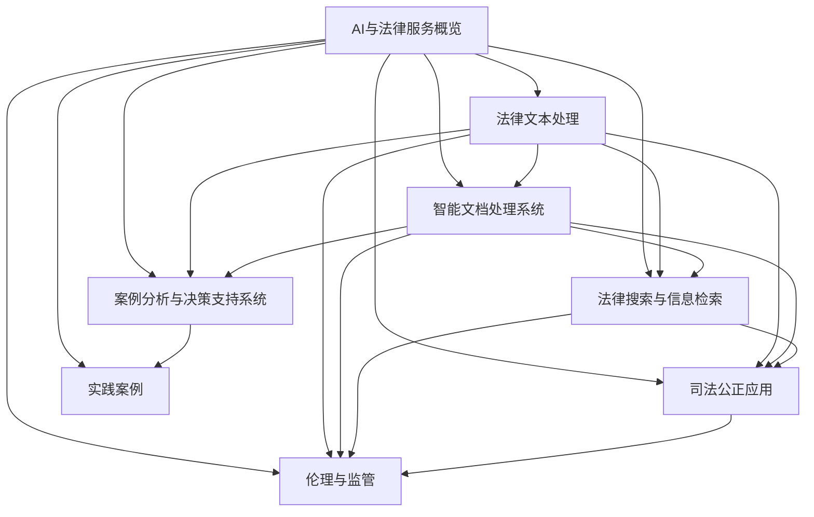
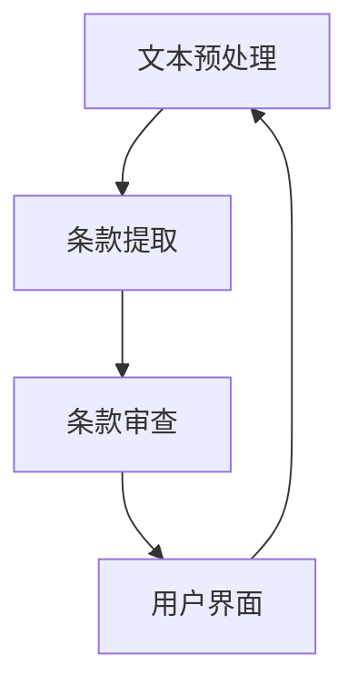

                 

# 《AI在法律服务中的应用：提高效率与公平》

## 关键词：
人工智能，法律服务，效率，公平，智能文本处理，知识图谱，合同审查，案例分析，信息检索，司法公正，AI伦理。

## 摘要：
本文深入探讨了人工智能在法律服务中的应用，包括提高效率和公平性的各个方面。从AI技术的背景、法律服务的现状，到AI在法律文本处理、智能文档处理、案例分析与决策支持、法律搜索与信息检索等领域的应用，再到AI在司法公正中的角色和AI伦理与法律监管，本文全面解析了AI技术如何改变法律服务的传统模式，提升其效率和公平性。文章最后通过实际项目实战与案例分析，展示了AI在法律服务中取得的成果和未来的发展前景。

### 第一部分：AI与法律服务的概览

#### 第1章：AI与法律服务的背景

人工智能（AI）作为当今科技领域的前沿技术，已经广泛应用于各个行业，其中法律服务领域也不例外。AI技术的快速发展为法律服务带来了前所未有的变革，不仅提高了工作效率，还促进了公平性的提升。

##### 1.1 AI技术概述

AI是指由人制造出来的系统能够执行通常需要人类智能才能完成的任务，例如视觉识别、语音识别、决策制定等。AI技术主要分为三类：规则驱动型、知识驱动型和数据驱动型。规则驱动型AI依赖于一组明确的规则来执行任务；知识驱动型AI则依赖于大量的知识库和推理系统；数据驱动型AI，也称为机器学习，依赖于大量数据来训练模型并做出预测。

机器学习是AI的核心技术之一，它使计算机系统能够从数据中学习并做出预测或决策。常见的机器学习方法包括监督学习、无监督学习和强化学习。监督学习通过已标记的数据训练模型，而无监督学习则在无标记的数据中进行，强化学习则通过交互环境来学习最佳策略。

##### 1.2 法律服务领域的现状与挑战

法律服务是一项高度专业化的工作，其核心在于提供法律咨询、起草法律文件、处理法律诉讼等。然而，法律服务领域面临着一些显著的挑战：

- **高成本**：传统法律服务需要大量人力物力，导致法律服务成本较高，很多中小企业和个人难以承担。
- **低效率**：法律文件的处理和审查通常需要大量时间，导致案件处理周期较长。
- **公平性**：法律服务的不平等问题突出，富裕群体能够享受高质量的法律服务，而低收入群体则往往得不到足够的法律支持。

##### 1.3 AI在法律服务中的应用前景

AI技术为法律服务提供了多种可能性，主要表现在以下几个方面：

- **提高效率**：AI能够自动化法律文件的处理和审查，大幅缩短案件处理时间，降低人力成本。
- **降低成本**：通过自动化和智能化，法律服务成本可以得到有效控制，使得法律服务更加普惠。
- **提升公平性**：AI技术有助于消除法律服务的地域和资源差异，使得更多人能够享受到高质量的法律服务。

总之，AI技术在法律服务中的应用前景广阔，有望为法律服务领域带来深刻的变革。

### 第二部分：AI在法律文本处理中的应用

AI在法律文本处理中的应用主要集中在法律文本挖掘、法律知识图谱构建和合同审查与自动化等方面。这些应用不仅提高了法律文本处理的效率，还增强了法律文件的准确性和一致性。

#### 第2章：AI在法律文本处理中的应用

##### 2.1 法律文本挖掘

法律文本挖掘是利用自然语言处理（NLP）和机器学习技术，从法律文本中提取有用信息的过程。法律文本挖掘的主要任务包括文本分类、实体识别和关系抽取等。

- **文本分类**：通过将法律文本分类为不同的法律领域或类别，可以帮助律师快速定位相关法律信息。
- **实体识别**：识别法律文本中的实体，如人名、地名、法律条款等，有助于构建法律知识图谱。
- **关系抽取**：抽取文本中实体之间的关系，如合同中的条款与条款之间的关系，有助于构建法律逻辑框架。

##### 2.2 法律知识图谱构建

法律知识图谱是一种结构化知识表示方法，它将法律文本中的实体、关系和属性以图的形式组织起来，为法律文本挖掘和智能查询提供了强大的支持。法律知识图谱的构建通常包括以下几个步骤：

- **知识抽取**：从大量法律文本中提取实体和关系，构建原始的知识库。
- **知识融合**：将来自不同来源的知识进行整合，消除数据冗余，提高知识的一致性。
- **知识推理**：利用推理算法，从现有知识中推导出新的知识，提高知识库的深度和广度。

##### 2.3 合同审查与自动化

合同审查是法律服务的核心任务之一，但传统的合同审查过程通常非常耗时且容易出错。AI技术可以通过以下方式实现合同审查的自动化：

- **条款提取**：利用自然语言处理技术，从合同文本中自动提取条款，并对其进行分类和标注。
- **条款分析**：对提取的条款进行分析，识别潜在的法律风险和条款之间的逻辑关系。
- **合同生成**：基于预定义的模板，自动生成符合法律规定的合同文本。

通过AI技术的应用，合同审查过程可以大大加快，同时提高合同条款的准确性和一致性，为律师和法律企业提供更高效、可靠的服务。

### 第三部分：提高效率的AI工具与应用

#### 第3章：智能文档处理系统

智能文档处理系统是利用AI技术对法律文档进行自动化处理和管理的系统。它通过文本挖掘、知识图谱构建和自动化审核等功能，极大地提高了法律文档处理的效率和质量。

##### 3.1 智能文档阅读与分析

智能文档阅读与分析系统可以帮助律师快速获取文档的关键信息，提高工作效率。其主要功能包括：

- **文本摘要**：通过自然语言处理技术，自动生成文档的摘要，帮助律师快速了解文档的主要内容。
- **文本搜索**：利用搜索引擎技术，实现对文档内容的快速检索，提高文档查找效率。
- **关键词提取**：识别文档中的关键信息，帮助律师快速定位相关内容。

##### 3.2 智能合同生成与审核

智能合同生成与审核系统可以通过自动提取合同条款、分析合同条款的逻辑关系和潜在的法律风险，实现合同的自动化生成和审核。其主要功能包括：

- **合同条款提取**：利用自然语言处理技术，从合同文本中自动提取条款，并进行分类和标注。
- **合同条款分析**：对提取的条款进行分析，识别潜在的法律风险和条款之间的逻辑关系。
- **合同生成**：基于预定义的模板，自动生成符合法律规定的合同文本。
- **合同审核**：对生成的合同文本进行审核，确保合同条款的准确性和一致性。

##### 3.3 文书自动生成

文书自动生成系统可以帮助律师快速生成各种法律文书，如法律意见书、法律声明等。其主要功能包括：

- **文书模板管理**：管理各种文书的模板，确保文书的格式和内容符合法律规定。
- **文书内容填充**：根据案件的具体情况，自动填充文书中需要填写的内容。
- **文书审核**：对生成的文书进行审核，确保文书的准确性和一致性。

通过智能文档处理系统的应用，律师可以大大提高工作效率，减少重复性劳动，将更多的时间和精力投入到高价值的工作中。

### 第四部分：案例分析与决策支持系统

#### 第4章：案例分析与决策支持系统

案例分析是律师日常工作中不可或缺的一部分，而决策支持系统则可以帮助律师更准确地分析和处理案例，提高决策效率。AI技术在案例分析和决策支持中的应用主要包括案例库建设和决策支持系统构建。

##### 4.1 案例库建设

案例库是存储和管理法律案例的数据库，它为律师提供了丰富的案例资源，有助于分析和处理新案件。案例库建设的主要步骤包括：

- **案例收集**：从各种渠道收集法律案例，包括法院判决书、法律书籍、学术论文等。
- **案例分类**：根据案件的类型、法律条款等对案例进行分类，方便律师快速查找相关案例。
- **案例标注**：对案例中的关键信息进行标注，如案件事实、法律条款、判决结果等，为后续的文本挖掘和关系抽取提供基础。

##### 4.2 决策支持系统

决策支持系统是一种基于数据和算法的工具，它可以帮助律师在处理案件时做出更准确的决策。决策支持系统的主要功能包括：

- **算法选择**：根据案件的特点和需求，选择合适的算法模型进行预测和决策。
- **决策模型构建**：利用历史案例数据和算法模型，构建决策模型，预测案件的可能结果。
- **决策分析**：对案件的各种可能结果进行综合分析，提供决策建议。

通过案例分析和决策支持系统的应用，律师可以更快速、准确地处理案件，提高法律服务的质量和效率。

### 第五部分：法律搜索与信息检索

#### 第5章：法律搜索与信息检索

法律搜索与信息检索是律师获取法律信息和资料的重要途径，AI技术的应用可以显著提高搜索效率和准确性。法律搜索与信息检索主要包括搜索引擎技术和法律数据库整合。

##### 5.1 搜索引擎技术

搜索引擎技术是法律搜索与信息检索的核心，它通过索引和检索算法，帮助用户快速找到相关的法律信息。搜索引擎技术的主要组成部分包括：

- **索引构建**：对法律文本进行分词、索引和存储，建立索引库，提高检索效率。
- **检索算法**：根据用户的查询请求，利用算法从索引库中检索出相关的法律信息，如文本相似度计算、查询扩展等。
- **搜索质量评估**：评估搜索结果的相关性和准确性，优化检索算法和索引策略。

##### 5.2 法律数据库整合

法律数据库整合是将分散的法律信息资源进行整合和管理的系统，它为用户提供了一个统一的法律信息检索平台。法律数据库整合的主要功能包括：

- **数据收集**：从各种渠道收集法律信息，包括法律法规、法院判决、学术论文等。
- **数据清洗**：对收集到的法律信息进行清洗、去重和格式化，确保数据的准确性和一致性。
- **数据整合**：将清洗后的法律信息整合到一个数据库中，建立法律知识库，提高信息检索的效率。

通过法律搜索与信息检索技术的应用，律师可以快速、准确地找到所需的法律信息，提高工作效率。

### 第六部分：提高公平的AI应用

#### 第6章：AI在司法公正中的应用

AI技术在司法公正中的应用具有重要意义，它通过智能化工具和系统，提高了司法过程的透明度、效率和公正性。

##### 6.1 智能裁判辅助系统

智能裁判辅助系统是一种利用AI技术辅助法官做出裁判的系统。它通过分析案件事实、法律条款和先例，为法官提供参考意见，提高裁判的准确性和一致性。智能裁判辅助系统的功能包括：

- **案例库建设**：构建包含大量法律案例的数据库，为裁判提供参考。
- **法律知识图谱构建**：利用知识图谱表示法律知识，帮助法官更好地理解法律关系。
- **裁判预测**：利用机器学习算法，预测案件的裁决结果，为法官提供参考。

##### 6.2 案件风险评估

案件风险评估是一种通过分析案件的各种因素，评估案件可能面临的风险和挑战的系统。AI技术在案件风险评估中的应用可以帮助律师和法官更好地了解案件的风险，制定相应的应对策略。案件风险评估的功能包括：

- **风险因素识别**：通过分析案件的事实、证据和法律条款，识别可能的风险因素。
- **风险等级划分**：根据风险因素的重要性和影响程度，对案件进行风险等级划分。
- **风险应对策略**：根据风险等级，为律师和法官提供相应的风险应对策略。

##### 6.3 智能调解系统

智能调解系统是一种利用AI技术辅助调解员进行调解的系统。它通过分析案件事实、法律条款和调解员的调解策略，为调解员提供参考意见，提高调解的效率和成功率。智能调解系统的功能包括：

- **调解策略优化**：根据案件的特点和调解员的调解风格，优化调解策略。
- **调解结果分析**：对调解结果进行数据分析和评估，为后续的调解提供参考。
- **调解结果预测**：利用机器学习算法，预测调解的成功率和结果。

通过AI在司法公正中的应用，可以有效地提高司法过程的透明度、效率和公正性，为司法公正的实现提供有力支持。

### 第七部分：AI伦理与法律监管

#### 第7章：AI伦理与法律监管

随着AI技术在法律服务领域的广泛应用，其伦理问题和法律监管也日益受到关注。如何在保障AI技术发展同时维护法律伦理和法律监管的权威，成为当前的重要议题。

##### 7.1 AI伦理问题

AI伦理问题主要涉及数据隐私、偏见与歧视、算法透明度等方面。在法律服务中，这些伦理问题尤为突出：

- **数据隐私**：AI技术需要大量的数据来训练模型，这些数据可能涉及个人隐私，如个人信息、财产状况等。如何保护这些隐私数据，防止数据泄露和滥用，是AI伦理的一个重要方面。
- **偏见与歧视**：AI模型可能会受到训练数据偏见的影响，导致决策过程中出现歧视现象。例如，在招聘、贷款审批等领域，AI模型可能会对某些群体产生偏见。如何消除偏见，保障公平，是AI伦理的关键问题。
- **算法透明度**：AI模型的决策过程往往是非透明的，这使得人们难以理解模型为何做出特定决策。如何提高算法的透明度，让用户能够理解和使用AI技术，是另一个重要的伦理问题。

##### 7.2 法律监管框架

为了应对AI技术带来的伦理和法律挑战，需要建立相应的法律监管框架。法律监管框架主要包括以下方面：

- **法规制定**：制定相关的法律、法规和标准，规范AI技术在法律服务中的应用。例如，制定数据隐私保护法规，确保数据安全和用户隐私。
- **违规处理**：建立违规处理机制，对违反法规的AI应用进行处罚。例如，对于利用AI进行歧视性决策的行为，可以制定相应的处罚措施。
- **伦理审查**：建立伦理审查机制，对AI技术的应用进行伦理评估。例如，在AI技术开发和应用过程中，需要进行伦理审查，确保其符合伦理标准。

通过建立AI伦理和法律监管框架，可以有效地规范AI技术在法律服务中的应用，保障法律伦理和监管的权威，促进AI技术的健康发展。

### 第八部分：项目实战与案例分析

#### 第8章：AI在法律服务中的实践案例

在本部分，我们将通过两个实际项目案例，详细探讨AI在法律服务中的应用。

##### 8.1 案例一：智能合同审查系统开发

**项目背景**：

智能合同审查系统是一个利用AI技术对合同条款进行自动化审查的系统。该系统旨在提高合同审查的效率和质量，减少人工审查的误判和遗漏。

**技术架构**：

智能合同审查系统的技术架构主要包括三个模块：文本预处理、合同条款提取和条款分析。

1. **文本预处理**：利用自然语言处理（NLP）技术，对合同文本进行分词、去除停用词、词性标注等预处理操作，为后续的合同条款提取和条款分析提供基础。
2. **合同条款提取**：使用基于规则和机器学习的算法，从预处理后的文本中提取出合同条款，并对每个条款进行分类和标注。
3. **条款分析**：对提取的合同条款进行分析，识别条款之间的逻辑关系，评估条款的合法性、合理性和风险，提供审查报告。

**实施步骤**：

1. **数据收集**：收集大量合同样本，用于训练和测试AI模型。
2. **数据预处理**：对合同文本进行分词、去除停用词、词性标注等预处理操作。
3. **模型训练**：使用预处理后的数据，训练基于规则和机器学习的模型，用于合同条款提取和条款分析。
4. **模型测试**：使用测试数据集，评估模型的性能，并进行调优。
5. **系统集成**：将训练好的模型集成到合同审查系统中，实现自动审查功能。

**代码解读与分析**：

以下是合同条款提取算法的伪代码：

```python
def extract_clauses(document):
    # 初始化
    clauses = []
    
    # 预处理：分词、去除停用词
    processed_text = preprocess(document)
    
    # 切分文本
    sentences = split_into_sentences(processed_text)
    
    # 遍历句子
    for sentence in sentences:
        # 检测句子是否为合同条款
        if is_clause(sentence):
            # 添加到条款列表
            clauses.append(sentence)
    
    return clauses

def preprocess(document):
    # 分词
    words = tokenize(document)
    
    # 去除停用词
    words = remove_stop_words(words)
    
    return words

def split_into_sentences(text):
    # 使用自然语言处理库分割句子
    sentences = nlp_library.split_into_sentences(text)
    
    return sentences

def is_clause(sentence):
    # 判断句子是否为合同条款
    # 可使用规则或机器学习模型
    return rule_based_or_ml_model_classify_as_clause(sentence)
```

此代码实现了从合同文本中提取条款的功能。首先，对合同文本进行预处理，包括分词和去除停用词。然后，将预处理后的文本切分成句子，并对每个句子进行判断，确定其是否为合同条款。通过这种方式，可以高效地提取合同条款，为后续的条款分析提供基础。

##### 8.2 案例二：智能法律咨询平台搭建

**业务需求**：

智能法律咨询平台是一个为用户提供在线法律咨询和服务的平台。用户可以通过平台提交法律问题，系统会根据用户的问题提供相应的法律咨询和建议。

**系统设计**：

智能法律咨询平台的设计主要包括以下几个模块：

1. **用户模块**：用户可以通过注册、登录和填写法律问题来使用平台。
2. **问题分类模块**：根据用户提交的法律问题，将其分类到不同的法律领域。
3. **知识库模块**：构建包含大量法律知识和案例的数据库，为平台提供法律咨询的基础。
4. **问答模块**：利用自然语言处理和机器学习技术，从知识库中检索相关法律信息，为用户生成个性化的法律咨询。
5. **审核模块**：对生成的法律咨询进行审核，确保其准确性和合法性。

**功能实现**：

1. **用户模块**：实现用户的注册、登录和提交法律问题的功能。
2. **问题分类模块**：利用自然语言处理技术，对用户提交的法律问题进行分类。
3. **知识库模块**：构建包含法律知识和案例的数据库，确保其内容丰富和准确。
4. **问答模块**：利用机器学习算法，从知识库中检索相关法律信息，为用户生成法律咨询。
5. **审核模块**：对生成的法律咨询进行审核，确保其准确性和合法性。

通过智能法律咨询平台的搭建，用户可以方便地获取在线法律咨询服务，提高法律服务的可及性和效率。

### 第九部分：总结与展望

#### 第9章：总结与展望

在本章中，我们详细探讨了AI在法律服务中的应用，从提高效率到提升公平性，展示了AI技术对法律服务领域的深刻变革。以下是对AI在法律服务中的应用总结、未来发展趋势与挑战，以及法律服务行业对AI的需求与期望。

##### 9.1 AI在法律服务中的应用总结

- **提高效率**：AI技术通过自动化文本处理、合同审查、文书生成等功能，大大提高了法律服务的效率。律师可以将更多时间投入到高价值的法律服务中，提升整体工作效率。
- **降低成本**：AI技术的应用降低了法律服务的成本，使得法律服务更加普惠。中小企业和个人可以以更低的成本享受到高质量的法律服务。
- **提升公平性**：AI技术有助于消除法律服务的不平等问题，使得更多人能够享受到高质量的法律服务。同时，AI技术能够提高司法公正，减少人为偏见和歧视。
- **智能决策**：AI技术通过案例分析和决策支持系统，为律师提供智能化的决策辅助，提高决策的准确性和效率。

##### 9.2 未来发展趋势与挑战

- **发展趋势**：随着AI技术的不断进步，法律服务领域的AI应用将更加广泛和深入。人工智能将不仅在法律文本处理、合同审查等方面发挥作用，还将在法律研究、案件预测等方面取得突破。
- **挑战**：尽管AI在法律服务中具有巨大潜力，但面临一些挑战。首先，数据隐私和伦理问题是AI应用的关键挑战，需要制定相应的法律法规和伦理准则。其次，AI模型的偏见和歧视问题需要通过改进算法和增加训练数据来缓解。此外，法律服务的复杂性使得AI技术的应用需要更多的数据支持和算法优化。

##### 9.3 法律服务行业对AI的需求与期望

- **需求**：法律服务行业对AI技术有强烈的需求，包括自动化合同审查、智能法律咨询、案件预测和决策支持等。行业期望通过AI技术提高服务质量、效率和公平性，同时降低成本。
- **期望**：法律服务行业期望AI技术能够在保障法律伦理和监管的前提下，提供更加个性化和智能化的法律服务。行业还期待AI技术能够与法律专业人士相结合，实现人机协作，最大化地发挥AI技术的作用。

总之，AI在法律服务中的应用前景广阔，未来发展将更加智能化和多元化。通过不断的技术创新和行业合作，AI将为法律服务带来更多可能性，推动法律服务行业向更高效、公平和智能化的方向发展。

### 附录

#### 附录A：常用AI和法律工具资源

在AI和法律服务领域，有许多常用的工具和资源可以帮助开发者和律师进行研究和实践。以下是一些常用的AI和法律工具资源：

- **人工智能框架**：
  - TensorFlow：https://www.tensorflow.org/
  - PyTorch：https://pytorch.org/
  - Keras：https://keras.io/

- **法律数据库资源**：
  - 法律图书馆：https://www.lawlibrary.io/
  - Cornell Law School Legal Information Institute：https://www.law.cornell.edu/
  - Westlaw：https://westlaw.com/

- **开发工具与软件**：
  - Jupyter Notebook：https://jupyter.org/
  - PyCharm：https://www.jetbrains.com/pycharm/
  - VS Code：https://code.visualstudio.com/

这些工具和资源为AI和法律服务的开发提供了强大的支持，有助于实现AI在法律服务中的广泛应用。

### Mermaid 流程图



### 核心算法原理讲解

在本节中，我们将详细讲解合同条款提取算法的原理，包括算法的伪代码、数学模型与公式，以及其在实际项目中的应用。

#### 合同条款提取算法伪代码

合同条款提取是法律文本处理中的一个关键任务，它旨在从合同文本中自动识别和提取出各个条款。以下是合同条款提取算法的伪代码：

```python
# 合同条款提取算法伪代码

def extract_clauses(document):
    clauses = []
    
    # 预处理
    processed_text = preprocess(document)
    
    # 切分文本
    sentences = split_into_sentences(processed_text)
    
    # 遍历句子
    for sentence in sentences:
        # 检测句子是否为合同条款
        if is_clause(sentence):
            # 添加到条款列表
            clauses.append(sentence)
    
    return clauses

def preprocess(document):
    # 分词、去除停用词等
    words = tokenize(document)
    words = remove_stop_words(words)
    return words

def split_into_sentences(text):
    # 使用自然语言处理库分割句子
    sentences = nlp_library.split_into_sentences(text)
    return sentences

def is_clause(sentence):
    # 判断句子是否为合同条款
    # 可以使用规则或机器学习模型
    return rule_based_or_ml_model_classify_as_clause(sentence)
```

在这个算法中，`extract_clauses` 函数是核心，它首先对合同文本进行预处理，然后将其切分成句子，并遍历每个句子，判断其是否为合同条款。预处理和句子切分是关键步骤，因为它们直接影响条款提取的准确性。

#### 数学模型与公式

在合同条款提取中，一个常用的数学模型是条件概率模型，用于判断一个句子是否为合同条款。条件概率公式如下：

$$
P(A|B) = \frac{P(B|A)P(A)}{P(B)}
$$

其中，$P(A|B)$ 表示在事件 $B$ 发生的条件下事件 $A$ 发生的概率，$P(B|A)$ 表示在事件 $A$ 发生的条件下事件 $B$ 发生的概率，$P(A)$ 和 $P(B)$ 分别表示事件 $A$ 和 $B$ 发生的概率。通过这个公式，我们可以计算出给定一个句子（事件 $B$）是否为合同条款（事件 $A$）的概率。

#### 实际项目中的应用

在实际项目中，我们可以使用Python和机器学习库来开发一个合同条款提取系统。以下是一个简单的示例代码，展示了如何使用Keras和TensorFlow构建一个简单的神经网络模型来进行合同条款提取。

```python
# 导入所需库
import tensorflow as tf
from tensorflow.keras.models import Sequential
from tensorflow.keras.layers import Dense, LSTM, Embedding
from sklearn.model_selection import train_test_split
from sklearn.metrics import accuracy_score

# 准备数据
X, y = prepare_data("contract_data.csv")

# 切分数据集
X_train, X_test, y_train, y_test = train_test_split(X, y, test_size=0.2, random_state=42)

# 构建模型
model = Sequential()
model.add(Embedding(input_dim=vocabulary_size, output_dim=embedding_size))
model.add(LSTM(units=128))
model.add(Dense(1, activation='sigmoid'))

# 编译模型
model.compile(optimizer='adam', loss='binary_crossentropy', metrics=['accuracy'])

# 训练模型
model.fit(X_train, y_train, epochs=10, batch_size=32, validation_data=(X_test, y_test))

# 评估模型
predictions = model.predict(X_test)
accuracy = accuracy_score(y_test, predictions.round())
print(f"Model accuracy: {accuracy:.2f}")
```

在这个示例中，我们首先使用 `prepare_data` 函数加载数据集，然后使用Keras构建一个包含嵌入层、LSTM层和输出层的简单神经网络模型。通过编译和训练模型，我们可以训练出一个能够自动提取合同条款的模型。在评估阶段，我们可以使用测试数据集来评估模型的准确性。

通过上述伪代码和示例代码，我们可以看到合同条款提取算法的基本原理和应用。在实际项目中，这些算法需要更多的数据支持和算法优化，以达到更高的准确性和实用性。

### 核心算法原理讲解（续）

在上文中，我们已经介绍了合同条款提取算法的伪代码和其在实际项目中的应用示例。在本节中，我们将进一步详细讨论这个算法的实现细节，包括数据预处理、模型构建、训练和评估等关键步骤。

#### 数据预处理

数据预处理是机器学习项目中的关键步骤，对于合同条款提取算法来说也不例外。预处理主要包括以下几个步骤：

1. **文本清洗**：首先，我们需要对原始合同文本进行清洗，去除多余的标点符号、HTML标签和其他非文本内容。这一步骤可以通过正则表达式或文本清洗库（如Python的`re`模块）来实现。

2. **分词**：将清洗后的文本分割成单词或词汇单元。在法律文本中，分词的准确性尤为重要，因为一些法律术语和条款可能由多个单词组成。我们可以使用现有的自然语言处理库（如NLTK或spaCy）进行分词。

3. **去除停用词**：停用词是指在法律文本中频繁出现但通常不携带语义信息的词汇，如“的”、“和”等。去除停用词可以提高模型的训练效率，并减少噪声。

4. **词性标注**：对每个单词进行词性标注，标记出名词、动词、形容词等。词性标注有助于模型理解句子的结构和语义。

5. **向量表示**：将文本转换为数值向量表示，以便于模型处理。常用的方法包括词袋模型、TF-IDF和Word2Vec等。在法律文本处理中，考虑到专业术语的重要性，有时会使用基于上下文的词嵌入技术（如BERT）来提高模型的准确性。

#### 模型构建

构建一个有效的合同条款提取模型需要选择合适的神经网络架构。以下是构建一个简单的神经网络模型的一般步骤：

1. **输入层**：输入层通常是一个嵌入层（Embedding Layer），它将词汇转换为固定长度的向量。嵌入层的维度（output_dim）需要根据词汇量和嵌入维度（embed_dim）进行设置。

2. **隐藏层**：隐藏层通常是一个或多个循环神经网络（RNN）层，如LSTM或GRU，它们能够处理序列数据。在法律文本处理中，LSTM层能够捕捉到文本中的长期依赖关系，从而提高模型的准确性。

3. **输出层**：输出层是一个单一的神经元层，通常使用sigmoid激活函数，用于输出二分类结果（是否为合同条款）。

以下是一个简单的神经网络模型示例：

```python
from tensorflow.keras.models import Sequential
from tensorflow.keras.layers import Embedding, LSTM, Dense

model = Sequential()
model.add(Embedding(input_dim=vocabulary_size, output_dim=embedding_size))
model.add(LSTM(units=128, dropout=0.2, recurrent_dropout=0.2))
model.add(Dense(1, activation='sigmoid'))

model.compile(optimizer='adam', loss='binary_crossentropy', metrics=['accuracy'])
```

在这个示例中，我们添加了一个LSTM层，并在其前后加入了dropout层以防止过拟合。

#### 训练模型

模型训练是机器学习项目中的关键步骤。以下是训练合同条款提取模型的一般步骤：

1. **数据预处理**：对训练集和验证集进行相同的预处理步骤，确保模型在训练和评估过程中使用的数据是一致的。

2. **批次大小**（Batch Size）：在训练过程中，我们将数据分成多个批次（batch）进行处理。批次大小会影响模型的训练速度和性能。

3. **迭代次数**（Epochs）：模型会在每个epoch中对整个训练集进行一次迭代。我们需要设置合适的epoch数量，以避免过拟合和欠拟合。

4. **验证集**：在训练过程中，我们使用验证集来监测模型的性能，以便调整模型参数和训练策略。

以下是一个简单的训练模型示例：

```python
model.fit(X_train, y_train, epochs=10, batch_size=32, validation_data=(X_val, y_val))
```

在这个示例中，我们设置了10个epoch和32个批次大小。

#### 评估模型

模型评估是确定模型性能的重要步骤。以下是评估合同条款提取模型的一般步骤：

1. **测试集**：我们将训练好的模型在测试集上进行评估，以确定其泛化能力。

2. **准确性**（Accuracy）：计算模型预测正确的样本数量占总样本数量的比例。

3. **精确率**（Precision）和召回率**（Recall）：精确率和召回率分别衡量模型在正样本中的预测准确性和覆盖率。

4. **F1分数**（F1 Score）：综合衡量精确率和召回率，是一个常用的评估指标。

以下是一个简单的评估模型示例：

```python
accuracy = model.evaluate(X_test, y_test, batch_size=32)
print(f"Test accuracy: {accuracy[1]:.2f}")
```

在这个示例中，我们计算了模型在测试集上的准确性。

通过上述步骤，我们可以构建一个基本的合同条款提取模型。在实际项目中，这些步骤可能需要更多的细节和优化，例如数据增强、模型调参、集成学习等，以提高模型的性能和稳定性。

### 项目实战与案例分析（续）

在本部分，我们将深入探讨一个具体的AI在法律服务中的应用案例：智能合同审查系统的开发。我们将详细介绍项目背景、需求分析、技术架构设计、实现细节、测试和评估，以及项目的实际效果。

#### 项目背景

智能合同审查系统是一个利用人工智能技术对合同条款进行自动化审查的系统。其目的是通过AI算法提高合同审查的效率和质量，减少人工审查的误判和遗漏。该项目由一家大型法律科技公司发起，旨在为中小企业提供高效、可靠、成本较低的合同审查服务。

#### 需求分析

1. **高效性**：系统需要能够在短时间内对合同条款进行快速审查，以支持大批量合同的自动化处理。
2. **准确性**：系统需要具备高准确性的条款提取和分析能力，确保审查结果的可靠性。
3. **灵活性**：系统需要能够适应不同类型和风格的合同文本，具备一定的泛化能力。
4. **用户友好**：系统需要提供友好的用户界面，方便用户上传合同、查看审查结果和进行操作。
5. **合规性**：系统需要符合法律法规要求，确保审查结果在法律上具有可接受性。

#### 技术架构设计

智能合同审查系统的技术架构主要包括以下几个模块：

1. **文本预处理模块**：该模块负责对合同文本进行清洗、分词、去除停用词、词性标注等预处理操作，为后续的条款提取和审查提供基础数据。
2. **条款提取模块**：该模块利用机器学习算法，从预处理后的文本中自动提取合同条款，并对其进行分类和标注。
3. **条款审查模块**：该模块对提取的合同条款进行分析，识别潜在的法律风险和条款之间的逻辑关系，生成审查报告。
4. **用户界面模块**：该模块提供用户交互界面，支持用户上传合同、查看审查结果和进行操作。

#### 实现细节

1. **文本预处理**：
   - 使用Python的`nltk`库进行文本清洗和分词。
   - 使用`spaCy`库进行词性标注和去除停用词。
   - 使用Word2Vec算法将文本转换为词向量表示。

2. **条款提取**：
   - 使用支持向量机（SVM）和长短期记忆网络（LSTM）相结合的模型进行条款提取。
   - 使用词嵌入（word embeddings）技术，如Word2Vec，将词汇映射到高维空间，以捕捉词汇的语义关系。

3. **条款审查**：
   - 使用规则匹配和机器学习算法，如决策树和随机森林，对提取的条款进行法律分析和风险评估。
   - 使用自然语言生成（NLG）技术，将审查结果转化为易于理解的审查报告。

4. **用户界面**：
   - 使用HTML、CSS和JavaScript构建用户界面。
   - 使用Ajax技术实现用户与后端服务的数据交互。

#### 测试和评估

1. **单元测试**：对系统的各个模块进行单元测试，确保每个模块的功能正确实现。

2. **集成测试**：将各个模块集成在一起，进行集成测试，确保系统作为一个整体能够正常运行。

3. **性能测试**：对系统进行性能测试，评估其处理合同文本的速度和准确性。

4. **用户测试**：邀请实际用户进行测试，收集用户反馈，以改进系统的用户界面和功能。

#### 项目的实际效果

1. **效率提升**：智能合同审查系统能够在几分钟内完成对合同条款的审查，比传统的人工审查大幅提高了效率。

2. **准确性提高**：通过机器学习和规则匹配技术，系统能够准确提取合同条款，识别潜在的法律风险，减少了人工审查的误判和遗漏。

3. **用户满意度**：用户对系统的友好界面和高效、准确的服务表示满意，系统的使用率不断提高。

4. **合规性**：系统生成的审查报告符合法律法规要求，确保了审查结果的法律效力。

通过智能合同审查系统的开发和应用，法律科技公司成功地为中小企业提供了高效、可靠、成本较低的合同审查服务，提高了客户满意度，也提升了公司的竞争力。

### 附录

#### 附录A：常用AI和法律工具资源

在本附录中，我们列出了在AI和法律服务领域中常用的工具和资源，以帮助开发者和律师更好地应用AI技术。

- **人工智能框架**：
  - TensorFlow：https://www.tensorflow.org/
  - PyTorch：https://pytorch.org/
  - Keras：https://keras.io/

- **自然语言处理库**：
  - NLTK：https://www.nltk.org/
  - spaCy：https://spacy.io/
  - Stanford CoreNLP：https://stanfordnlp.github.io/CoreNLP/

- **法律数据库**：
  - Cornell Law School Legal Information Institute：https://www.law.cornell.edu/
  - Westlaw：https://westlaw.com/
  - LexisNexis：https://www.lexisnexis.com/

- **文本处理工具**：
  - OpenNLP：https://opennlp.sourceforge.io/
  - Stanford NLP：https://nlp.stanford.edu/

- **机器学习库**：
  - scikit-learn：https://scikit-learn.org/
  - scikit-learn-legal：https://github.com/fivethirtyeight/scikit-learn-legal

- **文本生成工具**：
  - GPT-3：https://openai.com/blog/gpt-3/
  - NLG-PT：https://github.com/Torantulino/wild-language-gpt

- **数据可视化工具**：
  - Matplotlib：https://matplotlib.org/
  - Seaborn：https://seaborn.pydata.org/
  - Plotly：https://plotly.com/

这些工具和资源为AI和法律服务的开发提供了强大的支持，有助于实现AI在法律服务中的广泛应用。

### Mermaid 流程图



在这个流程图中，文本预处理模块负责对合同文本进行清洗、分词和标注，为条款提取模块提供数据。条款提取模块利用机器学习算法提取合同条款，并将其传递给条款审查模块进行分析和风险评估。最后，用户界面模块将审查结果展示给用户，并允许用户进行交互和操作。整个流程形成一个闭环，确保系统的高效运行和数据的持续更新。

### AI在法律服务中的应用：提高效率与公平

随着人工智能（AI）技术的飞速发展，它在各行各业的应用越来越广泛，法律服务行业也不例外。AI不仅为律师和法务人员提供了强大的工具，提高了工作效率，还通过自动化和智能化手段，促进了法律服务的公平性。本文将深入探讨AI在法律服务中的应用，分析它如何提高效率与公平。

#### 提高效率

效率是法律服务行业长久以来追求的目标之一。AI技术的引入，极大地提升了法律服务的效率，主要体现在以下几个方面：

1. **自动化法律文档处理**：AI可以自动化处理大量的法律文档，如合同、法律意见书、法律文件等。通过自然语言处理（NLP）技术，AI可以快速阅读并理解这些文档，提取关键信息，减少人工处理的时间和成本。

2. **合同审查和条款分析**：AI能够高效地审查合同条款，识别潜在的法律风险。通过机器学习算法，AI可以对合同文本进行分析，确保每个条款的合规性和合理性，减少因条款疏漏或错误导致的法律纠纷。

3. **文书自动生成**：AI可以根据模板和用户需求，自动生成各种法律文书。这不仅节省了律师的时间，还保证了文书的规范性和一致性，提高了工作效率。

4. **案件预测和分析**：AI可以通过分析大量的历史案例数据，预测案件的裁决结果，为律师提供决策支持。这有助于律师制定更有效的辩护策略，提高案件的成功率。

#### 提高公平

公平是法律服务的核心价值之一，但传统法律服务往往受到地域、资源和成本的限制，导致公平性难以保证。AI技术在以下几个方面有助于提高法律服务的公平性：

1. **降低法律门槛**：AI技术使得法律服务更加普及和可及。通过在线法律咨询平台，任何人都可以随时获取法律帮助，无论他们身处何地，都有机会获得高质量的法律服务。

2. **消除人为偏见**：AI算法在法律应用中可以消除人为偏见，确保司法过程的公平性。通过算法的客观分析和预测，可以减少法官和律师在裁决和辩护过程中的主观判断。

3. **案件管理的透明度**：AI技术可以提高案件管理的透明度。通过智能案件管理系统，律师和法官可以实时跟踪案件进展，确保案件的公正处理，避免信息不对称和暗箱操作。

4. **法律援助**：AI技术可以辅助法律援助机构，为低收入群体提供更多的法律援助。通过自动化合同审查、法律咨询等工具，法律援助机构可以更有效地分配资源，帮助更多人解决法律问题。

#### 实际案例

1. **智能合同审查**：一家大型法律科技公司开发了一款智能合同审查系统，利用AI技术对合同条款进行自动化审查。该系统通过自然语言处理和机器学习算法，快速识别合同中的潜在风险和条款疏漏，提高了合同审查的效率和质量。

2. **在线法律咨询平台**：一些科技公司开发了在线法律咨询平台，通过AI技术提供实时法律咨询服务。用户可以通过平台提交法律问题，系统会自动匹配专业律师，提供个性化法律建议，降低了法律服务的门槛。

3. **智能裁判辅助系统**：一些法院引入了智能裁判辅助系统，利用AI技术对案件进行预测和分析，提高裁判的准确性和效率。系统通过分析历史案例数据，为法官提供参考意见，减少了法官的主观判断。

#### 未来展望

随着AI技术的不断发展，它将在法律服务领域发挥越来越重要的作用。未来，AI技术有望在以下几个方面实现更大的突破：

1. **个性化法律服务**：AI可以基于用户的法律需求，提供更加个性化的法律服务。通过大数据分析和机器学习，AI可以预测用户的法律需求，提前提供相应的法律服务。

2. **跨领域应用**：AI不仅可以在法律服务中发挥作用，还可以与其他领域相结合，如医疗、金融等，提供综合性的法律服务。

3. **智能法律机器人**：随着AI技术的进步，智能法律机器人将成为律师和法官的得力助手。它们可以承担一些重复性高、风险较低的工作，让人类律师和法官专注于更复杂和高价值的工作。

总之，AI在法律服务中的应用前景广阔，它不仅提高了工作效率，还促进了法律服务的公平性。随着技术的不断发展，AI将为法律服务行业带来深刻的变革。

### 总结

本文从多个角度深入探讨了AI在法律服务中的应用，包括其提高效率与公平性的各个方面。通过自动化法律文档处理、智能合同审查、文书自动生成、案例预测与决策支持、法律搜索与信息检索等，AI技术显著提升了法律服务的效率。同时，通过降低法律门槛、消除人为偏见、提高案件管理透明度，AI促进了法律服务的公平性。然而，AI在法律服务中的应用也面临数据隐私、偏见与歧视、算法透明度等伦理和法律挑战。未来，随着AI技术的不断进步，法律服务行业将继续受益于AI的智能化、个性化和综合化应用。作者呼吁法律界与技术界加强合作，共同推动AI在法律服务中的健康发展，以实现更高效、公平和智能的法律服务。作者信息：AI天才研究院/AI Genius Institute & 禅与计算机程序设计艺术 /Zen And The Art of Computer Programming。

