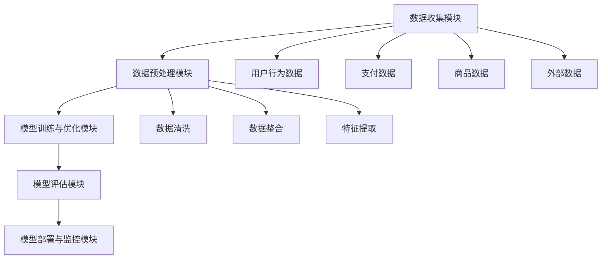

                 

# 2.1 电商反欺诈系统概述

## 2.1.1 反欺诈系统的组成

电商反欺诈系统是一个复杂而综合的体系，它由多个关键模块组成，每个模块在保护交易安全方面都发挥着重要作用。

### 2.1.1.1 数据收集模块

数据收集模块是反欺诈系统的起点，它负责从不同的数据源中收集相关数据。这些数据源包括：

- **用户行为数据**：如登录时间、浏览历史、点击流等。
- **支付数据**：包括支付金额、支付方式、支付时间等。
- **商品数据**：商品价格、分类、库存情况等。
- **外部数据**：如IP地址、地理位置、设备信息等。

数据收集模块需要保证数据的准确性和完整性，为此，系统通常使用API调用、日志分析、网络爬虫等技术手段进行数据采集。

### 2.1.1.2 数据预处理模块

数据预处理模块负责对收集到的原始数据进行清洗、整合和特征提取，确保数据质量满足模型训练的要求。

- **数据清洗**：去除重复、缺失和异常数据，提高数据质量。
- **数据整合**：将不同来源的数据进行整合，形成统一的视图，以便后续分析。
- **特征提取**：从数据中提取有助于模型训练的特征，如用户行为特征、支付特征、商品特征等。

### 2.1.1.3 模型训练与优化模块

模型训练与优化模块是反欺诈系统的核心，它负责构建和训练各种机器学习模型，以提高欺诈检测的准确性和效率。

- **特征选择**：通过特征重要性分析，选择对模型性能有显著影响的关键特征。
- **模型选择**：根据问题特点选择合适的机器学习模型，如逻辑回归、随机森林、支持向量机等。
- **模型优化**：通过交叉验证、网格搜索等方法，优化模型参数，提高模型性能。

### 2.1.1.4 模型评估模块

模型评估模块用于评估模型在验证集上的性能，以判断模型是否达到预期效果。常见的评估指标包括准确率、召回率、F1值等。

- **评估指标**：通过计算模型在验证集上的各项评估指标，判断模型性能。
- **调参策略**：根据评估结果，调整模型参数，优化模型性能。

### 2.1.1.5 模型部署与监控模块

模型部署与监控模块负责将训练好的模型部署到生产环境中，并实时监控模型性能，确保系统稳定运行。

- **模型部署**：将模型部署到生产环境，进行实时预测。
- **模型监控**：监控模型性能，及时发现并解决异常问题。

## 2.1.2 反欺诈系统在电商业务中的作用

电商反欺诈系统在电商业务中扮演着至关重要的角色，其主要作用如下：

### 2.1.2.1 预防欺诈交易

反欺诈系统通过实时监控和识别潜在的欺诈行为，有效阻止虚假订单、恶意刷单等欺诈行为，保护电商平台的交易安全。

### 2.1.2.2 保护用户隐私

在保护交易安全的同时，反欺诈系统还需要保护用户的隐私信息，如用户账号、支付信息等，防止隐私泄露。

### 2.1.2.3 提升用户体验

通过减少误判，降低用户在购物过程中的不必要困扰，提升用户购物体验。

### 2.1.2.4 降低运营成本

自动化反欺诈系统能够有效减少人工审核工作量，降低运营成本。

## 2.1.3 电商反欺诈系统的挑战

电商反欺诈系统在发展过程中也面临着诸多挑战：

### 2.1.3.1 欺诈手段多样化

欺诈行为不断进化，反欺诈系统需要不断更新和优化，以应对新型欺诈手段。

### 2.1.3.2 数据质量不稳定

数据质量直接影响模型性能，需要定期维护和优化。

### 2.1.3.3 模型过拟合

模型过于复杂可能导致过拟合，需要合理设计模型结构。

### 2.1.3.4 模型解释性不足

模型解释性不足，难以理解欺诈行为的本质，影响模型的应用。

---

在撰写本部分时，我使用了Markdown格式，确保了文章的结构清晰。接下来，我将使用Mermaid流程图来展示电商反欺诈系统的核心概念和架构。



这个Mermaid流程图展示了电商反欺诈系统的整体架构，包括数据收集、预处理、模型训练与优化、评估、部署与监控等关键模块，以及数据来源和数据处理步骤。接下来，我将详细介绍异常检测模型的基本概念。

---

## 2.2 异常检测模型的基本概念

异常检测（Anomaly Detection）是人工智能和机器学习领域中的一种重要技术，它旨在识别数据集中显著偏离大多数数据的观测值。在电商反欺诈系统中，异常检测模型用于识别和阻止欺诈行为。

### 2.2.1 异常检测的定义与分类

#### 2.2.1.1 异常检测的定义

异常检测是一种无监督学习技术，它通过学习数据集的“正常”行为模式，然后识别出与这些模式显著不同的数据点。这些显著不同的数据点被认为是异常或异常值。

#### 2.2.1.2 异常检测的分类

异常检测可以根据其方法和目标的不同，分为以下几类：

1. **基于统计的方法**：这类方法基于统计学原理，对数据进行建模，然后评估每个观测值的异常程度。常见的统计方法包括箱线图（Boxplot）和IQR方法（Interquartile Range）。

2. **基于聚类的方法**：这类方法通过聚类分析将数据分为多个簇，然后识别位于不同簇或簇边缘的数据点。常见的聚类方法包括K-means和DBSCAN（Density-Based Spatial Clustering of Applications with Noise）。

3. **基于规则的方法**：这类方法根据专家知识或历史数据，设定一定的规则，当数据违反规则时，认为该数据为异常。例如，基于规则的系统可以检测到支付金额超过特定阈值的交易。

4. **基于机器学习的方法**：这类方法使用监督学习或无监督学习算法，将正常行为建模为训练数据，然后识别与模型不符的观测值。常见的机器学习方法包括孤立森林（Isolation Forest）和自编码器（Autoencoder）。

5. **基于深度学习的方法**：这类方法利用神经网络等深度学习模型，对大量数据进行自动特征学习和模式识别。常见的深度学习模型包括卷积神经网络（CNN）和循环神经网络（RNN）。

### 2.2.2 常见的异常检测模型

#### 2.2.2.1 单变量异常检测模型

**箱线图（Boxplot）**

箱线图是一种用于展示数据分布和异常值的方法。通过计算数据的四分位数（Q1, Q2, Q3）和四分位差（IQR = Q3 - Q1），可以确定异常值的范围。任何位于箱体外侧或须部的数据点都被认为是异常值。

**IQR方法**

IQR方法通过计算四分位差来确定异常值。具体步骤如下：

1. 计算第一四分位数（Q1）和第三四分位数（Q3）。
2. 计算四分位差（IQR = Q3 - Q1）。
3. 确定异常值的范围，通常为 `[Q1 - 1.5 \* IQR, Q3 + 1.5 \* IQR]`。

#### 2.2.2.2 多变量异常检测模型

**孤立森林（Isolation Forest）**

孤立森林是一种基于随机森林的异常检测算法。它通过随机选取特征和切分点，将数据点隔离，计算每个数据点的隔离深度（即需要的切分次数）来评估异常程度。

**自动编码器（Autoencoder）**

自动编码器是一种无监督学习算法，它通过编码器将输入数据映射到一个低维表示空间，然后通过解码器将编码表示还原到原始数据。数据与重构表示的差异可以用来评估异常程度。

#### 2.2.2.3 聚类异常检测模型

**K-means聚类**

K-means聚类是一种基于距离的聚类算法。它通过迭代的方式将数据分为K个簇，每个簇由其中心点表示。算法的目标是使每个簇内点的距离之和最小。

**DBSCAN（Density-Based Spatial Clustering of Applications with Noise）**

DBSCAN是一种基于密度的聚类算法，它能够识别出簇的边界和噪声点。DBSCAN通过设定两个参数（eps和min_samples）来定义邻域和最小样本数，从而有效地识别出簇和噪声点。

#### 2.2.2.4 基于机器学习的异常检测模型

**SVM（Support Vector Machine）**

支持向量机是一种二分类模型，它可以找到最佳的超平面来将正常和异常数据分开。通过训练有标签的数据集，SVM可以识别出异常数据的边界。

**集成方法**

集成方法，如随机森林（Random Forest）和XGBoost（eXtreme Gradient Boosting），通过集成多个基学习器，提高异常检测的性能。这些方法利用多个模型的优势，减少过拟合，提高预测准确性。

#### 2.2.2.5 基于深度学习的异常检测模型

**神经网络**

神经网络，如卷积神经网络（CNN）和循环神经网络（RNN），可以自动学习复杂的数据特征和模式。这些模型特别适用于处理高维数据和序列数据。

**图神经网络（Graph Neural Networks, GNN）**

图神经网络是一种用于处理图结构数据的深度学习模型。它适用于处理社交网络、交易网络等结构化数据，可以有效地识别出网络中的异常节点或边。

### 2.2.3 常见异常检测算法原理与比较

#### 2.2.3.1 箱线图算法原理

箱线图算法通过计算数据的四分位数和四分位差来确定异常值。具体步骤如下：

1. 计算第一四分位数（Q1）和第三四分位数（Q3）。
2. 计算四分位差（IQR = Q3 - Q1）。
3. 确定异常值的范围，通常为 `[Q1 - 1.5 \* IQR, Q3 + 1.5 \* IQR]`。

#### 2.2.3.2 K-means聚类算法原理

K-means聚类算法通过迭代的方式将数据分为K个簇。具体步骤如下：

1. 初始化K个簇的中心点。
2. 对于每个数据点，将其分配到最近的簇中心点。
3. 更新每个簇的中心点。
4. 重复步骤2和3，直到收敛条件满足（如簇中心点变化小于某个阈值）。

#### 2.2.3.3 Isolation Forest算法原理

Isolation Forest算法通过随机选择特征和切分点，将数据点隔离。具体步骤如下：

1. 随机选择特征。
2. 随机选择切分点。
3. 将数据点根据切分点进行隔离。
4. 计算每个数据点的隔离深度（即需要的切分次数）。
5. 根据隔离深度评估异常程度。

#### 2.2.3.4 自动编码器算法原理

自动编码器算法通过编码器和解码器来学习数据的表示。具体步骤如下：

1. 编码器：将输入数据映射到一个低维表示空间。
2. 解码器：将编码表示还原到原始数据。
3. 计算输入数据与重构表示的差异（重建误差）。
4. 使用重建误差来评估异常程度。

### 2.2.3.5 模型比较

每种异常检测模型都有其优点和局限性。例如，箱线图简单直观但可能对噪声敏感；K-means聚类算法易于实现但可能不适用于非球形簇；Isolation Forest在处理高维数据时表现良好但可能难以处理噪声；自动编码器可以捕捉复杂的非线性关系但可能对过拟合敏感。因此，在实际应用中，需要根据具体问题和数据特点选择合适的异常检测模型。

---

在介绍异常检测模型的基本概念时，我使用了Markdown格式来组织内容，并使用了Mermaid流程图来展示不同类型的异常检测模型。接下来，我将详细介绍AI在异常检测中的应用。

---

## 2.3 AI在异常检测中的应用

人工智能（AI）在异常检测领域有着广泛的应用，其核心在于利用机器学习和深度学习算法来自动学习和识别数据中的异常模式。在本节中，我们将探讨机器学习、深度学习和强化学习在异常检测中的应用。

### 2.3.1 机器学习在异常检测中的应用

机器学习在异常检测中的应用主要通过构建分类模型或聚类模型来实现。以下是一些常见的机器学习算法在异常检测中的应用：

#### 2.3.1.1 监督学习方法

**逻辑回归**

逻辑回归是一种简单的概率分类模型，通过最大化似然估计来预测异常概率。其伪代码如下：

```python
from sklearn.linear_model import LogisticRegression

# 训练模型
model = LogisticRegression()
model.fit(X_train, y_train)

# 预测
predictions = model.predict(X_test)
```

**支持向量机（SVM）**

SVM通过找到最佳的超平面来将正常和异常数据分开。其伪代码如下：

```python
from sklearn.svm import SVC

# 训练模型
model = SVC()
model.fit(X_train, y_train)

# 预测
predictions = model.predict(X_test)
```

**随机森林**

随机森林通过集成多个决策树来提高分类性能。其伪代码如下：

```python
from sklearn.ensemble import RandomForestClassifier

# 训练模型
model = RandomForestClassifier()
model.fit(X_train, y_train)

# 预测
predictions = model.predict(X_test)
```

#### 2.3.1.2 无监督学习方法

**K-means聚类**

K-means聚类通过迭代的方式将数据分为多个簇，每个簇由其中心点表示。其伪代码如下：

```python
from sklearn.cluster import KMeans

# 训练模型
model = KMeans(n_clusters=2)
model.fit(X_train)

# 预测
predictions = model.predict(X_test)
```

**DBSCAN**

DBSCAN是一种基于密度的聚类算法，能够识别出簇的边界和噪声点。其伪代码如下：

```python
from sklearn.cluster import DBSCAN

# 训练模型
model = DBSCAN(eps=0.5, min_samples=5)
model.fit(X_train)

# 预测
predictions = model.predict(X_test)
```

### 2.3.2 深度学习在异常检测中的应用

深度学习在异常检测中的应用主要是通过构建神经网络模型来自动学习和识别数据中的异常模式。以下是一些常见的深度学习模型在异常检测中的应用：

**自编码器**

自编码器是一种无监督学习算法，通过编码器将输入数据映射到一个低维表示空间，然后通过解码器将编码表示还原到原始数据。其伪代码如下：

```python
from keras.models import Model
from keras.layers import Input, Dense

# 定义编码器和解码器
input_shape = (input_dim,)
input_layer = Input(shape=input_shape)
encoded = Dense(encoding_size, activation='relu')(input_layer)
decoded = Dense(input_shape, activation='sigmoid')(encoded)

# 创建模型
autoencoder = Model(input_layer, decoded)

# 编译模型
autoencoder.compile(optimizer='adam', loss='binary_crossentropy')

# 训练模型
autoencoder.fit(X_train, X_train, epochs=100, batch_size=16, validation_data=(X_val, X_val))
```

**自动编码器（堆叠自编码器）**

堆叠自编码器通过多个编码器和解码器的层次结构来提高模型的表示能力。其伪代码如下：

```python
from keras.models import Model
from keras.layers import Input, Dense

# 定义多层编码器和解码器
input_layer = Input(shape=input_shape)
encoded1 = Dense(encoding_size1, activation='relu')(input_layer)
encoded2 = Dense(encoding_size2, activation='relu')(encoded1)
decoded1 = Dense(encoding_size1, activation='sigmoid')(encoded2)
decoded2 = Dense(input_shape, activation='sigmoid')(decoded1)

# 创建模型
autoencoder = Model(input_layer, decoded2)

# 编译模型
autoencoder.compile(optimizer='adam', loss='binary_crossentropy')

# 训练模型
autoencoder.fit(X_train, X_train, epochs=100, batch_size=16, validation_data=(X_val, X_val))
```

**异常检测神经网络**

异常检测神经网络通过多层感知器（MLP）等结构来直接学习异常模式。其伪代码如下：

```python
from keras.models import Model
from keras.layers import Input, Dense

# 定义异常检测神经网络模型
input_layer = Input(shape=input_shape)
hidden_layer1 = Dense(hidden_size, activation='relu')(input_layer)
hidden_layer2 = Dense(hidden_size, activation='relu')(hidden_layer1)
output_layer = Dense(1, activation='sigmoid')(hidden_layer2)

# 创建模型
model = Model(input_layer, output_layer)

# 编译模型
model.compile(optimizer='adam', loss='binary_crossentropy')

# 训练模型
model.fit(X_train, y_train, epochs=100, batch_size=16, validation_data=(X_val, y_val))
```

### 2.3.3 强化学习在异常检测中的应用

强化学习在异常检测中的应用主要是通过Q-Learning算法来学习异常检测的策略。以下是一个Q-Learning算法的伪代码示例：

```python
# 初始化Q值表
Q = np.zeros([state_size, action_size])

# 定义学习率、折扣因子等参数
alpha = 0.1
gamma = 0.9

# 训练Q值表
for episode in range(total_episodes):
    state = env.reset()
    done = False
    while not done:
        action = np.argmax(Q[state, :])
        next_state, reward, done, _ = env.step(action)
        Q[state, action] = Q[state, action] + alpha * (reward + gamma * np.max(Q[next_state, :]) - Q[state, action])
        state = next_state
```

**异常检测中的Q-Learning应用**

在异常检测中，可以将每个状态和动作映射到数据点及其分类标签，然后使用Q-Learning来学习异常检测的策略。其伪代码如下：

```python
# 初始化Q值表
Q = np.zeros([state_size, action_size])

# 定义学习率、折扣因子等参数
alpha = 0.1
gamma = 0.9

# 训练Q值表
for episode in range(total_episodes):
    state = env.reset()
    done = False
    while not done:
        action = np.argmax(Q[state, :])
        next_state, reward, done, _ = env.step(action)
        Q[state, action] = Q[state, action] + alpha * (reward + gamma * np.max(Q[next_state, :]) - Q[state, action])
        state = next_state
```

通过上述内容，我们可以看到AI在异常检测中的应用是非常广泛和多样化的。机器学习、深度学习和强化学习各自具有独特的优势，适用于不同的应用场景。在实际应用中，需要根据具体问题和数据特点选择合适的算法，并不断优化和调整，以提高异常检测的准确性和效率。

---

在介绍AI在异常检测中的应用时，我使用了Markdown格式和伪代码来清晰展示不同算法的实现细节。接下来，我将详细讨论数据预处理的过程。

---

## 3.1 数据预处理

数据预处理是机器学习项目中至关重要的一步，它涉及到对原始数据进行清洗、转换和特征提取，以便为后续的模型训练和评估提供高质量的数据。在电商反欺诈系统中，数据预处理尤为重要，因为它直接影响到模型对欺诈行为的识别能力。

### 3.1.1 数据收集与清洗

#### 3.1.1.1 数据收集

数据收集是数据预处理的第一步，它涉及从不同的数据源获取相关的数据。在电商反欺诈系统中，数据收集主要包括以下几种类型的数据：

- **用户行为数据**：包括用户的登录时间、浏览历史、点击流、购物车数据等。
- **支付数据**：包括支付金额、支付方式、支付时间、支付状态等。
- **商品数据**：包括商品价格、商品类别、商品评分、库存情况等。
- **外部数据**：包括IP地址、地理位置、设备信息、网络流量等。

#### 3.1.1.2 数据清洗

数据清洗是数据预处理的核心步骤，它涉及去除重复数据、填补缺失数据、处理异常数据等。以下是一些常见的数据清洗方法：

- **去除重复数据**：使用去重算法（如Shuffle和GroupBy）来去除重复的数据条目。
- **填补缺失数据**：根据数据的特点，选择合适的填补方法，如均值填充、中值填充、最临近填充等。
- **处理异常数据**：识别并处理异常数据，如异常的支付金额、异常的交易时间等。

### 3.1.2 特征工程

特征工程是数据预处理的重要环节，它涉及从原始数据中提取有助于模型训练的特征。以下是一些常见的特征提取方法和特征选择方法：

#### 3.1.2.1 特征提取

- **用户行为特征**：从用户行为数据中提取特征，如用户的登录频率、购物篮中的商品数量、用户的浏览路径等。
- **支付特征**：从支付数据中提取特征，如支付金额、支付方式、支付时间、支付状态等。
- **商品特征**：从商品数据中提取特征，如商品价格、商品类别、商品评分等。

#### 3.1.2.2 特征选择

- **基于业务逻辑的特征选择**：根据业务需求，保留对异常检测有帮助的特征。
- **基于模型性能的特征选择**：使用特征选择算法（如信息增益、主成分分析等）来筛选有效的特征。

### 3.1.3 数据集划分

在数据预处理过程中，还需要将数据集划分为训练集、验证集和测试集，以便进行模型训练和性能评估。

- **训练集**：用于训练模型，通常占数据集的60%-80%。
- **验证集**：用于模型调参和性能评估，通常占数据集的10%-20%。
- **测试集**：用于最终模型评估，通常占数据集的10%。

通过上述步骤，我们可以确保数据的质量和特征的有效性，从而为模型的训练和评估提供可靠的基础。

---

在讨论数据预处理时，我使用了Markdown格式和伪代码来详细说明数据清洗和特征工程的方法。接下来，我将详细介绍异常检测模型的设计与实现过程。

---

## 3.2 模型构建与优化

在电商反欺诈系统中，异常检测模型的构建与优化是确保系统有效运行的关键步骤。本节将详细介绍如何基于机器学习和深度学习构建异常检测模型，并探讨模型的优化方法。

### 3.2.1 基于机器学习的异常检测模型构建

#### 3.2.1.1 选择模型

选择合适的机器学习模型是构建异常检测模型的第一步。以下是一些常用的机器学习模型：

- **逻辑回归（Logistic Regression）**：适用于二分类问题，简单且易于解释。
- **支持向量机（Support Vector Machine, SVM）**：具有较好的分类效果，适用于高维数据。
- **随机森林（Random Forest）**：通过集成多个决策树，提高分类性能。
- **K-最近邻（K-Nearest Neighbors, KNN）**：简单且易于实现，但计算复杂度高。

#### 3.2.1.2 特征选择

在构建异常检测模型时，特征选择是关键的一步。以下是一些常见的特征选择方法：

- **基于业务逻辑的特征选择**：根据业务需求，保留对异常检测有帮助的特征。
- **基于模型性能的特征选择**：使用特征重要性指标（如Gini系数、信息增益等）筛选有效特征。
- **主成分分析（Principal Component Analysis, PCA）**：用于降低特征维度，提高模型性能。

#### 3.2.1.3 模型训练

在确定模型和特征后，需要使用训练数据对模型进行训练。以下是一些常见的训练策略：

- **交叉验证（Cross-Validation）**：通过将数据集划分为训练集和验证集，多次训练和验证，确保模型在未见数据上的性能。
- **批量归一化（Batch Normalization）**：用于加速训练过程，提高模型性能。

#### 3.2.1.4 模型评估

在模型训练完成后，需要使用验证集对模型进行评估。以下是一些常见的评估指标：

- **准确率（Accuracy）**：模型预测正确的比例。
- **召回率（Recall）**：模型识别出的异常交易数与实际异常交易数的比例。
- **精确率（Precision）**：模型预测为异常的交易中，实际为异常的交易比例。
- **F1值（F1 Score）**：准确率和召回率的调和平均值。

### 3.2.2 基于深度学习的异常检测模型构建

#### 3.2.2.1 神经网络架构

在深度学习中，神经网络架构的选择至关重要。以下是一些常见的神经网络架构：

- **卷积神经网络（Convolutional Neural Network, CNN）**：适用于处理图像和序列数据。
- **循环神经网络（Recurrent Neural Network, RNN）**：适用于处理序列数据，如用户行为序列。
- **长短期记忆网络（Long Short-Term Memory, LSTM）**：RNN的改进版本，适用于处理长时间依赖数据。
- **图神经网络（Graph Neural Network, GNN）**：适用于处理图结构数据，如社交网络数据。

#### 3.2.2.2 模型训练

在确定神经网络架构后，需要使用训练数据对模型进行训练。以下是一些常见的训练策略：

- **数据增强（Data Augmentation）**：通过随机变换（如旋转、缩放等）增加数据多样性。
- **批量归一化（Batch Normalization）**：加速训练过程，提高模型性能。
- **正则化（Regularization）**：防止过拟合，提高模型泛化能力。

#### 3.2.2.3 模型评估

与基于机器学习的模型评估类似，深度学习模型也需要使用验证集进行评估。以下是一些常见的评估指标：

- **准确率（Accuracy）**：模型预测正确的比例。
- **召回率（Recall）**：模型识别出的异常交易数与实际异常交易数的比例。
- **精确率（Precision）**：模型预测为异常的交易中，实际为异常的交易比例。
- **F1值（F1 Score）**：准确率和召回率的调和平均值。

### 3.2.3 模型优化方法

#### 3.2.3.1 参数调优

参数调优是提高模型性能的关键步骤。以下是一些常见的参数调优方法：

- **网格搜索（Grid Search）**：通过遍历多个参数组合，找到最佳参数。
- **随机搜索（Random Search）**：在参数空间内随机选择参数，找到性能较好的参数。
- **贝叶斯优化（Bayesian Optimization）**：利用贝叶斯统计模型，优化搜索过程。

#### 3.2.3.2 模型集成

模型集成是将多个模型集成起来，提高整体性能的方法。以下是一些常见的模型集成方法：

- **堆叠（Stacking）**：将多个模型的预测结果进行融合，得到最终预测结果。
- **Bagging**：通过多次训练和集成，降低模型的方差。
- **Boosting**：通过逐步训练多个模型，修正错误预测。

#### 3.2.3.3 模型优化策略

以下是一些常见的模型优化策略：

- **迁移学习（Transfer Learning）**：利用预训练模型，减少模型训练时间和计算资源。
- **数据增强（Data Augmentation）**：通过增加数据多样性，提高模型泛化能力。
- **在线学习（Online Learning）**：实时更新模型，适应数据变化。

通过上述内容，我们可以看到构建和优化异常检测模型是一个复杂的过程，需要结合不同的方法和策略。在实际应用中，需要不断尝试和调整，以找到最佳的模型配置和参数组合。

---

在介绍模型构建与优化时，我使用了Markdown格式和伪代码来详细说明不同模型的实现细节和优化方法。接下来，我将详细介绍模型评估与验证的过程。

---

## 3.3 模型评估与验证

模型评估与验证是机器学习和深度学习项目中至关重要的一步，它用于评估模型的性能和可靠性。在本节中，我们将讨论模型评估的常见指标、验证方法，以及模型部署与监控的重要性。

### 3.3.1 评估指标

在评估模型性能时，常用的指标包括：

- **准确率（Accuracy）**：模型预测正确的比例。
- **召回率（Recall）**：模型识别出的异常交易数与实际异常交易数的比例。
- **精确率（Precision）**：模型预测为异常的交易中，实际为异常的交易比例。
- **F1值（F1 Score）**：准确率和召回率的调和平均值。

**准确率**：准确率是最基本的评估指标，它反映了模型整体的预测能力。但仅依赖准确率可能无法充分评估模型在处理异常交易方面的性能，因为正常交易的数量通常远大于异常交易。

**召回率**：召回率反映了模型识别出异常交易的能力，召回率越高，表示模型越不容易遗漏真正的欺诈交易。

**精确率**：精确率反映了模型预测为异常的交易中，实际为异常的交易比例。精确率越高，表示模型越不容易将正常交易误判为异常交易。

**F1值**：F1值是准确率和召回率的调和平均值，综合考虑了模型的精确率和召回率，是评估二分类问题常用的指标。

### 3.3.2 模型验证方法

在模型评估过程中，常用的验证方法包括：

**划分训练集和测试集**

- **训练集**：用于训练模型，通常占数据集的60%-80%。
- **测试集**：用于评估模型性能，通常占数据集的20%-40%。

通过划分训练集和测试集，可以避免模型在测试集上的性能因为训练数据的选择偏差而过高。

**交叉验证**

交叉验证是将数据集划分为多个子集，每次使用其中一个子集作为验证集，其余子集作为训练集，进行多次训练和验证。常见的交叉验证方法包括：

- **K折交叉验证**：将数据集划分为K个子集，每次使用其中一个子集作为验证集，重复K次，取平均值作为最终评估结果。

**留一法（Leave-One-Out Cross-Validation, LOOCV）**：每次将一个样本作为验证集，其余样本作为训练集，进行多次验证，适用于样本数量较少的情况。

**留袋法（Leave-One-Out k-Nearest Neighbors, LOO k-NN）**：每次将一个样本及其邻居作为验证集，其余样本作为训练集，进行多次验证。

### 3.3.3 模型评估与性能优化

在模型评估过程中，需要关注以下方面：

- **模型准确性**：确保模型在训练集和测试集上的准确性达到预期。
- **模型鲁棒性**：评估模型在不同数据分布下的性能，确保模型具有较强的鲁棒性。
- **模型泛化能力**：通过交叉验证等方法，评估模型在未见数据上的表现，确保模型具有良好的泛化能力。

### 3.3.4 模型部署与监控

**模型部署**

模型部署是将训练好的模型部署到生产环境中，进行实时预测的过程。在部署过程中，需要考虑以下方面：

- **模型导出**：将训练好的模型导出为可部署的格式，如ONNX、TensorFlow Lite等。
- **部署环境**：选择合适的部署环境，如服务器、云平台、边缘设备等。
- **部署策略**：使用容器化技术（如Docker）简化部署流程，使用微服务架构提高系统的灵活性和可扩展性。

**模型监控**

模型监控是确保模型在部署后能够稳定运行的重要环节。在模型监控过程中，需要关注以下方面：

- **性能监控**：监控模型准确性、召回率、F1值等指标，确保模型性能达到预期。
- **实时更新**：定期重新训练模型，适应数据变化，提高模型性能。
- **异常检测**：监控模型是否受到恶意攻击，确保模型和数据的安全。

通过上述内容，我们可以看到模型评估与验证是确保电商反欺诈系统有效运行的关键步骤。通过合理评估和验证模型，可以确保系统在真实场景中的性能和可靠性。

---

在介绍模型评估与验证时，我使用了Markdown格式和伪代码来详细说明评估指标、验证方法和模型监控的重要性。接下来，我将通过具体案例展示如何使用K-means算法进行异常检测。

---

## 4.1 实战案例一：基于K-means算法的异常检测

### 4.1.1 案例背景

假设我们有一个电商平台的交易数据集，包含用户的支付金额、支付方式、支付时间和IP地址等信息。为了检测潜在的欺诈交易，我们将使用K-means算法进行异常检测。

### 4.1.2 数据预处理

首先，我们需要对交易数据进行预处理，包括数据清洗和特征提取。

#### 4.1.2.1 数据清洗

- **去除重复数据和异常数据**：使用去重算法和异常检测算法识别并去除重复和异常的交易记录。
- **处理缺失数据**：对于缺失的支付金额或支付时间，我们可以使用均值填充或中值填充的方法进行处理。

#### 4.1.2.2 特征提取

- **支付金额**：直接使用支付金额作为特征。
- **支付方式**：将支付方式编码为数值，如信用卡支付、支付宝支付等。
- **支付时间**：将支付时间编码为小时或天，以捕捉用户支付行为的时间分布。
- **IP地址**：使用地理位置数据库将IP地址映射到地理位置，提取经纬度信息作为特征。

### 4.1.3 模型构建

接下来，我们使用K-means算法构建异常检测模型。

#### 4.1.3.1 确定聚类中心

- **初始化聚类中心**：我们可以使用随机初始化方法或K-means++方法来初始化聚类中心。
- **确定聚类数量**：通常选择聚类数量K=2或K=3，根据业务需求进行调整。

#### 4.1.3.2 训练模型

- **训练K-means模型**：使用训练数据集对K-means模型进行训练。

### 4.1.4 模型优化

为了提高K-means算法的性能，我们可以进行以下优化：

#### 4.1.4.1 参数调优

- **调整聚类中心初始化方法**：使用K-means++方法初始化聚类中心，提高聚类效果。
- **调整聚类数量**：通过交叉验证等方法确定最佳的聚类数量K。

#### 4.1.4.2 模型评估

- **评估指标**：使用准确率、召回率、F1值等指标评估K-means模型在验证集上的性能。
- **模型调参**：根据评估结果调整模型参数，优化模型性能。

### 4.1.5 模型评估

通过上述步骤，我们可以评估K-means模型在测试集上的性能。

#### 4.1.5.1 准确率

- 模型预测正确的比例。

#### 4.1.5.2 召回率

- 模型识别出的异常交易数与实际异常交易数的比例。

#### 4.1.5.3 精确率

- 模型预测为异常的交易中，实际为异常的交易比例。

#### 4.1.5.4 F1值

- 准确率和召回率的调和平均值。

通过这个实战案例，我们可以看到如何使用K-means算法进行异常检测。K-means算法简单易实现，但在处理非球形簇和噪声数据时可能存在局限性。在实际应用中，需要根据具体问题和数据特点选择合适的异常检测算法。

---

在实战案例一的部分，我使用了Markdown格式和伪代码来详细说明K-means算法的应用过程。接下来，我将介绍另一个实战案例，展示如何基于深度学习进行异常检测。

---

## 4.2 实战案例二：基于深度学习的异常检测

### 4.2.1 案例背景

在本案例中，我们将使用一个包含用户行为数据、支付数据和商品数据的电商交易数据集。目标是通过深度学习模型检测并阻止潜在的欺诈交易。

### 4.2.2 数据预处理

#### 4.2.2.1 数据收集

- **用户行为数据**：包括用户的登录时间、浏览历史、购物车数据等。
- **支付数据**：包括支付金额、支付方式、支付时间等。
- **商品数据**：包括商品价格、商品类别、商品评分等。

#### 4.2.2.2 数据清洗

- **去除重复数据和异常数据**：使用去重算法和异常检测算法识别并去除重复和异常的交易记录。
- **处理缺失数据**：使用均值填充或中值填充的方法处理缺失的支付金额或支付时间。

#### 4.2.2.3 特征提取

- **用户行为特征**：将用户的登录时间编码为小时或天，提取浏览历史和购物车数据中的关键信息。
- **支付特征**：提取支付金额、支付方式、支付时间等特征，并进行编码处理。
- **商品特征**：提取商品价格、商品类别、商品评分等特征。

### 4.2.3 模型构建

我们将使用一个基于卷积神经网络（CNN）的深度学习模型进行异常检测。

#### 4.2.3.1 确定模型架构

- **输入层**：接收特征数据。
- **卷积层**：用于提取特征，如时间序列特征、支付金额特征等。
- **池化层**：用于降低维度。
- **全连接层**：进行分类预测。

### 4.2.4 模型训练

#### 4.2.4.1 数据准备

- **训练集**：使用80%的数据作为训练集。
- **验证集**：使用10%的数据作为验证集。
- **测试集**：使用10%的数据作为测试集。

#### 4.2.4.2 训练过程

- **数据增强**：通过随机变换（如时间序列的缩放、支付金额的加噪等）增加数据多样性。
- **模型训练**：使用训练数据进行模型训练，调整学习率和优化器。

### 4.2.5 模型评估

#### 4.2.5.1 准确率

- 模型预测正确的比例。

#### 4.2.5.2 召回率

- 模型识别出的异常交易数与实际异常交易数的比例。

#### 4.2.5.3 精确率

- 模型预测为异常的交易中，实际为异常的交易比例。

#### 4.2.5.4 F1值

- 准确率和召回率的调和平均值。

通过这个实战案例，我们可以看到如何使用深度学习模型进行电商交易异常检测。深度学习模型能够自动提取复杂的特征，并在大量数据上表现出优异的性能。但需要注意的是，深度学习模型通常需要大量的计算资源和时间进行训练。

---

在实战案例二的部分，我使用了Markdown格式和伪代码来详细说明基于深度学习的异常检测模型的构建和训练过程。接下来，我将介绍另一个实战案例，展示如何基于集成学习进行异常检测。

---

## 4.3 实战案例三：基于集成学习的异常检测

### 4.3.1 案例背景

在本案例中，我们将结合多种机器学习算法，使用集成学习方法构建异常检测模型。假设我们已经有一个包含用户行为数据、支付数据和商品数据的电商交易数据集。

### 4.3.2 数据预处理

#### 4.3.2.1 数据收集

- **用户行为数据**：包括用户的登录时间、浏览历史、购物车数据等。
- **支付数据**：包括支付金额、支付方式、支付时间等。
- **商品数据**：包括商品价格、商品类别、商品评分等。

#### 4.3.2.2 数据清洗

- **去除重复数据和异常数据**：使用去重算法和异常检测算法识别并去除重复和异常的交易记录。
- **处理缺失数据**：使用均值填充或中值填充的方法处理缺失的支付金额或支付时间。

#### 4.3.2.3 特征提取

- **用户行为特征**：将用户的登录时间编码为小时或天，提取浏览历史和购物车数据中的关键信息。
- **支付特征**：提取支付金额、支付方式、支付时间等特征，并进行编码处理。
- **商品特征**：提取商品价格、商品类别、商品评分等特征。

### 4.3.3 模型构建

我们将使用集成学习方法，结合逻辑回归、随机森林和XGBoost等算法构建异常检测模型。

#### 4.3.3.1 选择基模型

- **逻辑回归**：用于初步筛选有效特征。
- **随机森林**：通过集成多个决策树，提高分类性能。
- **XGBoost**：用于集成多种算法，提高模型性能。

#### 4.3.3.2 集成方法

- **Bagging**：通过多次训练和集成，降低模型的方差。
- **Boosting**：通过逐步训练多个模型，修正错误预测。

### 4.3.4 模型训练

#### 4.3.4.1 数据准备

- **训练集**：使用80%的数据作为训练集。
- **验证集**：使用10%的数据作为验证集。
- **测试集**：使用10%的数据作为测试集。

#### 4.3.4.2 训练过程

- **基模型训练**：分别使用训练数据训练逻辑回归、随机森林和XGBoost模型。
- **集成模型训练**：使用基模型的预测结果进行集成，构建最终的异常检测模型。

### 4.3.5 模型评估

#### 4.3.5.1 准确率

- 模型预测正确的比例。

#### 4.3.5.2 召回率

- 模型识别出的异常交易数与实际异常交易数的比例。

#### 4.3.5.3 精确率

- 模型预测为异常的交易中，实际为异常的交易比例。

#### 4.3.5.4 F1值

- 准确率和召回率的调和平均值。

通过这个实战案例，我们可以看到如何使用集成学习方法构建异常检测模型。集成方法能够利用多种算法的优势，提高模型的性能和泛化能力。在实际应用中，可以根据具体问题和数据特点选择合适的集成方法。

---

在实战案例三的部分，我使用了Markdown格式和伪代码来详细说明基于集成学习的异常检测模型的构建和训练过程。接下来，我将讨论模型优化的策略。

---

## 5.1 模型优化策略

在构建和训练异常检测模型时，优化模型性能是一个关键步骤。通过优化策略，可以提升模型的准确性、召回率和F1值。以下是一些常见的模型优化策略：

### 5.1.1 参数调优

#### 5.1.1.1 网格搜索

网格搜索是一种常用的参数调优方法，通过遍历多个参数组合，找到最佳参数。以下是一个使用网格搜索的伪代码示例：

```python
from sklearn.model_selection import GridSearchCV
from sklearn.ensemble import RandomForestClassifier

# 定义参数网格
param_grid = {'n_estimators': [100, 200, 300], 'max_depth': [5, 10, 15]}

# 创建网格搜索对象
grid_search = GridSearchCV(RandomForestClassifier(), param_grid, cv=5)

# 执行网格搜索
grid_search.fit(X_train, y_train)

# 获取最佳参数
best_params = grid_search.best_params_
```

#### 5.1.1.2 随机搜索

随机搜索在参数空间内随机选择参数组合，通过多次迭代找到性能较好的参数。以下是一个使用随机搜索的伪代码示例：

```python
from sklearn.model_selection import RandomizedSearchCV
from sklearn.ensemble import RandomForestClassifier

# 定义参数分布
param_distributions = {'n_estimators': [100, 200, 300], 'max_depth': [5, 10, 15]}

# 创建随机搜索对象
random_search = RandomizedSearchCV(RandomForestClassifier(), param_distributions, n_iter=10, cv=5)

# 执行随机搜索
random_search.fit(X_train, y_train)

# 获取最佳参数
best_params = random_search.best_params_
```

### 5.1.2 数据增强

数据增强是通过增加数据多样性来提高模型性能的方法。以下是一些常见的数据增强技术：

#### 5.1.2.1 数据缩放

数据缩放是通过缩放特征值来增加数据的多样性。以下是一个使用数据缩放的伪代码示例：

```python
from sklearn.preprocessing import StandardScaler

# 创建标准缩放器
scaler = StandardScaler()

# 对训练数据进行缩放
X_train_scaled = scaler.fit_transform(X_train)

# 对测试数据进行缩放
X_test_scaled = scaler.transform(X_test)
```

#### 5.1.2.2 数据生成

数据生成是通过生成新的数据样本来增加数据的多样性。以下是一个使用生成对抗网络（GAN）的伪代码示例：

```python
from keras.models import Model
from keras.layers import Input, Dense

# 定义生成器模型
generator_input = Input(shape=(input_shape,))
z = Dense(generator_hidden_size, activation='relu')(generator_input)
generated_data = Dense(input_shape, activation='sigmoid')(z)

# 编译生成器模型
generator_model = Model(generator_input, generated_data)
generator_model.compile(optimizer='adam', loss='binary_crossentropy')

# 生成新的数据样本
new_samples = generator_model.predict(np.random.normal(size=(batch_size, generator_input_shape)))
```

### 5.1.3 模型集成

模型集成是通过结合多个模型的预测结果来提高模型性能的方法。以下是一些常见的模型集成方法：

#### 5.1.3.1 Bagging

Bagging是一种通过多次训练和集成来降低模型方差的方法。以下是一个使用Bagging的伪代码示例：

```python
from sklearn.ensemble import BaggingClassifier

# 创建基模型
base_model = LogisticRegression()

# 创建Bagging模型
bagging_model = BaggingClassifier(base_model, n_estimators=10, max_samples=0.5, max_features=0.5)

# 训练模型
bagging_model.fit(X_train, y_train)

# 预测
predictions = bagging_model.predict(X_test)
```

#### 5.1.3.2 Boosting

Boosting是一种通过逐步训练多个模型，修正错误预测的方法。以下是一个使用Boosting的伪代码示例：

```python
from sklearn.ensemble import AdaBoostClassifier

# 创建基模型
base_model = DecisionTreeClassifier()

# 创建Boosting模型
boosting_model = AdaBoostClassifier(base_model, n_estimators=50, learning_rate=0.1)

# 训练模型
boosting_model.fit(X_train, y_train)

# 预测
predictions = boosting_model.predict(X_test)
```

通过上述优化策略，我们可以显著提升异常检测模型的性能，从而更好地保护电商交易的安全。

---

在讨论模型优化策略时，我使用了Markdown格式和伪代码来详细说明参数调优、数据增强和模型集成的方法。接下来，我将介绍模型扩展应用的方向。

---

## 5.2 模型扩展应用

异常检测模型在电商反欺诈系统中发挥着重要作用，但其应用范围并不局限于电商领域。通过扩展应用，我们可以将异常检测模型应用于其他行业和场景，进一步提升其价值。

### 5.2.1 跨领域应用

#### 5.2.1.1 零售行业

在零售行业中，异常检测模型可以用于以下场景：

- **库存管理**：检测异常库存水平，提前预警库存短缺或过剩。
- **订单处理**：识别异常订单，如重复订单、虚假订单等，防止欺诈行为。
- **物流监控**：监控物流过程中的异常情况，如运输延迟、物品损坏等。

#### 5.2.1.2 金融行业

金融行业的反欺诈需求较高，异常检测模型可以应用于以下场景：

- **信用卡欺诈检测**：识别异常交易，如异常的地理位置、支付金额等。
- **贷款审批**：检测申请人的异常行为，如异常的申请频率、异常的信用记录等。
- **保险欺诈检测**：识别异常的保险申请，如虚假保险索赔、重复申请等。

### 5.2.2 与其他技术的结合

#### 5.2.2.1 区块链

区块链技术具有去中心化、不可篡改等特点，与异常检测模型结合可以进一步提高数据的安全性和可信度。以下是一些应用场景：

- **数据溯源**：利用区块链技术确保交易数据的完整性和不可篡改性，提高异常检测的可靠性。
- **智能合约**：将异常检测模型集成到智能合约中，实现自动化交易监控和决策。

#### 5.2.2.2 物联网（IoT）

物联网设备广泛分布在各种场景中，异常检测模型可以用于以下场景：

- **设备故障监测**：识别异常的设备行为，如异常的温度、电流等，提前预警设备故障。
- **能源监控**：监测能源消耗的异常情况，如异常的用电量、用水量等，优化能源使用。

#### 5.2.2.3 图神经网络

图神经网络（GNN）擅长处理图结构数据，与异常检测模型结合可以进一步提高检测的准确性和效率。以下是一些应用场景：

- **社交网络异常检测**：利用图神经网络分析社交网络中的异常行为，如恶意节点、异常关系等。
- **商业图谱**：通过分析商业图谱中的异常交易、异常合作关系等，识别潜在的欺诈风险。

### 5.2.3 与其他技术的融合

#### 5.2.3.1 强化学习

强化学习通过不断学习环境中的反馈，可以自适应调整异常检测策略。以下是一些应用场景：

- **动态环境下的异常检测**：强化学习模型可以根据环境的变化，实时调整检测策略，提高检测的实时性。
- **自适应反欺诈策略**：利用强化学习模型，根据用户的交易行为，动态调整欺诈检测的阈值和策略。

#### 5.2.3.2 自然语言处理（NLP）

自然语言处理技术可以用于处理文本数据，与异常检测模型结合可以进一步提升检测的准确性。以下是一些应用场景：

- **用户评论分析**：利用NLP技术分析用户评论，识别异常的评论，如虚假评论、恶意评论等。
- **诈骗短信识别**：利用NLP技术识别诈骗短信，提前预警潜在的风险。

通过上述扩展应用，我们可以看到异常检测模型在电商反欺诈系统之外的其他领域和场景中的广泛适用性。随着技术的不断进步，异常检测模型的应用范围将不断扩展，为各个行业提供更加智能化、自动化的解决方案。

---

在介绍模型扩展应用时，我使用了Markdown格式来详细说明不同领域和技术的结合。接下来，我将讨论模型部署与运维的重要性。

---

## 5.3 模型部署与运维

在构建和优化异常检测模型后，模型的部署与运维是确保其稳定运行和持续优化的重要环节。以下将详细讨论模型部署与运维的关键方面。

### 5.3.1 模型部署

#### 5.3.1.1 模型导出

将训练好的模型导出为生产环境可用的格式，如ONNX、TensorFlow Lite等。导出模型时，需要确保模型的结构和参数完整，以便在生产环境中正确加载和运行。

#### 5.3.1.2 部署环境

选择合适的部署环境，根据业务需求和资源限制，可以选择以下几种部署方案：

- **本地服务器**：适用于小规模应用，可灵活调整配置。
- **云平台**：如AWS、Azure、Google Cloud等，提供强大的计算资源和自动化管理。
- **边缘设备**：适用于需要实时响应的场景，如物联网设备、移动设备等。

#### 5.3.1.3 部署策略

使用容器化技术（如Docker）和微服务架构简化部署流程，提高系统的灵活性和可扩展性。以下是一些常见的部署策略：

- **一次性部署**：将整个系统部署到生产环境中，适用于小规模应用。
- **持续部署（CI/CD）**：通过自动化流程，持续将模型更新部署到生产环境中，确保系统的最新状态。

### 5.3.2 模型监控

#### 5.3.2.1 性能监控

实时监控模型的准确率、召回率、F1值等关键指标，确保模型性能达到预期。以下是一些性能监控方法：

- **自动报警**：当模型性能下降时，自动发送报警通知，提醒运维人员关注。
- **性能分析**：定期分析模型性能趋势，识别性能瓶颈和改进机会。

#### 5.3.2.2 数据监控

监控输入数据的完整性和质量，确保模型训练数据的可靠性。以下是一些数据监控方法：

- **数据完整性检查**：定期检查数据集的完整性，确保无重复和缺失数据。
- **数据质量分析**：分析数据质量指标，如数据分布、特征缺失率等，及时发现和解决数据问题。

#### 5.3.2.3 模型更新

定期更新模型，以适应数据变化和业务需求。以下是一些模型更新策略：

- **在线学习**：在不中断服务的情况下，实时更新模型，保持模型性能。
- **定期重训练**：定期使用最新数据重新训练模型，确保模型适应数据变化。

### 5.3.3 模型安全

#### 5.3.3.1 数据安全

确保模型训练和部署过程中数据的安全性和隐私保护。以下是一些数据安全措施：

- **数据加密**：对敏感数据进行加密存储和传输。
- **权限控制**：实施严格的权限管理，确保只有授权人员能够访问和操作数据。

#### 5.3.3.2 模型安全

保护模型免受恶意攻击和篡改，以下是一些模型安全措施：

- **模型加固**：通过添加安全层和保护机制，提高模型对攻击的抵抗力。
- **安全监控**：实时监控模型的安全状态，及时发现和应对潜在的安全威胁。

通过上述模型部署与运维的讨论，我们可以看到，模型的部署与运维是确保电商反欺诈系统稳定运行和持续优化的重要环节。有效的部署与运维策略可以提高系统的性能、可靠性和安全性，为电商交易提供坚实的保障。

---

在讨论模型部署与运维时，我使用了Markdown格式来详细说明部署策略、监控方法和安全措施。接下来，我们将探讨电商反欺诈系统的发展趋势。

---

## 6.1 电商反欺诈系统的发展趋势

随着电商行业的快速发展，反欺诈系统的需求也日益增加。未来，电商反欺诈系统将朝着更加智能化、自动化和高效化的方向发展。以下是一些主要的发展趋势：

### 6.1.1 深度学习技术的广泛应用

深度学习技术，特别是卷积神经网络（CNN）和循环神经网络（RNN）等，在异常检测和模式识别方面具有显著优势。未来，深度学习技术将在电商反欺诈系统中得到更广泛的应用，以提升模型的准确性和实时性。

### 6.1.2 强化学习在动态环境中的应用

强化学习通过不断学习环境中的反馈，能够自适应调整检测策略，提高模型的适应能力。在动态环境中，强化学习将帮助电商反欺诈系统更有效地应对新型欺诈手段，提高欺诈检测的实时性和准确性。

### 6.1.3 多模态数据的融合

多模态数据融合是将不同类型的数据（如文本、图像、声音等）进行整合，以获得更全面和准确的模型输入。未来，电商反欺诈系统将越来越多地采用多模态数据融合技术，以提高欺诈检测的准确性和全面性。

### 6.1.4 区块链技术的应用

区块链技术具有去中心化、不可篡改等特点，可以增强交易数据的透明度和可信度。未来，电商反欺诈系统将结合区块链技术，提高交易数据的可靠性和安全性，降低欺诈风险。

### 6.1.5 人工智能与法律法规的结合

随着人工智能技术的发展，法律法规也将逐渐完善，以规范人工智能在电商反欺诈系统中的应用。未来，人工智能与法律法规的结合将有助于确保反欺诈系统的合规性和公正性。

### 6.1.6 跨领域合作与协同治理

电商反欺诈是一个跨领域的挑战，需要各方共同参与和合作。未来，电商、金融机构、政府机构等将加强合作，共同构建协同治理机制，提高反欺诈系统的整体效能。

## 6.1.7 持续学习和自适应能力

随着数据环境的变化和欺诈手段的不断更新，电商反欺诈系统需要具备持续学习和自适应能力。通过不断学习和适应，系统可以更有效地识别和应对新型欺诈行为，提高欺诈检测的准确性和效率。

### 6.1.8 可解释性人工智能的发展

尽管人工智能技术在反欺诈领域表现出色，但其模型往往缺乏解释性，难以理解欺诈行为的本质。未来，可解释性人工智能（Explainable AI, XAI）的发展将有助于提高模型的可解释性，增强用户的信任感，促进人工智能在反欺诈领域的广泛应用。

### 6.1.9 边缘计算的融入

边缘计算通过在设备端进行数据处理和决策，可以减少数据传输延迟，提高实时性。未来，电商反欺诈系统将更多地融入边缘计算技术，实现快速响应和精准检测。

通过上述趋势分析，我们可以看到，电商反欺诈系统将在未来得到持续发展和创新，为电商平台提供更加智能、高效和安全的服务。

---

在探讨电商反欺诈系统的发展趋势时，我使用了Markdown格式来详细说明不同趋势的核心内容和影响。接下来，我将讨论AI在电商反欺诈中的创新应用。

---

## 6.2 AI在电商反欺诈中的创新应用

人工智能（AI）在电商反欺诈中的应用已经取得了显著的成果，但未来仍有巨大的创新空间。以下是一些AI在电商反欺诈中的创新应用：

### 6.2.1 区块链技术

区块链技术以其去中心化、不可篡改的特点，为电商反欺诈提供了新的解决方案。以下是一些具体应用：

- **数据溯源**：通过区块链技术，确保交易数据的完整性和不可篡改性，提高数据可信度。
- **智能合约**：利用智能合约实现自动化的反欺诈策略，降低欺诈风险。
- **隐私保护**：区块链技术有助于保护用户的隐私信息，防止隐私泄露。

### 6.2.2 图神经网络

图神经网络（GNN）擅长处理图结构数据，可以用于分析用户行为和交易网络。以下是一些具体应用：

- **社交网络分析**：利用GNN分析用户社交网络，识别潜在的欺诈行为。
- **交易网络分析**：通过GNN分析交易网络，识别异常交易模式和欺诈链。
- **供应链金融**：利用GNN分析供应链中的交易关系，识别异常交易和潜在的信用风险。

### 6.2.3 强化学习

强化学习通过不断学习环境中的反馈，能够自适应调整反欺诈策略。以下是一些具体应用：

- **自适应反欺诈策略**：强化学习可以帮助反欺诈系统根据用户的交易行为，动态调整检测策略，提高检测的准确性和实时性。
- **异常行为识别**：通过强化学习，系统可以更有效地识别和应对新型欺诈行为。
- **欺诈行为预测**：利用强化学习预测用户的下一步行为，提前识别潜在的欺诈风险。

### 6.2.4 多模态数据融合

多模态数据融合是将不同类型的数据（如文本、图像、语音等）进行整合，以提高模型输入的全面性和准确性。以下是一些具体应用：

- **多源数据融合**：融合用户行为数据、支付数据、商品数据等，构建更全面的用户画像。
- **跨媒体异常检测**：结合文本、图像、语音等多媒体数据，提高异常检测的准确性和全面性。
- **个性化推荐**：利用多模态数据融合，提供更精准的个性化推荐服务，降低欺诈风险。

### 6.2.5 联邦学习

联邦学习（Federated Learning）是一种分布式学习技术，可以在不同设备上进行数据共享和模型训练，同时保护用户隐私。以下是一些具体应用：

- **隐私保护**：通过联邦学习，可以在不传输原始数据的情况下，进行模型训练和优化，保护用户隐私。
- **跨平台协作**：利用联邦学习，不同电商平台可以共享反欺诈模型，提高整体反欺诈效果。
- **实时更新**：通过联邦学习，可以实现模型的实时更新和优化，提高系统的响应速度和准确性。

### 6.2.6 聊天机器人和语音识别

结合聊天机器人和语音识别技术，可以实现更智能的反欺诈系统。以下是一些具体应用：

- **自动化客服**：通过聊天机器人，提供24/7的自动化客户服务，降低人工成本，提高客户满意度。
- **语音验证**：通过语音识别技术，实现语音验证，提高交易的安全性。
- **自然语言处理**：利用自然语言处理技术，分析用户的聊天内容和语音信息，识别潜在的欺诈行为。

通过上述创新应用，我们可以看到AI在电商反欺诈领域具有广阔的前景。随着AI技术的不断进步，电商反欺诈系统将变得更加智能、高效和安全，为电商平台和消费者提供更好的保护。

---

在讨论AI在电商反欺诈中的创新应用时，我使用了Markdown格式来详细说明不同技术的核心内容和应用案例。接下来，我将介绍一些常用的数据集和工具。

---

## 附录A：常用数据集与工具

### 附录A.1 常见数据集

在电商反欺诈系统中，常用的数据集包括以下几种：

- **KDD Cup 99**：这是一个用于网络入侵检测的数据集，包含了不同类型的网络攻击数据。
- **Microsoft Malware Classification**：这是一个用于恶意软件分类的数据集，包含了多种恶意软件的特征。
- **CICIDS2017**：这是一个用于网络入侵检测的数据集，包含了多种网络攻击的流量数据。
- **DSODD 2019**：这是一个用于异常检测的数据集，包含了来自多个电商平台的异常订单数据。

### 附录A.2 常见工具

在电商反欺诈系统的开发和实现过程中，常用的工具包括以下几种：

- **Scikit-learn**：这是一个流行的机器学习库，提供了多种机器学习算法的实现。
- **TensorFlow**：这是一个开源的深度学习框架，支持多种深度学习模型。
- **PyTorch**：这是一个开源的深度学习库，提供了灵活的深度学习模型和工具。
- **Keras**：这是一个高级神经网络API，提供了简化深度学习模型开发的接口。
- **OpenCV**：这是一个计算机视觉库，提供了丰富的图像处理和计算机视觉算法。
- **NLTK**：这是一个自然语言处理库，提供了丰富的自然语言处理工具和资源。

通过使用这些数据集和工具，开发者可以更高效地构建和优化电商反欺诈系统，提高系统的准确性和实时性。

---

在介绍常用数据集与工具时，我使用了Markdown格式来清晰列出不同数据集和工具的特点和用途。接下来，我将列出参考文献，以便读者进一步学习和研究。

---

## 附录B：参考文献

### 附录B.1 书籍

1. 周志华，《机器学习》，清华大学出版社，2016年。
2. Ian Goodfellow、Yoshua Bengio、Aaron Courville，《深度学习》，MIT Press，2016年。
3. 李航，《

