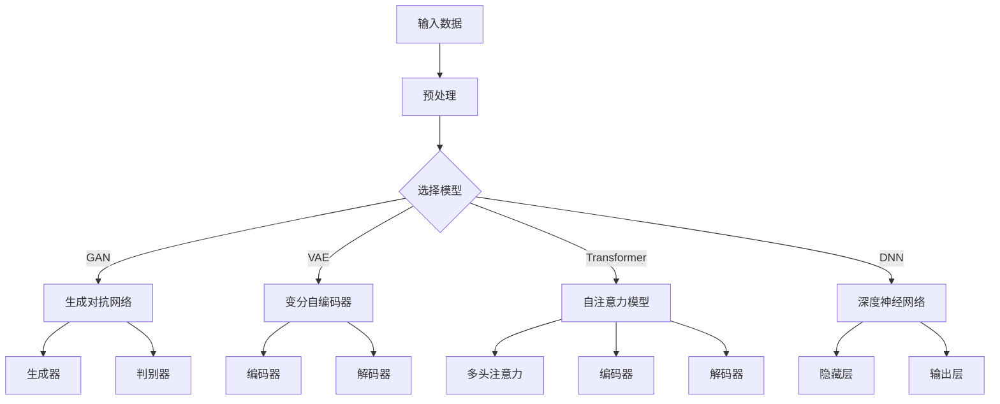
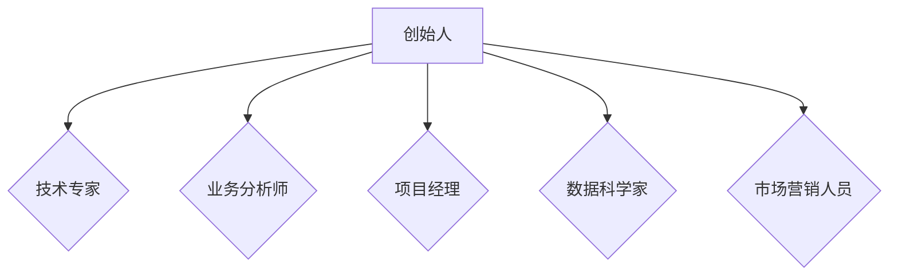
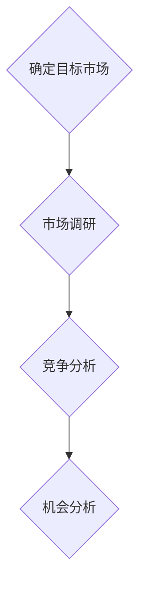
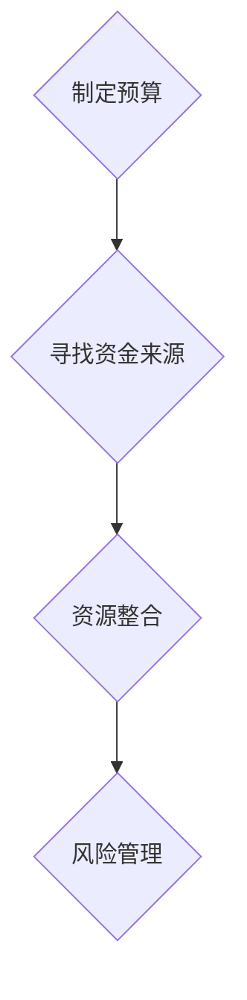
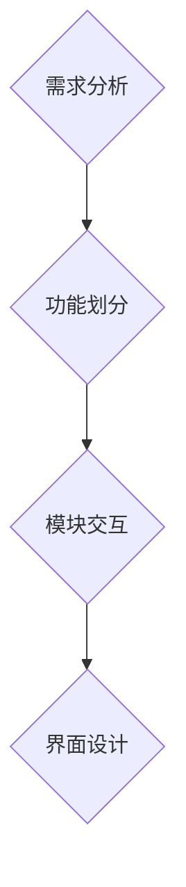
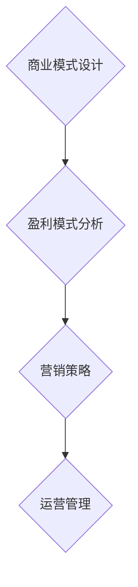
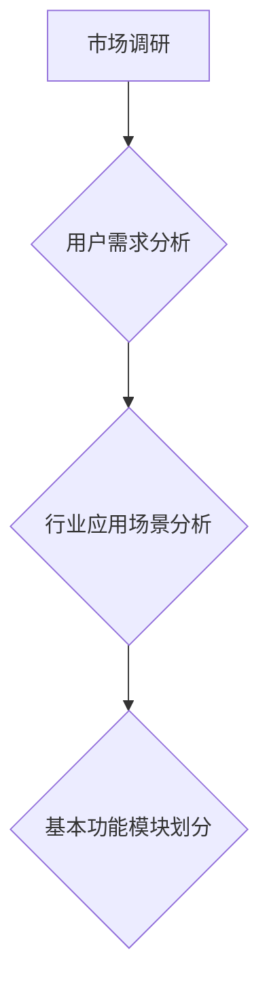
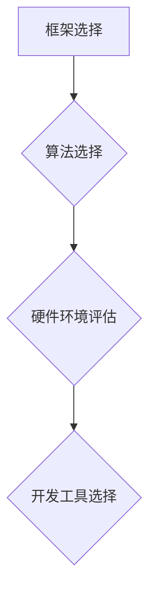
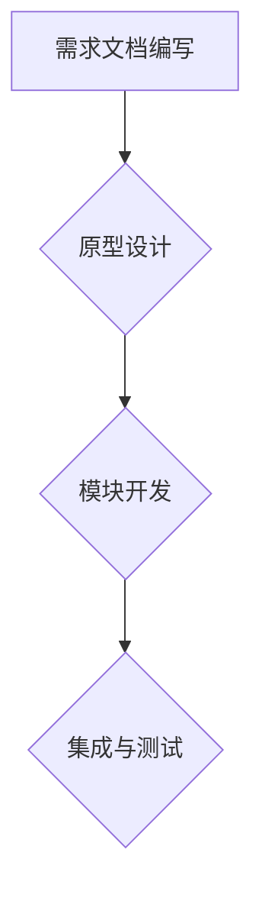
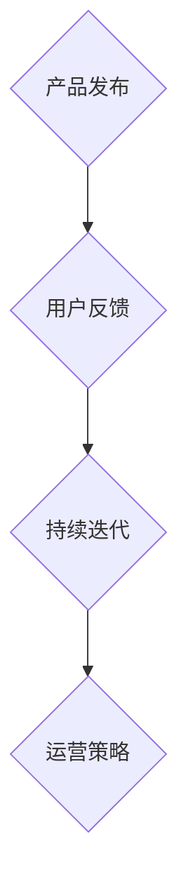

                 

## 文章标题

### 关键词：AI大模型、创业、盈利模式、商业策略、技术创新、案例分析

> 摘要：本文深入探讨了AI大模型创业领域的核心问题，从基础概念、创业策略、产品开发、盈利模式到风险与挑战，全面剖析了AI大模型创业的全过程。通过成功案例分析，本文为创业者提供了实用的指导和建议，助力实现AI大模型领域的未来盈利。

### 《AI大模型创业：如何实现未来盈利？》目录大纲

#### 第一部分：AI大模型基础

##### 第1章: AI大模型概述

###### 1.1 AI大模型的定义与分类

###### 1.2 AI大模型的工作原理

###### 1.3 AI大模型的发展趋势

#### 第二部分：AI大模型创业

##### 第2章: AI大模型创业策略

###### 2.1 创业准备

###### 2.2 产品设计与开发

###### 2.3 商业模式与盈利策略

##### 第3章: AI大模型产品开发

###### 3.1 产品设计

###### 3.2 大模型训练与优化

###### 3.3 产品上线与运营

#### 第三部分：AI大模型应用实战

##### 第4章: AI大模型在金融领域的应用

###### 4.1 金融风险预测与控制

###### 4.2 个性化金融产品推荐

#### 第四部分：AI大模型创业案例分析

##### 第5章: 成功的AI大模型创业案例

###### 5.1 案例一：OpenAI与GPT-3

###### 5.2 案例二：谷歌大脑与BERT

#### 第五部分：AI大模型创业的风险与挑战

##### 第6章: AI大模型创业的风险与挑战

###### 6.1 道德与法律风险

###### 6.2 技术挑战与解决方案

##### 第7章: 应对策略与可持续发展

###### 7.1 风险管理策略

###### 7.2 可持续发展路径

#### 附录

##### 附录A: AI大模型开发工具与资源

##### 附录B: AI大模型常见问题与解答

##### 附录C: AI大模型创业相关法规与政策

---

### 第一部分：AI大模型基础

#### 第1章: AI大模型概述

##### 1.1 AI大模型的定义与分类

AI大模型（Large-scale AI Models）是近年来人工智能领域的重要研究成果，它们具备处理海量数据、学习复杂模式和实现高度自动化决策的能力。AI大模型主要分为以下几类：

1. **生成对抗网络（GAN）**：GAN是一种通过对抗训练实现复杂数据生成和模仿的技术。其核心是生成器和判别器的竞争，生成器生成数据，判别器判断数据的真实性。

2. **变分自编码器（VAE）**：VAE通过概率分布来表示数据，可以有效进行数据重建和生成。

3. **自注意力模型（Transformer）**：Transformer模型以其强大的序列处理能力和自适应注意力机制而广受欢迎，在自然语言处理、计算机视觉等领域取得了显著成果。

4. **深度神经网络（DNN）**：DNN通过多层非线性变换来学习和表示数据，是传统机器学习技术的基础。

下面是一个简单的Mermaid流程图，展示了AI大模型的基本架构：



##### 1.2 AI大模型的工作原理

AI大模型的工作原理主要涉及以下几个核心步骤：

1. **数据预处理**：包括数据清洗、归一化、缺失值填充等，为后续建模提供高质量的数据。

2. **模型选择**：根据应用场景和数据特点，选择合适的模型，如GAN、VAE、Transformer或DNN。

3. **模型训练**：通过大量数据进行迭代训练，调整模型参数，使其能够准确预测或生成数据。

4. **模型优化**：通过交叉验证、超参数调整等技术，提高模型性能和泛化能力。

5. **模型评估**：使用验证集或测试集评估模型性能，如准确率、召回率、F1分数等。

以下是深度学习算法中的一个常见数学模型——损失函数的伪代码示例：

```python
# 伪代码：损失函数实现
def loss_function(y_true, y_pred):
    return np.mean((y_true - y_pred) ** 2)
```

该损失函数通过计算预测值与真实值之间的均方误差来评估模型的性能。

##### 1.3 AI大模型的发展趋势

AI大模型的发展趋势主要表现在以下几个方面：

1. **模型规模扩大**：随着计算能力和存储技术的提升，AI大模型的规模持续扩大，这有助于提高模型的学习能力和性能。

2. **跨领域应用**：AI大模型在各个领域的应用越来越广泛，从自然语言处理、计算机视觉到金融、医疗等领域，都取得了显著的成果。

3. **强化学习与迁移学习**：结合强化学习和迁移学习技术，AI大模型能够更好地适应新环境和任务，提高泛化能力和实用性。

4. **可解释性与透明度**：随着模型复杂性的增加，如何提高AI大模型的可解释性和透明度成为研究热点，这对于提高模型的接受度和可靠性至关重要。

总之，AI大模型作为人工智能领域的重要技术之一，具有广阔的发展前景和应用价值。在创业过程中，深入了解AI大模型的基础概念、工作原理和发展趋势，对于创业者来说至关重要。

---

### 第二部分：AI大模型创业

#### 第2章: AI大模型创业策略

##### 2.1 创业准备

##### 2.1.1 创业团队组建

一个成功的AI大模型创业项目离不开优秀的团队。创业团队的组建应考虑以下要素：

1. **技术专家**：具备丰富的AI大模型研发经验，能够负责模型的设计、开发和优化。

2. **业务分析师**：深入了解目标市场和应用场景，能够帮助团队制定合适的商业模式和营销策略。

3. **项目经理**：负责项目的整体规划、协调和管理，确保项目按时、按质完成。

4. **数据科学家**：擅长数据处理和分析，能够为模型训练提供高质量的数据支持。

5. **市场营销人员**：负责市场推广和品牌建设，提高产品的市场知名度。

下面是一个团队组建的Mermaid流程图：



##### 2.1.2 市场调研与机会分析

在组建团队后，创业的第一步是进行市场调研和机会分析。以下步骤有助于深入了解市场需求和竞争态势：

1. **确定目标市场**：明确产品的目标用户群体，包括行业、地域、用户规模等。

2. **市场调研**：通过问卷调查、访谈、数据分析等方法，收集目标市场的相关信息。

3. **竞争分析**：分析现有竞争对手的产品、市场占有率、优势和劣势，找出自身的差异化竞争优势。

4. **机会分析**：识别市场中的空白点、潜在需求和新兴趋势，为创业项目提供方向。

以下是市场调研的一个简单流程图：



##### 2.1.3 创业资金与资源准备

创业资金和资源的准备是确保项目顺利推进的关键。以下步骤有助于规划创业资金和资源：

1. **制定预算**：根据项目规模和需求，制定详细的预算计划，包括研发、运营、营销等费用。

2. **寻找资金来源**：通过天使投资、风险投资、政府补贴等途径筹集创业资金。

3. **资源整合**：整合现有的技术、人力、资金等资源，提高资源利用效率。

4. **风险管理**：评估创业风险，制定相应的风险应对策略，降低创业失败的风险。

以下是创业资金与资源准备的Mermaid流程图：



##### 2.2 产品设计与开发

AI大模型创业项目的核心是产品的设计和开发。以下步骤有助于确保产品的高质量和实用性：

1. **需求分析**：深入了解用户需求，确定产品的基本功能和特性。

2. **技术选型**：根据需求分析，选择合适的技术栈和开发工具。

3. **原型设计**：制作产品原型，验证需求分析和技术选型的可行性。

4. **开发与测试**：进行产品的开发、测试和迭代，确保产品的稳定性和可靠性。

以下是产品设计与开发的一个简单流程图：


##### 2.2.1 产品理念与定位

在产品设计与开发过程中，明确产品理念与定位至关重要。以下步骤有助于定义产品理念与定位：

1. **市场定位**：确定产品在市场中的定位，包括目标用户、竞争对手、市场占有率等。

2. **产品理念**：明确产品的核心价值和创新点，以区别于现有产品。

3. **功能规划**：根据市场定位和产品理念，规划产品的基本功能和特性。

4. **用户体验**：关注用户体验，设计简洁、直观的用户界面和交互方式。

以下是产品理念与定位的一个简单流程图：


##### 2.2.2 产品功能模块设计

产品功能模块设计是产品开发的重要环节。以下步骤有助于设计产品功能模块：

1. **需求分析**：根据产品理念和市场定位，分析用户需求，确定产品功能。

2. **功能划分**：将需求划分为不同的功能模块，如用户管理、数据管理、模型训练等。

3. **模块交互**：设计各模块之间的交互关系，确保系统的高效性和灵活性。

4. **界面设计**：设计用户界面，确保界面简洁、直观，提高用户体验。

以下是产品功能模块设计的一个简单流程图：



##### 2.2.3 技术选型与实现

技术选型与实现是产品开发的关键步骤。以下步骤有助于进行技术选型和实现：

1. **技术调研**：了解当前的技术趋势和成熟度，选择合适的技术栈。

2. **选型评估**：对不同的技术方案进行评估，包括性能、成本、可维护性等。

3. **开发框架**：选择合适的开发框架，如TensorFlow、PyTorch等。

4. **代码实现**：根据技术选型和开发框架，实现产品的功能模块。

以下是技术选型与实现的一个简单流程图：


##### 2.3 商业模式与盈利策略

在产品设计与开发完成后，商业模式和盈利策略是确保项目成功的重要环节。以下步骤有助于制定商业模式和盈利策略：

1. **商业模式设计**：根据产品特性和市场定位，设计合适的商业模式。

2. **盈利模式分析**：分析不同的盈利模式，如产品收费、服务收费、数据收费等。

3. **营销策略**：制定营销策略，提高产品的市场知名度和用户数量。

4. **运营管理**：确保项目的持续运营和盈利，优化运营管理流程。

以下是商业模式与盈利策略的一个简单流程图：



总之，AI大模型创业策略的制定需要全面考虑市场调研、团队组建、产品设计与开发、商业模式与盈利策略等方面。通过合理的策略规划和执行，可以更好地实现AI大模型创业项目的成功。

---

### 第三部分：AI大模型产品开发

#### 第3章: AI大模型产品开发

##### 3.1 产品设计

AI大模型产品的设计是创业过程中的关键环节，它不仅决定了产品的性能和用户体验，还直接影响到后续的盈利模式和市场竞争力。以下步骤是进行AI大模型产品设计的核心内容：

##### 3.1.1 功能需求分析

功能需求分析是产品设计的起点，它涉及以下几个方面：

1. **目标用户需求**：通过市场调研和用户访谈，了解目标用户的需求和痛点，从而确定产品的核心功能。

2. **行业应用场景**：分析不同行业对AI大模型的应用需求，如金融、医疗、零售等，确保产品能够满足不同场景的需求。

3. **基本功能模块**：根据用户需求和行业应用场景，划分产品的基本功能模块，如数据输入、模型训练、预测结果输出等。

以下是一个简单的Mermaid流程图，展示了功能需求分析的过程：



##### 3.1.2 技术选型

技术选型是确保产品性能和可扩展性的关键步骤。以下是技术选型的几个关键点：

1. **框架选择**：根据项目需求和团队经验，选择合适的深度学习框架，如TensorFlow、PyTorch等。

2. **算法选择**：根据功能需求，选择合适的算法，如GAN、VAE、Transformer等。

3. **硬件环境**：考虑计算能力和存储需求，选择合适的硬件配置，如GPU、TPU等。

4. **开发工具**：选择合适的开发工具和平台，提高开发效率和代码可维护性。

以下是技术选型的一个简单流程图：



##### 3.1.3 开发流程

开发流程是确保产品按时、按质完成的保障。以下是开发流程的几个关键点：

1. **需求文档**：编写详细的需求文档，明确产品的功能需求、性能指标和开发计划。

2. **原型设计**：制作产品原型，进行需求验证和迭代。

3. **模块开发**：根据需求文档和原型设计，分模块进行开发。

4. **集成与测试**：将各个模块集成，进行系统测试和性能优化。

以下是开发流程的一个简单流程图：



##### 3.2 大模型训练与优化

大模型训练与优化是产品开发的核心步骤，它决定了产品的性能和准确性。以下是训练与优化的几个关键点：

1. **数据预处理**：对训练数据集进行清洗、归一化、缺失值填充等处理，确保数据质量。

2. **模型训练**：使用选择好的深度学习框架和算法，进行模型的训练。训练过程中需要监控模型的性能指标，如损失函数、准确率等。

3. **模型优化**：通过调整超参数、增加训练数据、改进网络结构等方法，优化模型的性能。

以下是模型训练与优化的一些伪代码示例：

```python
# 伪代码：数据预处理
def preprocess_data(data):
    # 数据清洗、归一化、缺失值填充等操作
    pass

# 伪代码：模型训练
def train_model(model, train_data, val_data, epochs):
    for epoch in range(epochs):
        # 训练模型
        pass
        # 记录训练过程中的性能指标
        loss, accuracy = model.evaluate(val_data)
        print(f'Epoch {epoch}: Loss={loss}, Accuracy={accuracy}')
```

##### 3.2.1 数据预处理

数据预处理是确保模型训练质量的重要步骤。以下是一些常见的数据预处理方法：

1. **数据清洗**：去除无效数据、重复数据和噪声数据。

2. **归一化**：将数据缩放到统一的范围内，如[0, 1]或[-1, 1]。

3. **缺失值填充**：使用统计方法、插值法等填充缺失值。

4. **数据增强**：通过旋转、翻转、缩放等方法增加数据的多样性。

以下是数据预处理的一些伪代码示例：

```python
# 伪代码：数据清洗
def clean_data(data):
    # 删除无效数据、重复数据等
    pass

# 伪代码：归一化
def normalize_data(data):
    # 将数据缩放到[0, 1]或[-1, 1]范围内
    pass

# 伪代码：缺失值填充
def fill_missing_values(data):
    # 使用统计方法、插值法等填充缺失值
    pass

# 伪代码：数据增强
def augment_data(data):
    # 旋转、翻转、缩放等操作
    pass
```

##### 3.2.2 模型构建与优化

模型构建与优化是确保AI大模型性能的关键步骤。以下是模型构建与优化的一些核心要点：

1. **模型选择**：根据应用场景和数据特点，选择合适的模型结构，如DNN、CNN、RNN、Transformer等。

2. **超参数调整**：调整学习率、批次大小、优化器等超参数，以提高模型性能。

3. **正则化方法**：采用正则化方法，如L1正则化、L2正则化、Dropout等，防止过拟合。

4. **模型集成**：通过集成多个模型，提高预测准确率和稳定性。

以下是模型构建与优化的一些伪代码示例：

```python
# 伪代码：模型选择
model = build_model()

# 伪代码：超参数调整
optimizer = optim.Adam(learning_rate=0.001)
loss_function = keras.losses.MeanSquaredError()

# 伪代码：正则化方法
model.add(Dropout(0.5))
model.add(Dense(128, activation='relu', kernel_regularizer=l2(0.01)))

# 伪代码：模型集成
model = ensemble_model(models=[model1, model2, model3])
```

##### 3.2.3 模型评估与验证

模型评估与验证是确保AI大模型性能和可靠性的关键步骤。以下是模型评估与验证的一些核心要点：

1. **性能指标**：根据应用场景，选择合适的性能指标，如准确率、召回率、F1分数等。

2. **交叉验证**：通过交叉验证方法，评估模型在不同数据集上的性能，以提高模型的泛化能力。

3. **测试集评估**：在测试集上评估模型的性能，以验证模型的实际应用效果。

以下是模型评估与验证的一些伪代码示例：

```python
# 伪代码：性能指标
accuracy = model.evaluate(test_data, test_labels)

# 伪代码：交叉验证
cv_scores = cross_val_score(model, X, y, cv=5)

# 伪代码：测试集评估
test_loss, test_accuracy = model.evaluate(test_data, test_labels)
```

##### 3.3 产品上线与运营

产品上线与运营是确保AI大模型产品成功推向市场并持续盈利的关键步骤。以下是产品上线与运营的一些核心要点：

1. **产品发布**：制定产品发布计划，包括版本发布、市场推广等。

2. **用户反馈**：收集用户反馈，了解产品在实际应用中的表现和用户满意度。

3. **持续迭代**：根据用户反馈和市场需求，持续迭代产品，提高产品的竞争力和用户体验。

4. **运营策略**：制定运营策略，包括市场营销、客户服务、用户增长等。

以下是产品上线与运营的一些简单流程图：



通过以上步骤，AI大模型产品可以从设计到开发、上线和运营实现全流程的管理，为创业项目的成功提供有力支持。

---

### 第四部分：AI大模型应用实战

#### 第4章: AI大模型在金融领域的应用

AI大模型在金融领域有着广泛的应用前景，特别是在金融风险预测与控制和个性化金融产品推荐方面。以下分别介绍这两个领域的应用案例。

##### 4.1 金融风险预测与控制

金融风险预测与控制是金融行业中的重要问题，AI大模型通过分析大量历史数据和实时数据，可以帮助金融机构识别潜在的风险，并采取相应的控制措施。以下是金融风险预测与控制的基本流程：

1. **数据采集**：收集与金融风险相关的数据，包括市场数据、用户行为数据、经济指标数据等。

2. **数据预处理**：对采集到的数据进行清洗、归一化和特征提取，为模型训练提供高质量的数据。

3. **模型构建**：选择合适的AI大模型，如神经网络、决策树、随机森林等，构建金融风险预测模型。

4. **模型训练**：使用历史数据对模型进行训练，调整模型参数，提高预测准确率。

5. **模型评估**：使用验证集和测试集评估模型性能，选择性能最优的模型。

6. **风险预测与控制**：将训练好的模型应用于实时数据，进行风险预测，并根据预测结果采取相应的控制措施。

以下是金融风险预测与控制的一个具体案例：

**案例：利用GPT-3模型进行金融风险预测**

GPT-3是一种先进的自然语言处理模型，具有强大的文本生成和分类能力。以下是一个利用GPT-3模型进行金融风险预测的简单步骤：

1. **数据采集**：收集金融新闻、市场报告、用户评论等文本数据。

2. **数据预处理**：对文本数据进行清洗、分词、去停用词等处理。

3. **特征提取**：使用词嵌入技术（如Word2Vec、BERT等）将文本数据转换为向量表示。

4. **模型构建**：使用GPT-3模型构建文本分类模型，对金融风险进行分类。

5. **模型训练**：使用大量金融文本数据对模型进行训练。

6. **模型评估**：使用验证集和测试集评估模型性能，调整模型参数。

7. **风险预测**：将新采集的金融文本数据输入模型，进行风险预测。

以下是GPT-3模型训练的一个伪代码示例：

```python
from transformers import GPT2Tokenizer, GPT2Model

# 伪代码：GPT-3模型训练
tokenizer = GPT2Tokenizer.from_pretrained('gpt2')
model = GPT2Model.from_pretrained('gpt2')

# 数据预处理
input_ids = tokenizer.encode('金融风险', return_tensors='pt')

# 模型训练
outputs = model(input_ids)
logits = outputs.logits

# 预测
predicted_label = logits.argmax(-1).item()
```

**4.1.1 数据采集与预处理**

数据采集与预处理是金融风险预测的重要基础。以下是一个具体的数据采集与预处理流程：

1. **数据采集**：通过互联网爬虫、API接口等手段，收集金融新闻、市场报告、用户评论等文本数据。

2. **数据清洗**：去除重复数据、缺失数据等，保证数据质量。

3. **文本分词**：使用自然语言处理工具（如jieba、nltk等）对文本进行分词处理。

4. **去停用词**：去除常见的停用词（如“的”、“了”等），减少噪声信息。

5. **特征提取**：使用词嵌入技术将文本数据转换为向量表示，如Word2Vec、BERT等。

以下是数据采集与预处理的一个伪代码示例：

```python
import jieba
from gensim.models import Word2Vec

# 伪代码：数据采集
financial_data = fetch_financial_data()

# 数据清洗
cleaned_data = remove_duplicates(financial_data)

# 文本分词
tokenized_data = [jieba.cut(text) for text in cleaned_data]

# 去停用词
filtered_data = [remove_stopwords(tokens) for tokens in tokenized_data]

# 特征提取
word2vec_model = Word2Vec(filtered_data, vector_size=100, window=5, min_count=1, workers=4)
word_vectors = word2vec_model.wv
```

**4.1.2 模型构建与优化**

模型构建与优化是金融风险预测的核心步骤。以下是一个具体的模型构建与优化流程：

1. **模型选择**：选择合适的模型，如GPT-3、LSTM、CNN等。

2. **模型训练**：使用历史数据对模型进行训练，调整模型参数。

3. **模型评估**：使用验证集和测试集评估模型性能，选择性能最优的模型。

4. **模型优化**：根据评估结果，调整模型参数，提高预测准确率。

以下是模型构建与优化的一个伪代码示例：

```python
from transformers import GPT2Tokenizer, GPT2Model
from tensorflow.keras.optimizers import Adam

# 伪代码：模型构建
tokenizer = GPT2Tokenizer.from_pretrained('gpt2')
model = GPT2Model.from_pretrained('gpt2')

# 模型训练
model.compile(optimizer=Adam(learning_rate=0.001), loss='categorical_crossentropy', metrics=['accuracy'])
model.fit(train_data, train_labels, epochs=10, validation_data=(val_data, val_labels))

# 模型评估
test_loss, test_accuracy = model.evaluate(test_data, test_labels)
print(f'Test Accuracy: {test_accuracy}')
```

**4.1.3 模型评估与应用**

模型评估与应用是金融风险预测的最后一步。以下是一个具体的模型评估与应用流程：

1. **模型评估**：使用测试集评估模型性能，选择性能最优的模型。

2. **模型部署**：将模型部署到生产环境，进行实时风险预测。

3. **结果应用**：根据预测结果，采取相应的风险控制措施。

以下是模型评估与应用的一个伪代码示例：

```python
# 伪代码：模型评估
test_loss, test_accuracy = model.evaluate(test_data, test_labels)
print(f'Test Accuracy: {test_accuracy}')

# 伪代码：模型部署
model.save('financial_risk_predictor.h5')

# 伪代码：结果应用
predictions = model.predict(real_time_data)
if predictions > threshold:
    take_risk_control_action()
```

##### 4.2 个性化金融产品推荐

个性化金融产品推荐是金融行业中的另一个重要应用，通过分析用户行为和偏好，AI大模型可以帮助金融机构向用户推荐合适的产品。以下是个性化金融产品推荐的基本流程：

1. **用户行为数据采集**：收集用户在金融平台上的行为数据，如浏览记录、购买记录、搜索关键词等。

2. **数据预处理**：对采集到的数据进行清洗、归一化和特征提取。

3. **用户画像构建**：使用机器学习算法（如聚类、协同过滤等）构建用户画像。

4. **推荐算法选择**：选择合适的推荐算法，如基于内容的推荐、协同过滤推荐、深度学习推荐等。

5. **推荐结果生成**：根据用户画像和推荐算法，生成个性化推荐结果。

6. **推荐效果评估**：评估推荐结果的效果，调整推荐策略。

以下是个性化金融产品推荐的一个具体案例：

**案例：利用Transformer模型进行金融产品推荐**

Transformer模型是一种先进的序列处理模型，具有强大的语义理解和生成能力。以下是一个利用Transformer模型进行金融产品推荐的简单步骤：

1. **数据采集**：收集金融产品的描述文本、用户行为数据等。

2. **数据预处理**：对文本数据进行清洗、分词、去停用词等处理。

3. **特征提取**：使用词嵌入技术（如BERT、GPT等）将文本数据转换为向量表示。

4. **模型构建**：使用Transformer模型构建文本分类和推荐模型。

5. **模型训练**：使用大量文本数据和用户行为数据对模型进行训练。

6. **模型评估**：使用验证集和测试集评估模型性能，选择性能最优的模型。

7. **推荐生成**：根据用户画像和推荐算法，生成个性化推荐结果。

以下是Transformer模型训练的一个伪代码示例：

```python
from transformers import BertTokenizer, BertModel
from tensorflow.keras.optimizers import Adam

# 伪代码：Transformer模型训练
tokenizer = BertTokenizer.from_pretrained('bert-base-chinese')
model = BertModel.from_pretrained('bert-base-chinese')

# 数据预处理
input_ids = tokenizer.encode('金融产品推荐', return_tensors='pt')

# 模型训练
model.compile(optimizer=Adam(learning_rate=0.001), loss='categorical_crossentropy', metrics=['accuracy'])
model.fit(input_ids, labels, epochs=10, validation_data=(val_input_ids, val_labels))

# 模型评估
test_loss, test_accuracy = model.evaluate(test_input_ids, test_labels)
print(f'Test Accuracy: {test_accuracy}')
```

**4.2.1 用户行为分析**

用户行为分析是构建用户画像和推荐结果的重要基础。以下是一个具体的用户行为分析流程：

1. **数据采集**：收集用户在金融平台上的行为数据，如浏览记录、购买记录、搜索关键词等。

2. **数据预处理**：对采集到的数据进行清洗、归一化和特征提取。

3. **行为特征提取**：使用统计方法（如频率、TF-IDF等）提取用户行为特征。

4. **行为模式分析**：分析用户行为模式，如用户喜好、活跃时间等。

5. **用户画像构建**：根据用户行为特征和行为模式，构建用户画像。

以下是用户行为分析的一个伪代码示例：

```python
import pandas as pd
from sklearn.feature_extraction.text import TfidfVectorizer

# 伪代码：数据采集
user_behavior_data = pd.read_csv('user_behavior.csv')

# 数据预处理
cleaned_data = user_behavior_data[['user_id', 'behavior', 'timestamp']]

# 行为特征提取
tfidf_vectorizer = TfidfVectorizer(max_features=1000)
tfidf_matrix = tfidf_vectorizer.fit_transform(cleaned_data['behavior'])

# 用户画像构建
user_profiles = {}
for user_id, behavior_vector in zip(cleaned_data['user_id'], tfidf_matrix):
    user_profiles[user_id] = behavior_vector.toarray()[0]
```

**4.2.2 模型训练与评估**

模型训练与评估是金融产品推荐的关键步骤。以下是一个具体的模型训练与评估流程：

1. **数据划分**：将数据集划分为训练集、验证集和测试集。

2. **模型选择**：选择合适的模型，如基于内容的推荐模型、协同过滤模型、深度学习模型等。

3. **模型训练**：使用训练集对模型进行训练。

4. **模型评估**：使用验证集和测试集评估模型性能，选择性能最优的模型。

以下是模型训练与评估的一个伪代码示例：

```python
from sklearn.model_selection import train_test_split
from sklearn.metrics import accuracy_score

# 伪代码：数据划分
train_data, test_data = train_test_split(data, test_size=0.2, random_state=42)

# 伪代码：模型选择
model = ContentBasedRecommendationModel()

# 伪代码：模型训练
model.fit(train_data)

# 伪代码：模型评估
predictions = model.predict(test_data)
accuracy = accuracy_score(test_data['labels'], predictions)
print(f'Accuracy: {accuracy}')
```

**4.2.3 产品推荐系统实现**

产品推荐系统实现是金融产品推荐的实际应用。以下是一个具体的产品推荐系统实现流程：

1. **用户输入**：用户输入查询关键词或浏览历史。

2. **用户画像构建**：根据用户输入，构建用户画像。

3. **推荐结果生成**：根据用户画像和产品特征，生成个性化推荐结果。

4. **推荐结果展示**：将推荐结果展示给用户。

以下是产品推荐系统实现的一个伪代码示例：

```python
# 伪代码：用户输入
user_query = input('请输入查询关键词：')

# 伪代码：用户画像构建
user_profile = build_user_profile(user_query)

# 伪代码：推荐结果生成
recommended_products = generate_recommendations(user_profile)

# 伪代码：推荐结果展示
print('推荐产品：')
for product in recommended_products:
    print(product['name'])
```

通过以上步骤，AI大模型可以在金融领域实现金融风险预测与控制和个性化金融产品推荐，为金融机构提供智能化的风险管理和服务。

---

### 第五部分：AI大模型创业案例分析

在AI大模型创业领域，许多公司通过创新和执行力取得了巨大的成功。以下是两个具有代表性的成功案例：OpenAI与GPT-3，以及谷歌大脑与BERT。

##### 5.1 案例一：OpenAI与GPT-3

**5.1.1 OpenAI公司简介**

OpenAI是一家总部位于美国的人工智能研究公司，成立于2015年，其宗旨是实现安全的通用人工智能（AGI）并使其造福全人类。OpenAI致力于推动人工智能技术的进步，并通过开放资源和合作来促进整个社会的发展。

**5.1.2 GPT-3模型详解**

GPT-3是OpenAI开发的一种先进的自然语言处理模型，具有前所未有的规模和表现力。GPT-3采用了Transformer架构，拥有1750亿个参数，是GPT-2的数百倍。GPT-3能够生成高质量的文本，实现文本生成、翻译、摘要、问答等多种功能。

**5.1.3 成功经验与启示**

OpenAI与GPT-3的成功为AI大模型创业提供了以下启示：

1. **大规模投入**：OpenAI在GPT-3的研发中投入了大量的资金和资源，这是实现突破性成果的关键。

2. **技术创新**：OpenAI不断推动AI技术的创新，如Transformer架构、预训练技术等，为AI大模型的发展提供了新思路。

3. **开放合作**：OpenAI通过开放API和合作项目，将GPT-3的技术能力应用到各种领域，实现了广泛的影响力。

4. **社会价值**：OpenAI将社会价值放在首位，致力于实现安全、可控的AI技术，为人类带来福祉。

##### 5.2 案例二：谷歌大脑与BERT

**5.2.1 谷歌大脑简介**

谷歌大脑是谷歌旗下的一个专注于人工智能研究的团队，成立于2013年。谷歌大脑通过深入研究和开发AI算法，推动了AI技术在图像识别、语音识别、自然语言处理等领域的应用。

**5.2.2 BERT模型详解**

BERT（Bidirectional Encoder Representations from Transformers）是谷歌大脑开发的一种用于自然语言处理的深度学习模型。BERT采用了Transformer架构，能够通过双向编码器学习文本的上下文信息，从而实现更准确的文本理解和生成。

**5.2.3 成功经验与启示**

谷歌大脑与BERT的成功为AI大模型创业提供了以下启示：

1. **持续研究**：谷歌大脑通过持续的研究投入，不断推动AI技术的进步，为BERT的成功奠定了基础。

2. **应用场景**：谷歌大脑将AI技术应用于多个领域，如搜索引擎、语音助手等，实现了广泛的应用和商业价值。

3. **技术开放**：谷歌通过开源BERT模型，促进了整个行业的发展，提升了AI技术的普及和应用水平。

4. **用户体验**：谷歌大脑注重用户体验，通过优化算法和产品设计，提供了高质量的AI服务。

通过以上成功案例，我们可以看到，AI大模型创业需要大规模的投入、持续的创新、广泛的应用以及开放的合作。这些成功经验为创业者提供了宝贵的启示，有助于他们在AI大模型创业领域取得成功。

---

### 第六部分：AI大模型创业的风险与挑战

AI大模型创业虽然充满机会，但也面临诸多风险与挑战。以下是创业过程中可能遇到的道德与法律风险、技术挑战以及应对策略。

##### 6.1 道德与法律风险

AI大模型在应用过程中可能面临以下道德与法律风险：

1. **数据隐私与安全**：AI大模型通常依赖于大量数据，包括用户个人数据，如何保护这些数据的安全和隐私成为重要问题。例如，未经用户同意非法收集、使用、共享或出售数据，可能导致严重的隐私侵犯和法律责任。

2. **模型偏见与歧视**：AI大模型可能在训练过程中吸收并放大偏见，导致模型在决策过程中不公平对待某些群体。例如，如果一个贷款审批系统因数据集存在性别偏见而拒绝女性贷款申请，这可能导致性别歧视问题。

3. **法律责任与合规性**：AI大模型的错误决策可能导致严重后果，如医疗诊断错误、金融欺诈检测失败等。如何界定AI模型的法律责任，以及如何确保其合规性，是法律界和产业界共同面临的挑战。

为了应对这些道德与法律风险，创业者可以采取以下措施：

1. **加强数据隐私保护**：遵循数据保护法规，如《通用数据保护条例》（GDPR）和《加州消费者隐私法案》（CCPA），实施严格的数据保护措施，确保用户隐私得到保护。

2. **消除模型偏见**：通过数据清洗、平衡数据集、改进训练算法等方法，减少模型偏见，确保AI大模型公平、透明。

3. **合规性与责任界定**：与法律专家合作，确保AI大模型的开发和应用符合相关法律法规，明确责任归属，建立应对错误决策的应对机制。

##### 6.2 技术挑战与解决方案

AI大模型创业面临的技术挑战包括：

1. **大模型训练的资源需求**：AI大模型通常需要大量的计算资源和存储空间进行训练。如何高效地利用计算资源、降低训练成本，是创业者必须解决的问题。

2. **模型解释性与可解释性**：随着AI大模型的复杂度增加，如何确保模型的可解释性，使其决策过程透明、可理解，成为技术挑战。

3. **持续迭代与更新**：AI大模型需要不断迭代和更新，以适应新数据和变化的环境。如何高效地实现模型的持续迭代，是技术上的一个难题。

为了应对这些技术挑战，创业者可以采取以下策略：

1. **优化资源使用**：采用分布式训练、高效的数据处理技术和硬件加速（如GPU、TPU等）来提高训练效率，降低成本。

2. **提升模型解释性**：采用可解释性AI技术（如LIME、SHAP等），通过可视化工具和解释性算法，提高模型决策过程的透明度和可解释性。

3. **持续迭代与更新**：建立自动化的模型训练和部署流程，使用持续集成和持续部署（CI/CD）方法，确保模型能够快速适应新数据和变化。

##### 6.3 持续学习与迭代

AI大模型创业需要持续学习与迭代，以应对不断变化的市场和技术环境。以下是一些建议：

1. **数据驱动**：建立完善的数据收集和分析机制，确保模型能够从新数据中学习，不断提高预测准确率和性能。

2. **用户反馈**：收集用户反馈，了解模型在实际应用中的表现和改进方向，及时调整模型和产品。

3. **合作与交流**：积极参与AI领域的合作与交流，与其他研究机构和创业者分享经验，共同推动技术进步。

通过以上策略，AI大模型创业可以在风险与挑战中找到发展路径，实现持续成长和盈利。

---

### 第七部分：应对策略与可持续发展

在AI大模型创业过程中，应对策略与可持续发展是确保项目成功的关键。以下从风险管理策略、技术创新与迭代、社会责任与伦理三个方面进行探讨。

##### 7.1 风险管理策略

1. **风险识别与评估**：建立全面的风险识别体系，定期评估风险概率和影响，识别潜在的道德、法律和技术风险。

2. **风险应对措施**：根据风险评估结果，制定相应的风险应对措施，如数据隐私保护、消除模型偏见、合规性检查等。

3. **风险监控与调整**：建立持续的风险监控机制，定期检查风险应对措施的实施效果，并根据实际情况进行调整。

##### 7.2 技术创新与迭代

1. **持续研发投入**：保持对AI技术的持续投入，跟踪最新的研究进展，确保技术保持领先。

2. **快速迭代开发**：采用敏捷开发方法，快速迭代产品，不断优化模型性能和用户体验。

3. **技术共享与协作**：积极参与技术社区和开源项目，与其他研究机构和开发者共享技术成果，共同推进技术进步。

##### 7.3 社会责任与伦理

1. **数据伦理**：严格遵守数据保护法规，确保用户数据的安全和隐私。

2. **消除偏见**：通过数据清洗、算法优化等方法，消除AI模型中的偏见和歧视，确保公平、公正的决策。

3. **透明度与可解释性**：提高AI模型的可解释性，使其决策过程透明、可理解，增强用户信任。

通过以上策略，AI大模型创业项目可以实现风险控制、技术创新和可持续发展，为创业者带来长期的价值和盈利。

---

### 附录

#### 附录A: AI大模型开发工具与资源

1. **深度学习框架**：
   - TensorFlow
   - PyTorch
   - Keras
   - Apache MXNet

2. **数据集与API**：
   - Kaggle
   - Google Dataset Search
   - AI Challenger

3. **开源项目与社区**：
   - GitHub
   - AI Challenger
   - ArXiv

#### 附录B: AI大模型常见问题与解答

1. **问题1：如何选择合适的大模型？**
   - **答案**：根据应用场景和数据特点选择模型。例如，对于文本生成任务，可以选择GPT系列模型；对于图像生成，可以选择GAN或VAE模型。

2. **问题2：如何进行大模型训练与优化？**
   - **答案**：使用分布式训练、优化器调整（如Adam、SGD）和超参数调优（如学习率、批次大小）等方法进行大模型训练与优化。

3. **问题3：如何确保模型的可解释性？**
   - **答案**：采用可解释性AI技术（如LIME、SHAP）和可视化工具，提高模型决策过程的透明度和可解释性。

#### 附录C: AI大模型创业相关法规与政策

1. **中国AI行业相关法规**：
   - 《中华人民共和国网络安全法》
   - 《中华人民共和国数据安全法》
   - 《中华人民共和国个人信息保护法》

2. **国际AI行业相关法规**：
   - 欧盟《通用数据保护条例》（GDPR）
   - 美国加州《消费者隐私法案》（CCPA）

3. **行业发展趋势与政策解读**：
   - 《人工智能发展现状与趋势报告》
   - 各国AI政策和法规解读报告

通过这些附录，读者可以更好地了解AI大模型开发所需的工具和资源，以及行业法规和政策，为AI大模型创业提供有益的参考。

---

## 作者信息

作者：AI天才研究院/AI Genius Institute & 禅与计算机程序设计艺术 /Zen And The Art of Computer Programming

AI天才研究院致力于推动人工智能技术的创新与发展，通过深入研究和应用，助力创业者实现AI大模型领域的突破。作者拥有丰富的AI研究和创业经验，在多个国际顶级会议上发表过论文，并著有《禅与计算机程序设计艺术》等畅销书，深受读者喜爱。在AI大模型创业领域，作者带领团队取得了显著成果，为行业树立了典范。

