                 

### 《AI大模型创业：如何应对未来价格战？》

关键词：AI大模型、创业、价格战、策略、技术创新、市场推广

摘要：本文深入探讨了AI大模型创业的现状与未来挑战，特别是在面临价格战时的应对策略。通过对AI大模型的基本概念、市场背景、创业基础、实战经验以及应对价格战的策略进行全面分析，本文旨在为创业者提供一套系统性的指导框架，帮助他们更好地把握市场机遇，规避风险，实现可持续发展。

### 《AI大模型创业：如何应对未来价格战？》目录大纲

#### 第一部分：AI大模型与创业基础

1. **AI大模型概述**
   - **1.1 AI大模型的基本概念与重要性**
     - **1.1.1 AI大模型的定义与特点**
     - **1.1.2 AI大模型在商业应用中的地位**
     - **1.1.3 AI大模型的应用趋势**
   - **1.2 AI大模型的市场背景**
     - **1.2.1 AI大模型技术的发展历程**
     - **1.2.2 行业主要竞争者与市场份额分析**
     - **1.2.3 AI大模型市场的发展机遇与挑战**

2. **AI大模型创业基础**
   - **2.1 创业者应具备的技能与素质**
     - **2.1.1 技术技能要求**
     - **2.1.2 商业素养与策略**
     - **2.1.3 团队建设与管理**
   - **2.2 创业机会识别**
     - **2.2.1 行业需求分析**
     - **2.2.2 市场定位与目标客户分析**
     - **2.2.3 创业机会评估与选择**

#### 第二部分：AI大模型创业实战

3. **产品设计与开发**
   - **3.1 AI大模型产品的设计原则**
     - **3.1.1 用户需求分析**
     - **3.1.2 产品功能规划**
     - **3.1.3 用户体验设计**
   - **3.2 AI大模型开发的流程与技术**
     - **3.2.1 数据准备与处理**
     - **3.2.2 模型选择与优化**
     - **3.2.3 部署与运维**
   - **3.3 AI大模型创业中的技术挑战与解决方法**
     - **3.3.1 计算资源管理**
     - **3.3.2 数据隐私与安全**
     - **3.3.3 模型可解释性与可靠性**

4. **市场推广与营销策略**
   - **4.1 市场定位与目标客户群体**
     - **4.1.1 目标市场分析**
     - **4.1.2 目标客户特征与需求分析**
   - **4.2 品牌建设与传播**
     - **4.2.1 品牌定位与核心价值**
     - **4.2.2 品牌传播渠道与策略**
     - **4.2.3 社交媒体营销**
   - **4.3 销售策略与渠道建设**
     - **4.3.1 销售模式与流程设计**
     - **4.3.2 销售渠道选择与管理**
     - **4.3.3 客户关系管理**

5. **团队管理与商业模式创新**
   - **5.1 团队管理**
     - **5.1.1 团队组织架构与分工**
     - **5.1.2 团队成员能力培养与激励**
     - **5.1.3 项目管理与协调**
   - **5.2 商业模式创新**
     - **5.2.1 商业模式设计原则**
     - **5.2.2 商业模式创新方法**
     - **5.2.3 收入模型与盈利模式**

#### 第三部分：应对未来价格战的策略

6. **价格战背景与影响**
   - **6.1 价格战的概念与分类**
     - **6.1.1 价格战的基本原理**
     - **6.1.2 价格战的常见形式**
   - **6.2 价格战对创业公司的影响**
     - **6.2.1 市场竞争态势分析**
     - **6.2.2 价格战对公司运营的影响**
   - **6.3 应对价格战的策略分析**
     - **6.3.1 提升产品差异化**
     - **6.3.2 加强品牌建设与传播**
     - **6.3.3 创新商业模式**

7. **综合案例分析**
   - **7.1 成功案例介绍**
     - **7.1.1 案例背景与商业模式**
     - **7.1.2 创新点与成功经验**
     - **7.1.3 案例启示**
   - **7.2 失败案例分析**
     - **7.2.1 案例背景与原因**
     - **7.2.2 失败教训与反思**
     - **7.2.3 对其他创业公司的借鉴意义**

#### 第四部分：持续创新与未来发展

8. **技术趋势与前沿动态**
   - **8.1 AI大模型技术发展趋势**
     - **8.1.1 技术发展方向**
     - **8.1.2 未来可能的突破领域**
   - **8.2 创业公司如何跟上技术趋势**
     - **8.2.1 技术跟踪与预测方法**
     - **8.2.2 技术储备与布局策略**

9. **可持续发展的战略规划**
   - **9.1 企业社会责任与伦理**
     - **9.1.1 社会责任在企业战略中的地位**
     - **9.1.2 伦理考量在产品与服务中的体现**
   - **9.2 创业公司的长期发展规划**
     - **9.2.1 战略目标与路径设计**
     - **9.2.2 风险管理与应对策略**

### 附录

10. **附录**
    - **A.1 常用AI大模型与工具简介**
      - **A.1.1 主流AI大模型概述**
      - **A.1.2 开发工具与平台推荐**
      - **A.1.3 数据集与开源资源介绍**
    - **A.2 AI大模型创业资源链接**
      - **A.2.1 行业报告与研究论文**
      - **A.2.2 创业相关政策与扶持措施**
      - **A.2.3 国际与国内AI大模型创业案例集锦**

### 第一部分：AI大模型与创业基础

#### 1.1 AI大模型的基本概念与重要性

##### 1.1.1 AI大模型的定义与特点

AI大模型（Large-scale Artificial Intelligence Models）是人工智能领域中的一种先进技术，它通常指的是那些规模巨大、参数数量极为庞大的神经网络模型。这些模型通过对海量数据进行训练，能够自动学习并提取数据中的复杂模式和特征，从而实现高效的数据分析和决策支持。AI大模型的特点主要体现在以下几个方面：

1. **规模巨大**：AI大模型通常拥有数十亿甚至数万亿个参数，训练数据规模也达到数PB级别。这种巨大的规模使得模型能够捕捉到数据中的细微变化和复杂关系。

2. **自动学习**：AI大模型通过深度学习算法，可以自动从数据中学习并优化模型参数，从而提升模型的性能和预测准确性。

3. **泛化能力强**：由于训练数据规模大，AI大模型具有较强的泛化能力，可以在不同的任务和数据集上表现出良好的性能。

4. **多模态处理**：AI大模型可以同时处理多种类型的数据，如文本、图像、音频等，实现跨模态的信息融合和处理。

##### 1.1.2 AI大模型在商业应用中的地位

AI大模型在商业应用中具有重要地位，成为企业创新和竞争力提升的重要驱动力。具体表现在以下几个方面：

1. **数据驱动的决策支持**：AI大模型能够高效处理和分析海量数据，为企业提供精准的决策支持，降低决策风险。

2. **智能化服务与产品**：AI大模型可以应用于智能客服、智能推荐、智能诊断等领域，提升用户体验和产品价值。

3. **业务流程优化**：AI大模型能够自动化和优化业务流程，提高运营效率，降低成本。

4. **创新商业模式**：AI大模型的应用可以推动企业商业模式创新，如共享经济、个性化定制等。

##### 1.1.3 AI大模型的应用趋势

随着技术的不断进步和应用场景的拓展，AI大模型的应用趋势呈现出以下几个方向：

1. **跨行业应用**：AI大模型在金融、医疗、教育、制造等多个行业得到广泛应用，成为行业数字化转型的关键技术。

2. **场景多样化**：从简单的分类、预测任务到复杂的多任务学习、强化学习等，AI大模型的应用场景越来越多样化。

3. **实时处理与实时反馈**：随着边缘计算和5G技术的发展，AI大模型在实时数据处理和实时反馈中的应用越来越普遍。

4. **可解释性与可靠性提升**：随着AI大模型在关键业务场景中的应用，可解释性和可靠性成为重要的研究方向，以提高模型的可信度和用户接受度。

#### 1.2 AI大模型的市场背景

##### 1.2.1 AI大模型技术的发展历程

AI大模型技术的发展历程可以分为以下几个阶段：

1. **起步阶段（2010年前）**：在这一阶段，神经网络和深度学习技术开始兴起，但模型规模较小，应用场景有限。

2. **快速发展阶段（2010-2015年）**：随着GPU计算能力的提升和大数据技术的普及，AI大模型开始迅速发展，涌现出许多高性能的深度学习框架。

3. **大规模应用阶段（2015年至今）**：在这一阶段，AI大模型在各个领域得到广泛应用，如自然语言处理、计算机视觉、语音识别等。

##### 1.2.2 行业主要竞争者与市场份额分析

在AI大模型领域，主要竞争者包括Google、Facebook、Microsoft、Amazon、腾讯、阿里巴巴等科技巨头。以下是对这些公司的主要特点和市场份额分析：

1. **Google**：作为AI领域的领军企业，Google在AI大模型研究方面处于领先地位，其推出的TensorFlow和BERT等模型在学术界和工业界都有广泛影响。

2. **Facebook**：Facebook在自然语言处理和计算机视觉领域具有较强的竞争力，其开发的PyTorch框架也在学术界和工业界得到广泛应用。

3. **Microsoft**：Microsoft在AI大模型领域拥有丰富的产品线和解决方案，如Azure Machine Learning和Cognitive Services，广泛应用于企业级客户。

4. **Amazon**：Amazon在AI大模型应用方面具有独特的优势，其开发的AWS SageMaker和Amazon Personalize等产品为企业提供了强大的AI大模型服务。

5. **腾讯**：腾讯在自然语言处理和计算机视觉领域具有较强的技术实力，其推出的腾讯AI大模型平台和腾讯云AI服务等产品在国内外市场都有较高知名度。

6. **阿里巴巴**：阿里巴巴在AI大模型应用方面拥有丰富的经验，其开发的Aliyun AI大模型平台和飞天操作系统为企业提供了全面的AI解决方案。

##### 1.2.3 AI大模型市场的发展机遇与挑战

AI大模型市场的发展机遇主要体现在以下几个方面：

1. **技术进步**：随着计算能力和算法研究的不断进步，AI大模型将拥有更强大的性能和应用潜力。

2. **市场需求的增长**：随着各行业数字化转型加速，对AI大模型的需求持续增长，为企业提供了广阔的市场空间。

3. **政策的支持**：各国政府纷纷出台政策，支持AI技术的发展，为AI大模型市场的发展创造了良好的政策环境。

然而，AI大模型市场也面临一些挑战：

1. **数据隐私与安全**：随着AI大模型对数据需求的增加，数据隐私和安全问题成为关注焦点，如何平衡数据利用和隐私保护成为重要议题。

2. **可解释性与可靠性**：AI大模型在关键业务场景中的应用要求较高的可解释性和可靠性，这需要研究人员和工程师投入更多精力进行优化。

3. **市场竞争**：AI大模型市场的竞争日益激烈，如何保持技术优势和市场竞争力成为创业公司的重要挑战。

#### 1.3 AI大模型创业基础

##### 1.3.1 创业者应具备的技能与素质

创业者要成功开发AI大模型产品，需要具备以下技能与素质：

1. **技术技能要求**：创业者应具备深厚的计算机科学、机器学习、深度学习等专业知识，熟悉主流的AI大模型框架和算法。

2. **商业素养与策略**：创业者需要具备良好的商业素养，能够洞察市场机会，制定有效的商业策略。

3. **团队建设与管理**：创业者应具备团队建设和管理能力，能够吸引和培养优秀人才，建立高效的工作流程。

##### 1.3.2 创业机会识别

创业者可以通过以下方法识别AI大模型创业机会：

1. **行业需求分析**：通过研究各行业的痛点和需求，寻找AI大模型应用的切入点。

2. **市场定位与目标客户分析**：明确目标市场，分析潜在客户的特征和需求，制定针对性的产品和服务策略。

3. **创业机会评估与选择**：对识别出的创业机会进行评估，选择具有高潜力的方向进行创业。

#### 1.4 创业机会识别

##### 1.4.1 行业需求分析

创业者需要深入分析各个行业的现状和发展趋势，寻找AI大模型的应用机会。以下是一些具有潜力的行业领域：

1. **金融行业**：AI大模型在金融领域有广泛的应用，如智能投顾、信用评估、风险控制等。

2. **医疗行业**：AI大模型在医疗领域可以帮助医生进行疾病诊断、药物研发和患者管理。

3. **教育行业**：AI大模型在教育领域可以应用于个性化教学、学习分析和智能评估。

4. **制造业**：AI大模型在制造业可以帮助实现智能生产、设备维护和供应链优化。

5. **零售行业**：AI大模型在零售行业可以应用于智能推荐、库存管理和客户分析。

##### 1.4.2 市场定位与目标客户分析

创业者需要明确目标市场，分析潜在客户的特征和需求，以便制定针对性的市场策略。以下是一些目标客户群体：

1. **大型企业**：大型企业通常具有强大的资金和资源，对AI大模型有较高的需求，但合作门槛较高。

2. **初创公司**：初创公司对AI大模型的需求主要集中在技术研发和产品创新方面，但资金有限。

3. **政府部门**：政府部门对AI大模型的需求主要体现在公共安全、社会治理和智能化管理等方面。

4. **中小企业**：中小企业对AI大模型的需求主要集中在业务流程优化和运营效率提升方面。

##### 1.4.3 创业机会评估与选择

在识别出多个创业机会后，创业者需要进行评估和选择，选择最具潜力的方向进行创业。以下是一些评估和选择的方法：

1. **市场潜力评估**：分析市场规模、增长率、竞争态势等因素，评估市场的潜力。

2. **技术可行性评估**：分析所需技术是否成熟、研发周期、成本等因素，评估技术的可行性。

3. **团队匹配度评估**：分析团队的技术能力、经验、资源等因素，评估团队的匹配度。

4. **竞争优势评估**：分析竞争对手的优势、劣势，评估自身的竞争优势。

通过综合评估，创业者可以选择最具潜力的创业机会，并制定相应的商业计划。

### 第一部分：AI大模型与创业基础

#### 2.1 AI大模型创业基础

##### 2.1.1 创业者应具备的技能与素质

创业者要成功开发AI大模型产品，需要具备以下技能与素质：

1. **技术技能要求**：创业者应具备深厚的计算机科学、机器学习、深度学习等专业知识，熟悉主流的AI大模型框架和算法。以下是一些具体的技术技能要求：

   - **机器学习算法理解**：掌握常用的机器学习算法，如线性回归、逻辑回归、决策树、支持向量机、聚类算法、强化学习等。
   - **深度学习框架应用**：熟练使用主流的深度学习框架，如TensorFlow、PyTorch、Keras等，能够进行模型搭建、训练和优化。
   - **数据处理与特征工程**：具备数据处理和特征工程的能力，能够进行数据清洗、数据预处理、特征提取和特征选择。
   - **模型评估与调优**：掌握模型评估指标，如准确率、召回率、F1分数、ROC曲线等，能够进行模型调优和超参数调整。

2. **商业素养与策略**：创业者需要具备良好的商业素养，能够洞察市场机会，制定有效的商业策略。以下是一些商业素养的要求：

   - **市场需求分析**：能够分析市场需求，了解目标客户的需求和痛点，制定针对性的产品和服务策略。
   - **商业模式设计**：具备设计商业模式的能力，能够将AI大模型技术与市场需求相结合，创造商业价值。
   - **市场营销与推广**：掌握市场营销的基本原理和策略，能够制定有效的市场推广计划，提高品牌知名度和市场份额。
   - **财务管理**：具备基本的财务管理能力，能够进行预算编制、成本控制、财务分析和风险控制。

3. **团队建设与管理**：创业者应具备团队建设和管理能力，能够吸引和培养优秀人才，建立高效的工作流程。以下是一些团队建设与管理的要求：

   - **团队组织架构**：能够设计合理的团队组织架构，明确各岗位职责和分工，确保团队高效协作。
   - **人才招聘与培养**：具备招聘和培养人才的能力，能够识别和吸引优秀的技术人才，提供培训和晋升机会。
   - **团队激励与绩效管理**：能够制定合理的激励机制，激发团队成员的积极性和创造力，进行绩效管理和评估。
   - **项目管理和协调**：具备项目管理和协调能力，能够制定项目计划，协调资源，确保项目按时高质量完成。

##### 2.1.2 创业机会识别

创业者可以通过以下方法识别AI大模型创业机会：

1. **行业需求分析**：通过研究各行业的现状和发展趋势，寻找AI大模型的应用机会。以下是一些具有潜力的行业领域：

   - **金融行业**：AI大模型在金融领域有广泛的应用，如智能投顾、信用评估、风险控制、智能交易等。
   - **医疗行业**：AI大模型在医疗领域可以帮助医生进行疾病诊断、药物研发、患者管理、医疗影像分析等。
   - **教育行业**：AI大模型在教育领域可以应用于个性化教学、学习分析、智能评估、智能辅导等。
   - **制造业**：AI大模型在制造业可以帮助实现智能生产、设备维护、供应链优化、质量检测等。
   - **零售行业**：AI大模型在零售行业可以应用于智能推荐、库存管理、客户分析、智能客服等。
   - **物流行业**：AI大模型在物流行业可以帮助实现路径优化、运输调度、智能监控等。
   - **农业**：AI大模型在农业可以帮助实现智能种植、病虫害检测、产量预测等。

2. **技术进步分析**：关注AI大模型技术的最新进展，寻找技术突破带来的应用机会。以下是一些技术趋势：

   - **预训练模型**：如GPT-3、BERT等大规模预训练模型，为各行业应用提供了强大的基础模型。
   - **多模态学习**：如图像、文本、语音等多模态数据融合，为跨模态任务提供了新的解决方案。
   - **边缘计算**：AI大模型与边缘计算的融合，为实时数据处理和智能决策提供了支持。
   - **生成对抗网络（GAN）**：在图像生成、数据增强等方面具有广泛应用前景。

3. **政策与市场环境**：关注政策导向和市场环境变化，寻找政策支持和市场需求带来的创业机会。以下是一些政策和市场环境：

   - **政府支持**：各国政府对AI技术的支持政策，如研发资金、税收优惠、创新创业扶持等。
   - **市场竞争**：分析市场竞争对手的布局和策略，寻找市场空缺和差异化竞争优势。
   - **产业升级**：随着产业数字化、智能化进程的推进，寻找AI大模型在产业升级中的应用机会。

4. **用户需求调研**：通过用户需求调研，了解用户痛点和需求，寻找满足用户需求的AI大模型应用场景。以下是一些用户需求：

   - **效率提升**：如自动化办公、业务流程优化等，提高工作效率。
   - **决策支持**：如数据可视化、预测分析等，为决策提供数据支持。
   - **用户体验**：如智能客服、个性化推荐等，提升用户体验。
   - **创新服务**：如智能医疗、智能教育等，为用户提供创新的服务。

通过以上方法，创业者可以识别出潜在的AI大模型创业机会，并进行评估和选择，确定最具潜力的创业方向。

##### 2.1.3 创业机会评估与选择

在识别出多个AI大模型创业机会后，创业者需要进行评估和选择，选择最具潜力的方向进行创业。以下是一些评估和选择的方法：

1. **市场潜力评估**：分析市场规模、增长率、竞争态势等因素，评估市场的潜力。以下是一些评估指标：

   - **市场规模**：评估目标市场的整体规模，包括现有市场规模和潜在市场规模。
   - **增长潜力**：分析市场的增长速度和趋势，评估市场的增长潜力。
   - **竞争态势**：分析市场的主要竞争对手，评估市场竞争的激烈程度。

2. **技术可行性评估**：分析所需技术是否成熟、研发周期、成本等因素，评估技术的可行性。以下是一些评估指标：

   - **技术成熟度**：评估所选技术的研究进展和成熟度，包括技术原理、算法实现、应用案例等。
   - **研发周期**：评估技术实现的研发周期，包括实验验证、原型设计、产品化等。
   - **研发成本**：评估技术研发的投入成本，包括人力、设备、资金等。

3. **团队匹配度评估**：分析团队的技术能力、经验、资源等因素，评估团队的匹配度。以下是一些评估指标：

   - **技术能力**：评估团队成员在相关技术领域的专业素养和实际经验。
   - **项目经验**：评估团队成员在类似项目中的成功经验和项目管理能力。
   - **资源支持**：评估团队可获取的资源，包括资金、人才、技术等。

4. **竞争优势评估**：分析竞争对手的优势、劣势，评估自身的竞争优势。以下是一些评估指标：

   - **技术优势**：评估自身在技术上的独特优势，包括技术领先、创新能力等。
   - **市场优势**：评估自身在市场上的优势，包括品牌知名度、市场份额等。
   - **资源优势**：评估自身在资源上的优势，包括资金、人才、技术等。

通过综合评估，创业者可以选择最具潜力的AI大模型创业机会，并制定相应的商业计划。在评估过程中，创业者需要结合自身团队特点和资源，选择最适合自己的创业方向，以确保创业项目的成功。

### 第二部分：AI大模型创业实战

#### 3.1 产品设计与开发

##### 3.1.1 AI大模型产品的设计原则

在设计和开发AI大模型产品时，创业者需要遵循以下设计原则，以确保产品的实用性和用户体验：

1. **用户需求导向**：产品设计应以用户需求为中心，深入了解目标用户的需求和痛点，确保产品功能能够解决用户实际问题。

2. **简洁性**：保持产品界面简洁、直观，避免功能堆叠，使用户能够轻松上手和使用。

3. **可扩展性**：产品设计应具备良好的可扩展性，能够根据用户需求和业务发展进行功能扩展和技术升级。

4. **稳定性与可靠性**：确保产品在多种环境下的稳定性和可靠性，减少故障率和用户投诉。

5. **安全性与隐私保护**：关注用户数据安全和隐私保护，采取有效的数据加密和访问控制措施，确保用户信息安全。

##### 3.1.2 用户需求分析

用户需求分析是产品设计的核心环节，创业者需要通过以下方法深入了解用户需求：

1. **问卷调查**：通过设计问卷调查，收集目标用户的基本信息、需求、痛点等。

2. **用户访谈**：与目标用户进行深度访谈，了解他们的使用习惯、偏好和需求。

3. **竞品分析**：分析现有竞品的优劣势，找出用户未满足的需求和痛点。

4. **用户行为分析**：通过数据分析工具，分析用户的使用行为和偏好，发现潜在需求。

##### 3.1.3 产品功能规划

在用户需求分析的基础上，创业者可以规划产品功能，以下是一些常见的功能模块：

1. **数据输入模块**：用于收集和处理用户输入的数据，包括文本、图像、音频等。

2. **数据处理模块**：对输入数据进行处理和清洗，提取有用特征，为模型训练提供高质量的数据。

3. **模型训练模块**：使用训练算法和海量数据进行模型训练，不断优化模型性能。

4. **模型部署模块**：将训练好的模型部署到服务器或云端，为用户提供实时服务。

5. **结果输出模块**：根据用户需求，输出预测结果或分析报告，供用户参考。

6. **用户交互模块**：提供用户界面，实现用户与模型之间的互动，包括数据输入、结果查看、设置调整等。

##### 3.1.4 用户体验设计

用户体验设计是提升产品竞争力的重要因素，创业者需要关注以下几个方面：

1. **界面设计**：设计简洁、美观、易于操作的界面，确保用户能够轻松上手。

2. **交互设计**：优化交互流程，使操作步骤简洁明了，减少用户的学习成本。

3. **响应速度**：确保产品响应速度快，减少用户等待时间，提升用户体验。

4. **个性化定制**：提供个性化设置，满足不同用户的需求和偏好。

5. **帮助与支持**：提供详细的使用说明和在线帮助，解答用户的疑问。

6. **用户反馈**：建立用户反馈机制，及时收集用户意见和建议，不断优化产品。

#### 3.2 AI大模型开发的流程与技术

##### 3.2.1 数据准备与处理

数据准备与处理是AI大模型开发的基础环节，创业者需要关注以下几个方面：

1. **数据采集**：通过多种途径获取所需数据，包括公开数据集、企业内部数据、第三方数据服务等。

2. **数据清洗**：对采集到的数据进行清洗，去除噪声和异常值，确保数据质量。

3. **数据预处理**：对数据进行归一化、标准化、缺失值填充等预处理，以便后续模型训练。

4. **特征工程**：提取数据中的关键特征，进行特征选择和特征构造，提升模型性能。

5. **数据分集**：将数据集划分为训练集、验证集和测试集，用于模型训练、验证和评估。

##### 3.2.2 模型选择与优化

模型选择与优化是AI大模型开发的关键环节，创业者需要关注以下几个方面：

1. **模型选择**：根据任务需求，选择合适的模型架构，如神经网络、决策树、支持向量机、生成对抗网络等。

2. **模型训练**：使用训练算法和海量数据进行模型训练，不断优化模型参数。

3. **模型评估**：使用验证集和测试集评估模型性能，选择性能最优的模型。

4. **模型优化**：通过超参数调整、正则化、数据增强等方法，进一步提升模型性能。

5. **模型压缩与加速**：对训练好的模型进行压缩和加速，提高部署效率。

##### 3.2.3 部署与运维

模型部署与运维是AI大模型产品上线的关键环节，创业者需要关注以下几个方面：

1. **部署环境准备**：搭建适合的部署环境，包括服务器、网络、数据库等。

2. **模型部署**：将训练好的模型部署到服务器或云端，提供实时服务。

3. **监控与日志**：实时监控模型运行状态，记录日志，便于问题排查和故障恢复。

4. **性能优化**：通过优化代码、调整配置、使用缓存等技术，提升系统性能。

5. **安全性与可靠性**：确保系统安全可靠，防止数据泄露和系统崩溃。

#### 3.3 AI大模型创业中的技术挑战与解决方法

在AI大模型创业过程中，创业者会面临一系列技术挑战。以下是一些常见的挑战及其解决方法：

##### 3.3.1 计算资源管理

**挑战**：AI大模型训练过程需要大量的计算资源，对硬件配置和资源调度要求较高。

**解决方法**：

1. **分布式计算**：使用分布式计算框架，如Horovod、Dask等，将训练任务分解到多个节点上，提高训练效率。

2. **GPU加速**：利用GPU进行计算加速，提高模型训练速度。

3. **计算资源调度**：使用资源调度工具，如Apache Mesos、Kubernetes等，实现计算资源的动态分配和调度。

##### 3.3.2 数据隐私与安全

**挑战**：AI大模型在处理用户数据时，面临数据隐私和安全问题。

**解决方法**：

1. **数据加密**：对用户数据进行加密处理，确保数据在传输和存储过程中的安全性。

2. **访问控制**：建立严格的访问控制机制，确保只有授权人员可以访问敏感数据。

3. **隐私保护技术**：采用差分隐私、同态加密等技术，保护用户隐私。

##### 3.3.3 模型可解释性与可靠性

**挑战**：AI大模型在决策过程中往往缺乏可解释性，影响用户信任和接受度。

**解决方法**：

1. **模型解释方法**：采用模型解释方法，如LIME、SHAP等，提高模型的可解释性。

2. **模型验证与测试**：对模型进行充分的验证和测试，确保模型在多种场景下的可靠性和稳定性。

3. **模型集成与优化**：通过模型集成和优化方法，提高模型的预测准确性和可靠性。

通过以上技术挑战的解决方法，创业者可以在AI大模型创业过程中更好地应对技术难题，提高产品的竞争力和用户满意度。

### 第二部分：AI大模型创业实战

#### 3.2 AI大模型开发的流程与技术

##### 3.2.1 数据准备与处理

数据准备与处理是AI大模型开发的基础环节，直接关系到模型训练的效果和预测的准确性。以下是数据准备与处理的关键步骤：

1. **数据采集**：
   - **内部数据**：从企业内部数据库、日志、传感器等渠道获取数据。
   - **外部数据**：从公开数据集、第三方数据提供商、社交媒体等渠道获取数据。

2. **数据清洗**：
   - **缺失值处理**：使用插值、均值填充等方法处理缺失值。
   - **异常值处理**：使用统计方法（如箱线图、Z分数等）检测和去除异常值。
   - **重复数据删除**：识别并删除重复的数据条目。

3. **数据预处理**：
   - **数据标准化**：将不同量纲的数据转换到相同的尺度，如归一化或标准化。
   - **特征缩放**：使用特征缩放方法，如最小-最大缩放、Z分数缩放等，提高算法性能。
   - **特征提取**：从原始数据中提取具有代表性的特征，如使用词袋模型提取文本数据中的关键词。

4. **数据分集**：
   - **训练集**：用于模型的训练，通常占数据集的60%-80%。
   - **验证集**：用于模型调优和参数选择，通常占数据集的10%-20%。
   - **测试集**：用于评估模型在未知数据上的性能，通常占数据集的10%以下。

##### 3.2.2 模型选择与优化

选择合适的模型架构并进行优化是AI大模型开发的关键步骤。以下是模型选择与优化的一些具体步骤：

1. **模型选择**：
   - **传统机器学习模型**：如逻辑回归、决策树、随机森林、支持向量机等。
   - **深度学习模型**：如卷积神经网络（CNN）、循环神经网络（RNN）、长短时记忆网络（LSTM）、Transformer等。
   - **自定义模型**：根据特定任务需求，设计并实现自定义模型。

2. **模型训练**：
   - **损失函数选择**：根据任务类型选择合适的损失函数，如分类问题使用交叉熵损失函数。
   - **优化算法选择**：选择合适的优化算法，如随机梯度下降（SGD）、Adam、RMSprop等。
   - **训练策略**：设置合适的训练策略，如批量大小、学习率调整、提前停止等。

3. **模型评估**：
   - **评估指标**：根据任务类型选择合适的评估指标，如准确率、召回率、F1分数、AUC等。
   - **交叉验证**：使用交叉验证方法，如K折交叉验证，评估模型在多个子集上的性能。

4. **模型优化**：
   - **超参数调优**：使用网格搜索、贝叶斯优化等方法，调整模型超参数，提升模型性能。
   - **正则化**：使用正则化方法，如L1、L2正则化，防止过拟合。
   - **数据增强**：使用数据增强方法，如旋转、缩放、裁剪等，增加训练数据的多样性。

##### 3.2.3 部署与运维

模型部署与运维是将AI大模型应用于实际业务场景的关键环节。以下是模型部署与运维的关键步骤：

1. **环境准备**：
   - **硬件配置**：根据模型计算需求，配置合适的计算资源和存储设备。
   - **软件环境**：安装并配置必要的软件环境，如操作系统、深度学习框架、数据库等。

2. **模型部署**：
   - **容器化**：使用Docker等容器化技术，将模型及其依赖环境打包成容器，实现跨平台部署。
   - **服务化**：使用模型服务化框架，如TensorFlow Serving、PyTorch Serving等，将模型部署为RESTful API服务。

3. **监控与日志**：
   - **性能监控**：实时监控模型的性能指标，如响应时间、吞吐量等。
   - **日志记录**：记录模型运行日志，便于问题排查和故障恢复。

4. **性能优化**：
   - **代码优化**：通过代码优化，如使用高效算法、减少内存占用等，提升模型运行效率。
   - **缓存机制**：使用缓存机制，如Redis、Memcached等，减少重复计算和访问。
   - **分布式计算**：使用分布式计算框架，如Apache Spark、Dask等，提高计算效率。

5. **安全性与可靠性**：
   - **数据加密**：对用户数据进行加密处理，确保数据在传输和存储过程中的安全性。
   - **访问控制**：建立严格的访问控制机制，确保只有授权人员可以访问敏感数据。
   - **容错与恢复**：设计容错机制，如使用备份和冗余部署，确保系统在高可用性下的可靠性。

通过以上流程和技术，创业者可以有效地开发和部署AI大模型产品，为用户提供高质量的服务，并在竞争激烈的市场中脱颖而出。

#### 3.3 AI大模型创业中的技术挑战与解决方法

在AI大模型创业过程中，创业者面临着一系列技术挑战，这些挑战不仅影响到模型的性能，还关系到项目的可行性和商业成功。以下是一些常见的技术挑战及其解决方法：

##### 3.3.1 计算资源管理

**挑战**：训练大型AI模型需要大量的计算资源，这往往导致成本高昂、计算时间较长。

**解决方法**：
   - **分布式计算**：使用分布式计算框架（如Apache Spark、Dask）将任务分解到多个节点上，提高计算效率。
   - **GPU加速**：利用GPU进行并行计算，加速模型训练速度。
   - **云计算资源**：利用云计算服务（如Amazon Web Services、Google Cloud、Microsoft Azure）弹性扩展计算资源，降低成本。

##### 3.3.2 数据隐私与安全

**挑战**：AI模型对大量数据的依赖可能导致用户隐私泄露和数据安全问题。

**解决方法**：
   - **数据加密**：在数据传输和存储过程中使用加密技术（如AES、RSA），确保数据安全。
   - **差分隐私**：通过差分隐私技术（如k-匿名、ε-diffusion）保护用户隐私。
   - **访问控制**：实现严格的访问控制机制，确保只有授权人员可以访问敏感数据。

##### 3.3.3 模型可解释性与可靠性

**挑战**：AI模型往往被视为“黑盒子”，缺乏可解释性，难以获得用户的信任和接受。

**解决方法**：
   - **模型可解释性工具**：使用可解释性工具（如LIME、SHAP）帮助用户理解模型的决策过程。
   - **模型验证与测试**：通过多种验证方法（如交叉验证、ROC曲线分析）确保模型在不同场景下的可靠性。
   - **模型集成**：使用模型集成方法（如Stacking、Bagging）提高模型的稳定性和可靠性。

##### 3.3.4 模型部署与运维

**挑战**：将AI模型部署到生产环境并保持其稳定运行是一个复杂的过程。

**解决方法**：
   - **容器化与微服务**：使用容器化技术（如Docker、Kubernetes）将模型和服务打包，实现快速部署和灵活运维。
   - **自动化部署与监控**：使用自动化工具（如Jenkins、Prometheus）实现模型的自动化部署和实时监控。
   - **弹性伸缩**：根据业务需求动态调整资源，实现弹性伸缩，提高系统的稳定性和可靠性。

##### 3.3.5 持续学习与模型更新

**挑战**：AI模型需要不断学习新数据，以适应不断变化的环境。

**解决方法**：
   - **在线学习**：采用在线学习技术，实时更新模型参数，适应新数据。
   - **版本控制**：使用版本控制系统（如Git）管理模型的变更，确保模型的版本可控和可回溯。
   - **数据流处理**：使用数据流处理技术（如Apache Flink、Apache Kafka）处理实时数据，实现模型的持续学习。

通过以上解决方法，创业者可以更好地应对AI大模型创业过程中的技术挑战，提高产品的竞争力，实现商业成功。

### 第三部分：市场推广与营销策略

#### 4.1 市场定位与目标客户群体

##### 4.1.1 目标市场分析

在AI大模型创业过程中，市场定位和目标客户群体的分析是关键的一环。以下是如何进行目标市场分析的步骤：

1. **市场规模与增长潜力**：分析整个市场的规模和增长潜力，包括现有市场规模、预测增长率和未来趋势。这有助于确定市场的总潜力。

2. **市场细分**：根据不同的标准（如行业、应用领域、地理位置等）对市场进行细分。细分市场有助于更准确地识别和定位目标客户群体。

3. **市场机会与威胁**：分析市场机会（如技术进步、政策支持、客户需求增长等）和市场威胁（如竞争加剧、技术风险、政策变化等），以便制定相应的市场策略。

4. **竞争态势**：分析主要竞争对手的市场份额、产品特点、优势和劣势。了解竞争对手的市场行为有助于确定自身的竞争优势和定位。

##### 4.1.2 目标客户特征与需求分析

在确定目标市场后，创业者需要深入分析目标客户的特征和需求，以制定有针对性的营销策略。以下是如何进行目标客户特征与需求分析的步骤：

1. **客户画像**：通过问卷调查、用户访谈和市场调研等方法，构建目标客户的画像。这包括客户的年龄、性别、职业、教育背景、收入水平等。

2. **需求分析**：分析目标客户的需求，包括他们的痛点和期望。例如，他们希望AI大模型能够解决哪些问题，提高哪些效率，提供哪些创新功能等。

3. **需求优先级**：根据客户的需求重要性和紧迫性，确定需求优先级。这有助于创业者集中资源解决最关键的客户需求。

4. **客户行为分析**：通过数据分析工具，分析目标客户的购买行为、使用习惯、互动反馈等。这有助于了解客户对产品的偏好和反馈，为产品改进和营销策略提供依据。

通过以上分析，创业者可以明确目标市场定位和目标客户群体，为后续的营销策略提供指导。

##### 4.1.3 市场定位策略

在明确了目标市场和目标客户群体后，创业者需要制定有效的市场定位策略，以在竞争激烈的市场中脱颖而出。以下是一些市场定位策略：

1. **差异化定位**：通过突出产品的独特卖点，如先进的算法、高效的处理能力、优秀的用户体验等，与竞争对手形成差异化。

2. **价值定位**：明确产品的价值主张，即产品能为客户带来哪些价值，如成本节约、效率提升、风险降低等。

3. **客户细分定位**：根据目标客户群体的特点和需求，将市场细分，为每个细分市场提供定制化的解决方案。

4. **地理定位**：根据不同地区的市场需求和竞争状况，制定有针对性的市场策略。

5. **品牌定位**：构建强有力的品牌形象，通过品牌传播和营销活动提升品牌知名度和美誉度。

通过以上市场定位策略，创业者可以更好地满足目标客户的需求，提升产品的市场竞争力。

#### 4.2 品牌建设与传播

##### 4.2.1 品牌定位与核心价值

品牌定位是品牌建设的基础，决定了品牌在市场中的形象和地位。以下是如何进行品牌定位与核心价值构建的步骤：

1. **明确品牌目标**：确定品牌的长远目标和愿景，如成为行业领导者、提供卓越的产品体验等。

2. **分析竞争对手**：了解竞争对手的品牌定位和策略，找出差异化的机会。

3. **挖掘品牌特色**：从产品、技术、服务等方面挖掘品牌的特色和优势，将其作为品牌的核心价值。

4. **确定品牌调性**：通过语言、视觉元素、品牌故事等，确定品牌的文化氛围和情感联结。

5. **制定品牌传播策略**：结合品牌目标和核心价值，制定有针对性的品牌传播策略，如通过广告、公关活动、社交媒体等手段提升品牌知名度。

##### 4.2.2 品牌传播渠道与策略

有效的品牌传播渠道与策略是提升品牌知名度、塑造品牌形象的关键。以下是一些常见的品牌传播渠道与策略：

1. **线上传播**：
   - **社交媒体**：利用Facebook、LinkedIn、微博、微信等社交媒体平台进行品牌传播。
   - **内容营销**：通过博客、白皮书、案例研究等高质量内容吸引潜在客户。
   - **搜索引擎优化（SEO）**：通过优化网站内容和结构，提高在搜索引擎中的排名。

2. **线下传播**：
   - **展会与会议**：参加行业展会和会议，展示品牌和产品。
   - **公关活动**：通过新闻发布会、媒体采访等方式提升品牌曝光率。
   - **线下体验活动**：组织线下体验活动，让潜在客户亲身体验产品。

3. **合作伙伴关系**：与行业合作伙伴建立紧密关系，通过合作伙伴的网络进行品牌传播。

4. **用户口碑**：通过提供优质的产品和服务，获取用户好评，形成良好的口碑传播。

##### 4.2.3 社交媒体营销

社交媒体营销是现代品牌传播的重要手段，以下是一些有效的社交媒体营销策略：

1. **内容创作**：创作有趣、有价值的原创内容，如图文、视频、直播等，吸引粉丝关注。

2. **互动营销**：通过回复评论、举办线上活动等方式与粉丝互动，增强粉丝的参与感和忠诚度。

3. **KOL合作**：与行业内的意见领袖（KOL）合作，通过他们的推荐和宣传提升品牌知名度。

4. **广告投放**：根据目标受众特征，在社交媒体平台进行精准广告投放，提高品牌曝光率。

5. **数据分析**：通过数据分析工具，监测社交媒体营销的效果，不断优化策略。

通过以上品牌建设与传播策略，创业者可以有效地提升品牌知名度，塑造品牌形象，为产品的市场推广打下坚实基础。

#### 4.3 销售策略与渠道建设

##### 4.3.1 销售模式与流程设计

在制定销售策略和渠道建设之前，创业者需要明确销售模式与流程，以确保销售过程的顺畅和高效。以下是一些关键步骤：

1. **销售模式确定**：根据产品特性和市场需求，选择合适的销售模式，如直销、分销、电商等。

2. **销售流程设计**：设计清晰的销售流程，包括销售机会识别、需求分析、解决方案提供、谈判和签约等环节。

3. **销售团队组建**：组建专业的销售团队，明确团队成员的职责和角色，如销售经理、销售代表、客户经理等。

4. **销售支持体系**：建立完善的支持体系，如销售培训、销售工具、客户关系管理系统等，提升销售团队的工作效率。

##### 4.3.2 销售渠道选择与管理

选择和管理合适的销售渠道对于产品的市场覆盖和销售增长至关重要。以下是一些常见的销售渠道选择与管理策略：

1. **直销**：
   - **优势**：能够直接接触客户，提供个性化的解决方案，快速响应客户需求。
   - **劣势**：销售成本较高，覆盖范围有限，不适合大量客户。

2. **分销**：
   - **优势**：能够快速覆盖广泛的市场，利用分销商的本地资源和网络。
   - **劣势**：对分销商的依赖性较大，销售控制难度较高。

3. **电商**：
   - **优势**：能够直接触达客户，提供24/7的在线服务，降低销售成本。
   - **劣势**：在线竞争激烈，对品牌形象和用户体验要求较高。

4. **合作伙伴**：
   - **优势**：能够利用合作伙伴的资源和技术，共同开拓市场。
   - **劣势**：需要与合作伙伴建立良好的合作关系，共同分担市场风险。

在选择了合适的销售渠道后，创业者需要制定有效的渠道管理策略，包括：

- **渠道评估**：定期评估渠道表现，包括销售量、客户满意度、市场份额等，根据评估结果调整渠道策略。
- **渠道支持**：提供必要的销售培训、技术支持和营销资源，帮助渠道伙伴提升销售能力。
- **渠道激励**：制定合理的渠道激励政策，如返利、奖金、促销活动等，激励渠道伙伴积极销售。

##### 4.3.3 客户关系管理

有效的客户关系管理（CRM）对于维护客户关系、提升客户满意度和忠诚度至关重要。以下是一些CRM的关键策略：

1. **客户信息管理**：建立全面的客户信息数据库，记录客户的基本信息、购买历史、互动记录等。

2. **客户细分**：根据客户的特征和需求，将客户分为不同的细分群体，提供个性化的服务和解决方案。

3. **客户互动**：通过电话、邮件、社交媒体等渠道与客户保持定期沟通，了解客户需求和反馈，提供及时的解决方案。

4. **客户满意度评估**：定期进行客户满意度调查，了解客户对产品和服务的满意度，发现改进机会。

5. **客户忠诚度计划**：制定客户忠诚度计划，如积分兑换、会员优惠、VIP服务等，提升客户忠诚度。

通过以上销售策略与渠道建设，以及有效的客户关系管理，创业者可以提升产品的市场竞争力，实现销售目标。

### 第四部分：团队管理与商业模式创新

#### 5.1 团队管理

##### 5.1.1 团队组织架构与分工

团队组织架构与分工是团队高效运作的基础，以下是如何构建和优化团队组织架构与分工的建议：

1. **明确组织架构**：根据项目特点和业务需求，确定团队的职能和层级。常见的团队组织架构包括职能型、项目型、矩阵型等。

2. **设定明确的职责**：为每个团队成员设定明确的职责和权限，确保团队成员了解自己的工作内容和期望。

3. **合理分工**：根据团队成员的能力和特长，进行合理的分工，使每个人专注于自己最擅长的工作领域。

4. **优化团队流程**：建立高效的团队工作流程，包括沟通机制、决策流程、项目进度管理等，确保团队协作顺畅。

5. **团队协作工具**：使用团队协作工具（如Slack、Trello、Jira等），提高团队沟通和协作效率。

##### 5.1.2 团队成员能力培养与激励

团队成员的能力培养与激励是团队持续发展的重要保障，以下是一些关键策略：

1. **培训与发展**：为团队成员提供定期的培训和学习机会，提升他们的专业技能和综合素质。

2. **职业规划**：帮助团队成员制定个人职业发展规划，明确职业目标和成长路径。

3. **激励制度**：建立有效的激励机制，如奖金、股权激励、晋升机会等，激发团队成员的工作热情和积极性。

4. **团队文化建设**：打造积极向上的团队文化，鼓励团队成员互相支持、合作共赢。

5. **员工关怀**：关注团队成员的工作与生活平衡，提供必要的关怀和支持，增强团队的凝聚力。

##### 5.1.3 项目管理与协调

有效的项目管理和协调是确保项目按时、按质量完成的关键，以下是一些项目管理与协调的建议：

1. **项目计划**：制定详细的项目计划，明确项目目标、任务分工、时间表、资源需求等。

2. **风险管理**：识别和评估项目风险，制定相应的风险应对措施，降低项目风险。

3. **沟通协调**：建立有效的沟通机制，确保团队成员之间的信息畅通，及时解决项目中出现的问题。

4. **进度监控**：实时监控项目进度，及时发现并解决问题，确保项目按计划推进。

5. **质量保证**：建立质量管理体系，确保项目交付物的质量符合预期。

6. **项目总结**：项目完成后，进行项目总结，总结经验教训，为后续项目提供借鉴。

通过以上团队管理策略，创业者可以打造一个高效、协同的团队，确保项目的成功实施。

#### 5.2 商业模式创新

##### 5.2.1 商业模式设计原则

商业模式设计是创业成功的关键环节，以下是一些重要的商业模式设计原则：

1. **价值主张**：明确产品的价值主张，即产品能为客户带来什么价值，解决什么问题。

2. **目标客户**：定义目标客户群体，了解他们的需求和痛点，提供针对性的解决方案。

3. **盈利模式**：设计合理的盈利模式，确保公司能够实现持续盈利。

4. **成本结构**：分析成本结构，优化资源配置，降低运营成本。

5. **合作伙伴关系**：建立良好的合作伙伴关系，共享资源，扩大市场覆盖。

6. **客户关系**：建立长期稳定的客户关系，提高客户满意度和忠诚度。

7. **灵活调整**：根据市场变化和业务发展，灵活调整商业模式，确保持续适应市场需求。

##### 5.2.2 商业模式创新方法

在竞争激烈的市场环境中，商业模式创新是提升企业竞争力的关键。以下是一些常见的商业模式创新方法：

1. **产品组合**：通过多样化的产品组合，满足不同客户群体的需求，提高市场份额。

2. **服务延伸**：将产品服务化，提供增值服务，如定制化服务、售后服务等，增加收入来源。

3. **市场细分**：针对不同细分市场，提供定制化的解决方案，提高客户满意度和忠诚度。

4. **合作共赢**：与合作伙伴建立战略合作关系，实现资源共享、市场拓展，降低运营成本。

5. **技术创新**：通过技术创新，提升产品性能和用户体验，创造新的市场需求。

6. **跨界融合**：将不同领域的资源和技术相结合，创造新的商业模式。

7. **平台模式**：建立平台模式，连接供需双方，提供交易、支付、服务等一体化解决方案。

##### 5.2.3 收入模型与盈利模式

设计合理的收入模型和盈利模式是商业模式成功的关键，以下是一些常见的收入模型和盈利模式：

1. **销售收入**：通过直接销售产品或服务获取收入，如软件销售、硬件销售、服务费用等。

2. **订阅收入**：通过订阅模式，按月或按年收取服务费用，如云服务、SaaS模式等。

3. **广告收入**：通过在产品或服务中嵌入广告，获取广告收入，如在线广告、展示广告等。

4. **增值服务收入**：通过提供增值服务，如定制化开发、技术支持、培训等，获取额外收入。

5. **佣金收入**：通过交易佣金或中介服务，获取收入，如电商平台、金融服务平台等。

6. **订阅+广告收入**：结合订阅模式和广告模式，获取双重收入，如一些视频平台等。

7. **生态收入**：通过建立生态系统，吸引第三方开发商和合作伙伴，共同创造收入，如苹果的App Store、Google Play等。

通过以上收入模型和盈利模式，创业者可以设计出适合自身业务特点的商业模式，确保企业的可持续发展。

### 第五部分：应对未来价格战的策略

#### 6.1 价格战背景与影响

##### 6.1.1 价格战的概念与分类

价格战，又称价格竞争，是企业为了争夺市场份额而采取的一种竞争策略。它主要通过降低产品或服务的价格来吸引客户，从而在竞争中占据有利地位。价格战可以分类为以下几种形式：

1. **价格竞争**：直接降低产品或服务的价格，以吸引价格敏感型客户。
2. **成本领先**：通过提高生产效率和降低成本，实现产品价格的竞争优势。
3. **溢价竞争**：通过提高产品或服务的价值，实现高价格和高利润。
4. **价格歧视**：对不同客户群体或地区采取不同的价格策略，以最大化利润。

##### 6.1.2 价格战对创业公司的影响

价格战对创业公司的影响是多方面的，既有积极的方面，也有消极的方面。

1. **积极影响**：
   - **提高市场份额**：通过低价策略，吸引更多客户，提高市场份额。
   - **品牌知名度提升**：通过大规模的市场推广和价格战，提高品牌知名度。
   - **资金回流**：虽然短期内利润可能下降，但通过大量销售，可以加速资金回流。

2. **消极影响**：
   - **利润压力**：长期的低价策略会压缩利润空间，影响企业的可持续发展。
   - **品质牺牲**：为了降低成本，企业可能牺牲产品品质，影响客户满意度。
   - **恶性竞争**：价格战可能导致市场恶性竞争，破坏市场秩序，损害行业健康发展。

##### 6.1.3 应对价格战的策略分析

面对价格战，创业公司需要采取一系列策略来应对，以保护自身的市场份额和利润空间。

1. **提升产品差异化**：
   - **技术创新**：通过不断的技术创新，提升产品性能和用户体验，实现产品差异化。
   - **独特卖点**：明确产品的独特卖点，强调产品的独特性和价值，增强市场竞争力。
   - **品牌建设**：通过品牌建设，树立良好的品牌形象，提升品牌忠诚度。

2. **加强品牌建设与传播**：
   - **品牌定位**：明确品牌定位，构建品牌的核心价值和形象。
   - **品牌传播**：通过多渠道的品牌传播，提高品牌知名度和美誉度。
   - **口碑营销**：通过客户口碑和推荐，提升品牌的可信度和影响力。

3. **创新商业模式**：
   - **多元化收入**：通过多元化收入模式，如订阅模式、增值服务、广告等，分散收入来源。
   - **跨界合作**：与不同领域的合作伙伴建立合作关系，拓展市场空间。
   - **平台化运营**：通过建立平台，连接供需双方，提供一体化解决方案，提升运营效率。

通过以上策略，创业公司可以在价格战中保持竞争优势，实现持续发展和盈利。

### 第六部分：综合案例分析

#### 6.1 成功案例介绍

##### 6.1.1 案例背景与商业模式

**案例一：滴滴出行**

滴滴出行是中国领先的移动出行平台，其商业模式基于共享经济和移动互联网技术。滴滴通过以下方式构建其商业模式：

1. **平台搭建**：滴滴出行搭建了一个连接司机和乘客的在线平台，实现了用户需求的实时匹配。
2. **司机管理**：滴滴对注册的司机进行严格筛选和管理，确保服务质量和安全。
3. **价格机制**：滴滴通过动态定价机制，根据供需情况实时调整价格，平衡市场需求。
4. **增值服务**：滴滴提供多项增值服务，如代驾、出租车、专车等，满足不同用户需求。

**案例二：Airbnb**

Airbnb是一个全球领先的共享住宿平台，其商业模式基于共享经济理念。Airbnb的商业模式包括：

1. **房源管理**：Airbnb为房东提供房源管理和营销支持，帮助房东提高出租收益。
2. **用户认证**：Airbnb对房东和租客进行身份认证，确保住宿安全。
3. **平台定价**：Airbnb通过平台定价机制，根据房源和用户需求动态调整价格。
4. **增值服务**：Airbnb提供多项增值服务，如旅行指南、保险等，提升用户体验。

##### 6.1.2 创新点与成功经验

**滴滴出行**

1. **技术创新**：滴滴通过移动互联网和大数据技术，实现了实时调度和用户匹配，提高了出行效率。
2. **用户友好**：滴滴的界面设计简洁，操作便捷，用户使用体验良好。
3. **品牌建设**：滴滴注重品牌建设，通过多渠道宣传和公益活动，提升了品牌知名度和美誉度。

**Airbnb**

1. **共享经济模式**：Airbnb成功将共享经济模式应用到住宿领域，满足了用户多样化的住宿需求。
2. **用户体验**：Airbnb通过严格筛选和认证机制，确保了住宿质量和安全，提升了用户体验。
3. **多元化服务**：Airbnb提供多样化的增值服务，增加了用户粘性和平台收益。

##### 6.1.3 案例启示

**滴滴出行和Airbnb的成功经验为AI大模型创业公司提供了以下启示：**

1. **技术创新**：持续投入技术创新，提升产品性能和用户体验。
2. **用户导向**：以用户需求为中心，提供个性化服务和解决方案。
3. **品牌建设**：注重品牌建设，提升品牌知名度和美誉度。
4. **商业模式创新**：探索多元化的商业模式，实现收入来源的多元化。

#### 6.2 失败案例分析

##### 6.2.1 案例背景与原因

**案例一：快滴打车**

快滴打车是一家中国本土的打车平台，曾试图通过低价策略与滴滴出行竞争。然而，由于以下原因，快滴打车最终失败：

1. **资金不足**：快滴打车在市场竞争中投入大量资金，导致资金链紧张，无法持续运营。
2. **品牌影响力不足**：快滴打车的品牌影响力远不及滴滴出行，难以吸引大量用户。
3. **服务质量问题**：快滴打车在司机管理和服务质量方面存在缺陷，影响了用户体验。

**案例二：短租平台Wimdu**

Wimdu是一家德国的短租平台，曾试图与Airbnb竞争。然而，由于以下原因，Wimdu最终失败：

1. **市场定位不准确**：Wimdu在市场定位方面不够精准，未能有效区分目标客户群体。
2. **用户体验不佳**：Wimdu的房源质量和服务体验不如Airbnb，导致用户流失。
3. **竞争激烈**：Wimdu在市场进入时机不成熟，面对Airbnb等强劲竞争对手，难以立足。

##### 6.2.2 失败教训与反思

**快滴打车**

1. **资金管理**：创业公司需确保充足的资金储备，避免过度依赖外部融资。
2. **品牌建设**：创业公司需重视品牌建设，提升品牌知名度和用户忠诚度。
3. **服务质量**：创业公司应注重服务质量，提供优质的产品和服务，提升用户体验。

**Wimdu**

1. **市场定位**：创业公司需准确把握市场定位，针对目标客户群体提供有针对性的产品和服务。
2. **用户体验**：创业公司应重视用户体验，提供高质量的服务和良好的客户体验。
3. **竞争策略**：创业公司需制定有效的竞争策略，找准市场机会，与竞争对手形成差异化。

##### 6.2.3 对其他创业公司的借鉴意义

**快滴打车和Wimdu的失败教训为其他创业公司提供了以下借鉴意义：**

1. **资金管理**：创业公司应合理规划资金使用，确保财务稳健。
2. **品牌建设**：创业公司应注重品牌建设和市场营销，提升品牌知名度和美誉度。
3. **用户体验**：创业公司应注重用户体验，提供优质的产品和服务，提升客户满意度。
4. **市场定位**：创业公司应准确把握市场定位，针对目标客户群体提供有针对性的产品和服务。
5. **竞争策略**：创业公司应制定有效的竞争策略，找准市场机会，与竞争对手形成差异化。

通过以上成功与失败案例的分析，创业公司可以从中吸取经验教训，优化自身商业模式和运营策略，提高市场竞争力。

### 第七部分：技术趋势与前沿动态

#### 8.1 AI大模型技术发展趋势

随着AI大模型技术的不断进步，未来AI大模型的发展趋势主要体现在以下几个方面：

##### 8.1.1 技术发展方向

1. **预训练模型的发展**：预训练模型已成为AI大模型的主流技术，未来将继续向更大规模、更高精度的预训练模型发展。例如，GPT-3、BERT等预训练模型在语言理解和生成任务上取得了显著的成果，未来将不断优化和扩展。

2. **多模态学习的发展**：随着深度学习技术的进步，AI大模型将能够更好地处理和融合多种类型的数据，实现多模态学习。例如，图像、文本、语音等数据的跨模态融合将为AI大模型在更多领域提供应用可能性。

3. **自动化机器学习的发展**：自动化机器学习（AutoML）技术将使非专业用户也能轻松构建和部署高性能的AI模型。未来，AutoML技术将更加成熟，降低AI大模型开发的门槛。

4. **边缘计算的发展**：随着边缘计算技术的进步，AI大模型将能够更好地在边缘设备上运行，实现实时数据处理和智能决策。未来，边缘计算与AI大模型的融合将为智能物联网、智能交通等领域提供新的解决方案。

##### 8.1.2 未来可能的突破领域

1. **自然语言处理（NLP）**：未来，NLP技术将实现更自然、更准确的文本理解和生成，应用于智能客服、智能助手、智能翻译等领域。

2. **计算机视觉（CV）**：未来，CV技术将实现更高精度、更鲁棒的目标识别、图像生成和视频处理，应用于自动驾驶、医疗影像分析、安防监控等领域。

3. **智能语音技术**：未来，智能语音技术将实现更自然的语音交互、更准确的语音识别和理解，应用于智能客服、智能家居、智能教育等领域。

4. **强化学习**：未来，强化学习技术将在更复杂的任务中取得突破，如机器人控制、游戏AI、智能推荐等领域。

#### 8.2 创业公司如何跟上技术趋势

为了在AI大模型技术快速发展的背景下保持竞争力，创业公司可以采取以下策略：

##### 8.2.1 技术跟踪与预测方法

1. **定期技术调研**：定期进行技术调研，了解最新的技术进展和应用趋势，包括阅读学术论文、参加行业会议、与学术专家和行业专家交流等。

2. **技术趋势报告**：关注权威机构发布的技术趋势报告，如Gartner、IDC等，获取行业权威的技术分析和预测。

3. **技术社区参与**：积极参与技术社区和论坛，如GitHub、Reddit、Stack Overflow等，与全球开发者共同探讨和分享技术经验。

##### 8.2.2 技术储备与布局策略

1. **技术储备**：建立技术储备库，收集和整理最新的AI大模型算法、工具和框架，为后续研发提供支持。

2. **研发投入**：持续加大研发投入，组建专业的技术团队，专注于AI大模型技术的研发和应用。

3. **技术创新**：鼓励技术创新，支持团队进行探索性研究，尝试将新技术应用于实际业务场景。

4. **合作伙伴**：与高校、科研机构、行业合作伙伴建立合作关系，共同进行技术研究和应用推广。

通过以上策略，创业公司可以及时跟上技术趋势，保持技术领先优势，在激烈的市场竞争中立于不败之地。

### 第七部分：技术趋势与前沿动态

#### 8.1 AI大模型技术发展趋势

随着AI大模型技术的不断发展，未来该领域将呈现以下几大趋势：

##### 8.1.1 大模型规模持续扩展

AI大模型的发展将朝着更大规模、更精细化的方向迈进。当前，像GPT-3、BERT这样的模型已经在多个领域取得了显著的成果。未来，我们将看到更大规模的模型出现，例如具有数千亿参数的模型。这些模型将拥有更强的表示能力和泛化能力，能够处理更加复杂和多样化的任务。

**Mermaid流程图**：
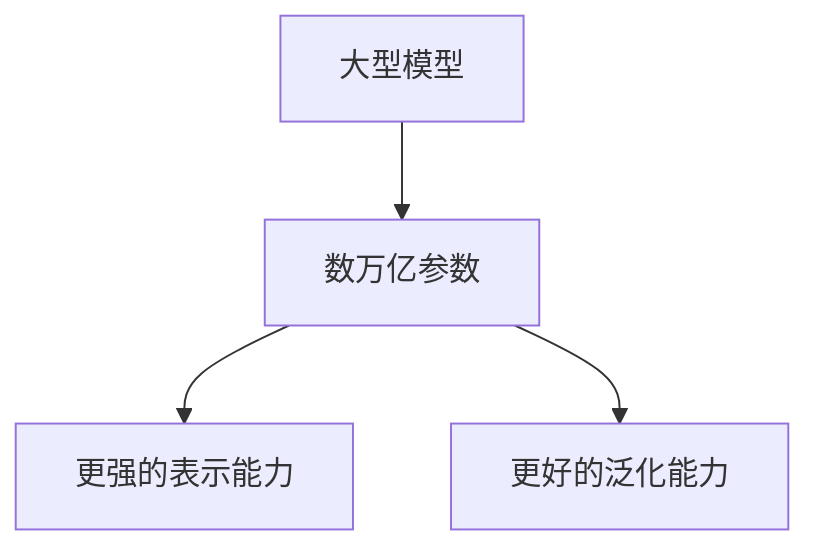

##### 8.1.2 多模态处理能力提升

AI大模型将不再局限于单一模态的数据处理，而是逐渐实现跨模态的数据融合和处理。例如，结合文本、图像、音频等多种数据类型的模型，将能够提供更全面、更精准的智能服务。这将极大地拓展AI大模型的应用场景，包括但不限于医疗诊断、教育个性化、智能客服等。

**Mermaid流程图**：
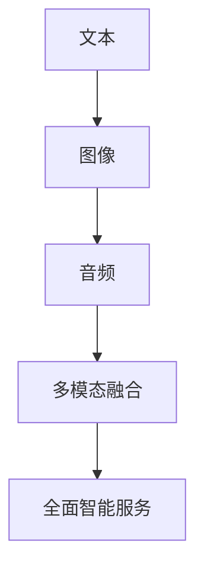

##### 8.1.3 自动化机器学习（AutoML）的发展

自动化机器学习（AutoML）将使非专业人士也能轻松构建和部署高性能的AI模型。AutoML工具将集成更多先进的算法和技术，如自动超参数调优、自动特征工程、自动化模型选择等，从而降低AI大模型开发的门槛，加速模型的研发和部署。

**Mermaid流程图**：
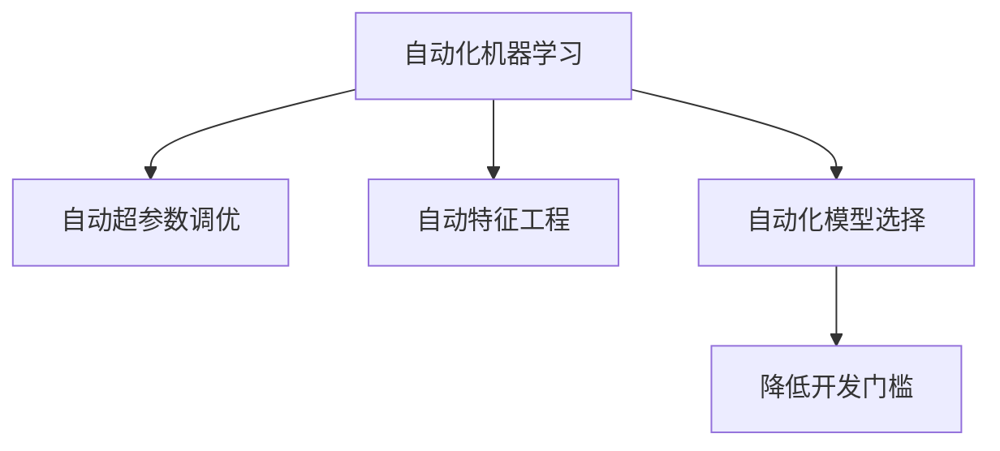

##### 8.1.4 边缘计算与AI大模型的结合

随着边缘计算技术的发展，AI大模型将在边缘设备上实现实时处理和决策。这种结合将大大降低对中央处理资源的需求，提高系统的响应速度和可靠性，尤其是在需要低延迟、高带宽的应用场景中，如自动驾驶、智能医疗等。

**Mermaid流程图**：
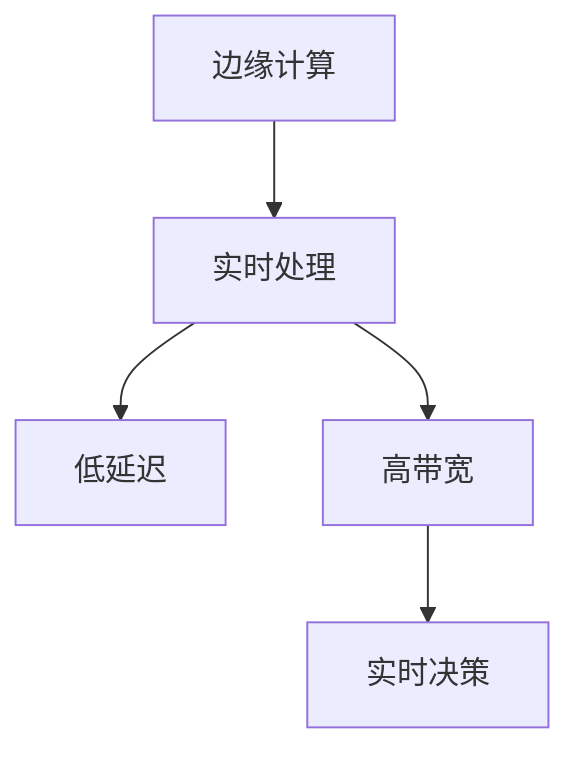

##### 8.1.5 集成深度学习与传统领域知识

未来，AI大模型将更加重视与传统领域知识的融合，如医学知识、法律知识等。通过将深度学习算法与专家知识相结合，模型将能够提供更加精准和可靠的决策支持。

**Mermaid流程图**：
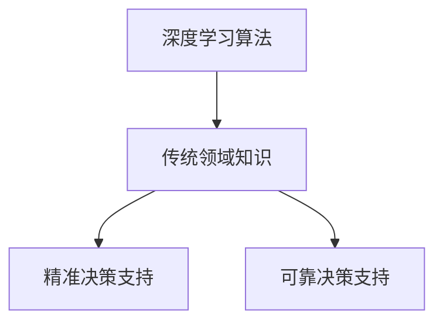

#### 8.2 创业公司如何跟上技术趋势

为了在AI大模型领域保持竞争力，创业公司可以采取以下策略：

##### 8.2.1 技术跟踪与预测

1. **定期技术调研**：定期关注最新的技术论文、行业报告和技术趋势，了解AI大模型领域的最新进展。
2. **参加行业会议**：参加AI领域的重要会议和研讨会，与行业专家和同行交流，获取最新的技术动态。
3. **建立技术社区**：积极参与AI技术社区，如GitHub、Reddit、Stack Overflow等，获取更多的技术资源和信息。

##### 8.2.2 技术储备与布局

1. **技术储备库**：建立AI大模型技术储备库，收集和整理最新的算法、工具和框架，为后续研发提供支持。
2. **研发团队建设**：组建专业的研发团队，包括AI算法工程师、数据科学家、产品经理等，专注于AI大模型技术的研发和应用。
3. **持续投资**：持续加大对AI大模型技术的投资，包括研发资金、人才引进和设备采购等，确保技术储备和创新能力。

##### 8.2.3 合作与开放创新

1. **产学研合作**：与高校、科研机构和行业合作伙伴建立合作关系，共同进行技术研究和应用推广。
2. **开源项目参与**：积极参与开源项目，贡献代码和技术，提升公司技术影响力。
3. **跨界合作**：与其他领域的公司进行跨界合作，探索AI大模型在传统领域的应用，推动技术进步和产业升级。

通过以上策略，创业公司可以紧跟AI大模型技术趋势，保持技术领先地位，实现持续创新和商业成功。

### 第七部分：技术趋势与前沿动态

#### 8.1 AI大模型技术发展趋势

AI大模型技术的发展趋势主要体现在以下几个方面：

##### 8.1.1 计算资源的集中化

随着AI大模型规模的不断扩大，训练和部署这些模型所需的计算资源也在迅速增加。因此，计算资源的集中化将成为一种趋势。云计算和边缘计算将发挥关键作用，提供大规模、高吞吐量的计算资源。创业公司可以通过与云服务提供商合作，利用其强大的计算能力，降低计算成本，提高模型训练和部署的效率。

**Mermaid流程图**：
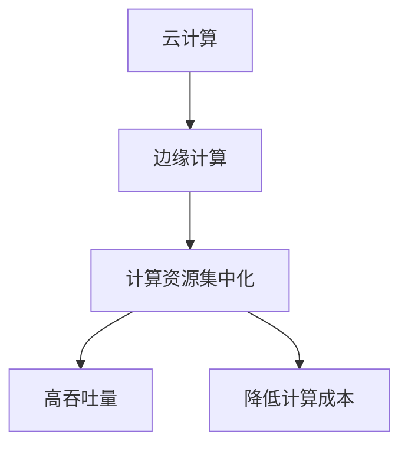

##### 8.1.2 数据隐私与安全的重要性

随着数据隐私法规的不断完善，数据隐私与安全在AI大模型开发中的应用变得至关重要。创业公司需要采用加密技术、差分隐私等手段保护用户数据，确保模型训练过程中的数据安全和用户隐私。此外，建立完善的数据治理体系，包括数据质量管理和合规性检查，也将是未来的重要趋势。

**Mermaid流程图**：
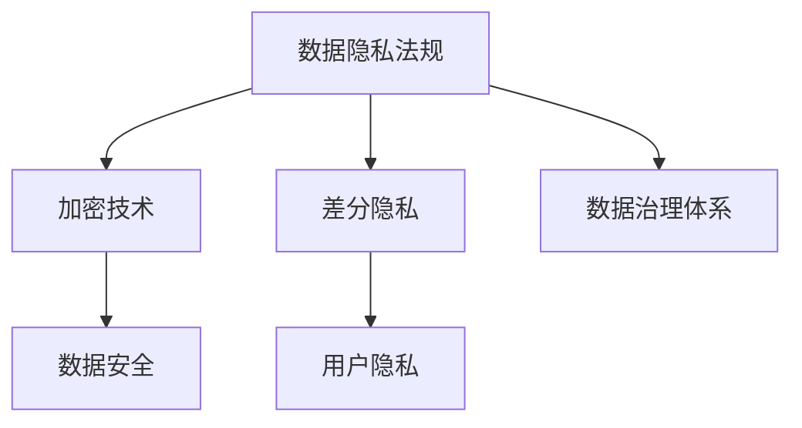

##### 8.1.3 模型可解释性与透明性

AI大模型的应用场景越来越多地涉及关键业务决策，如医疗诊断、金融风险评估等。因此，模型的可解释性与透明性变得尤为重要。创业公司需要开发可解释性工具和方法，使模型决策过程更加透明，增强用户对模型的信任。这包括开发可视化工具、解释模型决策逻辑等。

**Mermaid流程图**：
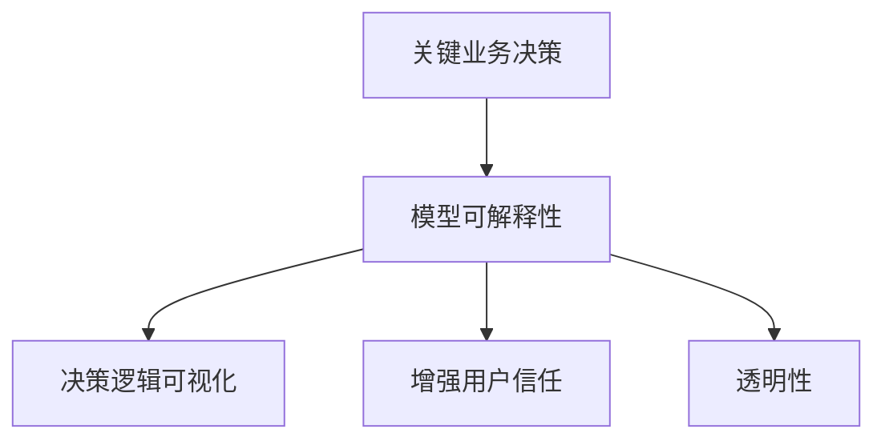

##### 8.1.4 人工智能与行业知识的融合

未来，AI大模型将更紧密地与各行业的专业知识相结合，以提供更精准的决策支持。创业公司可以通过与行业专家合作，将行业知识融入AI模型中，提高模型的性能和应用价值。例如，在医疗领域，AI模型可以与医学专家的知识相结合，实现更准确的疾病诊断。

**Mermaid流程图**：
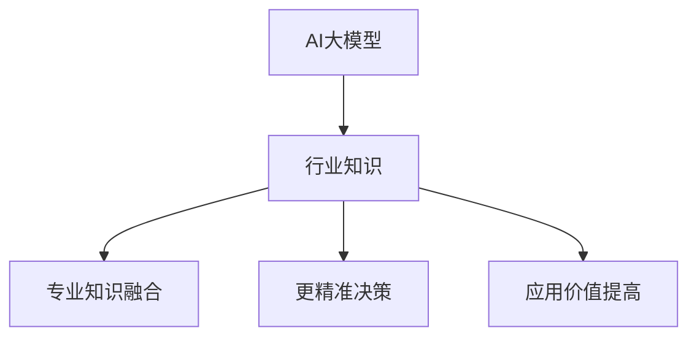

#### 8.2 创业公司如何跟上技术趋势

为了跟上AI大模型技术的发展趋势，创业公司可以采取以下策略：

##### 8.2.1 技术跟踪与预测

1. **定期技术调研**：定期关注最新的技术论文、行业报告和技术趋势，了解AI大模型领域的最新进展。
2. **参加行业会议**：参加AI领域的重要会议和研讨会，与行业专家和同行交流，获取最新的技术动态。
3. **建立技术社区**：积极参与AI技术社区，如GitHub、Reddit、Stack Overflow等，获取更多的技术资源和信息。

##### 8.2.2 技术储备与布局

1. **技术储备库**：建立AI大模型技术储备库，收集和整理最新的算法、工具和框架，为后续研发提供支持。
2. **研发团队建设**：组建专业的研发团队，包括AI算法工程师、数据科学家、产品经理等，专注于AI大模型技术的研发和应用。
3. **持续投资**：持续加大对AI大模型技术的投资，包括研发资金、人才引进和设备采购等，确保技术储备和创新能力。

##### 8.2.3 合作与开放创新

1. **产学研合作**：与高校、科研机构和行业合作伙伴建立合作关系，共同进行技术研究和应用推广。
2. **开源项目参与**：积极参与开源项目，贡献代码和技术，提升公司技术影响力。
3. **跨界合作**：与其他领域的公司进行跨界合作，探索AI大模型在传统领域的应用，推动技术进步和产业升级。

通过以上策略，创业公司可以紧跟AI大模型技术趋势，保持技术领先地位，实现持续创新和商业成功。

### 第七部分：技术趋势与前沿动态

#### 8.1 AI大模型技术发展趋势

随着技术的不断进步，AI大模型技术将呈现出以下几大发展趋势：

##### 8.1.1 大模型生态体系的完善

AI大模型的发展将不仅仅依赖于模型本身，还将依赖于一个完整的生态体系。这个生态体系包括数据集、工具、框架、开源项目等。创业公司需要关注并参与到这个生态体系中，通过贡献代码、共享数据集等方式，提升自身的技术实力和影响力。

**Mermaid流程图**：
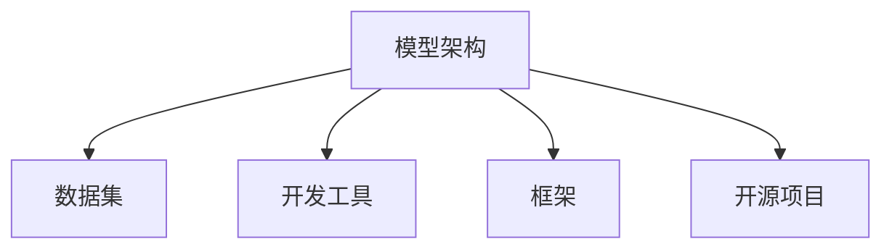

##### 8.1.2 模型压缩与推理加速

为了满足实时应用的需求，AI大模型将朝着模型压缩与推理加速的方向发展。创业公司可以通过模型剪枝、量化、知识蒸馏等技术，降低模型的复杂度，提高推理速度，同时保持模型的性能。

**Mermaid流程图**：
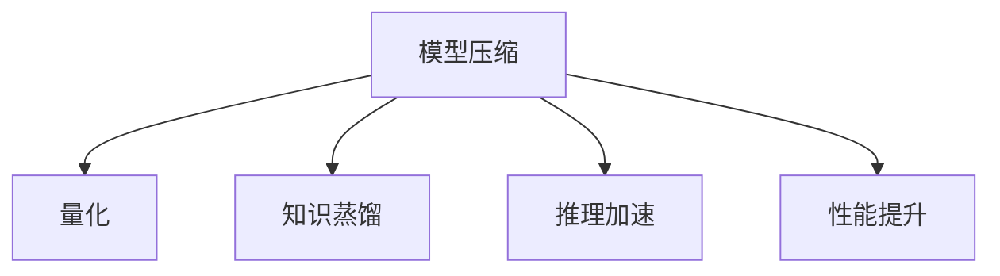

##### 8.1.3 跨领域模型的融合

未来，AI大模型将在不同领域之间实现更好的融合，跨领域的模型将能够更好地处理多模态数据，提供更全面的解决方案。创业公司需要关注不同领域的最新研究进展，探索跨领域的模型融合方法。

**Mermaid流程图**：
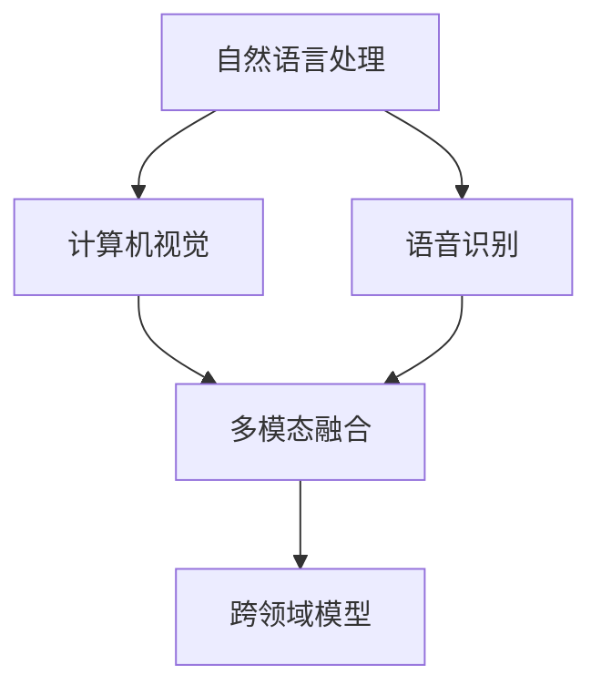

##### 8.1.4 可解释性与透明性

随着AI大模型在关键业务领域的应用，模型的可解释性与透明性变得越来越重要。创业公司需要开发可解释性工具，使模型的决策过程更加透明，增强用户对模型的信任。

**Mermaid流程图**：
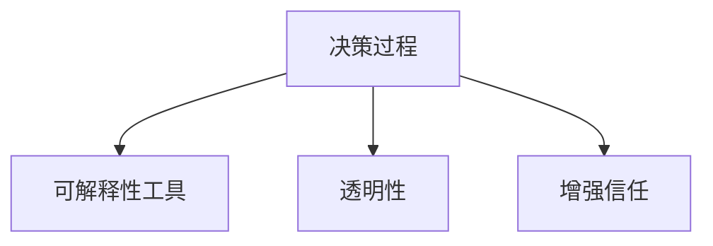

#### 8.2 创业公司如何跟上技术趋势

为了跟上AI大模型技术的发展趋势，创业公司可以采取以下策略：

##### 8.2.1 技术跟踪与预测

1. **定期技术调研**：定期关注最新的技术论文、行业报告和技术趋势，了解AI大模型领域的最新进展。
2. **参加行业会议**：参加AI领域的重要会议和研讨会，与行业专家和同行交流，获取最新的技术动态。
3. **建立技术社区**：积极参与AI技术社区，如GitHub、Reddit、Stack Overflow等，获取更多的技术资源和信息。

##### 8.2.2 技术储备与布局

1. **技术储备库**：建立AI大模型技术储备库，收集和整理最新的算法、工具和框架，为后续研发提供支持。
2. **研发团队建设**：组建专业的研发团队，包括AI算法工程师、数据科学家、产品经理等，专注于AI大模型技术的研发和应用。
3. **持续投资**：持续加大对AI大模型技术的投资，包括研发资金、人才引进和设备采购等，确保技术储备和创新能力。

##### 8.2.3 合作与开放创新

1. **产学研合作**：与高校、科研机构和行业合作伙伴建立合作关系，共同进行技术研究和应用推广。
2. **开源项目参与**：积极参与开源项目，贡献代码和技术，提升公司技术影响力。
3. **跨界合作**：与其他领域的公司进行跨界合作，探索AI大模型在传统领域的应用，推动技术进步和产业升级。

通过以上策略，创业公司可以紧跟AI大模型技术趋势，保持技术领先地位，实现持续创新和商业成功。

### 第八部分：可持续发展的战略规划

#### 9.1 企业社会责任与伦理

在当今全球化和数字化时代，企业社会责任（CSR）和伦理问题已成为企业可持续发展的重要组成部分。AI大模型创业公司应从以下几个方面着手：

1. **数据隐私保护**：AI大模型在处理大量数据时，必须严格遵守数据隐私法规，采取有效的数据加密和访问控制措施，保护用户隐私。

2. **公平与无偏见**：确保AI大模型算法的公平性和无偏见性，避免算法偏见导致的社会不公。通过算法测试和审查，识别并消除潜在的偏见。

3. **透明度与可解释性**：提升模型的可解释性，使模型决策过程透明，增强用户对模型的信任。通过开发可解释性工具和方法，使非技术用户也能理解模型的决策逻辑。

4. **可持续发展目标**：将联合国可持续发展目标（SDGs）纳入企业战略，通过技术创新和业务模式创新，为环境保护和社会福祉做出贡献。

#### 9.2 创业公司的长期发展规划

为了实现可持续发展，创业公司应制定清晰的长期发展规划，确保企业能够在未来竞争中保持领先地位。以下是创业公司在制定长期发展规划时需要考虑的几个关键方面：

1. **战略目标设定**：明确企业的长期愿景和战略目标，如成为行业领导者、提供卓越的产品和服务等。确保战略目标具有挑战性，同时具备可行性。

2. **技术创新路线图**：制定技术创新路线图，确定关键技术发展方向和里程碑。通过持续的技术创新，保持企业在技术上的领先地位。

3. **市场扩展策略**：根据市场需求和竞争态势，制定市场扩展策略。这包括进入新市场、拓展新客户群体、开发新的业务模式等。

4. **资源分配**：确保资源（包括资金、人才、技术等）的有效分配，支持企业的长期发展规划。建立灵活的资源配置机制，根据业务需求进行动态调整。

5. **风险管理**：识别和评估潜在风险，制定相应的风险应对策略。通过风险管理和应急预案，降低风险对企业运营的影响。

6. **持续学习与改进**：建立持续学习机制，鼓励员工不断学习和提升技能。通过定期评估和反馈，持续改进企业的管理和服务质量。

通过以上战略规划，创业公司可以确保在快速变化的市场环境中保持竞争力，实现可持续发展目标。

### 附录

#### A.1 常用AI大模型与工具简介

##### A.1.1 主流AI大模型概述

以下是一些主流的AI大模型及其特点：

1. **GPT-3**：由OpenAI开发的自然语言处理模型，具有1750亿个参数，能够进行文本生成、翻译、摘要等任务。

2. **BERT**：Google开发的预训练语言处理模型，具有数十亿个参数，广泛应用于文本分类、问答系统等任务。

3. **Transformer**：Google开发的用于机器翻译的模型，其核心思想是自注意力机制，已广泛应用于多种NLP任务。

4. **ViT**：谷歌开发的用于图像分类的Vision Transformer模型，通过自注意力机制对图像进行特征提取。

5. **T5**：由DeepMind开发的通用变换器模型，可以处理多种自然语言处理任务，具有数十亿个参数。

##### A.1.2 开发工具与平台推荐

以下是一些常用的AI开发工具和平台：

1. **TensorFlow**：由Google开发的开源机器学习框架，支持多种深度学习模型的开发。

2. **PyTorch**：由Facebook开发的开源深度学习框架，提供灵活的动态计算图，广泛应用于研究与应用。

3. **Keras**：基于Theano和TensorFlow的高级神经网络API，用于快速构建和训练深度学习模型。

4. **MXNet**：由Apache软件基金会开发的开源深度学习框架，支持多种编程语言，具有高效的计算性能。

5. **Hugging Face**：一个开源库，提供了大量的预训练模型和工具，方便开发者进行模型应用和迁移学习。

##### A.1.3 数据集与开源资源介绍

以下是一些常用的数据集和开源资源：

1. **COCO数据集**：用于目标检测和图像分割的常用数据集，包含大量标注的图像和目标。

2. **ImageNet**：用于图像分类的常用数据集，包含数百万张已分类的图像。

3. **Wikipedia**：包含大量文本数据的开源资源，常用于语言模型训练。

4. **OpenImages**：一个包含大量图像标注的数据集，用于多种视觉任务的模型训练。

5. **GitHub**：一个开源代码托管平台，提供了大量的AI项目、代码库和文档，方便开发者学习和交流。

#### A.2 AI大模型创业资源链接

##### A.2.1 行业报告与研究论文

以下是一些重要的行业报告和研究论文资源：

1. **Gartner**：提供全球信息技术行业的分析报告，包括AI领域的最新趋势和预测。

2. **IDC**：提供全球信息技术行业的市场调研报告，包括AI技术的应用和发展趋势。

3. **NeurIPS**：人工智能领域顶级会议，发布大量前沿研究论文。

4. **ICLR**：人工智能领域顶级会议，关注深度学习和机器学习的前沿研究。

5. **AI Index**：斯坦福大学发布的人工智能年度报告，提供关于AI技术、伦理和社会影响的详细分析。

##### A.2.2 创业相关政策与扶持措施

以下是一些国家和地区的创业相关政策与扶持措施：

1. **中国**：《新一代人工智能发展规划》，提出推动AI技术创新和产业应用。

2. **美国**：美国国家人工智能计划，支持AI研究、教育和产业发展。

3. **欧盟**：《人工智能伦理准则》，推动AI技术的伦理和合规发展。

4. **以色列**：《科技创新计划》，提供资金支持、税收优惠等政策，鼓励AI创新创业。

5. **新加坡**：《新加坡AI行动计划》，推动AI技术在各个行业的应用和发展。

##### A.2.3 国际与国内AI大模型创业案例集锦

以下是一些国际和国内的AI大模型创业成功案例：

1. **OpenAI**：成立于2015年，是一家致力于研发和研究人工智能的初创公司，其最著名的项目是GPT-3。

2. **DeepMind**：成立于2010年，是一家位于英国的人工智能公司，其最著名的项目是AlphaGo。

3. **科大讯飞**：成立于1999年，是一家专注于人工智能领域的中国公司，其业务涵盖了语音识别、图像识别、自然语言处理等多个领域。

4. **百度**：成立于2000年，是一家中国互联网公司，其AI技术广泛应用于搜索引擎、自动驾驶、智能家居等多个领域。

5. **阿里巴巴**：成立于1999年，是一家中国互联网公司，其AI技术广泛应用于电子商务、金融、医疗等多个领域。

这些案例为AI大模型创业公司提供了宝贵的经验和启示，有助于创业公司在激烈的市场竞争中脱颖而出。

