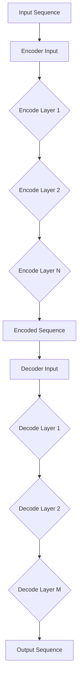

                 

### 《AI大模型在商品质量评估中的应用》

> **关键词**：AI大模型、商品质量评估、深度学习、自然语言处理、数据预处理、模型优化

> **摘要**：本文深入探讨了AI大模型在商品质量评估中的应用。首先介绍了AI大模型的基础知识，包括其概念、架构和核心技术。随后，文章详细分析了AI大模型在商品质量评估中的应用场景，包括需求分析、数据预处理、评估方法等。接着，通过实际案例研究和挑战与优化策略，进一步说明了AI大模型在商品质量评估中的实用性和改进方向。最后，文章展望了未来的发展趋势，讨论了政策与伦理考量，并提供了一些实际项目实施与开发环境搭建的指导。本文旨在为读者提供一份全面的技术博客，帮助理解和应用AI大模型于商品质量评估领域。

### 第一部分：AI大模型基础

#### 第1章: AI大模型概述

##### 1.1 AI大模型的概念与重要性

AI大模型（Large-scale Artificial Intelligence Models），通常指的是具有数十亿参数的深度学习模型。这些模型能够在大量的数据上进行训练，从而获得高度复杂的特征表示能力。与传统机器学习模型相比，AI大模型具有以下几个显著特点：

1. **参数规模大**：传统机器学习模型往往只有数千到数万个参数，而AI大模型则有数亿乃至数十亿个参数。
2. **数据需求高**：AI大模型的训练需要大量的数据，因为只有在大规模数据集上，模型才能学习到有效的特征表示。
3. **计算资源需求大**：AI大模型在训练和推理阶段都需要大量的计算资源，这要求在硬件和软件上都具备一定的性能。

AI大模型的重要性主要体现在以下几个方面：

1. **提升性能**：AI大模型能够通过在大规模数据上的训练，获得更优的性能和更高的准确率。
2. **扩展性**：AI大模型能够处理更复杂的问题，并且具有较好的扩展性，可以应用于各种领域。
3. **创新驱动力**：AI大模型的突破性进展为人工智能领域带来了新的研究点和应用方向。

##### 1.2 AI大模型的架构

AI大模型通常采用一种称为Transformer的架构，Transformer模型最初由Vaswani等人于2017年提出。Transformer模型的核心思想是将序列数据转换为序列向量的映射，并通过自注意力机制来捕捉序列中长距离的依赖关系。

**核心架构**：

1. **编码器（Encoder）**：编码器负责将输入序列编码为连续的向量表示。编码器通常由多个编码层组成，每一层都包含自注意力机制和前馈神经网络。
2. **解码器（Decoder）**：解码器负责将编码器输出的序列向量解码为输出序列。解码器同样由多个解码层组成，每一层也包含自注意力机制和前馈神经网络。
3. **自注意力机制（Self-Attention）**：自注意力机制允许模型在处理输入序列时，根据序列中不同位置的信息来动态调整每个位置的重要性。

**工作原理**：

1. **输入编码**：首先，将输入序列（例如文本、图像、声音等）编码为向量表示。
2. **编码器处理**：编码器逐层处理输入向量，通过自注意力机制和前馈神经网络，生成一系列编码向量。
3. **解码器处理**：解码器利用编码器生成的编码向量，通过自注意力机制和前馈神经网络，生成输出序列。
4. **输出生成**：最终，解码器的输出序列被解码为最终的输出（例如文本、标签等）。

以下是一个简单的Mermaid流程图，展示了一个典型的AI大模型（如BERT）的基本工作流程：



通过这个流程图，我们可以直观地看到AI大模型的核心组件及其相互作用。在接下来的章节中，我们将进一步探讨AI大模型的核心技术，包括深度学习基础、自然语言处理（NLP）和大规模预训练模型等内容。

### 第2章: AI大模型核心技术

#### 第2章: AI大模型核心技术

##### 2.1 深度学习基础

深度学习（Deep Learning）是人工智能（AI）的一个重要分支，其主要特点是使用多层神经网络（Neural Networks）来学习数据的高级特征和模式。本节将介绍深度学习的一些基本概念，包括神经网络的结构、神经元的工作原理以及常用的训练算法。

**神经网络基础**

1. **神经元（Neurons）**：神经网络由大量的神经元组成，每个神经元类似于生物神经元，都可以接收输入信号并进行处理。
2. **层（Layers）**：神经网络可以分为输入层、隐藏层和输出层。输入层接收外部输入，隐藏层对输入进行特征提取和变换，输出层生成最终的输出结果。
3. **权重（Weights）**：神经元之间通过权重（Weights）相连，这些权重决定了网络的学习能力。

**神经元的工作原理**

每个神经元都可以表示为以下公式：

\[ z = \sum_{i=1}^{n} w_i * x_i + b \]

其中，\( x_i \) 是第 \( i \) 个输入，\( w_i \) 是连接第 \( i \) 个输入的权重，\( b \) 是偏置（Bias），\( z \) 是神经元的输出。

神经元通过激活函数（Activation Function）将输入转换为输出。常用的激活函数包括：

1. **Sigmoid 函数**：\( \sigma(z) = \frac{1}{1 + e^{-z}} \)
2. **ReLU函数**：\( \text{ReLU}(z) = \max(0, z) \)
3. **Tanh函数**：\( \text{Tanh}(z) = \frac{e^z - e^{-z}}{e^z + e^{-z}} \)

**层和激活函数的相互作用**

输入层接收外部数据，通过权重传递给隐藏层。隐藏层通过激活函数将输入数据转换为新的特征表示，然后传递给下一层。这个过程在多个隐藏层之间重复，最终生成输出层的预测结果。

**训练算法**

深度学习模型通常使用以下几种算法进行训练：

1. **反向传播算法（Backpropagation）**：反向传播算法是一种用于训练神经网络的优化算法。它通过计算预测值与实际值之间的差异（损失函数），并利用梯度下降法（Gradient Descent）来更新权重和偏置。

反向传播算法的工作流程如下：

1. 前向传播（Forward Propagation）：将输入数据传递到网络中，计算输出值。
2. 计算损失（Compute Loss）：使用损失函数计算预测值与实际值之间的差异。
3. 反向传播（Backpropagation）：计算各层的梯度，更新权重和偏置。
4. 重复迭代：重复上述步骤，直到满足停止条件（例如，损失函数收敛）。

**伪代码**：

```python
# 前向传播
output = forward_propagation(input_data)

# 计算损失
loss = compute_loss(output, actual_output)

# 反向传播
gradients = backward_propagation(output, actual_output)

# 更新权重和偏置
update_weights_and_bias(gradients)

# 迭代
while not converged:
    output = forward_propagation(input_data)
    loss = compute_loss(output, actual_output)
    gradients = backward_propagation(output, actual_output)
    update_weights_and_bias(gradients)
```

反向传播算法的核心在于计算梯度。以下是一个简化的伪代码，展示了如何计算梯度：

```python
# 计算梯度
delta_output = output - actual_output
gradient = delta_output * activation_derivative(output)
```

在这个伪代码中，`activation_derivative` 函数用于计算激活函数的导数。通过计算梯度，反向传播算法能够更新权重和偏置，以最小化损失函数。

##### 2.2 自然语言处理（NLP）

自然语言处理（Natural Language Processing，NLP）是人工智能（AI）的一个分支，旨在使计算机理解和处理人类语言。在深度学习的框架下，NLP取得了显著进展。本节将介绍NLP的一些核心技术，包括词嵌入技术、序列模型与注意力机制。

**词嵌入技术**

词嵌入（Word Embedding）是将单词映射到固定大小的向量表示的过程。这些向量表示了单词的语义信息，从而可以用于机器学习模型。词嵌入技术在NLP中具有重要作用，因为它们能够将抽象的单词转换为具体的向量，使得机器学习算法能够更好地处理文本数据。

**词嵌入方法**：

1. **基于统计的方法**：如Word2Vec，通过计算单词在语料库中的共现关系来生成词嵌入。
2. **基于神经网络的的方法**：如GloVe，通过训练神经网络来学习词嵌入。

**词嵌入的用途**：

1. **语义相似性**：词嵌入可以用于计算单词之间的语义相似性。
2. **文本分类**：词嵌入可以作为特征输入到分类模型中。
3. **机器翻译**：词嵌入在机器翻译任务中扮演重要角色，使得机器能够理解和生成不同语言之间的语义关系。

**序列模型与注意力机制**

序列模型（Sequence Models）是用于处理序列数据（如文本、语音等）的深度学习模型。它们能够捕捉序列中的时间依赖关系，从而对序列数据进行建模。

**序列模型**：

1. **循环神经网络（RNN，Recurrent Neural Networks）**：RNN通过重复使用隐藏状态来处理序列数据。
2. **长短期记忆网络（LSTM，Long Short-Term Memory）**：LSTM是RNN的一个变体，能够更好地处理长距离依赖关系。
3. **门控循环单元（GRU，Gated Recurrent Unit）**：GRU是LSTM的简化版，具有类似的性能。

**注意力机制（Attention Mechanism）**：

注意力机制是一种用于捕捉序列中重要信息的机制。它允许模型在处理序列时，动态地关注不同位置的信息。注意力机制在机器翻译、文本摘要等任务中取得了显著效果。

**注意力机制的工作原理**：

1. **自注意力（Self-Attention）**：自注意力机制允许模型在同一序列内部不同位置之间建立联系。
2. **多头注意力（Multi-Head Attention）**：多头注意力机制通过将自注意力机制扩展到多个头，从而增加模型的表达能力。

**伪代码**：

```python
# 自注意力
query, key, value = input_sequence
attention_scores = softmax(QK^T)
context_vector = weighted_sum(value, attention_scores)
```

在这个伪代码中，`query`、`key` 和 `value` 分别表示序列中的不同部分，`softmax` 函数用于计算注意力分数，`weighted_sum` 函数用于计算加权求和。

通过词嵌入和注意力机制，NLP模型能够更好地理解和处理文本数据，从而在许多实际应用中取得成功。

##### 2.3 大规模预训练模型

大规模预训练模型（Large-scale Pre-trained Models）是当前NLP领域的一个重要研究方向。这些模型通过在大规模数据集上预训练，获得了强大的语言理解和生成能力。预训练与微调是大规模预训练模型的核心技术。

**预训练与微调**

1. **预训练（Pre-training）**：预训练是指在大量的无标签数据上训练模型，使其学习到通用的语言表示。预训练的目的是使模型在未见过的数据上也能表现出良好的性能。
2. **微调（Fine-tuning）**：微调是指在预训练的基础上，将模型应用到特定的任务上，并通过少量的有标签数据进行进一步训练。微调能够使模型更好地适应特定任务。

**预训练模型**

1. **BERT（Bidirectional Encoder Representations from Transformers）**：BERT是一个双向的Transformer模型，通过在大量的文本数据上预训练，获得了强大的语言理解能力。
2. **GPT（Generative Pre-trained Transformer）**：GPT是一个自回归的Transformer模型，通过在文本数据上预训练，获得了强大的语言生成能力。

**预训练的优势**

1. **提高性能**：预训练模型通过在大规模数据上训练，能够学习到丰富的语言特征，从而在特定任务上表现出更高的性能。
2. **通用性**：预训练模型能够泛化到各种语言任务上，无需从头开始训练，从而节省了训练时间和计算资源。
3. **可解释性**：预训练模型能够提供对文本的深入理解，从而有助于解释模型的决策过程。

**微调技术**

1. **任务特定数据**：微调需要一定的有标签数据，这些数据用于指定任务的具体特征。
2. **预训练模型的初始化**：微调通常从预训练模型开始，并将其权重作为初始权重。
3. **优化与评估**：通过在任务特定数据上训练和评估模型，调整模型参数，以最大化性能。

**伪代码**：

```python
# 预训练
pretrained_model = train_pretrained_model(corpus)

# 微调
fine_tuned_model = fine_tune(pretrained_model, task_data)

# 评估
evaluate(fine_tuned_model, validation_data)
```

在这个伪代码中，`train_pretrained_model` 函数用于训练预训练模型，`fine_tune` 函数用于微调模型，`evaluate` 函数用于评估模型性能。

通过大规模预训练模型和微调技术，AI大模型能够更好地应用于各种语言任务，从而推动NLP领域的发展。

### 第二部分：AI大模型在商品质量评估中的应用

#### 第3章: 商品质量评估中的AI大模型应用

##### 3.1 商品质量评估需求分析

商品质量评估在商业决策中扮演着至关重要的角色。通过准确评估商品的质量，企业可以做出更明智的采购、生产和营销决策，从而提高客户满意度、降低风险和提升竞争力。

**商品质量评估的重要性**

1. **采购决策**：通过评估供应商提供的商品质量，企业可以选择质量稳定、性价比高的供应商，降低采购风险。
2. **生产管理**：生产过程中，质量评估有助于监控和控制产品质量，确保生产出符合标准的产品。
3. **营销策略**：高质量的评估结果可以作为产品宣传的依据，增强消费者对产品的信任和购买意愿。

**AI大模型在质量评估中的应用场景**

AI大模型在商品质量评估中具有广泛的应用场景，主要包括以下几方面：

1. **预测性评估**：利用AI大模型分析历史数据，预测未来商品的质量趋势，帮助企业提前采取措施。
2. **自动化评估**：通过AI大模型，可以自动化地进行商品质量评估，提高评估效率和准确性。
3. **多维度评估**：AI大模型能够从多个维度对商品进行质量评估，如外观、性能、安全性等。
4. **实时监控**：AI大模型可以实时监控商品质量，及时发现和纠正问题，确保产品质量稳定。

##### 3.2 商品质量评估数据预处理

在利用AI大模型进行商品质量评估之前，数据预处理是一个关键步骤。有效的数据预处理能够提高模型的训练效果和评估准确性。

**数据收集与标注**

1. **数据收集**：收集与商品质量相关的数据，包括商品规格、生产日期、供应商信息等。
2. **数据标注**：对收集到的数据标签进行标注，例如，标注商品是否合格、性能指标是否符合标准等。

**数据清洗与预处理**

1. **数据清洗**：清洗数据中的噪声和异常值，确保数据质量。
2. **数据归一化**：对数据进行归一化处理，将不同尺度的数据转换为相同的尺度，以便模型处理。
3. **特征提取**：从原始数据中提取有用的特征，例如，使用词嵌入技术提取文本数据中的词向量。

**数据质量评估**

1. **缺失值处理**：处理数据中的缺失值，可以使用插值、平均值等方法进行填充。
2. **一致性检查**：检查数据的一致性，确保数据不会因不同来源而产生矛盾。
3. **数据分布评估**：评估数据的分布情况，确保数据没有严重的偏斜或异常分布。

通过有效的数据预处理，可以为AI大模型提供高质量的数据输入，从而提高商品质量评估的准确性。

##### 3.3 基于AI大模型的商品质量评估方法

基于AI大模型的商品质量评估方法主要包括模型选择、训练与评估等步骤。以下将详细讨论这些方法。

**模型选择**

选择适合商品质量评估的AI大模型是一个关键问题。以下是一些常用的模型类型：

1. **Transformer模型**：Transformer模型具有强大的特征提取能力，能够捕捉文本数据中的长距离依赖关系，适用于文本质量评估。
2. **BERT模型**：BERT模型是双向Transformer模型，具有丰富的语言理解能力，适用于多维度商品质量评估。
3. **LSTM模型**：LSTM模型是处理序列数据的传统模型，能够有效处理时间序列数据，适用于预测性评估。

**模型训练与评估**

1. **数据划分**：将数据集划分为训练集、验证集和测试集，用于模型的训练和评估。
2. **模型训练**：在训练集上训练所选模型，通过调整超参数和优化算法，使模型达到最佳性能。
3. **模型评估**：在验证集和测试集上评估模型性能，使用指标如准确率、召回率、F1分数等来衡量模型的评估效果。

**伪代码**：

```python
# 数据划分
train_data, validation_data, test_data = train_test_split(data, test_size=0.2)

# 模型训练
model = train_model(train_data)

# 模型评估
evaluate(model, validation_data)
evaluate(model, test_data)
```

通过上述方法，基于AI大模型的商品质量评估方法能够有效提高评估的准确性和效率。

#### 第4章: AI大模型在商品质量评估中的挑战与优化

##### 4.1 挑战与问题

尽管AI大模型在商品质量评估中具有显著优势，但其应用也面临一些挑战和问题。

**数据多样性不足**

数据多样性是影响AI大模型性能的一个重要因素。商品质量评估数据通常来源于不同的来源，如用户评价、产品测试报告等，这些数据可能存在显著差异。如果数据多样性不足，模型可能无法捕捉到各种质量问题的特征，导致评估结果不准确。

**过拟合问题**

过拟合是指模型在训练数据上表现良好，但在未见过的数据上表现不佳。这通常发生在模型过于复杂或训练数据不足时。为了防止过拟合，需要采用适当的正则化技术，如Dropout、L1/L2正则化等。

**模型解释性不足**

AI大模型，尤其是深度学习模型，通常被视为“黑盒子”，其内部决策过程难以解释。在商品质量评估中，解释性是一个重要问题，因为企业需要了解模型的决策依据，以便对评估结果进行验证和改进。

**计算资源需求高**

AI大模型在训练和推理阶段需要大量的计算资源，这通常意味着需要高性能的硬件和软件支持。对于中小企业来说，这可能是一个挑战。

##### 4.2 优化策略

为了克服上述挑战，可以采用以下优化策略：

**增强数据多样性**

1. **数据增强**：通过数据增强技术，如数据扩充、图像变换等，增加数据多样性。
2. **多源数据整合**：整合来自不同来源的数据，如用户评价、产品测试报告、供应链信息等，以丰富数据集。

**解决过拟合问题**

1. **正则化**：采用正则化技术，如Dropout、L1/L2正则化等，减少模型过拟合的风险。
2. **交叉验证**：使用交叉验证方法，确保模型在多个子集上的性能都良好，从而避免过拟合。

**提高模型解释性**

1. **模型解释工具**：使用模型解释工具，如LIME、SHAP等，分析模型的决策过程，提高模型的透明度。
2. **可视化**：通过可视化技术，如决策树、激活图等，展示模型的决策路径，帮助理解模型的决策依据。

**优化计算资源**

1. **分布式训练**：采用分布式训练方法，将模型训练任务分配到多个计算节点上，提高训练效率。
2. **硬件加速**：使用GPU、TPU等硬件加速器，提高模型训练和推理的速度。

通过这些优化策略，可以进一步提高AI大模型在商品质量评估中的应用效果，帮助企业更好地管理和提升产品质量。

### 第5章: 未来展望与趋势

##### 5.1 AI大模型在商品质量评估中的发展趋势

随着人工智能技术的不断进步，AI大模型在商品质量评估中的应用前景十分广阔。以下是未来可能的发展趋势：

**技术演进**

1. **模型架构的改进**：未来的AI大模型可能会采用更先进的架构，如Transformer的变体、多模态学习模型等，以更好地处理复杂的数据和任务。
2. **模型可解释性的提升**：研究者将继续探索提高模型可解释性的方法，使得模型的决策过程更加透明和可信。

**行业影响**

1. **提高生产效率**：AI大模型可以实时监控和评估商品质量，帮助企业快速发现问题并进行调整，从而提高生产效率。
2. **降低运营成本**：自动化质量评估可以减少人工干预，降低运营成本，同时提高评估的准确性和效率。

**应用领域扩展**

1. **更多行业的应用**：除了传统的制造业和服务业，AI大模型还可以应用于农业、食品工业、医疗设备等行业，提升产品质量和管理水平。

##### 5.2 政策与伦理考量

随着AI大模型在商品质量评估中的应用日益广泛，政策与伦理考量变得尤为重要。

**数据隐私保护**

1. **数据匿名化**：在收集和处理数据时，应采取数据匿名化技术，确保个人隐私不被泄露。
2. **数据监管**：政府和行业组织应制定相关法规，确保数据的安全和合规使用。

**伦理道德**

1. **模型公正性**：确保AI大模型在商品质量评估中不会出现性别、种族等偏见，影响评估结果的公平性。
2. **透明性**：模型的训练和评估过程应透明，使企业能够了解和验证模型的决策依据。
3. **责任归属**：明确AI大模型在商品质量评估中的责任归属，确保在出现问题时能够追溯责任。

通过政策与伦理的考量，可以确保AI大模型在商品质量评估中的应用既高效又安全，为行业的可持续发展奠定基础。

### 第三部分：AI大模型应用实战

#### 第6章: 实际项目实施与案例分析

##### 6.1 项目准备与规划

在实施一个基于AI大模型的商品质量评估项目时，项目准备和规划是至关重要的。以下是一个详细的项目准备和规划流程：

**项目需求分析**

首先，需要明确项目目标和需求。例如，项目目标是建立一套自动化的商品质量评估系统，能够实时监控商品的质量，并提供评估结果和改进建议。具体需求可能包括：

- 能够处理多种类型的商品，如电子产品、纺织品、食品等。
- 对商品的质量评估结果进行分类，如合格、不合格、需要改进等。
- 提供实时监控和预警功能，及时发现质量问题。

**技术选型与资源准备**

根据项目需求，选择合适的技术和资源：

- **深度学习框架**：选择TensorFlow或PyTorch作为深度学习框架，它们都是成熟且广泛使用的开源框架。
- **硬件资源**：考虑到AI大模型训练和推理的需求，需要配备高性能的GPU，如NVIDIA Tesla V100或RTX 3080Ti。
- **软件资源**：安装并配置深度学习框架和相关工具，如CUDA、cuDNN等。

**数据准备**

数据是AI大模型训练的核心，需要准备以下类型的数据：

- **商品数据**：包括商品规格、生产日期、供应商信息等。
- **质量评估数据**：包括用户评价、产品测试报告、质量检测数据等。

数据收集可以通过以下方式：

- **内部数据**：从企业内部数据库中获取相关数据。
- **外部数据**：通过公开的数据集或第三方数据提供商获取数据。

数据收集后，需要进行数据清洗和预处理，确保数据质量：

- **缺失值处理**：使用插补方法处理缺失值。
- **数据归一化**：将不同尺度的数据归一化，如将评分数据归一化到0-1之间。

**人员配备**

根据项目规模和需求，配备合适的人员：

- **项目经理**：负责项目的整体规划和协调。
- **数据科学家**：负责模型的设计、训练和优化。
- **开发工程师**：负责实现模型的接口和系统集成。
- **测试工程师**：负责模型的测试和验证。

##### 6.2 项目实施流程

**数据采集与预处理**

数据采集是项目实施的第一步，以下是一个简化的数据采集和预处理流程：

1. **数据收集**：使用API、爬虫工具或手动收集商品数据和质量评估数据。
2. **数据清洗**：处理数据中的噪声、异常值和重复数据。
3. **数据归一化**：对数据进行归一化处理，如将评分数据归一化到0-1之间。
4. **特征提取**：使用词嵌入技术提取文本数据中的词向量，对图像数据使用预训练的卷积神经网络（CNN）提取特征。

**模型训练与优化**

在数据预处理完成后，可以进行模型训练和优化。以下是一个简化的模型训练和优化流程：

1. **模型选择**：选择适合商品质量评估的AI大模型，如BERT或GPT。
2. **模型训练**：在训练集上训练模型，使用交叉熵损失函数和优化算法（如Adam）。
3. **模型评估**：在验证集上评估模型性能，调整超参数以优化模型。
4. **模型优化**：通过调整模型架构、增加训练数据或使用迁移学习等方法，进一步提高模型性能。

**模型部署与监控**

模型训练完成后，需要进行部署和监控，以下是一个简化的部署和监控流程：

1. **模型部署**：将训练好的模型部署到生产环境，使用容器化技术（如Docker）确保模型的可移植性和可靠性。
2. **接口开发**：开发API接口，使其他系统可以方便地调用模型进行质量评估。
3. **实时监控**：监控模型的运行状态，包括响应时间、准确率、资源消耗等，确保模型稳定运行。

##### 6.3 项目评估与改进

**模型评估**

模型评估是确保模型性能和可靠性的关键步骤。以下是一个简化的模型评估流程：

1. **测试集评估**：在测试集上评估模型的性能，使用指标如准确率、召回率、F1分数等。
2. **交叉验证**：使用交叉验证方法，确保模型在不同子集上的性能都良好。
3. **用户反馈**：收集用户反馈，了解模型在实际应用中的表现和问题。

**持续改进**

模型评估后，根据评估结果进行改进：

1. **模型调优**：根据评估结果，调整模型超参数或架构，提高模型性能。
2. **数据增强**：通过数据增强技术，增加训练数据多样性，提高模型泛化能力。
3. **反馈循环**：建立反馈机制，将用户反馈纳入模型优化过程，持续改进模型。

通过项目评估与改进，可以确保基于AI大模型的商品质量评估系统在实际应用中持续提供高质量的服务。

### 第7章: 开发环境与工具

##### 7.1 开发环境搭建

搭建一个高效的AI大模型开发环境是成功实施项目的基础。以下是一个简化的开发环境搭建流程：

**硬件与软件需求**

1. **硬件需求**： 
   - 高性能GPU（如NVIDIA Tesla V100或RTX 3080Ti）
   - 高速CPU（如Intel Xeon或AMD Ryzen系列）
   - 足够的内存（至少64GB）
   - 大容量硬盘（至少1TB SSD）

2. **软件需求**：
   - 操作系统：Linux（如Ubuntu 20.04）
   - 深度学习框架：TensorFlow或PyTorch
   - 编程语言：Python（建议使用Anaconda环境）
   - GPU驱动：相应版本的NVIDIA CUDA和cuDNN驱动

**环境配置**

1. **安装操作系统**：安装Linux操作系统，并更新系统软件包。

2. **安装Python**：使用Anaconda创建虚拟环境，并安装Python。

   ```bash
   conda create -n ai_env python=3.8
   conda activate ai_env
   ```

3. **安装深度学习框架**：安装TensorFlow或PyTorch。

   ```bash
   conda install tensorflow-gpu
   # 或者
   pip install torch torchvision torchaudio
   ```

4. **安装GPU驱动**：根据GPU型号下载并安装相应的NVIDIA CUDA和cuDNN驱动。

5. **验证环境**：运行以下命令验证开发环境是否配置正确。

   ```python
   import tensorflow as tf
   print(tf.__version__)
   # 或者
   import torch
   print(torch.__version__)
   ```

**常见问题与解决方案**

1. **问题**：安装TensorFlow或PyTorch时遇到错误。
   - **解决方案**：确保所有依赖库都已安装，并检查GPU驱动版本与深度学习框架兼容。

2. **问题**：模型训练过程中遇到内存不足。
   - **解决方案**：减少模型规模或使用数据增强技术，增加训练数据多样性。

通过上述步骤，可以搭建一个高效的AI大模型开发环境，为项目实施提供有力支持。

##### 7.2 常用工具与库

在AI大模型开发过程中，使用合适的工具和库可以显著提高开发效率和项目成功率。以下是一些常用的工具和库：

**深度学习框架**

1. **TensorFlow**：TensorFlow是Google开源的深度学习框架，具有丰富的功能和强大的生态。它支持多种模型架构和优化算法，适合进行大规模模型的开发。

2. **PyTorch**：PyTorch是Facebook开源的深度学习框架，以其灵活的动态计算图和易于使用的接口而受到开发者的喜爱。它支持GPU加速和分布式训练，适用于复杂模型的开发。

**数据处理库**

1. **Pandas**：Pandas是Python的数据分析库，用于数据处理和清洗。它提供了丰富的数据结构，如DataFrame，用于高效地处理表格数据。

2. **NumPy**：NumPy是Python的科学计算库，提供了多维数组对象和一系列高效的操作函数。它常用于数据预处理和数学计算。

**机器学习库**

1. **Scikit-learn**：Scikit-learn是Python的机器学习库，提供了各种常用的机器学习算法和工具，如线性回归、决策树、支持向量机等。

2. **Scipy**：Scipy是Python的科学计算库，提供了数学和科学计算的功能，如数值积分、插值、优化算法等。

**可视化工具**

1. **Matplotlib**：Matplotlib是Python的可视化库，用于生成各种类型的图表和图形。它具有高度可配置性，可以生成漂亮的可视化结果。

2. **Seaborn**：Seaborn是基于Matplotlib的统计可视化库，提供了多种统计图表的样式和默认设置，适用于数据可视化。

**模型解释工具**

1. **LIME（Local Interpretable Model-agnostic Explanations）**：LIME是一种模型解释工具，用于解释复杂模型的决策过程。它通过局部线性模型来近似原始模型，从而提供可解释性。

2. **SHAP（SHapley Additive exPlanations）**：SHAP是一种基于博弈论的模型解释工具，用于解释模型的预测结果。它通过计算特征对预测值的贡献，提供详细的可解释性。

通过这些工具和库，开发者可以高效地构建和优化AI大模型，从而在商品质量评估等领域实现创新应用。

### 附录A: AI大模型开发资源

##### A.1 开发工具与框架

**TensorFlow**

TensorFlow是Google开源的深度学习框架，广泛应用于各种AI项目中。TensorFlow提供了丰富的API，包括低层次的`tf.keras`和高层级的`tf.Model`。以下是一个简单的TensorFlow代码示例：

```python
import tensorflow as tf

# 定义一个简单的线性模型
model = tf.keras.Sequential([
    tf.keras.layers.Dense(units=1, input_shape=[1])
])

# 编译模型
model.compile(optimizer='sgd', loss='mean_squared_error')

# 训练模型
model.fit(x_train, y_train, epochs=1000)

# 使用模型进行预测
predictions = model.predict(x_test)
```

**PyTorch**

PyTorch是Facebook开源的深度学习框架，以其动态计算图和灵活性而著称。以下是一个简单的PyTorch代码示例：

```python
import torch
import torch.nn as nn
import torch.optim as optim

# 定义一个简单的线性模型
model = nn.Linear(1, 1)

# 定义优化器和损失函数
optimizer = optim.SGD(model.parameters(), lr=0.01)
criterion = nn.MSELoss()

# 训练模型
for epoch in range(1000):
    optimizer.zero_grad()
    outputs = model(x_train)
    loss = criterion(outputs, y_train)
    loss.backward()
    optimizer.step()

# 使用模型进行预测
with torch.no_grad():
    predictions = model(x_test)
```

##### A.2 学习资源与参考书

**在线课程与讲座**

1. **深度学习专项课程**：吴恩达的《深度学习专项课程》（Deep Learning Specialization）在Coursera上提供了全面的深度学习教程，适合初学者和进阶者。

2. **PyTorch教程**：PyTorch官方提供的《PyTorch教程》（PyTorch Tutorials）涵盖了从基础知识到高级应用的全面内容，是学习PyTorch的绝佳资源。

**书籍与文献**

1. **《深度学习》（Deep Learning）**：Ian Goodfellow、Yoshua Bengio和Aaron Courville合著的《深度学习》是深度学习的经典教材，详细介绍了深度学习的理论、算法和应用。

2. **《动手学深度学习》（Dive into Deep Learning）**：Ariel Rogerio、Amar Shah和Justin Johnson合著的《动手学深度学习》提供了大量的代码示例和实践指导，适合初学者深入理解深度学习。

3. **《自然语言处理综论》（Speech and Language Processing）**：Daniel Jurafsky和James H. Martin合著的《自然语言处理综论》是自然语言处理领域的权威教材，详细介绍了NLP的基础知识和技术。

通过这些资源和书籍，开发者可以系统学习AI大模型的相关知识，并在实践中不断提升自己的技能。

