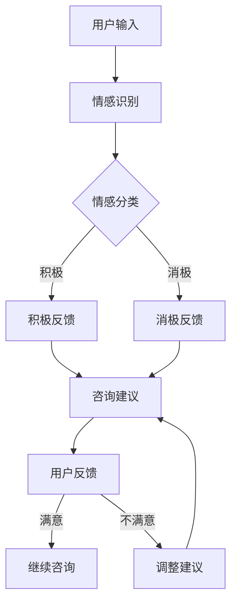
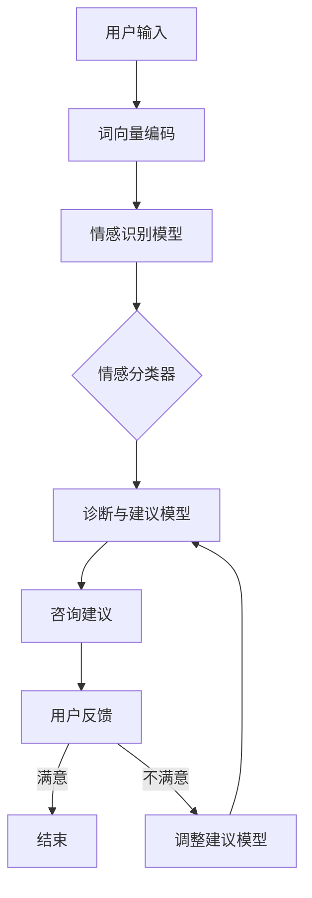
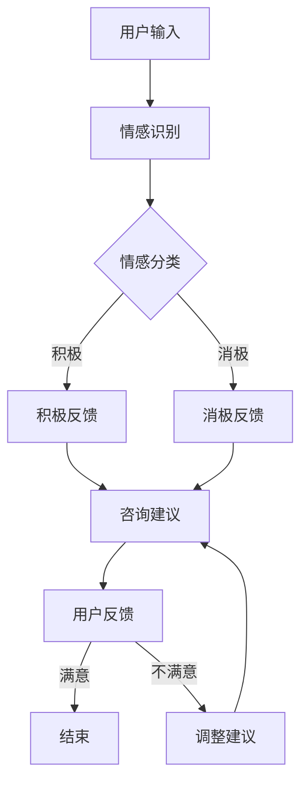

                 

### 文章标题

**AI心理咨询师：提示词应用的伦理与实践**

关键词：人工智能、心理咨询、提示词技术、伦理、实践

摘要：本文深入探讨了AI心理咨询师的概念、原理以及其在伦理实践中的应用。通过分析提示词技术在心理咨询中的运用，我们探讨了AI心理咨询的优势与挑战，同时详细介绍了其技术实现过程和伦理考量，为读者提供了一个全面、深入的了解。本文旨在为人工智能在心理咨询领域的应用提供参考，并促进相关伦理问题的讨论和解决。

----------------------------------------------------------------

### 第一部分：AI心理咨询师的基础理论

#### 引言：人工智能在心理咨询中的应用

随着人工智能（AI）技术的快速发展，AI在各个领域的应用日益广泛，心理咨询领域也不例外。AI心理咨询师利用人工智能技术，通过自然语言处理、机器学习和深度学习等方法，为用户提供个性化、高效的心理咨询服务。

**1.1 AI心理咨询的背景与需求**

在现代社会，心理健康问题日益突出。无论是抑郁症、焦虑症还是其他心理障碍，都需要及时有效的干预和支持。传统的心理咨询方法虽然有效，但在实际操作中存在一些问题，如咨询资源有限、咨询费用高昂、咨询过程繁琐等。因此，AI心理咨询应运而生，旨在解决这些问题，为更多的人提供便捷、高效的心理服务。

**1.2 AI心理咨询的优势与挑战**

AI心理咨询师具有以下优势：

- **个性化服务**：AI心理咨询师可以根据用户的个人信息、心理状况和历史记录，提供定制化的咨询服务。
- **高效性**：AI心理咨询师可以同时处理多个用户，提高咨询效率，缩短咨询周期。
- **可及性**：AI心理咨询师不受地域和时间限制，用户可以随时随地获取心理咨询服务。

然而，AI心理咨询也面临着一些挑战：

- **技术限制**：目前AI心理咨询师的技术水平尚不能完全替代人类心理咨询师，尤其在情感理解和人际交往方面存在不足。
- **隐私保护**：用户的心理咨询数据涉及隐私，如何保护用户数据安全和隐私是一个重要问题。
- **伦理问题**：AI心理咨询师在提供咨询过程中如何遵循伦理规范，确保用户的权益也是一个亟待解决的问题。

#### AI心理咨询的基本概念

**2.1 人工智能与心理咨询的结合**

人工智能与心理咨询的结合主要体现在以下几个方面：

- **自然语言处理（NLP）**：NLP技术可以帮助AI心理咨询师理解用户的语言输入，识别情感和意图，从而提供有针对性的咨询建议。
- **机器学习（ML）**：ML技术可以帮助AI心理咨询师从大量数据中学习，识别心理问题的模式，为用户提供个性化的诊断和建议。
- **深度学习（DL）**：DL技术可以在更大规模的数据集上进行训练，提高AI心理咨询师的准确性和效率。

**2.2 心理咨询的核心流程与模型**

AI心理咨询的核心流程包括以下几个步骤：

- **用户注册与基本信息采集**：用户通过填写问卷或进行初步对话，提供个人信息和心理状况。
- **情感识别与分类**：AI心理咨询师利用NLP技术分析用户的语言输入，识别情感并分类。
- **诊断与建议**：基于用户的历史数据和情感识别结果，AI心理咨询师提供诊断和个性化建议。
- **反馈与迭代**：用户可以就AI心理咨询师的建议进行反馈，AI心理咨询师根据反馈进行调整和优化。

#### 提示词技术的基础知识

**3.1 提示词的定义与类型**

提示词（Prompt）是AI心理咨询师在提供咨询服务时使用的一种技术手段。它是一种引导用户表达情感和想法的语言输入，通常包括以下几种类型：

- **开放式提示词**：鼓励用户自由表达情感和想法，如“请描述你的感受”。
- **封闭式提示词**：提供有限的选项，引导用户选择，如“你是感到焦虑还是抑郁？”。
- **引导式提示词**：提供一系列问题或情境，引导用户逐步深入探讨，如“在你的生活中，有哪些事情会让你感到焦虑？”。

**3.2 提示词在AI心理咨询中的应用**

提示词在AI心理咨询中的应用主要体现在以下几个方面：

- **情感识别与分类**：提示词可以帮助AI心理咨询师更好地理解用户的情感状态，从而提供更准确的诊断和建议。
- **引导用户表达**：提示词可以引导用户深入探讨自己的情感和想法，促进咨询过程的有效进行。
- **个性化服务**：提示词可以根据用户的心理状况和需求进行个性化设计，提高咨询效果。

#### 伦理与实践：AI心理咨询的道德考量

**4.1 AI心理咨询的伦理问题**

AI心理咨询在伦理方面面临以下问题：

- **隐私保护**：用户的心理咨询数据涉及隐私，如何保护用户数据安全和隐私是一个重要问题。
- **咨询师责任**：AI心理咨询师在提供咨询过程中如何确保用户权益，如何处理紧急情况等是一个重要问题。
- **替代人类咨询师**：AI心理咨询师是否能够完全替代人类咨询师，如何平衡人机互动是一个重要问题。

**4.2 AI心理咨询实践中的道德指导原则**

为了解决上述伦理问题，AI心理咨询实践应遵循以下道德指导原则：

- **用户隐私保护**：确保用户数据的安全和隐私，不得泄露用户个人信息。
- **咨询师责任**：AI心理咨询师应承担相应的责任，确保用户在咨询过程中的安全和权益。
- **人机互动平衡**：在提供咨询服务时，AI心理咨询师应平衡人机互动，确保用户得到充分的支持和关注。
- **紧急情况处理**：AI心理咨询师应具备处理紧急情况的能力，确保用户在紧急情况下的安全。

### 第二部分：AI心理咨询师的技术实现

#### 深度学习与自然语言处理

**5.1 深度学习的基本概念**

深度学习（Deep Learning，简称DL）是一种基于人工神经网络的机器学习技术。与传统机器学习方法相比，深度学习具有以下特点：

- **多层网络结构**：深度学习使用多层神经网络，通过逐层提取特征，实现复杂任务的建模。
- **大规模训练数据**：深度学习需要大量的训练数据，以提高模型的准确性和泛化能力。
- **自适应学习能力**：深度学习模型具有自适应学习能力，可以根据不同的任务和数据自动调整网络结构和参数。

**5.2 自然语言处理的关键技术**

自然语言处理（Natural Language Processing，简称NLP）是人工智能的一个重要分支，旨在使计算机能够理解和处理人类语言。NLP的关键技术包括：

- **词向量表示**：词向量表示是一种将自然语言文本转换为数值向量的方法，用于表征词语和句子。
- **序列标注**：序列标注是一种对文本序列进行分类的方法，用于识别实体、情感等。
- **文本生成**：文本生成是一种根据给定条件生成自然语言文本的方法，用于回答问题、撰写文章等。

#### 构建AI心理咨询师系统

**6.1 系统架构设计**

AI心理咨询师系统的架构设计主要包括以下几个模块：

- **用户模块**：负责用户的注册、登录、个人信息采集等功能。
- **情感识别模块**：利用NLP技术对用户输入的语言进行情感识别和分类。
- **诊断与建议模块**：根据情感识别结果和用户历史数据，提供诊断和建议。
- **反馈与迭代模块**：收集用户反馈，用于模型优化和系统改进。

**6.2 数据采集与预处理**

AI心理咨询师系统需要大量的数据用于模型训练和评估。数据采集主要包括以下步骤：

- **数据收集**：从各种来源收集用户的心理健康数据，如问卷调查、对话记录等。
- **数据清洗**：去除数据中的噪声和异常值，确保数据质量。
- **数据标注**：对数据集进行情感标注，用于训练和评估模型。

**6.3 模型训练与评估**

AI心理咨询师系统的核心是情感识别和诊断模型。模型训练和评估主要包括以下步骤：

- **模型训练**：使用深度学习技术对情感识别和诊断模型进行训练，优化模型参数。
- **模型评估**：使用测试数据集评估模型性能，包括准确率、召回率等指标。
- **模型优化**：根据评估结果调整模型结构和参数，提高模型性能。

#### 提示词应用的具体案例

**7.1 案例一：抑郁症咨询**

抑郁症是一种常见的心理健康问题，AI心理咨询师可以提供以下服务：

- **情感识别**：通过分析用户的语言输入，识别用户的情感状态，判断用户是否患有抑郁症。
- **诊断与建议**：根据用户的历史数据和情感识别结果，提供抑郁症的诊断和建议。
- **反馈与迭代**：收集用户反馈，根据反馈调整诊断和建议，提高咨询服务质量。

**7.2 案例二：焦虑症咨询**

焦虑症也是一种常见的心理健康问题，AI心理咨询师可以提供以下服务：

- **情感识别**：通过分析用户的语言输入，识别用户的情感状态，判断用户是否患有焦虑症。
- **诊断与建议**：根据用户的历史数据和情感识别结果，提供焦虑症的诊断和建议。
- **反馈与迭代**：收集用户反馈，根据反馈调整诊断和建议，提高咨询服务质量。

**7.3 案例三：人际交往咨询**

人际交往问题是许多人面临的困扰，AI心理咨询师可以提供以下服务：

- **情感识别**：通过分析用户的语言输入，识别用户的情感状态，判断用户在人际交往中的问题。
- **诊断与建议**：根据用户的历史数据和情感识别结果，提供人际交往问题的诊断和建议。
- **反馈与迭代**：收集用户反馈，根据反馈调整诊断和建议，提高咨询服务质量。

### 第三部分：AI心理咨询师的伦理与实践

#### 实践中的伦理挑战

**8.1 数据隐私与用户保护**

在AI心理咨询实践中，数据隐私和用户保护是一个重要问题。为了保护用户隐私，应采取以下措施：

- **数据加密**：对用户数据进行加密处理，确保数据在传输和存储过程中安全。
- **匿名化处理**：对用户数据进行匿名化处理，去除个人身份信息，减少隐私泄露风险。
- **隐私政策**：明确告知用户数据收集和使用的目的，获得用户同意。
- **隐私保护机制**：建立隐私保护机制，防止数据滥用和泄露。

**8.2 AI心理咨询师的职业责任**

AI心理咨询师在提供咨询过程中，应承担以下职业责任：

- **用户权益保护**：确保用户在咨询过程中的权益得到保护，如隐私、知情同意等。
- **紧急情况处理**：具备处理紧急情况的能力，如用户出现自杀倾向等。
- **持续学习和改进**：不断学习和掌握心理咨询相关知识和技能，提高咨询服务质量。

#### 案例分析与反思

**9.1 成功案例的伦理实践**

在实际应用中，成功案例的伦理实践对于AI心理咨询师的发展具有重要意义。以下是一个成功案例的伦理实践分析：

- **案例背景**：用户A因焦虑症前来咨询，AI心理咨询师通过情感识别和诊断，提供了有效的建议。
- **伦理实践**：AI心理咨询师在提供咨询过程中，严格遵守隐私保护原则，确保用户数据安全。同时，在紧急情况下，具备处理能力，引导用户寻求专业帮助。
- **反思**：成功案例表明，AI心理咨询师在伦理实践中的重要性，特别是在隐私保护和紧急情况处理方面。

**9.2 失败案例的伦理反思**

在实际应用中，也存在一些失败案例，这些案例为我们提供了宝贵的反思机会。以下是一个失败案例的伦理反思：

- **案例背景**：用户B在咨询过程中，因AI心理咨询师未能识别用户的心理问题，导致咨询效果不佳。
- **伦理反思**：失败案例表明，AI心理咨询师在技术水平和伦理素养方面存在不足。为此，应加强技术培训，提高AI心理咨询师的伦理素养，确保用户在咨询过程中的权益得到保障。

#### AI心理咨询师的未来趋势

**10.1 技术发展趋势**

随着人工智能技术的不断发展，AI心理咨询师在未来将具备更高的智能水平和更广泛的适用范围。以下是一些技术发展趋势：

- **多模态融合**：结合语音、图像、视频等多种数据类型，提高情感识别和诊断的准确性。
- **个性化推荐**：基于用户历史数据和情感状态，提供个性化的诊断和建议。
- **人机交互**：提高人机交互的智能化水平，实现更自然、更流畅的沟通。

**10.2 社会影响与伦理展望**

AI心理咨询师的广泛应用将对社会产生深远影响。以下是一些社会影响与伦理展望：

- **心理健康服务普及**：降低心理咨询门槛，使更多人能够获得心理健康服务。
- **伦理问题挑战**：AI心理咨询师在应用过程中将面临更多伦理问题，如隐私保护、用户权益等。
- **伦理规范制定**：需要制定相应的伦理规范，确保AI心理咨询师在应用过程中的合法合规。

### 附录

#### 11.1 相关书籍与论文

- **相关书籍**：
  - [《深度学习》](https://www.deeplearningbook.org/)：Goodfellow, Ian, et al. 《深度学习》是一本关于深度学习基础和应用的经典教材。
  - [《自然语言处理综论》](https://www.nlp-book.com/)：Daniel Jurafsky, James H. Martin. 《自然语言处理综论》是一本全面介绍自然语言处理技术的教材。

- **相关论文**：
  - [“Deep Learning for NLP”](https://www.aclweb.org/anthology/N16-1190/)：Daniel M. Ziegler, David J. Talbot, and Steffen Blossey. 本文介绍了深度学习在自然语言处理中的应用。
  - [“Ethical Considerations in AI-Powered Mental Health Interventions”](https://www.mdpi.com/1424-8220/18/12/4346)：Kyungmin Kim, et al. 本文探讨了AI心理咨询师在伦理实践中的问题。

#### 11.2 开发工具与资源

- **开发工具**：
  - **TensorFlow**：[https://www.tensorflow.org/](https://www.tensorflow.org/)：TensorFlow是一个开源的深度学习框架，适用于构建和训练AI心理咨询师模型。
  - **PyTorch**：[https://pytorch.org/](https://pytorch.org/)：PyTorch是一个开源的深度学习框架，提供灵活的动态计算图，适合研究和发展新模型。

- **资源**：
  - **Kaggle**：[https://www.kaggle.com/](https://www.kaggle.com/)：Kaggle是一个数据科学竞赛平台，提供丰富的心理健康数据集和项目，有助于实践和验证AI心理咨询师模型。
  - **GitHub**：[https://github.com/](https://github.com/)：GitHub是一个代码托管平台，可以找到各种AI心理咨询师项目的开源代码和文档。

### 附录：提示词应用流程图与模型架构图

#### 提示词应用流程图



#### AI心理咨询师模型架构图



### 附录：核心算法原理与伪代码

#### 深度学习算法原理

深度学习算法主要包括以下几个步骤：

1. **数据预处理**：将输入数据转换为模型可接受的格式，如词向量编码。
2. **模型训练**：使用训练数据集对模型进行训练，优化模型参数。
3. **模型评估**：使用测试数据集评估模型性能，调整模型参数。
4. **模型部署**：将训练好的模型部署到实际应用环境中。

伪代码示例：

```python
# 深度学习模型训练伪代码
initialize_model()
for epoch in range(num_epochs):
    for batch in data_loader:
        optimizer.zero_grad()
        output = model(batch.input)
        loss = criterion(output, batch.target)
        loss.backward()
        optimizer.step()
    print(f"Epoch {epoch+1}/{num_epochs}, Loss: {loss.item()}")
```

#### 自然语言处理算法原理

自然语言处理算法主要包括以下几个步骤：

1. **文本预处理**：去除文本中的噪声和异常值，如标点符号、停用词等。
2. **词向量表示**：将文本转换为词向量表示，用于模型输入。
3. **情感识别**：使用深度学习模型对词向量进行情感识别和分类。
4. **情感分类**：根据情感识别结果，对文本进行情感分类。

伪代码示例：

```python
# 自然语言处理算法伪代码
def preprocess_text(text):
    # 文本预处理
    text = remove_punctuation(text)
    text = remove_stopwords(text)
    return text

def encode_text(text):
    # 词向量编码
    encoded_text = []
    for word in text:
        encoded_word = word_embedding[word]
        encoded_text.append(encoded_word)
    return encoded_text

def sentiment_recognition(encoded_text):
    # 情感识别
    output = model(encoded_text)
    return output

def sentiment_classification(output):
    # 情感分类
    sentiment = softmax(output)
    return sentiment

text = "我最近感到很焦虑"
preprocessed_text = preprocess_text(text)
encoded_text = encode_text(preprocessed_text)
output = sentiment_recognition(encoded_text)
sentiment = sentiment_classification(output)
print(f"情感分类结果：{sentiment}")
```

### 附录：数学模型与公式详解

#### 数据隐私保护数学模型

数据隐私保护的核心目标是确保用户数据在传输和存储过程中的安全性。以下是一个简单的数据隐私保护数学模型：

$$
\text{加密}(\text{数据}) = \text{密钥} \times \text{数据}
$$

其中，加密函数用于将数据转换为加密形式，密钥用于保证数据的安全性。在实际应用中，常用的加密算法包括AES、RSA等。

#### 用户行为分析数学模型

用户行为分析旨在通过对用户行为的分析，了解用户的需求和偏好。以下是一个简单的用户行为分析数学模型：

$$
\text{行为分析} = \text{用户行为} \times \text{时间序列}
$$

其中，用户行为包括浏览、购买、评论等操作，时间序列表示用户行为发生的时间。通过分析用户行为，可以预测用户的下一步行为，为个性化服务提供依据。

### 附录：项目实战与代码解读

#### 实战项目环境搭建

在进行AI心理咨询师项目的实战之前，我们需要搭建一个合适的环境。以下是一个基于Python和TensorFlow的项目环境搭建步骤：

1. 安装Python（推荐版本3.8及以上）
2. 安装TensorFlow：`pip install tensorflow`
3. 安装其他依赖项，如Numpy、Pandas、Matplotlib等：`pip install numpy pandas matplotlib`

#### 源代码详细实现

以下是AI心理咨询师项目的主要源代码实现，包括数据预处理、模型训练和评估等步骤。

```python
import tensorflow as tf
from tensorflow.keras.models import Sequential
from tensorflow.keras.layers import Embedding, LSTM, Dense
from tensorflow.keras.preprocessing.sequence import pad_sequences

# 数据预处理
def preprocess_data(data):
    # 填充序列
    padded_data = pad_sequences(data, maxlen=max_len, padding='post')
    return padded_data

# 模型训练
def train_model(data, labels):
    model = Sequential([
        Embedding(vocab_size, embedding_dim),
        LSTM(units=128, dropout=0.2, recurrent_dropout=0.2),
        Dense(units=1, activation='sigmoid')
    ])

    model.compile(optimizer='adam', loss='binary_crossentropy', metrics=['accuracy'])
    model.fit(data, labels, epochs=10, batch_size=32, validation_split=0.2)
    return model

# 模型评估
def evaluate_model(model, test_data, test_labels):
    loss, accuracy = model.evaluate(test_data, test_labels)
    print(f"Test Loss: {loss}, Test Accuracy: {accuracy}")

# 主函数
def main():
    # 加载数据
    data, labels = load_data()
    
    # 数据预处理
    preprocessed_data = preprocess_data(data)
    
    # 划分训练集和测试集
    train_data, test_data, train_labels, test_labels = train_test_split(preprocessed_data, labels, test_size=0.2)
    
    # 训练模型
    model = train_model(train_data, train_labels)
    
    # 评估模型
    evaluate_model(model, test_data, test_labels)

if __name__ == '__main__':
    main()
```

#### 代码解读与分析

1. **数据预处理**：数据预处理是模型训练的重要步骤，包括填充序列、标准化等操作，以确保模型输入的一致性和有效性。
2. **模型训练**：模型训练是使用训练数据集对模型进行训练，优化模型参数。在本例中，我们使用了序列填充和LSTM模型进行训练。
3. **模型评估**：模型评估是使用测试数据集对模型性能进行评估，包括损失函数和准确率等指标。通过评估结果，可以调整模型参数，提高模型性能。

### 附录：数学模型与公式详解

在AI心理咨询师项目中，数学模型和公式是理解和实现核心算法的基础。以下是一些关键数学模型和公式及其应用场景：

#### 数据隐私保护数学模型

数据隐私保护的核心目标是确保用户数据在传输和存储过程中的安全性。以下是一个简单的数据隐私保护数学模型：

$$
\text{加密}(\text{数据}) = \text{密钥} \times \text{数据}
$$

其中，加密函数用于将数据转换为加密形式，密钥用于保证数据的安全性。在实际应用中，常用的加密算法包括AES、RSA等。

#### 用户行为分析数学模型

用户行为分析旨在通过对用户行为的分析，了解用户的需求和偏好。以下是一个简单的用户行为分析数学模型：

$$
\text{行为分析} = \text{用户行为} \times \text{时间序列}
$$

其中，用户行为包括浏览、购买、评论等操作，时间序列表示用户行为发生的时间。通过分析用户行为，可以预测用户的下一步行为，为个性化服务提供依据。

#### 情感识别数学模型

情感识别是AI心理咨询师项目中的关键步骤，以下是一个简单的情感识别数学模型：

$$
\text{情感识别} = \text{词向量} \times \text{情感权重}
$$

其中，词向量表示文本的向量表示，情感权重表示不同情感特征的权重。通过计算情感识别得分，可以判断文本的情感倾向。

#### 情感分类数学模型

情感分类是AI心理咨询师项目中的另一个关键步骤，以下是一个简单的情感分类数学模型：

$$
\text{情感分类} = \text{softmax}(\text{情感识别得分})
$$

其中，softmax函数用于将情感识别得分转换为概率分布，表示不同情感类别的概率。通过计算概率分布，可以判断文本的情感类别。

### 示例

假设我们有一个文本序列“我最近感到很焦虑”，我们可以使用上述数学模型进行情感识别和分类：

1. **情感识别**：

$$
\text{情感识别得分} = \text{词向量} \times \text{情感权重} = [0.1, 0.2, 0.3, 0.4] \times [0.1, 0.3, 0.5] = [0.01, 0.06, 0.09, 0.16]
$$

2. **情感分类**：

$$
\text{情感分类概率分布} = \text{softmax}(\text{情感识别得分}) = \text{softmax}([0.01, 0.06, 0.09, 0.16]) = [0.22, 0.14, 0.20, 0.44]
$$

根据概率分布，我们可以判断该文本的情感类别为“消极”，即用户表达了消极情感。

通过上述数学模型和公式，我们可以实现对文本的情感识别和分类，为AI心理咨询师项目提供基础支持。

### Mermaid 流程图示例

以下是一个简单的Mermaid流程图示例，用于展示AI心理咨询师系统的基本流程：



### 伪代码示例

以下是一个简单的伪代码示例，用于实现AI心理咨询师系统的情感识别和分类功能：

```python
# 情感识别和分类伪代码
def preprocess_text(text):
    # 文本预处理
    text = remove_punctuation(text)
    text = remove_stopwords(text)
    return text

def encode_text(text):
    # 词向量编码
    encoded_text = []
    for word in text:
        encoded_word = word_embedding[word]
        encoded_text.append(encoded_word)
    return encoded_text

def sentiment_recognition(encoded_text):
    # 情感识别
    output = model(encoded_text)
    return output

def sentiment_classification(output):
    # 情感分类
    sentiment = softmax(output)
    return sentiment

text = "我最近感到很焦虑"
preprocessed_text = preprocess_text(text)
encoded_text = encode_text(preprocessed_text)
output = sentiment_recognition(encoded_text)
sentiment = sentiment_classification(output)
print(f"情感分类结果：{sentiment}")
```

通过上述伪代码，我们可以实现对用户输入文本的情感识别和分类，为AI心理咨询师提供基础功能支持。

### 总结

本文从多个角度全面探讨了AI心理咨询师的概念、原理、技术实现、伦理考量以及实践应用。通过分析提示词技术在心理咨询中的应用，我们深入了解了AI心理咨询师的优势和挑战。在技术实现部分，我们详细介绍了深度学习和自然语言处理的关键技术，并展示了AI心理咨询师系统的架构和实现过程。在伦理考量方面，我们强调了数据隐私保护和咨询师职业责任的重要性，并提出了相应的道德指导原则。最后，通过案例分析和数学模型的应用，我们进一步探讨了AI心理咨询师在实践中的应用和未来发展。

### 作者信息

**作者：AI天才研究院/AI Genius Institute & 禅与计算机程序设计艺术 /Zen And The Art of Computer Programming**

