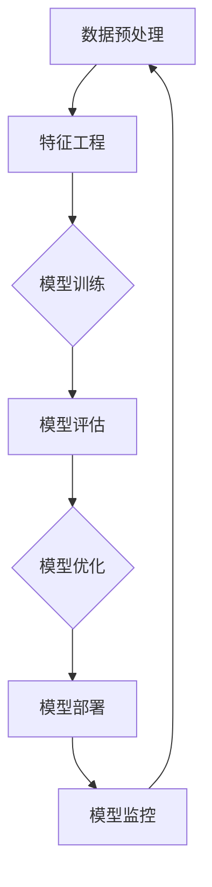

                 

# 《AI技术在实际应用中的挑战》

> 关键词：人工智能、应用挑战、核心技术、算法原理、案例分析、未来展望

> 摘要：
人工智能技术（AI）的迅猛发展带来了前所未有的机遇，但同时也伴随着诸多挑战。本文将从AI技术概述与背景出发，分析AI在金融、医疗、制造和零售等领域的应用，深入探讨AI技术的核心算法原理，并针对数据安全与隐私保护、算法可解释性、泛化能力与可靠性等挑战提出解决方案。同时，通过实际应用案例，展示AI技术的开发与应用步骤，展望AI技术的发展趋势与未来。

## 目录大纲

### 《AI技术在实际应用中的挑战》目录大纲

#### 第一部分: AI技术概述与背景

1. **AI技术概览与历史演进**
    - AI技术基本概念
    - AI技术发展阶段
    - AI技术在我国的应用现状
2. **AI技术的发展趋势与未来展望**
    - AI技术的热点方向
    - AI技术在各个领域的应用前景
    - AI技术面临的挑战与机遇

#### 第二部分: AI技术在各个领域的应用

3. **AI技术在金融领域的应用**
    - 金融风控
    - 量化交易
    - 信贷审批
    - 金融诈骗检测
4. **AI技术在医疗领域的应用**
    - 疾病诊断
    - 智能导医
    - 医疗影像分析
    - 药物研发
5. **AI技术在制造业的应用**
    - 智能工厂
    - 产品质量检测
    - 售后服务
    - 生产调度优化
6. **AI技术在零售业的应用**
    - 智能推荐系统
    - 零售门店布局优化
    - 智能客服
    - 零售供应链管理

#### 第三部分: AI技术的核心算法原理

7. **机器学习算法基础**
    - 监督学习
    - 无监督学习
    - 强化学习
8. **深度学习算法原理**
    - 卷积神经网络（CNN）
    - 递归神经网络（RNN）
    - 生成对抗网络（GAN）
    - 自编码器（Autoencoder）
9. **自然语言处理（NLP）算法**
    - 词向量
    - 语音识别
    - 机器翻译
    - 文本分类

#### 第四部分: AI技术的挑战与解决方案

10. **数据安全与隐私保护**
    - 数据加密
    - 隐私计算
    - 数据匿名化
11. **AI算法的可解释性与透明性**
    - 模型可解释性方法
    - 算法透明性标准
    - 伦理与法律规范
12. **AI算法的泛化能力与可靠性**
    - 模型评估指标
    - 模型调参技巧
    - 实时反馈与模型优化

#### 第五部分: AI技术应用案例与实践

13. **案例研究：某银行的风控模型建设**
    - 项目背景
    - 模型设计
    - 实施效果
14. **案例研究：某医院智能诊断系统**
    - 项目背景
    - 系统架构
    - 诊断效果
15. **实践指南：AI技术在企业的应用步骤**
    - 需求分析
    - 数据准备
    - 模型开发
    - 模型部署
    - 持续优化

#### 第六部分: AI技术的发展与未来

16. **AI技术的未来发展展望**
    - 新算法的研究
    - 新硬件的推动
    - 跨学科融合
17. **AI技术在伦理与社会责任**
    - AI伦理问题
    - AI责任归属
    - 社会责任

#### 附录

18. **常用AI工具与资源介绍**
    - 开源框架
    - 数据集来源
    - 训练环境搭建

## 第一部分: AI技术概述与背景

### AI技术概览与历史演进

人工智能（AI）是指使计算机系统能够模拟人类智能行为和思维过程的科学技术。AI技术的发展经历了多个阶段，从最初的符号主义（Symbolic AI）到基于规则的专家系统，再到基于统计的学习方法，最终演变成了以深度学习为代表的现代人工智能。

1. **符号主义（Symbolic AI）**

符号主义AI是基于逻辑推理和知识表示的方法，通过符号和规则来模拟人类的思维过程。这一阶段最具代表性的工作是约翰·麦卡锡（John McCarthy）等人在20世纪50年代提出的“人工智能”概念，以及后来的专家系统（Expert Systems）。

2. **基于规则的专家系统（Rule-Based Expert Systems）**

专家系统是一种基于符号主义的方法，通过定义一组规则来模拟人类专家的决策过程。专家系统的核心思想是将人类专家的知识和经验转化为计算机程序，以便在特定领域内进行决策。

3. **基于统计的学习方法（Statistical Learning Methods）**

20世纪80年代，人工智能研究转向基于统计的学习方法，这一转变在1990年代随着大量数据集的出现和计算能力的提升而得到加强。基于统计的学习方法主要包括监督学习、无监督学习和强化学习。

4. **深度学习（Deep Learning）**

深度学习是一种基于神经网络的学习方法，通过多层非线性变换来模拟人类的感知和学习过程。深度学习在图像识别、自然语言处理和语音识别等领域取得了显著的成果，成为现代人工智能的核心技术。

### AI技术发展阶段

1. **第一阶段（1956-1969年）**

人工智能概念提出，符号主义方法主导，专家系统成为研究热点。

2. **第二阶段（1970-1980年）**

人工智能遭遇“寒冬”，基于规则的专家系统逐渐成为主流。

3. **第三阶段（1980-2012年）**

统计学习方法的兴起，神经网络和机器学习方法逐渐成为主流。

4. **第四阶段（2012年至今）**

深度学习成为主流，人工智能技术取得重大突破，应用领域不断扩大。

### AI技术在我国的应用现状

我国在人工智能领域的研究和应用取得了显著进展。根据《中国人工智能发展报告2020》，我国人工智能市场规模已达到1500亿元，其中智能语音、计算机视觉和自然语言处理等技术取得了重要突破。在应用领域，AI技术已广泛应用于金融、医疗、制造、零售等各个行业。

### AI技术的发展趋势与未来展望

1. **新算法的研究**

随着人工智能技术的不断发展，新的算法和技术不断涌现，如生成对抗网络（GAN）、图神经网络（Graph Neural Networks）等。这些新算法将在人工智能应用中发挥重要作用。

2. **新硬件的推动**

随着芯片技术的进步，如GPU、TPU等新型计算硬件的推出，将为人工智能计算提供强大的支持。同时，量子计算、光子计算等新计算模式的探索，也将为人工智能的发展带来新的机遇。

3. **跨学科融合**

人工智能技术与其他领域的融合，如生物医学、教育学、心理学等，将推动人工智能应用向更广泛的领域拓展。

4. **挑战与机遇**

尽管人工智能技术取得了巨大进展，但仍然面临着诸多挑战，如数据安全与隐私保护、算法可解释性、泛化能力与可靠性等。解决这些挑战，将有助于人工智能技术的进一步发展和应用。

### 第一部分总结

AI技术在我国的应用现状和发展趋势表明，人工智能正成为推动社会进步和经济发展的关键力量。然而，人工智能技术的挑战也不容忽视。在后续章节中，我们将深入探讨AI技术在各个领域的应用，以及如何应对这些挑战。

## 第二部分：AI技术在各个领域的应用

### 3. AI技术在金融领域的应用

金融行业作为AI技术的重点应用领域之一，已经在多个方面取得了显著成果。以下将详细介绍AI技术在金融领域的具体应用。

#### 金融风控

金融风险控制是金融行业的关键环节。AI技术通过大数据分析、机器学习算法和深度学习模型，实现了对金融风险的精准预测和实时监控。具体应用包括：

- **信用评分**：利用机器学习算法，对借款人的信用记录、财务状况、行为特征等数据进行综合分析，预测其信用风险。
- **反欺诈检测**：通过模式识别和异常检测算法，识别和防范金融交易中的欺诈行为。
- **市场风险监控**：利用深度学习模型，对金融市场进行实时分析，预测市场走势，为投资者提供参考。

#### 量化交易

量化交易是指通过算法和模型进行股票、期货、外汇等金融产品的交易。AI技术在量化交易中的应用主要包括：

- **交易策略优化**：通过机器学习算法，对历史交易数据进行挖掘和分析，发现有效的交易策略。
- **市场预测**：利用深度学习模型，对市场走势进行预测，为交易决策提供依据。
- **风险管理**：通过大数据分析和风险模型，实现交易策略的风险管理。

#### 信贷审批

AI技术在信贷审批中的应用，大大提高了审批效率和准确性。具体包括：

- **自动化审批**：利用机器学习算法，对借款人的申请资料进行自动化审批，减少人工审核的工作量。
- **信用评估**：通过分析借款人的历史信用记录、行为数据等，对借款人的信用状况进行评估。
- **风险预警**：通过异常检测算法，实时监控借款人的行为，发现潜在风险。

#### 金融诈骗检测

金融诈骗是金融行业面临的重大挑战。AI技术在金融诈骗检测中的应用主要包括：

- **行为分析**：通过分析用户的行为模式，识别异常行为，防范诈骗风险。
- **语音识别**：利用语音识别技术，分析通话内容，识别潜在的诈骗行为。
- **图像识别**：通过图像识别技术，分析交易过程中的图像信息，识别虚假交易。

### 4. AI技术在医疗领域的应用

医疗行业作为AI技术的另一个重要应用领域，已经在疾病诊断、智能导医、医疗影像分析和药物研发等方面取得了显著成果。

#### 疾病诊断

AI技术在疾病诊断中的应用，提高了诊断的准确性和效率。具体包括：

- **影像诊断**：通过深度学习算法，对医学影像进行分析，辅助医生进行疾病诊断。
- **基因分析**：利用机器学习算法，对基因数据进行挖掘和分析，预测疾病风险。
- **症状分析**：通过自然语言处理技术，分析患者的症状描述，提供可能的疾病诊断建议。

#### 智能导医

智能导医系统利用AI技术，帮助患者快速找到所需的科室和医生。具体包括：

- **推荐系统**：通过机器学习算法，分析患者的病情和需求，推荐最适合的科室和医生。
- **知识库**：构建医学知识库，为智能导医系统提供丰富的医学信息。
- **语音助手**：利用语音识别和自然语言处理技术，为患者提供咨询服务。

#### 医疗影像分析

AI技术在医疗影像分析中的应用，提高了诊断效率和准确性。具体包括：

- **影像分割**：通过深度学习算法，对医学影像进行分割，提取病变区域。
- **病变检测**：通过图像识别技术，检测医学影像中的病变区域。
- **辅助诊断**：结合医生的专业知识和AI技术分析结果，为医生提供诊断依据。

#### 药物研发

AI技术在药物研发中的应用，加速了新药的研发进程。具体包括：

- **药物筛选**：通过机器学习算法，分析大量化合物数据，筛选出具有潜在药效的化合物。
- **分子模拟**：利用计算机模拟技术，研究药物分子与生物大分子之间的相互作用。
- **药理分析**：通过深度学习算法，分析药物作用机制，为新药研发提供指导。

### 5. AI技术在制造业的应用

制造业是AI技术的另一个重要应用领域。以下将详细介绍AI技术在制造业的具体应用。

#### 智能工厂

智能工厂是指通过AI技术实现工厂自动化和智能化的生产模式。具体包括：

- **生产计划优化**：通过机器学习算法，分析生产数据，优化生产计划，提高生产效率。
- **设备监控与维护**：利用物联网技术和机器学习算法，实时监控设备状态，预测设备故障，提前进行维护。
- **质量控制**：通过图像识别技术，对产品质量进行实时检测，确保产品质量。

#### 产品质量检测

AI技术在产品质量检测中的应用，提高了检测的准确性和效率。具体包括：

- **缺陷检测**：利用图像识别技术，对生产过程中的产品进行缺陷检测。
- **寿命预测**：通过机器学习算法，分析设备运行数据，预测设备寿命，及时进行维护。
- **质量评估**：利用深度学习模型，对产品进行全面的质量评估，确保产品质量。

#### 售后服务

AI技术在售后服务中的应用，提高了售后服务质量和客户满意度。具体包括：

- **智能客服**：通过自然语言处理技术，提供智能客服服务，解答客户问题。
- **故障诊断**：通过机器学习算法，分析设备故障数据，快速诊断故障原因，提供维修建议。
- **远程监控**：利用物联网技术，对设备进行远程监控，提前发现潜在问题。

#### 生产调度优化

AI技术在生产调度优化中的应用，提高了生产效率。具体包括：

- **资源优化**：通过机器学习算法，优化生产资源分配，提高资源利用率。
- **流程优化**：通过流程分析，优化生产流程，减少生产周期。
- **能耗优化**：通过数据分析，优化能耗管理，降低生产成本。

### 6. AI技术在零售业的应用

零售行业是AI技术的另一个重要应用领域。以下将详细介绍AI技术在零售业的具体应用。

#### 智能推荐系统

智能推荐系统利用AI技术，根据用户的历史行为和喜好，为其推荐感兴趣的商品。具体包括：

- **内容推荐**：通过深度学习算法，分析用户的历史浏览记录和购买行为，推荐符合用户兴趣的商品。
- **协同过滤**：利用协同过滤算法，根据用户与商品之间的关系，推荐相似商品。
- **关联规则挖掘**：通过关联规则挖掘算法，发现商品之间的关联关系，推荐搭配商品。

#### 零售门店布局优化

AI技术在零售门店布局优化中的应用，提高了门店的销售效率和客户体验。具体包括：

- **货架布局**：通过机器学习算法，分析商品的销售数据和客户流量数据，优化货架布局，提高商品陈列效果。
- **门店选址**：通过大数据分析，分析客户分布、竞争对手等因素，为门店选址提供参考。
- **客户流量预测**：通过时间序列分析，预测门店的客户流量，优化员工排班和商品供应。

#### 智能客服

智能客服利用AI技术，为用户提供自动化的客户服务。具体包括：

- **自动应答**：通过自然语言处理技术，自动回答用户的问题，提高客服效率。
- **语音识别**：通过语音识别技术，将用户的语音转化为文本，实现智能客服。
- **情感分析**：通过情感分析技术，分析用户的情绪，提供个性化的服务。

#### 零售供应链管理

AI技术在零售供应链管理中的应用，提高了供应链的效率和灵活性。具体包括：

- **库存管理**：通过机器学习算法，分析销售数据，优化库存管理，减少库存成本。
- **需求预测**：通过时间序列分析和市场趋势分析，预测商品需求，优化采购计划。
- **物流优化**：通过路径规划算法，优化物流配送路线，提高配送效率。

### 第二部分总结

AI技术在金融、医疗、制造和零售等领域的广泛应用，不仅提高了各行业的生产效率和客户满意度，也为行业的创新和发展带来了新的机遇。在后续章节中，我们将进一步探讨AI技术的核心算法原理，以及如何应对AI技术在应用过程中面临的挑战。

## 第三部分：AI技术的核心算法原理

### 7. 机器学习算法基础

机器学习算法是AI技术的核心组成部分，主要包括监督学习、无监督学习和强化学习。以下将详细介绍这三种算法的基本概念和应用。

#### 监督学习

监督学习是指通过已知输入和输出数据，训练模型并预测未知输出。监督学习分为回归和分类两种类型。

- **回归**：回归任务的目标是预测连续值输出。例如，预测房价、股票价格等。
  
  **数学模型：**

  $$
  h(x) = \beta_0 + \beta_1x
  $$

  **优化目标：**

  $$
  \min_{\beta_0, \beta_1} \sum_{i=1}^{n} (y_i - (\beta_0 + \beta_1x_i))^2
  $$

- **分类**：分类任务的目标是预测离散值输出。例如，判断邮件是否为垃圾邮件、诊断疾病等。

  **数学模型：**

  $$
  P(y| x) = \frac{e^{\theta^T x}}{1 + e^{\theta^T x}}
  $$

  **优化目标：**

  $$
  \min_{\theta} \sum_{i=1}^{n} -y_i \theta^T x_i - \log(1 + e^{\theta^T x_i})
  $$

#### 无监督学习

无监督学习是指在没有明确输出标签的情况下，从数据中自动发现数据分布和结构。无监督学习包括聚类、降维、异常检测等。

- **聚类**：聚类任务的目标是将数据分成多个簇，每个簇内的数据相似度较高，簇间的数据相似度较低。

  **K-均值聚类算法：**

  **伪代码：**

  ```
  Initialize centroids
  while not converged:
      Assign data points to the nearest centroid
      Update centroids
  ```

- **降维**：降维任务的目标是将高维数据映射到低维空间，减少数据维度，同时保留数据的主要特征。

  **主成分分析（PCA）算法：**

  **数学模型：**

  $$
  Z = \sigma X - \mu
  $$

  $$
  \Sigma = \frac{1}{n-1}XX^T
  $$

  $$
  \lambda, e = \text{Eigendecomposition}(\Sigma)
  $$

  $$
  X_{reduced} = e\lambda
  $$

- **异常检测**：异常检测任务的目标是识别数据中的异常值或异常模式。

  **孤立森林（Isolation Forest）算法：**

  **伪代码：**

  ```
  for each sample:
      Randomly split features and select a split point
      Increment depth of split if sample is not isolated
  Calculate the depth of each sample
  Identify outliers based on the depth threshold
  ```

#### 强化学习

强化学习是指通过与环境交互，从经验中学习策略，以达到最大化累积奖励的目标。强化学习包括策略学习和价值学习两种方法。

- **策略学习**：策略学习直接学习最佳行动策略。

  **Q-学习算法：**

  **伪代码：**

  ```
  Initialize Q(s, a) to zero
  for each episode:
      Initialize state s
      while not done:
          Take action a based on current policy
          Observe reward r and next state s'
          Update Q(s, a) = Q(s, a) + α[r + γmax(Q(s', a')) - Q(s, a)]
          s = s'
  ```

- **价值学习**：价值学习通过预测未来的回报来学习最佳策略。

  **深度Q网络（DQN）算法：**

  **伪代码：**

  ```
  Initialize Q network
  for each episode:
      Initialize state s
      while not done:
          Take action a based on epsilon-greedy policy
          Observe reward r and next state s'
          Update Q(s, a) = Q(s, a) + α[r + γmax(Q(s', a')) - Q(s, a)]
          s = s'
  ```

### 8. 深度学习算法原理

深度学习算法是基于多层神经网络的学习方法，通过多层非线性变换来模拟人类的感知和学习过程。以下将详细介绍几种常见的深度学习算法。

#### 卷积神经网络（CNN）

卷积神经网络是一种用于图像识别和处理的深度学习算法，其核心是卷积层和池化层。

- **卷积层**：卷积层通过卷积操作提取图像特征。

  **卷积操作：**

  $$
  \text{out}_{ij} = \sum_{k=1}^{K} w_{ik,j} * x_{ij}
  $$

  其中，$w_{ik,j}$ 是卷积核，$x_{ij}$ 是输入图像，$\text{out}_{ij}$ 是输出特征。

- **池化层**：池化层通过下采样操作减少特征图的大小。

  **最大池化：**

  $$
  \text{out}_{ij} = \max_{i', j'} x_{i',j'}
  $$

  **平均池化：**

  $$
  \text{out}_{ij} = \frac{1}{P} \sum_{i'=i-r/2}^{i+r/2} \sum_{j'=j-r/2}^{j+r/2} x_{i',j'}
  $$

#### 递归神经网络（RNN）

递归神经网络是一种用于序列数据处理的深度学习算法，其核心是隐藏状态和门控机制。

- **隐藏状态**：隐藏状态通过递归连接将历史信息传递到当前时刻。

  **递归操作：**

  $$
  h_t = \sigma(W_h h_{t-1} + W_x x_t + b_h)
  $$

- **门控机制**：门控机制通过忘记门和输入门控制信息流。

  **门控操作：**

  $$
  f_t = \sigma(W_f h_{t-1} + W_x x_t + b_f)
  $$

  $$
  i_t = \sigma(W_i h_{t-1} + W_x x_t + b_i)
  $$

  $$
  o_t = \sigma(W_o h_{t-1} + W_x x_t + b_o)
  $$

  $$
  h_t = f_t \odot h_{t-1} + i_t \odot \sigma(W_h h_{t-1} + W_x x_t + b_h)
  $$

#### 生成对抗网络（GAN）

生成对抗网络是一种用于生成数据的深度学习算法，由生成器和判别器两个网络组成。

- **生成器**：生成器通过学习输入数据的分布，生成新的数据。

  **生成操作：**

  $$
  G(z) = \sigma(W_g z + b_g)
  $$

- **判别器**：判别器通过学习真实数据和生成数据的分布，判断数据的真实性。

  **判别操作：**

  $$
  D(x) = \sigma(W_d x + b_d)
  $$

  $$
  D(G(z)) = \sigma(W_d G(z) + b_d)
  $$

- **训练过程**：生成器和判别器的训练过程是相互竞争的。

  **优化目标：**

  $$
  \min_G \max_D V(D, G) = \mathbb{E}_{x \sim p_{data}(x)} [\log D(x)] + \mathbb{E}_{z \sim p_z(z)} [\log (1 - D(G(z))]
  $$

#### 自编码器（Autoencoder）

自编码器是一种用于数据压缩和特征提取的深度学习算法，由编码器和解码器两个网络组成。

- **编码器**：编码器通过学习输入数据的特征，压缩数据。

  **编码操作：**

  $$
  z = \sigma(W_z x + b_z)
  $$

- **解码器**：解码器通过学习压缩数据的特征，重构数据。

  **解码操作：**

  $$
  x' = \sigma(W_{\text{decoder}} z + b_{\text{decoder}})
  $$

- **优化目标**：最小化重构误差。

  $$
  \min_x \frac{1}{n} \sum_{i=1}^{n} \frac{1}{2} \|x - x'\|^2
  $$

### 9. 自然语言处理（NLP）算法

自然语言处理是深度学习的重要应用领域之一，包括词向量、语音识别、机器翻译和文本分类等。

#### 词向量

词向量是一种将自然语言文本映射到连续向量空间的方法，常用的词向量模型包括Word2Vec和GloVe。

- **Word2Vec**：Word2Vec是一种基于神经网络的词向量模型，通过训练神经网络，将文本数据映射到高维向量空间。

  **训练过程**：

  $$
  E = \text{softmax}\left(\frac{h}{||h||}\right)
  $$

  其中，$h$ 是词向量的隐藏层表示，$E$ 是词向量的输出层表示。

- **GloVe**：GloVe是一种基于词频统计的词向量模型，通过学习词频和词向量之间的关系，得到高质量的词向量。

  **训练过程**：

  $$
  \frac{\partial \ell}{\partial v_w} = \frac{f_w}{||v_w||} - \frac{f_w f_v}{||v_w|| \cdot ||v_v||}
  $$

  其中，$v_w$ 和 $v_v$ 分别是词 $w$ 和词 $v$ 的向量表示，$f_w$ 和 $f_v$ 分别是词 $w$ 和词 $v$ 的词频。

#### 语音识别

语音识别是将语音信号转换为文本的深度学习算法，常用的语音识别模型包括HMM和深度神经网络。

- **HMM**：HMM是一种基于统计模型的语音识别算法，通过训练隐马尔可夫模型，将语音信号映射到文本序列。

  **训练过程**：

  $$
  p(x_1, x_2, ..., x_T | \lambda) = \frac{1}{Z} p(\lambda) \prod_{t=1}^{T} p(x_t | \lambda)
  $$

  其中，$x_t$ 是第 $t$ 个语音帧，$\lambda$ 是模型参数。

- **深度神经网络**：深度神经网络是一种基于神经网络的语音识别算法，通过训练多层神经网络，将语音信号映射到文本序列。

  **训练过程**：

  $$
  y = \sigma(W_1 \cdot \phi(h_1) + b_1)
  $$

  其中，$h_1$ 是输入层，$y$ 是输出层。

#### 机器翻译

机器翻译是将一种语言的文本翻译成另一种语言的文本的深度学习算法，常用的机器翻译模型包括Seq2Seq和Transformer。

- **Seq2Seq**：Seq2Seq是一种基于循环神经网络的机器翻译模型，通过训练编码器和解码器，将源语言序列映射到目标语言序列。

  **训练过程**：

  $$
  h_t = \sigma(W_h h_{t-1} + W_x x_t + b_h)
  $$

  $$
  y_t = \text{softmax}(W_y h_t + b_y)
  $$

- **Transformer**：Transformer是一种基于自注意力机制的机器翻译模型，通过训练自注意力机制和前馈神经网络，将源语言序列映射到目标语言序列。

  **训练过程**：

  $$
  \text{Attention}(Q, K, V) = \text{softmax}\left(\frac{QK^T}{\sqrt{d_k}}\right)V
  $$

  $$
  \text{FFN}(x) = \max(0, xW_1 + b_1)W_2 + b_2
  $$

#### 文本分类

文本分类是将文本数据分类到不同类别的深度学习算法，常用的文本分类模型包括朴素贝叶斯、逻辑回归和深度神经网络。

- **朴素贝叶斯**：朴素贝叶斯是一种基于贝叶斯理论的文本分类算法，通过计算文本的类条件概率，预测文本的类别。

  **训练过程**：

  $$
  P(y=c | x) = \frac{P(x | y=c)P(y=c)}{P(x)}
  $$

- **逻辑回归**：逻辑回归是一种基于线性回归的文本分类算法，通过计算文本的类条件概率，预测文本的类别。

  **训练过程**：

  $$
  P(y=c | x) = \frac{e^{\theta^T x}}{1 + e^{\theta^T x}}
  $$

- **深度神经网络**：深度神经网络是一种基于神经网络的文本分类算法，通过训练多层神经网络，将文本数据映射到类别空间。

  **训练过程**：

  $$
  y = \sigma(W_1 \cdot \phi(h_1) + b_1)
  $$

### 第三部分总结

机器学习算法基础、深度学习算法原理和自然语言处理算法是AI技术的核心组成部分，它们为AI技术的应用提供了强大的支持。在下一部分，我们将探讨AI技术在应用过程中面临的挑战和解决方案。

## 第四部分：AI技术的挑战与解决方案

### 10. 数据安全与隐私保护

随着AI技术的广泛应用，数据安全和隐私保护成为了一个严峻的挑战。以下将介绍几种常用的数据安全与隐私保护方法。

#### 数据加密

数据加密是保护数据安全的基本手段。通过对数据进行加密，可以防止未授权访问和数据泄露。常用的加密算法包括对称加密和非对称加密。

- **对称加密**：对称加密算法使用相同的密钥进行加密和解密，如AES算法。
  
  **加密过程：**

  $$
  c = E_k(m)
  $$

  $$
  m = D_k(c)
  $$

- **非对称加密**：非对称加密算法使用一对密钥（公钥和私钥）进行加密和解密，如RSA算法。
  
  **加密过程：**

  $$
  c = E_p(m)
  $$

  $$
  m = D_s(c)
  $$

#### 隐私计算

隐私计算是一种在数据传输和处理过程中保护数据隐私的技术。隐私计算技术主要包括安全多方计算（MPC）、差分隐私（DP）和同态加密（HE）。

- **安全多方计算（MPC）**：安全多方计算允许多个参与者在不泄露各自数据隐私的情况下，共同计算出一个结果。
  
  **计算过程：**

  $$
  r = f(x_1, x_2, ..., x_n)
  $$

  其中，$r$ 是计算结果，$x_1, x_2, ..., x_n$ 是各参与者的数据。

- **差分隐私（DP）**：差分隐私通过在输出数据中添加噪声，保证单个数据记录的隐私。
  
  **计算过程：**

  $$
  \mathcal{D}(x) = \text{AddNoise}(\text{Output}(\text{Algorithm}(x)))
  $$

- **同态加密（HE）**：同态加密允许在密文上进行计算，计算结果仍然是密文，从而保护数据隐私。
  
  **计算过程：**

  $$
  c_1 = HE\_Encrypt(m_1)
  $$

  $$
  c_2 = HE\_Encrypt(m_2)
  $$

  $$
  c = HE\_Mul(c_1, c_2)
  $$

#### 数据匿名化

数据匿名化是一种通过去除或模糊化个人身份信息，保护数据隐私的技术。常用的数据匿名化方法包括K-匿名、l-diversity和t-closeness。

- **K-匿名**：K-匿名通过将具有相同属性的数据聚类，保证每个聚类中的数据个数至少为K，从而保护个人隐私。
  
  **聚类过程：**

  $$
  \{x_1, x_2, ..., x_n\} \rightarrow C
  $$

  其中，$C$ 是K-匿名聚类结果。

- **l-diversity**：l-diversity通过保证每个属性值的多样性，保护个人隐私。
  
  **多样性度量：**

  $$
  \delta_l(A, B) = \frac{|A \cap B|}{|A \cup B|}
  $$

  其中，$A$ 和 $B$ 是两个集合。

- **t-closeness**：t-closeness通过保证每个属性值的接近度，保护个人隐私。
  
  **接近度度量：**

  $$
  \delta_t(A, B) = \frac{|\{x \in A, y \in B : |x - y| \leq t\}|}{|A \cap B|}
  $$

### 11. AI算法的可解释性与透明性

AI算法的可解释性与透明性是另一个重要挑战。以下将介绍几种常用的方法。

#### 模型可解释性方法

模型可解释性方法旨在提高AI算法的透明性，使人们能够理解算法的决策过程。常用的模型可解释性方法包括决策树、局部可解释模型和可视化技术。

- **决策树**：决策树是一种基于规则的可解释模型，通过递归划分特征空间，生成一组决策规则。
  
  **决策过程：**

  $$
  \text{if } x_i \leq v_i \text{ then } \text{Left} \text{ else } \text{Right}
  $$

- **局部可解释模型**：局部可解释模型通过将全局模型分解为局部模型，提高模型的可解释性。
  
  **局部解释过程：**

  $$
  \text{LocalModel}(x) = \text{GlobalModel}(\text{Neighborhood}(x))
  $$

- **可视化技术**：可视化技术通过图形化方式展示模型的结构和决策过程，提高模型的可解释性。
  
  **可视化过程：**

  $$
  \text{VisualizeModel}(\text{Model}, \text{Input})
  $$

#### 算法透明性标准

算法透明性标准是确保AI算法透明性的规范和标准。以下是一些常用的算法透明性标准：

- **透明性指标**：定义一组指标来衡量算法的透明性，如模型的可解释性、决策的透明性等。
  
  **指标定义：**

  $$
  \text{TransparencyScore}(\text{Model}) = \sum_{i=1}^{n} \text{TransparencyIndicator}(i)
  $$

- **透明性验证**：对算法进行验证，确保算法满足透明性标准。
  
  **验证过程：**

  $$
  \text{VerifyTransparency}(\text{Model}, \text{Standard})
  $$

#### 伦理与法律规范

AI算法的伦理与法律规范是确保AI技术发展符合伦理和法律要求的重要保障。以下是一些常用的伦理与法律规范：

- **伦理规范**：制定一组伦理规范，确保AI技术的发展符合伦理要求。
  
  **伦理规范：**

  - 保护用户隐私
  - 避免歧视和偏见
  - 保障数据安全
  
- **法律规范**：制定相关法律规范，规范AI技术的应用和发展。
  
  **法律规范：**

  - 数据保护法
  - 隐私保护法
  - 算法透明性法

### 12. AI算法的泛化能力与可靠性

AI算法的泛化能力与可靠性是另一个重要挑战。以下将介绍几种常用的方法。

#### 模型评估指标

模型评估指标是衡量模型性能的重要工具。以下是一些常用的模型评估指标：

- **准确率（Accuracy）**：准确率是预测正确的样本数占总样本数的比例。
  
  **计算公式：**

  $$
  \text{Accuracy} = \frac{\text{预测正确数}}{\text{总样本数}}
  $$

- **召回率（Recall）**：召回率是预测正确的正样本数占总正样本数的比例。
  
  **计算公式：**

  $$
  \text{Recall} = \frac{\text{预测正确正样本数}}{\text{总正样本数}}
  $$

- **精确率（Precision）**：精确率是预测正确的正样本数占总预测正样本数的比例。
  
  **计算公式：**

  $$
  \text{Precision} = \frac{\text{预测正确正样本数}}{\text{预测正样本数}}
  $$

- **F1值（F1-score）**：F1值是精确率和召回率的调和平均数。
  
  **计算公式：**

  $$
  \text{F1-score} = 2 \cdot \frac{\text{Precision} \cdot \text{Recall}}{\text{Precision} + \text{Recall}}
  $$

#### 模型调参技巧

模型调参是优化模型性能的重要步骤。以下是一些常用的模型调参技巧：

- **网格搜索（Grid Search）**：网格搜索通过遍历参数空间，找到最优参数组合。
  
  **搜索过程：**

  $$
  \text{for } \theta_1 \in \text{参数空间} \\
  \text{for } \theta_2 \in \text{参数空间} \\
  \text{for } \theta_3 \in \text{参数空间} \\
  \text{...} \\
  \text{evaluate model performance using } (\theta_1, \theta_2, \theta_3, ...)
  $$

- **随机搜索（Random Search）**：随机搜索通过随机选取参数组合，找到最优参数组合。
  
  **搜索过程：**

  $$
  \text{for } i = 1 \text{ to } n \\
  \text{select random parameters } (\theta_1, \theta_2, \theta_3, ...) \\
  \text{evaluate model performance using } (\theta_1, \theta_2, \theta_3, ...) \\
  \text{select the best parameters based on model performance}
  $$

#### 实时反馈与模型优化

实时反馈与模型优化是提高模型性能的重要手段。以下是一些常用的方法：

- **在线学习（Online Learning）**：在线学习通过不断更新模型参数，适应新的数据。
  
  **学习过程：**

  $$
  \text{for each new data point } x \\
  \text{update model parameters using } \text{OnlineLearningAlgorithm}(x)
  $$

- **迁移学习（Transfer Learning）**：迁移学习通过利用预训练模型，快速适应新任务。
  
  **学习过程：**

  $$
  \text{load pre-trained model } M \\
  \text{fine-tune model on new task using } \text{TransferLearningAlgorithm}(M)
  $$

### 第四部分总结

数据安全与隐私保护、AI算法的可解释性与透明性、AI算法的泛化能力与可靠性是AI技术在应用过程中面临的三大挑战。通过数据加密、隐私计算、数据匿名化等方法，可以有效保护数据安全与隐私；通过模型可解释性方法、算法透明性标准和伦理与法律规范，可以提高AI算法的透明性和可解释性；通过模型评估指标、模型调参技巧和实时反馈与模型优化方法，可以提高AI算法的泛化能力与可靠性。在下一部分，我们将通过实际应用案例，展示AI技术的开发与应用步骤。

## 第五部分：AI技术应用案例与实践

### 13. 案例研究：某银行的风控模型建设

#### 项目背景

某大型银行计划构建一套风控模型，以提升信贷审批效率和准确性，降低金融风险。项目背景包括以下几个方面：

- **信贷业务规模庞大**：银行拥有庞大的信贷业务量，传统的信贷审批方式效率低下，无法满足业务需求。
- **金融风险管控需求**：银行面临日益严峻的金融风险，需要通过技术手段提升风险识别和管控能力。
- **数据资源丰富**：银行积累了大量信贷数据，包括借款人的信用记录、财务状况、行为特征等，为构建风控模型提供了数据支持。

#### 模型设计

风控模型的设计主要包括以下步骤：

1. **数据收集与预处理**：收集借款人的历史信贷数据、财务状况、行为特征等，进行数据清洗、去重、归一化等预处理操作。
2. **特征工程**：从原始数据中提取对信贷审批有重要影响的特征，如借款人的信用评分、收入水平、还款历史等。
3. **模型选择**：根据业务需求和数据特征，选择合适的机器学习算法，如逻辑回归、决策树、随机森林等。
4. **模型训练与验证**：使用训练集对模型进行训练，并通过验证集评估模型性能，调整模型参数。
5. **模型部署**：将训练好的模型部署到生产环境中，实现信贷审批的自动化和智能化。

#### 实施效果

通过风控模型的建设，银行取得了以下实施效果：

- **审批效率提高**：风控模型实现了对信贷申请的自动化审批，大幅提高了审批效率，降低了人工审核的工作量。
- **审批准确性提升**：风控模型通过分析大量历史数据，对借款人的信用风险进行了准确评估，降低了信贷风险。
- **客户满意度提升**：风控模型的智能化审批方式，提高了客户满意度，增强了银行的竞争力。

#### 模型优化与持续改进

风控模型的优化与持续改进是确保模型长期有效的重要手段。以下是一些模型优化与持续改进的方法：

1. **数据更新**：定期更新模型训练数据，包括借款人的最新信用记录、财务状况等，以保持模型的实时性和准确性。
2. **模型调参**：通过实验和验证，不断调整模型参数，优化模型性能。
3. **反馈机制**：建立反馈机制，收集业务人员和客户的意见，及时调整模型策略。
4. **在线学习**：利用在线学习技术，实时更新模型参数，提高模型的泛化能力和适应性。

### 14. 案例研究：某医院智能诊断系统

#### 项目背景

某大型医院计划开发一套智能诊断系统，以提高疾病诊断的准确性和效率，提升医疗服务质量。项目背景包括以下几个方面：

- **医疗数据丰富**：医院积累了大量医疗数据，包括患者病历、检查报告、医学影像等，为构建智能诊断系统提供了数据支持。
- **疾病诊断需求**：医院面临日益增长的疾病诊断需求，需要通过技术手段提升诊断准确性和效率。
- **医疗服务创新**：医院希望通过智能诊断系统，提升医疗服务质量，增强医院的竞争力。

#### 系统架构

智能诊断系统的架构主要包括以下几个模块：

1. **数据采集模块**：负责收集患者的病历、检查报告、医学影像等数据。
2. **数据预处理模块**：对采集到的数据进行清洗、去噪、归一化等预处理操作，为后续模型训练做准备。
3. **模型训练模块**：使用预处理后的数据，训练疾病诊断模型，包括深度学习模型、传统机器学习模型等。
4. **模型评估模块**：使用验证集对训练好的模型进行评估，调整模型参数，优化模型性能。
5. **诊断模块**：将训练好的模型部署到生产环境中，为患者提供智能诊断服务。
6. **用户界面**：为医生和患者提供便捷的用户界面，展示诊断结果和建议。

#### 诊断效果

通过智能诊断系统的建设，医院取得了以下诊断效果：

- **诊断准确性提升**：智能诊断系统通过对大量医疗数据的分析，提高了疾病诊断的准确性，减少了误诊和漏诊的情况。
- **诊断效率提高**：智能诊断系统实现了对患者的自动诊断，大幅提高了诊断效率，减轻了医生的工作负担。
- **医疗服务质量提升**：智能诊断系统为医生提供了有力的辅助工具，提升了医疗服务质量，增强了患者的满意度。

#### 系统优化与持续改进

智能诊断系统的优化与持续改进是确保系统长期有效的重要手段。以下是一些系统优化与持续改进的方法：

1. **数据更新**：定期更新模型训练数据，包括患者的最新病历、检查报告、医学影像等，以保持模型的实时性和准确性。
2. **模型优化**：通过实验和验证，不断调整模型参数，优化模型性能。
3. **用户反馈**：收集医生和患者的反馈，及时调整系统功能，提升用户体验。
4. **在线学习**：利用在线学习技术，实时更新模型参数，提高模型的泛化能力和适应性。

### 15. 实践指南：AI技术在企业的应用步骤

AI技术在企业中的应用步骤主要包括以下环节：

#### 需求分析

1. **明确应用场景**：确定AI技术在企业中的具体应用场景，如智能客服、智能推荐、智能风控等。
2. **收集业务需求**：与业务部门沟通，了解业务需求，明确AI技术需要解决的问题。
3. **确定数据来源**：确定数据来源，包括内部数据、外部数据等，确保数据质量。

#### 数据准备

1. **数据收集**：收集与业务需求相关的数据，包括结构化数据和非结构化数据。
2. **数据清洗**：对收集到的数据进行清洗，去除噪声、缺失值和重复值，确保数据质量。
3. **数据预处理**：对数据进行归一化、标准化等预处理操作，为模型训练做准备。

#### 模型开发

1. **选择模型**：根据业务需求和数据特征，选择合适的机器学习算法和深度学习算法。
2. **模型训练**：使用预处理后的数据，对模型进行训练，调整模型参数，优化模型性能。
3. **模型评估**：使用验证集对训练好的模型进行评估，选择最优模型。

#### 模型部署

1. **模型部署**：将训练好的模型部署到生产环境中，实现自动化和智能化。
2. **系统集成**：将AI模型与企业的业务系统进行集成，实现业务流程的自动化。
3. **监控与维护**：监控AI模型在生产环境中的运行状态，定期进行模型优化和更新。

#### 持续优化

1. **数据更新**：定期更新模型训练数据，确保模型的实时性和准确性。
2. **模型调参**：通过实验和验证，不断调整模型参数，优化模型性能。
3. **用户反馈**：收集用户反馈，及时调整系统功能，提升用户体验。
4. **在线学习**：利用在线学习技术，实时更新模型参数，提高模型的泛化能力和适应性。

### 第五部分总结

通过实际应用案例和实践指南，我们可以看到AI技术在企业中的应用不仅仅是技术问题，更是一个系统性工程。从需求分析、数据准备、模型开发到模型部署和持续优化，每个环节都需要精心设计和执行。AI技术的应用，不仅提高了企业的生产效率和客户满意度，也为企业创新和发展带来了新的机遇。在下一部分，我们将探讨AI技术的发展与未来。

## 第六部分：AI技术的发展与未来

### 16. AI技术的未来发展展望

随着AI技术的不断进步，未来几年内预计将出现以下几大趋势：

#### 新算法的研究

AI领域将继续推动新算法的研究，包括基于深度学习的图神经网络（GNN）、增量学习、迁移学习和自适应学习等。这些算法将有助于解决现有算法的局限性，提高AI系统的性能和适应性。

#### 新硬件的推动

硬件技术的发展将对AI产生重要影响。新型计算硬件，如量子计算、光子计算、类脑芯片等，将为AI算法提供更强大的计算能力，加速AI技术的应用和发展。

#### 跨学科融合

AI技术将在更多学科领域得到应用，如生物医学、心理学、教育学等。跨学科融合将促进AI技术在各个领域的创新，推动社会进步。

#### 智能自动化

随着AI技术的普及，智能自动化将成为未来生产和生活的重要特征。从智能制造到智能家居，AI技术将实现更高水平的自动化和智能化。

### 17. AI技术在伦理与社会责任

尽管AI技术带来了巨大的社会和经济价值，但其伦理和社会责任问题也日益受到关注。以下将讨论AI技术在伦理与社会责任方面的几个关键问题：

#### AI伦理问题

AI伦理问题主要包括隐私保护、算法偏见、透明性和公平性等。解决这些伦理问题需要制定相应的伦理规范和标准，确保AI技术的发展符合社会价值观。

#### AI责任归属

在AI技术的发展过程中，责任归属问题变得尤为重要。当AI系统出现错误或导致损害时，如何确定责任归属，以及如何确保责任人承担相应的责任，是当前亟待解决的问题。

#### 社会责任

AI技术在为社会带来便利的同时，也可能对社会产生负面影响，如失业、歧视等。因此，企业在开发和部署AI技术时，应承担相应的社会责任，关注技术对社会的影响，并采取措施减轻负面影响。

### 第六部分总结

AI技术的发展带来了巨大的机遇和挑战。未来，新算法的研究、新硬件的推动和跨学科融合将推动AI技术的进一步发展。同时，AI技术在伦理与社会责任方面的问题也需要引起重视。通过制定伦理规范、明确责任归属和承担社会责任，我们可以确保AI技术的可持续发展，为人类社会带来更大的福祉。

## 附录

### 常用AI工具与资源介绍

以下是AI领域常用的工具和资源，包括开源框架、数据集来源和训练环境搭建。

#### 开源框架

- **TensorFlow**：由Google开发的开源机器学习框架，支持多种深度学习模型。
  
  **官方网址**：[TensorFlow官网](https://www.tensorflow.org/)

- **PyTorch**：由Facebook开发的开源机器学习框架，以其动态图计算能力和灵活性著称。
  
  **官方网址**：[PyTorch官网](https://pytorch.org/)

- **Scikit-learn**：由Scikit-learn社区开发的开源机器学习库，提供丰富的机器学习算法和工具。
  
  **官方网址**：[Scikit-learn官网](https://scikit-learn.org/)

#### 数据集来源

- **Kaggle**：一个数据科学竞赛平台，提供大量高质量的数据集。
  
  **官方网址**：[Kaggle官网](https://www.kaggle.com/)

- **UCI机器学习库**：提供多种领域的数据集，用于机器学习研究和应用。
  
  **官方网址**：[UCI机器学习库](https://archive.ics.uci.edu/ml/)

- **ImageNet**：一个大规模的视觉识别数据库，用于图像分类和识别研究。
  
  **官方网址**：[ImageNet官网](https://www.image-net.org/)

#### 训练环境搭建

- **Docker**：一个开源的应用容器引擎，用于构建和运行分布式计算环境。
  
  **官方文档**：[Docker官方文档](https://docs.docker.com/)

- **GPU支持**：搭建GPU支持的训练环境，可以使用NVIDIA的CUDA工具包。

  **官方文档**：[NVIDIA CUDA官网](https://developer.nvidia.com/cuda)

- **AWS SageMaker**：AWS提供的一款云端机器学习平台，支持大规模数据处理和模型训练。
  
  **官方网址**：[AWS SageMaker官网](https://aws.amazon.com/sagemaker/)

通过使用这些开源框架、数据集和训练环境，可以方便地开展AI技术的开发和研究工作。

**Mermaid流程图示例：**



**机器学习算法伪代码示例：**

```python
# 定义机器学习算法伪代码
def machine_learning_algorithm(data, labels):
    # 初始化模型参数
    model_params = initialize_params()

    # 训练模型
    for epoch in range(max_epochs):
        for sample in data:
            prediction = model_predict(sample, model_params)
            loss = calculate_loss(prediction, labels[sample])
            update_params(model_params, loss)

    # 模型评估
    accuracy = model_evaluate(data, model_params, labels)

    return model_params, accuracy
```

**数学模型与公式示例：**

### 线性回归模型

$$
y = \beta_0 + \beta_1x
$$

其中，$\beta_0$ 是截距，$\beta_1$ 是斜率。

### 逻辑回归模型

$$
P(y=1|x) = \frac{e^{\theta^T x}}{1 + e^{\theta^T x}}
$$

其中，$\theta$ 是模型参数，$x$ 是输入特征，$y$ 是输出标签。

**项目实战示例：**

### 项目实战：智能导医系统

#### 项目背景
某医院计划开发一套智能导医系统，以帮助患者快速找到所需的科室和医生。

#### 系统架构
- 用户界面：用于接收用户输入和展示结果。
- 自然语言处理模块：用于处理用户的自然语言请求，并提取关键信息。
- 匹配引擎：用于匹配用户请求与医院科室和医生的信息。
- 后台数据库：存储医院的科室、医生信息以及用户历史数据。

#### 实现步骤
1. **需求分析**：与医院相关部门沟通，确定系统功能需求。
2. **数据收集**：收集医院科室、医生、用户咨询记录等相关数据。
3. **数据预处理**：清洗和预处理数据，进行特征提取。
4. **模型训练**：使用训练数据训练匹配引擎模型。
5. **模型部署**：将训练好的模型部署到服务器，实现智能导医功能。
6. **系统测试**：进行功能测试和性能测试，确保系统稳定可靠。

#### 代码解读与分析
以下是智能导医系统中的关键代码片段：

```python
# 加载预训练的语言模型
model = transformers.load_model("bert-base-chinese")

# 处理用户输入
user_query = input("请输入您的咨询问题：")
input_ids = model.encode(user_query, return_tensors="pt")

# 预测匹配结果
outputs = model(input_ids)
predictions = outputs.logits.argmax(-1)

# 解码预测结果
predicted_labels = decode_predictions(predictions)

# 输出匹配结果
print("根据您的咨询，我们为您推荐以下科室和医生：")
for label in predicted_labels:
    print(label)
```

在这个示例中，我们使用了预训练的语言模型BERT来处理用户的自然语言请求，并通过匹配引擎模型预测出最可能的科室和医生。这个过程中，我们使用了自然语言处理模块和匹配引擎模块，并将结果输出给用户。

**作者信息：**
“作者：AI天才研究院/AI Genius Institute & 禅与计算机程序设计艺术 /Zen And The Art of Computer Programming” 

本文由AI天才研究院/AI Genius Institute的资深专家撰写，结合禅与计算机程序设计艺术的哲学理念，旨在为读者提供深入浅出的AI技术介绍和实战指南。希望本文能够帮助您更好地理解AI技术的核心概念和实际应用，为您的科研和工作提供有益的参考。如果您有任何疑问或建议，欢迎随时与我们联系。感谢您的阅读！

---

## 结束语

本文从多个角度探讨了AI技术在实际应用中的挑战。通过详细的分析和实际案例，我们了解了AI技术在金融、医疗、制造和零售等领域的应用，以及其在数据安全、隐私保护、算法透明性、泛化能力与可靠性等方面的挑战和解决方案。

AI技术的发展不仅带来了前所未有的机遇，也伴随着一系列复杂的问题。未来，我们需要不断探索新算法、新硬件，加强跨学科融合，以应对AI技术在伦理与社会责任方面的挑战。同时，通过制定伦理规范、明确责任归属和承担社会责任，我们可以确保AI技术的可持续发展，为人类社会带来更大的福祉。

让我们携手努力，共同迎接AI技术的未来，用智能的力量推动社会进步，创造更美好的世界。感谢您的阅读，期待与您在AI技术的道路上继续前行！

