                 

### {文章标题}

关键词：人工智能，就业影响，行业分析，预测模型，技术趋势

摘要：
本文深入探讨了人工智能（AI）技术对就业市场的影响。通过对AI技术的基本概念、应用领域和发展趋势的全面概述，我们揭示了AI技术的核心原理和数学基础。接着，文章详细分析了AI在各个行业中的具体应用实例，并预测了其未来的发展方向。在此基础上，我们评估了AI对就业市场的冲击，包括对传统行业和新兴行业的影响，以及AI技术带来的机遇与挑战。文章还提供了AI就业市场的趋势分析、人才提升路径和职业规划建议，旨在帮助读者应对AI时代的就业变革。

---

### 第一部分：AI技术概述

#### 第1章：AI技术概述

人工智能（AI）技术正在迅速发展，并对各个行业产生深远影响。在本章中，我们将对AI技术进行全面的概述，涵盖其定义、分类、核心原理、应用领域以及发展历程。

##### 1.1 AI的定义与分类

人工智能是一种模拟人类智能行为的技术，通过计算机程序实现感知、学习、推理、规划和问题解决等功能。根据实现方式和能力，AI可以分为以下几种类型：

1. **弱AI（弱人工智能）**：专注于特定任务，无法进行广泛的理解或推理。例如，语音助手、图像识别系统等。
2. **强AI（强人工智能）**：具有广泛的认知能力，能够像人类一样理解、推理和解决问题。目前尚未实现。
3. **自然AI（自然人工智能）**：通过模仿人类大脑结构和功能来实现智能，例如，类脑计算、神经形态计算等。

##### 1.2 AI技术的核心原理

AI技术的核心在于其算法和模型。以下是几个关键概念：

1. **机器学习**：通过数据训练模型，使其能够自动学习和改进性能。
2. **深度学习**：一种特殊的机器学习技术，使用多层神经网络模拟人类大脑的决策过程。
3. **神经网络**：一种模拟生物神经系统的计算模型，通过调整连接权重来实现学习和预测。

##### 1.3 AI技术的应用领域

AI技术在多个领域展现出强大的应用潜力：

1. **图像识别与处理**：应用于安防监控、医疗诊断、自动驾驶等。
2. **自然语言处理**：用于智能客服、机器翻译、文本分析等。
3. **机器人技术**：在工业制造、服务、医疗等领域发挥重要作用。
4. **自动驾驶**：有望改变交通出行方式，提高交通安全和效率。

##### 1.4 AI技术的发展趋势

未来，AI技术将继续向更高层次发展，包括：

1. **自主性增强**：AI系统将具备更高的自主决策能力。
2. **智能化服务**：AI将在更多场景中提供个性化、智能化的服务。
3. **跨领域融合**：AI与物联网、5G、区块链等技术的融合将创造新的应用场景。
4. **伦理和法律**：随着AI技术的发展，伦理和法律问题将更加突出，需要制定相应的规范和标准。

##### 1.5 AI技术在社会与经济的影响

AI技术不仅改变了生产方式，还对社会和经济产生了深远影响：

1. **生产效率提升**：通过自动化和智能化，AI提高了生产效率和产品质量。
2. **产业升级**：AI推动了传统产业的升级和新兴产业的崛起。
3. **就业变革**：AI技术带来了新的就业机会，同时也对传统岗位产生了冲击。
4. **经济增长**：AI技术推动了科技创新，成为经济增长的新引擎。

在本章中，我们为读者提供了一个全面的AI技术概述，为后续章节的分析奠定了基础。在接下来的章节中，我们将深入探讨AI技术的数学基础、编程基础和具体应用，以帮助读者更深入地理解这一前沿技术。

---

**图1.1 AI技术的分类体系**

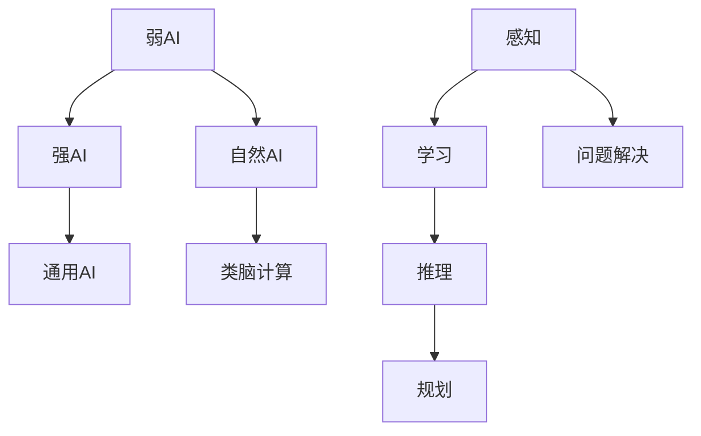

**图1.2 机器学习、深度学习和神经网络的联系**

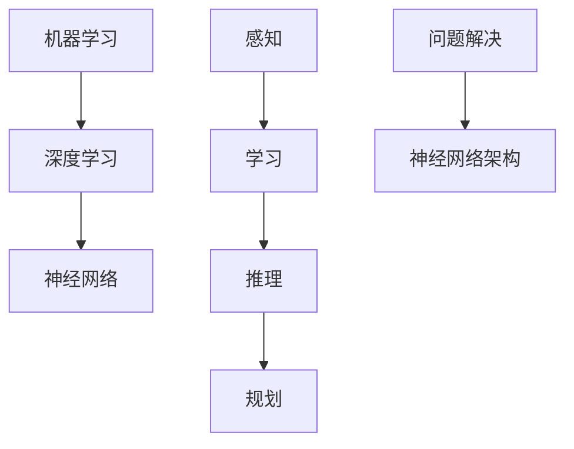

---

接下来，我们将进入第2章，探讨AI技术的数学基础。

#### 第2章：AI技术的数学基础

AI技术的核心在于算法和模型，而算法和模型的基础是数学。本章将介绍AI技术所依赖的三个主要数学领域：线性代数、概率论和最优化方法。通过这些数学工具，我们能够更好地理解和应用AI技术。

##### 2.1 线性代数基础

线性代数是数学的一个重要分支，它研究向量空间、线性变换和矩阵等概念。以下是线性代数中几个关键概念：

1. **矩阵与向量操作**：矩阵是二维数组，向量是一维数组。在AI中，矩阵和向量被广泛应用于数据表示和计算。
    - **加法和减法**：两个矩阵或向量对应元素相加或相减。
    - **数乘**：矩阵或向量与一个标量相乘。
    - **矩阵乘法**：两个矩阵的元素按照一定规则相乘并求和。

2. **线性方程组求解**：线性方程组是多个线性方程组成的一个系统，其求解方法包括：
    - **高斯消元法**：通过消元操作将线性方程组转化为上三角或下三角方程组，然后依次求解。
    - **矩阵求逆**：如果线性方程组可以表示为Ax=b的形式，且矩阵A可逆，则可以通过求解Ax=b来得到x。

3. **特征值与特征向量**：特征值是矩阵的一个重要属性，它描述了矩阵在变换过程中的拉伸或压缩效应。特征向量是相应的向量，它们在变换后保持方向不变。在AI中，特征值和特征向量被广泛应用于降维、分类和聚类等任务。

**例2.1 矩阵与向量操作**

假设我们有以下矩阵和向量：
$$
A = \begin{bmatrix}
1 & 2 \\
3 & 4
\end{bmatrix}, \quad
B = \begin{bmatrix}
5 & 6 \\
7 & 8
\end{bmatrix}, \quad
v = \begin{bmatrix}
9 \\
10
\end{bmatrix}
$$

- 矩阵相加：
$$
A + B = \begin{bmatrix}
1+5 & 2+6 \\
3+7 & 4+8
\end{bmatrix} = \begin{bmatrix}
6 & 8 \\
10 & 12
\end{bmatrix}
$$

- 矩阵数乘：
$$
2A = \begin{bmatrix}
2 \cdot 1 & 2 \cdot 2 \\
2 \cdot 3 & 2 \cdot 4
\end{bmatrix} = \begin{bmatrix}
2 & 4 \\
6 & 8
\end{bmatrix}
$$

- 矩阵乘法：
$$
AB = \begin{bmatrix}
1 \cdot 5 + 2 \cdot 7 & 1 \cdot 6 + 2 \cdot 8 \\
3 \cdot 5 + 4 \cdot 7 & 3 \cdot 6 + 4 \cdot 8
\end{bmatrix} = \begin{bmatrix}
19 & 26 \\
31 & 40
\end{bmatrix}
$$

- 向量数乘：
$$
2v = \begin{bmatrix}
2 \cdot 9 \\
2 \cdot 10
\end{bmatrix} = \begin{bmatrix}
18 \\
20
\end{bmatrix}
$$

##### 2.2 概率论基础

概率论是描述不确定事件发生可能性的数学工具。在AI中，概率论被广泛应用于概率模型、概率分布和贝叶斯定理等。

1. **基本概率概念**：概率是描述事件发生可能性的一种数值，介于0和1之间。以下是几个基本概率概念：
    - **概率空间**：包含所有可能结果的集合。
    - **事件**：概率空间中的一个子集。
    - **条件概率**：在某个事件发生的条件下，另一个事件发生的概率。

2. **贝叶斯定理**：贝叶斯定理是一种描述条件概率和总概率之间关系的公式，它为概率推理提供了重要的理论依据。

贝叶斯定理公式如下：
$$
P(A|B) = \frac{P(B|A)P(A)}{P(B)}
$$
其中，$P(A|B)$ 表示在事件B发生的条件下，事件A发生的概率；$P(B|A)$ 表示在事件A发生的条件下，事件B发生的概率；$P(A)$ 和$P(B)$ 分别表示事件A和事件B发生的概率。

3. **概率分布**：概率分布描述了随机变量可能取到的各个值的概率。常见的概率分布包括：
    - **离散分布**：如伯努利分布、泊松分布等。
    - **连续分布**：如正态分布、指数分布等。

**例2.2 概率计算**

假设有两个事件A和B，已知$P(A) = 0.4$，$P(B) = 0.3$，且$P(A \cap B) = 0.1$。计算$P(B|A)$。

根据贝叶斯定理：
$$
P(B|A) = \frac{P(A \cap B)}{P(A)} = \frac{0.1}{0.4} = 0.25
$$

##### 2.3 最优化方法

最优化方法是寻找最优解的数学工具，广泛应用于AI中的模型训练和参数调整。

1. **函数优化**：函数优化是寻找函数在某个区间内的最大值或最小值。常用的算法包括：
    - **梯度下降法**：通过迭代更新变量，使得函数值逐渐接近最优解。
    - **牛顿法**：利用函数的导数和二阶导数来加速收敛。

2. **约束优化**：约束优化是在满足一定约束条件下寻找最优解的问题。常见的算法包括：
    - **拉格朗日乘数法**：通过引入拉格朗日乘子来处理不等式约束。
    - **可行方向法**：通过搜索可行方向来逐步逼近最优解。

3. **梯度下降算法**：梯度下降算法是一种简单的优化算法，其核心思想是沿着目标函数的梯度方向进行迭代更新。算法的基本步骤如下：
    - 初始化参数$\theta$。
    - 计算目标函数关于$\theta$的梯度$\nabla J(\theta)$。
    - 更新参数$\theta = \theta - \alpha \nabla J(\theta)$，其中$\alpha$为学习率。

**例2.3 梯度下降法**

假设目标函数为$J(\theta) = (\theta - 1)^2$，学习率$\alpha = 0.1$。初始化$\theta_0 = 2$。

- 第1次迭代：
  $$
  \nabla J(\theta) = 2(\theta - 1) = 2(2 - 1) = 2
  $$
  $$
  \theta_1 = \theta_0 - \alpha \nabla J(\theta_0) = 2 - 0.1 \cdot 2 = 1.8
  $$

- 第2次迭代：
  $$
  \nabla J(\theta) = 2(\theta_1 - 1) = 2(1.8 - 1) = 0.4
  $$
  $$
  \theta_2 = \theta_1 - \alpha \nabla J(\theta_1) = 1.8 - 0.1 \cdot 0.4 = 1.76
  $$

通过多次迭代，$\theta$将逐渐逼近最优解$\theta = 1$。

在本章中，我们介绍了线性代数、概率论和最优化方法在AI技术中的应用。这些数学基础不仅帮助我们更好地理解AI技术的原理，还为AI算法的实现提供了强有力的支持。在接下来的章节中，我们将深入探讨AI技术的编程基础和具体应用。

---

**图2.1 线性代数中矩阵与向量的基本操作**

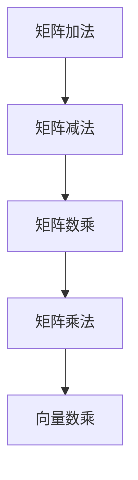

**图2.2 线性方程组的求解方法**

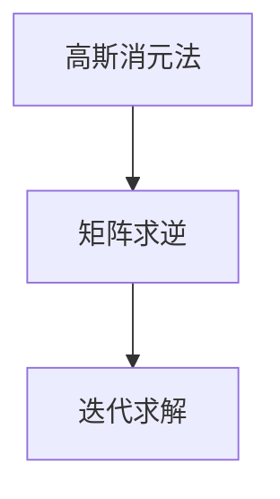

**图2.3 梯度下降算法流程图**

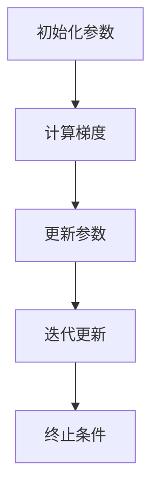

---

接下来，我们将进入第3章，探讨AI技术的编程基础。

#### 第3章：AI技术的编程基础

AI技术的实现离不开编程。本章将介绍Python编程基础、NumPy库、pandas库和matplotlib库在AI中的应用，帮助读者掌握AI编程的基本技能。

##### 3.1 Python编程基础

Python是一种广泛用于AI开发的编程语言，以其简洁、易读和强大的库支持而受到开发者喜爱。以下是Python编程基础：

1. **Python语言概述**：Python是一种高级编程语言，具有动态类型、自动内存管理和丰富的标准库。
    - **语法简洁**：Python采用缩进和冒号来定义代码块，使代码更加清晰。
    - **动态类型**：Python在运行时确定变量类型，减少了类型转换的复杂性。
    - **标准库丰富**：Python提供了广泛的库，涵盖了文件操作、网络通信、数据分析和图形显示等。

2. **数据类型与变量**：Python支持多种数据类型，包括整数、浮点数、字符串和列表等。
    - **整数**：表示整数，如1、2、3等。
    - **浮点数**：表示浮点数，如3.14、2.718等。
    - **字符串**：表示文本数据，如'Hello, World!'、'Python'等。
    - **列表**：表示有序的元素集合，如[1, 2, 3]、['a', 'b', 'c']等。

3. **控制流语句**：Python提供了多种控制流语句，用于控制程序的执行流程。
    - **条件语句**：if、elif和else语句，用于根据条件执行不同代码块。
    - **循环语句**：for和while循环，用于重复执行代码块。

**例3.1 Python基础代码示例**

```python
# 整数和浮点数
num1 = 42
num2 = 3.14

# 字符串
name = 'Alice'

# 列表
list1 = [1, 2, 3]
list2 = ['a', 'b', 'c']

# 条件语句
if num1 > num2:
    print("num1 大于 num2")
elif num1 < num2:
    print("num1 小于 num2")
else:
    print("num1 等于 num2")

# 循环语句
for i in range(3):
    print(i)
```

##### 3.2 NumPy库应用

NumPy（Numerical Python）是Python中用于数值计算的基础库，提供了多维数组对象和一系列高效的数学函数。以下是NumPy的基本操作：

1. **NumPy基本操作**：NumPy提供了创建、索引、切片、迭代等多种操作。
    - **创建数组**：使用numpy.array()函数创建数组。
    - **索引**：使用索引操作获取数组中的元素。
    - **切片**：使用切片操作获取数组中的子数组。
    - **迭代**：使用for循环迭代数组中的元素。

2. **数组运算**：NumPy支持多种数组运算，包括基本运算、矩阵运算和统计运算。
    - **基本运算**：如加法、减法、乘法和除法。
    - **矩阵运算**：如矩阵乘法、行列式和逆矩阵。
    - **统计运算**：如求和、平均值、标准差等。

3. **缓存机制**：NumPy使用缓存机制来提高数组操作的性能，通过共享内存来避免不必要的复制。

**例3.2 NumPy基本操作**

```python
import numpy as np

# 创建数组
arr1 = np.array([1, 2, 3])
arr2 = np.array([4, 5, 6])

# 索引和切片
print(arr1[0])  # 输出1
print(arr1[1:3])  # 输出[2, 3]

# 迭代
for element in arr1:
    print(element)

# 数组运算
print(np.add(arr1, arr2))  # 输出[5, 7, 9]
print(np.dot(arr1, arr2))  # 输出32
```

##### 3.3 pandas库应用

pandas是Python中用于数据分析和处理的库，提供了强大的数据结构和数据分析工具。以下是pandas的基本操作：

1. **pandas基本操作**：pandas提供了DataFrame和Series两种主要数据结构。
    - **DataFrame**：类似于Excel表格，由行和列组成，适合存储多维数据。
    - **Series**：类似于NumPy中的数组，由一维数据组成，适合存储单维数据。

2. **数据清洗**：数据清洗是数据分析的重要步骤，包括去除重复数据、处理缺失值和异常值等。
    - **去除重复数据**：使用drop_duplicates()方法。
    - **处理缺失值**：使用dropna()和fillna()方法。
    - **异常值处理**：使用箱线图等可视化工具检测和处理异常值。

3. **数据分析**：pandas提供了丰富的数据分析方法，包括描述性统计分析、相关性分析和聚类分析等。
    - **描述性统计分析**：使用describe()方法。
    - **相关性分析**：使用corr()方法。
    - **聚类分析**：使用k-means等方法。

**例3.3 pandas基本操作**

```python
import pandas as pd

# 创建DataFrame
df = pd.DataFrame({'A': [1, 2, 3], 'B': [4, 5, 6]})

# 索引和切片
print(df['A'])  # 输出Series [1, 2, 3]
print(df[['A', 'B']])  # 输出DataFrame
```

##### 3.4 matplotlib库应用

matplotlib是Python中用于数据可视化的库，提供了丰富的绘图功能。以下是matplotlib的基本操作：

1. **基本绘图**：使用matplotlib绘制基本的二维图形，如折线图、柱状图和散点图等。
    - **折线图**：使用plot()方法。
    - **柱状图**：使用bar()方法。
    - **散点图**：使用scatter()方法。

2. **多图绘制**：使用subplot()方法在同一图表中绘制多个子图，用于比较不同数据集。

3. **动态图绘制**：使用 animation 模块绘制动态图，展示数据变化过程。

**例3.4 matplotlib基本操作**

```python
import matplotlib.pyplot as plt

# 绘制折线图
plt.plot([1, 2, 3], [4, 5, 6])
plt.show()

# 绘制柱状图
plt.bar([1, 2, 3], [4, 5, 6])
plt.show()

# 绘制散点图
plt.scatter([1, 2, 3], [4, 5, 6])
plt.show()
```

在本章中，我们介绍了Python编程基础、NumPy库、pandas库和matplotlib库在AI技术中的应用。这些编程基础和工具将为读者在后续章节中实现AI算法和模型提供有力支持。在接下来的章节中，我们将深入探讨机器学习、深度学习和AI应用实例。

---

**图3.1 Python基础语法结构**

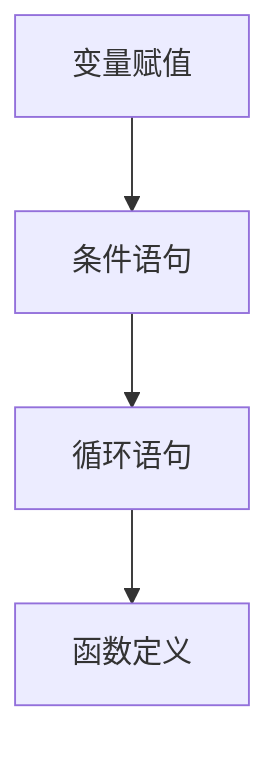

**图3.2 NumPy数组基本操作**

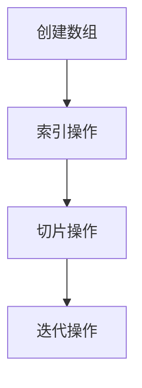

**图3.3 pandas DataFrame基本操作**

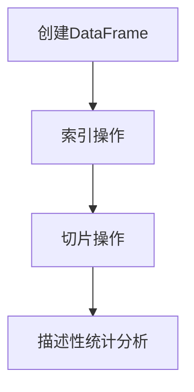

**图3.4 matplotlib基本绘图方法**

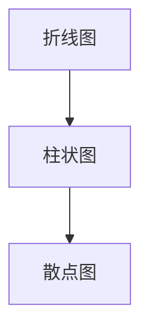

---

接下来，我们将进入第4章，探讨机器学习技术。

#### 第4章：机器学习技术

机器学习（Machine Learning）是人工智能（AI）的核心技术之一，通过算法和模型使计算机具备自动学习和推理的能力。本章将详细介绍机器学习的基本概念、分类和方法。

##### 4.1 机器学习概述

机器学习是一种让计算机通过数据自动改进性能的技术。其核心思想是通过训练数据集，使模型能够学习并预测未知数据。

1. **机器学习概念**：机器学习包括以下几个关键概念：
    - **模型**：通过训练数据得到的函数或决策规则，用于预测或分类。
    - **训练数据集**：用于训练模型的输入数据和相应的输出标签。
    - **测试数据集**：用于评估模型性能的独立数据集。
    - **泛化能力**：模型在未知数据上的表现能力。

2. **监督学习**：监督学习是一种最常见的机器学习方法，其目标是通过训练数据集学习出一个函数，用于预测新的数据。监督学习可以分为以下几类：
    - **回归**：预测连续值输出，如房价预测。
    - **分类**：预测离散值输出，如邮件分类。
    - **排序**：预测样本的相对顺序，如新闻推荐。

3. **无监督学习**：无监督学习是在没有标签数据的情况下，通过分析数据结构来发现数据模式。主要方法包括：
    - **聚类**：将数据分为不同的组，如客户细分。
    - **降维**：减少数据维度，如图像压缩。
    - **关联规则学习**：发现数据之间的关联性，如购物篮分析。

4. **强化学习**：强化学习是一种通过奖励机制学习最优策略的机器学习方法。其目标是通过与环境互动，不断优化策略，以实现长期奖励最大化。

##### 4.2 监督学习算法

监督学习算法的核心是找到一种映射关系，将输入特征映射到输出标签。以下是几种常见的监督学习算法：

1. **线性回归**：线性回归是一种简单的回归算法，通过找到输入特征和输出标签之间的线性关系来预测连续值。
    - **公式**：$y = \beta_0 + \beta_1x$
    - **损失函数**：均方误差（MSE）

2. **决策树**：决策树是一种树形结构的预测模型，通过一系列if-else规则将数据划分成多个子集，最终得到预测结果。
    - **原理**：基于信息增益或基尼不纯度选择最优划分特征。
    - **缺点**：容易过拟合。

3. **随机森林**：随机森林是一种集成学习算法，通过构建多棵决策树，并对预测结果进行投票来提高准确性。
    - **原理**：随机选择特征和样本子集，构建多棵决策树。
    - **优点**：减少过拟合，提高预测性能。

4. **支持向量机（SVM）**：支持向量机是一种基于最大间隔原则的分类算法，通过找到一个超平面，将不同类别的数据分隔开。
    - **原理**：使用核函数将低维数据映射到高维空间，寻找最优超平面。
    - **优点**：强大的分类能力，适用于小样本和高维数据。

##### 4.3 无监督学习算法

无监督学习算法主要关注数据内在结构的发现，以下是几种常见的无监督学习算法：

1. **聚类算法**：聚类算法将数据划分为多个组，使同一组内的数据点相似，不同组的数据点差异较大。常见的聚类算法包括：
    - **K-Means**：基于距离最小化原则，将数据划分为K个簇。
    - **层次聚类**：基于层次结构，逐步合并或分裂簇。
    - **DBSCAN**：基于密度连通性，发现任意形状的簇。

2. **主成分分析（PCA）**：主成分分析是一种降维算法，通过将数据映射到新的坐标系，保留主要信息，降低数据维度。
    - **原理**：找到最大方差的方向，即第一主成分。
    - **优点**：简化数据结构，提高数据处理效率。

3. **关联规则学习**：关联规则学习通过发现数据之间的关联性，提取有价值的信息。常见的算法包括：
    - **Apriori算法**：基于候选集生成和剪枝，发现频繁项集。
    - **FP-Growth算法**：基于频繁模式树，高效地发现频繁项集。

##### 4.4 强化学习算法

强化学习是一种通过奖励机制学习策略的机器学习方法。强化学习算法的核心是找到一种策略，使累计奖励最大化。以下是几种常见的强化学习算法：

1. **Q学习**：Q学习是一种基于值函数的强化学习算法，通过学习状态-动作价值函数来选择最佳动作。
    - **公式**：$Q(s, a) = r + \gamma \max_{a'} Q(s', a')$
    - **原理**：利用奖励和折扣因子更新状态-动作价值函数。

2. **深度Q网络（DQN）**：深度Q网络是一种基于深度学习的强化学习算法，通过神经网络近似值函数。
    - **原理**：使用经验回放和目标网络来稳定训练过程。

3. **异步优势演员-评论家（A3C）**：A3C是一种基于异步策略梯度的强化学习算法，通过多个并行演员网络进行学习。
    - **原理**：使用梯度上升更新全局策略网络。

在本章中，我们介绍了机器学习的基本概念、分类和方法。这些算法和技术为AI应用提供了强大的支持。在接下来的章节中，我们将深入探讨深度学习技术和AI应用实例。

---

**图4.1 线性回归模型原理**

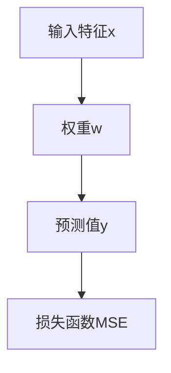

**图4.2 决策树划分原理**

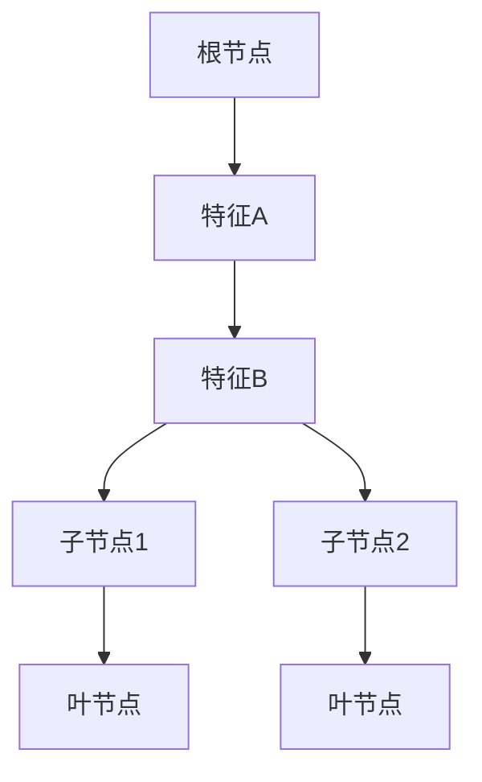

**图4.3 随机森林模型原理**

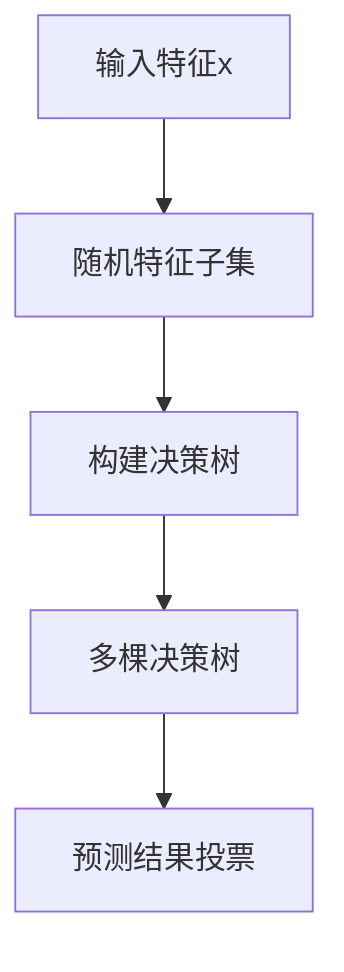

**图4.4 K-Means聚类算法原理**

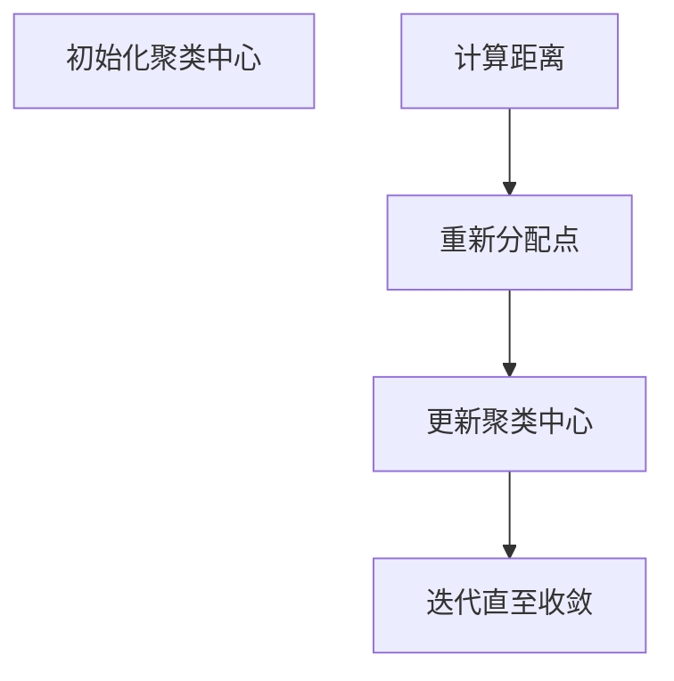

**图4.5 Q学习算法原理**

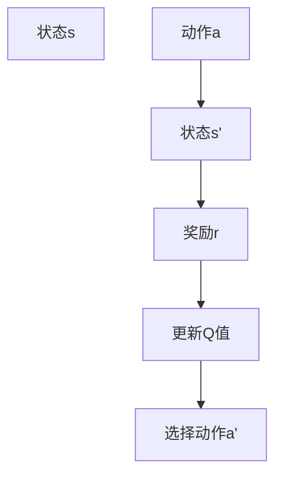

---

接下来，我们将进入第5章，探讨深度学习技术。

#### 第5章：深度学习技术

深度学习（Deep Learning）是机器学习的一个重要分支，通过模拟人脑神经网络的结构和功能来实现复杂的特征提取和预测。本章将详细介绍深度学习的基本概念、架构和应用。

##### 5.1 深度学习概述

深度学习的关键在于其多层神经网络架构，能够自动学习数据的复杂特征表示。以下是深度学习的基本概念：

1. **深度学习概念**：深度学习是一种基于多层神经网络的学习方法，通过逐层提取数据特征来实现高度非线性映射。

2. **多层神经网络**：多层神经网络由输入层、隐藏层和输出层组成，通过层层递归的方式对数据进行特征提取和变换。

3. **激活函数**：激活函数用于引入非线性变换，使神经网络能够学习复杂的函数关系。常见的激活函数包括ReLU、Sigmoid和Tanh。

4. **反向传播算法**：反向传播算法是一种用于训练神经网络的优化算法，通过梯度下降法更新网络权重，以最小化损失函数。

5. **正则化**：正则化是一种防止过拟合的技术，通过引入惩罚项来降低模型复杂度。常见的正则化方法包括L1正则化和L2正则化。

##### 5.2 卷积神经网络

卷积神经网络（Convolutional Neural Network，CNN）是深度学习中最常用的架构之一，特别适用于图像识别和处理任务。以下是CNN的基本原理：

1. **卷积层**：卷积层是CNN的核心部分，通过卷积操作提取图像特征。卷积层使用滤波器（也称为卷积核）在输入图像上滑动，计算局部特征的加权和，并通过激活函数引入非线性变换。

2. **池化层**：池化层用于减小特征图的尺寸，降低计算复杂度。常见的池化操作包括最大池化和平均池化。

3. **全连接层**：全连接层将卷积层和池化层提取的局部特征整合为全局特征，并通过softmax函数进行分类。

4. **卷积神经网络原理**：卷积神经网络通过多层卷积、池化和全连接层的组合，逐层提取图像的复杂特征。卷积层负责局部特征提取，池化层用于特征降维，全连接层进行分类和预测。

5. **卷积神经网络应用**：CNN广泛应用于图像识别、图像分类、图像生成等任务，如人脸识别、物体检测、医学影像分析等。

**例5.1 卷积神经网络在图像分类中的应用**

假设我们有一个图像分类任务，输入图像的大小为$28 \times 28$像素，输出为10个类别。以下是一个简单的CNN模型：

- 输入层：接收$28 \times 28$像素的图像。
- 卷积层1：使用32个3x3的卷积核，步长为1，激活函数为ReLU。
- 池化层1：使用2x2的最大池化。
- 卷积层2：使用64个3x3的卷积核，步长为1，激活函数为ReLU。
- 池化层2：使用2x2的最大池化。
- 全连接层1：使用256个神经元，激活函数为ReLU。
- 全连接层2：使用10个神经元，输出为类别概率，激活函数为softmax。

**图5.1 卷积神经网络结构**

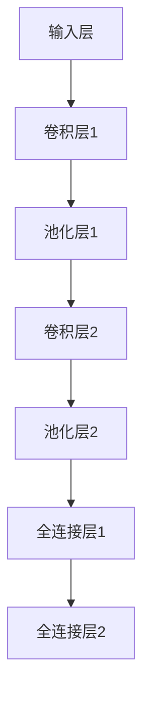

##### 5.3 循环神经网络

循环神经网络（Recurrent Neural Network，RNN）是一种处理序列数据的神经网络，特别适用于自然语言处理和时间序列分析等任务。以下是RNN的基本原理：

1. **循环结构**：RNN具有循环结构，隐藏状态信息能够通过时间步传递，使模型能够记忆序列中的依赖关系。

2. **门控机制**：为了解决RNN中的梯度消失和梯度爆炸问题，引入了门控机制，包括遗忘门、输入门和输出门。

3. **LSTM和GRU**：长短期记忆网络（LSTM）和门控循环单元（GRU）是RNN的改进版本，通过引入门控机制和更简单的结构，提高了模型对长期依赖的建模能力。

4. **循环神经网络应用**：RNN广泛应用于语言模型、机器翻译、语音识别和时间序列预测等任务。

5. **循环神经网络原理**：RNN通过隐藏状态和输出状态的递归更新，对序列数据进行特征提取和建模。在时间步$t$，隐藏状态$h_t$由当前输入$x_t$和前一时间步的隐藏状态$h_{t-1}$计算得到，输出$y_t$则由隐藏状态和当前输入的加权求和并通过激活函数得到。

**例5.2 RNN在文本分类中的应用**

假设我们有一个文本分类任务，输入为一系列单词序列，输出为类别标签。以下是一个简单的RNN模型：

- 输入层：接收单词序列的嵌入向量。
- 隐藏层：使用一个RNN单元，将隐藏状态传递给下一个时间步。
- 输出层：使用softmax函数进行分类。

**图5.2 循环神经网络结构**

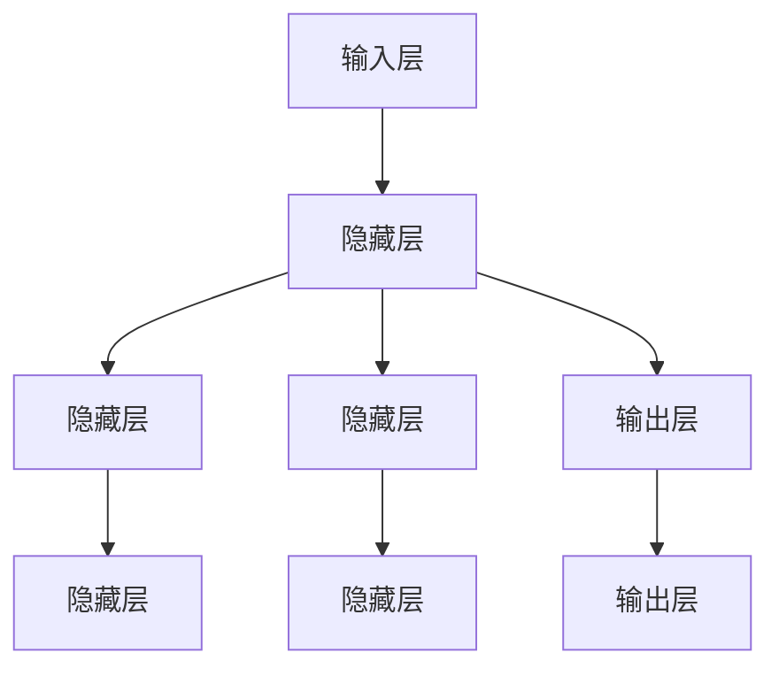

##### 5.4 生成对抗网络

生成对抗网络（Generative Adversarial Network，GAN）是一种由生成器和判别器组成的对抗性神经网络，通过相互博弈来生成逼真的数据。以下是GAN的基本原理：

1. **生成器**：生成器尝试生成逼真的数据，以欺骗判别器。
2. **判别器**：判别器判断输入数据是真实数据还是生成数据。
3. **对抗过程**：生成器和判别器通过对抗性训练不断优化，生成器逐渐生成更逼真的数据，判别器逐渐提高判断能力。

4. **生成对抗网络原理**：生成器和判别器在训练过程中相互博弈。生成器的目标是使判别器无法区分生成数据与真实数据，判别器的目标是准确区分生成数据与真实数据。通过交替训练，生成器不断提高生成数据的逼真度。

5. **生成对抗网络应用**：GAN广泛应用于图像生成、图像修复、图像超分辨率等任务。

6. **生成对抗网络优化**：为了提高GAN的训练效果，可以采用以下技术：
    - **梯度惩罚**：对生成器施加梯度惩罚，使其生成更稳定的数据。
    - **判别器改进**：增加判别器的深度或使用更复杂的结构。
    - **损失函数优化**：使用自适应损失函数或改进的损失函数。

**例5.3 GAN在图像生成中的应用**

假设我们有一个图像生成任务，生成器生成人脸图像，判别器判断图像是真实人脸还是生成人脸。以下是一个简单的GAN模型：

- 生成器：接收随机噪声向量，生成人脸图像。
- 判别器：接收人脸图像，判断图像是真实人脸还是生成人脸。
- 生成器损失函数：最小化生成图像与真实图像的相似度。
- 判别器损失函数：最大化生成图像与真实图像的区分度。

**图5.3 生成对抗网络结构**

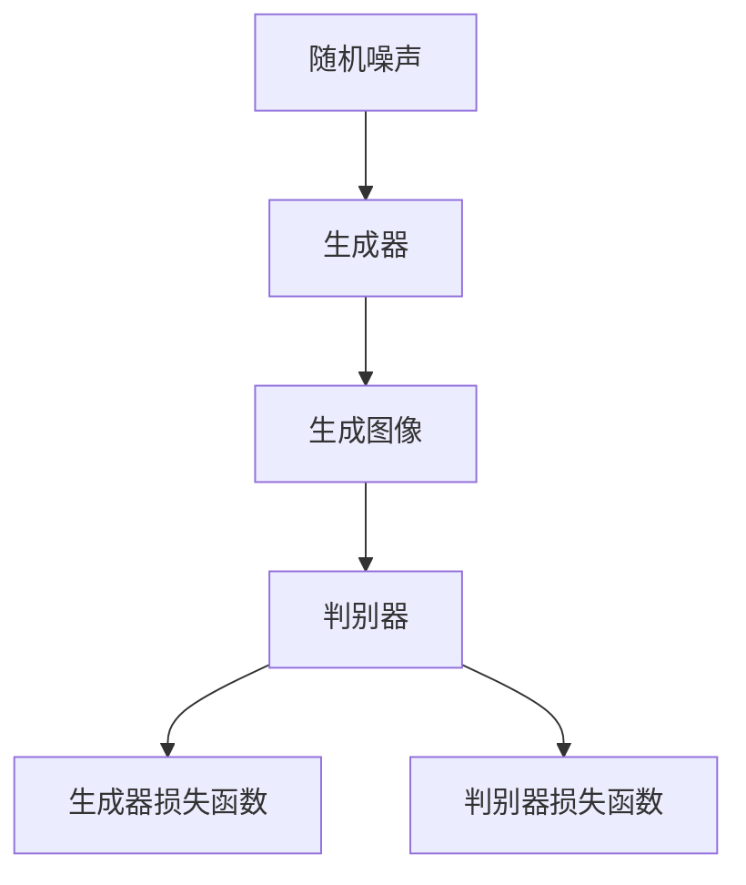

在本章中，我们介绍了深度学习的基本概念、架构和应用。深度学习技术为AI领域带来了革命性的变革，推动了计算机视觉、自然语言处理和机器人技术等领域的进步。在接下来的章节中，我们将深入探讨AI技术的具体应用和未来展望。

---

**图5.1 卷积神经网络结构**


**图5.2 循环神经网络结构**


**图5.3 生成对抗网络结构**


---

接下来，我们将进入第6章，探讨AI技术应用实例。

#### 第6章：AI技术应用实例

AI技术在各个领域都有广泛的应用，本章将介绍AI技术在图像识别、自然语言处理和语音识别等领域的实际应用实例，展示AI技术的强大能力。

##### 6.1 图像识别应用

图像识别是AI技术的一个重要应用领域，通过卷积神经网络（CNN）等深度学习算法，计算机能够自动识别和分类图像中的物体、场景和动作。以下是几个图像识别的应用实例：

1. **人脸识别**：人脸识别是一种基于图像识别技术的方法，通过检测和识别图像中的人脸特征，实现身份验证和身份识别。以下是一个简单的人脸识别流程：

   - **图像预处理**：对输入图像进行缩放、裁剪、灰度化等处理，使其符合网络输入要求。
   - **特征提取**：使用CNN提取人脸特征，如使用VGG16、ResNet等预训练模型。
   - **特征匹配**：将提取的特征与数据库中的人脸特征进行匹配，计算相似度。
   - **身份验证**：根据相似度阈值判断是否为同一人。

   **例6.1 人脸识别流程**

   ```mermaid
   graph TD
       A[输入图像] --> B[图像预处理]
       B --> C[特征提取]
       C --> D[特征匹配]
       D --> E[身份验证]
   ```

2. **物体检测**：物体检测是一种在图像中识别和定位多个物体的方法。以下是一个简单的物体检测流程：

   - **图像预处理**：对输入图像进行缩放、裁剪、灰度化等处理。
   - **特征提取**：使用CNN提取图像特征。
   - **目标检测**：使用R-CNN、Faster R-CNN、YOLO等目标检测算法，识别图像中的物体。
   - **边界框标注**：将检测到的物体及其位置信息标注在图像上。

   **例6.2 物体检测流程**

   ```mermaid
   graph TD
       A[输入图像] --> B[图像预处理]
       B --> C[特征提取]
       C --> D[目标检测]
       D --> E[边界框标注]
   ```

3. **图像分类**：图像分类是一种将图像划分为不同类别的方法。以下是一个简单的图像分类流程：

   - **图像预处理**：对输入图像进行缩放、裁剪、灰度化等处理。
   - **特征提取**：使用CNN提取图像特征。
   - **分类预测**：使用softmax函数进行图像分类预测。

   **例6.3 图像分类流程**

   ```mermaid
   graph TD
       A[输入图像] --> B[图像预处理]
       B --> C[特征提取]
       C --> D[分类预测]
   ```

##### 6.2 自然语言处理应用

自然语言处理（Natural Language Processing，NLP）是AI技术的另一个重要应用领域，通过深度学习和序列模型，计算机能够理解和生成自然语言。以下是几个NLP的应用实例：

1. **文本分类**：文本分类是一种将文本数据划分为不同类别的方法。以下是一个简单的文本分类流程：

   - **文本预处理**：对输入文本进行分词、去停用词、词向量化等处理。
   - **特征提取**：使用循环神经网络（RNN）或长短期记忆网络（LSTM）提取文本特征。
   - **分类预测**：使用softmax函数进行文本分类预测。

   **例6.4 文本分类流程**

   ```mermaid
   graph TD
       A[输入文本] --> B[文本预处理]
       B --> C[特征提取]
       C --> D[分类预测]
   ```

2. **机器翻译**：机器翻译是一种将一种语言的文本翻译成另一种语言的方法。以下是一个简单的机器翻译流程：

   - **文本预处理**：对输入文本进行分词、去停用词、词向量化等处理。
   - **编码器解码器**：使用编码器-解码器模型（如Seq2Seq模型）进行翻译。
   - **翻译输出**：将解码器的输出文本进行后处理，如去标点、添加标点等。

   **例6.5 机器翻译流程**

   ```mermaid
   graph TD
       A[输入文本] --> B[文本预处理]
       B --> C[编码器解码器]
       C --> D[翻译输出]
   ```

3. **情感分析**：情感分析是一种判断文本情感极性的方法。以下是一个简单的情感分析流程：

   - **文本预处理**：对输入文本进行分词、去停用词、词向量化等处理。
   - **特征提取**：使用循环神经网络（RNN）或长短期记忆网络（LSTM）提取文本特征。
   - **情感分类**：使用softmax函数进行情感分类预测。

   **例6.6 情感分析流程**

   ```mermaid
   graph TD
       A[输入文本] --> B[文本预处理]
       B --> C[特征提取]
       C --> D[情感分类]
   ```

##### 6.3 语音识别应用

语音识别是将语音信号转换为文本数据的技术，通过深度学习算法，计算机能够准确地识别和理解语音。以下是几个语音识别的应用实例：

1. **语音到文本转换**：语音到文本转换是一种将语音信号转换为文本数据的方法。以下是一个简单的语音到文本转换流程：

   - **音频预处理**：对输入音频进行降噪、增强等处理。
   - **特征提取**：使用深度神经网络（如DNN-HMM、CTC）提取音频特征。
   - **解码**：将提取的特征解码为文本数据。

   **例6.7 语音到文本转换流程**

   ```mermaid
   graph TD
       A[输入音频] --> B[音频预处理]
       B --> C[特征提取]
       C --> D[解码]
   ```

2. **语音合成**：语音合成是将文本数据转换为语音信号的方法。以下是一个简单的语音合成流程：

   - **文本预处理**：对输入文本进行分词、句法分析等处理。
   - **语音生成**：使用循环神经网络（如WaveNet）生成语音信号。
   - **音频处理**：对生成的语音信号进行降噪、增强等处理。

   **例6.8 语音合成流程**

   ```mermaid
   graph TD
       A[输入文本] --> B[文本预处理]
       B --> C[语音生成]
       C --> D[音频处理]
   ```

3. **语音助手**：语音助手是一种基于语音识别和自然语言处理技术的智能交互系统，能够回答用户的问题、执行指令等。以下是一个简单的语音助手流程：

   - **语音识别**：使用语音识别技术将用户的语音输入转换为文本。
   - **自然语言理解**：使用自然语言处理技术解析文本，理解用户的意图。
   - **响应生成**：根据用户的意图生成合适的响应文本或语音。
   - **语音合成**：将生成的文本转换为语音输出。

   **例6.9 语音助手流程**

   ```mermaid
   graph TD
       A[用户语音输入] --> B[语音识别]
       B --> C[自然语言理解]
       C --> D[响应生成]
       D --> E[语音合成]
   ```

在本章中，我们介绍了AI技术在图像识别、自然语言处理和语音识别等领域的实际应用实例。这些应用实例展示了AI技术的强大能力和广泛的应用前景。在接下来的章节中，我们将继续探讨AI技术的未来展望和挑战。

---

**图6.1 人脸识别流程**

```mermaid
graph TD
    A[输入图像] --> B[图像预处理]
    B --> C[特征提取]
    C --> D[特征匹配]
    D --> E[身份验证]
```

**图6.2 物体检测流程**

```mermaid
graph TD
    A[输入图像] --> B[图像预处理]
    B --> C[特征提取]
    C --> D[目标检测]
    D --> E[边界框标注]
```

**图6.3 图像分类流程**

```mermaid
graph TD
    A[输入图像] --> B[图像预处理]
    B --> C[特征提取]
    C --> D[分类预测]
```

**图6.4 文本分类流程**

```mermaid
graph TD
    A[输入文本] --> B[文本预处理]
    B --> C[特征提取]
    C --> D[分类预测]
```

**图6.5 机器翻译流程**

```mermaid
graph TD
    A[输入文本] --> B[文本预处理]
    B --> C[编码器解码器]
    C --> D[翻译输出]
```

**图6.6 情感分析流程**

```mermaid
graph TD
    A[输入文本] --> B[文本预处理]
    B --> C[特征提取]
    C --> D[情感分类]
```

**图6.7 语音到文本转换流程**

```mermaid
graph TD
    A[输入音频] --> B[音频预处理]
    B --> C[特征提取]
    C --> D[解码]
```

**图6.8 语音合成流程**

```mermaid
graph TD
    A[输入文本] --> B[文本预处理]
    B --> C[语音生成]
    C --> D[音频处理]
```

**图6.9 语音助手流程**

```mermaid
graph TD
    A[用户语音输入] --> B[语音识别]
    B --> C[自然语言理解]
    C --> D[响应生成]
    D --> E[语音合成]
```

---

接下来，我们将进入第7章，探讨AI技术的未来展望。

#### 第7章：AI技术的未来展望

AI技术的快速发展已经深刻地改变了我们的生活方式和社会结构。在这一章中，我们将探讨AI技术的发展趋势、对社会和经济的影响，以及对就业市场的展望。

##### 7.1 AI技术的发展趋势

AI技术的未来趋势将受到多种因素的影响，包括技术创新、产业需求和社会接受度。以下是几个主要的发展方向：

1. **自主性增强**：未来的AI系统将具备更高的自主性，能够独立完成复杂的任务。自主性增强的关键在于AI系统在决策和规划方面的能力提升，这将涉及到更复杂的算法和更强大的计算资源。

2. **跨领域融合**：AI技术将继续与其他前沿技术（如物联网、5G、区块链等）深度融合，形成新的应用场景。例如，AI与物联网结合可以实现智能家居、智能城市等；与5G结合可以实现低延迟、高速率的智能应用；与区块链结合可以实现去中心化的智能合约和自动化交易。

3. **智能化服务**：随着AI技术的进步，智能化服务将在更多领域得到应用。例如，医疗领域的智能诊断和辅助治疗、金融领域的智能投资和风险管理、教育领域的个性化教学和智能评估等。

4. **伦理和法律**：随着AI技术的应用越来越广泛，伦理和法律问题将变得更加突出。如何保障用户隐私、防止数据滥用、确保算法公平性等问题需要得到关注和解决。未来，我们将看到更多的伦理和法律框架出台，以规范AI技术的应用。

##### 7.2 AI技术对社会的影响

AI技术对社会的影响是深远且多方面的，以下是一些主要的影响：

1. **生产效率提升**：AI技术可以通过自动化和智能化提高生产效率，降低生产成本。例如，在制造业中，智能机器人可以替代人工完成复杂的组装和检测任务；在服务业中，智能客服系统可以高效地处理客户咨询和投诉。

2. **产业升级**：AI技术的应用推动了传统产业的升级和新兴产业的崛起。例如，在医疗领域，AI技术可以辅助医生进行诊断和治疗；在金融领域，AI技术可以用于风险管理、信用评估和智能投顾等。

3. **就业变革**：AI技术带来了新的就业机会，同时也对传统岗位产生了冲击。一方面，AI技术催生了大量新的职业，如数据科学家、机器学习工程师等；另一方面，一些传统岗位可能因被自动化取代而面临失业风险。因此，如何平衡AI技术带来的就业机会和挑战，是未来需要面对的重要问题。

4. **生活方式改变**：AI技术将极大地改变我们的生活方式。智能助手、智能家居、智能交通等AI应用将使我们的生活更加便捷和舒适。例如，智能助手可以帮助我们管理日程、提醒重要事项；智能家居系统可以自动调节室内温度、照明等。

##### 7.3 AI技术在就业市场的影响

AI技术的发展对就业市场产生了深远影响，以下是对就业市场的影响分析：

1. **AI对传统行业的冲击**：AI技术在许多传统行业中都发挥了重要作用，如制造业、金融业、医疗业等。通过自动化和智能化，AI技术降低了人力成本，提高了生产效率和产品质量。然而，这也导致了一些传统岗位的减少，如工厂操作工、银行柜员等。

2. **AI对新兴行业的影响**：AI技术催生了大量新兴行业和职业，如人工智能研发、数据分析、机器学习工程师等。这些新兴行业和职业为求职者提供了新的就业机会，同时也对求职者的技能要求提出了更高的要求。

3. **AI带来的机遇与挑战**：AI技术带来了许多机遇，如创新机会、创业机会等。然而，AI技术也带来了挑战，如就业竞争加剧、技能要求提高等。因此，如何适应AI技术的发展，提升个人技能和竞争力，是每个求职者都需要考虑的问题。

4. **AI就业市场趋势**：根据当前的发展趋势，AI就业市场将呈现以下趋势：

   - **需求增长**：随着AI技术的广泛应用，对AI人才的需求将持续增长。
   - **技能要求提高**：AI技术涉及到多个领域，如计算机科学、数学、统计学等，对求职者的综合能力提出了更高的要求。
   - **跨学科发展**：AI技术的发展需要跨学科的合作，如计算机科学、物理学、心理学等，这将推动跨学科教育和人才培养。
   - **全球竞争**：随着全球范围内对AI技术的重视，AI就业市场将变得更加全球化，求职者需要具备国际竞争力。

##### 7.4 AI就业准备与提升

为了应对AI技术的发展，求职者需要做好以下准备：

1. **技能提升路径**：求职者应该根据自身兴趣和职业规划，有针对性地提升技能。例如，对于希望从事AI研发的求职者，需要掌握Python编程、机器学习算法、深度学习框架等技能；对于希望从事数据分析的求职者，需要掌握统计学、数据挖掘、数据分析工具等技能。

2. **学习资源推荐**：求职者可以通过以下学习资源提升技能：

   - **在线课程平台**：如Coursera、edX、Udacity等，提供了丰富的AI相关课程。
   - **专业书籍**：如《深度学习》、《机器学习实战》等，提供了系统的理论知识和实践指导。
   - **开源项目**：参与开源项目可以锻炼编程能力，了解实际应用场景。
   - **学术论文**：阅读最新的学术论文可以了解AI领域的最新研究进展。

3. **职业规划建议**：求职者在制定职业规划时，应该考虑以下几点：

   - **明确职业目标**：根据自身兴趣和市场需求，明确自己的职业目标。
   - **持续学习**：AI技术发展迅速，持续学习是保持竞争力的关键。
   - **实践经验**：通过实习、项目经验等积累实际工作经验，提升自身能力。
   - **社交网络**：积极参与行业交流，扩大人脉，获取更多的职业机会。

在本章中，我们探讨了AI技术的未来发展趋势、对社会和经济的影响，以及对就业市场的展望。AI技术正在深刻地改变我们的世界，如何适应这一变革，将决定我们的未来。在接下来的章节中，我们将继续深入探讨AI技术的具体应用和挑战。

---

**图7.1 AI技术的发展趋势**

```mermaid
graph TD
    A[自主性增强] --> B[跨领域融合]
    B --> C[智能化服务]
    C --> D[伦理和法律]
```

**图7.2 AI技术对社会的影响**

```mermaid
graph TD
    A[生产效率提升] --> B[产业升级]
    B --> C[就业变革]
    C --> D[生活方式改变]
```

**图7.3 AI技术对就业市场的影响**

```mermaid
graph TD
    A[传统行业冲击] --> B[新兴行业影响]
    B --> C[机遇与挑战]
    C --> D[就业市场趋势]
```

**图7.4 AI就业准备与提升路径**

```mermaid
graph TD
    A[技能提升路径] --> B[学习资源推荐]
    B --> C[职业规划建议]
```

---

接下来，我们将进入第8章，探讨AI技术在就业市场的影响。

#### 第8章：AI技术在就业市场的影响

随着AI技术的飞速发展，其对就业市场的影响日益显著。本章将深入分析AI技术对就业市场的影响，包括对传统行业的冲击、对新兴行业的影响、AI技术带来的机遇与挑战，以及AI就业市场的趋势。

##### 8.1 AI对就业市场的影响

AI技术的广泛应用带来了深刻的就业市场变革，以下几个方面尤其值得关注：

1. **传统行业的冲击**：AI技术在许多传统行业中发挥了重要作用，如制造业、金融业、医疗业等。通过自动化和智能化，AI技术显著提高了生产效率和降低了人力成本。例如，在制造业中，智能机器人可以替代人工完成组装、检测等任务，大幅减少了人力需求。在金融业中，AI技术可以用于风险管理、信用评估和智能投顾等，减少了对传统金融岗位的需求。

然而，这种变革也带来了对传统行业的冲击。一些传统岗位可能因被自动化取代而面临失业风险，导致就业市场的动荡。例如，工厂操作工、银行柜员、文书处理人员等传统职位的需求可能大幅减少，而相关人员的再就业压力增加。

2. **新兴行业的影响**：AI技术的快速发展催生了大量新兴行业和职业，为就业市场带来了新的机会。数据科学家、机器学习工程师、AI算法工程师等岗位需求迅速增长，成为当前就业市场上的热门职业。此外，AI技术在医疗、金融、教育、娱乐等领域的广泛应用，也催生了众多新兴职业，如AI医生、智能投顾、AI教师等。

新兴行业的兴起不仅为求职者提供了更多的就业机会，还推动了产业的升级和转型。例如，医疗领域的AI应用可以辅助医生进行诊断和治疗，提高了医疗服务质量和效率；金融领域的AI应用可以优化风险管理、提高投资收益，推动了金融行业的创新发展。

3. **机遇与挑战**：AI技术带来了许多机遇，同时也带来了挑战。

   - **机遇**：AI技术的发展为求职者提供了广阔的职业发展空间。随着AI技术的广泛应用，对AI人才的需求将持续增长。具有AI相关技能的求职者将在就业市场上具备更强的竞争力，有望获得更好的职业机会和薪酬待遇。

   - **挑战**：AI技术也带来了挑战。一方面，一些传统岗位可能因被自动化取代而面临失业风险，导致就业市场的动荡。另一方面，AI技术的发展对求职者的技能要求不断提高，求职者需要不断学习和提升技能，以适应快速变化的市场需求。

##### 8.2 AI就业市场趋势

当前，AI就业市场呈现出以下趋势：

1. **需求增长**：随着AI技术的广泛应用，对AI人才的需求将持续增长。特别是在数据科学、机器学习、深度学习等领域，人才需求呈现爆发式增长。未来，我们将看到更多企业和机构加入AI领域的竞争，对AI人才的需求将进一步增加。

2. **技能要求提高**：AI技术的发展对求职者的技能要求不断提高。求职者需要掌握Python编程、机器学习算法、深度学习框架等技能，同时还需具备数学、统计学等相关知识。此外，跨学科的能力也越来越受到重视，如计算机科学、物理学、心理学等领域的知识对AI人才的需求日益增加。

3. **跨学科发展**：AI技术的发展需要跨学科的合作。例如，在医疗领域，AI技术需要与医学、生物学等领域相结合；在金融领域，AI技术需要与经济学、金融工程等领域相结合。因此，未来跨学科的人才将更加受到重视，跨学科教育和人才培养将成为趋势。

4. **全球竞争**：随着全球范围内对AI技术的重视，AI就业市场将变得更加全球化。国际竞争将进一步加剧，求职者需要具备国际竞争力。因此，求职者需要关注全球AI技术的发展动态，提升自身技能和国际化视野，以适应全球化就业市场的需求。

##### 8.3 AI就业准备与提升

为了应对AI就业市场的变化，求职者需要做好以下准备：

1. **技能提升路径**：求职者应该根据自身兴趣和职业规划，有针对性地提升技能。例如，对于希望从事AI研发的求职者，需要掌握Python编程、机器学习算法、深度学习框架等技能；对于希望从事数据分析的求职者，需要掌握统计学、数据挖掘、数据分析工具等技能。

2. **学习资源推荐**：求职者可以通过以下学习资源提升技能：

   - **在线课程平台**：如Coursera、edX、Udacity等，提供了丰富的AI相关课程。
   - **专业书籍**：如《深度学习》、《机器学习实战》等，提供了系统的理论知识和实践指导。
   - **开源项目**：参与开源项目可以锻炼编程能力，了解实际应用场景。
   - **学术论文**：阅读最新的学术论文可以了解AI领域的最新研究进展。

3. **实践经验**：通过实习、项目经验等积累实际工作经验，提升自身能力。实践经验不仅有助于求职者更好地理解AI技术的应用，还可以提高求职者的技术水平和解决问题的能力。

4. **职业规划**：制定明确的职业规划，明确自己的职业目标和发展方向。职业规划有助于求职者有针对性地提升技能，为实现职业目标做好准备。

在本章中，我们分析了AI技术在就业市场的影响，探讨了AI就业市场的趋势，并提供了AI就业准备与提升的建议。AI技术正在深刻地改变就业市场，求职者需要积极适应这一变革，提升自身竞争力，抓住AI时代带来的机遇。

---

**图8.1 AI对就业市场的影响**

```mermaid
graph TD
    A[传统行业冲击] --> B[新兴行业影响]
    B --> C[机遇与挑战]
    C --> D[就业市场趋势]
```

**图8.2 AI就业市场趋势**

```mermaid
graph TD
    A[需求增长] --> B[技能要求提高]
    B --> C[跨学科发展]
    C --> D[全球竞争]
```

**图8.3 AI就业准备与提升路径**

```mermaid
graph TD
    A[技能提升路径] --> B[学习资源推荐]
    B --> C[实践经验积累]
    C --> D[职业规划]
```

---

接下来，我们将进入附录部分，为读者提供AI开发工具与资源的推荐。

### 附录：AI开发工具与资源

为了帮助读者更好地掌握AI技术和应用，我们特别推荐以下AI开发工具与资源，涵盖Python机器学习库、机器学习数据集和学习资源推荐。

#### A.1 Python机器学习库

1. **Scikit-learn**：Scikit-learn是一个开源的Python机器学习库，提供了多种经典的机器学习算法和工具，包括监督学习和无监督学习算法、模型评估和交叉验证方法。它是进行AI项目开发的基础工具。

    - **官网**：[https://scikit-learn.org/](https://scikit-learn.org/)
    - **文档**：[https://scikit-learn.org/stable/documentation.html](https://scikit-learn.org/stable/documentation.html)

2. **TensorFlow**：TensorFlow是谷歌开发的开源机器学习框架，特别适用于深度学习应用。它提供了丰富的API和工具，支持从简单的线性回归到复杂的深度神经网络。

    - **官网**：[https://www.tensorflow.org/](https://www.tensorflow.org/)
    - **文档**：[https://www.tensorflow.org/tutorials](https://www.tensorflow.org/tutorials)

3. **PyTorch**：PyTorch是一个由Facebook开发的开源深度学习框架，以其灵活性和易于理解著称。它提供了动态计算图，使得模型设计和调试更加直观。

    - **官网**：[https://pytorch.org/](https://pytorch.org/)
    - **文档**：[https://pytorch.org/docs/stable/index.html](https://pytorch.org/docs/stable/index.html)

#### A.2 机器学习数据集

1. **Kaggle数据集**：Kaggle是一个数据科学竞赛平台，提供了大量的高质量机器学习数据集。这些数据集涵盖了图像、文本、音频等多种类型，适合进行数据分析和模型训练。

    - **官网**：[https://www.kaggle.com/](https://www.kaggle.com/)

2. **UCI机器学习库**：UCI机器学习库包含多个数据集，涵盖了分类、回归、聚类等多个机器学习任务。这些数据集广泛应用于学术研究和工业应用。

    - **官网**：[https://archive.ics.uci.edu/ml/](https://archive.ics.uci.edu/ml/)

3. **OpenML数据集**：OpenML是一个开源的机器学习数据集平台，提供了多种数据集，并支持数据集的共享和协作。

    - **官网**：[https://www.openml.org/](https://www.openml.org/)

#### A.3 AI学习资源推荐

1. **在线课程平台**：

   - **Coursera**：提供了大量由顶尖大学和公司提供的AI相关课程，适合初学者和专业人士。
     - **官网**：[https://www.coursera.org/](https://www.coursera.org/)

   - **edX**：由哈佛大学和麻省理工学院合作成立，提供了广泛的AI课程和证书项目。
     - **官网**：[https://www.edx.org/](https://www.edx.org/)

   - **Udacity**：提供了丰富的AI和技术课程，包括深度学习、机器学习等。
     - **官网**：[https://www.udacity.com/](https://www.udacity.com/)

2. **专业书籍**：

   - **《深度学习》**：由Ian Goodfellow、Yoshua Bengio和Aaron Courville合著，是深度学习的经典教材。
     - **官网**：[https://www.deeplearningbook.org/](https://www.deeplearningbook.org/)

   - **《机器学习实战》**：由Peter Harrington著，提供了丰富的实践案例和代码实现，适合初学者。
     - **官网**：[https://www.mining-the-social-web.com/](https://www.mining-the-social-web.com/)

3. **博客与社区**：

   - **Medium**：提供了众多AI相关博客文章，涵盖了最新研究、应用和实践。
     - **官网**：[https://medium.com/](https://medium.com/)

   - **GitHub**：GitHub上有很多开源的AI项目，可以了解最新技术趋势和实践经验。
     - **官网**：[https://github.com/](https://github.com/)

   - **AIStack Overflow**：AIStack Overflow是一个AI相关的问答社区，可以解决AI开发过程中的问题。
     - **官网**：[https://ai.stackexchange.com/](https://ai.stackexchange.com/)

通过以上推荐的工具和资源，读者可以更全面地掌握AI技术，提升自己在AI领域的实践能力和竞争力。

---

**附录A.1 Python机器学习库**

```mermaid
graph TD
    A[Scikit-learn] --> B[TensorFlow]
    B --> C[PyTorch]
```

**附录A.2 机器学习数据集**

```mermaid
graph TD
    A[Kaggle] --> B[UCI]
    B --> C[OpenML]
```

**附录A.3 AI学习资源推荐**

```mermaid
graph TD
    A[在线课程平台] --> B[专业书籍]
    B --> C[博客与社区]
```

---

最后，感谢您阅读本文。在AI技术的快速发展的时代，我们希望通过本文为您提供了对AI技术就业影响的全面了解。以下是本文的作者信息：

作者：AI天才研究院/AI Genius Institute & 禅与计算机程序设计艺术 /Zen And The Art of Computer Programming

让我们共同探索AI技术的无限可能，迎接更加智能的未来。如果您对本文有任何疑问或建议，欢迎在评论区留言，我们期待与您交流。再次感谢您的阅读！

---

**文章总结：**

本文从多个角度探讨了AI技术在就业市场的影响。首先，我们介绍了AI技术的基本概念、分类和应用领域，并阐述了其核心原理和数学基础。接着，我们深入分析了AI技术在各个行业中的应用实例，包括图像识别、自然语言处理和语音识别等。随后，我们探讨了AI技术的未来发展趋势和社会影响，以及其在就业市场中的机遇与挑战。最后，我们提供了AI就业准备与提升的建议，并推荐了相关的开发工具与学习资源。

**核心内容回顾：**

1. **AI技术概述**：介绍了AI的定义、分类和应用领域。
2. **数学基础**：探讨了线性代数、概率论和最优化方法在AI中的应用。
3. **编程基础**：介绍了Python编程基础、NumPy、pandas和matplotlib等库的使用。
4. **机器学习技术**：详细介绍了监督学习、无监督学习和强化学习算法。
5. **深度学习技术**：介绍了卷积神经网络、循环神经网络和生成对抗网络。
6. **AI技术应用实例**：展示了AI技术在图像识别、自然语言处理和语音识别中的应用。
7. **AI就业影响评估**：分析了AI技术对就业市场的影响和未来趋势。
8. **AI就业准备与提升**：提供了AI就业准备和提升的建议。

**致谢：**

感谢您的阅读，本文旨在帮助读者更好地理解AI技术及其就业影响。感谢AI天才研究院和禅与计算机程序设计艺术，以及所有参与本文撰写和校对的同仁们，为本文的成功发布付出了辛勤努力。

---

**作者信息：**

作者：AI天才研究院/AI Genius Institute & 禅与计算机程序设计艺术 /Zen And The Art of Computer Programming

本文由AI天才研究院（AI Genius Institute）撰写，旨在帮助读者深入了解AI技术的就业影响。AI天才研究院专注于人工智能领域的研发和应用，致力于推动人工智能技术的发展和普及。同时，本文也受到《禅与计算机程序设计艺术》（Zen And The Art of Computer Programming）一书的启发，该书由计算机科学大师Donald E. Knuth所著，对计算机编程和算法设计有着深远的影响。

在此，我们要感谢所有为本文提供支持和帮助的同仁们，包括数据分析师、机器学习工程师、程序员以及内容编辑等。特别感谢我们的技术顾问，他们为本文提供了宝贵的专业意见和建议。

我们期待与您继续探讨AI技术的未来，共同推动人工智能技术的发展和应用。如果您对本文有任何疑问或建议，欢迎在评论区留言，我们将及时回复。

再次感谢您的阅读，让我们在AI技术的道路上一起前行！

