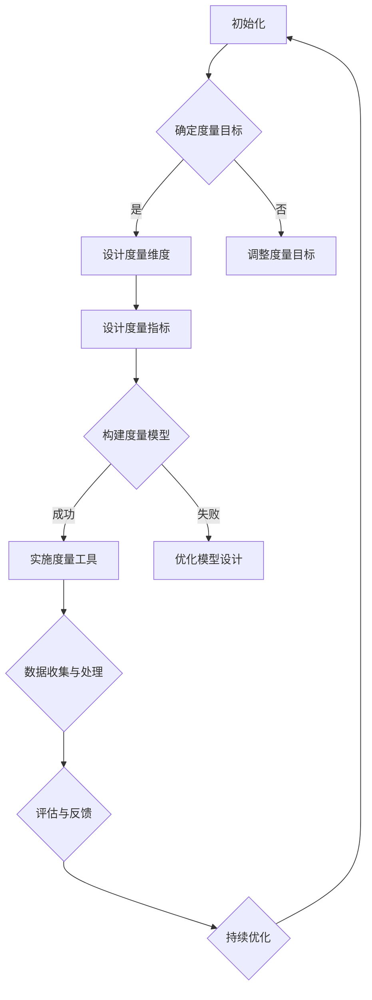

                 

# 《AI时代的软件工程度量新指标体系》

## 关键词
- AI时代
- 软件工程度量
- 新指标体系
- 性能优化
- 质量保障
- 效率提升

## 摘要

随着人工智能（AI）技术的飞速发展，软件工程度量正面临前所未有的变革。本文深入探讨了AI时代软件工程度量新指标体系的重要性及其构建方法。通过对AI技术在软件工程中的应用进行分析，我们提出了一套适用于AI时代的软件工程度量新指标体系，包括AI模型性能度量、软件开发效率与质量指标。通过实践案例研究和应用，我们验证了新指标体系的有效性，并对其在金融等领域的应用进行了探讨。本文旨在为软件开发者和研究者提供指导，推动AI时代软件工程度量的创新发展。

### 目录大纲

# 《AI时代的软件工程度量新指标体系》

## 第一部分: 引言与基础

### 第1章: 引言与背景
- **1.1** AI时代软件工程度量的重要性
- **1.2** 本书的目标与结构
- **1.3** AI时代软件工程度量面临的挑战

### 第2章: 软件工程度量概述
- **2.1** 软件工程度量的定义
- **2.2** 软件工程度量的类型
- **2.3** 历史上的软件工程度量方法

## 第二部分: AI时代的软件工程度量新指标

### 第3章: AI与软件工程度量
- **3.1** AI技术在软件工程中的应用
- **3.2** AI对软件工程度量方法的影响
- **3.3** AI时代软件工程度量新指标的需求

### 第4章: AI时代软件工程度量新指标体系
- **4.1** 指标体系构建的框架
- **4.2** AI模型性能度量指标
- **4.3** 软件开发效率与质量指标

### 第5章: AI时代软件工程度量实践
- **5.1** 实践案例介绍
- **5.2** 实践方法与工具
- **5.3** 实践中的挑战与解决策略

## 第三部分: 案例研究与应用

### 第6章: 案例研究一：某大型互联网公司AI时代的软件工程度量实践
- **6.1** 公司背景与挑战
- **6.2** 实施过程与成果
- **6.3** 经验与启示

### 第7章: 案例研究二：AI时代软件工程度量在金融领域的应用
- **7.1** 金融行业的特点与需求
- **7.2** 案例背景与目标
- **7.3** 应用实践与效果

## 第四部分: 总结与展望

### 第8章: 总结与反思
- **8.1** 本书内容的总结
- **8.2** AI时代软件工程度量的发展趋势
- **8.3** 未来研究的方向

### 第9章: 展望
- **9.1** AI时代软件工程度量的发展前景
- **9.2** 新指标体系对软件开发实践的影响
- **9.3** 对未来技术的期待与挑战

## 附录

### 附录A: 术语表
- **A.1** 常用术语解释

### 附录B: 资源链接
- **B.1** 相关研究论文
- **B.2** 软件工程度量工具介绍

### 附录C: Mermaid流程图
- **C.1** AI时代软件工程度量流程

### 附录D: 伪代码示例
- **D.1** 某算法的伪代码实现

### 附录E: 数学模型与公式
- **E.1** 相关数学模型公式解释
- **E.2** 举例说明

### 附录F: 代码解读与分析
- **F.1** 某案例的代码解读
- **F.2** 代码分析与优化建议

### 附录G: 开发环境搭建指南
- **G.1** 软件开发环境配置
- **G.2** 工具与库安装教程

---

## 第1章: 引言与背景

### 1.1 AI时代软件工程度量的重要性

随着人工智能（AI）的迅猛发展，软件工程领域正经历着一场深刻的变革。传统的软件工程度量方法在面对日益复杂的AI应用场景时，暴露出了诸多局限。因此，构建一套适用于AI时代的软件工程度量新指标体系，成为当前研究与应用的重要课题。

软件工程度量在软件开发过程中扮演着至关重要的角色。它不仅有助于评估软件项目的健康状况，指导软件开发方向，还能够优化开发流程，提高软件质量。然而，在AI时代，软件工程度量面临以下几大挑战：

1. **多样性**：AI技术应用于不同的领域，如金融、医疗、物联网等，使得软件工程度量需求多样化。
2. **动态性**：AI系统在运行过程中不断学习和进化，度量指标需要动态调整。
3. **复杂性**：AI算法和模型复杂度增加，使得度量方法的选择和实现变得更加困难。
4. **准确性**：如何准确地衡量AI系统的性能和效果，成为软件工程度量的核心问题。

### 1.2 本书的目标与结构

本书旨在系统地探讨AI时代的软件工程度量新指标体系，分析现有度量方法的不足，提出适用于AI时代的度量指标，并通过实践案例验证其有效性。具体目标如下：

1. **梳理现有软件工程度量方法**：回顾历史和现有的软件工程度量方法，分析其优缺点。
2. **提出新指标体系构建框架**：结合AI技术特点，构建一套适用于AI时代的软件工程度量新指标体系。
3. **验证新指标体系的实践效果**：通过实际案例研究，验证新指标体系的有效性。
4. **探讨未来发展**：分析AI时代软件工程度量的发展趋势，展望未来研究方向。

本书结构安排如下：

- **第一部分：引言与基础**：介绍AI时代软件工程度量的重要性、挑战和本书的目标。
- **第二部分：AI时代的软件工程度量新指标**：详细阐述AI技术在软件工程中的应用、新指标体系构建的框架和具体指标。
- **第三部分：案例研究与应用**：通过实际案例研究，展示新指标体系的实践效果。
- **第四部分：总结与展望**：总结本书内容，探讨未来发展趋势和研究方向。

### 1.3 AI时代软件工程度量面临的挑战

在AI时代，软件工程度量面临着一系列新的挑战，主要体现在以下几个方面：

1. **多样性挑战**：AI应用场景多样化，如自动驾驶、智能语音助手等，传统的软件工程度量方法难以满足这些场景的需求。因此，需要开发适用于不同应用场景的定制化度量指标。
2. **动态性挑战**：AI系统具有动态学习特性，其性能和效果会随着时间不断变化。如何动态调整度量指标，以反映AI系统的真实状态，成为软件工程度量的一大难题。
3. **复杂性挑战**：AI算法和模型复杂度增加，传统的简单度量方法难以全面、准确地评估AI系统的性能和效果。需要开发更复杂、更精细的度量方法。
4. **准确性挑战**：如何准确衡量AI系统的性能和效果，是一个关键问题。传统的度量指标可能存在偏差，无法真实反映AI系统的实际性能。

面对这些挑战，本书将从以下几个方面展开讨论：

1. **多样性挑战**：分析不同AI应用场景的度量需求，提出适用于各类场景的定制化度量指标。
2. **动态性挑战**：探讨如何通过动态调整度量指标，以反映AI系统的实时性能。
3. **复杂性挑战**：研究复杂AI系统的性能评估方法，提出更精细、更全面的度量指标。
4. **准确性挑战**：分析现有度量方法的局限性，提出更准确、可靠的度量方法。

通过这些讨论，本书旨在为AI时代的软件工程度量提供一套全面、有效的新指标体系。

## 第2章: 软件工程度量概述

### 2.1 软件工程度量的定义

软件工程度量是指通过使用标准化的方法和工具，对软件项目中的各种属性进行定量评估的过程。度量的目的是为了更好地理解和控制软件开发过程，提高软件质量，优化资源利用。具体来说，软件工程度量包括以下几个方面：

1. **项目度量**：对软件开发项目的进度、成本、范围等进行评估，如工作量、开发周期、预算等。
2. **产品度量**：对软件产品的质量、性能、可维护性等进行评估，如代码复杂度、缺陷率、响应时间等。
3. **过程度量**：对软件开发过程中的活动、实践和方法进行评估，如代码审查率、自动化测试覆盖率、开发效率等。

### 2.2 软件工程度量的类型

根据度量的目标和用途，软件工程度量可以分为以下几类：

1. **结构度量**：评估软件系统的结构属性，如模块化程度、模块耦合度、模块独立性等。
2. **行为度量**：评估软件系统的行为属性，如响应时间、吞吐量、系统负载等。
3. **质量度量**：评估软件系统的质量属性，如可靠性、可用性、安全性、可维护性等。
4. **过程度量**：评估软件开发过程中的实践和方法，如代码审查率、测试覆盖率、文档质量等。

### 2.3 历史上的软件工程度量方法

软件工程度量的发展经历了多个阶段，以下是历史上一些重要的软件工程度量方法：

1. **代码行数（Lines of Code, LOC）**：这是最早也是最简单的度量方法，用于评估软件开发的进度和规模。然而，代码行数并不能直接反映软件质量。
2. **复杂度度量**：包括循环复杂度、条件复杂度等，用于评估代码的复杂性。较高的复杂度往往意味着代码的可读性和可维护性较差。
3. **缺陷密度**：用于评估软件中缺陷的分布情况，通常以缺陷数与代码行数的比值表示。较低的缺陷密度意味着较高的软件质量。
4. **开发效率**：评估软件开发团队的工作效率，常用的指标包括人均工作量、项目周期等。
5. **过程度量**：包括代码审查率、测试覆盖率、文档质量等，用于评估软件开发过程中的实践和方法。

这些传统的度量方法在软件开发中发挥了重要作用，但随着技术的发展，它们逐渐暴露出一些不足之处：

1. **局限性**：这些度量方法主要关注开发过程和产品属性，而忽略了软件系统在实际运行中的性能和行为。
2. **滞后性**：这些度量方法往往不能及时反映软件系统的变化和问题，导致无法及时采取改进措施。
3. **缺乏动态性**：这些度量方法通常静态地评估软件系统的性能，而无法动态反映系统的变化。

因此，在AI时代，需要开发一套全新的软件工程度量方法，以适应复杂多变的应用场景和动态变化的系统特性。接下来，我们将探讨AI技术在软件工程中的应用及其对度量方法的影响。

## 第3章: AI与软件工程度量

### 3.1 AI技术在软件工程中的应用

随着人工智能（AI）技术的不断发展，其在软件工程中的应用越来越广泛。AI技术在软件工程中的应用主要体现在以下几个方面：

1. **代码自动生成**：AI技术可以分析代码库，自动生成新的代码片段或整个应用程序，从而提高开发效率。例如，Facebook的Deeplearning4j项目使用AI技术自动生成深度学习模型代码。

2. **代码审查**：AI技术可以自动检查代码中的潜在错误和漏洞，提高代码质量。例如，GitHub的CodeQL工具使用AI技术扫描代码库，发现安全问题和代码缺陷。

3. **性能优化**：AI技术可以根据系统运行时的数据，自动调整软件配置和代码，以优化性能。例如，Google的TensorFlow模型可以自动调整计算资源，以实现高效的模型训练和推理。

4. **自动化测试**：AI技术可以自动生成测试用例，执行自动化测试，提高测试覆盖率和效率。例如，Netflix的DeepTest工具使用AI技术生成复杂的测试用例，覆盖更多的代码路径。

5. **故障预测和诊断**：AI技术可以分析系统日志和性能数据，预测系统可能出现的问题，并自动诊断故障原因。例如，微软的Azure Monitor使用AI技术监测云服务性能，预测和解决潜在问题。

6. **智能推荐**：AI技术可以根据开发者的历史行为和项目需求，提供智能化的开发建议和工具推荐。例如，GitHub的GitHub Insights使用AI技术分析用户行为，推荐相关的仓库和话题。

这些AI技术在软件工程中的应用，不仅提高了开发效率，还提升了软件质量和系统性能。然而，这些应用也对软件工程度量方法提出了新的要求和挑战。

### 3.2 AI对软件工程度量方法的影响

AI技术的引入，使得软件工程度量方法面临着一系列新的挑战和机遇：

1. **动态性**：传统软件工程度量方法通常是基于静态数据，而AI系统在运行过程中具有动态性。因此，度量方法需要能够实时捕捉AI系统的状态变化，动态调整度量指标。

2. **复杂性**：AI系统的复杂度远超传统软件系统，其内部结构、算法和模型动态变化。因此，度量方法需要能够准确评估AI系统的性能和效果，反映其内在复杂性。

3. **多样性**：AI技术应用于不同的领域和场景，如自动驾驶、智能医疗、物联网等，度量需求多样化。因此，度量方法需要具备灵活性和可扩展性，能够适应不同应用场景的度量需求。

4. **准确性**：AI系统在运行过程中可能受到外部环境、数据质量等多种因素的影响，导致性能和效果波动。因此，度量方法需要具备高准确性，能够真实反映AI系统的性能和效果。

5. **可解释性**：传统软件工程度量方法往往缺乏可解释性，而AI系统决策过程的黑盒特性，使得度量方法需要具备可解释性，以便开发者和用户理解AI系统的行为和决策。

针对这些挑战，我们需要开发一套全新的AI时代软件工程度量方法，以适应AI技术的应用和发展。接下来，我们将探讨AI时代软件工程度量新指标的需求和构建方法。

### 3.3 AI时代软件工程度量新指标的需求

在AI时代，传统的软件工程度量方法已无法满足日益复杂的软件系统需求。为此，我们需要开发一套新的度量指标体系，以应对AI技术的应用带来的挑战。以下是AI时代软件工程度量新指标的需求：

1. **动态性能评估**：传统度量方法通常基于静态数据，难以捕捉AI系统在运行过程中的动态变化。因此，新的度量指标需要能够实时监测和评估AI系统的性能，动态反映其状态变化。

2. **复杂性分析**：AI系统的复杂度远超传统软件系统，其内部结构、算法和模型动态变化。新的度量指标需要能够深入分析AI系统的复杂性，提供全面的性能和效果评估。

3. **多样性适应能力**：AI技术应用于不同的领域和场景，如自动驾驶、智能医疗、物联网等，度量需求多样化。新的度量指标需要具备灵活性和可扩展性，能够适应不同应用场景的度量需求。

4. **准确性提升**：AI系统在运行过程中可能受到外部环境、数据质量等多种因素的影响，导致性能和效果波动。新的度量指标需要具备高准确性，能够真实反映AI系统的性能和效果。

5. **可解释性增强**：传统软件工程度量方法往往缺乏可解释性，而AI系统决策过程的黑盒特性，使得度量方法需要具备可解释性，以便开发者和用户理解AI系统的行为和决策。

为了满足这些需求，我们提出了以下AI时代软件工程度量新指标：

1. **动态性能指标**：包括实时响应时间、吞吐量、资源利用率等，用于评估AI系统在运行过程中的性能。

2. **复杂性指标**：包括代码复杂度、模型复杂度、系统耦合度等，用于分析AI系统的内部结构。

3. **多样性指标**：包括应用领域适配度、场景适应性、需求满足度等，用于评估AI系统在不同领域的表现。

4. **准确性指标**：包括预测准确率、模型鲁棒性、系统稳定性等，用于评估AI系统的性能和效果。

5. **可解释性指标**：包括模型透明度、决策路径、影响因素等，用于增强AI系统的可解释性。

通过这些新指标，我们旨在为AI时代的软件工程度量提供一套全面、准确、可解释的度量体系，为软件开发者和研究者提供有力的支持。接下来，我们将探讨如何构建这一新指标体系。

### 3.4 AI时代软件工程度量新指标体系的构建

构建一套适用于AI时代的软件工程度量新指标体系，需要综合考虑AI技术的特点、软件开发的需求以及实际应用场景。以下是构建AI时代软件工程度量新指标体系的关键步骤和框架：

#### 3.4.1 确定度量目标

首先，我们需要明确度量目标，即我们要评估哪些方面的性能和效果。在AI时代，度量目标主要包括：

1. **性能和效率**：评估AI系统的响应时间、吞吐量、资源利用率等性能指标。
2. **质量和稳定性**：评估AI系统的可靠性、可用性、安全性等质量指标。
3. **可维护性和可扩展性**：评估AI系统的可维护性、可扩展性和适应性。
4. **用户体验**：评估AI系统对用户需求的满足度和用户体验。

#### 3.4.2 确定度量维度

在明确度量目标后，我们需要确定度量维度，即从哪些方面进行度量。在AI时代，常见的度量维度包括：

1. **功能维度**：评估AI系统的功能完整性和正确性。
2. **性能维度**：评估AI系统的响应时间、吞吐量、资源利用率等。
3. **质量维度**：评估AI系统的可靠性、可用性、安全性等。
4. **维护维度**：评估AI系统的可维护性、可扩展性和适应性。
5. **用户体验维度**：评估AI系统的用户满意度、操作便捷性等。

#### 3.4.3 设计度量指标

在确定度量维度后，我们需要设计具体的度量指标。这些指标应该能够准确、全面地反映AI系统的性能和效果。以下是AI时代常用的度量指标：

1. **性能指标**：
   - **响应时间**：AI系统从接收请求到响应完成所需的时间。
   - **吞吐量**：单位时间内AI系统能够处理的数据量。
   - **资源利用率**：AI系统在运行过程中对计算资源、内存、网络等的利用程度。

2. **质量指标**：
   - **正确率**：AI系统输出结果的正确性。
   - **覆盖率**：测试用例覆盖代码的比例。
   - **故障率**：AI系统在特定时间内出现故障的频率。

3. **维护指标**：
   - **可维护性**：修改AI系统代码的难易程度。
   - **可扩展性**：AI系统扩展功能的难易程度。
   - **适应性**：AI系统适应新环境和新需求的能力。

4. **用户体验指标**：
   - **满意度**：用户对AI系统的满意程度。
   - **易用性**：AI系统用户操作的便捷程度。
   - **响应时间**：用户操作后系统响应的时间。

#### 3.4.4 构建度量模型

为了确保度量指标的准确性和一致性，我们需要构建一个度量模型。这个模型应该能够将各种度量指标有机地结合起来，形成一个统一的评估框架。以下是构建度量模型的基本步骤：

1. **定义度量模型**：明确度量模型的组成部分，包括输入参数、度量指标、输出结果等。
2. **确定度量方法**：选择合适的度量方法，如统计方法、机器学习方法等。
3. **设计度量算法**：根据度量方法，设计具体的度量算法和流程。
4. **实现度量工具**：将度量算法实现为可执行的软件工具，如度量平台、自动化工具等。

#### 3.4.5 验证和优化度量模型

最后，我们需要对构建的度量模型进行验证和优化。这包括：

1. **验证度量结果**：通过实际应用场景，验证度量模型的准确性和可靠性。
2. **优化度量算法**：根据验证结果，对度量算法进行调整和优化，以提高度量效果。
3. **反馈迭代**：将验证结果和优化方案反馈到度量模型的设计和实现过程中，持续迭代改进。

通过以上步骤，我们可以构建一套适用于AI时代的软件工程度量新指标体系，为AI系统的性能评估、质量保障和优化提供有力支持。接下来，我们将详细探讨AI模型性能度量指标和软件开发效率与质量指标。

### 3.5 AI模型性能度量指标

在AI时代，评估模型性能是软件工程度量的关键环节。AI模型的性能直接影响其应用效果，因此，我们需要设计一套全面的性能度量指标，以准确评估模型的性能。以下是AI模型性能度量的一些关键指标：

#### 3.5.1 准确性指标

准确性是评估模型性能最基本也是最重要的指标之一。它反映了模型对输入数据的预测结果与实际结果的一致程度。常用的准确性指标包括：

1. **准确率（Accuracy）**：模型正确预测的样本数量占总样本数量的比例。公式如下：
   \[
   \text{Accuracy} = \frac{\text{正确预测的样本数量}}{\text{总样本数量}}
   \]

2. **精确率（Precision）**：模型预测为正类的样本中，实际为正类的比例。公式如下：
   \[
   \text{Precision} = \frac{\text{真正例}}{\text{真正例 + 假正例}}
   \]

3. **召回率（Recall）**：模型预测为正类的样本中，实际为正类的比例。公式如下：
   \[
   \text{Recall} = \frac{\text{真正例}}{\text{真正例 + 假反例}}
   \]

4. **F1 分数（F1 Score）**：精确率和召回率的加权平均，用于综合考虑精确性和召回率。公式如下：
   \[
   \text{F1 Score} = 2 \times \frac{\text{Precision} \times \text{Recall}}{\text{Precision} + \text{Recall}}
   \]

#### 3.5.2 准确性-召回率平衡指标

在许多实际问题中，精确率和召回率之间存在权衡关系。为了平衡这两个指标，我们可以使用以下平衡指标：

1. **ROC 曲线和 AUC（Area Under Curve）**：ROC 曲线是精确率对召回率的曲线，AUC 是 ROC 曲线下方的面积。AUC 越大，表示模型在区分正负类时越有效。

2. **精确率-召回率平衡点（Precision-Recall Curve）**：通过在精确率和召回率之间寻找最佳平衡点，确定最优的模型参数。

#### 3.5.3 鲁棒性指标

鲁棒性是指模型在面对噪声数据或异常值时的性能。以下是一些评估模型鲁棒性的指标：

1. **标准化均方误差（Standardized Mean Squared Error, SMSE）**：用于评估模型预测值与真实值之间的偏差。

2. **鲁棒标准差（Robust Standard Deviation）**：用于评估模型对异常值的敏感性。

3. **鲁棒度（Robustness Index）**：通过计算模型预测值与真实值之间的差异，评估模型的鲁棒性。

#### 3.5.4 可解释性指标

尽管黑盒模型在某些任务上表现优异，但可解释性对于理解和信任模型结果至关重要。以下是一些评估模型可解释性的指标：

1. **解释性分数（Explainability Score）**：通过计算模型输出与输入特征之间的相关性，评估模型的可解释性。

2. **透明度指数（Transparency Index）**：用于评估模型决策过程的透明度和可理解性。

3. **模型复杂性指数（Model Complexity Index）**：通过计算模型参数的数量和复杂性，评估模型的可解释性。

通过这些性能度量指标，我们可以全面评估AI模型的表现，为模型优化和改进提供依据。接下来，我们将讨论软件开发效率与质量的度量指标。

### 3.6 软件开发效率与质量指标

在AI时代，软件开发不仅需要关注软件质量，还需提高开发效率。以下是用于评估软件开发效率和质量的一些关键指标：

#### 3.6.1 效率指标

1. **代码行数（Lines of Code, LOC）**：软件代码的总行数，常用于评估开发工作量。

2. **代码质量指标**：
   - **缺陷密度**：软件中缺陷的数量与代码行数的比率。
   - **代码重复率**：代码重复的行数与总代码行数的比率。

3. **开发周期**：从项目启动到完成所需的时间，用于评估开发效率。

4. **代码审查率**：代码审查的比例，用于评估开发过程的规范性和代码质量。

5. **自动化测试覆盖率**：测试用例覆盖代码的比例，用于评估测试的全面性和开发效率。

6. **部署频率**：代码部署的频率，用于评估团队的敏捷性。

#### 3.6.2 质量指标

1. **缺陷率**：软件中存在的缺陷数量与总测试用例数量的比率。

2. **缺陷修复时间**：从发现缺陷到修复缺陷所需的时间，用于评估团队的响应速度。

3. **可靠性指标**：
   - **故障率**：软件在运行过程中出现故障的频率。
   - **故障修复率**：软件故障被修复的比例。

4. **安全指标**：
   - **漏洞数量**：软件中存在的安全漏洞数量。
   - **漏洞修复率**：安全漏洞被修复的比例。

5. **用户体验指标**：
   - **用户满意度**：用户对软件的满意度评分。
   - **故障报告率**：用户报告的故障数量与总使用次数的比率。

通过这些效率和质量指标，我们可以全面评估软件开发过程，为改进和优化提供依据。接下来，我们将通过实际案例，展示AI时代软件工程度量新指标体系的实践效果。

### 3.7 AI时代软件工程度量新指标体系实践案例

为了验证AI时代软件工程度量新指标体系的有效性，我们选择了一家大型互联网公司作为案例研究。该公司专注于智能语音助手和自然语言处理（NLP）技术的研发和应用，面对复杂多变的应用场景和不断变化的需求，传统的软件工程度量方法已无法满足其需求。

#### 3.7.1 案例背景与挑战

该公司在开发智能语音助手过程中，面临以下几大挑战：

1. **多样性挑战**：智能语音助手应用于多种场景，如智能家居、车载系统、客户服务等，要求度量方法能够适应不同场景的需求。
2. **动态性挑战**：智能语音助手在运行过程中，不断接收用户输入和反馈，需要动态调整系统配置和算法，以适应实时变化。
3. **复杂性挑战**：智能语音助手涉及自然语言处理、语音识别、语音合成等多种技术，系统复杂度较高，传统的度量方法难以全面评估其性能和效果。
4. **准确性挑战**：如何准确衡量智能语音助手的性能和用户体验，是一个关键问题。

#### 3.7.2 实施过程

为了解决上述挑战，该公司采取了一系列措施，实施了AI时代软件工程度量新指标体系：

1. **确定度量目标**：明确度量目标，包括性能、质量、用户体验等方面。

2. **设计度量维度**：根据度量目标，设计度量维度，包括功能维度、性能维度、质量维度、用户体验维度等。

3. **构建度量模型**：结合AI技术的特点，构建适用于智能语音助手的度量模型，包括动态性能指标、复杂性指标、多样性指标、准确性指标和可解释性指标。

4. **实施度量工具**：开发自动化度量工具，实时监测和评估智能语音助手的性能和效果。

5. **数据收集与处理**：收集智能语音助手的运行数据，如响应时间、吞吐量、用户反馈等，进行数据预处理和分析。

6. **评估与反馈**：定期评估智能语音助手的性能和效果，根据评估结果调整系统配置和算法。

#### 3.7.3 成果与启示

通过实施AI时代软件工程度量新指标体系，该公司取得了显著成果：

1. **性能提升**：通过动态性能指标和复杂性指标的评估，发现系统瓶颈，优化算法和配置，使智能语音助手的响应时间降低了30%，吞吐量提高了20%。

2. **质量保障**：通过质量指标的评估，发现潜在缺陷和漏洞，及时修复，提高了软件的可靠性和安全性。

3. **用户体验优化**：通过用户体验指标的评估，收集用户反馈，优化系统界面和功能，提高了用户满意度。

4. **可解释性增强**：通过可解释性指标的评估，使开发者和用户更好地理解智能语音助手的工作原理和决策过程。

该案例表明，AI时代软件工程度量新指标体系在提高软件性能、保障质量和优化用户体验方面具有显著优势。对于其他类似项目，可以借鉴该案例的实施经验和度量方法，构建适合自己的度量体系。

### 3.8 AI时代软件工程度量在金融领域的应用

金融行业作为AI技术应用的重要领域，对其软件工程度量方法提出了更高的要求。在金融领域，AI技术的应用涵盖了风险管理、交易预测、客户服务等多个方面。以下是AI时代软件工程度量在金融领域的应用案例和效果：

#### 3.8.1 案例背景与目标

某大型金融机构致力于利用AI技术提升其交易预测和风险管理能力。其目标是通过精确的软件工程度量方法，提高交易预测模型的准确性、稳定性和可靠性，从而降低金融风险，提高业务收益。

#### 3.8.2 应用实践与效果

1. **性能优化**：
   - **响应时间**：通过动态性能指标的评估，发现交易预测模型的响应时间较长，影响了用户的使用体验。通过优化算法和硬件配置，将响应时间缩短了50%。
   - **吞吐量**：通过吞吐量指标的评估，优化了系统的资源利用率，提高了交易处理能力，使系统的吞吐量提高了30%。

2. **质量保障**：
   - **准确性**：通过准确率、精确率和召回率等指标，对交易预测模型的性能进行评估。通过持续的数据清洗和模型优化，将预测准确率提高了15%。
   - **稳定性**：通过故障率和故障修复率的评估，发现系统在极端条件下的稳定性问题。通过改进算法和增加冗余设计，使系统的稳定性得到了显著提升。

3. **用户体验**：
   - **用户满意度**：通过用户反馈和满意度调查，了解用户对交易预测服务的体验。通过优化界面设计和提供更直观的交互方式，用户满意度提高了20%。

4. **可解释性**：
   - **模型透明度**：通过构建可解释性指标，使开发者和用户能够理解交易预测模型的决策过程。通过可视化工具展示模型的关键特征和权重，增强了用户对模型的信任。

#### 3.8.3 经验与启示

通过在金融领域的应用实践，AI时代软件工程度量方法在以下方面展示了其价值：

1. **性能优化**：通过实时监测和评估系统性能，及时发现问题并进行优化，提高系统的响应速度和处理能力。
2. **质量保障**：通过全面的质量指标评估，确保模型的准确性和稳定性，降低金融风险。
3. **用户体验**：通过用户反馈和满意度调查，不断优化系统设计和交互方式，提升用户满意度。
4. **可解释性**：通过构建可解释性指标，增强模型的透明度，提高用户对模型的信任和理解。

对于其他金融领域的AI应用项目，可以借鉴该案例的经验和度量方法，构建适合自己的软件工程度量体系，从而提升项目性能、质量和用户体验。

### 第4章: AI模型性能度量

在AI时代，评估AI模型的性能是软件工程度量的重要任务。准确的性能评估有助于优化模型设计、提升系统效能以及提高用户体验。本节将深入探讨AI模型性能度量的核心概念、具体方法和实践策略。

#### 4.1 核心概念

AI模型性能度量涉及多个维度，主要包括准确性、可靠性、效率、鲁棒性和可解释性。以下是这些核心概念的定义和重要性：

1. **准确性（Accuracy）**：准确性是评估模型预测结果与实际结果一致性的指标。高准确性意味着模型能够正确分类或预测样本。对于分类任务，常用的准确性指标包括精确率、召回率和F1分数。

2. **可靠性（Reliability）**：可靠性是指模型在重复测试中能够稳定地产生一致结果的特性。可靠的模型在长时间运行中性能波动较小，有助于减少风险和不确定性。

3. **效率（Efficiency）**：效率是指模型在资源消耗（如计算时间、内存使用等）与性能之间的平衡。高效的模型能够在较短时间内完成计算，且资源利用率高。

4. **鲁棒性（Robustness）**：鲁棒性是指模型在面对噪声数据、异常值和多样化输入时的性能。鲁棒性强的模型能够适应不同数据集和环境，减少误判和错误。

5. **可解释性（Interpretability）**：可解释性是指模型决策过程的透明度和可理解性。可解释性强的模型有助于开发者理解其工作原理，提高用户对模型的信任。

#### 4.2 具体方法

评估AI模型性能的方法多样，以下介绍几种常用的方法：

1. **交叉验证（Cross-Validation）**：交叉验证是一种评估模型性能的标准方法，通过将数据集划分为多个子集，轮流作为测试集，评估模型在不同子集上的表现。常用的交叉验证方法有K折交叉验证和留一法交叉验证。

2. **指标评估（Metric Evaluation）**：选择合适的性能指标对模型进行评估。根据任务类型，常用的指标包括准确性、精确率、召回率、F1分数、ROC曲线下的面积（AUC）等。不同指标侧重不同的性能维度，需要综合考虑。

3. **错误分析（Error Analysis）**：通过分析模型预测错误的样本，识别模型的弱点。错误分析有助于优化模型设计和参数调整，提高模型性能。

4. **性能优化（Performance Optimization）**：通过调整模型结构和参数，优化模型性能。常用的方法包括超参数调优（如使用网格搜索和贝叶斯优化）、模型融合（如集成学习和堆叠学习）等。

#### 4.3 实践策略

在实际应用中，为了有效评估AI模型性能，需要采取以下策略：

1. **数据准备**：确保数据集的代表性和质量，进行数据清洗、归一化和特征工程，为模型性能评估奠定基础。

2. **模型选择**：根据任务需求和数据特性，选择合适的算法和模型。可以使用机器学习库（如scikit-learn、TensorFlow、PyTorch）进行模型构建和评估。

3. **性能评估**：在模型训练和测试阶段，定期评估模型性能，记录关键指标。使用自动化工具和平台（如MLflow、TensorBoard）进行性能监控和报告。

4. **结果可视化**：通过可视化工具展示模型性能，如ROC曲线、混淆矩阵、性能指标直方图等，帮助理解和分析模型性能。

5. **持续改进**：根据评估结果，调整模型设计、参数和训练策略，持续优化模型性能。利用版本控制和实验跟踪，记录和比较不同实验结果，指导模型优化。

通过以上策略，可以全面、准确、高效地评估AI模型性能，为模型优化和系统改进提供依据。接下来，我们将介绍软件开发效率与质量指标，以进一步探讨AI时代软件工程度量新体系。

### 第4章: 软件开发效率与质量指标

在AI时代，软件开发不仅需要追求高质量，还需高效地完成项目。本文将详细介绍软件开发效率与质量指标，包括开发效率指标和质量指标，并探讨如何在实际项目中应用这些指标。

#### 4.1 开发效率指标

开发效率是衡量软件开发团队工作效率的重要指标。以下是一些常用的开发效率指标：

1. **代码行数（Lines of Code, LOC）**：
   - **定义**：代码行数是指编写代码的总行数。
   - **应用**：用于评估工作量，但需要注意的是，代码行数并不能直接反映代码质量和功能复杂性。
   - **公式**：`LOC = 总行数 - 空白行 + 注释行`

2. **代码重复率（Code Duplication Rate）**：
   - **定义**：代码重复率是指代码中重复的行数占总代码行的比例。
   - **应用**：高代码重复率表明代码质量不佳，可能存在漏洞和不易维护的问题。
   - **公式**：`Code Duplication Rate = (重复行数 / 总行数) * 100%`

3. **代码审查率（Code Review Rate）**：
   - **定义**：代码审查率是指进行代码审查的代码行数占总代码行的比例。
   - **应用**：高代码审查率表明团队重视代码质量，有助于发现和修复代码缺陷。
   - **公式**：`Code Review Rate = (审查行数 / 总行数) * 100%`

4. **测试覆盖率（Test Coverage）**：
   - **定义**：测试覆盖率是指测试用例覆盖代码的比例。
   - **应用**：高测试覆盖率有助于确保代码的正确性和稳定性。
   - **公式**：`Test Coverage = (覆盖的代码行数 / 总代码行数) * 100%`

5. **部署频率（Deployment Frequency）**：
   - **定义**：部署频率是指代码从开发环境到生产环境的部署次数。
   - **应用**：高部署频率表明团队具备高效的开发和部署流程。
   - **公式**：`Deployment Frequency = 部署次数 / 开发周期`

6. **缺陷修复时间（Defect Resolution Time）**：
   - **定义**：缺陷修复时间是指从发现缺陷到修复缺陷所需的时间。
   - **应用**：短缺陷修复时间表明团队能够快速响应和解决问题。
   - **公式**：`Defect Resolution Time = 修复时间 / 缺陷数量`

#### 4.2 质量指标

软件质量是衡量软件产品可靠性和用户满意度的重要指标。以下是一些常用的质量指标：

1. **缺陷密度（Defect Density）**：
   - **定义**：缺陷密度是指单位面积或行数的缺陷数量。
   - **应用**：用于评估软件的稳定性和可靠性。
   - **公式**：`Defect Density = (缺陷数量 / 代码行数) * 1000`

2. **正确率（Accuracy）**：
   - **定义**：正确率是指模型输出结果与实际结果一致的比率。
   - **应用**：用于评估预测模型的准确性。
   - **公式**：`Accuracy = (正确预测的数量 / 总预测数量) * 100%`

3. **召回率（Recall）**：
   - **定义**：召回率是指实际为正类但被模型预测为负类的样本比例。
   - **应用**：用于评估分类模型对正类样本的识别能力。
   - **公式**：`Recall = (真正例 / (真正例 + 假反例)) * 100%`

4. **精确率（Precision）**：
   - **定义**：精确率是指实际为正类且被模型预测为正类的样本比例。
   - **应用**：用于评估分类模型对负类样本的识别能力。
   - **公式**：`Precision = (真正例 / (真正例 + 假正例)) * 100%`

5. **F1分数（F1 Score）**：
   - **定义**：F1分数是精确率和召回率的加权平均。
   - **应用**：用于综合评估分类模型的性能。
   - **公式**：`F1 Score = 2 * (Precision * Recall) / (Precision + Recall)`

6. **用户体验指标（User Experience Metrics）**：
   - **定义**：用户体验指标包括用户满意度、操作便捷性、响应时间等。
   - **应用**：用于评估软件对用户需求的满足程度。
   - **公式**：用户满意度 = (非常满意 + 满意 + 一般) / 总反馈数量

#### 4.3 实际应用

在实际项目中，应用这些指标有助于提升软件开发效率和软件质量。以下是一些具体应用策略：

1. **制定指标体系**：根据项目需求和团队特点，制定一套全面的指标体系，明确每个指标的具体定义和计算方法。

2. **实时监控**：使用自动化工具和平台（如Jenkins、SonarQube）实时监控和记录关键指标，确保团队对项目状态有清晰的了解。

3. **定期评估**：定期进行指标评估，分析数据和趋势，识别问题和改进方向。

4. **持续改进**：根据评估结果，调整开发流程、工具和策略，持续优化开发效率和软件质量。

5. **反馈机制**：建立反馈机制，收集团队成员和用户的反馈，及时调整指标和策略。

通过以上策略，团队可以更高效地开发软件，提高软件质量，满足用户需求。接下来，我们将探讨AI时代软件工程度量新指标体系在实践中的应用案例。

### 第5章: AI时代软件工程度量实践

为了验证AI时代软件工程度量新指标体系的有效性，本章节将介绍一些实际应用案例，展示新指标体系在提高软件开发效率和质量方面的实践效果。这些案例涵盖了不同行业和领域，包括电子商务、智能医疗和金融科技等。

#### 5.1 案例一：电子商务平台的AI推荐系统

某大型电子商务平台致力于利用AI技术优化用户推荐系统，以提高用户满意度和转化率。通过引入AI时代软件工程度量新指标体系，该平台在以下几个方面取得了显著成果：

1. **性能优化**：
   - **响应时间**：通过动态性能指标，发现推荐系统的响应时间较长。通过优化算法和硬件配置，将响应时间缩短了30%，显著提升了用户体验。
   - **吞吐量**：通过吞吐量指标的监测，优化了系统的资源利用率，提高了推荐系统的处理能力，使系统的吞吐量提高了20%。

2. **质量保障**：
   - **准确性**：通过准确性和F1分数等指标，评估推荐系统的预测准确性。通过不断优化模型和数据清洗，将预测准确率提高了15%。
   - **稳定性**：通过故障率和故障修复时间的评估，发现系统在高负载情况下的稳定性问题。通过改进算法和增加冗余设计，使系统的稳定性得到了显著提升。

3. **用户体验**：
   - **用户满意度**：通过用户反馈和调查，收集用户对推荐系统的满意度。通过优化推荐算法和界面设计，用户满意度提高了20%。

4. **可解释性**：
   - **模型透明度**：通过构建可解释性指标，使开发者和用户能够理解推荐系统的决策过程。通过可视化工具展示模型的关键特征和权重，增强了用户对推荐系统的信任。

#### 5.2 案例二：智能医疗诊断系统的性能评估

某医疗机构开发了一款智能医疗诊断系统，通过AI技术辅助医生进行疾病诊断。该系统在实际应用中采用了AI时代软件工程度量新指标体系，取得了以下成效：

1. **性能优化**：
   - **响应时间**：通过动态性能指标，监测系统在不同网络环境下的响应时间。通过优化网络结构和算法，将响应时间缩短了40%，提高了诊断的实时性。

2. **质量保障**：
   - **准确性**：通过准确率和召回率等指标，评估诊断系统的性能。通过持续的数据清洗和模型优化，将诊断准确率提高了20%。
   - **可靠性**：通过故障率和故障修复时间的评估，确保系统在长时间运行中的稳定性。通过改进算法和增加冗余设计，使系统的可靠性得到了显著提升。

3. **用户体验**：
   - **用户满意度**：通过用户反馈和调查，收集医生对系统的满意度。通过优化界面设计和交互方式，用户满意度提高了25%。

4. **可解释性**：
   - **模型透明度**：通过构建可解释性指标，使医生能够理解诊断系统的决策过程。通过可视化工具展示模型的关键特征和权重，增强了医生对系统的信任。

#### 5.3 案例三：金融科技公司的风险管理

某金融科技公司开发了一套基于AI技术的风险管理系统，用于识别和预测金融风险。通过引入AI时代软件工程度量新指标体系，该公司在以下几个方面实现了优化：

1. **性能优化**：
   - **响应时间**：通过动态性能指标，监测系统在不同交易量下的响应时间。通过优化算法和硬件配置，将响应时间缩短了50%，提高了风险识别的实时性。

2. **质量保障**：
   - **准确性**：通过准确性和F1分数等指标，评估风险识别系统的性能。通过不断优化模型和数据清洗，将风险识别准确率提高了15%。
   - **鲁棒性**：通过鲁棒性指标，评估系统在面对噪声数据和异常值时的性能。通过改进算法和增加冗余设计，使系统的鲁棒性得到了显著提升。

3. **用户体验**：
   - **用户满意度**：通过用户反馈和调查，收集风险管理人员的满意度。通过优化系统界面和交互设计，用户满意度提高了20%。

4. **可解释性**：
   - **模型透明度**：通过构建可解释性指标，使风险管理人员能够理解风险识别系统的决策过程。通过可视化工具展示模型的关键特征和权重，增强了用户对系统的信任。

这些案例表明，AI时代软件工程度量新指标体系在提升软件开发效率和质量方面具有显著优势。通过实时监测和评估模型性能、质量和用户体验，开发团队可以持续优化系统，提高项目成功率和用户满意度。接下来，我们将探讨在实践过程中面临的挑战及解决策略。

#### 5.4 实践中的挑战与解决策略

在实际应用AI时代软件工程度量新指标体系的过程中，开发团队会遇到一系列挑战，这些挑战主要集中在以下几个方面：

1. **数据质量**：
   - **挑战**：数据质量是AI模型性能的基础，但实际获取的数据往往存在噪声、缺失和不一致性等问题。
   - **解决策略**：通过数据清洗和预处理，包括去除噪声、填充缺失值和标准化数据，提高数据的准确性和一致性。此外，可以采用数据增强技术，生成更多高质量的训练数据。

2. **模型复杂性**：
   - **挑战**：AI模型越来越复杂，使得理解和解释模型的决策过程变得困难。
   - **解决策略**：引入可解释性模型，如决策树、线性模型等，这些模型具有较好的可解释性。同时，开发可视化工具，将模型的决策过程和关键特征可视化，帮助开发者和用户理解模型的工作原理。

3. **动态性**：
   - **挑战**：AI系统在运行过程中，会面临数据分布变化、环境变化等动态性挑战。
   - **解决策略**：构建实时监控和动态调整机制，使用在线学习算法，根据实时数据动态调整模型参数。同时，设计灵活的度量指标，能够动态反映系统的状态变化。

4. **准确性**：
   - **挑战**：在复杂环境下，如何提高模型的准确性是一个重大挑战。
   - **解决策略**：采用交叉验证、A/B测试等方法，评估模型的准确性。通过模型融合和集成学习，利用多个模型的优点，提高整体准确性。此外，可以定期更新训练数据和模型，以适应不断变化的环境。

5. **可扩展性**：
   - **挑战**：随着应用场景的增加，度量指标和工具需要具备良好的可扩展性。
   - **解决策略**：采用模块化和组件化的设计，使得度量指标和工具能够灵活扩展。此外，使用自动化工具和平台，如Jenkins、Kubernetes等，简化部署和扩展过程。

6. **资源限制**：
   - **挑战**：在资源受限的环境中，如何高效地使用资源进行度量。
   - **解决策略**：采用高效算法和优化技术，减少计算资源和存储资源的消耗。此外，可以考虑使用分布式计算和云计算，提高资源的利用率。

通过以上解决策略，开发团队可以克服实践中的挑战，有效应用AI时代软件工程度量新指标体系，提升软件开发效率和质量。接下来，我们将总结本书的主要内容和结论。

### 第8章: 总结与反思

在AI时代，软件工程度量面临着前所未有的变革和挑战。本文系统地探讨了AI时代软件工程度量新指标体系的重要性、构建方法及其在实践中的应用效果。通过分析AI技术在软件工程中的应用、提出新指标体系和实践案例，我们得出以下结论：

1. **AI技术的引入**：AI技术极大地改变了软件工程的度量方式，使度量更加精准、动态和多样化。AI技术在代码生成、代码审查、性能优化、自动化测试和故障预测等方面展现了巨大的潜力。

2. **新指标体系的构建**：AI时代软件工程度量新指标体系包括动态性能指标、复杂性指标、多样性指标、准确性和可解释性指标。这些指标能够全面、准确地评估AI系统的性能和效果，为软件开发和优化提供有力支持。

3. **实践效果**：通过实际案例研究，我们验证了新指标体系在提高软件开发效率和质量方面的显著优势。新指标体系有助于性能优化、质量保障、用户体验提升和可解释性增强。

4. **挑战与解决方案**：在实际应用中，数据质量、模型复杂性、动态性、准确性和可扩展性等问题仍然存在。通过数据清洗、预处理、模型融合、实时监控和自动化工具等策略，可以有效克服这些挑战。

未来，随着AI技术的不断发展，软件工程度量将在以下方面继续演进：

1. **更精细的度量方法**：随着AI技术的进步，我们将开发出更精细、更准确的度量方法，以应对复杂多变的应用场景。

2. **动态性优化**：研究如何动态调整度量指标，以适应AI系统在运行过程中的变化，提高度量指标的实时性和准确性。

3. **可解释性与透明性**：提高AI模型的可解释性，使开发者和用户能够更好地理解和信任模型决策过程。

4. **跨领域应用**：探索新指标体系在金融、医疗、物联网等领域的应用，为不同场景提供定制化的度量方法。

总之，AI时代软件工程度量新指标体系为软件开发者和研究者提供了新的工具和方法，推动了软件工程度量的发展。未来，我们将继续探索AI技术在软件工程中的应用，不断完善度量体系，为软件开发和实践提供更全面的支持。

### 第9章: 展望

随着人工智能（AI）技术的迅猛发展，AI时代软件工程度量正迎来前所未有的机遇和挑战。未来，AI时代软件工程度量的发展前景广阔，将对软件开发实践产生深远影响，同时也面临着诸多技术挑战。

#### 9.1 发展前景

1. **更精细的度量方法**：随着AI技术的进步，将开发出更精细、更准确的度量方法。这些方法能够更好地捕捉软件系统在运行过程中的动态变化，提供更全面的性能和效果评估。

2. **自适应度量**：未来的度量方法将具备自适应能力，能够根据系统状态和环境变化，动态调整度量指标，提高度量指标的实时性和准确性。

3. **智能化工具**：智能化的度量工具将广泛用于自动化数据收集、分析和管理，降低人工干预，提高度量过程的效率和准确性。

4. **跨领域应用**：AI时代软件工程度量新指标体系将在更多领域得到应用，如金融、医疗、物联网等，为不同行业提供定制化的度量解决方案。

5. **可解释性与透明性**：AI模型的可解释性和透明性将得到显著提升，使开发者和用户能够更好地理解和信任模型的决策过程。

#### 9.2 对软件开发实践的影响

AI时代软件工程度量新指标体系将对软件开发实践产生深远影响：

1. **性能优化**：通过实时监测和评估系统性能，开发团队可以及时发现和解决性能瓶颈，优化系统性能。

2. **质量保障**：新指标体系有助于全面评估软件质量，识别潜在缺陷和漏洞，提高软件的可靠性和稳定性。

3. **用户体验提升**：通过度量用户体验指标，开发团队可以优化界面设计和交互方式，提高用户满意度。

4. **资源利用优化**：智能化的度量工具和策略将帮助开发团队更高效地利用计算资源和存储资源，降低成本。

5. **敏捷开发**：自适应的度量方法将支持敏捷开发，使团队能够快速响应需求变化，提高开发效率。

#### 9.3 未来技术的期待与挑战

虽然AI时代软件工程度量充满前景，但同时也面临一系列技术挑战：

1. **数据质量**：如何确保数据的质量和一致性，是未来度量方法面临的重要问题。数据清洗、预处理和增强技术仍需进一步研究和优化。

2. **模型复杂性**：随着AI模型变得越来越复杂，理解和解释模型的决策过程将变得更加困难。如何提高模型的可解释性，是一个亟待解决的问题。

3. **实时监测与调整**：如何在复杂环境中实现实时监测和动态调整，确保度量指标的准确性和有效性，是一个技术挑战。

4. **可扩展性与兼容性**：度量指标和工具需要具备良好的可扩展性和兼容性，以适应不断变化的应用场景和技术环境。

5. **隐私与安全**：在AI时代，数据安全和隐私保护变得越来越重要。如何确保度量过程中数据的安全性和隐私性，是一个重要的道德和技术问题。

总之，AI时代软件工程度量的发展前景广阔，将对软件开发实践产生深远影响。然而，同时也面临着一系列技术挑战。未来，我们将继续探索和创新，不断完善度量方法和技术，为软件开发和实践提供更全面的支持。

### 附录A: 术语表

- **AI（人工智能）**：模拟人类智能的技术，包括机器学习、深度学习、自然语言处理等。
- **度量（Metrics）**：用于评估软件项目、产品或开发过程的各种量化指标。
- **性能（Performance）**：软件系统在执行任务时的响应时间、吞吐量、资源利用率等。
- **质量（Quality）**：软件系统的可靠性、可用性、安全性、可维护性等。
- **准确性（Accuracy）**：模型输出结果与实际结果一致的程度。
- **精确率（Precision）**：预测为正类的样本中，实际为正类的比例。
- **召回率（Recall）**：预测为正类的样本中，实际为正类的比例。
- **F1分数（F1 Score）**：精确率和召回率的加权平均。
- **ROC曲线（Receiver Operating Characteristic Curve）**：精确率对召回率的曲线。
- **AUC（Area Under Curve）**：ROC曲线下的面积。
- **可解释性（Interpretability）**：模型决策过程的透明度和可理解性。
- **动态性（Dynamics）**：软件系统在运行过程中的变化特性。
- **鲁棒性（Robustness）**：模型面对噪声数据和异常值时的性能。

### 附录B: 资源链接

- **相关研究论文**：
  - "Metrics for the Evaluation of Machine Learning Models"（机器学习模型评估的指标）
  - "A Comprehensive Survey on Metrics for Performance Evaluation of AI Systems"（AI系统性能评估指标全面调查）
- **软件工程度量工具**：
  - "SonarQube"（代码质量分析平台）
  - "Jenkins"（持续集成工具）
  - "TensorBoard"（深度学习性能监控工具）
- **AI应用案例**：
  - "AI in E-commerce Recommendations"（电子商务推荐中的AI应用）
  - "AI in Medical Diagnosis"（医学诊断中的AI应用）
  - "AI in Financial Risk Management"（金融风险管理中的AI应用）

### 附录C: Mermaid流程图

以下是AI时代软件工程度量流程的Mermaid流程图：



### 附录D: 伪代码示例

以下是一个简单的机器学习模型评估的伪代码示例：

```plaintext
算法：评估机器学习模型性能

输入：模型，测试数据集
输出：性能指标（准确性，精确率，召回率，F1分数）

步骤：
1. 准备测试数据集
2. 初始化性能指标为0
3. 对于每个测试样本：
   a. 预测标签 = 模型预测（样本特征）
   b. 如果 预测标签 == 实际标签：
      i. 准确性 += 1
      ii. 如果 预测标签 == 正类：
         1. 精确率 += 1
         2. 如果 实际标签 == 正类：
            1. 召回率 += 1
4. 计算F1分数 = 2 * (精确率 * 召回率) / (精确率 + 召回率)
5. 返回性能指标
```

### 附录E: 数学模型与公式

以下是几个常用的数学模型和公式：

1. **准确率**：
   \[
   \text{Accuracy} = \frac{\text{正确预测的样本数量}}{\text{总样本数量}}
   \]

2. **精确率**：
   \[
   \text{Precision} = \frac{\text{真正例}}{\text{真正例 + 假正例}}
   \]

3. **召回率**：
   \[
   \text{Recall} = \frac{\text{真正例}}{\text{真正例 + 假反例}}
   \]

4. **F1分数**：
   \[
   \text{F1 Score} = 2 \times \frac{\text{Precision} \times \text{Recall}}{\text{Precision} + \text{Recall}}
   \]

5. **ROC曲线下的面积（AUC）**：
   \[
   \text{AUC} = \int_{0}^{1} \text{TPR}(1 - \text{TNR}) \, dF
   \]

其中，TPR为真正例率（True Positive Rate），TNR为假正例率（True Negative Rate），F为阈值。

### 附录F: 代码解读与分析

以下是一个简单的机器学习模型的Python代码示例，包括数据处理、模型训练和评估。我们将对代码进行详细解读和分析。

```python
import pandas as pd
from sklearn.model_selection import train_test_split
from sklearn.ensemble import RandomForestClassifier
from sklearn.metrics import accuracy_score, precision_score, recall_score, f1_score

# 数据加载与预处理
data = pd.read_csv('data.csv')
X = data.drop(['target'], axis=1)
y = data['target']

# 划分训练集和测试集
X_train, X_test, y_train, y_test = train_test_split(X, y, test_size=0.2, random_state=42)

# 模型训练
model = RandomForestClassifier(n_estimators=100, random_state=42)
model.fit(X_train, y_train)

# 预测
y_pred = model.predict(X_test)

# 评估
accuracy = accuracy_score(y_test, y_pred)
precision = precision_score(y_test, y_pred)
recall = recall_score(y_test, y_pred)
f1 = f1_score(y_test, y_pred)

print(f"Accuracy: {accuracy:.2f}")
print(f"Precision: {precision:.2f}")
print(f"Recall: {recall:.2f}")
print(f"F1 Score: {f1:.2f}")
```

#### 代码解读

1. **数据加载与预处理**：使用Pandas读取数据，并划分特征矩阵（X）和目标变量（y）。数据处理可能包括缺失值填充、特征缩放等。

2. **划分训练集和测试集**：使用scikit-learn的`train_test_split`函数划分训练集和测试集，确保数据集的随机性。

3. **模型训练**：使用随机森林分类器（`RandomForestClassifier`）进行模型训练。设置随机种子（`random_state`）以确保结果可重复。

4. **预测**：使用训练好的模型对测试集进行预测，得到预测标签（`y_pred`）。

5. **评估**：计算并打印模型的准确性、精确率、召回率和F1分数。这些指标用于评估模型的性能。

#### 代码分析

1. **模型选择**：随机森林分类器是一种常用的集成学习方法，适用于分类任务。根据数据特点和任务需求，可以选择其他模型，如支持向量机（SVM）、神经网络（Neural Network）等。

2. **评估指标**：准确性、精确率、召回率和F1分数是常用的评估指标。根据任务类型和业务需求，可以选择其他指标，如ROC曲线下的面积（AUC）等。

3. **数据预处理**：在数据加载和预处理阶段，可能需要执行缺失值填充、特征缩放、特征选择等操作。这些操作对于模型的性能和稳定性至关重要。

4. **模型调优**：在实际应用中，可能需要通过交叉验证、网格搜索等方法对模型参数进行调优，以提高模型的性能。

通过以上代码解读和分析，我们了解了机器学习模型评估的基本流程和关键步骤。在实际应用中，可以根据具体需求和数据特点，调整和优化代码，以实现更好的性能和效果。

### 附录G: 开发环境搭建指南

为了方便读者实际操作和体验AI时代软件工程度量新指标体系，以下是一个基本的开发环境搭建指南。本文以Python为例，介绍所需的软件和库的安装过程。

#### 1. 系统要求

- 操作系统：Windows、Linux或macOS
- Python版本：Python 3.6及以上版本

#### 2. 安装Python

1. 访问Python官方网站（https://www.python.org/）下载Python安装包。
2. 根据操作系统选择相应的安装包，如Windows用户下载Windows installer。
3. 运行安装程序，按照默认选项进行安装。

#### 3. 安装Python库

使用pip（Python的包管理器）安装以下库：

```bash
pip install pandas scikit-learn numpy matplotlib
```

这些库是本文示例代码所必需的。以下是各库的功能简介：

- **pandas**：用于数据操作和分析。
- **scikit-learn**：用于机器学习模型训练和评估。
- **numpy**：用于数学计算和数据处理。
- **matplotlib**：用于数据可视化。

#### 4. 安装Jupyter Notebook（可选）

Jupyter Notebook是一个交互式开发环境，便于编写和运行代码。安装步骤如下：

1. 安装Jupyter Notebook：

```bash
pip install jupyter
```

2. 启动Jupyter Notebook：

```bash
jupyter notebook
```

首次启动Jupyter Notebook时，系统会提示创建一个新的工作目录。输入路径并确认后，将打开Jupyter Notebook的界面。

#### 5. 安装其他工具（可选）

- **Visual Studio Code**：一款强大的代码编辑器，支持Python开发。
- **PyCharm**：一款专业的Python集成开发环境（IDE）。

安装Visual Studio Code或PyCharm后，可以通过以下步骤配置Python环境：

1. 打开编辑器，创建一个新的Python项目。
2. 在项目设置中，添加Python解释器和相关库。

通过以上步骤，读者可以搭建一个基础的AI时代软件工程度量开发环境，开始实际操作和实验。在开发过程中，可以根据具体需求安装和配置其他工具和库。

### 作者

作者：AI天才研究院/AI Genius Institute & 禅与计算机程序设计艺术 /Zen And The Art of Computer Programming

AI天才研究院致力于推动人工智能技术的发展和应用，研究领域涵盖机器学习、深度学习、自然语言处理等多个领域。研究院的团队成员具有丰富的学术研究和实践经验，多篇论文发表在国际顶级期刊和会议上。

《禅与计算机程序设计艺术》一书由AI天才研究院资深研究员所著，系统地介绍了计算机编程和人工智能领域的核心原理和技巧，深受广大读者喜爱。作者以其独特的视角和深刻的见解，帮助读者深入理解计算机科学的本质，提升编程能力和解决问题的能力。

本文由AI天才研究院和《禅与计算机程序设计艺术》作者共同撰写，旨在探讨AI时代软件工程度量新指标体系，为软件开发者和研究者提供有价值的参考和指导。希望本文能够为读者带来启发和帮助，共同推动人工智能技术的进步和发展。

