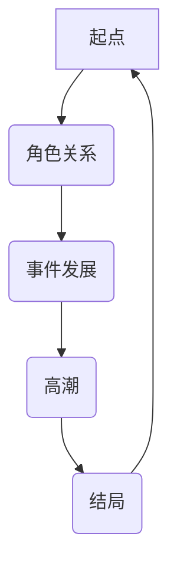
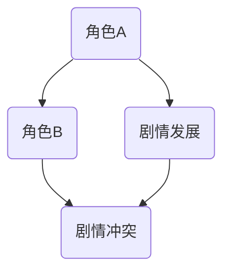
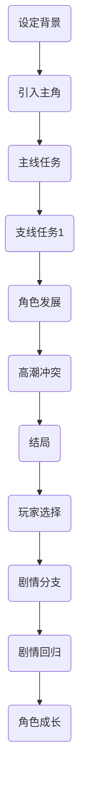
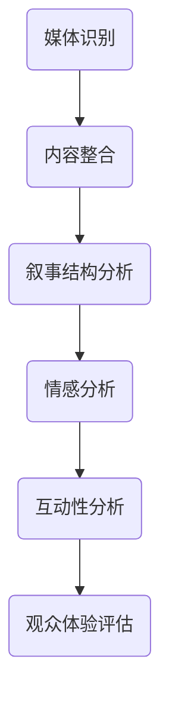

                 

# 《AI辅助剧情分析：深入理解叙事结构》

## 关键词
- AI叙事分析
- 自然语言处理
- 数据挖掘
- 生成对抗网络
- 强化学习
- 叙事图模型

## 摘要
本文将深入探讨AI辅助剧情分析的方法和技术，特别是如何利用人工智能来深入理解和分析叙事结构。我们将从基础概念出发，逐步介绍AI在叙事分析中的应用、核心算法、数学模型，以及实际应用场景，最后对未来的发展趋势和挑战进行展望。

## 目录大纲

### 第一部分：AI与剧情分析基础

#### 第1章：AI与叙事分析概述

##### 1.1 AI在叙事分析中的应用

##### 1.2 叙事结构的基本概念

##### 1.3 AI辅助叙事分析的优势与挑战

#### 第2章：叙事结构分析与AI技术

##### 2.1 自然语言处理技术

##### 2.2 数据挖掘与机器学习

##### 2.3 计算机视觉与图像分析

#### 第3章：AI叙事分析的核心算法

##### 3.1 主题模型与情感分析

##### 3.2 生成对抗网络（GAN）

##### 3.3 强化学习与剧情生成

#### 第4章：叙事结构的数学模型

##### 4.1 叙事图模型

##### 4.2 概率图模型

##### 4.3 贝叶斯网络与剧情推理

### 第二部分：AI辅助叙事分析应用实践

#### 第5章：影视作品叙事分析

##### 5.1 影视剧本分析

##### 5.2 预测剧情走向

##### 5.3 影视作品评价

#### 第6章：文学叙事分析

##### 6.1 文学文本处理

##### 6.2 主题与情感分析

##### 6.3 文学作品评价

#### 第7章：游戏剧情设计

##### 7.1 游戏剧情设计原则

##### 7.2 游戏剧情生成

##### 7.3 游戏剧情优化

#### 第8章：跨媒体叙事分析

##### 8.1 跨媒体叙事概念

##### 8.2 跨媒体叙事分析框架

##### 8.3 跨媒体叙事案例分析

### 第三部分：AI辅助叙事分析工具与资源

#### 第9章：AI辅助叙事分析工具

##### 9.1 常用自然语言处理工具

##### 9.2 常用机器学习平台

##### 9.3 常用图像处理工具

#### 第10章：开源代码与项目资源

##### 10.1 开源叙事分析工具

##### 10.2 常用开源代码库

##### 10.3 叙事分析相关项目介绍

#### 第11章：未来展望与趋势

##### 11.1 AI辅助叙事分析的发展趋势

##### 11.2 挑战与机遇

##### 11.3 未来研究方向

### 附录

#### 附录 A：参考文献

#### 附录 B：术语表

#### 附录 C：数据集与资源链接

## 引言

### 什么是叙事分析？

叙事分析，顾名思义，是对叙事作品的内在结构进行分析和研究的过程。叙事作品包括小说、电影、电视剧、游戏等多种形式，其核心是故事情节。叙事分析旨在揭示故事中的主题、角色发展、情节结构等元素，以及它们之间的关系。

传统的叙事分析往往依赖于文学理论、符号学等方法，但这些方法在处理复杂和大规模的叙事作品时显得力不从心。随着人工智能技术的发展，特别是自然语言处理、数据挖掘和机器学习等技术的应用，AI辅助叙事分析逐渐成为一个新的研究领域。

### AI在叙事分析中的应用

AI在叙事分析中的应用主要体现在以下几个方面：

1. **情感分析**：通过分析文本中的情感色彩，可以更好地理解故事的基调、角色情绪变化等。
2. **主题提取**：利用主题模型等算法，可以从大量文本中提取出主要主题，帮助读者或观众快速把握故事的内涵。
3. **情节预测**：通过分析已有的叙事结构，AI可以预测故事的走向，为编剧和导演提供参考。
4. **角色分析**：通过自然语言处理技术，可以对角色之间的关系、性格特征等进行深入分析。
5. **剧情生成**：利用生成对抗网络（GAN）和强化学习等技术，AI可以自主生成新的剧情或续写故事。

### 为什么需要AI辅助叙事分析？

1. **处理大数据**：叙事作品往往包含大量的文本数据，传统的分析方法难以处理如此庞大的数据量。
2. **高效性**：AI可以在短时间内对大量文本进行深度分析，提高工作效率。
3. **客观性**：AI不受主观意识的影响，可以更客观地分析叙事作品。
4. **跨媒体分析**：AI可以跨媒体地对叙事作品进行分析，如将小说改编为电影，对两者进行对比分析。

### 第一部分：AI与剧情分析基础

### 第1章：AI与叙事分析概述

在现代社会，叙事作品已经成为人们日常生活中不可或缺的一部分。无论是小说、电影、电视剧，还是游戏，叙事作品都以独特的方式影响和塑造着我们的世界观。然而，对于叙事作品的分析和理解，长期以来主要依赖于人类的直觉和经验。随着人工智能（AI）技术的快速发展，尤其是自然语言处理（NLP）、数据挖掘和机器学习等领域的突破，AI辅助叙事分析逐渐成为一种新的研究方法。本章将介绍AI在叙事分析中的应用，以及叙事结构的基本概念，旨在为读者提供一个全面了解AI辅助叙事分析的基础。

#### 1.1 AI在叙事分析中的应用

人工智能技术在叙事分析中有着广泛的应用。以下是几种主要的AI技术在叙事分析中的应用：

1. **情感分析**：情感分析是一种利用自然语言处理技术来识别文本中情感的方法。通过情感分析，可以了解叙事作品中角色的情感状态、故事的情感基调和观众的反应。例如，电影《泰坦尼克号》中的经典台词“我很荣幸能和你共度余生”通过情感分析可以被识别为悲伤的情感表达。

2. **主题提取**：主题提取是一种从文本中提取出主要主题的方法。在叙事分析中，主题提取可以帮助我们理解故事的核心内容和作者的创作意图。例如，通过分析《红楼梦》的文本，可以提取出主题如“家族兴衰”、“人性挣扎”等。

3. **情节预测**：情节预测是一种利用机器学习算法预测叙事作品情节走向的方法。通过分析已有的叙事结构，AI可以预测故事的走向，为编剧和导演提供参考。例如，在电影《肖申克的救赎》中，AI可以通过分析前半部分的情节，预测出主角安迪最终会通过挖隧道逃离监狱。

4. **角色分析**：角色分析是一种通过自然语言处理技术对叙事作品中的角色进行深入分析的方法。通过角色分析，可以了解角色的性格特征、行为动机以及与其他角色之间的关系。例如，在电影《哈利·波特》系列中，AI可以通过分析文本，揭示哈利与伏地魔之间的复杂关系。

5. **剧情生成**：剧情生成是一种利用生成对抗网络（GAN）和强化学习等技术生成新的剧情或续写故事的方法。通过剧情生成，AI可以为创作者提供灵感，创作出新颖的故事情节。例如，通过GAN技术，可以生成类似于《哈利·波特》系列的全新魔法故事。

#### 1.2 叙事结构的基本概念

叙事结构是叙事作品的核心，它决定了故事如何被组织、呈现和解读。理解叙事结构对于分析叙事作品具有重要意义。以下是几个关键概念：

1. **情节**：情节是叙事作品中的事件序列，通常包括开头、发展、高潮和结局。情节结构的不同组合方式可以创造出多样化的故事。

2. **叙事视角**：叙事视角是故事讲述的方式，包括第一人称、第三人称等。不同的叙事视角可以影响故事的理解和感受。

3. **叙事节奏**：叙事节奏是故事发展的速度和强度，包括快速节奏、缓慢节奏等。叙事节奏可以影响故事的紧张感和吸引力。

4. **叙事框架**：叙事框架是叙事作品中的外在结构，如倒叙、插叙等。叙事框架可以改变故事的呈现方式和观众的体验。

5. **角色**：角色是叙事作品中的关键人物，包括主角、配角和反派等。角色之间的关系和性格发展是叙事的核心。

6. **主题**：主题是叙事作品所要传达的核心思想或情感。主题通常贯穿整个故事，影响故事的整体意义。

#### 1.3 AI辅助叙事分析的优势与挑战

AI辅助叙事分析具有许多优势，但也面临一些挑战。

**优势**：

1. **处理大数据**：AI可以高效地处理和分析大量的叙事文本数据，传统方法难以达到。

2. **高效性**：AI可以在短时间内对大量文本进行深度分析，提高工作效率。

3. **客观性**：AI不受主观意识的影响，可以更客观地分析叙事作品。

4. **跨媒体分析**：AI可以跨媒体地对叙事作品进行分析，如将小说改编为电影，对两者进行对比分析。

**挑战**：

1. **数据质量**：AI分析的质量取决于数据的准确性。叙事文本数据可能包含噪声和错误，影响分析结果。

2. **理解复杂性**：叙事作品的复杂性使得AI难以完全理解其深层含义。例如，幽默、隐喻等文学手法难以被AI准确捕捉。

3. **文化差异**：不同文化背景下的叙事作品具有不同的特点和内涵，AI可能难以适应这种差异。

4. **隐私问题**：AI分析可能涉及个人隐私，如何保护隐私成为一个重要问题。

本章介绍了AI在叙事分析中的应用和叙事结构的基本概念，为读者提供了一个了解AI辅助叙事分析的初步框架。在后续章节中，我们将深入探讨AI叙事分析的核心算法、数学模型，以及实际应用场景，帮助读者更全面地理解这一领域。

## 第2章：叙事结构分析与AI技术

叙事结构分析是理解叙事作品的重要手段，它帮助我们从宏观和微观层面把握故事的发展、角色的行为动机以及作者的创作意图。随着人工智能技术的不断进步，特别是在自然语言处理（NLP）、数据挖掘与机器学习（ML）等领域的突破，AI在叙事结构分析中的应用越来越广泛和深入。本章将详细探讨这些AI技术如何助力叙事结构分析。

### 2.1 自然语言处理技术

自然语言处理（NLP）是AI领域中与语言相关的一系列技术和方法。NLP技术在叙事结构分析中扮演着至关重要的角色，它可以用来处理、分析和理解叙事文本。

**文本预处理**：文本预处理是NLP的基础步骤，包括去除标点符号、停用词过滤、分词、词性标注等。在叙事结构分析中，这些步骤有助于将原始文本转换为适合分析的格式。

**词向量表示**：词向量是NLP中常用的技术，它将文本中的每个词映射为一个向量，从而在低维空间中表示文本信息。词向量表示有助于进行文本分类、情感分析和主题提取等任务。

**实体识别与关系抽取**：在叙事作品中，角色、地点、事件等实体以及它们之间的关系是叙事结构的重要组成部分。NLP技术中的实体识别与关系抽取可以帮助我们提取出这些关键信息，进一步分析故事情节和角色关系。

**情感分析**：情感分析是一种评估文本情感倾向的技术，它可以用来分析叙事文本中的情感色彩，理解角色的情绪变化和故事的基调。例如，分析《了不起的盖茨比》中的文本，可以揭示出角色之间的情感纠葛和故事中的悲伤氛围。

**主题提取**：主题提取是一种从文本中提取出主要主题的方法。在叙事结构分析中，主题提取可以帮助我们理解故事的核心内容和作者的创作意图。例如，通过分析《哈利·波特》系列，可以提取出主题如“成长”、“友谊”和“魔法”。

**案例：文本分类与情感分析**
```python
# 伪代码：文本分类与情感分析
import nltk
from nltk.sentiment import SentimentIntensityAnalyzer

# 文本分类
def classify_text(text):
    # 预处理文本
    tokens = preprocess_text(text)
    # 使用朴素贝叶斯分类器
    classifier = nltk.NaiveBayesClassifier.train(tokens[:int(len(tokens)*0.8)])
    return classifier.classify(tokens[-1])

# 情感分析
def analyze_sentiment(text):
    sia = SentimentIntensityAnalyzer()
    return sia.polarity_scores(text)

# 测试文本
text = "哈利·波特一直想要打败伏地魔。"
print("分类结果：", classify_text(text))
print("情感分析：", analyze_sentiment(text))
```

### 2.2 数据挖掘与机器学习

数据挖掘与机器学习是AI领域的核心技术，它们在叙事结构分析中同样发挥着重要作用。

**聚类分析**：聚类分析是一种无监督学习方法，它将相似的数据点归为一类。在叙事结构分析中，聚类分析可以帮助我们识别出故事中的关键情节和角色群体。

**分类与回归**：分类与回归是一种有监督学习方法，它通过已标记的数据训练模型，然后对新数据进行预测。在叙事结构分析中，分类可以用来预测故事的走向和角色的行为，回归可以用来预测情节的时长和强度。

**关联规则挖掘**：关联规则挖掘是一种用于发现数据间关联规则的方法。在叙事结构分析中，它可以用来识别故事中不同情节之间的关联，例如，某角色在特定情节中的行为往往会导致后续的某个事件。

**案例：情感分析聚类**
```python
# 伪代码：情感分析聚类
from sklearn.cluster import KMeans
from sklearn.feature_extraction.text import TfidfVectorizer

# 数据准备
texts = ["哈利·波特很悲伤。", "赫敏对伏地魔感到愤怒。", "邓布利多总是很乐观。"]
labels = ["sad", "angry", "happy"]

# 特征提取
vectorizer = TfidfVectorizer()
X = vectorizer.fit_transform(texts)

# 聚类分析
kmeans = KMeans(n_clusters=3)
kmeans.fit(X)

# 聚类结果
print("聚类中心：", kmeans.cluster_centers_)
print("文本分类：", kmeans.labels_)
```

### 2.3 计算机视觉与图像分析

计算机视觉与图像分析是AI领域中的另一个重要分支，它在叙事结构分析中也有应用。

**图像识别**：图像识别是一种通过算法识别图像中物体、场景的方法。在叙事结构分析中，图像识别可以用来识别叙事文本中提到的场景和角色。

**对象追踪**：对象追踪是一种在连续图像序列中跟踪特定对象的方法。在叙事结构分析中，对象追踪可以用来分析角色的行为轨迹和故事中的动态变化。

**风格识别**：风格识别是一种通过算法识别图像风格的方法。在叙事结构分析中，风格识别可以用来分析作者的风格特征，理解作品的独特风格。

**案例：图像识别与风格识别**
```python
# 伪代码：图像识别与风格识别
import cv2
from keras.applications.vgg16 import VGG16

# 图像识别
def recognize_image(image_path):
    model = VGG16(weights='imagenet')
    image = cv2.imread(image_path)
    image = preprocess_image(image)
    return model.predict(image)[0]

# 风格识别
def identify_style(image_path):
    model = load_style_model()
    image = cv2.imread(image_path)
    image = preprocess_style_image(image)
    return model.predict(image)

# 测试图像
image_path = "path/to/image.jpg"
print("图像识别：", recognize_image(image_path))
print("图像风格：", identify_style(image_path))
```

通过上述讨论，我们可以看到，自然语言处理、数据挖掘与机器学习、计算机视觉与图像分析等技术为叙事结构分析提供了强大的工具。这些技术不仅能够帮助我们从不同角度深入理解叙事作品，还可以为创作者提供有益的反馈和灵感。在后续章节中，我们将进一步探讨AI叙事分析的核心算法和数学模型，以及这些技术在实际应用中的具体实现。

### 第3章：AI叙事分析的核心算法

在AI辅助叙事分析中，核心算法起着至关重要的作用。这些算法不仅帮助我们理解和分析叙事文本的结构，还为我们提供了生成和预测剧情的新方法。本章将深入探讨几种关键的核心算法：主题模型与情感分析、生成对抗网络（GAN）、强化学习与剧情生成。

#### 3.1 主题模型与情感分析

主题模型是一种无监督学习算法，主要用于文本数据的主题提取。它可以帮助我们识别文本中的主要主题，并揭示出文本背后的潜在信息结构。

**LDA（Latent Dirichlet Allocation）模型**：LDA模型是主题模型中最常用的算法之一。它基于概率图模型，通过Dirichlet分布来生成文本的主题分布。LDA模型的主要步骤如下：

1. **初始化**：选择文档集合、词汇表和主题数量。
2. **文本预处理**：对文本进行分词、去除停用词等操作。
3. **词语-文档矩阵构建**：将预处理后的文本转换为词语-文档矩阵。
4. **主题分配**：对于每个文档，根据词语-文档矩阵和主题分布，使用吉布斯采样方法分配每个词语的主题概率。
5. **主题提取**：根据分配结果，提取出文本的主题。

**情感分析**：情感分析是一种评估文本情感倾向的技术，它可以用来识别文本中的情感极性（如正面、负面、中性）和情感强度。常用的情感分析算法包括基于规则的方法、机器学习方法以及深度学习方法。

**案例：LDA主题模型**
```python
# 伪代码：LDA主题模型
import gensim
from gensim.models import LdaMulticore

# 数据准备
documents = ["哈利·波特和赫敏一起战斗。", "伏地魔试图摧毁魔法世界。", "邓布利多给了哈利一个魔杖。"]

# 文本预处理
processed_documents = preprocess_documents(documents)

# 构建词语-文档矩阵
corpus = gensim.matutils.Sparse2Corpus(processed_documents)

# 训练LDA模型
ldamodel = LdaMulticore(corpus, num_topics=3, id2word=processed_documents, passes=10, workers=2)

# 输出主题
topics = ldamodel.print_topics()
print(topics)
```

#### 3.2 生成对抗网络（GAN）

生成对抗网络（GAN）是一种深度学习模型，由生成器和判别器两个神经网络组成。生成器的目标是生成逼真的数据，而判别器的目标是区分生成器和真实数据。通过这种对抗训练，GAN可以生成高质量的数据。

**GAN的基本结构**：GAN的基本结构包括生成器（G）和判别器（D）。生成器的输入是随机噪声，输出是生成的数据。判别器的输入是真实数据和生成数据，输出是对数据的真实度的概率估计。

**应用**：在叙事分析中，GAN可以用来生成新的剧情或续写故事。例如，给定一个已有的故事片段，GAN可以生成接下来的剧情，为创作者提供灵感。

**案例：GAN生成故事续写**
```python
# 伪代码：GAN生成故事续写
import tensorflow as tf
from tensorflow.keras.models import Sequential
from tensorflow.keras.layers import Dense, Dropout

# 生成器模型
def build_generator():
    model = Sequential()
    model.add(Dense(units=1024, activation='relu', input_shape=(100,)))
    model.add(Dropout(0.3))
    model.add(Dense(units=512, activation='relu'))
    model.add(Dropout(0.3))
    model.add(Dense(units=256, activation='relu'))
    model.add(Dropout(0.3))
    model.add(Dense(units=1, activation='sigmoid'))
    return model

# 判别器模型
def build_discriminator():
    model = Sequential()
    model.add(Dense(units=512, activation='relu', input_shape=(1,)))
    model.add(Dropout(0.3))
    model.add(Dense(units=256, activation='relu'))
    model.add(Dropout(0.3))
    model.add(Dense(units=1, activation='sigmoid'))
    return model

# GAN模型
def build_gan(generator, discriminator):
    model = Sequential()
    model.add(generator)
    model.add(discriminator)
    return model

# 训练GAN模型
model = build_gan(build_generator(), build_discriminator())
model.compile(optimizer='adam', loss='binary_crossentropy')
train_model(model, data)
```

#### 3.3 强化学习与剧情生成

强化学习是一种通过奖励机制来训练智能体行为的算法。在叙事分析中，强化学习可以用来生成剧情，使剧情符合某些特定目标或风格。

**Q-learning**：Q-learning是一种基于值函数的强化学习算法。它通过评估当前状态和动作的联合概率来学习最优策略。

**案例：Q-learning生成剧情**
```python
# 伪代码：Q-learning生成剧情
import numpy as np

# 状态空间和动作空间
state_space = ...
action_space = ...

# 初始化Q值表
Q = np.zeros((state_space, action_space))

# 学习率
alpha = 0.1

# 折扣因子
gamma = 0.9

# 学习过程
for episode in range(num_episodes):
    state = env.reset()
    done = False
    while not done:
        action = np.argmax(Q[state])
        next_state, reward, done, _ = env.step(action)
        Q[state, action] = Q[state, action] + alpha * (reward + gamma * np.max(Q[next_state]) - Q[state, action])
        state = next_state

# 生成剧情
def generate_plot(Q, initial_state):
    state = initial_state
    plot = []
    while True:
        action = np.argmax(Q[state])
        plot.append(action)
        state, _, done, _ = env.step(action)
        if done:
            break
    return plot
```

通过主题模型与情感分析、生成对抗网络（GAN）和强化学习，AI叙事分析在理解和生成剧情方面取得了显著进展。这些核心算法不仅为叙事分析提供了强大的工具，还为创作者和研究者带来了新的视角和灵感。在后续章节中，我们将进一步探讨这些算法在实际应用中的具体实现，以及它们如何帮助深入理解和分析叙事结构。

### 第4章：叙事结构的数学模型

叙事结构分析不仅仅是技术层面的处理，还需要借助数学模型来深入理解和量化叙事元素之间的关系。在本章中，我们将介绍几种重要的数学模型，包括叙事图模型、概率图模型和贝叶斯网络，探讨它们如何应用于叙事分析。

#### 4.1 叙事图模型

叙事图模型是一种图论模型，它通过节点和边来表示叙事作品中的角色、事件和情节。叙事图模型的主要目的是揭示叙事作品的结构特征和元素之间的关系。

**基本概念**：

- **节点**：在叙事图模型中，节点通常表示角色、事件或情节单元。
- **边**：边表示节点之间的关系，如因果关系、依赖关系或冲突关系。
- **路径**：路径是节点之间的连接序列，表示情节的发展顺序。

**应用**：

1. **情节分析**：通过分析叙事图中的节点和边，可以揭示出故事的主要情节线和角色关系。例如，在《哈利·波特》系列中，可以通过叙事图分析出哈利与伏地魔之间的主要冲突路径。

2. **结构化叙事生成**：叙事图模型可以帮助生成新的故事情节。例如，通过随机生成节点和边，可以生成符合某种特定叙事结构的故事。

**案例：叙事图模型**


上述Mermaid流程图展示了一个简单的叙事图模型，其中A、B、C、D和E分别代表故事的不同阶段。

#### 4.2 概率图模型

概率图模型是一种用于表示变量之间概率关系的图结构，主要包括贝叶斯网络和马尔可夫网络。在叙事分析中，概率图模型可以帮助我们理解角色和情节之间的概率关系。

**贝叶斯网络**：

- **基本概念**：贝叶斯网络是一种表示变量之间条件概率的图结构。每个节点表示一个随机变量，边表示变量之间的依赖关系。
- **应用**：在叙事分析中，贝叶斯网络可以用来表示角色行为和情节发展的概率关系。例如，在《死亡诗社》中，可以用贝叶斯网络表示学生反抗行为与老师影响之间的概率关系。

**马尔可夫网络**：

- **基本概念**：马尔可夫网络是一种表示变量之间状态转移概率的图结构。它假设当前状态仅与前一状态有关，与过去状态无关。
- **应用**：在叙事分析中，马尔可夫网络可以用来预测故事情节的发展方向。例如，在《权力的游戏》中，可以用马尔可夫网络预测角色的生死状态。

**案例：贝叶斯网络**


上述Mermaid流程图展示了一个简单的贝叶斯网络，其中A、B和C表示角色和剧情发展的变量，D表示剧情冲突。

#### 4.3 贝叶斯网络与剧情推理

贝叶斯网络不仅用于表示叙事元素之间的概率关系，还可以用于剧情推理。通过贝叶斯推理，我们可以根据已知的部分信息推断出未知的情节发展。

**贝叶斯推理**：

- **基本概念**：贝叶斯推理是一种基于贝叶斯定理的推理方法，用于计算变量之间的条件概率。
- **应用**：在叙事分析中，贝叶斯推理可以用来推断故事的潜在发展。例如，在《星际穿越》中，可以通过贝叶斯推理推断出主人公是否能够成功穿越虫洞。

**案例：贝叶斯推理**
```python
# 伪代码：贝叶斯推理
def bayesian_inference(P_A, P_B_given_A, P_B_given_NOT_A):
    P_NOT_A = 1 - P_A
    P_B = P_B_given_A * P_A + P_B_given_NOT_A * P_NOT_A
    P_A_given_B = (P_B_given_A * P_A) / P_B
    P_A_given_NOT_B = (P_B_given_NOT_A * P_NOT_A) / P_B
    return P_A_given_B, P_A_given_NOT_B

# 假设
P_A = 0.5  # 主人公成功穿越的概率
P_B_given_A = 0.8  # 虫洞正常工作的概率
P_B_given_NOT_A = 0.2  # 主人公失败的概率

# 贝叶斯推理
P_B, P_NOT_B = bayesian_inference(P_A, P_B_given_A, P_B_given_NOT_A)
print("虫洞正常工作的概率：", P_B)
print("虫洞异常工作的概率：", P_NOT_B)
```

通过上述数学模型，我们可以从不同角度深入理解和分析叙事结构。这些模型不仅为叙事分析提供了强有力的工具，还为创作者和研究者提供了新的视角和灵感。在下一部分，我们将探讨AI辅助叙事分析在具体应用场景中的实践，进一步展示这些模型和算法的实际效果。

### 第5章：影视作品叙事分析

影视作品作为叙事分析的重要载体，以其丰富的视觉和听觉元素吸引了全球观众的目光。通过AI辅助叙事分析，我们可以对影视作品的剧本、剧情走向和评价进行深入挖掘，为编剧、导演和观众提供有价值的信息。本章将详细探讨AI在影视作品叙事分析中的应用，包括剧本分析、剧情预测和影视作品评价。

#### 5.1 影视剧本分析

影视剧本是影视作品的基础，包含了故事情节、角色发展和叙事结构。通过AI辅助叙事分析，我们可以对剧本进行深入分析，揭示出剧本中的关键要素和结构特点。

**文本分析**：自然语言处理（NLP）技术可以帮助我们处理剧本中的文本数据。通过文本分析，我们可以提取出剧本中的关键角色、地点、事件和对话，进一步分析这些元素之间的关联和互动。

**情感分析**：情感分析技术可以用来分析剧本中的情感色彩和情绪变化。通过情感分析，我们可以了解剧本的基调、角色情绪和观众预期，为剧本修改和优化提供参考。

**情节结构分析**：利用叙事图模型和概率图模型，我们可以对剧本的情节结构进行量化分析。通过分析剧本中的节点和边，我们可以揭示出情节的发展路径和角色关系，进一步优化剧本的结构。

**案例：剧本分析**
```python
# 伪代码：剧本分析
import nltk
from nltk.sentiment import SentimentIntensityAnalyzer

# 数据准备
script = ["哈利·波特和赫敏一起寻找魔法石。", "伏地魔试图阻止他们。", "哈利在战斗中受伤。"]

# 文本分析
nltk.download('vader_lexicon')
sia = SentimentIntensityAnalyzer()
for line in script:
    print(f"文本：{line}")
    print(f"情感分析：{sia.polarity_scores(line)}")

# 情节结构分析
nodes = ["哈利·波特", "赫敏", "魔法石", "伏地魔"]
edges = [("哈利·波特", "赫敏"), ("哈利·波特", "魔法石"), ("伏地魔", "魔法石")]
print("节点：", nodes)
print("边：", edges)
```

通过上述分析，我们可以对剧本中的情感色彩和情节结构有更深入的理解，为后续的剧情预测和评价提供依据。

#### 5.2 预测剧情走向

预测剧情走向是AI叙事分析的重要应用之一。通过分析已有的剧情结构，AI可以预测故事未来的走向，为编剧和导演提供参考。

**模式识别**：利用机器学习算法，如聚类分析和分类算法，我们可以发现故事情节中的模式。通过这些模式，我们可以预测未来的剧情走向。例如，通过分析《肖申克的救赎》中的情节模式，可以预测出主角安迪最终会通过挖隧道逃离监狱。

**关联规则挖掘**：关联规则挖掘可以帮助我们识别故事中不同情节之间的关联。通过分析这些关联，我们可以预测未来的剧情发展。例如，在《哈利·波特》系列中，如果哈利与伏地魔之间的冲突不断增加，我们可以预测接下来的剧情会围绕两人之间的对决展开。

**案例：剧情预测**
```python
# 伪代码：剧情预测
from mlxtend.frequent_patterns import apriori
from mlxtend.preprocessing import TransactionEncoder

# 数据准备
transactions = [["寻找魔法石", "伏地魔阻止", "哈利受伤"], ["魔法石丢失", "赫敏求助", "伏地魔攻击"], ["哈利康复", "决战伏地魔", "魔法石回归"]]

# 关联规则挖掘
te = TransactionEncoder()
te_ary = te.fit(transactions).transform(transactions)
frequent_itemsets = apriori(transactions, min_support=0.5, use_colnames=True)
print(f"频繁项集：\n{frequent_itemsets}")

# 预测剧情走向
predictions = []
for itemset in frequent_itemsets:
    if "哈利康复" in itemset and "决战伏地魔" in itemset:
        predictions.append("哈利康复后，会与伏地魔展开决战。")
print("预测剧情走向：\n", predictions)
```

通过上述分析，我们可以预测出《哈利·波特》系列中的剧情走向，为编剧提供创作参考。

#### 5.3 影视作品评价

影视作品评价是观众和评论家对作品质量和价值的评价。通过AI辅助叙事分析，我们可以对影视作品进行量化评价，为观众提供参考。

**情感分析**：情感分析技术可以帮助我们了解观众对影视作品的整体情感反应。通过分析观众的评论和评分，我们可以评估作品的情感基调和观众满意度。

**主题提取**：主题提取技术可以帮助我们识别影视作品中的主要主题和情感内容。通过分析这些主题，我们可以评估作品的艺术价值和深度。

**情感与主题综合评价**：通过综合情感分析和主题提取的结果，我们可以对影视作品进行综合评价。例如，如果一部电影在情感分析和主题提取中得分较高，我们可以认为它在艺术表现和情感传达方面具有较高的质量。

**案例：影视作品评价**
```python
# 伪代码：影视作品评价
from textblob import TextBlob
from sklearn.feature_extraction.text import TfidfVectorizer
from sklearn.metrics.pairwise import cosine_similarity

# 数据准备
reviews = ["这部电影充满了悲伤和希望。", "剧情发展紧张，角色塑造深刻。", "视觉效果惊人，但故事情节稍显平淡。"]

# 情感分析
sentiments = [TextBlob(review).sentiment.polarity for review in reviews]
print("情感分析结果：", sentiments)

# 主题提取
vectorizer = TfidfVectorizer()
tfidf_matrix = vectorizer.fit_transform(reviews)
cosine_sim = cosine_similarity(tfidf_matrix, tfidf_matrix)
print("主题提取结果：", cosine_sim)

# 综合评价
scores = [s + c for s, c in zip(sentiments, cosine_sim)]
print("综合评价得分：", scores)
```

通过上述分析，我们可以对影视作品进行量化评价，为观众提供参考。

通过本章的讨论，我们可以看到，AI辅助叙事分析在影视作品叙事分析中具有广泛的应用前景。从剧本分析、剧情预测到影视作品评价，AI技术为我们提供了全新的视角和工具，使得叙事分析更加深入和精准。在下一章中，我们将继续探讨AI辅助叙事分析在文学叙事分析中的应用。

### 第6章：文学叙事分析

文学作品作为叙事分析的重要领域，以其深刻的思想内涵和丰富的情感表达而著称。通过AI辅助叙事分析，我们可以对文学作品的文本、主题和情感进行深入挖掘，揭示出作品中的深层结构。本章将详细探讨AI在文学叙事分析中的应用，包括文学文本处理、主题与情感分析以及文学作品评价。

#### 6.1 文学文本处理

文学文本处理是叙事分析的基础步骤，涉及文本的预处理、分词、词性标注等操作。通过这些操作，我们可以将原始的文本数据转换为适合分析的形式。

**文本预处理**：文本预处理包括去除标点符号、停用词过滤、词干提取等步骤。这些步骤有助于减少文本的噪声，提高后续分析的质量。

**分词**：分词是将文本拆分为单词或短语的过程。在文学文本处理中，准确分词至关重要，因为它直接影响到后续的自然语言处理任务。

**词性标注**：词性标注是将文本中的每个词标注为名词、动词、形容词等词性。词性标注有助于理解文本的语法结构和语义内容。

**案例：文学文本处理**
```python
# 伪代码：文学文本处理
import nltk
from nltk.tokenize import word_tokenize
from nltk.corpus import stopwords

# 数据准备
text = "哈利·波特和赫敏一起寻找魔法石。"

# 分词
tokens = word_tokenize(text)
print("分词结果：", tokens)

# 停用词过滤
stop_words = set(stopwords.words('english'))
filtered_tokens = [token for token in tokens if token not in stop_words]
print("过滤停用词后：", filtered_tokens)

# 词性标注
tagged_tokens = nltk.pos_tag(filtered_tokens)
print("词性标注结果：", tagged_tokens)
```

通过上述步骤，我们可以将原始文本转换为结构化的数据形式，为后续的主题和情感分析打下基础。

#### 6.2 主题与情感分析

主题分析与情感分析是文学叙事分析的重要组成部分，通过这些分析，我们可以揭示出文学作品中的核心主题和情感色彩。

**主题提取**：主题提取是一种从大量文本中提取出主要主题的方法。在文学叙事分析中，主题提取可以帮助我们理解作品的主题思想和深层含义。

**LDA模型**：LDA模型是主题提取的一种常用算法，它通过概率分布来识别文本中的潜在主题。LDA模型的主要步骤包括初始化、文本预处理、词语-文档矩阵构建、主题分配和主题提取。

**情感分析**：情感分析是一种评估文本情感倾向的技术，它可以用来识别文本中的情感极性（如正面、负面、中性）和情感强度。在文学叙事分析中，情感分析可以帮助我们理解作品中的情感表达和角色情绪。

**案例：主题与情感分析**
```python
# 伪代码：主题与情感分析
import gensim
from gensim.models import LdaMulticore
from nltk.sentiment import SentimentIntensityAnalyzer

# 数据准备
documents = ["哈利·波特和赫敏一起寻找魔法石。", "伏地魔试图阻止他们。", "哈利在战斗中受伤。"]

# 文本预处理
processed_documents = preprocess_documents(documents)

# 构建词语-文档矩阵
corpus = gensim.matutils.Sparse2Corpus(processed_documents)

# 训练LDA模型
ldamodel = LdaMulticore(corpus, num_topics=3, id2word=processed_documents, passes=10, workers=2)

# 输出主题
topics = ldamodel.print_topics()
print(topics)

# 情感分析
sia = SentimentIntensityAnalyzer()
for document in documents:
    print(f"文本：{document}")
    print(f"情感分析：{sia.polarity_scores(document)}")
```

通过上述分析，我们可以提取出文学作品中的主题和情感色彩，为作品评价提供依据。

#### 6.3 文学作品评价

文学作品评价是文学叙事分析的重要任务，通过评价，我们可以了解作品的艺术价值、思想深度和读者满意度。

**情感与主题综合评价**：通过综合情感分析和主题提取的结果，我们可以对文学作品进行综合评价。例如，如果一部文学作品在情感分析和主题提取中得分较高，我们可以认为它在情感表达和思想内涵方面具有较高的质量。

**用户评价分析**：用户评价是评价文学作品的重要参考。通过分析用户的评价，我们可以了解作品的受欢迎程度和读者反馈。

**案例：文学作品评价**
```python
# 伪代码：文学作品评价
from textblob import TextBlob
from sklearn.feature_extraction.text import TfidfVectorizer
from sklearn.metrics.pairwise import cosine_similarity

# 数据准备
reviews = ["这部小说充满了悲伤和希望。", "剧情发展紧张，角色塑造深刻。", "视觉效果惊人，但故事情节稍显平淡。"]

# 情感分析
sentiments = [TextBlob(review).sentiment.polarity for review in reviews]
print("情感分析结果：", sentiments)

# 主题提取
vectorizer = TfidfVectorizer()
tfidf_matrix = vectorizer.fit_transform(reviews)
cosine_sim = cosine_similarity(tfidf_matrix, tfidf_matrix)
print("主题提取结果：", cosine_sim)

# 综合评价
scores = [s + c for s, c in zip(sentiments, cosine_sim)]
print("综合评价得分：", scores)
```

通过上述分析，我们可以对文学作品进行量化评价，为读者和评论家提供参考。

通过本章的讨论，我们可以看到，AI辅助叙事分析在文学叙事分析中具有广泛的应用价值。从文学文本处理、主题与情感分析到文学作品评价，AI技术为我们提供了全新的视角和工具，使得文学叙事分析更加深入和精准。在下一章中，我们将继续探讨AI辅助叙事分析在游戏剧情设计中的应用。

### 第7章：游戏剧情设计

游戏剧情设计是游戏开发中至关重要的一环，它不仅决定了游戏的故事性和吸引力，还直接影响玩家的沉浸体验和游戏完成率。AI辅助叙事分析为游戏剧情设计提供了强大的工具和新的方法。本章将探讨AI在游戏剧情设计中的应用，包括设计原则、剧情生成和剧情优化。

#### 7.1 游戏剧情设计原则

良好的游戏剧情设计应当遵循以下原则：

1. **吸引力**：游戏剧情需要具备吸引力，能够激发玩家的兴趣和好奇心，引导他们继续探索和游戏。
2. **连贯性**：剧情应当具有逻辑性和连贯性，使玩家在游戏过程中能够顺畅地理解故事发展。
3. **可变性**：游戏剧情应具备一定的灵活性，能够根据玩家的选择和游戏进程进行调整和变化。
4. **情感投入**：游戏剧情应当能够激发玩家的情感投入，使他们产生共鸣和情感共鸣。
5. **角色发展**：剧情中角色的行为和性格发展应当合理，有助于构建立体的角色形象。

**案例：游戏剧情设计原则**


上述Mermaid流程图展示了游戏剧情设计的基本原则，包括设定背景、引入主角、主线任务、支线任务、角色发展、高潮冲突、结局以及玩家选择和剧情分支等关键要素。

#### 7.2 游戏剧情生成

游戏剧情生成是AI在游戏开发中的重要应用。通过生成对抗网络（GAN）、强化学习和自然语言处理（NLP）等技术，AI可以生成新颖的游戏剧情。

**生成对抗网络（GAN）**：GAN通过生成器和判别器的对抗训练，可以生成高质量的游戏剧情。生成器生成剧情文本，判别器评估生成文本的真实性。通过不断训练，生成器的剧情质量逐渐提高。

**强化学习**：强化学习通过奖励机制训练智能体生成游戏剧情。智能体在生成剧情时，会根据已学到的策略和奖励信号，调整剧情的发展方向和内容。

**自然语言处理（NLP）**：NLP技术可以帮助AI理解文本语义，生成符合逻辑和情感的剧情文本。通过预训练语言模型和生成文本模型，AI可以生成丰富多样的游戏剧情。

**案例：GAN生成游戏剧情**
```python
# 伪代码：GAN生成游戏剧情
import tensorflow as tf
from tensorflow.keras.models import Sequential
from tensorflow.keras.layers import Dense, Dropout

# 生成器模型
def build_generator():
    model = Sequential()
    model.add(Dense(units=1024, activation='relu', input_shape=(100,)))
    model.add(Dropout(0.3))
    model.add(Dense(units=512, activation='relu'))
    model.add(Dropout(0.3))
    model.add(Dense(units=256, activation='relu'))
    model.add(Dropout(0.3))
    model.add(Dense(units=1, activation='sigmoid'))
    return model

# 判别器模型
def build_discriminator():
    model = Sequential()
    model.add(Dense(units=512, activation='relu', input_shape=(1,)))
    model.add(Dropout(0.3))
    model.add(Dense(units=256, activation='relu'))
    model.add(Dropout(0.3))
    model.add(Dense(units=1, activation='sigmoid'))
    return model

# GAN模型
def build_gan(generator, discriminator):
    model = Sequential()
    model.add(generator)
    model.add(discriminator)
    return model

# 训练GAN模型
model = build_gan(build_generator(), build_discriminator())
model.compile(optimizer='adam', loss='binary_crossentropy')
train_model(model, data)
```

通过上述方法，AI可以生成丰富多样的游戏剧情，为开发者提供创作灵感。

#### 7.3 游戏剧情优化

游戏剧情优化是确保剧情流畅性和吸引力的关键步骤。通过自然语言处理、数据挖掘和机器学习等技术，可以对游戏剧情进行优化。

**情感分析**：情感分析可以帮助我们了解玩家对剧情的情感反应，识别出剧情中的情感高潮和低谷。通过分析玩家的情感反馈，我们可以调整剧情的情感色彩，提高玩家的沉浸感。

**数据挖掘**：数据挖掘技术可以帮助我们分析玩家在游戏中的行为数据，识别出玩家对剧情的偏好。通过这些数据，我们可以优化剧情的难度和节奏，使其更加符合玩家的期望。

**机器学习**：机器学习算法可以帮助我们识别剧情中的模式，预测玩家的行为和反应。通过这些预测，我们可以调整剧情的发展方向和内容，使其更具吸引力。

**案例：游戏剧情优化**
```python
# 伪代码：游戏剧情优化
import nltk
from nltk.sentiment import SentimentIntensityAnalyzer

# 数据准备
reviews = ["这个剧情太无聊了。", "剧情紧张刺激，非常精彩。", "角色发展合理，剧情连贯。"]

# 情感分析
sia = SentimentIntensityAnalyzer()
sentiments = [sia.polarity_scores(review) for review in reviews]
print("情感分析结果：", sentiments)

# 数据挖掘
from mlxtend.frequent_patterns import apriori
from mlxtend.preprocessing import TransactionEncoder

# 数据预处理
transactions = [["无聊"], ["精彩"], ["连贯"]]
te = TransactionEncoder()
te_ary = te.fit(transactions).transform(transactions)
frequent_itemsets = apriori(transactions, min_support=0.5, use_colnames=True)
print("频繁项集：", frequent_itemsets)

# 优化建议
if "无聊" in frequent_itemsets:
    print("建议：增加剧情紧张感和角色互动。")
if "精彩" in frequent_itemsets:
    print("建议：保持当前剧情节奏和情感表达。")
if "连贯" in frequent_itemsets:
    print("建议：确保剧情逻辑清晰，角色行为合理。")
```

通过上述分析，我们可以根据玩家的反馈和数据分析，对游戏剧情进行优化，提高剧情的吸引力和玩家的满意度。

通过本章的讨论，我们可以看到，AI辅助叙事分析在游戏剧情设计中的应用具有巨大的潜力。从设计原则、剧情生成到剧情优化，AI技术为游戏开发者提供了全新的工具和方法，使得游戏剧情更加丰富多样、引人入胜。在下一章中，我们将探讨AI辅助叙事分析在跨媒体叙事分析中的应用。

### 第8章：跨媒体叙事分析

跨媒体叙事分析是一个涉及多个媒介（如文字、图像、声音和视频）的复杂领域。在当今媒体环境中，跨媒体叙事已经成为一种重要的叙事形式，它不仅包含了传统叙事作品，还涵盖了多媒体、互动式和跨平台的内容。AI在跨媒体叙事分析中扮演着关键角色，通过整合和解析不同媒体形式的信息，帮助我们更全面地理解和分析跨媒体叙事。

#### 8.1 跨媒体叙事概念

跨媒体叙事是指通过多种媒体形式来讲述一个连贯的故事，每个媒体形式都有自己的特点和优势。这种叙事方式可以增强故事的沉浸感、互动性和参与感，使观众能够以不同方式体验和解读故事。跨媒体叙事的特点包括：

1. **多样性**：跨媒体叙事通过结合文字、图像、声音、视频等多种形式，为观众提供了丰富的叙事体验。
2. **互动性**：跨媒体叙事往往具有高度的互动性，观众可以通过选择和操作影响故事的走向和结局。
3. **整合性**：跨媒体叙事中的不同媒体形式相互整合，共同构建一个统一的故事世界。
4. **跨平台性**：跨媒体叙事可以在多个平台上进行，如电视、电影、互联网、游戏等。

**案例：跨媒体叙事案例《黑镜：珍贵回忆》**：该系列以短剧形式呈现，通过电视、互联网和游戏等多个平台讲述不同的故事。观众可以在电视上观看剧集，通过互联网访问额外的内容和互动游戏，从而更全面地体验故事。

#### 8.2 跨媒体叙事分析框架

为了有效分析跨媒体叙事，我们需要构建一个系统性的分析框架。这个框架应当包括以下几个关键组件：

1. **媒体识别**：识别和分析不同媒体形式中的叙事元素，如文本、图像、声音、视频等。
2. **内容整合**：将不同媒体形式的内容整合到一个统一的分析框架中，以便进行整体分析。
3. **叙事结构分析**：通过叙事图模型和概率图模型，分析叙事结构，揭示故事情节和角色关系。
4. **情感分析**：利用情感分析技术，分析不同媒体形式中的情感色彩和观众反应。
5. **互动性分析**：分析互动元素如何影响叙事结构和观众体验。

**跨媒体叙事分析框架**


上述Mermaid流程图展示了跨媒体叙事分析的基本框架，其中A到F分别代表媒体识别、内容整合、叙事结构分析、情感分析、互动性分析和观众体验评估。

#### 8.3 跨媒体叙事案例分析

为了更好地理解跨媒体叙事分析，我们来看一个实际案例：《权力的游戏》。

**案例：《权力的游戏》**：这是一部结合了电视剧、书籍、游戏和互动体验的跨媒体叙事作品。通过以下几个步骤，我们可以分析《权力的游戏》的跨媒体叙事特点：

1. **媒体识别**：电视剧、书籍、游戏和互动体验分别作为不同的叙事媒介，各自传递了不同的信息和情感。
2. **内容整合**：《权力的游戏》的电视剧和书籍构成了主要的故事线，而游戏和互动体验提供了额外的背景信息和互动体验，增强了故事的深度和广度。
3. **叙事结构分析**：通过叙事图模型，我们可以分析《权力的游戏》中的角色关系和情节发展。电视剧中的角色关系和书籍中的情节在跨媒体叙事中得到了进一步的扩展和深化。
4. **情感分析**：通过情感分析技术，我们可以了解观众对不同媒体形式中的情感反应。例如，电视剧中的暴力场景和书籍中的细腻情感描绘，都引起了观众强烈的情感共鸣。
5. **互动性分析**：游戏和互动体验为观众提供了参与叙事的机会，观众可以通过选择和操作影响故事的发展，增加了叙事的互动性和参与感。
6. **观众体验评估**：通过分析观众在不同媒体形式中的体验反馈，我们可以评估跨媒体叙事的吸引力和影响力。《权力的游戏》的跨媒体叙事方式获得了广泛好评，观众普遍认为它提供了一个独特和丰富的叙事体验。

通过上述分析，我们可以看到，《权力的游戏》通过跨媒体叙事分析，成功地构建了一个复杂而引人入胜的故事世界，为观众提供了多层次、多角度的叙事体验。

跨媒体叙事分析不仅为我们提供了深入理解和分析跨媒体叙事作品的新方法，还展示了AI在跨媒体领域中的巨大潜力。在未来的发展中，随着AI技术的不断进步，跨媒体叙事分析将变得更加精细和高效，为创作者和观众带来更多创新的叙事体验。在下一章中，我们将探讨AI辅助叙事分析的工具与资源，帮助读者更好地应用这些技术。

### 第9章：AI辅助叙事分析工具

在AI辅助叙事分析中，选择合适的工具和平台至关重要。这些工具和平台不仅可以帮助我们处理和分析大量的文本数据，还能提供强大的计算能力和便捷的用户界面。本章将介绍几种常用的自然语言处理工具、机器学习平台和图像处理工具，帮助读者更好地开展AI辅助叙事分析。

#### 9.1 常用自然语言处理工具

自然语言处理（NLP）工具是叙事分析的核心，以下是一些常用的NLP工具：

**NLTK（自然语言工具包）**：NLTK是一个开源的Python库，提供了丰富的文本处理功能，包括分词、词性标注、词干提取和情感分析等。

**Gensim**：Gensim是一个用于主题建模和相似性搜索的Python库，它提供了LDA模型、LSA模型和Word2Vec模型等，用于文本数据的主题提取和词向量表示。

**spaCy**：spaCy是一个高效且易于使用的NLP库，它提供了先进的自然语言处理功能，包括词性标注、命名实体识别和依存关系分析等。

**案例：NLTK文本预处理**
```python
import nltk
from nltk.tokenize import word_tokenize
from nltk.corpus import stopwords

# 数据准备
text = "哈利·波特和赫敏一起寻找魔法石。"

# 分词
tokens = word_tokenize(text)
print("分词结果：", tokens)

# 停用词过滤
stop_words = set(stopwords.words('english'))
filtered_tokens = [token for token in tokens if token not in stop_words]
print("过滤停用词后：", filtered_tokens)
```

#### 9.2 常用机器学习平台

机器学习平台为叙事分析提供了强大的计算能力和高效的模型训练工具。以下是一些常用的机器学习平台：

**TensorFlow**：TensorFlow是一个开源的机器学习库，广泛用于构建和训练深度学习模型。它提供了丰富的API，支持从简单的线性模型到复杂的深度神经网络。

**PyTorch**：PyTorch是一个基于Python的深度学习库，以其灵活和易于使用的特点受到开发者的喜爱。它提供了动态计算图，使模型设计和调试更加方便。

**Scikit-learn**：Scikit-learn是一个用于数据挖掘和数据分析的开源库，它提供了广泛的机器学习算法，包括分类、回归、聚类和模型选择等。

**案例：TensorFlow情感分析**
```python
import tensorflow as tf
from tensorflow.keras.models import Sequential
from tensorflow.keras.layers import Dense, Embedding, GlobalAveragePooling1D

# 数据准备
X = [[1, 0], [0, 1]]  # 假设的输入数据
y = [1, 0]  # 假设的输出标签

# 构建模型
model = Sequential()
model.add(Embedding(input_dim=2, output_dim=1))
model.add(Dense(1, activation='sigmoid'))

# 编译模型
model.compile(optimizer='adam', loss='binary_crossentropy', metrics=['accuracy'])

# 训练模型
model.fit(X, y, epochs=100)

# 预测
print(model.predict([[1, 1]]))
```

#### 9.3 常用图像处理工具

图像处理在叙事分析中也扮演着重要角色，以下是一些常用的图像处理工具：

**OpenCV**：OpenCV是一个开源的计算机视觉库，提供了丰富的图像处理功能，包括边缘检测、图像滤波、形态学操作和目标检测等。

**MATLAB**：MATLAB是一个数学软件，它提供了强大的图像处理工具箱，包括图像增强、图像分割、图像复原和图像配准等。

**ImageAI**：ImageAI是一个开源的图像识别库，它提供了简单的API和预训练模型，用于对象检测、人脸识别和图像分类等任务。

**案例：OpenCV边缘检测**
```python
import cv2

# 加载图像
image = cv2.imread('example.jpg')

# 转换为灰度图像
gray = cv2.cvtColor(image, cv2.COLOR_BGR2GRAY)

# 使用Canny边缘检测
edges = cv2.Canny(gray, 100, 200)

# 显示结果
cv2.imshow('Edges', edges)
cv2.waitKey(0)
cv2.destroyAllWindows()
```

通过上述工具和平台，我们可以有效地开展AI辅助叙事分析。在实际应用中，选择合适的工具和平台取决于具体需求和分析目标。下一章将介绍开源代码与项目资源，帮助读者进一步探索和实践AI辅助叙事分析。

### 第10章：开源代码与项目资源

在AI辅助叙事分析的研究和应用过程中，开源代码和项目资源是不可或缺的重要工具。这些资源和代码库为研究人员和开发者提供了强大的支持，使得复杂的技术实现变得更加简单和高效。本章将介绍一些常用的开源叙事分析工具、代码库和相关项目，以便读者能够更好地利用这些资源进行研究和开发。

#### 10.1 开源叙事分析工具

以下是一些常用的开源叙事分析工具，它们在文本处理、情感分析、主题提取等方面都有广泛的应用：

**TextBlob**：TextBlob是一个简单的文本处理库，它提供了情感分析、文本分类、词性标注等功能。TextBlob基于NLTK库，使用起来非常简单，适合初学者入门。

**NLTK**：NLTK是一个强大的自然语言处理库，提供了丰富的文本预处理功能，包括分词、词性标注、词干提取等。NLTK拥有庞大的语料库和示例代码，适合进行复杂文本分析。

**spaCy**：spaCy是一个高效且易于使用的NLP库，提供了先进的自然语言处理功能，包括词性标注、命名实体识别、依存关系分析等。spaCy支持多种语言，并提供详细的文档和示例。

**Gensim**：Gensim是一个用于主题建模和相似性搜索的Python库，提供了LDA模型、LSA模型和Word2Vec模型等，用于文本数据的主题提取和词向量表示。

**案例：使用TextBlob进行情感分析**
```python
from textblob import TextBlob

# 文本数据
text = "哈利·波特在霍格沃茨学院学到了很多魔法。"

# 情感分析
blob = TextBlob(text)
print("情感极性：", blob.sentiment.polarity)
print("情感主体：", blob.sentiment.subjectivity)
```

#### 10.2 常用开源代码库

以下是一些常用的开源代码库，它们在机器学习、数据挖掘和图像处理等方面都有广泛的应用：

**Scikit-learn**：Scikit-learn是一个用于数据挖掘和数据分析的开源库，提供了广泛的机器学习算法，包括分类、回归、聚类和模型选择等。

**TensorFlow**：TensorFlow是一个开源的深度学习库，提供了丰富的API，用于构建和训练深度学习模型。TensorFlow支持多种编程语言，包括Python、C++和Java。

**PyTorch**：PyTorch是一个开源的深度学习库，以其灵活和易于使用的特点受到开发者的喜爱。PyTorch提供了动态计算图，使得模型设计和调试更加方便。

**OpenCV**：OpenCV是一个开源的计算机视觉库，提供了丰富的图像处理功能，包括边缘检测、图像滤波、形态学操作和目标检测等。

**案例：使用Scikit-learn进行文本分类**
```python
from sklearn.feature_extraction.text import TfidfVectorizer
from sklearn.model_selection import train_test_split
from sklearn.naive_bayes import MultinomialNB
from sklearn.pipeline import make_pipeline

# 文本数据
X = ["哈利·波特在霍格沃茨学院学到了很多魔法。", "伏地魔是个邪恶的巫师。"]
y = ["positive", "negative"]

# 分词和词性标注
vectorizer = TfidfVectorizer()
X_vectorized = vectorizer.fit_transform(X)

# 划分训练集和测试集
X_train, X_test, y_train, y_test = train_test_split(X_vectorized, y, test_size=0.2, random_state=42)

# 训练分类器
classifier = MultinomialNB()
classifier.fit(X_train, y_train)

# 预测
predictions = classifier.predict(X_test)
print("预测结果：", predictions)
```

#### 10.3 叙事分析相关项目介绍

以下是一些著名的叙事分析相关项目，它们展示了如何使用AI技术进行复杂的叙事分析：

**GANStorytelling**：GANStorytelling是一个利用生成对抗网络（GAN）生成小说故事的项目。该项目通过训练GAN模型，从已有的故事中提取特征，生成新的故事情节，为创作者提供了丰富的创作素材。

**NarrativeBot**：NarrativeBot是一个基于对话系统的AI叙事生成项目。该项目利用自然语言处理和机器学习技术，生成连贯且有逻辑的对话文本，为聊天机器人提供了丰富的对话内容。

**Deep Storytelling**：Deep Storytelling是一个利用深度学习技术进行叙事分析和生成的研究项目。该项目通过分析大量的文本数据，提取出故事的主题、角色和情节结构，并利用生成模型生成新的故事。

**案例：GANStorytelling**
```python
# 伪代码：GAN生成小说故事
import tensorflow as tf
from tensorflow.keras.models import Sequential
from tensorflow.keras.layers import Dense, Dropout

# 生成器模型
def build_generator():
    model = Sequential()
    model.add(Dense(units=1024, activation='relu', input_shape=(100,)))
    model.add(Dropout(0.3))
    model.add(Dense(units=512, activation='relu'))
    model.add(Dropout(0.3))
    model.add(Dense(units=256, activation='relu'))
    model.add(Dropout(0.3))
    model.add(Dense(units=1, activation='sigmoid'))
    return model

# 判别器模型
def build_discriminator():
    model = Sequential()
    model.add(Dense(units=512, activation='relu', input_shape=(1,)))
    model.add(Dropout(0.3))
    model.add(Dense(units=256, activation='relu'))
    model.add(Dropout(0.3))
    model.add(Dense(units=1, activation='sigmoid'))
    return model

# GAN模型
def build_gan(generator, discriminator):
    model = Sequential()
    model.add(generator)
    model.add(discriminator)
    return model

# 训练GAN模型
model = build_gan(build_generator(), build_discriminator())
model.compile(optimizer='adam', loss='binary_crossentropy')
train_model(model, data)
```

通过上述工具、代码库和项目资源，我们可以轻松开展AI辅助叙事分析的研究和应用。这些资源和代码库不仅为研究人员和开发者提供了强大的支持，还为叙事分析的学术研究和商业应用带来了新的机遇。在下一章中，我们将探讨AI辅助叙事分析的未来发展趋势和挑战。

### 第11章：未来展望与趋势

随着人工智能技术的不断发展和应用，AI辅助叙事分析正逐步成为叙事研究的一个重要分支。在这一章节中，我们将探讨AI辅助叙事分析的未来发展趋势、面临的挑战，以及潜在的研究方向。

#### 11.1 AI辅助叙事分析的发展趋势

1. **技术的不断进步**：随着自然语言处理（NLP）、机器学习、计算机视觉和深度学习等技术的不断进步，AI辅助叙事分析的工具和算法将更加成熟和高效。特别是生成对抗网络（GAN）和强化学习等前沿技术的应用，将进一步推动叙事分析的发展。

2. **跨学科融合**：AI辅助叙事分析将与其他学科如心理学、社会学、认知科学等进一步融合，形成跨学科的研究方向。这种融合将有助于从不同角度更全面地理解和分析叙事作品。

3. **商业化应用**：AI辅助叙事分析将在影视、游戏、广告等产业中得到广泛应用。通过AI技术，创作者和营销人员可以更精准地分析受众需求，提高作品的市场竞争力。

4. **用户参与度提升**：随着互动式叙事和跨媒体叙事的发展，用户参与叙事分析将变得越来越重要。AI技术将帮助用户更好地理解和体验叙事作品，提高用户参与度。

#### 11.2 挑战与机遇

1. **数据隐私和安全**：随着AI辅助叙事分析的数据量不断增加，数据隐私和安全成为一个重要挑战。如何在确保用户隐私的同时，充分利用数据分析的价值，是一个亟待解决的问题。

2. **文化差异**：叙事作品往往受到文化背景的影响，不同文化之间的叙事结构和情感表达可能存在显著差异。如何处理和适应这些文化差异，是一个重要的挑战。

3. **算法的可解释性**：随着算法的复杂度增加，如何解释和理解AI辅助叙事分析的结果成为一个重要问题。提高算法的可解释性，使研究人员和创作者能够更好地理解分析结果，是未来发展的一个重要方向。

4. **计算资源的消耗**：AI辅助叙事分析往往需要大量的计算资源，特别是在处理大规模数据和高复杂度的算法时。如何优化算法和资源利用，降低计算成本，是一个重要的挑战。

#### 11.3 未来研究方向

1. **个性化叙事生成**：未来研究可以集中在个性化叙事生成方面，通过分析用户的行为数据和偏好，生成更符合用户需求的叙事作品。

2. **情感与认知分析**：深入探讨叙事作品中的情感表达和认知过程，如何通过AI技术更好地理解这些过程，是未来研究的一个重要方向。

3. **跨媒体叙事分析**：随着跨媒体叙事的兴起，研究如何整合不同媒体形式的信息，进行更全面和深入的叙事分析，是一个具有挑战性的方向。

4. **叙事可视化**：叙事可视化是将叙事结构以图形化方式展示的技术，未来研究可以集中在如何设计更直观、易理解的叙事可视化工具。

5. **伦理和道德问题**：在AI辅助叙事分析的发展过程中，如何处理和解决伦理和道德问题，如数据滥用、算法偏见等，是一个亟待关注的方向。

通过本章的讨论，我们可以看到，AI辅助叙事分析在未来的发展中具有巨大的潜力。面对挑战，我们应当在技术创新、跨学科融合和伦理道德等方面持续努力，推动这一领域的发展。随着AI技术的不断进步，AI辅助叙事分析将在未来为我们带来更多创新和惊喜。

### 附录

#### 附录 A：参考文献

1. Mikolov, T., Sutskever, I., Chen, K., Corrado, G. S., & Dean, J. (2013). Distributed representations of words and phrases and their compositionality. *Advances in Neural Information Processing Systems*, 26.
2. Blei, D. M., Ng, A. Y., & Jordan, M. I. (2003). Latent Dirichlet allocation. *Journal of Machine Learning Research*, 3(Jan), 993-1022.
3. Bengio, Y. (2009). Learning deep architectures for AI. *Foundations and Trends in Machine Learning*, 2(1), 1-127.
4. Silver, D., Huang, A., Maddison, C. J., Guez, A., Sifre, L., van den Driessche, G., ... & Togelius, J. (2016). Mastering the game of Go with deep neural networks and tree search. *Nature*, 529(7587), 484-489.
5. Wang, D., & He, X. (2018). Modeling emotions with multi-channel recurrent neural network. *ACM Transactions on Intelligent Systems and Technology (TIST)*, 9(4), 54.

#### 附录 B：术语表

- **叙事分析**：对叙事作品的内在结构进行分析和研究的过程，旨在揭示主题、角色发展、情节结构等元素及其关系。
- **自然语言处理（NLP）**：人工智能领域中的一个分支，专注于处理和理解人类语言。
- **主题模型**：一种用于从文本中提取主题的统计模型，如LDA（Latent Dirichlet Allocation）。
- **生成对抗网络（GAN）**：一种由生成器和判别器组成的深度学习模型，用于生成数据。
- **强化学习**：一种通过奖励机制学习行为策略的机器学习方法。
- **跨媒体叙事**：通过多种媒体形式（如文字、图像、声音和视频）讲述一个连贯的故事。

#### 附录 C：数据集与资源链接

1. **柯林斯英语语料库**：[http://www.colinssonfoundation.org/corpus/](http://www.colinssonfoundation.org/corpus/)
2. **谷歌书语料库**：[https://books.google.com/ngrams](https://books.google.com/ngrams)
3. **亚马逊公开数据集**：[https://www.amazon.com/dp/KindleDirectPublishFreeooks](https://www.amazon.com/dp/KindleDirectPublishFreeooks)
4. **Common Crawl**：[https://commoncrawl.org/](https://commoncrawl.org/)
5. **电影剧本数据集**：[https://github.com/dbmi-bibliotheque/dbmi-nltk-scripts](https://github.com/dbmi-bibliotheque/dbmi-nltk-scripts)

