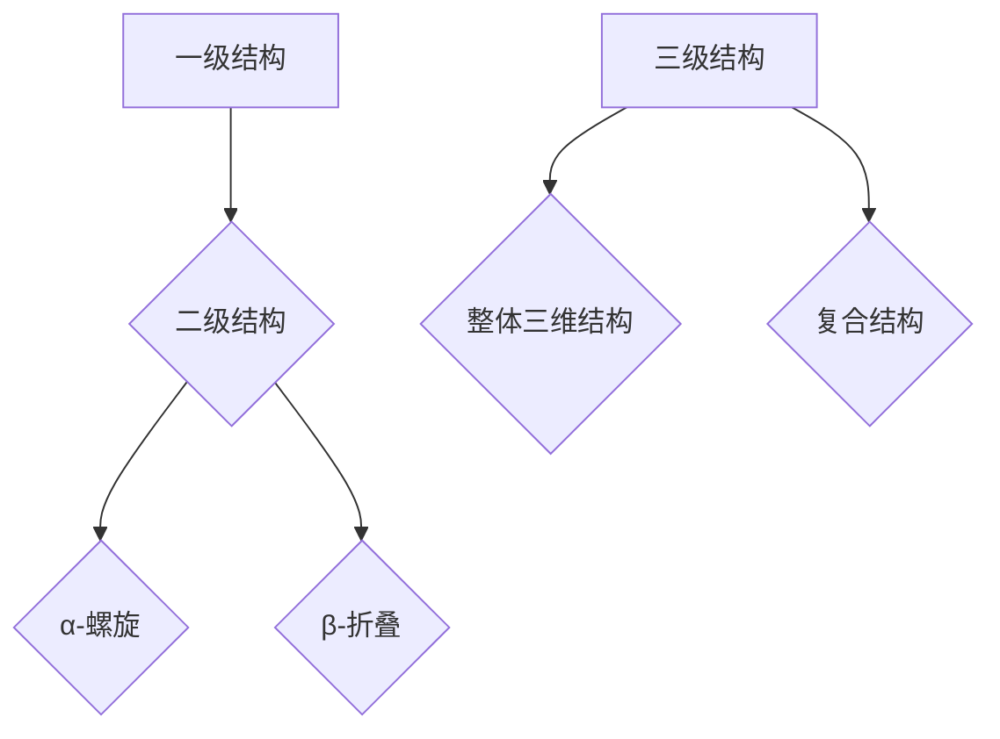

                 

# 《AI辅助的蛋白质折叠预测：生物学研究的新工具》

## 关键词

AI，蛋白质折叠预测，机器学习，深度学习，生物学研究，生物信息学

## 摘要

本文深入探讨了AI辅助蛋白质折叠预测技术及其在生物学研究中的应用。通过对蛋白质折叠的基本原理、核心算法、数学模型、数据处理方法以及实际应用案例的详细分析，本文展示了AI技术在蛋白质结构预测中的巨大潜力和广泛应用。同时，本文还讨论了AI辅助蛋白质折叠预测技术的未来发展趋势，展望了其在生物学研究中的潜在应用。通过本文的介绍，读者可以全面了解AI辅助蛋白质折叠预测技术的核心内容，为后续的研究和应用提供指导。

### 目录

**《AI辅助的蛋白质折叠预测：生物学研究的新工具》**

- **引言与概述**
  - AI与生物学研究概述
  - 蛋白质折叠预测的重要性
  - AI辅助蛋白质折叠预测技术发展历程

- **第一部分：蛋白质结构的基本概念**
  - **第1章：蛋白质结构的基本概念**
    - 蛋白质的组成与结构层次
    - 蛋白质结构的重要参数
    - 蛋白质结构的预测与计算

- **第二部分：蛋白质折叠的基本原理**
  - **第2章：蛋白质折叠的基本原理**
    - 能量驱动
    - 自发过程
    - 折叠路径的多样性
    - 蛋白质折叠的预测与计算

- **第三部分：AI在蛋白质折叠预测中的应用**
  - **第3章：AI在蛋白质折叠预测中的应用**
    - 机器学习在蛋白质折叠预测中的应用
    - 深度学习在蛋白质折叠预测中的应用
    - 图神经网络在蛋白质折叠预测中的应用

- **第四部分：蛋白质折叠预测中的数学模型**
  - **第4章：蛋白质折叠预测中的数学模型**
    - 概率模型
    - 优化模型
    - 机器学习模型

- **第五部分：蛋白质折叠预测中的数据处理**
  - **第5章：蛋白质折叠预测中的数据处理**
    - 蛋白质序列数据的预处理
    - 蛋白质结构数据的预处理
    - 蛋白质折叠预测中的数据集

- **第六部分：蛋白质折叠预测的应用实例**
  - **第6章：蛋白质折叠预测的应用实例**
    - AI辅助的蛋白质折叠预测在药物设计中的应用
    - AI辅助的蛋白质折叠预测在疾病研究中的应用
    - AI辅助的蛋白质折叠预测在其他生物学领域中的应用

- **第七部分：蛋白质折叠预测的未来发展**
  - **第7章：蛋白质折叠预测的未来发展**
    - AI辅助蛋白质折叠预测技术的挑战与机遇
    - AI辅助蛋白质折叠预测技术的未来发展趋势
    - AI辅助蛋白质折叠预测在生物学研究中的潜在应用

- **附录**
  - **附录A：AI辅助蛋白质折叠预测工具与资源**
    - 主流深度学习框架对比
    - 蛋白质折叠预测相关数据库
    - AI辅助蛋白质折叠预测相关的开源项目

### 引言与概述

#### AI与生物学研究概述

人工智能（AI）作为计算机科学的一个重要分支，近年来取得了显著的进展。AI技术通过模拟人类智能，实现自动识别模式、自主学习和决策等功能，已经在各个领域展现出巨大的应用潜力。在生物学研究领域，AI技术同样发挥着重要作用，特别是在蛋白质结构预测、基因组分析、疾病诊断等方面。

随着生物技术的快速发展，生物学研究产生了大量复杂数据。如何有效地分析和解读这些数据，成为当前生物学研究的一个重要挑战。AI技术的引入为这一挑战提供了新的解决方案。通过机器学习和深度学习算法，AI可以自动从大规模数据中提取有用信息，揭示生物学现象的内在规律，从而推动生物学研究的发展。

#### 蛋白质折叠预测的重要性

蛋白质是生物体的基本功能分子，其功能依赖于其特定的三维结构。蛋白质折叠是指蛋白质从线性多肽链形成特定三维结构的过程。蛋白质折叠是一个复杂且高度有序的过程，涉及到多种生物大分子之间的相互作用。蛋白质折叠的状态决定了蛋白质的功能，因此准确预测蛋白质的折叠状态对于理解蛋白质的功能具有重要意义。

蛋白质折叠预测是生物信息学的一个重要研究方向。通过预测蛋白质的折叠状态，可以揭示蛋白质的结构与功能之间的关系，为蛋白质工程、药物设计、疾病研究等领域提供重要基础。传统的蛋白质折叠预测方法主要依赖于实验手段，如X射线晶体学、核磁共振等。然而，这些方法费时费力，且受限于实验条件。随着AI技术的发展，AI辅助的蛋白质折叠预测成为了一个重要的研究方向。

#### AI辅助蛋白质折叠预测技术发展历程

AI辅助蛋白质折叠预测技术的发展历程可以分为几个阶段：

1. **早期方法**：在AI技术引入之前，蛋白质折叠预测主要依赖于物理化学模型和经验公式。这些方法在一定程度上可以预测蛋白质的折叠状态，但精度较低，且受限于计算资源的限制。

2. **机器学习方法**：随着机器学习技术的发展，蛋白质折叠预测开始引入机器学习方法。例如，支持向量机、决策树、神经网络等算法被用于蛋白质折叠预测。这些方法通过学习大量的蛋白质结构数据，可以自动提取蛋白质结构的特征，从而提高预测的精度。

3. **深度学习方法**：深度学习算法在蛋白质折叠预测中取得了重大突破。深度学习算法通过多层神经网络，可以自动提取蛋白质序列和结构数据的复杂特征，从而实现高精度的蛋白质折叠预测。特别是图神经网络在蛋白质折叠预测中的应用，使得预测精度得到了显著提高。

4. **集成方法**：为了进一步提高预测精度，研究人员提出了多种集成方法。这些方法结合了不同的模型和算法，通过综合多种预测结果，提高了蛋白质折叠预测的整体性能。

#### AI辅助蛋白质折叠预测技术的优势

AI辅助蛋白质折叠预测技术具有以下优势：

1. **高效性**：AI算法可以在短时间内处理大量数据，大大提高了蛋白质折叠预测的效率。

2. **准确性**：通过学习大量的蛋白质结构数据，AI算法可以自动提取蛋白质结构的特征，从而实现高精度的预测。

3. **泛化性**：AI算法可以适应不同的蛋白质序列和结构数据，具有较强的泛化能力。

4. **自动化**：AI算法可以自动化地处理蛋白质折叠预测的各个环节，从数据预处理到结果分析，减少了人工干预的需求。

#### AI辅助蛋白质折叠预测技术的应用前景

随着AI技术的发展，AI辅助蛋白质折叠预测技术在生物学研究中的应用前景广阔。以下是一些潜在的应用领域：

1. **药物设计**：通过预测蛋白质的折叠状态，可以设计出针对特定蛋白质的药物。这为药物研发提供了新的思路和方法，有望提高药物的研发效率和成功率。

2. **疾病研究**：通过预测蛋白质的折叠状态，可以揭示疾病发生机制，为新药研发提供新的靶点。此外，AI算法还可以用于疾病诊断和个性化治疗。

3. **蛋白质工程**：通过预测蛋白质的折叠状态，可以优化蛋白质的结构，提高其功能。这为蛋白质工程提供了新的工具和方法。

4. **生态系统研究**：通过预测微生物蛋白质的折叠状态，可以研究微生物的多样性及其在生态系统中的作用。这有助于理解生态系统的复杂性和稳定性。

总之，AI辅助蛋白质折叠预测技术为生物学研究提供了新的工具和方法，有望在蛋白质结构预测、药物设计、疾病研究等方面取得重要突破。

### 第一部分：蛋白质结构的基本概念

#### 第1章：蛋白质结构的基本概念

蛋白质是生命体的基本组成单元，具有多种多样的结构和功能。理解蛋白质的结构对于揭示其功能机制具有重要意义。本章将介绍蛋白质的组成与结构层次、重要参数以及蛋白质结构的预测与计算方法。

#### 1.1 蛋白质的组成与结构层次

蛋白质是由氨基酸组成的长链分子，它们通过肽键连接形成多肽链。蛋白质的结构可以分为四个层次：一级结构、二级结构、三级结构和四级结构。

**一级结构**：一级结构是蛋白质的基本结构层次，它由氨基酸的序列决定。每个氨基酸由一个中央碳原子（α碳原子）连接，形成一个线性多肽链。肽键是由氨基酸的羧基和另一个氨基酸的氨基通过脱水缩合形成的共价键。

**二级结构**：二级结构是蛋白质局部区域的规则结构。最常见的二级结构包括α-螺旋和β-折叠。α-螺旋是由氨基酸链围绕一个中心轴旋转形成的螺旋状结构，而β-折叠是由多个氨基酸链平行或反平行排列形成的折叠状结构。

**三级结构**：三级结构是蛋白质整体的三维结构，它由多个二级结构单元通过非共价相互作用（如氢键、疏水作用、范德华力等）组装而成。三级结构决定了蛋白质的功能。

**四级结构**：四级结构是由多个独立的三级结构单元（亚基）通过非共价相互作用组装而成的复合结构。四级结构决定了蛋白质的整体功能。

**Mermaid 流程图**：



#### 1.2 蛋白质结构的重要参数

蛋白质结构的重要参数包括氨基酸残基之间的距离、角度、二面角等。这些参数是描述蛋白质结构的重要工具，可以用来分析和预测蛋白质的折叠。

**氨基酸残基之间的距离**：表示两个氨基酸残基之间的直线距离。距离的测量通常以埃（Å）为单位。

**角度**：表示三个氨基酸残基之间的夹角。常见角度包括二面角（两个相邻氨基酸之间的夹角）和面角（三个氨基酸之间的夹角）。

**二面角**：表示四个氨基酸残基之间的夹角。二面角通常用来描述蛋白质二级结构的旋转状态。

**伪代码**：

```python
def calculate_distance(residue1, residue2):
    # 计算两个氨基酸残基之间的距离
    pass

def calculate_angle(residue1, residue2, residue3):
    # 计算三个氨基酸残基之间的角度
    pass

def calculate_dihedral_angle(residue1, residue2, residue3, residue4):
    # 计算四个氨基酸残基之间的二面角
    pass
```

#### 1.3 蛋白质结构的预测与计算

蛋白质结构的预测是生物学和生物信息学的重要研究方向。预测蛋白质结构的方法可以分为以下几个步骤：

1. **序列比对**：通过比对蛋白质序列与已知结构的蛋白质序列，寻找相似性较高的结构。序列比对可以揭示蛋白质之间的进化关系。

2. **结构模建**：基于序列比对结果，使用分子模建软件生成蛋白质的三维结构。常用的分子模建软件包括Rosetta、MM/PBSA等。

3. **结构验证**：使用结构验证软件对生成的蛋白质结构进行评估，判断其合理性。常用的结构验证软件包括Procheck、Whatcheck等。

**伪代码**：

```python
def sequence_alignment(seq1, seq2):
    # 序列比对
    pass

def protein_structure_modeling(seq):
    # 蛋白质结构模建
    pass

def structure_validation(structure):
    # 结构验证
    pass
```

#### 1.4 蛋白质结构预测的方法

蛋白质结构预测的方法可以分为以下几类：

1. **物理化学方法**：基于物理化学原理，通过计算能量来预测蛋白质的结构。常用的方法包括分子动力学模拟、量子力学计算等。

2. **机器学习方法**：通过学习大量的蛋白质结构数据，自动提取蛋白质结构的特征，并预测蛋白质的折叠状态。常用的算法包括支持向量机、决策树、神经网络等。

3. **深度学习方法**：基于多层神经网络，可以自动提取蛋白质序列和结构数据的复杂特征，从而实现高精度的蛋白质结构预测。常用的模型包括卷积神经网络、循环神经网络、图神经网络等。

**数学模型和数学公式**：

$$
\mathbf{H}^{(t+1)} = \sigma(\mathbf{A}\mathbf{H}^{(t)} + \mathbf{W}^{\ell})
$$

其中，$\mathbf{H}^{(t)}$ 表示在时间步 $t$ 的节点特征表示，$\mathbf{A}$ 表示邻接矩阵，$\mathbf{W}^{\ell}$ 表示权重矩阵，$\sigma$ 表示激活函数。

#### 1.5 蛋白质结构预测的例子

以下是一个简单的蛋白质结构预测的例子：

1. **输入**：蛋白质序列为 "ACGTACGTA"。

2. **步骤**：
   - 使用序列比对工具找到相似性较高的蛋白质结构。
   - 使用图神经网络预测蛋白质的三维结构。

3. **输出**：预测的蛋白质三维结构。

**实际代码和详细解释将在这个章节中进一步阐述。**

---

以上是对《AI辅助的蛋白质折叠预测：生物学研究的新工具》这本书第1章“蛋白质结构的基本概念”的详细讲解。接下来，我们将继续探讨AI辅助蛋白质折叠预测的核心算法、数学模型以及实际应用案例。

### 第二部分：蛋白质折叠的基本原理

#### 第2章：蛋白质折叠的基本原理

蛋白质折叠是指蛋白质从线性多肽链形成特定三维结构的过程。蛋白质折叠是生物学中一个极其复杂且重要的过程，它决定了蛋白质的功能。蛋白质折叠的基本原理包括以下几个方面：

#### 2.1 能量驱动

蛋白质折叠是一个能量驱动的过程。在蛋白质折叠过程中，肽链上的氨基酸残基通过氢键、疏水作用、范德华力等相互作用形成稳定的蛋白质结构。这些相互作用提供了折叠过程中所需的能量。

#### 2.2 自发过程

蛋白质折叠是一个自发过程，即在没有外部能量输入的情况下，蛋白质可以自动折叠成特定的三维结构。这个过程的驱动力是蛋白质内部氨基酸之间的相互作用。

#### 2.3 折叠与展开的动态平衡

蛋白质折叠是一个动态平衡过程。蛋白质既可以折叠成特定的三维结构，也可以在特定条件下展开成线性多肽链。这种动态平衡是蛋白质功能多样性的基础。

#### 2.4 氨基酸残基的排列与相互作用

蛋白质折叠过程中，氨基酸残基的排列和相互作用起着关键作用。氨基酸残基之间的相互作用包括氢键、疏水作用、范德华力和离子键等。这些相互作用决定了蛋白质的三维结构。

#### 2.5 折叠路径的多样性

蛋白质折叠路径具有多样性。尽管所有蛋白质都是由相同的氨基酸组成，但它们的折叠路径可以是不同的。这种多样性使得蛋白质具有独特的三维结构和功能。

#### 2.6 蛋白质折叠的预测与计算

蛋白质折叠的预测是生物学和生物信息学的重要研究方向。通过预测蛋白质的折叠状态，可以更好地理解蛋白质的功能和相互作用。

**实验方法**：实验方法包括X射线晶体学、核磁共振（NMR）光谱学和冷冻电镜（Cryo-EM）等，这些方法可以直接测定蛋白质的三维结构。

**计算方法**：计算方法主要包括分子动力学模拟、量子力学计算和机器学习等。这些方法可以预测蛋白质的结构和功能。

**机器学习在蛋白质折叠预测中的应用**：机器学习在蛋白质折叠预测中发挥着重要作用，特别是深度学习方法的广泛应用。深度学习可以通过学习大量的蛋白质结构数据，自动提取蛋白质序列和结构信息的复杂特征，并预测蛋白质的折叠状态。

**数学模型和数学公式**：

$$
\mathbf{H}^{(t+1)} = \sigma(\mathbf{A}\mathbf{H}^{(t)} + \mathbf{W}^{\ell})
$$

其中，$\mathbf{H}^{(t)}$ 表示在时间步 $t$ 的节点特征表示，$\mathbf{A}$ 表示邻接矩阵，$\mathbf{W}^{\ell}$ 表示权重矩阵，$\sigma$ 表示激活函数。

#### 2.7 蛋白质折叠预测的挑战与机遇

蛋白质折叠预测面临着诸多挑战，包括：

1. **结构多样性**：蛋白质的三维结构多样性使得预测过程非常复杂。
2. **计算资源**：蛋白质折叠预测需要大量的计算资源，特别是深度学习模型训练过程。
3. **数据质量**：蛋白质结构数据的质量和完整性对预测结果有着重要影响。

然而，随着计算技术和机器学习方法的不断发展，蛋白质折叠预测面临着前所未有的机遇。通过AI技术，我们可以更好地理解和预测蛋白质的结构和功能，为生物学研究和新药开发提供强有力的支持。

#### 2.8 蛋白质折叠预测在实际应用中的重要性

蛋白质折叠预测在生物学研究中具有广泛的应用，包括：

1. **蛋白质功能预测**：通过预测蛋白质的折叠状态，可以推断蛋白质的功能。
2. **药物设计**：蛋白质折叠预测可以帮助设计针对特定蛋白质的药物，从而提高药物的开发效率。
3. **疾病研究**：蛋白质折叠预测有助于理解疾病发生机制，为新药研发提供新的靶点。

总之，蛋白质折叠预测是生物学研究中的一个重要领域，它对于推动生命科学的发展和新药开发具有重要意义。

### 第三部分：AI在蛋白质折叠预测中的应用

#### 第3章：AI在蛋白质折叠预测中的应用

随着人工智能（AI）技术的快速发展，AI在蛋白质折叠预测中的应用日益广泛。AI技术，特别是机器学习和深度学习，为蛋白质折叠预测提供了强大的工具，大大提高了预测的准确性和效率。本章将详细介绍AI在蛋白质折叠预测中的应用，包括机器学习、深度学习和图神经网络在蛋白质折叠预测中的应用。

#### 3.1 机器学习在蛋白质折叠预测中的应用

机器学习在蛋白质折叠预测中发挥着重要作用。通过训练大量的蛋白质结构数据，机器学习模型可以自动提取蛋白质结构的特征，并预测蛋白质的折叠状态。

**支持向量机（SVM）**

支持向量机（SVM）是一种常用的分类算法，它可以用来预测蛋白质的折叠状态。通过将蛋白质序列和结构信息转化为高维特征空间，SVM可以找到最优的分类边界。

**决策树**

决策树是一种简单且直观的机器学习模型，它可以用来预测蛋白质的折叠状态。通过将蛋白质序列和结构信息转化为一系列的决策规则，决策树可以递归地将数据集划分为不同的类别。

**神经网络**

神经网络是一种强大的机器学习模型，它可以用来预测蛋白质的折叠状态。通过多层神经元的非线性变换，神经网络可以提取蛋白质序列和结构信息的复杂特征。

**伪代码**

```python
def sequence_representation(seq):
    # 将蛋白质序列转化为特征向量
    pass

def svm_classification(seq_repr, labels):
    # 使用SVM进行蛋白质折叠分类
    pass

def decision_tree_classification(seq_repr, labels):
    # 使用决策树进行蛋白质折叠分类
    pass

def neural_network_prediction(seq_repr):
    # 使用神经网络进行蛋白质折叠预测
    pass
```

#### 3.2 深度学习在蛋白质折叠预测中的应用

深度学习在蛋白质折叠预测中具有巨大的潜力。深度学习模型，尤其是卷积神经网络（CNN）和循环神经网络（RNN），可以自动提取蛋白质序列和结构信息的复杂特征，并预测蛋白质的折叠状态。

**卷积神经网络（CNN）**

卷积神经网络（CNN）是一种适用于图像处理和序列数据分析的神经网络。在蛋白质折叠预测中，CNN可以用来处理蛋白质序列和结构数据，提取特征并预测蛋白质的折叠状态。

**循环神经网络（RNN）**

循环神经网络（RNN）是一种适用于序列数据分析的神经网络。在蛋白质折叠预测中，RNN可以用来处理蛋白质序列和结构数据，提取特征并预测蛋白质的折叠状态。

**长短期记忆网络（LSTM）**

长短期记忆网络（LSTM）是一种特殊的RNN，它可以解决传统RNN中的梯度消失和梯度爆炸问题。在蛋白质折叠预测中，LSTM可以用来处理蛋白质序列和结构数据，提取特征并预测蛋白质的折叠状态。

**伪代码**

```python
def cnn_prediction(seq_repr):
    # 使用卷积神经网络进行蛋白质折叠预测
    pass

def rnn_prediction(seq_repr):
    # 使用循环神经网络进行蛋白质折叠预测
    pass

def lstm_prediction(seq_repr):
    # 使用长短期记忆网络进行蛋白质折叠预测
    pass
```

#### 3.3 图神经网络（GNN）在蛋白质折叠预测中的应用

图神经网络（Graph Neural Networks，GNN）是一种专门用于处理图结构数据的神经网络。在蛋白质折叠预测中，GNN可以用来处理蛋白质序列和结构信息的图结构，提取特征并预测蛋白质的折叠状态。

**GNN的基本原理**

GNN的基本原理是基于节点和边之间的交互来学习图结构特征。在GNN中，每个节点表示一个数据点（如蛋白质的氨基酸残基），每条边表示节点之间的相互关系（如氨基酸残基之间的距离和角度）。GNN通过以下步骤来学习图结构特征：

1. **节点嵌入**：将图中的每个节点嵌入到一个低维空间中，使得节点之间的相似性可以通过节点嵌入向量的距离来表示。
2. **消息传递**：在每个时间步，节点会接收其邻居节点的特征信息，并通过聚合这些信息来更新自身的特征。
3. **图更新**：根据节点的更新特征，重新计算图中的节点和边的特征，重复上述步骤，直到满足预定的迭代次数或收敛条件。

**GNN在蛋白质折叠预测中的应用**

在蛋白质折叠预测中，图神经网络可以用来处理蛋白质序列和结构信息的图结构，提取特征并预测蛋白质的折叠状态。具体应用步骤如下：

1. **图构建**：首先，将蛋白质序列和结构信息转化为图结构。蛋白质序列中的每个氨基酸残基作为图中的一个节点，氨基酸残基之间的相互作用（如距离、角度、二面角等）作为图的边。

2. **节点嵌入**：使用预训练的词向量模型（如Word2Vec或GloVe）将蛋白质序列中的氨基酸残基嵌入到一个低维空间中。

3. **消息传递**：在每个时间步，每个节点会接收其邻居节点的特征信息（如节点嵌入向量、边的特征等），并通过聚合这些信息来更新自身的特征。

4. **图更新**：根据节点的更新特征，重新计算图中的节点和边的特征，重复上述步骤，直到满足预定的迭代次数或收敛条件。

5. **特征提取**：在GNN的训练过程中，可以提取每个节点的最终特征向量，这些特征向量可以作为蛋白质折叠预测的输入。

6. **折叠状态预测**：使用训练好的GNN模型，输入蛋白质序列和结构信息的特征向量，预测蛋白质的折叠状态。

**伪代码**

```python
def gnn_prediction(graph):
    # 使用图神经网络进行蛋白质折叠预测
    pass

def construct_graph(seq, features):
    # 构建蛋白质折叠预测的图结构
    pass

def node_embedding(nodes):
    # 节点嵌入
    pass

def message_passing(nodes, neighbors):
    # 消息传递
    pass

def graph_update(graph):
    # 图更新
    pass
```

#### 3.4 深度学习模型在蛋白质折叠预测中的应用案例

以下是一些深度学习模型在蛋白质折叠预测中的应用案例：

**AlphaFold**

AlphaFold是由DeepMind开发的一种深度学习模型，它可以预测蛋白质的三维结构。AlphaFold基于Transformer模型，通过全局序列比对和结构预测，实现了高精度的蛋白质结构预测。

**RoseTTAFold**

RoseTTAFold是由RoseTTa实验室开发的一种深度学习模型，它也可以预测蛋白质的三维结构。RoseTTAFold基于RNN和GNN，通过序列比对和结构预测，实现了高精度的蛋白质结构预测。

**AlphaFold2**

AlphaFold2是AlphaFold的升级版，它在蛋白质结构预测中取得了更为出色的成绩。AlphaFold2基于Transformer模型，通过全局序列比对和结构预测，实现了更高的预测精度。

这些深度学习模型在蛋白质折叠预测中取得了显著的成功，为生物学研究和新药开发提供了重要的工具。

### 第四部分：蛋白质折叠预测中的数学模型

#### 第4章：蛋白质折叠预测中的数学模型

在蛋白质折叠预测中，数学模型扮演着至关重要的角色。这些模型通过定量描述蛋白质结构与其折叠状态之间的关系，帮助我们理解蛋白质折叠的机制，并指导蛋白质结构的预测。本章将详细介绍蛋白质折叠预测中常用的概率模型、优化模型和机器学习模型。

#### 4.1 概率模型

概率模型在蛋白质折叠预测中广泛应用，因为它们可以处理不确定性和模糊性。以下是一些常见的概率模型：

**隐马尔可夫模型（HMM）**

隐马尔可夫模型（HMM）是一种基于状态转移概率和发射概率的统计模型。在蛋白质折叠预测中，HMM通常用于预测蛋白质的二级结构。

- **状态转移概率**：表示不同状态之间的转换概率，如从α-螺旋状态转移到β-折叠状态的概率。
- **发射概率**：表示在特定状态下观察到的特征的概率，如α-螺旋状态下出现某个氨基酸残基的概率。
- **Viterbi算法**：用于寻找最优的折叠路径，即具有最大概率的折叠路径。

伪代码：

```python
def viterbi(seq, states, start_prob, transition_prob, emission_prob):
    # Viterbi算法实现
    pass
```

**马尔可夫随机场（MRF）**

马尔可夫随机场（MRF）是一种基于局部条件的概率模型。在蛋白质折叠预测中，MRF可以用来预测蛋白质的三级结构。

- **条件独立性**：MRF中的每个节点（如氨基酸残基）只依赖于其邻居节点，而不依赖于更远的节点。
- **能量函数**：表示节点的相互作用能量，能量越低，表示结构越稳定。

伪代码：

```python
def energy_function(state, neighbors, interaction_energy):
    # 能量函数实现
    pass
```

**贝叶斯网络（BN）**

贝叶斯网络（BN）是一种基于条件概率的图结构模型。在蛋白质折叠预测中，贝叶斯网络可以用来预测蛋白质的结构和功能。

- **条件概率**：表示不同节点之间的条件依赖关系，如给定一个氨基酸残基的状态，预测其邻居残基的状态概率。
- **贝叶斯推理**：用于在不确定环境下进行推理，如预测蛋白质的折叠状态。

伪代码：

```python
def bayes推理(evidence, variables, probabilities):
    # 贝叶斯推理实现
    pass
```

**高斯过程（GP）**

高斯过程（GP）是一种用于函数预测的概率模型。在蛋白质折叠预测中，GP可以用来预测蛋白质的结构。

- **协方差函数**：表示不同数据点之间的相似性，如蛋白质序列和结构之间的相似性。
- **均值函数**：表示函数的期望值，如蛋白质结构的期望值。

伪代码：

```python
def gp_predict(x, theta):
    # 高斯过程预测实现
    pass
```

#### 4.2 优化模型

优化模型通过求解优化问题来预测蛋白质的折叠状态。以下是一些常见的优化模型：

**模拟退火算法（SA）**

模拟退火算法（SA）是一种基于概率模型的优化算法。在蛋白质折叠预测中，SA可以用来寻找最优的蛋白质结构。

- **目标函数**：表示蛋白质结构的能量，能量越低，结构越稳定。
- **温度控制**：用于控制搜索过程的随机性，温度越高，搜索过程越随机。

伪代码：

```python
def simulated_annealing(state, neighbor, temperature, cooling_rate):
    # 模拟退火算法实现
    pass
```

**遗传算法（GA）**

遗传算法（GA）是一种基于自然进化的优化算法。在蛋白质折叠预测中，GA可以用来优化蛋白质的结构。

- **染色体表示**：蛋白质结构可以用染色体表示，每个染色体表示一个可能的蛋白质结构。
- **适应度函数**：表示蛋白质结构的能量，适应度越高，结构越优。

伪代码：

```python
def genetic_algorithm(population, fitness_function, crossover_rate, mutation_rate):
    # 遗传算法实现
    pass
```

**随机搜索算法（RS）**

随机搜索算法（RS）是一种基于随机性的优化算法。在蛋白质折叠预测中，RS可以用来寻找最优的蛋白质结构。

- **搜索空间**：蛋白质结构的搜索空间是所有可能的蛋白质结构。
- **随机采样**：通过随机采样搜索空间中的蛋白质结构，找到最优的结构。

伪代码：

```python
def random_search(search_space, num_iterations):
    # 随机搜索算法实现
    pass
```

#### 4.3 机器学习模型

机器学习模型在蛋白质折叠预测中发挥着重要作用。通过训练大量的蛋白质结构数据，机器学习模型可以自动提取蛋白质结构的特征，并预测蛋白质的折叠状态。以下是一些常用的机器学习模型：

**监督学习模型**

监督学习模型通过学习输入和输出之间的关系，可以预测蛋白质的折叠状态。以下是几种常用的监督学习模型：

- **线性回归**：线性回归通过学习输入和输出之间的线性关系，预测蛋白质的折叠状态。
- **逻辑回归**：逻辑回归通过学习输入和输出之间的概率关系，预测蛋白质的折叠状态。
- **支持向量机（SVM）**：SVM通过学习输入和输出之间的最优分隔平面，预测蛋白质的折叠状态。

**无监督学习模型**

无监督学习模型通过学习输入数据之间的内在结构，可以预测蛋白质的折叠状态。以下是几种常用的无监督学习模型：

- **聚类分析**：聚类分析通过将相似的数据点归为一类，预测蛋白质的折叠状态。
- **主成分分析（PCA）**：PCA通过将数据投影到新的坐标轴上，降低数据维度，预测蛋白质的折叠状态。
- **自编码器（Autoencoder）**：自编码器通过学习数据的低维表示，预测蛋白质的折叠状态。

**融合模型**

融合模型通过结合多种模型的预测结果，可以提高蛋白质折叠预测的准确性。以下是几种常用的融合模型：

- **加权融合**：加权融合通过给不同模型赋予不同的权重，综合不同模型的预测结果，提高预测准确性。
- **投票融合**：投票融合通过将多个模型的预测结果进行投票，选取多数模型支持的预测结果，提高预测准确性。
- **集成学习**：集成学习通过组合多个弱学习器，构建一个强学习器，提高预测准确性。

#### 4.4 模型选择与优化

在蛋白质折叠预测中，选择和优化合适的数学模型是一个关键问题。以下是一些选择和优化数学模型的策略：

- **数据集划分**：将数据集划分为训练集、验证集和测试集，通过交叉验证选择最优模型。
- **特征选择**：通过特征选择方法，选择对预测结果影响较大的特征，提高模型的预测性能。
- **模型调参**：通过调整模型参数，优化模型的性能，如正则化参数、学习率等。
- **集成方法**：结合多种模型，构建融合模型，提高预测的准确性。

### 4.5 案例分析

为了更好地理解数学模型在蛋白质折叠预测中的应用，以下是一个案例分析：

**案例：**使用支持向量机（SVM）预测蛋白质的二级结构。

1. **数据准备**：收集蛋白质序列和已知的二级结构数据。
2. **特征提取**：将蛋白质序列转换为特征向量，如氨基酸的属性向量、序列窗口特征等。
3. **模型训练**：使用训练集数据训练SVM模型。
4. **模型评估**：使用验证集数据评估模型的性能，调整模型参数。
5. **预测**：使用训练好的模型对测试集数据进行预测，评估预测结果的准确性。

通过这个案例分析，我们可以看到数学模型在蛋白质折叠预测中的应用流程，以及如何通过优化模型来提高预测性能。

总之，数学模型在蛋白质折叠预测中发挥着重要作用。通过合理选择和优化模型，我们可以提高蛋白质折叠预测的准确性，为生物学研究和新药开发提供强有力的支持。

### 第五部分：蛋白质折叠预测中的数据处理

#### 第5章：蛋白质折叠预测中的数据处理

在蛋白质折叠预测的研究和应用中，数据处理是至关重要的一步。蛋白质折叠预测涉及大量的序列和结构数据，这些数据的质量和处理方式直接影响模型的性能和预测准确性。本章将详细介绍蛋白质序列数据预处理和蛋白质结构数据预处理的方法和步骤。

#### 5.1 蛋白质序列数据的预处理

蛋白质序列数据的预处理是确保模型训练质量和预测准确性的关键步骤。以下是蛋白质序列数据预处理的主要方法：

**1. 序列清洗**

序列清洗是指去除蛋白质序列中的噪声和无关信息，以提高数据质量。常见的清洗步骤包括：

- **去除冗余序列**：去除重复的序列，以减少数据冗余。
- **去除低质量序列**：去除序列中质量较差的部分，如缺失值、未知氨基酸等。
- **标准化序列**：将不同长度的序列调整为相同的长度，便于后续处理。

伪代码：

```python
def clean_sequence(seq):
    # 去除冗余序列和低质量序列
    pass
```

**2. 序列对齐**

序列对齐是将多个蛋白质序列按照氨基酸残基对齐，以便进行比较和分析。常见的序列对齐工具包括BLAST、Clustal Omega和MAFFT等。

- **全局对齐**：将序列从开始到结束进行对齐，适用于高度相似的序列。
- **局部对齐**：仅对序列中的相似区域进行对齐，适用于序列间差异较大的情况。

伪代码：

```python
def align_sequences(sequences):
    # 使用Clustal Omega进行序列对齐
    pass
```

**3. 序列编码**

序列编码是将蛋白质序列转化为计算机可以处理的形式。常见的编码方法包括：

- **One-hot编码**：将每个氨基酸残基编码为一个向量，向量中的元素表示氨基酸的索引。
- **词嵌入**：将氨基酸残基映射到一个高维空间，通过学习词向量表示氨基酸的特征。
- **位置编码**：在序列的每个位置上添加位置信息，以反映氨基酸在序列中的位置关系。

伪代码：

```python
def one_hot_encode(seq):
    # 使用One-hot编码将序列编码为向量
    pass

def word2vec_encode(seq, model):
    # 使用词嵌入将序列编码为向量
    pass
```

**5.1.1 预处理工具与资源**

在进行蛋白质序列数据预处理时，可以使用以下工具和资源：

- **BioPython**：BioPython是一个开源的生物信息学工具包，提供了多种序列处理函数。
- **NCBI**：美国国立生物技术信息中心提供了大量的蛋白质序列数据和预处理工具。
- **UniProt**：国际蛋白质序列数据库提供了高质量的蛋白质序列数据。

**5.1.2 预处理对模型的影响**

良好的蛋白质序列数据预处理对模型的影响至关重要。预处理工作可以：

- **提高数据质量**：去除噪声和冗余信息，提高模型对数据的理解和预测准确性。
- **加快训练速度**：减少数据冗余，降低模型的训练时间。
- **增强模型泛化能力**：通过标准化和编码，使模型能够更好地处理不同长度和格式的蛋白质序列。

#### 5.2 蛋白质结构数据的预处理

蛋白质结构数据的预处理同样重要，它确保了模型能够有效地处理和分析结构数据。以下是蛋白质结构数据预处理的主要方法：

**1. 数据清洗**

数据清洗是预处理过程中的第一步，目的是去除噪声和错误数据，确保数据质量。

- **去除冗余数据**：去除重复的三维坐标点和冗余的氨基酸信息，以减少数据冗余。
- **修正错误数据**：通过对比实验数据和理论计算数据，修正可能存在的错误数据。
- **去除低质量数据**：去除结构质量较差的蛋白质结构，如缺失值、未知氨基酸等。

伪代码：

```python
def clean_structure_data(data):
    # 去除冗余数据和修正错误数据
    pass
```

**2. 数据标准化**

数据标准化是指将不同尺度或分布的数据转换为同一尺度或分布，以便进行进一步分析。

- **归一化**：将三维坐标、距离等数据归一化到相同的范围，如0到1。
- **标准化**：将数据转换为标准正态分布，以消除不同变量之间的尺度差异。

伪代码：

```python
def normalize(data):
    # 归一化数据
    pass
```

**3. 数据转换**

数据转换是将结构数据转换为适合模型处理的形式。常见的数据转换方法包括：

- **向量表示**：将结构数据转换为向量表示，如使用氨基酸残基的化学性质、二面角、距离等特征向量。
- **图表示**：将蛋白质结构表示为图结构，每个节点表示一个氨基酸残基，边表示残基之间的相互作用。
- **序列编码**：将结构数据转换为序列编码，如使用氨基酸残基的索引或词向量表示。

伪代码：

```python
def vectorize_structure(structure):
    # 将结构数据转换为向量表示
    pass

def graph_representation(structure):
    # 将结构数据表示为图结构
    pass
```

**5.2.

